# RabbitMQ 学习笔记 · 第二册：管理、监控与参考

## 第三章: 管理 RabbitMQ
### 3.1 命令行工具概览


> 本章介绍 RabbitMQ 的日常管理操作，包括配置、权限、集群、资源管理等。


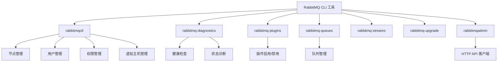

#### CLI 工具说明

| 工具 | 用途 |
|------|------|
| `rabbitmqctl` | 服务管理、用户权限、集群管理 |
| `rabbitmq-diagnostics` | 健康检查、状态诊断 |
| `rabbitmq-plugins` | 插件管理 |
| `rabbitmq-queues` | 仲裁队列副本管理 |
| `rabbitmq-streams` | Stream 副本管理 |
| `rabbitmq-upgrade` | 升级相关操作 |
| `rabbitmqadmin` | HTTP API 命令行客户端 |

#### Erlang Cookie 认证

CLI 工具使用共享密钥（Erlang Cookie）与节点通信。

| 平台 | Cookie 位置 |
|------|-------------|
| Linux | `/var/lib/rabbitmq/.erlang.cookie` |
| macOS | `$HOME/.erlang.cookie` |
| Windows | `%USERPROFILE%\.erlang.cookie` |

```bash
# 查看 Cookie 信息
rabbitmq-diagnostics erlang_cookie_sources
```

#### 常用命令

```bash
# 节点状态
rabbitmq-diagnostics status

# 集群状态
rabbitmqctl cluster_status

# 停止节点
rabbitmqctl shutdown

# 连接远程节点
rabbitmqctl -n rabbit@remote-host status
```

---

### 3.2 配置详解

#### 配置文件类型

| 文件 | 格式 | 用途 |
|------|------|------|
| `rabbitmq.conf` | ini (sysctl) | 主配置文件 |
| `advanced.config` | Erlang | 高级配置 |
| `rabbitmq-env.conf` | shell | 环境变量 |

#### 配置文件位置

| 平台 | 路径 |
|------|------|
| Linux (deb/rpm) | `/etc/rabbitmq/` |
| Generic Unix | `$RABBITMQ_HOME/etc/rabbitmq/` |
| Windows | `%APPDATA%\RabbitMQ\` |
| macOS (Homebrew) | `/opt/homebrew/etc/rabbitmq/` |

#### 查找配置文件

```bash
# 通过 CLI 查看配置路径
rabbitmq-diagnostics status

# 查看有效配置
rabbitmq-diagnostics environment
```

#### rabbitmq.conf 示例

```ini
# 监听端口
listeners.tcp.default = 5672

# TLS 配置
listeners.ssl.default = 5671
ssl_options.cacertfile = /path/to/ca.pem
ssl_options.certfile = /path/to/cert.pem
ssl_options.keyfile = /path/to/key.pem

# 内存阈值
vm_memory_high_watermark.relative = 0.6

# 磁盘阈值
disk_free_limit.absolute = 2GB

# 默认用户（仅首次启动有效）
default_user = admin
default_pass = secret

# 日志
log.console = true
log.console.level = info
log.file.level = debug
```

#### 环境变量插值

```ini
# 使用环境变量
default_user = ${RABBITMQ_DEFAULT_USER}
default_pass = ${RABBITMQ_DEFAULT_PASS}

# 部分值插值
cluster_name = ${REGION}-cluster
```

---

### 3.3 文件与目录位置

#### 关键目录

| 环境变量 | Linux 默认值 | 用途 |
|----------|--------------|------|
| `RABBITMQ_MNESIA_DIR` | `/var/lib/rabbitmq/mnesia` | 数据目录 |
| `RABBITMQ_LOG_BASE` | `/var/log/rabbitmq` | 日志目录 |
| `RABBITMQ_PLUGINS_DIR` | `/usr/lib/rabbitmq/plugins` | 插件目录 |
| `RABBITMQ_CONFIG_FILE` | `/etc/rabbitmq/rabbitmq` | 配置文件 |

#### 数据目录迁移

```bash
# 停止服务前备份
rabbitmqctl stop_app

# 设置新的数据目录
export RABBITMQ_MNESIA_DIR=/new/path/mnesia

# 重启服务
rabbitmq-server -detached
```

---

### 3.4 日志配置

#### 日志输出方式

| 输出 | 配置键 | 说明 |
|------|--------|------|
| 文件 | `log.file` | 默认启用 |
| 控制台 | `log.console` | 容器环境常用 |
| Syslog | `log.syslog` | 集中日志管理 |

#### 日志级别

| 级别 | 说明 |
|------|------|
| `debug` | 最详细 |
| `info` | 默认 |
| `warning` | 警告 |
| `error` | 错误 |
| `critical` | 严重 |
| `none` | 禁用 |

#### 配置示例

```ini
# 文件日志
log.file = /var/log/rabbitmq/rabbit.log
log.file.level = info

# 控制台日志（容器）
log.console = true
log.console.level = info
log.file = false

# JSON 格式
log.file.formatter = json

# 日志轮转
log.file.rotation.size = 10485760
log.file.rotation.count = 5
```

#### 运行时调整日志级别

```bash
# 设置为 debug
rabbitmqctl set_log_level debug

# 恢复为 info
rabbitmqctl set_log_level info

# 跟踪日志
rabbitmq-diagnostics log_tail -n rabbit@localhost -N 100
```

---

### 3.5 虚拟主机

#### 概念

```mermaid
graph TD
    RMQ[RabbitMQ] --> VH1[/vhost1]
    RMQ --> VH2[/vhost2]
    RMQ --> VH3[/production]
    
    VH1 --> E1[Exchanges]
    VH1 --> Q1[Queues]
    VH1 --> U1[Users/Permissions]
    
    VH2 --> E2[Exchanges]
    VH2 --> Q2[Queues]
    VH2 --> U2[Users/Permissions]
```

> 虚拟主机提供逻辑隔离，每个 vhost 拥有独立的队列、交换机、绑定和权限。

#### 管理命令

```bash
# 创建虚拟主机
rabbitmqctl add_vhost qa1

# 带元数据创建
rabbitmqctl add_vhost qa1 --description "QA环境" --default-queue-type quorum

# 列出虚拟主机
rabbitmqctl list_vhosts name description tags default_queue_type

# 删除虚拟主机
rabbitmqctl delete_vhost qa1
```

#### 默认队列类型

```bash
# 设置默认队列类型为仲裁队列
rabbitmqctl update_vhost_metadata qa1 --default-queue-type quorum
```

#### 删除保护

```bash
# 启用删除保护
rabbitmqctl set_vhost_deletion_protection qa1 true

# 禁用删除保护
rabbitmqctl set_vhost_deletion_protection qa1 false
```

#### 资源限制

```bash
# 限制最大连接数
rabbitmqctl set_vhost_limits -p qa1 '{"max-connections": 100}'

# 限制最大队列数
rabbitmqctl set_vhost_limits -p qa1 '{"max-queues": 500}'

# 查看限制
rabbitmqctl list_vhost_limits

# 清除限制
rabbitmqctl clear_vhost_limits -p qa1
```

---

### 3.6 用户与权限

#### 权限模型

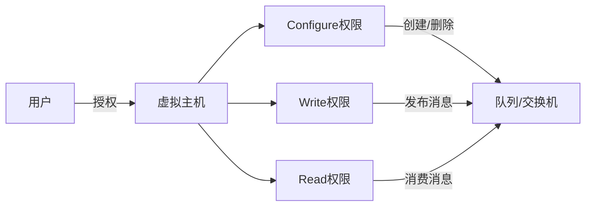

#### 用户管理

```bash
# 添加用户
rabbitmqctl add_user admin 'P@ssw0rd!'

# 使用预哈希密码
rabbitmqctl add_user --pre-hashed-password admin '$(rabbitmqctl hash_password "P@ssw0rd!")'

# 修改密码
rabbitmqctl change_password admin 'NewP@ss!'

# 删除用户
rabbitmqctl delete_user admin

# 列出用户
rabbitmqctl list_users
```

#### 权限管理

```bash
# 授予完全权限（configure, write, read）
rabbitmqctl set_permissions -p /production admin ".*" ".*" ".*"

# 只读权限
rabbitmqctl set_permissions -p /production reader "^$" "^$" ".*"

# 只写权限
rabbitmqctl set_permissions -p /production writer "^$" ".*" "^$"

# 撤销权限
rabbitmqctl clear_permissions -p /production admin

# 列出权限
rabbitmqctl list_permissions -p /production
rabbitmqctl list_user_permissions admin
```

#### 用户标签

| 标签 | Management UI 权限 |
|------|-------------------|
| `(无)` | 无法访问 |
| `management` | 查看自己的 vhost 资源 |
| `policymaker` | management + 策略管理 |
| `monitoring` | management + 所有节点统计 |
| `administrator` | 全部权限 |

```bash
# 设置标签
rabbitmqctl set_user_tags admin administrator

# 设置多个标签
rabbitmqctl set_user_tags viewer monitoring management
```

#### 用户限制

```bash
# 限制最大连接数
rabbitmqctl set_user_limits admin '{"max-connections": 10}'

# 限制最大通道数
rabbitmqctl set_user_limits admin '{"max-channels": 20}'

# 查看限制
rabbitmqctl list_user_limits admin

# 清除限制
rabbitmqctl clear_user_limits admin
```

---

### 3.7 身份验证机制

#### 认证后端

| 后端 | 说明 |
|------|------|
| `internal` | 内置数据库（默认） |
| `ldap` | LDAP/AD 认证 |
| `http` | HTTP API 认证 |
| `oauth2` | OAuth 2.0/JWT 认证 |

#### 配置多个后端

```ini
# 先尝试 LDAP，失败后回退到内部
auth_backends.1 = ldap
auth_backends.2 = internal
```

#### 混合身份验证与授权

```ini
# LDAP 认证 + 内部授权
auth_backends.1.authn = ldap
auth_backends.1.authz = internal
```

#### Guest 用户限制

```ini
# 默认：guest 只能从 localhost 连接
loopback_users.guest = true

# 允许远程连接（不推荐用于生产）
loopback_users = none
```

#### TLS 证书认证

```bash
# 启用 EXTERNAL 机制
rabbitmq-plugins enable rabbitmq_auth_mechanism_ssl
```

```ini
# 配置认证机制
auth_mechanisms.1 = EXTERNAL
auth_mechanisms.2 = PLAIN
```

---

### 3.8 密码与凭据

#### 密码哈希算法

```ini
# 使用 SHA-512（默认 SHA-256）
password_hashing_module = rabbit_password_hashing_sha512
```

#### 密码复杂度验证

```ini
# 最小长度验证
credential_validator.validation_backend = rabbit_credential_validator_min_password_length
credential_validator.min_length = 12

# 正则验证
credential_validator.validation_backend = rabbit_credential_validator_password_regexp
credential_validator.regexp = ^[a-zA-Z0-9]{12,}$
```

#### 计算密码哈希

```bash
# 使用 CLI
rabbitmqctl hash_password 'mypassword'

# 使用 HTTP API
curl -su guest:guest GET localhost:15672/api/auth/hash_password/mypassword
```

#### 无密码用户（证书认证）

```bash
# 创建用户后清除密码
rabbitmqctl add_user certuser temppass
rabbitmqctl clear_password certuser
```

---

### 3.9 权限示例

#### 常见场景

```bash
# 应用用户：只能操作特定前缀的队列
rabbitmqctl set_permissions -p /app appuser \
  "^app\." \    # configure: 只能创建 app.* 队列
  "^app\." \    # write: 只能发布到 app.* 
  "^app\."      # read: 只能消费 app.* 队列

# 监控用户：只读权限
rabbitmqctl set_permissions -p / monitoring \
  '^$' \        # configure: 无
  '^$' \        # write: 无
  '.*'          # read: 可读所有

# 管理员：完全权限
rabbitmqctl set_permissions -p / admin '.*' '.*' '.*'
```

#### 定义预配置（启动时导入）

```json
{
  "users": [
    {
      "name": "admin",
      "password_hash": "...",
      "tags": ["administrator"]
    }
  ],
  "vhosts": [
    {"name": "/"},
    {"name": "production"}
  ],
  "permissions": [
    {
      "user": "admin",
      "vhost": "/",
      "configure": ".*",
      "write": ".*",
      "read": ".*"
    }
  ]
}
```

```ini
# 配置启动时加载定义
load_definitions = /path/to/definitions.json
```

---

### 3.10 集群架构

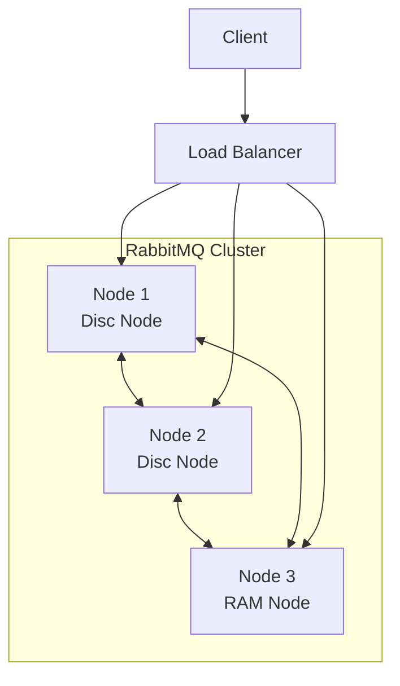

<!-- 待填充内容 -->

---

### 3.11 策略 (Policies)

#### 策略概念

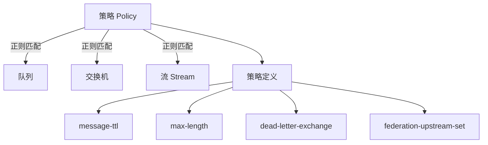

> 策略是动态配置队列/交换机可选参数的声明式机制，无需重新声明资源。

#### 策略属性

| 属性 | 说明 |
|------|------|
| `name` | 策略名称 |
| `pattern` | 正则表达式匹配队列/交换机名称 |
| `definition` | 键值对，注入到匹配资源的参数 |
| `priority` | 优先级，数值越大优先级越高 |
| `apply-to` | 应用目标：`queues`/`exchanges`/`all` |

#### 创建策略

```bash
# 设置 TTL 策略
rabbitmqctl set_policy ttl-policy \
  "^ttl\." '{"message-ttl": 60000}' \
  --priority 1 \
  --apply-to queues

# 设置死信策略
rabbitmqctl set_policy dlx-policy \
  "^dlx\." '{"dead-letter-exchange": "dlx.exchange"}' \
  --priority 2 \
  --apply-to queues

# 组合策略（TTL + 队列长度限制）
rabbitmqctl set_policy combined-policy \
  "^my\." '{"message-ttl": 300000, "max-length": 10000}' \
  --priority 1 \
  --apply-to queues
```

#### apply-to 选项

| 值 | 说明 |
|----|------|
| `queues` | 所有队列类型（含流） |
| `classic_queues` | 仅经典队列 |
| `quorum_queues` | 仅仲裁队列 |
| `streams` | 仅流 |
| `exchanges` | 仅交换机 |
| `all` | 所有（默认） |

#### 删除策略

```bash
rabbitmqctl clear_policy ttl-policy
```

#### 列出策略

```bash
rabbitmqctl list_policies -p /
```

---

### 3.12 运营商策略

#### 运营商策略 vs 普通策略

| 特性 | 普通策略 | 运营商策略 |
|------|----------|------------|
| 管理者 | 应用开发 | 平台运维 |
| 用途 | 业务配置 | 资源限制/护栏 |
| 优先级 | 低 | 高（覆盖普通策略） |
| 支持参数 | 全部 | 有限（TTL/长度限制等） |

#### 运营商策略支持的参数

| 参数 | 经典队列 | 仲裁队列 | 流 |
|------|:--------:|:--------:|:--:|
| `max-length` | ✓ | ✓ | |
| `max-length-bytes` | ✓ | ✓ | ✓ |
| `message-ttl` | ✓ | ✓ | |
| `expires` | ✓ | ✓ | |
| `delivery-limit` | | ✓ | |

#### 创建运营商策略

```bash
# 设置队列过期时间限制
rabbitmqctl set_operator_policy queue-ttl \
  ".*" '{"expires": 3600000}' \
  --priority 0 \
  --apply-to queues

# 设置队列长度上限
rabbitmqctl set_operator_policy max-length-limit \
  ".*" '{"max-length": 100000, "max-length-bytes": 104857600}' \
  --priority 0 \
  --apply-to queues
```

#### 冲突解决

当运营商策略与普通策略冲突时，取**更保守**的值：

```
运营商策略: max-length = 50
普通策略:   max-length = 100
生效值:     max-length = 50  # 取小值

运营商策略: max-length = 50
普通策略:   max-length = 20
生效值:     max-length = 20  # 取小值
```

---

### 3.13 运行时参数

#### 参数类型

| 类型 | 作用域 | 示例 |
|------|--------|------|
| vhost 参数 | 虚拟主机 | Federation upstream、Shovel |
| 全局参数 | 集群 | 集群名称、集群标签 |

#### vhost 参数管理

```bash
# 设置参数
rabbitmqctl set_parameter -p / federation-upstream my-upstream \
  '{"uri":"amqp://remote-host"}'

# 列出参数
rabbitmqctl list_parameters -p /

# 清除参数
rabbitmqctl clear_parameter -p / federation-upstream my-upstream
```

#### 全局参数管理

```bash
# 设置集群名称
rabbitmqctl set_cluster_name my-cluster

# 设置集群标签
rabbitmqctl set_global_parameter cluster_tags \
  '{"region":"us-east-1","env":"production"}'

# 列出全局参数
rabbitmqctl list_global_parameters
```

#### 配置文件预设集群标签

```ini
cluster_tags.region = us-east-1
cluster_tags.environment = production
cluster_tags.owner = platform-team
```

---

### 3.14 定义导入导出

#### 定义内容

| 内容 | 说明 |
|------|------|
| 用户 | 用户名、密码哈希、标签 |
| vhost | 虚拟主机名称、元数据 |
| 权限 | 用户权限 |
| 拓扑 | 队列、交换机、绑定 |
| 策略 | 普通策略、运营商策略 |
| 参数 | 运行时参数 |

#### 导出定义

```bash
# 导出到文件
rabbitmqctl export_definitions /path/to/definitions.json

# 使用 rabbitmqadmin
rabbitmqadmin definitions export /path/to/definitions.json

# 使用 HTTP API
curl -u guest:guest http://localhost:15672/api/definitions > definitions.json
```

#### 导入定义

```bash
# 从文件导入
rabbitmqctl import_definitions /path/to/definitions.json

# 使用 rabbitmqadmin
rabbitmqadmin definitions import /path/to/definitions.json
```

#### 启动时导入定义

```ini
# 从本地文件导入
definitions.local.path = /etc/rabbitmq/definitions.json

# 从 HTTPS URL 导入
definitions.import_backend = https
definitions.https.url = https://config-server/definitions.json

# 仅在内容变化时导入
definitions.skip_if_unchanged = true
```

#### 定义文件示例

```json
{
  "rabbit_version": "4.0.0",
  "vhosts": [
    {"name": "/"},
    {"name": "production"}
  ],
  "users": [
    {
      "name": "admin",
      "password_hash": "...",
      "hashing_algorithm": "rabbit_password_hashing_sha256",
      "tags": ["administrator"]
    }
  ],
  "permissions": [
    {
      "user": "admin",
      "vhost": "/",
      "configure": ".*",
      "write": ".*",
      "read": ".*"
    }
  ],
  "queues": [
    {
      "name": "my-queue",
      "vhost": "/",
      "durable": true,
      "auto_delete": false,
      "arguments": {"x-queue-type": "quorum"}
    }
  ],
  "exchanges": [
    {
      "name": "my-exchange",
      "vhost": "/",
      "type": "topic",
      "durable": true
    }
  ],
  "bindings": [
    {
      "source": "my-exchange",
      "vhost": "/",
      "destination": "my-queue",
      "destination_type": "queue",
      "routing_key": "my.#"
    }
  ]
}
```

---

### 3.15 元数据存储

#### 元数据存储内容

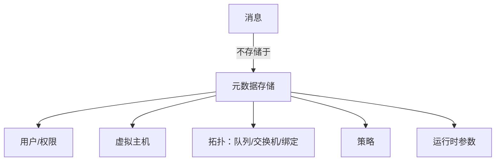

#### 后端对比

| 特性 | Mnesia | Khepri |
|------|--------|--------|
| 引入版本 | 原始 | 4.0+ |
| 算法 | 分布式数据库 | Raft 共识 |
| 网络分区 | 需配置恢复策略 | 自动处理 |
| 推荐 | 已弃用 | 推荐 |

#### Khepri 特点

- 基于 **Raft 共识算法**
- 与仲裁队列、流使用相同算法
- 网络分区处理更加确定性
- 需要多数节点在线才能写入

---

### 3.16 启用 Khepri

#### 检查当前后端

```bash
rabbitmq-diagnostics metadata_store_status
```

#### 启用 Khepri

```bash
# 方式1：启用功能标志
rabbitmqctl enable_feature_flag khepri_db

# 方式2：启动时通过环境变量
RABBITMQ_FEATURE_FLAGS="+khepri_db" rabbitmq-server
```

#### 启用条件

- **所有集群节点在线**
- **集群处于健康状态**
- **建议在非高峰时段执行**

#### 迁移过程

1. 同步集群成员到 Khepri
2. 复制 Mnesia 数据到 Khepri
3. 将 Mnesia 表标记为只读
4. 完成剩余数据迁移
5. 切换到 Khepri

#### 回滚

> ⚠️ 一旦启用 Khepri，**无法回退到 Mnesia**

如需回退，使用蓝绿部署迁移到新集群。

---

### 3.17 Khepri 运维注意事项

#### 一致性模型

| 场景 | Mnesia | Khepri |
|------|--------|--------|
| 声明确认 | 所有节点提交 | 多数节点提交 |
| 可见性 | 立即全局可见 | 可能有短暂延迟 |

#### 影响场景

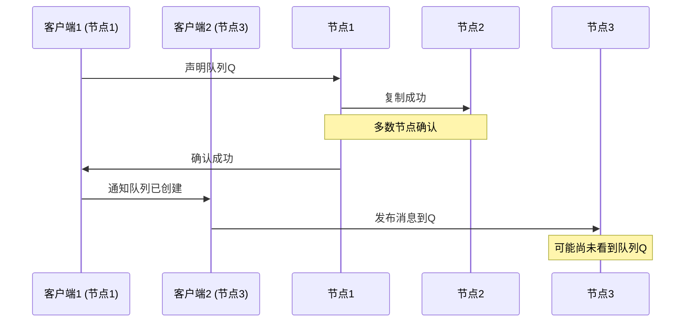

#### 变通策略

1. **注入短暂暂停**：声明后等待 1-2 秒
2. **使用静态拓扑**：避免动态声明
3. **连接同一节点**：多连接使用同一节点

#### 少数派节点行为

- 元数据写入操作（声明队列等）会**超时**
- 与 Mnesia 的 `pause_minority` 策略类似
- 客户端收到错误，可稍后重试

#### 故障恢复

1. 领导者故障时自动选举新领导者
2. 恢复节点自动同步变更
3. 对应用程序透明

---

### 3.18 Khepri 已知问题

| 问题 | 说明 |
|------|------|
| 批量删除较慢 | 大量实体删除性能不如 Mnesia |
| 超时处理 | 少数派节点写操作可能超时 |
| 数据丢失恢复 | 节点数据永久丢失后难以重新加入 |

#### 最佳实践

- 在非高峰时段启用 Khepri
- 确保集群健康再执行迁移
- 测试工作负载与 Khepri 兼容性
- 监控 Raft 领导者状态

---

### 3.19 网络配置

#### 端口列表

| 端口 | 协议 | 用途 |
|------|------|------|
| 4369 | EPMD | 节点发现服务 |
| 5672 | AMQP | 客户端连接（非TLS） |
| 5671 | AMQPS | 客户端连接（TLS） |
| 5552 | Stream | Stream协议（非TLS） |
| 5551 | Stream | Stream协议（TLS） |
| 6000-6500 | Stream | Stream 复制 |
| 15672 | HTTP | Management UI |
| 15671 | HTTPS | Management UI (TLS) |
| 15692 | Prometheus | 指标端点 |
| 25672 | Clustering | 节点间通信 |
| 35672-35682 | CLI | CLI 工具连接 |
| 1883 | MQTT | MQTT（非TLS） |
| 8883 | MQTTS | MQTT（TLS） |
| 61613 | STOMP | STOMP（非TLS） |

#### 网络接口配置

```ini
# 监听所有接口
listeners.tcp.default = 5672

# 监听特定接口
listeners.tcp.1 = 192.168.1.99:5672

# 仅 IPv6
listeners.tcp.1 = :::5672

# 双栈（IPv4 + IPv6）
listeners.tcp.1 = 127.0.0.1:5672
listeners.tcp.2 = ::1:5672
```

#### 禁用非 TLS 连接

```ini
listeners.tcp = none
listeners.ssl.default = 5671
```

---

### 3.20 TLS/SSL 配置

#### TLS 配置架构

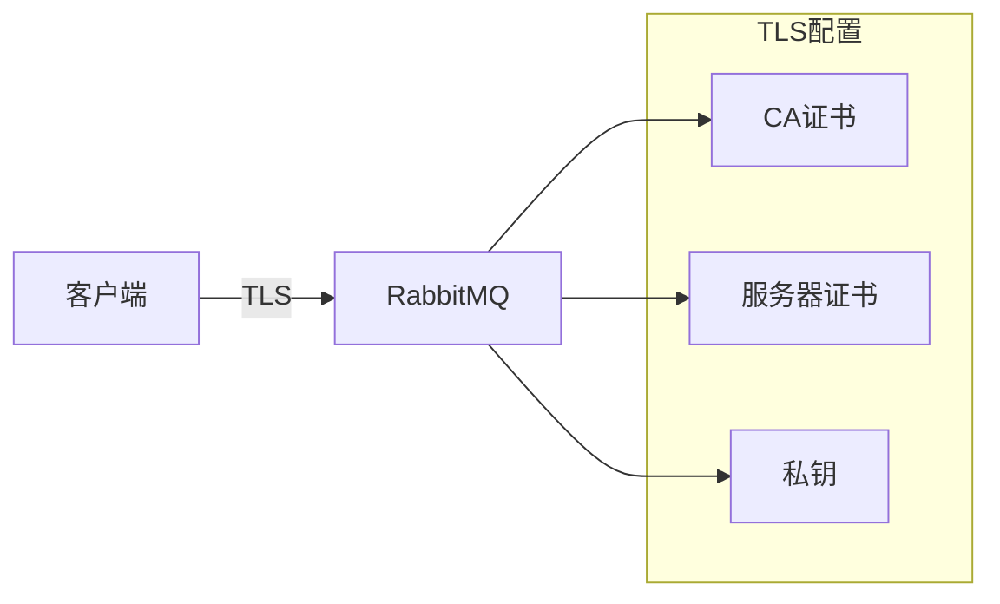

#### 基本 TLS 配置

```ini
listeners.ssl.default = 5671

ssl_options.cacertfile = /path/to/ca_certificate.pem
ssl_options.certfile = /path/to/server_certificate.pem
ssl_options.keyfile = /path/to/server_key.pem

# 对等方验证
ssl_options.verify = verify_peer
ssl_options.fail_if_no_peer_cert = true

# 私钥密码（可选）
ssl_options.password = secret
```

#### TLS 版本控制

```ini
# 仅启用 TLS 1.2 和 1.3
ssl_options.versions.1 = tlsv1.3
ssl_options.versions.2 = tlsv1.2
```

#### 密码套件配置

```ini
# TLSv1.3 密码套件
ssl_options.ciphers.1 = TLS_AES_256_GCM_SHA384
ssl_options.ciphers.2 = TLS_AES_128_GCM_SHA256
ssl_options.ciphers.3 = TLS_CHACHA20_POLY1305_SHA256

# TLSv1.2 密码套件
ssl_options.ciphers.4 = ECDHE-ECDSA-AES256-GCM-SHA384
ssl_options.ciphers.5 = ECDHE-RSA-AES256-GCM-SHA384
```

#### 证书对等方验证

| 配置 | 说明 |
|------|------|
| `verify = verify_peer` | 启用对等方验证 |
| `verify = verify_none` | 禁用验证 |
| `fail_if_no_peer_cert = true` | 客户端必须提供证书 |
| `depth = 2` | 证书链验证深度 |

---

### 3.21 使用 tls-gen 生成证书

```bash
# 克隆 tls-gen
git clone https://github.com/rabbitmq/tls-gen tls-gen
cd tls-gen/basic

# 生成证书
make PASSWORD=bunnies
make verify
make info

# 查看生成的文件
ls -l ./result
# ca_certificate.pem      - CA 证书
# server_certificate.pem  - 服务器证书
# server_key.pem          - 服务器私钥
# client_certificate.pem  - 客户端证书
# client_key.pem          - 客户端私钥
```

---

### 3.22 节点间通信

#### EPMD 配置

```bash
# 限制 EPMD 监听接口
export ERL_EPMD_ADDRESS=192.168.1.99

# 修改 EPMD 端口
export ERL_EPMD_PORT=4370
```

#### 节点间通信端口

```ini
# 自定义分发端口范围
inet_dist_listen_min = 35672
inet_dist_listen_max = 35672
```

#### IPv6 节点间通信

```bash
# 启用 IPv6 节点间通信
export RABBITMQ_SERVER_ADDITIONAL_ERL_ARGS="-proto_dist inet6_tcp"
```

---

### 3.23 网络滴答时间 (Net Tick)

#### 概念

节点间定期交换"滴答"消息检测连接状态，类似心跳机制。

#### 配置

```erlang
% advanced.config
[
  {kernel, [{net_ticktime, 120}]}
].
```

#### 影响

| net_ticktime | 故障检测 | 风险 |
|--------------|----------|------|
| 增大（如120s） | 更慢 | 对短暂网络中断更宽容 |
| 减小（如30s） | 更快 | 可能产生误报分区 |

> 默认值 60 秒，修改需集群所有节点一致。

---

### 3.24 代理协议

#### 启用代理协议

```ini
# AMQP
proxy_protocol = true

# MQTT
mqtt.proxy_protocol = true

# STOMP
stomp.proxy_protocol = true
```

#### 用途

- 在代理/负载均衡器后获取真实客户端 IP
- 支持 HAProxy、AWS ELB 等

> ⚠️ 启用后客户端必须通过支持代理协议的代理连接

---

### 3.25 网络调优

#### TCP 缓冲区大小

```ini
# 提高吞吐量（增加 RAM 使用）
tcp_listen_options.sndbuf = 196608
tcp_listen_options.recbuf = 196608

# 降低 RAM 使用（降低吞吐量）
tcp_listen_options.sndbuf = 32768
tcp_listen_options.recbuf = 32768
```

#### 连接积压

```ini
# 处理连接突发
tcp_listen_options.backlog = 4096
```

#### 禁用 Nagle 算法

```ini
tcp_listen_options.nodelay = true
```

#### 内核参数调优

```bash
# 增加文件描述符限制
sysctl -w fs.file-max=200000

# TCP 连接相关
sysctl -w net.core.somaxconn=4096
sysctl -w net.ipv4.tcp_max_syn_backlog=8192
sysctl -w net.ipv4.tcp_fin_timeout=15

# TIME_WAIT 重用
sysctl -w net.ipv4.tcp_tw_reuse=1
```

---

### 3.26 网络故障排查

#### 检查监听器

```bash
rabbitmq-diagnostics listeners

# 输出示例
# Interface: [::], port: 5672, protocol: amqp
# Interface: [::], port: 5671, protocol: amqp/ssl
# Interface: [::], port: 15672, protocol: http
```

#### 检查端口

```bash
# 检查端口监听
sudo lsof -n -i4TCP:5672 | grep LISTEN

# 使用 ss
sudo ss --tcp -f inet --listening --numeric --processes

# TCP 连接状态
netstat --all --numeric --tcp --programs
```

#### 测试连接

```bash
# 使用 telnet
telnet localhost 5672

# 测试 TLS 连接
openssl s_client -connect localhost:5671 -tls1_2
```

#### TLS 故障排查

```bash
# 验证 TLS 支持
rabbitmq-diagnostics tls_versions

# 列出密码套件
rabbitmq-diagnostics cipher_suites --format openssl --silent

# 使用 OpenSSL 测试
openssl s_client -connect localhost:5671 \
  -cert client_cert.pem -key client_key.pem \
  -CAfile ca_cert.pem
```

#### 常见 TLS 错误

| 错误 | 原因 |
|------|------|
| `Unknown CA` | CA 证书不在信任链中 |
| `Certificate Expired` | 证书已过期 |
| `ekeyfile/ecertfile` | 密钥或证书文件无效 |
| `bad record mac` | 网络问题或客户端 TLS 实现错误 |

---

### 3.27 集群基础

#### 集群架构

```mermaid
graph TD
    subgraph 集群
        N1[节点1<br/>rabbit@node1]
        N2[节点2<br/>rabbit@node2]
        N3[节点3<br/>rabbit@node3]
    end
    
    N1 <-->|Erlang分布| N2
    N2 <-->|Erlang分布| N3
    N1 <-->|Erlang分布| N3
    
    C[客户端] --> N1
    C --> N2
    C --> N3
```

#### 集群中复制的内容

| 内容 | 复制 | 说明 |
|------|------|------|
| 用户、虚拟主机、权限 | ✅ | 所有节点共享 |
| 队列、交换机、绑定 | ✅ | 元数据复制 |
| 运行时参数、策略 | ✅ | 所有节点共享 |
| 消息 | ❌/✅ | 仲裁队列复制，经典队列不复制 |

#### 节点名称

```bash
# 短名称（同一域内）
rabbit@hostname1

# 长名称（FQDN）
rabbit@node1.messaging.svc.local

# 启用长名称
export RABBITMQ_USE_LONGNAME=true
```

#### 集群端口

| 端口 | 用途 |
|------|------|
| 4369 | EPMD 节点发现 |
| 25672 | 节点间通信 |
| 35672-35682 | CLI 工具 |
| 6000-6500 | Stream 复制 |

---

### 3.28 集群形成

#### 节点发现机制

| 机制 | 配置 Backend | 说明 |
|------|--------------|------|
| 配置文件 | `classic_config` | 预定义节点列表 |
| DNS | `dns` | 通过 DNS A/AAAA 记录 |
| Kubernetes | `k8s` | Kubernetes API |
| AWS | `aws` | EC2 实例标签/ASG |
| Consul | `consul` | HashiCorp Consul |
| etcd | `etcd` | 分布式 KV 存储 |

#### 配置文件发现

```ini
cluster_formation.peer_discovery_backend = classic_config
cluster_formation.classic_config.nodes.1 = rabbit@node1
cluster_formation.classic_config.nodes.2 = rabbit@node2
cluster_formation.classic_config.nodes.3 = rabbit@node3
```

#### DNS 发现

```ini
cluster_formation.peer_discovery_backend = dns
cluster_formation.dns.hostname = discovery.rabbitmq.local
```

#### Kubernetes 发现

```ini
cluster_formation.peer_discovery_backend = k8s
# 4.1+ 默认使用最低序数索引节点作为种子
```

#### 手动加入集群

```bash
# 在 rabbit@node2 上
rabbitmqctl stop_app
rabbitmqctl join_cluster rabbit@node1
rabbitmqctl start_app

# 检查集群状态
rabbitmqctl cluster_status
```

---

### 3.29 Erlang Cookie

#### 概念

节点间通信的共享密钥，所有集群节点必须相同。

#### Cookie 文件位置

| 平台 | 位置 |
|------|------|
| Linux | `/var/lib/rabbitmq/.erlang.cookie` |
| macOS | `$HOME/.erlang.cookie` |
| Windows | `C:\Users\%USERNAME%\.erlang.cookie` |
| Docker | `RABBITMQ_ERLANG_COOKIE` 环境变量 |

#### 检查 Cookie 信息

```bash
rabbitmq-diagnostics erlang_cookie_sources
```

#### Cookie 不匹配错误

```text
* TCP connection succeeded but Erlang distribution failed
* suggestion: is the cookie set correctly?
```

---

### 3.30 网络分区处理

#### 检测分区

```bash
rabbitmq-diagnostics cluster_status

# 分区示例输出
# Network Partitions
# Node flopsy@warp10 cannot communicate with hare@warp10
```

#### 分区处理策略

| 策略 | 配置值 | 行为 |
|------|--------|------|
| Ignore | `ignore` | 默认，不自动处理 |
| Pause Minority | `pause_minority` | 暂停少数派节点 |
| Pause If All Down | `pause_if_all_down` | 指定节点全宕机才暂停 |
| Autoheal | `autoheal` | 自动恢复，重启非获胜分区 |

#### 配置分区处理

```ini
# Pause Minority（推荐3+节点）
cluster_partition_handling = pause_minority

# Autoheal
cluster_partition_handling = autoheal

# Pause If All Down
cluster_partition_handling = pause_if_all_down
cluster_partition_handling.pause_if_all_down.recover = autoheal
cluster_partition_handling.pause_if_all_down.nodes.1 = rabbit@node1
cluster_partition_handling.pause_if_all_down.nodes.2 = rabbit@node2
```

#### 策略选择

| 场景 | 推荐策略 |
|------|----------|
| 高可用网络（单机架） | `ignore` |
| 跨可用区（3+节点） | `pause_minority` |
| 重视服务连续性 | `autoheal` |

> ⚠️ 双节点集群不应使用 `pause_minority`，任何故障都会暂停所有节点

---

### 3.31 集群节点管理

#### 节点数量建议

- 使用**奇数个节点**（3, 5, 7）
- **强烈不建议双节点集群**（无法达成共识）
- 4节点与3节点可用性相同

#### 移除节点

```bash
# 方法1：在目标节点执行
rabbitmqctl stop_app
rabbitmqctl reset
rabbitmqctl start_app

# 方法2：从集群其他节点移除
rabbitmqctl forget_cluster_node rabbit@nodeX
```

#### 重置节点

```bash
# 停止应用
rabbitmqctl stop_app
# 重置（删除所有数据）
rabbitmqctl reset
# 重新启动
rabbitmqctl start_app
```

#### 强制启动节点

```bash
# 对等节点不可用时强制启动
rabbitmqctl force_boot
rabbitmq-server -detached
```

#### 队列领导者放置

```ini
# 均衡分布（推荐）
queue_leader_locator = balanced

# 客户端本地
queue_leader_locator = client-local
```

---

### 3.32 集群 TLS 配置

#### 节点间 TLS 配置文件

```erlang
% /etc/rabbitmq/inter_node_tls.config
[
  {server, [
    {cacertfile, "/path/to/ca_certificate.pem"},
    {certfile, "/path/to/server_certificate.pem"},
    {keyfile, "/path/to/server_key.pem"},
    {verify, verify_peer},
    {fail_if_no_peer_cert, true}
  ]},
  {client, [
    {cacertfile, "/path/to/ca_certificate.pem"},
    {certfile, "/path/to/client_certificate.pem"},
    {keyfile, "/path/to/client_key.pem"},
    {verify, verify_peer}
  ]}
].
```

#### 启用节点间 TLS

```bash
# rabbitmq-env.conf
ERL_SSL_PATH="/usr/lib64/erlang/lib/ssl-9.4/ebin"

SERVER_ADDITIONAL_ERL_ARGS="-pa $ERL_SSL_PATH \
  -proto_dist inet_tls \
  -ssl_dist_optfile /etc/rabbitmq/inter_node_tls.config"

RABBITMQ_CTL_ERL_ARGS="-pa $ERL_SSL_PATH \
  -proto_dist inet_tls \
  -ssl_dist_optfile /etc/rabbitmq/inter_node_tls.config"
```

---

### 3.33 EC2 部署注意事项

#### 实例选择

- 使用 64 位实例
- 确保足够内存并启用交换空间
- EBS 卷注意 IOPS 限制

#### 存储配置

```bash
# 数据目录
/var/lib/rabbitmq/

# 日志目录
/var/log/rabbitmq/

# 可创建符号链接到 EBS 卷
```

#### AWS 节点发现

```ini
cluster_formation.peer_discovery_backend = aws
cluster_formation.aws.region = us-east-1
cluster_formation.aws.use_autoscaling_group = true
# 或使用实例标签
cluster_formation.aws.instance_tags.environment = production
cluster_formation.aws.instance_tags.service = rabbitmq
```

---

---

### 3.34 资源限制

#### 资源限制架构


#### 虚拟主机限制

```bash
# 设置最大连接数
rabbitmqctl set_vhost_limits -p "/" '{"max-connections": 256}'

# 设置最大队列数
rabbitmqctl set_vhost_limits -p "/" '{"max-queues": 1024}'

# 清除限制
rabbitmqctl clear_vhost_limits -p "/"
```

#### 用户限制

```bash
# 设置用户最大连接数
rabbitmqctl set_user_limits user1 '{"max-connections": 64}'

# 设置最大通道数
rabbitmqctl set_user_limits user1 '{"max-channels": 10}'

# 清除限制
rabbitmqctl clear_user_limits user1
```

#### 连接限制配置

```ini
# 每连接最大通道数
channel_max = 128

# 握手超时
handshake_timeout = 10000

# TLS 握手超时
ssl_handshake_timeout = 5000

# 心跳间隔
heartbeat = 60

# 每通道最大消费者数
consumer_max_per_channel = 10
```

#### 节点级别限制

```ini
# 最大连接数
connection_max = 10000

# 每节点最大通道数
channel_max_per_node = 50000

# 最大消息大小（默认 128MiB）
max_message_size = 134217728

# 消费者确认超时（30分钟）
consumer_timeout = 1800000
```

#### 队列限制（通过策略）

| 参数 | 说明 |
|------|------|
| `max-length` | 最大消息数 |
| `max-length-bytes` | 最大字节数 |
| `message-ttl` | 消息过期时间 |
| `queue-ttl` | 队列过期时间 |
| `delivery-limit` | 最大投递次数（仲裁队列） |

---

### 3.35 内存管理

#### 内存告警机制

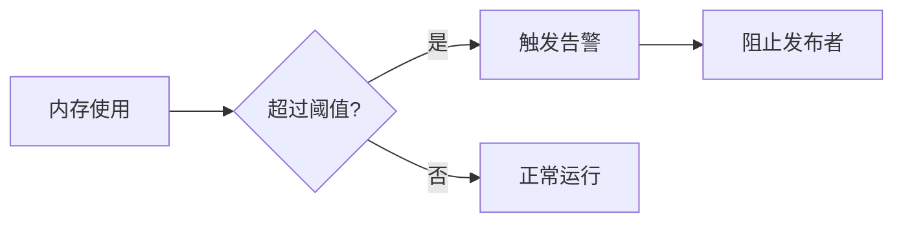

#### 配置内存阈值

```ini
# 相对阈值（默认 60%）
vm_memory_high_watermark.relative = 0.6

# 绝对阈值（推荐容器环境）
vm_memory_high_watermark.absolute = 4GB

# 支持单位
# GB, MB, TB (10的幂)
# Gi, Mi, Ti (2的幂，Kubernetes风格)
```

#### 运行时调整

```bash
# 设置相对阈值
rabbitmqctl set_vm_memory_high_watermark 0.7

# 设置绝对阈值
rabbitmqctl set_vm_memory_high_watermark absolute "4G"
```

#### 内存计算策略

```ini
# RSS 策略（默认Linux）查询进程驻留集大小
vm_memory_calculation_strategy = rss

# Allocated 策略（默认Windows）查询分配器
vm_memory_calculation_strategy = allocated
```

---

### 3.36 内存使用分析

#### 内存细分命令

```bash
# 查看内存使用细分
rabbitmq-diagnostics memory_breakdown

# 使用 rabbitmqadmin
rabbitmqadmin show memory_breakdown_in_bytes --node rabbit@hostname
rabbitmqadmin show memory_breakdown_in_percent --node rabbit@hostname
```

#### 内存分类

| 类别 | 说明 |
|------|------|
| `quorum_queue_procs` | 仲裁队列进程 |
| `binary` | 消息正文和元数据 |
| `allocated_unused` | 已分配未使用 |
| `connection_other` | 连接相关内存 |
| `connection_readers` | TCP读取缓冲区 |
| `connection_writers` | TCP写入缓冲区 |
| `connection_channels` | 通道内存 |
| `plugins` | 插件使用内存 |
| `code` | 字节码和元数据 |
| `mnesia` | 内部数据库 |

#### 强制垃圾回收

```bash
# 强制GC并查看释放最多内存的进程
rabbitmqctl eval 'recon:bin_leak(10).'
rabbitmqctl force_gc
```

#### 内核页面缓存

> ⚠️ Stream 工作负载可能导致大量页面缓存。页面缓存由OS内核管理，不计入RabbitMQ内存使用。

```bash
# 非容器环境检查
cat /proc/meminfo | grep -E "(Cached|Buffers)"

# 容器环境检查
cat /sys/fs/cgroup/memory/memory.stat
```

---

### 3.37 磁盘告警

#### 配置磁盘限制

```ini
# 绝对限制（推荐）
disk_free_limit.absolute = 2GB

# 相对限制（相对于RAM）
disk_free_limit.relative = 1.0
```

#### 工作原理

- 默认限制：50MB
- 检查频率：约每10秒
- 接近限制时：最高 10次/秒
- 触发时：阻止所有发布者
- 集群范围：任一节点触发则全集群阻止

#### 运行时调整

```bash
rabbitmqctl set_disk_free_limit "2GB"

# 或设置相对于内存的比例
rabbitmqctl set_disk_free_limit mem_relative 1.0
```

---

### 3.38 资源告警

#### 告警触发条件

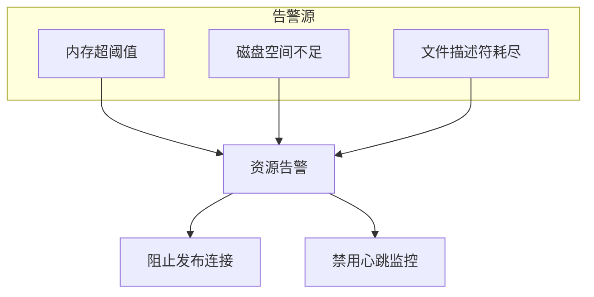

#### 告警行为

| 告警类型 | 触发条件 | 影响 |
|----------|----------|------|
| 内存告警 | 超过 `vm_memory_high_watermark` | 阻止发布者 |
| 磁盘告警 | 低于 `disk_free_limit` | 阻止发布者 |
| 文件描述符 | 接近系统限制 | 拒绝新连接 |

#### 连接状态

| 状态 | 含义 |
|------|------|
| `blocking` | 连接尚未发布，可继续 |
| `blocked` | 连接已发布，已暂停 |

#### 客户端通知

```python
# 客户端可以监听 connection.blocked 通知
# 应用程序应处理发布失败
# 使用发布者确认跟踪消息
```

---

### 3.39 流控制

#### 概念

当发布速度超过队列处理能力时，RabbitMQ 自动降低发布连接速度。

#### 流控状态

- 连接显示 `flow` 状态表示正在被限速
- 通道和队列也可能处于 `flow` 状态
- 对客户端表现为网络带宽降低

#### 检测方法

```bash
# 查看连接状态
rabbitmqctl list_connections pid state

# 查看通道状态
rabbitmqctl list_channels pid connection state

# 查看队列状态
rabbitmqctl list_queues name state
```

#### 流控传播


#### 最佳实践

- 监控 `flow` 状态连接数
- 检查消费者是否跟上发布速度
- 调整预取计数 (`prefetch_count`)
- 增加消费者数量分摊负载

---

### 3.40 备份与恢复

#### 数据类型

| 类型 | 内容 | 存储位置 |
|------|------|----------|
| 定义（元数据） | 用户、vhost、队列、交换机、绑定、策略 | 内部数据库（复制到所有节点） |
| 消息 | 消息正文和状态 | `msg_stores`、`quorum`、`stream` 目录 |

#### 备份定义

```bash
# 导出定义（推荐方式）
rabbitmqctl export_definitions /path/to/definitions.json

# 或通过 HTTP API
curl -u guest:guest http://localhost:15672/api/definitions > definitions.json

# 导入定义
rabbitmqctl import_definitions /path/to/definitions.json
```

#### 备份消息

> ⚠️ 备份消息必须先停止节点

```bash
# 查找数据目录
rabbitmq-diagnostics status | grep -A 2 "Node data directory"

# 停止节点后复制
/var/lib/rabbitmq/mnesia/rabbit@hostname/
├── msg_stores/     # 经典队列消息
├── quorum/         # 仲裁队列消息
└── stream/         # 流消息
```

#### 恢复注意事项

- 必须使用相同的节点名称恢复
- 仲裁队列/流不支持节点重命名
- 恢复消息前先确保定义已存在

---

### 3.41 运行时调优

#### 调度器配置

```bash
# 设置调度器数量（CPU核心数）
export RABBITMQ_SERVER_ADDITIONAL_ERL_ARGS="+S 4:4"

# 禁用推测性忙等待（降低CPU使用）
export RABBITMQ_SERVER_ADDITIONAL_ERL_ARGS="+sbwt none +sbwtdcpu none +sbwtdio none"
```

#### 线程统计

```bash
# 查看线程时间分布
rabbitmq-diagnostics runtime_thread_stats
```

| 状态 | 说明 |
|------|------|
| `emulator` | 代码执行 |
| `port` | I/O 活动 |
| `gc` | 垃圾回收 |
| `sleep` | 休眠/空闲 |

#### 内存分配器

```bash
# 默认分配器参数
RABBITMQ_DEFAULT_ALLOC_ARGS="+MBas ageffcbf +MHas ageffcbf +MBlmbcs 512 +MHlmbcs 512 +MMmcs 30"

# 预分配更大区域减少碎片
export RABBITMQ_SERVER_ADDITIONAL_ERL_ARGS="+MMscs 1024"
```

#### 进程和Atom限制

```bash
# Erlang 进程数量（默认约100万）
export RABBITMQ_MAX_NUMBER_OF_PROCESSES=2000000

# Atom 限制（默认500万）
export RABBITMQ_MAX_NUMBER_OF_ATOMS=10000000
```

#### 节点间通信缓冲区

```bash
# 增大缓冲区（默认128MB，值为KB）
export RABBITMQ_DISTRIBUTION_BUFFER_SIZE=256000
```

---

### 3.42 持久化配置

#### 队列类型存储特性

| 队列类型 | 存储方式 | 可调参数 |
|----------|----------|----------|
| 仲裁队列 | Raft WAL日志 | WAL段大小 |
| 流 | 日志文件 | 无 |
| 经典队列 v2 | 新索引+存储 | 嵌入阈值 |
| 经典队列 v1 | 索引+消息存储 | 嵌入阈值 |

#### 仲裁队列 WAL 配置

```ini
# WAL 文件达到此大小时刷新到磁盘
raft.wal_max_size_bytes = 32000000
```

> 建议分配至少 WAL 大小 3 倍的内存

#### 经典队列版本切换

```ini
# 默认使用 v2（推荐）
classic_queue.default_version = 2
```

#### 消息嵌入队列索引

```ini
# 小于此字节的消息嵌入队列索引（默认 4096）
queue_index_embed_msgs_below = 4096
```

---

### 3.43 生产环境检查清单

#### 最低硬件要求

| 资源 | 最低要求 |
|------|----------|
| CPU | 4 核心 |
| 内存 | 4 GiB |
| 存储 | 持久化 SSD/NVMe |

> ⚠️ RabbitMQ 不应与其他 I/O 密集型服务共置

#### 存储建议

- 使用持久化存储（非瞬态）
- 优先本地 SSD/NVMe over NAS
- 数据目录不得共享
- 避免分布式文件系统

#### 内存配置

```ini
# 内存阈值（推荐 0.4-0.7）
vm_memory_high_watermark.relative = 0.6

# 容器环境使用绝对值
vm_memory_high_watermark.absolute = 4GB
```

#### 磁盘配置

```ini
# 磁盘空间限制（推荐与内存阈值相同）
disk_free_limit.absolute = 4GB
```

#### 文件句柄限制

```bash
# 生产环境至少 50K
# 推荐计算：连接数 × 2 + 队列数
ulimit -n 500000
```

#### 安全检查

- [ ] 删除默认 guest 用户
- [ ] 每个应用使用独立用户
- [ ] 禁用匿名登录
- [ ] 配置 TLS 加密
- [ ] 限制节点间通信端口访问
- [ ] 确保 Erlang Cookie 使用安全值

#### 集群检查

- [ ] 使用奇数节点（3、5、7）
- [ ] 选择分区处理策略
- [ ] 节点时间同步（NTP）
- [ ] 配置队列复制因子

#### 网络带宽估算

```
最小带宽 = 消息速率 × 消息大小 × 110% × 8 bit/B
例：20K msg/s × 6KB × 1.1 × 8 = ~1 Gbps
```

#### 应用程序最佳实践

- 使用长连接而非频繁开关
- 发布者和消费者使用独立连接
- 实现自动重连机制
- 减少不必要的通道使用
- 避免轮询消费（basic.get）

---

## 第四章: 监控 RabbitMQ
### 4.1 监控概述


> 本章介绍 RabbitMQ 的可观测性，包括指标采集、告警配置、调试工具等。


#### 4.1.1 基础设施与内核级指标

对于 RabbitMQ 节点，需要监控的基础设施和操作系统级别指标包括：

| 类别 | 关键指标 |
|------|----------|
| **CPU** | 使用率、iowait、steal（虚拟化环境）|
| **内存** | 可用内存、已用内存、缓存/缓冲区 |
| **磁盘** | 可用空间、IOps、吞吐量、读写延迟 |
| **网络** | 吞吐量、TCP 连接数、打开的文件描述符 |
| **虚拟化** | 虚拟机时间同步状态 |

#### 4.1.2 RabbitMQ 关键指标分类

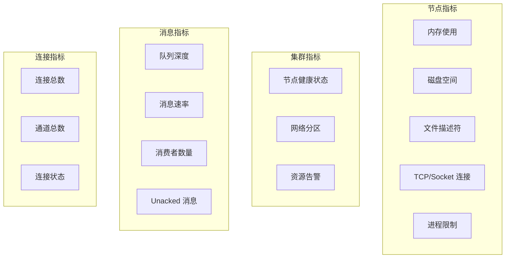

#### 4.1.3 健康检查端点

RabbitMQ 提供多种健康检查端点：

| 端点 | 用途 | 适用场景 |
|------|------|----------|
| `/api/health/checks/alarms` | 检查资源告警 | 基本健康检查 |
| `/api/health/checks/local-alarms` | 检查本地节点告警 | 单节点检查 |
| `/api/health/checks/node-is-quorum-critical` | 检查仲裁队列临界状态 | 节点维护前 |
| `/api/health/checks/port-listener/:port` | 检查端口监听状态 | 协议可用性 |
| `/api/health/checks/virtual-hosts` | 检查所有 vhost | 应用健康检查 |

**CLI 健康检查命令：**

```bash
# 基本检查
rabbitmq-diagnostics check_running
rabbitmq-diagnostics check_local_alarms

# Kubernetes 存活探针推荐
rabbitmq-diagnostics check_port_connectivity

# 就绪探针推荐
rabbitmq-diagnostics check_if_node_is_quorum_critical
```

#### 4.1.4 日志监控

推荐监控的日志事件：

```bash
# 连接错误
connection_closed_with_no_data_received

# 认证失败
rabbit_auth_backend_*

# 集群问题
mnesia_* | inconsistent_cluster

# 资源告警
alarm_set | alarm_cleared
```

---

### 4.2 Prometheus 集成

#### 4.2.1 架构概览

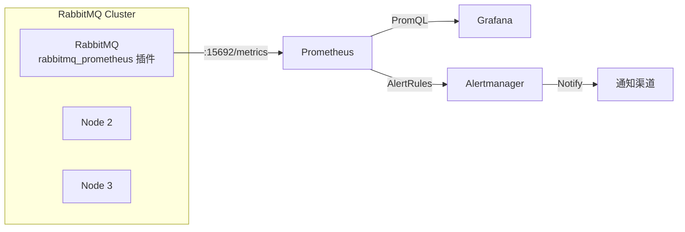

#### 4.2.2 启用 Prometheus 插件

```bash
# 启用插件
rabbitmq-plugins enable rabbitmq_prometheus

# 验证端点
curl -s localhost:15692/metrics | head -20

# 聚合端点（所有节点指标）
curl -s localhost:15692/metrics/cluster
```

#### 4.2.3 Prometheus 抓取配置

```yaml
# prometheus.yml
scrape_configs:
  # 每个节点单独抓取（推荐）
  - job_name: rabbitmq-individual
    static_configs:
      - targets:
          - rabbit1:15692
          - rabbit2:15692
          - rabbit3:15692
    metrics_path: /metrics

  # 或使用聚合端点
  - job_name: rabbitmq-cluster
    static_configs:
      - targets: ['rabbit1:15692']
    metrics_path: /metrics/cluster
```

#### 4.2.4 核心监控指标

**队列指标：**

| 指标名 | 含义 |
|--------|------|
| `rabbitmq_queue_messages` | 队列消息总数 |
| `rabbitmq_queue_messages_ready` | 可投递消息数 |
| `rabbitmq_queue_messages_unacked` | 未确认消息数 |
| `rabbitmq_queue_consumers` | 消费者数量 |
| `rabbitmq_queue_messages_published_total` | 发布消息计数器 |
| `rabbitmq_queue_messages_delivered_total` | 投递消息计数器 |

**连接与通道指标：**

| 指标名 | 含义 |
|--------|------|
| `rabbitmq_connections` | 当前连接数 |
| `rabbitmq_channels` | 当前通道数 |
| `rabbitmq_connection_incoming_bytes_total` | 入站流量 |
| `rabbitmq_connection_outgoing_bytes_total` | 出站流量 |

**节点指标：**

| 指标名 | 含义 |
|--------|------|
| `rabbitmq_process_resident_memory_bytes` | 进程 RSS 内存 |
| `rabbitmq_disk_space_available_bytes` | 可用磁盘空间 |
| `rabbitmq_alarms_memory_used_watermark` | 内存告警状态 |
| `rabbitmq_alarms_free_disk_space_watermark` | 磁盘告警状态 |

#### 4.2.5 常用告警规则

```yaml
groups:
  - name: rabbitmq-alerts
    rules:
      # 队列积压告警
      - alert: RabbitMQQueueBacklog
        expr: rabbitmq_queue_messages > 10000
        for: 5m
        labels:
          severity: warning
        annotations:
          summary: "队列 {{ $labels.queue }} 积压消息超过 10000"

      # 资源告警触发
      - alert: RabbitMQResourceAlarm
        expr: rabbitmq_alarms_memory_used_watermark == 1
        for: 0m
        labels:
          severity: critical
        annotations:
          summary: "节点 {{ $labels.instance }} 触发内存告警"

      # 节点下线
      - alert: RabbitMQNodeDown
        expr: up{job="rabbitmq"} == 0
        for: 1m
        labels:
          severity: critical
        annotations:
          summary: "RabbitMQ 节点 {{ $labels.instance }} 不可达"

      # Unacked 消息堆积
      - alert: RabbitMQUnackedMessagesHigh
        expr: rabbitmq_queue_messages_unacked > 1000
        for: 5m
        labels:
          severity: warning
        annotations:
          summary: "队列 {{ $labels.queue }} 有大量未确认消息"
```

#### 4.2.6 性能调优

```ini
# rabbitmq.conf

# 减少详细指标暴露（生产环境推荐）
prometheus.return_per_object_metrics = false

# 调整抓取超时
prometheus.tcp_listen_options.send_timeout = 15000
```

---

### 4.3 事件交换机

#### 4.3.1 概述

`rabbitmq_event_exchange` 插件将内部事件发布到 `amq.rabbitmq.event` 主题交换机，允许应用程序订阅系统事件。

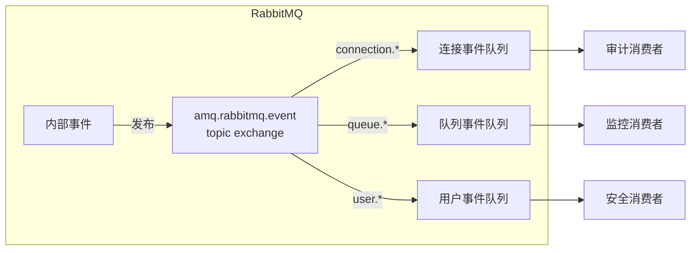

#### 4.3.2 启用插件

```bash
rabbitmq-plugins enable rabbitmq_event_exchange
```

#### 4.3.3 可用事件类型

| 路由键模式 | 事件类型 |
|------------|----------|
| `connection.created` | 新连接建立 |
| `connection.closed` | 连接关闭 |
| `channel.created` | 通道创建 |
| `channel.closed` | 通道关闭 |
| `queue.created` | 队列声明 |
| `queue.deleted` | 队列删除 |
| `exchange.created` | 交换机声明 |
| `exchange.deleted` | 交换机删除 |
| `binding.created` | 绑定创建 |
| `binding.deleted` | 绑定删除 |
| `user.created` | 用户创建 |
| `user.deleted` | 用户删除 |
| `user.authentication.success` | 认证成功 |
| `user.authentication.failure` | 认证失败 |
| `permission.created` | 权限授予 |
| `permission.deleted` | 权限撤销 |
| `vhost.created` | 虚拟主机创建 |
| `vhost.deleted` | 虚拟主机删除 |
| `alarm.set` | 告警触发 |
| `alarm.cleared` | 告警解除 |
| `policy.set` | 策略设置 |
| `policy.cleared` | 策略清除 |

#### 4.3.4 订阅事件示例

**Python 示例：**

```python
import pika

connection = pika.BlockingConnection(pika.ConnectionParameters('localhost'))
channel = connection.channel()

# 声明队列并绑定到事件交换机
result = channel.queue_declare(queue='', exclusive=True)
queue_name = result.method.queue

# 订阅所有连接事件
channel.queue_bind(
    exchange='amq.rabbitmq.event',
    queue=queue_name,
    routing_key='connection.*'
)

# 订阅所有用户认证事件
channel.queue_bind(
    exchange='amq.rabbitmq.event',
    queue=queue_name,
    routing_key='user.authentication.*'
)

def callback(ch, method, properties, body):
    print(f"Event: {method.routing_key}")
    print(f"Properties: {properties.headers}")
    print(f"Body: {body}")

channel.basic_consume(queue=queue_name, on_message_callback=callback, auto_ack=True)
channel.start_consuming()
```

#### 4.3.5 常见用例

- **安全审计**：监控 `user.authentication.*` 事件记录登录尝试
- **资源追踪**：监控 `queue.created`/`queue.deleted` 跟踪队列生命周期
- **告警集成**：监控 `alarm.*` 事件触发外部告警
- **合规日志**：记录所有管理操作用于审计

---

### 4.4 Firehose 调试

#### 4.4.1 概述

Firehose 是一个调试功能，将所有经过 broker 的消息副本发布到特殊交换机，用于调试和追踪消息流。

> **⚠️ 警告**：Firehose 会显著增加系统负载，仅用于调试目的，禁止在生产环境启用！

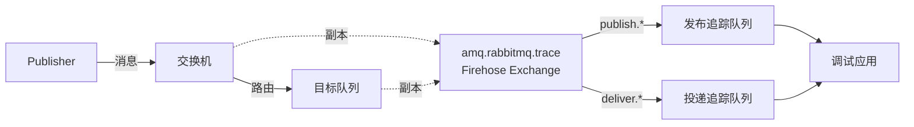

#### 4.4.2 启用与禁用

```bash
# 启用 Firehose（仅调试用）
rabbitmqctl trace_on

# 指定 vhost
rabbitmqctl trace_on -p my_vhost

# 禁用 Firehose
rabbitmqctl trace_off

# 禁用指定 vhost
rabbitmqctl trace_off -p my_vhost
```

#### 4.4.3 追踪消息格式

启用后，消息会被发布到 `amq.rabbitmq.trace` 交换机：

| 路由键格式 | 含义 |
|------------|------|
| `publish.{exchangename}` | 发布到指定交换机的消息 |
| `deliver.{queuename}` | 投递到指定队列的消息 |

**追踪消息头部包含：**

| Header | 含义 |
|--------|------|
| `exchange_name` | 原始交换机名称 |
| `routing_keys` | 消息的路由键列表 |
| `connection` | 发布者连接名称 |
| `channel` | 发布者通道号 |
| `user` | 发布消息的用户 |
| `routed_queues` | 消息路由到的队列列表 |
| `redelivered` | 是否为重新投递（仅 deliver 事件）|

#### 4.4.4 订阅追踪消息

```bash
# 使用 rabbitmqadmin 订阅所有追踪消息
rabbitmqadmin declare queue name=trace-queue

rabbitmqadmin declare binding \
    source=amq.rabbitmq.trace \
    destination=trace-queue \
    routing_key="#"

# 获取追踪消息
rabbitmqadmin get queue=trace-queue count=10
```

**Python 示例：**

```python
import pika

connection = pika.BlockingConnection(pika.ConnectionParameters('localhost'))
channel = connection.channel()

# 绑定到所有发布事件
result = channel.queue_declare(queue='', exclusive=True)
queue_name = result.method.queue

channel.queue_bind(
    exchange='amq.rabbitmq.trace',
    queue=queue_name,
    routing_key='publish.#'
)

def callback(ch, method, properties, body):
    print(f"Traced: {method.routing_key}")
    print(f"Headers: {properties.headers}")
    print(f"Body: {body[:100]}...")

channel.basic_consume(queue=queue_name, on_message_callback=callback, auto_ack=True)
channel.start_consuming()
```

#### 4.4.5 使用场景

| 场景 | 说明 |
|------|------|
| **消息路由调试** | 验证消息是否正确路由到目标队列 |
| **消息内容检查** | 检查消息格式和内容是否正确 |
| **性能分析** | 分析消息流量和模式 |
| **故障排查** | 追踪消息丢失或延迟原因 |

#### 4.4.6 注意事项

1. **性能影响**：Firehose 会复制每条消息，大幅增加负载
2. **存储压力**：追踪队列会快速积累消息，需及时消费
3. **安全风险**：追踪消息包含完整消息内容，注意敏感数据
4. **临时使用**：调试完成后必须立即禁用

---

## 附录

### A. 常用端口列表

| 端口 | 用途 |
|------|------|
| 5672 | AMQP |
| 5671 | AMQP over TLS |
| 15672 | Management UI |
| 15692 | Prometheus metrics |
| 25672 | Inter-node communication |
| 4369 | epmd |
| 1883 | MQTT |
| 8883 | MQTT over TLS |
| 61613 | STOMP |

### B. 常用命令速查表

#### 服务管理

```bash
# 启动/停止/重启
rabbitmqctl start_app
rabbitmqctl stop_app
rabbitmqctl stop

# 状态检查
rabbitmqctl status
rabbitmqctl cluster_status
rabbitmq-diagnostics check_running
```

#### 用户与权限

```bash
# 用户管理
rabbitmqctl add_user <user> <password>
rabbitmqctl delete_user <user>
rabbitmqctl change_password <user> <newpass>
rabbitmqctl list_users

# 权限管理
rabbitmqctl set_permissions -p <vhost> <user> ".*" ".*" ".*"
rabbitmqctl clear_permissions -p <vhost> <user>
rabbitmqctl list_permissions -p <vhost>
```

#### 队列与交换机

```bash
# 列出资源
rabbitmqctl list_queues name messages consumers
rabbitmqctl list_exchanges name type
rabbitmqctl list_bindings

# 队列操作
rabbitmqctl purge_queue <queue>
rabbitmqctl delete_queue <queue>
```

#### 集群管理

```bash
# 加入集群
rabbitmqctl stop_app
rabbitmqctl join_cluster rabbit@node1
rabbitmqctl start_app

# 离开集群
rabbitmqctl stop_app
rabbitmqctl reset
rabbitmqctl start_app

# 强制启动
rabbitmqctl force_boot
```

#### 定义导入导出

```bash
# 导出
rabbitmqctl export_definitions /path/to/definitions.json

# 导入
rabbitmqctl import_definitions /path/to/definitions.json
```

### C. 配置参数参考

#### 核心配置 (rabbitmq.conf)

| 参数 | 默认值 | 说明 |
|------|--------|------|
| `listeners.tcp.default` | 5672 | AMQP 端口 |
| `listeners.ssl.default` | 5671 | AMQP-TLS 端口 |
| `management.listener.port` | 15672 | 管理界面端口 |
| `vm_memory_high_watermark.relative` | 0.4 | 内存告警阈值（相对值） |
| `disk_free_limit.relative` | 1.0 | 磁盘告警阈值（相对于 RAM） |
| `channel_max` | 2047 | 每连接最大通道数 |
| `heartbeat` | 60 | 心跳间隔（秒） |
| `default_vhost` | / | 默认虚拟主机 |
| `default_user` | guest | 默认用户名 |
| `default_pass` | guest | 默认密码 |
| `log.file.level` | info | 日志级别 |

#### 集群配置

| 参数 | 默认值 | 说明 |
|------|--------|------|
| `cluster_formation.peer_discovery_backend` | classic_config | 节点发现方式 |
| `cluster_partition_handling` | ignore | 分区处理策略 |
| `cluster_keepalive_interval` | 10000 | 集群心跳间隔（毫秒） |

#### 队列配置

| 参数 | 默认值 | 说明 |
|------|--------|------|
| `queue_leader_locator` | client-local | 队列领导者放置策略 |
| `quorum_queue.x-max-in-memory-length` | - | 仲裁队列内存中最大消息数 |
| `classic_queue.default_version` | 2 | 经典队列默认版本 |

### D. 故障排查指南

#### 连接问题

| 症状 | 可能原因 | 解决方案 |
|------|----------|----------|
| 连接被拒绝 | 端口未监听 | 检查 `rabbitmqctl status` |
| 认证失败 | 密码错误/用户不存在 | 检查 `rabbitmqctl list_users` |
| 权限不足 | 缺少 vhost 权限 | 使用 `set_permissions` 授权 |
| 连接断开 | 心跳超时 | 调整心跳间隔或网络 |

#### 消息堆积

| 症状 | 可能原因 | 解决方案 |
|------|----------|----------|
| 队列消息增长 | 消费者慢/不存在 | 增加消费者或优化处理 |
| Unacked 堆积 | 消费者未确认 | 检查 prefetch 和 ack 逻辑 |
| 发布被阻塞 | 资源告警触发 | 检查内存/磁盘，清理队列 |

#### 集群问题

| 症状 | 可能原因 | 解决方案 |
|------|----------|----------|
| 节点无法加入 | Cookie 不匹配 | 同步 `.erlang.cookie` |
| 网络分区 | 网络抖动/节点挂起 | 根据策略恢复或手动干预 |
| 节点不可用 | 进程崩溃/OOM | 检查日志，重启节点 |

#### 性能问题

| 症状 | 可能原因 | 解决方案 |
|------|----------|----------|
| 吞吐量低 | 持久化慢/网络瓶颈 | 使用 SSD，优化网络 |
| 延迟高 | 队列过长/资源不足 | 扩容，优化队列数量 |
| 内存增长 | 消息堆积/连接泄漏 | 清理队列，限制连接 |

#### 诊断命令

```bash
# 整体状态
rabbitmq-diagnostics status

# 内存使用分析
rabbitmq-diagnostics memory_breakdown

# 网络连接检查
rabbitmq-diagnostics check_port_connectivity

# 告警检查
rabbitmq-diagnostics check_local_alarms

# 日志检查
tail -f /var/log/rabbitmq/rabbit@hostname.log
```

### E. 术语表

| 术语 | 英文 | 说明 |
|------|------|------|
| 交换机 | Exchange | 接收消息并根据绑定规则路由到队列 |
| 队列 | Queue | 存储消息的缓冲区 |
| 绑定 | Binding | 交换机与队列之间的路由规则 |
| 路由键 | Routing Key | 用于消息路由的字符串标识 |
| 虚拟主机 | Virtual Host (vhost) | 逻辑隔离的消息代理实例 |
| 生产者 | Publisher/Producer | 发送消息的客户端应用 |
| 消费者 | Consumer | 接收并处理消息的客户端应用 |
| 通道 | Channel | 复用 TCP 连接的轻量级连接 |
| 连接 | Connection | 应用与 RabbitMQ 之间的 TCP 连接 |
| 确认 | Acknowledgement (ack) | 消费者确认已处理消息 |
| 预取 | Prefetch | 限制未确认消息的数量 |
| 持久化 | Durable | 重启后保留的队列/交换机/消息 |
| 死信 | Dead Letter | 无法正常处理的消息 |
| 仲裁队列 | Quorum Queue | 基于 Raft 的复制队列 |
| 流 | Stream | 高吞吐量的追加日志结构 |
| 联邦 | Federation | 跨集群消息复制 |
| Shovel | Shovel | 队列间消息转发工具 |
| 策略 | Policy | 动态应用于队列/交换机的配置 |
| 告警 | Alarm | 资源超限触发的警告状态 |
| 流控 | Flow Control | 背压机制，防止过载 |

---

### 更新日志

| 日期 | 版本 | 更新内容 |
|------|------|----------|
| 2025-12-05 | v1.0 | 初始版本，创建文档框架 |
| 2025-12-05 | v2.0 | 完成第一章（安装与升级）和第二章（使用 RabbitMQ） |
| 2025-12-05 | v3.0 | 完成第三章（管理 RabbitMQ）43 个小节 |
| 2025-12-05 | v4.0 | 完成第四章（监控 RabbitMQ）4 个小节及附录完善 |
