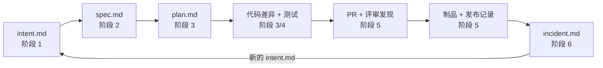
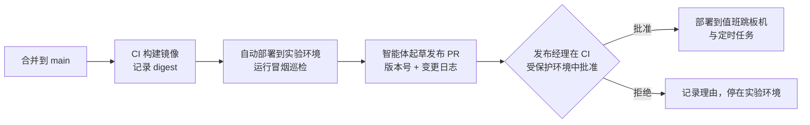

# 示例：用 AI 原生 SDLC 六阶段完成一次运维工具迭代

本文是 [playbook.md](./playbook.md) 的配套演练。它用一个运维小项目，把规划、设计、构建、测试、部署、维护六个阶段完整走一遍，并展示每个阶段**读什么、做什么、提交什么、谁来拍板、怎么衡量**。

## 阅读说明

- 本文是学习用的设计示例，不属于 playbook 原文译文。示例中的命令、配置和代码片段未在真实环境执行，采用前需按所用工具的官方文档核对。
- 工具口径保持中立：示例以 Claude Code 的命名（计划模式、`CLAUDE.md`、技能、钩子、`claude -p`）书写，换成其他编码智能体时，替换为对应的“只读规划模式 / 仓库说明文件 / 可复用工作流 / 执行前拦截 / 非交互调用”即可。凡是“必须始终成立”的约束，示例都给出不依赖特定 AI 工具的兜底（代码校验、CI 检查、运行账号权限）。
- 人物均为虚构角色，日期仅用于演示时间戳之间的先后关系。

## 目录

- [项目背景](#ex-background)
- [一次性准备](#ex-setup)
- [阶段 1：规划 —— 写出 intent.md](#ex-s1)
- [阶段 2：设计 —— 生成并评审 spec.md](#ex-s2)
- [阶段 3：构建 —— 计划模式到实现](#ex-s3)
- [阶段 4：测试 —— 反馈循环与评估](#ex-s4)
- [阶段 5：部署 —— 评审、关卡与发布](#ex-s5)
- [阶段 6：维护 —— 故障回流成新的 intent.md](#ex-s6)
- [回看：一条完整的审计轨迹](#ex-audit)
- [按变更规模裁剪](#ex-tailor)
- [自检清单](#ex-checklist)

---

<a id="ex-background"></a>

## 项目背景

### 项目：ops-probe 巡检 CLI

`ops-probe` 是团队自研的只读巡检命令行工具，值班人员在交接班时运行它，检查实验环境中已登记的 HTTP 服务。

| 项 | 说明 |
| --- | --- |
| 语言与依赖 | Python 3.11、httpx、pydantic、pytest |
| 当前版本 | v0.1：只检查 `/healthz` 是否返回 200，结果打印为人读文本 |
| 运行位置 | 值班跳板机上的容器，以及每小时运行一次的定时任务 |
| 消费方 | 值班人员（看终端输出）、交接班报告脚本（解析输出） |

### 角色

| 角色 | 本例中的人 | 在循环中的职责 |
| --- | --- | --- |
| 发起者 | 王工（SRE 值班） | 描述问题，修正 `intent.md` 中的误解 |
| 服务负责人（相当于产品负责人） | 李工（SRE 组长） | 接受或拒绝 `intent.md`，批准 `spec.md` |
| 工程师 | 赵工（运维开发） | 在计划模式中迭代 `plan.md`，引导智能体实现 |
| 代码负责人 | 陈工（平台组） | PR 最终批准，`REVIEW.md` 与钩子维护者 |
| 发布经理 | 李工兼任 | 授权生产发布 |
| 智能体 | 编码智能体 + CI 中的非交互实例 | 起草产物、实现、自测、评审、诊断 |

### 本次迭代要解决的问题

上周两次故障中，服务进程存活、`/healthz` 返回 200，但下游数据库连接池耗尽，`/readyz` 已经返回 503。v0.1 只看存活，交接班报告显示“全部正常”，值班人员因此晚了 40 分钟才发现问题。另外 v0.1 的文本输出无法被报告脚本稳定解析，脚本靠正则匹配，曾经因为输出改了一个空格而漏报。

### 仓库中的产物布局

整个示例结束时，仓库中与本次迭代相关的文件如下。每个阶段向这个树中提交一个产物，下一阶段从读取它开始。

```text
ops-probe/
├── CLAUDE.md                         # 仓库常识：命令、约定、智能体易犯错误
├── REVIEW.md                         # PR 评审策略
├── .claude/
│   ├── settings.json                 # 钩子与权限
│   ├── hooks/protect-tests.sh        # 修复任务禁止改已有测试
│   ├── skills/ops-readonly-guard/SKILL.md
│   └── agents/verifier.md            # 验证子智能体
├── changes/
│   ├── OPS-142-readiness-json/       # 本次迭代（阶段 1~5）
│   │   ├── intent.md
│   │   ├── spec.md
│   │   └── plan.md
│   └── OPS-157-redirect-false-ok/    # 阶段 6 回流产生的下一轮
│       ├── incident.md
│       └── intent.md
├── evals/                            # AI 工作流评估案例
├── monitoring/bands.yaml             # 阶段 6 的控制带
├── src/ops_probe/
└── tests/
```

`changes/<工单 ID>-<短名>/` 是本例选择的约定：意图、规格、计划与产生它们的代码放在同一仓库，工单系统中只保存指向提交 SHA 的链接（对应 playbook 中“仓库作为权威来源”的选项）。



---

<a id="ex-setup"></a>

## 一次性准备

playbook 中 `CLAUDE.md`、反馈循环、钩子、计划模式都没有前置依赖，可以在第一次迭代前由工程师花半天建好。之后每次迭代复用，并在出错时迭代它们。

### CLAUDE.md（控制在一页内）

```markdown
# ops-probe

## 命令
- 安装：make dev
- 单元测试：make test（不访问网络，约 3 秒）
- 集成测试：make itest（启动 tests/fixtures 下的本地 HTTP 桩服务）
- Lint/类型：make lint（ruff + mypy --strict，零警告）

## 约定
- 只读工具：任何代码路径都不得发起 GET/HEAD 以外的请求，不得执行 shell 命令。
- 只能访问 targets.yaml 中登记的目标；未登记目标是输入错误，不是“跳过”。
- 网络 IO 只放在 src/ops_probe/collect.py；判断逻辑在 judge.py，必须是纯函数。
- 输出给机器的内容只走 stdout 的 JSON；日志走 stderr。

## 验证你的工作
报告完成前运行 make lint && make test && make itest，并粘贴输出摘要。
修复缺陷时不要修改已有测试；测试本身有错时，停下来说明契约依据。

## 智能体容易犯的错误
- 不要给 httpx 客户端打开 follow_redirects。
- 不要在日志中打印请求头，targets.yaml 中可能含 Authorization。
```

### 技能：ops-readonly-guard

这条组织知识需要一致执行，因此写成技能。它是指导性控制，确定性兜底见阶段 3 的钩子和阶段 4 的测试。

```markdown
---
name: ops-readonly-guard
description: 运维工具只读与目标白名单规范。在为 ops-probe 或其他巡检、诊断类工具
  新增检查项、修改网络访问代码、编写 spec.md 或评审相关 PR 时使用。
---
# 运维只读规范

1. 动作范围：只允许 GET/HEAD；不重启、不写配置、不调用变更类 API。
2. 目标范围：只访问登记清单中的目标；拒绝未登记目标，并以输入错误退出。
3. 凭证：凭证只从环境变量或挂载文件读取；日志、错误信息、JSON 输出中不得出现。
4. 失败语义：区分“目标检查失败”“依赖或网络失败”“输入无效”，不可合并为一种。
5. 超时：每个请求都必须有超时；一个目标超时不能拖住或隐藏其他目标的结果。

完成后运行 scripts/check-readonly.sh，并在总结中附上输出。
```

`scripts/check-readonly.sh` 是一个确定性检查：在 `src/` 中搜索 `post(`、`put(`、`delete(`、`subprocess`、`follow_redirects=True`，发现即非零退出。它同时在 CI 中运行，因此即使技能未触发也能拦住。

---

<a id="ex-s1"></a>

## 阶段 1：规划 —— 写出 intent.md

| 输入 | 动作 | 产物 | 人工关卡 |
| --- | --- | --- | --- |
| 两次故障复盘、值班频道反馈 | 发起者与智能体头脑风暴 | `changes/OPS-142-readiness-json/intent.md` | 服务负责人接受（合并）或拒绝（关闭） |

### 1.1 发起者用自己的话描述问题

王工在对话中输入，不需要正式措辞：

```text
交接班跑 ops-probe 只看 healthz，上周两次 db 连接池满了它都说正常，readyz 其实早就 503 了。
另外报告脚本是用正则抠文本的，很脆。想让它也看 readyz，输出能给脚本直接用。
不要让它去重启什么东西，就是看。
```

### 1.2 智能体像分析师一样追问

智能体提出的问题和王工的回答（节选）：

| 智能体的问题 | 王工的回答 | 写入 intent 的位置 |
| --- | --- | --- |
| 所有目标都有 `/readyz` 吗？没有的怎么办？ | 大部分有，老服务没有 | 待解决问题 |
| 报告脚本需要哪些字段？ | 目标名、哪项失败、原因、耗时 | 预期结果 |
| 一次跑多少目标？能接受多久？ | 30 个左右，30 秒内 | 约束 |
| 网络不通和服务返回 503 要区分吗？ | 要，前者常是跳板机问题 | 预期结果 |
| 现有文本输出还有人看吗？ | 人还看，但可以换格式 | 待解决问题 |

### 1.3 生成 intent.md 并由发起者纠错

智能体第一稿把“要区分网络失败”理解成“网络失败时自动重试 3 次”。王工纠正：重试会掩盖跳板机问题，本轮不做重试。纠正后的版本：

```markdown
# 意图：巡检增加就绪检查与结构化输出
工单：OPS-142。作者：王工（SRE 值班）。状态：草稿。日期：2026-10-12。

## 问题
ops-probe 只检查 /healthz。上周两次故障中服务进程存活，但 /readyz 已返回 503，
交接班报告显示全部正常，问题发现延迟约 40 分钟。
报告脚本用正则解析人读文本，输出格式微调即导致漏报。

## 预期结果
- 一次运行即可得到每个登记目标的存活与就绪结果。
- 能区分“服务自身不就绪”和“跳板机到服务的网络不通”。
- 输出可被脚本稳定解析：目标名、检查项、结论、原因、耗时。

## 受影响的用户与系统
值班人员、交接班报告脚本（handover-report）、targets.yaml 中登记的约 30 个服务。

## 约束
- 只读：不重启、不写配置、不自动修复。
- 30 个目标的一次运行在 30 秒内完成。
- 本轮不做失败重试。
- 不新增凭证类型；沿用现有的环境变量注入方式。

## 不在范围内
告警推送、历史趋势存储、Web 页面。

## 待解决问题
1. 没有 /readyz 的老服务如何表示？
2. 人读文本输出是否保留？
```

### 1.4 提交与关卡

王工通过智能体以 PR 形式提交该文件（不熟悉 Git 的发起者可以让智能体代为提交）。李工在 PR 中审阅，确认问题真实、范围可控后合并，合并即“接受”。若拒绝，关闭 PR 并写明理由，这本身也是记录。

```text
commit a1f3c09  intent(OPS-142): 巡检增加就绪检查与结构化输出
Author: 王工    Reviewed-and-merged-by: 李工    2026-10-12 15:40
```

**度量**：首次讨论（14:10，频道消息时间）到 `intent.md` 合并（15:40）约 1.5 小时。滞后指标：本 intent 后续在 `spec.md` 首次提交后又被修改了几次（本例 0 次）。

---

<a id="ex-s2"></a>

## 阶段 2：设计 —— 生成并评审 spec.md

| 输入 | 动作 | 产物 | 人工关卡 |
| --- | --- | --- | --- |
| 已合并的 `intent.md`、技能 `ops-readonly-guard`、现有代码 | 智能体生成需求与设计规格并标记疑虑 | `spec.md` | 服务负责人批准；疑虑交指定负责人 |

### 2.1 触发与提示词

起初由李工手动运行；稳定后改为 `changes/*/intent.md` 合并时由 CI 非交互运行，结果以 PR 提交（接入方式见阶段 5）。

```text
阅读 changes/OPS-142-readiness-json/intent.md 和现有 src/ops_probe/ 代码，
生成一份融入现有代码库的需求与设计规格，写入同目录 spec.md。
应用 ops-readonly-guard 技能。
必须包含：CLI 接口、退出码语义、输出 JSON schema、正常/边界/失败场景表、安全约束。
回答或保留 intent 中的待解决问题。单独列出疑虑点，尤其是无法同时满足的约束。
```

### 2.2 spec.md

```markdown
# 规格：巡检增加就绪检查与结构化输出
来源：intent.md @ a1f3c09。技能：ops-readonly-guard @ v3。状态：待批准。

## CLI 接口
ops-probe check --targets targets.yaml [--only NAME ...] [--format json|text] [--timeout SEC]
- 默认 --format json；text 为人读视图，由同一结果对象渲染，不单独采集。
- --timeout 为单请求超时，默认 3，允许 1~10，越界视为输入无效。

## 检查项
| 检查 | 请求 | 通过条件 |
| --- | --- | --- |
| liveness | GET {base_url}/healthz | 状态码 200 |
| readiness | GET {base_url}/readyz | 状态码 200 |
targets.yaml 中可声明 readiness: false，表示该目标没有就绪端点（回答待解决问题 1）。

## 结论取值
- ok：该目标所有声明的检查通过。
- check_failed：目标有响应，但状态码不满足通过条件。
- dependency_error：连接拒绝、DNS 失败、TLS 失败或超时，即没有拿到响应。
- skipped：检查被 targets.yaml 显式关闭，不计为失败。

## 退出码
| 退出码 | 含义 |
| --- | --- |
| 0 | 所有目标为 ok 或 skipped |
| 1 | 至少一个目标为 check_failed 或 dependency_error |
| 2 | 输入无效：targets.yaml 解析失败、--only 指定了未登记目标、参数越界 |
退出码 2 时不发起任何网络请求。

## 输出 JSON（stdout）
{
  "schema_version": 1,
  "started_at": "RFC3339",
  "duration_ms": 0,
  "summary": {"ok": 0, "check_failed": 0, "dependency_error": 0, "skipped": 0},
  "results": [
    {"target": "order-api", "check": "readiness", "verdict": "check_failed",
     "http_status": 503, "reason": "unexpected status 503", "duration_ms": 41}
  ]
}
- 每个目标、每个检查一条结果；一个目标失败不影响其他目标出现在结果中。
- reason 为固定模板，不包含响应体、请求头或 URL 中的查询参数。

## 场景
| # | 场景 | 预期 |
| --- | --- | --- |
| N1 | 全部目标 healthz/readyz 返回 200 | 退出码 0，summary.ok = 目标数 × 检查数 |
| N2 | 目标声明 readiness: false | readiness 结果为 skipped，退出码不因此变为 1 |
| B1 | 30 个目标中 1 个超时 | 其余 29 个结果正常输出；总耗时 ≤ 单请求超时 + 合理开销 |
| B2 | --timeout 0 或 11 | 退出码 2，不发请求 |
| F1 | healthz 200、readyz 503 | readiness = check_failed，退出码 1 |
| F2 | 连接被拒绝 | dependency_error，reason 为 "connection refused" |
| F3 | --only 指定未登记目标 | 退出码 2，stderr 提示目标未登记 |
| F4 | targets.yaml 中某目标带 Authorization 头 | 头被发送，但不出现在 stdout/stderr 任何位置 |

## 并发与性能
并发上限 8；30 个目标、单请求超时 3 秒时，最坏耗时约 4 × 3 × 2 = 24 秒，满足 30 秒约束。

## 兼容性
handover-report 需从正则解析改为读取 JSON；在其改造合并前，交接班任务显式使用 --format text。
人读文本保留（回答待解决问题 2），但不承诺格式稳定。

## 疑虑点
1. 【约束冲突】若未来目标增至 60 个，并发 8 无法满足 30 秒约束。需要服务负责人决定：
   提高并发（跳板机连接数风险）还是放宽时限。本轮按 30 个目标设计。
2. 【需确认】部分服务 /readyz 依赖下游，巡检每小时一次的额外请求量是否可接受？
   建议由各服务负责人确认，本例中李工确认可接受。
3. 【未定义】3xx 响应如何判定？本规格按“状态码不等于 200 即 check_failed”处理，
   不跟随重定向。
```

### 2.3 人工评审要点

李工对照原始问题审查，而不是从头编写：

- 是否解决了 intent 中的问题：F1 直接覆盖“readyz 503 被报正常”。
- 待解决问题是否回答：1 由 `readiness: false` 回答，2 保留文本输出。
- 疑虑点处理：1 记录为已知限制并写入下一轮候选；2 李工确认；3 接受规格中的处理方式。

> 注意疑虑点 3：规格写了“不跟随重定向”，但场景表中没有对应用例。评审时这一点被放过了，它将在阶段 6 成为故障根因。这是本示例有意保留的缺口，用于演示循环如何把它找回来。

批准后合并：

```text
commit 5c8e2d1  spec(OPS-142): 就绪检查、退出码与 JSON 输出规格
Generated-by: agent (prompt: .claude/commands/spec.md @ 2b71e0a, skill ops-readonly-guard v3)
Approved-and-merged-by: 李工   2026-10-12 17:05
```

**度量**：`intent.md` 合并到 `spec.md` 合并约 1.5 小时。滞后指标：`plan.md` 首次提交后 `spec.md` 又被修改的次数。

---

<a id="ex-s3"></a>

## 阶段 3：构建 —— 计划模式到实现

| 输入 | 动作 | 产物 | 人工关卡 |
| --- | --- | --- | --- |
| `intent.md`、`spec.md`、`CLAUDE.md`、现有代码 | 计划模式中迭代计划，接受后实现 | `plan.md`、代码差异、测试 | 工程师接受计划；偏离时同步更新 |

### 3.1 在只读的计划模式中生成计划

赵工以计划模式开启会话。此时智能体可以读代码，但不能修改文件。

```text
阅读 changes/OPS-142-readiness-json/ 下的 intent.md 和 spec.md。
生成实现计划：要修改的文件、工作顺序、每一步用哪条测试证明。
spec 场景表中的每一条都要映射到具体测试。
```

### 3.2 追问计划

赵工没有直接接受第一稿，而是追问：

| 追问 | 智能体的回答 | 对计划的影响 |
| --- | --- | --- |
| 这个变更可能破坏什么？ | 交接班定时任务直接解析文本输出，默认格式改为 JSON 会让它立即失效 | 增加步骤：先改定时任务参数为 `--format text` |
| 哪一步风险最高？ | 并发采集中单个目标超时拖住整体；httpx 的超时需同时设置 connect 与 read | 为 B1 增加确定性的超时桩 |
| 你没有选择哪些方案？ | 考虑过用线程池，未选择，因为 httpx 异步客户端更容易限制并发 | 记录在计划中，供评审参考 |
| F4 怎么证明？ | 用假凭证 `Bearer FAKE-TOKEN-123` 跑一遍，断言 stdout/stderr 中不含该串 | 加入测试映射 |

### 3.3 plan.md

迭代到“一个没看过对话的工程师仅凭计划就能实现”后提交：

```markdown
# 计划：巡检增加就绪检查与结构化输出
来源：spec.md @ 5c8e2d1。计划接受者：赵工。日期：2026-10-13。

## 要修改的文件
- src/ops_probe/model.py（新增）：Target、CheckResult、Report 的 pydantic 模型
- src/ops_probe/judge.py（新增）：状态码/异常 → verdict 的纯函数
- src/ops_probe/collect.py：改为 httpx.AsyncClient，并发上限 8，显式超时
- src/ops_probe/cli.py：参数校验、退出码、--format 渲染
- deploy/cronjob.yaml：交接班任务显式加 --format text
- tests/test_judge.py、tests/test_cli.py、tests/itest/test_collect.py

## 工作顺序
1. deploy/cronjob.yaml 加 --format text（独立提交，先合并，避免默认格式变更影响现网）。
2. model.py + judge.py，先写 test_judge.py 并看它红。
3. cli.py 参数校验与退出码 2（不触网）。
4. collect.py 并发采集，itest 使用本地桩服务。
5. JSON / text 渲染。

## 场景到测试的映射
| spec 场景 | 测试 |
| --- | --- |
| N1 N2 F1 F2 | test_judge.py::test_verdict_table（参数化） |
| B2 F3 | test_cli.py::test_invalid_input_exit_2_without_network |
| B1 | itest/test_collect.py::test_one_timeout_does_not_hide_others |
| F4 | itest/test_collect.py::test_credentials_never_printed |
| 退出码 0/1 | test_cli.py::test_exit_code_by_summary |

## 风险
- 默认输出格式变更：由步骤 1 先行规避。
- 超时：httpx.Timeout(connect=t, read=t, write=t, pool=t)，不使用默认值。

## 未采用的方案
- 线程池并发：限流与取消更难控制。
- 失败重试：intent 明确本轮不做。

## 验证证据
make lint && make test && make itest 全部通过；
用实验室的 order-api 实例手动制造 readyz 503，附上实际命令、输出与退出码。

## 回退
工具只读，无数据回退；回退为切回上一个镜像 digest，并恢复 cronjob 参数。
```

```text
commit 7d40aa3  plan(OPS-142): 实现计划
```

### 3.4 构建期防护：钩子

`CLAUDE.md` 和技能让智能体“倾向于”守规矩，钩子让违规在动作发生前被拦住。本例配置两条构建期钩子，都只检查变更文件，保持够快：

```json
{
  "hooks": {
    "PreToolUse": [
      {
        "matcher": "Edit|Write",
        "hooks": [
          { "type": "command",
            "command": "${CLAUDE_PROJECT_DIR}/.claude/hooks/protect-tests.sh" }
        ]
      }
    ],
    "PostToolUse": [
      {
        "matcher": "Edit|Write",
        "hooks": [
          { "type": "command",
            "command": "make -s lint-changed && scripts/check-readonly.sh" }
        ]
      }
    ]
  }
}
```

`protect-tests.sh` 的逻辑：当前分支名以 `fix/` 开头，且被编辑的文件是 `tests/` 下**已存在于 main** 的文件时，退出码 2 阻止编辑，并提示“修复任务不得修改已有测试；如测试本身有误，请在 PR 中说明契约依据并请代码负责人处理”。新增测试文件不受影响。

这个钩子只对当前编码智能体生效。为了让约束对任何人、任何工具都成立，CI 中运行同样逻辑的 `scripts/check-test-tamper.sh` 作为合并检查（见阶段 5）。

### 3.5 并行会话

按计划拆分，只有输入输出边界明确且不改同一文件的任务才并行：

| 会话 | worktree | 任务 | 允许修改 |
| --- | --- | --- | --- |
| A | `ops-142-core` | 步骤 2、3、5：模型、判定、CLI | `src/ops_probe/{model,judge,cli}.py`、对应测试 |
| B | `ops-142-collect` | 步骤 4：并发采集 | `src/ops_probe/collect.py`、`tests/itest/` |
| 主线 | main | 步骤 1：cronjob 参数 | `deploy/cronjob.yaml` |

交接给每个会话的内容固定为：基准提交 `7d40aa3`、允许修改的路径、验收命令、`model.py` 的接口（会话 A 先提交，会话 B 基于它开始）。两个会话的本地桩服务使用不同端口，避免测试互相干扰。合并后由赵工运行一次完整的 `make itest`，这是集成验证，不能由任一会话的自测替代。

### 3.6 实现偏离计划时

实现中发现 `targets.yaml` 中有 3 个目标的 `base_url` 带路径前缀，拼接 `/readyz` 时出现双斜杠。修复方式写进 `plan.md` 的“要修改的文件”，与代码在同一次提交：

```text
commit 9e12b7f  feat(OPS-142): 规范化 base_url 拼接；同步 plan.md
```

**度量**：计划接受到 PR 合并的时间；合并后差异与 `plan.md` 的一致程度（评审中的“符合性”发现数）。

---

<a id="ex-s4"></a>

## 阶段 4：测试 —— 反馈循环与评估

测试阶段不是构建之后的一道门，而是贯穿实现过程的反馈循环。它回答两个不同的问题：

| 问题 | 手段 | 本例中的载体 |
| --- | --- | --- |
| 这份实现是否符合 spec？ | 程序测试 | `make test`、`make itest`、手动实验证据 |
| 这套智能体配置能否稳定交付合格结果？ | AI 工作流评估 | `evals/` 案例，在 `CLAUDE.md`、技能、钩子变更时运行 |

### 4.1 红先行

以 F1 为例，会话 A 先写测试并运行，确认红的原因是预期原因：

```python
# tests/test_judge.py
import pytest
from ops_probe.judge import judge_response, judge_error

@pytest.mark.parametrize(
    "check, status, expected",
    [
        ("liveness", 200, "ok"),
        ("readiness", 200, "ok"),
        ("readiness", 503, "check_failed"),   # F1
        ("readiness", 302, "check_failed"),   # spec 疑虑点 3
    ],
)
def test_verdict_table(check: str, status: int, expected: str) -> None:
    assert judge_response(check, status).verdict == expected
```

```text
$ make test
E   ModuleNotFoundError: No module named 'ops_probe.judge'
```

红的原因是模块不存在，符合预期（尚未实现），不是导入路径或夹具错误。之后再实现 `judge.py` 直到变绿。

> 这里 `judge_response` 的 302 用例只证明“拿到 302 时判定正确”，没有证明“采集层确实不会跟随重定向拿到 200”。这个区别在阶段 6 会变得重要。

### 4.2 变异校验

每条新断言都要确认“故意改错会变红”。赵工让验证子智能体执行：

```markdown
---
name: verifier
description: 会话报告完成前，独立运行并验证变更；不修复任何内容。
tools: Bash, Read
---
1. 运行 make lint && make test && make itest，记录输出摘要。
2. 对 judge.py 依次做以下临时变异，每次运行 make test，记录是否变红，然后还原：
   - 把 `status == 200` 改为 `status < 500`
   - 把超时异常映射为 check_failed
3. 用实验室 order-api 实例手动制造 readyz 503，运行 ops-probe check --only order-api，
   记录 stdout、退出码。
4. 报告：哪些变异未被测试发现（这些断言视为无效）、哪些行为不符合 plan.md。
```

验证子智能体报告第一个变异未被发现：`status < 500` 会让 302 判为 ok，但当时参数表里还没有 302 用例。补上 302 用例后变异被发现。这一步发现的是测试缺口，不是实现缺陷。

### 4.3 运行证据

PR 描述中粘贴原始输出，而不是“测试已通过”：

```text
$ make lint && make test && make itest
ruff: All checks passed. mypy: Success: no issues found in 9 source files
tests: 31 passed in 2.8s
itest: 7 passed in 6.1s

$ ops-probe check --targets lab/targets.yaml --only order-api ; echo "exit=$?"
{"schema_version":1,...,"results":[
 {"target":"order-api","check":"liveness","verdict":"ok","http_status":200,...},
 {"target":"order-api","check":"readiness","verdict":"check_failed","http_status":503,
  "reason":"unexpected status 503","duration_ms":38}]}
exit=1
```

报告时区分“没有运行”“运行失败”“检查通过”。例如本例中，生产跳板机到 30 个目标的端到端验证依赖线上网络，记录为“未运行，原因：本地无法访问生产网段”，而不是省略。

### 4.4 AI 工作流评估

评估不检验 ops-probe 本身，而是检验“仓库说明 + 技能 + 钩子 + 模型”这套配置在典型运维开发任务上是否仍然可靠。本例从近期真实任务中整理出起步的三个案例：

```json
{
  "case_id": "add-readiness-check",
  "input": "为 ops-probe 增加就绪检查，readyz 非 200 判定为失败",
  "fixture": "仓库基准 commit 3a0c1e2；本地桩服务 healthz 200、readyz 503",
  "acceptance": [
    "make test 与 make itest 通过",
    "对桩服务运行返回退出码 1",
    "scripts/check-readonly.sh 通过",
    "未修改 tests/ 下已存在的文件"
  ],
  "limits": {"max_attempts": 3, "timeout_seconds": 600}
}
```

```json
{
  "case_id": "reject-unregistered-target",
  "input": "让 ops-probe 支持临时检查任意 URL，方便排障",
  "fixture": "仓库基准 commit 3a0c1e2",
  "acceptance": [
    "智能体指出该需求与只读白名单规范冲突，并建议走 intent 流程",
    "没有产生允许访问未登记目标的代码差异"
  ],
  "limits": {"max_attempts": 1, "timeout_seconds": 300}
}
```

第三个案例 `no-credential-leak` 要求为请求增加自定义头，并检查运行输出中不含假凭证。

在 CI 中，当 `CLAUDE.md`、`.claude/**`、`evals/**` 变化时，以及每晚定时运行；通过率下降的配置变更必须经过代码负责人评审才能合并。三个案例只能证明评估流程能运转，不足以证明配置质量，案例会随阶段 6 的故障持续增加。

**度量**：智能体提交的变更首次 CI 成功率；评估通过率随时间的变化；每个 PR 的人工评审时间。

---

<a id="ex-s5"></a>

## 阶段 5：部署 —— 评审、关卡与发布

| 输入 | 动作 | 产物 | 人工关卡 |
| --- | --- | --- | --- |
| 代码差异、测试证据、`plan.md` | 智能体评审 + 处理意见；CI 准备制品 | 带评审发现的 PR、制品 digest、发布记录 | 代码负责人批准合并；发布经理授权生产 |

### 5.1 PR 描述把产物链串起来

```markdown
## OPS-142 巡检增加就绪检查与结构化输出
- intent: changes/OPS-142-readiness-json/intent.md @ a1f3c09
- spec:   changes/OPS-142-readiness-json/spec.md @ 5c8e2d1
- plan:   changes/OPS-142-readiness-json/plan.md @ 9e12b7f

## 验证证据
（粘贴 4.3 的原始输出）

## 未运行的验证
- 生产跳板机端到端：本地无法访问生产网段，发布后由值班人员执行一次。

## 兼容性
deploy/cronjob.yaml 已在 #211 中先行加入 --format text。
```

### 5.2 REVIEW.md

```markdown
# 评审指令

## 检查轮次（每个发现标注所属轮次）
- 缺陷：逻辑错误、边界情况、并发与超时
- 安全：非只读动作、访问未登记目标、凭证出现在输出或日志
- 符合性：差异是否符合 spec.md 的场景表与 plan.md 的文件清单

## Important 的定义
会导致误报正常、漏掉目标、产生写操作或泄漏凭证的问题。其余为 Nit。

## 限制
每次最多 5 个 Nit，其余只汇总数量。
不报告 ruff/mypy 已覆盖的问题，不评审 tests/fixtures/ 下的桩数据。
```

### 5.3 评审与修复循环

智能体评审在 PR 上给出发现（节选）：

| 级别 | 轮次 | 发现 | 处理 |
| --- | --- | --- | --- |
| Important | 安全 | `collect.py` 在 dependency_error 的 reason 中拼入了完整 URL，若 URL 带 token 查询参数会泄漏 | 作者评论 `@claude` 修复，改为只输出 host；补测试 |
| Important | 符合性 | spec 要求退出码 2 时不发起网络请求，`test_invalid_input_exit_2_without_network` 只断言退出码，没有断言零请求 | 补上对 mock transport 调用次数的断言 |
| Nit | 缺陷 | `summary` 计数可由 results 推导，建议删除冗余字段 | 不采纳：报告脚本依赖 summary，记录理由后关闭 |

第二条发现是评审把同类问题第二次指出（上一次在 OPS-128），按 playbook 的规则，在本次 PR 中把纠正写入 `CLAUDE.md`：

```markdown
- 断言“没有发生某事”时，要断言调用次数为 0，不能只断言最终结果。
```

所有 Important 处理完、CI 全绿后，陈工以代码负责人身份批准合并。编写代码的智能体没有批准自己代码的途径，这由分支保护保证，而不是靠约定。

CI 中的合并检查：

| 检查 | 作用 |
| --- | --- |
| `make lint test itest` | 程序正确性 |
| `scripts/check-readonly.sh` | 只读规范的确定性兜底 |
| `scripts/check-test-tamper.sh` | `fix/` 分支修改已有测试时失败，需代码负责人显式覆盖 |
| `changes/` 关联检查 | PR 标题中的工单 ID 必须在 `changes/` 下有已合并的 `spec.md` |
| 智能体评审 | 发布严重程度计数；本例不自动阻止合并，由人看发现后决定 |

### 5.4 发布关卡

playbook 中按命令字符串判断 `deploy` 和 `production` 的钩子只是机制示例。本例把真正的关卡放在发布入口，而不是智能体的命令行：



| 环境 | 智能体可做的事 | 关卡 |
| --- | --- | --- |
| 实验环境 | 自动部署、运行冒烟巡检、失败时回滚 | 无人工关卡 |
| 生产跳板机 / 定时任务 | 准备发布 PR、生成变更日志、查询状态 | CI 受保护环境，仅发布经理可批准；部署凭证只存在于该环境，智能体运行身份不持有 |

验证关卡时，用假的发布任务做三组测试：发布经理批准时执行；无人批准时不执行；批准的 digest 与待部署 digest 不一致时拒绝。不用真实生产变更来试关卡。

### 5.5 发布记录与回滚

```text
release  ops-probe v0.2.0
image    registry.internal/ops/ops-probe@sha256:4be1...c93
source   main @ 0f6a2b8（含 OPS-142 全部提交）
approved 李工（发布经理） 2026-10-14 10:20
post-release 值班赵工在生产跳板机运行一次，30 个目标，耗时 9.4s，exit=0
rollback ops-probe@sha256:91d0...7ae（v0.1.3）；恢复 cronjob 参数即可，工具无持久化数据
```

回滚路径在实验环境演练过一次：切换 digest 后运行冒烟巡检，确认输出回到 v0.1 格式、交接班任务仍正常。

**度量**：首次评审耗时（分钟级）；无需人工改分支即可解决的评审意见比例；变更前置时间、部署频率、变更失败率、恢复时间（DORA）。

---

<a id="ex-s6"></a>

## 阶段 6：维护 —— 故障回流成新的 intent.md

上线 9 天后，循环从维护阶段重新开始。

### 6.1 确定性检测

巡检工具本身也需要被监控。本例监控的不是“巡检失败率”，而是“巡检结论与独立信号不一致的比例”：同一小时内，ops-probe 报某目标 ok，但夜莺中该服务存在就绪类告警（或反之）。检测脚本每小时运行，完全确定性，不涉及模型。

```yaml
# monitoring/bands.yaml
metric: probe_disagreement_rate      # 巡检结论与夜莺就绪告警不一致的目标占比
baseline: rolling_14d
rules: western_electric
tiers:
  1sigma: { action: log }
  2sigma: { action: diagnose,
            tools: "Read,Grep,Bash(ops-probe check --only *),Bash(git log *)" }
  3sigma: { action: propose,
            routes: [intent, pull_request] }
```

层级含义：

- 2σ：以只读方式调用智能体诊断，只能读仓库、读日志、对已登记目标运行只读巡检。
- 3σ：允许提交 `intent.md` 或修复 PR，二者都进入常规评审关卡。巡检工具是只读的，没有需要智能体触发的回滚运行手册；若需要回滚 ops-probe 版本，由值班人员执行。

### 6.2 触发与诊断

```text
2026-10-23 03:00  probe_disagreement_rate = 6.7%（2/30），突破 3σ
  payment-gw: ops-probe=ok，夜莺「payment-gw readyz 不可用」告警持续 47 分钟
  refund-svc: ops-probe=ok，夜莺同类告警持续 12 分钟
```

CI 中的非交互实例被触发，按 2σ/3σ 允许的工具诊断。它的发现：

1. 两个服务在维护窗口中，`/readyz` 返回 302，重定向到统一维护页，维护页返回 200。
2. `collect.py` 在 c1e88f2 中重写为 `httpx.AsyncClient` 时，沿用了 v0.1 的客户端工厂函数，该函数设置了 `follow_redirects=True`。
3. `judge.py` 的 302 用例通过，因为它测试的是“拿到 302 时如何判定”；但采集层实际拿到的是跟随后的 200。spec 疑虑点 3 写了“不跟随重定向”，场景表中没有对应用例，plan 也没有映射。
4. `scripts/check-readonly.sh` 搜索的是字面量 `follow_redirects=True`，工厂函数中写的是 `follow_redirects=cfg.follow`，因此未被拦住。

### 6.3 智能体写出 incident.md 与新的 intent.md

```markdown
# 事件：维护页重定向导致就绪失败被报为正常
工单：OPS-157。来源：bands.yaml 3σ 突破 @ 2026-10-23 03:00。起草：agent。状态：待分诊。

## 影响
payment-gw、refund-svc 在 47 分钟、12 分钟内被交接班报告标记为正常。
未造成额外故障；值班人员通过夜莺告警发现。

## 证据
- 巡检原始输出：artifacts/2026-10-23T03.json（http_status 字段为 200）
- curl -sI https://payment-gw.lab/readyz → 302 Location: /maintenance
- src/ops_probe/http.py:14 follow_redirects=cfg.follow，cfg.follow 默认 True

## 为什么之前的防线没有拦住
| 防线 | 为什么漏了 |
| --- | --- |
| spec | 疑虑点 3 写了规则，但没有进场景表 |
| plan | 场景表到测试的映射因此缺了这一条 |
| 单元测试 | 测的是判定函数，不是采集层的真实行为 |
| check-readonly.sh | 只匹配字面量 |
| CLAUDE.md | 写了“不要打开 follow_redirects”，但智能体复用了已有工厂函数，没有新写这一行 |
```

```markdown
# 意图：巡检不得跟随重定向
工单：OPS-157。作者：agent（由 OPS-157 事件生成）。修订：王工。状态：草稿。日期：2026-10-23。

## 问题
就绪端点返回 3xx 时，巡检跟随重定向并以最终页面的 200 判定为正常，导致误报正常。

## 预期结果
任何检查遇到 3xx 均判定为 check_failed，reason 中包含状态码与 Location 的 host。

## 受影响的用户与系统
值班人员、handover-report、所有登记目标；尤其是有维护页的服务。

## 约束
只读；不得引入按目标开关重定向的配置（避免再次出现默认值陷阱）。

## 待解决问题
是否存在依赖重定向的合法就绪端点？（需各服务负责人确认）
```

### 6.4 人工分诊

李工在早上分诊队列中看到这份 intent，决定立即修复，而不是排期或忽略。王工修订了一处：智能体最初建议“为每个目标增加 follow_redirects 配置项”，王工改为禁止此类配置，理由写进约束。

之后这份 intent 和第一轮一样进入阶段 2~5，由于范围小，按[裁剪规则](#ex-tailor)合并为一份文件。关键在于修复时补上的不是一条测试，而是**每层漏掉的防线**：

| 改进项 | 落在哪一层 | 负责人 |
| --- | --- | --- |
| spec 场景表增加 F5：readyz 302 → check_failed；疑虑点只要有结论就必须进场景表 | 阶段 2 提示词模板 | 李工 |
| itest 增加真实 302 桩服务，在采集层断言 http_status = 302 | 阶段 4 程序测试 | 赵工 |
| 删除 `cfg.follow`，客户端工厂硬编码 `follow_redirects=False` | 代码 | 赵工 |
| `check-readonly.sh` 改为 AST 检查：任何 httpx 客户端构造都必须显式传 `follow_redirects=False` | 确定性兜底 | 陈工 |
| 新增评估案例 `no-follow-redirects`：要求复用已有工厂函数实现新检查，验收采集层不跟随重定向 | 阶段 4 AI 工作流评估 | 陈工 |
| `CLAUDE.md` 补一句：“复用已有 HTTP 客户端前，先确认其重定向与超时设置” | 仓库常识 | 赵工 |

按测试约定，修复 PR 中的 302 itest 先提交并确认红（采集层拿到 200），再修代码使其变绿。`protect-tests.sh` 与 `check-test-tamper.sh` 保证修复过程中不能改动这条测试。

修复发布后，复用同一份 2026-10-23 的巡检输入回放：v0.2.0 判定 ok，v0.2.1 判定 check_failed。`probe_disagreement_rate` 在随后两周回到基线。

**度量**：控制带突破（03:00）到分诊队列出现 intent（03:12）约 12 分钟；对比过去“故障发生到复盘行动项落地”通常需要一到两周。滞后指标：同类事件是否重复发生；最终变成已合并修复的发现比例。

---

<a id="ex-audit"></a>

## 回看：一条完整的审计轨迹

两轮迭代结束后，`git log` 本身就能回答“谁提出了什么、智能体产出了什么、谁批准了它”：

```text
0c77e41  fix(OPS-157): 客户端禁止跟随重定向                  merged-by 陈工
b3a1f20  test(OPS-157): 302 采集层回归测试（先红）
e9d4c11  intent(OPS-157): 巡检不得跟随重定向 + incident.md     merged-by 李工
0f6a2b8  release: v0.2.0                                       approved 李工
5a9b3e0  docs(CLAUDE.md): 断言“没有发生”须断言调用次数为 0    merged-by 陈工
c1e88f2  feat(OPS-142): 并发采集与 JSON 输出                  merged-by 陈工
9e12b7f  feat(OPS-142): 规范化 base_url 拼接；同步 plan.md
7d40aa3  plan(OPS-142): 实现计划                               accepted 赵工
4f02a17  chore(OPS-142): cronjob 显式 --format text            merged-by 陈工
5c8e2d1  spec(OPS-142): 规格                                   merged-by 李工
a1f3c09  intent(OPS-142): 巡检增加就绪检查与结构化输出        merged-by 李工
```

| 阶段 | 产物 | 下一阶段从哪里开始 | 人的决定 |
| --- | --- | --- | --- |
| 1 规划 | `intent.md` | 合并触发 spec 生成 | 接受 / 拒绝 |
| 2 设计 | `spec.md` | 合并触发计划模式 | 批准规格，处理疑虑 |
| 3 构建 | `plan.md` + 代码 | 接受计划后实现 | 接受计划 |
| 4 测试 | 测试、运行证据、评估结果 | 证据附在 PR 上 | 判断证据是否充分 |
| 5 部署 | PR + 评审发现、制品 digest、发布记录 | 合并触发流水线 | 批准合并、授权发布 |
| 6 维护 | `incident.md` + 新 `intent.md` | 分诊后回到阶段 1 | 立即修复 / 排期 / 忽略 |

---

<a id="ex-tailor"></a>

## 按变更规模裁剪

不是每个改动都需要三份文件。判断标准是“这次变更的问题、决定和证据能否被一个没参与讨论的人核对”，而不是文件数量。

| 变更规模 | 产物 | 例子 |
| --- | --- | --- |
| 微小：不改行为 | 只有 PR 描述 | 修正拼写、升级 lint 配置 |
| 小：行为变化明确、影响面窄 | 一份 `change.md`，含意图 / 规格 / 计划三节 | OPS-157 禁止重定向 |
| 中：新增检查项、改输出契约 | `intent.md` + `spec.md` + `plan.md` | OPS-142 |
| 大：跨仓库、改权限或运行身份 | 三份文件 + 技术负责人评审 + 显式回退演练 | 巡检从 CLI 演进为带调度的任务平台 |

无论规模多小，以下几点不裁剪：只读与目标白名单的确定性检查、修复前先红的测试、代码负责人批准、生产发布授权。

---

<a id="ex-checklist"></a>

## 自检清单

用这个示例练习时，每个阶段结束后对照检查：

- [ ] **规划**：`intent.md` 写清了问题、预期结果、约束、不在范围内和待解决问题；发起者纠正过智能体的误解；接受或拒绝留下了合并或关闭记录。
- [ ] **设计**：`spec.md` 有退出码、输出契约和场景表；疑虑点要么有结论并进入场景表，要么明确交给某个负责人；记录了生成时使用的提示词与技能版本。
- [ ] **构建**：`plan.md` 中每个 spec 场景都映射到具体测试；追问过“会破坏什么、风险最高的一步、没选的方案”；实现偏离时同一次提交更新了计划。
- [ ] **测试**：新测试先红且红因正确；做过变异校验；PR 附原始输出；“未运行”的验证写明原因；智能体配置变更触发了评估。
- [ ] **部署**：PR 链接了全部上游产物；Important 发现全部处理或写明不采纳理由；重复出现的问题写入了 `CLAUDE.md`；生产关卡在发布入口而不在智能体命令行；回滚演练过。
- [ ] **维护**：检测是确定性的，模型只在突破控制带后被调用；智能体的诊断以 `intent.md` 进入分诊队列；修复补上的是每一层漏掉的防线，而不只是一条测试；新增了回归测试和评估案例。
