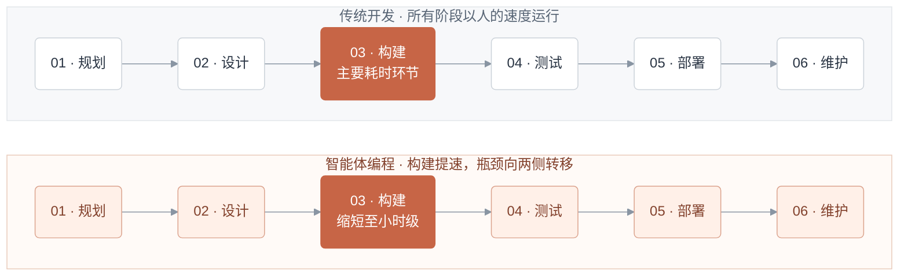
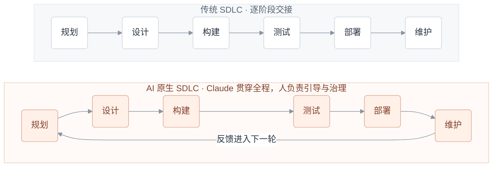
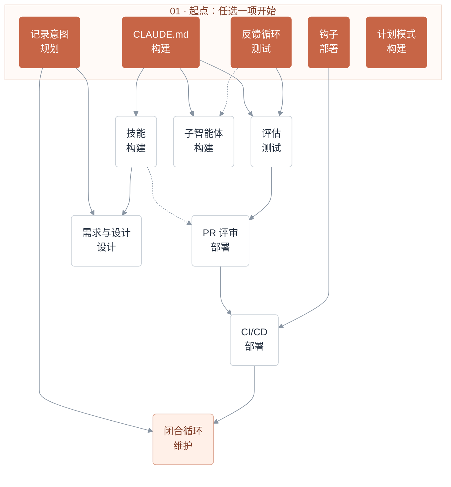

# AI 原生软件开发生命周期（SDLC）实践手册

逐阶段运用 AI，改造你的软件开发生命周期。

## 阅读说明

### 来源与整理范围

- 原文：[The AI-native SDLC playbook](https://claude.com/blog/the-ai-native-sdlc-playbook)。
- 作者与发布机构：Louis Claxton，Anthropic；原文页面发布日期：2026-08-21。
- 中文整理日期：2026-09-28；基于已有中文稿进行目录收录与标题结构适配，保留正文、示例和 Mermaid 图。
- 本文为中文翻译整理，正文中的“我们”“应用 AI 团队”等表述指原作者及 Anthropic 团队，不代表本仓库作者的实施经历。
- 实践以 Claude 生态为例；产品名称、预览状态、权限和计费描述保留中文稿口径，本次未逐项验证产品功能，也未执行代码示例。实际采用前应核对对应官方文档。
- 原文及译文内容的权利归原权利人所有；收录不改变原文的权利归属。

### 章节导航

- [代码不再是瓶颈](./playbook.md#sd-c1)
- [什么是 AI 原生 SDLC](./playbook.md#sd-definition)
- [实践方法](./playbook.md#sd-c2)
- [阶段 1：规划](./playbook.md#sd-s1)
- [阶段 2：设计](./playbook.md#sd-s2)
- [阶段 3：构建](./playbook.md#sd-s3)
- [阶段 4：测试](./playbook.md#sd-s4)
- [阶段 5：部署](./playbook.md#sd-s5)
- [阶段 6：维护](./playbook.md#sd-s6)
- [结语](./playbook.md#sd-c9)

## 代码不再是瓶颈

### 构建提速后的瓶颈与治理变化

<a id="sd-c1"></a>

组织已经开始利用 AI，以一年前难以想象的速度编写代码，但围绕代码的流程并没有以同样的速度改变。

许多工程团队仍然沿用原来的审批关卡、评审、交接和制度，阻碍了 [Claude Code](https://claude.com/product/claude-code) 等智能体编程工具带来的生产力提升。

软件开发生命周期（SDLC）是软件从想法走向生产环境的过程。大多数组织采用的流程，都是六个基本阶段的某种变体：规划、设计、构建、测试、部署和维护。传统上，每个阶段相互独立，由不同角色负责：产品经理编写需求，技术架构师将需求转成设计，工程师实现设计，受监管企业的 QA 团队进行验证，发布团队交付，运维团队监控运行情况。工作通过文档、工单和签字批准在各阶段之间流转。

传统 SDLC 强调流程，以确保每一步都有明确的责任和控制。然而，它所追求的效率，建立在“编写和实现代码是最耗时、最昂贵的环节”这一时代前提之上。这个前提已经改变。产品需求文档（PRD）、工作量估算流程和产品安全评审，原本都是为了在可能持续数周、数月甚至数个季度的开发过程中，强制各方达成一致。

传统 SDLC 的控制措施还假定，每一步都由人来执行。获得最大价值的组织，已经围绕智能体 AI 现在能够完成的工作重建流程，同时确保人仍然参与其中。本指南结合我们服务客户的经验，介绍应用 AI 团队在内部将 Claude 融入 SDLC 各阶段的若干最佳实践，以加快开发和流程运转。

当代码不再是瓶颈，构建阶段的速度超过传统 SDLC 所能承接的程度时，会出现三个变化：

1. **瓶颈向构建阶段的两侧转移。** 主要是规划、评审／测试和部署，这些环节仍然以人的速度运行。
2. **控制措施脱离现实，变得难以执行。** 当代码由人编写时，逐行人工审查是合理的；当大部分差异由智能体生成时，这种方式就跟不上了。
3. **治理成本上升。** 例外情况仍然需要提交给每周或每月才召开一次的会议和委员会处理。



*图 1：构建不再是限制因素，周围以人的速度运行的环节才是。人工阶段的时长保持不变，而构建缩短到了小时级，释放出一部分周期时间。原图通过宽度示意耗时变化，没有给出具体比例；此处用文字表达这一点。*

以安全瓶颈为例。安全团队的人员规模是按人的代码产出配置的。当智能体成倍增加代码产出时，要么评审队列不断积压，要么代码在审查不足的情况下上线。受监管组织无法接受任何一种结果，因此安全和策略检查必须跟上智能体的速度。

要更好地实现智能体 AI 带来的生产力提升，并保障其安全，传统 SDLC 需要经历与代码实现阶段同等程度的转型。

## 什么是 AI 原生 SDLC？

### 从阶段交接到产物驱动的循环

<a id="sd-definition"></a>

AI 原生 SDLC 重新设计了开发流程，将原有的控制目标与新的执行方式结合起来。流程从线性变为循环，AI 嵌入每个环节。AI 原生 SDLC 推动自动交接和后续实践的自动触发，以解决传统 SDLC 各阶段之间依赖人工、交接笨重的问题。

你也可能听到“智能体式 SDLC”“AI SDLC”或“智能体软件开发”等说法。名称不同，描述的是同一种变化。



*图 2：传统流程中，一次缓慢的回流意味着新的发布周期；AI 原生循环以小时而非周为单位，人在循环之上发起、引导和治理。原图把 Claude 放在循环中心，表示其参与整个生命周期；这里通过分组标题保留这一含义。*

### AI 原生 SDLC 六个阶段的变化

下表展示了传统 SDLC 与 Claude 支持的 AI 原生 SDLC 这两个端点。大多数组织处于两者之间。

| 阶段 | 传统 SDLC | AI 原生 SDLC |
| --- | --- | --- |
| 规划 | 由委员会收集需求，经过工作坊和签字批准提炼，再人工编写 | Claude 直接从信息源归纳痛点，写入人能理解、机器能执行的 `intent.md` |
| 设计 | 分析师编写规格，设计师再解读 | 与智能体的一次工作会话完成需求和设计，以技能编码的标准为指导，并在 Git 中管理版本 |
| 构建 | 人工编写测试和代码，主要开发完成后再补文档 | AI 生成测试和代码；组织知识保存在有版本记录、机器可读的 `CLAUDE.md` 和技能中 |
| 测试 | 在阶段边界设置 QA 关卡 | 在实现过程中持续开展评估（evals） |
| 部署 | 人工逐行审查代码，在评审周期中实施治理，而且常常不一致 | 多层智能体评审，人工评审集中于受监管和关键代码；AI 执行动作时即实施治理，以钩子作为审批关卡 |
| 维护 | 人工监控生产环境中的缺陷 | 智能体监控线上部署；指标突破控制带后进行诊断，并以新的 `intent.md` 写回循环 |

贯穿右侧各阶段的是**已提交的产物**。每个阶段结束时，都会向版本控制系统写入一个产物，包括 `intent.md`、`spec.md`、`plan.md`、代码差异及测试、包含评审发现的 PR，以及事件记录。下一阶段从读取这个产物开始。前几个阶段主要使用 `.md` 文件，因为产品负责人和智能体都能阅读同一份文件并据此行动。从构建阶段起，产物则是代码及其相关记录。提交链同时也是审计轨迹：谁提出了什么要求、智能体产出了什么、谁批准了它。

凡是需要判断的决策，责任仍然由人承担。在智能体式 SDLC 中，人的关注点随着待审查的产物一起转移。

> 每个阶段都提交下一阶段能够读取的产物。意图、规格、计划、代码差异和评审发现，共同组成审计轨迹。

## 实践方法

### 实践依赖与采用顺序

<a id="sd-c2"></a>

这些实践是本手册的核心，分为规划、设计、构建、测试、部署和维护六个非线性阶段，共同覆盖完整生命周期。

每项实践都说明：

- 有哪些变化；
- 如何开始；
- 具体实施步骤；
- 治理方面的考虑；
- 如何衡量是否有效。

这些步骤是模块化的。组织可以根据自己的需求，在不同时间优先改造不同阶段。每项实践都会在“前置条件”中列出依赖，下面的依赖图进一步展示了这些关系。

一个阶段以提交产物结束，这次提交又启动下一个阶段：被接受的 `intent.md` 触发需求和设计，被批准的 `spec.md` 触发计划模式，合并的 PR 触发流水线，生产环境中被突破的控制带则产生下一份 `intent.md`，循环由此持续。

起初，你需要手动提示每一步。最终目标是形成一个循环：每个被接受的产物都触发下一道关卡。人的注意力集中在关卡处，审查智能体标记的问题，而不再从头启动每个阶段。



*图 3：节点标注了所属阶段，箭头表示采用这些实践的先后依赖，两者不是一回事。可以从任意橙色节点开始：没有箭头指向它，意味着不必先采用其他实践。其余节点的入向箭头表示应先采用哪些实践。此图保留原图的实线和虚线；原图没有提供虚线图例，因此不另行赋予其含义。*

## 阶段 1：规划

### 将意图记录为 intent.md

<a id="sd-s1"></a>

想法不再等待别人来整理。发起者用自己的语言，将意图一次性记录为受版本控制的产物，供下一阶段直接使用。

启动软件开发流程的 `intent.md` 可以来自不同入口：某个人提出想法、有人提交工单，或告警揭示了事件，参见阶段 6：维护。

当一个人有了想法，他可以与 Claude 进行头脑风暴，生成 Markdown 格式的初步规格。在传统 SDLC 中，同一个人还需要说服产品团队成员，与自己共同整理这个想法，或者代为编写。

Claude 生成的初步规格可供人阅读、受版本控制，并能立即被下一阶段使用，保存为 `intent.md`。

无论意图来自事件触发还是智能体，步骤都相同：产品负责人在提交前审查并修正智能体编写的 `intent.md`。

**传统方式：** 想法经过待办条目、用户故事、故事点和需求细化会议后，才有人能够采取行动。每次交接都会转移责任，因此到达工程团队时，内容已经与发起者最初的意图隔了好几层。

**AI 原生方式：** 发起者与 Claude 讨论，将结果写成 `intent.md`，用自己的语言形成初步规格，说明想要什么、为什么，以及有哪些约束。重复性流程通过技能编码。

#### 如何开始

- **前置条件：** 无。
- **基础设施：** 为非工程人员提供 Claude 访问权限，可使用 claude.ai 或 [Cowork](https://claude.com/product/cowork)；约定 `intent.md` 模板；建立由产品负责人关注、共享且受版本控制的意图存放位置。对单一产品，最简单的是产品仓库中的 `intent/` 目录，使产物链与由其产生的代码放在一起。只有当意图横跨多个仓库时，独立意图仓库才值得额外维护；在单体仓库中使用目录即可。阶段 3 的补充说明会讨论它与已有 Jira 或需求工具之间的关系。

这些配置由平台或工程团队一次性完成。需要一位技术人员建立意图存放位置，并决定谁能写入，因为许多贡献者来自组织中的其他部门。

仓库建立后，不熟悉 Git 的贡献者无需直接使用 Git。通过版本控制系统连接器，例如 GitHub 连接器，Claude 可以从 claude.ai 或 Cowork 代为提交 Markdown 文件。

#### 执行步骤

1. 发起者用自己的语言向 Claude 描述问题：现在做不到什么、谁受影响、改善后的状态是什么、哪些不在范围内。不需要正式措辞。
2. 通过头脑风暴将想法具体化。Claude 会像分析师一样询问范围、用户、约束和成功标准。
3. 要求 Claude 按组织模板写成 `intent.md`。模板可以编码为技能，由技术人员建立并由负责人批准，涵盖问题、预期结果、受影响的用户与系统、约束和待解决问题。
4. 发起者纠正 Claude 的误解。
5. 将 `intent.md` 提交到共享位置。作者与时间戳进入记录，由产品负责人继续处理。

```markdown
# 意图：理赔状态自助查询
作者：J. Ortiz（理赔运营）。状态：草稿。

## 问题
客户致电联络中心，询问理赔进展。
处理人员约三分之一的通话时间用于仅查询状态的来电。

## 预期结果
客户可以在门户中查看理赔状态、下一步和预计日期。

## 受影响的用户与系统
理赔处理人员、门户团队、claims-core API。

## 约束
门户会话中不新增个人身份信息（PII）。仅使用现有身份认证。

## 待解决问题
第三方理赔核损人员是否也需要访问？
```

#### 治理考虑

证据是已提交的 `intent.md`，其中包含作者、时间戳和完整修订历史，记录在意图存放位置的 Git 历史中。由产品负责人批准；决定是否进入阶段 2 的接受或拒绝意见，以合并记录或关闭评审的记录保存。

#### 如何衡量

- **先行指标：** 从首次讨论到提交 `intent.md` 的时间，通过记录作者和时间戳的 Git 历史获取。预期从数周的需求收集和细化周期缩短到数小时。
- **滞后指标：** 存活率，即产品负责人接受并送入阶段 2，而非关闭的 `intent.md` 比例。接受或拒绝由产物合并或评审关闭记录体现。此外，统计同一变更的首个 `spec.md` 提交之后，`intent.md` 又修改了多少次。

## 阶段 2：设计

### 需求与设计

<a id="sd-s2"></a>

需求与设计合并到一次会话中。编写规格时就应用策略，而不是数周后的评审才发现问题。

产品负责人批准后，Claude 读取被接受的 `intent.md`，在组织关于品牌、安全、合规和用户体验的[技能](https://code.claude.com/docs/en/skills)指导下，生成需求与设计规格。

产品负责人负责审查，而不必亲自编写。目标是产出一份工程团队能够据此制定计划、并标出了疑虑点的规格。

前端工作最能说明这一点：`intent.md` 被接受后，产品负责人基于它在 [Claude Design](https://claude.com/product/design)（测试版）中制作设计原型，迭代后导出到 Claude Code 进行构建。

**传统方式：** 需求和设计由不同团队分别完成。分析师将想法正式化为需求，设计师再解读并转成设计。分离有助于明确责任，但过程缓慢且存在信息损耗。

**AI 原生方式：** 两个阶段在一次提示驱动的会话中完成。Claude 根据 `intent.md` 生成需求与设计规格，以组织技能为约束，并标记疑虑点。

#### 如何开始

- **前置条件：** 编写 `intent.md`，并将品牌、安全、合规和用户体验策略编写为技能。
- **基础设施：** 一位拥有 Claude 访问权限的产品负责人，无需具备工程技能。

#### 执行步骤

1. 产品负责人开启一个可使用组织技能的会话，附上 `intent.md`。
2. 提示词指向 `intent.md`，说明约束，并要求标记疑虑点。起初手动运行，再将其固化为组织级斜杠命令。随后，以共享位置中 `intent.md` 被接受为触发条件：合并后运行非交互任务，加载组织技能完成这一轮工作，并以 PR 形式提交 `spec.md`。阶段 5 的 CI/CD 实践介绍具体接入方式。此后，产品负责人首次介入的环节就是评审。
3. 由同一位产品负责人对照原始想法审查规格：是否解决了提出的问题？`intent.md` 中的待解决问题是否得到回答或被继续保留？
4. 优先处理标记的疑虑，因为这些正是分析师原本会升级处理的问题。在工程团队看到规格前，产品负责人应与相应策略负责人逐一解决。
5. 将 `spec.md` 与 `intent.md` 放在一起提交。这两个文件记录“提出了什么”和“决定了什么”。
6. 产品负责人决定规格和意图是否进入构建阶段；对组织认定的高风险事项，咨询技术负责人。这个决定始终由人作出，接受规格后启动阶段 3 的计划模式实践。

#### 示例：提示词

```text
阅读附带的 intent.md，生成一份将其融入现有代码库的需求与设计规格。
应用你可以使用的技能，使方案符合我们的品牌指南、安全策略和用户体验标准。
将完整规格写入 spec.md，使其可以直接交给工程团队。
清楚说明任何疑虑，尤其是相互矛盾、无法同时满足的策略。
```

#### 治理考虑

编写规格时就读取并应用现行策略，而不是数周后的评审才发现问题。组织技能作为规格的约束。规格、生成它的提示词及当时生效的技能版本，都记录在版本控制中。产品负责人批准规格，并将疑虑交给明确指定的策略负责人。

#### 如何衡量

- **先行指标：** 同一变更从 `intent.md` 提交到 `spec.md` 提交的耗时，即两个 Git 时间戳之差，与过去“需求加设计”的周期比较。
- **滞后指标：** 构建开始后的需求返工。统计同一变更首个 `plan.md` 提交之后的 `spec.md` 提交次数，直接通过 Git 日志获取。

## 阶段 3：构建

### 默认从 Claude Code 计划模式开始

<a id="sd-s3"></a>

没有被接受的计划，就不进入实现。组织知识变成智能体读取的文件，防护措施以代码运行，而不再依赖习惯。

工程师以[计划模式](https://code.claude.com/docs/en/permission-modes)启动 Claude Code 会话，提供阶段 2 中已批准的 `spec.md`，让 Claude 向自己提问，不断迭代计划，直到满意。

**传统方式：** 工程师阅读设计后开始编写代码。如何修改、涉及哪些文件和测试，通常只存在于工程师脑中，最多写在工单评论里，别人无法评审。评审者第一次看到的是已经完成的代码差异，这时返工已经很慢。

**AI 原生方式：** 工作始于 Claude 在计划模式中生成的书面计划。此时它可以读取代码库，但不做修改。工程师在写代码之前纠正计划，将批准后的版本提交为 `plan.md`，供后续阶段对照检查。

#### 如何开始

- **前置条件：** 如已有意图产物，提供 `intent.md` 或 `spec.md`；`CLAUDE.md` 也有帮助。
- **基础设施：** 能访问仓库的 Claude Code。

#### 执行步骤

1. 工程师以计划模式开启会话。
2. 提供 `intent.md` 和 `spec.md`，要求生成实现计划，明确要修改的文件、工作顺序，以及证明结果的测试。
3. 追问计划：变更可能破坏什么？哪一步风险最高？Claude 没有选择哪些其他方案？
4. 不断迭代，直到一位没看过对话的工程师，仅凭计划就能实现变更。
5. 将批准的计划提交为 `plan.md`，纳入审计轨迹。阶段 5 的 PR 评审会对照它检查最终差异。
6. 接受计划并让 Claude 实现。计划足够扎实时，实现往往一次就能完成。
7. 实现偏离计划时，在同一次提交中更新 `plan.md`。可以考虑用钩子强制两者同步。

#### 示例：plan.md

```markdown
# 计划：理赔状态自助查询（来自 2026-06-02 的 intent.md）

## 要修改的文件
portal/src/claims/StatusPanel.tsx（新增）、claims-api/routes/status.py、
claims-api/tests/test_status.py

## 工作顺序
1. 在现有身份认证保护下增加状态端点。
2. 制作调用该端点的面板。
3. 接入门户导航。

## 风险
claims-core API 限流为每秒 50 个请求；面板必须缓存。

## 验证证据
test_status.py 覆盖四种理赔状态；截图与已批准的原型一致。
```

#### 治理考虑

设计评审发生在任何代码生成之前，此时改变方向只需修改文档。计划模式本身会约束这一点：工程师接受计划之前，Claude 无法编辑文件。计划、修订及接受者都被记录。常规变更由工程师批准，组织认定的高风险事项交给技术负责人或架构师。

#### 如何衡量

- **先行指标：** 首轮实现即可合并的变更比例，以及计划批准到 PR 合并的时间，数据来自 PR 元数据。
- **滞后指标：** 每项变更的返工轮次，同样来自 PR 元数据；以及合并后的差异仍符合已提交 `plan.md` 的频率。

### Claude Code 自动模式

Claude Code 也能以自动模式运行：工程师反复审阅并批准计划后，Claude 应用每项变更时，不再逐次弹出编辑确认。随着后文的防护措施逐渐成熟——经过调优的 `CLAUDE.md`、编码策略的技能、阻止不安全操作的钩子，以及 Claude 能运行的测试套件——自动接受会成为常规工作的默认方式。这类工作应有严格限定的 `spec.md`、较小的影响范围，以及已有测试覆盖的代码。

人的工作从盯着智能体编辑、逐项审查动作，转向在较长的自主会话结束后审查产物。自动接受模式结合 worktree，还能支持个人和团队层面的并行工作，是自主运行 SDLC、实现阶段 6 所述闭环的基础。

### 补充说明：遗留系统与权威记录来源

*适用于整个流程产生的所有产物。*

现有 SDLC 很可能已经在跟踪产物，只是没有使用 Markdown 文件。工作项可能在 Jira 中，需求可能在内置监管可追溯性的工具中，设计在 Figma 中，变更批准则由变更委员会记录。这些系统很难替换，因为审计人员和监管机构已经认可它们，其他团队也依赖它们。因此，AI 原生 SDLC 必须适配已有系统。

转型时，应为流程产生的每类产物指定一个权威记录来源，其他位置只保留副本或指向原件的链接。不同产物可以作不同选择：

- **仓库作为权威来源。** Markdown 产物是正式记录，遗留系统引用某次提交中的文件。对工程主导的组织，这是较为清晰的配置：全部记录位于同一个工具中，以同一个系统的时间戳为准。
- **遗留系统作为权威来源。** Jira、ServiceNow 或需求工具保存正式记录，Markdown 产物作为工作副本。Claude 在会话开始时读取记录，并在生成规格或计划的同一次会话中，通过 [MCP](https://code.claude.com/docs/en/mcp) 连接器将结果写回。
- **至少建立双向关联。** 每份产物注明原始记录 ID，每条遗留系统记录保存 Markdown 文件的提交 SHA。这是转型初期的良好起点，但要承认此时存在两个记录来源。

遗留系统和 Markdown 优先的系统可以共存，前提是两者之间存在关联，或明确指定其中一个为权威来源。

### CLAUDE.md

[`CLAUDE.md`](https://code.claude.com/docs/en/memory) 向 Claude 提供新成员入职时所需的上下文，包括约定、命令、架构和团队最常见的错误。过去留在人们脑中或 Wiki 上的知识，变成智能体每次会话开始时读取的文件，由全团队共同维护，并在出现错误时迭代。

#### 如何开始

- **前置条件：** 无。
- **基础设施：** 一个仓库、已安装的 Claude Code，以及一位熟悉代码库的工程师。

#### 执行步骤

1. 在仓库中运行 `/init`。Claude 根据发现的内容生成初始 `CLAUDE.md`。
2. 将生成的文件精简到新人第一天需要知道的内容：保留构建、测试和 lint 命令，重要约定，以及 Claude 反复犯错的地方。
3. 将 `CLAUDE.md` 放在仓库根目录并提交到 Git，全团队共享同一版本，像代码一样评审变更。
4. 制定一条实用规则：Claude 同一个错误犯了两次，就把纠正方法写入 `CLAUDE.md`。
5. 控制在一页以内。Claude 每次会话开始都会读取全文，过时内容只会无益地占用上下文。

#### 示例：CLAUDE.md

```markdown
# 支付服务

## 命令
- 构建：make build
- 测试：make test（单元测试）、make itest（集成测试，需要 Docker）
- Lint：make lint（CI 中会运行；推送前修复）

## 约定
- Java 21、Spring Boot 3。不新增 Lombok 使用。
- 金额始终使用 BigDecimal，不使用 double。
- 每个端点都需要在 src/itest 中有集成测试。

## 架构
- api/ 存放 REST 控制器，core/ 存放领域逻辑，
  adapters/ 负责与外部系统交互。
- Kafka 事件定义在 schemas/；不要编辑生成的类。

## Claude 容易犯的错误
- 不要升级依赖版本，由平台团队负责。
- 遗留 v1/ 包已冻结；变更应放在 v2/。
```

#### 治理考虑

`CLAUDE.md` 受版本控制，因此智能体遵循的指令可评审、可审计。文件承载团队约定，Git 历史记录其变更，代码负责人在 PR 评审中批准这些修改。

#### 如何衡量

- **先行指标：** Claude 重复犯下本应被 `CLAUDE.md` 避免的错误的频率。对文件的纠正和修改应记录在 Git 历史中。
- **滞后指标：** 新团队成员首次合并 PR 所需的时间，来自 PR 历史。

### 用技能承载组织知识

技能让组织知识真正参与执行。指令明确、受版本控制、被广泛应用，并在策略变更时集中更新。经验法则是：需要一致执行的组织知识，应写成技能；属于 `CLAUDE.md` 或单次提示词的内容，不必写成技能。

#### 如何开始

- **前置条件：** 无硬性要求。`CLAUDE.md` 有帮助，因为它将智能体工作所需的知识保存在仓库中，但技能并不依赖它。
- **基础设施：** 一项有明确负责人、并有书面权威来源的策略。

#### 执行步骤

1. 选择一项目前执行不一致的知识，例如安全标准、API 设计约定或品牌规则。
2. 将其写成技能：一个包含 `SKILL.md` 的目录，文件前置信息说明何时触发，正文说明具体做法。工程师依据策略负责人的权威文档编写，可借助 Claude。
3. 将技能放入仓库的 `.claude/skills/<name>/`，随代码分发；或通过[插件](https://code.claude.com/docs/en/plugin-marketplaces)在整个组织分发。
4. 测试触发情况。用不同表述要求 Claude 执行相关任务，确认每次都加载技能。
5. 策略改变时更新技能，由策略负责人批准。工程师在下次会话中自动使用新版本。

#### 示例：.claude/skills/secure-api-review/SKILL.md

```markdown
---
name: secure-api-review
description: 应用 API 安全标准。在创建或修改对外端点、
  评审 API 代码或生成 OpenAPI 规格时使用。
---
# API 安全评审

创建或修改 API 端点时：
1. 身份认证：每个端点都要求网关 JWT；除 /health 外，不允许匿名路由。
2. 输入校验：依据 OpenAPI schema 校验请求体，拒绝未知字段。
3. 审计：每个改变状态的端点，都发出包含操作者、动作、实体和时间戳的审计事件。
4. 数据分类：schema 中标记为 pii 的字段，绝不能出现在日志或错误消息中。

运行 scripts/check-endpoints.sh，并在总结中包含输出。
```

#### 治理考虑

技能是一种控制措施，但属于指导性控制。它提高 Claude 在写代码时遵循策略的可能性，却没有机制强迫会话遵从。必须始终成立的策略，需要确定性机制兜底，例如阻止操作的[钩子](https://code.claude.com/docs/en/hooks)，或在 PR 中重新检查策略的评审环节。技能使违规变少，钩子则使违规接近不可能。技能调用记录在会话轨迹中，策略负责人像评审代码一样评审技能变更。

#### 如何衡量

- **先行指标：** 从策略负责人批准策略变更，到更新后的技能合并的时间，来自技能目录对应的 PR。
- **滞后指标：** PR 评审中引用该策略的问题数量。当技能在代码编写过程中应用策略时，这个数字应该趋近于零；如果没有，可能是技能未触发，也可能是技能文本已偏离正式策略。

### 用钩子实现构建期防护

技能是指导性控制，钩子是其背后的确定性执行层。Claude 在实现阶段的大多数动作都是文件编辑和 Shell 命令，因此构建可能是钩子最频繁触发的阶段。

构建期钩子可以：

- 阻止编辑受保护路径，例如生成的类或已经冻结的包；
- 在文件编辑后运行格式化工具和 linter，避免偏差累积；
- 阻止凭据进入代码差异。

对于必须无例外执行的策略，应为相应技能配备钩子。钩子会在每个匹配动作上运行，所以构建期钩子要快，并限定在变更文件范围内。完整测试套件等较重的检查，应放在提交或 PR 阶段。

需要人工批准的钩子应放到阶段 5 的审批关卡中。否则，构建过程中的确认提示会让人重新成为所有并行会话关键路径上的依赖。

### 并行会话与子智能体

一位工程师可以同时推进多条工作线。

**并行会话**是另一个完整的 Claude Code 实例，在自己的 [Git worktree](https://code.claude.com/docs/en/worktrees) 中执行独立任务。会话彼此不了解，唯一共享的是负责引导它们的工程师。

**子智能体**在单个会话内部运行，是具有明确范围的助手，拥有独立上下文窗口和工具限制，适合多个任务中反复出现的工作，例如验证应用是否按预期运行。

并行会话增加工程师同时推进的任务数量，子智能体则帮助每个会话专注于自身任务。工程师负责引导和审查它们。

**传统方式：** 工程师一次做一个任务，每天或每周有大量时间花在等待构建、测试和评审上。等待时可以切换任务，但上下文切换让人疲惫，因此很少有人这样做。

**AI 原生方式：** 一位工程师同时运行多个 Claude 会话，每个会话在独立 worktree 中执行自己的任务。重复工作交给拥有独立上下文和工具限制的子智能体。工程师转向编排，最终转向建立和监控循环。

#### 如何开始

- **前置条件：** `CLAUDE.md`，因为所有会话都会读取它。阶段 4 的反馈循环也有帮助：会话能自行验证时，需要的监督更少。
- **基础设施：** Git 仓库，用 worktree 隔离工作；调好的权限设置，避免组织认定安全的命令也要等待审批。

#### 执行步骤

1. 根据计划模式产出的计划，将工作拆成修改不同文件的任务，判断哪些相互独立。共享文件的任务放在同一会话中顺序执行。
2. 每个并行任务使用独立 worktree，例如一个终端运行 `claude --worktree feature-auth`，另一个运行 `claude --worktree fix-rate-limit`。每个 worktree 是独立分支上的单独检出，避免会话修改文件时冲突。
3. 从两三个会话开始比较合理。实际上限取决于一个人能认真审查多少条工作线，只有评审跟得上时才增加会话。
4. 将重复工作定义为[子智能体](https://code.claude.com/docs/en/sub-agents)，存放在 `.claude/agents/` 下的 Markdown 文件中，写明名称、使用时机和允许使用的工具。例如主智能体完成后清理多余复杂度的代码简化助手、运行应用并检查行为的验证助手，或探索代码库并汇报结果、避免挤占主上下文的研究助手。将定义提交到 Git，供全团队共享。

#### 示例：.claude/agents/verifier.md

```markdown
---
name: verifier
description: 在会话报告完成之前，运行应用并检查变更是否有效。
tools: Bash, Read
---
使用 make run 启动应用。实际执行发生变化的行为，以及最相邻的两个流程。
报告运行了什么、观察到了什么，以及哪些行为不符合 plan.md。
不要修复任何内容，只报告结果。
```

#### 治理考虑

更多会话意味着更多产出，因此控制措施必须来自仓库配置。其中的钩子和权限设置应用于所有会话，会话执行的动作被记录，并归属于启动它的工程师。

#### 如何衡量

- **先行指标：** 在评审质量不下降的情况下，每位工程师的并发会话数量，通过 OpenTelemetry 导出数据统计；以及一天中用于引导而非等待的时间比例。
- **滞后指标：** 每位工程师每周合并的变更数量，并结合 PR 历史中的返工率一起看。

## 阶段 4：测试

### 为 Claude 建立反馈循环

<a id="sd-s4"></a>

每个会话在人看到结果之前先检查自己的工作；指导智能体的配置，也要像它编写的代码一样进行回归测试。

始终给 Claude 一种验证自身工作的方式，例如测试、构建或截图差异。这样，会话就能在工程师看到结果之前检查并修正自己的错误。

不要把反馈循环与阶段 3 的验证子智能体混淆。反馈循环贯穿整个任务，随着工作进展反复运行；验证子智能体则是封装最终检查的一种方式，在会话认为自己完成后，使用新的上下文窗口检查结果，避免结论被生成代码时的假设影响。

**传统方式：** 代码是否有效的信号来得很晚：几分钟后的 CI、几天后的测试人员反馈、几周后的生产环境反馈。代码由智能体生成时，迟到的信号意味着必须有人检查全部产出，这个人就成了瓶颈。

**AI 原生方式：** 给会话工具，让它在人看到结果之前自行检查：运行测试、执行构建、获取截图。Claude 迭代直到检查通过，工程师接手时，结果已经完成这些检查。建立循环的责任属于运行会话的工程师，以下步骤面向这一角色。

#### 如何开始

- **前置条件：** 无。
- **基础设施：** 测试套件和构建各自能用一条本地命令运行。对 UI 工作，必须让 Claude 能看到结果：可以提供浏览器工具，或通过 MCP 接入截图工具。

#### 执行步骤

1. 如果现有验证需要一系列命令和环境知识，将其封装为 `make test` 或 `npm test` 之类的单一入口，失败时返回非零退出码。
2. 在 `CLAUDE.md` 的命令部分列出每条命令，并给出正常输出示例。
3. 明确可量化的目标，让 Claude 无需询问就能检查。例如：“`test_status.py` 中所有测试通过”“截图与附带原型一致”或“端点返回 200 且包含新字段”。
4. 修复缺陷时，先编写失败测试。让 Claude 用测试复现问题，运行并确认失败原因符合预期，然后提交测试。之后才要求 Claude 在不修改测试的前提下使其通过，并用最后一步的测试文件钩子强制执行。修复前就存在、且智能体无法改写的测试，是缺陷已经消除的证据。
5. UI 工作通过视觉检查闭环。向 Claude 提供浏览器或截图工具及原型，让它执行“实现、截图、比较、调整”的迭代。两三轮很正常，每轮都应有所改善。
6. 将验证纳入“完成”的定义，把指令写入 `CLAUDE.md`。报告完成前运行测试，并展示输出。
7. 保护反馈循环本身，防止修代码的智能体弱化对代码的检查。可以用钩子阻止修复任务编辑测试文件；另一种方式是在评审中检查差异，拒绝任何触及测试的变更。

#### 示例：CLAUDE.md 中的验证部分

```markdown
## 验证你的工作

- 构建：make build（必须以 "Build succeeded" 结束）
- 测试：make test（全部通过；绝不跳过或删除失败测试）
- Lint：make lint（零警告）

报告任何任务完成之前，运行以上三项并粘贴输出。
如果测试失败，修复代码，不要修改测试。
```

#### 治理考虑

- **强制执行什么：** 报告完成前进行验证，以及修复期间禁止编辑测试文件。组织需要保证这两点时，均通过钩子实现。
- **证据是什么：** Claude 实际运行并粘贴的 `make test` 原始输出、构建日志或截图差异，证据来自工具链。
- **记录在哪里：** 会话记录由 OpenTelemetry 导出到组织的可观测性系统；PR 的检查运行记录中也保留，评审者和后续审计人员都能查看。
- **谁来批准：** 评审 PR 的代码负责人。机械性验证证据已经附上，他们可以集中判断意图和风险。

#### 如何衡量

- **先行指标：** 智能体编写的变更首次运行 CI 的成功率，CI 系统已有这类数据。
- **滞后指标：** 每个 PR 的评审时间，来自 PR 元数据。测试能够发现过去由评审者发现的问题后，这个时间应下降；另一个指标是事件跟踪系统中的变更失败率。

### 在 CI 中持续评估

评估（evals）相当于 AI 原生环境中的阶段关卡 QA。实际做法是：智能体配置发生变化时运行评估套件。更换模型或改写提示词后，评估告诉你，智能体是否仍能按相同标准完成工作。

评估套件应持续更新。随着模型改进，曾经能够区分能力的案例可能不再有区分度，需要加入持续监控中发现的新案例。

根据使用场景，有些团队可能选择按固定周期离线评估，而不是每次变更都运行。以下步骤针对持续评估。

#### 如何开始

- **前置条件：** `CLAUDE.md` 和本阶段的反馈循环。
- **基础设施：** 能以非交互方式运行 Claude Code 的 CI，以及具备评估运行预算的 API 密钥。

#### 执行步骤

1. 平台工程师从近期工作中收集 20～50 个真实任务，以及预期或已接受的结果。
2. 将每个任务写成评估案例：提示词加上定义合格结果的检查，例如测试通过、lint 无问题、行为不变、遵循策略。
3. 套件在 CI 中以非交互方式定时运行，并在 `CLAUDE.md`、技能或钩子发生变化时运行。这些配置决定智能体行为，应像代码一样接受回归测试。
4. 以评估结果作为配置变更的合并关卡。导致通过率下降的技能变更，必须在合并前评审。
5. 每起生产事件都由负责团队编写一个评估案例，永久留在套件中作为回归测试。

#### 示例：.github/workflows/agent-evals.yml

```yaml
name: Agent evals
on:
  pull_request:
    paths: ['CLAUDE.md', '.claude/**']
  schedule:
    - cron: '0 2 * * *'
jobs:
  evals:
    runs-on: ubuntu-latest
    steps:
      - uses: actions/checkout@v4
      - run: npm install -g @anthropic-ai/claude-code
      - name: Run eval suite
        env:
          ANTHROPIC_API_KEY: ${{ secrets.ANTHROPIC_API_KEY }}
        run: |
          for eval in evals/*.json; do
            claude -p "$(jq -r '.prompt' $eval)" \
              --allowedTools "Read,Edit,Bash(make test)" \
              --output-format json > result.json
            ./evals/check.sh "$eval" result.json
          done
```

#### 治理考虑

评估为 QA 提供跟得上智能体产出的关卡。通过率阈值作为合并检查强制执行，运行记录支持跨时间比较，由负责配置变更的团队批准修改。

#### 如何衡量

- **先行指标：** 每次运行报告的评估通过率随时间的变化，以及生产事件转化为永久评估案例所需的时间。
- **滞后指标：** CI 捕获的回归数量与生产环境发现的回归数量对比，依据事件跟踪系统的数据。

## 阶段 5：部署

### 将 AI 融入 PR 评审循环

<a id="sd-s5"></a>

评审双向进行，治理在智能体行动时实施。智能体可以完成生产审批关卡之前的工作，但不能越过关卡。

Claude 既提供评审，也接受评审。它依据组织策略审查收到的 PR，并处理自己提交的 PR 上的评审意见。工程师因此可以将注意力集中在行为上，也就是判断意图和风险。

**传统方式：** 评审能力按人的产出规划。PR 等待评审者通读，评审质量随工作负荷波动，作者不断催促，积压继续增长。

**AI 原生方式：** 所有 PR 都接受同一组评审检查，发现的问题按严重程度排序。人的注意力提升到更高一层：变更是否实现了计划意图，风险是否可以接受。

#### 如何开始

- **前置条件：** 阶段 3 中更新过的 `CLAUDE.md`；若评审要落实书面策略，则需要相应技能；已定义的子智能体。
- **基础设施：** 仓库已接入 Claude，可以是管理员启用的托管 [Code Review](https://code.claude.com/docs/en/code-review) 服务（研究预览版），也可以是在自有 CI 中运行的 [claude-code-action](https://code.claude.com/docs/en/github-actions)。需要时，通过 AWS Bedrock、Google Vertex 或 Microsoft Foundry 调用模型，具体部署选项见本阶段 CI/CD 实践。还值得配置要求代码负责人批准的分支保护策略。

#### 执行步骤

1. 托管 Code Review 服务是最快的起点：管理员启用服务并选择仓库。如果需要控制流水线，或通过组织自己的云服务协议调用 API，则在自有 CI 中运行 `claude-code-action`。
2. 技术负责人在仓库根目录编写 `REVIEW.md`，将评审策略分为组织关心的几轮检查：缺陷和逻辑错误；安全和漏洞；是否符合需求实践产生的 `spec.md`、计划模式产生的 `plan.md` 及设计原则。文件还应定义哪些算重要问题（Important）、哪些只是小问题（Nit），以及跳过哪些内容。
3. 技术负责人设定人工把关标准。评审发现本身不自动批准或阻止 PR，分支保护仍然要求代码负责人批准。如果平台工程师希望根据评审发现控制合并，可以读取检查运行发布的机器可读严重程度计数。
4. 评审者或作者在评论中标记 `@claude` 时，Claude 处理意见并推送修复。PR 讨论记录请求和变更。这个修复循环通过 `claude-code-action` 运行；在托管服务中，评论 `@claude review` 则表示请求重新评审。
5. 对 Claude 创建的 PR，可以进一步让它持续跟进直到合并。团队可用自定义斜杠命令封装循环：扫描未解决的评审意见和失败检查，修复并推送，直到全部检查通过、只等待代码负责人批准。
6. 将评审发现反馈到 `CLAUDE.md`。同一个错误第二次被指出时，在本次评审中把纠正方法写入文件。评审也读取 `CLAUDE.md`，因此下一次 PR 开始就能检查这一问题。评审还应指出哪些变更使 `CLAUDE.md` 过时。
7. 技术负责人每月调优一次：对评审发现评分以改进评审效果，并在 `REVIEW.md` 中限制小问题数量。排除生成文件和 CI 已经强制执行的检查。

#### 示例：REVIEW.md

```markdown
# 评审指令

## 检查轮次
执行三轮检查，并标注每个发现属于哪一轮：
- 缺陷：逻辑错误、损坏的边界情况、隐蔽的回归
- 安全：注入风险、身份认证缺口、日志中的个人身份信息（PII）
- 符合性：变更符合 spec.md、plan.md 和我们的设计原则

## Important 的定义
只有会破坏行为、泄漏数据或违反策略的问题才标为 Important。
风格和命名属于小问题（Nit）。

## 限制小问题数量
每次评审最多报告五个小问题，其余只汇总数量。

## 不要报告
src/gen/ 下的生成文件，以及 CI 已经强制执行的检查。
```

#### 治理考虑

职责分离仍被保留，因为编写代码的智能体没有途径批准自己的代码。`REVIEW.md` 中的策略应用于全部 PR；发现、修复、评分和批准都记录在 PR 历史中，因此 PR 本身就是审计记录。人通过分支保护机制，结合评审发现作出批准决定。

这些控制如何在生产规模下组合，可参见 [Anthropic 如何保护 AI 原生 SDLC](https://claude.com/blog/how-anthropic-secures-its-ai-native-software-development-lifecycle)。

#### 如何衡量

- **先行指标：** 首次评审所需的时间，预期降到分钟级；以及无需人工修改分支就能解决的评审意见比例，相关数据直接记录在 Git 平台中。
- **滞后指标：** 合并前发现的缺陷和漏洞，与逃逸到生产环境的问题数量对比，数据来自 PR 历史和事件跟踪系统。

### 用钩子实现审批关卡

阶段 3 中，钩子作为防护措施，无需人工参与即可允许或阻止动作。钩子也可以提出审批请求，暂停动作，直到指定人员批准，这正是发布关卡所需的能力。

这项实践放在部署阶段，是因为发布审批最容易说明它的用途，但钩子并不只用于部署：Claude 采取动作的任何地方都可以运行。例如，在构建阶段阻止没有变更工单的数据库迁移或基础设施修改，在测试阶段阻止修复任务编辑测试文件。

#### 如何开始

- **前置条件：** 无。
- **基础设施：** 一份列明变更流程所需审批的书面清单。

#### 执行步骤

1. 工程管理者与变更管理、合规团队共同列出必须保留的人工审批关卡，例如变更管理签字、发布授权和受保护路径修改。
2. 平台工程师将每个关卡实现为钩子：在 Claude 动作前运行的脚本，可以允许、请求审批或阻止动作。
3. 团队钩子放在受 Git 管理的 `.claude/settings.json` 中；不可协商的钩子放在平台或 IT 管理员拥有的托管设置中，个人工程师无法关闭。
4. 阻止动作时要说明原因，并在 Claude 输出中给出获得批准的路径。

#### 示例：.claude/settings.json

```json
{
    "hooks": {
      "PreToolUse": [
        {
          "matcher": "Bash",
          "hooks": [
            { "type": "command",
              "command": "${CLAUDE_PROJECT_DIR}/.claude/hooks/production-gate.sh" }
          ]
        }
      ]
    }
}
```

#### 关卡脚本：.claude/hooks/production-gate.sh

```bash
#!/bin/bash
# 生产部署需要明确的发布授权
cmd=$(jq -r '.tool_input.command' < /dev/stdin)
if [[ "$cmd" == *"deploy"* && "$cmd" == *"production"* ]]; then
   if [ -z "$RELEASE_APPROVAL" ]; then
     echo "生产部署需要发布授权。" >&2
     exit 2 # 退出码 2 阻止动作；消息会传给 Claude
   fi
fi
exit 0
```

#### 治理考虑

钩子就是审批关卡。关卡条件对每个人、每次动作都强制执行。允许和阻止的决定带时间戳记录。关卡也定义了什么算批准，例如已批准的变更工单或发布经理签字。

### 实例：受监管企业的托管设置

由平台团队通过移动设备管理（MDM）或管理控制台部署，工程师无法编辑或覆盖其中任何内容。

```json
{
  "permissions": {
     "deny": [
        "Read(.env*)", "Read(./secrets/**)",
        "WebFetch", "Bash(curl *)", "Bash(wget *)"
     ],
     "allow": [
        "Bash(git *)", "Bash(make build)",
        "Bash(make test)", "Bash(make lint)"
     ],
     "disableBypassPermissionsMode": "disable"
  },
  "allowManagedPermissionRulesOnly": true,
  "sandbox": {
     "enabled": true,
     "failIfUnavailable": true,
     "allowUnsandboxedCommands": false,
     "network": {
       "allowedDomains": ["git.internal.example.com", "registry.npmjs.org"]
     },
     "credentials": {
        "files": [
          { "path": "~/.ssh", "mode": "deny" },
          { "path": "~/.aws/credentials", "mode": "deny" }
        ],
        "envVars": [ { "name": "GITHUB_TOKEN", "mode": "deny" } ]
     }
  },
  "allowManagedHooksOnly": true,
  "disableSideloadFlags": true,
  "allowManagedMcpServersOnly": true,
  "strictKnownMarketplaces": [
     { "source": "github", "repo": "example-corp/approved-plugins" }
  ],
  "requiredMinimumVersion": "2.1.193"
}
```

**这些配置分别提供什么控制：**

- `permissions.deny` 阻止秘密信息进入智能体上下文，并阻止通过工具进行任意网络外连；`permissions.allow` 预先批准安全的日常工作循环，避免拒绝列表造成频繁确认的疲劳。
- `disableBypassPermissionsMode` 与 `allowManagedPermissionRulesOnly` 结合，意味着工程师、项目文件和命令行参数都不能扩大权限范围。
- `sandbox` 补上权限规则无法覆盖的缺口。在工具层禁止 `WebFetch`，并不能阻止 Shell 命令访问网络；操作系统层面的域名允许列表才会直接阻止外连。`failIfUnavailable` 和 `allowUnsandboxedCommands` 将沙箱变成关卡：无法初始化沙箱时，Claude Code 拒绝启动；在沙箱中失败的命令不能移到沙箱外重试。
- `credentials` 补上拒绝规则留下的缺口。`permissions.deny` 管理 Claude 的文件工具，但默认情况下，沙箱内的 Shell 命令仍可能读取 `~/.ssh` 或 `~/.aws/credentials`；这一配置禁止这些读取，并从每条沙箱命令的环境中移除指定秘密变量。
- `allowManagedHooksOnly` 确保只有本实践中配置的审批钩子能够运行，本地内容无法增加或替代它们。
- `disableSideloadFlags` 与 `strictKnownMarketplaces` 确保工程师机器上的技能、智能体、钩子和 MCP 服务器都来自组织批准的插件市场，而不是从主目录加载。
- `allowManagedMcpServersOnly` 将智能体可用的工具范围变为平台团队管理的允许列表。
- `requiredMinimumVersion` 拒绝启动低于已批准最低版本的程序，确保控制由组织实际评估过的版本执行。

请将以上配置视为需要按实际情况调整的起点，而不是直接复制的推荐方案。每一项禁止都会影响能力，适当平衡取决于仓库的数据分类。[设置参考](https://code.claude.com/docs/en/settings)说明了所有配置键，包括仅托管设置可用的键。

#### 如何衡量钩子本身的效果

- **先行指标：** 每道审批关卡的等待时间。每次钩子决定都会写入 OpenTelemetry 导出数据，包含时间戳及允许或阻止的结论，因此可以逐关卡查看等待情况。
- **滞后指标：** 引入钩子前后，违反关卡要求却进入生产环境的事件数量，来自事件跟踪系统。

### CI/CD 集成与部署

在 CI/CD 流水线中以非交互方式运行 Claude Code，通过沙箱保证长时间运行的智能体安全执行，经由 MCP 集成开放部署能力，并在智能体需要回滚之前充分演练回滚路径。

**传统方式：** 流水线运行确定性脚本，所有需要判断的事情都等待人工，例如分诊不稳定测试、编写变更日志、分析构建为何失败。部署和回滚则依赖人在压力下遵照运行手册执行。

**AI 原生方式：** Claude 在流水线中，以非交互方式执行需要判断的步骤，并在沙箱中使用限定范围的凭据。部署工具通过 MCP 开放给智能体，因此同一套编写和测试变更的工作流，也能在组织按环境设定的关卡内完成发布与回滚。

#### 如何开始

- **前置条件：** Claude 已进入 PR 评审循环，并已用钩子建立审批关卡。关卡必须先存在，之后才能让自动化加速通过。
- **基础设施：** 安装了 `claude-code-action` 的 CI 平台，或任何能调用 `claude -p` 的运行器；通过 API 访问模型，若流量必须纳入组织的云服务协议，则使用 Bedrock、Foundry 或 Vertex；部署目标对应的 MCP 服务器；智能体任务的沙箱配置，且不持有长期生产凭据。

#### 执行步骤

1. 平台工程师从只读的判断步骤开始。在流水线任务中使用 `claude -p` 分诊失败构建、总结不稳定测试或起草变更日志。
2. 在已有关卡之后加入写入步骤，例如修复 lint、更新生成文档，或通过 `@claude` 处理评审意见。智能体编写的任何内容，都以 PR 经过分支保护，没有直接推送到 `main` 的路径。
3. 在沙箱中执行。智能体任务在容器内运行，受网络策略约束，使用短期、限定范围的令牌，默认不持有生产凭据。
4. 通过 MCP 开放部署能力。部署、状态查询和回滚变成按环境限定的工具，使智能体的部署能力成为允许列表，而不是一份带凭据的 Shell 脚本。
5. 按环境划分自主权限。开发环境允许智能体自由部署；生产环境由智能体准备发布、发布经理授权，并由钩子落实生产关卡；预发布环境介于两者之间。
6. 回滚应是流水线中演练最充分的路径：用一条智能体可以执行的命令完成，并定期在预发布环境演练。阶段 6 的闭环实践会在控制带突破时调用回滚，因此必须提前验证。

#### 示例：流水线步骤

```yaml
- name: Triage failed build
  if: failure()
  run: >
    claude -p "阅读 out/build.log 中的构建日志。找出最可能的原因，
    判断这是偶发不稳定失败还是真实故障，
    并为 PR 讨论写三行摘要。" >> triage.md
```

#### 治理考虑

核心原则是：智能体可以行动到生产关卡之前，但不能越过它。以下控制落实这一原则：

- 分支保护使智能体所有写入都成为 PR，不允许直接进入 `main`。
- 生产部署钩子阻止发布，直到指定发布经理授权。每次非交互运行都使用智能体自己的身份，因此流水线日志能区分智能体做了什么、触发运行的工程师做了什么。
- 按环境划分的权限层级，决定智能体在到达关卡之前能够做多少事情。

#### 如何衡量

- **先行指标：** 无需呼叫人工就能完成分诊的流水线失败比例，来自 CI/CD 日志。
- **滞后指标：** DevOps Research and Assessment（DORA）指标，CI 系统和部署工具已在输出这些数据。

## 阶段 6：维护

### 维护与闭环

<a id="sd-s6"></a>

循环闭合。触发器直接调用 Claude，无需人工介入调用路径；发现的问题以 `intent.md` 重新进入流水线。

前面介绍了如何把 Claude 加入 SDLC 的每个阶段，但仍需要人工启动各阶段的初始步骤。本阶段的重点转向自主运行 Claude，闭合整个循环。

例如，一个持续运行的监控智能体可以在缺陷工单创建后生成 `intent.md`，再依次进入需求、计划、构建、测试和评审。维护阶段以无界面方式运行，各阶段之间设置独立的置信度关卡：由确定性检查或进行对抗式审查的智能体，决定上一阶段的输出继续流转，还是升级给人处理。

**传统方式：** 维护是被动响应的阶段。所有工单或事件都等着人采取行动并重启流程。凌晨三点的告警可能被错过，工单可能一直留在待办列表，复盘行动项也可能因为新的紧急故障而始终无法进入代码库。

**AI 原生方式：** 控制带突破、工单、频道消息或定时计划等触发器直接调用 Claude，无需人工参与启动。Claude 诊断问题，只通过设有关卡的路径行动，并将发现写入 `intent.md`，进入前述各阶段。人负责分诊和评审，不再负责启动工作。

### 闭合循环

确定性脚本监控生产环境，在指标突破控制带时调用 Claude。监控异常是说明自主闭环模式的一个例子；本阶段末尾的 [Claude Tag](https://claude.com/product/tag)（公开测试版）小节介绍其他渠道进入的工作。

#### 如何开始

- **前置条件：** `intent.md` 为循环重新启动提供结构化输出；Claude 加速的 PR 评审；作为动作边界的钩子；CI/CD 的回滚路径，供最高自主权限层级调用。
- **基础设施：** 检测脚本可查询的指标存储，例如 Prometheus、CI 系统 API 或等效系统；仓库读取权限；在 CI 中非交互运行 Claude Code 的方式，或用 [Agent SDK](https://platform.claude.com/docs/en/agent-sdk/overview) 建立接收 webhook 的服务。

#### 执行步骤

1. 服务负责人或平台工程师选择一个具有稳定滚动基线的指标，例如 CI 测试失败率、部署后的 5xx 比例或 PR 周期时间。
2. 编写检测脚本，通常基于滚动窗口的均值和标准差，结合 Western Electric 规则或类似规则，使控制带既能捕获缓慢漂移，也能捕获突增。脚本受版本控制并进行单元测试；检测完全确定性，不涉及模型。
3. 在受版本控制的配置中定义响应层级，示例见下方 `bands.yaml`。达到 1σ 时只记录日志；2σ 时以只读方式调用 Claude 诊断；3σ 时允许 Claude 行动，但仅限于向评审关卡提交 PR，或触发预先批准的运行手册。
4. 触发层可以是 GitHub 或 GitLab 的定时工作流、现有监控系统的 webhook，或内网 Cron Job。Claude 无状态运行，既可以是 CI 运行器中的非交互步骤，也可以是沙箱容器中的 Agent SDK 服务。部署和模型访问选项见 CI/CD 实践。由于无状态且非交互，循环可以在无人启动的情况下开始并结束。
5. 智能体按阶段 1 的格式，将诊断写成 `intent.md`，包含异常及证据、预期结果、受影响系统和待解决问题。从这里起，这项发现与其他工作一样进入流水线。
6. 服务负责人或值班工程师对队列分诊，将面向产品的问题交给产品负责人。决定立即修复、排期或忽略。被忽略的发现可用于调整控制带、减少噪声。
7. 修复发布后，按照持续评估实践为该事件增加评估案例，防止以后再次出现同类问题。

#### 示例：监控 CI 测试失败率的 bands.yaml

```yaml
metric: ci_test_failure_rate
baseline: rolling_30d
rules: western_electric
tiers:
  1sigma: { action: log }
  2sigma: { action: diagnose,
            tools: "Read,Grep,Bash(gh run view *)" }
  3sigma: { action: propose,
            routes: [pull_request, runbook:rollback-deploy] }
```

#### 治理考虑

层级边界通过受版本控制的配置执行，权限与托管设置禁止访问生产环境。调用、发现和分诊决定都带时间戳记录。服务负责人分诊并批准发现，由此产生的变更经过常规 PR 评审关卡，智能体可以触发的运行手册已经提前批准。

#### 如何衡量

- **先行指标：** 从控制带突破到分诊队列出现 `intent.md` 的时间，与过去从事件发生到形成复盘行动项的时间比较。检测脚本日志中包含突破时间戳和事件层级。
- **滞后指标：** 最终变成已合并修复的发现比例，通过分诊队列与实际 PR 历史对照；以及同类事件的重复发生次数。随着修复不断向评估套件增加案例，重复事件应减少。

#### 例子

- CI 测试失败率突破 3σ 时，智能体隔离不稳定测试或创建回退 PR，由评审关卡决定是否接受。
- 部署后的 5xx 比例突破 3σ，且观察窗口内发生过部署时，智能体触发现有回滚流水线。
- PR 周期时间触发漂移规则时，智能体为工程管理者生成报告。这说明配套运行机制不仅适用于生产指标，也适用于流程指标。

> 检测始终保持确定性。指标突破控制带后才调用 Claude，由响应层级决定它能做什么。

### 定期扫描代码库

一次安全扫描，只能说明某个模型在某个时间点对某份代码库的判断。两方面都会过时：代码每周变化，新一代模型也会发现上一代遗漏的漏洞。AI 原生做法是定期运行扫描，无需人工启动，并让发现的问题经过与其他代码变更相同的关卡。

[Claude Security](https://claude.com/product/claude-security) 是定期扫描的托管形式。连接 GitHub 仓库后，扫描使用 Claude Mythos 5，在 Anthropic 基础设施中运行，每项发现在报告前都会验证并附上置信度评级。建议补丁在网页版 Claude Code 中审查和应用。组织无需直接获得模型访问权限，就能取得扫描结果。

**传统方式：** 安全扫描是一次性活动，通常在发布或审计前启动。报告进入跟踪系统，人工逐项处理积压，直到下一次扫描。两次扫描之间的新代码依赖 PR 评审发现问题。

**AI 原生方式：** 对每个已连接仓库定时扫描，使用可用的最强模型，发现的问题在任何人阅读前就完成验证。处理方式与控制带突破相同：能在一个 PR 中修复的进入评审关卡，更大的问题写成 `intent.md`。覆盖情况以最近一次运行时间为准，而不是第一次。

#### 如何开始

- **前置条件：** [阶段 5](./playbook.md#sd-s5) 的 PR 评审关卡和审批钩子，让扫描发现像其他变更一样经过评审；[阶段 1](./playbook.md#sd-s1) 的 `intent.md` 格式，用于无法在一个 PR 中解决的问题。
- **基础设施：** 原文所述的 Claude Security 以公开测试版向 Claude Enterprise 组织开放。需要在目标仓库安装 Anthropic GitHub App，目标为云托管的 github.com；启用网页版 Claude Code；打开 Extra Usage 并设置支出上限；为运行扫描的人员分配 premium 席位；管理员在 `claude.ai/admin-settings/claude-code` 开启功能。扫描按 Mythos 5 费率按量计费，支出上限应匹配仓库规模和数量。

#### 执行步骤

1. 安全负责人连接仓库，按仓库、服务或团队组织为项目，从一开始明确发现的归属。
2. 对最关键的仓库做首次完整扫描，包括已由其他工具或旧模型扫描过的仓库。将首次扫描作为基线。此前被认为没有问题的代码，很可能也会出现新发现。
3. 为每个项目设置计划。对活跃开发的服务，每周一次是合理默认值；仓库较大或内容混杂时，可限定目录或分支。
4. 结合置信度评级分诊。忽略问题时写明理由并记录，避免下一次运行时同一问题又被当作新发现。
5. 对范围明确的问题，在网页版 Claude Code 中打开建议补丁、审查，并像其他变更一样送入 PR 评审关卡。提出修复的智能体没有批准它的途径。
6. 对单个补丁无法覆盖的问题，例如架构弱点或多个服务中的重复模式，按阶段 1 的格式写成 `intent.md`，从规划开始。
7. 修复进入生产环境后，在持续评估套件中为该漏洞类别增加案例，使指导智能体的配置今后也接受这一类别的测试。
8. 将发现导出为 CSV 或 Markdown，或使用 webhook，使组织原有的跟踪和审计系统继续作为正式记录系统，符合审计人员原有的查阅习惯。

#### 治理考虑

扫描受组织管理员控制：连接哪些仓库、谁拥有扫描席位、支出上限是多少，都由中央设置。每项发现都有验证结果和置信度评级，每次忽略都有理由，因此扫描历史记录了发现了什么、修复了什么，以及有意识地接受了什么。

修复通过 PR 评审关卡和分支保护进入生产，而不是由扫描本身直接发布。Claude Security 补充已有静态分析和依赖扫描。确定性检查继续留在 CI，模型扫描覆盖这些检查不擅长发现、依赖上下文的漏洞。

#### 如何衡量

- **先行指标：** 已连接仓库中设置了定时扫描的比例，以及发现被报告到补丁进入 PR 评审关卡的时间，来自扫描历史和 PR 元数据。
- **滞后指标：** 定时扫描发现的漏洞与生产环境或外部报告发现的漏洞对比，数据来自事件跟踪系统；以及经历多轮扫描的仓库每次扫描发现数量的趋势。随着修复和评估案例累积，这个数字应下降。

### 通过 Claude Tag 让 Claude 参与值班

事件也可能通过 Slack、Teams 等工作沟通应用进入。例如，晚上十点有人在事件频道发消息，要求紧急修复，现在可以立即得到处理。原文所述的 Claude Tag 当时处于公开测试阶段，可在 Slack 使用，让 Claude 以自己的身份成为频道成员，使每起新事件都有第一响应者，响应本身也成为循环的一部分，并形成供未来事件使用的记忆。

对话和组织知识留在频道内，频道中的任何人都能引导并推进响应。团队成员可以实时验证假设、探索新方案、开展调查，频道历史则增强了可审计性。Claude 通过 MCP 访问相关系统，验证指标已经恢复基线并在讨论串中确认，然后把复盘写入受版本控制的经验文件，供后续调查读取。

Claude Tag 处理的不只有事件。无论经由 MCP 在工单中被标记，还是在频道中收到请求，Claude 都用相同方式分诊。范围小且明确的修复以 PR 经过评审关卡，更大的工作写成阶段 1 的 `intent.md`，循环由此开始自行获得新的输入。参见 [Claude Tag 如何在 Anthropic 承担 CI/CD 值班工作](https://claude.com/blog/ai-ci-cd-on-call)。

频道本身就是审计轨迹：请求、诊断、人工授权和修复，都保留在处理事件的地方。

## 结语

### 持续演进与人的判断

<a id="sd-c9"></a>

模型与配套运行机制不断进步，使组织不仅能够改变代码的生产方式，还能够改造整个软件开发生命周期。

这一转型让人的判断始终处于流程核心，同时兼顾大型企业的治理和监管要求。

本指南汇集了应用 AI 团队日常为客户实施的许多真实最佳实践，希望能成为一份实用、可执行的资源。

> 循环持续运行，人的判断始终在其之上。
