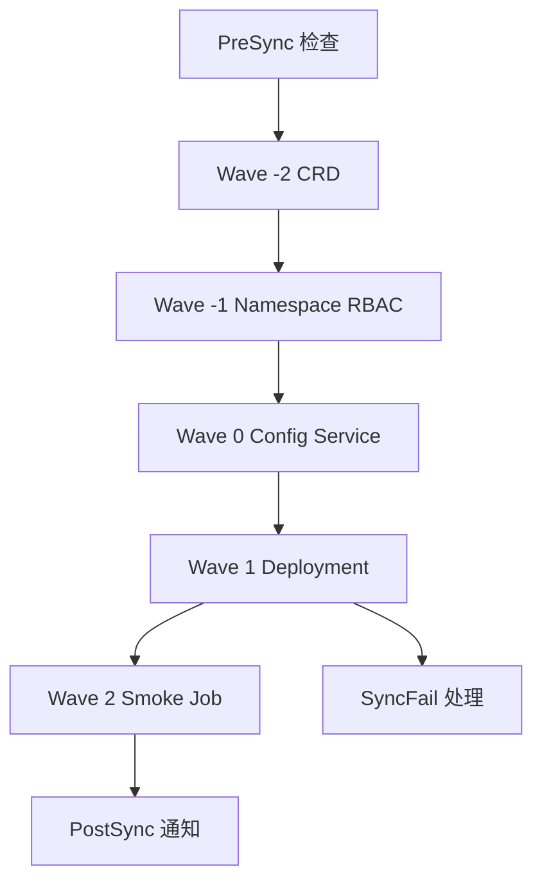
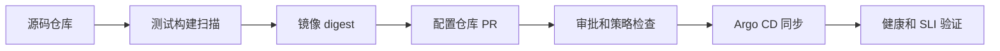
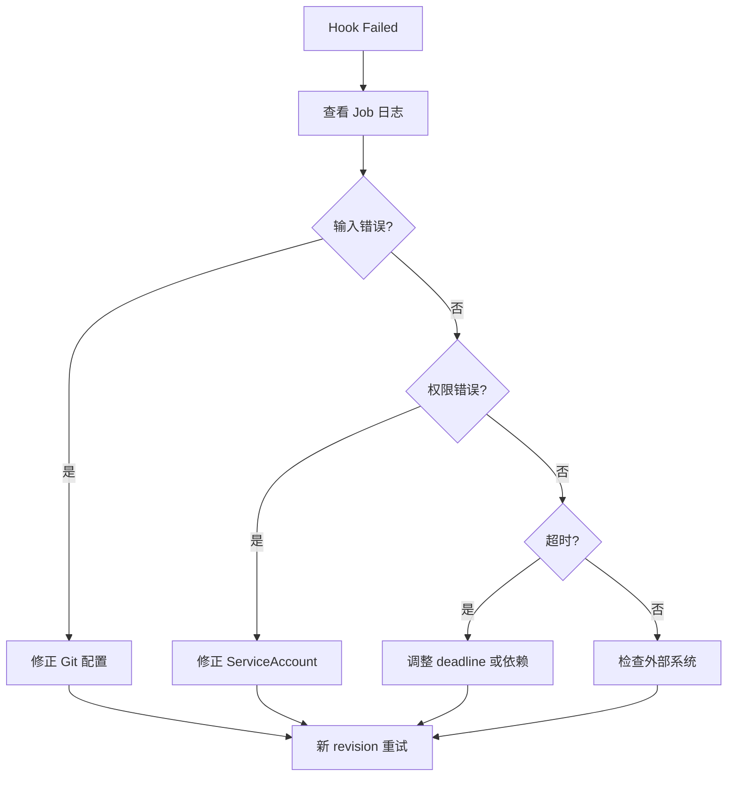

# Argo CD 同步、交付策略与资源治理学习笔记

## 第 1 章 · 从 Reconcile 理解状态比较与健康判断

### 一次 Reconcile 如何发现 OutOfSync 并决定是否行动

Controller 读取目标 revision，调用 Repository Server 生成期望资源，再从 Kubernetes API 获取实时资源并比较。`OutOfSync` 只表示资源不同，不代表一定应自动修复；同步窗口、项目策略、暂停注解和自动同步配置共同决定行动。

#### 比较结果的三步核对

先确认比较使用的 revision，再确认 manifest 是否成功生成，最后确认实时对象来自正确的集群和 namespace。revision 错误会把正常状态误判为漂移，集群上下文错误则可能把别的环境当成故障现场。

```bash
argocd app get payments-prod
argocd app diff payments-prod --revision 8f31c2a
kubectl -n payments get deploy payments -o yaml
```

### Diff 策略如何处理默认值、Webhook 和 Server-Side Diff

默认值、字段排序、Webhook 注入和 Server-Side Apply 都可能制造非业务差异。优先修正源配置或 schema，再使用 diff strategy；Server-Side Diff 可提前获得服务端合并结果，但会增加 API 请求和权限要求。

### 在应用级和系统级忽略非业务差异

`ignoreDifferences` 可按 group、kind、name、jsonPointers 或 jq 表达式忽略字段。系统级配置影响所有 Application，风险高；每条忽略规则都应记录原因、责任人和退出条件，避免把真实漂移永久隐藏。

例如 HPA 修改 `spec.replicas` 是可接受的控制器差异，但镜像 tag、Service selector 和 RBAC 规则通常不能忽略。忽略后仍可用 sync 将 Git 字段写回，因此要同时检查 compare 与 apply 行为。

### 健康评估、Lua 自定义与父子资源健康传播

Health 判断回答“资源能否提供服务”，Sync 判断“资源是否与 Git 一致”。内置检查不足时可用 Lua 自定义，但脚本要覆盖 Progressing、Healthy、Degraded 和 Unknown，并验证父资源不会因子资源短暂初始化而误报失败。

### 识别孤儿资源、排除对象与资源跟踪异常

孤儿资源是命名空间内未被 Application 认领的对象。排除规则适用于集群级共享对象，但应有明确 owner；跟踪标签冲突、installation ID 错误或手工改标签都会造成归属异常。

### 暂停 Reconcile 的适用场景和恢复风险

维护窗口、集群迁移和大规模故障时可暂停调谐。暂停期间 Git 与集群持续分叉，恢复后可能产生集中同步；恢复前先查看 diff、资源健康和变更窗口。

## 第 2 章 · 建立可控的自动同步策略

### automated、prune、selfHeal 与 allowEmpty 如何组合

`automated` 开启自动同步，`prune` 允许删除 Git 中消失的资源，`selfHeal` 修复集群手工漂移，`allowEmpty` 允许结果为空。生产通常先启用 automated+selfHeal，经过删除演练后再开启 prune。

推荐分阶段启用：先手工同步并观察，再开启 automated；确认资源删除审计和恢复流程后开启 prune；只有确实允许空应用时才开启 allowEmpty。`enabled: false` 可暂时关闭自动同步而保留其他字段，适合变更窗口。

```yaml
syncPolicy:
  automated:
    prune: true
    selfHeal: true
    allowEmpty: false
  syncOptions:
    - PruneLast=true
```

### 自动同步的触发、去重、重试和回滚限制

提交、Webhook、轮询和资源事件可触发同步；相同 revision 与参数会去重。失败重试要设置退避和上限，自动回滚不能替代 Git revert，且对 hooks、外部副作用和数据库迁移无事务保证。

### NoPrune、PruneLast、Replace 与 ServerSideApply 改变了什么

`NoPrune` 禁止删除，`PruneLast` 将删除放到其他资源健康后，`Replace` 用 replace/create 规避 patch 限制但可能重建对象，`ServerSideApply` 交给服务端字段管理。每项都应在非生产验证字段所有权和停机影响。

### 删除确认、传播策略和资源保留如何防止误删

生产删除应用前要求显式确认，并选择 foreground、background 或 orphan 传播策略。`Prune=false`、资源保留注解和项目级保护可形成多层防线；删除后检查 CRD、PVC 和外部负载均衡器是否仍被依赖。

### 选择性同步和 kubectl 同步适合怎样的应急场景

选择性同步适合只修复一个 Deployment 或 ConfigMap 的应急操作，完成后必须把修复写回 Git。kubectl 直接 apply 只用于恢复控制面或 Argo CD 不可用时的临时动作，并记录审计事件。

## 第 3 章 · 用 Phase、Wave 与 Hook 编排发布顺序

### PreSync、Sync、PostSync、SyncFail 与 PostDelete 如何执行

PreSync 做迁移或前置检查，Sync 创建业务资源，PostSync 做验证和通知，SyncFail 处理失败，PostDelete 在应用删除后清理。Hook 通过 `argocd.argoproj.io/hook` 注解声明。

### Sync Wave、Kind 和名称如何共同决定顺序

Argo CD 先按 phase，再按 wave，再按资源 kind 和名称排序。低 wave 的 CRD 和配置先于工作负载；同一 wave 中不要依赖未声明的隐式顺序。

常见编排是 CRD wave -2、Namespace wave -1、配置和 RBAC wave 0、Deployment wave 1、验证 Job wave 2。Wave 间仍受资源健康阻塞影响，不能用 wave 替代 readiness probe 或数据库迁移锁。

### Hook 删除策略、失败处理和幂等性怎样设计

使用 `BeforeHookCreation`、`HookSucceeded` 或 `HookFailed` 控制清理。Job 必须可重复执行、带超时和明确退出码；外部迁移要设计幂等锁和回滚脚本。

### 自定义 Resource Action 何时有用，何时违背 GitOps

Resource Action 适合重启、刷新证书等明确运维动作。它不应成为长期配置入口；动作脚本需 RBAC、审计、超时和 dry-run 设计。

## 第 4 章 · 设计发布策略、变更入口与删除边界

### Branch、Tag 与 Commit Pinning 的速度和可审计性差异

Branch 追求自动获取最新变更，Tag 适合发布批次，Commit pinning 提供最强可复现性。生产应用可由自动化更新固定 commit，并保留变更单与回滚 commit。

### 配置仓库与源码仓库为什么应该分离

源码仓库关注构建，配置仓库关注环境和审批。分离后可独立审计、回滚和授权，也避免应用构建权限直接获得生产部署权限。

### CI 应更新 Git 还是直接调用 Argo CD

CI 最好提交镜像 digest 或版本到配置仓库，Argo CD 再同步。直接调用 API 可用于触发刷新或读取结果，但不应绕过 Git 写入最终配置。

### App of Apps 如何完成集群引导和级联删除

根 Application 指向一组子 Application，适合集群 bootstrap。删除根应用可能级联删除子应用和业务资源，应设置 orphan 或保留策略并在演练中验证。

### Sync Window 如何实现冻结期、允许窗口与人工覆盖

Sync Window 按项目、应用、集群和时间表达允许或拒绝同步。紧急变更可人工 override，但需审批、时限和事后审计。

### Application 附加信息如何帮助值班人员定位负责人和文档

使用 annotations、labels、外部 URL 和运行手册链接标注 owner、服务等级、值班组和变更系统。信息应稳定、可机器查询，避免把敏感数据放入元数据。

## 第 5 章 · 建立通知、事件与告警闭环

### Notifications Controller 如何连接触发器、模板、订阅和服务

Controller 读取触发器条件，渲染模板，再调用 Slack、Webhook、PagerDuty 等服务。服务凭据放 Secret，模板只输出必要上下文，投递失败要能重试并暴露指标。

### 在 Application、AppProject 与全局配置中声明订阅

全局订阅适合平台级故障，项目订阅适合团队，Application 注解适合单服务。优先使用较窄范围，防止所有事件广播造成噪声。

### 编写 Trigger、条件表达式与幂等 oncePer 规则

Trigger 用条件筛选 Sync、Health 和 Operation 状态；`oncePer` 以 revision 或状态字段去重。条件要覆盖 Unknown 和恢复事件，避免只告警不告警恢复。

### 用 Template、context、secret 和时区生成可行动消息

模板包含应用名、revision、差异摘要、owner、外部链接和建议动作。Secret 通过 context 引用，时间统一时区，消息中不输出 Token、仓库私钥或完整 Secret。

### 按 ChatOps、事件管理、监控和自动化目标选择通知服务

ChatOps 适合协作，事件管理适合升级和确认，监控系统适合指标告警，Webhook 适合内部自动化。按可靠性、重试、签名和限流能力选择，不以渠道数量代替闭环质量。

### 接入 PagerDuty、Opsgenie、Alertmanager、Grafana 与 New Relic

事件管理服务要映射 severity、dedup key 和恢复状态；Alertmanager/Grafana 要避免重复告警。先在测试服务验证签名、TLS、超时和失败重试，再切生产路由。

通知内容至少带上 Application、集群、namespace、revision、失败资源和 runbook URL。只有“同步失败”没有资源和 revision 的消息无法指导值班动作，反而会促使人工重复点击重试。

### 用 Webhook、GitHub 与 SQS 串联外部交付流程

Webhook 可触发变更单、回归或审计流程；GitHub 集成需最小权限；SQS 适合异步削峰。消费者必须幂等、校验签名并处理重复消息。

### 监控通知投递并排查命令、配置与运行时错误

排查顺序是 ConfigMap/Secret、订阅注解、触发器条件、Controller 日志、网络和服务端响应。保存事件时间、Application revision 和请求 ID，形成可复用证据包。

#### 端到端演练：一次安全发布

1. 在配置仓库提交镜像 digest，CI 运行 schema、渲染和策略检查。
2. Webhook 触发 refresh，值班人员查看 `argocd app diff`，确认只有预期资源变化。
3. 先同步 CRD、配置和一个 canary Deployment，等待 Health 变为 `Healthy`。
4. 检查业务 SLI 和通知投递，再放开剩余批次；失败时停止后续 wave。
5. 回滚使用 Git revert，确认旧 revision 已同步并记录失败资源、时间线和根因。

这条流程把 Git、diff、wave、health、通知和回滚连成闭环，适合作为新团队的演练脚本。

## 第二册实践补充：把状态、同步和治理串成可执行流程

本节不是新增大纲章节，而是对前面每个知识点的操作化展开。阅读时可以把它当作实验手册：先建立一个可重复的测试 Application，再逐项改变比较、同步、编排和通知设置，观察状态变化，最后把结论写进团队运行手册。

### 实验环境与基线

#### 建立隔离命名空间

实验不应直接使用生产 Application。使用专用 namespace 和临时 Git 分支，确保 prune、Replace 和删除传播策略不会影响其他工作负载。

```bash
kubectl create namespace argocd-lab
kubectl create namespace demo-payments
kubectl -n argocd get applications
argocd app list --project default
```

基线记录至少包括以下信息：

| 项目 | 示例 | 目的 |
| --- | --- | --- |
| Argo CD 版本 | v3.2.0 | 解释参数和状态差异 |
| Kubernetes 版本 | v1.31 | 识别 API 与默认字段 |
| Git revision | 8f31c2a | 复现 manifest |
| 目标集群 | lab | 防止误操作 |
| namespace | demo-payments | 限制资源范围 |
| Application | payments-lab | 查询和审计主键 |

#### 保存初始证据

```bash
argocd app get payments-lab -o yaml > /tmp/payments-app-before.yaml
argocd app resources payments-lab -o wide > /tmp/payments-resources-before.txt
argocd app history payments-lab > /tmp/payments-history-before.txt
kubectl -n demo-payments get all -o yaml > /tmp/payments-live-before.yaml
```

文件名中包含时间或 revision，便于把一次演练与通知、Controller 日志关联起来。不要把 Secret 原文上传到工单；导出时可以使用 `jq 'del(.. | .data?)'` 删除敏感字段。

### 比较结果的证据链

#### 先验证期望 manifest

`argocd app manifests` 失败时，比较和同步都没有意义。先确认仓库凭据、revision、路径和生成工具。

```bash
argocd app manifests payments-lab --revision 8f31c2a > /tmp/payments-manifests.yaml
argocd app manifests payments-lab --source-position 1
argocd app get payments-lab -o json | jq '.status.operationState, .status.sync.revision'
```

常见错误与证据如下：

| 错误 | 典型日志 | 处理 |
| --- | --- | --- |
| 路径不存在 | `path ... does not exist` | 检查 source.path 和分支 |
| 工具缺失 | `failed to load generator` | 核对 repo-server 镜像和插件 |
| Values 不存在 | `open values-prod.yaml` | 检查 ref、路径和大小写 |
| YAML 无效 | `yaml: line ...` | 在 CI 中先跑 parser |
| 权限拒绝 | `authentication required` | 轮换仓库凭据 |

#### 再验证实时对象

```bash
kubectl -n demo-payments get deploy,svc,cm -o wide
kubectl -n demo-payments describe deploy payments
kubectl -n demo-payments get events --sort-by=.lastTimestamp | tail -30
```

实时对象的 `managedFields` 能显示 Server-Side Apply 的字段管理者，但不应直接把整段字段复制回 Git。只提取造成差异的字段和控制器名称，避免把集群生成字段固化为人工配置。

#### 最后阅读 diff

```bash
argocd app diff payments-lab --revision 8f31c2a
argocd app diff payments-lab --hard-refresh
```

`--hard-refresh` 会重新获取仓库和集群信息，适合排查缓存陈旧；频繁使用会增加 Git 和 Kubernetes API 压力。差异审查应回答三件事：变化是否来自本次提交，变化是否会影响可用性，变化是否会改变资源所有权。

### Diff 策略的实验矩阵

#### 默认值差异

例如 Deployment 未在 Git 中填写 `spec.replicas`，Kubernetes 默认写入 1。若渲染器和 API 默认行为不同，Application 可能持续 OutOfSync。优先在源文件中显式写出业务关键字段：

```yaml
spec:
  replicas: 2
  selector:
    matchLabels:
      app: payments
```

显式值比全局忽略更容易审计，也能避免不同集群版本使用不同默认值。

#### Mutating Webhook 注入

服务网格或安全代理可能向 Pod 注入 initContainer、volume 和 annotation。先用 jq 找出注入字段，再决定是否只忽略由注入器负责的字段：

```bash
kubectl -n demo-payments get deploy payments -o json \
  | jq '.spec.template.metadata.annotations, .spec.template.spec.initContainers'
```

忽略规则应限制到明确 group、kind、name，并使用 comment 记录注入组件版本。不要对整个 Pod template 使用宽泛 jq 表达式，否则镜像、命令和探针也可能被隐藏。

#### Server-Side Diff 的判断

Server-Side Diff 模拟服务端合并，能够提前发现 schema 和字段所有权冲突，但需要额外 API 请求。启用前检查：

1. Argo CD ServiceAccount 是否有读取 OpenAPI schema 的权限。
2. CRD 是否提供结构化 schema。
3. 目标集群 API Server 的 QPS 限制是否足够。
4. 失败时是否有回退到普通 diff 的值班动作。

```yaml
data:
  resource.customizations: |
    _:
      compareOptions: ServerSideDiff=true
```

实验中分别在旧版和新版 Kubernetes 上运行 `argocd app diff`，比较字段排序、默认值和错误提示，记录差异而不是凭印象决定策略。

### ignoreDifferences 规则审查

#### 规则字段与优先级

```yaml
spec:
  ignoreDifferences:
    - group: autoscaling
      kind: HorizontalPodAutoscaler
      jsonPointers:
        - /spec/replicas
    - group: apps
      kind: Deployment
      name: payments
      namespace: demo-payments
      jqPathExpressions:
        - .spec.template.metadata.annotations["sidecar.example.com/status"]
```

应用级规则只影响当前 Application，系统级 `resource.customizations` 影响所有应用。规则匹配越窄越好：先写 group/kind，再补 name/namespace，最后选择单一字段。

#### Compare 与 Apply 的区别

忽略差异默认只影响比较，不一定阻止同步时把 Git 值写回集群。需要验证 `RespectIgnoreDifferences=true` 是否符合意图：

```yaml
syncPolicy:
  syncOptions:
    - RespectIgnoreDifferences=true
```

对 HPA replicas 使用该选项时，Deployment 的副本值不会覆盖 HPA 计算结果；对镜像字段使用则可能阻止紧急回滚，必须经过评审。

#### 规则退出条件

每条规则都登记以下字段：

| 字段 | 内容 |
| --- | --- |
| 原因 | 哪个控制器写入字段 |
| 范围 | group、kind、name、namespace |
| 风险 | 可能隐藏的业务变化 |
| 负责人 | 团队或平台角色 |
| 复查日期 | 控制器升级后的日期 |
| 删除条件 | 哪个版本或配置修复后移除 |

没有退出条件的 ignore 规则会逐年累积，最终让 `Synced` 失去可信度。

### 健康评估与状态传播

#### 资源状态和应用状态分层

Application 健康是资源健康的聚合结果，不是简单的 Ready 数量。Deployment 可能因新 ReplicaSet 未就绪而 Progressing，Service 可能 Healthy 但没有 Endpoints，Job 可能成功后被删除导致状态 Unknown。

```bash
argocd app get payments-lab
argocd app resources payments-lab --output tree=detailed
kubectl -n demo-payments get endpointslice -l kubernetes.io/service-name=payments
```

排障顺序是先定位最底层 Degraded 资源，再沿 ownerReferences 向上检查。不要只截取 Application 顶层状态。

#### Lua 健康脚本的最小结构

```lua
hs = {}
if obj.status == nil then
  hs.status = "Progressing"
  hs.message = "等待控制器写入 status"
  return hs
end
if obj.status.conditions ~= nil then
  for _, condition in ipairs(obj.status.conditions) do
    if condition.type == "Ready" and condition.status == "True" then
      hs.status = "Healthy"
      hs.message = "Ready condition is true"
      return hs
    end
  end
end
hs.status = "Progressing"
hs.message = "Ready condition is not true"
return hs
```

脚本要处理 nil、未知 condition 和失败 reason。不要把任何非空 status 都判为 Healthy；这会把控制器错误传播成成功。

#### 父子资源的传播规则

Application → Deployment → ReplicaSet → Pod 是常见树。父资源健康通常依赖子资源，但自定义资源的传播由脚本或内置逻辑决定。删除中间 owner 或手工修改 tracking label，会让资源树断裂，产生孤儿或 Unknown。

### 孤儿资源与资源跟踪

#### 孤儿扫描步骤

```bash
argocd app resources payments-lab --orphaned
kubectl -n demo-payments get all,configmap,secret -l app.kubernetes.io/part-of=payments
```

发现孤儿后先分类：临时调试对象、平台共享对象、已删除 Application 遗留对象、tracking label 被覆盖的受管对象。只有确认不再需要且有删除授权时才清理。

#### 三种跟踪方式的取舍

| 方式 | 特点 | 风险 |
| --- | --- | --- |
| label | 兼容性好，查询简单 | label 可能被覆盖 |
| annotation | 可保存完整实例标识 | 某些工具不保留 annotation |
| label+installationID | 多套 Argo CD 共存 | 配置错误会导致全量失认领 |

在同一集群运行多套 Argo CD 时，必须设置不同 installation ID，并在迁移期间验证新旧控制器不会同时管理同一对象。

### 暂停与恢复调谐

#### 暂停前检查

```bash
argocd app get payments-lab
argocd app diff payments-lab
kubectl -n argocd get app payments-lab -o jsonpath='{.metadata.annotations}'
```

记录当前 revision、健康状态、未同步资源和暂停原因。暂停只是延后控制器动作，不会冻结 Git、Kubernetes 控制器或外部系统。

#### 恢复后的分阶段动作

1. 先恢复单个低风险 Application。
2. 观察 Controller 队列、API QPS 和事件。
3. 确认 diff 后再恢复批量应用。
4. 对 prune 应用先关闭自动删除。
5. 处理积压 OutOfSync，再恢复常规策略。

### 自动同步状态机

#### 触发来源

| 触发 | 典型延迟 | 是否需要 webhook |
| --- | --- | --- |
| Git webhook | 秒级 | 是 |
| 轮询 | 分钟级 | 否 |
| 手工 refresh | 立即 | 否 |
| 集群资源事件 | 近实时 | 否 |
| Controller 重启 | 启动后重新排队 | 否 |

不同触发可能合并为同一 revision 操作。审计日志要以 operation UID 和 revision 为主键，而不是以“点击次数”统计发布次数。

#### 去重和重试

同一 source、参数和 revision 的操作通常会被去重；但 Hook、外部 API 和通知可能已经产生副作用。重试参数示例：

```yaml
retry:
  limit: 5
  backoff:
    duration: 10s
    factor: 2
    maxDuration: 5m
```

重试前区分瞬时错误和确定性错误。权限拒绝、YAML 解析失败、资源 schema 不兼容通常不会因重试自行恢复，应先修复配置。

#### 自动回滚的边界

Git revert 是最可审计的回滚；Argo CD 的 rollback 操作适合临时恢复历史 revision，但仍应把最终状态写回配置仓库。数据库迁移、消息发送和云资源创建不可自动事务回滚，必须由 Hook 或外部流程提供补偿。

### 同步选项深度练习

#### PruneLast

```yaml
syncPolicy:
  syncOptions:
    - PruneLast=true
```

PruneLast 把删除放到其他资源完成后，适合替换 ConfigMap、Service 或旧 Deployment。它不会修复错误的 selector，也不会保证外部依赖已经切流。演练时观察旧资源在新资源 Healthy 前是否仍存在。

#### Replace

```yaml
metadata:
  annotations:
    argocd.argoproj.io/sync-options: Replace=true
```

Replace 可能导致资源重建和短暂中断，且会影响 resourceVersion、字段所有权和 immutable 字段。适合对象过大、patch 超限或需要完全重建的场景；生产启用前要做容量和连接保持测试。

#### ServerSideApply

```yaml
metadata:
  annotations:
    argocd.argoproj.io/sync-options: ServerSideApply=true
```

Server-Side Apply 依赖字段管理者。迁移时先在单个资源上启用，查看 `managedFields` 是否出现预期 manager；冲突时使用显式 fieldManager 和资源级例外，不要全局强制覆盖。

#### Validate=false

`Validate=false` 允许跳过客户端 schema 校验，适合部分非结构化 CRD，但会把错误推迟到 API Server。该选项必须绑定具体资源，并配合 admission、dry-run 和回滚检查。

### 删除安全实验

#### 传播策略

| 策略 | 行为 | 适用 |
| --- | --- | --- |
| foreground | 等待子资源删除后返回 | 需要确认完整清理 |
| background | 立即删除父对象，子资源异步删 | 大量短生命周期资源 |
| orphan | 保留子资源 | 迁移和接管场景 |

删除 Application 前先导出资源清单。对 PVC、CRD、LoadBalancer 和数据库对象逐项确认保留策略。

#### 删除前门禁脚本

```bash
set -e
app=payments-lab
argocd app get "$app" -o yaml > "/tmp/$app-delete.yaml"
argocd app resources "$app" --output wide
read -r confirmation
test "$confirmation" = "DELETE-$app"
argocd app delete "$app" --cascade=false
```

脚本示例只展示门禁思想，生产中应把确认接入变更系统，避免依赖终端输入。`--cascade=false` 只删除 Application 对象，资源是否保留还要结合 tracking 和 ownerReferences 验证。

### 选择性同步与应急修复

#### 资源级同步

```bash
argocd app sync payments-lab \
  --resource apps:Deployment:demo-payments/payments
argocd app sync payments-lab \
  --resource :ConfigMap:demo-payments/payments-config
```

选择性同步适合修复单个坏资源，但可能跳过依赖的 CRD、Secret 或 Hook。操作前检查资源树和 wave，操作后立即创建 Git 变更，避免下一次全量同步覆盖手工修复。

#### kubectl 应急 apply

只有在 Argo CD API 或 Controller 不可用、业务恢复有明确时限时才使用 `kubectl apply`。记录操作者、文件来源、命令、时间和后续 Git 回填任务。恢复 Argo CD 后先暂停自动同步，比较临时对象与 Git，再决定保留还是回滚。

### Phase、Wave 与 Hook 的可视化

#### 发布顺序示例



Hook 失败会阻断后续阶段，但不会自动回滚已经成功的资源。Smoke Job 应验证真实依赖和关键路径，而不是只执行 `kubectl get`。

#### Hook 示例

```yaml
apiVersion: batch/v1
kind: Job
metadata:
  generateName: payments-precheck-
  annotations:
    argocd.argoproj.io/hook: PreSync
    argocd.argoproj.io/hook-delete-policy: BeforeHookCreation,HookFailed
spec:
  backoffLimit: 0
  activeDeadlineSeconds: 120
  template:
    spec:
      restartPolicy: Never
      serviceAccountName: payments-checker
      containers:
        - name: check
          image: registry.example.com/payments-check:v4
          args: ["verify-schema", "--timeout=90s"]
```

Hook 镜像应固定 digest，ServiceAccount 只允许读取所需资源。`generateName` 防止名称冲突，但会产生历史 Job，必须通过删除策略和 TTL 控制数量。

### Wave 设计检查表

#### 依赖分类

| 类别 | 推荐 wave | 先决条件 |
| --- | ---: | --- |
| CRD | -2 | API discovery 成功 |
| Namespace | -1 | 项目允许目标 namespace |
| RBAC、ConfigMap | 0 | Secret 和配置完整 |
| Service、Deployment | 1 | 镜像可拉取 |
| Ingress、Route | 2 | Service 有 Endpoints |
| Smoke Job | 3 | 业务端口和依赖可用 |

负数 wave 不是越小越好。过多层级会延长发布时间并增加排障复杂度；只有存在真实依赖时才增加 wave。

#### 健康阻塞

Controller 会等待当前 wave 的资源达到可接受状态。一个长期 Progressing 的 Deployment 会阻塞后续波次，因此 readinessProbe、启动超时和 PodDisruptionBudget 需要与 wave 一起设计。

### Resource Action 的治理

#### 动作声明

Resource Action 适合“重启 rollout”“重新生成证书”“触发缓存刷新”等有限动作。动作脚本应是只读配置之外的显式操作，并在 UI、CLI 和 API 中留下审计记录。

#### 动作审查项

| 审查项 | 问题 |
| --- | --- |
| 授权 | 谁能执行 action |
| 幂等 | 重复执行是否安全 |
| 超时 | 最长运行多久 |
| 输出 | 是否返回可读结果 |
| 回滚 | 失败后如何恢复 |
| 审计 | 是否记录参数和操作者 |

若动作需要输入大量业务参数，通常说明它已经变成变更系统，应迁移到专用工作流，而不是继续扩展 Action。

### Branch、Tag 与 Commit 的发布演练

#### 三种引用的行为

```yaml
source:
  repoURL: https://github.com/example/platform-config.git
  targetRevision: main
  path: apps/payments
```

`main` 适合开发环境；`v2026.08.29` 适合发布批次；`8f31c2a` 适合生产冻结。生产自动化可以先创建 tag，再把 Application 更新到 commit，并在变更单记录两者映射。

#### 回滚判据

| 现象 | 动作 |
| --- | --- |
| 新 revision 渲染失败 | 回退 source revision |
| 同步成功但探针失败 | Git revert 并检查运行时 |
| 只有单个资源漂移 | 资源级同步或修正 Git |
| 外部依赖故障 | 暂停后续 wave，保留 revision |

不要通过修改 tag 指向来隐藏历史；不可变 tag 和 commit 记录更利于审计。

### 配置仓库与 CI 边界

#### 推荐流水线



CI 不应在构建完成后直接执行 `kubectl apply`。它可以调用 Argo CD refresh、读取同步结果或创建回滚 PR，但最终期望状态仍应进入 Git。

#### 配置仓库变更检查

```bash
kubeconform -strict -summary rendered/*.yaml
conftest test rendered/ --policy policy/
git diff --check
```

检查包括 schema、策略、镜像来源、资源请求、探针、owner 标签和敏感字段扫描。Argo CD 的 diff 是最后一道运行时检查，不替代 CI。

### App of Apps 与级联删除

#### 根应用示例

```yaml
apiVersion: argoproj.io/v1alpha1
kind: Application
metadata:
  name: platform-root
  namespace: argocd
spec:
  project: platform
  source:
    repoURL: https://github.com/example/platform-config.git
    targetRevision: main
    path: clusters/prod/apps
  destination:
    server: https://kubernetes.default.svc
    namespace: argocd
  syncPolicy:
    automated:
      prune: false
```

根应用只管理子 Application，不应同时直接管理业务 Deployment。删除根应用前要确认子应用的级联策略，平台引导场景通常先使用 `orphan` 做迁移演练。

#### 引导验收

1. 根应用创建成功。
2. 子应用数量与目录清单一致。
3. 子应用 project、destination 和 namespace 符合策略。
4. 删除一个目录后只删除对应子应用。
5. 删除根应用不会意外删除共享 CRD 和集群级资源。

### Sync Window 与人工覆盖

#### 冻结窗口示例

```yaml
apiVersion: v1alpha1
kind: AppProject
metadata:
  name: payments
  namespace: argocd
spec:
  syncWindows:
    - kind: deny
      schedule: "0 22 * * 1-5"
      duration: 10h
      applications: ["payments-*"]
```

窗口配置要使用统一时区，并在变更前用日历验证跨午夜、夏令时和节假日行为。人工 override 需要审批、理由和有效期，不宜通过长期修改项目配置实现。

#### 窗口排障

```bash
argocd proj get payments -o yaml
argocd app get payments-prod | rg 'SyncWindow|Sync Status|Operation'
argocd app sync payments-prod --force
```

`--force` 不是绕过所有策略的万能开关。若同步被窗口拒绝，应先确认是否具备 override 权限，并把 override 记录到变更系统。

### Application 附加信息

#### 推荐标签

```yaml
metadata:
  labels:
    app.kubernetes.io/part-of: payments
    ops.example.com/team: checkout
    ops.example.com/criticality: high
  annotations:
    notifications.argoproj.io/subscribe.on-sync-failed.slack: checkout-oncall
    runbook.example.com/url: https://runbooks.example.com/payments
```

标签用于查询和策略匹配，注解用于链接和通知。owner、服务等级和 runbook URL 应可公开给值班人员；Token、内部私钥和个人手机号不能放入元数据。

### Notifications 配置实验

#### 服务、模板和触发器

```yaml
data:
  service.webhook.ops: |
    url: https://ops.example.com/argocd/events
    headers:
      - name: X-Signature
        value: $webhook-signature
  template.app-sync-failed: |
    webhook:
      ops:
        method: POST
        body: '{"app":"{{.app.metadata.name}}","revision":"{{.app.status.sync.revision}}"}'
  trigger.on-sync-failed: |
    - description: Application 同步失败
      send: [app-sync-failed]
      when: app.status.operationState.phase == 'Failed'
```

真实配置中 Secret 引用通过 `context` 或 Secret key 完成，不能把签名直接写入 ConfigMap。模板的 JSON 必须经过转义和测试，尤其是 commit message、错误详情可能包含引号和换行。

#### oncePer 去重

```yaml
trigger.on-sync-succeeded: |
  - when: app.status.operationState.phase == 'Succeeded'
    oncePer: app.status.sync.revision
    send: [app-sync-succeeded]
```

以 revision 去重可以避免同一 revision 每次刷新都通知；恢复通知应使用新的状态或 revision，避免故障恢复被吞掉。对于高频健康变化，不要使用过于细粒度的字段作为 key。

#### 通知验证命令

```bash
kubectl -n argocd logs deploy/argocd-notifications-controller --since=15m
kubectl -n argocd get cm argocd-notifications-cm -o yaml
kubectl -n argocd get secret argocd-notifications-secret
argocd app set payments-lab --sync-policy automated
```

测试时使用专用 webhook 接收器，记录 HTTP 状态码、响应时间和重试次数。验证完成后删除测试订阅，防止生产事件继续发送到临时地址。

### 通知故障分类

| 层级 | 证据 | 常见修复 |
| --- | --- | --- |
| 配置 | 模板或服务 key 缺失 | 修正 ConfigMap/Secret |
| 匹配 | trigger 条件为 false | 调整条件或状态字段 |
| 渲染 | 模板解析错误 | 在测试应用复现 |
| 网络 | timeout、DNS、TLS | 检查 NetworkPolicy 和 CA |
| 对端 | 401、429、5xx | 轮换凭据或限流 |
| 消费 | 对端已收但未处理 | 查 request ID 和消费者日志 |

每次通知应携带 Application、project、cluster、namespace、revision、operation UID、失败资源、runbook URL 和时间。事件字段要稳定，以便 PagerDuty dedup、Grafana 链接和内部自动化消费。

### 综合故障演练：同步失败到恢复

#### 场景

配置仓库把镜像 digest 更新为不存在的值。自动同步开始，Deployment 创建新 ReplicaSet，但 Pod 进入 `ImagePullBackOff`，Application 进入 `Degraded`，通知发送到值班频道。

#### 证据收集

```bash
argocd app get payments-prod -o yaml > /tmp/incident-app.yaml
argocd app history payments-prod
argocd app resources payments-prod --output wide
kubectl -n demo-payments describe pod -l app=payments
kubectl -n argocd logs deploy/argocd-application-controller --since=20m
```

#### 处置顺序

1. 暂停自动同步，避免重试产生更多 ReplicaSet。
2. 确认失败 revision 和镜像 digest。
3. 通过配置仓库 revert 修复期望状态。
4. 等待新 revision 渲染成功，检查 diff 只包含回滚资源。
5. 手工同步或恢复 automated，观察 Pod 和业务 SLI。
6. 核对失败、恢复通知是否各发送一次。

#### 复盘问题

| 问题 | 改进 |
| --- | --- |
| 为什么 CI 允许不存在 digest | 增加镜像仓库存在性检查 |
| 为什么自动同步重试过多 | 设置失败分类和 retry 上限 |
| 为什么通知缺少资源名 | 补充模板上下文 |
| 为什么回滚依赖手工命令 | 建立 revert PR 模板 |

### 第二册自测题

#### 状态与 diff

1. `Synced + Degraded` 时首先查 Git 还是 Pod？为什么？
2. 哪些字段适合用 `ignoreDifferences`，哪些字段不应忽略？
3. Server-Side Diff 增加了哪些权限和性能成本？
4. 如何证明 manifest 生成成功但目标集群不可写？

#### 自动同步

1. `prune`、`selfHeal`、`allowEmpty` 分别解决什么问题？
2. 为什么 Git revert 比直接 rollback 更适合作为长期回滚记录？
3. `Replace=true` 可能带来哪些停机风险？
4. kubectl 应急 apply 后如何回填 Git？

#### 编排与删除

1. 为什么 wave 不能替代 readinessProbe？
2. Hook Job 如何保证幂等、超时和清理？
3. foreground、background、orphan 删除传播分别适合什么场景？
4. App of Apps 根应用删除前需要验证哪些对象？

#### 通知

1. `oncePer` 如何避免重复通知又不吞掉恢复事件？
2. 429、TLS 失败和模板解析错误的排查顺序是什么？
3. 一条可行动的同步失败通知至少包含哪些字段？

### 第二册发布前检查清单

#### 比较和健康

- [ ] 每个生产 Application 都能成功生成固定 revision 的 manifest。
- [ ] `OutOfSync`、`Degraded`、`Unknown` 的值班动作已写入 runbook。
- [ ] ignore 规则具备范围、负责人、原因和退出日期。
- [ ] 自定义 Lua 脚本覆盖 nil、Progressing、Healthy、Degraded 和 Unknown。
- [ ] 孤儿资源扫描不会把共享资源误判为待删除。

#### 同步和删除

- [ ] automated、prune、selfHeal、allowEmpty 按阶段启用并完成演练。
- [ ] retry 有上限、退避和错误分类。
- [ ] Replace、ServerSideApply、PruneLast 只在经过资源级验证后启用。
- [ ] 删除 Application 前有导出、确认和传播策略检查。
- [ ] 应急 kubectl 操作有审计和 Git 回填流程。

#### 编排和发布

- [ ] CRD、RBAC、配置、工作负载和验证任务的 wave 依赖明确。
- [ ] Hook 镜像固定 digest，Job 可重复执行并设置 deadline。
- [ ] SyncFail、PostSync 和 PostDelete 行为已在测试环境验证。
- [ ] 生产 source 使用 tag 或 commit pinning，回滚通过 Git 记录。
- [ ] CI 不直接写集群，配置仓库 PR 经过 schema 和策略检查。

#### 通知和审计

- [ ] 失败和恢复 trigger 均有测试事件。
- [ ] 模板不泄露 Secret，并包含 revision、资源和 runbook。
- [ ] oncePer 去重键经过重复刷新验证。
- [ ] 对端 2xx、4xx、429、5xx 和超时都有处理记录。
- [ ] 事件可由 operation UID 关联到 Controller 日志和变更单。

### 运行手册模板

#### 事件摘要

```text
Application: payments-prod
Project: payments
Cluster: prod-east
Namespace: demo-payments
Revision: 8f31c2a
Operation UID: 4f8b...
Phase: Failed
Health: Degraded
First seen: 2026-08-29T10:15:00+08:00
Runbook: https://runbooks.example.com/payments/argocd-sync
```

#### 处置记录

```text
10:15 发现 Deployment/payments ImagePullBackOff
10:18 暂停 automated，保留失败 revision
10:22 配置仓库提交 revert
10:24 manifest 生成成功，diff 仅回滚镜像
10:27 同步完成，Pod Ready
10:35 SLI 恢复，关闭事件
```

#### 关闭条件

- Application 为 `Synced` 且关键资源 `Healthy`。
- 业务 SLI 在观察窗口内恢复。
- 失败和恢复通知均已送达或有明确豁免。
- 临时注解、暂停标记和测试订阅已清理。
- Git、Argo CD history、Controller 日志和工单证据可互相对应。

这份模板的作用是让同步事件从“点击重试”变成可审计的交付流程；它也为第三册的批量 ApplicationSet 发布和第四册的生产排障提供统一证据格式。

## 交付治理附录

### 同步选项速查表

| 选项 | 默认 | 影响 | 主要风险 | 适合先在哪验证 |
| --- | --- | --- | --- | --- |
| `Prune` | false | 允许删除 Git 中消失的对象 | 误删持久化资源 | 临时 namespace |
| `PruneLast` | false | 将删除放到最后一波 | 旧对象占用配额 | canary 应用 |
| `Replace` | false | replace/create 对象 | 重建和连接中断 | 无状态 Deployment |
| `Force` | false | 强制替换冲突对象 | 破坏字段所有权 | 单个 ConfigMap |
| `ServerSideApply` | false | 服务端合并字段 | manager 冲突 | 单个 CRD 实例 |
| `Validate=false` | false | 跳过 schema 校验 | 错误延迟到运行时 | 非结构化 CRD |
| `CreateNamespace` | false | 自动创建目标 namespace | 绕过命名空间审批 | 开发集群 |
| `FailOnSharedResource` | false | 共享资源时报错 | 多应用互相阻塞 | 平台基础设施 |
| `RespectIgnoreDifferences` | false | apply 时尊重忽略规则 | 关键字段无法回滚 | HPA replicas |
| `ApplyOutOfSyncOnly` | false | 只 apply 漂移对象 | 依赖刷新不完整 | 大型只读资源 |

### 同步失败分类矩阵

| 错误类别 | 典型 phase | 首个命令 | 下一步 |
| --- | --- | --- | --- |
| Manifest 解析 | Failed | `argocd app manifests` | 查看 repo-server 日志 |
| 认证失败 | Failed | `argocd repo list` | 检查 Secret 和 CA |
| 目标不可达 | Failed | `argocd cluster get` | 测试 API endpoint |
| 权限不足 | Failed | `kubectl auth can-i` | 收紧或补充 RBAC |
| Admission 拒绝 | Failed | `kubectl get events` | 阅读 webhook reason |
| 健康超时 | Running | `argocd app resources` | 查探针和 Pod 事件 |
| Hook 失败 | Failed | `kubectl logs job/...` | 修复幂等和输入 |
| 删除卡住 | Running | `kubectl get ... -o yaml` | 查 finalizer 和依赖 |

### API 与 CLI 操作配方

#### 查看操作状态

```bash
argocd app get payments-prod --show-operation
argocd app get payments-prod -o json \
  | jq '{phase:.status.operationState.phase,message:.status.operationState.message,started:.status.operationState.startedAt,finished:.status.operationState.finishedAt}'
```

#### 手工刷新和等待

```bash
argocd app get payments-prod --refresh
argocd app wait payments-prod --sync --health --timeout 600
```

等待命令超时不代表同步失败；必须结合 operation phase、资源 health 和业务指标判断。脚本中应把超时标记为待调查，而不是直接执行第二次同步。

#### 终止卡住的操作

```bash
argocd app terminate-op payments-prod
argocd app get payments-prod --show-operation
```

终止只停止 Argo CD 当前操作，已经发送到 Kubernetes API 的变更不会撤销。终止后先读取实时资源和事件，再决定继续、修复或 revert。

### Kubernetes 权限验证

#### 读取权限

```bash
kubectl auth can-i get deployments -n demo-payments \
  --as=system:serviceaccount:argocd:argocd-application-controller
kubectl auth can-i list pods -n demo-payments \
  --as=system:serviceaccount:argocd:argocd-application-controller
```

#### 写入和删除权限

```bash
kubectl auth can-i patch deployments -n demo-payments \
  --as=system:serviceaccount:argocd:argocd-application-controller
kubectl auth can-i delete services -n demo-payments \
  --as=system:serviceaccount:argocd:argocd-application-controller
```

生产检查中，读取权限和写入权限分开记录。若启用 prune，还要明确哪些资源允许 delete；不要用 `*` 规则掩盖 Application project 配置错误。

### Admission 与同步的交互

#### 预提交检查

在提交前运行与集群相同或更严格的策略：

```bash
kubectl apply --dry-run=server -f rendered/
conftest test rendered/ --policy policy/
kyverno apply policies/ --resource rendered/
```

服务端 dry-run 能发现 webhook 和 schema 问题，但它不一定模拟实际 namespace、ServiceAccount 或外部依赖。Argo CD 同步失败时仍需读取目标集群的 Admission 事件。

#### 典型拒绝

| reason | 可能原因 | 修复 |
| --- | --- | --- |
| disallowed image | 镜像仓库不在 allowlist | 更换镜像或更新策略 |
| runAsNonRoot required | 安全上下文缺失 | 添加 securityContext |
| resource limit required | 未设置 requests/limits | 补充资源配置 |
| hostNetwork forbidden | 使用了主机网络 | 评估替代方案 |
| immutable field | 尝试修改不可变字段 | 重建对象或迁移 |

### Hook 失败处理树



#### Job 日志采集

```bash
kubectl -n demo-payments get jobs --sort-by=.metadata.creationTimestamp
kubectl -n demo-payments logs job/payments-precheck-abc --all-containers
kubectl -n demo-payments describe job/payments-precheck-abc
```

Job 使用 `generateName` 时名称会变化，运行手册不能写死名称。通过 ownerReferences、label 或最近创建时间定位对应 Hook。

### Wave 卡住的诊断

#### 资源树定位

```bash
argocd app resources payments-prod --output tree=detailed
argocd app sync payments-prod --dry-run
```

如果低 wave 资源处于 Progressing，后续 wave 不会开始。常见原因是：

- Deployment readinessProbe 指向尚未创建的 Service。
- CRD 已创建但 controller 尚未启动。
- Service 有 selector，但 Pod 标签不匹配。
- PDB 与副本数冲突，滚动升级无法驱逐旧 Pod。
- PostSync Job 依赖的数据库迁移未完成。

#### 处置原则

先修复阻塞资源本身，不要随意提高 wave 或跳过健康检查。临时跳过某资源后，必须把跳过原因和补偿动作登记在变更记录中。

### 删除和 finalizer

#### 查看 finalizer

```bash
kubectl -n demo-payments get application payments-prod -o json \
  | jq '.metadata.finalizers'
kubectl -n demo-payments get pvc -o json \
  | jq '.items[] | {name:.metadata.name,finalizers:.metadata.finalizers}'
```

Argo CD Application 的资源 finalizer 控制级联删除。外部控制器也可能在资源上设置 finalizer，导致删除长期 Pending。移除 finalizer 前必须确认对应清理逻辑已经执行，否则会留下云资源或数据盘。

#### 删除演练记录

```text
目标 Application: payments-lab
传播策略: orphan
预期保留: PVC、CRD
预期删除: Deployment、Service、ConfigMap
实际结果: 与预期一致
残留对象: 0 个未认领业务对象
```

### 共享资源治理

#### 识别共享对象

常见共享对象包括 Namespace、CRD、ClusterRole、IngressClass 和集群级证书。平台 Application 管理共享对象，业务 Application 只引用它们。启用 `FailOnSharedResource=true` 可以在所有权冲突时快速失败：

```yaml
spec:
  syncPolicy:
    syncOptions:
      - FailOnSharedResource=true
```

#### 迁移共享资源所有权

1. 暂停旧 Application 自动同步。
2. 导出资源和 tracking 信息。
3. 在新 Application 中声明相同对象。
4. 使用 orphan 或保留策略切换 owner。
5. 观察资源树没有双重归属。
6. 删除旧 Application 时确认共享对象仍存在。

### 大型应用的性能控制

#### 只同步漂移资源

`ApplyOutOfSyncOnly=true` 可以减少已同步资源的 API 写入，适合资源数量较多、绝大多数对象稳定的 Application。它不应替代完整刷新；首次部署、CRD 变更和 Hook 仍需完整验证。

#### API 压力观测

```bash
kubectl get --raw /metrics | rg 'argocd_app|argocd_kubectl|argocd_redis'
kubectl top pod -n argocd
```

观察 Application Controller CPU、工作队列长度、Kubernetes API 429 和 repo-server manifest 生成耗时。增加同步并发前先确认目标 API Server 的限流和 etcd 延迟。

### 通知渠道适配表

| 渠道 | 关键信息 | 去重字段 | 失败策略 |
| --- | --- | --- | --- |
| Slack | 应用、revision、资源、runbook | thread/revision | 重试并告警 |
| PagerDuty | severity、dedup key、恢复 | application+revision | 保留事件 |
| Alertmanager | labels、annotations、generatorURL | fingerprint | 交给路由器 |
| Grafana | dashboard、panel、时间窗 | alert rule | 链接回 Argo |
| SQS | JSON 事件、schema 版本 | operation UID | DLQ |
| GitHub | issue/comment、commit | comment key | API 重试 |

### 事件字段契约

```json
{
  "schemaVersion": "1",
  "application": "payments-prod",
  "project": "payments",
  "cluster": "prod-east",
  "namespace": "demo-payments",
  "revision": "8f31c2a",
  "operationUID": "4f8b",
  "phase": "Failed",
  "health": "Degraded",
  "resource": "Deployment/payments",
  "reason": "ImagePullBackOff",
  "runbookURL": "https://runbooks.example.com/payments",
  "occurredAt": "2026-08-29T10:15:00+08:00"
}
```

事件消费者应忽略未知字段、校验 schemaVersion，并以 operationUID 做幂等。不要把完整 Kubernetes Secret、用户 Token 或仓库 URL 中的凭据发送到外部渠道。

### 通知限流与降噪

#### 事件分级

| 级别 | 条件 | 渠道 |
| --- | --- | --- |
| P1 | 生产核心应用 Degraded 且 SLI 下降 | PagerDuty、电话 |
| P2 | 生产同步失败但服务仍可用 | ChatOps、事件系统 |
| P3 | 开发环境 OutOfSync | 团队频道 |
| Info | 同步成功、恢复 | 汇总频道 |

健康抖动时使用持续时间条件、oncePer 和汇总消息。不要为每个 Pod 重启发送一条 Argo CD 通知，Pod 级细节应留在监控系统。

### 端到端演练：删除保护

#### 目标

验证配置仓库删除一个 Service 后，`prune`、`PruneLast`、PVC 保留和通知行为符合预期。

#### 步骤

1. 复制 Application 到实验 namespace。
2. 开启 `automated.prune=true` 和 `PruneLast=true`。
3. 为 PVC 添加保留注解。
4. 提交删除 Service 的 PR。
5. 观察 diff 和 operation phase。
6. 确认新资源先达到 Healthy，再删除 Service。
7. 验证 PVC、外部负载均衡器和 CRD 是否按设计保留。
8. 检查通知中包含被删除资源。

#### 验收命令

```bash
argocd app history payments-lab
kubectl -n demo-payments get svc,pvc
argocd app notifications list payments-lab
```

### 端到端演练：Sync Window

#### 目标

验证冻结窗口拒绝自动同步，人工 override 有权限边界，窗口结束后应用能够自动恢复。

#### 观察项

| 时间 | 期望 |
| --- | --- |
| 窗口开始前 | 自动同步成功 |
| 窗口内提交 | OutOfSync，operation 未执行 |
| 无 override 用户 | API 返回权限或窗口拒绝 |
| 有 override 用户 | 记录人工原因后执行 |
| 窗口结束 | 未处理 revision 自动进入队列 |

演练结束后删除临时窗口，避免测试规则影响其他项目。把时区、cron、override 用户和审计位置写入项目文档。

### 端到端演练：选择性同步回填 Git

#### 场景

单个 Deployment 因节点迁移进入异常状态，业务需要先恢复该资源，其余资源保持不动。

#### 步骤

```bash
argocd app diff payments-prod
argocd app sync payments-prod --resource apps:Deployment:demo-payments/payments
argocd app wait payments-prod --health --timeout 300
git checkout -b repair/payments-deployment
```

同步后不应直接关闭 OutOfSync 告警。若修复依赖修改 replicas、探针或镜像，必须提交配置 PR；若只是 Pod 临时故障，则记录资源已恢复并观察 controller 是否重新稳定。

### 生产变更评审模板

#### 变更内容

```text
Application:
Project:
Source revision:
Target cluster:
Expected resources:
Sync options:
Hook and wave changes:
Prune impact:
Rollback revision:
Owner and approver:
```

#### 风险问题

- 是否新增或删除 CRD、ClusterRole、PVC、LoadBalancer？
- 是否改变 Service selector、端口或 Ingress 路由？
- 是否使用 Replace、Force 或 Validate=false？
- 是否存在数据库迁移、外部 API 调用或不可逆 Hook？
- 自动同步、窗口和通知是否覆盖这次变更？
- 失败时是 revert、terminate、暂停还是人工修复？

### 复盘指标

每次发布至少记录以下指标：

| 指标 | 计算方式 | 用途 |
| --- | --- | --- |
| 变更前等待时间 | 提交到首次 sync | 衡量队列和窗口影响 |
| 同步耗时 | operation started 到 finished | 识别 wave 或 API 瓶颈 |
| 健康恢复时间 | Degraded 到 Healthy | 衡量运行时恢复 |
| 首次成功率 | 首次 operation 成功数/总数 | 衡量配置质量 |
| 回滚率 | 回滚次数/发布次数 | 识别变更风险 |
| 通知送达率 | 成功投递/触发数 | 验证闭环可靠性 |

不要只看 Argo CD operation 成功率；同步成功但 SLI 下降仍属于交付失败，应与监控系统的业务指标关联。

### 最终复核清单

#### 文件结构

- [ ] 只有一个 H1，章节使用 H2，知识点使用 H3，补充内容使用 H4。
- [ ] Mermaid 节点和边文本不包含会破坏解析的复杂标点。
- [ ] YAML、JSON、Lua、Shell 代码块均闭合且命令上下文完整。
- [ ] 示例 namespace、Application 和 revision 使用一致的实验名称。

#### 内容边界

- [ ] 所有补充都服务于比较、同步、编排、发布边界和通知闭环。
- [ ] 没有把 ApplicationSet、多集群生成器或 OIDC 认证展开成第三、四册内容。
- [ ] 每个危险操作都说明前置检查、影响、回滚和审计要求。
- [ ] 每个命令示例都能说明“成功输出如何判读”和“失败后查什么”。

#### 运行准备

- [ ] 实验命名空间和临时 webhook 已清理。
- [ ] 暂停注解、测试 Sync Window 和临时 ignore 规则已删除。
- [ ] 生产配置没有遗留 `Validate=false`、`Force=true` 或宽泛资源通配符。
- [ ] 运行手册中的 URL、owner、revision 和时区经过校验。

## 故障案例集

### 案例一：Webhook 到达但应用没有刷新

#### 现象

Git 服务显示 webhook 返回 200，但 Argo CD Application 仍显示旧 revision，自动同步没有开始。

#### 分层检查

```bash
kubectl -n argocd get svc argocd-server
kubectl -n argocd logs deploy/argocd-server --since=20m | rg 'webhook|refresh'
argocd app get payments-prod -o json | jq '.status.reconciledAt,.status.sync.revision'
```

先确认 webhook 发到正确的 API Server 地址，再确认仓库 URL 与 Application source 匹配。仓库凭据配置为 repository credential template 时，URL 前缀不匹配会导致刷新后仍无法取 revision。

#### 可能原因

| 原因 | 证据 | 修复 |
| --- | --- | --- |
| Secret 不匹配 | server 日志认证失败 | 更新 webhook Secret |
| URL 前缀不同 | webhook 事件无匹配应用 | 统一 repoURL 格式 |
| Application 被暂停 | 注解存在 | 记录原因后恢复 |
| repo-server 缓存 | hard refresh 后恢复 | 检查缓存和轮询 |
| 分支未变化 | revision 相同 | 以 commit SHA 验证 |

#### 关闭条件

刷新时间更新，manifest revision 与 Git commit 一致，且没有重复操作。不要仅凭 webhook HTTP 200 关闭事件。

### 案例二：应用持续 OutOfSync

#### 现象

Application 每次同步后短暂变为 Synced，数十秒后又回到 OutOfSync。

#### 采样命令

```bash
argocd app diff payments-prod --refresh
kubectl -n demo-payments get deploy payments -o json \
  | jq '.metadata.managedFields[] | {manager,fieldsType,operation}'
kubectl -n argocd get cm argocd-cm -o yaml | rg 'resource.customizations|compareOptions'
```

比较差异字段的写入者。如果字段由 HPA、Webhook、Operator 或 Kubernetes 默认值产生，先在源配置中显式声明，再评估最小化 ignore 规则。

#### 错误做法

- 对整个 `spec` 使用 jq 忽略。
- 全局忽略所有 annotation。
- 直接关闭 OutOfSync 告警。
- 把集群生成的字段复制回 Git。

#### 正确闭环

1. 记录差异 JSON pointer。
2. 识别唯一写入者。
3. 判断该字段是否属于业务期望状态。
4. 若不属于，添加资源级规则并登记退出条件。
5. 重新同步并观察至少两个 reconcile 周期。

### 案例三：Prune 删除了错误对象

#### 现象

配置仓库目录重命名后，Application 计划删除旧对象；旧对象实际承载了外部流量。

#### 立即处置

```bash
argocd app set payments-prod --auto-prune=false
argocd app get payments-prod
argocd app diff payments-prod
kubectl -n demo-payments get svc,ingress -o wide
```

暂停 prune 后确认 tracking label、资源名称和 selector。若只是目录重命名，优先使用迁移注解或分阶段保留旧对象，避免“删除后重新创建”造成流量中断。

#### 预防措施

| 控制 | 说明 |
| --- | --- |
| PR 资源清单 | 在评审中显示删除对象 |
| NoPrune | 对关键资源设置资源级保护 |
| PruneLast | 让替代对象先健康 |
| 删除窗口 | 禁止高峰期执行 prune |
| 备份 | 保存 PVC、LB 和证书信息 |

### 案例四：PostSync 通知未发送

#### 现象

Application 已 Synced/Healthy，但团队频道没有收到成功通知。

#### 排查

```bash
kubectl -n argocd get cm argocd-notifications-cm -o yaml
kubectl -n argocd get secret argocd-notifications-secret -o json \
  | jq '.data | keys'
kubectl -n argocd logs deploy/argocd-notifications-controller --since=30m
```

检查订阅范围、trigger 条件和 oncePer 字段。`PostSync` Hook 成功不等于 Notifications Controller 已成功投递；二者有独立的队列和失败状态。

#### 验证策略

1. 在测试 Application 上提交一个唯一 revision。
2. 观察 Controller 是否渲染模板。
3. 记录对端 HTTP 状态码和响应体。
4. 重复 refresh，确认 oncePer 不重复发送。
5. 产生失败并恢复，确认两类事件都送达。

### 案例五：选择性同步造成依赖缺失

#### 现象

只同步 Deployment 后 Pod 创建失败，日志显示 ConfigMap 或 ServiceAccount 不存在。

#### 处理

```bash
argocd app resources payments-prod --output tree=detailed
argocd app sync payments-prod --resource :ConfigMap:demo-payments/payments-config
argocd app sync payments-prod --resource :ServiceAccount:demo-payments/payments
argocd app sync payments-prod --resource apps:Deployment:demo-payments/payments
```

资源级同步不是依赖解析器。应按资源树从配置、身份、Service 到工作负载补齐，或终止当前操作后执行完整同步。生产脚本需显式列出允许的资源集合，避免通配符扩大范围。

### 案例六：Sync Window 结束后积压发布

#### 现象

冻结窗口结束，多个 Application 同时进入同步，Kubernetes API 延迟升高。

#### 缓解

1. 暂时关闭低优先级 Application 的 automated。
2. 按业务优先级分批恢复。
3. 观察 API 429、Controller queue 和 repo-server CPU。
4. 每批等待 Health 稳定再继续。
5. 恢复常规窗口和 retry 参数。

```bash
argocd app list --project payments -o name
kubectl get --raw /metrics | rg 'workqueue|apiserver_request_total'
```

窗口是治理工具，不是流量闸门。大规模恢复需要发布编排器或批次策略，不能依赖所有 Application 同时被唤醒。

### 案例七：Server-Side Apply 字段冲突

#### 现象

同步报 `conflicts with manager`，目标资源已有其他控制器管理同一字段。

#### 判断

```bash
kubectl -n demo-payments get deploy payments -o json \
  | jq '.metadata.managedFields[] | select(.fieldsV1 != null) | {manager,operation,time}'
```

确认字段是否应该由 Argo CD 管理。若应由 Git 管理，先迁移字段所有权并在低风险环境验证；若不应管理，则从 manifest 删除字段或使用精确 ignore 规则。不要直接使用强制覆盖解决所有冲突。

### 案例八：Hook 重试导致重复迁移

#### 现象

PreSync Job 失败后自动重试，数据库迁移已经部分执行，再次执行报重复列或锁冲突。

#### 设计修复

- 使用数据库迁移工具的版本表和事务边界。
- Job 启动前检查当前 schema 版本。
- 对已完成版本返回成功而不是失败。
- 使用 `backoffLimit: 0`，把重试交给经过审计的 Argo operation。
- 为长任务设置 deadline，并输出可解析的版本信息。

```yaml
spec:
  backoffLimit: 0
  activeDeadlineSeconds: 900
  template:
    spec:
      restartPolicy: Never
```

### 案例九：Application 资源树出现双重归属

#### 现象

两个 Application 都显示管理同一个 ConfigMap，修改其中一个后另一个反复回写。

#### 排查

```bash
kubectl -n demo-payments get cm shared-config -o yaml \
  | rg 'tracking|instance|managed-by'
argocd app get app-a --show-operation
argocd app get app-b --show-operation
```

共享资源应由一个平台 Application 管理，业务 Application 只引用。迁移时暂停旧 owner、转移 tracking、确认新 owner 成功后再删除旧声明。启用 `FailOnSharedResource` 可将未来冲突变成显式失败。

### 案例十：回滚成功但业务仍未恢复

#### 现象

Git revert 已同步，Application 为 Synced/Healthy，但请求仍然失败。

#### 可能原因

- 数据库迁移不可逆。
- 外部配置或 Feature Flag 未回滚。
- Service selector 指向了错误版本。
- 缓存、队列或 DNS 仍保留新版本状态。
- 业务依赖在发布期间发生独立故障。

#### 复盘方式

把 Argo CD revision 时间线与业务 SLI、数据库 schema、外部系统审计日志放在同一时间轴。Git 回滚只证明声明被恢复，不证明所有外部副作用都被撤销。

## 操作命令索引

### 状态和历史

```bash
argocd app list
argocd app get APP
argocd app history APP
argocd app resources APP
argocd app manifests APP
argocd app diff APP
```

### 同步和回滚

```bash
argocd app sync APP
argocd app sync APP --dry-run
argocd app sync APP --prune
argocd app sync APP --resource GROUP:KIND:NAMESPACE/NAME
argocd app rollback APP ID
argocd app terminate-op APP
```

### 自动同步和窗口

```bash
argocd app set APP --auto-prune
argocd app set APP --self-heal
argocd app set APP --sync-policy none
argocd proj get PROJECT
argocd proj windows list PROJECT
```

### 资源证据

```bash
kubectl get events -A --sort-by=.lastTimestamp
kubectl -n NAMESPACE describe KIND NAME
kubectl -n NAMESPACE get KIND NAME -o yaml
kubectl auth can-i VERB RESOURCE -n NAMESPACE --as=SERVICEACCOUNT
```

### 通知证据

```bash
kubectl -n argocd get cm argocd-notifications-cm -o yaml
kubectl -n argocd get secret argocd-notifications-secret
kubectl -n argocd logs deploy/argocd-notifications-controller --since=15m
```

命令只是入口，不能代替结果判读。每次执行都应在记录中写出预期、实际和下一步，避免把命令输出堆积成无法复用的日志。

#### 发布前五分钟检查

- [ ] Git revision 已冻结并可访问。
- [ ] 目标集群 API latency 正常。
- [ ] Application 没有进行中的 operation。
- [ ] Sync Window 当前允许发布。
- [ ] 变更负责人和回滚负责人在线。

#### 发布中五分钟检查

- [ ] PreSync Hook 已成功。
- [ ] 当前 wave 资源数量符合预期。
- [ ] Pod 未出现 Pending、CrashLoopBackOff 或 ImagePullBackOff。
- [ ] 业务 SLI 没有超过错误预算阈值。
- [ ] 通知服务返回成功状态码。

#### 发布后十五分钟检查

- [ ] Application 为 Synced。
- [ ] 关键资源为 Healthy。
- [ ] Service Endpoints 数量正常。
- [ ] Ingress 或 Gateway 路由命中新版本。
- [ ] 没有遗留 Hook Job 或临时注解。

#### Diff 审查问句

1. 变化的资源是否都在变更单中？
2. 是否包含 ClusterRole、CRD、PVC 或外部入口？
3. 资源名称是否发生替换而不是原地更新？
4. 是否有字段从显式值变为空值？
5. 是否有由 Webhook 注入的噪声差异？
6. 是否出现不属于本次服务的 namespace？
7. 是否修改了 selector、ownerReferences 或 finalizer？
8. 是否有删除计划但没有替代对象？

#### Health 审查问句

1. Degraded 是父资源还是最底层 Pod？
2. Progressing 的 deadline 是否符合业务启动时间？
3. Service 是否存在 Endpoints 和 EndpointSlice？
4. Job 成功后被清理是否会让健康状态变为 Unknown？
5. 自定义 Lua 是否覆盖了 status 缺失情况？
6. 健康脚本是否把警告当成 Healthy？

#### Retry 审查问句

- 确定性错误是否会被无意义重试？
- Hook 是否能安全重复执行？
- 外部 API 是否有幂等键？
- 重试退避是否超过依赖系统恢复时间？
- 达到上限后是否会通知负责人？

#### Prune 审查问句

- 删除对象是否由目录删除导致？
- 是否有同名对象将被重新创建？
- PVC、Secret、证书和云资源是否有保留要求？
- 旧对象是否仍承载流量？
- `PruneLast` 是否覆盖了真实依赖？
- 删除事件是否会触发值班通知？

#### Hook 代码审查问句

- 镜像是否使用 digest 而不是浮动 tag？
- ServiceAccount 是否只读所需资源？
- Job 是否设置 activeDeadlineSeconds？
- 失败退出码是否明确？
- 是否有 BeforeHookCreation 或 TTL 清理？
- 是否能在第二次执行时返回同样结果？

#### Wave 代码审查问句

- 每个负数 wave 是否有实际依赖？
- 同一 wave 内是否存在隐式排序？
- CRD controller 是否在下一 wave 前可用？
- 新 Deployment 是否在旧 Service 切流前 Ready？
- Smoke Job 是否验证真实请求而非只查对象存在？

#### Application 元数据检查

```bash
argocd app get payments-prod -o yaml \
  | jq '{name:.metadata.name,project:.spec.project,labels:.metadata.labels,annotations:.metadata.annotations}'
```

元数据应能回答“谁负责、在哪里运行、如何处理”。若 runbook URL 失效、owner 标签缺失或 criticality 不一致，通知和批量治理都会失去上下文。

#### Project 边界检查

```bash
argocd proj get payments -o yaml
argocd proj roles list payments
```

检查 sourceRepos、destinations、namespaceResourceWhitelist 和 clusterResourceWhitelist。允许同步的资源范围不应大于团队实际职责；项目角色的 sync、override 和 delete 权限要分别评审。

#### 事件时间线模板

```text
T-10m 变更审批通过
T-02m webhook 到达
T+00m Application refresh
T+01m PreSync 开始
T+02m Wave 0 完成
T+04m Wave 1 Deployment Progressing
T+07m Wave 1 Healthy
T+08m PostSync 成功
T+10m SLI 观察通过
```

时间线应同时记录 Git commit、operation UID 和 Kubernetes event 时间，避免时钟不同步导致误判。生产集群启用 NTP，并统一在报告中使用 UTC 或明确的本地时区。

#### 资源树采样模板

```text
Application payments-prod  Synced/Healthy
  Namespace demo-payments   Synced/Healthy
  ConfigMap payments-config Synced/Healthy
  Service payments          Synced/Healthy
  Deployment payments       Synced/Healthy
    ReplicaSet payments-7d  Synced/Healthy
      Pod payments-abc      Synced/Healthy
  Job payments-smoke        Synced/Healthy
```

资源树样例用于值班培训。实际报告应保留失败资源的 message、health reason 和最后一次变更 revision，不能只记录绿色状态。

#### 应急操作授权记录

```text
操作者: oncall@example.com
授权人: change-manager@example.com
原因: Argo CD API Server 不可用，核心流量恢复
命令: kubectl apply -f hotfix.yaml
开始: 2026-08-29T12:10:00+08:00
结束: 2026-08-29T12:16:00+08:00
Git 回填 PR: #1842
```

没有授权、命令和回填记录的应急修改不应被视为完成。Argo CD 恢复后需要重新比较并关闭临时 drift。

#### 变更失败通知模板

```text
[P2] Argo CD sync failed
Application: payments-prod
Project: payments
Cluster: prod-east
Namespace: demo-payments
Revision: 8f31c2a
Resource: Deployment/payments
Phase: Failed
Reason: admission denied
Action: see runbook and revert PR
```

失败通知不要包含整个 manifest 或 Secret。资源级摘要足以指导值班人员进入 Argo CD 和 Kubernetes 获取更多证据。

#### 恢复通知模板

```text
[RESOLVED] Argo CD application healthy
Application: payments-prod
Revision: 7b19e10
Sync duration: 96s
Health duration: 142s
Changed resources: Deployment/payments
Runbook: https://runbooks.example.com/payments
```

恢复事件应引用导致恢复的 revision，而不是失败 revision。这样事件系统能够正确关闭原告警并保留修复证据。

#### 每周治理巡检

- [ ] 列出所有 `automated.prune=true` 的 Application。
- [ ] 检查过去七天的 SyncFailed 和 Degraded。
- [ ] 扫描长期未使用的 ignoreDifferences 规则。
- [ ] 清理历史 Hook Job 和测试 webhook。
- [ ] 复核 Sync Window 是否覆盖节假日。
- [ ] 检查通知失败、429 和 DLQ 消息。
- [ ] 对共享资源运行 ownership 检查。
- [ ] 对高风险项目抽查一次删除演练记录。

#### 每月治理巡检

- [ ] 统计首次成功率和回滚率趋势。
- [ ] 校验项目角色和删除权限。
- [ ] 复查 source revision 是否仍使用浮动 branch。
- [ ] 评估 repo-server manifest 生成耗时。
- [ ] 评估 Controller 队列和 Kubernetes API 限流。
- [ ] 轮换通知、仓库和 webhook 凭据。
- [ ] 演练一次暂停、恢复和 Git revert。

#### 交付成熟度分级

| 等级 | 特征 | 下一步 |
| --- | --- | --- |
| L0 | 手工同步、无审计 | 建立 Git source 和 history |
| L1 | 自动同步但无删除保护 | 增加 diff 审批和 NoPrune |
| L2 | 有 wave、Hook 和通知 | 增加 SLI 验证和回滚演练 |
| L3 | 有窗口、项目边界和指标 | 建立错误预算和容量模型 |
| L4 | 多团队可审计、可恢复 | 持续优化批次、成本和证据 |

成熟度不是启用选项越多越高，而是每项能力都有清晰边界、可观测证据和经过演练的恢复路径。

#### 知识点到动作映射

| 知识点 | 日常动作 | 故障动作 |
| --- | --- | --- |
| Diff | 评审 revision 和删除 | hard refresh、导出 diff |
| Health | 看底层资源 reason | 查 Pod、事件、探针 |
| Automated | 观察队列和重试 | 暂停、分类、revert |
| Prune | 审核删除清单 | 关闭 prune、保留资源 |
| Wave | 检查依赖顺序 | 定位阻塞 wave |
| Hook | 验证幂等和清理 | 查 Job 日志和外部锁 |
| Window | 维护冻结日历 | 审批 override |
| Notification | 验证送达率 | 查模板、网络、对端 |

#### 学习输出要求

完成第二册后，读者应能独立写出一份 Application 同步策略，解释每个 sync option 的代价；能从 OutOfSync、Degraded、Failed 和 Unknown 的证据中定位层级；能设计至少两波发布和一个幂等 Hook；能在删除、窗口冻结和通知失败场景下执行有审计的恢复；能把临时 kubectl 操作回填为 Git 变更。

#### 值班交接摘要

```text
当前发布: payments-prod
当前 revision: 8f31c2a
同步状态: Synced
健康状态: Healthy
未解决差异: 无
自动同步: 开启，prune 关闭
窗口: 工作日 22:00-08:00 冻结
最近事件: 10:35 恢复通知已送达
下一步: 观察至 11:00，确认错误预算无回升
```

交接摘要应只保留会影响下一位值班人员决策的内容。完整日志、manifest 和事件证据放在工单链接中，避免摘要过长而掩盖风险。

#### 变更完成定义

一次 Argo CD 交付只有同时满足以下条件才算完成：

- Git revision 已记录并可复现。
- Application operation 成功结束。
- 关键资源的 Health 达到目标状态。
- 业务 SLI 在观察窗口内正常。
- 删除、Hook、共享资源没有超出批准范围。
- 失败和恢复事件都可由 operation UID 关联。
- 临时暂停、override、ignore 和 kubectl 修复均已清理或登记。

#### 第二册与后续章节的接口

ApplicationSet 会复用本册的 syncPolicy、wave、窗口和通知约束；安全与可靠性章节会复用本册的审计、最小权限、指标和证据包。先把单 Application 的同步闭环做可靠，再扩展批量生成和多集群发布，能够显著降低故障半径。

#### 练习评分表

| 能力 | 通过标准 | 得分 |
| --- | --- | ---: |
| Diff 审查 | 能指出三类非业务差异并给出最小规则 | 20 |
| Health 判断 | 能从资源树定位最底层失败对象 | 15 |
| 自动同步 | 能解释四个 automated 字段和副作用 | 15 |
| 删除治理 | 完成一次 prune 和 orphan 演练 | 15 |
| Wave/Hook | 写出至少两波且 Hook 可幂等重试 | 15 |
| 通知闭环 | 完成失败、恢复和去重验证 | 10 |
| 应急恢复 | 将 kubectl 修复回填 Git | 10 |

总分达到 80 分才建议在生产打开 prune 和 selfHeal；低于 80 分先补齐实验和运行手册。评分重点是能否解释证据和风险，而不是能否记住 CLI 参数。

#### 交付记录字段

```text
changeID: CHG-20260829-1842
application: payments-prod
project: payments
sourceRepo: platform-config
sourceRevision: 8f31c2a
targetCluster: prod-east
syncPolicy: automated+selfHeal
prune: false
waves: -1,0,1,2
hooks: PreSync,PostSync
operator: oncall@example.com
approver: change-manager@example.com
result: Synced/Healthy
```

这些字段可以被通知模板、审计索引和变更报表复用。字段命名保持稳定，后续接入 ApplicationSet 时只需增加 generator 和批次信息，不改变单应用证据格式。

#### 章节完成核对

- [ ] 能用 diff 区分期望状态和实时状态。
- [ ] 能解释健康状态不等于同步状态。
- [ ] 能安全组合 automated、prune、selfHeal 和 allowEmpty。
- [ ] 能选择合适的同步选项并说明风险。
- [ ] 能设计 Hook 删除策略和幂等行为。
- [ ] 能用 wave 表达真实依赖而不是制造隐式顺序。
- [ ] 能用 Sync Window 管理冻结期和紧急 override。
- [ ] 能为通知配置模板、触发器、去重和恢复。
- [ ] 能从日志、指标、事件和资源树构造证据包。
- [ ] 能把一次失败发布完整复盘并形成改进项。

#### 值班演练复述

请在不查看命令帮助的情况下复述以下流程：先读取 Application 的 revision、operation 和资源树；再用 diff 确认变化；如果自动同步失败，区分渲染、权限、Admission、健康和外部依赖；需要止损时暂停自动同步而不是盲目重试；修复通过 Git revert 或新的 PR 进入；最后等待 Synced、Healthy 和业务 SLI 同时恢复，并核对通知。

复述能够覆盖整条闭环，说明学习者理解的是控制模型而不是孤立命令。团队可以在季度演练中随机选择一个案例，让值班人员现场完成证据收集和处置记录。

#### 最小生产基线

```yaml
syncPolicy:
  automated:
    prune: false
    selfHeal: true
    allowEmpty: false
  retry:
    limit: 3
    backoff:
      duration: 10s
      factor: 2
      maxDuration: 2m
  syncOptions:
    - PruneLast=true
```

这是一套保守基线，不代表所有团队都应直接复制。启用 prune、Replace、Force 或 ServerSideApply 前，必须完成资源级演练、风险评审和回滚验证。基线的价值在于提供可解释的默认值，让例外配置显式出现。

#### 复盘输出模板

```text
事件标题:
影响范围:
发现时间:
恢复时间:
受影响 revision:
失败资源:
直接原因:
促成因素:
止损动作:
恢复动作:
缺失证据:
长期改进:
负责人和截止日期:
```

复盘避免只写“重新同步后恢复”。应说明为什么第一次同步失败、为什么告警在该时刻触发、哪些控制能够提前阻止事故，以及如何验证改进已经生效。

#### 维护窗口沟通模板

```text
窗口名称: payments-weekday-freeze
生效时区: Asia/Singapore
冻结时间: 22:00-08:00
覆盖应用: payments-*
允许 override: change-manager 角色
恢复动作: 窗口结束后分批同步
联系人: checkout-oncall
```

窗口配置提交后先在非生产项目验证跨午夜行为，再通知各团队。任何临时窗口都必须设置删除日期，防止测试规则变成永久冻结。

#### 发布风险接受条件

- 资源删除有明确替代对象或保留方案。
- Hook 的外部副作用有幂等键或补偿动作。
- 业务 SLI 的观察窗口覆盖启动、切流和缓存预热。
- 回滚 revision 已在相同集群或等价环境验证。
- 通知接收人确认失败和恢复消息均可行动。

满足这些条件后，Argo CD 的同步状态才可以作为交付证据的一部分；单独的绿色 `Synced` 标签不足以证明业务发布成功。

#### 最终交付口令

发布负责人应能明确回答：本次变更来自哪个 revision，哪些资源会变化，哪个 wave 正在执行，失败时谁有权暂停，回滚通过哪个 Git 变更完成，通知发给谁，何时可以关闭事件。若其中任一问题没有答案，发布应停留在评审阶段。

这套口令把本册的比较、同步、编排、删除、窗口和通知知识压缩成现场决策清单，适合放在值班手册首页。

#### 交付结束确认

确认 Git、Argo CD history、Kubernetes 事件、业务监控和通知记录可以互相链接；确认没有遗留临时权限、暂停标记、测试窗口或未关闭工单；确认下一轮 reconcile 仍保持预期状态。完成这些确认后，本次交付才真正结束。

记录结束时间、最终 revision、健康状态和观察窗口结果，作为变更单关闭依据。

交付记录应保留：

- 最终 revision 和 operation UID。
- 资源树和关键事件摘要。
- SLI 观察结果与通知投递结果。
- 临时措施的清理状态。
- 后续改进项、负责人和截止日期。

这些记录让下一次发布可以复用证据，而不是从零开始猜测上次发生了什么。

第二册正文至此形成完整的比较、同步、编排、删除和通知闭环。

所有操作均应以 Git 为最终事实来源，并保留可审计的恢复路径。
