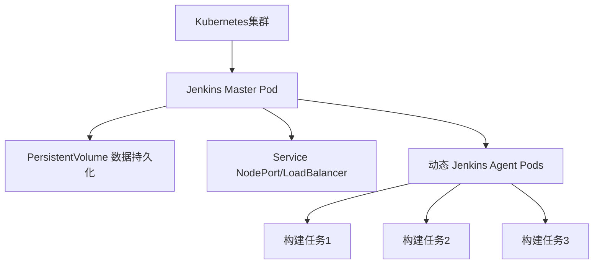
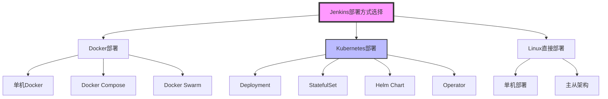
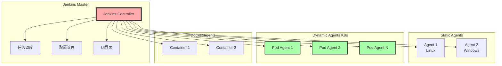
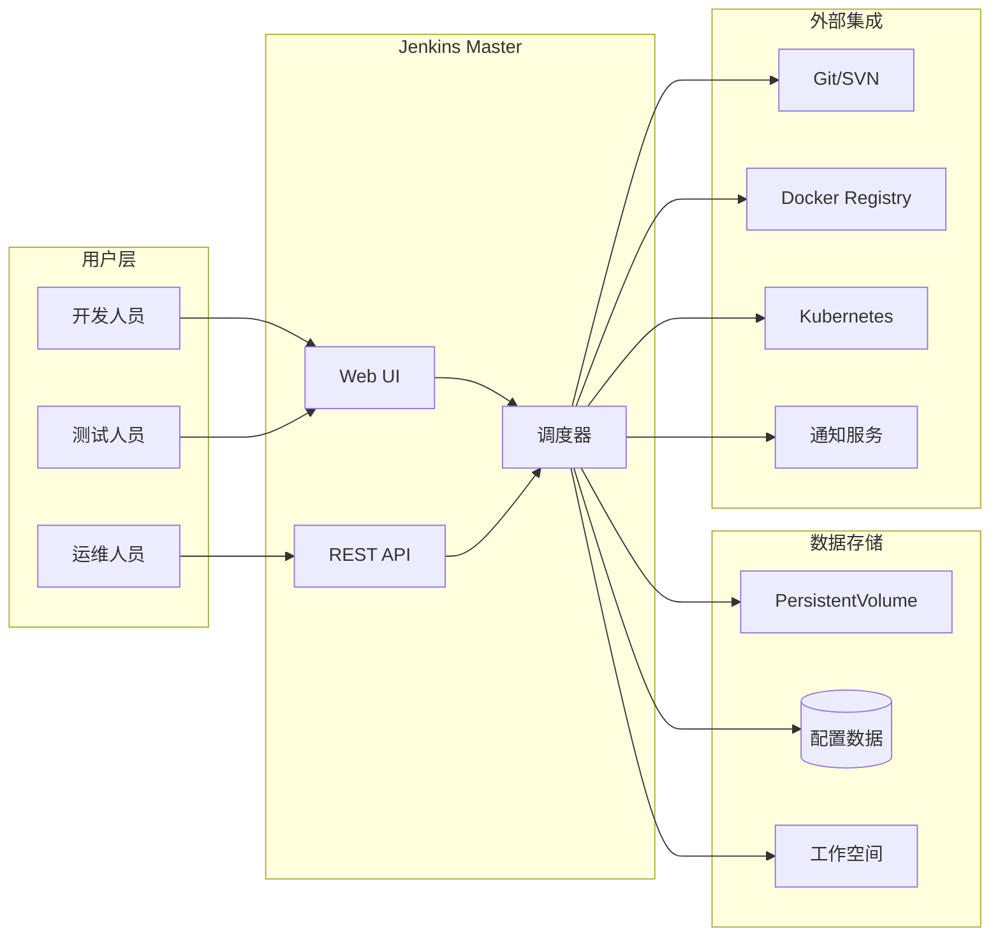
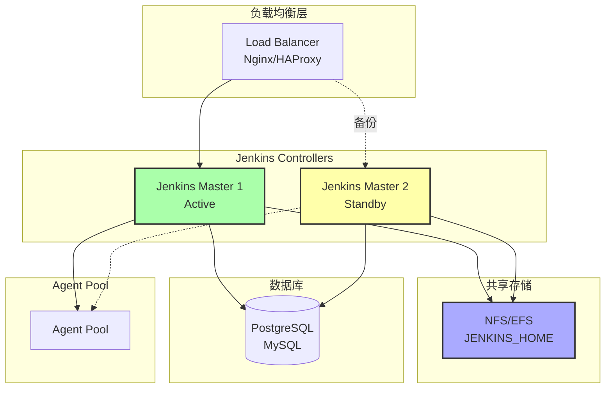

# Jenkins 学习笔记


> 本文档是 Jenkins 系统化学习笔记，涵盖安装配置、Pipeline 使用和常用插件详解。

---

## 📖 文档说明

### 概述


**目标读者**: Jenkins 初学者和运维工程师
**内容特点**: 系统化、实践导向、包含图示说明
**学习路径**: 从安装配置到高级特性，循序渐进

---
## 第一章：Jenkins 安装与配置

### 1.1 Docker 环境安装

#### 1.1.1 Docker 部署 Jenkins 的优势

使用 Docker 部署 Jenkins 具有以下优势：

- **环境隔离**：容器化部署避免依赖冲突
- **快速部署**：几分钟内即可启动 Jenkins 实例
- **易于迁移**：可以在不同环境间快速迁移
- **版本管理**：通过镜像标签控制 Jenkins 版本
- **资源控制**：可以限制容器的资源使用

#### 1.1.2 官方镜像介绍

Jenkins 提供多种官方 Docker 镜像：

| 镜像类型                      | 说明         | 适用场景       |
| ----------------------------- | ------------ | -------------- |
| `jenkins/jenkins:lts`       | 长期支持版本 | 生产环境推荐   |
| `jenkins/jenkins:latest`    | 最新版本     | 测试新特性     |
| `jenkins/jenkins:lts-jdk21` | LTS + JDK21  | 指定 Java 版本 |

> **注意**: 官方镜像不包含 Docker CLI 和 Blue Ocean 插件，需要自定义构建。

#### 1.1.3 macOS/Linux 安装步骤

##### 步骤 1: 创建 Docker 网络

```bash
docker network create jenkins
```

##### 步骤 2: 运行 Docker-in-Docker (DinD) 容器

```bash
docker run \
  --name jenkins-docker \
  --rm \
  --detach \
  --privileged \
  --network jenkins \
  --network-alias docker \
  --env DOCKER_TLS_CERTDIR=/certs \
  --volume jenkins-docker-certs:/certs/client \
  --volume jenkins-data:/var/jenkins_home \
  --publish 2376:2376 \
  docker:dind \
  --storage-driver overlay2
```

**参数说明**：

- `--privileged`: 特权模式（DinD 需要）
- `--volume jenkins-docker-certs:/certs/client`: 挂载证书卷
- `--volume jenkins-data:/var/jenkins_home`: 持久化 Jenkins 数据

##### 步骤 3: 自定义 Jenkins 镜像

创建 `Dockerfile`:

```dockerfile
FROM jenkins/jenkins:2.528.2-jdk21
USER root
RUN apt-get update && apt-get install -y docker-ce-cli
USER jenkins
RUN jenkins-plugin-cli --plugins "blueocean docker-workflow"
```

##### 步骤 4: 构建并运行

```bash
docker build -t myjenkins-blueocean:2.528.2-1 .

docker run \
  --name jenkins-blueocean \
  --restart=on-failure \
  --detach \
  --network jenkins \
  --env DOCKER_HOST=tcp://docker:2376 \
  --publish 8080:8080 \
  --publish 50000:50000 \
  --volume jenkins-data:/var/jenkins_home \
  myjenkins-blueocean:2.528.2-1
```

#### 1.1.4 访问 Jenkins 容器

```bash
# 访问容器终端
docker exec -it jenkins-blueocean bash

# 查看日志
docker logs -f jenkins-blueocean

# 获取初始密码
docker exec jenkins-blueocean cat /var/jenkins_home/secrets/initialAdminPassword
```

#### 1.1.5 数据持久化方案

**方案1: Docker Volume（推荐）**

```bash
docker volume create jenkins-data
--volume jenkins-data:/var/jenkins_home
```

**方案2: 本地目录挂载**

```bash
--volume $HOME/jenkins:/var/jenkins_home
```

#### 1.1.6 最佳实践

1. **使用特定版本标签** - 避免使用 `:latest`
2. **定期备份数据卷**
3. **设置资源限制**: `--memory="2g" --cpus="2.0"`
4. **使用 Docker Compose 管理**（推荐生产环境）

---

### 1.2 Kubernetes 环境安装

#### 1.2.1 Kubernetes 部署架构

在 Kubernetes 上部署 Jenkins 提供了更好的可扩展性和资源管理能力。



#### 1.2.2 基础部署方式

##### 步骤 1: 创建命名空间

```bash
kubectl create namespace devops-tools
```

##### 步骤 2: 创建 ServiceAccount

文件: `jenkins-serviceaccount.yaml`

```yaml
---
apiVersion: rbac.authorization.k8s.io/v1
kind: ClusterRole
metadata:
  name: jenkins-admin
rules:
  - apiGroups: [""]
    resources: ["*"]
    verbs: ["*"]
---
apiVersion: v1
kind: ServiceAccount
metadata:
  name: jenkins-admin
  namespace: devops-tools
---
apiVersion: rbac.authorization.k8s.io/v1
kind: ClusterRoleBinding
metadata:
  name: jenkins-admin
roleRef:
  apiGroup: rbac.authorization.k8s.io
  kind: ClusterRole
  name: jenkins-admin
subjects:
- kind: ServiceAccount
  name: jenkins-admin
  namespace: devops-tools
```

应用配置:

```bash
kubectl apply -f jenkins-serviceaccount.yaml
```

##### 步骤 3: 创建持久化卷

文件: `jenkins-volume.yaml`

```yaml
kind: StorageClass
apiVersion: storage.k8s.io/v1
metadata:
  name: local-storage
provisioner: kubernetes.io/no-provisioner
volumeBindingMode: WaitForFirstConsumer
---
apiVersion: v1
kind: PersistentVolume
metadata:
  name: jenkins-pv-volume
  labels:
    type: local
spec:
  storageClassName: local-storage
  claimRef:
    name: jenkins-pv-claim
    namespace: devops-tools
  capacity:
    storage: 10Gi
  accessModes:
    - ReadWriteOnce
  local:
    path: /mnt
  nodeAffinity:
    required:
      nodeSelectorTerms:
      - matchExpressions:
        - key: kubernetes.io/hostname
          operator: In
          values:
          - worker-node01  # 替换为实际节点名
---
apiVersion: v1
kind: PersistentVolumeClaim
metadata:
  name: jenkins-pv-claim
  namespace: devops-tools
spec:
  storageClassName: local-storage
  accessModes:
    - ReadWriteOnce
  resources:
    requests:
      storage: 3Gi
```

> **生产环境建议**: 使用云提供商的存储类（如 AWS EBS、GCE PD）以保证数据持久性。

应用配置:

```bash
kubectl create -f jenkins-volume.yaml
```

##### 步骤 4: 创建 Deployment

文件: `jenkins-deployment.yaml`

```yaml
apiVersion: apps/v1
kind: Deployment
metadata:
  name: jenkins
  namespace: devops-tools
spec:
  replicas: 1
  selector:
    matchLabels:
      app: jenkins-server
  strategy:
    type: Recreate
  template:
    metadata:
      labels:
        app: jenkins-server
    spec:
      securityContext:
        fsGroup: 1000
        runAsUser: 1000
      serviceAccountName: jenkins-admin
      containers:
        - name: jenkins
          image: jenkins/jenkins:lts
          imagePullPolicy: Always
          resources:
            limits:
              memory: "2Gi"
              cpu: "1000m"
            requests:
              memory: "500Mi"
              cpu: "500m"
          ports:
            - name: httpport
              containerPort: 8080
            - name: jnlpport
              containerPort: 50000
          livenessProbe:
            httpGet:
              path: "/login"
              port: 8080
            initialDelaySeconds: 90
            periodSeconds: 10
            timeoutSeconds: 5
            failureThreshold: 5
          readinessProbe:
            httpGet:
              path: "/login"
              port: 8080
            initialDelaySeconds: 60
            periodSeconds: 10
            timeoutSeconds: 5
            failureThreshold: 3
          volumeMounts:
            - name: jenkins-data
              mountPath: /var/jenkins_home
      volumes:
        - name: jenkins-data
          persistentVolumeClaim:
              claimName: jenkins-pv-claim
```

应用配置:

```bash
kubectl apply -f jenkins-deployment.yaml
```

##### 步骤 5: 创建 Service

文件: `jenkins-service.yaml`

```yaml
apiVersion: v1
kind: Service
metadata:
  name: jenkins-service
  namespace: devops-tools
  annotations:
      prometheus.io/scrape: 'true'
      prometheus.io/path:   /
      prometheus.io/port:   '8080'
spec:
  selector:
    app: jenkins-server
  type: NodePort
  ports:
    - port: 8080
      targetPort: 8080
      nodePort: 32000
```

应用配置:

```bash
kubectl apply -f jenkins-service.yaml
```

访问 Jenkins:

```bash
# 获取节点IP
kubectl get nodes -o wide

# 访问地址
http://<node-ip>:32000
```

#### 1.2.3 使用 Helm 安装（推荐）

##### 步骤 1: 添加 Jenkins Helm 仓库

```bash
helm repo add jenkinsci https://charts.jenkins.io
helm repo update
```

##### 步骤 2: 创建 values 配置文件

文件: `jenkins-values.yaml`

```yaml
controller:
  serviceType: NodePort
  nodePort: 32000
  installPlugins:
    - kubernetes:4389.v3e60b_3e4c6b_3
    - workflow-aggregator:657.v7539b_b_25a_61f
    - git:5.6.0
    - configuration-as-code:1890.v88e1e8dcbfa_c
  
persistence:
    enabled: true
    storageClass: "jenkins-pv"
    size: "10Gi"

serviceAccount:
  create: false
  name: jenkins

resources:
  limits:
    cpu: "2000m"
    memory: "4Gi"
  requests:
    cpu: "500m"
    memory: "1Gi"
```

##### 步骤 3: 安装 Jenkins

```bash
helm install jenkins jenkinsci/jenkins \
  -n devops-tools \
  -f jenkins-values.yaml
```

##### 步骤 4: 获取管理员密码

```bash
jsonpath="{.data.jenkins-admin-password}"
secret=$(kubectl get secret -n devops-tools jenkins -o jsonpath=$jsonpath)
echo $(echo $secret | base64 --decode)
```

#### 1.2.4 配置动态 Agent

Jenkins Kubernetes Plugin 允许动态创建Agent Pod：

```groovy
pipeline {
    agent {
        kubernetes {
            yaml '''
apiVersion: v1
kind: Pod
metadata:
  labels:
    jenkins: agent
spec:
  containers:
  - name: maven
    image: maven:3.8.1-jdk-11
    command:
    - sleep
    args:
    - 99d
'''
        }
    }
    stages {
        stage('Build') {
            steps {
                container('maven') {
                    sh 'mvn --version'
                }
            }
        }
    }
}
```

#### 1.2.5 高可用配置建议

1. **使用 StatefulSet** - 保证 Pod 名称稳定
2. **配置持久化存储** - 使用云存储类
3. **设置资源限制和请求**
4. **配置健康检查** - Liveness 和 Readiness Probes
5. **使用 HPA** - 水平自动扩缩容（仅适用于无状态组件）

---

### 1.3 Linux 环境安装

#### 1.3.1 系统要求

- **操作系统**: Debian/Ubuntu, RHEL/CentOS, Fedora
- **Java版本**: OpenJDK 21 或兼容版本
- **硬件**: 最小 256MB RAM, 推荐 4GB+ RAM
- **磁盘**: 最小 1GB，推荐 50GB+

#### 1.3.2 Debian/Ubuntu 安装

##### 步骤 1: 安装 Java

```bash
sudo apt update
sudo apt install fontconfig openjdk-21-jre
java -version
```

输出示例:

```
openjdk 21.0.8 2025-07-15
OpenJDK Runtime Environment (build 21.0.8+9-Debian-1)
```

> **重要**: 必须先安装 Java，否则 Jenkins 服务可能无法启动。

##### 步骤 2: 添加 Jenkins 仓库

**LTS 版本（推荐）**:

```bash
sudo wget -O /etc/apt/keyrings/jenkins-keyring.asc \
  https://pkg.jenkins.io/debian-stable/jenkins.io-2023.key
echo "deb [signed-by=/etc/apt/keyrings/jenkins-keyring.asc]" \
  https://pkg.jenkins.io/debian-stable binary/ | sudo tee \
  /etc/apt/sources.list.d/jenkins.list > /dev/null
```

**Weekly 版本**:

```bash
sudo wget -O /etc/apt/keyrings/jenkins-keyring.asc \
  https://pkg.jenkins.io/debian/jenkins.io-2023.key
echo "deb [signed-by=/etc/apt/keyrings/jenkins-keyring.asc]" \
  https://pkg.jenkins.io/debian binary/ | sudo tee \
  /etc/apt/sources.list.d/jenkins.list > /dev/null
```

##### 步骤 3: 安装 Jenkins

```bash
sudo apt update
sudo apt install jenkins
```

安装过程会自动：

- 创建 `jenkins` 用户和用户组
- 配置 systemd 服务
- 设置 `/var/lib/jenkins` 为 JENKINS_HOME
- 配置Jenkins监听8080端口

#### 1.3.3 RHEL/CentOS 安装

##### 使用 yum (RHEL/CentOS 7)

```bash
# 添加仓库
sudo wget -O /etc/yum.repos.d/jenkins.repo \
    https://pkg.jenkins.io/redhat-stable/jenkins.repo
sudo rpm --import https://pkg.jenkins.io/redhat-stable/jenkins.io-2023.key

# 安装依赖和Jenkins
sudo yum upgrade
sudo yum install fontconfig java-21-openjdk
sudo yum install jenkins
sudo systemctl daemon-reload
```

##### 使用 dnf (Fedora/RHEL 8+)

```bash
sudo wget -O /etc/yum.repos.d/jenkins.repo \
    https://pkg.jenkins.io/redhat-stable/jenkins.repo
sudo rpm --import https://pkg.jenkins.io/redhat-stable/jenkins.io-2023.key
sudo dnf upgrade
sudo dnf install fontconfig java-21-openjdk
sudo dnf install jenkins
sudo systemctl daemon-reload
```

#### 1.3.4 启动和管理 Jenkins 服务

##### 启用开机自启

```bash
sudo systemctl enable jenkins
```

##### 启动服务

```bash
sudo systemctl start jenkins
```

##### 检查状态

```bash
sudo systemctl status jenkins
```

正常输出:

```
● jenkins.service - Jenkins Continuous Integration Server
   Loaded: loaded (/lib/systemd/system/jenkins.service; enabled)
   Active: active (running) since Tue 2024-12-04 16:19:01 CST
```

##### 重启服务

```bash
sudo systemctl restart jenkins
```

##### 停止服务

```bash
sudo systemctl stop jenkins
```

##### 查看日志

```bash
# 查看实时日志
sudo journalctl -u jenkins.service -f

# 查看所有日志
sudo journalctl -u jenkins.service

# 查看最近100行
sudo journalctl -u jenkins.service -n 100
```

#### 1.3.5 修改端口配置

如果8080端口被占用，需要修改端口：

```bash
sudo systemctl edit jenkins
```

添加以下内容:

```ini
[Service]
Environment="JENKINS_PORT=8081"
```

重启服务:

```bash
sudo systemctl restart jenkins
```

#### 1.3.6 防火墙配置

##### firewalld 配置

```bash
YOURPORT=8080
PERM="--permanent"
SERV="$PERM --service=jenkins"

firewall-cmd $PERM --new-service=jenkins
firewall-cmd $SERV --set-short="Jenkins ports"
firewall-cmd $SERV --set-description="Jenkins port exceptions"
firewall-cmd $SERV --add-port=$YOURPORT/tcp
firewall-cmd $PERM --add-service=jenkins
firewall-cmd --zone=public --add-service=http --permanent
firewall-cmd --reload
```

##### ufw 配置 (Ubuntu)

```bash
sudo ufw allow 8080/tcp
sudo ufw reload
```

#### 1.3.7 文件位置说明

| 路径                                    | 说明                      |
| --------------------------------------- | ------------------------- |
| `/var/lib/jenkins`                    | JENKINS_HOME 目录         |
| `/etc/default/jenkins`                | 配置文件（Debian/Ubuntu） |
| `/etc/sysconfig/jenkins`              | 配置文件（RHEL/CentOS）   |
| `/lib/systemd/system/jenkins.service` | systemd 服务文件          |
| `/var/log/jenkins/jenkins.log`        | 日志文件                  |

#### 1.3.8 常见问题

##### 问题1: 端口已被占用

```bash
# 查看端口占用
sudo netstat -tulpn | grep 8080
# 或
sudo lsof -i :8080
```

##### 问题2: Java 未找到

```bash
# 设置 JAVA_HOME
echo 'export JAVA_HOME=/usr/lib/jvm/java-21-openjdk-amd64' | sudo tee -a /etc/profile
source /etc/profile
```

##### 问题3: 权限问题

```bash
# 修复权限
sudo chown -R jenkins:jenkins /var/lib/jenkins
```

---

### 1.4 初始化配置

安装完成后，需要进行初始化配置才能开始使用 Jenkins。

#### 1.4.1 解锁 Jenkins

##### 访问 Web 界面

打开浏览器访问:

```
http://localhost:8080
```

或者（如果是远程服务器）:

```
http://<server-ip>:8080
```

##### 获取初始密码

**方法1: 查看文件**

```bash
sudo cat /var/lib/jenkins/secrets/initialAdminPassword
```

**方法2: 查看日志**

```bash
sudo journalctl -u jenkins.service | grep -A 5 "初始密码"
```

**方法3: Docker环境**

```bash
docker exec jenkins-blueocean cat /var/jenkins_home/secrets/initialAdminPassword
```

**方法4: Kubernetes环境**

```bash
kubectl exec -it deployment/jenkins -n devops-tools -- \
  cat /var/jenkins_home/secrets/initialAdminPassword
```

将密码粘贴到 Web 界面即可解锁。

#### 1.4.2 安装插件

解锁后会看到插件安装选项：

##### 选项1: 安装推荐插件（推荐新手）

包含常用插件：

- Git
- Pipeline
- Credentials
- SSH Agents
- Blue Ocean (如果选择)

##### 选项2: 选择插件安装（推荐熟练用户）

可以自定义选择需要的插件。

**推荐安装的插件**:

- **源码管理**: Git, GitHub, GitLab
- **构建工具**: Maven, Gradle, NodeJS
- **容器**: Docker, Kubernetes
- **通知**: Email Extension, Slack
- **安全**: LDAP, Role-based Authorization

插件安装过程可能需要几分钟。

#### 1.4.3 创建管理员用户

##### 填写用户信息

- **用户名**: admin（或自定义）
- **密码**: 设置强密码
- **全名**: 管理员姓名
- **电子邮件**: 管理员邮箱

> **提示**: 如果跳过此步骤，默认用户名为 `admin`，密码为初始密码。

#### 1.4.4 配置 Jenkins URL

设置 Jenkins 访问地址，用于：

- 生成邮件通知链接
- Configure webhook URLs
- Agent连接地址

示例:

```
http://jenkins.example.com:8080/
```

或保持默认的本地地址。

#### 1.4.5 全局工具配置

进入 `Manage Jenkins` > `Global Tool Configuration`:

##### JDK 配置

```
Name: JDK-21
JAVA_HOME: /usr/lib/jvm/java-21-openjdk-amd64
```

或勾选"自动安装"。

##### Maven 配置

```
Name: Maven-3.9
Version: 3.9.x
```

##### Git 配置

通常自动检测系统安装的 Git。

##### Docker 配置

```
Name: Docker
Docker URL: unix:///var/run/docker.sock
```

#### 1.4.6 安全配置

##### 启用安全策略

`Manage Jenkins` > `Configure Global Security`:

**授权策略**:

- **Matrix-based security**: 精细权限控制
- **Role-Based Strategy**: 基于角色（需安装插件）
- **Project-based**: 基于项目

**访问控制**:

- 禁用匿名访问
- 启用"Allow users to sign up"（可选）
- 配置CSRF Protection（默认启用）

##### LDAP/AD集成（可选）

如果企业使用LDAP:

```
Server: ldap://ldap.example.com
Root DN: dc=example,dc=com
User search base: ou=users
```

#### 1.4.7 系统配置

`Manage Jenkins` > `Configure System`:

##### Jenkins Location

```
Jenkins URL: http://jenkins.example.com:8080/
System Admin e-mail address: admin@example.com
```

##### 邮件通知

```
SMTP server: smtp.example.com
Default user e-mail suffix: @example.com
```

测试邮件配置:

```
Test e-mail recipient: your-email@example.com
```

##### 执行器数量

```
# of executors: 2  # 根据CPU核心数调整
```

> **建议**: `执行器数量 = CPU核心数 - 1`

##### Quiet period

```
Quiet period: 5  # 秒，任务触发后的静默期
```

#### 1.4.8 凭据管理

`Manage Jenkins` > `Manage Credentials`:

##### 添加SSH密钥

```
Kind: SSH Username with private key
ID: github-ssh
Username: git
Private Key: [粘贴私钥内容]
```

##### 添加用户名密码

```
Kind: Username with password
Scope: Global
Username: your-username
Password: your-password
ID: docker-registry
```

##### 添加Secret text

```
Kind: Secret text
Secret: your-api-token
ID: api-token
```

#### 1.4.9 配置代理（可选）

如果Jenkins服务器需要通过代理访问外网:

`Manage Jenkins` > `Manage Plugins` > `Advanced`:

```
HTTP Proxy Configuration:
Server: proxy.example.com
Port: 8080
No Proxy Host: localhost,127.0.0.1,*.internal.com
```

#### 1.4.10 Jenkins CLI 配置（可选）

下载CLI工具:

```bash
wget http://localhost:8080/jnlpJars/jenkins-cli.jar
```

使用示例:

```bash
java -jar jenkins-cli.jar -s http://localhost:8080/ -auth admin:password help
```

#### 1.4.11 备份配置

初始配置完成后，建议立即备份:

```bash
# 备份JENKINS_HOME
sudo tar -czf jenkins-backup-$(date +%Y%m%d).tar.gz /var/lib/jenkins

# 或使用ThinBackup插件
```

---

### 1.5 Jenkins 部署架构图

#### 1.5.1 部署方式对比



#### 1.5.2 Master-Agent 架构



#### 1.5.3 数据流架构



#### 1.5.4 高可用架构（推荐生产环境）



#### 1.5.5 部署方式选择建议

| 场景          | 推荐方式          | 理由                 |
| ------------- | ----------------- | -------------------- |
| 个人学习/测试 | Docker单机        | 快速、简单、易于清理 |
| 小团队开发    | Linux直接部署     | 稳定、易维护         |
| 中型团队      | Kubernetes + Helm | 扩展性好、易管理     |
| 大型企业      | K8s + 高可用架构  | 高可用、动态扩展     |
| CI/CD密集型   | K8s + 动态Agent   | 资源利用率高         |

#### 1.5.6 资源规划建议

##### 小型部署（< 10个任务/天）

- **CPU**: 2核
- **内存**: 4GB
- **存储**: 20GB
- **Agent**: 1-2个

##### 中型部署（10-100个任务/天）

- **CPU**: 4核
- **内存**: 8GB
- **存储**: 100GB
- **Agent**: 3-10个

##### 大型部署（> 100个任务/天）

- **CPU**: 8核+
- **内存**: 16GB+
- **存储**: 500GB+
- **Agent**: 10+个（动态扩展）

---

**第一章小结**

本章介绍了 Jenkins 的三种主要安装方式：

- ✅ Docker 部署 - 适合快速部署和测试
- ✅ Kubernetes 部署 - 适合云原生环境和大规模使用
- ✅ Linux 部署 - 适合传统服务器环境

完成安装后，进行了初始化配置，包括解锁、插件安装、用户创建、安全配置等关键步骤。

**下一步**: 学习第二章 Jenkins Pipeline 详解

---

## 第二章：Jenkins Pipeline 详解

### 2.1 Pipeline 基础概念

#### 什么是 Jenkins Pipeline

Jenkins Pipeline 是一套插件集合，支持将持续交付流程实现并集成到 Jenkins 中。

**Pipeline 核心优势**：

- ✅ **代码化（Code）**：Pipeline 以代码形式定义，可纳入版本控制
- ✅ **持久性（Durable）**：Pipeline 可在控制器重启后继续执行
- ✅ **可暂停（Pausable）**：可等待人工输入或审批
- ✅ **多功能（Versatile）**：支持复杂的真实 CD 需求
- ✅ **可扩展（Extensible）**：支持自定义扩展和插件集成

#### 声明式 vs 脚本式 Pipeline

**声明式 Pipeline（推荐）**：

```groovy
pipeline {
    agent any
    stages {
        stage('Build') {
            steps {
                echo 'Building..'
            }
        }
    }
}
```

**脚本式 Pipeline**：

```groovy
node {
    stage('Build') {
        echo 'Building..'
    }
}
```

---

### 2.2 Jenkinsfile 核心要点

#### 环境变量

**常用系统变量**：

- `BUILD_NUMBER` - 构建编号
- `JOB_NAME` - 任务名称
- `WORKSPACE` - 工作空间路径
- `JENKINS_URL` - Jenkins URL

**使用示例**：

```groovy
echo "Running build ${env.BUILD_NUMBER}"
```

#### 凭据管理最佳实践

```groovy
environment {
    AWS_KEY = credentials('aws-key-id')
}
```

> **重要提示**：始终使用单引号避免 Groovy 插值泄露敏感信息

---

### 2.3 Pipeline 中使用 Docker

#### 基本用法

```groovy
agent {
    docker { 
        image 'maven:3.9.9' 
        args '-v $HOME/.m2:/root/.m2'
    }
}
```

#### 多容器支持

```groovy
stages {
    stage('Backend') {
        agent { docker { image 'maven:3.9.9' } }
        steps { sh 'mvn --version' }
    }
    stage('Frontend') {
        agent { docker { image 'node:20' } }
        steps { sh 'node --version' }
    }
}
```

---

### 2.4 共享库

#### 目录结构

```
(root)
+- src/              # Groovy 类
+- vars/             # 全局变量  
+- resources/        # 资源文件
```

#### 使用示例

```groovy
@Library('my-lib') _

pipeline {
    stages {
        stage('Example') {
            steps {
                script {
                    log.info 'Starting build'
                }
            }
        }
    }
}
```

---

### 2.5 Pipeline 高级特性

#### When 条件

```groovy
when {
    branch 'production'
    environment name: 'DEPLOY', value: 'true'
}
```

#### Parallel 并行

```groovy
stage('Tests') {
    parallel {
        stage('Unit') {
            steps { sh 'make unit-test' }
        }
        stage('Integration') {
            steps { sh 'make integration-test' }
        }
    }
}
```

#### Post 处理

```groovy
post {
    always { junit '**/*.xml' }
    success { echo 'Success!' }
    failure { mail to: 'team@example.com' }
}
```

---

### 2.6 Pipeline 流程图

#### 基本执行流程

```
Pipeline 开始
    ↓
分配 Agent
    ↓
设置环境变量
    ↓
执行 Stages
    ↓
Post 处理
    ↓
Pipeline 结束
```

---

**第二章小结**：

- Pipeline 提供了代码化的 CI/CD 解决方案
- 声明式语法更易读易维护
- Docker 集成简化了构建环境管理
- 共享库促进代码复用
- 高级特性支持复杂的流程控制

### 2.7 Declarative Pipeline 完整语法

#### 2.7.1 When 条件详解

##### 内置条件类型

**1. branch** - 分支匹配

```groovy
when { branch 'master' }
when { branch pattern: "release-\\d+", comparator: "REGEXP" }
```

**2. buildingTag** - 构建标签时执行

```groovy
when { buildingTag() }
```

**3. changelog** - 变更日志匹配

```groovy
when { changelog '.*^\\[DEPENDENCY\\] .+$' }
```

**4. changeset** - 文件变更匹配

```groovy
when { changeset "**/*.js" }
when { changeset pattern: ".TEST\\.java", comparator: "REGEXP" }
```

**5. changeRequest** - PR/MR触发

```groovy
when { changeRequest() }
when { changeRequest target: 'master' }
when { changeRequest authorEmail: "[\\w_-.]+@example.com", comparator: 'REGEXP' }
```

**6. environment** - 环境变量匹配

```groovy
when { environment name: 'DEPLOY_TO', value: 'production' }
```

**7. expression** - Groovy 表达式

```groovy
when { expression { return params.DEBUG_BUILD } }
when { expression { BRANCH_NAME ==~ /(production|staging)/ } }
```

**8. tag** - 标签匹配

```groovy
when { tag "release-*" }
when { tag pattern: "release-\\d+", comparator: "REGEXP" }
```

**9. triggeredBy** - 触发方式

```groovy
when { triggeredBy 'SCMTrigger' }
when { triggeredBy 'TimerTrigger' }
when { triggeredBy 'BuildUpstreamCause' }
when { triggeredBy cause: "UserIdCause", detail: "vlinde" }
```

##### 条件组合

**not** - 条件取反

```groovy
when { not { branch 'master' } }
```

**allOf** - 所有条件都满足（AND）

```groovy
when { 
    allOf { 
        branch 'master'
        environment name: 'DEPLOY_TO', value: 'production' 
    } 
}
```

**anyOf** - 任一条件满足（OR）

```groovy
when { 
    anyOf { 
        branch 'master'
        branch 'staging' 
    } 
}
```

##### When 条件执行时机控制

**beforeAgent** - 在分配 Agent 之前评估

```groovy
stage('Deploy') {
    agent { label "production-server" }
    when {
        beforeAgent true
        branch 'production'
    }
    steps {
        echo 'Deploying'
    }
}
```

**beforeInput** - 在 Input 之前评估

```groovy
when {
    beforeInput true
    branch 'production'
}
input {
    message "Deploy to production?"
}
```

**beforeOptions** - 在 Options 之前评估

```groovy
when {
    beforeOptions true
    branch 'testing'
}
options {
    lock label: 'testing-deploy-envs'
}
```

优先级：`beforeOptions` > `beforeInput` > `beforeAgent`

---

### 2.8 Sequential Stages（顺序嵌套阶段）

#### 2.8.1 基本用法

```groovy
pipeline {
    agent none
    stages {
        stage('Sequential') {
            agent { label 'for-sequential' }
            environment {
                FOR_SEQUENTIAL = "some-value"
            }
            stages {
                stage('In Sequential 1') {
                    steps {
                        echo "In Sequential 1"
                    }
                }
                stage('In Sequential 2') {
                    steps {
                        echo "In Sequential 2"
                    }
                }
                stage('Parallel In Sequential') {
                    parallel {
                        stage('In Parallel 1') {
                            steps {
                                echo "In Parallel 1"
                            }
                        }
                        stage('In Parallel 2') {
                            steps {
                                echo "In Parallel 2"
                            }
                        }
                    }
                }
            }
        }
    }
}
```

**关键点**：

- 嵌套的 stages 会继承父 stage 的 agent 和 environment
- 可以在嵌套 stages 内部使用 parallel
- 每个 stage 必须有且仅有一个：steps、stages、parallel 或 matrix

---

### 2.9 Parallel（并行执行）

#### 2.9.1 基本并行

```groovy
stage('Parallel Stage') {
    parallel {
        stage('Branch A') {
            agent { label "for-branch-a" }
            steps {
                echo "On Branch A"
            }
        }
        stage('Branch B') {
            agent { label "for-branch-b" }
            steps {
                echo "On Branch B"
            }
        }
    }
}
```

#### 2.9.2 failFast 快速失败

```groovy
stage('Parallel Stage') {
    failFast true  // 任一并行分支失败时，中止所有并行分支
    parallel {
        stage('Branch A') { ... }
        stage('Branch B') { ... }
    }
}
```

**全局并行快速失败**：

```groovy
pipeline {
    agent any
    options {
        parallelsAlwaysFailFast()  // 所有并行阶段都使用 failFast
    }
    stages { ... }
}
```

---

### 2.10 Matrix（矩阵构建）

#### 2.10.1 Matrix 概念

Matrix 允许定义多维度的名称-值组合，并行执行。每个组合称为一个"单元格（cell）"。

#### 2.10.2 单轴 Matrix

```groovy
matrix {
    axes {
        axis {
            name 'PLATFORM'
            values 'linux', 'mac', 'windows'
        }
    }
    stages {
        stage('build') {
            steps {
                echo "Building on ${PLATFORM}"
            }
        }
    }
}
```

**结果**：创建 3 个并行单元格（linux, mac, windows）

#### 2.10.3 多轴 Matrix

```groovy
matrix {
    axes {
        axis {
            name 'PLATFORM'
            values 'linux', 'mac', 'windows'
        }
        axis {
            name 'BROWSER'
            values 'chrome', 'edge', 'firefox', 'safari'
        }
    }
    stages {
        stage('test') {
            steps {
                echo "Testing on ${PLATFORM} with ${BROWSER}"
            }
        }
    }
}
```

**结果**：创建 12 个并行单元格（3 × 4）

#### 2.10.4 Excludes（排除组合）

```groovy
matrix {
    axes {
        axis {
            name 'PLATFORM'
            values 'linux', 'mac', 'windows'
        }
        axis {
            name 'BROWSER'
            values 'chrome', 'edge', 'firefox', 'safari'
        }
        axis {
            name 'ARCHITECTURE'
            values '32-bit', '64-bit'
        }
    }
    excludes {
        exclude {
            // 排除 mac + 32-bit 组合（4个单元格）
            axis {
                name 'PLATFORM'
                values 'mac'
            }
            axis {
                name 'ARCHITECTURE'
                values '32-bit'
            }
        }
        exclude {
            // 排除 linux + safari 组合（2个单元格）
            axis {
                name 'PLATFORM'
                values 'linux'
            }
            axis {
                name 'BROWSER'
                values 'safari'
            }
        }
        exclude {
            // 排除非 windows 平台的 edge（3个单元格）
            axis {
                name 'PLATFORM'
                notValues 'windows'  // notValues 表示"不是"
            }
            axis {
                name 'BROWSER'
                values 'edge'
            }
        }
    }
    stages {
        stage('test') {
            steps {
                echo "Testing ${PLATFORM}-${BROWSER}-${ARCHITECTURE}"
            }
        }
    }
}
```

**总单元格数**：3 × 4 × 2 = 24
**排除数**：4 + 2 + 3 = 9
**实际执行**：24 - 9 = 15 个单元格

#### 2.10.5 Matrix 单元格级别指令

可以在 matrix 级别使用以下指令，它们会应用到每个单元格：

```groovy
matrix {
    agent {
        label "${PLATFORM}-agent"  // 根据平台选择 agent
    }
    when { 
        anyOf {
            expression { params.PLATFORM_FILTER == 'all' }
            expression { params.PLATFORM_FILTER == env.PLATFORM }
        } 
    }
    environment {
        TEST_ENV = "${PLATFORM}-${BROWSER}"
    }
    axes { ... }
    stages { ... }
}
```

**支持的指令**：

- agent
- environment
- input
- options
- post
- tools
- when

#### 2.10.6 完整 Matrix 示例

```groovy
pipeline {
    parameters {
        choice(name: 'PLATFORM_FILTER', 
               choices: ['all', 'linux', 'windows', 'mac'], 
               description: 'Run on specific platform')
    }
    agent none
    stages {
        stage('BuildAndTest') {
            matrix {
                agent {
                    label "${PLATFORM}-agent"
                }
                when { 
                    anyOf {
                        expression { params.PLATFORM_FILTER == 'all' }
                        expression { params.PLATFORM_FILTER == env.PLATFORM }
                    } 
                }
                axes {
                    axis {
                        name 'PLATFORM'
                        values 'linux', 'windows', 'mac'
                    }
                    axis {
                        name 'BROWSER'
                        values 'firefox', 'chrome', 'safari', 'edge'
                    }
                }
                excludes {
                    exclude {
                        axis {
                            name 'PLATFORM'
                            values 'linux'
                        }
                        axis {
                            name 'BROWSER'
                            values 'safari'
                        }
                    }
                    exclude {
                        axis {
                            name 'PLATFORM'
                            notValues 'windows'
                        }
                        axis {
                            name 'BROWSER'
                            values 'edge'
                        }
                    }
                }
                stages {
                    stage('Build') {
                        steps {
                            echo "Building on ${PLATFORM} - ${BROWSER}"
                        }
                    }
                    stage('Test') {
                        steps {
                            echo "Testing on ${PLATFORM} - ${BROWSER}"
                        }
                    }
                }
            }
        }
    }
}
```

---

### 2.11 Script 块（Groovy 脚本）

#### 2.11.1 在 Declarative Pipeline 中使用 Scripted Pipeline

```groovy
pipeline {
    agent any
    stages {
        stage('Example') {
            steps {
                echo 'Hello World'
            
                script {
                    def browsers = ['chrome', 'firefox']
                    for (int i = 0; i < browsers.size(); ++i) {
                        echo "Testing the ${browsers[i]} browser"
                    }
                }
            }
        }
    }
}
```

**Script 块使用建议**：

- ✅ 适用于简单的逻辑处理
- ✅ 复杂逻辑应移至共享库
- ⚠️ 不要在 script 块中嵌入大量代码
- ⚠️ script 块会降低声明式 Pipeline 的可读性

---

### 2.12 Scripted Pipeline 详解

#### 2.12.1 基本结构

```groovy
node {
    stage('Checkout') {
        checkout scm
    }
    stage('Build') {
        sh 'make'
    }
    stage('Test') {
        sh 'make check'
    }
}
```

#### 2.12.2 流程控制

**if/else 条件**：

```groovy
node {
    stage('Example') {
        if (env.BRANCH_NAME == 'master') {
            echo 'I only execute on the master branch'
        } else {
            echo 'I execute elsewhere'
        }
    }
}
```

**try/catch/finally 异常处理**：

```groovy
node {
    stage('Example') {
        try {
            sh 'exit 1'
        }
        catch (exc) {
            echo 'Something failed!'
            throw
        }
        finally {
            echo 'This always runs'
        }
    }
}
```

---

### 2.13 Pipeline 语法最佳实践总结

#### 2.13.1 选择合适的 Pipeline 类型

| 场景            | 推荐类型    | 原因             |
| --------------- | ----------- | ---------------- |
| 标准 CI/CD 流程 | Declarative | 结构清晰、易维护 |
| 复杂逻辑处理    | Scripted    | 灵活性高         |
| 团队协作项目    | Declarative | 统一规范         |
| 原型快速验证    | Scripted    | 开发迅速         |

#### 2.13.2 When 条件使用技巧

```groovy
// ✅ 推荐：使用 beforeAgent 节省资源
when {
    beforeAgent true
    branch 'production'
}

// ✅ 推荐：组合条件使用 allOf/anyOf
when {
    allOf {
        branch 'release'
        expression { return params.DEPLOY }
    }
}

// ❌ 不推荐：过度嵌套
when {
    allOf {
        anyOf {
            branch 'a'
            branch 'b'
        }
        not {
            expression { ... }
        }
    }
}
```

#### 2.13.3 Parallel/Matrix 使用建议

```groovy
// ✅ 推荐：为并行阶段命名清晰
parallel {
    stage('Unit Tests') { ... }
    stage('Integration Tests') { ... }
    stage('E2E Tests') { ... }
}

// ✅ 推荐：使用 failFast 快速反馈
stage('Tests') {
    failFast true
    parallel { ... }
}

// ✅ 推荐：Matrix 排除无效组合
matrix {
    axes { ... }
    excludes {
        exclude {
            // 排除不支持的组合
        }
    }
}
```

#### 2.13.4 性能优化建议

1. **合理使用 Agent**

   ```groovy
   pipeline {
       agent none  // 不在全局分配
       stages {
           stage('Build') {
               agent any  // 仅在需要时分配
           }
       }
   }
   ```

2. **使用 stash/unstash 传递构建产物**

   ```groovy
   stash includes: '**/target/*.jar', name: 'app'
   unstash 'app'
   ```

3. **设置合理的超时**

   ```groovy
   options {
       timeout(time: 1, unit: 'HOURS')
   }
   ```

4. **并行执行独立任务**

   ```groovy
   parallel {
       stage('Unit Tests') { ... }
       stage('Lint') { ... }
   }
   ```

---

**第二章完整小结**：

本章详细介绍了 Jenkins Pipeline 的完整语法体系：

- ✅ **When 条件**：9 种内置条件 + 组合条件 + 执行时机控制
- ✅ **Sequential Stages**：顺序嵌套阶段构建复杂流程
- ✅ **Parallel**：并行执行 + failFast 快速失败
- ✅ **Matrix**：多维度矩阵构建 + 智能排除
- ✅ **Script 块**：声明式中嵌入脚本式逻辑
- ✅ **Scripted Pipeline**：完全的 Groovy DSL 支持
- ✅ **最佳实践**：性能优化和代码规范

掌握这些语法，您就可以构建任何复杂度的 CI/CD Pipeline！

---

---

## 第三章：常用插件详解

### 3.1 Git 插件

#### 基本用法

```groovy
git branch: 'main',
    credentialsId: 'github-creds',
    url: 'https://github.com/user/repo.git'
```

#### 高级特性

**多仓库管理**：

```groovy
dir('app') {
    git url: 'https://github.com/user/app.git'
}
dir('config') {
    git url: 'https://github.com/user/config.git'
}
```

**浅克隆**：

```groovy
checkout([
    $class: 'GitSCM',
    extensions: [[$class: 'CloneOption', depth: 1, shallow: true]]
])
```

---

### 3.2 withCredentials 插件

#### 凭据类型支持

| 类型              | 用途       | 示例              |
| ----------------- | ---------- | ----------------- |
| Secret Text       | API Token  | 认证令牌          |
| Username/Password | 数据库登录 | MySQL、PostgreSQL |
| SSH Key           | Git访问    | GitHub、GitLab    |
| Secret File       | 证书文件   | Kubeconfig、证书  |

#### 使用示例

**Secret Text**：

```groovy
withCredentials([string(credentialsId: 'api-token', variable: 'TOKEN')]) {
    sh 'curl -H "Authorization: Bearer $TOKEN" https://api.example.com'
}
```

**用户名密码**：

```groovy
withCredentials([usernamePassword(
    credentialsId: 'db-creds',
    usernameVariable: 'USER',
    passwordVariable: 'PASS')]) {
    sh 'mysql -u $USER -p$PASS'
}
```

---

### 3.3 HTTP Request 插件

#### GET 请求

```groovy
def response = httpRequest 'https://api.example.com/status'
println "Status: ${response.status}"
```

#### POST 请求

```groovy
httpRequest httpMode: 'POST',
            url: 'https://api.example.com/data',
            contentType: 'APPLICATION_JSON',
            requestBody: '{"key":"value"}'
```

#### 认证请求

```groovy
httpRequest url: 'https://api.example.com/data',
            authentication: 'api-credentials',
            validResponseCodes: '200:299'
```

---

### 3.4 Kubernetes 插件

#### Pod Template

```groovy
podTemplate(containers: [
    containerTemplate(
        name: 'maven',
        image: 'maven:3.9.9',
        command: 'sleep',
        args: '99d'
    )
]) {
    node(POD_LABEL) {
        container('maven') {
            sh 'mvn clean package'
        }
    }
}
```

#### YAML 定义

```groovy
def podYaml = '''
apiVersion: v1
kind: Pod
spec:
  containers:
  - name: build
    image: gradle:8.14.0
    command: ['sleep']
    args: ['infinity']
'''

pipeline {
    agent {
        kubernetes { yaml podYaml }
    }
    stages {
        stage('Build') {
            steps {
                container('build') {
                    sh 'gradle build'
                }
            }
        }
    }
}
```

#### 资源限制

```groovy
containerTemplate(
    name: 'build',
    image: 'maven:3.9.9',
    resourceRequestCpu: '500m',
    resourceRequestMemory: '1Gi',
    resourceLimitCpu: '1000m',
    resourceLimitMemory: '2Gi'
)
```

---

### 3.5 ThinBackup 插件

#### 配置要点

**备份目录**：`/var/jenkins_backup`

**备份计划**（Cron）：

```
H 2 * * *    # 每天凌晨2点
```

**保留策略**：

- 完整备份：保留 7 天
- 差异备份：保留 30 天

#### 备份内容选项

- ✅ 配置文件（推荐）
- ✅ 任务配置（推荐）
- ✅ 构建历史（可选）
- ⬜ 工作空间（通常不需要）

#### 恢复流程

1. 停止 Jenkins 服务
2. 恢复备份到 `JENKINS_HOME`
3. 启动 Jenkins 服务
4. 验证配置正确性

---

### 3.6 插件使用最佳实践

#### 推荐插件组合

**基础组合**：

- Git + Credentials + Pipeline

**通知组合**：

- Email Extension + Slack Notification

**云原生组合**：

- Kubernetes + Docker Pipeline

**代码质量组合**：

- SonarQube Scanner + Warnings Next Generation

#### 插件安全建议

1. **定期更新插件** - 修复安全漏洞
2. **最小权限原则** - 限制插件访问权限
3. **审计插件来源** - 仅使用官方插件
4. **备份配置** - 使用 ThinBackup 定期备份

---

**第三章小结**：

- Git 插件是源码管理的核心
- withCredentials 提供安全的凭据管理
- HTTP Request 实现外部系统集成
- Kubernetes 插件支持云原生构建
- ThinBackup 保障配置安全

**推荐学习路径**：

1. 掌握 Git 和 Credentials 基础
2. 学习 Pipeline 集成
3. 探索 Kubernetes 动态 Agent
4. 建立完善的备份策略

---

**Jenkins 学习笔记完结**

🎉 恭喜完成 Jenkins 系统化学习！

**学习成果**：

- ✅ 掌握 Jenkins 三种安装方式
- ✅ 理解 Pipeline 核心概念
- ✅ 熟悉常用插件使用
- ✅ 建立 CI/CD 最佳实践

**下一步建议**：

1. 搭建实验环境实践
2. 创建示例 Pipeline 项目
3. 探索高级特性（如 Blue Ocean）
4. 关注 Jenkins 社区动态

祝您 Jenkins 之旅顺利！🚀
