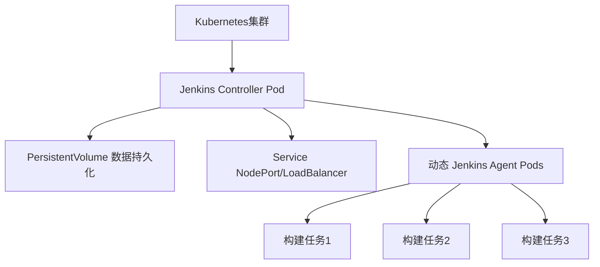
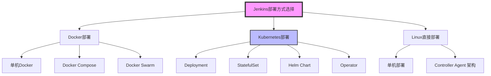
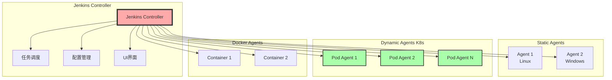
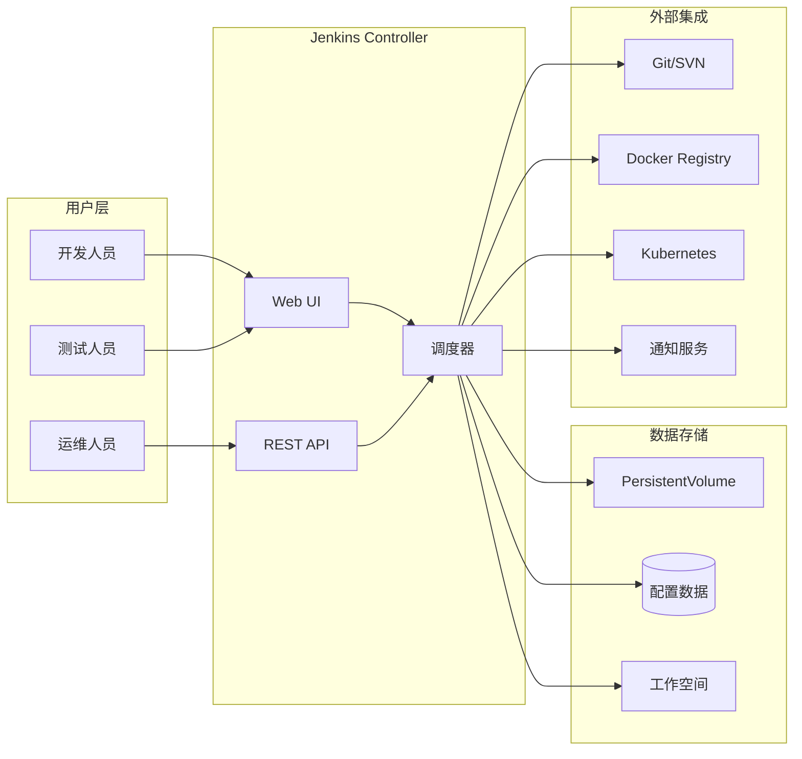
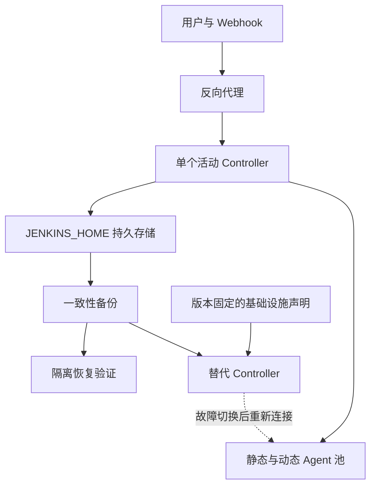
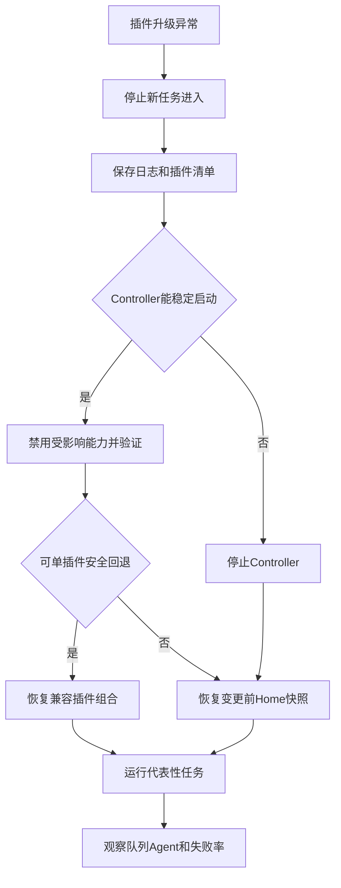

# Jenkins 学习笔记


> 本文档是 Jenkins 系统化学习笔记，涵盖安装配置、Pipeline 使用和常用插件详解。

---

## 📖 文档说明

### 概述


**目标读者**: Jenkins 初学者和运维工程师
**内容特点**: 系统化、实践导向、包含图示说明
**学习路径**: 从安装配置到高级特性，循序渐进

---
## 第一章：Jenkins 安装与配置

### 1.1 Docker 环境安装

#### 1.1.1 Docker 部署 Jenkins 的优势

使用 Docker 部署 Jenkins 具有以下优势：

- **环境隔离**：容器化部署避免依赖冲突
- **快速部署**：几分钟内即可启动 Jenkins 实例
- **易于迁移**：可以在不同环境间快速迁移
- **版本管理**：通过镜像标签控制 Jenkins 版本
- **资源控制**：可以限制容器的资源使用

#### 1.1.2 官方镜像介绍

Jenkins 提供多种官方 Docker 镜像：

| 镜像类型                      | 说明         | 适用场景       |
| ----------------------------- | ------------ | -------------- |
| `jenkins/jenkins:lts`       | 长期支持版本 | 生产环境推荐   |
| `jenkins/jenkins:latest`    | 最新版本     | 测试新特性     |
| `jenkins/jenkins:lts-jdk21` | LTS + JDK21  | 指定 Java 版本 |

> **注意**：`lts` 会随时间移动，适合实验环境。生产环境应先核对 Jenkins 与 Java 支持矩阵，再把镜像固定到明确版本或摘要。Blue Ocean 已进入弃用状态，不应作为新平台的默认组件；流水线可视化可按需评估 Stage View 或 Pipeline Graph View。

#### 1.1.3 macOS/Linux 安装步骤

##### 步骤 1: 创建 Docker 网络

```bash
docker network create jenkins
```

##### 步骤 2: 仅在隔离实验环境运行 Docker-in-Docker

```bash
docker run \
  --name jenkins-docker \
  --rm \
  --detach \
  --privileged \
  --network jenkins \
  --network-alias docker \
  --env DOCKER_TLS_CERTDIR=/certs \
  --volume jenkins-docker-certs:/certs/client \
  --volume jenkins-data:/var/jenkins_home \
  --publish 2376:2376 \
  docker:dind \
  --storage-driver overlay2
```

**参数说明**：

- `--privileged`: DinD 需要的特权模式，同时意味着接近宿主机级别的控制能力
- `--volume jenkins-docker-certs:/certs/client`: 挂载证书卷
- `--volume jenkins-data:/var/jenkins_home`: 持久化 Jenkins 数据

> **安全边界**：该模式只用于一次性实验。不要把通用构建任务直接连接宿主机 Docker Socket，也不要把特权 DinD 当作生产默认方案。生产中优先使用短生命周期 Agent、无特权镜像构建工具或受隔离的专用构建节点，并限制谁能修改 Jenkinsfile。

##### 步骤 3: 自定义 Jenkins 镜像

创建 `Dockerfile`:

```dockerfile
FROM jenkins/jenkins:lts-jdk21
USER root
RUN apt-get update && apt-get install -y docker-ce-cli
USER jenkins
RUN jenkins-plugin-cli --plugins "workflow-aggregator docker-workflow"
```

##### 步骤 4: 构建并运行

```bash
docker build -t local/jenkins-lab:lts-jdk21 .

docker run \
  --name jenkins-lab \
  --restart=on-failure \
  --detach \
  --network jenkins \
  --env DOCKER_HOST=tcp://docker:2376 \
  --publish 8080:8080 \
  --publish 50000:50000 \
  --volume jenkins-data:/var/jenkins_home \
  local/jenkins-lab:lts-jdk21
```

#### 1.1.4 访问 Jenkins 容器

```bash
# 访问容器终端
docker exec -it jenkins-lab bash

# 查看日志
docker logs -f jenkins-lab

# 获取初始密码
docker exec jenkins-lab cat /var/jenkins_home/secrets/initialAdminPassword
```

#### 1.1.5 数据持久化方案

**方案1: Docker Volume（推荐）**

```bash
docker volume create jenkins-data
--volume jenkins-data:/var/jenkins_home
```

**方案2: 本地目录挂载**

```bash
--volume $HOME/jenkins:/var/jenkins_home
```

#### 1.1.6 最佳实践

1. **使用特定版本标签** - 避免使用 `:latest`
2. **定期备份数据卷**
3. **设置资源限制**: `--memory="2g" --cpus="2.0"`
4. **生产镜像固定版本或摘要**，升级前在测试 Controller 验证插件兼容性

---

### 1.2 Kubernetes 环境安装

#### 1.2.1 Kubernetes 部署架构

在 Kubernetes 上部署 Jenkins 提供了更好的可扩展性和资源管理能力。


```mermaid
graph TD
    A[Kubernetes集群] --> B[Jenkins Controller Pod]
    B --> C[PersistentVolume 数据持久化]
    B --> D[Service NodePort/LoadBalancer]
    B --> E[动态 Jenkins Agent Pods]
    E --> F[构建任务1]
    E --> G[构建任务2]
    E --> H[构建任务3]
```

#### 1.2.2 基础部署方式

##### 步骤 1: 创建命名空间

```bash
kubectl create namespace devops-tools
```

##### 步骤 2: 创建 ServiceAccount

文件: `jenkins-serviceaccount.yaml`

```yaml
---
apiVersion: v1
kind: ServiceAccount
metadata:
  name: jenkins-agent-manager
  namespace: devops-tools
---
apiVersion: rbac.authorization.k8s.io/v1
kind: Role
metadata:
  name: jenkins-agent-manager
  namespace: devops-tools
rules:
  - apiGroups: [""]
    resources: ["pods"]
    verbs: ["create", "get", "list", "watch", "delete"]
  - apiGroups: [""]
    resources: ["pods/exec", "pods/log"]
    verbs: ["create", "get"]
---
apiVersion: rbac.authorization.k8s.io/v1
kind: RoleBinding
metadata:
  name: jenkins-agent-manager
  namespace: devops-tools
roleRef:
  apiGroup: rbac.authorization.k8s.io
  kind: Role
  name: jenkins-agent-manager
subjects:
- kind: ServiceAccount
  name: jenkins-agent-manager
  namespace: devops-tools
```

应用配置:

```bash
kubectl apply -f jenkins-serviceaccount.yaml
```

这组权限只允许在 `devops-tools` 命名空间管理动态 Agent Pod。业务部署应使用另一套按环境、Namespace 和资源类型收敛的身份，不能复用 Agent 管理身份，更不能授予通配的集群管理员权限。

##### 步骤 3: 创建持久化卷

文件: `jenkins-volume.yaml`

```yaml
kind: StorageClass
apiVersion: storage.k8s.io/v1
metadata:
  name: local-storage
provisioner: kubernetes.io/no-provisioner
volumeBindingMode: WaitForFirstConsumer
---
apiVersion: v1
kind: PersistentVolume
metadata:
  name: jenkins-pv-volume
  labels:
    type: local
spec:
  storageClassName: local-storage
  claimRef:
    name: jenkins-pv-claim
    namespace: devops-tools
  capacity:
    storage: 10Gi
  accessModes:
    - ReadWriteOnce
  local:
    path: /mnt
  nodeAffinity:
    required:
      nodeSelectorTerms:
      - matchExpressions:
        - key: kubernetes.io/hostname
          operator: In
          values:
          - worker-node01  # 替换为实际节点名
---
apiVersion: v1
kind: PersistentVolumeClaim
metadata:
  name: jenkins-pv-claim
  namespace: devops-tools
spec:
  storageClassName: local-storage
  accessModes:
    - ReadWriteOnce
  resources:
    requests:
      storage: 3Gi
```

> **生产环境建议**: 使用云提供商的存储类（如 AWS EBS、GCE PD）以保证数据持久性。

应用配置:

```bash
kubectl create -f jenkins-volume.yaml
```

#### 1.2.3 Kubernetes 部署验收与排障

Controller Pod Running 只说明容器进程存在。正式验收还要验证持久化、反向代理、权限、重启恢复和动态 Agent。

```bash
kubectl --namespace devops-tools get pod,service,pvc
kubectl --namespace devops-tools describe deployment jenkins
kubectl --namespace devops-tools get events --sort-by=.lastTimestamp
kubectl --namespace devops-tools logs deployment/jenkins --tail=200
```

| 现象 | 优先证据 | 常见原因 | 操作 |
| --- | --- | --- | --- |
| Pod Pending | Pod Events、PVC | 存储未绑定、配额或调度约束 | 修复 StorageClass、容量或节点条件 |
| CrashLoopBackOff | 上一次容器日志 | Home 权限、插件或 Java 不兼容 | 保存日志，恢复兼容组合 |
| 页面不可达 | Service、Ingress、Endpoints | 端口、路径或 TLS 配置错误 | 分层验证 Pod、Service、入口 |
| 登录后链接错误 | Jenkins URL、代理 Header | 外部 URL 或转发 Header 不一致 | 修正 Location 和代理配置 |
| Agent Pod 创建失败 | Controller 与 Kubernetes Events | RBAC、模板、镜像或配额 | 用最小身份复现 API 操作 |
| 重启后配置丢失 | PVC 挂载和 Home 路径 | 数据写在容器临时层 | 修复挂载后从备份恢复 |

##### 持久化验收

1. 创建一个无敏感内容的测试 Job 和 Folder。
2. 记录当前插件清单与 Controller Pod UID。
3. 删除 Controller Pod，让 Deployment 重新创建。
4. 验证 Folder、Job、用户权限和插件仍然存在。
5. 运行代表性 Pipeline，确认凭据能够解密。
6. 验证存储快照与独立备份，不把 PVC 当成备份。

##### 动态 Agent 验收

```groovy
pipeline {
    agent {
        kubernetes {
            yaml '''
apiVersion: v1
kind: Pod
spec:
  containers:
    - name: shell
      image: alpine:3.22
      command: [sleep]
      args: [99d]
      resources:
        requests:
          cpu: 100m
          memory: 128Mi
        limits:
          cpu: 500m
          memory: 512Mi
'''
        }
    }
    stages {
        stage('Smoke') {
            steps {
                container('shell') {
                    sh 'id && uname -a'
                }
            }
        }
    }
}
```

测试结束后 Agent Pod 应按策略销毁，Workspace 不保留秘密。若 Pod 残留，检查 Jenkins 构建是否仍等待、插件垃圾回收配置和 Kubernetes 删除权限。

##### 步骤 4: 创建 Deployment

文件: `jenkins-deployment.yaml`

```yaml
apiVersion: apps/v1
kind: Deployment
metadata:
  name: jenkins
  namespace: devops-tools
spec:
  replicas: 1
  selector:
    matchLabels:
      app: jenkins-server
  strategy:
    type: Recreate
  template:
    metadata:
      labels:
        app: jenkins-server
    spec:
      securityContext:
        fsGroup: 1000
        runAsUser: 1000
      serviceAccountName: jenkins-agent-manager
      containers:
        - name: jenkins
          image: jenkins/jenkins:lts
          imagePullPolicy: Always
          resources:
            limits:
              memory: "2Gi"
              cpu: "1000m"
            requests:
              memory: "500Mi"
              cpu: "500m"
          ports:
            - name: httpport
              containerPort: 8080
            - name: jnlpport
              containerPort: 50000
          livenessProbe:
            httpGet:
              path: "/login"
              port: 8080
            initialDelaySeconds: 90
            periodSeconds: 10
            timeoutSeconds: 5
            failureThreshold: 5
          readinessProbe:
            httpGet:
              path: "/login"
              port: 8080
            initialDelaySeconds: 60
            periodSeconds: 10
            timeoutSeconds: 5
            failureThreshold: 3
          volumeMounts:
            - name: jenkins-data
              mountPath: /var/jenkins_home
      volumes:
        - name: jenkins-data
          persistentVolumeClaim:
              claimName: jenkins-pv-claim
```

应用配置:

```bash
kubectl apply -f jenkins-deployment.yaml
```

##### 步骤 5: 创建 Service

文件: `jenkins-service.yaml`

```yaml
apiVersion: v1
kind: Service
metadata:
  name: jenkins-service
  namespace: devops-tools
  annotations:
      prometheus.io/scrape: 'true'
      prometheus.io/path:   /
      prometheus.io/port:   '8080'
spec:
  selector:
    app: jenkins-server
  type: NodePort
  ports:
    - port: 8080
      targetPort: 8080
      nodePort: 32000
```

应用配置:

```bash
kubectl apply -f jenkins-service.yaml
```

访问 Jenkins:

```bash
# 获取节点IP
kubectl get nodes -o wide

# 访问地址
http://<node-ip>:32000
```

#### 1.2.3 使用 Helm 安装（推荐）

##### 步骤 1: 添加 Jenkins Helm 仓库

```bash
helm repo add jenkinsci https://charts.jenkins.io
helm repo update
```

##### 步骤 2: 创建 values 配置文件

文件: `jenkins-values.yaml`

```yaml
controller:
  serviceType: NodePort
  nodePort: 32000
  installPlugins:
    - kubernetes:4389.v3e60b_3e4c6b_3
    - workflow-aggregator:657.v7539b_b_25a_61f
    - git:5.6.0
    - configuration-as-code:1890.v88e1e8dcbfa_c
  
persistence:
    enabled: true
    storageClass: "jenkins-pv"
    size: "10Gi"

serviceAccount:
  create: false
  name: jenkins

resources:
  limits:
    cpu: "2000m"
    memory: "4Gi"
  requests:
    cpu: "500m"
    memory: "1Gi"
```

##### 步骤 3: 安装 Jenkins

```bash
helm install jenkins jenkinsci/jenkins \
  -n devops-tools \
  -f jenkins-values.yaml
```

##### 步骤 4: 获取管理员密码

```bash
jsonpath="{.data.jenkins-admin-password}"
secret=$(kubectl get secret -n devops-tools jenkins -o jsonpath=$jsonpath)
echo $(echo $secret | base64 --decode)
```

#### 1.2.4 配置动态 Agent

Jenkins Kubernetes Plugin 允许动态创建Agent Pod：

```groovy
pipeline {
    agent {
        kubernetes {
            yaml '''
apiVersion: v1
kind: Pod
metadata:
  labels:
    jenkins: agent
spec:
  containers:
  - name: maven
    image: maven:3.8.1-jdk-11
    command:
    - sleep
    args:
    - 99d
'''
        }
    }
    stages {
        stage('Build') {
            steps {
                container('maven') {
                    sh 'mvn --version'
                }
            }
        }
    }
}
```

#### 1.2.5 高可用配置建议

1. **使用 StatefulSet** - 保证 Pod 名称稳定
2. **配置持久化存储** - 使用云存储类
3. **设置资源限制和请求**
4. **配置健康检查** - Liveness 和 Readiness Probes
5. **使用 HPA** - 水平自动扩缩容（仅适用于无状态组件）

---

### 1.3 Linux 环境安装

#### 1.3.1 系统要求

- **操作系统**: Debian/Ubuntu, RHEL/CentOS, Fedora
- **Java版本**: OpenJDK 21 或兼容版本
- **硬件**: 最小 256MB RAM, 推荐 4GB+ RAM
- **磁盘**: 最小 1GB，推荐 50GB+

#### 1.3.2 Debian/Ubuntu 安装

##### 步骤 1: 安装 Java

```bash
sudo apt update
sudo apt install fontconfig openjdk-21-jre
java -version
```

输出示例:

```
openjdk 21.0.8 2025-07-15
OpenJDK Runtime Environment (build 21.0.8+9-Debian-1)
```

> **重要**: 必须先安装 Java，否则 Jenkins 服务可能无法启动。

##### 步骤 2: 添加 Jenkins 仓库

**LTS 版本（推荐）**:

```bash
sudo wget -O /etc/apt/keyrings/jenkins-keyring.asc \
  https://pkg.jenkins.io/debian-stable/jenkins.io-2023.key
echo "deb [signed-by=/etc/apt/keyrings/jenkins-keyring.asc]" \
  https://pkg.jenkins.io/debian-stable binary/ | sudo tee \
  /etc/apt/sources.list.d/jenkins.list > /dev/null
```

**Weekly 版本**:

```bash
sudo wget -O /etc/apt/keyrings/jenkins-keyring.asc \
  https://pkg.jenkins.io/debian/jenkins.io-2023.key
echo "deb [signed-by=/etc/apt/keyrings/jenkins-keyring.asc]" \
  https://pkg.jenkins.io/debian binary/ | sudo tee \
  /etc/apt/sources.list.d/jenkins.list > /dev/null
```

##### 步骤 3: 安装 Jenkins

```bash
sudo apt update
sudo apt install jenkins
```

安装过程会自动：

- 创建 `jenkins` 用户和用户组
- 配置 systemd 服务
- 设置 `/var/lib/jenkins` 为 JENKINS_HOME
- 配置Jenkins监听8080端口

#### 1.3.3 RHEL/CentOS 安装

##### 使用 yum (RHEL/CentOS 7)

```bash
# 添加仓库
sudo wget -O /etc/yum.repos.d/jenkins.repo \
    https://pkg.jenkins.io/redhat-stable/jenkins.repo
sudo rpm --import https://pkg.jenkins.io/redhat-stable/jenkins.io-2023.key

# 安装依赖和Jenkins
sudo yum upgrade
sudo yum install fontconfig java-21-openjdk
sudo yum install jenkins
sudo systemctl daemon-reload
```

##### 使用 dnf (Fedora/RHEL 8+)

```bash
sudo wget -O /etc/yum.repos.d/jenkins.repo \
    https://pkg.jenkins.io/redhat-stable/jenkins.repo
sudo rpm --import https://pkg.jenkins.io/redhat-stable/jenkins.io-2023.key
sudo dnf upgrade
sudo dnf install fontconfig java-21-openjdk
sudo dnf install jenkins
sudo systemctl daemon-reload
```

#### 1.3.4 启动和管理 Jenkins 服务

##### 启用开机自启

```bash
sudo systemctl enable jenkins
```

##### 启动服务

```bash
sudo systemctl start jenkins
```

##### 检查状态

```bash
sudo systemctl status jenkins
```

正常输出:

```
● jenkins.service - Jenkins Continuous Integration Server
   Loaded: loaded (/lib/systemd/system/jenkins.service; enabled)
   Active: active (running) since Tue 2024-12-04 16:19:01 CST
```

##### 重启服务

```bash
sudo systemctl restart jenkins
```

##### 停止服务

```bash
sudo systemctl stop jenkins
```

##### 查看日志

```bash
# 查看实时日志
sudo journalctl -u jenkins.service -f

# 查看所有日志
sudo journalctl -u jenkins.service

# 查看最近100行
sudo journalctl -u jenkins.service -n 100
```

#### 1.3.5 修改端口配置

如果8080端口被占用，需要修改端口：

```bash
sudo systemctl edit jenkins
```

添加以下内容:

```ini
[Service]
Environment="JENKINS_PORT=8081"
```

重启服务:

```bash
sudo systemctl restart jenkins
```

#### 1.3.6 防火墙配置

##### firewalld 配置

```bash
YOURPORT=8080
PERM="--permanent"
SERV="$PERM --service=jenkins"

firewall-cmd $PERM --new-service=jenkins
firewall-cmd $SERV --set-short="Jenkins ports"
firewall-cmd $SERV --set-description="Jenkins port exceptions"
firewall-cmd $SERV --add-port=$YOURPORT/tcp
firewall-cmd $PERM --add-service=jenkins
firewall-cmd --zone=public --add-service=http --permanent
firewall-cmd --reload
```

##### ufw 配置 (Ubuntu)

```bash
sudo ufw allow 8080/tcp
sudo ufw reload
```

#### 1.3.7 文件位置说明

| 路径                                    | 说明                      |
| --------------------------------------- | ------------------------- |
| `/var/lib/jenkins`                    | JENKINS_HOME 目录         |
| `/etc/default/jenkins`                | 配置文件（Debian/Ubuntu） |
| `/etc/sysconfig/jenkins`              | 配置文件（RHEL/CentOS）   |
| `/lib/systemd/system/jenkins.service` | systemd 服务文件          |
| `/var/log/jenkins/jenkins.log`        | 日志文件                  |

#### 1.3.8 常见问题

##### 问题1: 端口已被占用

```bash
# 查看端口占用
sudo netstat -tulpn | grep 8080
# 或
sudo lsof -i :8080
```

##### 问题2: Java 未找到

```bash
# 设置 JAVA_HOME
echo 'export JAVA_HOME=/usr/lib/jvm/java-21-openjdk-amd64' | sudo tee -a /etc/profile
source /etc/profile
```

##### 问题3: 权限问题

```bash
# 修复权限
sudo chown -R jenkins:jenkins /var/lib/jenkins
```

---

#### 1.3.8 Java 与 Jenkins LTS 如何配套升级

Jenkins Controller、Agent 进程和 CLI 必须运行在当前 Jenkins 版本支持的 Java 上；项目构建使用的 JDK 可以不同。不要根据旧课程固定写“JDK 8+”，应在每次升级前查 Jenkins 官方 Java 支持矩阵和 LTS 升级指南。

| 对象 | 版本依据 | 验证方式 |
| --- | --- | --- |
| Controller Java | Jenkins 核心支持矩阵 | 启动日志、系统信息、代表性任务 |
| Agent Java | Controller 与 Remoting 要求 | 节点日志、连接与重连测试 |
| 项目 JDK | 应用源码和构建插件要求 | Maven、Gradle 或项目测试 |
| 插件 Java | 插件最低 Jenkins 与 Java 要求 | 测试 Controller 插件加载 |

升级顺序不能凭经验一概而论。先从当前版本的官方升级指南确定是否需要经过中间 LTS、先升级插件还是先切换 Java。对跨度较大的实例，分阶段升级能降低插件和配置迁移同时发生的风险。

```bash
java -version
systemctl show jenkins --property=Environment
journalctl --unit jenkins --since '30 minutes ago'
```

##### 升级前检查

- 记录 Jenkins 核心、Java、操作系统和全部插件版本。
- 检查弃用插件、停更插件、被安全公告影响的版本和依赖链。
- 从生产备份恢复测试 Controller，而不是创建空实例做升级。
- 运行 SCM、凭据、Pipeline、动态 Agent 和制品操作等代表性任务。
- 确认旧版本安装介质、容器摘要、插件清单和 Home 快照可用。

##### 升级后检查

- Controller 启动日志没有插件加载失败、配置迁移异常和反复重启。
- 所有预期节点重新连接，Agent Java 版本满足要求。
- Folder 权限、凭据解密、共享库加载和 Queue 调度正常。
- 代表性 Pipeline 能跨暂停点继续，外部 Webhook 与回调可达。
- 磁盘、Heap、GC、线程、响应时间和失败率完成观察窗口。

回退是恢复兼容组合，不是只把 Jenkins WAR 或单个插件降级。若新版本已经写入不可逆配置，直接复用升级后的 Home 启动旧版本可能失败，因此回退应使用变更前的一致性快照。

#### 1.3.9 Linux 服务运行基线

Jenkins 使用独立系统用户运行，不使用 `root`。Home、日志和缓存目录由该用户拥有；系统服务限制、文件句柄和进程资源应根据任务规模评估，不能通过给整个目录 `777` 解决权限问题。

```bash
systemctl status jenkins --no-pager
systemctl cat jenkins
systemctl show jenkins \
  --property=User,Group,Environment,LimitNOFILE,MemoryCurrent
journalctl --unit jenkins --since today
```

##### systemd 变更方式

不要直接修改发行包自带 Unit 文件。使用 `systemctl edit jenkins` 建立 Drop-in，并把变更纳入配置管理：

```ini
[Service]
Environment="JAVA_OPTS=-Djava.awt.headless=true"
LimitNOFILE=65536
```

```bash
sudo systemctl daemon-reload
sudo systemctl restart jenkins
sudo systemctl status jenkins --no-pager
```

变更 JVM Heap 前先观察 Heap、GC 和系统内存。把 Heap 设得接近主机总内存会挤压文件缓存和其他进程；频繁 Full GC 也可能来自插件、超大 Pipeline 状态或任务跑在 Controller，不能只靠继续加内存。

##### Linux 故障证据

- 进程退出：查看 systemd 状态、退出码和最后一次启动日志。
- 端口未监听：确认进程是否启动、绑定地址和反向代理目标。
- Home 权限错误：确认服务用户、挂载 UID/GID 和 SELinux/AppArmor 事件。
- 磁盘满：区分构建记录、Workspace、插件缓存、日志和备份增长。
- 文件句柄耗尽：检查进程限制和打开文件类型，再决定调整限制。
- 时间异常：检查 NTP；时间漂移会影响 TLS、日志关联和 Token 有效期。

安全组或防火墙规则应只开放必要来源和端口。排障不能通过关闭防火墙获得长期“修复”；应从连接方向、源地址、目标端口和拒绝日志收敛规则。

---

### 1.4 初始化配置与平台治理

安装完成后，需要进行初始化配置才能开始使用 Jenkins。

#### 1.4.1 解锁 Jenkins

##### 访问 Web 界面

打开浏览器访问:

```
http://localhost:8080
```

或者（如果是远程服务器）:

```
http://<server-ip>:8080
```

##### 获取初始密码

**方法1: 查看文件**

```bash
sudo cat /var/lib/jenkins/secrets/initialAdminPassword
```

**方法2: 查看日志**

```bash
sudo journalctl -u jenkins.service | grep -A 5 "初始密码"
```

**方法3: Docker环境**

```bash
docker exec jenkins-lab cat /var/jenkins_home/secrets/initialAdminPassword
```

**方法4: Kubernetes环境**

```bash
kubectl exec -it deployment/jenkins -n devops-tools -- \
  cat /var/jenkins_home/secrets/initialAdminPassword
```

将密码粘贴到 Web 界面即可解锁。

#### 1.4.2 安装插件

解锁后会看到插件安装选项：

##### 选项1: 安装推荐插件（推荐新手）

包含常用插件：

- Git
- Pipeline
- Credentials
- SSH Agents
- Pipeline 基础插件与凭据插件

##### 选项2: 选择插件安装（推荐熟练用户）

可以自定义选择需要的插件。

**按能力评估的插件候选**:

- **源码管理**: Git, GitHub, GitLab
- **构建工具**: Maven, Gradle, NodeJS
- **容器**: Docker, Kubernetes
- **通知**: Email Extension, Slack
- **安全**: LDAP, Role-based Authorization

插件不是越多越好。安装前记录用途、维护状态、依赖链、最低 Jenkins 版本和回退方式；先在测试 Controller 安装并运行代表性任务，再进入生产变更窗口。

#### 1.4.3 创建管理员用户

##### 填写用户信息

- **用户名**: 使用可审计的个人管理账号，避免多人共享 `admin`
- **密码**: 设置强密码
- **全名**: 管理员姓名
- **电子邮件**: 管理员邮箱

> **提示**: 如果跳过此步骤，默认用户名为 `admin`，密码为初始密码。

#### 1.4.4 配置 Jenkins URL

设置 Jenkins 访问地址，用于：

- 生成邮件通知链接
- Configure webhook URLs
- Agent连接地址

示例:

```
http://jenkins.example.com:8080/
```

或保持默认的本地地址。

#### 1.4.5 全局工具配置

进入 `Manage Jenkins` > `Global Tool Configuration`:

##### JDK 配置

```
Name: JDK-21
JAVA_HOME: /usr/lib/jvm/java-21-openjdk-amd64
```

或勾选"自动安装"。

##### Maven 配置

```
Name: Maven-3.9
Version: 3.9.x
```

##### Git 配置

通常自动检测系统安装的 Git。

##### Docker 配置

```
Name: Docker
Docker URL: unix:///var/run/docker.sock
```

#### 1.4.6 安全配置

##### 启用安全策略

`Manage Jenkins` > `Configure Global Security`:

**授权策略**:

- **Matrix-based security**: 精细权限控制
- **Role-Based Strategy**: 基于角色（需安装插件）
- **Project-based**: 基于项目

**访问控制**:

- 禁用匿名访问
- 启用"Allow users to sign up"（可选）
- 配置CSRF Protection（默认启用）

##### LDAP/AD集成（可选）

如果企业使用LDAP:

```
Server: ldap://ldap.example.com
Root DN: dc=example,dc=com
User search base: ou=users
```

#### 1.4.7 系统配置

`Manage Jenkins` > `Configure System`:

##### Jenkins Location

```
Jenkins URL: http://jenkins.example.com:8080/
System Admin e-mail address: admin@example.com
```

##### 邮件通知

```
SMTP server: smtp.example.com
Default user e-mail suffix: @example.com
```

测试邮件配置:

```
Test e-mail recipient: your-email@example.com
```

##### Controller 执行器数量

```
# of executors: 0
```

> **建议**：Controller 负责调度、配置、队列和 Pipeline 状态，不承载常规构建。把执行器设为 `0`，将编译、测试、镜像构建和部署动作放到静态或动态 Agent；只有经过风险评估的轻量管理任务才例外运行在 Controller。

##### Quiet period

```
Quiet period: 5  # 秒，任务触发后的静默期
```

#### 1.4.8 凭据管理

`Manage Jenkins` > `Manage Credentials`:

##### 添加SSH密钥

```
Kind: SSH Username with private key
ID: github-ssh
Username: git
Private Key: [粘贴私钥内容]
```

##### 添加用户名密码

```
Kind: Username with password
Scope: Global
Username: your-username
Password: your-password
ID: docker-registry
```

##### 添加Secret text

```
Kind: Secret text
Secret: your-api-token
ID: api-token
```

##### 凭据治理规则

| 维度 | 推荐做法 | 需要避免 |
| --- | --- | --- |
| 作用域 | 放在能满足任务的最低 Folder 或 Item 层级 | 所有项目共享全局高权限凭据 |
| 身份 | 使用机器人账号、项目 Token 或短期身份 | 管理员个人账号参与日常流水线 |
| ID | 使用稳定且可读的命名，如 `prod-harbor-push` | 把密码、用户名或环境地址写进 ID |
| 注入 | 使用 `withCredentials` 并让 Shell 展开变量 | 在 Groovy 双引号中插值秘密 |
| 生命周期 | 记录所有者、到期日、轮换和撤销流程 | 永久 Token 无人负责 |
| 审计 | 追踪使用任务与最近使用时间 | 只确认凭据“仍能登录” |

凭据掩码只能降低误打印概率，不能防御恶意 Jenkinsfile。能修改 Pipeline 或受信任共享库的人，理论上可能把凭据发送到外部，因此代码评审权与凭据使用权必须一起设计。

#### 1.4.9 配置代理（可选）

如果Jenkins服务器需要通过代理访问外网:

`Manage Jenkins` > `Manage Plugins` > `Advanced`:

```
HTTP Proxy Configuration:
Server: proxy.example.com
Port: 8080
No Proxy Host: localhost,127.0.0.1,*.internal.com
```

#### 1.4.10 Jenkins CLI 配置（可选）

下载CLI工具:

```bash
wget http://localhost:8080/jnlpJars/jenkins-cli.jar
```

使用示例:

```bash
export JENKINS_USER_ID='operator'
export JENKINS_API_TOKEN='从安全终端注入的短期或可轮换令牌'
java -jar jenkins-cli.jar -s https://jenkins.example.com/ \
  -auth "$JENKINS_USER_ID:$JENKINS_API_TOKEN" help
```

#### 1.4.11 备份配置

初始配置完成后，应设计“可恢复的备份”，而不是只生成压缩包：

```bash
# 进入 quiet down 后，由受控备份系统读取一致性快照
curl --fail --user "$JENKINS_USER_ID:$JENKINS_API_TOKEN" \
  --request POST https://jenkins.example.com/quietDown
sudo tar -czf /backup/jenkins-home-$(date +%Y%m%d).tar.gz /var/lib/jenkins
```

备份范围至少覆盖任务与系统配置、插件清单、用户配置、`secrets/` 和主密钥；构建制品应由外部制品库保管，Workspace 可重建。主密钥应单独加密托管，否则恢复出的凭据无法解密。每个周期都要在隔离环境完成一次恢复演练，并验证登录、凭据解密、任务加载、插件依赖和代表性 Pipeline。

#### 1.4.12 `JENKINS_HOME` 的逻辑边界

Jenkins 主要把状态保存在文件系统中。目录可以帮助定位问题，但目录结构不是稳定 API，迁移或自动化脚本不能假定所有插件永远使用同一布局。

| 逻辑对象 | 常见位置 | 备份与恢复关注点 |
| --- | --- | --- |
| 系统配置 | 根目录 XML、插件配置文件 | URL、安全域、云和全局工具配置是否正确加载 |
| 任务与文件夹 | `jobs/` | `config.xml`、构建编号和嵌套 Folder 是否完整 |
| Agent | `nodes/` | 节点定义可恢复，但工作节点本身仍需重新连通 |
| 插件 | `plugins/` | 同时保存插件清单、版本与依赖，不只复制 `.jpi` |
| 用户 | `users/` | 身份源映射与授权策略需一起验证 |
| 凭据 | `credentials.xml` 与 `secrets/` | 缺少主密钥时密文不可用，应分离加密保管 |
| 构建记录 | `jobs/.../builds/` | 体积增长快，按审计要求设置保留策略 |
| Workspace | `workspace/` | 原则上可重建，不作为唯一制品保存位置 |

#### 1.4.13 任务类型如何选择

| 类型 | 适用场景 | 运维判断 |
| --- | --- | --- |
| Pipeline | 单条明确流程，Jenkinsfile 可纳入代码库 | 新项目的默认起点 |
| Multibranch Pipeline | 同一仓库按分支或合并请求自动发现任务 | 配合分支发现、孤儿任务清理和 SCM 凭据 |
| Folder | 按团队或系统建立命名、权限和凭据边界 | 不只是 UI 分组，也是治理边界 |
| 参数化任务 | 需要受控人工输入的构建或发布入口 | 参数必须校验，不能把自由文本直接拼入 Shell |
| Freestyle | 维护遗留任务或简单兼容场景 | 应逐步把关键逻辑迁入版本控制 |

任务名称便于人读，但不应成为业务名、环境名和版本号的唯一事实来源。流水线应显式携带这些元数据，并在触发、制品和发布记录之间保持一致。

#### 1.4.14 全局、项目与节点三级权限

Role-Based Authorization Strategy 常用于把权限分成 Global、Item 和 Agent 三个层次。Global Read 是进入 Jenkins 的基础权限，但不意味着用户可以读取所有任务；Item Role 用正则匹配 Folder 或 Job；Agent Role 控制节点配置与连接相关操作。

| 角色 | Global 权限 | Item 权限 | Agent 权限 | 典型人员 |
| --- | --- | --- | --- | --- |
| 平台只读 | Overall Read | Job Read | Agent 只读 | 审计与值班观察者 |
| 项目开发 | Overall Read | 指定 Folder 的 Read、Build、Cancel、Workspace | 无 | 开发与测试 |
| 项目维护 | Overall Read | 指定 Folder 的 Configure、Build、Read | 无 | 项目流水线维护者 |
| Agent 运维 | Overall Read | 必要任务只读 | 指定节点 Connect、Disconnect | 基础设施维护者 |
| Jenkins 管理 | Administer | 全部 | 全部 | 极少数平台管理员 |

权限正则要锚定 Folder 边界。例如 `^commerce(/.*)?$` 比包含式的 `commerce.*` 更容易避免误匹配。新建 Folder 时应自动继承可解释的角色模板，并用测试账号验证允许和拒绝路径。

##### 权限验收场景

1. 项目开发者能查看、构建和取消本项目任务。
2. 项目开发者不能修改凭据、脚本审批、节点和全局配置。
3. 项目维护者能修改 Jenkinsfile 入口配置，但不能读取其他 Folder 凭据。
4. Agent 运维能处理指定节点离线，不能重配生产任务。
5. 匿名用户不能读取任务、构建日志、制品或系统信息。
6. 离职或团队调动后，通过身份组变化统一撤权，不依赖逐用户残留授权。

任务配置权具有间接执行代码的能力。能修改 Jenkinsfile、SCM 地址、共享库或构建参数的人可能在 Agent 上执行任意命令，因此不能把 Configure 当成普通编辑权限；高权限凭据也不能授予允许不受信任 Pull Request 的任务。

#### 1.4.15 从遗留任务迁移到 Pipeline

迁移不是把自由风格任务的 Shell 原样粘进 Jenkinsfile。先盘点触发器、参数、SCM、构建步骤、构建后动作、凭据、节点标签、制品和上下游依赖，再逐项定义新契约。

| 遗留配置 | Pipeline 目标 | 验证重点 |
| --- | --- | --- |
| UI 中的 SCM | `checkout scm` 或受控 Checkout | Commit 与凭据一致 |
| UI 参数 | `parameters` 加初始化校验 | 类型、默认值和注入风险 |
| Execute Shell | 仓库脚本或共享库 Step | 退出码、引用、超时 |
| 构建后归档 | `archiveArtifacts` 或制品库 | 不能把 Workspace 当制品库 |
| 邮件通知 | `post` 与统一通知能力 | 通知失败不篡改发布事实 |
| 上下游 Job | 显式 API、事件或共享制品 | 避免隐藏耦合和递归触发 |
| 节点绑定 | Stage Agent 与资源需求 | Label 存在且容量充足 |
| UI 凭据 | Credentials ID | 最低作用域和机器人身份 |

##### 迁移步骤

1. 冻结遗留任务配置，导出 `config.xml` 并记录所有插件依赖。
2. 在代码库创建 Jenkinsfile 与构建脚本，先只做 Checkout、Build 和 Test。
3. 对同一 Commit 并行运行旧、新任务，对比产物摘要和测试报告。
4. 接入质量门禁和候选制品库，验证失败不会产生正式版本。
5. 在非生产环境验证参数、审批、部署和回滚。
6. 把 Webhook 切换到新任务，并保留短期可回退窗口。
7. 禁用旧任务而不是立即删除，观察没有调用方后再归档。
8. 移除旧插件、凭据和节点引用，更新运行手册与所有权。

##### 对比验收

- 相同 Commit 的关键产物内容一致，或差异有明确现代化原因。
- 新 Pipeline 在 Controller 重启、Agent 中断和用户取消时状态正确。
- 旧任务中的明文秘密、管理员账号和不安全网络操作没有迁移。
- Build、Quality、Publish、Deploy 状态不再被一个长 Shell 混在一起。
- 失败能够定位到责任层级，通知中包含构建与制品链接。
- 新任务的 Folder 权限和凭据作用域通过正向、负向测试。

#### 1.4.16 配置变更与审计

平台配置变更至少记录操作者、时间、对象、变更前后差异、变更原因和验证结果。可以用 JCasC 管理适合声明化的系统配置，但凭据值仍由秘密系统注入，Job 业务逻辑继续保存在代码仓库。

配置备份解决恢复，配置审计解决“谁改了什么”。二者不能互相替代。发现异常变更时，先保存证据和当前状态，再按受控版本恢复；不要在生产页面连续试改导致差异不可追踪。

---

### 1.5 Controller 与 Agent 部署架构

#### 1.5.1 部署方式对比


```mermaid
graph TD
    A[Jenkins部署方式选择] --> B[Docker部署]
    A --> C[Kubernetes部署]
    A --> D[Linux直接部署]
  
    B --> B1[单机Docker]
    B --> B2[Docker Compose]
    B --> B3[Docker Swarm]
  
    C --> C1[Deployment]
    C --> C2[StatefulSet]
    C --> C3[Helm Chart]
    C --> C4[Operator]
  
    D --> D1[单机部署]
    D --> D2[Controller Agent 架构]
  
    style A fill:#f9f,stroke:#333,stroke-width:4px
    style C fill:#bbf,stroke:#333,stroke-width:2px
```

#### 1.5.2 Controller-Agent 架构


```mermaid
graph TB
    subgraph "Jenkins Controller"
        M[Jenkins Controller]
        M --> M1[任务调度]
        M --> M2[配置管理]
        M --> M3[UI界面]
    end
  
    subgraph "Static Agents"
        A1[Agent 1<br/>Linux]
        A2[Agent 2<br/>Windows]
    end
  
    subgraph "Dynamic Agents K8s"
        K1[Pod Agent 1]
        K2[Pod Agent 2]
        K3[Pod Agent N]
    end
  
    subgraph "Docker Agents"
        D1[Container 1]
        D2[Container 2]
    end
  
    M --> A1
    M --> A2
    M --> K1
    M --> K2
    M --> K3
    M --> D1
    M --> D2
  
    style M fill:#faa,stroke:#333,stroke-width:4px
    style K1 fill:#afa,stroke:#333,stroke-width:2px
    style K2 fill:#afa,stroke:#333,stroke-width:2px
    style K3 fill:#afa,stroke:#333,stroke-width:2px
```

#### 1.5.3 数据流架构


```mermaid
graph LR
    subgraph "用户层"
        U1[开发人员]
        U2[运维人员]
        U3[测试人员]
    end
  
    subgraph "Jenkins Controller"
        UI[Web UI]
        API[REST API]
        SCH[调度器]
    end
  
    subgraph "数据存储"
        PV[PersistentVolume]
        DB[(配置数据)]
        WS[工作空间]
    end
  
    subgraph "外部集成"
        GIT[Git/SVN]
        REG[Docker Registry]
        K8S[Kubernetes]
        NOTIFY[通知服务]
    end
  
    U1 --> UI
    U2 --> API
    U3 --> UI
  
    UI --> SCH
    API --> SCH
  
    SCH --> PV
    SCH --> DB
    SCH --> WS
  
    SCH --> GIT
    SCH --> REG
    SCH --> K8S
    SCH --> NOTIFY
```

#### 1.5.4 恢复优先的生产架构


```mermaid
graph TB
    U[用户与 Webhook] --> GW[反向代理]
    GW --> C[单个活动 Controller]
    C --> H[JENKINS_HOME 持久存储]
    C --> A[静态与动态 Agent 池]
    H --> B[一致性备份]
    B --> V[隔离恢复验证]
    I[版本固定的基础设施声明] --> R[替代 Controller]
    B --> R
    R -.故障切换后重新连接.-> A
```

开源 Jenkins 不能通过让两个 Controller 同时读写同一个 `JENKINS_HOME` 就获得通用的 Active-Active 能力；这会带来文件锁、缓存和状态一致性风险。更可操作的目标是明确 RPO 与 RTO：快速重建 Controller、挂载经过验证的恢复副本、恢复密钥和插件，再让 Agent 重新连接。若要拆分故障域，应按团队或业务把任务分散到多个独立 Controller，而不是共享同一数据目录。

#### 1.5.5 Controller、静态 Agent 与动态 Agent 的职责

| 组件 | 核心职责 | 主要故障表现 | 隔离策略 |
| --- | --- | --- | --- |
| Controller | 配置、认证授权、队列、调度、Pipeline 状态与 UI | 所有新任务停止调度，页面或 API 不可用 | 不运行常规构建，限制插件面，重点备份恢复 |
| 静态 Agent | 长期工具链、特殊硬件、稳定缓存或传统系统构建 | 指定标签任务排队，节点磁盘持续增长 | 专用账号、标签和工作目录，定期清理与补丁 |
| 动态 Agent | 按任务创建隔离环境，任务后销毁 | Pod 创建失败、拉镜像慢、配额不足 | 固定镜像、资源请求限制、超时和残留清理 |

动态 Agent 解决的是执行环境弹性，不会替代 Controller 的状态保护。反过来，Controller 正常也不代表构建能力正常；监控必须同时覆盖队列、Agent 在线率、调度失败与基础设施配额。

#### 1.5.6 部署方式选择建议

| 场景          | 推荐方式          | 理由                 |
| ------------- | ----------------- | -------------------- |
| 个人学习/测试 | Docker单机        | 快速、简单、易于清理 |
| 小团队开发    | Linux直接部署     | 稳定、易维护         |
| 中型团队      | Kubernetes + Helm | 扩展性好、易管理     |
| 大型企业      | K8s + 高可用架构  | 高可用、动态扩展     |
| CI/CD密集型   | K8s + 动态Agent   | 资源利用率高         |

#### 1.5.7 资源规划建议

##### 小型部署（< 10个任务/天）

- **CPU**: 2核
- **内存**: 4GB
- **存储**: 20GB
- **Agent**: 1-2个

##### 中型部署（10-100个任务/天）

- **CPU**: 4核
- **内存**: 8GB
- **存储**: 100GB
- **Agent**: 3-10个

##### 大型部署（> 100个任务/天）

- **CPU**: 8核+
- **内存**: 16GB+
- **存储**: 500GB+
- **Agent**: 10+个（动态扩展）

---

**第一章小结**

本章介绍了 Jenkins 的三种主要安装方式：

- ✅ Docker 部署 - 适合快速部署和测试
- ✅ Kubernetes 部署 - 适合云原生环境和大规模使用
- ✅ Linux 部署 - 适合传统服务器环境

完成安装后，进行了初始化配置，包括解锁、插件安装、用户创建、安全配置等关键步骤。

**下一步**: 学习第二章 Jenkins Pipeline 详解

---

## 第二章：Jenkins Pipeline 详解

### 2.1 Pipeline 基础概念

#### 什么是 Jenkins Pipeline

Jenkins Pipeline 是一套插件集合，支持将持续交付流程实现并集成到 Jenkins 中。

**Pipeline 核心优势**：

- ✅ **代码化（Code）**：Pipeline 以代码形式定义，可纳入版本控制
- ✅ **持久性（Durable）**：Pipeline 可在控制器重启后继续执行
- ✅ **可暂停（Pausable）**：可等待人工输入或审批
- ✅ **多功能（Versatile）**：支持复杂的真实 CD 需求
- ✅ **可扩展（Extensible）**：支持自定义扩展和插件集成

#### 声明式 vs 脚本式 Pipeline

**声明式 Pipeline（推荐）**：

```groovy
pipeline {
    agent any
    stages {
        stage('Build') {
            steps {
                echo 'Building..'
            }
        }
    }
}
```

**脚本式 Pipeline**：

```groovy
node {
    stage('Build') {
        echo 'Building..'
    }
}
```

---

### 2.2 Jenkinsfile 核心要点与开发工具

#### Pipeline 开发工具如何分工

- **Snippet Generator** 根据当前 Controller 已安装插件生成单个 Step 的参数，适合 `checkout`、`withCredentials`、`httpRequest` 等调用。
- **Declarative Directive Generator** 生成 `agent`、`options`、`when`、`post` 等声明式结构，适合检查嵌套位置。
- **Pipeline Steps Reference** 用于核对 Step 的参数与所属插件；生成结果仍需代码评审，不能把带真实凭据 ID、地址或临时调试输出的片段直接提交。
- **Replay** 适合隔离环境快速定位语法问题。生产修复必须回写源码并经过评审，不能让 Replay 成为不可追踪的长期版本。

#### 环境变量

**常用系统变量**：

- `BUILD_NUMBER` - 构建编号
- `JOB_NAME` - 任务名称
- `WORKSPACE` - 工作空间路径
- `JENKINS_URL` - Jenkins URL

**使用示例**：

```groovy
echo "Running build ${env.BUILD_NUMBER}"
```

#### 参数、环境变量与普通变量的作用域

| 形式 | 读取方式 | 适合保存 | 主要边界 |
| --- | --- | --- | --- |
| 构建参数 | `params.RELEASE_VERSION` | 用户或触发器输入 | 在流水线开始前校验，不可信输入不能直接拼接命令 |
| 环境变量 | `env.BUILD_NUMBER` | Step 与外部进程之间传递字符串 | 值会字符串化，作用域可为 Pipeline 或 Stage |
| Groovy 变量 | `def manifest = ...` | 流水线内部结构化数据 | 跨暂停点对象必须可序列化 |
| 凭据绑定变量 | Shell 中 `$TOKEN` | 短时间调用外部系统 | 只在最小代码块内存在，避免 Groovy 插值与调试输出 |

在 Stage 中用 `def` 定义的局部变量不会自动变成后续 Stage 的环境变量。跨节点传递文件使用 `stash/unstash` 或外部制品库，跨阶段传递少量字符串才考虑 `env`；不要把大型对象或客户端连接保存在 Pipeline 状态里。

#### 凭据管理最佳实践

```groovy
environment {
    AWS_KEY = credentials('aws-key-id')
}
```

> **重要提示**：始终使用单引号避免 Groovy 插值泄露敏感信息

#### DSL Step 与普通 Groovy 方法的差异

`sh`、`checkout`、`timeout`、`withCredentials` 等是 Jenkins Pipeline Step，由插件提供并参与暂停、恢复、日志和执行上下文。普通 Groovy 方法在 JVM 中计算数据，不自动拥有 Workspace、Agent 或 Step 上下文。

| 能力 | Pipeline Step | 普通 Groovy 方法 |
| --- | --- | --- |
| 来源 | Jenkins 核心或插件 DSL | Jenkinsfile、共享库类 |
| 可暂停 | 可以，如 `input`、`sleep` | 普通方法本身不提供 Pipeline 暂停语义 |
| 需要 Agent | `sh`、`checkout` 等需要 | 纯计算通常不需要 |
| 重启恢复 | 由 Pipeline 引擎保存状态 | 跨暂停点对象必须可序列化 |
| 测试方式 | 模拟 Step 或测试 Controller | 普通单元测试优先 |

```groovy
String normalizeVersion(String raw) {
    String value = raw?.trim()
    if (!(value ==~ /[0-9]+\.[0-9]+\.[0-9]+/)) {
        throw new IllegalArgumentException('invalid version')
    }
    return value
}

stage('Validate') {
    steps {
        script {
            env.RELEASE_VERSION = normalizeVersion(params.VERSION)
        }
        sh './ci/validate.sh "$RELEASE_VERSION"'
    }
}
```

普通方法适合校验和转换；外部进程仍通过 Step 执行。不要在普通 Groovy 方法中创建网络客户端并跨 `input` 或 `sh` 保存，恢复时这类对象通常不可序列化或连接已经失效。

#### Snippet Generator 的正确使用流程

1. 在与生产插件组合一致的测试 Controller 选择需要的 Step。
2. 只填示例或凭据 ID，不粘贴真实秘密到普通字符串字段。
3. 生成片段后查 Pipeline Steps Reference，确认参数语义和默认值。
4. 补上超时、允许状态码、失败处理和日志脱敏。
5. 将片段放入最小测试 Pipeline，验证成功、失败和取消路径。
6. 通过代码评审进入 Jenkinsfile 或共享库，不能只保留在 Replay。

---

### 2.3 Pipeline 中使用 Docker

#### 基本用法

```groovy
agent {
    docker { 
        image 'maven:3.9.9' 
        args '-v $HOME/.m2:/root/.m2'
    }
}
```

#### 多容器支持

```groovy
stages {
    stage('Backend') {
        agent { docker { image 'maven:3.9.9' } }
        steps { sh 'mvn --version' }
    }
    stage('Frontend') {
        agent { docker { image 'node:20' } }
        steps { sh 'node --version' }
    }
}
```

---

### 2.4 共享库的结构、版本与信任边界

#### 目录结构

```
(root)
+- src/              # Groovy 类
+- vars/             # 全局变量  
+- resources/        # 资源文件
```

- `vars/` 暴露面向 Jenkinsfile 的全局步骤，应保持接口小而清晰，并用同名 `.txt` 提供帮助。
- `src/` 放置包结构下的 Groovy 类和可测试逻辑；需要调用 Pipeline Step 时显式传入 `steps` 或脚本上下文。
- `resources/` 保存模板、配置片段等静态资源，通过 `libraryResource` 读取，不能拿它充当秘密仓库。

#### 使用示例

```groovy
@Library('delivery-lib@v3.4.1') _

pipeline {
    stages {
        stage('Example') {
            steps {
                script {
                    log.info 'Starting build'
                }
            }
        }
    }
}
```

生产任务应使用受保护标签或不可变提交固定库版本。`@Library('delivery-lib@main')` 和由用户参数决定库分支都会扩大供应链风险：库仓库一旦被篡改，所有使用它的流水线可能同时获得恶意逻辑。

共享库升级采用“兼容变更 → 库级测试 → 试点 Folder → 扩大使用范围”的顺序。接口变更至少保留一个迁移窗口；出现问题时把 Jenkinsfile 回退到上一不可变版本，而不是在线修改受信任库。全局受信任库可绕过 Groovy Sandbox，能提交该仓库的人等同于拥有高权限 Jenkins 代码执行能力，因此必须限制写权限、强制评审和分支保护。

#### 共享库的测试与发布清单

| 层次 | 测试对象 | 失败能说明什么 |
| --- | --- | --- |
| 纯单元测试 | 参数、版本、路径、元数据转换 | 业务逻辑回归，不依赖 Jenkins |
| Pipeline 单元测试 | Step 调用、阶段、异常和状态 | Jenkinsfile 契约发生变化 |
| 契约仓库 | Maven、Gradle、Go、npm 示例项目 | 语言适配器输入输出不一致 |
| 测试 Controller | 插件、Sandbox、凭据和重启 | 真实运行环境兼容性问题 |
| 试点 Folder | 少量生产形态任务 | 权限、性能和外部系统风险 |

发布前确认：

- `vars/` 公共入口的参数、默认值、返回值和异常有文档。
- `src/` 逻辑不持有不可序列化对象跨越 Pipeline 暂停点。
- `resources/` 模板无秘密、真实内网地址和环境专用硬编码。
- 外部请求包含超时、状态码判断、幂等边界和脱敏日志。
- 新版本兼容旧 Jenkinsfile，或提供明确的 Major 迁移说明。
- 受保护标签解析到唯一 Commit，禁止移动已发布标签。
- 上一稳定版本和回退操作已经在试点任务验证。

共享库失败时先区分编译期加载失败、运行期 Step 失败和外部系统失败。编译期失败通常会影响所有阶段，优先检查版本解析、SCM 凭据和 Groovy 语法；运行期失败按标准错误码定位，不要立即切换到可变分支规避。

---

### 2.5 Pipeline 高级特性与变量作用域

#### When 条件

```groovy
when {
    branch 'production'
    environment name: 'DEPLOY', value: 'true'
}
```

#### Parallel 并行

```groovy
stage('Tests') {
    parallel {
        stage('Unit') {
            steps { sh 'make unit-test' }
        }
        stage('Integration') {
            steps { sh 'make integration-test' }
        }
    }
}
```

#### Post 处理

```groovy
post {
    always { junit '**/*.xml' }
    success { echo 'Success!' }
    failure { mail to: 'team@example.com' }
}
```

---

### 2.6 Pipeline 流程图

#### 基本执行流程

```
Pipeline 开始
    ↓
分配 Agent
    ↓
设置环境变量
    ↓
执行 Stages
    ↓
Post 处理
    ↓
Pipeline 结束
```

---

**第二章小结**：

- Pipeline 提供了代码化的 CI/CD 解决方案
- 声明式语法更易读易维护
- Docker 集成简化了构建环境管理
- 共享库促进代码复用
- 高级特性支持复杂的流程控制

### 2.7 Declarative Pipeline 完整语法

#### 2.7.1 When 条件详解

##### 内置条件类型

**1. branch** - 分支匹配

```groovy
when { branch 'main' }
when { branch pattern: "release-\\d+", comparator: "REGEXP" }
```

**2. buildingTag** - 构建标签时执行

```groovy
when { buildingTag() }
```

**3. changelog** - 变更日志匹配

```groovy
when { changelog '.*^\\[DEPENDENCY\\] .+$' }
```

**4. changeset** - 文件变更匹配

```groovy
when { changeset "**/*.js" }
when { changeset pattern: ".TEST\\.java", comparator: "REGEXP" }
```

**5. changeRequest** - PR/MR触发

```groovy
when { changeRequest() }
when { changeRequest target: 'main' }
when { changeRequest authorEmail: "[\\w_-.]+@example.com", comparator: 'REGEXP' }
```

**6. environment** - 环境变量匹配

```groovy
when { environment name: 'DEPLOY_TO', value: 'production' }
```

**7. expression** - Groovy 表达式

```groovy
when { expression { return params.DEBUG_BUILD } }
when { expression { BRANCH_NAME ==~ /(production|staging)/ } }
```

**8. tag** - 标签匹配

```groovy
when { tag "release-*" }
when { tag pattern: "release-\\d+", comparator: "REGEXP" }
```

**9. triggeredBy** - 触发方式

```groovy
when { triggeredBy 'SCMTrigger' }
when { triggeredBy 'TimerTrigger' }
when { triggeredBy 'BuildUpstreamCause' }
when { triggeredBy cause: "UserIdCause", detail: "vlinde" }
```

##### 条件组合

**not** - 条件取反

```groovy
when { not { branch 'main' } }
```

**allOf** - 所有条件都满足（AND）

```groovy
when { 
    allOf { 
        branch 'main'
        environment name: 'DEPLOY_TO', value: 'production' 
    } 
}
```

**anyOf** - 任一条件满足（OR）

```groovy
when { 
    anyOf { 
        branch 'main'
        branch 'staging' 
    } 
}
```

##### When 条件执行时机控制

**beforeAgent** - 在分配 Agent 之前评估

```groovy
stage('Deploy') {
    agent { label "production-server" }
    when {
        beforeAgent true
        branch 'production'
    }
    steps {
        echo 'Deploying'
    }
}
```

**beforeInput** - 在 Input 之前评估

```groovy
when {
    beforeInput true
    branch 'production'
}
input {
    message "Deploy to production?"
}
```

**beforeOptions** - 在 Options 之前评估

```groovy
when {
    beforeOptions true
    branch 'testing'
}
options {
    lock label: 'testing-deploy-envs'
}
```

优先级：`beforeOptions` > `beforeInput` > `beforeAgent`

---

### 2.8 Sequential Stages（顺序嵌套阶段）

#### 2.8.1 基本用法

```groovy
pipeline {
    agent none
    stages {
        stage('Sequential') {
            agent { label 'for-sequential' }
            environment {
                FOR_SEQUENTIAL = "some-value"
            }
            stages {
                stage('In Sequential 1') {
                    steps {
                        echo "In Sequential 1"
                    }
                }
                stage('In Sequential 2') {
                    steps {
                        echo "In Sequential 2"
                    }
                }
                stage('Parallel In Sequential') {
                    parallel {
                        stage('In Parallel 1') {
                            steps {
                                echo "In Parallel 1"
                            }
                        }
                        stage('In Parallel 2') {
                            steps {
                                echo "In Parallel 2"
                            }
                        }
                    }
                }
            }
        }
    }
}
```

**关键点**：

- 嵌套的 stages 会继承父 stage 的 agent 和 environment
- 可以在嵌套 stages 内部使用 parallel
- 每个 stage 必须有且仅有一个：steps、stages、parallel 或 matrix

---

### 2.9 Parallel（并行执行）

#### 2.9.1 基本并行

```groovy
stage('Parallel Stage') {
    parallel {
        stage('Branch A') {
            agent { label "for-branch-a" }
            steps {
                echo "On Branch A"
            }
        }
        stage('Branch B') {
            agent { label "for-branch-b" }
            steps {
                echo "On Branch B"
            }
        }
    }
}
```

#### 2.9.2 failFast 快速失败

```groovy
stage('Parallel Stage') {
    failFast true  // 任一并行分支失败时，中止所有并行分支
    parallel {
        stage('Branch A') { ... }
        stage('Branch B') { ... }
    }
}
```

**全局并行快速失败**：

```groovy
pipeline {
    agent any
    options {
        parallelsAlwaysFailFast()  // 所有并行阶段都使用 failFast
    }
    stages { ... }
}
```

---

### 2.10 Matrix（矩阵构建）

#### 2.10.1 Matrix 概念

Matrix 允许定义多维度的名称-值组合，并行执行。每个组合称为一个"单元格（cell）"。

#### 2.10.2 单轴 Matrix

```groovy
matrix {
    axes {
        axis {
            name 'PLATFORM'
            values 'linux', 'mac', 'windows'
        }
    }
    stages {
        stage('build') {
            steps {
                echo "Building on ${PLATFORM}"
            }
        }
    }
}
```

**结果**：创建 3 个并行单元格（linux, mac, windows）

#### 2.10.3 多轴 Matrix

```groovy
matrix {
    axes {
        axis {
            name 'PLATFORM'
            values 'linux', 'mac', 'windows'
        }
        axis {
            name 'BROWSER'
            values 'chrome', 'edge', 'firefox', 'safari'
        }
    }
    stages {
        stage('test') {
            steps {
                echo "Testing on ${PLATFORM} with ${BROWSER}"
            }
        }
    }
}
```

**结果**：创建 12 个并行单元格（3 × 4）

#### 2.10.4 Excludes（排除组合）

```groovy
matrix {
    axes {
        axis {
            name 'PLATFORM'
            values 'linux', 'mac', 'windows'
        }
        axis {
            name 'BROWSER'
            values 'chrome', 'edge', 'firefox', 'safari'
        }
        axis {
            name 'ARCHITECTURE'
            values '32-bit', '64-bit'
        }
    }
    excludes {
        exclude {
            // 排除 mac + 32-bit 组合（4个单元格）
            axis {
                name 'PLATFORM'
                values 'mac'
            }
            axis {
                name 'ARCHITECTURE'
                values '32-bit'
            }
        }
        exclude {
            // 排除 linux + safari 组合（2个单元格）
            axis {
                name 'PLATFORM'
                values 'linux'
            }
            axis {
                name 'BROWSER'
                values 'safari'
            }
        }
        exclude {
            // 排除非 windows 平台的 edge（3个单元格）
            axis {
                name 'PLATFORM'
                notValues 'windows'  // notValues 表示"不是"
            }
            axis {
                name 'BROWSER'
                values 'edge'
            }
        }
    }
    stages {
        stage('test') {
            steps {
                echo "Testing ${PLATFORM}-${BROWSER}-${ARCHITECTURE}"
            }
        }
    }
}
```

**总单元格数**：3 × 4 × 2 = 24
**排除数**：4 + 2 + 3 = 9
**实际执行**：24 - 9 = 15 个单元格

#### 2.10.5 Matrix 单元格级别指令

可以在 matrix 级别使用以下指令，它们会应用到每个单元格：

```groovy
matrix {
    agent {
        label "${PLATFORM}-agent"  // 根据平台选择 agent
    }
    when { 
        anyOf {
            expression { params.PLATFORM_FILTER == 'all' }
            expression { params.PLATFORM_FILTER == env.PLATFORM }
        } 
    }
    environment {
        TEST_ENV = "${PLATFORM}-${BROWSER}"
    }
    axes { ... }
    stages { ... }
}
```

**支持的指令**：

- agent
- environment
- input
- options
- post
- tools
- when

#### 2.10.6 完整 Matrix 示例

```groovy
pipeline {
    parameters {
        choice(name: 'PLATFORM_FILTER', 
               choices: ['all', 'linux', 'windows', 'mac'], 
               description: 'Run on specific platform')
    }
    agent none
    stages {
        stage('BuildAndTest') {
            matrix {
                agent {
                    label "${PLATFORM}-agent"
                }
                when { 
                    anyOf {
                        expression { params.PLATFORM_FILTER == 'all' }
                        expression { params.PLATFORM_FILTER == env.PLATFORM }
                    } 
                }
                axes {
                    axis {
                        name 'PLATFORM'
                        values 'linux', 'windows', 'mac'
                    }
                    axis {
                        name 'BROWSER'
                        values 'firefox', 'chrome', 'safari', 'edge'
                    }
                }
                excludes {
                    exclude {
                        axis {
                            name 'PLATFORM'
                            values 'linux'
                        }
                        axis {
                            name 'BROWSER'
                            values 'safari'
                        }
                    }
                    exclude {
                        axis {
                            name 'PLATFORM'
                            notValues 'windows'
                        }
                        axis {
                            name 'BROWSER'
                            values 'edge'
                        }
                    }
                }
                stages {
                    stage('Build') {
                        steps {
                            echo "Building on ${PLATFORM} - ${BROWSER}"
                        }
                    }
                    stage('Test') {
                        steps {
                            echo "Testing on ${PLATFORM} - ${BROWSER}"
                        }
                    }
                }
            }
        }
    }
}
```

---

### 2.11 Script 块（Groovy 脚本）

#### 2.11.1 在 Declarative Pipeline 中使用 Scripted Pipeline

```groovy
pipeline {
    agent any
    stages {
        stage('Example') {
            steps {
                echo 'Hello World'
            
                script {
                    def browsers = ['chrome', 'firefox']
                    for (int i = 0; i < browsers.size(); ++i) {
                        echo "Testing the ${browsers[i]} browser"
                    }
                }
            }
        }
    }
}
```

**Script 块使用建议**：

- ✅ 适用于简单的逻辑处理
- ✅ 复杂逻辑应移至共享库
- ⚠️ 不要在 script 块中嵌入大量代码
- ⚠️ script 块会降低声明式 Pipeline 的可读性

---

### 2.12 Scripted Pipeline 详解

#### 2.12.1 基本结构

```groovy
node {
    stage('Checkout') {
        checkout scm
    }
    stage('Build') {
        sh 'make'
    }
    stage('Test') {
        sh 'make check'
    }
}
```

#### 2.12.2 流程控制

**if/else 条件**：

```groovy
node {
    stage('Example') {
        if (env.BRANCH_NAME == 'main') {
            echo 'I only execute on the main branch'
        } else {
            echo 'I execute elsewhere'
        }
    }
}
```

**try/catch/finally 异常处理**：

```groovy
node {
    stage('Example') {
        try {
            sh 'exit 1'
        }
        catch (exc) {
            echo 'Something failed!'
            throw
        }
        finally {
            echo 'This always runs'
        }
    }
}
```

---

### 2.13 CPS、重启恢复与 Pipeline 最佳实践

#### 2.13.1 CPS 与重启恢复边界

Jenkins 会对大部分 Pipeline Groovy 做 CPS 转换，在可暂停 Step 之间保存执行状态，从而在 Controller 重启后恢复。代价是流水线代码并不等同于普通 Groovy 程序：跨暂停点保留的对象需要可序列化，某些 Java 或 Groovy 方法与 CPS 闭包混用会产生方法不匹配。

`@NonCPS` 只适合纯计算，例如对已存在的普通数据排序或转换。它不能调用 `sh`、`echo`、`timeout` 等 Pipeline Step，也不应返回不可序列化对象供后续长期保存。

```groovy
@NonCPS
List<String> sortedNames(List<String> names) {
    names.collect { it.toString() }.sort()
}

stage('Normalize') {
    steps {
        script {
            def names = sortedNames(['api', 'worker'])
            echo "components=${names.join(',')}"
        }
    }
}
```

排查重启恢复问题时，先查异常对象类型和发生的暂停 Step，再缩小跨 Step 生命周期的数据；不要靠给大段逻辑加 `@NonCPS` 掩盖问题。

#### 2.13.2 选择合适的 Pipeline 类型

| 场景            | 推荐类型    | 原因             |
| --------------- | ----------- | ---------------- |
| 标准 CI/CD 流程 | Declarative | 结构清晰、易维护 |
| 复杂逻辑处理    | Scripted    | 灵活性高         |
| 团队协作项目    | Declarative | 统一规范         |
| 原型快速验证    | Scripted    | 开发迅速         |

#### 2.13.3 When 条件使用技巧

```groovy
// ✅ 推荐：使用 beforeAgent 节省资源
when {
    beforeAgent true
    branch 'production'
}

// ✅ 推荐：组合条件使用 allOf/anyOf
when {
    allOf {
        branch 'release'
        expression { return params.DEPLOY }
    }
}

// ❌ 不推荐：过度嵌套
when {
    allOf {
        anyOf {
            branch 'a'
            branch 'b'
        }
        not {
            expression { ... }
        }
    }
}
```

#### 2.13.4 Parallel/Matrix 使用建议

```groovy
// ✅ 推荐：为并行阶段命名清晰
parallel {
    stage('Unit Tests') { ... }
    stage('Integration Tests') { ... }
    stage('E2E Tests') { ... }
}

// ✅ 推荐：使用 failFast 快速反馈
stage('Tests') {
    failFast true
    parallel { ... }
}

// ✅ 推荐：Matrix 排除无效组合
matrix {
    axes { ... }
    excludes {
        exclude {
            // 排除不支持的组合
        }
    }
}
```

#### 2.13.5 性能优化建议

1. **合理使用 Agent**

   ```groovy
   pipeline {
       agent none  // 不在全局分配
       stages {
           stage('Build') {
               agent any  // 仅在需要时分配
           }
       }
   }
   ```

2. **使用 stash/unstash 传递构建产物**

   ```groovy
   stash includes: '**/target/*.jar', name: 'app'
   unstash 'app'
   ```

3. **设置合理的超时**

   ```groovy
   options {
       timeout(time: 1, unit: 'HOURS')
   }
   ```

4. **并行执行独立任务**

   ```groovy
   parallel {
       stage('Unit Tests') { ... }
       stage('Lint') { ... }
   }
   ```

---

**第二章完整小结**：

本章详细介绍了 Jenkins Pipeline 的完整语法体系：

- ✅ **When 条件**：9 种内置条件 + 组合条件 + 执行时机控制
- ✅ **Sequential Stages**：顺序嵌套阶段构建复杂流程
- ✅ **Parallel**：并行执行 + failFast 快速失败
- ✅ **Matrix**：多维度矩阵构建 + 智能排除
- ✅ **Script 块**：声明式中嵌入脚本式逻辑
- ✅ **Scripted Pipeline**：完全的 Groovy DSL 支持
- ✅ **最佳实践**：性能优化和代码规范

掌握这些语法，您就可以构建任何复杂度的 CI/CD Pipeline！

---

---

## 第三章：常用插件详解

### 3.1 Git 插件

#### 基本用法

```groovy
git branch: 'main',
    credentialsId: 'github-creds',
    url: 'https://github.com/user/repo.git'
```

#### 高级特性

**多仓库管理**：

```groovy
dir('app') {
    git url: 'https://github.com/user/app.git'
}
dir('config') {
    git url: 'https://github.com/user/config.git'
}
```

**浅克隆**：

```groovy
checkout([
    $class: 'GitSCM',
    extensions: [[$class: 'CloneOption', depth: 1, shallow: true]]
])
```

---

### 3.2 Credentials Binding 插件

#### 凭据类型支持

| 类型              | 用途       | 示例              |
| ----------------- | ---------- | ----------------- |
| Secret Text       | API Token  | 认证令牌          |
| Username/Password | 数据库登录 | MySQL、PostgreSQL |
| SSH Key           | Git访问    | GitHub、GitLab    |
| Secret File       | 证书文件   | Kubeconfig、证书  |

#### 使用示例

**Secret Text**：

```groovy
withCredentials([string(credentialsId: 'api-token', variable: 'TOKEN')]) {
    sh 'curl -H "Authorization: Bearer $TOKEN" https://api.example.com'
}
```

**用户名密码**：

```groovy
withCredentials([usernamePassword(
    credentialsId: 'db-creds',
    usernameVariable: 'USER',
    passwordVariable: 'PASS')]) {
    sh '''
      set +x
      MYSQL_PWD="$PASS" mysql --user="$USER" --execute='SELECT 1'
    '''
}
```

凭据绑定应尽量贴近使用位置，并为外部请求设置超时。不要把秘密写入命令行参数、归档文件、构建描述或 Workspace 中的普通配置；结束后还要清理工具可能产生的登录缓存。若任务允许不受信任的 Pull Request 修改 Jenkinsfile，该任务不应获得生产凭据。

#### 凭据注入失败如何排查

| 现象 | 可能原因 | 检查方法 |
| --- | --- | --- |
| 找不到 Credentials ID | ID 错误或不在 Folder 作用域 | 从任务上下文查看可选凭据，不扩大到 Global 规避 |
| 绑定成功但认证失败 | 外部凭据已过期或权限不足 | 用专用安全终端验证身份和服务端审计 |
| 日志出现秘密片段 | Groovy 插值、工具回显或编码绕过掩码 | 立即撤销凭据，保存证据并修复脚本 |
| 临时文件残留 | Secret File 使用范围过大或清理失败 | 缩小绑定块并检查 Workspace |
| 并行阶段串用身份 | 共享环境变量或登录目录 | 每个分支独立绑定和工作目录 |
| Pull Request 获取生产凭据 | 信任模型配置错误 | 分离可信分支任务与外部贡献任务 |

##### 泄露处置

1. 立即在外部系统撤销或轮换身份，不等待 Jenkins 构建结束。
2. 暂停可能继续使用该凭据的任务和共享库入口。
3. 查询 Jenkins 使用关系、构建日志、外部认证与操作审计。
4. 识别凭据可访问的仓库、制品、环境和数据范围。
5. 删除或限制含秘密的日志与制品，同时保留受控事故证据。
6. 使用新 Credentials ID 或受控轮换机制恢复，验证旧值失效。
7. 修复注入、权限和评审流程，记录根因与长期行动。

掩码不是安全边界：Base64、分段输出、工具调试和恶意脚本都可能绕过。真正的边界是最小权限、短生命周期、可信代码路径和可快速撤销。

---

### 3.3 HTTP Request 插件

#### GET 请求

```groovy
def response = httpRequest 'https://api.example.com/status'
println "Status: ${response.status}"
```

#### POST 请求

```groovy
httpRequest httpMode: 'POST',
            url: 'https://api.example.com/data',
            contentType: 'APPLICATION_JSON',
            requestBody: '{"key":"value"}',
            timeout: 15,
            validResponseCodes: '200:299'
```

#### 认证请求

```groovy
httpRequest url: 'https://api.example.com/data',
            authentication: 'api-credentials',
            timeout: 15,
            validResponseCodes: '200:299'
```

只对明确的瞬时错误做有限重试，例如连接重置或服务端短暂不可用。认证失败、权限不足、请求格式错误和业务校验失败应立即停止；请求体与响应体可能含敏感数据，默认不要打印完整内容。

---

### 3.4 Kubernetes 插件

#### Pod Template

```groovy
podTemplate(containers: [
    containerTemplate(
        name: 'maven',
        image: 'maven:3.9.9',
        command: 'sleep',
        args: '99d'
    )
]) {
    node(POD_LABEL) {
        container('maven') {
            sh 'mvn clean package'
        }
    }
}
```

#### YAML 定义

```groovy
def podYaml = '''
apiVersion: v1
kind: Pod
spec:
  containers:
  - name: build
    image: gradle:8.14.0
    command: ['sleep']
    args: ['infinity']
'''

pipeline {
    agent {
        kubernetes { yaml podYaml }
    }
    stages {
        stage('Build') {
            steps {
                container('build') {
                    sh 'gradle build'
                }
            }
        }
    }
}
```

#### 资源限制

```groovy
containerTemplate(
    name: 'build',
    image: 'maven:3.9.9',
    resourceRequestCpu: '500m',
    resourceRequestMemory: '1Gi',
    resourceLimitCpu: '1000m',
    resourceLimitMemory: '2Gi'
)
```

---

### 3.5 备份能力与 ThinBackup 边界

#### 配置要点

**备份目录**：`/var/jenkins_backup`

**备份计划**（Cron）：

```
H 2 * * *    # 每天凌晨2点
```

**示例保留策略**：

- 完整备份：保留 7 天
- 差异备份：保留 30 天

#### ThinBackup 能做什么、不能做什么

- 可按计划备份系统与任务配置，并选择部分构建记录。
- 默认不备份 Workspace 和归档制品，这些内容应由可重建流程或外部制品库承担。
- `credentials.xml` 中的密文依赖 Controller 密钥；若没有安全备份 `secrets/` 与主密钥，迁移后凭据可能无法解密。
- 插件备份不是一致性快照的自动保证。长任务、文件变更和外部存储都需要纳入恢复设计。

#### 恢复流程

1. 在隔离环境准备与源环境兼容的 Jenkins 和 Java。
2. 恢复 `JENKINS_HOME`、密钥与经过记录的插件版本。
3. 以只允许管理员访问的方式启动，检查升级日志和插件加载失败。
4. 验证身份登录、凭据解密、Folder 权限和代表性 Pipeline。
5. 记录恢复耗时、缺失项和回退条件，再决定是否恢复服务流量。

---

### 3.6 插件最小化、升级与回滚

#### 从能力需求出发选择插件

先写明缺少的能力，再比较 Jenkins 核心、现有插件、共享库或外部平台能否满足。插件会运行在 Controller 进程内并形成依赖链，新增一个插件不仅增加一个页面，也增加升级、兼容、安全公告和恢复成本。

| 评估项 | 上线前证据 | 不通过时的处理 |
| --- | --- | --- |
| 维护状态 | 官方插件站的维护者、更新与弃用标记 | 寻找替代方案或保留在隔离旧实例 |
| 兼容性 | 最低 Jenkins 版本、依赖插件和 Java 要求 | 先升级测试环境，不在生产强装 |
| 权限与秘密 | 插件读取的凭据、网络与文件权限 | 缩小作用域或改用外部服务 |
| 可恢复性 | 配置能否备份、JCasC 支持与回退步骤 | 建立手工恢复记录后再上线 |
| 可观测性 | 失败日志、指标和健康检查 | 补齐告警与排障手册 |

Blue Ocean 已被标记为弃用，不再获得常规功能增强。已有实例可基于兼容性继续使用，但新平台不把它作为默认依赖；流水线编写优先使用 Snippet Generator 和源码评审，可视化按需评估 Stage View 或 Pipeline Graph View。

#### 插件安全建议

1. 导出当前插件与版本清单，阅读 Jenkins 安全公告和依赖变化。
2. 在与生产相近的测试 Controller 升级，运行启动检查和代表性任务。
3. 同一变更窗口只处理可归因的一组插件，避免一次升级整条依赖树后无法定位。
4. 变更前备份 `JENKINS_HOME`、密钥与插件清单，写清 Jenkins 核心、Java 和插件的整体回退组合。
5. 生产升级后观察 Controller 日志、队列、Agent 连接和任务失败率，再结束观察窗口。

#### 插件升级事故如何回退

插件运行在 Controller JVM 内，一个依赖冲突可能让多个能力同时失效。回退前先进入 Quiet Down，保存启动日志、插件加载错误、当前插件目录和变更记录，避免丢失根因证据。


```mermaid
flowchart TD
    A[插件升级异常] --> B[停止新任务进入]
    B --> C[保存日志和插件清单]
    C --> D{Controller能稳定启动}
    D -- 是 --> E[禁用受影响能力并验证]
    D -- 否 --> F[停止Controller]
    E --> G{可单插件安全回退}
    G -- 是 --> H[恢复兼容插件组合]
    G -- 否 --> I[恢复变更前Home快照]
    F --> I
    H --> J[运行代表性任务]
    I --> J
    J --> K[观察队列Agent和失败率]
```

##### 回退判断

- 若插件页面功能异常但 Controller 稳定，先验证是否能禁用该插件及其依赖能力。
- 若插件升级伴随核心或 Java 升级，不要只复制一个旧 `.jpi`，应恢复经过验证的整体组合。
- 若插件写入新格式配置，旧插件是否可读必须从官方说明或恢复演练确认。
- 恢复后不仅检查页面，还要运行使用该插件的代表性 Pipeline Step。
- 将事故暴露出的缺失测试补入升级门禁，并更新插件所有者与替代计划。

#### 插件面的长期收敛

每季度按“仍有任务使用、能力不可替代、维护状态可接受”三个条件复核。计划删除插件时，先搜索 Job、Jenkinsfile、共享库和 JCasC 引用，在测试 Controller 卸载并重启验证，再进入生产变更。仅禁用而长期保留仍可能留下依赖和安全风险，应为迁移设定完成日期。

#### 插件引入记录模板

```yaml
pluginId: example-plugin
capability: 需要解决的明确平台能力
owner: platform-team
alternatives:
  core: evaluated
  sharedLibrary: evaluated
  externalService: evaluated
maintenance:
  status: verified-on-official-plugin-site
  minimumJenkins: verified
  dependencies: recorded
security:
  credentials: none-or-described
  networkAccess: described
  controllerFileAccess: described
validation:
  testController: passed
  representativeJobs: passed
rollback:
  previousPluginSet: recorded
  homeSnapshot: available
reviewAt: next-quarter
```

记录中的“verified”必须对应变更时实际查看的官方插件站和测试结果，不能复制旧文档结论。每次 Jenkins LTS 或 Java 升级都重新评估最低版本；插件虽然没有直接改动，也可能因依赖升级而改变行为。

##### 删除前的负向检查

- 测试 Controller 重启后没有 `Failed Loading plugin` 和缺失类异常。
- Job 配置页面没有因未知插件节点丢失关键配置。
- Jenkinsfile 和共享库不再调用该插件提供的 Step。
- JCasC 不再包含该插件的配置键。
- 替代能力的失败、超时、权限与回退路径已经验证。
- 生产变更保留原插件文件和 Home 快照到观察窗口结束。

---

**第三章小结**：

- Git 插件是源码管理的核心
- withCredentials 提供安全的凭据管理
- HTTP Request 实现外部系统集成
- Kubernetes 插件支持云原生构建
- 备份插件只能辅助备份，恢复演练才证明可恢复性

**推荐学习路径**：

1. 掌握 Git 和 Credentials 基础
2. 学习 Pipeline 集成
3. 探索 Kubernetes 动态 Agent
4. 建立完善的备份策略

---

**Jenkins 基础册结束**

**学习成果**：

- 理解 Jenkins 三种安装方式及其安全边界
- 理解 Pipeline、共享库和 CPS 的核心约束
- 能按能力、维护状态和回退成本治理插件
- 能为 Controller、Agent、凭据和备份建立运行规则

**下一步建议**：

1. 搭建实验环境实践
2. 创建示例 Pipeline 项目
3. 继续学习《Jenkins 持续交付实践》，把事件、质量、制品和发布串成完整链路
4. 持续核对 Jenkins 官方文档、插件站和安全公告
