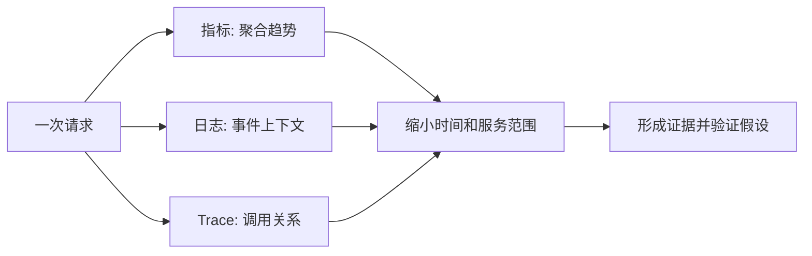
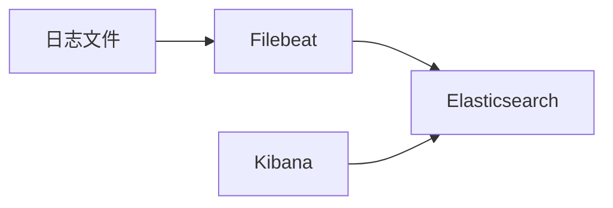
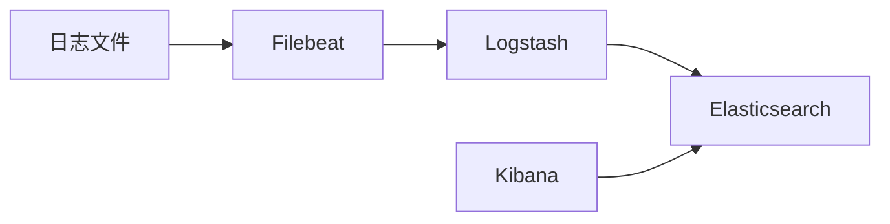
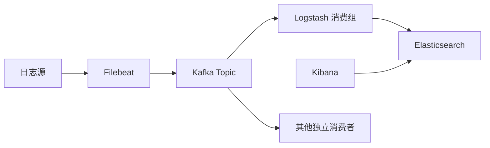
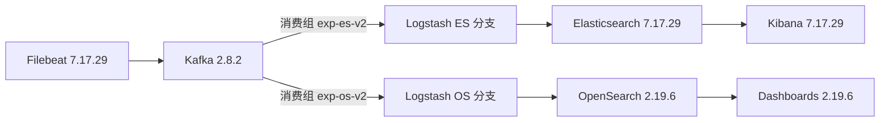
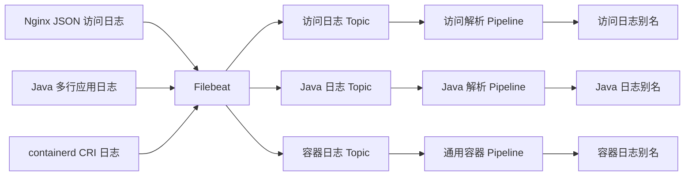
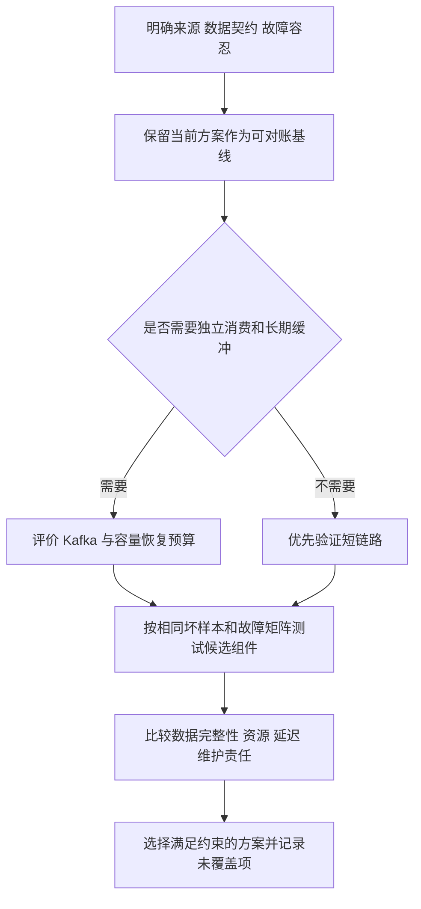

# ELK 与 OpenSearch 日志平台学习笔记 · 第一篇：日志基础、采集与组件选型

> 教学基线：Elastic Stack 7.17.29、Kafka 2.8.2 ZooKeeper 模式；双后端对照采用 OpenSearch / Dashboards 2.19.6。固定版本用于教学，不表示生产推荐或联合认证。
> 配置与脚本完整保留在四篇 Markdown；对照实验从[文件索引与提取入口](02-pipeline-and-reliability.md#s-11-1)准备。基础实验和对照实验使用独立目录、端口、数据卷及脚本。
> 验证边界：静态与离线逻辑测试不能替代真实组件、TLS、故障、性能与 UI 验收。具体状态见[专题说明](README.md)。

[返回专题](README.md) · [第2篇](02-pipeline-and-reliability.md) · [第3篇](03-search-storage-and-visualization.md) · [第4篇](04-production-operations-and-troubleshooting.md)

| 章节 | 核心主题 |
| --- | --- |
| 1 | 日志平台的职责、数据路径与实验边界 |
| 2 | 日志契约与可对账的样本 |
| 3 | Filebeat 的读取状态与背压 |
| 4 | 结构化日志、多行异常与源端处理 |
| 5 | Linux 与 Kubernetes 日志接入 |
| 6 | 按场景选择采集与加工组件 |

## 第 1 章 · 日志平台的职责、数据路径与实验边界

### 1.1 从排障问题理解日志、指标与 Trace 的分工
<a id="s-1-1"></a>

#### 从“应用报错，但平台没有日志”开始

凌晨收到下单接口错误率升高的告警。应用负责人说已经打印异常，Kibana 却搜不到。
这时最容易犯的错误，是立刻重启 Filebeat，或者认为 Elasticsearch 丢了数据。
“没有搜到”只是查询侧的现象，并没有定位到数据路径中的具体阶段。

先把问题拆成三个独立判断：应用是否生成记录，记录是否进入平台，查询是否选中了它。
即使应用确实执行了日志方法，也还要检查日志级别、异步 Appender、缓冲刷新和输出位置。
容器标准输出与应用内部 `/logs/app.log` 是不同的数据源，采集其中一个不会自动得到另一个。

| 阶段 | 可检查证据 | 不能直接推出的结论 |
| --- | --- | --- |
| 应用生成 | 原始文件、容器 stdout、明确事件 ID | 调用了日志方法不等于文件已落盘 |
| Filebeat 读取 | 匹配路径、权限、采集计数、Registry 状态 | 读取计数增长不等于 ES 写入成功 |
| Kafka 接收 | Topic 中的实际消息、生产错误 | Topic 有消息不等于当前消费组已处理 |
| Logstash 加工 | 输入输出计数、解析失败标签、队列 | 输入与输出计数不同不一定是丢失 |
| ES 索引 | Bulk item 结果、按 ID 查文档 | HTTP 200 不代表 Bulk 全部成功 |
| Kibana 查询 | Index Pattern、时间字段、过滤条件 | 空结果不代表存储中没有文档 |

**一条用于排障的“探针日志”**

为每次验证生成独立事件 ID，例如 `lab-20260924-a-000001`。
在原始记录、Kafka 消息、Logstash 调试输出和 Elasticsearch 文档中查这个 ID。
不要用“最新一条”作为唯一标准：异步处理、不同时间戳与并行分区会改变可见顺序。

```json
{
  "event_id": "lab-20260924-a-000001",
  "service": "orders-api",
  "env": "lab",
  "level": "ERROR",
  "message": "inventory request timed out",
  "status": "504",
  "request_time": "1.250"
}
```

这是一条教学记录，不包含真实订单、账号、Cookie 或认证凭据。
生产中不能为了排障把 Authorization、访问令牌或完整请求体无差别写入日志。
日志越容易检索，敏感数据被扩大访问的风险也越大；字段治理不是最后才补的工作。

**本节练习**

画出自己环境中的实际路径，并为每条箭头写一个能验证它的方法。
例如“Filebeat → Kafka”不是写“检查网络”，而是写“从相同网络命名空间查询元数据，并消费目标 Topic 中带探针 ID 的消息”。
这个练习的产物是一张证据路径图，而不是一份产品清单。


#### 日志、指标与 Trace 的分工

指标适合观察趋势与范围，日志适合保留事件细节，Trace 适合理解一次操作的调用关系。
它们可以互相补充，但不能因存在关联字段就忽略数据覆盖率、采样和处理延迟。
一条错误日志中带有 Trace ID，只说明它记录了追踪上下文，并不证明该 Trace 已被后端存储。

| 问题 | 优先入口 | 接下来补充什么 |
| --- | --- | --- |
| 哪个服务错误率升高？ | 请求指标或完整访问日志聚合 | 环境、接口、时间范围 |
| 某次请求返回了什么错误？ | 访问日志与应用日志 | Trace ID、实例和异常类型 |
| 时间主要花在哪一跳？ | 对应 Trace | 下游日志和依赖指标 |
| 某个 Pod 重启前发生了什么？ | Kubernetes Events 与应用日志 | JVM、容器和节点指标 |
| 日志平台是否漏采？ | 端到端探针与边界计数 | 本地文件、队列和错误原因 |

对访问日志计算错误率时，分母必须与分子来自相同覆盖范围。
不能用“采样后的普通请求 + 全量错误请求”直接计算真实业务错误率。
错误日志比例也不等于失败请求比例：同一失败请求可能产生十条异常日志，而成功请求一条都不打印。



**关联字段只是索引，不是根因结论**

`trace.id`、`service.name`、`service.environment`、Pod UID 和时间窗口共同构成关联条件。
只用服务名可能把生产与测试环境混在一起；只用 Pod 名可能遇到重建和名称复用。
只用一个错误关键词，则可能把原因日志、重试日志和上游传播日志重复计为多个故障。

本专题把日志字段与存储检索讲清，不重新实现 OTel SDK 或 Jaeger。
关于传播、采样与跨服务证据，配合仓库中 [OTel 专题](https://github.com/luozijian1990/ops-roadmap/blob/main/topics/observability/otel/README.md) 阅读。
ECS 的事件时间、服务身份与追踪字段定义可作为公共词汇，而不是强制要求所有源日志一开始就完全符合 ECS。[ECS](https://www.elastic.co/guide/en/ecs/1.12/ecs-reference.html)


### 1.2 选择直连、加工和带缓冲的日志链路
<a id="s-1-2"></a>

#### 五个组件的职责与三种链路

ELK 原指 Elasticsearch、Logstash、Kibana。
实际日志平台经常再加入 Filebeat 与 Kafka；本书沿用“ELK 日志平台”这个主题名，但明确五个组件的责任。

| 组件 | 核心职责 | 不应默认交给它的工作 |
| --- | --- | --- |
| Filebeat | 贴近日志源读取、补充元数据、发送 | 复杂跨事件关联与长期归档 |
| Kafka | 按分区保存消息、解耦生产与消费 | 自动保证最终 ES 文档不丢不重 |
| Logstash | 解析、规范化、路由和批量输出 | 无限缓冲、自动理解业务字段 |
| Elasticsearch | 建模、索引、检索与生命周期 | 任意格式永久无成本保存 |
| Kibana | 查询、分析和展示 | 替代 ES 权限与写入结果校验 |

**链路 A：Filebeat 直接写 ES**



这种路径短，适合先验证采集和检索，也适合格式简单且能接受下游压力直接传回采集端的场景。
它不是“不专业”，关键在于格式治理、缓冲时长和故障容忍是否满足需求。
第一篇使用这条路径建立最小可验证实验。

**链路 B：Filebeat 经 Logstash 写 ES**



当解析逻辑需要集中维护时，可以加入 Logstash。
要同时讨论它的实例数量、队列、持久化和输出阻塞；中间多一个组件，并不自动增加可靠性。
使用 Beats input 时，采集端确认边界与 Kafka input 不同，不能把两种管道的故障语义混写。

**链路 C：Filebeat → Kafka → Logstash → ES**



这条路径适合需要较长缓冲窗口、多消费者或回放的场景。
代价是 Topic 治理、分区规划、磁盘成本、消费组与重放管理。
是否引入 Kafka，应该由“允许 ES 中断多久、积压能保存多久、是否需要重复处理”决定，而不是因为组件越多看起来越完整。[Filebeat 输出](https://www.elastic.co/guide/en/beats/filebeat/7.17/configuring-output.html)


#### 为日志平台定义可验证目标

不要只写“日志不能丢、平台要高可用”。这些表述没有故障边界，也无法验收。
把目标改成带条件的句子：在什么负载、什么故障和什么保留窗口内，数据应达到什么状态。

| 目标类型 | 示例写法 | 验证方法 |
| --- | --- | --- |
| 新鲜度 | 健康状态下，探针在约定时间内可查询 | 定时生成探针并记录首个可见时间 |
| 覆盖率 | 所有目标命名空间均有采集实例 | 节点清单、DaemonSet 与样本对照 |
| 可恢复性 | ES 停机期间，积压不超出 Kafka 保留窗口 | 隔离实验停止后端并恢复 |
| 格式质量 | 无效字段被标记，不能静默写成成功值 | 异常输入测试集 |
| 可追溯性 | 文档能回溯到源事件及处理规则版本 | 事件 ID、原始记录、Pipeline 版本 |
| 成本 | 保留范围和副本数量有明确预算 | 容量公式与实际磁盘趋势 |

**用“数据在哪里”替代“哪个组件坏了”**

排障开始时记录最后一个有确凿证据的阶段。
若 Kafka 已有探针、ES 没有，优先检查消费、加工、写入和查询；不要先改采集端。
若 ES 能按 ID 查到，但 Kibana 无结果，则先检查时间范围和 Index Pattern，而不是扩大 Kafka 分区。

**章节验收**

能用自己的话解释：为什么 Kafka 存活不代表日志链路健康，为什么 Kibana 没日志不能证明 Filebeat 没读。
能指出平台的主要缓冲层，以及缓冲耗尽后压力会传播到哪里。
能给出一个能重复执行、不会访问生产敏感数据的探针实验。


#### 从“保留采集链路，新增搜索后端”开始

团队已有 Filebeat、Kafka 和 Logstash，希望验证另一个日志搜索后端。
合理的第一步是让一个独立消费者读取同一批数据，写入新的实验集群，然后比较事件集合与查询结果。
不应先把生产 Logstash 的地址改掉，也不应把原 ES 数据目录交给 OpenSearch 打开。

OpenSearch 承担索引、搜索、聚合及集群数据管理；OpenSearch Dashboards 是对应的交互界面。
它们与 Elasticsearch、Kibana 有相近的职责划分，但已经是独立发布、独立演进的产品。
这种对应关系是学习迁移的起点，不是二进制、插件和管理接口完全兼容的承诺。[工具兼容资料](https://docs.opensearch.org/2.19/tools/)



两个消费组分别读取全部消息；使用同一消费组会分摊分区，而不是形成两份完整对照。
两条输出使用独立进程和独立 PQ，避免一个后端长时间不可用把另一个输出同步拖住。
实验中的单 Kafka broker 仍是共同依赖，不能由这张图推导出整条链路高可用。


### 1.3 区分 Elastic 与 OpenSearch 的版本和能力边界
<a id="s-1-3"></a>

本专题保留 Elastic 7.17.29 基础实验，并用 OpenSearch 2.19.6 做独立对照。版本表说明教学条件；它不代表推荐新建生产系统使用这些历史版本，也不代表插件组合已经真实联调。先选择实验路径，再准备目录，避免把两套配置拼在一起。

#### 固定版本、目录与验证范围

本书明确使用 Elastic Stack 7.17.29，而不是镜像标签 `latest`。
Kafka 在第二篇固定到 2.8.2，并使用 ZooKeeper 模式；不把 Kafka 3/4 的 KRaft 命令混进主实验。
7.17 的安全初始化、Filebeat 输入配置和 Logstash 插件选项应查对应版本资料。[7.17.29 发布说明](https://www.elastic.co/guide/en/elasticsearch/reference/7.17/release-notes-7.17.29.html)

**实验前提**

建议准备一台独立 Linux 实验机，或具有足够资源的 Docker Desktop 环境。
本篇可从 4 vCPU、8 GiB 可分配内存起步，完整链路建议留出更多资源；这是教学起点，不是生产容量结论。
旧内核系统能运行某些组件，不等于全部依赖受当前厂商支持。不要因已有 CentOS 7 就默认所有镜像都兼容。

```bash
# 在实验宿主机检查；命令本身不修改业务数据。
uname -a
uname -m
free -h
df -h
docker version
docker compose version
python3 --version
curl --version
```

完整 Compose 使用 Docker Compose v2 命令。
macOS 没有 `free` 时，从 Docker Desktop 检查虚拟机资源；ES 所见的内核参数属于虚拟机，不是 macOS 本体。
ARM 主机应核对各镜像架构；本实验以 Linux amd64 为主要教学落点，不宣称所有镜像均已在 ARM 联调。

**建立目录**

```bash
mkdir -p "$HOME/elk-lab-direct"/{filebeat,logs,scripts}
cd "$HOME/elk-lab-direct"
printf '%s\n' '7.17.29' > ELASTIC_VERSION.txt
```

目录结构如下。
所有后续“保存为”路径均相对此目录，除非明确标为另一套实验。

```text
elk-lab-direct/
├── compose.yml
├── ELASTIC_VERSION.txt
├── filebeat/
│   └── filebeat.yml
├── logs/
│   └── access.jsonl
└── scripts/
    └── generate_logs.py
```


#### 精确版本与兼容依据

| 对象 | 本书选定值 | 依据与限制 |
| --- | --- | --- |
| Elasticsearch / Kibana | 7.17.29 | 延续旧文，不在扩展中升级旧基线 |
| Filebeat | 7.17.29 | 保留文件与 Kafka 路径，不直接连接 OpenSearch |
| Kafka | 2.8.2，Scala 2.13 包 | 保留 ZooKeeper 教学；不是 KRaft 教程 |
| 两个 Logstash 主程序 | 7.17.29 | 便于比较相同 Filter 行为；输出插件独立管理 |
| ES output | 11.4.2 | 原 7.17.29 发布锁定版本 |
| OS output | 2.0.3 | 固定官方插件 tag / gemspec；并非插件最新版 |
| Kafka integration | 10.12.2 | 固定主程序原插件；构建 OS 镜像后再次核对 |
| Ruby filter | 3.1.8 | 固定字段规范化入口 |
| OpenSearch / Dashboards | 2.19.6 / 2.19.6 | 官方制品页与 2.19 分支文档；独立的新实验基线 |

OpenSearch 官方制品页可查到 2.19.6。本书选择仍有完整版本化资料的 2.19 系列，目的是完成存量日志链路对照，不宣称这是整个 OpenSearch 产品的最新版本。[制品](https://opensearch.org/artifacts/by-version/)

插件 2.0.3 的 gemspec 接受 `logstash-core-plugin-api >= 1.60, <= 2.99`，并依赖 AWS SDK v3。
这给出依赖级兼容证据，但不是“官方已联合测试 7.17.29 × 2.0.3 × 2.19.6”的证明。
精确组合仍要在本地构建、启动、Bulk、故障恢复及 TLS 测试中验收。[固定 gemspec](https://github.com/opensearch-project/logstash-output-opensearch/blob/2.0.3/logstash-output-opensearch.gemspec)

**为什么构建一个新 Logstash 镜像**

原镜像中部分 AWS 插件依赖 AWS SDK v2，与 OS output 的 SDK v3 依赖可能冲突。
[对照实验 Dockerfile](02-pipeline-and-reliability.md#s-8-2) 只在 OS 分支移除官方说明列出的旧 AWS 输入/输出，再安装精确 2.0.3。
本实验不使用 AWS 服务，因此不额外引入 AWS integration 预发布插件。
这不是建议在现网任意卸载插件；有 S3、SQS 等任务的环境必须采用独立镜像和依赖评审。[插件说明](https://github.com/opensearch-project/logstash-output-opensearch/blob/2.0.3/README.md)

构建会检查 Kafka integration 和 Ruby filter 版本。
如果依赖解析改变了它们，构建应失败，而不是悄悄继续运行。
即便关键版本不变，也必须保存完整插件清单、镜像 ID 与 digest，记录其他传递依赖；固定三个插件不等于完整供应链已经锁定。


#### Filebeat 7.17 的直连边界

OpenSearch 的兼容工具文档明确区分旧 OSS Beats 与较新的 Beats，并建议将不支持直连的 Beats 经 Logstash 和 OpenSearch output 接入。
本书不把 `output.elasticsearch.hosts` 指向 OpenSearch 作为 Filebeat 7.17 的受支持路径。[Beats 边界](https://docs.opensearch.org/2.19/tools/)

`compatibility.override_main_response_version` 是旧客户端版本检查兼容措施，不会实现完整 Elasticsearch 7.17 API，更不会迁移模板、ILM 或模块 Ingest Pipeline。
伪装根接口版本后“连接成功”，仍可能在模板安装、产品识别或数据写入阶段失败。
主实验不启用这个伪装选项，客户端明确识别 `version.distribution=opensearch`。

| 路径 | 本篇判断 |
| --- | --- |
| Filebeat 7.17 → Kafka → LS → OS output | 主实验，精确组合待真实联调 |
| Filebeat 7.17 → LS Beats input → OS output | 可缩短链路，但另核对 Beats input 和传输缓冲 |
| 应用样本 → LS stdin → OS output | 最短的转换与输出实验 |
| Filebeat 7.17 Elasticsearch output → OS | 不作为受支持方案 |
| ES output 11.4.2 改 URL → OS | 不作为替代专用 OS output 的方案 |


### 1.4 用固定样本跑通第一条可查询的日志
<a id="s-1-4"></a>

这一节只运行最短的 Filebeat → Elasticsearch 路径，所有文件保存到 `elk-lab-direct`。先启动后端、建立字段模板，再启动采集并生成样本；看到界面不算完成，必须按批次查到预期事件。这里的脚本与第二篇的完整链路、双后端对照各自独立。

#### 基础实验：启动 Elasticsearch 与 Kibana

下面是完整的 `compose.yml`。
宿主机端口只绑定 `127.0.0.1`；不要把关闭认证的教学 ES 暴露到公网或办公网络。
容器内部仍需要监听非回环地址，否则其他容器无法连接。

```yaml
services:
  elasticsearch:
    image: docker.elastic.co/elasticsearch/elasticsearch:7.17.29
    environment:
      cluster.name: elk-lab-direct
      node.name: es-direct-1
      discovery.type: single-node
      xpack.security.enabled: "false"
      ES_JAVA_OPTS: -Xms1g -Xmx1g
    ports:
      - "127.0.0.1:9200:9200"
    volumes:
      - es-direct-data:/usr/share/elasticsearch/data
    healthcheck:
      test:
        - CMD-SHELL
        - curl -fsS 'http://localhost:9200/_cluster/health?wait_for_status=yellow&timeout=5s' >/dev/null
      interval: 10s
      timeout: 8s
      retries: 30
    restart: unless-stopped

  kibana:
    image: docker.elastic.co/kibana/kibana:7.17.29
    environment:
      ELASTICSEARCH_HOSTS: '["http://elasticsearch:9200"]'
      SERVER_HOST: 0.0.0.0
    ports:
      - "127.0.0.1:5601:5601"
    depends_on:
      elasticsearch:
        condition: service_healthy
    restart: unless-stopped

  filebeat:
    image: docker.elastic.co/beats/filebeat:7.17.29
    user: root
    command: ["filebeat", "-e", "--strict.perms=false"]
    volumes:
      - ./filebeat/filebeat.yml:/usr/share/filebeat/filebeat.yml:ro
      - ./logs:/var/log/lab:ro
      - fb-direct-data:/usr/share/filebeat/data
    depends_on:
      elasticsearch:
        condition: service_healthy
    restart: unless-stopped

volumes:
  es-direct-data:
  fb-direct-data:
```

`--strict.perms=false` 仅为本地只读挂载的教学便利，不是生产默认做法。
生产中应正确设置配置所有者与读写权限；非 root 采集账号需要能读取源文件，并能写自己的状态目录。
本篇把 Filebeat 设为 root，是为了避免读权限影响第一次理解数据路径；它不需要 Docker Socket。

**先启动存储，不急着启动采集**

```bash
cd "$HOME/elk-lab-direct"
docker compose -p elk-direct config
docker compose -p elk-direct up -d elasticsearch kibana
docker compose -p elk-direct ps
curl -fsS http://127.0.0.1:9200/
curl -fsS 'http://127.0.0.1:9200/_cluster/health?pretty'
```

若 Elasticsearch 报 `vm.max_map_count` 不足，先记录旧值，再在实验宿主机调整。
此命令影响整台 Linux 主机，应由有权限的操作者执行；生产环境需要走变更流程。

```bash
# Linux 实验机，非容器内。先读，再改。
sysctl vm.max_map_count
sudo sysctl -w vm.max_map_count=262144
```

不要把关闭全部 Bootstrap Checks 当作通用修复。
`single-node` 只是实验拓扑，不是多节点集群的高可用配置。[ES 配置](https://www.elastic.co/guide/en/elasticsearch/reference/7.17/important-settings.html)


#### 基础实验：创建字段模板与 Filebeat 配置

初始实验把源 JSON 放在 `app` 对象下，避免未经治理的字段覆盖 Filebeat 的 `host`、`agent` 和 `log`。
这一阶段的 `@timestamp` 是采集事件时间；源业务时间保存在 `app.time`。
第二篇会改为集中解析，并把规范化后的业务时间写入 `@timestamp`。

**先创建只作用于实验索引的模板**

```bash
curl -fsS -X PUT \
  'http://127.0.0.1:9200/_index_template/logs-lab-direct-template' \
  -H 'Content-Type: application/json' \
  --data-binary @- <<'JSON'
{
  "index_patterns": ["logs-lab-direct-*"],
  "priority": 300,
  "template": {
    "settings": {
      "number_of_shards": 1,
      "number_of_replicas": 0
    },
    "mappings": {
      "dynamic": false,
      "properties": {
        "@timestamp": {"type": "date"},
        "message": {"type": "text"},
        "error": {
          "properties": {
            "message": {"type": "text"},
            "type": {"type": "keyword"}
          }
        },
        "app": {
          "properties": {
            "time": {"type": "date"},
            "event_id": {"type": "keyword"},
            "run_id": {"type": "keyword"},
            "sequence": {"type": "long"},
            "service": {"type": "keyword"},
            "env": {"type": "keyword"},
            "level": {"type": "keyword"},
            "message": {"type": "text"},
            "status": {"type": "keyword"},
            "request_time": {"type": "keyword"},
            "trace_id": {"type": "keyword"},
            "scenario": {"type": "keyword"}
          }
        }
      }
    }
  }
}
JSON
```

`dynamic: false` 表示未知字段仍保留在 `_source`，但不自动建立可查询映射。
它不是删除字段，也不是拒绝整个文档。第三篇会与 `strict` 和字段类型冲突作对照。
本实验将原始状态和耗时保留为 keyword，刻意不在这里计算数值指标，避免把未规范化值直接当测量结果。

**保存为 `filebeat/filebeat.yml`**

```yaml
filebeat.inputs:
  - type: filestream
    id: lab-json-v1
    enabled: true
    paths:
      - /var/log/lab/*.jsonl
    parsers:
      - ndjson:
          target: app
          add_error_key: true

setup.ilm.enabled: false
setup.template.enabled: false

output.elasticsearch:
  hosts: ["http://elasticsearch:9200"]
  index: "logs-lab-direct-%{+yyyy.MM.dd}"

logging.level: info
logging.metrics.enabled: true
logging.metrics.period: 30s
```

这里显式关闭 Filebeat 的模板与 ILM 自动管理，因为实验模板由我们手动建立。
不是建议生产永远关闭这些功能，而是避免一个实验同时由 Filebeat、Logstash 和人工三方管理相同资源。
输入中的 `id` 应稳定；不要每次改配置都随机生成新 ID。[filestream](https://www.elastic.co/guide/en/beats/filebeat/7.17/filebeat-input-filestream.html)

**检查并启动**

```bash
cd "$HOME/elk-lab-direct"
docker compose -p elk-direct run --rm --no-deps filebeat \
  filebeat test config -e --strict.perms=false
docker compose -p elk-direct run --rm --no-deps filebeat \
  filebeat test output -e --strict.perms=false
docker compose -p elk-direct up -d filebeat
docker compose -p elk-direct logs --tail=100 filebeat
```

`test config` 验证配置能被 Filebeat 加载；`test output` 检查输出连接。
两者都不能证明路径匹配、业务字段和端到端查询正确，必须继续执行本节的样本生成和查询对账。


#### 基础实验：生成可重复样本并完成端到端验收

将下面完整脚本保存为 `scripts/generate_logs.py`。
脚本只向指定实验文件追加日志，不连接任何生产服务。
每次执行产生独立 `run_id`；同一批事件的 `event_id` 由 run ID 和序号组成，便于回放后对账。

```python
#!/usr/bin/env python3
"""生成 ELK 教学用 JSON Lines；标准库即可运行。"""
from __future__ import annotations

import argparse
import json
import math
import random
import time
import uuid
from datetime import datetime, timedelta, timezone
from pathlib import Path


def main() -> None:
    parser = argparse.ArgumentParser()
    parser.add_argument("--output", type=Path, default=Path("logs/access.jsonl"))
    parser.add_argument("--count", type=int, default=20)
    parser.add_argument("--interval", type=float, default=0.05)
    parser.add_argument("--run-id", default=None)
    parser.add_argument("--seed", type=int, default=42)
    parser.add_argument("--age-hours", type=float, default=0)
    parser.add_argument("--bad-every", type=int, default=0)
    args = parser.parse_args()

    if args.count < 1 or args.count > 1_000_000:
        parser.error("count 必须在 1..1000000 范围内")
    if not math.isfinite(args.interval) or args.interval < 0:
        parser.error("interval 必须为非负有限数")
    if not math.isfinite(args.age_hours) or abs(args.age_hours) > 87600:
        parser.error("age-hours 超出教学范围")
    if args.bad_every < 0:
        parser.error("bad-every 不能为负")

    run_id = args.run_id or uuid.uuid4().hex
    rng = random.Random(args.seed)
    args.output.parent.mkdir(parents=True, exist_ok=True)
    with args.output.open("a", encoding="utf-8") as stream:
        for seq in range(args.count):
            failed = seq % 5 == 0
            now = datetime.now(timezone.utc) - timedelta(hours=args.age_hours)
            status = "504" if failed else "200"
            duration = 1.25 if failed else round(rng.uniform(0.005, 0.2), 3)
            event = {
                "time": now.isoformat(timespec="milliseconds"),
                "event_id": f"{run_id}-{seq:06d}",
                "run_id": run_id,
                "sequence": seq,
                "service": "orders-api",
                "env": "lab",
                "level": "ERROR" if failed else "INFO",
                "message": "inventory timeout" if failed else "order accepted",
                "status": status,
                "request_time": f"{duration:.3f}",
                "upstream_status": "504" if failed else "200",
                "upstream_response_time": f"{max(0, duration - 0.003):.3f}",
                "method": "POST",
                "uri": "/orders",
                "trace_id": uuid.uuid4().hex,
                "scenario": "downstream_timeout" if failed else "normal",
            }
            if args.bad_every and (seq + 1) % args.bad_every == 0:
                event["status"] = "not-a-number"
                event["scenario"] = "invalid_status"
            stream.write(json.dumps(event, ensure_ascii=False) + "\n")
            stream.flush()
            if args.interval:
                time.sleep(args.interval)
    print(json.dumps({"run_id": run_id, "count": args.count,
                      "output": str(args.output)}, ensure_ascii=False))


if __name__ == "__main__":
    main()
```

**执行并记录 run ID**

```bash
cd "$HOME/elk-lab-direct"
python3 scripts/generate_logs.py --count 20 --interval 0.05
wc -l logs/access.jsonl
tail -n 1 logs/access.jsonl
```

复制脚本输出的 `run_id`，替换下面的值。
查询使用 `app.run_id` 精确匹配，不能只看索引总数，因为文件可能包含上一次实验的数据。

```bash
RUN_ID='替换为脚本输出的run_id'
curl -fsS -X POST \
  'http://127.0.0.1:9200/logs-lab-direct-*/_search?pretty' \
  -H 'Content-Type: application/json' \
  --data-binary "{\"size\":5,\"track_total_hits\":true,\"query\":{\"term\":{\"app.run_id\":\"${RUN_ID}\"}}}"
```

预期是最终能找到这批 20 个事件，且字段内容与原始文件一致。
文件扫描与索引刷新存在延迟，可以间隔重查；不要把第一次空结果立刻定性为丢失。
若长时间不见数据，依次检查 Filebeat 配置、挂载路径、日志错误与 ES 模板，不要删除 Registry 试运气。

**在 Kibana 中验收**

浏览器打开本机 5601 端口，进入 Stack Management → Index Patterns。
创建 `logs-lab-direct-*`，时间字段选择 `@timestamp`，再进入 Discover。
查询 `app.run_id : "你的run_id"`，检查 `app.event_id`、`app.status` 和 `app.message`。

这一步应与 API 查询结果对照。
如果 API 能查到而 Discover 没有，检查时间选择器、Index Pattern 和查询字段，而不是重装组件。[Discover](https://www.elastic.co/guide/en/kibana/7.17/discover.html)


#### 基础实验：保存实验状态与安全停止

实验结束可以停止容器而保留命名卷。
不要习惯性使用 `down -v`，因为它会删除本实验的 ES 数据和 Filebeat 状态。

```bash
cd "$HOME/elk-lab-direct"
docker compose -p elk-direct stop
# 继续学习时：
docker compose -p elk-direct start
```

记录以下结果，作为之后的基线。

| 项目 | 要保存的内容 |
| --- | --- |
| 软件 | 镜像标签与本地镜像 digest |
| 配置 | Compose、Filebeat 配置与 ES 模板 |
| 输入 | 生成命令、run ID、事件数量 |
| 输出 | 按 run ID 查询的计数与样本文档 |
| 状态 | 命名卷、Registry 和 ES 数据目录归属 |
| 边界 | 是否启用认证、是否只绑定回环端口 |

配置能启动只是第一层验收；数量、字段、时间与状态可解释，才算完成本篇的最小实验。


## 第 2 章 · 日志契约与可对账的样本

### 2.1 约定时间、来源身份和可信元数据
<a id="s-2-1"></a>

#### 先制定日志契约，再编写解析规则

日志契约不是为了追求字段多，而是约定哪些信息稳定、哪些字段允许缺失，以及缺失如何解释。
没有契约时，同一个 `response_time` 可能在一个服务里表示毫秒，在另一个服务里表示秒。
日志可以被成功写入，却得到完全错误的慢请求统计。

**建议的最小契约**

| 语义 | 源字段示例 | 规范字段 | 类型与约束 |
| --- | --- | --- | --- |
| 业务时间 | `time` | `@timestamp` | 带时区的时间 |
| 服务名 | `service` | `service.name` | 稳定 keyword |
| 环境 | 采集平台配置 | `service.environment` | 受控枚举 |
| 日志级别 | `level` | `log.level` | 统一大小写 |
| 原始记录 | 源文本 | `event.original` | 保留但通常不索引 |
| 事件 ID | `event_id` | `event.id` | 单条事件的稳定身份 |
| HTTP 状态 | `status` | `http.response.status_code` | 整数，业务范围明确 |
| 耗时 | `request_time` | `event.duration` | ECS 约定纳秒整数 |
| 请求路径 | `uri` | `url.original` | 注意查询参数敏感性 |
| Trace ID | `trace_id` | `trace.id` | 真实上下文，不伪造 |

源字段与规范字段不必完全相同。
可以保留原始日志，再通过版本化的 Logstash 规则映射；关键是所有消费者知道转换关系。
表中 `event.duration` 的纳秒单位来自 ECS 定义，不应把源日志秒值直接复制过去。[ECS event](https://www.elastic.co/guide/en/ecs/1.12/ecs-event.html)

**哪些字段属于平台可信元数据？**

环境、租户、来源集群等字段应优先来自受控采集配置，而不是完全信任应用日志自报。
否则应用只要把 `env` 改成 `prod`，就可能改变索引路由或权限边界。
即使没有恶意，测试应用复制生产配置也可能污染统计。

在教学主链路中，环境由 Filebeat 的 `fields.environment` 提供。
源 `app.env` 保留作核对，但不用于动态选择任意索引名。
这是平台规则，不是 Filebeat 自动提供的安全保证。


#### 处理三类时间及其时区

至少区分业务发生时间、采集事件创建时间与入库时间。
对于离线补采，三者可能相差数天；对于时钟不同步，甚至可能出现看起来“先入库后发生”的现象。

| 字段 | 本书语义 | 生成位置 |
| --- | --- | --- |
| `@timestamp` | 规范化后的业务事件时间 | Logstash Date Filter |
| `event.created` | 本次 Filebeat 采集事件的时间 | 从输入事件原 `@timestamp` 复制 |
| `event.ingested` | ES Ingest Pipeline 接收时间 | `_ingest.timestamp` |
| `app.time` | 源日志原始时间字段 | 应用或样本生成器 |

`event.ingested - @timestamp` 包括业务日志延迟、采集、队列、加工和时钟误差，不能直接叫“Kafka 延迟”。
`event.ingested` 表示进入 Ingest 的时间，也不等于文档第一次被搜索命中的精确时刻。
要测查询可见性，需要外部探针记录首次成功查询时间。[ECS event](https://www.elastic.co/guide/en/ecs/1.12/ecs-event.html)

**同一时间的不同表示**

```text
2026-09-24T10:00:00+08:00
2026-09-24T02:00:00Z
```

这两个值表示同一时刻。
给不带时区的本地时间指定 `Asia/Shanghai`，与给已带 `+08:00` 的时间再次手工加八小时，是完全不同的操作。
不要通过修改源字符串“修复”Kibana 的显示时区。

**Filebeat Timestamp 与 Logstash Date 语法不同**

Filebeat `timestamp` 使用 Go 的参考时间布局；Logstash Date 使用自己的格式表达。
不要把 `yyyy-MM-dd HH:mm:ss` 原样填进 Filebeat 的 `layouts`。
7.17 文档将 Filebeat 的 Timestamp Processor 标为 beta，本书主链路因此把业务时间解析放在 Logstash。[Timestamp Processor](https://www.elastic.co/guide/en/beats/filebeat/7.17/processor-timestamp.html)

```yaml
# 独立演示片段：合并到现有 processors 列表，不是完整配置。
processors:
  - timestamp:
      field: app.time
      layouts:
        - '2006-01-02T15:04:05.999Z07:00'
      test:
        - '2026-09-24T10:00:00.123+08:00'
        - '2026-09-24T02:00:00.123Z'
```

这个片段用于理解语法，不要求加入第二篇的主配置。
同一字段由两层重复解析，会增加追溯困难；应明确谁负责最终设置业务时间。


#### 一条主线，多个明确的数据契约

第二篇的主链路面向访问日志，包含状态码、耗时、上游状态及 Trace ID 校验。
Java 应用日志和普通容器标准输出不一定拥有这些字段，不应全部套用访问日志解析器。



图中区分 Topic 和 Pipeline 是教学上的清晰分界。
生产不必每个服务都创建 Topic，应结合隔离、访问控制、吞吐和保留需求决定粒度。
不要把“逻辑上不同数据集”直接等同“必须部署一套独立集群”。

| 数据集 | 主字段 | 不应默认存在 |
| --- | --- | --- |
| nginx.access | 状态、请求耗时、URI、上游信息 | 业务异常堆栈 |
| java.application | 日志级别、线程、Logger、消息与堆栈 | 每行对应一个 HTTP 请求 |
| kubernetes.container | 容器身份、CRI 时间、标准输出文本 | 结构化业务字段和 Trace ID |


### 2.2 区分字段缺失、解析失败和有效零值
<a id="s-2-2"></a>

#### 缺失、空值、零与解析失败不是一回事

源日志中至少可能出现字段缺失、JSON null、空字符串、`-`、合法数字和非法文本。
把所有情况都改成 `0`，虽然可能降低部分写入错误，却把“未知”伪装成“测量结果为零”。
对于耗时、字节数和状态码，这会直接改变聚合意义。

| 原值 | 建议解释 | 处理策略 |
| --- | --- | --- |
| 字段不存在 | 未提供该信息 | 不写规范数值字段 |
| `null` | 显式未知 | 保留原始，规范字段缺失 |
| `""` | 空值 | 按契约视为未知并统计 |
| `"-"` | Nginx 等日志中的占位 | 保留原始，不能当数字 |
| `"0"` | 合法的零值候选 | 按字段业务范围校验 |
| `"0.035"` | 合法小数候选 | 转换并统一单位 |
| `"200, 502"` | 多次上游尝试 | 作为序列或原始字符串 |
| `"abc"` | 格式错误 | 标记错误并进入质量治理 |

HTTP 响应状态码 `0` 不是一个正常的 HTTP 状态码。
若系统确实用 0 表示“未收到响应”，应使用额外字段描述该状态，不要把它与服务器返回码混用。
同样，`upstream_response_time` 的多值可能表示重试或多个上游，不应简单截取第一个值而不说明语义。

**历史索引已经要求默认零怎么办？**

可以保留一个兼容字段，例如 `legacy.request_time`，并补充 `pipeline.defaulted_fields`。
新的统计查询应排除被默认填充的值，或直接使用新的规范字段。
变更要覆盖模板、解析规则、仪表盘和回放策略，不能只修改一个 Convert 配置。

```json
{
  "legacy": {"request_time": 0},
  "pipeline": {
    "defaulted_fields": ["legacy.request_time"],
    "errors": ["request_time:missing"]
  },
  "event": {"original": "原始日志仍被保留"}
}
```

这是迁移期的示意对象，不是本书主链路的默认输出。
主链路对可选缺失值保持缺失，对不合法值记录错误，并避免将非法文本写进数值字段。


### 2.3 保留原始记录并建立可检索的规范字段
<a id="s-2-3"></a>

#### 结构化 JSON、原始记录与 ECS 的取舍

结构化日志把格式责任前移到应用，可以减少复杂正则，但仍然需要字段契约。
合法 JSON 不等于有效日志：`status` 是对象、`time` 是错误日期、`service` 是数组，都可以是语法合法的 JSON。
采集层应先识别载荷，治理层再验证类型和业务约束。

**一层信封，一层业务载荷**

```json
{
  "@timestamp": "2026-09-24T02:00:01.000Z",
  "agent": {"type": "filebeat", "version": "7.17.29"},
  "host": {"name": "lab-node-1"},
  "log": {"file": {"path": "/var/log/lab/access.jsonl"}},
  "message": "{\"service\":\"orders-api\",\"status\":\"200\"}",
  "fields": {"environment": "lab"}
}
```

第二篇的 Kafka 消息保存这种 Filebeat 信封。
Logstash Kafka input 的 JSON Codec 解开信封后，Filter 再解析 `message` 中的业务 JSON。
这两次 JSON 解码处理的是不同层级，不是无意义地重复处理同一对象。

保留 `event.original` 有助于回放与规则修正，但增加存储与敏感数据保留范围。
即使配置 `index: false`，它仍在 `_source`，能被有读取权限的人访问。
“不索引”不是“脱敏”或“不可见”。[Mapping source](https://www.elastic.co/guide/en/elasticsearch/reference/7.17/mapping-source-field.html)

**ECS 应按需要采用**

优先统一服务、时间、HTTP、追踪和来源身份等公共字段。
业务特有字段可以放在受控的 `labels` 或独立对象下，不必硬塞到不相干的 ECS 字段。
不要因为启用插件的 `ecs_compatibility`，就宣称所有业务字段已自动转成 ECS。


#### 用样本契约防止规则回归

为每种日志准备正常、缺失、边界、非法和历史兼容样本。
每个样本应带预期字段和预期错误，而不仅是“处理后能写入”。

| 样本 | 预期结果 | 不能接受的结果 |
| --- | --- | --- |
| 正常访问 | 状态码整数、耗时纳秒、时间准确 | 状态和耗时仍为无说明的字符串 |
| 上游为空 | 上游规范数值字段缺失 | 自动写 0 并纳入平均值 |
| 非法 JSON | 有原始记录和解析错误 | 静默丢弃 |
| 数字非法 | 不把非法值送入数值字段 | 写入失败后无限阻塞且无告警 |
| 超长堆栈 | 按限制处理并知道截断边界 | 假装完整记录仍被保存 |
| 历史补采 | 保留业务时间与新入库时间 | 全部改成当前时间 |

实验结果要进入版本控制。
规则变更前后比较文档数、错误数、字段类型和聚合结果，而不是只比较 YAML 文本。


### 2.4 用批次、事件 ID 和实验信封生成异常样本
<a id="s-2-4"></a>

基础实验的生成器见 [1.4 节](01-log-foundations-and-collection.md#s-1-4)；这里进一步为双后端对照设计可追踪的异常输入。外层信封承载测试身份，内层载荷才是故意损坏的应用日志。完整 `tools/generate.py` 保存在本节，运行前须按 [11.1 节](02-pipeline-and-reliability.md#s-11-1) 提取所有依赖文件。

#### 为什么增加一层实验传输信封

原应用字段保持 `run_id`、`event_id`、`service` 等；进入后端后仍使用 `labels.run_id` 和 `event.id`。
不过非法 JSON 自身无法可靠承载可解析的批次 ID。
如果直接把文件截断后再按解析出的 `run_id` 查询，它可能消失在对账范围之外。

为验证这种失败，[对照实验生成器](01-log-foundations-and-collection.md#s-2-4)使用合法的外层实验信封，`payload` 保存应用原文，包括刻意损坏的 JSON。
这是测试夹具的设计，不要求所有生产应用修改日志格式。

```json
{
  "run_id": "sample-run",
  "event_id": "sample-run-000001",
  "scenario": "invalid-json",
  "payload": "{\"service\":\"orders-api\""
}
```

采集端不提前解析此信封；Kafka 中保存的是 Filebeat 的完整事件，Logstash 再解析 `message` 中的信封和 `payload`。
有三层 JSON 时，必须注明哪一层失败。
真正的外层信封也损坏时，只能用 Kafka 位置生成隔离身份并标为 `unattributed`，不能从未知内容猜测 run_id。
这种记录需要全局未归属告警和原始消息回查，不能被当成已通过本批次对账。


#### 样本集合的预期

`mixed --count 100` 生成 100 个访问事件、1 个业务 heartbeat、1 个采集见证、1 个 Java 多行事件，并重复发送一个已有访问事件。
因此传输事件数为 104，唯一事件 ID 为 103；其中 10 个进入隔离，93 个进入正常索引。
这是生成器定义的预期，不是实际后端验收结果。

| 样本 | 转换与验收要求 |
| --- | --- |
| 正常 JSON | 状态码 integer、耗时秒转纳秒、服务与批次一致 |
| 非法应用 JSON | 原文保留，ID 与批次仍在，进入隔离 |
| 错误字段类型 | 不强制转零，保存 `pipeline.errors` |
| Java 多行异常 | 合成一个事件，堆栈不被拆成多个请求 |
| 迟到日志 | 事件时间旧、入库时间新；不算入最近业务窗口 |
| 相同 ID 重放 | 同一具体索引内覆盖；跨滚动索引仍可能重复 |

验收必须同时检查正常与隔离索引，且要比较 ID 集合、重复 ID、路由和关键字段。
只比较总数会漏掉“一条丢失、一条重复”互相抵消的错误。
CLI 对账还会核验清单同目录中的源文件 SHA-256；样本被修改时直接拒绝，不能用旧清单证明新输入完整。

```bash
# 等待处理稳定后执行；尚未稳定时使用新的输出文件重试，不覆盖前次证据。
python3 tools/export_audit.py export os --run-id first-check --output evidence/os-first.jsonl
python3 tools/export_audit.py audit --manifest logs/first-check.manifest.json --input evidence/os-first.jsonl
python3 tools/export_audit.py export es --run-id first-check --output evidence/es-first.jsonl
python3 tools/export_audit.py audit --manifest logs/first-check.manifest.json --input evidence/es-first.jsonl
```

导出失败保留 `.partial`，正式结果文件只在分页完整后生成。
对账脚本拒绝空清单，也会把历史滚动导致的同 ID 多文档判为重复。
这符合实验验收定义，不代表生产中所有重复都应自动删除。


#### 对照实验完整文件：`tools/generate.py`

正常、错误、迟到、重放和多行样本。下面是完整文件；保存路径相对于双后端对照实验根目录。

<!-- file: tools/generate.py -->
```python
"""生成可对账样本；传输信封保护非法应用 JSON 的事件身份。"""
from __future__ import annotations
import argparse
import copy
from datetime import datetime, timezone, timedelta
import hashlib
import json
from pathlib import Path
import re
import uuid


def iso(dt):
    return dt.astimezone(timezone.utc).isoformat(timespec='milliseconds')

def generate(root: Path, run: str, count: int = 100, profile: str = 'mixed', now=None):
    if not re.fullmatch(r'[a-zA-Z0-9_-]{1,64}', run) or not 1 <= count <= 100000:
        raise ValueError('run_id 格式或 count 范围错误')
    if profile not in ('mixed','normal','trigger','recovery','missing','late'):
        raise ValueError('profile 无效')
    root.mkdir(parents=True, exist_ok=True)
    base = now or datetime.now(timezone.utc)
    records, expected = [], {}
    def add(event, scenario, route='normal', malformed=False):
        event = copy.deepcopy(event)
        payload = json.dumps(event, ensure_ascii=False, allow_nan=False)
        if malformed:
            payload = payload[:-1]  # 仅破坏应用 payload，信封保持合法。
        records.append({'run_id': run, 'event_id': event['event_id'],
                        'scenario': scenario, 'payload': payload})
        checks = {'event.dataset': {'access':'nginx.access','heartbeat':'business.heartbeat','probe':'pipeline.probe'}.get(event['kind'])}
        if route == 'normal' and event['kind'] == 'access':
            checks['http.response.status_code'] = event['status']
            checks['event.duration'] = 10000000
        if malformed:
            checks = {}  # 仍验证 ID、run、隔离归属，不要求不可解析字段。
        expected[event['event_id']] = {'route': route, 'checks': checks, 'scenario': scenario}
    for i in range(count):
        scenario, route, malformed = 'normal', 'normal', False
        # 业务告警样本放在 now-3m，落入 [now-6m, now-1m) 水位窗口。
        event = {'time': iso(base - timedelta(minutes=3, milliseconds=count-i)),
                 'event_id': f'{run}-{i:06d}', 'run_id': run, 'sequence': i,
                 'service':'orders-api', 'environment':'lab', 'kind':'access',
                 'level':'INFO', 'message':'order accepted', 'status':200,
                 'request_time':'0.010', 'uri':f'/orders/{i}?source=lab',
                 'trace_id':uuid.uuid4().hex}
        if profile == 'trigger' or (profile == 'mixed' and i % 5 == 0):
            event.update(status=504, level='ERROR', message='inventory timeout', error_type='InventoryTimeout')
        if profile == 'mixed' and i % 20 == 1:
            scenario, route, malformed = 'invalid-json', 'quarantine', True
        elif profile == 'mixed' and i % 20 == 2:
            event['status'] = {'bad':'object'}
            scenario, route = 'invalid-type', 'quarantine'
        elif profile == 'late' or (profile == 'mixed' and i % 20 == 3):
            event['time'] = iso(base - timedelta(days=3))
            scenario = 'late'
        event['scenario'] = scenario
        add(event, scenario, route, malformed)
    if profile != 'missing':
        add({'time':iso(base-timedelta(minutes=2)), 'event_id':run+'-heartbeat',
             'run_id':run,'service':'orders-api','kind':'heartbeat','level':'INFO',
             'message':'scheduled business heartbeat'}, 'heartbeat')
    # 新鲜度见证与业务 heartbeat 分开；它必须从同一文件采集链路进入。
    add({'time':iso(base), 'event_id':run+'-probe','run_id':run,'service':'orders-api',
         'kind':'probe','level':'INFO','message':'pipeline receipt witness'}, 'probe')
    java = ''
    if profile == 'mixed':
        records.append(copy.deepcopy(records[0]))
        java_id = run + '-java'
        java = (f'{iso(base-timedelta(minutes=2))} ERROR run={run} event={java_id} inventory timeout\n'
                'java.net.SocketTimeoutException: read timed out\n'
                '    at lab.InventoryClient.call(InventoryClient.java:42)\n'
                '    at lab.OrderService.submit(OrderService.java:81)\n')
        expected[java_id] = {'route':'normal','checks':{'event.dataset':'java.application',
                             'log.level':'error'},'scenario':'multiline'}
    paths = [root/f'{run}.jsonl', root/f'{run}.java.log', root/f'{run}.manifest.json']
    if any(p.exists() for p in paths):
        raise FileExistsError('批次路径已存在；使用新 run_id，不覆盖旧样本')
    body = ''.join(json.dumps(r, ensure_ascii=False)+'\n' for r in records)
    paths[0].write_text(body, encoding='utf-8')
    paths[1].write_text(java, encoding='utf-8')
    manifest = {'run_id':run,'profile':profile,'generated_at':iso(base),
                'transport_records':len(records)+(1 if java else 0),
                'unique_expected_events':len(expected),'events':expected,
                'source_files':{paths[0].name:hashlib.sha256(body.encode()).hexdigest(),
                                paths[1].name:hashlib.sha256(java.encode()).hexdigest()}}
    paths[2].write_text(json.dumps(manifest,ensure_ascii=False,indent=2)+'\n',encoding='utf-8')
    return manifest

if __name__ == '__main__':
    p=argparse.ArgumentParser();p.add_argument('--run-id',required=True)
    p.add_argument('--count',type=int,default=100);p.add_argument('--directory',default='logs')
    p.add_argument('--profile',default='mixed',choices=['mixed','normal','trigger','recovery','missing','late'])
    a=p.parse_args();print(json.dumps(generate(Path(a.directory),a.run_id,a.count,a.profile),ensure_ascii=False,indent=2))
```


## 第 3 章 · Filebeat 的读取状态与背压

### 3.1 理解文件发现、Harvester 与 Registry 的确认边界
<a id="s-3-1"></a>

#### 文件发现、Harvester 与发布管道

Filebeat 需要先发现符合路径规则的文件，再按输入配置读取内容，最后经队列与输出发送。
文件发现频率与文件持续读取不是一个参数控制的动作。
把扫描间隔调得极小，通常不能修复已经打开文件的输出阻塞。


这是理解责任的概念图，不代表所有版本的内部函数调用顺序完全相同。
排障时至少记录发现了多少文件、打开了多少读取器、产生多少事件、输出是否确认，以及队列是否持续增长。
单独看进程 CPU 很低，不能证明它没有工作，也不能证明没有阻塞。[filestream](https://www.elastic.co/guide/en/beats/filebeat/7.17/filebeat-input-filestream.html)

**三种“偏移”不要混淆**

文件字节偏移指读到了文件的哪个位置。
Kafka Offset 指某个分区中的消息位置。
Logstash PQ 的读写进度属于它本地队列的状态。
它们没有天然的一一数值对应关系，不能用文件行号直接推算 Kafka Offset。

| 名称 | 所属系统 | 生命周期 |
| --- | --- | --- |
| 文件偏移 | Filebeat 输入状态 | 随文件身份与读取推进 |
| Kafka Offset | Topic Partition | 随分区追加消息推进 |
| Consumer Offset | 消费组 | 随组提交进度推进 |
| ES `_id` | 具体索引 | 标识某个索引中的文档 |

多行合并会把多条物理行变成一个事件；过滤会减少事件；重试可能造成重复；路由可能分流。
因此，全链路对账优先使用事件身份和明确转换规则，而不是要求所有计数始终完全相等。


#### Registry 保存什么，不保存什么

Registry 用于记录输入文件的状态与读取进度，帮助重启后继续处理。
它不是日志全文备份，也不是业务归档。
删除状态文件可能触发重复读取，不能恢复已经被源端删除且没有进入其他持久层的数据。

**正确理解重启后的行为**

当输出确认与本地状态持久化之间存在时间窗口，异常终止后可能再次发送已经被下游接受的事件。
这是为什么日志链路经常需要容忍重复，而不应仅凭“有 Registry”就承诺 exactly-once。
另一方面，源文件在读取前被轮转删除，也可能造成无法补回的缺失。

| 操作 | 潜在后果 | 较稳妥的替代 |
| --- | --- | --- |
| 删除整个 Registry | 大范围重采 | 先隔离输入并保留状态副本 |
| 多进程共享 `path.data` | 锁冲突或状态不一致 | 每实例独立状态目录 |
| 改输入 ID | 旧状态可能不再关联 | 保持稳定并按迁移方案切换 |
| 把状态放临时容器层 | 重建后丢失进度 | 持久卷或节点稳定目录 |
| 把状态复制到另一台 | 路径与设备身份不匹配 | 用隔离回放任务，不冒充原实例 |

**检查状态目录归属**

```bash
# Docker 实验中，只读查看挂载和卷；不要直接编辑内部状态文件。
docker compose -p elk-direct ps -q filebeat
CID=$(docker compose -p elk-direct ps -q filebeat)
docker inspect "$CID" --format '{{json .Mounts}}'
docker compose -p elk-direct exec filebeat \
  sh -c 'ls -ld /usr/share/filebeat/data /usr/share/filebeat/data/registry'
```

Registry 内部文件结构可能随版本和输入实现变化。
不应把手工修改其中某个 JSON 字段写成跨版本通用操作。
真要修复状态，先停止相关实例、保存原件、限定文件范围，并有重复/缺失验收计划。


### 3.2 配置 filestream 并判断路径、权限和长行问题
<a id="s-3-2"></a>

#### 在 7.17 中选择输入类型

新文件采集优先学习 `filestream`；维护旧配置时仍需要认识 `log`。
容器输入则额外处理 Docker/CRI 记录格式，不能把运行时包裹层当作业务文本直接做 JSON 解码。
本书针对固定补丁示例，不把较新主版本的默认值倒推到所有 7.17 环境。

| 输入 | 适合学习的问题 | 维护注意 |
| --- | --- | --- |
| `filestream` | 普通文件、新采集规则 | 稳定 ID、parsers、scanner 配置 |
| `log` | 存量配置理解 | 已弃用，不与 filestream 参数混写 |
| `container` | 7.17 容器日志兼容路径 | 运行时格式、symlink 与真实目录 |
| Modules | 已知软件标准格式 | Ingest Pipeline 与模板也要安装 |

**filestream 的基本结构**

```yaml
filebeat.inputs:
  - type: filestream
    id: orders-json-v1
    paths:
      - /data/logs/orders/*.jsonl
    fields:
      environment: lab
      log_kind: nginx.access
    fields_under_root: false
```

这里是独立输入片段，需要与输出配置组合后才能运行。
`fields_under_root: false` 把自定义字段放在 `fields` 下，减少与保留字段冲突。
不要让动态文件名或用户输入直接决定索引名和 Kafka Topic。[filestream](https://www.elastic.co/guide/en/beats/filebeat/7.17/filebeat-input-filestream.html)


#### 路径、扫描、编码与行大小

路径表达式首先由 Filebeat 解释，不是交给 Shell 展开。
容器内路径必须对应实际挂载位置，不能照抄宿主机路径后认为两者自动一致。
同样，应用 Pod 内的 `/logs` 不会自动出现在 Filebeat DaemonSet 容器中。

```yaml
# filestream 输入片段：普通宿主机文件，不用于 Kubernetes symlink 例子。
filebeat.inputs:
  - type: filestream
    id: host-app-v1
    paths:
      - /data/logs/*/*.log
    prospector.scanner.check_interval: 10s
    prospector.scanner.exclude_files: ['\.gz$']
    encoding: utf-8
    message_max_bytes: 1048576
```

`message_max_bytes` 是该输入的单条消息边界之一。
下游 Kafka 还有自己的消息大小限制，JSON 转义与元数据会增加最终编码大小。
源文件中的 1 MiB 文本，不一定能装进输出侧 1 MiB 的编码消息上限。

**路径排障顺序**

```bash
# 在采集容器中检查实际看到的路径。
docker compose -p elk-direct exec filebeat \
  sh -c 'ls -l /var/log/lab; head -n 1 /var/log/lab/access.jsonl'
# 在宿主机检查原始文件是否仍在增长。
ls -li "$HOME/elk-lab-direct/logs/access.jsonl"
wc -c "$HOME/elk-lab-direct/logs/access.jsonl"
```

有目录不等于有文件读取权限；有读取权限不等于 SELinux/AppArmor 允许访问。
发生权限拒绝时先查看审计记录和挂载标签，不应把永久关闭强制访问控制作为默认教程步骤。

**长行需要单独的质量指标**

超长 SQL、巨大异常堆栈或完整请求体很容易超过各层边界。
不要只提高一个 `max_message_bytes`：还要考虑 Filebeat 内存、Kafka broker、消费者、Logstash 和 ES 请求大小。
更合理的治理常常是限制源端日志体积、保留摘要与可追溯外部对象，而不是无限增大管道。


#### Modules 与自定义规则的边界

Modules 通常不仅包含读取路径，还依赖字段模板、Ingest Pipeline 和可视化资源。
把输出从 ES 改到 Kafka 后，这些资源不会因为 Kafka 收到消息就自动在目标 ES 安装完成。
Logstash 也不会自动执行 `@metadata.pipeline` 指向的 ES Ingest Pipeline，除非输出明确传递且目标资源存在。

| 方案 | 使用条件 | 常见漏项 |
| --- | --- | --- |
| Filebeat Module 直连 ES | 标准格式且资源安装完整 | `setup` 权限与版本 |
| Module 经 Logstash | 保留 pipeline 元数据并正确输出 | Ingest Pipeline 未装 |
| Module 经 Kafka | 显式保存需要跨队列传递的字段 | `@metadata` 不自动持久传输 |
| 自定义采集 + Logstash | 规则由平台维护 | 模板、字段和测试需自建 |

本书主线选择“自定义采集 + 集中解析”，便于看到完整数据变化。
这不是宣称 Modules 不好，而是为了避免教学中把隐含资源误认为组件天然具备。
现有 Modules 环境应按实际资源与输出路径做对照，不要盲目替换。[Filebeat 安装与资源设置](https://www.elastic.co/guide/en/beats/filebeat/7.17/filebeat-installation-configuration.html)


### 3.3 解释轮转、文件身份和清理设置造成的重复与缺失
<a id="s-3-3"></a>

#### 轮转、文件身份与日志保留窗口

文件路径不是永久身份。
同一路径可以被新文件替换；同一个 inode 也可能在文件删除后被复用。
采集系统需要用文件身份和状态判断是继续读取还是开始新文件。

**rename-create 与 copytruncate**

| 轮转方式 | 操作 | 主要采集风险 |
| --- | --- | --- |
| rename-create | 重命名旧文件并创建新文件 | 路径匹配、文件描述符、保留不足 |
| copytruncate | 复制文件后截断原文件 | 复制与截断之间的写入窗口 |
| 容器运行时轮转 | 运行时按大小管理文件 | 保留数量、Pod 删除、符号链接 |
| 应用内置轮转 | Appender 自己切换文件 | 文件名规则与多进程竞争 |

对高频日志，源端保留应覆盖最大采集阻塞窗口及恢复时间。
不能只看“保留 10 个文件”，还要结合每个文件大小与峰值写入速率换算实际时间。

**不要同时读取符号链接与真实文件**

Kubernetes 的 `/var/log/containers` 常用于从文件名获得容器身份，但实际内容可能在 `/var/log/pods`。
若两个输入分别读取链接和真实路径，就可能重复采集。
只挂载链接所在目录而没有挂载目标目录，则可能看得到文件名却打不开内容。[Kubernetes 部署](https://www.elastic.co/guide/en/beats/filebeat/7.17/running-on-kubernetes.html)

**输入迁移也是数据变更**

从 `log` 切到 `filestream` 不只是改一个 type 字段。
需要检查文件身份、输入 ID、状态迁移支持、关闭与清理参数以及多行语法。
先在独立样本上验证切换前后数量和内容，不把整集群的状态作为首次实验对象。


#### 用故障时间线解释重复与缺失

设一条事件已发给下游，但本地尚未保存对应进度，此时采集进程被异常终止。
重启后再次读取这条记录，并不说明采集算法完全失效；它可能是确认与持久化边界的正常风险。
为了避免重复而过早推进状态，又可能扩大丢失风险。

```text
t0  应用追加事件 E
 t1 Filebeat 读取 E
 t2 下游接受 E
 t3 本地状态更新到 E 之后
```

在不同时间点故障，恢复行为不同。
实验应分别测试正常停止与异常终止，并比较最终事件身份，而不是只看瞬时计数。

| 故障点 | 需要问的问题 |
| --- | --- |
| t0 之前 | 应用是否真的写出事件？ |
| t0 与 t1 之间 | 源文件能保留到采集恢复吗？ |
| t1 与 t2 之间 | 队列是否持久化，能否重读源文件？ |
| t2 与 t3 之间 | 是否可能重复，落库是否容忍？ |
| t3 之后 | 下游是否仍有持久副本，查询是否选中？ |

这一模型也用于 [Kafka、PQ 与后端确认边界](02-pipeline-and-reliability.md#s-9-1) 的分析。
结论应描述故障条件，不应只给出“至少一次所以不会丢”的口号。


#### 文件关闭、忽略与状态清理

关闭文件、忽略旧文件和清理状态是三个不同操作。
关闭读取器主要释放句柄；忽略规则决定是否继续关注某些文件；清理状态影响未来是否把文件视为新文件。
把它们统一理解成“删除旧日志”是错误的。

```yaml
# 仅用于可控实验的 filestream 参数关系示例。
filebeat.inputs:
  - type: filestream
    id: lifecycle-lab-v1
    paths:
      - /data/logs/lifecycle/*.log
    close.on_state_change.inactive: 5m
    ignore_older: 24h
    clean_inactive: 48h
    prospector.scanner.check_interval: 10s
```

这些值不是通用生产推荐。
应结合日志写入间隔、文件轮转频率与最大故障窗口确定。
尤其是低频日志，长时间没有新增并不代表文件永远不会再写。[filestream 生命周期](https://www.elastic.co/guide/en/beats/filebeat/7.17/filebeat-input-filestream.html)

| 动作 | 提问 | 风险检查 |
| --- | --- | --- |
| 关闭 inactive 文件 | 多久不读才释放句柄？ | 下一次写入能否重新发现 |
| 忽略旧文件 | 根据哪个时间判断旧？ | 历史补采是否被跳过 |
| 清理状态 | 以后是否还会匹配此文件？ | 重新发现后是否重采 |
| 关闭 removed 文件 | 文件是否已被删除？ | 还有未读内容吗 |
| 固定读取超时 | 是否为了释放被删除文件？ | 是否截断未完成多行事件 |

**验证关系而不是记忆数字**

创建一个很少写入的文件，超过 inactive 时间后再追加日志，检查是否能继续采集。
再创建一个较旧文件，确认 `ignore_older` 的实际行为。
所有实验都应在新目录进行，并使用独立输入 ID，避免污染主采集状态。


### 3.4 用输出阻塞和重启实验观察队列与恢复
<a id="s-3-4"></a>

#### 队列与背压如何传播

输出变慢后，内部队列先吸收短暂波动；队列满后，压力会反向影响读取。
是否最终丢失，取决于源文件还能保留多久、轮转策略、队列持久性以及下游恢复速度。
“Filebeat 会重试”不能推导成“无论停机多久日志都不会丢”。

**内存队列示意配置**

```yaml
# 合并到 filebeat.yml 顶层；教学起点，不是通用最优值。
queue.mem:
  events: 4096
  flush.min_events: 512
  flush.timeout: 1s
```

队列大小以事件数量表达时，大消息会显著改变实际内存占用。
估算时至少考虑平均事件、长尾事件和编码开销，不要把“4096 条”理解为固定几 MiB。
`flush.min_events` 和超时改变批次与延迟取舍；它们不是修复错误字段或网络不可达的办法。[内部队列](https://www.elastic.co/guide/en/beats/filebeat/7.17/configuring-internal-queue.html)

**关于 7.17 的磁盘队列**

不同补丁与文档阶段的持久队列选项可能存在成熟度差异。
使用 `queue.disk` 前，应核对所运行版本的参考配置、容量、重启恢复与磁盘故障行为。
本书不把 Filebeat 磁盘队列作为主实验的必需条件；核心长期缓冲放在第二篇的 Kafka，并单独讨论它的保留窗口。

**背压传播路径**


Kafka 消费慢不会立即阻塞生产，但保留容量有限。
当积压年龄接近 Topic 保留时间，风险可能已经很高，即使磁盘还没到 100%。
要同时观察消息数量、字节数、年龄和增长速度。


#### 输出阻塞与恢复实验

停止 ES 后继续少量追加数据，观察采集端错误和队列变化。
只停止存储容器，不删除命名卷，不修改 Registry。

```bash
cd "$HOME/elk-lab-direct"
docker compose -p elk-direct stop elasticsearch
python3 scripts/generate_logs.py --count 100 --run-id es-outage-a --interval 0
docker compose -p elk-direct logs --tail=100 filebeat
docker compose -p elk-direct start elasticsearch
```

恢复后按 `es-outage-a` 查询，记录从恢复到全部事件可见的过程。
100 条只是功能实验，不代表已经验证了长时间停机能力。
要评估最大容忍时间，必须结合源文件保留、队列容量和恢复处理速率。

**有意义的观察**

| 观察 | 可能解释 | 下一步 |
| --- | --- | --- |
| 输出报连接拒绝 | ES 确实不可达 | 检查后端恢复与连接 |
| 文件仍增长但输出不增 | 背压或失败重试 | 检查队列和源端保留 |
| 恢复后批量出现数据 | 积压被处理 | 核对字段与事件身份 |
| 只出现部分历史事件 | 源保留、输入忽略或其他限制 | 比较原始文件与规则 |
| 反复重试同类写入错误 | 不是单纯网络故障 | 检查 Mapping 与数据 |

如果同时停止 ES、修改模板、删除状态再重启，就无法判断哪一步造成变化。
故障实验一次只改变一个关键因素。


## 第 4 章 · 结构化日志、多行异常与源端处理

### 4.1 识别 JSON 所在层次并验证解码顺序
<a id="s-4-1"></a>

#### 判断 JSON 到底在哪一层

日志中可能有运行时包裹、Filebeat 信封和业务 JSON 三层结构。
解析前先拿到一条原始字节样本，识别每层的边界。
不能看到几个花括号就连续执行多次 JSON Filter。

```text
CRI 行头 + 业务文本
    ↓ container parser
业务文本（可能为 JSON，也可能为异常堆栈）
    ↓ Filebeat 输出 JSON 编码
Kafka 中的 Filebeat 事件信封
    ↓ Kafka input json codec
Logstash 事件，业务文本位于 message
    ↓ json filter target=app
业务对象 app
```

**filestream 直接解析 JSON**

```yaml
filebeat.inputs:
  - type: filestream
    id: json-example-v1
    paths: [/var/log/example/*.jsonl]
    parsers:
      - ndjson:
          target: app
          add_error_key: true
```

**对普通字符串字段执行解码**

```yaml
# 处理器片段；只在 input 尚未解析该字段时使用。
processors:
  - decode_json_fields:
      fields: [message]
      target: app
      overwrite_keys: false
      add_error_key: true
      process_array: false
      max_depth: 1
```

不要把这两个示例一起套到同一条业务记录，除非确实有两层字符串化 JSON。
也不要开 `overwrite_keys` 后把业务载荷直接展开到根对象，却不检查保留字段。
处理器的输入字段、目标和顺序需要写进测试用例。[Processors](https://www.elastic.co/guide/en/beats/filebeat/7.17/defining-processors.html)


#### JSON 内含多行文本时的顺序

应用也可能每行输出一个 JSON 对象，其中 `message` 本身表示堆栈片段。
此时“物理行 JSON”与“业务事件多行”是两层问题，应先解析外层 JSON，再对指定字符串进行合并。
`filestream` 的 parsers 顺序可表达这类处理，但必须保证用于合并的字段是字符串。[filestream](https://www.elastic.co/guide/en/beats/filebeat/7.17/filebeat-input-filestream.html)

```yaml
# 独立示例，不并入本书 access.jsonl 主输入。
filebeat.inputs:
  - type: filestream
    id: json-stack-v1
    paths:
      - /var/log/json-stack/*.jsonl
    parsers:
      - ndjson:
          target: app
          message_key: message
          add_error_key: true
      - multiline:
          type: pattern
          pattern: '^\d{4}-\d{2}-\d{2}[ T]'
          negate: true
          match: after
          timeout: 5s
```

这里的 `message_key` 指原始 JSON 对象里的顶层键名，并不是让读者随意填任意嵌套路径。
若源 JSON 已经把完整堆栈作为带转义换行的单个字符串输出，通常不需要再多行合并。
先判断“一行是否已经是一件完整事件”，再决定是否增加状态化处理。

**必须覆盖的反例**

测试没有 `message`、`message` 是对象、JSON 不合法、堆栈中出现类似日期的内容。
还要测试两个线程交错输出的情况：若源文件本身已交错破坏事件边界，采集端不一定能可靠重建。
把不可恢复的源信息缺失写出来，比用复杂正则制造“看似完整”的记录更重要。


### 4.2 正确合并 Java 异常并保留事件边界
<a id="s-4-2"></a>

#### 在源端合并 Java 多行异常

多行合并应尽量在仍能明确区分文件或容器流的位置完成。
把多个来源先混进 Kafka，再在一个 Logstash multiline codec 中按“上一行”合并，容易把不同服务的堆栈拼到一起。
Elastic 文档也明确提醒这类混流风险。[多行日志](https://www.elastic.co/guide/en/beats/filebeat/7.17/multiline-examples.html)

**基于“新事件行头”的合并**

```yaml
filebeat.inputs:
  - type: filestream
    id: java-stack-v1
    paths:
      - /var/log/java/*.log
    parsers:
      - multiline:
          type: pattern
          pattern: '^\d{4}-\d{2}-\d{2}[ T]'
          negate: true
          match: after
          max_lines: 300
          timeout: 5s
    fields:
      environment: lab
      log_kind: java.application
```

规则含义是：不以日期开头的行，附加到前一个事件。
这要求正常日志的新事件行确实有稳定日期前缀；没有前缀的普通文本可能被误合并。
不要把这份规则当成所有 Java 框架的通用配置。

**样本与预期**

```text
2026-09-24 10:00:00.123 ERROR [orders-api] request failed
java.lang.IllegalStateException: inventory unavailable
    at demo.OrderService.create(OrderService.java:42)
Caused by: java.net.SocketTimeoutException: Read timed out
    at demo.InventoryClient.call(InventoryClient.java:18)
2026-09-24 10:00:01.456 INFO [orders-api] health check passed
```

预期生成两个事件，而不是六个，也不是一个。
第一条事件包含完整异常块，第二条是独立健康检查。
若第一条迟迟不发送，检查是否还在等待新行或 timeout；不要立即认为输出坏了。

**max_lines 与 timeout 的代价**

过大的多行上限增加内存占用，过小会丢掉超出边界的行。
过长 timeout 增加低频异常的可见延迟，过短可能拆开缓慢输出的堆栈。
正确配置需要真实样本分布与长尾测试，而不是只拿最短示例验证。


### 4.3 安排字段转换、过滤和降噪的处理顺序
<a id="s-4-3"></a>

#### 字段转换、重命名与失败策略

Convert 只解决类型转换的一部分，不负责决定默认值的业务含义。
`ignore_missing: true` 不等于“自动填零”，`fail_on_error: false` 也不等于“字段已变成有效数值”。
当转换失败时，原始值和目标字段状态仍需要检查。[Convert](https://www.elastic.co/guide/en/beats/filebeat/7.17/convert.html)

```yaml
processors:
  - convert:
      fields:
        - from: app.status
          to: http.response.status_code
          type: integer
      ignore_missing: true
      fail_on_error: false
```

该片段只用于说明配置，不是本书最终的完整字段治理。
如果后续仍把 `app.status` 放进一个数值 Mapping，非法值仍可能导致文档失败。
因此不能把“处理器没有让 Filebeat 退出”当成“ES 不会再有 Mapping 错误”。

**顺序错误示例**

```yaml
# 反例：先删除，再转换，目标字段可能永远得不到。
processors:
  - drop_fields:
      fields: [app.status]
  - convert:
      fields:
        - from: app.status
          to: http.response.status_code
          type: integer
      ignore_missing: true
```

这个 YAML 语法可能合法，业务逻辑却是错误的。
对处理器链的验收必须包含输入与输出样本，不应只做 YAML 解析。

**原始字段与规范字段分开**

在规则尚未稳定时，把原始业务载荷保存在 `app`，将规范字段写到确定的位置。
等规则与查询稳定后，再决定是否删除冗余原始字段或缩短保留时间。
不要让同一个键既保存原始字符串，又在某些分支中变成对象或数组。


#### 过滤、降噪与不可逆变化

日志过滤应有明确对象和可回退的数据来源。
删除字段与丢弃整个事件是不同风险级别；误删一个说明字段和丢弃所有 5xx 请求的影响也不同。
上线 `drop_event` 前，先用旁路统计确认匹配范围。

```yaml
# 示例：仅用于明确约定为无诊断价值的健康检查，不能直接全量推广。
processors:
  - drop_event:
      when:
        and:
          - equals:
              app.uri: /healthz
          - equals:
              app.status: "200"
```

这要求源 `status` 确实是字符串。
如果部分应用输出整数 200，条件可能匹配不到；这不是 Filebeat 随机行为，而是契约不一致。
要把两种类型加入测试，或在统一类型之后再过滤。

**降噪变更检查**

| 检查点 | 问题 |
| --- | --- |
| 过滤前计数 | 当前匹配多少事件、占多大流量？ |
| 错误覆盖 | 是否会误过滤错误或慢请求？ |
| 分母变化 | 仪表盘还会用剩余日志计算业务错误率吗？ |
| 恢复来源 | 原始文件或上游 Topic 保留多久？ |
| 审计 | 谁批准规则，什么时候生效？ |

全量日志与 AIOps 精选日志可以有不同消费路径，但需要明确字段和覆盖范围。
不要把精选事件当作完整业务总体；第四篇会继续讨论成本与证据覆盖。


### 4.4 为解析、轮转和重启建立采集验收矩阵
<a id="s-4-4"></a>

#### 建立采集验收矩阵

验收应覆盖正常流量、低频写入、多行、轮转、阻塞和重启。
只验证“写一行然后能搜到”，只能证明一个很窄的健康路径。
下面实验均限定在本篇创建的实验目录，禁止直接对生产日志执行故障注入。

| 编号 | 实验 | 核心观察 | 成功标准 |
| --- | --- | --- | --- |
| FB-01 | 正常写入 20 条 | 按 run ID 查询 | 事件数与字段一致 |
| FB-02 | 不合法 JSON | `error` 与原始消息 | 失败可识别，不静默 |
| FB-03 | Java 多行 | 物理行与事件数 | 不同事件不串行 |
| FB-04 | rename-create 轮转 | 新旧文件身份 | 所有预期事件可定位 |
| FB-05 | 正常重启 | Registry 与结果数量 | 无无法解释的缺失 |
| FB-06 | 输出暂时不可用 | 重试、队列、恢复 | 在保留窗口内恢复 |
| FB-07 | 长行 | 采集与输出大小限制 | 知道是否截断或丢弃 |
| FB-08 | 低频文件 | inactive 后再追加 | 新事件能继续采集 |

每个实验记录原始输入、开始结束时间、run ID、配置版本和查询结果。
故障实验的重点是暴露边界，不是无论发生什么都给“通过”。


#### 正常、非法 JSON 与字段异常实验

先恢复最小环境，使用独立 run ID 追加数据。
只统计这一批，避免把历史重采误认为本次重复。

```bash
cd "$HOME/elk-lab-direct"
docker compose -p elk-direct start
python3 scripts/generate_logs.py --count 50 --bad-every 10
printf '%s\n' '{"broken_json":' >> logs/access.jsonl
```

本篇模板把原始 `app.status` 设为 keyword，因此 `not-a-number` 仍可能写入。
这是刻意保留的教学边界：JSON 合法与字段业务有效并不相同。
第二篇将这些事件识别为质量异常并进入隔离路径。

**非法 JSON 查询**

```bash
curl -fsS -X POST \
  'http://127.0.0.1:9200/logs-lab-direct-*/_search?pretty' \
  -H 'Content-Type: application/json' \
  --data-binary @- <<'JSON'
{
  "size": 10,
  "sort": [{"@timestamp": "desc"}],
  "query": {"exists": {"field": "error.message"}}
}
JSON
```

检查失败事件是否保留原始文本，以及错误字段实际位置。
某些 Parser 失败不会阻止事件继续流向输出；因此需要质量查询或告警来显式发现。
测试结束后不要仅删除错误标签，让事件伪装成正常值。


#### 轮转与重启实验

先生成一批 A，再重命名文件，再创建新文件生成 B。
此操作只针对 `elk-lab-direct/logs`，不应作用于业务 Appender 正在管理的生产文件。

```bash
cd "$HOME/elk-lab-direct"
python3 scripts/generate_logs.py --count 20 --run-id rotate-a
mv logs/access.jsonl logs/access-rotated.jsonl
python3 scripts/generate_logs.py --count 20 --run-id rotate-b
ls -li logs/
docker compose -p elk-direct restart filebeat
```

两份文件都匹配 `*.jsonl`。
检查 A 和 B 各自的事件 ID 集合，不要仅用全索引总数判断。
如果历史文件中已有其他事件，也应保留其范围说明。

**数量核对查询**

```bash
curl -fsS -X POST \
  'http://127.0.0.1:9200/logs-lab-direct-*/_search?pretty' \
  -H 'Content-Type: application/json' \
  --data-binary @- <<'JSON'
{
  "size": 0,
  "query": {"terms": {"app.run_id": ["rotate-a", "rotate-b"]}},
  "aggs": {
    "runs": {
      "terms": {"field": "app.run_id", "size": 10},
      "aggs": {
        "ids": {"cardinality": {"field": "app.event_id", "precision_threshold": 1000}}
      }
    }
  }
}
JSON
```

Cardinality 是近似聚合，适合快速观察，不应成为严格对账唯一依据。
小批量精确验收应导出事件 ID 集合，与输入逐个比较。
若有重复，保留重复 ID、文件 inode、重启时间与输出确认信息，才能解释原因。


#### 形成采集问题的只读排查顺序

采集故障首先收集证据，不先执行破坏性“修复”。
推荐按来源、挂载、配置、状态、输出和查询顺序缩小范围。

```bash
# 1. 原始记录是否存在？
tail -n 3 "$HOME/elk-lab-direct/logs/access.jsonl"
# 2. 容器实际看到了什么？
docker compose -p elk-direct exec filebeat ls -l /var/log/lab
# 3. 当前实例和挂载是否正确？
docker compose -p elk-direct ps
# 4. 有无解析、权限、输出错误？
docker compose -p elk-direct logs --since=10m filebeat
# 5. ES 是否可访问？
curl -fsS 'http://127.0.0.1:9200/_cluster/health?pretty'
```

配置验证建议用独立 `run --rm` 容器，避免第二个 Filebeat 进程争用正在运行实例的 `path.data`。
不要在同一个状态目录启动第二套常驻采集进程。
采集规则之外，还应检查时间选择器和索引匹配范围。

**本篇完成标准**

能从原始文件定位到一个具体 ES 文档，并解释两层时间和字段位置。
能说明重启、轮转、队列阻塞与源文件保留之间的关系。
能分别配置 JSON、Java 多行和 containerd/CRI 日志，不把不同输入的参数混用。
能写出一个不会先删除 Registry 的排查路径。

后续学习在此基础上加入 Kafka 2.8.2 与 Logstash，并把原始载荷转为一致的可查询字段。


## 第 5 章 · Linux 与 Kubernetes 日志接入

### 5.1 部署宿主机采集并管理持久状态与配置变更
<a id="s-5-1"></a>

#### 在 Linux 上以服务方式运行

包安装可提供标准目录与 systemd 单元，但仍需要确认实际配置与状态目录。
本节以 RPM/DEB 安装后的常见路径为例；tar 包需要显式指定 `path.home`、`path.config`、`path.data` 和 `path.logs`。
不要把容器内的目录布局直接当作包安装路径。[安装指南](https://www.elastic.co/guide/en/beats/filebeat/7.17/filebeat-installation-configuration.html)

```bash
# 只读检查，具体包管理器按操作系统选择。
filebeat version
systemctl cat filebeat
systemctl show filebeat -p User -p Group -p ExecStart
ls -ld /etc/filebeat /var/lib/filebeat /var/log/filebeat
sudo filebeat test config -e -c /etc/filebeat/filebeat.yml
sudo filebeat test output -e -c /etc/filebeat/filebeat.yml
journalctl -u filebeat --since '30 minutes ago' --no-pager
```

权限应同时覆盖父目录遍历和文件读取。
某个文件是 `644`，但父目录是另一用户的 `700`，采集账号仍无法访问。
日志轮转后新文件的 owner/group 也必须正确，否则可能只采到第一代文件。

**服务变更与回滚**

修改配置前保存当前版本，执行配置检查，再选择重载支持范围或重启。
重启后核对事件 ID 连续性和采集错误，不只检查 systemd `active`。
回滚时恢复配置，不要顺手删除 `/var/lib/filebeat`。

```bash
# 示例变更步骤，路径与权限需按本机确认。
sudo cp -a /etc/filebeat/filebeat.yml /etc/filebeat/filebeat.yml.before-change
sudo filebeat test config -e -c /etc/filebeat/filebeat.yml
sudo systemctl restart filebeat
sudo systemctl status filebeat --no-pager
sudo journalctl -u filebeat -n 100 --no-pager
```


#### 输出选择与配置管理边界

Filebeat 的主输出配置不是任意多后端并行广播列表。
本书每套完整配置只启用一个输出；需要多个消费者时，优先在 Kafka 侧设计独立消费组。
不要同时保留 `output.elasticsearch` 与 `output.kafka`，期待 Filebeat 自动双写。[输出配置](https://www.elastic.co/guide/en/beats/filebeat/7.17/configuring-output.html)

**主配置与动态输入文件**

```yaml
# 顶层片段：适合多个静态输入文件，先在隔离环境验证 reload。
filebeat.config.inputs:
  enabled: true
  path: ${path.config}/inputs.d/*.yml
  reload.enabled: true
  reload.period: 10s
```

```yaml
# inputs.d/orders.yml：输入文件是列表，不再包 filebeat.inputs。
- type: filestream
  id: orders-reload-v1
  paths:
    - /data/logs/orders/*.jsonl
  fields:
    environment: lab
```

输入热加载与输出切换是不同范围的变更。
先验证配置文件能被加载，再观察旧读取器退出、新读取器接管以及事件计数。
“没有重启进程”不等于“没有发生状态切换”。

**变更记录最少包含什么？**

记录规则版本、匹配范围、输入 ID、字段变化、预期计数变化与回滚条件。
新规则先以少量节点或测试目录验证，尤其不要直接上线包含大量 `drop_event` 的过滤条件。
回滚配置不会恢复已经被过滤掉的事件；只有源文件或上游保留仍在时才可能补采。


### 5.2 解释 containerd、CRI 与业务日志的嵌套关系
<a id="s-5-2"></a>

#### 理解 containerd 的日志路径

Kubernetes 容器标准输出通常经运行时写为 CRI 格式。
常见访问入口是 `/var/log/containers/*.log`，其符号链接指向 `/var/log/pods` 下的实际文件。
实际布局应在目标节点验证，不应把某个 Docker 环境的路径强行用于 containerd。[Kubernetes 日志架构](https://kubernetes.io/docs/concepts/cluster-administration/logging/)

```text
/var/log/containers/
  orders-abc_lab_orders-<container-id>.log
       └── symlink → /var/log/pods/<namespace>_<pod>_<uid>/<container>/0.log
```

**CRI 一行示意**

```text
2026-09-24T02:00:00.123456789Z stdout F {"service":"orders-api","status":"200"}
```

时间、stdout/stderr 与完整/部分记录标志属于运行时包裹层。
业务 JSON 从后面开始；直接把整行送给 JSON Parser 会失败。
运行时长日志拆分与应用异常多行不是同一种边界，不能只靠一个泛化正则解决。

**只读验证**

```bash
# 在已授权的目标节点执行。
ls -l /var/log/containers/ | head
readlink -f /var/log/containers/某个已确认的日志文件.log
head -n 2 /var/log/pods/实际路径/0.log
```

不要从 `kubectl logs` 可读就推断 DaemonSet 对宿主目录有权限。
API 读取路径与宿主文件挂载路径不同；排障时需要验证采集容器真正能看到的文件。


### 5.3 部署 DaemonSet 并验证元数据与 RBAC
<a id="s-5-3"></a>

#### 部署最小 Filebeat DaemonSet

下面是完整的 Kubernetes 教学清单，保存为 `filebeat-k8s.yaml`。
它采集 containerd/CRI 日志并发往已经存在、可达的 Kafka；**不会在 Kubernetes 内创建 Kafka**。
先修改 ConfigMap 中的 broker 地址，再在隔离集群或限定节点验证。

清单用 `container` input 作为 7.17 兼容示例，避免把新版容器解析默认行为混入。
它只处理运行时封装，不假定所有容器的业务文本都是 JSON。
[相关章节](02-pipeline-and-reliability.md#s-8-5)提供该 Topic 的专用容器 Pipeline；不要把这类日志送入第二篇的访问日志解析器。

```yaml
apiVersion: v1
kind: Namespace
metadata:
  name: logging-lab
---
apiVersion: v1
kind: ServiceAccount
metadata:
  name: filebeat
  namespace: logging-lab
---
apiVersion: rbac.authorization.k8s.io/v1
kind: ClusterRole
metadata:
  name: filebeat-lab
rules:
  - apiGroups: [""]
    resources: ["pods", "namespaces", "nodes"]
    verbs: ["get", "list", "watch"]
  - apiGroups: ["apps"]
    resources: ["replicasets"]
    verbs: ["get", "list", "watch"]
---
apiVersion: rbac.authorization.k8s.io/v1
kind: ClusterRoleBinding
metadata:
  name: filebeat-lab
roleRef:
  apiGroup: rbac.authorization.k8s.io
  kind: ClusterRole
  name: filebeat-lab
subjects:
  - kind: ServiceAccount
    name: filebeat
    namespace: logging-lab
---
apiVersion: v1
kind: ConfigMap
metadata:
  name: filebeat-config
  namespace: logging-lab
data:
  filebeat.yml: |
    filebeat.inputs:
      - type: container
        paths:
          - /var/log/containers/*.log
        stream: all
        format: auto
        symlinks: true
        fields:
          environment: lab
          log_kind: kubernetes.container
    processors:
      - add_kubernetes_metadata:
          host: ${NODE_NAME}
          matchers:
            - logs_path:
                logs_path: /var/log/containers/
      - add_fields:
          target: orchestrator.cluster
          fields:
            name: lab-k8s
    setup.ilm.enabled: false
    setup.template.enabled: false
    output.kafka:
      hosts: ["kafka-1.logging.example:9092", "kafka-2.logging.example:9092"]
      version: "2.0.0"
      topic: logs-lab-container
      required_acks: -1
      compression: gzip
      max_message_bytes: 1000000
    logging.level: info
---
apiVersion: apps/v1
kind: DaemonSet
metadata:
  name: filebeat
  namespace: logging-lab
spec:
  selector:
    matchLabels:
      app: filebeat-lab
  template:
    metadata:
      labels:
        app: filebeat-lab
    spec:
      serviceAccountName: filebeat
      terminationGracePeriodSeconds: 30
      containers:
        - name: filebeat
          image: docker.elastic.co/beats/filebeat:7.17.29
          args: ["-e", "-c", "/etc/filebeat.yml", "--strict.perms=false"]
          env:
            - name: NODE_NAME
              valueFrom:
                fieldRef:
                  fieldPath: spec.nodeName
          securityContext:
            runAsUser: 0
            allowPrivilegeEscalation: false
            capabilities:
              drop: ["ALL"]
          resources:
            requests:
              cpu: 100m
              memory: 128Mi
            limits:
              cpu: "1"
              memory: 512Mi
          volumeMounts:
            - name: config
              mountPath: /etc/filebeat.yml
              subPath: filebeat.yml
              readOnly: true
            - name: containers
              mountPath: /var/log/containers
              readOnly: true
            - name: pods
              mountPath: /var/log/pods
              readOnly: true
            - name: data
              mountPath: /usr/share/filebeat/data
      volumes:
        - name: config
          configMap:
            name: filebeat-config
        - name: containers
          hostPath:
            path: /var/log/containers
            type: Directory
        - name: pods
          hostPath:
            path: /var/log/pods
            type: Directory
        - name: data
          hostPath:
            path: /var/lib/filebeat-lab
            type: DirectoryOrCreate
```

资源值仅是教学起点；日志量、多行缓冲与输出阻塞可能需要更多内存。
该清单使用宿主挂载和 root 用户，需符合集群安全策略；它没有挂 Docker Socket，也没有请求 privileged。
若需要控制平面节点采集，应按实际 taint 添加精确 toleration，不默认容忍所有污点。

**应用与验收**

```bash
# 先修改 broker 地址并确认 Topic 已存在。
kubectl apply --dry-run=server -f filebeat-k8s.yaml
kubectl apply -f filebeat-k8s.yaml
kubectl -n logging-lab rollout status daemonset/filebeat
kubectl -n logging-lab get pods -o wide
kubectl -n logging-lab logs daemonset/filebeat --tail=100
```

检查所有目标节点是否有采集 Pod，文件能否读取，Kafka 是否出现对应来源消息。
如果配置通过 subPath 挂载，更新 ConfigMap 后不会自动刷新该挂载文件；需要按变更流程滚动重启。
不能以 ConfigMap 已更新就认定所有节点已经运行新规则。[Kubernetes ConfigMap](https://kubernetes.io/docs/concepts/configuration/configmap/)


#### 元数据关联与权限的验证

`add_kubernetes_metadata` 依赖有效的集群访问与索引/匹配规则。
Pod 名、UID、命名空间与标签不是从日志正文凭空猜出来的。
当文件路径中的容器 ID 无法匹配缓存中的 Pod 信息时，可能只有日志而没有元数据。[Kubernetes Metadata](https://www.elastic.co/guide/en/beats/filebeat/7.17/add-kubernetes-metadata.html)

**检查来源身份**

| 字段 | 用途 | 易错点 |
| --- | --- | --- |
| `kubernetes.namespace` | 环境/业务范围 | 不等于租户安全边界 |
| `kubernetes.pod.name` | 人类可读实例 | 重建或名称复用 |
| `kubernetes.pod.uid` | Pod 生命周期身份 | 不应随意删除 |
| `container.id` | 运行时容器身份 | 容器重启后变化 |
| `kubernetes.node.name` | 节点范围 | 主机名与自定义命名不同 |
| `orchestrator.cluster.name` | 多集群区分 | 需要平台显式提供 |

标签应使用白名单或控制字段展开规模。
把所有动态标签、注解和用户自定义键都索引，会增加 Mapping 字段数量与敏感信息暴露面。
需要全文保留但不查询的元数据，可以在模板中禁用索引或限制动态映射，而不是无条件展开。

**RBAC 只读检查**

```bash
kubectl auth can-i list pods --all-namespaces \
  --as=system:serviceaccount:logging-lab:filebeat
kubectl auth can-i watch nodes \
  --as=system:serviceaccount:logging-lab:filebeat
kubectl auth can-i delete pods --all-namespaces \
  --as=system:serviceaccount:logging-lab:filebeat
```

最后一个结果应为否。
这些命令需要操作者有权使用 impersonation；不能执行不代表 Filebeat 的实际权限一定不足。
还要从采集 Pod 日志检查 403、证书和 API Server 连接错误。


### 5.4 选择标准输出、文件采集和 Autodiscover
<a id="s-5-4"></a>

#### Autodiscover、标准输出与文件采集的选择

所有容器统一采用同一输入规则时，静态 DaemonSet 配置更容易理解。
当不同容器有不同多行或解析需求时，Autodiscover 可以按标签、注解或模板产生输入。
代价是规则动态变化，必须避免多个模板同时匹配同一文件而重复采集。

**静态采集与动态发现的对照**

| 方式 | 优点 | 需要额外验证 |
| --- | --- | --- |
| 静态容器路径 | 规则集中、行为直观 | 不同格式如何分流 |
| 模板式 Autodiscover | 按服务制定规则 | 匹配条件与生成输入 |
| Hints 注解 | 团队可自助表达需求 | 注解权限与可控范围 |
| Sidecar 文件采集 | 接近应用文件 | Pod 成本、状态与重复来源 |

应用同时把同一日志写 stdout 和文件时，只应选一条主采集路径，或明确定义去重。
Sidecar 读取共享卷并不自动优于 DaemonSet；节点采集看不到应用私有卷时，则需要重新设计日志输出或挂载。
平台规范应先规定“哪个来源是事实来源”，再讨论采集组件放在哪里。

**灰度验证**

只选择一个测试服务和一个确定节点。
对比变更前后的输入配置、事件数量、Pod UID 与文件路径。
不要在没有对照样本的情况下同时修改 Autodiscover、Parser 和索引路由。


## 第 6 章 · 按场景选择采集与加工组件

### 6.1 用同一组可靠性与资源维度比较四类采集器
<a id="s-6-1"></a>

选型先比较同一种来源、字段契约和故障模型。下面的支持能力来自固定版本资料；实测结果仍需要相同样本、相同缓冲上限和相同故障窗口来验证，不能将插件存在直接解释为生产链路可靠。

#### 固定观察版本，不给组件做无条件排名

本节是选型实践，不扩建四套平行教程。
固定观察 Filebeat 7.17.29、Fluent Bit 3.2.10、Vector 0.45.0、OTel Collector Contrib 0.136.0、Data Prepper 2.11.0。
这些是配置观察基线，不代表它们都已与本书 OpenSearch 联调，也不代表都是核查日最新版。[Fluent Bit 发行](https://github.com/fluent/fluent-bit/releases/tag/v3.2.10) [Vector 发行](https://vector.dev/releases/0.45.0/) [Collector 固定文档](https://github.com/open-telemetry/opentelemetry-collector-contrib/blob/v0.136.0/receiver/filelogreceiver/README.md) [Data Prepper 固定版本](https://github.com/opensearch-project/data-prepper/blob/2.11.0/README.md)

| 维度 | Filebeat | Fluent Bit | Vector | OTel Collector Contrib |
| --- | --- | --- | --- | --- |
| 学习切入点 | 文件读取状态和 Beats 管道 | 插件式轻量采集与路由 | source/transform/sink 图与 VRL | Receiver/Processor/Exporter，多信号模型 |
| 本场景来源 | 存量文件、容器日志 | 文件、容器及其他输入插件 | 文件、网络与多种消息源 | filelog、OTLP、Kubernetes 等具体组件 |
| 解析 | processors、多行、JSON | parsers、filters、多行 | VRL 与 transforms | filelog operators、transform 等 |
| 元数据 | Beats 与 Kubernetes 字段 | Kubernetes filter 等 | 显式转换与 Kubernetes 来源 | Resource 与 LogRecord 属性 |
| 状态/缓冲 | Registry 与发送队列分别看 | Tail DB 与 filesystem buffering 分别看 | source checkpoint 与 sink buffer 分别看 | receiver offset storage 与 exporter queue 分别看 |
| 主要验收风险 | 旧版本直连边界、输入迁移 | 插件格式、buffer 满时动作 | 编码、ACK 覆盖范围与磁盘缓冲 | 每个组件稳定性及最终发行版是否包含 |

Collector 0.136.0 的 filelog receiver 标为 logs beta，默认读取起点、持久化 offset 与 retry-on-failure 都有明确配置条件。
不能一句“OTel 稳定”就跳过具体 receiver/exporter 的成熟度检查。[固定 filelog README](https://github.com/open-telemetry/opentelemetry-collector-contrib/blob/v0.136.0/receiver/filelogreceiver/README.md)
Fluent Bit 的文件读取 DB 与下游 filesystem buffer 也不是同一种状态；持久化读取偏移不等于日志正文已经安全排队。[缓冲资料](https://docs.fluentbit.io/manual/3.2/administration/buffering-and-storage)


### 6.2 为存量文件与 Kubernetes 选择接入方案
<a id="s-6-2"></a>

#### 场景一：大量存量文件日志

已有 Filebeat 配置、轮转规范、Kafka 和运维经验时，先保留采集器，给 OpenSearch 增加独立 LS 输出分支，通常比同时换采集器和存储更容易定位差异。
选择不是因为 Filebeat 对所有环境更好，而是对照实验希望验证后端差异，减少同时变化的因素。

如果节点资源成为明确瓶颈，再用相同文件、相同轮转和坏样本测试 Fluent Bit 或 Vector。
比较 CPU、RSS、读取延迟、重启后的集合对账与缓冲耗尽行为；不只比较正常小日志下的吞吐。

以下为 Fluent Bit 3.2 系列的选型观察配置，不是主实验文件，也不承担完整 JSON/多行处理：

```ini
[SERVICE]
    Flush 1
    storage.path /var/lib/fluent-bit/buffer
    storage.sync normal

[INPUT]
    Name tail
    Path /var/log/selection/*.log
    Tag selection.file
    DB /var/lib/fluent-bit/tail.db
    Read_from_Head On
    storage.type filesystem

[OUTPUT]
    Name stdout
    Match selection.*
```

用 stdout 先确认来源与读取状态，不要未经验证就替换 OS output 并宣称完成相同契约。
重启保留两个状态目录；再分别丢失 Tail DB 和 buffer，观察不同结果。


#### 场景二：Kubernetes 容器日志

先写出采集职责：读取 CRI 外层、恢复分片日志、处理应用多行、附加 Pod 身份、限制高基数字段、保护节点资源。
组件能列出 Kubernetes 插件，不等于这些职责已经在当前配置中连接起来。

已有 DaemonSet 文件读取方案可以比较 Filebeat 与 Fluent Bit；已采用 OTLP 和统一 Resource 规范的团队，可以评价 Collector 的 filelog/container 解析与 Kubernetes metadata。
Vector 的来源与转换图适合明确多出口与字段治理，但也要验证其 sink 编码和端到端 ACK 边界。[Vector ES sink](https://vector.dev/docs/reference/configuration/sinks/elasticsearch/)

选型测试至少包含 Pod 重建、短 Job、节点重启、采集端重启、长堆栈、非法 JSON、下游暂停。
Kubernetes 元数据能否补齐取决于采集时机和 API 对象生命周期；事后查不到 Pod 不等于原日志文件不存在。

**Vector 与 Collector 的最小观测配置**

以下配置只用于比较文件读取与解析后的事件形态，**不连接主实验 Kafka 或 OpenSearch**，也不输出与主实验完全等价的 ECS 文档。
这样可以先判断“源事件有没有读对”，再单独评估输出编码与确认边界。

```toml
# Vector 0.45.0 的选型观察配置。文件目录与 data_dir 需要事先建立并可写。
data_dir = "/tmp/exp-vector-state"
[sources.files]
type = "file"
include = ["/tmp/exp-selection/*.log"]
read_from = "beginning"

[transforms.inspect]
type = "remap"
inputs = ["files"]
source = '''
parsed, err = parse_json(.message)
if err != null {
  .parse_error = "invalid_json"
} else {
  .app = parsed
}
'''

[sinks.console]
type = "console"
inputs = ["inspect"]
encoding.codec = "json"
```

console 演示不是持久输出队列测试；评价 Vector 磁盘 buffer 时，要选定实际 sink，配置 buffer 类型、大小、满时策略和端到端 acknowledgements，再注入下游故障。
不能把 console 打印正常解释为 Elasticsearch/OpenSearch sink 兼容通过。

```yaml
# Collector Contrib 0.136.0 选型观察：filelog -> debug。
# /tmp/exp-otel-state 需要可写；未连接本书后端，也没有构造完整 ECS 映射。
extensions:
  file_storage/offsets:
    directory: /tmp/exp-otel-state
receivers:
  filelog/selection:
    include: [/tmp/exp-selection/*.log]
    start_at: beginning
    storage: file_storage/offsets
    include_file_path: true
    retry_on_failure:
      enabled: true
exporters:
  debug:
    verbosity: detailed
service:
  extensions: [file_storage/offsets]
  pipelines:
    logs:
      receivers: [filelog/selection]
      exporters: [debug]
```

此处 `storage` 持久化的是 receiver offset，不是 exporter 可靠队列。
`debug` 会输出原始日志，必须只使用无敏感信息的实验样本。
实际后端接入应核对选定 exporter 的格式、稳定性和队列配置；本书不默认用某个 exporter 替代专用 OS output。


### 6.3 区分 Logstash、Data Prepper 与 Ingest Pipeline 的职责
<a id="s-6-3"></a>

采集器负责发现和读取源事件，服务端加工层负责跨来源解析、转换与路由，搜索后端的 Ingest Pipeline 则在写入端执行处理。选择位置时要同时看是否需要持久缓冲、失败旁路、独立扩容，以及计算是否会挤占查询资源。

#### 场景三：大流量、缓冲和复杂加工

| 条件 | 设计方向 | 新增责任 |
| --- | --- | --- |
| 后端短暂停机仍要接收日志 | 评估持久缓冲和源保留窗口 | 容量、重放、去重、满队列策略 |
| 两个后端需独立消费 | Kafka 独立消费组或明确可隔离的扇出 | 消费组、Schema、保留和双份存储成本 |
| 复杂解析、查表、插件积累 | 保留独立 Logstash 加工层 | JVM、PQ、插件锁和失败隔离 |
| OTel 到 OpenSearch 的服务端数据管道 | 评估 Data Prepper | Source/Processor/Sink 插件与缓冲实现 |
| 只有少量无状态字段增补 | 可评估搜索后端 Ingest Pipeline | 计算与搜索节点竞争、故障在写入侧暴露 |

Data Prepper 是服务端采集加工平台，不是把 Logstash 配置换后缀即可运行的解释器。[Data Prepper](https://github.com/opensearch-project/data-prepper/blob/2.11.0/README.md)
其 OpenSearch sink 有专门配置和失败处理能力，必须按所选插件核对，不把某云托管 ingestion 的托管弹性能力当作自建免费附带。[DP sink](https://docs.opensearch.org/2.19/data-prepper/pipelines/configuration/sinks/opensearch/)

**什么时候不需要 Kafka**

单来源、低流量、可接受短暂停机、源文件保留足够、没有独立多消费者时，短链路可能更容易维护。
Kafka 解决特定解耦与回放需求，不会让所有下游自动获得 Exactly-once，也不会消除源轮转丢失风险。
引入之前应算清 broker 磁盘、保留期、消费者恢复速度、升级与告警责任。


### 6.4 用代表性样本验证选型并形成变更条件
<a id="s-6-4"></a>

先把“必须支持的来源”“允许中断多久”“需要保留哪些字段”写成验收条件，再比较候选方案。至少准备一组轮转、多行、坏字段与输出阻塞样本；检查事件集合、重启恢复、资源消耗和维护责任。任何一个硬条件不满足，都应保留当前方案并记录缺口，而不是用总吞吐掩盖它。

#### 一个可以落地的选型流程



把“支持一个插件”记为资料能力，把“配置可解析”记为静态结果，把“故障后事件完整”记为真实链路结果。
三个等级不能互相替代。
本书的对照实验只实现已选定的 Filebeat/Kafka/Logstash 对照，其他候选保留选型说明和代表性配置，不增加无必要的工程依赖。
