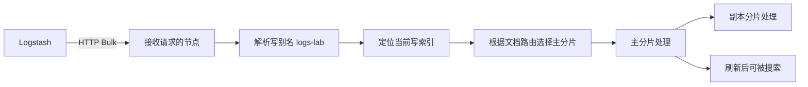
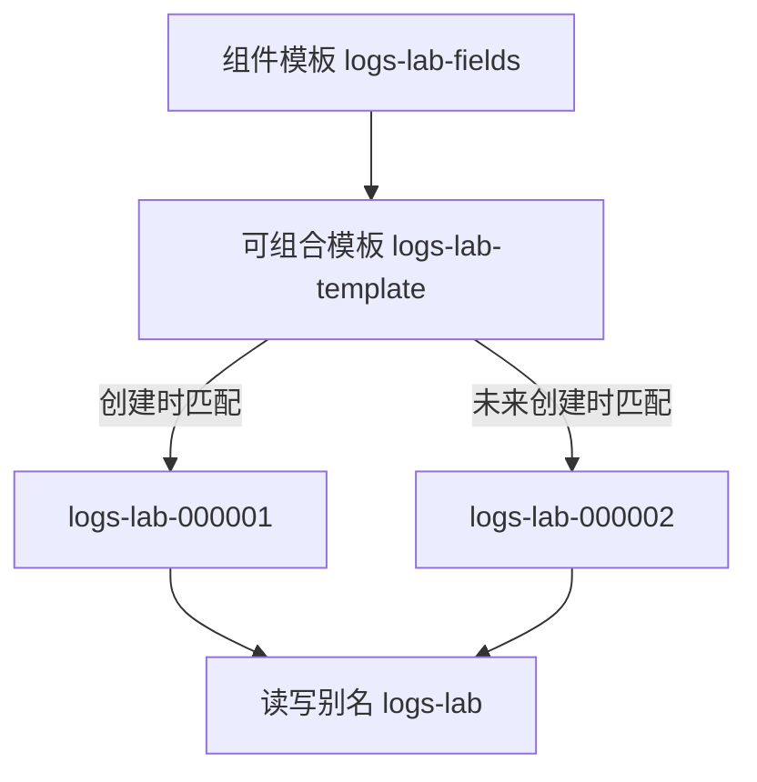
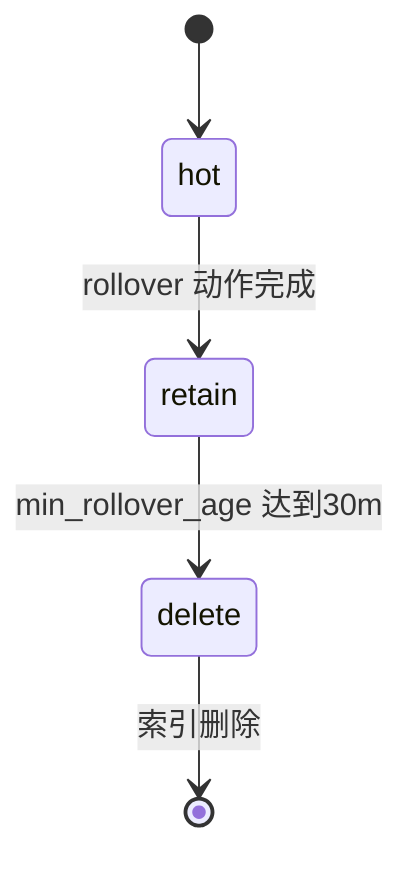
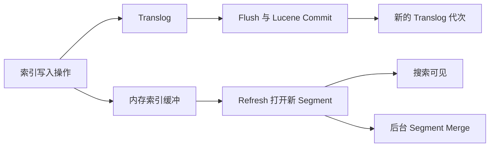
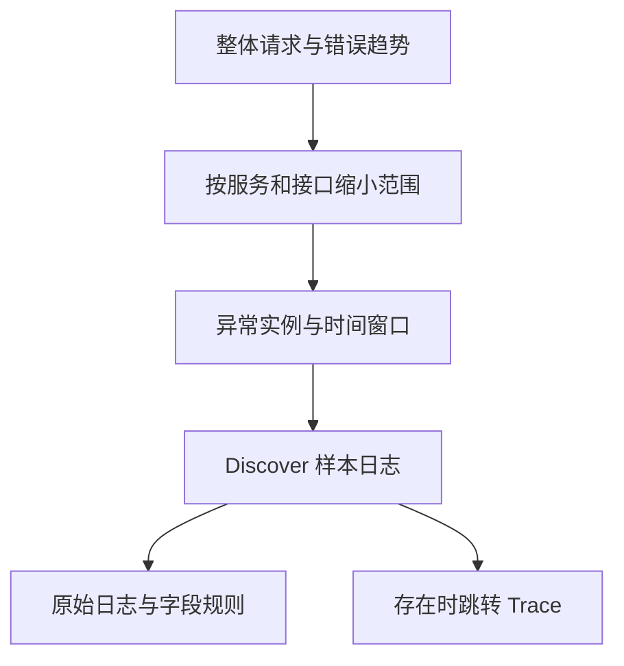

# ELK 与 OpenSearch 日志平台学习笔记 · 第三篇：Elasticsearch 与 OpenSearch 存储、检索及可视化

> 教学基线：Elastic Stack 7.17.29、Kafka 2.8.2 ZooKeeper 模式；双后端对照采用 OpenSearch / Dashboards 2.19.6。固定版本用于教学，不表示生产推荐或联合认证。
> 配置与脚本完整保留在四篇 Markdown；对照实验从[文件索引与提取入口](02-pipeline-and-reliability.md#s-11-1)准备。基础实验和对照实验使用独立目录、端口、数据卷及脚本。
> 验证边界：静态与离线逻辑测试不能替代真实组件、TLS、故障、性能与 UI 验收。具体状态见[专题说明](README.md)。

[返回专题](README.md) · [第1篇](01-log-foundations-and-collection.md) · [第2篇](02-pipeline-and-reliability.md) · [第4篇](04-production-operations-and-troubleshooting.md)

| 章节 | 核心主题 |
| --- | --- |
| 12 | 双后端部署、数据模型与产品识别 |
| 13 | 字段建模与索引结构 |
| 14 | 模板、别名与生命周期治理 |
| 15 | 写入、持久性与性能诊断 |
| 16 | 查询、聚合与稳定导出 |
| 17 | Kibana 与 Dashboards 的检索和看板 |

## 第 12 章 · 双后端部署、数据模型与产品识别

### 12.1 理解集群、节点、索引、文档与健康状态
<a id="s-12-1"></a>

#### 从一条日志理解集群、索引与文档

应用输出 JSON，并不意味着 Elasticsearch 内部保存的就是一个普通 JSON 文件。
请求先到达某个 HTTP 节点，再由节点依据目标索引和路由定位分片。
字段经过 Mapping 处理后，形成可检索、可聚合的数据结构，同时通常保留原始文档的 `_source`。

先将几个对象分开：

| 对象 | 本书示例 | 主要用途 |
| --- | --- | --- |
| Cluster | `elk-lab-full` | 一组共同维护元数据和分片的节点 |
| Node | `es-lab-1` | 一个 Elasticsearch 进程 |
| Index | `logs-lab-000001` | 有独立设置、Mapping 和分片的一组文档 |
| Document | 一条访问日志 | 可以按 ID 写入、读取或删除的数据单位 |
| Alias | `logs-lab` | 给一组索引提供稳定访问名称 |
| Shard | 主分片及副本分片 | 分布式存储和执行查询的基本单位 |

本书使用别名写入：Logstash 不需要每天修改索引名，生命周期管理负责切换写索引。
这只是访问路径，不是另外复制一份日志。
索引、别名和 Data Stream 的正式定义见[索引与文档](https://www.elastic.co/guide/en/elasticsearch/reference/7.17/documents-indices.html)及[别名](https://www.elastic.co/guide/en/elasticsearch/reference/7.17/aliases.html)。



**文档身份不等于业务身份**

ES 的 `_id` 是文档标识；本书的 `event.id` 是业务事件标识字段。
第二篇把后者同时用作输出 `document_id`，方便比较重放结果，但两者仍是不同层面的概念。

一条日志也可能因为字段解析失败进入隔离索引。
因此，“找到某个 event.id”时还要记录 `_index`，否则无法判断正常数据、失败数据或重放数据来自哪个集合。

**查看实验中的实际对象**

```bash
curl -fsS 'http://127.0.0.1:9200/?pretty'
curl -fsS 'http://127.0.0.1:9200/_cat/nodes?v'
curl -fsS 'http://127.0.0.1:9200/_cat/indices/logs-lab-*?v'
curl -fsS 'http://127.0.0.1:9200/_cat/aliases/logs-lab*?v'
```

`_cat` 适合人阅读；脚本应优先用 JSON API 或明确指定 `format=json`，不要依赖空格列位置。
索引名称不是可靠的租户授权机制；权限边界见第四篇。


#### 主分片、副本与路由

主分片决定索引的数据分区，副本提供相应分区的数据副本。
同一分片的主副本不能被分配到同一节点，因此单节点设置一个副本会出现未分配副本。
不能通过增加副本让一台机器变成高可用集群。[分片分配](https://www.elastic.co/guide/en/elasticsearch/reference/7.17/modules-cluster.html)

假设一个索引有 3 个主分片、1 个副本，则共有 6 个分片实例。
这不等于每条日志复制 6 次：每条文档属于其中一个分区，在该分区的主分片和副本各有一份。

| 配置 | 逻辑分区 | 每份文档的常规副本数量 | 主要影响 |
| --- | ---: | ---: | --- |
| 1 主、0 副 | 1 | 1 | 适合单节点实验，缺乏副本冗余 |
| 1 主、1 副 | 1 | 2 | 需要至少两个数据节点才能分配完整 |
| 3 主、1 副 | 3 | 2 | 分布范围和查询扇出都增加 |
| 3 主、2 副 | 3 | 3 | 增加空间、复制和恢复成本 |

这里描述正常副本配置，不包含 Snapshot、重放副本或底层存储自身的复制。

**分片数不是越大越好**

每个分片需要维护一定的内存、文件和调度开销。
很多微小索引会累积大量小分片；一个巨大主分片又可能带来恢复时间和单分片处理压力。
应从数据增长、查询范围和恢复目标反推布局，而不是固定套用“每个索引五个分片”。

本书实验使用 1 主、0 副，目的是降低资源需求，不是生产建议。
生产副本数应结合节点、机架、可用区及故障恢复能力评估。

**默认路由与自定义路由**

默认情况下，文档 ID 参与分片路由。
显式指定 `routing` 可以把相关文档放到同一分区，但之后按 ID 获取、更新或删除时需要保持路由一致。
不要为了“同一个服务集中在一起”就随意引入路由：热点服务可能把一个分片压满。

```bash
curl -fsS 'http://127.0.0.1:9200/_cat/shards/logs-lab-*?v'
curl -fsS 'http://127.0.0.1:9200/logs-lab/_search_shards?pretty'
```

应能把索引、分片编号、主副本标志和节点对应起来。
如果不知道文档落在哪个分区，不影响日常别名查询；但会影响你解释分片不均衡和恢复过程。


#### Green、Yellow、Red 的含义

集群健康颜色反映主副分片是否分配，不是业务请求成功率。[集群健康 API](https://www.elastic.co/guide/en/elasticsearch/reference/7.17/cluster-health.html)

| 状态 | 典型含义 | 需要继续确认 |
| --- | --- | --- |
| Green | 所有主分片和副本已分配 | 写入拒绝、查询延迟、磁盘、积压 |
| Yellow | 主分片可用，但存在未分配副本 | 原因、冗余缺口、恢复资源 |
| Red | 至少一个主分片未分配 | 受影响索引、是否有可恢复副本或快照 |

单节点实验把副本设为 0 可以保持 Green，却没有提高可靠性。
反过来，Yellow 集群也可能仍能处理大部分请求，但不能因此忽略冗余缺口。

```bash
curl -fsS 'http://127.0.0.1:9200/_cluster/health?level=indices&pretty'
curl -fsS 'http://127.0.0.1:9200/_cluster/pending_tasks?pretty'
curl -fsS 'http://127.0.0.1:9200/_cat/recovery?v&active_only=true'
```

**判断输出的顺序**

先看受影响索引，再看是主分片还是副本，随后看节点离线、磁盘水位、分配过滤和恢复进度。
不要只盯住最外层的颜色。
如果没有业务索引而只有一个历史测试索引变红，处理优先级也应基于实际影响范围。


#### 把健康检查变成可复查记录

日常记录至少包括集群 UUID、版本、节点数、主副分片状态、磁盘空间、索引增长和最近一次成功写入时间。
这些数据应在同一时间窗口采集，避免用昨天的磁盘状态解释今天的分配失败。

| 检查 | 证据 | 常见误判 |
| --- | --- | --- |
| 身份 | `/`、`_nodes` | 用错地址却继续操作 |
| 管理状态 | `_cluster/health`、`pending_tasks` | 颜色 Green 就认为全链路正常 |
| 分片 | `_cat/shards`、allocation explain | 所有未分配都归因于磁盘 |
| 数据新鲜度 | 最新 `event.ingested` | Kafka Lag 为零就认为已入库 |
| 数据完整性 | 已知事件 ID 的集合对账 | 只比较总条数，不检查缺失与重复 |

本章练习：找到一个样本事件的 `_index`，解释该索引的主副分片布局，并说明单节点实验损坏数据卷后能靠什么恢复。
如果答案只有“重启容器”，说明还需要继续学习第四篇的备份和恢复。


### 12.2 配置网络、JVM、持久化与系统限制
<a id="s-12-2"></a>

#### HTTP、Transport 与网络边界

客户端常用 HTTP 9200；节点间发现、状态同步和分片复制使用 Transport 9300。
HTTP 连通不能证明节点间网络正常，反过来也一样。[网络设置](https://www.elastic.co/guide/en/elasticsearch/reference/7.17/modules-network.html)

| 流量 | 来源 | 目的地 | 常见错误 |
| --- | --- | --- | --- |
| 写入与查询 | Filebeat、Logstash、Kibana、运维客户端 | ES HTTP 端口 | 认证、HTTP TLS、代理限制 |
| 节点通信 | Elasticsearch 节点 | Transport 端口 | 防火墙、发布地址、证书 SAN |
| 快照访问 | ES 节点 | 共享文件系统或对象存储 | 权限、挂载、凭据 |

绑定地址回答“监听哪里”，发布地址回答“告诉别人通过哪里访问我”。
容器 IP、宿主机 IP、负载均衡地址不能凭名字互换。
对于生产接入，应把节点间通道与用户访问通道分别设计访问控制。

```bash
# Linux 主机上的只读检查。
ss -lntp | grep -E ':9200|:9300'

# 从 ES 获取实际网络信息。
curl -fsS 'http://127.0.0.1:9200/_nodes/http,transport?pretty'
```

当服务通过代理访问时，还要检查请求体大小限制和超时。
Bulk 失败不一定由 ES 本身产生；代理返回的 HTML 错误页与 ES JSON 错误响应应分开记录。


#### JVM、文件系统缓存与系统限制

ES 不只需要 JVM Heap，还需要文件系统缓存、直接内存及其他进程空间。
把容器全部内存分给 Heap 会挤压这些空间。
7.17 提供基于节点角色和可用内存的自动 Heap 配置；手动设置时需要说明测量依据。[Heap 设置](https://www.elastic.co/guide/en/elasticsearch/reference/7.17/important-settings.html#heap-size-settings)

实验为了便于理解显式设置 1 GiB Heap。
生产不要把实验数字照搬到所有节点，也不要在没有 GC、查询和索引数据前给出固定“最佳 Heap”。

**手动配置的写法**

```text
# config/jvm.options.d/heap.options
# 仅为语法示例：数值须按节点内存与实际负载确定。
-Xms4g
-Xmx4g
```

Xms 和 Xmx 应保持一致。
同时检查系统服务或容器是否另外设置了 JVM 环境变量，避免多个配置来源互相覆盖。

**Linux 检查项**

```bash
sysctl vm.max_map_count
ulimit -n
free -h
df -h
df -i
```

[官方系统设置](https://www.elastic.co/guide/en/elasticsearch/reference/7.17/important-system-configuration.html)要求检查虚拟内存映射、文件描述符、交换分区和线程等限制。
`vm.max_map_count` 是宿主内核参数，不是在容器内写一份配置就一定生效。
修改系统限制属于主机变更，需要范围评估和持久化配置。

**内存紧张的区分**

| 现象 | 先收集什么 | 不要立即做什么 |
| --- | --- | --- |
| Heap 长期偏高 | GC、查询、聚合、分片数量 | 直接给到宿主全部内存 |
| 进程 RSS 高 | Heap 与非 Heap、文件映射 | 把全部 RSS 当成内存泄漏 |
| 容器 OOMKilled | cgroup 限制、退出状态、日志 | 只看 ES JVM GC 日志 |
| 查询抖动 | 缓存、磁盘延迟、并发、GC | 用增大 Bulk 解决查询问题 |


#### 数据目录、持久化与维护边界

容器重建和数据删除是不同操作。
第二篇的命名卷用于保持 ES 数据，`docker compose down` 默认不删除卷；加 `-v` 则会删除相应项目卷。
执行删除卷操作前必须明确它是可以重建的实验数据。

**数据目录不是备份接口**

不要在运行中的节点上复制 data 目录后声称获得一致性备份。
Elasticsearch 支持的备份方式是 Snapshot，详细恢复流程见第四篇。[快照与恢复](https://www.elastic.co/guide/en/elasticsearch/reference/7.17/snapshot-restore.html)

不要编辑 Lucene 文件、手工删除 shard 目录或在同一数据目录启动多个节点。
磁盘空间不足应通过受控清理、扩容、迁移或生命周期修复处理，而不是绕过 ES 元数据直接删文件。

**启动失败排查顺序**

```text
容器或服务是否启动
→ 配置语法和变量替换
→ 数据目录与证书权限
→ 端口绑定和名称解析
→ Bootstrap checks
→ 发现与选举
→ 分片恢复
→ 客户端连接
```

```bash
docker compose -p elk-full logs --tail=200 elasticsearch
curl -fsS 'http://127.0.0.1:9200/_nodes/settings?pretty'
```

日志中出现历史警告不等于当前失败原因。
应匹配当前启动时间、节点名称和首个导致退出的异常，不要只截取最后一行。


### 12.3 核对产品身份、API、认证与脚本适用版本
<a id="s-12-3"></a>

自动化工具必须在写入之前确认目标身份，并区分 HTTP 成功与查询结果完整。下面先列产品和脚本边界，再给出共用客户端与显式 API 入口；它们仅对规定的实验产品与集群工作，不是通用生产管理 SDK。

#### 以能力为单位复用，而不是按品牌整体判断

| 本书实际能力 | ES 7.17.29 → OS 2.19.6 | 实验安排 |
| --- | --- | --- |
| `keyword/text/date/integer/long` | 复用共同字段子集 | 同样本写入、精确匹配和聚合 |
| Object / Nested | 概念可复用，Mapping 单独验收 | [相关章节](03-search-storage-and-visualization.md#s-13-1)保留对象关联反例 |
| ES `flattened` | 不直接改成同名；OS 有 `flat_object`，限制不同 | 主模型不用该类型，保留原对象不展开 |
| Index / Component Template | 共同 `_index_template` / `_component_template` 子集 | 独立创建，不搬系统模板 |
| 写别名 | 共同语义 | 显式唯一 `is_write_index` |
| Data Stream | 两边均需时间字段和匹配模板 | 单列实验，不假设插件自动开关相同 |
| Ingest Pipeline | 本书 `set event.ingested` 可分别验证 | `_simulate`、实际写入对照 |
| Bulk | NDJSON 和逐条状态检查可复用 | 插件重试/DLQ 另核对 |
| 生命周期 | ILM 与 ISM 需改写 | [相关章节](03-search-storage-and-visualization.md#s-14-3)、[相关章节](04-production-operations-and-troubleshooting.md#s-19-1) |
| PIT | 创建、关闭端点和响应不同 | 精确适配函数 |
| Dashboards 对象 | 不保证 Kibana 无损导入 | 重建或逐对象测试 |

OpenSearch `flat_object` 不应被当成 Elasticsearch `flattened` 的无条件替换；支持查询、字段访问和限制需要按对应版本逐项看。[OS Flat object](https://docs.opensearch.org/2.19/field-types/supported-field-types/flat-object/)
同样，主实验的 `app.enabled:false` 是保留原始结构但不展开索引，不等价于扁平化搜索字段。


#### 对原脚本的逐项适配

| 原文件/函数 | 已读到的假设 | 新实现或处理 |
| --- | --- | --- |
| `init_es.py` | ES 版本与集群名、ES 初始化资源；重跑可能覆盖模板 | `client.py` 分支身份检查；`init_backend.py` 保留已有受管资源，不隐式覆盖生命周期 |
| `enable_ilm.py` | ILM policy/phases、`index.lifecycle.*` | `lifecycle.py` 分别构造 ILM 和 ISM，独立 `exp-cycle` |
| `export_run.py` | ES PIT 创建、关闭接口；读正常和隔离别名 | 主验收改为有界 Scroll；单索引 PIT 用产品适配函数 |
| `audit_run.py` | 输入是合法 JSONL；重复源 ID 被拒绝 | 新 manifest 记录传输数与唯一事件数，允许声明的同 ID 重放，并检查路由和字段 |
| `probe.py` | 原集群身份、原日志格式、ES 查询 | `probe_v2.py` 走新采集入口，保留产品身份和隔离判定 |

这是适配清单，不是对旧文整体正确性的否定。
旧脚本服务于当时的单产品实验，其中很多限制已经在正文注明。
基础脚本与对照脚本在本书中分别保留，能力差异记录在[合并与验证说明](../../../docs/specs/elk-expansion-integration-notes.md)，不能直接互换。


#### 对照实验完整文件：`tools/client.py`

产品身份、HTTP 与搜索/Bulk 完整性检查。下面是完整文件；保存路径相对于双后端对照实验根目录。

<!-- file: tools/client.py -->
```python
"""隔离实验 HTTP 客户端。身份检查是防误操作，不是安全认证。"""
from __future__ import annotations
import base64
import json
import os
import ssl
from urllib.parse import urlsplit
from urllib.request import Request, build_opener, HTTPHandler, HTTPSHandler, HTTPRedirectHandler
from urllib.error import HTTPError, URLError

VERSIONS = {"es": "7.17.29", "os": "2.19.6"}
URLS = {"es": "http://127.0.0.1:19200", "os": "http://127.0.0.1:29200"}

class NoRedirect(HTTPRedirectHandler):
    def redirect_request(self, req, fp, code, msg, headers, newurl):
        raise RuntimeError("拒绝 HTTP 重定向，避免把实验凭据发送给其他地址")

class Client:
    def __init__(self, backend: str, url: str | None = None, timeout: float = 20):
        if backend not in VERSIONS:
            raise ValueError("backend 仅支持 es/os")
        self.backend, self.base, self.timeout = backend, (url or URLS[backend]).rstrip('/'), timeout
        u = urlsplit(self.base)
        if u.scheme not in ('http', 'https') or not u.hostname or u.username or u.password:
            raise ValueError("URL 必须是无内嵌凭据的 HTTP(S) 地址")
        if u.query or u.fragment or u.path not in ('', '/'):
            raise ValueError("本实验不支持 URL 前缀、查询串或片段")
        self.headers = {"Content-Type": "application/json"}
        user, password = os.getenv('LAB_USER'), os.getenv('LAB_PASSWORD')
        if user or password:
            if not user or not password:
                raise ValueError("LAB_USER 与 LAB_PASSWORD 必须同时设置")
            if u.scheme != 'https' and u.hostname not in ('127.0.0.1', 'localhost', '::1'):
                raise ValueError("非回环地址发送凭据必须使用 HTTPS")
            token = base64.b64encode(f'{user}:{password}'.encode()).decode()
            self.headers['Authorization'] = 'Basic ' + token
        ctx = ssl.create_default_context(cafile=os.getenv('LAB_CA') or None)
        self.opener = build_opener(NoRedirect(), HTTPHandler(), HTTPSHandler(context=ctx))

    def request(self, method: str, path: str, body=None, missing_ok: bool = False):
        if not path.startswith('/') or path.startswith('//'):
            raise ValueError("path 必须是绝对 API 路径")
        headers = self.headers.copy()
        if isinstance(body, bytes):
            payload = body
            headers['Content-Type'] = 'application/x-ndjson'
        else:
            payload = None if body is None else json.dumps(body, ensure_ascii=False, allow_nan=False).encode()
        req = Request(self.base + path, data=payload, method=method, headers=headers)
        try:
            with self.opener.open(req, timeout=self.timeout) as res:
                data = res.read(32 * 1024 * 1024 + 1)
                if len(data) > 32 * 1024 * 1024:
                    raise RuntimeError("响应超过 32MiB；请收窄范围")
                return json.loads(data) if data else {}
        except HTTPError as exc:
            detail = exc.read(8192).decode(errors='replace')
            if missing_ok and exc.code == 404:
                return None
            raise RuntimeError(f'{method} {path}: HTTP {exc.code}: {detail}') from exc
        except (URLError, TimeoutError) as exc:
            raise RuntimeError(f'{method} {path}: 连接失败 {exc}') from exc

    def guard(self):
        info = self.request('GET', '/')
        names = (f'elk-expansion-{self.backend}', f'elk-expansion-ha-{self.backend}')
        if info.get('cluster_name') not in names or info.get('version', {}).get('number') != VERSIONS[self.backend]:
            raise RuntimeError('拒绝操作：集群名称或精确版本与扩展实验不符')
        if self.backend == 'os' and info.get('version', {}).get('distribution') != 'opensearch':
            raise RuntimeError('拒绝操作：没有 OpenSearch distribution 标识')
        if not info.get('cluster_uuid') or info['cluster_uuid'] == '_na_':
            raise RuntimeError('集群尚未形成有效 UUID')
        return info

def complete_search(result: dict):
    shards = result.get('_shards')
    if result.get('timed_out') is not False or not isinstance(shards, dict):
        raise RuntimeError('缺少搜索完整性字段，或查询超时')
    if shards.get('failed', -1) != 0:
        raise RuntimeError('部分分片失败，拒绝把部分结果当作完整结果')
    if result.get('terminated_early') is True:
        raise RuntimeError('搜索提前终止')
    return result

def check_bulk(result: dict, expected: int):
    items = result.get('items')
    if not isinstance(items, list) or len(items) != expected:
        raise RuntimeError('Bulk item 数量与提交数不一致')
    failures = []
    for item in items:
        if not isinstance(item, dict) or len(item) != 1:
            raise RuntimeError('Bulk item 结构错误')
        value = next(iter(item.values()))
        if value.get('status') not in (200, 201) or 'error' in value:
            failures.append(value)
    if failures or result.get('errors') is not False:
        raise RuntimeError('Bulk 有失败条目：' + json.dumps(failures[:5], ensure_ascii=False))
    return result
```


#### 对照实验完整文件：`tools/api.py`

明确实验 API 入口，写操作要求确认。下面是完整文件；保存路径相对于双后端对照实验根目录。

<!-- file: tools/api.py -->
```python
"""记录明确的实验 API；写请求显式 --apply。文本接口保留用 curl 读取。"""
import argparse,json
from pathlib import Path
from client import Client, complete_search
p=argparse.ArgumentParser();p.add_argument('backend',choices=['es','os']);p.add_argument('method',choices=['GET','POST','PUT','DELETE'])
p.add_argument('path');p.add_argument('--url');p.add_argument('--body');p.add_argument('--apply',action='store_true')
a=p.parse_args();c=Client(a.backend,a.url);c.guard()
body=json.loads(Path(a.body).read_text()) if a.body else None
readonly=a.method=='GET' or (a.method=='POST' and (a.path.split('?')[0].endswith(('/_search','/_count','/_analyze','/_explain')) or a.path.split('?')[0]=='/_cluster/allocation/explain'))
if not readonly and not a.apply:
    print(json.dumps({'status':'未执行','method':a.method,'path':a.path,'body':body,'reason':'修改须显式 --apply'},ensure_ascii=False,indent=2))
else:
    r=c.request(a.method,a.path,body)
    if a.path.split('?')[0].endswith('/_search'):complete_search(r)
    print(json.dumps(r,ensure_ascii=False,indent=2))
```


### 12.4 验证存储入口就绪并避免误初始化其他集群
<a id="s-12-4"></a>

基础环境 `elk-full` 与对照环境 `elk-expansion` 的集群名、端口和版本检查各不相同。先验证根响应与健康状态，再使用 [对应初始化实现](03-search-storage-and-visualization.md#s-14-1)。下面保留基础环境检查，并给出对照实验的就绪脚本；就绪不代表数据完整性已经验收。

#### 基础实验：复用实验环境而不是重复创建集群

基础实验的完整 Compose 见 [11.2 节](02-pipeline-and-reliability.md#s-11-2)。
本段基础实验在该目录执行，项目名仍为 `elk-full`，ES 的 `cluster.name` 为 `elk-lab-full`。
第一篇的直连实验应先停止，避免占用相同的本地 9200、5601 端口。

```bash
cd ~/elk-lab-full
docker compose -p elk-full ps
curl -fsS 'http://127.0.0.1:9200/?pretty'
```

预期版本为 `7.17.29`，集群名称为 `elk-lab-full`。
如果输出不一致，不应继续执行本篇的初始化和生命周期修改。

**配置的三个层次**

| 位置 | 管理对象 | 示例 |
| --- | --- | --- |
| `elasticsearch.yml` 或容器环境 | 节点启动行为 | 节点角色、发现、网络、证书路径 |
| 集群设置 API | 可动态调整的集群行为 | 部分分片分配设置 |
| 索引设置、Mapping 和模板 | 数据集合及未来索引 | 副本数、刷新间隔、生命周期 |

“改了配置文件但没有变化”可能是没有重启，也可能该参数由另一个配置来源覆盖。
“修改模板后旧索引没变化”则是对象范围理解错误，不是重启问题。


#### 对照实验完整文件：`tools/wait_ready.py`

后端精确身份与健康检查。下面是完整文件；保存路径相对于双后端对照实验根目录。

<!-- file: tools/wait_ready.py -->
```python
"""检测集群身份与分片健康；不是完整业务验收。"""
import argparse,json,time
from client import Client
p=argparse.ArgumentParser();p.add_argument('backend',choices=['es','os']);p.add_argument('--url')
p.add_argument('--seconds',type=int,default=180);a=p.parse_args()
if not 1<=a.seconds<=600:p.error('seconds 需要 1..600')
c=Client(a.backend,a.url,timeout=5);deadline=time.monotonic()+a.seconds;error=None
while time.monotonic()<deadline:
    try:
        info=c.guard();health=c.request('GET','/_cluster/health')
        if health.get('status') not in ('green','yellow') or health.get('timed_out'):raise RuntimeError('健康状态未达到 yellow')
        print(json.dumps({'identity':info,'health':health},ensure_ascii=False));break
    except (RuntimeError,ValueError) as exc:error=str(exc);time.sleep(1)
else:raise SystemExit('后端未就绪: '+str(error))
```


## 第 13 章 · 字段建模与索引结构

### 13.1 根据检索用途选择 text、keyword 与分析器
<a id="s-13-1"></a>

#### 先约定字段语义，再决定类型

第二篇把日志规范化为 ECS 风格字段，但并不声称完整实现全部 ECS。
核心目的是让同一个字段在不同服务中拥有相同类型、单位和含义。

| 字段 | 本书类型 | 含义 |
| --- | --- | --- |
| `@timestamp` | date | 经过校验的业务事件时间 |
| `event.created` | date | Filebeat 事件创建时间 |
| `event.ingested` | date | ES 接入时间 |
| `http.response.status_code` | integer | 访问响应状态 |
| `event.duration` | long | 纳秒单位耗时 |
| `service.name` | keyword | 服务身份 |
| `trace.id` | keyword | Trace 标识 |
| `message` | text | 可全文检索的消息文本 |
| `event.original` | text，关闭索引 | 原始文本，仅保留用于复查 |
| `app` | object，关闭解析 | 原始解析对象，不进入动态 Mapping |

选择 `long` 保存纳秒是有意保留单位约定；可视化时再换算成毫秒。
把一个服务的毫秒和另一个服务的秒写入同名字段，即使都能成功入库，也会得到错误的聚合结果。
字段模型参见[Mapping](https://www.elastic.co/guide/en/elasticsearch/reference/7.17/mapping.html)与[字段类型](https://www.elastic.co/guide/en/elasticsearch/reference/7.17/mapping-types.html)。

**查询当前实际类型**

```bash
curl -fsS 'http://127.0.0.1:9200/logs-lab/_mapping?pretty'
curl -fsS 'http://127.0.0.1:9200/logs-lab/_field_caps?fields=http.response.status_code,event.duration,service.name&pretty'
```

`_field_caps` 对跨索引类型检查尤其有用。
别名覆盖多个索引时，最新索引正确不代表历史索引也正确。


#### Text、Keyword 与多字段

`text` 会按分析器处理，用于全文检索；`keyword` 保留适合精确匹配、排序和聚合的值。[Text](https://www.elastic.co/guide/en/elasticsearch/reference/7.17/text.html)、[Keyword](https://www.elastic.co/guide/en/elasticsearch/reference/7.17/keyword.html)

服务名、环境、Trace ID 和枚举状态通常需要精确匹配。
异常消息需要全文检索，但不应把完整堆栈当成无限增长的聚合维度。

**独立的字段实验**

下面创建一个与主链路隔离的测试索引。
示例只用于观察类型，不配置 ILM，不长期写入。

```bash
curl -fsS -X PUT 'http://127.0.0.1:9200/lab-mapping-demo' \
  -H 'Content-Type: application/json' --data-binary @- <<'JSON'
{
  "settings": {"number_of_shards": 1, "number_of_replicas": 0},
  "mappings": {
    "properties": {
      "message": {
        "type": "text",
        "fields": {"raw": {"type": "keyword", "ignore_above": 256}}
      },
      "service": {"type": "keyword"},
      "status": {"type": "integer"}
    }
  }
}
JSON
```

```bash
curl -fsS -X PUT 'http://127.0.0.1:9200/lab-mapping-demo/_doc/1?refresh=wait_for' \
  -H 'Content-Type: application/json' --data-binary @- <<'JSON'
{"message":"Inventory service timeout","service":"orders-api","status":504}
JSON
```

查询“包含 timeout 的消息”使用全文查询。
按完整原消息精确匹配则使用 `message.raw`。
本书主链路并未给所有字段创建 `.keyword` 子字段，因此不能习惯性给每个字段加 `.keyword`。

```json
{
  "query": {
    "match": {
      "message": "timeout"
    }
  }
}
```

```json
{
  "query": {
    "term": {
      "service": "orders-api"
    }
  }
}
```

**`ignore_above` 不是截断 `_source`**

Keyword 长度超过限制时，值可能仍在 `_source` 中，但不进入该字段的索引结构。
因此在页面上看得见文本，不代表可以按这个字段聚合或精确查询。
不要把 `ignore_above` 当作脱敏或删除敏感信息的功能。


#### 先问字段如何使用

平台为了“以后可能用到”把所有字段都设为 text 加 keyword，多次复制大段原文，并动态展开所有 JSON 键。
结果常见不是单一慢查询，而是写入、存储、映射管理和查询同时变重。
优化起点应是字段需求清单，而不是立即提高 Heap 或批量大小。

| 字段 | 本书需求 | 选择 |
| --- | --- | --- |
| `service.name`、`event.id` | 精确过滤、排序或分组 | keyword |
| `message` | 人读与全文检索 | text，不默认再复制超长 keyword |
| `event.original` | 回查原始证据 | 保留但不全文索引 |
| `event.duration` | 数字范围与分位数 | long，单位纳秒 |
| `http.response.status_code` | 数字范围与分组 | integer |
| `app` | 保存未知原始结构 | enabled:false；不承诺任意键检索 |
| `route` | 受控路由模板聚合 | keyword，不直接用无限变化的原始 URL |

[对照实验字段模型](03-search-storage-and-visualization.md#s-13-4)定义共同字段子集，具体产品差异仍需逐项验证。
这套模型是教学子集，不自称完全实现 ECS；业务扩展字段仍需评审类型、单位、敏感性与索引成本。


### 13.2 解释倒排索引、doc values、source 与 segment 成本
<a id="s-13-2"></a>

#### 倒排索引、doc values 与 `_source`

倒排索引按词项找到文档，适合搜索和过滤；text 经过分析器后存储词项，keyword 更适合精确值。
doc values 是面向文档值访问的列式结构，常用于排序和聚合。
`_source` 保存原文表示，方便返回、重建和排查；它不是所有字段搜索都直接扫描的唯一材料。[ES doc values](https://www.elastic.co/guide/en/elasticsearch/reference/7.17/doc-values.html) [ES source](https://www.elastic.co/guide/en/elasticsearch/reference/7.17/mapping-source-field.html)

删除 `_source` 可能节约某些空间，却影响重建、调试与更新等能力。
关闭某字段索引也不等于它从 `_source` 消失。
必须逐项解释能力变化，不能把“少占磁盘”作为唯一目标。

**分析器实验**

```http
POST /exp-logs-000001/_analyze
{"analyzer":"standard","text":"InventoryTimeout order-1001"}
POST /exp-logs-000001/_analyze
{"analyzer":"keyword","text":"InventoryTimeout order-1001"}
```

比较 tokens 而不是只看 API 是否成功。
精确 ID 搜索不要依赖 text 的分词结果；也不要把 `term` 查询用于期待自动分词的全文输入。


#### Segment 与删除文档

Lucene segment 具有不可变数据结构的特点，更新和删除会产生后续合并工作。
观察 `docs.deleted` 增长不意味着磁盘会立即下降，也不意味着可以无成本强制合并。
本书重复 ID 实验采用 index action，观察覆盖语义时也要注意旧 segment 的回收时机。

小 shard 很多会增加管理和查询开销；单 shard 太大又可能拉长恢复时间和形成热点。
合适规模依赖数据、查询和故障恢复目标，本书不给脱离环境的统一“最佳 GB”。


### 13.3 避免对象关联错误、动态字段膨胀和高基数失控
<a id="s-13-3"></a>

#### Object、Nested 与 Flattened

JSON 对象只是输入表示。
普通 Object 数组的字段可能被展开，若需要保留数组中同一个对象内部的字段配对关系，应理解 Nested 的语义与查询成本。[Object](https://www.elastic.co/guide/en/elasticsearch/reference/7.17/object.html)、[Nested](https://www.elastic.co/guide/en/elasticsearch/reference/7.17/nested.html)

例如：

```json
{
  "upstreams": [
    {"name": "inventory", "status": 500},
    {"name": "payment", "status": 200}
  ]
}
```

业务问题是“inventory 是否返回了 200”。
不能把“某个对象有 name=inventory”和“另一个对象有 status=200”当成同一个上游满足条件。
日志平台应优先把常用统计字段设计清楚，而不是无条件把所有对象数组变成 Nested。

| 选择 | 适合场景 | 代价或边界 |
| --- | --- | --- |
| Object | 固定结构的单个对象 | 对象数组的关联语义需注意 |
| Nested | 查询要求保留对象数组的配对关系 | 额外文档及查询成本 |
| Flattened | 键集合不稳定、需要有限检索的属性包 | 叶子值按关键字式语义处理，不能代替数值字段 |
| `enabled: false` | 保留原始对象供复查 | 对象内部不解析、不可按内部字段检索 |

[Flattened](https://www.elastic.co/guide/en/elasticsearch/reference/7.17/flattened.html)可以减少动态键造成的 Mapping 膨胀，但不是无成本保存任意业务结构的通用方案。
需要范围查询和数值聚合的字段应单独规范化。

**第二篇为什么关闭 app 的解析**

`app` 保存输入 JSON，可能包含服务自定义字段、嵌套对象和错误类型。
经过校验的核心字段复制到规范位置后，原始 `app` 只用来复查。
这能避免一个新业务随意增加几千个动态字段进入集群元数据。

它也意味着不能直接在 Kibana 中筛选 `app.status`。
要使用规范字段 `http.response.status_code`，或在修订字段契约后增加明确 Mapping。


#### Dynamic、Strict、Null 与错误容忍

动态映射方便接入，但第一条出现的值可能影响字段类型。
后续不同类型的值到来时，不会自动变成正确的统一模型。[动态映射](https://www.elastic.co/guide/en/elasticsearch/reference/7.17/dynamic.html)

| 设置 | 遇到未声明字段 | 使用建议 |
| --- | --- | --- |
| `dynamic: true` | 尝试动态增加 Mapping | 小规模探索需监控字段增长 |
| `dynamic: false` | 不为新字段建立 Mapping，通常仍保留 `_source` | 本书规范化主链路的选择 |
| `dynamic: strict` | 拒绝含未知字段的文档 | 适合强契约，但必须有失败处理 |

`dynamic: false` 不会阻止已声明字段的类型错误。
例如状态码已经是 integer，输入一个对象仍可能失败。
它也不等于 `enabled: false`：前者仍解析已声明属性，后者跳过整个对象内容。

**缺失不等于零**

下面三种输入表达不同状态：

```json
{"request_time": 0}
```

```json
{"request_time": null}
```

```json
{}
```

第一种有明确零值；后两种一般没有可用于耗时聚合的观测值。
`null_value` 是索引层替代值选项，不会自动把 `_source` 改成新值，也不能替代日志清洗规则。[Null value](https://www.elastic.co/guide/en/elasticsearch/reference/7.17/null-value.html)

**谨慎使用 ignore_malformed**

部分字段支持跳过格式错误值，让整条文档继续入库。
这样做需要同时监控 `_ignored` 或相应质量指标，不能把字段丢失隐藏掉。[Ignore malformed](https://www.elastic.co/guide/en/elasticsearch/reference/7.17/ignore-malformed.html)

本书主链路优先显式校验，失败进入隔离别名。
这样你能看到失败原因、原值和 Kafka 位置，而不是在统计结果偏低时才发现字段没被索引。


#### 字段数量与成本治理

动态字段爆炸经常来自把请求参数、用户 ID 或任意标签直接变成 JSON 键。
例如 `headers.<任意头名>` 和 `metrics.<任意业务编码>` 可能不断制造新字段。
不应第一反应就提高 `index.mapping.total_fields.limit`。[Mapping 限制](https://www.elastic.co/guide/en/elasticsearch/reference/7.17/mapping-settings-limit.html)

| 问题 | 更合适的处理方向 |
| --- | --- |
| 任意键需要保存但不查询 | 原始对象关闭解析 |
| 少量键需要统计 | 提取白名单字段 |
| 不稳定属性包需要有限检索 | 评估 Flattened |
| 同一字段承载多种单位 | 拆分字段或先转换到统一单位 |
| 完整 URL 用作聚合维度 | 另存规范化路由或路径模板 |
| Trace ID 做仪表盘 Top 列表 | 改为定位入口，不作为常规高基数聚合 |

字段治理应记录所有者、含义、类型、单位、允许值和版本。
业务字段新增时同时准备样本、Mapping 修改、查询验证和回滚策略。
“数据能写入”只完成了字段治理的一部分。


#### 多字段、动态字段与高基数

同一个值既以 text 又以 keyword 保存，适合同时需要全文和精确分组的有限字段。
但把完整堆栈、原始 JSON、长 URL 都复制多字段，会增加没有明确用途的存储和索引工作。
高基数不代表 keyword 不能使用，而是要考虑 Terms 返回规模、global ordinals、内存和查询成本。

[混合负载生成器](04-production-operations-and-troubleshooting.md#s-20-3)固定随机种子，wide 模型把 `app.debug_N` 展开，并让原文具备额外可检索字段。
lean 模型保留原对象但不展开，删除不需要的多字段。
两者只比较共同仍支持的查询，不能把 lean 无法回答的问题藏起来。

| 对照 | 需要固定 | 不能据此宣称 |
| --- | --- | --- |
| wide vs lean | 文档集合、分片、副本、写入方式 | 所有业务都应关闭动态字段 |
| 原始 URL vs route | 路由归一化规则与语义 | 不同真实路由都能合并 |
| text+keyword vs text | 精确查询是否确实需要 | 多字段永远无价值 |
| 索引前解析 vs 查询脚本 | 保存字段类型和更新频率 | 预计算必然更省资源 |


#### Object 与 Nested 的关联陷阱

数组中每个对象的字段关联，不能仅靠普通 object 字段的扁平索引推断。
例如两项分别是 `{name:a,status:200}`、`{name:b,status:500}`，普通对象查询可能匹配“name=a 且 status=500”，即使没有单项满足两者。[ES Nested](https://www.elastic.co/guide/en/elasticsearch/reference/7.17/nested.html)

```http
PUT /exp-object-demo
{
  "mappings":{"properties":{
    "checks":{"type":"nested","properties":{
      "name":{"type":"keyword"},"status":{"type":"integer"}
    }}
  }}
}
PUT /exp-object-demo/_doc/1?refresh=wait_for
{"checks":[{"name":"a","status":200},{"name":"b","status":500}]}
POST /exp-object-demo/_search
{
  "query":{"nested":{"path":"checks","query":{"bool":{"filter":[
    {"term":{"checks.name":"a"}},
    {"term":{"checks.status":500}}
  ]}}}}
}
```

预期不命中，需在两个产品分别执行验证。
Nested 增加内部文档和查询开销，应只用于确实要保留对象关联的字段。
日志中大多数原始上下文不需要默认全部转 Nested。


### 13.4 用字段契约修复类型冲突并验证两产品差异
<a id="s-13-4"></a>

字段类型冲突通常需要明确的新索引和迁移路径，不能靠修改模板追溯修复所有旧数据。对照实验的 `tools/model.py` 定义共同字段子集；应先比较它与实际来源的需求，再初始化两种后端，不把该子集描述为所有字段完全兼容。

#### 类型冲突的修复路径

把已有字段从 keyword 改成 long，一般不能通过简单更新 Mapping 原地完成。
正确方向是新建符合目标模型的索引或新一代索引，在验证转换后迁移或重新写入。[更新 Mapping](https://www.elastic.co/guide/en/elasticsearch/reference/7.17/indices-put-mapping.html)

```text
发现类型冲突
→ 确认影响哪些索引
→ 确认期望语义和转换规则
→ 修复采集或加工规则
→ 创建正确模板及新目标索引
→ 小样本写入验证
→ 有界 Reindex 或 Kafka 回放
→ 对账后切换查询入口
```

Reindex 复制文档，不会自动修复错误业务语义。
把字符串 `"-"` 强制转换成数值之前，仍要决定它代表缺失还是零。

**仅查看字段冲突范围**

```bash
curl -fsS 'http://127.0.0.1:9200/logs-lab-*/_field_caps?fields=http.response.status_code,event.duration&pretty'
```

这个通配符包括隔离索引，是为了排查全部相关资源。
正式统计应使用准确的正常别名，避免把隔离数据算进请求分母。

**迁移实验的基本约束**

源索引和目标索引不能同名。
目标模板必须先验证；转换脚本必须有异常分支；迁移任务必须限制并发和范围。
仍在增长的源数据需要明确切换窗口，否则一次 Reindex 完成并不代表之后的写入也被同步。


#### 对照实验完整文件：`tools/model.py`

共同字段定义，不冒充所有字段兼容。下面是完整文件；保存路径相对于双后端对照实验根目录。

<!-- file: tools/model.py -->
```python
"""两产品共同支持的教学字段子集，不声称覆盖完整 ECS。"""
from __future__ import annotations

def properties():
    keyword = lambda: {'type': 'keyword'}
    return {
        '@timestamp': {'type': 'date'}, 'message': {'type': 'text'},
        'app': {'type': 'object', 'enabled': False}, 'tags': keyword(),
        'service': {'properties': {'name': keyword(), 'environment': keyword()}},
        'event': {'properties': {
            'id': keyword(), 'dataset': keyword(), 'created': {'type': 'date'},
            'ingested': {'type': 'date'}, 'duration': {'type': 'long'},
            'original': {'type': 'text', 'index': False}, 'outcome': keyword()}},
        'http': {'properties': {'response': {'properties': {'status_code': {'type': 'integer'}}},
                                'request': {'properties': {'method': keyword()}}}},
        'url': {'properties': {'original': {'type': 'keyword', 'ignore_above': 2048}}},
        'route': {'type': 'keyword'}, 'trace': {'properties': {'id': keyword()}},
        'log': {'properties': {'level': keyword()}},
        'error': {'properties': {'type': keyword()}},
        'labels': {'properties': {'run_id': keyword(), 'scenario': keyword(), 'sequence': {'type': 'long'}}},
        'pipeline': {'properties': {'version': keyword(), 'errors': keyword(), 'route': keyword()}},
        'kafka': {'properties': {'topic': keyword(), 'partition': {'type': 'integer'}, 'offset': {'type': 'long'}}},
    }

def component():
    return {'_meta': {'owner': 'elk-expansion', 'schema': 2},
            'template': {'mappings': {'dynamic': False, 'properties': properties()}}}

def template(alias: str, replicas: int = 0):
    return {'index_patterns': [alias + '-*'], 'priority': 700,
            'composed_of': ['exp-fields-v2'],
            '_meta': {'owner': 'elk-expansion', 'schema': 2},
            'template': {'settings': {'number_of_shards': 1, 'number_of_replicas': replicas,
                                       'index.default_pipeline': 'exp-ingested'}}}

INGEST = {'description': 'elk-expansion ingress timestamp; not search visibility time',
          'processors': [{'set': {'field': 'event.ingested', 'value': '{{{_ingest.timestamp}}}'}}]}
```


## 第 14 章 · 模板、别名与生命周期治理

### 14.1 建立组件模板、索引模板和写别名的初始化顺序
<a id="s-14-1"></a>

模板、写别名和 Ingest Pipeline 必须在采集启动前准备。基础实验使用 `scripts/init_es.py`；对照实验使用 `tools/init_backend.py`，依赖 [共用客户端](03-search-storage-and-visualization.md#s-12-3) 和 [字段模型](03-search-storage-and-visualization.md#s-13-4)。以下分别保留实现，禁止跨实验目录混用或为了通过检查而删除身份保护。

#### 模板只影响匹配的新索引

模板描述新索引创建时应应用的设置和 Mapping。
组件模板提供可复用片段，可组合模板把它们和索引名称模式连接起来。[索引模板](https://www.elastic.co/guide/en/elasticsearch/reference/7.17/index-templates.html)



修改 `logs-lab-fields` 后，已经存在的 `logs-lab-000001` 不会自动改变全部 Mapping。
模板不是把每个索引实时绑定到同一配置对象的动态引用。

| API | 对象 | 主要用途 |
| --- | --- | --- |
| `_component_template` | 组件模板 | 公共字段、公共设置 |
| `_index_template` | 可组合模板 | 名称模式、优先级、组件组合 |
| `_template` | Legacy Template | 维护旧部署，需要区分规则 |
| `index/_mapping` | 已有索引 Mapping | 查看及允许范围内的更新 |
| `index/_settings` | 已有索引设置 | 查看及调整可变设置 |

旧模板的 `order` 与可组合模板的 `priority` 不要混为一谈。
可组合模板匹配时按优先级选择，不是把所有同名模式的模板任意相加。
同一选中模板中的组件组合顺序和最终模板内容也会影响结果。


#### 基础实验：初始化模板、别名与入库时间 Pipeline

保存下面脚本为 `scripts/init_es.py`。
它只允许操作 `cluster_name=elk-lab-full` 且版本为 7.17.29 的实验集群，避免误把教程初始化请求发到其他集群。
脚本创建字段组件模板、正常/隔离索引模板、写别名和 Ingest Pipeline，不删除现有文档。

```python
#!/usr/bin/env python3
"""初始化基础链路的隔离 ES 实验资源；只允许 elk-lab-full 集群。"""
from __future__ import annotations

import argparse
import json
import sys
from urllib.error import HTTPError, URLError
from urllib.request import Request, urlopen


def request(base: str, method: str, path: str, body=None, allow_404=False):
    payload = None if body is None else json.dumps(body).encode("utf-8")
    req = Request(base + path, data=payload, method=method,
                  headers={"Content-Type": "application/json"})
    try:
        with urlopen(req, timeout=20) as response:
            data = response.read()
            return json.loads(data) if data else {}
    except HTTPError as exc:
        detail = exc.read().decode("utf-8", errors="replace")
        if allow_404 and exc.code == 404:
            return None
        raise RuntimeError(f"{method} {path}: HTTP {exc.code}: {detail}") from exc
    except URLError as exc:
        raise RuntimeError(f"连接失败：{exc.reason}") from exc


def main() -> int:
    parser = argparse.ArgumentParser()
    parser.add_argument("--url", default="http://127.0.0.1:9200")
    args = parser.parse_args()
    base = args.url.rstrip("/")
    try:
        info = request(base, "GET", "/")
        if info.get("cluster_name") != "elk-lab-full":
            raise RuntimeError("拒绝修改：目标 cluster_name 不是 elk-lab-full")
        version = info.get("version", {}).get("number", "")
        if version != "7.17.29":
            raise RuntimeError(f"拒绝修改：预期 7.17.29，实际 {version}")

        properties = {
            "@timestamp": {"type": "date"},
            "message": {"type": "text"},
            "tags": {"type": "keyword"},
            "app": {"type": "object", "enabled": False},
            "service": {"properties": {
                "name": {"type": "keyword"},
                "environment": {"type": "keyword"}}},
            "event": {"properties": {
                "id": {"type": "keyword"},
                "dataset": {"type": "keyword"},
                "created": {"type": "date"},
                "ingested": {"type": "date"},
                "duration": {"type": "long"},
                "outcome": {"type": "keyword"},
                "original": {"type": "text", "index": False}}},
            "http": {"properties": {
                "response": {"properties": {"status_code": {"type": "integer"}}},
                "request": {"properties": {"method": {"type": "keyword"}}}}},
            "url": {"properties": {
                "original": {"type": "keyword", "ignore_above": 2048}}},
            "trace": {"properties": {"id": {"type": "keyword"}}},
            "log": {"properties": {
                "level": {"type": "keyword"},
                "file": {"properties": {"path": {"type": "keyword"}}}}},
            "labels": {"properties": {
                "run_id": {"type": "keyword"},
                "scenario": {"type": "keyword"},
                "sequence": {"type": "long"}}},
            "pipeline": {"properties": {
                "version": {"type": "keyword"},
                "source_cluster": {"type": "keyword"},
                "errors": {"type": "keyword"}}},
            "kafka": {"properties": {
                "topic": {"type": "keyword"},
                "partition": {"type": "integer"},
                "offset": {"type": "long"}}},
            "nginx": {"properties": {
                "upstream_status_raw": {"type": "keyword", "ignore_above": 2048},
                "upstream_response_time_raw": {"type": "keyword", "ignore_above": 2048}}},
            "host": {"properties": {"name": {"type": "keyword"}}},
            "agent": {"properties": {
                "type": {"type": "keyword"},
                "version": {"type": "keyword"}}},
            "container": {"properties": {"id": {"type": "keyword"}}},
            "kubernetes": {"properties": {
                "namespace": {"type": "keyword"},
                "pod": {"properties": {
                    "name": {"type": "keyword"}, "uid": {"type": "keyword"}}},
                "node": {"properties": {"name": {"type": "keyword"}}}}},
            "orchestrator": {"properties": {
                "cluster": {"properties": {"name": {"type": "keyword"}}}}},
        }
        request(base, "PUT", "/_ingest/pipeline/logs-lab-ingested", {
            "description": "教学：记录 ES ingest 接收时间，不等于搜索可见时间",
            "processors": [{"set": {"field": "event.ingested",
                                     "value": "{{{_ingest.timestamp}}}"}}],
        })
        request(base, "PUT", "/_component_template/logs-lab-fields", {
            "template": {"mappings": {"dynamic": False, "properties": properties}},
            "_meta": {"owner": "elk-learning-lab", "schema_version": 1},
        })
        for alias, priority in [("logs-lab", 500), ("logs-lab-quarantine", 510)]:
            request(base, "PUT", f"/_index_template/{alias}-template", {
                "index_patterns": [f"{alias}-*"],
                "priority": priority,
                "composed_of": ["logs-lab-fields"],
                "template": {"settings": {
                    "number_of_shards": 1,
                    "number_of_replicas": 0,
                }},
                "_meta": {"owner": "elk-learning-lab"},
            })
            current = request(base, "GET", f"/_alias/{alias}", allow_404=True)
            if current is None:
                request(base, "PUT", f"/{alias}-000001", {
                    "aliases": {alias: {"is_write_index": True}},
                })
                print(f"created alias {alias}")
            else:
                print(f"kept existing alias {alias}; no index data changed")
        print("初始化完成。此阶段尚未添加 ILM 自动保留，在生命周期治理小节启用。")
        return 0
    except (RuntimeError, ValueError) as exc:
        print(str(exc), file=sys.stderr)
        return 1


if __name__ == "__main__":
    raise SystemExit(main())
```

**为什么同一组件模板配两个模板？**

正常和隔离路径共享多数可查询字段，但索引范围不同。
`logs-lab-*` 也能匹配 `logs-lab-quarantine-*`，因此隔离模板使用更高 priority，避免选择歧义。
本节后续用 simulate API 验证实际命中的模板，而不是只凭文件名判断。[索引模板](https://www.elastic.co/guide/en/elasticsearch/reference/7.17/index-templates.html)

`app` 设置 `enabled: false`，用于保存解析前业务对象而不为其中任意键建立 Mapping。
规范化字段独立索引。这样可以降低坏字段再次破坏隔离记录的概率，但不能防止磁盘满、集群故障或所有可能的数据问题。
隔离路径自身仍需监控与恢复方案。

**初始化后的阶段边界**

这个初始化脚本只建立别名与模板，还没有启用自动 ILM 保留。
因此“主链路能跑通”不等于“日志会按天自动清理”。
策略、模板设置和已有首个索引绑定见 [14.3 节](03-search-storage-and-visualization.md#s-14-3)。


#### 检查基础实验已经创建的模板

本节前面的基础初始化脚本建立了一个字段组件模板和两个索引模板。
正常索引优先级 500，隔离索引优先级 510。
隔离索引名称也匹配宽泛的 `logs-lab-*`，因此需要更具体的模板及更高优先级。

```bash
curl -fsS 'http://127.0.0.1:9200/_component_template/logs-lab-fields?pretty'
curl -fsS 'http://127.0.0.1:9200/_index_template/logs-lab-template?pretty'
curl -fsS 'http://127.0.0.1:9200/_index_template/logs-lab-quarantine-template?pretty'
```

**创建前模拟**

```bash
curl -fsS -X POST \
  'http://127.0.0.1:9200/_index_template/_simulate_index/logs-lab-000002?pretty'

curl -fsS -X POST \
  'http://127.0.0.1:9200/_index_template/_simulate_index/logs-lab-quarantine-000002?pretty'
```

检查最终 Mapping、分片数、副本数，以及[相关章节](03-search-storage-and-visualization.md#s-14-3)启用后将出现的生命周期设置。
模拟不会创建实际索引，是模板变更前的重要验证工具。[模板模拟](https://www.elastic.co/guide/en/elasticsearch/reference/7.17/indices-simulate-index.html)

**覆盖旧模板的风险**

`PUT _index_template/name` 提交的是目标模板内容，不是一个任意深度的局部补丁。
只提交生命周期字段而漏掉原 `composed_of`，可能把字段契约从未来索引中移除。
更新前先保存旧 JSON，修改完整对象，再做模拟。

本节 `init_es.py` 是基础实验引导脚本，不是配置合并器。
在启用 ILM 或添加新组件后再次运行它，会重新写入初始模板；后续应使用配置管理保存的最终版本。


#### 读别名、写别名与真实索引

别名可以指向多个索引，但一组多索引别名的写入目标必须明确。
本书给当前写索引设置 `is_write_index: true`。[别名写索引](https://www.elastic.co/guide/en/elasticsearch/reference/7.17/aliases.html)

```bash
curl -fsS 'http://127.0.0.1:9200/_alias/logs-lab?pretty'
curl -fsS 'http://127.0.0.1:9200/_alias/logs-lab-quarantine?pretty'
```

预期至少能看到各自的初始索引和写索引标记。
已经完成 Rollover 时，别名可能关联多代索引，只有当前一代用于新写入。

**为什么不用宽泛通配符写入**

查询通配符表示选一组索引；写入必须有明确目标。
拼写错误的别名还可能在自动建索引允许时被当作新索引名，绕开既定生命周期。

直接调用写入 API 时，可以使用受支持的 `require_alias` 选项要求目标是别名。
不要据此假设固定版本 Logstash output 自动设置了同样的选项；插件能力必须单独确认。[Bulk API](https://www.elastic.co/guide/en/elasticsearch/reference/7.17/docs-bulk.html)

**原子切换的范围**

`_aliases` 支持在同一次请求中执行多个别名动作。
这能避免客户端观察到“先删除旧别名、再添加新别名”的中间状态。
但它不负责把切换前后正在执行的所有写入做成跨系统事务。


#### 独立别名切换实验

这个实验只使用 `lab-alias-demo-*`，不改主日志链路。
先创建两个索引，再设置初始写目标。

```bash
for n in 1 2; do
  curl -fsS -X PUT "http://127.0.0.1:9200/lab-alias-demo-${n}" \
    -H 'Content-Type: application/json' \
    -d '{"settings":{"number_of_shards":1,"number_of_replicas":0}}'
done

curl -fsS -X POST 'http://127.0.0.1:9200/_aliases' \
  -H 'Content-Type: application/json' --data-binary @- <<'JSON'
{
  "actions": [
    {"add": {"index": "lab-alias-demo-1", "alias": "lab-alias-demo", "is_write_index": true}}
  ]
}
JSON
```

通过别名写入第一条样本：

```bash
curl -fsS -X PUT \
  'http://127.0.0.1:9200/lab-alias-demo/_doc/before?require_alias=true&refresh=wait_for' \
  -H 'Content-Type: application/json' -d '{"message":"before switch"}'
```

一次请求切换写目标，同时保持两个索引都在读别名中：

```bash
curl -fsS -X POST 'http://127.0.0.1:9200/_aliases' \
  -H 'Content-Type: application/json' --data-binary @- <<'JSON'
{
  "actions": [
    {"add": {"index": "lab-alias-demo-1", "alias": "lab-alias-demo", "is_write_index": false}},
    {"add": {"index": "lab-alias-demo-2", "alias": "lab-alias-demo", "is_write_index": true}}
  ]
}
JSON

curl -fsS -X PUT \
  'http://127.0.0.1:9200/lab-alias-demo/_doc/after?require_alias=true&refresh=wait_for' \
  -H 'Content-Type: application/json' -d '{"message":"after switch"}'

curl -fsS 'http://127.0.0.1:9200/lab-alias-demo/_search?pretty'
```

验收应比较每条命中的 `_index`，不只是看两条消息都存在。
别名切换后，旧索引仍然可以被直接写入；业务约束、权限或只读设置需要另外管理。


#### 初始化顺序与配置所有权

本书由脚本和运维 API 管理模板、别名、ILM，Logstash output 关闭自动模板与自动 ILM 管理。
不要再同时运行一套会写入同名模板的 Filebeat setup 或其他自动初始化任务。

```text
版本与插件核对
→ 字段契约
→ Ingest Pipeline
→ Component Template
→ Index Template
→ 首个索引与写别名
→ 写入者启动
→ 样本验证
→ 生命周期验证
```

首次创建索引先于模板，会产生不受预期 Mapping 约束的索引。
补上模板之后需要检查已经创建的数据集合，而不是以为顺序错误已经自动修好。

| 资源 | 建议所有者 | 变更验收 |
| --- | --- | --- |
| 采集规则 | 日志平台维护者与业务共同评审 | 样本、轮转、重复采集 |
| 字段组件模板 | 数据模型维护者 | 类型、单位、字段数量 |
| 索引模板与 ILM | 存储平台维护者 | 模拟结果、生命周期状态 |
| 查询与 Dashboard | 使用团队 | 范围、口径、版本 |
| 授权 | 平台与安全负责人 | 最小权限和越权验证 |

本章结束时，应能指出一个未来索引会使用哪个模板，以及为什么隔离索引不会误用正常日志的生命周期。


#### 对照实验完整文件：`tools/init_backend.py`

首次初始化和已有资源保护。下面是完整文件；保存路径相对于双后端对照实验根目录。

<!-- file: tools/init_backend.py -->
```python
"""首次初始化；已有受管模板不覆盖。写操作必须 --apply。"""
from __future__ import annotations
import argparse
import json
from client import Client
from model import component, template, INGEST

def initialize(c: Client, apply: bool):
    c.guard()
    objects = [('/_ingest/pipeline/exp-ingested', INGEST, 'ingest'),
               ('/_component_template/exp-fields-v2', component(), 'component')]
    objects += [(f'/_index_template/{a}-template', template(a), 'template')
                for a in ('exp-logs', 'exp-quarantine')]
    for path, wanted, kind in objects:
        current = c.request('GET', path, missing_ok=True)
        if current is not None:
            if kind == 'component':
                old = current['component_templates'][0]['component_template']
            elif kind == 'template':
                old = current['index_templates'][0]['index_template']
            else:
                old = current['exp-ingested']
            if kind == 'ingest':
                if old.get('processors') != wanted['processors']:
                    raise RuntimeError(f'{path} 已存在且处理器不同，不自动覆盖')
            elif old.get('_meta', {}).get('owner') != 'elk-expansion' or old.get('_meta', {}).get('schema') != 2:
                raise RuntimeError(f'{path} 所有权/契约不符，不自动接管')
            print('KEEP', path, '；保留已有策略和设置，需另做配置审阅')
        else:
            print('CREATE', path)
            if apply:
                c.request('PUT', path, wanted)
    for alias in ('exp-logs', 'exp-quarantine'):
        current = c.request('GET', f'/_alias/{alias}', missing_ok=True)
        if current is None:
            print('CREATE alias', alias)
            if apply:
                c.request('PUT', f'/{alias}-000001', {'aliases': {alias: {'is_write_index': True}}})
        else:
            writers = [i for i, v in current.items() if v['aliases'][alias].get('is_write_index') is True]
            if len(writers) != 1 or any(not i.startswith(alias + '-') for i in current):
                raise RuntimeError(f'{alias} 不满足唯一显式写索引和命名范围')
            print('KEEP alias', alias, 'write=', writers[0])
    if not apply:
        print('仅预览；--apply 后才建立资源。没有启用自动删除。')

if __name__ == '__main__':
    p = argparse.ArgumentParser(); p.add_argument('backend', choices=['es','os'])
    p.add_argument('--url'); p.add_argument('--apply', action='store_true'); a = p.parse_args()
    initialize(Client(a.backend, a.url), a.apply)
```


### 14.2 选择写别名与 Data Stream 并识别接入限制
<a id="s-14-2"></a>

#### Data Stream 的边界与独立实验

7.17 已支持 Data Stream，不能把它写成 8.x 才有的能力。
它由多个 backing indices 组成，对外暴露一个稳定名称，适合追加型时间序列数据。[Data Stream](https://www.elastic.co/guide/en/elasticsearch/reference/7.17/data-streams.html)

以下实验使用独立模式 `lab-stream-*`，不与主链路的 `logs-lab-*` 模板重叠。
它仅演示数据模型，不自动配置完整保留策略。

```bash
curl -fsS -X PUT 'http://127.0.0.1:9200/_index_template/lab-stream-template' \
  -H 'Content-Type: application/json' --data-binary @- <<'JSON'
{
  "index_patterns": ["lab-stream-*"],
  "priority": 500,
  "data_stream": {},
  "template": {
    "settings": {"number_of_shards": 1, "number_of_replicas": 0},
    "mappings": {
      "properties": {
        "@timestamp": {"type": "date"},
        "message": {"type": "text"},
        "event": {"properties": {"id": {"type": "keyword"}}}
      }
    }
  }
}
JSON

curl -fsS -X POST 'http://127.0.0.1:9200/lab-stream-access/_doc?refresh=wait_for' \
  -H 'Content-Type: application/json' --data-binary @- <<'JSON'
{
  "@timestamp": "2026-09-24T00:00:00Z",
  "message": "data stream demonstration",
  "event": {"id": "stream-demo-1"}
}
JSON

curl -fsS 'http://127.0.0.1:9200/_data_stream/lab-stream-access?pretty'
```

这是固定历史时间样本；在 Kibana 中应使用覆盖 2026-09-24 的绝对时间范围。
主链路生成器则使用运行时当前时间，不需要手工改日期。

**不能混用的点**

Data Stream 的追加写入与普通索引的 `index` 覆盖语义不同。
频繁按同一 ID 覆盖文档的使用方式需要单独评估，不能把第二篇 output 改一个名称就视为完成迁移。
本书把 Data Stream 作为对照，不替换主实验，以避免两套生命周期模型同时成为默认路径。


#### 模板、Data Stream 与 Ingest Pipeline

本书正常和隔离模板使用精确前缀，避免高优先级模板意外覆盖其他实验索引。
创建顺序是字段组件模板、索引模板、首索引与写别名，然后启动写入者。
修改模板通常影响之后创建的索引；不能把模板更新成功解释为既有 Mapping 已经改完。

下面是两个后端都可尝试的最小 Data Stream API 实验，仅在各自独立后端使用新名称执行：

```http
PUT /_index_template/exp-ds-template
{
  "index_patterns": ["exp-ds"],
  "priority": 900,
  "data_stream": {},
  "template": {
    "mappings": {
      "properties": {
        "@timestamp": {"type": "date"},
        "message": {"type": "text"},
        "event": {"properties": {"id": {"type": "keyword"}}}
      }
    }
  }
}
PUT /_data_stream/exp-ds
POST /exp-ds/_create/ds-example-1
{
  "@timestamp": "2026-09-25T12:00:00Z",
  "message": "isolated data stream example",
  "event": {"id": "ds-example-1"}
}
GET /_data_stream/exp-ds
GET /exp-ds/_search
```

这个实验不继承 `exp-cycle` 的 ILM/ISM 策略。
OS output 使用 Data Stream 名称作为 `index` 并采用 `action => create`；不要照搬 ES output 的自动 Data Stream 配置项。[OS output Data Stream](https://github.com/opensearch-project/logstash-output-opensearch/blob/2.0.3/README.md)
重复 `_create` 会产生冲突，不能用 `index` 覆盖的预期解释它。

两个后端的 `exp-ingested` 都只写入接收处理时刻。
这不是客户端开始发送时间，也不是搜索第一次可见时间。
先对 `_ingest/pipeline/exp-ingested/_simulate` 使用两条样本验证，再写入并核对 `_source.event.ingested`；模拟成功不证明目标索引 Mapping 一定接受。


### 14.3 分别实现 ILM 与 ISM 的滚动、绑定和状态检查
<a id="s-14-3"></a>

生命周期的共同目标是有界保留，具体 API 和执行状态由各产品定义。基础 ES 示例使用 `enable_ilm.py`，对照实验使用 `lifecycle.py` 的 ES/OS 两个分支。先读策略范围与删除条件，再创建受管索引；普通 `exp-logs` 对账数据不会因为生命周期实验自动删除。

#### 把保留需求翻译成索引策略

“日志保存 14 天”需要进一步说明：是按事件时间、入库时间、索引创建时间，还是滚动后的时间计算。
ILM 主要按索引生命周期执行动作，不是为每条文档维护一项独立的过期计时器。
Rollover 后后续阶段的 `min_age` 基于滚动时间，这与按文档业务时间删除并不相同。[ILM 教程](https://www.elastic.co/guide/en/elasticsearch/reference/7.17/getting-started-index-lifecycle-management.html)

| 组织方式 | 适合的理由 | 需要承担的责任 |
| --- | --- | --- |
| 按天索引 | 日期边界直观、便于按批次管理 | 小业务产生小索引，大业务单日可能过大 |
| 别名 + Rollover | 用大小、文档量和年龄控制索引 | 管理模板、写别名和生命周期 |
| Data Stream | 面向时间序列追加写入 | 理解 backing index 与写入限制 |

本书采用别名 + Rollover，方便同时讲清稳定事件 ID 与回放的边界。
这不是断言它在所有场景都优于 Data Stream。

**实验保留约定**

正常日志：主分片最大 20 GB 或索引年龄达到 1 天时滚动，滚动 14 天后删除。
隔离日志：主分片最大 1 GB 或索引年龄达到 1 天时滚动，滚动 7 天后删除。
这些数字仅用于教学预算，不能直接作为所有业务的保留策略。

Kafka 的 72 小时保留和 ES 的 14 天保存服务于不同目标。
如果业务要求一个月前重新解析日志，72 小时的 Kafka 保留不能满足要求，需要另外的原始归档策略。


#### Rollover 的三个前提

基于别名滚动时，需要有正确的写别名、当前写索引和索引设置。
索引名称还需要符合可递增的尾部数字形式，如 `logs-lab-000001`。[Rollover 条件](https://www.elastic.co/guide/en/elasticsearch/reference/7.17/ilm-rollover.html)

```text
logs-lab
└─ logs-lab-000001
   ├─ is_write_index = true
   ├─ index.lifecycle.name = logs-lab-retention
   └─ index.lifecycle.rollover_alias = logs-lab
```

只创建 Policy，不会自动把所有日志索引纳入管理。
只给未来模板增加 Policy，也不会自动接管已有初始索引。

**配置之间的对应关系**

| 对象 | 正常日志 | 隔离日志 |
| --- | --- | --- |
| 写别名 | `logs-lab` | `logs-lab-quarantine` |
| 初始索引 | `logs-lab-000001` | `logs-lab-quarantine-000001` |
| 模板 | `logs-lab-template` | `logs-lab-quarantine-template` |
| Policy | `logs-lab-retention` | `logs-lab-quarantine-retention` |
| Rollover alias | `logs-lab` | `logs-lab-quarantine` |

主链路 Logstash 继续写别名，不需要增加日期后缀。
本书保持 `ilm_enabled => false`，因为生命周期由管理员显式维护，不交给插件自动生成另一套资源。


#### 基础实验：从初始实验启用生命周期

下面脚本保存为 `scripts/enable_ilm.py`。
它复用 [基础初始化脚本 `scripts/init_es.py`](03-search-storage-and-visualization.md#s-14-1) 中的 HTTP 请求函数，因此两个文件必须在同一目录。
默认打印变更计划，只有添加 `--apply` 才修改配置。

脚本读取原模板后合并生命周期设置，保留已有组件、模式和优先级。
它仅接受各别名都只有初始一代索引的状态；已经多次 Rollover 的环境应逐索引评审，而不是盲目接管历史索引。

```python
#!/usr/bin/env python3
"""为基础链路的隔离实验启用 ILM。默认仅预览，--apply 才修改。"""
from __future__ import annotations

import argparse
import copy
import json
import sys
from datetime import datetime, timezone
from pathlib import Path

from init_es import request


def main() -> int:
    parser = argparse.ArgumentParser()
    parser.add_argument("--url", default="http://127.0.0.1:9200")
    parser.add_argument("--apply", action="store_true")
    parser.add_argument("--backup-dir", default="backups")
    args = parser.parse_args()
    base = args.url.rstrip("/")
    targets = [
        ("logs-lab", "logs-lab-template", "logs-lab-retention", "20gb", "14d"),
        ("logs-lab-quarantine", "logs-lab-quarantine-template",
         "logs-lab-quarantine-retention", "1gb", "7d"),
    ]
    try:
        info = request(base, "GET", "/")
        if (info.get("cluster_name") != "elk-lab-full" or
                info.get("version", {}).get("number") != "7.17.29"):
            raise RuntimeError("拒绝执行：仅用于 elk-lab-full / 7.17.29")
        plan = []
        backups = {"cluster_uuid": info.get("cluster_uuid"), "resources": []}
        for alias, template_name, policy_name, max_size, retention in targets:
            template_response = request(base, "GET", f"/_index_template/{template_name}")
            template = template_response["index_templates"][0]["index_template"]
            if "logs-lab-fields" not in template.get("composed_of", []):
                raise RuntimeError(f"{template_name} 缺少预期字段组件，停止自动修改")
            alias_response = request(base, "GET", f"/_alias/{alias}")
            write_indices = [name for name, data in alias_response.items()
                             if data["aliases"][alias].get("is_write_index") is True]
            if len(write_indices) != 1:
                raise RuntimeError(f"{alias} 应有且仅有一个显式写索引")
            # 本脚本负责从基础链路初始状态启用生命周期，不猜测历史代次的归属。
            if len(alias_response) != 1:
                raise RuntimeError(f"{alias} 已包含多代索引，请逐索引评审后手工接管")
            index_name = write_indices[0]
            old_settings = request(base, "GET", f"/{index_name}/_settings")
            old_policy = request(base, "GET", f"/_ilm/policy/{policy_name}", allow_404=True)
            backups["resources"].append({
                "template_name": template_name, "template": template,
                "index_name": index_name, "settings": old_settings,
                "alias": alias, "aliases": alias_response,
                "policy_name": policy_name, "policy": old_policy,
            })
            new_template = copy.deepcopy(template)
            settings = new_template.setdefault("template", {}).setdefault("settings", {})
            # Elasticsearch 返回的设置常以嵌套 index 对象表示。
            # 在同一表示中修改，避免与 dotted keys 同时出现造成歧义。
            index_settings = settings.setdefault("index", {})
            index_settings.setdefault("lifecycle", {}).update({
                "name": policy_name, "rollover_alias": alias,
            })
            settings.pop("index.lifecycle.name", None)
            settings.pop("index.lifecycle.rollover_alias", None)
            policy = {"policy": {"phases": {
                "hot": {"actions": {"rollover": {
                    "max_primary_shard_size": max_size, "max_age": "1d"}}},
                "delete": {"min_age": retention, "actions": {"delete": {}}},
            }}}
            plan.extend([
                ("PUT", f"/_ilm/policy/{policy_name}", policy),
                ("PUT", f"/_index_template/{template_name}", new_template),
                ("PUT", f"/{index_name}/_settings", {"index": {"lifecycle": {
                    "name": policy_name, "rollover_alias": alias}}}),
            ])
        for method, path, body in plan:
            print(method, path)
            print(json.dumps(body, ensure_ascii=False, indent=2))
        if not args.apply:
            print("仅预览；确认清理期限与目标索引后添加 --apply。")
            return 0
        folder = Path(args.backup_dir)
        folder.mkdir(parents=True, exist_ok=True)
        stamp = datetime.now(timezone.utc).strftime("%Y%m%dT%H%M%S%fZ")
        backup_file = folder / f"before-ilm-{stamp}.json"
        backup_file.write_text(json.dumps(backups, ensure_ascii=False, indent=2) + "\n",
                               encoding="utf-8")
        print(f"旧配置备份：{backup_file}")
        # 这些 API 不是一个事务；中途失败应依据备份和当前状态逐项处理。
        for method, path, body in plan:
            request(base, method, path, body)
            print("APPLIED", path)
        print("ILM 已配置；请继续检查 alias、模板模拟和 _ilm/explain。")
        return 0
    except (RuntimeError, KeyError, OSError, ValueError) as exc:
        print(f"ERROR: {exc}", file=sys.stderr)
        return 1


if __name__ == "__main__":
    raise SystemExit(main())
```

**使用顺序**

```bash
cd ~/elk-lab-full
python3 scripts/enable_ilm.py > ilm-plan.txt
cat ilm-plan.txt

# 确认保留期限、别名和集群身份后才执行。
python3 scripts/enable_ilm.py --apply
```

这不是事务式迁移。
如果中途失败，先读取当前 Policy、模板和索引设置，结合备份逐项处理；不要假设自动回滚。
脚本不会删除日志，但启用的 ILM Policy 在到达生命周期条件后会删除相应索引。

**手工理解关键请求**

以下是正常日志 Policy 的完整 JSON。
它与脚本生成的语义一致，可以用于审阅，不必重复提交。

```json
{
  "policy": {
    "phases": {
      "hot": {
        "actions": {
          "rollover": {
            "max_primary_shard_size": "20gb",
            "max_age": "1d"
          }
        }
      },
      "delete": {
        "min_age": "14d",
        "actions": {
          "delete": {}
        }
      }
    }
  }
}
```

多个最大条件是“满足任一即可”的关系，不是必须同时达到大小和年龄。
不要把 `max_size` 的全部主分片总大小与 `max_primary_shard_size` 的最大单个主分片大小混淆。
副本空间不计入这两个条件的主分片大小定义。


#### 验证生命周期，而不是只看配置成功

```bash
curl -fsS 'http://127.0.0.1:9200/_ilm/status?pretty'
curl -fsS 'http://127.0.0.1:9200/logs-lab-*/_ilm/explain?pretty'
curl -fsS 'http://127.0.0.1:9200/_alias/logs-lab?pretty'
curl -fsS -X POST \
  'http://127.0.0.1:9200/_index_template/_simulate_index/logs-lab-000002?pretty'
```

查看 `managed`、`policy`、`phase`、`action`、`step` 和失败原因。
处于 `check-rollover-ready` 不一定是故障，可能只是没有达到滚动条件。
ILM 是后台执行，不应把它当成精确到秒的删除定时器。

**不改变状态的条件演练**

```bash
curl -fsS -X POST 'http://127.0.0.1:9200/logs-lab/_rollover?dry_run=true&pretty' \
  -H 'Content-Type: application/json' --data-binary @- <<'JSON'
{
  "conditions": {
    "max_docs": 10
  }
}
JSON
```

`dry_run=true` 只检查本次提供的条件，不修改实际写索引。
这里用 10 条便于观察，不会把正式 Policy 的条件永久改成 10 条。
不要因为 dry run 的条件满足就认为后台 Policy 使用了同一个门槛。

**真正滚动的受控实验**

仅在准备好的隔离 lab 执行，记录滚动前的 alias 和索引设置。
下面是一次手动滚动，会创建新一代写索引。

```bash
curl -fsS -X POST 'http://127.0.0.1:9200/logs-lab/_rollover?pretty' \
  -H 'Content-Type: application/json' -d '{"conditions":{"max_docs":10}}'

curl -fsS 'http://127.0.0.1:9200/_alias/logs-lab?pretty'
curl -fsS 'http://127.0.0.1:9200/logs-lab-*/_ilm/explain?pretty'
```

完成滚动后写入新的 `run_id`，观察其 `_index`。
随后向别名重放一个旧 `event.id`，可能在新写索引出现第二份文档。
这正是“稳定 ID 不提供跨 Rollover 全局去重”的实验，不应误诊为 ES 忽略了 ID。


#### 为什么不能给 ILM JSON 换一个名称

ILM 用 phase/action/step 描述执行阶段；ISM 用 state/action/transition 描述状态机。
两者都能完成日志滚动和删除，但策略结构、绑定方式和状态接口不同。[ISM 策略](https://docs.opensearch.org/2.19/im-plugin/ism/policies/)

本书用单独的 `exp-cycle-*` 实验策略：热索引至少满足滚动条件之一后进入保留状态；完成滚动至少 30 分钟后进入删除状态。
分层版本在滚动后先执行温层分配，再转入删除。
短周期删除仅用于可重建实验样本，绝不能套到 `exp-logs` 的普通学习数据上。



完整 JSON 的权威生成函数保存在本节的 `tools/lifecycle.py`。
运行不带 `--apply` 会打印所有待提交对象，不会修改后端。
生成的 OS 策略使用 `ism_template` 给匹配的新索引附加策略，索引模板设置 `plugins.index_state_management.rollover_alias`。
策略绑定与滚动别名是两个条件，缺一不能靠另一个自动补齐。[ISM API](https://docs.opensearch.org/2.19/im-plugin/ism/api/)


#### 完整操作顺序

```bash
python3 tools/lifecycle.py os
python3 tools/lifecycle.py os --apply
python3 tools/cycle_data.py os --apply
python3 tools/api.py os GET '/_plugins/_ism/explain/exp-cycle-000001?show_policy=true'
python3 tools/api.py os GET '/_alias/exp-cycle'
python3 tools/api.py os GET '/_cat/shards/exp-cycle-*?format=json'
```

查看打印的 `run_id`，用它查询 25 个事件。
ISM 是周期性后台任务，不保证写入第 20 条后立即滚动。
观察 `state`、`action`、`step` 和解释信息，直到写别名指向下一代索引。
首索引进入保留状态后，等待实际策略周期完成删除；不把一次等待超时直接写成生命周期失效。

普通 `exp-logs` 不启用自动删除。实验新索引 25 条中含一条三天前的事件，便于验证年龄和事件时间不是一回事。

**已有索引需要显式绑定时**

`ism_template` 面向之后创建的匹配索引；已有索引不要假设自动补管。
下面只在解释接口确认该精确索引尚未受管时执行：

```http
POST /_plugins/_ism/add/exp-cycle-000001
{"policy_id":"exp-cycle-policy"}
GET /_plugins/_ism/explain/exp-cycle-000001?show_policy=true
```

若已受管而需要换策略，应使用相应变更策略 API 并检查版本与执行状态；不要通过不断 add 重置执行进度。
本实验默认禁止对已存在的策略重新安装，避免无意改变已进入删除阶段的数据命运。


#### 与原 ILM 示例对照

基础 ES 实验采用 `index.lifecycle.name`、`index.lifecycle.rollover_alias`、`_ilm/explain`。
OS 不能接受这些字段就被视为“相同生命周期已经接管”。
本扩展保留独立的策略函数、独立资源命名和独立状态观察。

索引策略的最小保留年龄不等于文档业务事件时间。
迟到三天的日志刚写入一个新索引，不会立即获得三天的索引年龄。
如果业务必须按每条事件时间精确删除，需要另一种数据治理设计，不能用本书索引级实验替代。


#### 对照实验完整文件：`tools/lifecycle.py`

ILM / ISM 独立策略与初始化。下面是完整文件；保存路径相对于双后端对照实验根目录。

<!-- file: tools/lifecycle.py -->
```python
"""只管理 exp-cycle-* 的独立短生命周期实验。两产品不共用策略 JSON。"""
from __future__ import annotations
import argparse
import json
from client import Client
from model import properties


def policy(backend, tiered=False):
    if backend=='es':
        phases={'hot':{'actions':{'rollover':{'max_docs':20,'max_age':'1d'}}},
                'delete':{'min_age':'30m','actions':{'delete':{}}}}
        if tiered:
            # 采用自定义温度属性；禁用自动 migrate，避免 _tier_preference 与 temp 双重约束。
            phases['warm']={'min_age':'0ms','actions':{
                'migrate':{'enabled':False},'allocate':{'require':{'temp':'warm'}},'readonly':{}}}
        return {'policy':{'phases':phases}}
    next_state='warm' if tiered else 'retain'
    middle_actions=[{'allocation':{'require':{'temp':'warm'},'wait_for':True}},{'read_only':{}}] if tiered else []
    return {'policy':{'description':'elk-expansion SHORT RETENTION lab only',
             'default_state':'hot', 'ism_template':[{'index_patterns':['exp-cycle-*'],'priority':800}],
             'states':[
                {'name':'hot','actions':[{'rollover':{'min_doc_count':20,'min_index_age':'1d'}}],
                 'transitions':[{'state_name':next_state}]},
                {'name':next_state,'actions':middle_actions,
                 'transitions':[{'state_name':'delete','conditions':{'min_rollover_age':'30m'}}]},
                {'name':'delete','actions':[{'delete':{}}],'transitions':[]}]}}


def install(c,apply=False,tiered=False):
    info=c.guard()
    if tiered and '-ha-' not in info['cluster_name']:raise RuntimeError('分层实验必须使用 HA 实验集群')
    path='/_ilm/policy/exp-cycle-policy' if c.backend=='es' else '/_plugins/_ism/policies/exp-cycle-policy'
    settings={'number_of_shards':1,'number_of_replicas':1 if tiered else 0}
    if tiered:settings['index.routing.allocation.require.temp']='hot'
    if c.backend=='es':
        settings.update({'index.lifecycle.name':'exp-cycle-policy','index.lifecycle.rollover_alias':'exp-cycle'})
    else:settings['index.plugins.index_state_management.rollover_alias']='exp-cycle'
    tmpl={'index_patterns':['exp-cycle-*'],'priority':800,
          '_meta':{'owner':'elk-expansion','schema':2},
          'template':{'settings':settings,'mappings':{'dynamic':False,'properties':properties()}}}
    plan=[('PUT',path,policy(c.backend,tiered)),('PUT','/_index_template/exp-cycle-template',tmpl),
          ('PUT','/exp-cycle-000001',{'aliases':{'exp-cycle':{'is_write_index':True}}})]
    print(json.dumps({'warning':'索引滚动 30 分钟后可能被自动删除；仅 exp-cycle-*', 'plan':plan},ensure_ascii=False,indent=2))
    if not apply:return
    # 只做一次性安装；不重新解释已运行策略的状态，也不覆盖旧策略。
    for _,p,_ in plan:
        if c.request('GET',p,missing_ok=True) is not None:
            raise RuntimeError(f'{p} 已存在；先审阅状态，不自动重置实验')
    for method,p,body in plan:c.request(method,p,body)
    # ISM 的 ism_template 自动给新索引绑定；可能异步，使用 explain 观察。

if __name__=='__main__':
    p=argparse.ArgumentParser();p.add_argument('backend',choices=['es','os']);p.add_argument('--url')
    p.add_argument('--tiered',action='store_true');p.add_argument('--apply',action='store_true');a=p.parse_args()
    install(Client(a.backend,a.url),a.apply,a.tiered)
```


### 14.4 判断策略卡住、迟到日志与实际保留时间
<a id="s-14-4"></a>

#### 保留期、迟到日志与容量

假设索引一天滚动一次，滚动后保留 14 天。
写在该索引不同位置的文档，实际被保存的时间并不完全相同。
迟到一周的日志写入当前索引后，也不会因为业务时间已经过去一周就只剩七天寿命。

反过来，按业务日期写入历史索引时，已有生命周期可能让新补采进去的旧日志很快被删除。
这需要在回放计划中明确目标索引和保留策略，不能只关注能否成功写入。

| 时间 | 决定什么 |
| --- | --- |
| 业务事件时间 | 搜索时间范围、业务趋势 |
| 入库时间 | 链路延迟与数据到达情况 |
| 索引创建时间 | 部分滚动条件的年龄 |
| Rollover 时间 | 后续生命周期阶段年龄 |
| Snapshot 时间 | 备份覆盖范围，不等同所有业务事件时间 |

**ILM 不是容量上限保证**

日志突增、节点减少或删除阶段失败，都会让磁盘增长超出预算。
配置 14 天并不保证磁盘永远有空间。
容量告警必须同时考虑增长速率、当前余量、恢复空间和生命周期状态。

**Hot/Warm 的前提**

数据层迁移需要符合要求的目标节点、磁盘和分配规则。
单节点 lab 没有独立 Warm 节点，不应添加一个需要 Warm 层却永远无法完成的迁移动作。
生产配置数据层时，应先画出节点角色和容量布局，再设计阶段动作。[数据层](https://www.elastic.co/guide/en/elasticsearch/reference/7.17/data-tiers.html)


#### 故障分类与观察

| 现象 | 只读检查 | 解释与修复前提 |
| --- | --- | --- |
| 索引未受管 | explain、策略模板 pattern | 模板是否先于索引创建，名字是否匹配 |
| rollover 一直失败 | 写别名、当前写索引、索引后缀 | 必须有唯一写入者及可滚动名称 |
| 长时间仍在 hot | 动作条件、任务调度、索引计数 | 不是每条事件时间足够老就滚动 |
| warm allocation 失败 | 节点 temp、zone、磁盘、分配解释 | 有温层节点不代表有足够故障域与空间 |
| delete 不执行 | rollover时间、当前状态、错误信息 | 动作前置条件是否完成 |
| 策略 API 被拒绝 | 身份权限、插件清单 | 自建插件存在和已授权是不同条件 |

修复具体原因后，对处于失败状态的精确索引使用重试接口，而不是批量重试全库：

```http
POST /_plugins/_ism/retry/exp-cycle-000001
{}
```

保留 API 返回的失败数和具体信息。
“HTTP 成功”不等于目标索引已经退出失败状态，还要重新 explain 并核对别名与查询结果。


## 第 15 章 · 写入、持久性与性能诊断

### 15.1 区分写入成功、搜索可见与持久化完成
<a id="s-15-1"></a>

#### 一次成功覆盖了哪个阶段

客户端收到成功、查询看到文档、节点崩溃后恢复、数据中心故障后找回数据，是四种不同验收。
把它们统称为“数据落盘”会隐藏边界。

| 状态 | 可以说明 | 不能单独说明 |
| --- | --- | --- |
| Kafka 生产确认 | 消息达到配置的 Kafka 确认条件 | ES 已入库 |
| Logstash 接收 | 事件进入相应处理路径 | 过滤、输出成功 |
| ES 单条写入成功 | 达到当前写入持久化和复制语义 | 搜索立刻可见、异地备份完成 |
| Refresh 后可检索 | 查询可以看到新的变化 | 已建立独立备份 |
| Snapshot 完成 | 存在快照覆盖的数据 | 之后的新日志也包含在其中 |

正常默认 `request` translog durability 下，ES 会在主分片及已分配副本完成相应 fsync 后确认写入。
这仍不替代多故障域副本、独立备份和恢复演练。[Translog](https://www.elastic.co/guide/en/elasticsearch/reference/7.17/index-modules-translog.html)


#### 可见性测试与 refresh 参数

`refresh=wait_for` 等待对应写入被刷新后再响应，通常不立即强制执行刷新。
`refresh=true` 会主动刷新相关分片，频繁使用可能产生更多小 Segment 和额外工作。[Refresh 参数](https://www.elastic.co/guide/en/elasticsearch/reference/7.17/docs-refresh.html)

```bash
curl -fsS -X PUT \
  'http://127.0.0.1:9200/lab-bulk-demo/_doc/visible-1?refresh=wait_for' \
  -H 'Content-Type: application/json' -d '{"status":201}'

curl -fsS -X POST 'http://127.0.0.1:9200/lab-bulk-demo/_search?pretty' \
  -H 'Content-Type: application/json' -d '{"query":{"ids":{"values":["visible-1"]}}}'
```

实验写少量验证数据时，等待可见性有助于消除时序干扰。
生产日志采集不应为了“看起来实时”而每条都强制刷新。

**`GET /index/_doc/id` 与 Search 不是同一测试**

按 ID 直接获取通常具有实时读取行为，而 Search 受刷新影响。
刚写入时 Get 有结果、Search 没结果，并不能直接证明数据丢失。[Get API](https://www.elastic.co/guide/en/elasticsearch/reference/7.17/docs-get.html)

**调整刷新间隔的约束**

如果把间隔从 1 秒调整到 5 秒，必须同步修改日志新鲜度目标和故障判断门槛。
如果关闭自动刷新，却继续使用 `refresh=wait_for` 而没有其他刷新来源，请求可能长时间等待。
调优动作必须有恢复原值的计划。


#### 将四种目标拆开

| 目标 | 观察 | 常见误解 |
| --- | --- | --- |
| 写入吞吐 | 已成功接受的文档/秒、拒绝率 | 只看发送器发了多少 |
| 搜索可见性 | 事件写入到查询可见的延迟 | 以 Bulk 200 当作立即可搜 |
| 持久性 | 主副确认、Translog、故障恢复 | 只看到 refresh 就认为已完成所有落盘保障 |
| 维护成本 | Merge、恢复、快照、后台 IO | 写入快就代表长期成本低 |

Refresh 主要影响新 segment 的搜索可见性；Flush 与 Translog/Lucene commit 有不同职责；Merge 重写 segment 并回收删除记录。
它们不是三个可以互相替代的“把数据刷新到盘”按钮。[ES Refresh](https://www.elastic.co/guide/en/elasticsearch/reference/7.17/near-real-time.html) [ES Translog](https://www.elastic.co/guide/en/elasticsearch/reference/7.17/index-modules-translog.html)


### 15.2 正确构造 Bulk 并观察拒绝与写读竞争
<a id="s-15-2"></a>

#### Bulk 是 NDJSON，不是一个 JSON 数组

Bulk 请求由动作行和文档行组成，最后一行需要换行。
动作与文档必须配对，不能直接把普通 JSON 数组作为 Bulk 内容。[Bulk 格式](https://www.elastic.co/guide/en/elasticsearch/reference/7.17/docs-bulk.html)

以下示例创建独立实验索引，不影响正常日志统计。

```bash
curl -fsS -X PUT 'http://127.0.0.1:9200/lab-bulk-demo' \
  -H 'Content-Type: application/json' --data-binary @- <<'JSON'
{
  "settings": {"number_of_shards": 1, "number_of_replicas": 0},
  "mappings": {"properties": {"status": {"type": "integer"}}}
}
JSON

cat > /tmp/elk-lab-bulk.ndjson <<'NDJSON'
{"index":{"_index":"lab-bulk-demo","_id":"valid-1"}}
{"status":200}
{"index":{"_index":"lab-bulk-demo","_id":"invalid-1"}}
{"status":"not-a-number"}
NDJSON

curl -fsS -X POST 'http://127.0.0.1:9200/_bulk?refresh=wait_for&pretty' \
  -H 'Content-Type: application/x-ndjson' \
  --data-binary @/tmp/elk-lab-bulk.ndjson
```

预期一条成功、一条字段解析失败。
整个 HTTP 请求可能返回 200，但响应体 `errors` 为 true。
这正是为什么写入监控不能只统计 HTTP 状态码。

**检查每项结果**

```python
# 输入为已经解析成 dict 的 Bulk 响应，函数本身不发起网络请求。
def failed_bulk_items(response: dict) -> list[dict]:
    failures = []
    for item in response.get("items", []):
        for action, result in item.items():
            if result.get("status", 500) >= 300 or "error" in result:
                failures.append({"action": action, **result})
    return failures
```

这里的直接 API 实验不会生成 Logstash DLQ，因为请求没有经过 Logstash。
要验证 DLQ，必须通过实际输出插件制造其支持进入 DLQ 的单条文档错误。


#### 写入拒绝、积压与慢查询竞争

写入压力超过节点处理能力时，可能出现线程池拒绝、索引压力限制或其他保护机制。
增加客户端并发通常不能解决已经饱和的后端，反而可能增加重试流量。[索引速度调优](https://www.elastic.co/guide/en/elasticsearch/reference/7.17/tune-for-indexing-speed.html)

```bash
curl -fsS 'http://127.0.0.1:9200/_nodes/stats/indices,jvm,fs,thread_pool?pretty'
curl -fsS 'http://127.0.0.1:9200/_cat/thread_pool/write?v'
curl -fsS 'http://127.0.0.1:9200/_nodes/hot_threads?threads=3'
```

比较相邻采样的计数增量，不要把进程启动以来累积的拒绝次数当成当前每秒拒绝量。
查询和写入可能争用 CPU、Heap、缓存及磁盘，排查不能只看 output 的批次大小。

| 证据 | 候选方向 |
| --- | --- |
| 写入拒绝增长，CPU 接近饱和 | 解析、索引、合并及查询竞争 |
| 磁盘时延升高，队列堆积 | 存储吞吐、恢复、快照、Merge |
| Heap 与 GC 停顿增加 | 分片量、查询聚合、批次内存 |
| 单个索引明显倾斜 | 路由、热点业务、主分片布局 |
| ES 正常但客户端报 413 | 代理或请求体上限 |

限速恢复时应保留对实时流量的容量。
不能只把历史积压排空速度作为成功指标，导致当前日志反而更晚可见。


#### Bulk 批量与重试

增加批量能摊薄 HTTP 开销，但过大的请求会同时增加客户端、代理、协调和 shard 侧的内存需求。
批量应按字节与事件大小分布观察，不只按条数；一千条短日志和一千条堆栈的内存峰值可能很不同。

[共用客户端中的 `check_bulk`](03-search-storage-and-visualization.md#s-12-3) 检查 item 数与每个状态码，失败计入错误率。
客户端超时有“不知道后端是否已完成”的窗口：同 ID 重试可能覆盖，跨索引重试可能重复，不能把超时简单当成一定未写入。

调优顺序建议：固定样本，确认无质量错误，观察后端拒绝与资源，再调整 batch 或并发；一次只改变一个参数。
不通过丢弃大事件、非法字段或失败响应制造更漂亮的吞吐数字。


### 15.3 解释 Refresh、Flush、Merge 的代价与适用条件
<a id="s-15-3"></a>

#### Refresh、Flush、Merge 与 Translog



图示只强调不同职责，不表示每条日志都严格同步经过图中每一步。
真实运行有批处理、并发和后台任务。

| 机制 | 主要解决的问题 | 常见错误理解 |
| --- | --- | --- |
| Refresh | 让新索引内容被搜索看到 | 刷新就是完成备份 |
| Translog | 支持未完成 Lucene Commit 操作的恢复 | 改成 async 永远不丢数据 |
| Flush | Lucene Commit 并开始新的 translog 代次 | 每写一条都要手工 flush |
| Merge | 合并 Segment、回收部分被删除数据占用 | CPU 高就立即 force merge |
| Snapshot | 创建支持恢复的备份 | 副本分片就是 Snapshot |

默认刷新周期常见为一秒，但还存在搜索空闲索引行为、刷新设置、后台负载和调用方式影响。
不能据此承诺所有日志一秒内端到端可见。[近实时搜索](https://www.elastic.co/guide/en/elasticsearch/reference/7.17/near-real-time.html)


#### Force Merge 与空间回收

删除文档不一定立即释放等量磁盘空间，Segment 合并和文件引用会影响回收时间。
Force Merge 可能带来大量 I/O，并需要额外空间，不适合当成磁盘满时的无条件急救动作。[Force Merge](https://www.elastic.co/guide/en/elasticsearch/reference/7.17/indices-forcemerge.html)

更适合考虑 Force Merge 的对象是已经停止写入、经过容量评估的只读索引。
它不是 Snapshot，不提供回滚，也不能修复 Mapping。

本书不提供“对所有索引 force merge 到 1 个 Segment”的批量命令。
正确练习是先用 `_cat/segments` 观察 Segment，再说明索引是否仍在写入、为什么需要合并、预计影响哪些资源。

```bash
curl -fsS 'http://127.0.0.1:9200/_cat/segments/logs-lab-*?v'
curl -fsS 'http://127.0.0.1:9200/logs-lab/_stats/segments,merge,refresh,flush?pretty'
```

最后一个 API 的实际统计字段名称应以响应和固定版本说明为准；索引统计使用 `merge` 指标路径返回 `merges` 信息。
不能把某个字段暂时为空等同于组件没有运行。


#### 调整 Refresh、Flush 与恢复并发的条件

批量导入且暂时不需要实时查询时，可以在精确实验索引上调整 Refresh，导入完成后恢复原值并主动验证可见性。
不能全局关闭生产实时日志的 Refresh，然后把缺失搜索结果归咎于 Kibana。
Translog 持久性和副本设置涉及数据保护目标，不能为了提高 benchmark 数字偷偷改变。

恢复并发和限速也是资源分配：提高速度可能抢占在线读写，降低速度会延长暴露风险窗口。
报告应同时记录在线业务延迟、错误率和恢复完成时间，不只挑其中一个最好看的数。


### 15.4 关联 Slow Log、Profile、热点线程与节点指标
<a id="s-15-4"></a>

#### 慢查询的定位与改写

慢查询先收集请求体、范围、目标索引、响应时间和分片失败情况。
不能只用“ES 慢”概括所有路径。

| 现象 | 可以尝试的方向 | 验证重点 |
| --- | --- | --- |
| 扫描范围很大 | 缩小索引和时间范围 | 是否仍覆盖故障时间 |
| 完整 message 通配符 | 改为结构化字段或合适全文查询 | 查询语义是否改变 |
| 高基数多层聚合 | 减少维度、拆分查询 | 是否丢失必要关联 |
| 巨大返回体 | 限制 size 与 `_source` | 是否保留复查字段 |
| 深分页 | PIT + search_after | 分页完整性和资源释放 |
| 历史索引类型冲突 | 定位并迁移错误索引 | 新旧结果是否一致 |

`profile` 有额外开销，适合受控分析某个查询，不应对全部生产请求长期打开。[Profile API](https://www.elastic.co/guide/en/elasticsearch/reference/7.17/search-profile.html)
慢日志可能包含查询条件，应按敏感数据处理，不能随意公开。


#### Slow Log：从慢的分片操作回到请求

在隔离索引上临时启用索引级慢日志：

```http
PUT /exp-logs-000001/_settings
{
  "index.search.slowlog.threshold.query.warn":"1s",
  "index.search.slowlog.threshold.fetch.warn":"500ms",
  "index.indexing.slowlog.threshold.index.warn":"500ms"
}
```

这些是实验阈值，不是生产推荐；太低会使慢日志自身成为额外负载并暴露查询和原始内容。
分别检查两个产品的输出文件/容器日志，以及阈值是否作用于实际索引。
ES 7.17 的索引级 Slow Log 主要从 shard 操作角度观察，不等于客户端端到端延迟。[ES Slow Log](https://www.elastic.co/guide/en/elasticsearch/reference/7.17/index-modules-slowlog.html)

保留触发查询、绝对时间、索引、节点、耗时及相关 request ID。
同一用户请求可能涉及多个 shard；把单条 shard 日志耗时当作整个分布式请求耗时会误判。
实验后用 `-1` 关闭本次阈值，记录原值并恢复，而不是覆盖别人已有配置。


#### Profile、热点线程与节点指标

```http
POST /exp-logs/_search
{
  "profile":true,
  "size":0,
  "query":{"bool":{"filter":[
    {"term":{"service.name":"orders-api"}},
    {"range":{"http.response.status_code":{"gte":500,"lt":600}}}
  ]}}
}
GET /_nodes/hot_threads?threads=3
GET /_nodes/stats/indices,jvm,fs,thread_pool
GET /exp-logs-000001/_stats/store,segments,merge,refresh,flush
```

Profile 展示执行结构和相关耗时，但会增加查询开销，也不完整覆盖客户端网络、排队等总延迟。
正式性能对照要在 Profile 用于诊断后，关闭 Profile 再重复测量。[ES Profile](https://www.elastic.co/guide/en/elasticsearch/reference/7.17/search-profile.html) [OpenSearch Profile](https://docs.opensearch.org/2.19/api-reference/profile/)

| 证据 | 优先考虑 |
| --- | --- |
| write rejected 增长 | 后端饱和、并发与恢复竞争 |
| Heap 与 GC 时间升高 | 高基数聚合、大请求、过多活动工作 |
| merge IO 高且搜索慢 | 后台合并与查询竞争 |
| CPU 低但查询端到端慢 | 队列、存储、网络或代理等待 |
| 单节点明显热点 | routing、shard 放置、数据分布 |

OpenSearch 有额外诊断能力和插件，但本书不假设新建环境全部启用。
先使用两产品都实际支持的 API，再按插件清单解释差异，不把缺少某指标直接视为运行故障。


## 第 16 章 · 查询、聚合与稳定导出

### 16.1 用 term、match、filter 和 bool 表达日志查询
<a id="s-16-1"></a>

#### 查询范围先于查询语法

每次排查先明确环境、服务、事件时间和数据集合。
本书正常访问日志查 `logs-lab`，解析失败查 `logs-lab-quarantine`。
不要在正式错误率统计中直接使用覆盖两者的 `logs-lab-*`。

| 查询条件 | 例子 | 缺少它可能出现什么问题 |
| --- | --- | --- |
| 环境 | `service.environment=lab` | 混入测试或其他环境 |
| 服务 | `service.name=orders-api` | 不同服务的错误被汇总 |
| 数据集 | `event.dataset=nginx.access` | 应用异常行被当成访问请求 |
| 时间 | 最近 15 分钟或明确 UTC 窗口 | 看不到历史补采，或混入陈旧数据 |
| 运行批次 | `labels.run_id=full-acceptance` | 实验之间相互污染 |

下面是常用只读请求骨架：[Search API](https://www.elastic.co/guide/en/elasticsearch/reference/7.17/search-search.html)

```bash
curl -fsS -X POST 'http://127.0.0.1:9200/logs-lab/_search?pretty' \
  -H 'Content-Type: application/json' --data-binary @- <<'JSON'
{
  "size": 20,
  "track_total_hits": true,
  "query": {
    "bool": {
      "filter": [
        {"term": {"service.environment": "lab"}},
        {"term": {"service.name": "orders-api"}},
        {"term": {"event.dataset": "nginx.access"}},
        {"range": {"@timestamp": {"gte": "now-15m", "lt": "now"}}}
      ]
    }
  },
  "sort": [{"@timestamp": "desc"}],
  "_source": [
    "@timestamp", "event.id", "event.ingested", "message",
    "http.response.status_code", "event.duration", "trace.id"
  ]
}
JSON
```

时间范围使用半开区间有助于拼接相邻窗口，避免边界值重复计算。
只返回需要的 `_source` 字段，可以降低返回体积，但不等于改变底层索引结构或授权范围。


#### Term、Match、Filter 与 Bool

`term` 不会像全文查询那样分析搜索文本，适合精确字段；`match` 按字段分析方式处理输入，适合消息文本。[Term](https://www.elastic.co/guide/en/elasticsearch/reference/7.17/query-dsl-term-query.html)、[Match](https://www.elastic.co/guide/en/elasticsearch/reference/7.17/query-dsl-match-query.html)

| 需求 | 适合的表达 |
| --- | --- |
| 查某个服务 | `term` 查询 keyword 字段 |
| 查消息中与 timeout 相关的文本 | `match` 查询 text 字段 |
| 筛选 5xx | `range` 查询数值字段 |
| 限定多个条件 | `bool.filter` |
| 排除某类已知噪声 | `bool.must_not` |
| 多个候选条件至少命中一个 | `bool.should` 并明确 minimum_should_match |

在日志筛选场景中通常不需要相关性评分。
`filter` 表达“是否满足条件”更贴合这类意图。[Bool 查询](https://www.elastic.co/guide/en/elasticsearch/reference/7.17/query-dsl-bool-query.html)

**查询 5xx 且消息包含 timeout**

```json
{
  "size": 20,
  "query": {
    "bool": {
      "filter": [
        {"term": {"service.environment": "lab"}},
        {"range": {"http.response.status_code": {"gte": 500, "lt": 600}}},
        {"range": {"@timestamp": {"gte": "now-1h", "lt": "now"}}}
      ],
      "must": [
        {"match": {"message": "timeout"}}
      ]
    }
  }
}
```

这个例子会使用全文查询的评分，但最终日志列表仍可以按时间排序。
`message` 中包含 timeout 只是线索，不等于已经定位数据库或网络根因。

**查某一 Trace 的日志**

```json
{
  "size": 100,
  "query": {
    "bool": {
      "filter": [
        {"term": {"service.environment": "lab"}},
        {"term": {"trace.id": "0123456789abcdef0123456789abcdef"}}
      ]
    }
  },
  "sort": [{"@timestamp": "asc"}]
}
```

这里的 Trace ID 是格式示例，要换成真实事件的值。
有 Trace ID 不保证 Jaeger 中存在对应 Trace；采样、导出或保留策略仍可能导致链路缺失。
这部分与现有 [OTel 笔记](https://github.com/luozijian1990/ops-roadmap/blob/main/topics/observability/otel/README.md) 配合阅读。


### 16.2 统一计数、错误率、时间分桶与分位数口径
<a id="s-16-2"></a>

#### 精确计数、近似计数与结果完整性

`hits.total` 包含值和关系，关系为 `gte` 时不能把它当成精确总数。
需要精确命中总数的有界实验可以设置 `track_total_hits: true`；生产大查询要评估成本。

`cardinality` 聚合用于基数估算，不是严格集合对账工具。[Cardinality](https://www.elastic.co/guide/en/elasticsearch/reference/7.17/search-aggregations-metrics-cardinality-aggregation.html)

| 操作 | 回答的问题 | 不适合替代 |
| --- | --- | --- |
| `_count` | 匹配文档数量 | 去重后业务事件数 |
| `track_total_hits: true` | 当前查询的准确命中总数 | 每条数据都成功返回 |
| `cardinality(event.id)` | 事件 ID 基数估计 | 零误差对账 |
| Terms Top N | 出现最多的一部分值 | 所有值的完整清单 |
| 导出后集合比较 | 有界样本的缺失与重复 | 无界生产全量实时审计 |

**查看某次实验的文档数量**

```bash
curl -fsS -X POST 'http://127.0.0.1:9200/logs-lab/_count?pretty' \
  -H 'Content-Type: application/json' \
  -d '{"query":{"term":{"labels.run_id":"full-acceptance"}}}'

curl -fsS -X POST 'http://127.0.0.1:9200/logs-lab-quarantine/_count?pretty' \
  -H 'Content-Type: application/json' \
  -d '{"query":{"term":{"labels.run_id":"full-acceptance"}}}'
```

解析失败到无法提取 run_id 的事件不一定能被上述查询找到。
此时需要原始文本、Kafka 位置或生产者事件清单补充定位，不能直接认为失败数据消失。

**部分结果必须显式处理**

检查响应中的 `timed_out` 和 `_shards.failed`。
仪表盘或脚本取得 HTTP 200 但部分分片失败时，结果可能不是全范围的完整结果。
错误处理应保留失败原因，不应默认返回零。


#### 错误率与时间聚合

错误率必须有清楚的分子和分母。
本书示例定义为：正常访问日志中，状态码为 500–599 的文档数，除以拥有有效状态码的访问日志数。
这不是“所有异常日志行占全部日志行的比例”。

```bash
curl -fsS -X POST 'http://127.0.0.1:9200/logs-lab/_search?pretty' \
  -H 'Content-Type: application/json' --data-binary @- <<'JSON'
{
  "size": 0,
  "query": {
    "bool": {
      "filter": [
        {"term": {"service.environment": "lab"}},
        {"term": {"event.dataset": "nginx.access"}},
        {"range": {"@timestamp": {"gte": "now-1h", "lt": "now"}}}
      ]
    }
  },
  "aggs": {
    "per_minute": {
      "date_histogram": {
        "field": "@timestamp",
        "fixed_interval": "1m",
        "min_doc_count": 0,
        "extended_bounds": {"min": "now-1h", "max": "now"}
      },
      "aggs": {
        "valid_status": {"filter": {"exists": {"field": "http.response.status_code"}}},
        "server_errors": {
          "filter": {"range": {"http.response.status_code": {"gte": 500, "lt": 600}}}
        }
      }
    }
  }
}
JSON
```

对每个桶计算 `server_errors.doc_count / valid_status.doc_count`。
分母为零时输出无数据或明确缺失，不应显示“错误率 0%”。
时间桶、时区和自动刷新窗口可能影响首尾桶是否完整，应在图表说明中标记。

[Date Histogram](https://www.elastic.co/guide/en/elasticsearch/reference/7.17/search-aggregations-bucket-datehistogram-aggregation.html)区分固定间隔与日历间隔。
一分钟等固定时长与“按自然月”不是同一类分桶。
需要按当地自然日统计时，应明确时区，而不只是把横轴显示格式改成本地时间。


#### 耗时分位数、Top 接口与查询成本

本书 `event.duration` 的单位是纳秒。
将输出除以 1,000,000 得到毫秒，除以 1,000,000,000 得到秒。
不要根据数值大小猜单位。

```bash
curl -fsS -X POST 'http://127.0.0.1:9200/logs-lab/_search?pretty' \
  -H 'Content-Type: application/json' --data-binary @- <<'JSON'
{
  "size": 0,
  "query": {
    "bool": {
      "filter": [
        {"term": {"service.name": "orders-api"}},
        {"range": {"@timestamp": {"gte": "now-30m", "lt": "now"}}},
        {"exists": {"field": "event.duration"}}
      ]
    }
  },
  "aggs": {
    "latency_ns": {
      "percentiles": {
        "field": "event.duration",
        "percents": [50, 95, 99]
      }
    },
    "top_urls": {
      "terms": {"field": "url.original", "size": 10}
    }
  }
}
JSON
```

分位数聚合通常是近似算法，适合趋势与分析，不应标注为逐条排序得到的绝对精确统计。[Percentiles](https://www.elastic.co/guide/en/elasticsearch/reference/7.17/search-aggregations-metrics-percentile-aggregation.html)
完整 URL 可能带参数和高基数值，生产应增加规范化路由字段，例如 `/orders/{id}`，再用于 Top 聚合。
不要通过丢弃全部原始 URL 来解决聚合成本，否则会损失排障证据。

**多层 Terms 的放大**

服务、接口、实例、状态码多层组合会产生很多桶。
查询成本与时间范围、分片数、字段基数、聚合层级及并发有关。
应先缩短时间范围，再增加维度，不要一次对数月日志执行所有组合。

**“慢请求占比”也要明确分母**

耗时超过阈值的文档数应除以有有效耗时的请求数。
如果 30% 的日志缺少耗时字段，剩下 70% 的慢请求比例不能无说明地代表全部请求。
字段质量面板应与业务性能面板并列展示。


### 16.3 分别使用 PIT 与 Scroll 完成有界且可核对的导出
<a id="s-16-3"></a>

基础实验的导出器使用 ES PIT；双后端共同对账使用 [有界 Scroll 导出器](02-pipeline-and-reliability.md#s-9-4)，性能案例则分别实现产品 PIT。三者都必须检查超时、分片失败、结果上限和清理，不以总条数相同代替事件集合完整。

#### 基础实验：深分页与 PIT

`from + size` 的深分页会让各分片处理之前的候选命中，成本随翻页加深。
不要为导出百万行日志就直接提高 `index.max_result_window`。
7.17 支持 PIT 与 `search_after`，可在稳定视图中继续分页。[分页](https://www.elastic.co/guide/en/elasticsearch/reference/7.17/paginate-search-results.html)

```text
打开 PIT
→ 第一页查询
→ 保存最后一条 sort 数组
→ 后续请求携带 search_after
→ 使用最新返回的 PIT ID
→ 无结果时结束
→ 关闭 PIT
```

PIT 保持查询视图，但会占用相应资源。
应限制生存时间、并发和导出规模，不要把它当成长期数据库连接。

**有界实验导出脚本**

保存为 `scripts/export_run.py`，与 `init_es.py` 同目录。
它只导出指定 run_id，保留 `_index`、`_id` 与 `_source`，方便 [集合对账](02-pipeline-and-reliability.md#s-9-4) 复核。
默认上限一万条，并检查查询超时和部分分片失败。

```python
#!/usr/bin/env python3
"""用 PIT + search_after 导出一次有界实验；不执行写入或删除。"""
from __future__ import annotations

import argparse
import json
import sys
from pathlib import Path

from init_es import request


def main() -> int:
    parser = argparse.ArgumentParser()
    parser.add_argument("--url", default="http://127.0.0.1:9200")
    parser.add_argument("--run-id", required=True)
    parser.add_argument("--output", required=True)
    parser.add_argument("--max-docs", type=int, default=10000)
    args = parser.parse_args()
    if not 1 <= args.max_docs <= 100000:
        parser.error("--max-docs 必须在 1..100000，避免无界导出")
    base = args.url.rstrip("/")
    pit_id = None
    total = 0
    path = Path(args.output)
    temporary = path.with_name(path.name + ".partial")
    try:
        info = request(base, "GET", "/")
        if info.get("cluster_name") != "elk-lab-full":
            raise RuntimeError("此实验脚本仅允许 elk-lab-full 集群")
        pit_id = request(base, "POST", "/logs-lab,logs-lab-quarantine/_pit?keep_alive=1m")["id"]
        after = None
        path.parent.mkdir(parents=True, exist_ok=True)
        # x 模式避免覆盖已有导出或未处理的失败现场。
        if path.exists():
            raise RuntimeError(f"目标文件已存在：{path}")
        with temporary.open("x", encoding="utf-8") as handle:
            while True:
                body = {
                    "size": 500,
                    "pit": {"id": pit_id, "keep_alive": "1m"},
                    "query": {"term": {"labels.run_id": args.run_id}},
                    "sort": [{"_shard_doc": "asc"}],
                    "track_total_hits": False,
                    "_source": True,
                }
                if after is not None:
                    body["search_after"] = after
                result = request(base, "POST", "/_search", body)
                pit_id = result.get("pit_id", pit_id)
                if result.get("timed_out") or result.get("_shards", {}).get("failed", 0):
                    raise RuntimeError("查询超时或部分分片失败，导出不完整")
                hits = result.get("hits", {}).get("hits", [])
                if not hits:
                    break
                if total + len(hits) > args.max_docs:
                    raise RuntimeError("超过导出上限；保留 .partial，不将结果标记为完整")
                for hit in hits:
                    handle.write(json.dumps({
                        "_index": hit["_index"], "_id": hit["_id"],
                        "_source": hit.get("_source", {}),
                    }, ensure_ascii=False) + "\n")
                total += len(hits)
                after = hits[-1]["sort"]
        temporary.rename(path)
        print(json.dumps({"complete": True, "documents": total, "output": str(path)},
                         ensure_ascii=False))
        return 0
    except (RuntimeError, OSError, KeyError, ValueError) as exc:
        print(f"ERROR: {exc}", file=sys.stderr)
        return 1
    finally:
        if pit_id:
            try:
                request(base, "DELETE", "/_pit", {"id": pit_id})
            except RuntimeError as exc:
                print(f"WARN: PIT 关闭失败，将等待过期：{exc}", file=sys.stderr)


if __name__ == "__main__":
    raise SystemExit(main())
```

```bash
python3 scripts/export_run.py \
  --run-id full-acceptance \
  --output exports/full-acceptance.jsonl \
  --max-docs 1000
```

脚本成功只说明查询视图内的匹配结果已完整导出，不说明应用原本应该产生多少条日志。
原始生产者清单与导出结果的比较见 [回放与对账](02-pipeline-and-reliability.md#s-9-4)。
如果输出 `.partial`，必须保留为失败现场，不能重命名后当成完整报告。


#### PIT 与稳定分页

| 步骤 | ES 7.17 | OpenSearch 2.19 |
| --- | --- | --- |
| 创建 | `POST /index/_pit?keep_alive=1m` | `POST /index/_search/point_in_time?keep_alive=1m` |
| 创建响应 ID | `id` | `pit_id` |
| 查询 | `POST /_search`，body 含 `pit.id` | 同样在 body 指定 `pit.id` |
| 关闭 | `DELETE /_pit`，`{"id":"..."}` | `DELETE /_search/point_in_time`，`{"pit_id":["..."]}` |

OpenSearch 的 PIT 接口和生命周期按版本化 API 核对。[OS PIT API](https://docs.opensearch.org/2.19/search-plugins/searching-data/point-in-time-api/)
[查询对照脚本 `query_cases.py`](03-search-storage-and-visualization.md#s-16-4) 使用产品分支适配，不盲用 ES `_pit` 创建接口。

主对账导出选用两产品都支持的 Scroll，原因是它要遍历跨多个滚动索引的所有物理文档，包括同事件 ID 的多份副本。
PIT 教学例子则限定单个、停止写入的 `exp-perf-*` 索引，并要求 `event.id` 唯一。
不能把这种唯一排序条件推广到跨索引回放；需要稳定且全序的游标，以及完整的资源释放路径。
查询中途超时、游标不前进或达到上限都应失败，而不是输出一个看似完整的文件。


#### 案例三：深分页与稳定导出

问题：为了导出所有事件，反复增大 `from`，造成重复计算和结果窗口限制；若同时写入，还可能在页之间出现漏项或重复。

```text
原方案：from=0,500,1000,... + size=500
改写：固定读视图 + search_after + 唯一排序键
```

本书提供两个场景：正常/隔离对账采用 Scroll；单个停止写入的性能索引使用产品特定 PIT 创建和关闭 API。
共同验收逻辑是：完整分页、游标前进、总量上限、超时/部分失败检查、资源释放和结果集合对照。

`query_cases.py` 故意把原方案限制在 9000 文档以内，以免为了对比而调大生产的最大结果窗口。
这个小规模实验可以证明适配与语义，不足以证明海量数据性能收益。
扩大数据规模时不能继续用原 from 方案作无上限参考；应采用独立可信集合清单或流式哈希对账。

| 项目 | 需要保持 |
| --- | --- |
| 读视图 | 对照期间停止写入，或使用相同稳定快照语义 |
| 排序 | 单索引内唯一 event.id；完整 sort 数组作为游标 |
| 比较 | ID、关键字段、总量，不能只比较第一页 |
| 中止 | 超时、缺游标、不前进、超过上限都失败 |
| 清理 | finally 关闭 PIT/Scroll，失败时保留证据 |


### 16.4 用三个改写案例验证语义等价和查询成本
<a id="s-16-4"></a>

先保持索引、时间、过滤条件和输出集合一致，再比较请求结构与执行成本。下面三个案例分别处理无用评分、聚合脚本和分页；深分页机制见 [16.3 节](03-search-storage-and-visualization.md#s-16-3)。完整 `query_cases.py` 随共同文件提取，输出等价性证据后才讨论性能。

#### 案例一：大范围日志筛选中的不必要评分

问题：对一天或更宽时间范围的服务日志筛选，结果只按事件 ID/时间排序，不使用相关性分数，却把所有精确条件放在 scoring query 中。

原查询核心：

```json
{"query":{"bool":{"must":[
  {"term":{"service.name":"orders-api"}},
  {"range":{"http.response.status_code":{"gte":500,"lt":600}}}
]}},"sort":[{"event.id":"asc"}],"_source":["event.id"]}
```

改写核心：

```json
{"query":{"bool":{"filter":[
  {"term":{"service.name":"orders-api"}},
  {"range":{"http.response.status_code":{"gte":500,"lt":600}}}
]}},"sort":[{"event.id":"asc"}],"_source":["event.id"]}
```

语义前提：不使用 `_score` 排序或阈值，精确条件相同，索引与绝对时间范围相同。
不能通过把原来一天改成五分钟获得更快结果，然后宣称等价优化。
若要缩小索引范围，应先证明被排除的索引不可能含本次需要的迟到事件。

诊断证据：Profile 的查询树、客户端耗时、took、节点 CPU、扫描 shard 数和结果 ID。
验收：完整有序 ID 集合相同；Profile 诊断与不带 Profile 的重复测量分开。
[查询对照脚本 `query_cases.py`](03-search-storage-and-visualization.md#s-16-4) 实现该对照，不承诺 filter 改写在每种缓存和数据分布下都更快。


#### 案例二：昂贵聚合中不必要的脚本

问题：对已保存为 keyword 的 route 聚合，却逐文档执行脚本返回相同字段值。

```json
{"size":0,"aggs":{"routes":{"terms":{
  "script":{"source":"doc['route'].value"},
  "size":1000,"order":{"_key":"asc"}
}}}}
```

改成直接使用字段：

```json
{"size":0,"aggs":{"routes":{"terms":{
  "field":"route","size":1000,"order":{"_key":"asc"}
}}}}
```

语义前提：本实验每条文档都具有单值 route，脚本没有做额外归一化。
多值、缺字段或脚本内有映射逻辑时，需要先定义等价行为。
不能把真实聚合所需的业务转换删掉后仍叫等价。

诊断证据：脚本执行结构、节点 CPU、聚合耗时、bucket key/count、`sum_other_doc_count`。
验收不仅比较前十个 bucket，还检查返回范围是否完整。
若 route 总数超过配置 size，Terms 不是全量导出工具；应使用 Composite 分页或其他明确方案，并保存 after_key。

查询基数由字段分布决定，不由返回 size 单独决定。
`size=10` 并不保证后端只处理十个唯一值。


#### 执行三个案例并保存证据

```bash
# 先生成一份有界性能数据；会创建新的 exp-perf-* 索引。
python3 tools/performance.py os --count 2000 --concurrency 2 --variant lean \
  --run-id case-a --output evidence/os-case-a-load.json --apply
# 写入完成后再执行等价性对照，不并发修改该索引。
python3 tools/query_cases.py os --index exp-perf-lean-case-a \
  --output evidence/os-case-a-equivalence.json
```

ES 使用同样参数但 backend=es，输出文件改名。
JSON 中每个案例都有 `equivalent`、查询或条件说明和耗时。
一项不等价就判失败，先分析语义差异，不能只保留耗时更短的一方。


#### 对照实验完整文件：`tools/query_cases.py`

三组查询等价性与产品 PIT 适配。下面是完整文件；保存路径相对于双后端对照实验根目录。

<!-- file: tools/query_cases.py -->
```python
"""三组等价性实验。仅已停止写入的单个 exp-perf-* 索引，最多 9000 文档。"""
from __future__ import annotations
import argparse,json,re,time
from client import Client,complete_search


def pit_export(c,index,maximum=9000):
    create=(f'/{index}/_pit?keep_alive=1m' if c.backend=='es' else
            f'/{index}/_search/point_in_time?keep_alive=1m')
    created=c.request('POST',create);pit=created.get('id') if c.backend=='es' else created.get('pit_id')
    if not pit:raise RuntimeError('PIT 创建没有返回该产品的 ID 字段')
    output=[];after=None
    try:
        while True:
            q={'size':500,'track_total_hits':True,'query':{'match_all':{}},
               'pit':{'id':pit,'keep_alive':'1m'},'sort':[{'event.id':'asc'}],
               '_source':['event.id','route','http.response.status_code']}
            if after is not None:q['search_after']=after
            result=c.request('POST','/_search?allow_partial_search_results=false',q)
            pit=result.get('pit_id',pit);complete_search(result)
            hits=result['hits']['hits']
            if not hits:break
            output.extend(hits)
            if len(output)>maximum:raise RuntimeError('PIT 导出上限')
            following=hits[-1].get('sort')
            if not following or following==after:raise RuntimeError('PIT 排序游标缺失或没有前进')
            after=following
        return output
    finally:
        if c.backend=='es':
            r=c.request('DELETE','/_pit',{'id':pit})
            if r.get('succeeded') is not True:raise RuntimeError('ES PIT 未成功关闭')
        else:
            r=c.request('DELETE','/_search/point_in_time',{'pit_id':[pit]})
            if not r.get('pits') or any(not x.get('successful') for x in r['pits']):raise RuntimeError('OS PIT 未成功关闭')


def execute(c,index,body):
    t=time.perf_counter();r=complete_search(c.request('POST',f'/{index}/_search?allow_partial_search_results=false',body))
    return r, time.perf_counter()-t


def compare(c,index):
    c.guard()
    if not re.fullmatch(r'exp-perf-[a-z0-9-]+',index):raise ValueError('只允许精确 exp-perf-* 索引，不接受通配符')
    count=c.request('GET',f'/{index}/_count')['count']
    if not 1<=count<=9000:raise ValueError('等价性对照限定 1..9000 文档；避免 result window 上限')
    clauses=[{'term':{'service.name':'orders-api'}},{'range':{'http.response.status_code':{'gte':500,'lt':600}}}]
    base={'size':count,'track_total_hits':True,'sort':[{'event.id':'asc'}],
          '_source':['event.id'],'profile':True}
    a=base|{'query':{'bool':{'must':clauses}}}
    b=base|{'query':{'bool':{'filter':clauses}}}
    ra,ta=execute(c,index,a);rb,tb=execute(c,index,b)
    ids=lambda r:[h['_id'] for h in r['hits']['hits']]
    first={'equivalent':ids(ra)==ids(rb),'before_seconds':ta,'after_seconds':tb,
           'before_query':a,'after_query':b,'before_profile':ra.get('profile'),'after_profile':rb.get('profile')}
    a={'size':0,'aggs':{'routes':{'terms':{'script':{'source':"doc['route'].value"},'size':1000,'order':{'_key':'asc'}}}}}
    b={'size':0,'aggs':{'routes':{'terms':{'field':'route','size':1000,'order':{'_key':'asc'}}}}}
    ra,ta=execute(c,index,a);rb,tb=execute(c,index,b)
    ar,br=ra['aggregations']['routes'],rb['aggregations']['routes']
    second={'equivalent':ar['buckets']==br['buckets'] and ar.get('sum_other_doc_count')==br.get('sum_other_doc_count')==0,
            'before_seconds':ta,'after_seconds':tb,'before_query':a,'after_query':b,'before':ar,'after':br}
    before=[];t=time.perf_counter()
    for start in range(0,count,500):
        r,_=execute(c,index,{'from':start,'size':500,'query':{'match_all':{}},
                            'sort':[{'event.id':'asc'}],'_source':['event.id','route','http.response.status_code']})
        before.extend(r['hits']['hits'])
    ta=time.perf_counter()-t;t=time.perf_counter();after=pit_export(c,index);tb=time.perf_counter()-t
    identity=lambda hits:[(h['_id'],h['_source']) for h in hits]
    third={'equivalent':len(before)==len(after)==count and identity(before)==identity(after),
           'before_seconds':ta,'after_seconds':tb,'documents':count,
           'precondition':'执行前已停止写入；event.id 在这个单索引内唯一；不比较 score。'}
    return {'case1':first,'case2':second,'case3':third,
            'status':'通过' if all(x['equivalent'] for x in (first,second,third)) else '失败',
            'warning':'耗时一次对比不足以证明提升；Profile 增加开销，正式测量去掉 Profile 并重复运行。'}

if __name__=='__main__':
    p=argparse.ArgumentParser();p.add_argument('backend',choices=['es','os']);p.add_argument('--url')
    p.add_argument('--index',required=True);p.add_argument('--output',required=True);a=p.parse_args()
    from pathlib import Path
    out=Path(a.output)
    if out.exists():raise FileExistsError(out)
    r=compare(Client(a.backend,a.url),a.index);out.parent.mkdir(parents=True,exist_ok=True)
    out.write_text(json.dumps(r,ensure_ascii=False,indent=2));print(r['status'])
    raise SystemExit(0 if r['status']=='通过' else 2)
```


## 第 17 章 · Kibana 与 Dashboards 的检索和看板

### 17.1 创建索引模式并排查时间与字段范围
<a id="s-17-1"></a>

#### 先建立正确的 Index Pattern

7.17 的界面和文档使用 Index Pattern 术语。
不要直接照抄较新版本的 Data View 页面名称与操作路径。[Index Pattern](https://www.elastic.co/guide/en/kibana/7.17/index-patterns.html)

在 Stack Management → Index Patterns 中创建：

| 名称或用途 | 匹配对象 | 时间字段 |
| --- | --- | --- |
| 正常日志业务时间 | 精确别名 `logs-lab` | `@timestamp` |
| 正常日志入库时间 | 同一别名，可用不同保存对象 ID | `event.ingested` |
| 解析失败日志 | 精确别名 `logs-lab-quarantine` | `event.ingested` 或适合排查的时间 |

Index Pattern 不复制数据，也不会替你创建 Elasticsearch 索引。
它保存的是查询目标与字段、时间等使用配置。

**为什么优先用精确别名**

`logs-lab-*` 会覆盖隔离索引，还可能覆盖后续实验或不同数据集。
正常业务错误率应该只针对约定数据集。
Index Pattern 的范围选错，会让后面所有可视化都产生一致但错误的结果。

**同一目标不同时间字段**

按业务时间回答“故障什么时候发生”。
按入库时间回答“日志什么时候到达平台”。
历史回放时两个视图的曲线不同是正常现象，不能把这种差异自动当成数据丢失。


#### Discover 的基本使用顺序

进入 Discover 后，先确认 Index Pattern 和时间范围，再输入 KQL 条件。[Discover](https://www.elastic.co/guide/en/kibana/7.17/discover.html)

建议先添加这些列：

| 列 | 用途 |
| --- | --- |
| `@timestamp` | 业务时间 |
| `service.name` | 服务 |
| `log.level` | 日志等级 |
| `http.response.status_code` | 访问状态 |
| `event.duration` | 原始纳秒耗时 |
| `trace.id` | 链路定位 |
| `event.id` | 事件对账 |
| `pipeline.version` | 解析规则版本 |

对一条命中展开 JSON，检查 `event.original`、规范字段和 `_index`。
理解一条完整文档比只看列表截断后的消息更重要。

**适合保存的查询**

保存“某服务最近错误请求”“字段校验失败”“某环境慢请求”等可复用查询。
查询名称应表达环境与用途，不要用只有作者知道含义的“测试 1”“新面板”。
时间范围是否随查询保存需要明确，避免再次打开时仍停留在旧故障窗口。


#### ES 有数据但 Discover 没有数据

按以下顺序缩小范围：

```text
同一 ES 集群吗
→ Index Pattern 是否指向正确别名
→ 时间字段是否正确
→ 时间范围是否覆盖事件
→ 浏览器时区与绝对时间
→ KQL、固定筛选和 Dashboard 筛选
→ 权限
→ Mapping 与可检索字段
```

**用 API 建立对照**

```bash
curl -fsS -X POST 'http://127.0.0.1:9200/logs-lab/_search?pretty' \
  -H 'Content-Type: application/json' --data-binary @- <<'JSON'
{
  "size": 1,
  "sort": [{"event.ingested": "desc"}],
  "_source": ["@timestamp", "event.ingested", "event.id", "service.name"]
}
JSON
```

把返回的实际时间复制到 Kibana 的绝对时间窗口。
如果 `@timestamp` 很旧而 `event.ingested` 是当前时间，说明可能是补采或应用时钟问题。
切换成“最近十五分钟”不是万能修复。

**时区与日期格式**

`Z` 表示 UTC，带 `+08:00` 的时间表示明确偏移。
同一时刻用不同偏移展示不等于时间错误。
没有时区的应用日志则需要解析规则明确补充时区，不能依赖每台 Logstash 主机的本地设置。

Kibana 的日期显示设置只改变展示方式，不能修复已经错误解析并保存的业务时间。
修复旧数据需要重新转换和写入。


#### 字段列表、Mapping 冲突与表格显示

字段在 `_source` 中出现，不意味着它一定有 Mapping 或可聚合。
第二篇关闭 `app` 的解析就是一个明确例子。
对于超长 Keyword 值，`ignore_above` 也可能导致原值存在但未索引。

| 页面现象 | 先检查 |
| --- | --- |
| 字段找不到 | Mapping、Index Pattern、是否仅存在 `_source` |
| 字段不能聚合 | Text/Keyword、doc_values、跨索引冲突 |
| 类型显示冲突 | `_field_caps` 与历史索引 |
| 列表值为空但 JSON 有对象 | 字段路径和展示方式 |
| 新字段不在可选列表 | 索引实际是否产生该字段，必要时刷新字段信息 |

不要通过给 Text 字段随意开启 `fielddata` 来掩盖错误的数据模型。
高基数全文字段聚合可能带来显著内存开销，通常应增加合适的 Keyword 字段并处理旧数据。


#### 创建索引模式并验证时间范围

打开 `127.0.0.1:25601`，进入 Dashboards Management 的 Index patterns，新建 `exp-logs-*`，时间字段选择 `@timestamp`。
隔离数据使用另一个 `exp-quarantine-*`，避免业务面板混入解析错误事件。
具体菜单受语言和插件导航布局影响，验收以索引模式对象、时间字段和实际请求为准。[DQL 与索引模式](https://docs.opensearch.org/2.19/dashboards/dql/)

第一次验收使用绝对时间范围，覆盖生成样本的事件时间。
`late` 样本被安排在三天前，只看最近 15 分钟看不到它是预期行为，不是采集丢失。
可再建立基于 `event.ingested` 的索引模式观察最近入库的历史事件，名称要明确写成“入库时间视图”。


### 17.2 分别使用 KQL、DQL 和 Lucene 完成日常检索
<a id="s-17-2"></a>

#### KQL 与 Lucene 的使用边界

KQL 是 Kibana 的筛选语言，不等于 Elasticsearch Query DSL。
不要把一段 KQL 直接作为 `_search` 的 JSON 请求体。[KQL](https://www.elastic.co/guide/en/kibana/7.17/kuery-query.html)

```text
service.environment : "lab" and service.name : "orders-api"
```

```text
http.response.status_code >= 500 and http.response.status_code < 600
```

```text
event.duration >= 1000000000
```

```text
pipeline.errors : *
```

```text
labels.run_id : "full-acceptance"
```

第三个条件表示至少一秒，因为本书耗时单位为纳秒。
第四个条件寻找已索引的错误原因字段，不是全文查找“error”单词。

**全文消息与精确字段**

```text
message : "timeout"
```

这与按 `trace.id` 精确匹配的语义不同。
通配符、特殊字符、大小写以及分析器行为应结合字段类型理解。
需要正则或其他 Lucene 特性的查询时，明确切换语言并核对语法，不要混写两种表达式。[Lucene 查询语法](https://www.elastic.co/guide/en/kibana/7.17/lucene-query.html)

**不应复制到公开报告的内容**

完整 Token、Cookie、邮箱、用户标识、订单详情可能出现在查询条件或原始日志中。
保存查询和共享截图之前应脱敏。
Kibana Space 是组织与授权的一部分，不自动替代底层索引权限。


#### DQL 和 Lucene，不混用查询栏语法

Dashboards 2.19 的查询栏支持 DQL 和 Lucene query-string。
下面两组表达同一业务条件，但分别属于不同模式：[查询语言](https://docs.opensearch.org/2.19/dashboards/dql/)

```text
DQL:
service.name: "orders-api" and service.environment: "lab" and http.response.status_code >= 500

Lucene:
service.name:"orders-api" AND service.environment:"lab" AND http.response.status_code:[500 TO 599]
```

过滤批次时加 `labels.run_id: "first-check"`。
`message: "inventory timeout"` 对 text 字段仍受分析器与短语语义影响；精确 ID 应查 keyword 字段 `event.id`。
不要因为 DQL 与 KQL 外观接近就承诺所有表达式可互换。

建议固定显示字段：`@timestamp`、`event.id`、`service.name`、`http.response.status_code`、`event.duration`、`trace.id` 和 `pipeline.version`。
从隔离视图查看 `pipeline.errors` 与 `event.original`，然后回到原始文件核对。


### 17.3 按统计契约制作业务、分布与数据质量面板
<a id="s-17-3"></a>

#### 先写指标定义，再拖拽图表

可视化最容易出错的地方不是按钮，而是统计对象。
访问日志、业务日志和异常堆栈行数并不天然代表同一种事件。

| 面板 | 定义 | 必须标注的边界 |
| --- | --- | --- |
| 请求量 | 有效访问事件数量 | 数据集、重复策略、缺采情况 |
| 5xx 比例 | 5xx / 有状态码的访问事件 | 无状态字段不等于成功 |
| 慢请求比例 | 超阈值 / 有耗时的访问事件 | 耗时单位与阈值 |
| P95 耗时 | 有效请求耗时的 95 分位估计 | 近似算法、缺失率 |
| Top 接口 | 规范化接口维度的请求分布 | Top N 不是完整清单 |
| 日志新鲜度 | 当前时间与最后入库事件的差值 | 无流量与链路中断要区分 |
| 解析失败比例 | 隔离事件 / 同批次已接收事件 | 完全无法识别批次的错误需补充 |

在没有稳定去重和完整性保证前，日志请求量应作为观测口径，而不是精确计费依据。


#### 用 Lens 构建第一组面板

7.17 的 Lens 支持以字段拖拽与公式构建可视化。[Lens](https://www.elastic.co/guide/en/kibana/7.17/lens.html)
先选正常日志的 Index Pattern，并固定环境和数据集筛选。
再创建时间分布、错误率和耗时面板。

**面板 A：请求趋势**

横轴选 `@timestamp` 的时间直方图，纵轴使用记录数。
名称写为“有效接入访问日志数量”，而不是在未验证完整性时写“全部业务请求数”。
选择时间桶时注意首尾不完整桶，避免把尚未结束的一分钟误认为流量骤降。

**面板 B：5xx 比例**

在已经限定 `event.dataset: nginx.access` 的前提下，公式示例为：

```text
count(kql='http.response.status_code >= 500 and http.response.status_code < 600')
/
count(kql='http.response.status_code : *')
```

界面中将它作为一个完整公式输入，而不是两条独立查询。
格式设置为百分比。
无有效状态码时应呈现无数据，不应额外强制补零。

**面板 C：P95 耗时**

```text
percentile(event.duration, percentile=95) / 1000000
```

结果单位为毫秒。
标题和纵轴都应写清单位，避免同一 Dashboard 有的图用秒、有的图用毫秒却不标注。
公式可用性以 7.17.29 实际界面为准；不支持的表达式可改为普通 Percentile 指标，再配置显示或查询侧换算。


#### 增加分布与质量面板

只有总量和平均值，容易掩盖某个服务、接口或实例的异常。
但无限增加拆分维度会使图表难读且查询昂贵。

| 面板 | 建议维度 | 不建议直接使用 |
| --- | --- | --- |
| 服务错误分布 | service.name | Trace ID |
| 响应码分布 | http.response.status_code | 完整异常堆栈 |
| 接口分布 | 规范化路由字段 | 含用户参数的完整 URL |
| 解析失败类型 | pipeline.errors | 任意原始 message |
| 规则版本比较 | pipeline.version | 每条事件生成一个版本值 |

主实验只记录 `url.original`，方便观察原始 URL。
正式 Top 接口面板前应在解析规则与 Mapping 中增加规范化字段，并用多种真实路径验证聚类方式。
不要只在图表中做一个未经检查的正则替换后，把不同接口错误归并。

**字段质量要独立呈现**

可以分别展示缺状态、缺耗时、非法时间、无 Trace ID 和校验失败数量。
这些不是同一种错误，也不应都计入业务失败率。
没有 Trace ID 可能是未埋点或采样关联不足；非法状态码则是日志格式或解析契约问题。


#### 用四个面板完成一次业务观察

| 面板 | 过滤和聚合 | 验收 |
| --- | --- | --- |
| 访问事件量 | dataset=`nginx.access`，Date Histogram，Count | 与该窗口有效事件清单比对 |
| 状态码分布 | Terms on `http.response.status_code` | 200 与 504 等数值类型一致 |
| 耗时分布 | Percentiles on `event.duration` | 单位 ns；展示前明确换算到 ms |
| 异常类型 | Terms on `error.type`，按事件时间 | 访问错误和异常事件的口径分开 |

在 Visualize 中选择聚合式图表，保存后加入新 Dashboard `exp-orders-lab`。
不要把所有日志 Count 命名成请求量，因为 Java 堆栈、heartbeat 和探针都不是访问请求。
不假设 Kibana Lens 在 Dashboards 中存在同等对象模型；需要的图表用已安装功能实现，并保留查询与聚合说明。

**API 聚合对照**

```http
POST /exp-logs/_search
{
  "size": 0,
  "query": {"bool":{"filter":[
    {"term":{"labels.run_id":"first-check"}},
    {"term":{"event.dataset":"nginx.access"}}
  ]}},
  "aggs": {
    "status": {"terms":{"field":"http.response.status_code","size":10}},
    "latency_ns": {"percentiles":{"field":"event.duration","percents":[50,95,99]}}
  }
}
```

这是用于对照的完整查询，不代表已经执行。
比较时保证界面和 API 的索引、时间、批次和身份相同，且检查部分分片失败。
分位数是近似计算的统计值；不要要求不同算法配置在小数末位完全一致，更不要把过滤后的样本当成完整业务请求分布。


### 17.4 管理共享、Saved Objects 和可复查的排障证据
<a id="s-17-4"></a>

#### 建立一次故障检索记录

一份可复查的记录至少包含：环境、服务、UTC 时间窗口、Index Pattern、查询语言、查询条件、样本事件 ID、规则版本和关键原始证据。
截图只能辅助展示，不能替代这些信息。

```text
问题：orders-api 出现 5xx
环境：lab
查询入口：logs-lab
时间：使用明确起止时间，记录时区
筛选：service.name、status 范围、event.dataset
样本：event.id、trace.id、_index
解析规则：pipeline.version
证据：event.original 与规范字段
未知：是否缺采、是否存在 Trace、是否已覆盖所有实例
```

发现一个错误事件后，应继续判断它是全局故障、单实例故障还是少数噪声。
不要用一条日志代表整个服务，也不要因为没有查到就直接断言业务没有出错。


#### Dashboard 的交互与复查路径

一个实用 Dashboard 应允许使用者从“整体异常”下钻到“具体样本”。
推荐路径是环境 → 服务 → 接口或实例 → 错误列表 → 单条日志 → Trace。



跳转 Trace 的链接只提供定位入口，不代表目标后端一定有数据。
应保留“Trace 不存在”的解释路径，避免用户把跳转失败当成日志字段错误。

**使用筛选器时注意范围**

固定筛选、全局时间、面板自身时间覆盖、图表点击产生的筛选可能同时生效。
分享链接或截图时必须记录这些上下文。
同一图表在两个人的浏览器里显示不同结果，可能只是时间或固定筛选不同。

**不把 Dashboard 当作告警引擎**

Dashboard 用于展示，告警规则需要单独配置评估周期、无数据行为、抑制与通知。
本专题优先把组件健康指标接入已有 Prometheus/Alertmanager，不因为已经安装 Kibana 就假设所有通知能力和许可都自动具备。
涉及具体付费功能时应核对相应版本许可，不把本地实验能力推广成所有部署都免费可用。


#### Saved Objects 导出与迁移

Dashboard 依赖 Lens、Visualization、Search 和 Index Pattern 等对象。
只保存一个 Dashboard 对象可能缺少引用。
7.17 的 Saved Objects Export API 可以递归包含引用，返回 NDJSON。[导出 API](https://www.elastic.co/guide/en/kibana/7.17/saved-objects-api-export.html)

下面导出实验环境的对象类型，文件实际内容来自你的 Kibana，而不是手工虚构内部 ID。
此接口在 7.17 文档标为技术预览，自动化时应固定版本并验证响应。

```bash
mkdir -p exports
curl -fsS -X POST 'http://127.0.0.1:5601/api/saved_objects/_export' \
  -H 'kbn-xsrf: true' \
  -H 'Content-Type: application/json' \
  --data-binary @- > exports/kibana-elk-lab.ndjson <<'JSON'
{
  "type": ["dashboard", "visualization", "lens", "search", "index-pattern"],
  "includeReferencesDeep": true,
  "excludeExportDetails": false
}
JSON
```

导出所有这些类型可能包含其他实验对象。
生产应按具体对象 ID 和 Space 收敛范围，并审查保存查询中的敏感条件。

**检查 NDJSON 结构**

```bash
python3 - <<'PY'
import json
from pathlib import Path
path = Path("exports/kibana-elk-lab.ndjson")
count = 0
for number, line in enumerate(path.read_text(encoding="utf-8").splitlines(), 1):
    if not line.strip():
        continue
    item = json.loads(line)
    count += 1
    if "missingRefCount" in item and item["missingRefCount"]:
        raise SystemExit(f"导出存在缺失引用：第 {number} 行 {item}")
print(f"NDJSON 语法通过：{count} 条记录；还需在目标 Kibana 验证引用和展示。")
PY
```

这只是格式和导出摘要检查，不是 Dashboard 运行验收。

**导入到目标实验 Space**

```bash
# 对目标环境执行，默认不主动覆盖同 ID 对象。
curl -fsS -X POST 'http://127.0.0.1:5601/api/saved_objects/_import' \
  -H 'kbn-xsrf: true' \
  --form file=@exports/kibana-elk-lab.ndjson
```

检查响应中的 `success`、错误条目和冲突，不只看 HTTP 状态。[导入 API](https://www.elastic.co/guide/en/kibana/7.17/saved-objects-api-import.html)
迁移目标的版本兼容、数据别名和权限必须另行验证。
不要把较新版本导出的对象直接当成可向旧版本无损回退的配置。


#### 从查询结果到证据结论

展示与结论之间还需要解释。
一个面板显示 5xx 增长，可能来自真实故障、日志覆盖变化、解析规则变化、重复回放或过滤口径变化。
正确的结论应包含证据范围和未验证部分。

| 观察 | 还需要验证 |
| --- | --- |
| 5xx 曲线突然增加 | 是否新增服务、采集范围或重复数据 |
| 耗时 P95 降低 | 是否丢失慢请求、单位是否改变 |
| 某实例没有日志 | 实例是否仍运行、采集是否正常、是否没有流量 |
| 隔离日志减少 | 规则修复了，还是异常事件被直接丢弃了 |
| Trace 查询为空 | 采样、导出、保留和环境是否匹配 |

建议在 Dashboard 说明中记录字段契约版本、数据源、时区和统计口径。
规则升级时同时更新说明和验收数据，防止图表外观不变但含义已经改变。


#### 检索与看板的综合验收

使用第二篇的固定批次，再加一批新的正常日志完成验证。
不要用随手搜索到的随机文档代替已知输入。

| 验收项目 | 通过标准 |
| --- | --- |
| 模板 | 正常与隔离索引分别命中预期模板 |
| Mapping | 状态为 integer，耗时为 long，原始 app 不动态扩张 |
| 别名 | 每组有明确写索引，查询范围不混入其他数据集 |
| ILM | 初始索引受管理，未来索引也继承同一策略 |
| Rollover | 新事件进入新写索引，旧索引仍可查询 |
| 查询 | 同一 run_id 的正常和隔离数量可解释 |
| 深分页 | 导出无部分分片失败，PIT 最终关闭或过期 |
| Kibana | 业务时间与入库时间视图各自符合目的 |
| Dashboard | 错误率和耗时单位定义明确 |
| 迁移 | Saved Objects 引用完整，目标环境可复查 |

本篇完成后，应能独立回答“为什么日志写入了却查不到”“为什么字段不能聚合”“为什么配置 ILM 后磁盘仍增长”。
后续学习把这些机制放进容量、监控、安全和故障恢复流程。


#### Saved Objects 与 UI 验收证据

把实验 Dashboard、Visualization 和 Index Pattern 从各自产品导出，分别保存，记录产品版本、对象 ID、依赖对象和原查询。
不能将 Kibana 7.17 导出的 NDJSON 直接视为 OpenSearch Dashboards 的通用备份格式。
即使导入接口接受，也要验证面板引用、字段、时区、筛选与权限。[工具与产品边界](https://docs.opensearch.org/2.19/tools/)

UI 验收至少记录五件事：登录/访问是否成功、索引模式与时间字段、DQL/Lucene 模式、关键面板查询、截图或导出对象位置。
真实 Kibana / Dashboards 的界面验收仍为“未执行”；文档 Roadmap 的浏览器检查不替代产品 UI 验收。
