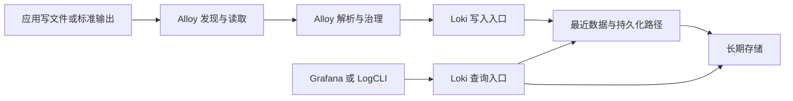
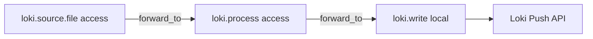
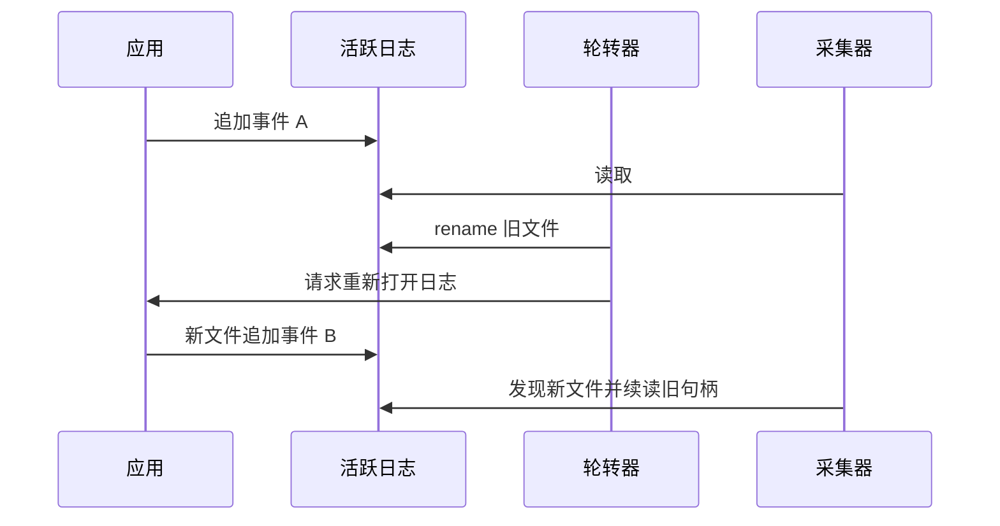

# Loki 学习笔记 · 第一卷：日志模型与 Alloy 采集

> 面向运维、SRE 与平台工程师。先把一条日志从来源送到可查询的位置，再讨论集群扩容。
> 资料核查：2026-09-24。教学基线：Loki 3.7.8、Alloy 1.19.2、Grafana 13.2.2；镜像使用固定版本，不使用 `latest`。[Loki 3.7.8 发布][S-release-loki][Alloy 1.19.2 发布][S-release-alloy][Grafana 13.2.2 发布][S-release-grafana]
> 验证边界：本套笔记完成的检查详见 README；没有执行真实 Loki / Alloy / Docker / Kubernetes 端到端部署。文中“预期”是读者的验收标准，不是本次实测结果。
> 本卷给出可保存为文件的完整最小实验。后续卷引用同一目录；替换与增量配置会明确标注。

| 章节 | 学完后应能回答的问题 |
| --- | --- |
| 第 1 章 | Loki 解决什么问题，与 ELK 的建模思路有什么不同？ |
| 第 2 章 | 一个字段应该成为索引标签、元数据，还是留在正文？ |
| 第 3 章 | 怎样证明日志真正从文件进入了查询结果？ |
| 第 4 章 | Alloy 的组件引用如何构成真实数据路径？ |
| 第 5 章 | 轮转、权限、重启和读取位置如何影响采集？ |
| 第 6 章 | 怎样解析 JSON、CRI、多行异常而不伪造数据？ |
| 第 7 章 | Kubernetes 节点文件采集与 API 采集如何取舍？ |
| 第 8 章 | OTel 日志如何进入 Loki，属性最终叫什么名字？ |

## 第 1 章：Loki 的定位与日志模型

### 1.1 从一条错误请求确定查询入口

假设值班人员收到“下单接口错误增加”的告警。告警已经给出生产环境、订单服务和最近五分钟，而不是要求从所有机器的所有历史文本中随意搜索一个单词。此时，一个自然的工作顺序是先限定环境和服务，再筛出失败请求，最后用请求 ID 或 Trace ID 把相关事件串起来。

本专题围绕这种有上下文的运维检索建立实验。查询入口来自服务目录、告警标签、工单时间或调用链；日志为这些入口提供详细事件。缺少入口时仍可扩大范围查询，但扩大范围会增加成本，也更容易混入其他系统的同名错误。

#### 不要把结果页当成完整事实

“返回了 100 条”有多种含义：总共只有 100 条，查询限制为 100 条，客户端只保存了第一页，或者后台扫描范围本来就不包含目标数据。解释一次结果时，至少保留以下上下文。

| 上下文 | 实验中记录什么 | 丢失后可能造成的误判 |
| --- | --- | --- |
| 来源 | `cluster`、`namespace`、`service_name` | 把测试环境错误当成生产故障 |
| 时间 | UTC 起止值与时区显示 | 把时区偏移当成日志延迟 |
| 租户 | 实际查询使用的租户 | 把隔离边界当成数据缺失 |
| 过滤 | 完整 LogQL，而不只是截图 | 无法复现为什么选中了这些行 |
| 返回限制 | limit、分页方法、是否截断 | 把部分结果当成总量 |
| 数据覆盖 | 采样、丢弃、解析失败和保留策略 | 用不完整日志推算全量请求 |

本卷只要能把这些条件写清，后面面对更大的系统仍然有稳定的排障入口。

### 1.2 一条日志包含不止一个字符串

Loki 以日志流组织数据。一个日志流由一组索引标签确定；同一流中包含带时间戳的日志条目。条目具有正文，也可以具有结构化元数据。这里的“流”不是一个固定机器、固定文件或固定进程的别名，而是最终标签集合相同的一组日志。[Loki 标签][S-labels][结构化元数据][S-metadata]

例如两个 Pod 最终只有相同的服务、环境和集群标签，它们就可能写进同一个流。反过来，同一个 Pod 如果给每条日志加不同的请求 ID 标签，就可能不断创建新流。因此，来源数量与流数量并不是同一个指标。

```text
租户：training
索引标签：
  cluster="lab"
  namespace="training"
  service_name="order-api"
  job="access"
日志条目：
  时间戳：整数纳秒表示的事件时间
  正文：{"status":503,"duration_ms":1600,...}
  结构化元数据：trace_id、request_id、event_id
```

#### 三类字段承担不同职责

| 数据位置 | 主要目的 | 本专题示例 |
| --- | --- | --- |
| 索引标签 | 缩小候选日志流 | 服务、环境、集群、受控日志类型 |
| 结构化元数据 | 附加每条事件的可检索上下文 | Trace ID、请求 ID、事件 ID |
| 正文 | 保留事件本身及业务细节 | 状态码、耗时、消息、异常堆栈 |

结构化元数据没有使 Loki 变成对每个字段建立完整倒排索引的系统。将 Trace ID 从标签移到元数据，是改变索引建模，不是让搜索 Trace ID 从此没有扫描和存储成本。

### 1.3 区分采集、后端与界面

本套实验使用 Alloy 处理采集和转发，Loki 处理接收与查询，Grafana 提供使用界面。对象存储在生产拓扑中保存长期数据，但第一套实验先用本地文件系统减少外部依赖。



图中的箭头是数据流，不是事务边界。采集端读取文件成功、HTTP 写入被接受、Chunk 上传完成和最终查询可见，可能发生在不同时间，也可能受到不同故障影响。第二卷第 10 章会把这些确认点拆开。

| 组件 | 负责 | 不应期待它自动完成 |
| --- | --- | --- |
| Alloy | 采集来源、加工事件、转发到后端 | 无条件永久保存所有未发送日志 |
| Loki | 日志存储模型、查询、规则与后台管理 | 替代应用埋点或内置完整认证系统 |
| Grafana | 查询入口、可视化、关联与部分告警管理 | 把没有采集到的数据恢复出来 |
| 对象存储 | 保存对象、提供读写与生命周期能力 | 自动理解租户日志保留与查询一致性 |

不要求为了使用 Loki 安装整套可观测性产品。已有 Prometheus、VictoriaMetrics、Jaeger 和 Collector 都可以继续运行；把接口、身份和时间约定接上，比重复安装相同能力更重要。

### 1.4 与 ELK 对照的是建模和操作，不是换名

学习过 ELK 后，容易把“ES 中可以搜索的字段”都当成 Loki 标签。这样做会跳过最关键的设计差异。迁移时首先要列出常用查询：它们依赖全文搜索、精确 ID、受控服务标签，还是跨大量数据的复杂聚合？然后用相同数据和时间范围进行验证。

| 原有思路 | 在 Loki 中重新问一次 |
| --- | --- |
| 为业务字段设计 Mapping | 字段需要索引定位、元数据过滤，还是查询时解析？ |
| 创建每天一个索引 | 标签组合和 Schema 如何组织数据，保留由谁执行？ |
| 调整主分片和副本 | 哪些是流数量、Ingester 副本、查询分片和对象存储的职责？ |
| 根据索引大小估算容量 | 日志压缩、活跃流、对象请求、查询缓存怎样共同影响成本？ |
| 用 Kibana 搜索并聚合 | LogQL 的分子、分母、字段解析和无数据语义是什么？ |

这张表是学习路径，不是功能一一等价表。Loki 没有必要复刻所有 Elasticsearch 使用场景；Elasticsearch 也不需要因为 Loki 存在就退出日志平台。第一轮评估可以保留两条管道，比较相同问题下的结果正确性和运行成本。

### 1.5 版本边界与学习范围

本套笔记以 2026-09-24 核查到的正式发行版为教学基线。Promtail 已在 2026-03-02 结束生命周期，新的采集示例使用 Alloy；Simple Scalable 的 `read/write/backend` 部署模式已进入弃用路径，因此生产架构主线改为 Monolithic、HA Monolithic 与 Distributed。[Promtail 生命周期][S-promtail][部署模式][S-modes]

这不表示已有旧进程会在某一天自动失效，也不表示每个环境都需要立即部署十几个微服务。旧版本迁移放在第四卷第 31 章，先写行为对照，再谈切换。

本专题不依赖 eBPF，文件采集也不需要为了读取日志而给采集器所有内核权限。不过，“不用 eBPF”不等于任意旧内核都受新二进制支持。安装之前仍需检查发行版、CPU 架构、容器运行时、Go 运行时最低平台要求以及组织的安全基线。

#### 本章自检

请用自己的一个服务填写“入口、时间、日志类型、事件 ID、需要关联的指标或 Trace”五项信息。若只写出了“我要装 Loki”，还没有定义出最小可验收目标。

## 第 2 章：标签、基数与结构化元数据

### 2.1 基数是组合问题，而不只是字段个数

假设标签只有集群、服务和日志类型。增加一个环境字段，看似只多一个键，但实际流数量由这些键的取值组合决定。再加上每请求唯一的 ID，流数量就可能从服务数量级变成请求数量级。

用取值数相乘只能得到一种上界估算，因为现实中并非所有组合都存在。例如某服务只部署在一个集群，标签间具有相关性。容量评估应统计实际出现的组合，不能把上界当成真实流数量，也不能因为单个标签取值少就忽略组合爆炸。

```python
# 独立算例：不连接 Loki，展示实际组合与笛卡尔积上界的区别。
records = [
    {"cluster": "a", "service": "orders", "kind": "access"},
    {"cluster": "a", "service": "orders", "kind": "app"},
    {"cluster": "b", "service": "payment", "kind": "access"},
]
keys = ("cluster", "service", "kind")
actual = {tuple(item[key] for key in keys) for item in records}
upper = 1
for key in keys:
    upper *= len({item[key] for item in records})
print({"actual_streams": len(actual), "cartesian_upper_bound": upper})
```

本算例输出的上界与实际值来自给定三条数据，不是对 Loki 内存占用的预测。单个流的事件速率、Chunk 填充情况、复制因子和活跃时间也会影响资源。

### 2.2 从常用查询反推稳定标签

本专题首先采用 `cluster`、`namespace`、`environment`、`service_name` 和 `job`。它们来自部署配置或受控元数据，不信任日志正文任意声称的租户和服务身份。

| 候选字段 | 初始放置 | 决策依据 |
| --- | --- | --- |
| 集群、环境 | 索引标签 | 经常用于隔离故障范围，值由平台管理 |
| 服务名 | 索引标签 | 基本查询入口，需要统一命名 |
| 日志类型 | 索引标签候选 | access、application、audit 等有限集合 |
| 路由模板 | 正文，查询时提取 | 可受控但会增加组合；先测查询再决定 |
| HTTP 状态码 | 正文 | 可用于聚合，不必默认占用索引维度 |
| 日志级别 | 正文或受控标签 | 值虽少，也需衡量切分小流的代价 |
| Pod 名、实例 ID | 元数据候选 | 生命周期短、取值随扩缩容变化 |
| Trace ID、用户 ID | 元数据或正文 | 高基数，且可能需要额外隐私治理 |
| 完整 URL | 正文并脱敏 | 动态路径和查询参数可能无限增长 |

“候选”意味着要做实验。高吞吐服务可能需要额外受控分流，低吞吐服务又可能因标签过细产生大量小 Chunk。正确方向是找到适合查询与写入的边界，而不是“所有标签越少越好”。[Loki 标签][S-labels]

### 2.3 用事件 ID 而不是标签追踪实验

下面的 HTTP Push 结构展示标签、时间戳、正文和元数据的关系。示例纳秒值只用于说明格式，真实发送必须生成当前时间，否则可能被过旧日志限制拒绝。[Loki HTTP API][S-http]

```json
{
  "streams": [
    {
      "stream": {
        "cluster": "lab",
        "service_name": "order-api",
        "job": "access"
      },
      "values": [
        [
          "1790000000000000000",
          "{\"status\":503,\"duration_ms\":1600}",
          {
            "event_id": "aabbccddeeff:000010",
            "trace_id": "4bf92f3577b34da6a3ce929d0e0e4736"
          }
        ]
      ]
    }
  ]
}
```

元数据是每条条目的附加信息，不是 `stream` 中的新标签。用 `event_id` 对账时，不需要为每条测试日志创建新的流。时间戳是整数字符串，不要经过 JavaScript 或浮点 JSON 的精度损失路径。

对应的查询有两种，取决于字段真实位置。

```logql
{cluster="lab",service_name="order-api"}
  | trace_id="4bf92f3577b34da6a3ce929d0e0e4736"
```

```logql
{cluster="lab",service_name="order-api"}
  | json body_trace="trace_id"
  | body_trace="4bf92f3577b34da6a3ce929d0e0e4736"
```

第一条依赖已写入的结构化元数据；第二条从 JSON 正文提取字段。不要为了“看起来一致”对同一字段重复解析并忽略自动重命名。第三卷会使用带前缀的查询别名避免碰撞。

### 2.4 结构化元数据不是所有字段的垃圾箱

从索引标签移走高基数字段，可以减少流维度，但不会消除字段的传输、编码、对象大小和查询成本。特别长的异常、用户提交的对象、完整请求头和未经裁剪的 Kubernetes 标签，不适合不加控制地全部复制一遍。

建议按使用目的建立字段契约。

```text
索引标签契约：平台管理，服务级，值集合可解释。
元数据契约：与单条事件关联，字段名受控，大小可限制。
正文契约：保留故障所需信息，避免复制凭据和无界载荷。
查询字段契约：按需提取，不把每个临时字段作为最终聚合维度。
```

当同一个属性同时存在于正文、元数据和标签时，先确定哪个是权威来源。平台注入的环境信息通常不应被应用正文覆盖。反之，业务状态码必须来自真实事件，不能因为采集配置写了一个常量就替换成固定值。

### 2.5 设计一个有控制的标签反例实验

本实验只在隔离环境做，不向生产环境故意注入高基数日志。先生成固定数量样本，在基线配置下记录实际流数和查询条件；然后使用单独实验目录，把 `event_id` 加成标签，再比较变化。

| 观察项 | 基线 | 反例 | 解释重点 |
| --- | --- | --- | --- |
| 事件数量 | 相同 N | 相同 N | 保证比较的输入相同 |
| 流数量 | 受控来源组合 | 接近每事件一个组合 | 区分事件与流 |
| 标签发现 | 少量服务维度 | 大量 ID | 界面并不适合浏览唯一 ID 标签 |
| 内存与 Chunk | 自行测量 | 自行测量 | 不编造每流固定内存常数 |
| 查询结果 | 对账通过 | 对账通过或解释失败 | 快慢之外还必须核对内容 |

可使用限定时间的 `/loki/api/v1/series` 查看匹配流；不要把整个租户的 `/labels` 返回数量当作某个实验的真实活跃流数量。第四卷的容量章节再结合生产指标讨论峰值。

#### 改回配置后的注意事项

从新日志中删除标签不会自动重写已经保存的历史流。做对照时记录配置切换时间，并用不同批次 ID 标识新旧数据。不要因为新查询没有加旧标签，就误以为历史数据也已经完成了迁移。

## 第 3 章：版本锁定与最小实验

### 3.1 建立目录、版本与隔离边界

这是一套面向学习的单实例实验，不含生产认证网关、对象存储高可用和资源自动扩缩容。宿主机需要能够运行所选镜像，安装 Docker Compose 插件，以及 Python 3.10 或以上版本。实际内存需求取决于宿主机和查询负载，先检查可用资源，再启动，不把固定笔记中的资源值当成生产容量结论。

全部命令在新建的 `lab/` 目录执行。目录内的配置和脚本在下面完整提供；文件名写在代码块前。也可以使用随附实验文件包中对应的文件，不需要从 GitHub 拉取本专题脚本。

```text
lab/
├── compose.yaml
├── .env
├── .gitignore
├── alloy/config.alloy
├── loki/loki.yaml
├── grafana/provisioning/datasources/loki.yaml
├── scripts/generate.py
├── scripts/loki_client.py
├── scripts/verify.py
├── samples/
└── manifests/
```

```bash
mkdir -p lab/{alloy,loki,samples,manifests,scripts}
mkdir -p lab/grafana/{provisioning/datasources,provisioning/dashboards,dashboards}
cd lab
(
umask 077
python3 - <<'PY'
from pathlib import Path
import secrets
p = Path('.env')
if p.exists():
    raise SystemExit('.env 已存在，未覆盖')
p.write_text('GRAFANA_ADMIN_PASSWORD=' + secrets.token_urlsafe(24) + '\n')
p.chmod(0o600)
PY
)
printf '.env\nmanifests/\nsamples/\nreports/\n' > .gitignore
```

密码文件在单独子 Shell 中以严格权限生成，避免把 `umask 077` 留给后续需要容器用户读取的配置文件。非敏感配置和父目录仍需授予实际运行 UID 最小必要的读取/遍历权限。

`.env` 中的密码仅用于本次 Grafana 初始管理员，不等于 Loki API 已有认证。端口绑定到宿主机回环地址，避免学习环境直接暴露在外部网卡。容器网络内的服务仍可访问彼此，所以不要把不可信工作负载加入同一网络。

### 3.2 保存完整 Compose 与 Loki 配置

文件：`lab/compose.yaml`。

```yaml
name: loki-notes
services:
  loki:
    image: grafana/loki:3.7.8
    command: ["-config.file=/etc/loki/loki.yaml"]
    ports:
      - "127.0.0.1:3100:3100"
    volumes:
      - ./loki/loki.yaml:/etc/loki/loki.yaml:ro
      - loki-data:/loki
    restart: unless-stopped
    stop_grace_period: 90s

  alloy:
    image: grafana/alloy:v1.19.2
    command:
      - run
      - --server.http.listen-addr=0.0.0.0:12345
      - --storage.path=/var/lib/alloy
      - /etc/alloy/config.alloy
    ports:
      - "127.0.0.1:12345:12345"
    volumes:
      - ./alloy/config.alloy:/etc/alloy/config.alloy:ro
      - ./samples:/var/log/loki-lab:ro
      - alloy-data:/var/lib/alloy
    depends_on:
      - loki
    restart: unless-stopped
    stop_grace_period: 60s

  grafana:
    image: grafana/grafana:13.2.2
    ports:
      - "127.0.0.1:3000:3000"
    environment:
      GF_SECURITY_ADMIN_USER: admin
      GF_SECURITY_ADMIN_PASSWORD: ${GRAFANA_ADMIN_PASSWORD:?请先创建 .env}
      GF_USERS_ALLOW_SIGN_UP: "false"
      GF_AUTH_ANONYMOUS_ENABLED: "false"
    volumes:
      - ./grafana/provisioning:/etc/grafana/provisioning:ro
      - ./grafana/dashboards:/var/lib/grafana/dashboards:ro
      - grafana-data:/var/lib/grafana
    depends_on:
      - loki
    restart: unless-stopped

volumes:
  loki-data:
  alloy-data:
  grafana-data:
```

`depends_on` 只表达启动顺序，不代表下游已准备好。这里不依赖镜像内部一定有 `curl`、`wget` 或 `/bin/bash`，健康验收从宿主机执行。

文件：`lab/loki/loki.yaml`。

```yaml
# 完整文件：仅用于单实例、本机回环端口暴露的学习环境。
auth_enabled: false
server:
  http_listen_port: 3100
  grpc_listen_port: 9095
  log_level: info
common:
  instance_addr: 127.0.0.1
  path_prefix: /loki
  replication_factor: 1
  ring:
    kvstore:
      store: inmemory
  storage:
    filesystem:
      chunks_directory: /loki/chunks
      rules_directory: /loki/rules
schema_config:
  configs:
    - from: "2026-01-01"
      store: tsdb
      object_store: filesystem
      schema: v13
      index:
        prefix: index_
        period: 24h
storage_config:
  tsdb_shipper:
    active_index_directory: /loki/tsdb-index
    cache_location: /loki/tsdb-cache
ingester:
  wal:
    enabled: true
    dir: /loki/wal
    replay_memory_ceiling: 256MB
    flush_on_shutdown: true
limits_config:
  allow_structured_metadata: true
  reject_old_samples: true
  reject_old_samples_max_age: 168h
  max_query_series: 500
  max_entries_limit_per_query: 5000
  query_timeout: 1m
  volume_enabled: true
query_range:
  results_cache:
    cache:
      embedded_cache:
        enabled: true
        max_size_mb: 64
analytics:
  reporting_enabled: false
```

这个配置基于固定版本的配置结构改写，主动减少了 Pattern、Ruler 和存储后端等初始变量。[Loki 3.7.8 本地配置][S-local-config][存储 Schema][S-schema][Ingester WAL][S-wal]

| 配置 | 实验目的 | 不能据此推出什么 |
| --- | --- | --- |
| `auth_enabled: false` | 单租户隔离 lab，减少认证变量 | 生产环境可以裸露公网 |
| `replication_factor: 1` | 一个实例能够启动并写入 | 任意实例故障都不丢数据 |
| `inmemory` Ring | 单进程发现 | 多实例可以各用独立 Ring |
| `filesystem` | 无外部存储依赖 | 本机磁盘就是共享高可用对象存储 |
| TSDB / v13 / 24h | 现代索引与元数据基线 | 旧数据可以删除历史 Schema 配置 |
| Ingester WAL | 展示服务端重启恢复状态 | 采集端已经具备同样的日志备份 |

`from` 的日期必须早于新实验产生的日志时间。它是 Schema 生效边界，不是日志保留时间。已有实例的变更不能覆盖旧段，第二卷第 12 章再展示未来时间切换。

### 3.3 保存 Alloy 与 Grafana 配置

文件：`lab/alloy/config.alloy`。

```alloy
// 完整文件：每条 JSON 日志是一条已经完成的请求记录。
logging {
  level = "info"
}

loki.source.file "access" {
  targets = [{
    __path__     = "/var/log/loki-lab/access*.jsonl",
    cluster      = "lab",
    namespace    = "training",
    environment  = "lab",
    service_name = "order-api",
    job          = "access",
  }]
  file_match {
    enabled     = true
    sync_period = "2s"
  }
  forward_to = [loki.process.access.receiver]
}

loki.process "access" {
  stage.json {
    expressions = {
      source_ts  = "ts",
      event_id   = "event_id",
      trace_id   = "trace_id",
      request_id = "request_id",
    }
    drop_malformed = false
  }
  stage.timestamp {
    source            = "source_ts"
    format            = "RFC3339Nano"
    action_on_failure = "skip"
  }
  stage.structured_metadata {
    values = {
      event_id   = "",
      trace_id   = "",
      request_id = "",
    }
  }
  // 此实验只有一种确定的文件来源，不把物理路径加入索引标签。
  stage.label_drop {
    values = ["filename"]
  }
  forward_to = [loki.write.local.receiver]
}

loki.write "local" {
  endpoint {
    url = "http://loki:3100/loki/api/v1/push"
  }
}
```

这里使用 `loki.source.file` 的内置 `file_match` 展开路径。通配路径和文件读取不是同一件事；不启用匹配又直接把通配符当成具体文件名，会让配置看起来存在但实际没有目标。[文件采集][S-source-file]

解析只提取事件时间和关联 ID。状态码、耗时和路由仍留在 JSON 正文，后续用 LogQL 按需解析。`stage.timestamp` 失败时保留已有采集时间，不丢弃条目；因此失败事件可能不在你预想的“业务时间”窗口，必须另外检查坏格式样本。[loki.process][S-process]

文件：`lab/grafana/provisioning/datasources/loki.yaml`。

```yaml
apiVersion: 1
prune: true
datasources:
  - name: Loki Lab
    uid: loki-lab
    type: loki
    access: proxy
    url: http://loki:3100
    isDefault: true
    editable: false
    jsonData:
      maxLines: 1000
```

Compose 已预留空的 Dashboard 目录挂载；第三卷第 22 章再写入面板和 Provisioning 文件，初次实验不依赖它们。

Grafana 请求 Loki 的地址是容器网络里的 `http://loki:3100`。浏览器打开 Grafana 使用宿主机 `http://127.0.0.1:3000`。把这两类地址混淆，是“浏览器能访问、数据源却不通”的常见原因。

### 3.4 生成可核对的样本，而不是随手 echo 一行

文件：`lab/scripts/generate.py`。

```python
#!/usr/bin/env python3
"""生成带唯一事件 ID 的 JSONL；不访问业务服务，不删除已有样本。"""
from __future__ import annotations
import argparse
import hashlib
import json
import os
from pathlib import Path
import re
import secrets
import time
from datetime import datetime, timezone

DURATIONS = (5, 12, 24, 65, 90, 120, 160, 250, 900, 1600)
ROUTES = ("/orders", "/orders/{id}", "/inventory/{sku}")

def timestamp(ns: int) -> str:
    if ns < 0:
        raise ValueError("时间戳必须非负")
    seconds, nano = divmod(ns, 1_000_000_000)
    prefix = datetime.fromtimestamp(seconds, timezone.utc).strftime("%Y-%m-%dT%H:%M:%S")
    return f"{prefix}.{nano:09d}Z"

def make_event(run_id: str, seq: int, ns: int) -> dict:
    if not re.fullmatch(r"[0-9a-f]{12}", run_id) or seq < 1:
        raise ValueError("run_id 或序号不合法")
    event_id = f"{run_id}:{seq:06d}"
    status = 503 if seq % 10 == 0 else 200
    return {
        "schema_version": 1,
        "ts": timestamp(ns),
        "event_id": event_id,
        "run_id": run_id,
        "sequence": seq,
        "source_id": "lab-access-v1",
        "service": "order-api",
        "level": "error" if status >= 500 else "info",
        "method": "GET",
        "route": ROUTES[(seq - 1) % len(ROUTES)],
        "status": status,
        "duration_ms": DURATIONS[(seq - 1) % len(DURATIONS)],
        "trace_id": hashlib.sha256(event_id.encode()).hexdigest()[:32],
        "request_id": event_id,
        "message": "downstream unavailable" if status >= 500 else "request completed",
    }

def generate(output: Path, manifests: Path, count: int, rate: float, run_id: str) -> Path:
    if not 1 <= count <= 20000 or not 0 <= rate <= 1000:
        raise ValueError("count 应为 1..20000；rate 应为 0..1000，0 表示不主动等待")
    if not re.fullmatch(r"[0-9a-f]{12}", run_id):
        raise ValueError("run_id 必须是 12 位小写十六进制")
    manifests.mkdir(parents=True, exist_ok=True)
    manifest_path = manifests / f"{run_id}.json"
    if manifest_path.exists():
        raise FileExistsError("run_id 已存在，请换一个；禁止合并两次实验的清单")
    output.parent.mkdir(parents=True, exist_ok=True)
    first_ns = 0
    last_ns = 0
    digest = hashlib.sha256()
    started = time.monotonic()
    with output.open("a", encoding="utf-8", newline="\n") as stream:
        for seq in range(1, count + 1):
            ns = max(time.time_ns(), last_ns + 1)
            first_ns = first_ns or ns
            last_ns = ns
            event = make_event(run_id, seq, ns)
            line = json.dumps(event, ensure_ascii=False, separators=(",", ":")) + "\n"
            stream.write(line)
            stream.flush()
            digest.update(line.encode("utf-8"))
            if rate:
                time.sleep(max(0.0, started + seq / rate - time.monotonic()))
        os.fsync(stream.fileno())
    manifest = {
        "run_id": run_id, "count": count, "error_count": count // 10,
        "first_ns": first_ns, "end_ns_exclusive": last_ns + 1,
        "sample_sha256": digest.hexdigest(), "source_file": str(output),
        "contract": "one log entry per completed request; no sampling",
    }
    # x 模式避免覆盖既有清单；生成器不可对同一路径并发运行。
    with manifest_path.open("x", encoding="utf-8") as stream:
        json.dump(manifest, stream, ensure_ascii=False, indent=2)
        stream.write("\n")
    return manifest_path

def main() -> None:
    parser = argparse.ArgumentParser(description=__doc__)
    parser.add_argument("--output", type=Path, default=Path("samples/access.jsonl"))
    parser.add_argument("--manifests", type=Path, default=Path("manifests"))
    parser.add_argument("--count", type=int, default=100)
    parser.add_argument("--rate", type=float, default=10)
    parser.add_argument("--run-id", default=secrets.token_hex(6))
    args = parser.parse_args()
    try:
        path = generate(args.output, args.manifests, args.count, args.rate, args.run_id)
    except (OSError, ValueError) as exc:
        parser.exit(1, f"生成失败：{exc}\n")
    print(path)

if __name__ == "__main__":
    main()
```

生成器约定：每条日志代表一次已经完成的请求；每十条中第十条是 503；耗时循环来自十个已知数值；不采样、不删除成功请求。这个契约只适用于教学样本，不适用于任意 Java 应用日志。

生成器写入的清单包含范围、数量、错误数量和源数据摘要。它不改变应用服务，不连接 Kafka，也不模拟网络压测。“每秒生成 10 行文件”不是“真实服务每秒完成 10 次请求”。

同一日志文件不应由多个此脚本实例同时写入。唯一批次 ID 能隔离实验，但不能让普通文件写入自动成为多写入者事务。

### 3.5 启动、首次查询与数据卷检查

保存完上述文件后执行以下只读配置检查，再启动。

```bash
# 先检查安装版本和最终 Compose；config 输出含环境信息，不要上传原文。
docker compose version
docker compose config --quiet

# 检查 Alloy 和 Loki 自身的配置语义；不能由 YAML 解析替代。
docker compose run --rm --no-deps alloy validate /etc/alloy/config.alloy
docker compose run --rm --no-deps loki \
  -config.file=/etc/loki/loki.yaml -verify-config=true

docker compose up -d
docker compose ps
curl --fail --show-error http://127.0.0.1:3100/ready
curl --fail --show-error http://127.0.0.1:3100/loki/api/v1/status/buildinfo
curl --fail --show-error http://127.0.0.1:12345/-/ready
```

若容器因目录不可写而退出，先查看具体 UID 和错误目录，再调整专用数据卷的所有者。不要对宿主机日志根目录递归 `chmod 777`，也不要为了省事给所有组件加 `privileged: true`。

```bash
# 生成一次新批次，终端输出对应 manifest 文件名。
python3 scripts/generate.py --count 100 --rate 10

# 首次人工查询；此处仅演示最近范围，不负责完整对账。
curl --fail --show-error --get \
  http://127.0.0.1:3100/loki/api/v1/query_range \
  --data-urlencode 'query={cluster="lab",service_name="order-api",job="access"}' \
  --data-urlencode 'since=15m' \
  --data-urlencode 'direction=forward' \
  --data-urlencode 'limit=200'
```

Grafana 中选择 `Loki Lab` 数据源、最近 15 分钟，输入相同选择器。核对一条正文的 `event_id`、元数据的 `trace_id` 和时间戳。第一次练习不要同时启用自动生成标签、JSON 日志压缩和复杂保留策略。

#### 实验状态清单

| 检查 | 成功证据 | 失败后先查什么 |
| --- | --- | --- |
| 源日志 | 文件增加完整 JSON 行 | 工作目录、脚本退出码 |
| Alloy 发现 | 对应 source 有文件目标 | 挂载、通配符、权限 |
| Alloy 处理 | component 健康且有数据流 | 引用、解析和 timestamp |
| 写入 | 没有持续拒绝，后端可查询样本 | URL、网络、HTTP 状态 |
| 查询 | 指定批次 ID 有结果 | 时间、租户、选择器和返回限制 |
| 图形界面 | 同一查询结果与 API 对应 | 数据源地址和时间选择器 |

### 3.6 用只读客户端做有边界的对账

手工查看 100 行可用于入门，却不适合作为长期验证。下面的客户端只提供范围日志查询，限制时间窗口、返回总量、请求预算和响应大小，并拒绝重定向。认证令牌来自环境变量，不写进命令行 URL。

文件：`lab/scripts/loki_client.py`。

```python
#!/usr/bin/env python3
"""有边界的只读 Loki HTTP 客户端；仅支持日志范围查询，不执行写入或删除。"""
from __future__ import annotations
from dataclasses import dataclass
import json
import os
from typing import Callable
from urllib.error import HTTPError, URLError
from urllib.parse import urlencode, urlsplit
from urllib.request import Request, build_opener, HTTPRedirectHandler

class QueryError(RuntimeError):
    pass

class IncompleteQuery(QueryError):
    pass

class NoRedirect(HTTPRedirectHandler):
    def redirect_request(self, req, fp, code, msg, headers, newurl):
        raise QueryError(f"拒绝 HTTP 重定向：{code}，请核对固定服务地址")

@dataclass(frozen=True)
class Entry:
    ns: int
    labels: dict[str, str]
    line: str

class LokiClient:
    def __init__(self, base_url: str = "http://127.0.0.1:3100", tenant: str = "",
                 timeout: float = 15, max_requests: int = 256,
                 transport: Callable[[dict], dict] | None = None):
        parts = urlsplit(base_url)
        if (parts.scheme not in ("http", "https") or not parts.netloc
                or parts.username or parts.password or parts.query or parts.fragment):
            raise ValueError("base_url 必须是无凭据、无查询串的 HTTP(S) 固定地址")
        if any(c in tenant for c in "\r\n"):
            raise ValueError("非法租户 Header")
        if (type(max_requests) is not int or not 1 <= max_requests <= 2048
                or type(timeout) not in (int, float) or not 0 < timeout <= 60):
            raise ValueError("请求预算或超时超出边界")
        self.base_url = base_url.rstrip("/")
        self.tenant = tenant
        self.timeout = timeout
        self.max_requests = max_requests
        self.requests = 0
        self.transport = transport
        self.opener = build_opener(NoRedirect())

    def _get(self, params: dict) -> dict:
        self.requests += 1
        if self.requests > self.max_requests:
            raise IncompleteQuery("达到请求预算；结果不能声明完整")
        if self.transport is not None:
            return self.transport(params)
        headers = {"Accept": "application/json"}
        if self.tenant:
            headers["X-Scope-OrgID"] = self.tenant
        token = os.environ.get("LOKI_BEARER_TOKEN", "")
        if token:
            if any(c in token for c in "\r\n"):
                raise ValueError("非法认证值")
            headers["Authorization"] = "Bearer " + token
        url = self.base_url + "/loki/api/v1/query_range?" + urlencode(params)
        request = Request(url, headers=headers, method="GET")
        try:
            with self.opener.open(request, timeout=self.timeout) as response:
                payload = response.read(16 * 1024 * 1024 + 1)
                if len(payload) > 16 * 1024 * 1024:
                    raise IncompleteQuery("响应超过 16 MiB，请缩小范围")
                data = json.loads(payload)
        except HTTPError as exc:
            # 不自动重试，避免隐藏 429、认证错误和服务器限额。
            raise QueryError(f"HTTP {exc.code}，查询未完成") from exc
        except (URLError, TimeoutError, UnicodeError, ValueError) as exc:
            raise QueryError(f"读取响应失败：{type(exc).__name__}") from exc
        if not isinstance(data, dict):
            raise QueryError("响应必须是 JSON 对象")
        return data

    @staticmethod
    def _decode(data: dict) -> list[Entry]:
        if not isinstance(data, dict) or data.get("status") != "success":
            raise QueryError("Loki 未返回 success")
        body = data.get("data", {})
        if not isinstance(body, dict) or body.get("resultType") != "streams":
            raise QueryError("仅支持日志查询 streams，不接受指标查询结果")
        results = body.get("result")
        if not isinstance(results, list):
            raise QueryError("result 必须是列表")
        entries = []
        for stream in results:
            labels = stream.get("stream") if isinstance(stream, dict) else None
            values = stream.get("values") if isinstance(stream, dict) else None
            if (not isinstance(labels, dict) or not isinstance(values, list)
                    or not all(isinstance(k, str) and isinstance(v, str)
                               for k, v in labels.items())):
                raise QueryError("非法 stream 或 values")
            for row in values:
                if (not isinstance(row, list) or len(row) < 2
                        or not isinstance(row[0], str) or not row[0].isdigit()
                        or not isinstance(row[1], str)):
                    raise QueryError("日志时间戳必须是纳秒整数字符串，正文必须是字符串")
                entries.append(Entry(int(row[0]), labels.copy(), row[1]))
        return entries

    def query(self, logql: str, start_ns: int, end_ns: int,
              page_limit: int = 1000, max_entries: int = 20000) -> list[Entry]:
        if not isinstance(logql, str) or not logql.strip() or len(logql) > 4096:
            raise ValueError("查询为空或过长")
        if (type(start_ns) is not int or type(end_ns) is not int
                or not 0 <= start_ns < end_ns or end_ns - start_ns > 3600 * 10**9):
            raise ValueError("仅允许非空且不超过 1 小时的范围")
        if (type(page_limit) is not int or type(max_entries) is not int
                or not 1 <= page_limit <= 5000 or not 1 <= max_entries <= 100000):
            raise ValueError("返回条数超出客户端边界")
        self.requests = 0
        pending = [(start_ns, end_ns)]
        collected: list[Entry] = []
        while pending:
            start, end = pending.pop()
            data = self._get({"query": logql, "start": str(start), "end": str(end),
                              "direction": "forward", "limit": page_limit})
            entries = self._decode(data)
            if any(not start <= item.ns < end for item in entries):
                raise QueryError("服务端返回了查询区间之外的数据")
            if len(entries) >= page_limit:
                # 达到 limit 不代表恰好只有这么多。舍弃父窗口，查询两个不重叠子窗口。
                if end - start <= 1:
                    raise IncompleteQuery("同一纳秒结果饱和；请收窄标签/内容或提高授权限额")
                middle = (start + end) // 2
                pending.extend([(middle, end), (start, middle)])
                continue
            collected.extend(entries)
            if len(collected) > max_entries:
                raise IncompleteQuery("超过总结果预算；不输出伪完整结果")
        # 不主动去重：重复本身可能是本次实验要发现的问题。
        collected.sort(key=lambda item: (
            item.ns, json.dumps(item.labels, sort_keys=True), item.line))
        return collected
```

客户端把 `[start,end)` 作为半开区间处理。达到 `limit` 时，不假设结果已经完整，也不使用“最后一条时间戳加一”跳过同一纳秒可能剩余的日志；而是二分时间窗口。时间范围缩小到一纳秒仍饱和时，明确失败。[Loki HTTP API][S-http]

这不是数据库快照：查询过程中若有持续补写、保留清理或后端状态变化，不同子请求可以看到不同数据。因此，实验对账应先结束该批次写入，等待传播稳定，并在报告里保存查询范围。第四卷进一步讨论恢复期间的多轮核对。

文件：`lab/scripts/verify.py`。

```python
#!/usr/bin/env python3
"""核对生成器清单与 Loki 查询结果；调用前先停止该批次的继续写入。"""
from __future__ import annotations
import argparse
from collections import Counter
import json
from pathlib import Path
import re
from loki_client import LokiClient, QueryError

def compare(manifest: dict, entries: list) -> dict:
    run_id = manifest["run_id"]
    count = manifest["count"]
    if (not isinstance(run_id, str) or not re.fullmatch(r"[0-9a-f]{12}", run_id)
            or type(count) is not int or not 1 <= count <= 20000):
        raise ValueError("不可信实验清单")
    expected = {f"{run_id}:{seq:06d}" for seq in range(1, count + 1)}
    seen = Counter()
    invalid = 0
    errors = 0
    for item in entries:
        try:
            body = json.loads(item.line)
            event_id = body["event_id"]
            if not isinstance(event_id, str):
                raise ValueError("event_id 不是字符串")
            seen[event_id] += 1
            errors += int(body.get("status", 0) == 503)
        except (ValueError, KeyError, TypeError):
            invalid += 1
    missing = sorted(expected - seen.keys())
    unexpected = sorted(seen.keys() - expected)
    duplicate = {key: value for key, value in seen.items() if value > 1}
    return {
        "run_id": run_id, "expected": count, "returned": len(entries),
        "unique_event_ids": len(seen), "missing": missing,
        "unexpected": unexpected, "duplicates": duplicate, "invalid_lines": invalid,
        "expected_503": manifest["error_count"], "returned_503": errors,
        "passed": not (missing or unexpected or duplicate or invalid)
                  and errors == manifest["error_count"],
    }

def main() -> None:
    parser = argparse.ArgumentParser(description=__doc__)
    parser.add_argument("manifest", type=Path)
    parser.add_argument("--url", default="http://127.0.0.1:3100")
    parser.add_argument("--tenant", default="")
    args = parser.parse_args()
    try:
        manifest = json.loads(args.manifest.read_text(encoding="utf-8"))
        run_id = manifest["run_id"]
        if not re.fullmatch(r"[0-9a-f]{12}", run_id):
            raise ValueError("run_id 不合法")
        selector = '{cluster="lab",job="access",service_name="order-api"}'
        query = selector + f' | event_id=~"{run_id}:[0-9]{{6}}"'
        client = LokiClient(args.url, args.tenant)
        entries = client.query(query, int(manifest["first_ns"]),
                               int(manifest["end_ns_exclusive"]))
        report = compare(manifest, entries)
        report.update({"query": query, "requests": client.requests,
                       "complete_within_query_contract": True})
    except (OSError, ValueError, KeyError, TypeError, QueryError) as exc:
        parser.exit(2, f"对账未完成：{exc}\n")
    print(json.dumps(report, ensure_ascii=False, indent=2))
    raise SystemExit(0 if report["passed"] else 1)

if __name__ == "__main__":
    main()
```

```bash
# 替换为 generate.py 实际输出的文件名。
python3 scripts/verify.py manifests/aabbccddeeff.json
```

成功条件是全部预期事件都在结果中、没有额外事件、没有可观察到的重复、错误数一致。脚本不会因为查询失败而输出一个空列表冒充“零错误”。

对账也有边界：Loki 查询层可能合并某些副本重复；客户端看不到重复，不代表源头从未重复发送。正文内容的格式、字段值和脱敏正确性还要结合样本检查，不能只看数量。

### 3.7 停止与保留实验状态

```bash
# 停止并删除容器网络，但保留命名数据卷。
docker compose down
```

不要在普通“重启实验”步骤中默认加入 `-v`。删除数据卷会丢失 Loki 数据、Alloy 读取位置和 Grafana 状态，属于重新初始化实验，不是验证持久化恢复。

修改 `.env` 的管理员密码不一定会重置已有 Grafana 数据库中的密码。凭据初始化与已有用户状态是两个问题，应按 Grafana 管理流程处理，而不是删除所有数据卷来修复登录。

## 第 4 章：Alloy 配置语言与组件连接

### 4.1 组件图决定数据是否经过处理

Alloy 的配置不是按文件行号依次执行的一段 Shell。组件声明、导出值和引用共同构成依赖关系；source 的 `forward_to` 决定事件被交给哪个接收端。文件中的上下排列可以帮助阅读，但不能替代连接关系。[Alloy 组件][S-alloy-components]



若 source 直接指向 write，process 即使存在且配置合法，也不会处理这些日志。结果可能仍可查询，但 Trace ID 没有被提升到元数据，或时间戳仍是采集时间。这种故障比启动失败更隐蔽。

#### 三个名称不要混淆

| 名称 | 例子 | 作用 |
| --- | --- | --- |
| 组件类型 | `loki.process` | 决定支持的参数与导出字段 |
| 实例名 | `access` | 区分相同类型的多个实例 |
| 导出字段 | `.receiver` | 给其他组件引用的接收入口 |

`loki.process.access.receiver` 不是 HTTP URL，也不是文件路径。`loki.write.local.receiver` 是同一进程内部接收日志的组件导出，不应被填写到远程 HTTP 客户端中。

### 4.2 发现、重标记与事件处理的分工

发现阶段处理“我要采集哪些目标”，事件阶段处理“这条日志的内容是什么”。两者在名称上都可能出现 label，却处于不同时间和数据粒度。

```text
discovery.kubernetes
        ↓ 目标及 __meta_* 字段
discovery.relabel
        ↓ 选中的文件路径、服务身份
loki.source.file
        ↓ 读取到的日志条目
loki.process
        ↓ 解析、时间戳、元数据与脱敏
loki.write
```

发现规则不能直接解析尚未读取的 Java 异常；事件处理也不应该靠扫描每条正文重新决定应该 watch 哪个 Kubernetes 命名空间。

本专题对两类数据采用不同信任来源：服务身份尽量来自平台配置或部署元数据，业务状态来自日志正文。租户身份由经过认证的入口确定，不允许应用在 JSON 内任意写一个 `tenant` 字段就访问其他租户。

### 4.3 文件拆分、环境变量与秘密

当配置增长时，可以把同一目录中的多个 `.alloy` 文件作为一个配置源加载。组件 ID 在这个合并空间里仍须唯一；把同名组件复制到两个文件中不是隔离。目录模式通常不递归收集任意子目录，校验和运行必须使用一致路径。[Alloy validate][S-alloy-validate]

一个输出组件使用环境变量的例子如下。它是替换示例，不要与第一卷 `loki.write "local"` 重复声明。

```alloy
loki.write "authenticated" {
  endpoint {
    url       = sys.env("LOKI_PUSH_URL")
    tenant_id = sys.env("LOKI_TENANT")
    authorization {
      type             = "Bearer"
      credentials_file = "/run/secrets/loki-token"
    }
  }
}
```

这里假设 Loki 前面已有接受 Bearer 的认证网关。Loki 开启多租户本身不会自动校验这个令牌。Secret 文件路径、权限和网关认证方案必须在部署侧完成。

敏感值不要写入服务名、标签、错误样本或可共享的调试输出。采集器能访问 Secret，并不意味着维护者应把它们全部打印出来证明“变量传进去了”。

### 4.4 校验能证明什么，不能证明什么

```bash
# 使用本机安装的相同版本 Alloy；fmt 不改文件时可用于观察输出。
alloy fmt --test alloy/config.alloy
alloy validate alloy/config.alloy

# 容器镜像内运行校验，不依赖本机二进制。
docker compose run --rm --no-deps alloy \
  validate /etc/alloy/config.alloy
```

`fmt` 检查格式；`validate` 检查配置语法、组件与属性引用等条件。二者都不等于生产数据已经送达。若启用实验功能，验证时的稳定性开关必须与运行时一致，否则会出现“测试能过，上线拒绝”的假象。[Alloy fmt][S-alloy-fmt][Alloy validate][S-alloy-validate]

| 验证层 | 能发现的问题 | 发现不了的问题 |
| --- | --- | --- |
| 格式检查 | 格式不统一、部分语法问题 | 远程网络与日志覆盖 |
| 配置检查 | 未知组件、字段、引用 | 文件没有新行、租户选错 |
| 启动检查 | 端口、权限、加载失败 | 少数格式异常被错误转换 |
| 样本检查 | 指定样本的数据路径 | 所有生产负载的极端条件 |
| 故障实验 | 指定故障模型下的恢复 | 未测试的磁盘和多故障组合 |

### 4.5 有意制造“绕过处理”的错误

在复制出来的隔离配置中，让 file source 临时指向 `loki.write.local.receiver`。生成一个新批次，观察正文仍存在而 `event_id` 元数据查询失败；再用正文 JSON 提取进行查询。

```logql
{cluster="lab",job="access"}
  | json raw_event_id="event_id"
  | raw_event_id=~"aabbccddeeff:[0-9]{6}"
```

若正文查询能找到，而元数据查询找不到，就把检查重点放在处理组件是否经过、字段表达式是否匹配、有没有重名覆盖。不要立即判定为 Loki 丢失日志。

恢复原配置后生成新批次，不要期待新处理规则会反向加工历史数据。记录源配置摘要与切换时间，是后续回溯问题的重要证据。

## 第 5 章：Linux 文件、轮转与系统日志

### 5.1 文件存在不代表采集进程看得见

首先检查“文件在哪个挂载空间里”。宿主机 `/data/logs/order.log` 不会因为路径写进容器配置就自动出现；容器需要显式挂载，采集目标使用的是容器内部路径。软链接还要求其真实目标在相同容器中可达。

```bash
# 在来源机器上执行，只读检查，不改变文件权限。
ls -ld /data /data/logs
ls -l /data/logs/order.log
namei -l /data/logs/order.log
readlink -f /data/logs/order.log
stat /data/logs/order.log
```

文件本身可读但父目录没有执行权限，仍然无法打开。宿主机 root 能读不代表采集进程的 UID 能读；容器内 root 也不等于可以绕过所有主机安全策略。SELinux、AppArmor、挂载选项和用户命名空间都可能形成独立边界。

| 检查对象 | 要确认的事实 | 不要直接做的操作 |
| --- | --- | --- |
| 容器挂载 | 配置路径与实际挂载一致 | 给整个宿主根目录读写挂载 |
| 文件权限 | 实际采集 UID/GID 可以读 | 对日志目录递归放开所有用户 |
| 软链接 | 链接和目标都能访问 | 只挂载链接文件而漏掉目标 |
| 安全上下文 | 策略允许限定日志目录 | 为排障永久关闭全部安全机制 |
| 文件格式 | 有完整换行和正确编码 | 把未完成行误判为采集丢失 |

日志记录器若迟迟不 flush，采集器无法提前读取还留在应用缓冲中的内容。最后一行没有换行时的读取行为也应使用本版本实际验证，而不是只盯着文件大小变化。

### 5.2 读取位置保存的是偏移，不是正文

文件来源组件会保存读取状态，以便重启后定位已读位置。状态目录必须稳定且可写；更换组件 ID、存储路径或丢失状态，都可能改变恢复行为。[文件采集][S-source-file]

```text
文件正文：实际发生过的事件。
读取位置：采集器认为已经读到哪里。
发送状态：某批日志是否已经进入下游或等待重试。
```

这三个对象不能互相替代。即使位置文件完整，如果源文件已被删除而尚未发送的数据只在内存中，位置也无法重建消失的正文。反过来，源文件还在但位置丢失，可能发生历史重读。

| 场景 | 可能结果 | 验证方法 |
| --- | --- | --- |
| 正常重启，状态保留 | 从已记录位置继续 | 重启前后分别生成不同批次 |
| 状态丢失，文件保留 | 从头重读或按策略跳到末尾 | 观察已知旧事件 ID 是否再次出现 |
| 状态保留，文件被清理 | 无法恢复已删除正文 | 对比文件保留窗口与中断时长 |
| 新路径匹配历史文件 | 历史日志被新目标读取 | 检查采集时间、事件时间和过旧拒绝 |
| `tail_from_end` 开启 | 新发现目标跳过旧内容 | 不把它当成已存在位置的重置开关 |

不要在线手工改生产位置文件来“补一点日志”。先复制原状态、确定来源文件范围，使用独立回放任务和受控速率，再核对重复和过旧时间限制。

### 5.3 两类轮转的失败模型不同

常见轮转方式是把旧文件重命名，再让应用重新打开原路径；另一种是复制内容后原地截断。前者涉及旧文件句柄何时关闭，后者在复制与截断之间可能存在并发写入窗口。



上图是预期协作，不是对任何应用和轮转器的保证。有些应用没有处理重新打开信号，仍向已重命名文件写入；有些清理规则过快删除旧文件；有些采集 glob 同时匹配活跃路径和归档路径，从而引入重复目标。

#### 可复现的 rename/create 实验

仅在本套 `lab/samples` 中操作。先结束当前生成器，不让它继续持有同一个文件句柄。

```bash
python3 scripts/generate.py --count 50 --rate 10
# 记下 manifest A；确认可查询后再继续。

mv samples/access.jsonl samples/access.jsonl.rotated
: > samples/access.jsonl
python3 scripts/generate.py --count 50 --rate 10
# 记下 manifest B，分别运行 verify.py。
```

当前 glob 是 `access*.jsonl`，归档名 `.jsonl.rotated` 不再匹配，这是有意让实验更容易解释。改变归档命名和匹配规则后，需要重新测试旧句柄与新目标行为，不要把一种命名下的观察推广到所有轮转配置。

#### copytruncate 对照的边界

离线复制并截断静态文件，只能演示状态变化，不能证明并发写入期间不会丢行。要验证竞争窗口，需要有连续带序号的写入者，同时采样轮转时间，再比较缺号与重复号。

实验记录至少包含：采集配置、轮转方式、写入速率、源文件保留时长、采集器重启时间、缺失 ID 列表。没有这些条件，“测试过轮转没问题”很难复用。

### 5.4 systemd 服务化与状态目录

已有 Linux 安装包通常提供 systemd 单元。下面是自主部署时的参考单元，文件路径和二进制来源需要与本机安装一致，不应覆盖发行版已有服务而不保留差异。

```ini
# /etc/systemd/system/alloy-logs.service
[Unit]
Description=Alloy log collection for controlled sources
After=network-online.target
Wants=network-online.target

[Service]
Type=simple
User=alloy
Group=alloy
EnvironmentFile=/etc/alloy/alloy.env
ExecStart=/usr/local/bin/alloy run --server.http.listen-addr=127.0.0.1:12345 --storage.path=/var/lib/alloy-logs /etc/alloy/config.alloy
Restart=on-failure
RestartSec=5
TimeoutStopSec=60
NoNewPrivileges=true
PrivateTmp=true
ProtectSystem=strict
ReadWritePaths=/var/lib/alloy-logs

[Install]
WantedBy=multi-user.target
```

授予 `alloy` 用户对确切日志目录的读权限，对状态目录的写权限。使用 ACL、组权限或专用日志组时，注意轮转后新文件的权限继承。启动前用同一用户做配置校验，不能只用 root 校验后认为服务用户具有相同访问条件。

```bash
# 替换路径前先核对现有服务与安装方式。
systemctl cat alloy-logs
systemctl show alloy-logs -p User -p Group -p ExecStart
journalctl -u alloy-logs --since '10 minutes ago' --no-pager
```

`ProtectSystem` 等加固选项必须与实际文件访问一起测试。如果应用日志放在被隐藏的私有目录，应针对需要的路径调整，而不是把全部加固选项一次性取消。

### 5.5 Journal 与 Syslog 的接入选择

对已经写入 Journal 的服务，可以直接使用 Journal source，避免先导出到文本文件又采集同一份事件。以下是增量组件，转发到第一套实验的 `loki.write.local.receiver`；容器部署还需要挂载实际 Journal 目录并具有读取权限。[Journal 采集][S-journal]

```alloy
loki.source.journal "nginx_service" {
  matches = "_SYSTEMD_UNIT=nginx.service"
  labels = {
    cluster      = "lab",
    service_name = "nginx",
    job          = "journal",
  }
  forward_to = [loki.write.local.receiver]
}
```

`matches` 是 Journal 字段过滤，不是 LogQL。不能直接把 `journalctl` 的所有表达式原样搬入该字段；例如本版本文档明确限制其逻辑组合能力，复杂条件应按组件支持方式处理。

Syslog source 则监听网络消息。教学只在本机回环端口上演示 RFC5424 TCP，生产要补齐发送端认证、TLS、流量限制和源身份校验。[Syslog 采集][S-syslog]

```alloy
loki.source.syslog "local_tcp" {
  listener {
    address       = "127.0.0.1:1514"
    protocol      = "tcp"
    syslog_format = "rfc5424"
    labels = {
      cluster = "lab",
      job     = "syslog",
    }
  }
  forward_to = [loki.write.local.receiver]
}
```

网络设备提供的 hostname 只是报文内容，不应无条件作为可信资产身份。UDP 发送成功也不代表接收方已经保存，更不代表 Loki 已经可查询。需要可靠性目标时，先明确协议和中间缓冲，而不是仅改一个监听端口。

### 5.6 多采集路径造成的重复

同一应用可能同时写标准输出、应用文件和 Journal。再叠加 Docker API、节点文件和 Kubernetes API，就可能形成多条“都看起来合理”的重复管道。

为每个来源建立所有权表。

| 原始来源 | 唯一主采集路径 | 备用或对照路径 | 切换依据 |
| --- | --- | --- | --- |
| Java stdout | containerd 文件 | Kubernetes API | 文件权限或平台约束 |
| Nginx access.json | 指定文件 | 无 | 文件轮转责任明确 |
| 节点 systemd 日志 | Journal | 归档回放 | 主采集不可用且源仍保留 |
| Kafka 既有日志主题 | 独立 consumer group | 原管道保留 | 迁移对账，不抢消费 |

“多部署一个采集器更可靠”只有在任务分配、重复容忍和故障恢复都解释清楚时才成立。第二个采集器不应悄悄与第一个竞争同一个状态目录。

## 第 6 章：解析、多行日志与治理

### 6.1 先识别外层协议，再处理业务正文

同一条 Java JSON 可能先被 containerd 包成 CRI 文本，再由采集器读到。直接对整行做 JSON 解析会失败，因为时间戳、stdout 和标记位还在前面。

```text
2026-09-24T04:00:00.123456789Z stdout F {"level":"ERROR","message":"timeout"}
└────────── CRI 时间 ──────────┘ │     │ └──────── 业务 JSON ───────────┘
                                │     └─ 完整/部分行标记
                                └─ 输出流
```

合理顺序是先解 CRI，再按业务类型处理内层 JSON 或多行文本。CRI 的部分行拼接与 Java 异常堆栈合并不是同一层：前者处理容器运行时分割的一个日志记录，后者处理应用主动输出的多行记录。[loki.process][S-process]

```alloy
// 替换某个 loki.process 的处理部分，不是可单独运行的整份文件。
loki.process "java_json_in_cri" {
  stage.cri {}
  stage.json {
    expressions = {
      app_ts   = "timestamp",
      trace_id = "trace_id",
      level    = "level",
    }
    drop_malformed = false
  }
  stage.structured_metadata {
    values = {trace_id = ""}
  }
  forward_to = [loki.write.local.receiver]
}
```

只有日志确实包含可信业务时间字段时才添加应用时间解析。不要不加说明地用内层业务时间覆盖运行时记录时间；两者用途不同，排障时可能都需要。

### 6.2 JSON 提取不会自动改写整条日志

在第一套实验中，`stage.json` 把字段放入处理阶段的提取映射，后续 timestamp 和 metadata 阶段引用它们。没有 `stage.output` 时，正文仍是原 JSON。提取一个字段，不等于把所有字段都做成索引标签。

为了避免与来源标签碰撞，采集时可使用独立的中间变量名，例如 `parsed_status`、`app_ts`。写入元数据前再决定最终名称。该过程不同于 LogQL 的查询时临时字段命名。

| 操作 | 原始正文 | 索引标签 | 元数据 |
| --- | --- | --- | --- |
| `stage.json` 提取 | 默认保留 | 不自动全部增加 | 不自动全部增加 |
| `stage.labels` | 通常不变 | 根据提取值更新 | 不承担此职责 |
| `stage.structured_metadata` | 通常不变 | 同名标签处理需核对 | 将指定提取值附加到条目 |
| `stage.output` | 替换正文 | 不直接决定全部标签 | 不等于存储原始备份 |
| `stage.drop` | 条目被丢弃 | 不会送入后端 | 需监控丢弃原因 |

本版本处理流水线会用初始标签初始化提取映射，因此可以把 `pod`、`node` 和 `filename` 从索引标签转换为结构化元数据。这个行为已对照固定 Alloy tag 的实现核查，不是凭名称猜测。[Alloy 1.19.2 Stage 代码][S-process-code]

### 6.3 Java 多行堆栈合并

以下增量配置为纯文本 Java 日志单独建立来源。它与主 access JSON source 不重叠，避免在 JSON 访问日志上误用多行规则。

```alloy
loki.source.file "java_text" {
  targets = [{
    __path__     = "/var/log/loki-lab/java*.log",
    cluster      = "lab",
    service_name = "java-order-api",
    job          = "application",
  }]
  file_match { enabled = true }
  forward_to = [loki.process.java_text.receiver]
}

loki.process "java_text" {
  stage.multiline {
    firstline     = "^\\d{4}-\\d{2}-\\d{2}T"
    max_wait_time = "3s"
    max_lines     = 128
  }
  stage.regex {
    expression = "^(?P<app_ts>\\S+)\\s+(?P<level>INFO|WARN|ERROR|DEBUG)\\s+(?P<body>(?s:.*))$"
  }
  stage.timestamp {
    source            = "app_ts"
    format            = "RFC3339Nano"
    action_on_failure = "skip"
  }
  stage.structured_metadata {
    values = {level = ""}
  }
  // 在多行聚合之后才去掉文件身份，避免不同文件的堆栈串在一起。
  stage.label_drop { values = ["filename"] }
  forward_to = [loki.write.local.receiver]
}
```

`max_wait_time` 影响没有后续首行时的等待；`max_lines` 为内存和异常大堆栈设置边界。它们不是任意越大越好。长时间没有后续首行的日志不一定立即发送，延迟观测应包含这段等待。

生成新的样本时间而不是反复发送旧日期。

```python
# 在 lab 目录执行后，将输出追加到 samples/java-example.log。
from datetime import datetime, timezone
from pathlib import Path
now = datetime.now(timezone.utc).isoformat(timespec="milliseconds").replace("+00:00", "Z")
text = (
    f"{now} ERROR order failed\n"
    "java.lang.IllegalStateException: inventory timeout\n"
    "    at demo.OrderService.place(OrderService.java:42)\n"
    "Caused by: java.net.SocketTimeoutException: read timed out\n"
    "    at demo.InventoryClient.get(InventoryClient.java:18)\n"
    f"{now} INFO next request completed\n"
)
with Path("samples/java-example.log").open("a", encoding="utf-8") as stream:
    stream.write(text)
```

预期为一条完整异常和一条后续普通日志，而不是五条互不关联的异常碎片。再测试两个文件交替追加堆栈，确认它们不会合并；单文件通过不能证明多来源隔离正确。

### 6.4 时间、单位与缺失值

Nginx 的上游耗时可能是 `-`，也可能包含多个上游尝试的列表。把 `"0.012, 0.300"` 当成一个浮点数字并失败后补 `0`，会同时丢失重试信息并降低统计平均值。

本专题建议把数据分成三类，而不是统一回退到零。

| 原始值 | 含义候选 | 建议处理 |
| --- | --- | --- |
| `0` | 实际测量为零或精度内接近零 | 保留，并注明单位 |
| 字段缺失、空值、`-` | 没有测量或不适用 | 保留缺失语义，必要时附原因 |
| 非法数字、混合格式 | 生产者或解析协议异常 | 保留原值，标记失败，独立观察 |

这一区分同样适用于状态码、字节数和异常等级。为了让查询不报错而把所有异常字段变成零，只是把显式错误变成了更难发现的统计偏差。

#### 时间戳的四个检查点

| 检查点 | 示例问题 | 验证方式 |
| --- | --- | --- |
| 单位 | 毫秒被当成秒 | 对照数量级和转换后的日期 |
| 时区 | 本地时间被当成 UTC | 与来源机器日志格式约定对照 |
| 顺序 | 回放旧事件与实时流混写 | 比较同一流的新旧时间范围 |
| 失败回退 | 原时间无效而保留采集时间 | 同时观察正文时间和条目时间 |

Go 时间格式使用参考时间，不使用 Java 的 `yyyy-MM-dd` 模式。优先让生产者输出带时区的 RFC3339，跨语言接入的误差会更少。

### 6.5 脱敏必须在会持久化的边界之前

本地日志如果已经含有完整凭据，采集侧脱敏不会消除源文件中的泄露。但在传输到 Kafka、Loki 或对象存储之前处理，可以降低进一步扩散范围。完整治理需要同时修改生产者日志策略和下游访问权限。

下面的增量阶段只处理一个明确格式的测试字段，不是通用个人信息识别器。`stage.replace` 替换的是表达式中的捕获组，不能照搬其他语言的整串替换语义。[loki.process][S-process]

```alloy
loki.process "redact_token" {
  stage.replace {
    expression = "token_demo=(\\S+)"
    replace    = "[REDACTED]"
  }
  forward_to = [loki.write.local.receiver]
}
```

测试文本 `request failed token_demo=secret-value` 应变成 `request failed token_demo=[REDACTED]`。只把敏感值放入捕获组，不把字段名前缀也一起捕获。复杂替换支持模板，但本例不依赖模板扩展。

正则替换要用正反样本验证：字段大小写、引号、多个空格、跨行、不存在凭据和普通业务字符串。对于合法 JSON，优先由应用不记录敏感字段，或用正确处理结构的治理路径；不要为了做脱敏而破坏 JSON 结构。

原始证据需要保留时，使用权限与保留期不同的受控存储，而不是把“未经脱敏原文”作为元数据再发送同一个 Loki 租户。否则正文看似脱敏，敏感内容仍可被另一种查询读到。

### 6.6 降噪、采样和坏样本的可见性

只采错误日志能降低数据量，却不能再直接从这批数据计算全量请求错误率。丢弃健康检查前，先确认它是否承担端到端探针职责；丢弃某个日志级别前，先确认关联 Trace 的唯一 ID 是否只出现在该级别。

```alloy
// 增量示例：明确按一个健康检查路径丢弃，不影响其他访问日志。
loki.process "drop_health" {
  stage.json {
    expressions = {route = "route"}
    drop_malformed = false
  }
  stage.drop {
    source              = "route"
    expression          = "^/healthz$"
    drop_counter_reason = "health_endpoint"
  }
  forward_to = [loki.write.local.receiver]
}
```

`drop_malformed: false` 表示不因 JSON 格式错误直接丢弃，不表示已经自动附上查询阶段的 `__error__`。写入端解析与 LogQL 解析属于不同系统阶段。要观察坏格式，可以保留原文，用独立的解析失败查询检查，或在治理管道中设计明确的错误标识。

| 坏样本 | 要验证的行为 | 不接受的结果 |
| --- | --- | --- |
| 非法 JSON | 原文仍能按来源查到 | 静默消失且没有计数 |
| 缺时间字段 | 解释回退时间 | 声称业务时间完全准确 |
| 状态码 `abc` | 标记无效而非伪造成功 | 自动变成 `0` 后参与平均 |
| 超长堆栈 | 明确边界及是否截断 | 无说明拼到下一请求 |
| Trace ID 缺失 | 日志可用但不可关联 | 编造一个不对应真实 Trace 的 ID |

## 第 7 章：Kubernetes 与 containerd 采集

### 7.1 先确定节点文件与对象身份

containerd 使用 CRI 日志格式时，Kubernetes 通常把容器日志保存在 Pod 日志目录，并在另一目录提供便于查找的软链接。路径布局需要在实际节点核对；不能把 Docker 的日志目录示例直接用于 containerd。[Kubernetes 日志架构][S-k8s-logging]

```text
/var/log/pods/<namespace>_<pod-name>_<pod-uid>/<container>/<restart>.log
/var/log/containers/<pod>_<namespace>_<container>-<container-id>.log
```

本专题文件采集主线挂载 `/var/log/pods`，通过 Pod UID 和容器名构造路径，不依赖容器运行时 socket。这样避免给日志采集器额外的运行时管理能力，但仍需要读取日志文件的权限。

DaemonSet 每节点一个实例，并不自动保证“只发现本节点”。如果所有实例都通过 API 获取全量目标，同时文件路径恰好可访问或使用 API 读取，就可能重复采集。配置要用 `spec.nodeName` 限定发现范围。[Kubernetes 发现][S-discovery-k8s]

### 7.2 完整的节点范围 Alloy 配置

文件：`lab/kubernetes/alloy-pods.alloy`。这是 Kubernetes 专用配置，不直接替换 Compose 实验，除非同时改变挂载、环境和认证入口。

```alloy
// Kubernetes 文件采集完整配置；需要下方 DaemonSet 的挂载与环境变量。
discovery.kubernetes "local_pods" {
  role = "pod"
  selectors {
    role  = "pod"
    field = "spec.nodeName=" + sys.env("NODE_NAME")
  }
}

discovery.relabel "pod_files" {
  targets = discovery.kubernetes.local_pods.targets
  // 仅采集明确打标的业务，避免意外收集集群内所有敏感日志。
  rule {
    source_labels = ["__meta_kubernetes_pod_label_logs_example_com_enabled"]
    regex         = "true"
    action        = "keep"
  }
  rule {
    source_labels = ["__meta_kubernetes_namespace"]
    target_label  = "namespace"
  }
  rule {
    source_labels = ["__meta_kubernetes_pod_label_app_kubernetes_io_name"]
    regex         = "(.+)"
    target_label  = "service_name"
  }
  rule {
    source_labels = ["service_name"]
    regex         = ".+"
    action        = "keep"
  }
  rule {
    source_labels = ["__meta_kubernetes_pod_name"]
    target_label  = "pod"
  }
  rule {
    source_labels = ["__meta_kubernetes_pod_container_name"]
    target_label  = "container"
  }
  rule {
    source_labels = ["__meta_kubernetes_pod_node_name"]
    target_label  = "node"
  }
  rule {
    source_labels = ["__meta_kubernetes_pod_uid", "__meta_kubernetes_pod_container_name"]
    separator     = "/"
    target_label  = "__path__"
    replacement   = "/var/log/pods/*$1/*.log"
  }
  rule {
    target_label = "cluster"
    replacement  = sys.env("CLUSTER_NAME")
  }
  rule {
    target_label = "job"
    replacement  = "kubernetes-pods"
  }
  // 不把端口、任意 Pod Label 等残余发现属性带入文件目标。
  rule {
    action = "labelkeep"
    regex  = "__path__|namespace|service_name|pod|container|node|cluster|job"
  }
}

loki.source.file "pods" {
  targets = discovery.relabel.pod_files.output
  file_match {
    enabled     = true
    sync_period = "5s"
  }
  forward_to = [loki.process.pods.receiver]
}

loki.process "pods" {
  stage.cri {}
  // 保留 Pod/Node 来源，但不把每次重建后的名字都加入最终索引。
  // process 提取映射初始化包含传入标签，供 structured_metadata 读取。
  stage.structured_metadata {
    values = {
      pod       = "",
      node      = "",
      filename  = "",
    }
  }
  stage.label_drop {
    values = ["pod", "node", "filename"]
  }
  // 容器正文不保证是 JSON：这里不对所有业务统一套用 JSON 解析。
  forward_to = [loki.write.cluster.receiver]
}

loki.write "cluster" {
  endpoint {
    url = sys.env("LOKI_PUSH_URL")
    tenant_id = sys.env("LOKI_TENANT")
    authorization {
      type = "Bearer"
      credentials_file = "/etc/alloy-auth/token"
    }
  }
}
```

示例只采集带 `logs.example.com/enabled: "true"` 且有 `app.kubernetes.io/name` 标签的 Pod。业务名称缺失时主动不采，而不是默认把所有 Pod 归到一个 `unknown` 服务中。被排除的目标要通过接入检查发现，不能让遗漏长期无声存在。

#### 为什么在最终标签中保留 container

容器名通常是 Deployment 模板定义的有限集合，可帮助区分业务容器、sidecar 和 init container。Pod 名与节点名则被放入元数据，减少扩缩容带来的索引维度。实际容器名如果由任务动态生成，也需要重新评估，而不是照抄这个选择。

Kubernetes discovery 可能为一个容器的不同端口产生多个目标。示例在重标记末尾只保留实际采集需要的标签，使端口信息不参与文件目标。上线时仍应在 Alloy 目标视图检查同一文件是否重复，不能仅从 Pod 副本数推断采集次数。

### 7.3 DaemonSet、RBAC 和秘密挂载

文件：`lab/kubernetes/alloy-daemonset.yaml`。

```yaml
apiVersion: v1
kind: Namespace
metadata:
  name: logging-lab
---
apiVersion: v1
kind: ServiceAccount
metadata:
  name: alloy-logs
  namespace: logging-lab
---
apiVersion: rbac.authorization.k8s.io/v1
kind: ClusterRole
metadata:
  name: alloy-logs-lab
rules:
  - apiGroups: [""]
    resources: ["pods"]
    verbs: ["get", "list", "watch"]
---
apiVersion: rbac.authorization.k8s.io/v1
kind: ClusterRoleBinding
metadata:
  name: alloy-logs-lab
roleRef:
  apiGroup: rbac.authorization.k8s.io
  kind: ClusterRole
  name: alloy-logs-lab
subjects:
  - kind: ServiceAccount
    name: alloy-logs
    namespace: logging-lab
---
apiVersion: apps/v1
kind: DaemonSet
metadata:
  name: alloy-logs
  namespace: logging-lab
spec:
  selector:
    matchLabels:
      app: alloy-logs
  updateStrategy:
    type: RollingUpdate
    rollingUpdate:
      maxUnavailable: 1
  template:
    metadata:
      labels:
        app: alloy-logs
    spec:
      serviceAccountName: alloy-logs
      terminationGracePeriodSeconds: 60
      containers:
        - name: alloy
          image: grafana/alloy:v1.19.2
          args:
            - run
            - --server.http.listen-addr=0.0.0.0:12345
            - --storage.path=/var/lib/alloy
            - /etc/alloy/config.alloy
          env:
            - name: NODE_NAME
              valueFrom:
                fieldRef:
                  fieldPath: spec.nodeName
            - name: CLUSTER_NAME
              value: lab-k8s
            - name: LOKI_PUSH_URL
              value: https://logs-write.example.internal/loki/api/v1/push
            - name: LOKI_TENANT
              value: training
          ports:
            - name: http-metrics
              containerPort: 12345
          readinessProbe:
            httpGet:
              path: /-/ready
              port: http-metrics
          resources:
            requests:
              cpu: 100m
              memory: 128Mi
            limits:
              cpu: "1"
              memory: 512Mi
          securityContext:
            runAsUser: 0
            allowPrivilegeEscalation: false
            readOnlyRootFilesystem: true
            capabilities:
              drop: ["ALL"]
            seccompProfile:
              type: RuntimeDefault
          volumeMounts:
            - name: config
              mountPath: /etc/alloy
              readOnly: true
            - name: auth
              mountPath: /etc/alloy-auth
              readOnly: true
            - name: pod-logs
              mountPath: /var/log/pods
              readOnly: true
            - name: state
              mountPath: /var/lib/alloy
            - name: tmp
              mountPath: /tmp
      volumes:
        - name: config
          configMap:
            name: alloy-logs-config
        - name: auth
          secret:
            secretName: alloy-loki-auth
            defaultMode: 0400
        - name: pod-logs
          hostPath:
            path: /var/log/pods
            type: Directory
        - name: state
          hostPath:
            path: /var/lib/alloy-logs-lab
            type: DirectoryOrCreate
        - name: tmp
          emptyDir: {}
```

这份清单的前提是：已经提供可信 HTTPS 写入网关和令牌。需要把 `LOKI_PUSH_URL` 改成真实入口，并创建 Secret。`example.internal` 是明确的环境占位地址，不是已存在服务；没有这些前提时，Pod 能启动不等于能写入。

```bash
# 在有权限的隔离集群上下文执行，先核对目标集群。
kubectl config current-context
kubectl apply -f kubernetes/alloy-daemonset.yaml

# 上一步允许资源先处于等待 ConfigMap/Secret 的状态；下面补齐依赖。
kubectl -n logging-lab create configmap alloy-logs-config \
  --from-file=config.alloy=kubernetes/alloy-pods.alloy \
  --dry-run=client -o yaml | kubectl apply -f -

# token 文件应由受控凭据管理流程准备，不在终端 echo 真正令牌。
kubectl -n logging-lab create secret generic alloy-loki-auth \
  --from-file=token=/secure/path/loki-token \
  --dry-run=client -o yaml | kubectl apply -f -

kubectl -n logging-lab rollout status daemonset/alloy-logs
kubectl -n logging-lab get pods -o wide
```

生产交付应先创建依赖再发布工作负载，并通过 GitOps/Secret 管理系统维护。这里把命令拆开只是为了展示依赖，不能把真实 Secret 渲染文件提交到公开仓库。

RBAC 只授权 Pod 发现。若以后增加节点属性、Kubernetes Events 或 API 日志读取，再分别增加确切资源权限；不要直接改成 `cluster-admin`。hostPath 和 root 读取会受到 Pod Security 策略限制，组织应审批对应命名空间和主机目录访问。

### 7.4 API 日志采集作为替代路径

Kubernetes API source 不需要读取宿主机日志目录，但会通过 Kubernetes API/Kubelet 获取容器日志，增加网络与节点侧开销，也不能替代节点系统日志采集。[Kubernetes API 采集][S-source-k8s]

以下是独立对照路径，必须先停用同范围的文件 source，或使用不同测试租户，避免重复。API source 需要原始 Pod 身份字段；不要先把所有 `__meta_*` 标签删掉。

```alloy
discovery.kubernetes "api_test" {
  role = "pod"
  namespaces {
    names = ["logging-demo"]
  }
}

loki.source.kubernetes "api_test" {
  targets    = discovery.kubernetes.api_test.targets
  forward_to = [loki.process.api_test.receiver]
}

loki.process "api_test" {
  stage.static_labels {
    values = {
      cluster = "lab-k8s",
      job     = "kubernetes-api-test",
    }
  }
  forward_to = [loki.write.cluster.receiver]
}
```

此配置还需对 `pods/log` 的 GET 权限，以及实际输出标签和来源身份的补充规则。它只作为“验证日志是否可以通过 API 读到”的对照，不是替代上一节完整标签治理的生产配置。

| 比较项 | 节点文件 | Kubernetes API |
| --- | --- | --- |
| 宿主挂载 | 需要日志目录 | 不需要日志目录 |
| 日志来源 | 文件仍在时可以读取 | 受 API 暴露范围与 Pod 生命周期约束 |
| 控制面依赖 | 主要用于发现与元数据 | 发现之外还有日志读取请求 |
| 额外节点开销 | 文件 IO 与采集进程 | Kubelet 服务与网络路径 |
| 节点日志 | 可另配文件或 Journal | 不能自动覆盖全部节点日志 |
| 扩容规则 | 按节点和文件所有权 | 需明确目标分配或受支持 clustering |

### 7.5 Pod 重建与短 Job 的验收

以下清单只生成教学日志，不访问业务数据。镜像使用组织已经允许且固定 digest 的工具镜像更稳妥；示例固定 BusyBox 1.37.0，仅作为生产者，不属于 Loki 主栈版本。

```yaml
apiVersion: batch/v1
kind: Job
metadata:
  name: loki-short-job
  namespace: logging-demo
spec:
  backoffLimit: 0
  template:
    metadata:
      labels:
        app.kubernetes.io/name: short-job
        logs.example.com/enabled: "true"
    spec:
      restartPolicy: Never
      containers:
        - name: writer
          image: busybox:1.37.0
          command:
            - sh
            - -c
            - |
              i=1
              while [ "$i" -le 20 ]; do
                printf 'job=short-job event_id=short-%s message=completed\n' "$i"
                i=$((i+1))
                sleep 1
              done
```

本例事件 ID 只在单次 Job 内唯一。多次创建测试时应变更 Job 名和批次标识；不能把固定 `short-1` 当成全局唯一。为保证短 Job 不在发现之前消失，先不要配置极短 TTL 清理。

分别记录来源文件、`kubectl logs`、Loki 查询的条目数。再测试快速结束和更晚清理两种条件，比较差异。因为 Kubernetes API 与文件保留窗口不同，不能只用长时间运行的 Deployment 证明短任务覆盖。

### 7.6 容器多行与标签改变的顺序

Java 文本异常经 CRI 包装时，先 `stage.cri`，再多行合并，最后才删除会区分来源的标签。不同 Pod 和容器的异常必须在合并时有独立身份，否则高并发下可能把两条异常串成一条。

```text
CRI 重组
  → 保留 Pod/文件/容器来源
  → 应用多行规则
  → 提取关联字段
  → 把高基数来源移入元数据
  → 输出到 Loki
```

不是每个容器都采用同一日志格式。可按受控应用标签分流到不同处理组件；先做统一 CRI 外层处理，再对确定是 Java 文本的来源套用多行规则，避免一套规则破坏所有容器的输出。

## 第 8 章：原生 OTLP 日志接入

### 8.1 原生 OTLP 与 Loki Push 是两条不同接口

日志文件进入 `loki.*` 组件后通常通过 Loki Push API 输出。已经由 OTel SDK 或 Collector 生成的 LogRecord，可以直接走原生 OTLP/HTTP，不必先转成 Promtail 风格事件。[原生 OTLP 接入][S-otlp]

| 发送方式 | 接收地址 | 常见误配置 |
| --- | --- | --- |
| Loki Push JSON/Protobuf | `/loki/api/v1/push` | 把 OTLP JSON 当作 Push JSON |
| 直接 HTTP OTLP JSON | `/otlp/v1/logs` | 漏掉 `/v1/logs` |
| OTel `otlphttp` exporter 基础 endpoint | `/otlp` | 手工重复追加 `/v1/logs` |

Loki 日志接口不会因为用了 OTLP 就同时成为 Metrics 和 Traces 后端。多信号 Collector 中只把 logs 输出到 Loki；指标和链路继续进入对应后端。

### 8.2 Alloy 接收 OTLP 的完整组件配置

文件：`lab/alloy/otlp.alloy`。

```alloy
// 独立 OTLP 接入配置，不读取文件；可与主配置合并，组件名不冲突。
otelcol.receiver.otlp "application" {
  http {
    endpoint = "0.0.0.0:4318"
  }
  output {
    logs = [otelcol.processor.batch.logs.input]
  }
}

otelcol.processor.batch "logs" {
  timeout         = "1s"
  send_batch_size = 128
  output {
    logs = [otelcol.exporter.otlphttp.loki.input]
  }
}

otelcol.exporter.otlphttp "loki" {
  client {
    endpoint = "http://loki:3100/otlp"
  }
}
```

默认 Compose 只加载一个配置文件。做此实验有两种明确方式：把以上组件合并进 `config.alloy`，或改为加载 `/etc/alloy` 目录并把两个文件都挂载进去。不要仅创建一个未被运行参数加载的文件，然后期待管道自动生效。

还需要在 Compose 的 Alloy 服务增加端口映射 `127.0.0.1:4318:4318`。这只是本机实验监听，生产应加认证、资源限制和网络策略。

```yaml
# 增量：合并进原 compose.yaml 的 alloy.ports 列表。
ports:
  - "127.0.0.1:12345:12345"
  - "127.0.0.1:4318:4318"
```

批处理组件可以降低请求开销，但它不是永久队列。若输入长期超过后端处理能力，需要明确内存限制、发送队列和恢复策略；第四卷才展开这些边界。

### 8.3 继续使用已有 Collector

不要求把已经正常运行的 OTel Collector 全部替换成 Alloy。以下是标准 Collector 的增量配置，只展示 Loki logs 输出；必须合并进已有 `exporters` 和 `service.pipelines`，不能覆盖原有 traces 和 metrics。

```yaml
exporters:
  otlphttp/loki:
    endpoint: http://loki:3100/otlp
service:
  pipelines:
    logs:
      receivers: [otlp]
      processors: [batch]
      exporters: [otlphttp/loki]
```

`otlp` receiver 和 `batch` processor 需要已经定义。生产多租户应在 exporter 或可信网关侧配置身份，并确保服务不能通过日志属性冒充租户。Collector SDK 版本与 Loki 镜像版本不共用一套数字。

当文件已经由 Alloy 采集，又由应用把同一条日志通过 OTLP 导出，需要定义主路径。否则同一次请求可能以不同正文或标签进入两次，查询去重也未必能识别它们是同一事件。

### 8.4 Resource、LogRecord 与字段名映射

Loki 会把 OTel 属性映射成自己的标签、结构化元数据和正文。带点的属性名称会规范化；例如 `service.name` 通常成为 `service_name`。字段存在不代表自动成为索引标签，只有被配置为索引的 Resource 属性用于流定位。[原生 OTLP 接入][S-otlp]

建议主动控制资源属性映射，不依赖不断增长的默认列表。下面是合并到 Loki `limits_config` 的增量。

```yaml
limits_config:
  allow_structured_metadata: true
  otlp_config:
    resource_attributes:
      ignore_defaults: true
      attributes_config:
        - action: index_label
          attributes:
            - service.name
            - k8s.cluster.name
            - k8s.namespace.name
            - deployment.environment.name
        - action: structured_metadata
          attributes:
            - service.instance.id
            - k8s.pod.name
```

这会带来一个必须主动处理的差异：本卷文件采集使用 `cluster`、`namespace`、`environment`，而 OTLP 属性转换后是 `k8s_cluster_name`、`k8s_namespace_name`、`deployment_environment_name`。它们不会自动变成短名称。

| 文件路径字段 | 原生 OTLP 默认规范化字段 | 对照策略 |
| --- | --- | --- |
| `service_name` | `service_name` | 可直接统一服务名规则 |
| `cluster` | `k8s_cluster_name` | 查询模板分别适配，或在治理层显式规范化 |
| `namespace` | `k8s_namespace_name` | 不靠界面显示名称掩盖差异 |
| `environment` | `deployment_environment_name` | 不同时维护含义不同的两个环境字段 |
| `trace_id` 元数据 | `trace_id` 元数据 | 核对格式和真实 Trace 存在性 |

第一轮实验保留这种差异，让读者看到真实映射。生产统一命名时，可以选择以 OTel 语义为准修改文件采集标签，也可以在 Collector 的转换阶段建立一致字段；关键是全过程有明确契约。

### 8.5 生成并发送一个原生 OTLP 样本

文件：`lab/scripts/otlp_sample.py`。

```python
#!/usr/bin/env python3
"""生成 OTLP JSON 日志请求到标准输出，由 curl 显式决定发送位置。"""
from __future__ import annotations
import json
import secrets
import time

def payload(ns: int, trace_id: str, event_id: str) -> dict:
    return {
        "resourceLogs": [{
            "resource": {"attributes": [
                {"key": "service.name", "value": {"stringValue": "otel-order-api"}},
                {"key": "k8s.cluster.name", "value": {"stringValue": "lab"}},
                {"key": "k8s.namespace.name", "value": {"stringValue": "training"}},
                {"key": "deployment.environment.name", "value": {"stringValue": "lab"}},
                {"key": "service.instance.id", "value": {"stringValue": "replica-1"}},
            ]},
            "scopeLogs": [{
                "scope": {"name": "loki-notes", "version": "1"},
                "logRecords": [{
                    "timeUnixNano": str(ns),
                    "observedTimeUnixNano": str(ns),
                    "severityNumber": 17,
                    "severityText": "ERROR",
                    "body": {"stringValue": "inventory call timed out"},
                    "traceId": trace_id,
                    "spanId": "1122334455667788",
                    "attributes": [
                        {"key": "event.id", "value": {"stringValue": event_id}},
                        {"key": "http.response.status_code", "value": {"intValue": "503"}},
                    ],
                }],
            }],
        }],
    }

if __name__ == "__main__":
    print(json.dumps(payload(time.time_ns(), secrets.token_hex(16),
                             "otlp-" + secrets.token_hex(6)), indent=2))
```

```bash
python3 scripts/otlp_sample.py > samples/otlp-request.json

# 经 Alloy 的 OTLP receiver，验证整条 OTLP 接入路径。
curl --fail --show-error \
  -H 'Content-Type: application/json' \
  --data-binary @samples/otlp-request.json \
  http://127.0.0.1:4318/v1/logs

# 直接写 Loki 则使用 http://127.0.0.1:3100/otlp/v1/logs。
# 不要对同一个样本同时执行两次写入，再把重复当作后端故障。
```

接收端返回成功，只能证明当前接口对这批数据的处理结果；经 Collector/Alloy 的链路可能还有异步输出。必须查询对应 `event_id` 或 `trace_id`，再对照返回的资源属性与正文。

```logql
{service_name="otel-order-api",k8s_cluster_name="lab"}
  | severity_text="ERROR"
```

如果版本映射后的字段名称与预期不同，先查看单条返回的实际元数据，再调整查询。不要为了查询能返回就删掉所有条件，从而混入其他来源的错误。

### 8.6 验证异常字段与权限边界

对同一结构做四组独立样本：缺少 `service.name`、包含高基数实例 ID、缺少业务时间、包含超大属性。每组记录服务器是否接受、最终日志时间、实际标签和拒绝原因。

| 实验 | 正确关注点 | 错误结论 |
| --- | --- | --- |
| 缺服务名 | 服务归属和默认行为是否可解释 | 只要 HTTP 200 就视为规范 |
| 实例 ID 增多 | 是否仍作为元数据 | 误把实例数直接变成服务数 |
| 缺业务时间 | 采用观察时间或接收时间的边界 | 认为所有来源时间精度相同 |
| 大属性 | 结构化元数据限制和重试行为 | 无限提高限制而不治理生产者 |

OTLP 中的 Trace ID 只是关联上下文，不能证明 Jaeger 一定保存了整条 Trace。头部采样、导出失败、保留周期和时间偏差，都可能让日志存在而 Trace 不存在。第三卷第 23 章把这一点用于实际排障。

### 8.7 本卷验收与下一卷入口

完成本卷应保存三份证据：最小实验的清单与对账结果、一种真实来源的字段归属表，以及至少一次轮转或重启实验记录。

若全部成功，下一步不是马上增加更多组件，而是能够解释“采集端认为成功”之后的持久化路径。进入第二卷，重点检查 Ring、副本、WAL、对象存储和查询覆盖如何共同决定可靠性。

[返回阅读入口](README.md) · [下一卷：架构、存储与部署](02-architecture-storage-and-deployment.md)

---

**资料说明：** 文中链接为官方文档或固定版本源码；在线文档可能后续更新，配置应以本书锁定版本和目标环境验收为准。

[S-alloy-components]: https://grafana.com/docs/alloy/latest/get-started/components/
[S-alloy-fmt]: https://grafana.com/docs/alloy/latest/reference/cli/fmt/
[S-alloy-validate]: https://grafana.com/docs/alloy/latest/reference/cli/validate/
[S-discovery-k8s]: https://grafana.com/docs/alloy/latest/reference/components/discovery/discovery.kubernetes/
[S-http]: https://grafana.com/docs/loki/latest/reference/loki-http-api/
[S-journal]: https://grafana.com/docs/alloy/latest/reference/components/loki/loki.source.journal/
[S-k8s-logging]: https://kubernetes.io/docs/concepts/cluster-administration/logging/
[S-labels]: https://grafana.com/docs/loki/latest/get-started/labels/
[S-local-config]: https://github.com/grafana/loki/blob/v3.7.8/cmd/loki/loki-local-config.yaml
[S-metadata]: https://grafana.com/docs/loki/latest/get-started/labels/structured-metadata/
[S-modes]: https://grafana.com/docs/loki/latest/get-started/deployment-modes/
[S-otlp]: https://grafana.com/docs/loki/latest/send-data/otel/
[S-process]: https://grafana.com/docs/alloy/latest/reference/components/loki/loki.process/
[S-process-code]: https://github.com/grafana/alloy/blob/v1.19.2/internal/component/loki/process/stages/pipeline.go
[S-promtail]: https://grafana.com/docs/loki/latest/send-data/promtail/
[S-release-alloy]: https://github.com/grafana/alloy/releases/tag/v1.19.2
[S-release-grafana]: https://github.com/grafana/grafana/releases/tag/v13.2.2
[S-release-loki]: https://github.com/grafana/loki/releases/tag/v3.7.8
[S-schema]: https://grafana.com/docs/loki/latest/operations/storage/schema/
[S-source-file]: https://grafana.com/docs/alloy/latest/reference/components/loki/loki.source.file/
[S-source-k8s]: https://grafana.com/docs/alloy/latest/reference/components/loki/loki.source.kubernetes/
[S-syslog]: https://grafana.com/docs/alloy/latest/reference/components/loki/loki.source.syslog/
[S-wal]: https://grafana.com/docs/loki/latest/operations/storage/wal/
