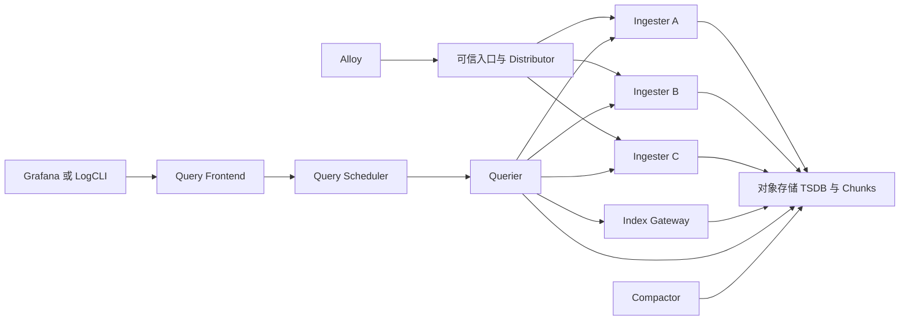
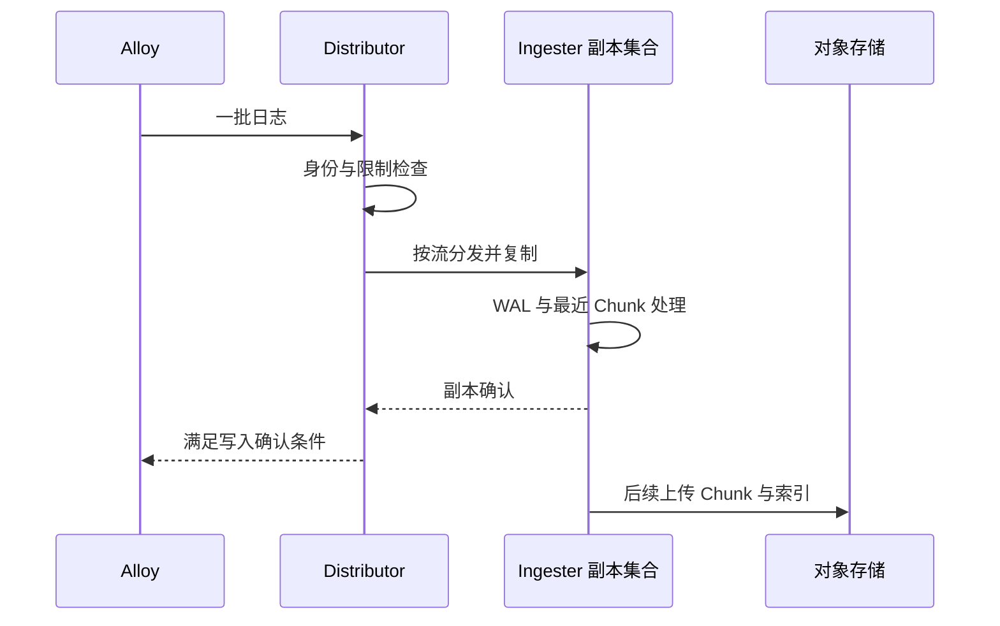
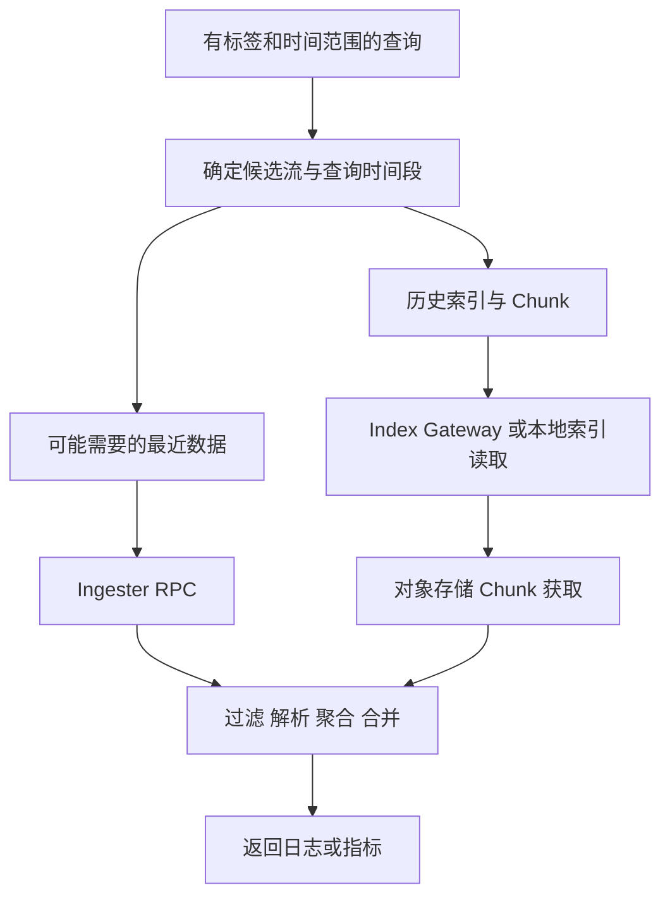
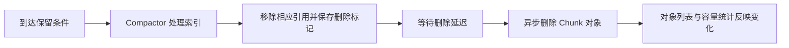

# Loki 学习笔记 · 第二卷：架构、存储与部署

> 面向已经完成文件或 OTLP 日志接入的运维、SRE 与平台工程师。重点是数据在哪里、谁拥有状态，以及故障时哪些操作仍能成立。
> 资料核查：2026-09-24。Loki 3.7.8，Community Helm Chart 18.13.5；Chart 与应用版本独立锁定。[Loki 3.7.8 发布][S-release-loki][Chart 18.13.5 发布][S-chart-release]
> 示例中的资源大小是学习起点，不是压测结论。没有执行真实 Kubernetes、S3、Helm 渲染或 Loki 集群联调；实际验收必须包含配置校验、渲染审查、持久化检查和故障测试。
> 默认沿用第一卷 `lab/`。新存储实验使用新数据目录或新 Release，不覆盖已有实验的历史 Schema。

| 章节 | 学完后应能回答的问题 |
| --- | --- |
| 第 9 章 | 组件名称、部署进程和数据状态是什么关系？ |
| 第 10 章 | 写入成功时，哪些副本已经保存了什么？ |
| 第 11 章 | 查询为什么有时读内存、有时读对象存储？ |
| 第 12 章 | Schema 变更为什么必须保留旧时间段？ |
| 第 13 章 | S3 接入失败时，如何区分认证、路径与存储布局？ |
| 第 14 章 | 单体高可用需要哪些条件，而不只是 replicas=3？ |
| 第 15 章 | 微服务拆分如何对应独立的资源与故障边界？ |
| 第 16 章 | 保留策略、删除标记和对象生命周期怎样协作？ |

## 第 9 章：组件职责与整体数据流

### 9.1 同一二进制可以承担不同角色

Loki 将多个逻辑组件编译在同一个程序中，通过启动 target 选择实际运行的模块。第一卷的单体实例没有消除这些职责，只是把它们放进同一个进程。分布式部署则把职责分到不同工作负载，增加独立扩缩容能力，也增加网络与状态管理成本。[Loki 架构][S-architecture][Loki 组件][S-components]

因此，“看见三个 Pod”不能说明正在使用三副本，也不能说明有三个独立日志后端。先检查实际启动参数、挂载配置和服务路由，再判断组件分工。

```bash
# 在第一卷 lab 中，只读检查镜像、启动参数和构建信息。
docker compose images
docker compose config --quiet
curl --fail --show-error \
  http://127.0.0.1:3100/loki/api/v1/status/buildinfo

# 固定版本二进制可列出支持的 targets。
docker compose run --rm --no-deps loki -list-targets
```

Kubernetes 中也要检查容器 args，而不是仅依赖 Deployment 的名字。名字叫 `loki-write` 的工作负载可能在迁移后改变了 target；旧 ConfigMap 的挂载也可能没有随新镜像更新。

### 9.2 把请求路径与后台任务分开

请求进入时最容易观察到的是 HTTP 成功或失败，后台组件却承担长期保存和清理。缺少后台健康监控时，系统可以暂时读写正常，随后逐步出现容量和历史查询问题。

| 逻辑角色 | 主要工作 | 主要状态或依赖 |
| --- | --- | --- |
| Distributor | 接收、校验、限流、选择写入副本 | Ring 视图、租户限制、下游连接 |
| Ingester | 接收日志、维护最近流与 Chunk、WAL、上传 | 内存流、WAL、本地工作目录、对象存储 |
| Query Frontend | 查询入口、拆分、结果合并、部分缓存协作 | 查询上下文、缓存与调度连接 |
| Query Scheduler | 查询排队与分配 | 等待队列、租户公平性、工作连接 |
| Querier | 执行查询、读取最近和历史数据、聚合 | 查询内存、对象读、Ingester RPC |
| Index Gateway | 提供索引访问能力 | 本地索引副本、同步与对象存储 |
| Compactor | 压缩索引、保留与删除处理 | 工作目录、删除标记、请求存储 |
| Ruler | 定时计算规则与产生派生指标/告警 | 规则、计算状态、remote write WAL |

上表用于定位责任，并不意味着所有模式都会独立部署所有角色。单体下部分内部调用与分布式网络路径不同；当前实验不主动启用 Bloom 等可选组件。[Loki 组件][S-components]

### 9.3 在图中标出两种主要路径



图里没有画出全部监控与控制面请求，也没有把缓存当作唯一事实来源。理解架构时，先问某条日志当前是否还在 Ingester，再问历史索引与 Chunk 能否从对象存储重新找到。

把 Grafana 直接连某个随机组件的 HTTP 端口，可能导致部分 API 正常、另一些返回 404。微服务模式的入口必须把写入、查询、规则管理和删除等路径转到正确角色。第四卷安全章节还要进一步限制哪些角色允许调用哪些路径。

### 9.4 区分数据面、控制面和缓存

数据面承担日志内容的流动，控制面让组件知道成员、配置和租户限制，缓存减少重复工作。三者任何一个异常都可能表现成“查不到”，但修复方法不同。

```text
数据面：日志请求、Chunk 上传、查询结果。
控制面：Ring 成员、服务发现、配置与运行时限制。
缓存：索引下载副本、Chunk 缓存、查询结果缓存。
```

例如对象存储权限失效是数据路径问题；memberlist 无法互通是成员发现问题；缓存容量太小可能只是查询性能下降。不要遇到查询慢就重建 Ring，也不要把临时缓存清空当作所有存储故障的修复方式。

| 场景 | 先验证 | 错误操作的风险 |
| --- | --- | --- |
| 所有写入副本突然不健康 | Ring 和网络 | 删除 WAL 不能修复成员发现 |
| 历史查询出现对象 403 | 存储身份与权限 | 增加 Querier 只会增加失败请求 |
| 某次重启后查询暂时变慢 | 缓存冷启动 | 反复重启导致缓存永远不热 |
| 清理长期没有进展 | Compactor 与删除权限 | 缩短保留期可能加剧任务量 |

### 9.5 用状态所有权决定扩容与备份

“无状态组件”通常表示不拥有必须长期保留的日志事实，并不表示可以在任意时刻杀死进程而毫无影响。查询队列、重试批次和进行中的请求仍可能被中断。

| 状态 | 所有者 | 扩容后的处理 | 是否可只靠重建进程恢复 |
| --- | --- | --- | --- |
| 未刷新的日志 Chunk | Ingester | 旧实例仍须排空或恢复 | 取决于副本、WAL与存储 |
| 源文件读取位置 | Alloy 文件组件 | 保持节点和组件归属 | 丢失后可能重读或跳过 |
| 正在等待的查询 | Frontend/Scheduler | 客户端可能重试 | 不能还原用户已经超时的请求 |
| 已上传日志与索引 | 对象存储 | 所有读写节点遵守同一布局 | 依赖对象仍存在 |
| Compactor 删除标记 | 本地持久目录或受支持对象标记 | 不可任意遗失 | 遗失可能使清理悬而未决 |
| 规则定义 | 配置库或 Ruler 存储 | 统一发布 | 没有外部副本就会丢失策略 |

初始部署设计时给每个状态写一个“归属、保存位置、恢复来源”。这一张表，比单独增加一个名为 backup 的定时任务更接近可恢复系统。

## 第 10 章：写入、Ring、副本与 WAL

### 10.1 一次 HTTP Push 内部可能包含多个流

客户端批量发送的请求可包含多个流和多条日志。Distributor 根据租户及标签集合定位目标 Ingester，并进行协议、时间、标签和配额校验。一个请求失败，不应该直接解释为“里面所有行都完全没有到达”，重试必须考虑部分处理与响应丢失的可能。[Loki HTTP API][S-http][Loki 组件][S-components]



最后一条对象存储上传不是默认等待每个 HTTP Push 同步完成的阶段。因此，“Push 返回成功”不等于“所有日志已经出现在对象存储最终对象里”。需要区分短期可靠性和长期持久化。

### 10.2 Ring 的用途不是保存日志正文

Ring 描述成员和负责的数据范围，使 Distributor 知道同一流应写到哪些节点。memberlist 是传播成员与键值状态的一种方式，不是用于复制日志正文的消息队列。[Hash Rings][S-rings]

初学者常见混淆是：memberlist 端口通了，就认为写入复制也通了。实际还要检查 HTTP 入口、Ingester gRPC、对象存储和查询路径。某些网络策略只允许 TCP 7946 而遗漏成员发现需要的其他流量，同样会让故障变得间歇。

| 配置或概念 | 要回答的问题 |
| --- | --- |
| 实例 ID | 重启前后是否符合设计，多个实例是否意外同名？ |
| 广播地址 | 其他节点能否访问，不是只在本机可用的回环地址？ |
| 加入成员 | 初始种子是否可解析且端口互通？ |
| 心跳与健康 | 实例是故障、离开中，还是还在恢复？ |
| Token 分布 | 数据范围是否合理分配？ |
| 副本选择 | 是否覆盖期望节点与故障域？ |

单体实验使用 `inmemory` Ring，是因为只有一个进程。将它复制成三个彼此独立的进程，不会自动成为一个集群；它们甚至可能各自认为自己是唯一成员。

### 10.3 副本数、确认数与故障域

本专题的经典写入路径使用复制和法定数量确认。以复制因子 3 为例，正常设计应有足够的健康 Ingester 来承载三个副本；多数确认通常对应至少两个副本确认。[Loki 架构][S-architecture]

但“两个确认”不能单独转化为“可以在任何时间任意损坏两个节点”。还要考虑故障发生时哪些节点已经保存数据、对象存储是否上传完成、WAL 是否可恢复，以及副本是否落在同一个故障域。

```text
3 个副本位于同一物理节点：进程级重复，不是节点故障隔离。
3 个副本位于同一机架：可抵御部分节点故障，不一定抵御机架故障。
3 个副本跨可用区：需配套区域感知选择与网络、存储设计。
```

Kubernetes 反亲和保证调度分散，Zone-aware 复制影响副本选择和相关运维，两者不是同一个开关。必须同时检查实际 Pod 分布和 Loki 看到的区域信息，而不是只看 `topologySpreadConstraints` 已写进 YAML。

#### 一个设计验收问题

随机停止一个 Ingester 之前，先回答：当前所有流有几个健康副本？另两个节点是否具备承接新写入的容量？重启节点的 WAL 恢复需要多久？在这段时间是否还允许第二次维护？这些条件比“允许 maxUnavailable=1”更完整。

### 10.4 Ingester WAL 的保护范围

WAL 的目标是帮助 Ingester 在重启后恢复尚未完成长期保存的数据。它依赖持久化目录与恢复过程，不是简单加一个 `enabled: true` 就获得所有场景的零丢失保证。[Ingester WAL][S-wal]

```yaml
# 增量，合并到已有 ingester 块；路径必须位于每实例自己的持久卷。
ingester:
  wal:
    enabled: true
    dir: /var/loki/wal
    replay_memory_ceiling: 1GB
    flush_on_shutdown: true
```

`replay_memory_ceiling` 是恢复过程中的内存约束，不等于容器总内存限制。恢复时还需要索引、Chunk、运行时和查询等额外内存。给容器 1Gi 限制再把 WAL 恢复上限设成 1GB，通常没有给其他部分留出足够余量。

| 故障 | WAL 能提供的帮助 | 仍然存在的边界 |
| --- | --- | --- |
| 进程重启，盘仍在 | 恢复本地记录 | 恢复耗时、损坏段和资源限制 |
| Pod 重建，PVC 重新挂载 | 保持原状态来源 | 调度与卷挂载必须成功 |
| 节点永久损坏且本地盘丢失 | 本地 WAL 本身无法恢复 | 需要其他副本或已上传对象 |
| 磁盘满或写入异常 | 不能继续提供相同持久化保障 | 必须观察写盘错误与告警 |
| 客户端还未发到 Ingester | 无法保护这些日志 | 仍靠来源和采集端缓冲 |

官方 WAL 文档特别讨论磁盘满时的行为：系统可能继续接收数据但无法再以同样方式记录 WAL。因此要监控 WAL 磁盘与写入失败，不能把“HTTP 仍成功”当成 WAL 一定健康。[Ingester WAL][S-wal]

### 10.5 Chunk 为什么会有大小和时间边界

Ingester 不会为每条日志单独写一个对象。它把相同流的一段日志组织成 Chunk，再按大小、年龄、空闲等条件刷新。流切得过细，Chunk 可能长期填不满；单个流吞吐过高，又可能形成热点。[Loki 架构][S-architecture]

理解这一点后，才能解释以下现象：相同每日原始字节数，一组日志可能比另一组产生更多对象请求；一个高基数字段即使没有增加很多正文长度，也可能显著改变后端行为。

| 观察 | 候选解释 | 下一步 |
| --- | --- | --- |
| 大量小 Chunk | 流过细、低速来源多、刷新时间策略 | 统计活跃流和每流速率 |
| 单流限流频繁 | 少数来源形成热点 | 核对标签与自动分流策略 |
| 内存持续增长 | 活跃状态、未刷数据、后端阻塞 | 同时观察流数与上传失败 |
| 对象请求费用高 | 对象碎片、缓存或查询模式 | 不只压缩正文，还看访问次数 |

不在本章给出对所有环境适用的 Chunk 大小调参值。先收集基线和分布，再做单变量调整；同时验证恢复时间和查询性能，避免只让写入指标变好。

### 10.6 过旧、未来与乱序是不同限制

一条日志可以“不是过旧日志”，却仍然因为在同一流中到达太晚而被拒绝。过旧限制通常相对于接收端当前时间，乱序限制则与同一流已经接受的数据时间进度有关。未来日志还可能来源于时钟漂移或单位错误。[配置参考][S-limits][限流与写入校验][S-ingestion]

```text
接收时间：12:00
流中已接受最新事件：11:59
待写事件 A：11:58，轻微迟到。
待写事件 B：当天 01:00，仍在全局保留窗口内，但可能超出乱序窗口。
待写事件 C：明天 12:00，可能是时钟或单位错误。
```

处理顺序应为检查时钟、单位和业务时间，然后评估是否需要分离回放流、限速回放或调整明确的窗口。不要先把所有时间校验关闭。

对于 Kafka 积压恢复，需要计算最旧消息年龄，而不是只看 Lag 条数。如果恢复速度不够，积压可能在消费前已过源端保留或接收端允许窗口。第四卷将把这些约束放进同一个恢复预算。

### 10.7 安全地验证写入确认边界

仅在第一卷隔离环境执行，先生成 A 批次并对账，再停止 Loki，生成 B 批次，随后恢复 Loki 并观察重试和对账。B 批次是否完整取决于中断时长、采集端状态和重试边界；实验目标是测出这些条件，而不是预设一定成功。

```bash
# 只影响本实验的 Loki，不删除卷。
docker compose stop loki
python3 scripts/generate.py --count 100 --rate 10
# 保存新 manifest 和 Alloy 日志，再恢复。
docker compose start loki
curl --fail --show-error http://127.0.0.1:3100/ready
```

恢复后分别查询中断前后数据，并保存第一次查询和稳定后的查询结果。单次空结果可能只是传播未结束；持续缺号才需要沿源文件、读取位置、发送失败和后端拒绝逐层检查。

测试进程崩溃和节点丢失是另一类实验，不能用一次正常停止来替代。不要在生产上直接执行强制 kill，以免绕过排空流程造成不可控风险。

## 第 11 章：查询路径与缓存

### 11.1 最近数据和历史数据可能来自不同位置

一条刚写入的日志还可能由 Ingester 提供，较早的数据通常需要从索引和对象存储读取。查询覆盖两类数据时，需要合并结果和处理副本重复。由于路径不同，“最近五分钟正常、昨天失败”本身就能帮助缩小候选原因。[Loki 架构][S-architecture][Loki 组件][S-components]



这张图是职责示意，不代表后端总是先完整查询内存、没有结果才读取对象。实际查询会根据配置、时间范围和执行计划访问相应来源；排障时应检查真实请求统计与日志，而不是假定固定顺序。

### 11.2 Frontend 拆分与 Scheduler 排队

查询一整天的日志，不一定由一个 Querier 从头处理到尾。Frontend 可以按时间等维度拆成多个子查询，由调度层安排工作，再合并结果。拆分有助于并行，也可能增加下游请求和队列压力。[Query Frontend][S-query-frontend][查询公平性][S-query-fairness]

| 阶段 | 主要开销 | 为什么增加 Querier 不一定有效 |
| --- | --- | --- |
| 入口解析与计划 | 查询结构、限制、拆分 | 入口本身可能受资源或连接限制 |
| 队列等待 | 并发配额与工作者供给 | 租户限制仍然约束可执行数量 |
| 索引定位 | 索引同步与读取 | 对象或索引服务可能是瓶颈 |
| Chunk 读取 | 网络、请求数、缓存命中 | 存储已达到带宽或请求上限 |
| 解压与计算 | CPU、内存、解析复杂度 | 过宽查询仍会扫描大量数据 |
| 合并返回 | 结果集和序列数 | 最终响应规模也可能不可控 |

在大查询期间保护在线排障能力，需要租户公平性、查询预算和必要的工作负载隔离。只把超时从一分钟改成十分钟，可能让更多请求堆积而不是解决问题。

### 11.3 三类缓存不要混为一谈

缓存可能保存查询结果、Chunk 内容或本地索引下载副本。它们位于不同位置、键不同、有效期和失效条件不同。观察“缓存命中率”时，必须说明是哪一类缓存。[缓存][S-cache]

| 缓存对象 | 命中后减少的工作 | 不解决的问题 |
| --- | --- | --- |
| 查询结果 | 重复查询的部分执行 | 新时间范围或不同查询仍可能昂贵 |
| Chunk 内容 | 重复对象读取 | JSON/正则解析仍消耗计算 |
| 索引本地副本 | 重复索引下载 | 找到 Chunk 不等于无需读取正文 |

不要把缓存当作数据备份。缓存可淘汰、可能不完整，也不保证包含当前恢复所需对象。删除正式对象后仍能短暂查到某些数据，可能只是缓存尚未过期，并不证明删除安全。

### 11.4 冷查询与热查询要分开测量

使用相同选择器和相同绝对时间范围查询两次，第二次更快可能是缓存效果。使用“最近十五分钟”每次查询，起止范围在变化，不能严格称为同一查询。

```bash
# 为一次实验固定绝对起止时间；示例值需要替换为真实样本区间。
curl --fail --show-error --get \
  http://127.0.0.1:3100/loki/api/v1/query_range \
  --data-urlencode 'query={cluster="lab",job="access"} |= "503"' \
  --data-urlencode 'start=1790208000000000000' \
  --data-urlencode 'end=1790208600000000000' \
  --data-urlencode 'limit=1000' \
  --data-urlencode 'direction=forward' > reports-query.json
```

查询原始 JSON 可以保存 `data.stats`，但其中字段会随版本和执行路径变化。报告应保留原结构，随后按实际字段提取扫描字节数、执行时间、排队时间和缓存等信息，不把缺失字段自动补零当成事实。[Loki HTTP API][S-http]

| 实验项 | 固定条件 | 记录结果 |
| --- | --- | --- |
| 首次查询 | 同一绝对范围与查询 | 耗时、扫描量、缓存、条数 |
| 重复查询 | 不改变范围和正文过滤 | 同上，并注明热缓存 |
| 增加选择器 | 同一事件集目标 | 结果是否一致、扫描是否减少 |
| 先过滤后解析 | 同一语义 | 结果相同才可比较性能 |

### 11.5 全量导出不是滚动浏览

Grafana 显示的最大行数、API `limit` 和后端查询限制各自独立。Live tail 是观察新日志的工具，不是完整历史导出接口。第一卷客户端通过半开时间分片处理饱和窗口，仍需要稳定数据和明确预算。[Loki HTTP API][S-http]

一个常见错误是每次用最后一行时间作为下一页起点，再加一纳秒。若同一纳秒内还有未返回日志，这些日志会被永久跳过。另一种错误是一直使用相同起点，导致循环读取重复页。

```text
错误分页：上一页最后 ts + 1 → 可能跳过同一 ts 剩余事件。
错误去重：正文相同就只留一行 → 不同请求可能恰好打印同样内容。
受控做法：分割时间范围；饱和的单纳秒窗口明确失败；保留唯一事件 ID。
```

对审计或严格对账用途，还要定义服务端查询合并重复的语义、迟到数据窗口和导出期间的保留清理影响。一个成功退出的脚本不应自动获得“不可否认的全量事实”地位。

### 11.6 查询路径的故障分层

| 现象 | 优先检查 | 不宜先做 |
| --- | --- | --- |
| 新日志能查，旧日志不行 | Schema、索引、对象权限 | 全部重装 Alloy |
| 旧日志正常，新日志不行 | Ingester 状态、写入拒绝、最近查询路径 | 删除对象缓存 |
| API 能查，Grafana 不行 | 数据源、租户、时间、查询限制 | 重建集群 |
| 简单查询正常，聚合失败 | `__error__`、序列上限、内存 | 提高所有限制 |
| 同一查询重复后更快 | 缓存和对象读取 | 把热缓存成绩当成稳定基线 |

本章的目标不是记住所有指标名，而是能根据现象判断下一次请求应该打到哪一层，并保留足以证明判断的响应和配置。

## 第 12 章：TSDB、Schema 与历史时间段

### 12.1 TSDB 索引不是 Prometheus 指标数据库的完整替代

Loki 使用 TSDB 形式的索引来定位日志流及关联的数据块，但日志内容仍在 Chunk 中。它借用了适合索引的结构，不表示可以用 PromQL 查询 Loki 的原始日志，也不表示把日志文本全部变成了指标样本。[TSDB 索引][S-tsdb][Loki 架构][S-architecture]

新建实验采用 TSDB、Schema v13 和 24 小时索引周期。读者不需要先搭建旧式分离索引数据库，再为了“最新”迁移一次；旧 BoltDB Shipper 只作为识别存量配置的知识。

| 概念 | 决定什么 | 不决定什么 |
| --- | --- | --- |
| `store: tsdb` | 索引实现 | 采集端用什么协议 |
| `schema: v13` | 存储 Schema 能力 | 日志业务字段的语义版本 |
| `object_store: s3` | 该时间段的数据存储后端类型 | S3 服务自身的可靠性级别 |
| `index.period: 24h` | 索引组织时间周期 | 日志只保存 24 小时 |
| `from` | 此配置段的生效日期 | 容器镜像发布日期 |

### 12.2 Schema 配置是一条时间轴

Schema 的每一段对应一个从某日期开始适用的存储规则。已有数据仍需要原来的段来解释与定位，所以修改配置时保留历史段，并在未来 UTC 日期追加新段。[存储 Schema][S-schema]

```yaml
# 教学结构：假设这是一个原本就使用 S3 的实例。
schema_config:
  configs:
    - from: "2026-01-01"
      store: tsdb
      object_store: s3
      schema: v13
      index:
        prefix: index_
        period: 24h
    - from: "2026-10-01"
      store: tsdb
      object_store: s3
      schema: v13
      index:
        prefix: index_v2_
        period: 24h
```

示例只是展示“保留原段、追加新段”，不是推荐无理由修改索引前缀。新段日期是 2026-10-01 的 UTC 零点；在 UTC+8 的机器上，不能误以为本地零点就已经切换。

如果旧实例原来使用 filesystem，把旧段的 `object_store` 直接改成 s3，会让过去的时间范围按错误后端查找。数据不会因为修改一个字符串自动迁移到 Bucket 中。

### 12.3 迁移前准备三张表

| 时间段 | 当前 Schema | 数据实际位置 | 后续查询需要保留什么 |
| --- | --- | --- | --- |
| 旧时间范围 | 原始段 | 原目录/原 Bucket | 原段及可访问的原后端 |
| 切换边界附近 | 新旧并存 | 可能跨两个后端 | 两段都可解析，时钟一致 |
| 新时间范围 | 新增段 | 新 Bucket/新布局 | 新配置与写入权限 |

第二张表记录每个运行组件拿到的配置摘要，避免某些节点已经使用新 Schema、另一些仍停留在旧配置。第三张表记录回滚条件：如果新段已经产生数据，旧版本或旧配置是否还能读取它？

“回滚 Deployment 镜像”不能自动回滚已经写出的数据布局。真正的回滚步骤必须说明如何维持新旧数据的可读性，或在隔离环境明确接受丢弃测试数据。

### 12.4 只读 Schema 检查脚本

文件：`lab/scripts/check_schema.py`。脚本需要 PyYAML，仅检查时间顺序、基础约定和历史段是否被改写，不替代 Loki 的配置校验。

```python
#!/usr/bin/env python3
"""只读检查 Schema 时间段；需要 PyYAML，不等同于 Loki -verify-config。"""
from __future__ import annotations
import argparse
from datetime import date, datetime, timezone
from pathlib import Path
import sys
import yaml

class UniqueLoader(yaml.SafeLoader):
    pass

def unique_map(loader, node, deep=False):
    result = {}
    for key_node, value_node in node.value:
        key = loader.construct_object(key_node, deep=deep)
        if key in result:
            raise ValueError(f"重复 YAML 键：{key}")
        result[key] = loader.construct_object(value_node, deep=deep)
    return result

UniqueLoader.add_constructor(yaml.resolver.BaseResolver.DEFAULT_MAPPING_TAG, unique_map)

def normalize_day(value) -> date:
    if isinstance(value, datetime):
        raise ValueError("from 使用 UTC 日期，不接受带任意时刻的 datetime")
    if isinstance(value, date):
        return value
    return date.fromisoformat(str(value))

def inspect(config: dict, now: datetime) -> list[dict]:
    blocks = config.get("schema_config", {}).get("configs", [])
    if not blocks:
        raise ValueError("缺少 schema_config.configs")
    result = []
    previous = None
    for block in blocks:
        day = normalize_day(block["from"])
        if previous is not None and day <= previous:
            raise ValueError("from 必须严格递增，不能重复或倒序")
        previous = day
        if block.get("store") == "tsdb" and block.get("index", {}).get("period") != "24h":
            raise ValueError("本专题 TSDB 基线要求 index.period=24h")
        result.append({"from": day.isoformat(), "store": block.get("store"),
                       "schema": block.get("schema"),
                       "object_store": block.get("object_store"),
                       "future": day > now.astimezone(timezone.utc).date()})
    active = [b for b in result if not b["future"]]
    if not active:
        raise ValueError("当前 UTC 时间没有生效 Schema")
    return result

def check_history(old: dict, new: dict) -> None:
    old_blocks = old.get("schema_config", {}).get("configs", [])
    new_blocks = new.get("schema_config", {}).get("configs", [])
    if new_blocks[:len(old_blocks)] != old_blocks:
        raise ValueError("历史 Schema 段被删除或修改；需要人工迁移评审")

def load(path: Path) -> dict:
    data = yaml.load(path.read_text(encoding="utf-8"), Loader=UniqueLoader)
    if not isinstance(data, dict):
        raise ValueError("配置必须是 YAML 映射")
    return data

def main() -> None:
    parser = argparse.ArgumentParser(description=__doc__)
    parser.add_argument("config", type=Path)
    parser.add_argument("--previous", type=Path)
    args = parser.parse_args()
    try:
        new = load(args.config)
        if args.previous:
            check_history(load(args.previous), new)
        report = inspect(new, datetime.now(timezone.utc))
        import json
        print(json.dumps(report, ensure_ascii=False, indent=2))
    except (OSError, ValueError, KeyError, TypeError, yaml.YAMLError) as exc:
        parser.exit(1, f"Schema 检查失败：{exc}\n")

if __name__ == "__main__":
    main()
```

```bash
# 在独立虚拟环境准备脚本依赖，生产应由依赖锁定文件管理。
python3 -m venv .venv
. .venv/bin/activate
python -m pip install 'PyYAML==6.0.2'

python scripts/check_schema.py loki/loki.yaml
python scripts/check_schema.py loki/proposed.yaml --previous loki/current.yaml
```

这里固定 PyYAML 只是让教学解析行为有明确落点，不表示它是核查日最新版。组织若已有受维护依赖基线，应使用其锁定版本并重新测试。

脚本将“历史段发生变化”作为需要人工评审的错误。某些真实迁移确实需要复杂调整，但不能让一个通用脚本为了方便自动放行所有差异。

### 12.5 本地索引目录与共享存储

`active_index_directory` 保存写入侧的活动索引文件，`cache_location` 保存本地读取缓存，两者都不等于远端对象存储。不同 Ingester 的活动目录不应指向同一可写共享路径，除非明确了解组件的并发访问契约。

```yaml
storage_config:
  tsdb_shipper:
    active_index_directory: /var/loki/tsdb-index
    cache_location: /var/loki/tsdb-cache
```

缓存可能可以重建，但活动状态与未上传数据需要单独评估。不要因为目录名都在 `/var/loki` 下，就在清理脚本中用一个通配符删除所有子目录。

| 目录或对象 | 常见责任 | 清理前的问题 |
| --- | --- | --- |
| WAL | 最近接收数据的恢复 | 是否仍有未完成持久化记录？ |
| Active index | 当前索引构建与上传 | 是否已经上传并能重建？ |
| Index cache | 加速访问 | 冷启动影响是否可承受？ |
| Compactor working | 压缩与删除处理状态 | 删除标记是否还在这里？ |
| Bucket 中的 index | 历史查询定位 | 不能套用普通临时文件规则 |

### 12.6 验证跨日与跨配置段查询

至少生成三组样本：边界前、边界后，以及查询窗口横跨边界。对于真实未来切换，可以提前定义验收计划，等日期到达后执行；对于隔离实验，可以使用过去的两个有效时间段和受控历史样本，但要同时调整接收时间限制并记录原因。

测试结果要包含原始事件时间和请求时间。时间边界附近的“偶发缺失”可能来自时区、写入拒绝、Schema 配置不一致或查询端实际范围，而不一定是对象存储随机丢失。

不要在生产系统为了演示而修改历史 Schema 日期。学习目的可以用独立实例完成，生产变更必须有完整的数据定位与恢复方案。

## 第 13 章：对象存储与存储客户端

### 13.1 从“桶里有对象”到“数据能够恢复”

对象存储承担长期保存，但“能上传一个文件”不是 Loki 存储验收。日志 Chunk、索引、规则以及删除任务状态有不同生命周期；访问权限、目录前缀、租户、Schema 和加密密钥任何一项不一致，都可能使对象存在却无法被当前查询找到。[存储配置][S-storage][Thanos 存储客户端][S-thanos]

本章使用已经由存储管理员创建的**独立实验 Bucket**。不把某个 S3 兼容产品的镜像、磁盘、IAM、证书配置藏在一条安装命令里。具体服务必须另外记录产品版本、持久卷、恢复策略及运维责任；支持 S3 接口不自动意味着具有云对象存储同等的容错能力。

| 验证层 | 必须取得的证据 | 仍不能说明什么 |
| --- | --- | --- |
| DNS / TCP | 从实际 Loki Pod 到 Endpoint 可达 | TLS、权限与请求签名正确 |
| TLS | 证书链、名称、有效期正确 | Bucket 和 Prefix 授权正确 |
| 写入 | 独立实验前缀能 Put | 历史对象能读，索引能列举 |
| 读取 | Get 返回已知内容与校验值 | Loki Schema 和租户匹配 |
| 列举 | 指定前缀列表可读 | 删除请求有权限 |
| 删除 | 实验对象能删除 | 保留规则真的命中业务流 |
| 应用恢复 | 新查询进程能查到已上传的旧事件 | 尚在 WAL 中的数据也已进入对象存储 |

把这些检查在**和 Loki 相同的网络与身份条件下**执行。笔记本能够访问，不证明 Kubernetes 节点出网、防火墙、私有 DNS 或 Workload Identity 正常。

#### 不用生产桶做权限实验

用于权限验证的对象名可以是 `diagnostics/<随机批次>/probe.txt`，且实验账号只允许该测试范围。不要为了证明删除权限执行整桶递归删除，也不要把生产 Loki Prefix 当成临时测试路径。

存储提供商的 SDK、CLI、签名和证书选项应以其对应版本为准。本文不提供一个默认关闭 TLS 校验的“万能 S3 检查命令”。

### 13.2 两套 S3 配置空间不能拼接

Loki 当前提供传统存储客户端以及 Thanos object-store 客户端路径。本笔记的独立 S3 配置使用后者；后面的 Helm 教学值则使用 Chart 明确提供的传统 `loki.storage.s3` 字段。两条路径都是有版本落点的示例，不应把它们复制到同一个配置层级。[Thanos 存储客户端][S-thanos][Chart 18.13.5 values][S-chart-values]

| 项目 | 直接 Loki 配置：Thanos 路径 | Chart 高层传统 S3 配置 |
| --- | --- | --- |
| 启用入口 | `storage_config.use_thanos_objstore` | `loki.storage.type: s3` |
| S3 参数父键 | `storage_config.object_store.s3` | `loki.storage.s3` |
| Bucket | `bucket_name` | `loki.storage.bucketNames.chunks` 等 |
| Access Key | `access_key_id` | `accessKeyId` |
| Secret Key | `secret_access_key` | `secretAccessKey` |
| Endpoint 示例 | `s3.example.internal:443` | `https://s3.example.internal` |
| 生成结果 | 直接交给 Loki | 先由 Helm 模板转换为 Loki 配置 |

Thanos 示例的 `insecure: false` 表示使用安全传输。**不要把 `insecure: true` 理解为“安全地信任一个自签证书”**；需要私有 CA 时应配置对应客户端的 CA 信任链，而不是改成明文 HTTP。供应商的 Region、路径寻址方式和签名行为也必须与客户端一致。

环境变量替换需要 Loki 参数 `-config.expand-env=true`；仅在 Pod 中定义变量不会自动替换配置文本。查看渲染结果时保留 `${S3_ACCESS_KEY_ID}` 是正常的，但查看实际进程配置时可能泄露展开后的秘密，因此配置调试输出必须当成敏感数据。

### 13.3 独立的 S3 单体实验

完整文件：`lab/loki/loki-s3.yaml`。这份配置用于一个**新建的 S3 实验实例**，不是将第一卷已经有日志的 `filesystem` 配置直接覆盖。

```yaml
# 新建隔离单实例的完整 S3 配置。不能覆盖已有 filesystem 实例的历史 Schema。
auth_enabled: false
server:
  http_listen_port: 3100
  grpc_listen_port: 9095
  log_level: info
common:
  instance_addr: 127.0.0.1
  path_prefix: /loki
  replication_factor: 1
  ring:
    kvstore:
      store: inmemory
schema_config:
  configs:
    - from: "2026-01-01"
      store: tsdb
      object_store: s3
      schema: v13
      index:
        prefix: index_
        period: 24h
storage_config:
  tsdb_shipper:
    active_index_directory: /loki/tsdb-index
    cache_location: /loki/tsdb-cache
  use_thanos_objstore: true
  object_store:
    s3:
      bucket_name: ${S3_BUCKET}
      endpoint: ${S3_ENDPOINT}
      region: ${S3_REGION}
      access_key_id: ${S3_ACCESS_KEY_ID}
      secret_access_key: ${S3_SECRET_ACCESS_KEY}
      insecure: false
ingester:
  wal:
    enabled: true
    dir: /loki/wal
    replay_memory_ceiling: 256MB
    flush_on_shutdown: true
compactor:
  working_directory: /loki/compactor
limits_config:
  allow_structured_metadata: true
  reject_old_samples: true
  reject_old_samples_max_age: 168h
  max_entries_limit_per_query: 5000
  query_timeout: 1m
analytics:
  reporting_enabled: false
```

准备以下环境变量，值由已建好的实验存储提供：

```text
S3_BUCKET            独立实验桶名称
S3_ENDPOINT          不带协议的 Endpoint，例如 s3.example.internal:443
S3_REGION            该服务要求的 Region
S3_ACCESS_KEY_ID     限定实验范围的 Access Key
S3_SECRET_ACCESS_KEY 对应 Secret Key
```

从已有 lab 创建独立目录 `s3-lab/`，保留原实验不动。将这份文件作为新 Loki 的配置，为新实例分配不同 named volume 和宿主端口，并把所需变量通过 `env_file` 或 Secret 注入容器。不要把 `.env` 里的变量仅用于 Compose 文本替换，却忘记传入 Loki 进程环境。

以下是该新实例所需的 Compose 服务结构；它不包含 Grafana 和采集器，客户端暂时用第 1 卷的 HTTP 脚本连接新端口。

```yaml
# s3-lab/compose.yaml；独立实验。s3.env 不提交到版本控制。
name: loki-s3-lab
services:
  loki:
    image: grafana/loki:3.7.8
    command:
      - -config.file=/etc/loki/loki.yaml
      - -config.expand-env=true
    env_file:
      - ./s3.env
    ports:
      - 127.0.0.1:13100:3100
    volumes:
      - ./loki.yaml:/etc/loki/loki.yaml:ro
      - loki-s3-state:/loki
    stop_grace_period: 120s
volumes:
  loki-s3-state: {}
```

完整配置检查和启动：

```bash
# 在 s3-lab 目录执行；配置文件由上面的 Loki S3 文件保存为 loki.yaml。
chmod 600 s3.env
# config 输出可能包含凭据，使用 -q 只检查结构。
docker compose config -q
docker compose run --rm --no-deps loki \
  -config.file=/etc/loki/loki.yaml \
  -config.expand-env=true \
  -verify-config=true
docker compose up -d
curl --fail --max-time 10 http://127.0.0.1:13100/ready
```

验证命令是读者应执行的步骤，本次未在真实存储上执行。配置语法通过也不验证外部 Bucket 权限与持久化行为。

### 13.4 证明历史查询真的使用了对象存储

简单重启可能从原 WAL 恢复，因而不能单独证明对象存储可读。建议采用以下隔离实验，且全程保留原卷作为恢复点：

1. 向新 S3 实验写入少量有唯一事件 ID 的日志，记录时间窗口。
2. 等待或通过正常关闭触发当前配置的刷新过程，观察上传成功和相应对象出现。
3. 保留原实例，另外创建**只用于查询验证**的隔离实例或部署，使用相同历史 Schema、相同租户、同一实验对象存储，但不同本地状态目录；禁止它接收业务写入和执行删除。
4. 在这个查询环境中检索原事件，并对照内容，而不是只观察“有若干行”。
5. 结束后只清理临时查询资源，保留实验数据直到对账记录完成。

这不是让两套互不知情的生产集群同时管理同一个桶。实际恢复部署需要明确哪个集群拥有写入、Compactor 和删除职责；直接让两个完整 `target=all` 实例群独立维护同一存储可能造成控制职责冲突。

#### 日常需要保存哪些信息

| 信息 | 用途 |
| --- | --- |
| Bucket 与实际对象前缀 | 防止恢复时指向另一个存储范围 |
| 租户标识 | 单租户 `fake` 与多租户不能随意互换 |
| 完整 Schema 历史 | 正确解释各时间段的数据位置与格式 |
| KMS / SSE 密钥依赖 | 对象存在但密钥不可用仍不能恢复 |
| Loki 版本、启动参数、镜像摘要 | 避免恢复环境使用不兼容配置 |
| Compactor 与删除任务状态 | 防止恢复中重复或错误执行删除 |
| 经验证的时间窗口和事件 ID | 给恢复结果一个可以复查的目标 |

### 13.5 从存储流量理解费用与性能

日志存储费用不是只看“压缩后多少 GB”。一次宽范围查询还可能产生大量 List/Get 请求、网络传输、解压与解析 CPU。很多很小的 Stream 产生很多小 Chunk，既增加元数据管理，也可能增加对象操作次数。[存储配置][S-storage][缓存][S-cache]

一个面向日志平台的成本表至少分成四栏：

| 成本项 | 建议计量方式 | 常见误判 |
| --- | --- | --- |
| 保存数据 | 物理对象字节 × 保留时间 | 把原始文本字节直接当最终存储量 |
| 对象请求 | Put/Get/List/Delete 调用次数 | 认为查询不产生额外费用 |
| 网络 | 同区、跨区、出网分别统计 | 所有流量套用一个单价 |
| 计算与缓存 | 组件 CPU、内存、缓存命中及重建 | 缓存加倍就假设总费用下降 |

优化前先记录一段稳定负载，再改变标签、Chunk 或缓存策略中的一个变量。仅看到 Bucket 增长速度下降，不足以证明查询体验和恢复目标仍然满足要求。

## 第 14 章：Monolithic 与高可用单体部署

### 14.1 固定 Chart，而不是复制浮动安装命令

本节采用已发布的 Community Chart `18.13.5`，Loki 镜像固定 `3.7.8`。Chart 声明 Kubernetes 最低版本为 `>=1.25.0-0`；这是模板兼容门槛，不是建议现在新建一个已经陈旧的 Kubernetes 1.25 集群。[Chart 18.13.5 发布][S-chart-release][Chart 18.13.5 values][S-chart-values]

Helm、kubectl 与实际 Kubernetes 版本记录到实验清单中；本笔记不指定一个未经验证的宿主集群组合。

```bash
helm repo add grafana-community https://grafana-community.github.io/helm-charts
helm repo update
mkdir -p lab/vendor lab/rendered
helm pull grafana-community/loki --version 18.13.5 --destination lab/vendor
helm show chart lab/vendor/loki-18.13.5.tgz
helm show values lab/vendor/loki-18.13.5.tgz > lab/vendor/loki-18.13.5.values.yaml
```

保存 Chart 包、摘要和实际镜像清单，而不是只保存一条 `helm install` 历史。仓库里的 values 变化时，旧实验仍应该可以被重现。

#### `Monolithic` 不等于把所有键改成 `monolithic`

在这版 Chart 中，`deploymentMode` 使用 `Monolithic`，组件配置仍在 `singleBinary` 下。模板中的组件标签也可能保留 `single-binary`。旧命名与新模式名同时存在，不表示其中一个可随意删除。[Chart 18.13.5 values][S-chart-values]

同样，`loki.structuredConfig` 是高级替代入口，可能覆盖模板生成的完整配置。只想改一个限额时优先使用专门的 values 区域，不要提供一个只有两行的 structuredConfig 却以为其他自动配置会保留。

### 14.2 单副本 Kubernetes 实验

完整文件：`lab/helm/values-monolithic.yaml`。这是**单副本、本地 PVC、未认证、仅集群内部访问**的教学起点。

```yaml
# 固定 Chart 18.13.5；隔离 Kubernetes 学习环境，不提供外部认证。
deploymentMode: Monolithic
loki:
  image:
    tag: "3.7.8"
  auth_enabled: false
  commonConfig:
    replication_factor: 1
  schemaConfig:
    configs:
      - from: "2026-01-01"
        store: tsdb
        object_store: filesystem
        schema: v13
        index:
          prefix: index_
          period: 24h
  storage:
    type: filesystem
  limits_config:
    allow_structured_metadata: true
    volume_enabled: true
  ingester:
    wal:
      enabled: true
      dir: /var/loki/wal
      replay_memory_ceiling: 256MB
      flush_on_shutdown: true
  analytics:
    reporting_enabled: false
singleBinary:
  replicas: 1
  sidecar: false
  persistence:
    enabled: true
    size: 10Gi
    enableStatefulSetAutoDeletePVC: false
  terminationGracePeriodSeconds: 120
  resources:
    requests:
      cpu: 250m
      memory: 512Mi
    limits:
      cpu: "2"
      memory: 2Gi
read:
  replicas: 0
write:
  replicas: 0
backend:
  replicas: 0
gateway:
  enabled: true
  replicas: 1
  service:
    type: ClusterIP
chunksCache:
  enabled: false
resultsCache:
  enabled: false
lokiCanary:
  enabled: false
minio:
  enabled: false
```

先渲染，不直接安装：

```bash
helm template loki-mono lab/vendor/loki-18.13.5.tgz \
  --namespace loki-mono-lab \
  -f lab/helm/values-monolithic.yaml \
  > lab/rendered/monolithic.yaml

# 需要实际集群上下文；server dry-run 会访问 API，但不会保存对象。
kubectl create namespace loki-mono-lab --dry-run=client -o yaml | kubectl apply -f -
kubectl apply --dry-run=server -f lab/rendered/monolithic.yaml
```

在渲染结果里至少核对：真实镜像 tag、单体副本数、`-target=all`、实际 Loki 配置、PVC 与挂载位置、服务端口、网关路由、是否意外启用了额外缓存和 Canary。由于这组值没有启用认证，不能直接加一个公共 LoadBalancer 了事。

完整只读清单检查器：`lab/scripts/render_inventory.py`。依赖前一章的 `check_schema.py` 与同一 PyYAML 环境；只列出对象结构，不打印 ConfigMap 或 Secret 内容。

```python
#!/usr/bin/env python3
"""Read a Helm-rendered multi-document YAML; never contact a cluster."""
from __future__ import annotations
import argparse
import base64
import json
from pathlib import Path
import yaml
from check_schema import UniqueLoader


def inspect(text: str) -> dict:
    objects = list(yaml.load_all(text, Loader=UniqueLoader))
    result = {"workloads": [], "services": [], "configs": []}
    for obj in objects:
        if not obj:
            continue
        if not isinstance(obj, dict):
            raise ValueError("manifest document must be an object")
        kind, name = obj.get("kind"), obj.get("metadata", {}).get("name", "")
        spec = obj.get("spec", {})
        if kind in ("Deployment", "StatefulSet", "DaemonSet"):
            pod = spec.get("template", {}).get("spec", {})
            result["workloads"].append({
                "kind": kind, "name": name, "replicas": spec.get("replicas"),
                "containers": [{"name": c.get("name"), "image": c.get("image"),
                                "args": c.get("args", []),
                                "mounts": c.get("volumeMounts", [])}
                               for c in pod.get("containers", [])],
                "claims": spec.get("volumeClaimTemplates", []),
                "volumes": pod.get("volumes", []),
            })
        elif kind == "Service":
            result["services"].append({"name": name, "type": spec.get("type"),
                                       "ports": spec.get("ports", [])})
        elif kind in ("ConfigMap", "Secret"):
            # Do not print content or credentials; report keys and byte lengths only.
            for key, value in obj.get("data", {}).items():
                if not isinstance(value, str):
                    continue
                size = len(value.encode())
                if kind == "Secret":
                    size = len(base64.b64decode(value, validate=True))
                result["configs"].append({"kind": kind, "name": name,
                                          "key": key, "bytes": size})
    return result


def main() -> None:
    parser = argparse.ArgumentParser(description=__doc__)
    parser.add_argument("manifest", type=Path)
    args = parser.parse_args()
    print(json.dumps(inspect(args.manifest.read_text()), ensure_ascii=False, indent=2))


if __name__ == "__main__":
    main()
```

```bash
python lab/scripts/render_inventory.py lab/rendered/monolithic.yaml \
  > lab/rendered/monolithic.inventory.json
```

清单检查器不会验证每个 Chart 字段的语义，也不会调用 Loki。它的作用是把“我以为生成了什么”变成一个可以阅读的资源摘要。JSON 输出中的命令参数也可能被使用者写入秘密，生产环境仍应避免把参数当成凭据载体。

确认渲染和准入结果后再安装：

```bash
helm upgrade --install loki-mono lab/vendor/loki-18.13.5.tgz \
  --namespace loki-mono-lab \
  -f lab/helm/values-monolithic.yaml \
  --wait --timeout 10m
kubectl -n loki-mono-lab get pods,pvc,svc
```

`--wait` 通过仍然只是资源就绪。继续从网关写入一批日志并查询，核对实际事件 ID。网关 Service 名称以 `kubectl get svc` 输出为准，尤其使用 `fullnameOverride` 时不要盲猜名字。

### 14.3 PVC 与进程启动问题

PVC 是 Kubernetes 存储声明，不是数据自动备份。一个 PVC 指向本地磁盘时，Pod 跨节点重调度不一定能使用该盘；网络存储也需要单独讨论吞吐、故障域和快照恢复能力。[Kubernetes 持久卷][S-k8s-storage]

```bash
kubectl -n loki-mono-lab get pvc -o wide
kubectl -n loki-mono-lab describe pvc
kubectl -n loki-mono-lab get events --sort-by=.lastTimestamp
kubectl -n loki-mono-lab get pods -o wide
```

| 现象 | 先检查 | 不应立即执行 |
| --- | --- | --- |
| PVC Pending | StorageClass、配额、拓扑、Provisioner | 删除所有 PVC 重装 |
| Permission denied | UID/GID、fsGroup、目录实际权限 | 给全部 Pod 加 privileged |
| Pod Pending | 资源、反亲和、节点选择、PVC 可挂载性 | 无差别关闭反亲和 |
| 启动反复超时 | WAL 重放、磁盘速度、Startup Probe | 清空 WAL 换取“正常启动” |
| 网关 502 | Ready Endpoint、目标端口、路由配置 | 在采集端无限增加重试 |

状态目录路径必须与渲染出来的 Loki 配置一致。PVC 挂在 `/var/loki`，但 WAL 配到了容器临时目录，是一个看上去“已经配置持久化”的隐蔽错误。

### 14.4 高可用单体的新建实验

HA 示例基于三个可调度节点、独立 S3 实验桶以及可用的存储凭据。这里使用**新 Release 与新 Namespace**，而不是把单副本 filesystem 存量数据一键改成 S3。

增量文件：`lab/helm/values-ha-overlay.yaml`，叠加到上面的单体值文件。

```yaml
# 新建 HA 实验：叠加到 values-monolithic.yaml，不用于把已有 filesystem 数据原地迁移。
loki:
  commonConfig:
    replication_factor: 3
  schemaConfig:
    configs:
      - from: "2026-01-01"
        store: tsdb
        object_store: s3
        schema: v13
        index:
          prefix: index_
          period: 24h
  storage:
    type: s3
    bucketNames:
      chunks: loki-lab-chunks
      ruler: loki-lab-rules
    # 此例采用当前 Chart 仍支持的经典客户端；13.2 节另给 Thanos 配置。
    use_thanos_objstore: false
    s3:
      endpoint: https://s3.example.internal
      region: lab-region
      s3ForcePathStyle: true
      insecure: false
      accessKeyId: ${S3_ACCESS_KEY_ID}
      secretAccessKey: ${S3_SECRET_ACCESS_KEY}
singleBinary:
  replicas: 3
  extraArgs:
    - -config.expand-env=true
  extraEnvFrom:
    - secretRef:
        name: loki-s3-auth
  persistence:
    enabled: true
    size: 20Gi
    enableStatefulSetAutoDeletePVC: false
  podDisruptionBudget:
    enabled: true
    maxUnavailable: 1
  terminationGracePeriodSeconds: 300
gateway:
  replicas: 2
```

这个文件采用传统 S3 Chart 入口，所以 Endpoint 写法与第 13 章的 Thanos 直接配置不同。请先用自己实验存储的 Bucket、Region 和 Endpoint 替换示例值。它还依赖名为 `loki-s3-auth` 的 Secret，提供 `S3_ACCESS_KEY_ID`、`S3_SECRET_ACCESS_KEY`；通过已有 Secret 管理流程创建，不把真实值写进 values 或 shell 历史。

```bash
# 先创建 loki-ha-lab Namespace 与 Secret，再渲染和验证。
helm template loki-ha lab/vendor/loki-18.13.5.tgz \
  --namespace loki-ha-lab \
  -f lab/helm/values-monolithic.yaml \
  -f lab/helm/values-ha-overlay.yaml \
  > lab/rendered/ha.yaml
python lab/scripts/render_inventory.py lab/rendered/ha.yaml

helm upgrade --install loki-ha lab/vendor/loki-18.13.5.tgz \
  --namespace loki-ha-lab \
  -f lab/helm/values-monolithic.yaml \
  -f lab/helm/values-ha-overlay.yaml \
  --wait --timeout 10m
```

合并顺序有意义：后面的 map 覆盖前面的同名值，列表通常整体替换。尤其 `schemaConfig.configs`、环境变量列表、PVC claims，不是按元素语义自动合并。

#### 要同时成立的高可用条件

三副本只是起点。还需要三个实例实际分布在不同故障域，Ring 成员相互可见，RPC 可达，副本确认条件成立，共享对象存储可用，网关不成为单点，且监控能够发现副本退化。

本例保留 Chart 对单体的节点级反亲和，三个副本需要足够节点。节点级隔离不等于可用区隔离；跨区方案必须连同网络、对象存储与应用流量一起设计。

### 14.5 滚动更新、PDB 与恢复验收

PDB 限制的是受其约束的自愿中断，不会阻止服务器突然断电、磁盘损坏或进程 OOM，也不能代替 Replica 数和对象存储恢复方案。[PodDisruptionBudget][S-k8s-pdb]

教学故障实验仅删除明确选定的一个实验 Pod，保留 PVC；不要使用带通配符的节点关机或批量强制删除。实验前写一批日志，实验期间继续低速写入，恢复后按批次 ID 对账。

| 阶段 | 记录内容 |
| --- | --- |
| 故障前 | 三个健康实例、Ring、写入和查询基线 |
| 单实例退出 | 入口返回、重试计数、剩余健康副本 |
| 实例恢复 | WAL 重放时间、Ready 时间、首次可查时间 |
| 完整恢复 | 缺失与重复、查询延迟、对象上传恢复 |
| 剩余风险 | 网关、对象存储、同区资源、监控的单点 |

不要把客户端重试后的最终成功掩盖为“无任何影响”。重试延迟、恢复时间和应用侧缓冲消耗也属于可用性的组成部分。

### 14.6 何时继续使用单体

单体的优势是部署面少、排障路径短；代价是写入、查询、后台维护竞争同一组资源。微服务能分开扩容，但会增加网络、配置、服务发现和状态管理成本。[部署模式][S-modes]

一个适合团队的决策问题是：当前瓶颈是否已经被证据定位到某一个独立角色，且拆分带来的收益是否超过维护成本？不要只按“每天多少 GB”机械选择架构，因为相同写入量在 Stream 数、日志大小、查询跨度和并发不同的情况下，资源需求可能差异很大。

## 第 15 章：Distributed 微服务部署

### 15.1 从瓶颈出发拆分，而不是先增加组件

假设一次大范围查询占满 CPU，导致同一单体上的日志接收出现延迟。拆出查询层可以改善资源隔离；但如果真正瓶颈是共享对象存储的 Get 限流，增加 Querier 反而可能把后端压得更重。

微服务部署把前面已经理解的职责放进不同进程。它不改变标签的基数，不自动修复错误的 Schema，也不会替你提供租户认证。优先保留同一组样本和查询，在拓扑变化前后验证结果等价。[Loki 组件][S-components][部署模式][S-modes]

| 角色 | 初始实验副本 | 扩容前重点观察 |
| --- | ---: | --- |
| Distributor | 2 | 接收速率、验证成本、下游错误 |
| Ingester | 3 | 活跃 Stream、内存、WAL、刷新压力 |
| Query Frontend | 2 | 入口并发、缓存与请求拆分 |
| Query Scheduler | 2 | 排队、租户公平性与工作者连接 |
| Querier | 2 | CPU、扫描量、对象下载、查询内存 |
| Index Gateway | 2 | 索引请求、缓存和冷启动 |
| Compactor | 1 | 后台任务耗时、清理状态和对象权限 |
| Gateway | 2 | 身份接入、路由、连接与流量 |

这些副本数和资源值只是教学起点，不是经过压测的生产标准。当前 Loki 支持特定的 Compactor 水平扩展方案，但不能只改 `replicas` 而不配置协调、角色与工作分配；本实验保留一个 Compactor，复杂扩展单独评审。[Compactor 横向扩容][S-compactor-scale]

### 15.2 完整的拓扑覆盖文件

文件：`lab/helm/values-distributed-overlay.yaml`。这是**第三个独立实验部署**，使用与 HA 实验不同的 Bucket 或经过明确隔离的对象范围。不要让两套互不协调的完整实验共同写入、压缩和删除同一租户数据。

```yaml
# 新建微服务实验，叠加在 monolithic 与 ha-overlay 后。
# 保留连接参数，但改用独立实验 Bucket；提前创建并授予对应实验凭据权限。
deploymentMode: Distributed
loki:
  storage:
    bucketNames:
      chunks: loki-dist-lab-chunks
      ruler: loki-dist-lab-ruler
  pattern_ingester:
    enabled: false
  bloom_build:
    enabled: false
  bloom_gateway:
    enabled: false
defaults:
  extraArgs:
    - -config.expand-env=true
  extraEnvFrom:
    - secretRef:
        name: loki-s3-auth
singleBinary:
  replicas: 0
read:
  replicas: 0
write:
  replicas: 0
backend:
  replicas: 0
distributor:
  replicas: 2
  resources:
    requests:
      cpu: 250m
      memory: 256Mi
    limits:
      cpu: "2"
      memory: 1Gi
ingester:
  replicas: 3
  zoneAwareReplication:
    enabled: false
  persistence:
    enabled: true
    claims:
      - name: data
        accessModes: [ReadWriteOnce]
        size: 20Gi
    enableStatefulSetAutoDeletePVC: false
  terminationGracePeriodSeconds: 300
  resources:
    requests:
      cpu: 500m
      memory: 1Gi
    limits:
      cpu: "2"
      memory: 4Gi
querier:
  replicas: 2
  resources:
    requests:
      cpu: 250m
      memory: 512Mi
    limits:
      cpu: "2"
      memory: 2Gi
queryFrontend:
  replicas: 2
queryScheduler:
  replicas: 2
indexGateway:
  replicas: 2
  # 索引缓存可重建；是否持久化按该组件 values 与冷启动成本评估。
compactor:
  replicas: 1
  persistence:
    enabled: true
    size: 10Gi
ruler:
  enabled: false
  replicas: 0
# 需要在渲染结果中核对未启用的可选功能，不能仅看 replicas 表。
```

这版 Chart 的 Ingester 持久化容量写在 `persistence.claims` 中，而不是所有组件统一使用 `persistence.size`。Compactor 和单体的配置又不同。阅读同一 Chart 的各组件段落，不要靠字段名字相似推断配置。[Chart 18.13.5 values][S-chart-values]

渲染顺序：

```bash
helm template loki-dist lab/vendor/loki-18.13.5.tgz \
  --namespace loki-dist-lab \
  -f lab/helm/values-monolithic.yaml \
  -f lab/helm/values-ha-overlay.yaml \
  -f lab/helm/values-distributed-overlay.yaml \
  > lab/rendered/distributed.yaml
python lab/scripts/render_inventory.py lab/rendered/distributed.yaml \
  > lab/rendered/distributed.inventory.json
```

随后按照独立实验对象存储、Secret、集群资源和认证边界完成准入检查，再用同样的 `-f` 顺序执行 `helm upgrade --install`。本节不重复第 14 章的完整安装流程。

#### 最值得检查的渲染差异

预期不再出现运行中的单体，也不应该出现 SSD 的 `read/write/backend` 工作负载。查询工作者连接 Query Scheduler，写入入口进入 Distributor，Compactor 的工作目录位于持久卷，Ingester 的数据和 WAL 不落在无意使用的 `emptyDir` 中。

Index Gateway 的索引缓存可以从对象存储重建，本例没有额外指定其持久卷参数；是否持久化应结合该组件实际 values 和冷启动成本选择。**缓存可重建与 WAL 可丢弃是两回事。**

### 15.3 网络路径与路由验收

组件拆开后，`/ready` 全部为 200 仍不意味着所有方向的数据连接都正常。以下端口以本例渲染结果为准，若覆盖端口必须同步修改 Service、NetworkPolicy 和监控。

| 连接方向 | 常见协议 / 本例端口 | 验证重点 |
| --- | --- | --- |
| 客户端 → 可信网关 | HTTPS，外部入口自定 | 认证、租户、请求体与限额 |
| 网关 → HTTP 组件 | HTTP 3100 | 写入、查询、规则和删除分开路由 |
| Loki 内部 RPC | gRPC 9095 | 不把 HTTP 3100 当成 RPC 地址 |
| Memberlist 成员 | TCP/UDP 7946 | Pod 到 Pod 可达，DNS 与加入地址正确 |
| 组件 → 对象存储 | HTTPS，服务自定 | 出网、代理、CA、签名和权限 |
| 组件 → 缓存 | Memcached，通常 11211 | 仅内部访问、容量和超时 |
| 监控 → 指标接口 | HTTP metrics | 不通过未授权公网暴露 |

生产网络策略应该从这张连接矩阵推导，而不是复制一个“全部允许”的 YAML。Memberlist 既涉及 TCP 也涉及 UDP，只放开一个协议可能导致间歇性成员问题。[Hash Rings][S-rings][Chart 18.13.5 values][S-chart-values]

写入路径至少分别验证 `/loki/api/v1/push` 和实际使用时的 `/otlp/v1/logs`。查询路径验证 `query_range`、标签发现和索引统计。删除与规则管理接口不能因为网关模板支持路由就默认向所有客户端开放。

### 15.4 有状态角色的扩缩容

Distributor 的一次扩容主要改变接收能力；Ingester 扩缩容还涉及 Ring、分片归属和未刷新数据；Compactor 与 Ruler 又各有协调和状态要求。把所有 Deployment/StatefulSet 统一挂上同一个 CPU HPA 策略，不能表达这些差异。

对 Ingester 缩容，至少确认停止接收新流、已有数据的刷新/转移策略、WAL 保存、终止宽限期和 PVC 保留。缩容后若旧 PVC 被自动删除，恢复方案就失去了一个潜在数据来源。[Ingester WAL][S-wal]

```text
缩容申请
  → 评估目标副本数是否满足 RF 与故障域
  → 检查当前 Ring / 上传 / WAL / 积压
  → 按版本流程有序退出一个实例
  → 验证读写与缺失对账
  → 再决定是否继续下一步
```

仅执行 `kubectl scale` 后看到 Replica 数变小，不是缩容验收。还要观察剩余实例是否过载、是否出现写入拒绝，以及历史查询是否完整。

### 15.5 节点与可用区的差别

本实验显式关闭 Ingester 的 zone-aware replication，使用三个节点的初始布局，避免隐藏一个需要额外规划的可用区拓扑。生产跨区部署应结合实际区标签、Replica 分配、Zone Aware 配置和升级顺序一起设计。[可用区副本][S-zones]

| 失败类型 | 节点级分散能否单独解决 |
| --- | --- |
| 单个节点宕机 | 有助于保留其他节点上的副本 |
| 一个可用区整体故障 | 不足，副本可能都在该区 |
| 共享对象存储故障 | 不足，所有副本仍依赖后端 |
| 错误配置同步发布 | 不足，所有区可能一起受影响 |
| 错误删除操作 | 不足，副本不是独立备份 |

把“高可用”写成故障假设集合：允许哪些故障同时发生、哪些证据仍能读取、多久恢复。这个定义比一个固定副本数更有用。

### 15.6 拆分后的验收记录

把上一套实验相同的输入批次送到 Distributed 环境，并使用相同统计窗口。观察差异而不预设它一定更快。

| 指标 | 单体记录 | 分布式记录 | 必須说明的条件 |
| --- | --- | --- | --- |
| 事件覆盖 | 实际填写 | 实际填写 | 同一批次、是否完整分页 |
| 首次可查询延迟 | 实际填写 | 实际填写 | 发送速率、查询轮询周期 |
| 错误/重复 | 实际填写 | 实际填写 | 客户端重试与查询去重影响 |
| 冷查询耗时 | 实际填写 | 实际填写 | 缓存是否已被预热 |
| 峰值资源 | 实际填写 | 实际填写 | 全部组件合计，不只看一个 Pod |
| 维护成本 | 实际填写 | 实际填写 | 对象数量、升级和排障步骤 |

表中没有给出伪造的实测数值。是否切换架构，应由相同业务目标下的这些记录支持。

## 第 16 章：日志保留、删除与 Compactor

### 16.1 先区分查询期限、保留期限和物理删除

查询限制决定用户能查多大时间范围；Retention 决定数据何时进入清理流程；对象存储空间下降又取决于异步删除和后端统计。三者不等价。[日志保留][S-retention][日志删除][S-delete]



删除延迟不是无意义的等待。查询组件可能缓存索引，过早删除对象会让尚未更新的索引指向不存在的 Chunk。实验里应观察各阶段，不应该为了让磁盘曲线马上下降就随意压缩延迟。

Compactor 默认没有启用 Retention 时，不会因为你记得“日志只保留一周”就自动清理。文件系统磁盘满也不会自动转成安全的按时间淘汰策略。

### 16.2 一份明确的保留配置

下面是第 13 章 S3 单体实验的**合并片段**。保持既有 Schema、S3、WAL 和其他配置不变，在对应顶层键中合并，不能把整个片段直接追加到文件末尾造成重复 YAML 键。

```yaml
compactor:
  working_directory: /loki/compactor
  compaction_interval: 10m
  retention_enabled: true
  retention_delete_delay: 2h
  retention_delete_worker_count: 10
  delete_request_store: s3
limits_config:
  retention_period: 168h
  retention_stream:
    - selector: '{environment="lab", job="access"}'
      priority: 10
      period: 48h
```

所有时长和并发只是教学起点。确保 Compactor 的工作目录持久化，且对象存储账号允许相应删除操作；否则索引/标记处理与实际删除可能停在不同阶段。[日志保留][S-retention]

使用日级实验数据，观察超过 48 小时的目标日志和不匹配流的差别。不要为了快速演示直接向已有活跃流注入极旧时间戳：它可能先被写入校验拒绝，根本没有进入清理实验。

#### 保留规则按索引标签匹配

`retention_stream.selector` 的标签选择不是一个任意 LogQL 正文过滤程序。要按正文中的用户 ID 或消息关键词清理特定日志，应评估显式删除接口和其权限/审计流程，而不是把 `| json` 放进流保留 selector。

也不要为了让保留规则更细而把每个请求 ID都提升成索引标签。安全、基数和保留粒度需要一起设计。

### 16.3 租户级覆盖与优先级

Runtime overrides 用于部分租户配置。示例文件 `runtime-overrides.yaml`：

```yaml
overrides:
  training:
    retention_period: 336h
    retention_stream:
      - selector: '{environment="lab", job="access"}'
        priority: 20
        period: 72h
```

在 Loki 配置中指定实际挂载路径：

```yaml
runtime_config:
  file: /etc/loki/runtime-overrides.yaml
```

注意第一卷 `auth_enabled: false` 使用单租户语义；写一个 `training` override 并不会自动把原数据搬进该租户。多租户接入见第四卷，必须同时对齐可信租户 Header、数据源和验证脚本。[多租户][S-tenancy]

当前保留规则的优先级应按官方文档核对：同一规则层优先取较高 priority，匹配的同优先级规则取较短期限；租户级流规则与全局流规则不是把两个列表无条件拼起来统一排序。没有命中流规则时，再考虑该租户或全局 period。变更前为每种标签组合手工算出预期结果。[日志保留][S-retention]

| 样本 | 预期采用的规则 | 验证方法 |
| --- | --- | --- |
| training / lab / access | 租户流规则 72h | 记录边界前后的事件 |
| training / 其他 job | 租户默认 336h | 避免误套全局流策略 |
| 其他租户 / lab / access | 全局流规则 48h | 在对应租户查询 |
| 其他租户 / 未命中流 | 全局默认 168h | 同时验证未过期事件仍在 |

这张表对应本节给定的两份规则，不是所有可能配置的通用优先级速记。

### 16.4 显式删除：先查询，再审批

删除是不可恢复风险操作，不能作为普通只读 MCP 工具暴露。测试只针对隔离租户、确知的事件和窄时间窗口，并先保存查询结果与操作审批。[日志删除][S-delete][Loki HTTP API][S-http]

启用删除通常需要配置允许相应 deletion mode；生产必须审核此开关。HTTP 删除接口的时间参数按 API 文档使用 Unix 秒或 RFC3339，**不是前面 query_range 脚本使用的纳秒字符串**。

只读列出删除请求：

```bash
# 使用已授权的实验管理入口；不在命令行放明文密钥。
curl --fail --max-time 10 \
  -H 'X-Scope-OrgID: training' \
  http://127.0.0.1:13100/loki/api/v1/delete
```

下面仅演示经过审核后的请求形状，不附通用“全量清空”命令：

```text
方法：POST
路径：/loki/api/v1/delete
租户：由可信认证入口固定为 training
query：{environment="lab",job="access"} | event_id="已核实的实验事件 ID"
start：明确的 RFC3339 起点
end：明确的 RFC3339 终点
```

请求被接受只证明创建了删除任务。继续检查任务状态、取消窗口、查询可见性和对象清理情况，且保留审计记录。对象版本控制或保留锁还可能使“逻辑删除”与实际占用空间不同；这属于存储产品的独立策略，不能通过 Loki API 状态推断全部物理副本消失。

### 16.5 对象存储生命周期只能作为经过评审的配合机制

对象存储 Lifecycle 可以作为成本治理的一环，但不能与 Loki 索引状态脱节。期限必须覆盖日志保留时间、异步删除延迟和安全余量；使用独立 Prefix 规则时还要证明命中的确是可淘汰 Chunk，而不是索引、规则、删除标记或集群元数据。[日志保留][S-retention]

**不要给共享 Bucket 配一条空前缀的 N 天删除规则。**也不要把 `index.prefix` 理解成云存储中某个可以直接删除的路径，它是 Schema 配置中的索引表前缀，必须以实际对象布局核对。

| 操作 | 可能结果 | 更稳妥的做法 |
| --- | --- | --- |
| 桶级 TTL 比 Loki 更短 | 索引指向已删除对象 | 先确定 Retention 与标记清理 |
| 手工删除 `index` 对象 | Chunk 还在却难以查询 | 恢复已验证的索引与 Schema |
| 删除 Compactor 工作目录 | 清理状态丢失或重做 | 先备份并依据版本恢复流程 |
| 仅调查询最大跨度 | 存储空间不下降 | 区分查询限额与保存策略 |
| 一次性缩短全部保留期 | 大规模删除与后端负载 | 先用隔离租户灰度并评估不可逆影响 |

### 16.6 清理故障的定位顺序

保留设置没有达到预期时，按以下顺序取得证据：

```text
对象真的属于当前租户/Schema吗？
  → 规则是否命中这组索引标签？
  → 当前处理的是哪个事件时间和索引时间段？
  → Compactor是否启用Retention并健康工作？
  → 是否产生了标记，是否仍在删除延迟内？
  → 删除请求是否遇到权限/限流/后端错误？
  → 统计是否包含旧版本对象、其他租户和规则数据？
```

修复前保存配置、任务状态和对应日志。不要先清目录再调查原因，否则可能同时破坏故障证据和恢复来源。

#### 本卷回顾

读完本卷，应能把“日志已经安全保存”拆成可验证的状态：客户端确认、Ingester/WAL、对象上传、索引可读、查询覆盖和清理状态。单体、HA 单体和微服务只是这些职责的不同部署方式，不是三个互不相关的产品。

[上一卷：基础与采集](01-foundations-and-alloy.md) · [返回阅读入口](README.md) · [下一卷：LogQL、Grafana 与告警](03-logql-grafana-and-alerting.md)

---

**资料说明：** 文中链接为官方文档或固定版本源码；在线文档可能后续更新，配置应以本书锁定版本和目标环境验收为准。

[S-architecture]: https://grafana.com/docs/loki/latest/get-started/architecture/
[S-cache]: https://grafana.com/docs/loki/latest/operations/caching/
[S-chart-release]: https://github.com/grafana-community/helm-charts/releases/tag/loki-18.13.5
[S-chart-values]: https://github.com/grafana-community/helm-charts/blob/loki-18.13.5/charts/loki/values.yaml
[S-compactor-scale]: https://grafana.com/docs/loki/latest/operations/storage/compactor-horizontal-scaling/
[S-components]: https://grafana.com/docs/loki/latest/get-started/components/
[S-delete]: https://grafana.com/docs/loki/latest/operations/storage/logs-deletion/
[S-http]: https://grafana.com/docs/loki/latest/reference/loki-http-api/
[S-ingestion]: https://grafana.com/docs/loki/latest/operations/request-validation-rate-limits/
[S-k8s-pdb]: https://kubernetes.io/docs/tasks/run-application/configure-pdb/
[S-k8s-storage]: https://kubernetes.io/docs/concepts/storage/persistent-volumes/
[S-limits]: https://grafana.com/docs/loki/latest/configure/
[S-modes]: https://grafana.com/docs/loki/latest/get-started/deployment-modes/
[S-query-fairness]: https://grafana.com/docs/loki/latest/operations/query-fairness/
[S-query-frontend]: https://grafana.com/docs/loki/latest/configure/examples/query-frontend/
[S-release-loki]: https://github.com/grafana/loki/releases/tag/v3.7.8
[S-retention]: https://grafana.com/docs/loki/latest/operations/storage/retention/
[S-rings]: https://grafana.com/docs/loki/latest/get-started/hash-rings/
[S-schema]: https://grafana.com/docs/loki/latest/operations/storage/schema/
[S-storage]: https://grafana.com/docs/loki/latest/configure/storage/
[S-tenancy]: https://grafana.com/docs/loki/latest/operations/multi-tenancy/
[S-thanos]: https://grafana.com/docs/loki/latest/configure/examples/thanos-storage-configs/
[S-tsdb]: https://grafana.com/docs/loki/latest/operations/storage/tsdb/
[S-wal]: https://grafana.com/docs/loki/latest/operations/storage/wal/
[S-zones]: https://grafana.com/docs/loki/latest/operations/zone-ingesters/
