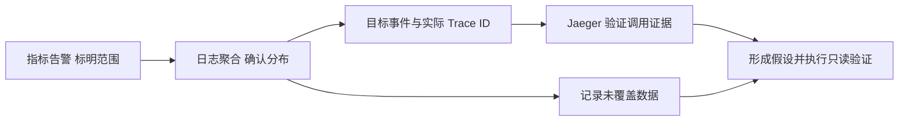

# Loki 学习笔记 · 第三卷：LogQL、Grafana 与日志告警

> 面向已经完成采集实验、理解 Loki 标签与存储路径的运维、SRE 和平台工程师。
> 核查日期：2026-09-24。查询以 Loki 3.7.8 为基线，界面以 Grafana 13.2.2 为基线；LogCLI 与 Loki 保持同一发布版本。
> 本卷沿用第一卷 `order-api` JSON 访问日志。除明确说明的反例外，查询中的索引标签、元数据与正文字段都来自该实验契约。
> Python 离线统计与客户端测试不等于 LogQL 引擎实测。本次未运行真实 Loki 查询、Grafana 界面和 Ruler；命令与预期用于读者本地验收。
> 前置阅读：第一卷的字段分层、样本生成和验证脚本；第二卷的查询路径与缓存。

| 章节 | 阅读后应能回答的问题 |
| --- | --- |
| 第 17 章 | 大括号中的选择器与管道后的过滤有什么区别？ |
| 第 18 章 | 正文存在，为什么提取字段为空或带错误？ |
| 第 19 章 | 算出来的是请求错误率还是错误日志比例？ |
| 第 20 章 | 从日志计算的耗时和 P95 是否具有一致口径？ |
| 第 21 章 | 查询慢时，怎样区分扫描、解析、排队和下载成本？ |
| 第 22 章 | Grafana 界面怎样转化成可复查的查询证据？ |
| 第 23 章 | Trace ID 怎样关联日志和已有 Jaeger？ |
| 第 24 章 | 规则由谁执行，没有数据和查询失败怎样处理？ |

## 第 17 章：LogQL 选择器与日志过滤

### 17.1 先明确日志在哪一层

遇到“查询语法没错，但没有结果”，先确认字段存放位置。`service_name` 是本实验索引标签；`trace_id` 是结构化元数据，也保留在 JSON 正文；`status` 和 `duration_ms` 仅在正文中。把三者写进同一个选择器，不会自动得到正确结果。[LogQL 日志查询][S-logql-logs][结构化元数据][S-metadata]

本卷统一使用以下索引范围：

```logql
{cluster="lab", namespace="training", environment="lab", service_name="order-api", job="access"}
```

时间范围不写在这个选择器里，而由 Grafana 时间选择器、LogCLI 参数或 HTTP API 的 `start/end` 传递。查询问题应同时表达“哪个环境、哪个服务、什么时间、匹配什么事件”。

| 条件 | 放置位置 | 教学示例 |
| --- | --- | --- |
| 服务和集群身份 | Stream selector | `service_name="order-api"` |
| 元数据中的 Trace ID | 管道标签过滤 | `trace_id="..."` |
| 正文中的数字状态码 | JSON 提取后数值过滤 | 提取 code 后比较 |
| 普通消息关键词 | 行过滤 | 字符串包含或正则 |
| 事件时间段 | 查询请求参数 | UTC 起点与终点 |

最小采集若改变了 namespace 等标签，后面查询也必须同步调整。复制示例时找不到 training 标签，不应该通过把选择器改成全局扫描来掩盖数据契约差异。

### 17.2 标签匹配与正则边界

选择器支持等于、不等于、正则匹配和正则排除。正则标签匹配以整个标签值为边界；行正则过滤的搜索语义不同。先使用精确标签值，再在确有必要时扩大范围。[LogQL 日志查询][S-logql-logs]

```logql
{cluster="lab", service_name="order-api"}
```

```logql
{cluster="lab", service_name=~"order-api|inventory-api"}
```

```logql
{cluster="lab", service_name=~"order-.*", job!="healthcheck"}
```

`order-.*` 才能覆盖一组以 order- 开头的服务；正则只写 order 不表示任意包含该字串的名称。反过来，不等于匹配可能包括缺少对应标签的流，排除式条件要检查“标签不存在”的样本。

#### 不构造无边界选择器

选择器通常要求至少有一个不匹配空字符串的有效条件。即使某个全局选择器能够执行，也不代表适合自动化工具。服务、租户和时间窗口应来自受控上下文，不要让“查所有错误”变成遍历全部生产日志。

正则 `.+` 与 `.*` 对空值的匹配不同；本卷正常实验使用明确等值选择器，不依赖这个差别绕过范围约束。

### 17.3 行过滤：先缩小正文范围

行过滤不需要先解析 JSON，可以减少后续需要解析的日志。它检查整条当前日志正文，而不是理解业务字段。[LogQL 日志查询][S-logql-logs]

```logql
{cluster="lab", service_name="order-api", job="access"} |= "request completed"
```

```logql
{cluster="lab", service_name="order-api", job="access"} != "healthcheck"
```

```logql
{cluster="lab", service_name="order-api"} |~ "(?i)(timeout|connection refused)"
```

多个连续行过滤按顺序缩小候选集合。包含 error 字串不等价于日志级别为 error，更不等价于 HTTP 状态为 5xx。它可能只是字段名或正常业务消息中的一部分。

Java 堆栈合并后，一条正文中可能包含换行。正则点号是否覆盖换行与使用的标志有关；不要拿一行文本上通过的表达式直接断言能够匹配整个多行堆栈。RE2 也不支持 PCRE 的全部语法，复杂回溯、后向引用等写法需要重新设计。[LogQL 日志查询][S-logql-logs]

### 17.4 元数据过滤与 Trace ID

按一个已知的 Trace ID 查询：

```logql
{cluster="lab", service_name="order-api", job="access"}
  | trace_id="4bf92f3577b34da6a3ce929d0e0e4736"
```

Trace ID 是示意值，使用实际生成值替换。因为它在采集端写入了结构化元数据，所以不需要先执行 JSON 解析。前面的低基数标签缩小候选 Stream，后面才过滤元数据；这不是一个跨所有服务的免费全局 ID 索引。[结构化元数据][S-metadata]

若旧数据仅在 JSON 正文中保存 Trace ID，则显式提取一个不会冲突的查询字段：

```logql
{cluster="lab", service_name="order-api", job="access"}
  | json body_trace="trace_id"
  | body_trace="4bf92f3577b34da6a3ce929d0e0e4736"
```

两条路径可能返回同样结果，但解析和扫描成本不同。迁移元数据策略后，跨旧新时间段的查询需要考虑覆盖差异，不应只测试新日志。

### 17.5 时间范围、方向与返回上限

日志查询结果是某个范围内、满足条件且受返回限制的集合。默认界面显示最新若干行，不能证明较早时间没有匹配事件；查询翻页时也不能简单把最后时间戳加 1 纳秒，忽略同一纳秒还有其他条目。[Loki HTTP API][S-http]

```bash
curl --fail --get --max-time 20 http://127.0.0.1:3100/loki/api/v1/query_range \
  --data-urlencode 'query={cluster="lab",job="access",service_name="order-api"}' \
  --data-urlencode 'since=15m' \
  --data-urlencode 'direction=backward' \
  --data-urlencode 'limit=100'
```

精确对账使用 manifest 的绝对纳秒窗口和第一卷分页客户端。它在窗口达到 limit 时进行不重叠时间二分；同一纳秒仍饱和则明确报“不完整”，不静默漏掉事件。

`step` 是指标范围查询的评估间隔，`interval` 可以改变日志返回密度；它们不是“请把完整结果分页”的同义参数。误用采样间隔做导出，会得到看似规律却不完整的数据集。

### 17.6 练习：构造可复查的查询入口

从 manifest 选取一个批次，记录以下信息，再执行查询：

| 字段 | 填写要求 |
| --- | --- |
| 环境与租户 | 单租户实验或固定授权租户 |
| 数据范围 | cluster、namespace、service_name、job |
| 时间 | 起点与不包含的终点，明确纳秒或 RFC3339 |
| 事件限制 | 一个 batch/run 或 Trace ID |
| 返回边界 | 单页上限、总数上限、请求预算 |
| 结果状态 | 完成、部分、不存在于该范围，不能混写 |

故意把服务名改错，再改回服务名但使用错误时间窗口。两次都可能为空，原因完全不同。这说明排障记录不能只有一张“没有日志”的截图。

## 第 18 章：查询时解析、格式化与错误处理

### 18.1 解析器由输入格式决定

写入 Loki 的正文不要求全部统一成 JSON，但查询时必须选与输入匹配的解析器。LogQL 解析发生在查询执行期间，不会给已有数据补建 Elasticsearch 那样的字段索引。[LogQL 日志查询][S-logql-logs]

| 解析器 | 合适输入 | 应避免的用法 |
| --- | --- | --- |
| JSON | 已知键名、嵌套结构清楚的 JSON 行 | 每次无选择地展开大量字段 |
| Logfmt | key=value 文本 | 依赖未约定的引号和空格形式 |
| Pattern | 稳定的分隔文本 | 格式经常变化却不验证 |
| Regexp | 需要命名捕获的非结构化文本 | 巨型表达式涵盖所有日志 |

先保存真实样本，再验证提取结果。界面能显示一个“字段列表”不说明每条日志都具有这些字段。

### 18.2 只提取需要的 JSON 字段

访问日志包含 status、duration_ms、route。别名提取能避开元数据同名，也降低不必要的查询维度扩张。

```logql
{cluster="lab", job="access", service_name="order-api"}
  | json code="status", elapsed_ms="duration_ms", route_template="route"
  | code >= 500
  | __error__=""
```

数值比较与字符串等值比较不同。多值上游状态、短横线、空字符串、数组和对象不能自动当成一个合理整数。先定义业务含义，不能靠查询语法替代字段治理。

嵌套样本：

```json
{"http":{"response":{"status_code":503}},"upstream":{"duration_ms":72}}
```

```logql
{cluster="lab", service_name="order-api"}
  | json code="http.response.status_code", upstream_ms="upstream.duration_ms"
  | __error__=""
```

这条针对上面的嵌套样本，不适用于生成器的平铺字段。JSON 键名本身含点号时还需相应的引号或括号路径表达，不能混淆键名与层级。

### 18.3 字段冲突与 `_extracted`

当正文键与已有标签或元数据同名，解析结果可能带 `_extracted` 后缀，以保留原标签。它不是自动发生了写入错误。[LogQL 日志查询][S-logql-logs]

元数据已有 trace_id 时，再执行无参数 JSON 解析，过滤 trace_id 可能仍是在使用元数据。使用 body_trace 这样的显式别名作对照。

```logql
{cluster="lab", job="access", service_name="order-api"}
  | json body_trace="trace_id", body_service="service"
  | line_format "metadata_trace={{.trace_id}} body_trace={{.body_trace}} service={{.body_service}}"
```

格式化只改变查询输出，不修改原始存储。保存故障证据仍应保留原文与查询式，不能只留下丢失上下文的人为拼接行。

### 18.4 Logfmt、Pattern 与 Regexp

假设应用输出：

```text
level=error service=order-api duration_ms=75 message="upstream timeout"
```

```logql
{cluster="lab", service_name="order-api"}
  | logfmt
  | level="error"
  | __error__=""
```

另一个固定文本样本：

```text
GET /orders status=503 duration_ms=75
```

```logql
{cluster="lab", service_name="order-api"}
  | pattern "<method> <path> status=<code> duration_ms=<elapsed_ms>"
  | code >= 500
  | __error__=""
```

Pattern 默认从行首匹配，跳过前缀可以使用未命名捕获 `<_>`。原始 path 不应直接用于高基数分组；优先让应用提供路由模板。

对应的 Regexp：

```logql
{cluster="lab", service_name="order-api"}
  | regexp "^(?P<method>[A-Z]+) (?P<path>[^ ]+) status=(?P<code>[0-9]{3}) duration_ms=(?P<elapsed_ms>[0-9]+)$"
  | __error__=""
```

命名捕获成为查询字段。正则不匹配与 JSON 格式非法的表现不必相同，不能把所有解析失败都概括成“原日志会被丢弃”。分别拿匹配、缺尾部、多空格、字段变化的样本验证。

### 18.5 `__error__` 是故障证据

解析或转换出错时，日志可能继续通过管道并附带 `__error__`。进行指标计算前，应区分有效统计样本与需要治理的坏样本。[LogQL 管道错误][S-logql-errors]

查坏 JSON：

```logql
{cluster="lab", job="access", service_name="order-api"}
  | json code="status"
  | __error__!=""
```

查询有效 5xx：

```logql
{cluster="lab", job="access", service_name="order-api"}
  | json code="status"
  | code >= 500
  | __error__=""
```

错误过滤放在数值比较后，因为比较也可能产生转换错误。后面的 unwrap 同理。删除错误标签和过滤掉错误样本不等价，不能靠隐藏错误使非法数据变成可信数值。

### 18.6 控制查询维度，而不是删除存储证据

元数据和解析字段在查询中可以成为标签。每条日志不同的 event_id 若参与指标序列构建，会形成不必要的高基数。[结构化元数据][S-metadata][LogQL 日志查询][S-logql-logs]

```logql
{cluster="lab", job="access", service_name="order-api"}
  | json code="status", route_template="route"
  | code >= 500
  | __error__=""
  | keep service_name, route_template
```

这里仅保留本次聚合需要的维度，不要求采集端丢弃 ID。原文和元数据仍可用于排障。keep 不自动清除查询错误标签，统计前仍要显式筛选有效样本。

外层已经有 `sum by(service_name)` 不代表内部高基数没有执行成本。尽早限制无用提取和分组。

### 18.7 坏样本对照实验

用独立文件与 job 接入，避免污染正常请求分母：

```text
{"status":503,"duration_ms":80}
{"status":"503","duration_ms":"80"}
{"status":"-","duration_ms":null}
{"status":200,"duration_ms":"unknown"}
{"status":200}
this is not json
```

逐条记录 JSON 合法性、状态提取、数字比较、耗时 unwrap，以及在哪一步出现错误。缺失和非法格式的表现不一定相同，还需要字段存在性检查。

实验不是寻找“所有情况都补零”的规则，而是明确每种统计的样本资格。

## 第 19 章：由日志计算计数、速率与占比

### 19.1 一条日志是否代表一次请求

生成器契约规定：每次模拟请求只写一条访问日志，HTTP 5xx 用数值字段 status 表达，正常和错误请求都采集。因此本实验日志数可以对应模拟请求数。

生产 Java 错误日志不一定满足这些前提。一次请求可能有入口、数据库、重试和异常堆栈多条日志；采样也可能只保留异常事件。对它们做计数，得到的是符合条件的日志条目数，而不自动是请求数。[LogQL 指标查询][S-logql-metrics]

| 统计名 | 输入或分子 | 合理前提 |
| --- | --- | --- |
| 访问请求量 | 每请求一条的访问日志 | 全部目标请求覆盖，排除重复 |
| 5xx 请求数 | 合格访问日志中的 5xx | 状态字段一致且解析成功 |
| 错误日志占比 | 错误级别条目 / 全部日志 | 只解释日志构成 |
| 异常次数 | 规范定义的异常事件 | 明确同一异常是否多处记录 |
| 业务失败率 | 业务失败请求 / 业务总请求 | HTTP 200 也可能是业务失败 |

Dashboard 标题就应该写清口径，而不是故障复盘时才补充限制条件。

### 19.2 计数与每秒速率

最近五分钟的条目数：

```logql
sum by (service_name) (
  count_over_time(
    {cluster="lab", job="access", service_name="order-api"}
    | keep service_name
    [5m]
  )
)
```

每秒平均条目数：

```logql
sum by (service_name) (
  rate(
    {cluster="lab", job="access", service_name="order-api"}
    | keep service_name
    [5m]
  )
)
```

这里的 rate 针对日志范围计算每秒条目数，不是 Prometheus Counter 重置修正。五分钟计数是滚动窗口；把图上每个三十秒点的五分钟计数相加，会重复计算窗口重叠部分。[LogQL 指标查询][S-logql-metrics]

`bytes_rate` 与 `bytes_over_time` 可以观察日志正文的字节量，但不是完整链路压缩后的网络传输量，也不是最终对象存储体积。

### 19.3 按路由模板聚合

请求路径可能含订单号、用户 ID 或查询参数。生成器的 route 是有限集合的路由模板，适合作为查询分组维度。

```logql
sum by (service_name, route_template) (
  count_over_time(
    {cluster="lab", job="access", service_name="order-api"}
    | json route_template="route"
    | route_template!=""
    | __error__=""
    | keep service_name, route_template
    [5m]
  )
)
```

排除了缺少模板的日志，分组求和可能小于原始总数。还要独立观察缺失字段的比例，不能把分类后的差额直接认定为采集丢失。

Top 路由：

```logql
topk(5,
  sum by (route_template) (
    rate(
      {cluster="lab", job="access", service_name="order-api"}
      | json route_template="route"
      | route_template!=""
      | __error__=""
      | keep route_template
      [5m]
    )
  )
)
```

TopK 减少结果序列，不保证无需扫描其他候选数据。瞬时 Top 与时间范围内每个评估点的 Top 也不是一份固定名单。

### 19.4 错误率必须使用一致的分母

下例分母是状态码可解释、落在 HTTP 范围内的访问日志，分子是其中 5xx。两边保留相同服务维度，避免向量匹配失败。[LogQL 指标查询][S-logql-metrics][LogQL 运算符][S-logql-operators]

```logql
sum by (service_name) (
  rate(
    {cluster="lab", job="access", service_name="order-api"}
    | json code="status"
    | code >= 500 and code <= 599
    | __error__=""
    | keep service_name
    [5m]
  )
)
/
sum by (service_name) (
  rate(
    {cluster="lab", job="access", service_name="order-api"}
    | json code="status"
    | code >= 100 and code <= 599
    | __error__=""
    | keep service_name
    [5m]
  )
)
```

输出值域为 0～1，Grafana 选择对应百分比单位。若查询再乘 100，就应使用 0～100 的表示。名字都叫百分比但表达方式不一致，会产生一百倍误差。

无 5xx 时分子序列可能不存在，而非存在一个零值序列。可以在**已知有总请求序列**时，用 `E or on(service_name) (0 * T)` 为对应服务补零，再除以 T。E 和 T 是上面两条完整查询的记号，不是可直接执行的 LogQL 变量。一个无标签的 `vector(0)` 不能恢复全部服务的零错误率。

### 19.5 无流量、无数据与查询错误

| 状态 | 候选解释 | 不应直接下的结论 |
| --- | --- | --- |
| 总请求序列不存在 | 无流量，或没采到日志 | 业务完全健康 |
| 有总请求，无错误匹配 | 在覆盖范围内未见 5xx | 所有业务逻辑成功 |
| 查询 Error | 语法、限额、转换或后端失败 | 错误率为零 |
| 指标正常，日志消失 | 采集或过滤策略变化 | 应用停止服务 |
| 只保存错误日志 | 缺少正常请求分母 | 错误率为 100% |

`absent_over_time` 能检测范围内没有日志，但需要外部预期说明服务此时应该产生日志。夜间无流量服务与十秒一次心跳服务不能使用相同缺失规则。[LogQL 指标查询][S-logql-metrics]

```logql
absent_over_time(
  {cluster="lab", job="access", service_name="order-api"}[2m]
)
```

### 19.6 与已知样本对照

完整脚本：`lab/scripts/sample_stats.py`。它离线读取源 JSONL，只统计指定 run_id；非法耗时不会被默默补零。

```python
#!/usr/bin/env python3
"""Offline calculation for known JSONL samples; this is not a LogQL evaluator."""
from __future__ import annotations
import argparse
import json
import math
import re
from collections import Counter
from pathlib import Path


def quantile(values: list[float], q: float) -> float:
    if not values or not 0 <= q <= 1:
        raise ValueError("non-empty values and 0 <= q <= 1 required")
    if any(not math.isfinite(x) for x in values):
        raise ValueError("finite values required")
    ordered = sorted(values)
    position = (len(ordered) - 1) * q
    low, high = math.floor(position), math.ceil(position)
    return ordered[low] + (ordered[high] - ordered[low]) * (position - low)


def summarize(lines, run_id: str) -> dict:
    if not re.fullmatch(r"[0-9a-f]{12}", run_id):
        raise ValueError("invalid run id")
    count, errors, invalid_json, invalid_duration = 0, 0, 0, 0
    values, ids, routes = [], Counter(), Counter()
    for line in lines:
        try:
            event = json.loads(line)
        except (json.JSONDecodeError, TypeError):
            invalid_json += 1
            continue
        if not isinstance(event, dict) or event.get("run_id") != run_id:
            continue
        count += 1
        eid = event.get("event_id")
        if isinstance(eid, str):
            ids[eid] += 1
        status = event.get("status")
        errors += int(type(status) is int and 500 <= status <= 599)
        route = event.get("route")
        if isinstance(route, str):
            routes[route] += 1
        d = event.get("duration_ms")
        if type(d) not in (int, float) or not math.isfinite(d) or d < 0:
            invalid_duration += 1
        else:
            values.append(float(d))
    return {
        "run_id": run_id, "count": count, "http_5xx": errors,
        "error_ratio": errors / count if count else None,
        "invalid_json_in_file": invalid_json,
        "invalid_duration_in_run": invalid_duration,
        "duration_unit": "ms", "duration_samples": len(values),
        "duration_mean": sum(values) / len(values) if values else None,
        "duration_p95_linear": quantile(values, .95) if values else None,
        "duration_max": max(values) if values else None,
        "duplicate_ids": {k: v for k, v in ids.items() if v > 1},
        "route_counts": dict(routes),
    }


def main() -> None:
    parser = argparse.ArgumentParser(description=__doc__)
    parser.add_argument("jsonl", type=Path)
    parser.add_argument("--run-id", required=True)
    args = parser.parse_args()
    with args.jsonl.open(encoding="utf-8") as stream:
        print(json.dumps(summarize(stream, args.run_id), ensure_ascii=False, indent=2))


if __name__ == "__main__":
    main()
```

```bash
# 在第一卷 lab 目录执行，替换为真实 run_id。
python3 scripts/sample_stats.py samples/access.jsonl --run-id 012345abcdef
```

100 条完整生成样本有 10 条 5xx，预期比例 0.1。这是生成规则给出的算术预期，不是本次 Loki 实测结果。

要与瞬时指标查询比较，必须固定评估时间、选择覆盖整个批次的窗口，并等日志到达。用当前五分钟窗口去对照一小时以前生成的全部文件，自然不会相等。

### 19.7 不平均局部错误率

实例 A 只有一个请求且失败，实例 B 有 999 个请求且全部成功。两者错误率平均是 50%，整体错误率却是 1/1000。

正确方法是先求和分子，再求和分母，最后相除。Dashboard、Recording Rule 和 AIOps 报告都应遵守同一统计定义。这个两实例算例可以快速识别直接平均局部比例的错误。

核对聚合结果时，同时保存每组的失败数与请求总数。例如先检查 A 的 `1/1` 和 B 的 `0/999`，再检查合并后的 `1/1000`；若只留下 50% 这个数值，就无法发现每组流量权重不同。对于没有请求的实例，分母为零，不能把它的比例填成零后加入平均。

练习时让一组只有少量失败请求，另一组承载大量正常请求，再分别按实例和服务查询。若服务级结果等于实例比例的算术平均，应回到原始计数检查聚合顺序；这个规则也适用于按 Pod、路由或时间窗口汇总。

### 19.8 查询结果序列与缺失维度

聚合后只留下 service_name，就不能再把结果当成每 Pod 的统计。相反，保留了 request_id、trace_id 等唯一值，又会让序列数量随事件数增长。查询设计是在回答问题所需信息与执行成本之间做选择。

排障使用明细，趋势使用受控维度，两个查询可以并存。不必为了一个 Dashboard 牺牲所有日志上下文，也不能把所有上下文都强塞进每条统计序列。

设计面板前先写清楚输出维度：服务趋势保留 `service_name`，逐路由比较再保留经过归一化的路由，逐 Pod 排障才保留 Pod 标识。查看返回序列的标签集和数量，确认它们确实对应问题；标签缺失时应检查提取或聚合步骤，而不是从一条服务总量推断各 Pod 都有日志。

原始事件中的 `request_id` 和 `trace_id` 仍可用于窄时间窗口的明细过滤。它们适合定位一次请求，不适合作为长期统计序列的分组键；否则单个事件可能变成一条序列，使面板难读并增加查询开销。

## 第 20 章：数值提取、耗时分布与分位数

### 20.1 从日志字段生成数值样本

Unwrapped range 使用提取的字段作为数值样本。默认转换为浮点数，失败会引入错误，因此在转换后过滤错误。[LogQL 指标查询][S-logql-metrics]

```logql
avg_over_time(
  {cluster="lab", job="access", service_name="order-api"}
  | json elapsed_ms="duration_ms"
  | elapsed_ms >= 0
  | keep service_name, elapsed_ms
  | unwrap elapsed_ms
  | __error__=""
  [5m]
) by (service_name)
```

非负比较表达业务约束，最后的错误过滤保护统计。仍须另行观察缺失、非法和负值，避免只展示剩下的“好看数字”。

### 20.2 单位进入字段契约

字段 duration=100 无法说明秒、毫秒或纳秒。采集与业务日志应固定单位，面板沿用同一含义。

| 输入 | 正确解释 | 常见误用 |
| --- | --- | --- |
| duration_ms 数字 120 | unwrap 后按毫秒 | 面板显示秒 |
| 字符串 120ms | duration_seconds 转秒 | 直接转裸浮点 |
| body_bytes 数字 1048576 | 字节 | 未换算就当 MB |
| 字符串 5 MiB | bytes 转换 | 字典顺序比较 |
| 空值或短横线 | 缺失或不可解释 | 全部补零计入延迟 |

带单位字符串的另一个样本可以这样查：

```logql
max_over_time(
  {cluster="lab", service_name="order-api"}
  | json duration_text="duration"
  | keep service_name, duration_text
  | unwrap duration_seconds(duration_text)
  | __error__=""
  [5m]
) by (service_name)
```

这是 duration 字符串的示例，不是生成器 duration_ms 数字的默认查询。转换函数已经输出秒，不应再除以 1000。[LogQL 指标查询][S-logql-metrics]

### 20.3 P95 与样本资格

每服务 P95：

```logql
quantile_over_time(0.95,
  {cluster="lab", job="access", service_name="order-api"}
  | json elapsed_ms="duration_ms"
  | elapsed_ms >= 0
  | keep service_name, elapsed_ms
  | unwrap elapsed_ms
  | __error__=""
  [5m]
) by (service_name)
```

按路由模板区分：

```logql
quantile_over_time(0.95,
  {cluster="lab", job="access", service_name="order-api"}
  | json elapsed_ms="duration_ms", route_template="route"
  | route_template!=""
  | elapsed_ms >= 0
  | keep service_name, route_template, elapsed_ms
  | unwrap elapsed_ms
  | __error__=""
  [5m]
) by (service_name, route_template)
```

路由 P95 不能平均成全服务 P95，因为局部分位数已经丢失原始分布。先过滤慢请求再求 P95，得到的也是慢请求子集的分位数，不是全量请求分位数。

离线脚本采用排序样本的线性插值并明确输出该方法。与引擎结果比较前，先对齐样本量、窗口边界、采样和非法值处理，再讨论尾数差异。

### 20.4 慢请求占比

设阈值为 500ms，分母和分子都使用可解释的非负耗时日志。另一种业务口径也可以把缺失耗时纳入分母，但必须单独报告缺失率，不能悄悄改变。

```logql
sum by (service_name) (
  count_over_time(
    {cluster="lab", job="access", service_name="order-api"}
    | json d="duration_ms"
    | d > 500
    | __error__=""
    | keep service_name
    [5m]
  )
)
/
sum by (service_name) (
  count_over_time(
    {cluster="lab", job="access", service_name="order-api"}
    | json d="duration_ms"
    | d >= 0
    | __error__=""
    | keep service_name
    [5m]
  )
)
```

生成器每十条有 900ms、1600ms 两个慢值，完整 100 条中有 20 条超过 500ms。这只是当前固定生成规则的预期；换成真实访问日志后要重新定义耗时边界。

### 20.5 上游时间不等于用户端体验

Nginx 访问日志可包含请求总耗时、连接时间、响应头时间和上游响应时间。它们的测量边界不同，重试多个上游还可能产生多值序列。[Nginx 上游变量][S-nginx-upstream]

ELK 与 Loki 对照实验建议保留原始上游字段，另生成明确命名的派生字段，例如最后一次上游耗时或各次上游耗时之和。不能把多值字符串强制转 float 后当完整请求耗时。

浏览器下载、客户端重试和网络体验还需端侧或链路证据。服务器某个耗时很低，不足以证明用户没有等待。

### 20.6 聚合函数与分组限制

| 目标 | 思路 | 需说明的边界 |
| --- | --- | --- |
| 平均请求耗时 | 对合格请求样本求平均 | 是否覆盖全部请求 |
| 最大耗时 | max_over_time | 单个异常值与样本量 |
| 总响应字节 | 合适的 sum_over_time | 不重复计算重试日志 |
| 大部分请求的耗时边界 | quantile_over_time | 分位数和采样 |
| 累计计数器变化 | 真正 Counter 才考虑 rate_counter | 耗时不是 Counter |

不同 unwrapped 函数支持的分组方式不完全一样。不是每个函数都能直接在末尾写 by；需要按文档使用外层向量聚合，不按相似函数名猜语法。[LogQL 指标查询][S-logql-metrics]

### 20.7 与 Metrics 对照

| 差异 | 候选原因 |
| --- | --- |
| 日志条目少于请求 Counter 增量 | 丢弃、采样、窗口或日志打印位置 |
| 日志 P95 更高 | 只采慢请求、测量边界大、窗口不同 |
| 日志 error 多但 HTTP 5xx 少 | 业务错误仍返回 200，统计用了日志级别 |
| 短窗口差异大 | 批量发送、时钟、抓取与查询延迟 |
| 某实例完全缺失 | 标签映射、文件权限、Pod 发现、租户错误 |

先完成同一生成器的封闭实验，再去比较生产多数据源。不要预设存在差异就一定是某个产品计算错误。

## 第 21 章：查询优化、LogCLI 与受控导出

### 21.1 优化前先保存原始查询

“把超时从一分钟改成十分钟”不是诊断。先固定时间窗口、标签、查询文本和结果上限，记录响应中的统计信息，再区分排队、索引、下载、解压和解析成本。[查询最佳实践][S-query-bp][缓存][S-cache]

一个建议的优化顺序是：

```text
正确租户与环境
  → 缩小服务和时间窗口
  → 尽早使用廉价行过滤
  → 只解析真正需要的字段
  → 限制中间与最终序列维度
  → 检查查询并发、缓存和对象存储
  → 最后评估组件扩容与限额
```

不能简单把所有行过滤都移到解析前。例如过滤 JSON 中的数字状态时，正文字符串匹配可能改变语义；性能优化必须保持候选集合和统计口径一致。

### 21.2 三条查询的成本对照

假设要找服务内的 timeout：

```logql
{cluster="lab", service_name="order-api"} |= "timeout"
```

```logql
{cluster="lab", service_name="order-api"}
  | json msg="message"
  | msg=~".*timeout.*"
```

```logql
{cluster="lab", service_name="order-api"}
  |= "timeout"
  | json msg="message"
  | msg=~".*timeout.*"
```

第一条过滤整条正文，第二条只看 message 字段，二者**不保证语义等价**。第三条先过滤正文，再核对 message 字段，可能减少解析量；仍要检查转义、大小写和格式是否让前置过滤遗漏应有样本。

拿一组包含“其他字段有 timeout，但 message 没有”的样本做对照。只有确认集合一致，才能比较执行时间并宣布优化有效。

### 21.3 记录扫描量，而不只看响应时间

| 观察量 | 能帮助回答的问题 | 容易忽视的条件 |
| --- | --- | --- |
| 查询总耗时 | 用户等待多久 | 是否处于冷缓存 |
| 处理字节/行数 | 扫描了多少候选数据 | 与返回条数不同 |
| 返回条目/序列数 | 展示负载是否过大 | 返回少不代表扫描少 |
| 队列等待 | 是无工作者还是查询太多 | 租户并发与公平性 |
| Chunk 下载 | 对象存储是否成为瓶颈 | 缓存命中及跨区流量 |
| 错误与取消 | 是否触发超时、内存或客户端取消 | 浏览器切换页面也可能取消 |

统计字段以固定版本 API 实际返回为准；不要把一条日志里的同名 duration 字段当成请求总执行时间。索引统计也可能不覆盖尚未持久化的最近数据，因此适合估算范围，不是完整事件数量核算。[Loki HTTP API][S-http]

### 21.4 LogCLI 的使用边界

下载与 Loki `3.7.8` 同一 Release 的 LogCLI，按自己的操作系统和架构选择文件并核验发布摘要。这里不给浮动 latest 安装脚本，也不通过 `curl | sh` 自动执行远程内容。[Loki 3.7.8 发布][S-release-loki][LogCLI][S-logcli]

```bash
logcli --version
logcli query --help
export LOKI_ADDR=http://127.0.0.1:3100

logcli query --since=15m --limit=100 --forward \
  '{cluster="lab",job="access",service_name="order-api"}'

logcli query --since=15m --limit=100 --output=jsonl \
  '{cluster="lab",job="access",service_name="order-api"} | json code="status" | code >= 500 | __error__=""'
```

绝对窗口例子中的日期必须替换为实际 manifest 时间：

```bash
logcli query --timezone=UTC \
  --from='2026-09-24T04:00:00Z' \
  --to='2026-09-24T04:05:00Z' \
  --limit=1000 --output=jsonl \
  '{cluster="lab",job="access",service_name="order-api"}'
```

默认结果数量、分页行为和并行导出参数应以 `--help` 为准。尤其无限结果或并行导出会放大后端压力，不能因为工具提供该选项就让自动化任务不受限制地使用。

#### 身份与凭据

多租户时使用工具支持的租户参数或 `LOKI_ORG_ID`；认证值通过受控环境或文件提供，避免进入 shell 历史。设置租户 Header 不等于获得租户授权，真实权限仍由可信网关和后端网络边界保证。

### 21.5 保存结果而不输出伪完整文件

完整脚本：`lab/scripts/export_logs.py`。依赖第一卷的 `loki_client.py`，限制一小时窗口、总条目和请求次数；分页完成后才发布 JSONL 文件。

```python
#!/usr/bin/env python3
"""Bounded read-only export. Finish pagination before publishing the output file."""
from __future__ import annotations
import argparse
import hashlib
import json
import os
import tempfile
from pathlib import Path
from loki_client import LokiClient, QueryError


def write_export(path: Path, entries, report: dict) -> None:
    if path.exists():
        raise FileExistsError(f"refusing to overwrite {path}")
    path.parent.mkdir(parents=True, exist_ok=True)
    fd, tmp = tempfile.mkstemp(prefix=".loki-export-", dir=path.parent)
    digest = hashlib.sha256()
    try:
        with os.fdopen(fd, "wb") as out:
            for entry in entries:
                row = {"timestamp_ns": str(entry.ns), "labels": entry.labels,
                       "line": entry.line}
                raw = (json.dumps(row, ensure_ascii=False) + "\n").encode()
                out.write(raw)
                digest.update(raw)
            out.flush()
            os.fsync(out.fileno())
        # Hard-link creation does not overwrite an existing destination.
        os.link(tmp, path)
        report["sha256"] = digest.hexdigest()
        report["output"] = str(path)
    finally:
        if os.path.exists(tmp):
            os.unlink(tmp)


def main() -> int:
    parser = argparse.ArgumentParser(description=__doc__)
    parser.add_argument("--url", default="http://127.0.0.1:3100")
    parser.add_argument("--tenant", default="")
    parser.add_argument("--query-file", type=Path, required=True)
    parser.add_argument("--start-ns", type=int, required=True)
    parser.add_argument("--end-ns", type=int, required=True)
    parser.add_argument("--output", type=Path, required=True)
    args = parser.parse_args()
    query = args.query_file.read_text(encoding="utf-8").strip()
    client = LokiClient(args.url, tenant=args.tenant)
    try:
        entries = client.query(query, args.start_ns, args.end_ns,
                               page_limit=1000, max_entries=10000)
        report = {"query": query, "tenant": args.tenant or "single-tenant",
                  "start_ns": str(args.start_ns), "end_ns_exclusive": str(args.end_ns),
                  "count": len(entries), "requests": client.requests,
                  "coverage": "bounded query completed; not a storage snapshot",
                  "deduplicated": False}
        write_export(args.output, entries, report)
    except (QueryError, OSError, ValueError) as exc:
        print(json.dumps({"status": "failed", "error": str(exc)}, ensure_ascii=False))
        return 2
    print(json.dumps(report, ensure_ascii=False, indent=2))
    return 0


if __name__ == "__main__":
    raise SystemExit(main())
```

先把审核过的 LogQL 存到 `query.logql`，再执行：

```bash
# 在 lab 目录执行，数值来自同一 manifest。示例数值只是命令形状。
python scripts/export_logs.py \
  --query-file query.logql \
  --start-ns 1790222400000000000 \
  --end-ns 1790222700000000000 \
  --output exports/access-window.jsonl \
  > exports-report.json
```

文件默认不覆盖已有目标。部分窗口失败、单纳秒饱和、响应超限、HTTP 错误都会使导出失败，不能将已取得的一部分冒充完整结果。返回报告明确说明它不是存储快照。

这个导出保存查询响应中的时间戳、标签和正文，不等于备份 Loki 全部索引、Chunk、规则及所有内部元数据。程序自身也不是权限系统：允许传入 query-file 仅用于本地授权运维，第四卷的 AIOps 示例会进一步限制查询构造。

### 21.6 并发与查询公平性

增加 Querier 并发可能提高吞吐，但每个并行子查询会占用内存、连接、对象请求预算。一个宽范围查询拆成很多份后，资源总消耗不一定减少。[查询公平性][S-query-fairness][Query Frontend][S-query-frontend]

建议分别观察单租户单查询、单租户并发、多租户并发三类负载。若系统只在某个大租户大量查询时退化，先检查租户限制和调度公平性，而不是无差别增加所有租户的配额。

缓存命中可以缩短重复查询，但不能作为日志持久化成功的证据。缓存可被重建，恢复演练也必须考虑冷缓存的资源冲击。

### 21.7 Bloom 与实验功能不成为入门前提

当前 Loki 的 Bloom 查询加速仍需按官方标注理解其实验状态和适用数据规模，不是每个新建集群都应该默认启用的组件。[Bloom 查询加速][S-bloom]

启用前至少比较索引/构建成本、额外组件、查询收益、故障恢复和版本兼容。小型实验的主要问题通常更容易来自标签、时间范围、解析或对象存储；加入新组件不应替代这些基础检查。

评估时选定同一组查询、相同时间窗口和相同数据量，分别记录冷缓存与热缓存的响应时间、扫描量和资源消耗。若只是修改了查询条件或缓存状态，不能把差异归因于 Bloom。还应记录构建任务失败时查询能否回退，以及升级或回滚时新增状态如何处理。

本书的最小实验先通过有界选择器和查询统计定位成本；只有这些基础手段仍不能满足明确的查询目标，且目标版本提供可测试的部署方案时，再在隔离环境中评估该功能。不要把实验功能的启用当作日志完整性或查询正确性的证明。

## 第 22 章：Grafana Explore、Drilldown 与 Dashboard

### 22.1 先验证数据源的网络视角

Grafana 的代理数据源从 Grafana 服务端访问 Loki。浏览器能访问 `localhost:3100` 不表示 Grafana 容器内的 localhost 是 Loki；第一卷配置使用 Compose 服务名 `http://loki:3100`，两种地址属于不同网络视角。[Grafana Loki 数据源][S-grafana-loki]

数据源 UID `loki-lab` 是本实验面板、链接和自动化配置的稳定标识；显示名称可以改，但引用 UID 的配置要保持一致。两个同名数据源也可能连接不同租户，保存截图时应记录 UID 和授权范围。

| 失败现象 | 优先检查 |
| --- | --- |
| Save & Test 连接失败 | Grafana 到 Loki 的 DNS、端口、代理 |
| 401 / 403 | 查询账号、Header、网关授权 |
| 测试正常但无日志 | 租户、标签、时间范围、数据是否到达 |
| Explore 正常、面板为空 | 面板变量、查询类型、覆盖时间与数据源 UID |
| 管理员能看，普通人不能 | Grafana 权限和实际后端授权边界 |

### 22.2 用 Explore 建立排障过程

选择 LokiLab 数据源，先执行固定服务选择器，设置绝对时间窗口，再逐步增加条件。不要一开始就写十层 JSON 与正则过滤，让任意一步出错都只能得到相同的空结果。

推荐保存四个阶段：原始范围、目标事件、上下文窗口、统计范围。每一步的 Query Inspector 请求和响应信息，比一个最终截图更容易复查。[Explore 日志][S-grafana-explore]

```text
原始范围：确定服务在该时间有日志
目标事件：根据 event_id / trace_id / 精确错误字段过滤
上下文：扩大同服务的窄时间段，保留不同事件
统计范围：对同一问题的影响面聚合
```

“显示上下文”通常基于日志流与时间关联，不代表跨服务因果关系。要跨服务定位仍需要一致的 Trace ID、请求 ID 或其他可靠业务关联。

### 22.3 展示去重不等于数据去重

Explore 可以对显示中的相似日志进行去重。界面看起来只剩一行，不代表重复写入已消失，也不代表 backend 只保存一条。对账和故障调查应关闭展示去重，记录原始响应。[Explore 日志][S-grafana-explore]

相似日志也未必重复：每分钟出现相同的心跳文本可以是不同事件。以业务事件 ID、时间、来源和原文一起判断，比按字符串去重更可靠。

验证重复写入时，先关闭 Explore 的展示去重，再用同一绝对时间范围和标签选择器取得原始条目。比较 `event_id`、时间戳、来源及同一事件出现次数；如果两条记录只是正文相同而事件 ID 不同，应保留为两个事件。若事件 ID 相同，再沿采集、重试和多路径写入检查原因。

把查询限制和分页状态一并记录。界面只显示一条，也可能是范围、条数上限或展示设置造成的；只有覆盖目标窗口的原始查询与样本清单对账，才能支持“没有重复”这一判断。

### 22.4 Logs Drilldown 的前置条件

当前 Grafana 发行版包含 Logs Drilldown，但 UI 可进入不代表 Loki 所需功能都已经启用。官方配置要求包括结构化元数据、日志量接口、日志级别发现和 Pattern ingestion。[Logs Drilldown 前置条件][S-drilldown]

第一卷最小配置有意没有启用 Pattern Ingester。要做本章 Drilldown 实验，把以下**增量**合并到对应 Loki 配置，保留现有 limits 项：

```yaml
pattern_ingester:
  enabled: true
limits_config:
  allow_structured_metadata: true
  volume_enabled: true
  discover_log_levels: true
```

这会增加后台处理，不是纯 UI 设置。微服务部署还要为 Pattern Ingester 配置正确的工作负载、发现和资源，不能只改 Loki 内部 enabled 却没有部署组件。

明确传入 `service_name` 能减少服务识别歧义。自动识别出的日志级别也不是业务错误分类真值，仍需与 source JSON 字段对照。模板化模式是日志相似性的摘要，不是根因判断。

### 22.5 三面板示例

完整文件：`lab/grafana/dashboards/loki-learning.json`。它使用传统 Dashboard JSON 模型，面板只有访问条目速率、耗时 P95、原始日志，方便审阅查询而不被装饰淹没。本次检查 JSON 结构，不声明已在 Grafana 13.2.2 导入成功；首次导入后保存 Grafana 实际迁移的模型版本。[Grafana Provisioning][S-grafana-provision]

```json
{
  "uid": "loki-learning-lab",
  "title": "Loki 学习实验：日志与统计",
  "schemaVersion": 39,
  "version": 1,
  "editable": false,
  "timezone": "utc",
  "tags": [
    "loki",
    "learning"
  ],
  "time": {
    "from": "now-15m",
    "to": "now"
  },
  "refresh": "30s",
  "panels": [
    {
      "id": 1,
      "title": "访问日志速率（行/秒）",
      "type": "timeseries",
      "datasource": {
        "type": "loki",
        "uid": "loki-lab"
      },
      "gridPos": {
        "h": 9,
        "w": 12,
        "x": 0,
        "y": 0
      },
      "targets": [
        {
          "refId": "A",
          "datasource": {
            "type": "loki",
            "uid": "loki-lab"
          },
          "expr": "sum(rate({cluster=\"lab\", job=\"access\", service_name=\"order-api\"} | keep service_name [1m]))",
          "queryType": "range",
          "editorMode": "code"
        }
      ],
      "fieldConfig": {
        "defaults": {
          "unit": "ops"
        },
        "overrides": []
      }
    },
    {
      "id": 2,
      "title": "请求耗时 P95（毫秒，日志口径）",
      "type": "timeseries",
      "datasource": {
        "type": "loki",
        "uid": "loki-lab"
      },
      "gridPos": {
        "h": 9,
        "w": 12,
        "x": 12,
        "y": 0
      },
      "targets": [
        {
          "refId": "A",
          "datasource": {
            "type": "loki",
            "uid": "loki-lab"
          },
          "expr": "quantile_over_time(0.95, {cluster=\"lab\", job=\"access\", service_name=\"order-api\"} | json d=\"duration_ms\" | keep service_name, d | unwrap d | __error__=\"\" [5m]) by (service_name)",
          "queryType": "range",
          "editorMode": "code"
        }
      ],
      "fieldConfig": {
        "defaults": {
          "unit": "ms"
        },
        "overrides": []
      }
    },
    {
      "id": 3,
      "title": "访问日志明细",
      "type": "logs",
      "datasource": {
        "type": "loki",
        "uid": "loki-lab"
      },
      "gridPos": {
        "h": 12,
        "w": 24,
        "x": 0,
        "y": 9
      },
      "targets": [
        {
          "refId": "A",
          "datasource": {
            "type": "loki",
            "uid": "loki-lab"
          },
          "expr": "{cluster=\"lab\", job=\"access\", service_name=\"order-api\"}",
          "queryType": "range",
          "editorMode": "code"
        }
      ],
      "options": {
        "showTime": true,
        "wrapLogMessage": true,
        "sortOrder": "Descending",
        "dedupStrategy": "none"
      }
    }
  ]
}
```

Provider 文件：`lab/grafana/provisioning/dashboards/lab.yaml`。

```yaml
apiVersion: 1
providers:
  - name: loki-learning
    orgId: 1
    folder: Loki 学习实验
    type: file
    disableDeletion: true
    editable: false
    updateIntervalSeconds: 30
    options:
      path: /var/lib/grafana/dashboards
```

第一卷 Compose 已挂载 provisioning 和 Dashboard 目录。新增文件后核对以下内容挂载；只有旧副本缺少它时才补齐，不要在同一服务里重复添加：

```yaml
# 核对 services.grafana.volumes；基础文件已有时无需再添加。
volumes:
  - ./grafana/dashboards:/var/lib/grafana/dashboards:ro
```

这是挂载项片段，不是能独立替代整个 Compose 的文件。重新创建 Grafana 服务后，在相应文件夹检查三个面板的数据源、单位、时间和查询语句。

### 22.6 变量、范围与权限

Dashboard 变量有助于选择服务，但“下拉框只显示某几个服务”不是后端权限约束。用户能否提交其他查询，要由数据源访问和后端身份边界决定。[认证边界][S-auth][Grafana Loki 数据源][S-grafana-loki]

初学阶段使用固定选择器。随后添加 cluster、namespace、service_name 的逐级变量，并限制默认时间范围。正则多选变量需要 Grafana 的正确转义形式，不能直接把任意输入串插入 LogQL。

自动刷新频率还要与查询跨度和面板数一起计算。十个面板每五秒查一天数据，可能比人工排障消耗更多资源；不是“数据已经存在”就没有查询成本。

### 22.7 Dashboard 验收

| 检查项 | 通过条件 |
| --- | --- |
| 事件明细 | 与同窗口 LogCLI / API 的目标事件一致 |
| 数值单位 | 耗时是 ms，比例表达不多乘或少乘 100 |
| 查询时间 | 面板无隐藏时间覆盖，时区已说明 |
| 错误与无数据 | 不把 Error 自动显示为零 |
| 去重设置 | 对账面板不使用相似日志去重 |
| 数据源范围 | UID、租户与账号符合预期 |
| 资源开销 | 刷新周期、跨度、并发经过试运行 |

面板是一个查询入口，不是事实本身。复盘材料应保留面板版本、原查询、绝对窗口和证据摘要。

## 第 23 章：日志、指标与 Trace 关联

### 23.1 先区分格式正确与真实存在

第一卷生成器产生格式正确、可重复关联的 Trace ID，**但没有实际创建 OTel Span，也没有向 Jaeger 发送 Trace**。点击这些 ID 后 Jaeger 查不到，是预期的实验边界，不是 Loki 断链。

真实关联实验应改用已有 `go-otel-demo` 或其他已经接入 OTel 的应用：发起一次调用，取得真实 Trace ID，确认应用日志包含它，再分别在日志和 Jaeger 查询。OTel SDK、上下文传播和采样的详细配置继续参考已有 OTel 专题，不在本卷重复实现。[原生 OTLP 接入][S-otlp][Grafana Jaeger 数据源][S-grafana-jaeger]

### 23.2 统一身份与时间窗口

| 关联字段 | 作用 | 不足之处 |
| --- | --- | --- |
| cluster/environment | 避免跨环境误关联 | 命名必须统一 |
| service_name | 缩小服务范围 | 多集群可能重名 |
| trace_id | 同一追踪上下文 | 可能未采样或后端已过期 |
| request_id | 业务或网关请求关联 | 格式/传播未必统一 |
| instance/pod | 定位具体来源 | 实例重建与元数据保存 |
| timestamp | 缩小候选窗口 | 时钟漂移与不同信号延迟 |

先用服务和环境过滤，再用 ID，不要只凭“同一分钟有一条错误”把两个不相关事件连成根因。

### 23.3 Loki 数据源的 Derived Fields

当原始 JSON 正文保留 trace_id，可以用派生字段识别并链接到已经配置的 Jaeger 数据源。下面是**合并进现有 Loki 数据源 jsonData 的片段**，不要再创建第二个同 UID 数据源。[Grafana Loki 数据源][S-grafana-loki][Grafana Jaeger 数据源][S-grafana-jaeger]

```yaml
jsonData:
  maxLines: 1000
  derivedFields:
    - name: TraceID
      matcherRegex: '"trace_id"\s*:\s*"([0-9a-fA-F]{32})"'
      datasourceUid: jaeger-existing
      url: '$${__value.raw}'
      urlDisplayLabel: '在 Jaeger 中查看 Trace'
```

`jaeger-existing` 必须对应真实 Jaeger 数据源 UID。Grafana provisioning 对美元符号进行环境替换，因此这里用双美元保护 Grafana 链接变量。不要把它改成 shell 的环境变量占位符。

这个正则针对正文 JSON，不是自动读取所有结构化元数据的通用配置。对于只把 ID 放在元数据中的数据，应使用对应版本的字段匹配能力或相关性配置，并检查实际返回字段。正则命中只证明能提取 ID，不证明 Trace 存在。

### 23.4 Jaeger 访问路径与授权

Grafana 的 Jaeger 数据源 URL 应指向可查询的 Jaeger 后端地址，从 Grafana 服务器网络可达；用户浏览器的外部 UI 地址可能是另一条路径。不要混用 OTLP 接收端口与 Jaeger 查询端口。[Grafana Jaeger 数据源][S-grafana-jaeger]

日志查询账号有权读取日志，不表示自动有权读取全部 Trace。跨信号关联仍需保留租户和服务权限，不应通过一个外部链接泄露 Trace ID、业务路径或其他敏感参数给无关第三方。

### 23.5 Trace 不存在时怎样继续调查

```text
日志有 Trace ID
  → 验证格式与环境
  → 核对 Trace 后端及其保留时间
  → 确认查询时间与导出延迟
  → 核对 SDK 采样与 Collector 处理
  → 检查发送失败、限额与断链
  → 在证据不足时保留“Trace 不可用”的结论
```

不要把“查不到 Trace”解释为“这个错误没有发生”，也不要让 AI 为缺失 Span 编造调用路径。日志仍可支持时间、服务和错误类型分析，但调用因果关系的证据范围更窄。

### 23.6 从指标告警进入日志

现有 Prometheus 告警可以提供环境、服务和时间窗口。将这些作为查询范围，聚合错误日志类型，再选一条真实存在的 Trace ID 深入。这样比随机打开全局 Trace 列表更有目的。



LogQL 不是跨 Prometheus 与 Jaeger 的任意关系型 JOIN。关联往往由查询编排、Grafana 链接或诊断平台实现；逻辑关系需要由字段契约和实际数据支撑。

## 第 24 章：Ruler、Recording Rules 与日志告警

### 24.1 明确谁负责评估规则

Loki Ruler 执行 LogQL 规则；Grafana 托管告警由 Grafana 评估并管理通知。两者可以配合，但同一告警条件不应无意配置两遍，造成重复通知和相互矛盾的状态。[Loki 告警规则][S-alert][No Data 和 Error][S-grafana-alert]

| 方案 | 规则归属 | 需要维护的关键依赖 |
| --- | --- | --- |
| Loki Ruler | Loki 规则存储与评估组件 | 查询、规则存储、Alertmanager/remote write |
| Grafana 托管告警 | Grafana | 数据源、评估器、通知策略、Grafana 可用性 |
| Prometheus 评估日志派生指标 | 指标平台 | Ruler 输出、接收端与指标保留 |

先选择一条主告警路径，保存规则配置与验证样本。不要为了“功能完整”把三套同时部署成不可解释的重复链路。

### 24.2 本地规则目录

在第一卷单租户实验中，规则目录对应 tenant `fake`。将下面配置合并到 Loki，保持其余配置不变。[Loki 告警规则][S-alert]

```yaml
ruler:
  storage:
    type: local
    local:
      directory: /etc/loki/rules
  rule_path: /loki/ruler-scratch
  evaluation_interval: 30s
  poll_interval: 30s
  alertmanager_url: http://alertmanager:9093
  enable_alertmanager_v2: true
  enable_api: true
  ring:
    kvstore:
      store: inmemory
```

`alertmanager:9093` 是需要另外接入的实验 Alertmanager 查询/通知服务地址，不包含在第一卷三组件 Compose 中。将它替换成从 Loki 可达的授权实验地址；没有通知端时只能验证规则加载和评估，不能宣称通知链路通过。

增加规则目录挂载：

```yaml
# 合并进 services.loki.volumes。
volumes:
  - ./rules:/etc/loki/rules:ro
```

本地规则存储是只读后端，规则 API 可以用于查看，但不能因为打开 enable_api 就通过它增删本地规则。规则源目录与 rule_path 临时工作目录也不能混用。[Loki 告警规则][S-alert]

### 24.3 两个可验证的规则

完整文件：`lab/rules/fake/access-alerts.yaml`。

```yaml
groups:
  - name: access-log-alerts
    interval: 30s
    rules:
      - alert: LabAccess5xxObserved
        expr: |
          sum by (service_name) (
            count_over_time(
              {cluster="lab", job="access", service_name="order-api"}
              | json code="status"
              | code >= 500
              | __error__=""
              | keep service_name
              [2m]
            )
          ) > 0
        for: 1m
        labels:
          severity: warning
          scope: isolated-lab
        annotations:
          summary: '实验服务 {{ $labels.service_name }} 出现 5xx 访问日志'
          description: '这是日志口径告警；请检查同时间段应用指标和采集完整性。'
      - alert: LabAccessLogAbsent
        expr: |
          absent_over_time(
            {cluster="lab", job="access", service_name="order-api"}[2m]
          ) == 1
        for: 1m
        labels:
          severity: warning
          scope: isolated-lab
        annotations:
          summary: '实验访问日志在窗口内没有数据'
          description: '需要先确认生成器按计划运行；没有日志不等于业务故障。'
```

第一条检查实验 5xx 日志，第二条检查日志缺失。告警阈值故意简单，以验证链路；不代表适合生产直接照抄。

只读查看规则与告警状态：

```bash
curl --fail --max-time 10 http://127.0.0.1:3100/prometheus/api/v1/rules
curl --fail --max-time 10 http://127.0.0.1:3100/prometheus/api/v1/alerts
```

使用生成器持续发送低速日志，观察 pending、firing 与恢复。发送总时长必须覆盖窗口和 for 条件，不是只写一条日志就立即期待告警触发。

#### 四类规则验收

| 场景 | 预期 | 需要排除的干扰 |
| --- | --- | --- |
| 持续正常访问日志 | 不触发 5xx | 旧错误仍在窗口内 |
| 持续含 5xx | 达到 for 后触发 | 规则未加载、查询失败 |
| 停止全部生成 | 缺失规则在相应窗口后触发 | 本来就计划停止的测试 |
| 恢复正常生成 | 缺失告警恢复 | 采集延迟和评估周期 |

### 24.4 Recording Rule 的结果写到哪里

Recording Rule 计算的是指标样本，不是再写一条原始日志。Loki Ruler 通过 remote write 将这些结果交给指标后端；不要认为它们自然成为 Loki 日志数据库中的新表。[Recording Rules][S-recording]

示例规则，单独保存为 `rules/fake/access-recordings.yaml`，**只有在 remote write 接收端已准备好后启用**：

```yaml
groups:
  - name: access-log-recordings
    interval: 30s
    rules:
      - record: service:access_log_lines:rate5m
        expr: |
          sum by (service_name) (
            rate(
              {cluster="lab", job="access", service_name="order-api"}
              | keep service_name
              [5m]
            )
          )
        labels:
          telemetry_origin: loki-ruler
          environment: lab
```

Ruler 配置增量：

```yaml
ruler:
  wal:
    dir: /loki/ruler-wal
  remote_write:
    enabled: true
    clients:
      existing_prometheus:
        url: http://prometheus:9090/api/v1/write
```

这个例子要求已有 Prometheus 显式启用 remote-write receiver，并按其部署限制该写入口。使用 VictoriaMetrics、Mimir 等后端时，替换成各自认证和租户路径，不能机械复用 URL。[Prometheus Remote Write Receiver][S-prom-rw]

Ruler WAL 缓冲的是派生指标写入，与 Ingester WAL 保存日志不是一回事。后端停机期间观察队列、丢弃和恢复；同时检查原始规则是否仍正常评估。

### 24.5 告警时间与数据延迟

一次业务异常到通知发出，至少涉及事件产生、日志收集、发送与接收、查询可见、规则评估、for 持续时间和通知分组等待。只看 for=1m 不能断言“问题发生后一分整一定通知”。

若日志经 Kafka 等缓冲补到，事件时间可能早于当前规则窗口。是否需要加长窗口、评估延迟或另做补采监控，应根据业务目标设计，不能无条件把旧错误算成当前故障。

审查规则时记录事件时间、Loki 可查询时间、每次评估时间和通知时间，分别计算采集延迟、规则等待和通知等待。用一条已知时间戳的异常样本验证：它在目标窗口内可见时规则是否触发，延迟到达且落在窗口外时规则又如何表现。没有这两组证据，不能从 `for` 时长推导实际通知上限。

如果业务要求及时发现“日志尚未到达”，应单独监控采集停滞或探针失败。扩大错误查询窗口可能补到晚到日志，但也会反复计算旧事件，必须同时规定去重、恢复和通知语义。

### 24.6 No Data 和 Error 必须独立处理

Grafana 托管告警可以为无数据和查询错误配置行为，但不同规则目标适合的策略不同。采集链路告警把 No Data 当异常，低流量业务指标则未必如此。[No Data 和 Error][S-grafana-alert]

不要把 Error 统一映射为 Normal，否则后端故障恰好会让所有告警“变绿”。同时也不要把每一次短暂查询错误都升级成业务中断告警；可以增加独立平台健康告警，并明确去重与抑制关系。

### 24.7 面向生产的规则审查

规则上线前应有一条正常样本、一条异常样本、一条缺失字段样本以及后端失败时的预期。评审还要检查分母、单位、标签基数、查询范围、通知对象和恢复条件。

最容易被忽略的标签是动态请求 ID、完整 URL 和错误消息原文。把它们放进告警 labels 会产生大量不同告警实例；需要展示的信息优先放在经过脱敏和长度限制的 annotations 或日志链接中。

上线前用固定样本跑一次规则：正常样本不触发，异常样本触发预期标签集，缺字段样本按设计排除或进入独立诊断，查询失败则进入 Error 状态。保存表达式、评估窗口、样本时间和实际状态，避免只凭面板截图批准规则。

还要模拟恢复：异常停止后何时回到正常，No Data 是否与恢复混淆，通知对象收到的是一条持续事件还是不断变化的新实例。规则修改后重复这组检查；标签或窗口的小改动也可能改变实例身份和通知频率。

### 24.8 本卷回顾

LogQL 学习的目标不是记住所有函数，而是知道每个数字来自哪组日志、过滤掉了什么、包含了哪些维度，并能用原始事件对照。界面、Dashboard 与告警都是查询的不同使用方式，不能替代数据契约和证据范围。

[上一卷：架构、存储与部署](02-architecture-storage-and-deployment.md) · [返回阅读入口](README.md) · [下一卷：生产运维与故障排查](04-production-and-troubleshooting.md)

---

**资料说明：** 文中链接为官方文档或固定版本源码；在线文档可能后续更新，配置应以本书锁定版本和目标环境验收为准。

[S-alert]: https://grafana.com/docs/loki/latest/alert/
[S-auth]: https://grafana.com/docs/loki/latest/operations/authentication/
[S-bloom]: https://grafana.com/docs/loki/latest/operations/bloom-filters/
[S-cache]: https://grafana.com/docs/loki/latest/operations/caching/
[S-drilldown]: https://grafana.com/docs/grafana/latest/visualizations/simplified-exploration/logs/access/
[S-grafana-alert]: https://grafana.com/docs/grafana/latest/alerting/fundamentals/alert-rule-evaluation/nodata-and-error-states/
[S-grafana-explore]: https://grafana.com/docs/grafana/latest/visualizations/explore/logs-integration/
[S-grafana-jaeger]: https://grafana.com/docs/grafana/latest/datasources/jaeger/
[S-grafana-loki]: https://grafana.com/docs/grafana/latest/datasources/loki/
[S-grafana-provision]: https://grafana.com/docs/grafana/latest/administration/provisioning/
[S-http]: https://grafana.com/docs/loki/latest/reference/loki-http-api/
[S-logcli]: https://grafana.com/docs/loki/latest/query/logcli/getting-started/
[S-logql-errors]: https://grafana.com/docs/loki/latest/query/query_reference/#pipeline-errors
[S-logql-logs]: https://grafana.com/docs/loki/latest/query/log_queries/
[S-logql-metrics]: https://grafana.com/docs/loki/latest/query/metric_queries/
[S-logql-operators]: https://grafana.com/docs/loki/latest/query/query_reference/
[S-metadata]: https://grafana.com/docs/loki/latest/get-started/labels/structured-metadata/
[S-nginx-upstream]: https://nginx.org/en/docs/http/ngx_http_upstream_module.html#variables
[S-otlp]: https://grafana.com/docs/loki/latest/send-data/otel/
[S-prom-rw]: https://prometheus.io/docs/prometheus/latest/querying/api/#remote-write-receiver
[S-query-bp]: https://grafana.com/docs/loki/latest/query/bp-query/
[S-query-fairness]: https://grafana.com/docs/loki/latest/operations/query-fairness/
[S-query-frontend]: https://grafana.com/docs/loki/latest/configure/examples/query-frontend/
[S-recording]: https://grafana.com/docs/loki/latest/operations/recording-rules/
[S-release-loki]: https://github.com/grafana/loki/releases/tag/v3.7.8
