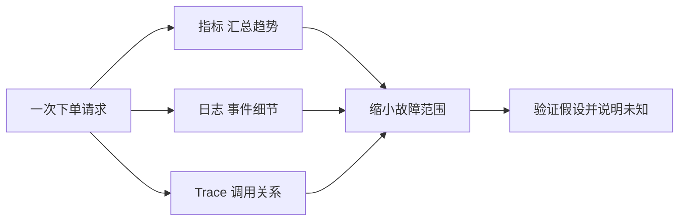
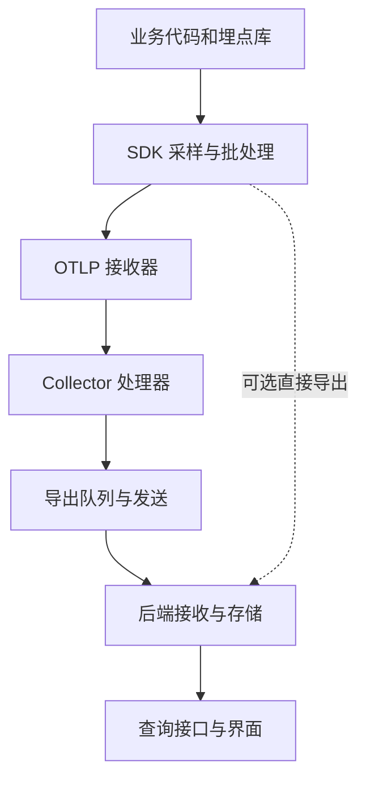
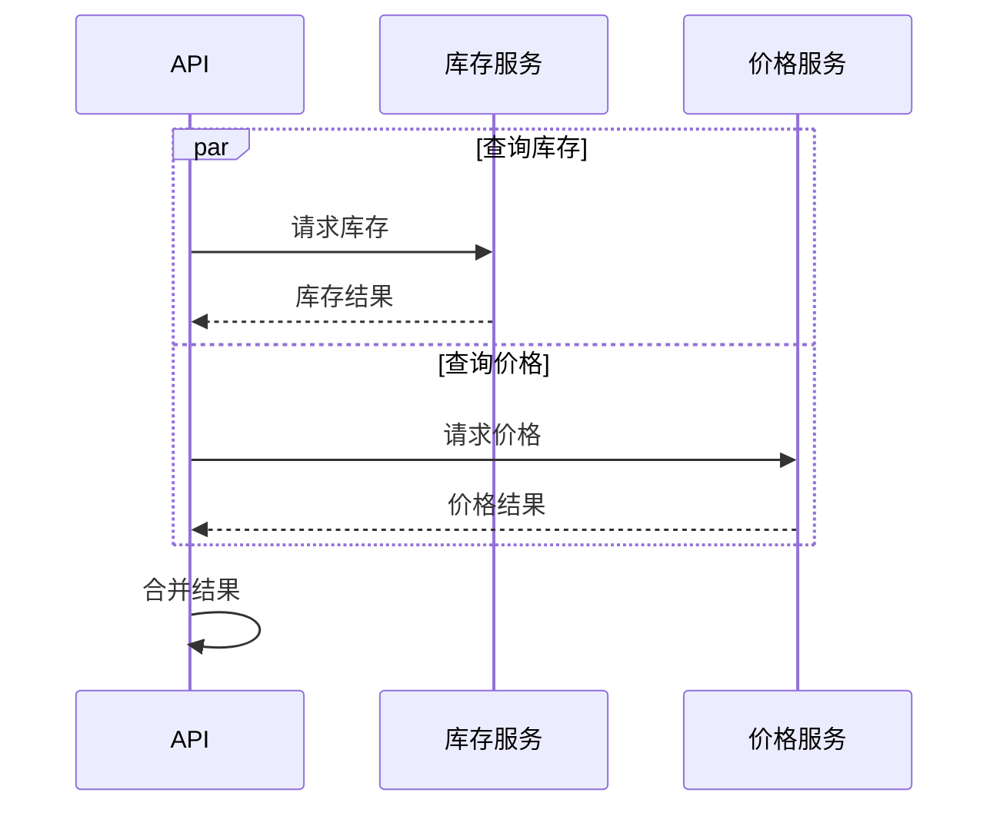
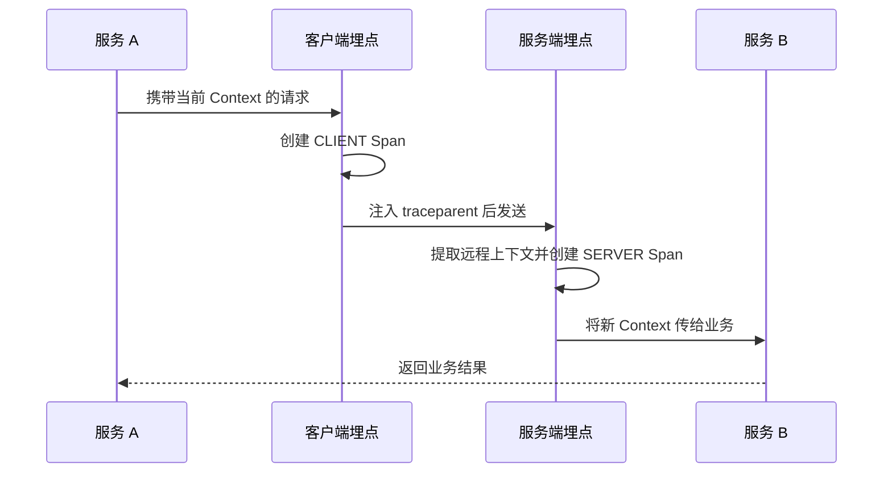
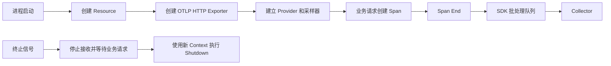
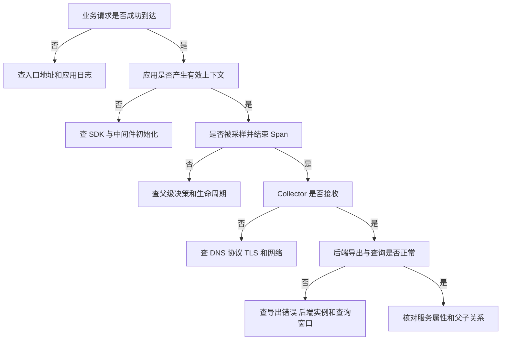
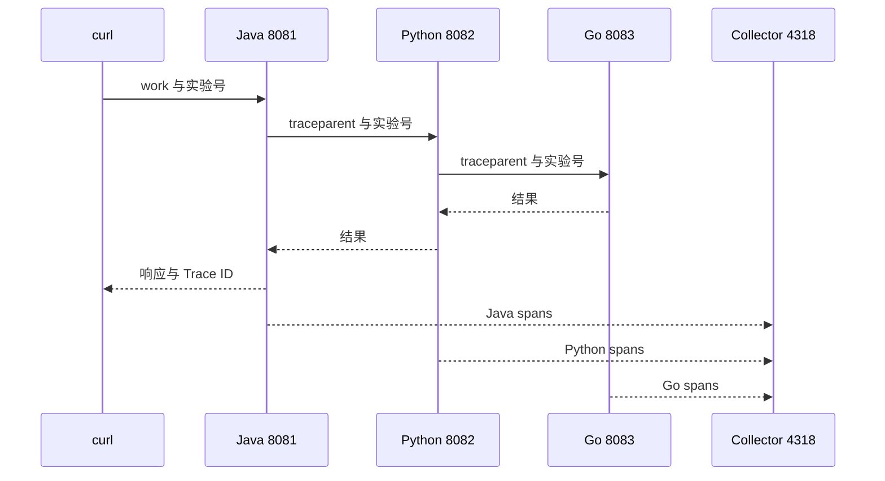

# OpenTelemetry 学习笔记 · 第一卷：基础模型与应用接入

> 面向运维、SRE 与平台工程师。以 Go、Java 和 Python 服务为应用接入主线；先理解数据如何产生和连接，再学习 Collector 与生产运维。  
> 资料核查日期：2026-09-19。本文采用明确的教学版本，不宣称它们是最新版或当前生产推荐版本。  
> 示例验证边界：Go 主实验已在临时目录解析依赖并通过编译检查；Python 固定依赖已在本机 Python 3.13 环境安装，模拟下游检查通过正常、错误、超时、断链及恢复等分支和指标计数。未完成 Java 编译、Python 3.12 运行、Docker / Kubernetes 或真实后端端到端实测。代码与配置另经结构和语法检查；文中的“预期”仍是读者验收标准。  
> 下一卷：Collector 与多信号集成；第三卷：生产运维与故障排查。

| 章节 | 学习后应能回答的问题 |
| --- | --- |
| 第 1 章 | OTel 在现有监控体系中增加什么，不替代什么？ |
| 第 2 章 | 怎样从 Span 的关系、时间和状态理解一次请求？ |
| 第 3 章 | 为什么两个服务的调用能连起来，又为什么会断链？ |
| 第 4 章 | 怎样让不同服务、环境和信号中的数据有一致身份？ |
| 第 5 章 | Go 如何管理 SDK、HTTP、RPC 与异步任务的上下文？ |
| 第 6 章 | 怎样启动最小环境，并证明请求、日志和 Trace 确实相互对应？ |
| 第 7 章 | Java Agent 怎样与 Spring Boot、业务 Span 和日志配合？ |
| 第 8 章 | Python 自动接入怎样覆盖 FastAPI、HTTPX 与异步调用？ |
| 第 9 章 | 三种语言怎样形成同一条可验证的调用链？ |

## 第 1 章：OpenTelemetry 的定位与观测数据流

### 1.1 从一个错误请求认识观测需求

凌晨收到“下单接口错误率升高”的告警，第一步通常不是打开一条随机 Trace，而是确认异常的范围：哪个环境、哪些接口、从什么时候开始、影响多少请求。指标擅长回答这些聚合问题；日志提供某个时刻的事件和业务上下文；Trace 则把一次操作经过的多个服务及其耗时、状态连接起来。

三类信号不是三个相互替代的产品，而是对同一系统的不同观察。假设 API 在调用库存服务后返回 502，指标可能显示 `/orders` 错误率升高，API 日志记录 `downstream_status=500`，Trace 显示库存业务 Span 报错。三者相互补充，但不能直接推出“数据库一定坏了”：如果库存服务未埋点数据库调用，数据库仍在证据覆盖之外。

#### 用问题选择数据，而不是先选择产品

| 要回答的问题 | 首选证据 | 仅凭它还不能证明什么 |
| --- | --- | --- |
| 最近五分钟错误请求增加了吗？ | 请求计数和错误计数 | 单个请求具体在哪一步失败 |
| 哪个订单处理失败、记录了什么错误？ | 结构化业务日志 | 跨服务等待关系和完整调用耗时 |
| 这次请求的大部分时间花在哪里？ | 对应 Trace 的时间线 | 没有埋点的代码、线程或内核活动 |
| 是所有实例还是某个实例异常？ | 按实例聚合的指标与日志 | 仅有一条 Trace 无法代表全部流量 |

这里的“首选”是排查入口，不是绝对规则。高质量日志也可以包含耗时，Trace 也能产生聚合指标，但它们的覆盖范围、采样和成本不同。



#### 一个容易忽视的判断

“没有错误 Span”与“没有发生错误”并不等价。请求可能没有被采样，错误可能未被正确标记，数据可能尚未导出，或者查错环境。学习 OTel 的目标之一，就是知道每个结论建立在哪段数据路径上，而不是把可视化页面当作系统的完整真相。


### 1.2 区分规范、SDK、Collector 与后端

OpenTelemetry 是一组用于产生、收集、处理和导出遥测数据的规范与软件组件，不是某个单独的容器。把“安装 OTel”理解为“启动 Collector”，会漏掉最重要的前提：应用必须通过埋点、自动接入或其他数据来源实际产生需要的信号。

#### 将职责分成五层

| 层次 | 解决的问题 | 典型对象 |
| --- | --- | --- |
| 规范与语义 | 数据长什么样，字段怎样表达同一含义 | OTLP、Trace API、语义约定 |
| 应用 API | 业务和库怎样记录操作 | Tracer、Meter、日志桥接 API |
| 应用 SDK | 怎样采样、聚合、排队和导出 | TracerProvider、SpanProcessor、MetricReader |
| 数据处理 | 怎样接收、补充属性、过滤、转换和转发 | Collector 的各类组件 |
| 后端 | 数据怎样存储、检索和展示 | Jaeger、Prometheus、VictoriaMetrics、日志系统 |

API 与 SDK 要分开理解。库通常依赖 API，避免强迫使用者接受某个后端；应用的入口负责初始化 SDK 和导出策略。仅在代码中取得一个 Tracer，并不意味着 Span 已经发送到远端。没有有效 SDK 配置时，API 调用可能只是无操作实现。

#### 它与已有监控栈的关系

已有 `node_exporter → Prometheus → VictoriaMetrics` 不需要为了接入 Trace 全部重建。可以先让一条 Go 或 Java 调用链通过 OTLP 进入 Collector，再进入 Jaeger；原有基础设施指标和 ELK 日志继续运行。之后根据重复采集、字段治理和维护成本决定哪些数据路径值得统一。

OTLP 是传输协议，不是查询语言；Collector 可以处理数据，但通常不是长期存储；Jaeger 可以接收 OTLP，却不能因此被当成通用指标和日志数据库。将这些边界写清，能够避免在错误的组件上寻找配置项。


### 1.3 画出应用到后端的数据流

最小接入可以是 SDK 直接导出到后端，也可以在中间加入 Collector。直接导出的环节少，适合验证 SDK 与后端协议；加入 Collector 后，应用不必分别持有多个后端地址和处理规则，也更容易集中维护资源属性、采样和数据治理。



#### 同一个“成功”可能只覆盖一小段

HTTP 请求成功，说明业务返回了结果，不说明 Span 导出成功。SDK 把 Span 放进内存队列，不说明 Collector 已接收。Collector 接受了一批数据，也不必然说明最后一层存储已完成索引。各组件可能异步处理，因此“请求结束”与“查询可见”之间通常不是同一个时间点。

排障时应标出可检查的边界：应用日志和导出错误、Collector 接收与拒绝计数、导出队列及失败计数、后端写入日志、按 ID 的查询结果。它们分别缩小不同的候选原因，不宜用一次 TCP 连通检查覆盖全部链路。

| 组织方式 | 维护优势 | 需要承担的责任 |
| --- | --- | --- |
| SDK 直连后端 | 路径简单，便于最初定位 | 应用管理后端连接、认证及策略变化 |
| SDK 经单个 Collector | 集中处理，易于演示 | Collector 成为需要监控的中间组件 |
| Agent 再到 Gateway | 分离节点采集与集中治理 | 路由、额外缓冲、资源与状态归属更复杂 |

#### 练习：给每条箭头写一个失败方式

例如应用到 Collector 是容器 DNS 配错，Collector 到后端是 TLS 不匹配，后端到查询是选错租户。能够把“没有数据”拆成这些可验证的具体问题，比记住某一份配置更有迁移价值。


### 1.4 明确学习范围与前置知识

本主题以 HTTP、YAML、容器和基本监控知识为前置，不要求先读完整 OTel 规范。第一卷把 Trace 的产生和传播讲透；第二卷增加 Collector、多信号与采样；第三卷处理扩容、缓冲、安全和综合排障。这样安排的原因是：没有理解前面的数据边界，后面看到“错误 Trace 丢失”时就容易把采样、传输和查询问题混在一起。

#### 与原有笔记配合阅读

| 已有知识 | 本主题继续补充 | 不在这里重复展开 |
| --- | --- | --- |
| Prometheus 指标与抓取 | OTel Instrument、Temporality、字段转换 | 完整 PromQL、TSDB 和告警语言 |
| VictoriaMetrics | OTLP 接入与命名对照 | 集群存储运维和全部 Flags |
| Kubernetes | Collector 拓扑与 Pod 身份关联 | Kubernetes 基础对象与调度原理 |
| 日志采集 | LogRecord 模型与 Trace 关联 | 完整 ELK 或 Loki 运维手册 |
| AIOps | 可追溯的证据和数据缺失表达 | Agent 框架及根因算法实现 |

建议先用本卷的最小环境验证“同一个 Trace ID 横跨两个服务”，再回过头理解 Provider、Processor 与 Exporter。阅读顺序可以往返，但第一次接入先保持全量头部采样、单 Collector、单 Trace 后端，不要同时引入十种不确定因素。

#### 版本不是一个统一数字

OTel 规范、Go SDK、HTTP 埋点库、Collector、Java Agent 各自发布。Collector 的版本号不能填进 Go 的 `go.mod`，Go 核心 SDK 与 contrib 模块也不必具有相同版本号。能力是否可用应同时查看信号、实现、发行版和后端支持。

本卷主实验固定 Go SDK `v1.38.0`、`otelhttp v0.63.0`、Collector Contrib `0.136.0` 与 Jaeger `2.11.0`。其中 `otelhttp v0.63.0` 的模块文件直接依赖 Go SDK `v1.38.0`。选择这组版本是为了让示例语法有明确落点，不代表可以跳过生产漏洞扫描与升级评估。


## 第 2 章：Trace、Span 与错误的表达

### 2.1 从一次调用理解 Trace 与 Span

Trace 是一组具有因果关联的 Span；Span 描述一次有起止时间的操作。一次请求可能经过网关、API、库存服务和数据库，多个组件分别记录自己的操作，再通过 Trace ID 与父 Span 关系连接。Trace 不等于一条日志，Span 也不等于一个服务：同一服务内可以有多个不同职责的 Span。

#### 从调用树读时间线

```text
Trace T
└─ service-a: GET /work              SERVER
   └─ service-a: business.work       INTERNAL
      └─ service-a: GET              CLIENT
         └─ service-b: GET /work     SERVER
            └─ service-b: business.work INTERNAL
```

CLIENT Span 从调用方视角记录一次请求，SERVER Span 从接收方视角记录处理过程。它们通常是父子关系，但测量范围不同：客户端观察可能包含连接、传输及读取响应的时间，服务端不会因此自动记录所有这些阶段。二者时长相减不能无条件解释为“纯网络延迟”。

| 字段 | 阅读方法 |
| --- | --- |
| Trace ID | 判断多条记录是否属于同一追踪上下文 |
| Span ID | 标识当前操作，而不是整条调用链 |
| Parent Span ID | 寻找直接上游操作 |
| Name | 识别操作类型，应采用稳定名称 |
| Kind | 理解该操作处于服务端、客户端、生产者等哪个边界 |
| Start / End | 阅读持续时间与相互重叠关系 |

#### 名称与数据完整性

`GET /orders/{id}` 比 `GET /orders/987654` 更适合作为 Span 名称。具体对象 ID 如确有排障必要，可以作为受控属性记录，不应成为不断增长的操作名称集合。

在后端看到孤立子 Span，不一定是 SDK 没有父子关系；父 Span 可能未导出、被过滤、晚到或落在另一个后端。要同时检查原始父 ID、服务身份和采集路径，不能只凭界面上的缩进判断根因。


### 2.2 区分 Attributes、Events 与 Status

Attributes 描述操作的属性，例如路由模板、重试次数和业务结果；Events 表示操作期间某个时间点发生的事件，例如“开始等待连接”或“缓存回退”；Status 表示操作的状态判断。它们的职责不同，不应把完整错误堆栈塞进 Span 名称，也不应只写一条错误日志却假定 Span 会自动变红。

#### 三种表达方式放在同一个场景中

以下是局部 Go 片段，假定 `span` 已由 `tracer.Start` 创建，`err` 是当前操作的错误：

```go
span.SetAttributes(
    attribute.String("demo.operation", "reserve_inventory"),
    attribute.Int("demo.retry_count", 1),
)
span.AddEvent("fallback.started")
if err != nil {
    span.RecordError(err)
    span.SetStatus(codes.Error, "inventory reservation failed")
}
```

在 Go SDK 中，`RecordError` 记录异常事件，并不等价于调用 `SetStatus(codes.Error, ...)`。正式代码应根据当前操作是否失败决定状态，而不是机械地对所有捕获过的异常设置失败。如果重试成功，某次尝试失败与最终操作成功可以分别由子 Span 和父 Span 表达。

| 表达目标 | 更合适的载体 | 应控制的内容 |
| --- | --- | --- |
| 本次调用使用哪个路由 | Span Attribute | 路由模板，不包含用户输入路径碎片 |
| 某个步骤开始回退 | Event | 事件名、必要参数与事件时间 |
| 当前操作最终失败 | Status | 简短原因，不重复长堆栈 |
| 数据来自哪个服务 | Resource | 不放成每个操作都手填的业务属性 |

#### 不能从颜色反推全部业务事实

`Unset` 是未显式设置状态，不等于“状态未知到完全不可用”，也不需要把每个成功 Span 都改成 `Ok`。某个异常被应用处理后，外层操作仍可能成功。相反，HTTP 200 内部也可能包含业务失败。排查时需要把协议结果、业务结果和 Span 状态并排理解。


### 2.3 分析超时、异常与业务失败

HTTP 状态码、语言异常和业务失败不属于同一层。连接超时可能根本没有 HTTP 响应；服务返回 500 是有响应的协议结果；库存不足可能是业务允许的拒绝，也可能属于某项交易目标的失败。笔记或告警规则必须说明自己使用哪一种“错误”定义。

#### 先定义操作，再判断它是否失败

| 场景 | HTTP 结果 | 可能的 Span 表达 | 排查关注点 |
| --- | --- | --- | --- |
| 下游返回 500 | 有响应 | CLIENT 与下游 SERVER 通常记录错误 | 下游失败原因和上游处理方式 |
| 客户端等待超过截止时间 | 可能无响应 | CLIENT 记录超时错误 | Deadline、连接阶段、服务端是否继续运行 |
| 查询对象不存在 | 404 | SERVER 通常不因 4xx 自动设 Error；CLIENT 语义不同 | 这是预期结果还是调用失败 |
| HTTP 200 但业务返回失败码 | 200 | 自动 HTTP 埋点未必判为失败 | 业务 Span 与明确的业务结果字段 |
| 首次尝试失败、第二次成功 | 最终可能 200 | 尝试子 Span 失败，外层操作可成功 | 重试耗时、次数及幂等性 |

上表涉及 HTTP 的行为应以具体 HTTP 语义约定和埋点库版本为准。一个值得单独记住的差异是：HTTP SERVER Span 与 CLIENT Span 对 4xx 的判断不能直接照搬同一规则。

#### 超时与取消需要两个视角

客户端达到两秒超时时间时，会停止等待并取消上下文。下游若正确响应取消，工作可能提前结束；若忽略取消，仍可能继续占用线程、连接或 CPU。因此客户端超时 Trace 只能证明“调用方未在截止时间内得到结果”，不能单独证明“服务端没有完成业务”。

本卷实验用可取消的定时器模拟慢操作，避免把无条件 `time.Sleep` 当成生产代码模板。实际应用还要让数据库、HTTP 客户端和任务队列正确接收上下文。

**验证方法：** 同时对照客户端错误、下游日志、两个 Span 的时间和业务副作用。只查外层 504，无法判断请求是否在下游执行成功。


### 2.4 理解并发、重试与 Span Links

真实请求不一定沿单条直线执行。API 可以并发查询库存和价格，也可以重试一次远程调用，或者把工作交给稍后运行的消息消费者。理解这些关系，需要同时区分父子关系、时间重叠和 Span Links。



#### 时长不能直接相加

假设父操作持续 300 ms，两个并行子操作各持续 200 ms，子 Span 时长合计 400 ms 并不与父操作矛盾。父操作记录经过的墙钟时间，子操作可能重叠执行。分析独占耗时应考虑子区间的并集，而不是简单做“父时长减所有子时长”。跨机器时间还可能受到时钟偏差影响。

重试也需要明确粒度。一个外层 `reserve_inventory` 可以包含两次 CLIENT 尝试，每次尝试有自己的 Span ID。两次请求使用同一个 Trace ID，不表示它们是同一次网络发送；用同一个 Span ID 重复代表多个尝试则会损害操作身份。

#### Span Links 不是另一种父 ID

Span 通常有一个父上下文，但可以关联多个 Links。批量消费者一次处理来自多个生产者的消息时，无法自然地把所有生产者都放进单一父关系；Links 可以表达这些因果联系。是否继续原 Trace，还是建立新 Trace 再链接旧上下文，要结合任务生命周期与消息语义决定。

局部 Go 片段：

```go
ctx, span := tracer.Start(
    context.Background(),
    "process.batch",
    trace.WithLinks(trace.Link{SpanContext: producerContext}),
)
defer span.End()
_ = ctx // 实际代码将 ctx 传入本批处理的子操作。
```

不要只为了在界面上“看起来连着”而把持续数小时的后台任务强行挂在已结束的 HTTP 请求下面。应优先使数据表达真实生命周期，并保留可追溯的消息标识。


## 第 3 章：上下文传播与断链排查

### 3.1 进程内 Context 与跨进程传播

进程内调用可以通过 Go 的 `context.Context` 携带当前 Span、取消信号和截止时间；跨进程调用则需要把其中适合传播的信息编码进协议载体。两者不能混为一谈：把 `ctx` 传给函数，不会自动让远端服务收到 Trace Context；把 `traceparent` 写进 HTTP Header，也不会把本地内存里的整个 Context 发送过去。

#### 注入与提取分别发生在哪里



在本卷代码中，服务端 `otelhttp.NewHandler` 负责提取，客户端 `otelhttp.NewTransport` 负责注入。业务代码只需使用收到的 `r.Context()`，并将创建业务 Span 后返回的新 `ctx` 继续传给下一次调用。不要在请求处理中随意改用 `context.Background()`。

| 操作 | 正确的目的 | 常见误区 |
| --- | --- | --- |
| `tracer.Start(ctx, name)` | 创建操作，并返回含新 Span 的 Context | 丢弃返回的 Context，后续调用挂回旧父节点 |
| `http.NewRequestWithContext(ctx, ...)` | 让请求使用指定 Context | 认为它本身已经完成 OTel Header 注入 |
| Propagator `Inject` | 把可传播上下文写入载体 | 同时再手工拼一个冲突的 `traceparent` |
| Propagator `Extract` | 从载体恢复远程父上下文 | 忽略提取结果，又从空 Context 开始 |

#### 如何验证

抓取或记录测试流量中的 `traceparent`，再对照下游 SERVER Span 的父 ID。上游客户端发出的 parent-id 应对应上游 CLIENT Span，而不是始终等于最初入口的 SERVER Span。验证时只对隔离实验流量开启 Header 输出，避免把认证和业务信息一起打印出来。


### 3.2 识别 W3C Trace Context

W3C Trace Context 定义了标准传播格式。以版本 `00` 为例，`traceparent` 由版本、Trace ID、parent-id 和标志组成。Trace ID 用于整条链路，parent-id 表示发送方当前操作的位置；每经过一个参与追踪的新操作，parent-id 可以改变，Trace ID 通常保持不变。

```text
00-13579bdf2468ace013579bdf2468ace0-1122334455667788-01
│  │                                │                └─ flags
│  │                                └─ parent-id
│  └─ trace-id
└─ version
```

这是构造的格式示例，不代表后端中存在对应 Trace。Trace ID 为 16 字节、常用 32 个十六进制字符表示；Span ID 为 8 字节、常用 16 个十六进制字符表示。全零 ID 不是有效 ID。版本 `00` 的头字段有明确长度和格式，不宜把普通 UUID 或自增 Request ID 直接拼进去。

#### 采样标志不是查询凭据

标志是位字段，检查 sampled 时应判断最低位，而不是把整个字符串永远当成只有 `00`、`01` 两种取值。即使 sampled 位为 1，也只能说明传播的采样意图，不能证明数据已经导出、持久化或仍在保留期内。

`tracestate` 用于额外的追踪系统状态，不应拿来装订单正文；`baggage` 是另一种业务上下文传播机制，也不是 `tracestate` 的别名。接入多个系统时，先确认大家使用的传播格式，而不是只确认每个系统都能生成 ID。

#### Request ID 与 Trace ID 并存

普通 Request ID 可以用于网关日志或客服排查，但它未必对应 OTel Trace。可以同时记录两者，也可以在受控应用中把有效 Trace ID 作为响应关联字段。不要只把 Nginx 的随机请求 ID 改名为 `trace_id`，就期望 Jaeger 能查到。

实验中，使用固定 `traceparent` 便于检查父关系，但每次测试应生成新的 Trace ID。反复使用同一个 ID，会把本来独立的请求混进同一条追踪数据中。


### 3.3 保持 HTTP、异步任务与消息上下文

同步 HTTP 场景的原则最简单：接收上下文，创建本地操作，调用下游时传递更新后的上下文。但异步任务的生命周期可能长于原请求，消息消费者还可能在另一台机器、数分钟后才开始工作。此时需要明确传播什么，以及什么不该继续继承。

#### 请求内并发与脱离请求的任务

请求内并发应传入当前 `ctx`，并等待子任务结束；子任务要响应取消。下面是局部片段，使用标准库 `sync.WaitGroup`，不依赖隐藏的辅助函数：

```go
var wg sync.WaitGroup
for _, name := range []string{"inventory", "price"} {
    wg.Add(1)
    go func(parent context.Context, operation string) {
        defer wg.Done()
        childCtx, child := tracer.Start(parent, "query."+operation)
        defer child.End()
        select {
        case <-childCtx.Done():
            child.RecordError(childCtx.Err())
            child.SetStatus(codes.Error, "cancelled")
        case <-time.After(20 * time.Millisecond):
            child.AddEvent("query.completed")
        }
    }(ctx, name)
}
wg.Wait()
```

真正后台化的工作不应无限继承 HTTP 截止时间，也不能简单丢掉因果关系。可以提取生产操作的 SpanContext，建立新任务上下文，再通过 Links 关联；也可以在明确的消息语义下继续原 Trace。选择依赖任务模型，没有一条适用于所有队列的硬规则。

#### 跨消息边界传播

消息生产者把 Trace Context 注入消息 Header，消费者提取 Header 后创建消费操作。不要序列化整个 Go Context，也不要把本地 `Span` 对象放进消息正文。中间件客户端是否已经自动注入，应先核实；同时手动和自动埋点容易产生重复操作或覆盖 Header。

批量消费时，一批消息可能来自不同 Trace；重试和重新投递还会引入多次处理。至少保留处理尝试的独立 Span，并区分消息身份与本次消费身份。消息系统已经“投递成功”，不表示业务处理成功，二者需要不同证据。


### 3.4 排查断链与管理 Baggage

断链的表现可能是两个服务具有不同 Trace ID，也可能是一个 Trace 中缺少中间节点。前者优先检查传播与新根创建，后者还应检查采样、过滤和丢失。不要见到调用树缺一层，就立即判定为 Header 丢失。

#### 按边界核对，而不是全链路盲查

| 检查位置 | 要核对的事实 | 典型问题 |
| --- | --- | --- |
| 服务 A 业务入口 | 当前 SpanContext 是否有效 | SDK 未初始化或读取 Context 的位置错误 |
| 服务 A 客户端 | 是否使用有埋点的 Transport，是否传入当前 ctx | 使用了另一个默认客户端 |
| 中间代理 | 是否保留有效传播头 | 明确的 Header 清理规则 |
| 服务 B 入口 | 是否提取传播头并继续使用新 ctx | 提取结果被丢弃，或强制创建新根 |
| 后端 | A、B 是否发送到同一存储与租户 | 实际发往了不同环境 |

本卷实验中的 `mode=broken` 会在 A 的出站请求中故意使用独立 Context。预期业务仍返回成功，但 A、B 形成不同 Trace。恢复 `mode=ok` 后，它们应重新连在一起。这比仅比较 Span 数量更能说明传播是否正确。

#### Baggage 的价值与边界

Baggage 可以传播少量与业务相关的上下文，例如受控的租户类别或实验标识。它不会天然成为每个 Span 的属性，也不是认证凭据。把它加入 Span 或指标需要显式、受控的处理；把用户 ID 直接转换为指标标签可能造成高基数。

外部请求中的 Baggage、Trace ID 和 sampled 标志都可能由调用者构造。入口需要根据安全边界决定是否接受、清理或重建上下文，并对长度和键进行限制。不能根据任意 `baggage: tenant=...` 就决定后端数据写入哪个租户，更不能在其中传递密码、Token 或完整个人信息。


## 第 4 章：Resource、语义约定与数据身份

### 4.1 区分数据来源与单次操作属性

Resource 描述产生遥测数据的实体，例如某个服务实例；Span Attribute 描述单次操作，例如路由或业务结果。两者都能以键值形式展示，因此很容易被混用。区别不在于“是不是字符串”，而在于属性的作用范围和生命周期。

#### 把同一个事实放在正确层次

| 信息 | 更合适的位置 | 原因 |
| --- | --- | --- |
| 服务名与部署环境 | Resource | 同一实例产生的多类数据共享身份 |
| 当前请求路由 | Span / Metric 数据点属性 | 不同请求可能属于不同路由 |
| 某次失败的异常 | Span Event / LogRecord | 发生在具体操作或时间点 |
| 埋点库名称与版本 | Instrumentation Scope | 描述是谁生成这批遥测 |
| 业务对象标识 | 受控的操作或日志属性 | 不应作为整个实例的身份 |

例如把 `service.name` 只写进业务 Span Attributes，不一定会让后端按预期建立服务索引；很多系统使用的是 Resource 中的服务名。同样，采集器自身的 hostname 不能随意覆盖应用的 `host.name`，否则会把“谁采集”误写成“谁产生”。

#### Provider 与 Resource 的关系

本卷 Go 示例在初始化 Provider 时建立 Resource，并让 Trace 与 Metrics 共用这份身份。服务实例换版本或重新启动后，可以产生新的 Resource 身份；请求过程中不应通过修改全局服务名来表达每个请求的租户。

如果某个进程确实代表多个逻辑资源，需要按信号与 SDK 支持选择合适建模方式，而不是把共享 Resource 当作可随请求变动的全局变量。并发请求下，错误共享既会污染数据，也会产生难复现的归属问题。

**验证方法：** 在 Collector `debug` 输出中分别查看 Resource、Scope 与 Span 层次。看到键值存在还不够，要确认它位于后端实际读取的层。


### 4.2 设计服务、实例与环境标识

一套观测体系最先需要统一的，往往不是复杂采样规则，而是基础身份。测试与生产都叫 `order-service` 没有问题，但查询必须还有环境维度；同一个服务多个 Pod 必须能区分实例；服务升级后要能够按版本观察变化。

#### 建议的最小身份集合

| 字段 | 例子 | 建议来源 | 维护注意 |
| --- | --- | --- | --- |
| `service.name` | `service-a` | 应用或部署配置 | 使用稳定逻辑服务名 |
| `service.namespace` | `ops-roadmap` | 平台约定 | 用于区分同名服务的所属域 |
| `service.version` | `lab-v1` | 构建与发布系统 | 不把永不变化的 latest 当作版本 |
| `service.instance.id` | Pod UID 或实例标识 | 平台或应用 | 与实例生命周期匹配 |
| `deployment.environment.name` | `lab` | 部署配置 | 不让缺省值把生产写成测试 |
| `k8s.namespace.name` | `otel-lab` | Kubernetes 关联 | 核验数据源，不取错采集器身份 |
| `k8s.pod.uid` | 实际 Pod UID | Downward API / 属性处理器 | 适合定位重建前后的实例 |

这里是本主题的字段方案，不是要求每个信号都把全部字段变成普通指标标签。尤其是实例 ID 和 Pod UID，会随部署变化；保留在 Resource 与提升为索引标签是两个不同决策。

环境变量示例，作用于应用进程：

```bash
export OTEL_SERVICE_NAME=service-a
export OTEL_RESOURCE_ATTRIBUTES='service.namespace=ops-roadmap,service.version=lab-v1,deployment.environment.name=lab'
```

这些变量是否被读取取决于 SDK 初始化方式。Go 示例显式启用 `resource.WithFromEnv()`；手工构建 Resource 却未启用对应选项时，不能只看容器中存在变量就假定它已生效。

#### 覆盖优先级要可解释

平台应明确应用提供什么、Collector 可以补什么、哪些字段允许覆盖。用于默认值时优先考虑“缺失才补”，而不是统一 `upsert` 成采集器的固定值。上线前分别发送 A、B 两个服务的数据，确认服务列表确实分开，并检查实例与环境没有交叉污染。


### 4.3 使用语义约定而不混用字段

统一协议解决“数据能否传输”，语义约定解决“大家是否用相同方式表达同一个事实”。HTTP 方法、状态码、数据库操作和部署环境等字段都有约定；自行创造近似字段虽然能被导出，但会增加跨语言查询、面板和处理规则的适配成本。

#### 字段名、类型与含义都需要核对

| 历史材料可能出现的字段 | 新材料常见字段 | 迁移时还要检查 |
| --- | --- | --- |
| `http.method` | `http.request.method` | SDK 是否已迁移，查询是否仍只读旧字段 |
| `http.status_code` | `http.response.status_code` | 整数与字符串类型，过滤规则比较方式 |
| `deployment.environment` | `deployment.environment.name` | Resource 层次及平台覆盖规则 |
| 完整 URL 作为操作名 | 稳定的路由或操作名称 | 是否包含用户标识、查询参数及基数增长 |

这张表用于识别迁移问题，不表示可以对所有历史数据直接批量重命名。某些语义变化不止改字段名；埋点库还可能同时调整指标单位、命名、属性集合和 Span 名称。

#### 自动埋点与手动字段的分工

优先由 HTTP 埋点库填写协议字段，业务代码记录带有明确命名空间的业务字段，例如 `demo.mode` 或 `order.result`。不要在服务端再手写一套不一致的 HTTP 状态字段。数据库接入同样应先查对应驱动及库的支持，不把“创建了数据库 Span”误写成“已经看到了数据库内部执行计划”。

某些埋点库提供语义迁移开关，但必须对照该库版本文档；不能把某个语言的环境变量推广成所有 SDK 都支持。本卷实验不依赖未核实的迁移开关，验证时记录实际导出的属性，而不是假设它与今天在线文档完全相同。


### 4.4 管理 Schema 变化与字段基数

字段是数据接口的一部分。修改字段名、类型或单位，会影响检索、告警、面板、采样规则、权限策略及历史数据对比。把遥测字段当成“日志里随便加个键”处理，往往到事故时才发现自动化规则已经失效。

#### Schema URL 不会自动修复所有不兼容

OTel 支持使用 Schema URL 描述语义版本，但发送了 Schema URL 不等于所有 Collector 和后端都会自动转换。是否执行转换、支持哪些版本，应检查实际组件。Go 中合并带有不同 Schema URL 的 Resource 也可能出现冲突；为了示例简单，本卷使用显式属性而不拼接互不一致的语义包资源。

字段变更可以先同时读取新旧字段，验证数据来源后再切换查询。但“同时兼容读取”不等于永久写两套含义相同的数据。需要规定过渡窗口、删除时间和回退条件，避免成本与歧义不断累积。

#### 高基数问题为什么与位置有关

如果一个指标按 10 个服务、20 个路由、5 类状态划分，理论组合上界是 1,000；再加一个每请求唯一的 Trace ID，维度便不再受这些固定集合约束。这是示意计算，实际序列数还取决于哪些组合真的出现、实例和其他标签。

Trace ID 适合放在日志的关联字段或指标 Exemplar 中，不适合作为普通请求计数指标的常规标签。Pod UID 在 Resource 中有排障价值，也不应因此无条件提升到每个指标的标签集合。

| 变更 | 至少需要的回归验证 |
| --- | --- |
| HTTP 状态由字符串改成整数 | OTTL 条件、日志索引映射、查询比较 |
| 毫秒改成秒 | 直方图边界、阈值、面板单位 |
| 服务名或命名空间调整 | 服务目录、告警归属、Trace 查询 |
| 新增动态 ID 字段 | 时间序列增长、索引成本、敏感数据风险 |

**练习：** 为一项字段变更写出生产方、处理方、查询方和回退方。能列出这四个责任边界，才能把“字段统一”变成可维护的工程约定。


## 第 5 章：Go 应用接入与上下文管理

### 5.1 初始化 API、SDK 与导出生命周期

SDK 初始化不是每个请求执行一次的准备工作，而是**进程启动时建立一套共享的遥测运行环境**。TracerProvider 决定 Resource、采样器和 SpanProcessor；SpanProcessor 把结束的 Span 交给 Exporter。业务代码取得 Tracer 后，只负责在正确的 Context 下创建和结束 Span。

下面的 `telemetry.go` 是完整文件，和下一节的 `main.go` 放在同一个 `app/` 目录。它不是伪代码，也不依赖未提供的初始化函数。依赖版本与构建文件统一在第 6 章给出。

#### 初始化链路和进程生命周期



本例默认启用 Traces，Metrics 由 `DEMO_METRICS_ENABLED` 控制，在第二卷再打开。这样第一轮接入不会同时遇到“链路没通”和“指标管道未配置”两种干扰。

**文件：`app/telemetry.go`。**

```go
package main

import (
	"context"
	"errors"
	"fmt"
	"math"
	"os"
	"strconv"
	"time"

	"go.opentelemetry.io/otel"
	"go.opentelemetry.io/otel/attribute"
	"go.opentelemetry.io/otel/exporters/otlp/otlpmetric/otlpmetrichttp"
	"go.opentelemetry.io/otel/exporters/otlp/otlptrace/otlptracehttp"
	metricapi "go.opentelemetry.io/otel/metric"
	"go.opentelemetry.io/otel/propagation"
	sdkmetric "go.opentelemetry.io/otel/sdk/metric"
	"go.opentelemetry.io/otel/sdk/resource"
	sdktrace "go.opentelemetry.io/otel/sdk/trace"
)

type telemetry struct {
	traces   *sdktrace.TracerProvider
	metrics  *sdkmetric.MeterProvider
	requests metricapi.Int64Counter
	duration metricapi.Float64Histogram
}

func newTelemetry(ctx context.Context) (*telemetry, error) {
	ratio, err := strconv.ParseFloat(env("DEMO_SAMPLE_RATIO", "1"), 64)
	if err != nil || math.IsNaN(ratio) || math.IsInf(ratio, 0) || ratio < 0 || ratio > 1 {
		return nil, fmt.Errorf("DEMO_SAMPLE_RATIO must be a number in [0,1]")
	}
	hostname, err := os.Hostname()
	if err != nil {
		return nil, fmt.Errorf("read hostname: %w", err)
	}
	res, err := resource.New(ctx,
		resource.WithFromEnv(),
		resource.WithTelemetrySDK(),
		resource.WithAttributes(
			attribute.String("service.name", env("OTEL_SERVICE_NAME", "service-a")),
			attribute.String("service.instance.id", env("SERVICE_INSTANCE_ID", hostname)),
		),
	)
	if err != nil {
		return nil, fmt.Errorf("create resource: %w", err)
	}
	traceExporter, err := otlptracehttp.New(ctx, otlptracehttp.WithTimeout(3*time.Second))
	if err != nil {
		return nil, fmt.Errorf("create trace exporter: %w", err)
	}
	t := &telemetry{}
	t.traces = sdktrace.NewTracerProvider(
		sdktrace.WithResource(res),
		sdktrace.WithSampler(sdktrace.ParentBased(sdktrace.TraceIDRatioBased(ratio))),
		sdktrace.WithBatcher(traceExporter,
			sdktrace.WithBatchTimeout(time.Second),
			sdktrace.WithMaxQueueSize(2048),
			sdktrace.WithMaxExportBatchSize(512),
		),
	)
	otel.SetTracerProvider(t.traces)
	otel.SetTextMapPropagator(propagation.NewCompositeTextMapPropagator(
		propagation.TraceContext{}, propagation.Baggage{},
	))

	// 第一卷默认关闭；第二卷启用后才建立 OTLP Metrics 管道。
	if env("DEMO_METRICS_ENABLED", "false") == "true" {
		metricExporter, exportErr := otlpmetrichttp.New(ctx,
			otlpmetrichttp.WithTimeout(3*time.Second),
		)
		if exportErr != nil {
			_ = t.shutdown(ctx)
			return nil, fmt.Errorf("create metric exporter: %w", exportErr)
		}
		t.metrics = sdkmetric.NewMeterProvider(
			sdkmetric.WithResource(res),
			sdkmetric.WithReader(sdkmetric.NewPeriodicReader(metricExporter,
				sdkmetric.WithInterval(5*time.Second),
			)),
			sdkmetric.WithView(sdkmetric.NewView(
				sdkmetric.Instrument{Name: "demo.request.duration"},
				sdkmetric.Stream{Aggregation: sdkmetric.AggregationExplicitBucketHistogram{
					Boundaries: []float64{0.005, 0.01, 0.025, 0.05, 0.1, 0.25, 0.5, 1, 2, 5},
				}},
			)),
		)
		otel.SetMeterProvider(t.metrics)
	}
	meter := otel.Meter("ops-roadmap/demo")
	t.requests, err = meter.Int64Counter("demo.requests",
		metricapi.WithDescription("Completed work handler requests"))
	if err != nil {
		_ = t.shutdown(ctx)
		return nil, err
	}
	t.duration, err = meter.Float64Histogram("demo.request.duration",
		metricapi.WithUnit("s"),
		metricapi.WithDescription("Work handler duration in seconds"))
	if err != nil {
		_ = t.shutdown(ctx)
		return nil, err
	}
	return t, nil
}

func (t *telemetry) observe(ctx context.Context, status int, seconds float64) {
	attrs := metricapi.WithAttributes(
		attribute.String("http.route", "/work"),
		attribute.String("http.request.method", "GET"),
		attribute.Int("http.response.status_code", status),
	)
	t.requests.Add(ctx, 1, attrs)
	t.duration.Record(ctx, seconds, attrs)
}

func (t *telemetry) shutdown(ctx context.Context) error {
	var errs []error
	if t.metrics != nil {
		errs = append(errs, t.metrics.Shutdown(ctx))
	}
	if t.traces != nil {
		errs = append(errs, t.traces.Shutdown(ctx))
	}
	return errors.Join(errs...)
}
```

#### 为什么这样组织

`ParentBased(TraceIDRatioBased(ratio))` 中的比例用于没有有效父级时的根决策。有远程父级时，默认遵循父级采样决定。因此 `DEMO_SAMPLE_RATIO=1` 并不表示可以覆盖任意外部传入的未采样父级；首次实验不要自行带入 `traceparent`，第 14 章再有意验证该边界。

`WithBatcher` 用有限队列隔离业务路径和导出开销，但它不是磁盘持久化机制。队列满、进程突然退出或导出超时，均可能影响可见性。`WithBatchTimeout(time.Second)` 是定期发送的触发条件，不是“每一条 Trace 必须一秒内查询成功”的保证。

`WithFromEnv()` 负责读取 Resource 环境配置；这里显式设置服务名和实例 ID，避免仅凭主机名猜服务。Sampler 的环境变量并非由这段代码自动采用：我们**明确读取的是自定义 `DEMO_SAMPLE_RATIO`**，不要只修改 `OTEL_TRACES_SAMPLER_ARG`，然后以为比例已经改变。

| 配置 | 由谁读取 | 实验用途 |
| --- | --- | --- |
| `OTEL_SERVICE_NAME` | Resource/本示例代码 | 区分两个服务 |
| `OTEL_RESOURCE_ATTRIBUTES` | Resource 环境检测器 | 命名空间、版本和环境 |
| `OTEL_EXPORTER_OTLP_ENDPOINT` | 本例选用的 OTLP HTTP Exporter | Collector 基地址 |
| `DEMO_SAMPLE_RATIO` | 本例代码 | 根 Trace 的比例，默认 1 |
| `DEMO_METRICS_ENABLED` | 本例代码 | 是否建立 Metrics Provider，默认 false |
| `SERVICE_INSTANCE_ID` | 本例代码 | 可选覆盖实例标识，否则使用 hostname |

生产接入时，初始化失败可以选择阻止启动，也可以降级为无遥测运行，但必须明确策略并产生可监测信号。这个教学程序选择返回错误，不使用一个悄悄失效的 Provider 继续假装已接入成功。Exporter 构造成功本身仍不证明远端可达，必须用第 6 章的数据验证完成闭环。


### 5.2 接入服务端、客户端与业务 Span

实验不依赖 MySQL、Redis 或消息集群。**同一份程序运行两次**：service-a 收到请求后访问 service-b，service-b 模拟库存检查。这样可以把注意力放在服务间传播、错误表达和观测数据上，而不是外围依赖的初始化。

服务端中间件创建 SERVER Span，客户端 Transport 创建 CLIENT Span；`business.work` 则是人为定义的业务操作。客户端不能只用普通的 `http.Get` 而忽略请求 Context，否则即使两边都安装了 SDK，也不一定形成同一条 Trace。

**文件：`app/main.go`。**

```go
package main

import (
	"context"
	"encoding/json"
	"errors"
	"fmt"
	"io"
	"log/slog"
	"net/http"
	"net/url"
	"os"
	"os/signal"
	"regexp"
	"strings"
	"syscall"
	"time"

	"go.opentelemetry.io/contrib/instrumentation/net/http/otelhttp"
	"go.opentelemetry.io/otel"
	"go.opentelemetry.io/otel/attribute"
	"go.opentelemetry.io/otel/codes"
	"go.opentelemetry.io/otel/trace"
)

var casePattern = regexp.MustCompile(`^[A-Za-z0-9_-]{1,64}$`)

func env(key, fallback string) string {
	if value := os.Getenv(key); value != "" {
		return value
	}
	return fallback
}

type app struct {
	name       string
	downstream string
	client     *http.Client
	log        *slog.Logger
	telemetry  *telemetry
}

func (a *app) work(w http.ResponseWriter, r *http.Request) {
	started := time.Now()
	mode := r.URL.Query().Get("mode")
	if mode == "" {
		mode = "ok"
	}
	caseID := r.Header.Get("X-Demo-Case")
	if !casePattern.MatchString(caseID) {
		caseID = "unspecified"
	}
	attrs := []attribute.KeyValue{
		attribute.String("demo.mode", mode),
		attribute.String("demo.case_id", caseID),
	}
	trace.SpanFromContext(r.Context()).SetAttributes(attrs...)
	ctx, span := otel.Tracer("ops-roadmap/demo").Start(r.Context(), "business.work",
		trace.WithAttributes(attrs...),
	)
	sc := span.SpanContext()
	status := http.StatusOK
	errorCode := ""
	defer func() {
		elapsed := time.Since(started)
		a.telemetry.observe(ctx, status, elapsed.Seconds())
		level := slog.LevelInfo
		if status >= 500 {
			level = slog.LevelError
		}
		a.log.Log(ctx, level, "request.complete",
			"service.name", a.name,
			"trace_id", sc.TraceID().String(),
			"span_id", sc.SpanID().String(),
			"trace_sampled", sc.IsSampled(),
			"http.route", "/work",
			"http.response.status_code", status,
			"duration_ms", float64(elapsed.Microseconds())/1000,
			"demo.mode", mode,
			"demo.case_id", caseID,
			"demo.error_code", errorCode,
		)
		span.End()
	}()
	write := func(code int, result string) {
		status = code
		w.Header().Set("Content-Type", "application/json")
		w.Header().Set("X-Trace-Id", sc.TraceID().String())
		w.WriteHeader(code)
		if err := json.NewEncoder(w).Encode(map[string]any{
			"service": a.name, "mode": mode, "result": result,
			"trace_id": sc.TraceID().String(), "case_id": caseID,
		}); err != nil {
			a.log.Warn("response.write_failed", "error", err.Error())
		}
	}
	fail := func(code int, kind string, err error) {
		errorCode = kind
		span.RecordError(err)
		span.SetStatus(codes.Error, kind)
		write(code, kind)
	}
	switch mode {
	case "ok", "error", "slow", "timeout", "broken":
	default:
		write(http.StatusBadRequest, "unsupported mode")
		return
	}

	if a.downstream != "" {
		parent := ctx
		if mode == "broken" {
			// 故意断链：只用于隔离实验，业务请求仍然能发出。
			parent = context.Background()
		}
		callCtx, cancel := context.WithTimeout(parent, 2*time.Second)
		defer cancel()
		endpoint := a.downstream + "/work?mode=" + url.QueryEscape(mode)
		req, err := http.NewRequestWithContext(callCtx, http.MethodGet, endpoint, nil)
		if err != nil {
			fail(http.StatusInternalServerError, "request_build_failed", err)
			return
		}
		req.Header.Set("X-Demo-Case", caseID)
		resp, err := a.client.Do(req)
		if err != nil {
			if errors.Is(err, context.DeadlineExceeded) {
				fail(http.StatusGatewayTimeout, "downstream_timeout", err)
			} else {
				fail(http.StatusBadGateway, "downstream_transport_failed", err)
			}
			return
		}
		// 读取并关闭响应体，让客户端 Span 正常结束并复用连接。
		_, readErr := io.Copy(io.Discard, io.LimitReader(resp.Body, 1<<20))
		closeErr := resp.Body.Close()
		if readErr != nil || closeErr != nil {
			fail(http.StatusBadGateway, "downstream_read_failed", errors.Join(readErr, closeErr))
			return
		}
		if resp.StatusCode >= 400 {
			fail(http.StatusBadGateway, "downstream_status_error",
				fmt.Errorf("downstream returned HTTP %d", resp.StatusCode))
			return
		}
		write(http.StatusOK, "completed")
		return
	}

	if mode == "error" {
		fail(http.StatusInternalServerError, "inventory_unavailable",
			errors.New("demo inventory unavailable"))
		return
	}
	delay := 20 * time.Millisecond
	if mode == "slow" {
		delay = 750 * time.Millisecond
	}
	if mode == "timeout" {
		delay = 4 * time.Second
	}
	timer := time.NewTimer(delay)
	defer timer.Stop()
	select {
	case <-ctx.Done():
		fail(http.StatusServiceUnavailable, "operation_cancelled", ctx.Err())
	case <-timer.C:
		span.AddEvent("inventory.checked")
		write(http.StatusOK, "completed")
	}
}

func run(log *slog.Logger) error {
	ctx, stop := signal.NotifyContext(context.Background(), os.Interrupt, syscall.SIGTERM)
	defer stop()
	t, err := newTelemetry(ctx)
	if err != nil {
		return err
	}
	defer func() {
		// 不复用已取消的信号 Context。
		flushCtx, cancel := context.WithTimeout(context.Background(), 10*time.Second)
		defer cancel()
		if err := t.shutdown(flushCtx); err != nil {
			log.Error("telemetry.shutdown_failed", "error", err.Error())
		}
	}()
	downstream := strings.TrimRight(os.Getenv("DOWNSTREAM_URL"), "/")
	if downstream != "" {
		u, parseErr := url.Parse(downstream)
		if parseErr != nil || u.Host == "" || (u.Scheme != "http" && u.Scheme != "https") {
			return fmt.Errorf("invalid DOWNSTREAM_URL")
		}
	}
	a := &app{
		name: env("OTEL_SERVICE_NAME", "service-a"), downstream: downstream,
		client: &http.Client{Transport: otelhttp.NewTransport(http.DefaultTransport)},
		log:    log, telemetry: t,
	}
	mux := http.NewServeMux()
	mux.Handle("GET /work", otelhttp.NewHandler(
		otelhttp.WithRouteTag("/work", http.HandlerFunc(a.work)), "GET /work"))
	mux.HandleFunc("GET /healthz", func(w http.ResponseWriter, _ *http.Request) {
		w.WriteHeader(http.StatusOK)
		_, _ = w.Write([]byte("ok\n"))
	})
	server := &http.Server{
		Addr: env("LISTEN_ADDR", ":8080"), Handler: mux,
		ReadHeaderTimeout: 3 * time.Second, IdleTimeout: 30 * time.Second,
	}
	errCh := make(chan error, 1)
	go func() { errCh <- server.ListenAndServe() }()
	log.Info("server.starting", "address", server.Addr, "service.name", a.name)
	select {
	case err := <-errCh:
		if !errors.Is(err, http.ErrServerClosed) {
			return err
		}
	case <-ctx.Done():
		shutdownCtx, cancel := context.WithTimeout(context.Background(), 5*time.Second)
		defer cancel()
		if err := server.Shutdown(shutdownCtx); err != nil {
			_ = server.Close()
			return fmt.Errorf("server shutdown: %w", err)
		}
	}
	return nil
}

func main() {
	log := slog.New(slog.NewJSONHandler(os.Stdout, nil))
	if err := run(log); err != nil {
		log.Error("app.failed", "error", err.Error())
		os.Exit(1)
	}
}
```

#### 用同一段代码理解五种路径

| 请求模式 | service-b 行为 | service-a 对外结果 | 学习重点 |
| --- | --- | --- | --- |
| `ok` | 等待约 20 ms 后成功 | 200 | 完整父子关系 |
| `error` | 主动返回 500，并设置业务错误 | 502 | 上游报错与下游原始失败 |
| `slow` | 等待约 750 ms | 200 | 慢请求不一定是错误 |
| `timeout` | 尝试等待 4 s，但可被取消 | 通常为 504 | A 的 2 s deadline 与 B 的取消 |
| `broken` | 正常完成操作 | 200 | A 故意丢弃父 Context，形成另一条链 |

上述时间是程序中的延迟参数，不是实测延迟，也不是性能指标。调度、网络和负载会增加实际耗时。`timeout` 时，B 可能在客户端已经断开后尝试写错误响应；B 本地记录的处理结果不等于 A 收到的响应。分析时应分别看两端的观察。

**`broken` 是一条可以成功完成的业务请求。** 它说明“业务可用”和“追踪完整”是不同验收目标。不要通过把所有请求都标成错误来验证链路覆盖，也不要只检查 HTTP 200。

#### 哪些细节是生产中容易漏掉的

对响应体进行有限读取并关闭，不只是连接复用问题，也影响客户端 Span 何时结束。业务 Span 结束、SDK 发送、Collector 接收和后端查询是不同的时刻，日志早于查询可见是可能的。

退出流程先执行 HTTP Server 的优雅关闭，再用新创建的 Context 刷出 SDK 数据。若直接把已收到 SIGTERM 而取消的 Context 传给 Shutdown，就可能使导出立即失败；若容器被 SIGKILL 或宽限期不足，这套优雅流程也无法执行。

`X-Demo-Case` 是实验关联号，只接受有限字符与长度，不作为认证身份。实际平台不应把外部请求头直接当租户、付费等级或管理员身份。这里给出的程序是教学服务，不包含生产认证、限流、完整访问审计和业务持久化。


### 5.3 连接结构化日志和基础指标

日志关联的第一步不是部署新的日志库，而是**在记录日志的位置拿到正在处理该业务的 Context**。本例在业务 Span 结束前读取其 SpanContext，把 `trace_id`、`span_id` 和 `trace_sampled` 写入 JSON。它没有把全部日志自动转换为 OTel LogRecord；第二卷会进一步讲文件采集和字段映射。

#### 一条业务完成日志的含义

下面是字段结构示意，不是本次实际运行结果：

```json
{
  "time": "2026-09-18T10:00:00Z",
  "level": "ERROR",
  "msg": "request.complete",
  "service.name": "service-a",
  "trace_id": "4bf92f3577b34da6a3ce929d0e0e4736",
  "span_id": "00f067aa0ba902b7",
  "trace_sampled": true,
  "http.route": "/work",
  "http.response.status_code": 502,
  "duration_ms": 25.0,
  "demo.mode": "error",
  "demo.case_id": "error-001",
  "demo.error_code": "downstream_status_error"
}
```

`span_id` 指向本服务的 `business.work`，不是固定指向服务端入口 Span。同一请求的多个日志可以关联不同的当前 Span，这是正常情况；Trace ID 相同不要求 Span ID 也相同。

`trace_sampled=true` 表示当前传播上下文中的采样位，不表示 Jaeger 已经落盘、已经建立查询结果，也不表示后续 Tail Sampling 一定保留。反过来，采样关闭时业务日志仍可能存在且携带有效 Trace ID，这正是第 14 章要验证的情况。

#### 指标记录为什么不依赖 Trace 是否保存

示例用 `demo.requests` 统计完成的 `/work` handler，用 `demo.request.duration` 记录处理耗时。调用发生在 defer 内，不以 `span.IsRecording()` 为条件，因此业务指标不会因为 Trace 采样比例降为 10% 就主动减少为十分之一。

但是它们仍有自己的统计口径：每个服务分别记录一次，不是全链路只有一个计数；没有进入 handler、进程崩溃前未完成、导出期间丢失的观测不在简单的完整性保证之内。展示入口业务请求量时，应选择 service-a，而不是把 A 和 B 的计数直接相加。

| 字段 | 日志或 Trace 中使用 | 常规指标标签中使用 |
| --- | --- | --- |
| 路由模板 `/work` | 适合 | 适合，取值有界 |
| HTTP 状态码 | 适合 | 通常适合 |
| Trace ID、Span ID | 用于关联 | 不应作为逐请求常规标签 |
| `demo.case_id` | 实验对照 | 不应加入长期指标维度 |
| 服务与环境 | 用于来源归属 | 按容量与查询需要选择 |

“日志中有这个字段”不等于“所有信号都必须把这个字段复制成标签”。关联追踪的指标机制是 Exemplar，详细约束见第二卷 12.4；它不等于创建一条以 Trace ID 为维度的新时间序列。

本例中的 `otelhttp` 也可能产生 HTTP 指标。自定义 `demo.*` 是业务 handler 的明确定义，不能和自动 HTTP 指标叠加后当成同一份请求总量。生产上可以选用其中一套作为主要 SLI，另一套用于验证和补充。


### 5.4 从标准库迁移到框架、数据库和 gRPC

前面的 HTTP 实验刻意暴露了 Context 与生命周期。迁移到 Gin、数据库或 gRPC 时，要保留这条主线：入口提取父上下文，业务代码继续使用它，下游客户端在发送操作时注入或记录调用，进程退出前刷新 SDK。

#### 按边界选择埋点位置

| 真实代码边界 | 接入位置 | 最容易漏掉的事 |
| --- | --- | --- |
| Gin 路由 | 路由器安装一次 `otelgin` 中间件 | 业务层使用 `c.Request.Context()`，不要把整个 Gin Context 传到后台 |
| net/http 出站 | 复用包装后的 `http.Client` | 使用 `NewRequestWithContext`，读取并关闭响应体 |
| gRPC 服务端 | `grpc.StatsHandler(otelgrpc.NewServerHandler())` | 继续使用 RPC handler 收到的 Context |
| gRPC 客户端 | `grpc.WithStatsHandler(otelgrpc.NewClientHandler())` | RPC 调用的第一个参数必须是当前 Context |
| database/sql | 使用兼容的 SQL 埋点包装库或明确的业务 Span | 实际执行使用 `QueryContext` / `ExecContext`，仅初始化 SDK 不会自动捕获 SQL |
| go-redis | 在共享客户端上安装所选版本的 OTel hook | 命令使用当前 Context，区分连接错误与缓存未命中 |

下列是 gRPC 的**接入片段**，不包含 `.proto`、服务注册和 TLS 证书，不是另一套完整 RPC 工程。若加入第 6 章模块，先选择与 Go SDK `v1.38.0` 对齐的 `otelgrpc v0.63.0`，再锁定其解析出的 gRPC 依赖。服务器和客户端的传输凭据由应用配置提供。

```go
// imports: google.golang.org/grpc
// go.opentelemetry.io/contrib/instrumentation/google.golang.org/grpc/otelgrpc
// serverCredentials 和 clientCredentials 是已配置的 credentials.TransportCredentials。
server := grpc.NewServer(
    grpc.Creds(serverCredentials),
    grpc.StatsHandler(otelgrpc.NewServerHandler()),
)
conn, err := grpc.NewClient(target,
    grpc.WithTransportCredentials(clientCredentials),
    grpc.WithStatsHandler(otelgrpc.NewClientHandler()),
)
// 检查 err，注册业务服务并启动 server；关闭时执行 server.GracefulStop 和 conn.Close。
```

不要再无条件叠加一套旧式 OTel 拦截器。验证时先发一个 RPC，检查 SERVER / CLIENT Span 的数量与父子关系，然后测试 deadline、服务端错误与客户端取消。gRPC 业务请求与 OTLP/gRPC 导出是两条不同的连接：业务 RPC 成功，不说明 Collector 的 4317 可用。

#### 数据库 Span 应表达什么

如果暂时没有采用驱动埋点库，可以先记录一个语义明确的业务数据访问操作。下面函数可放入已有 Go 工程；`db` 由应用初始化并复用，SQL 用 PostgreSQL 的参数占位符，换 MySQL 时需要调整驱动与占位符。

```go
// imports: context, database/sql, errors
// go.opentelemetry.io/otel, go.opentelemetry.io/otel/codes
func loadStock(ctx context.Context, db *sql.DB, sku string) (int, error) {
    ctx, span := otel.Tracer("ops-roadmap/stock").Start(ctx, "stock.load")
    defer span.End()
    var quantity int
    err := db.QueryRowContext(ctx,
        "SELECT quantity FROM stock WHERE sku = $1", sku).Scan(&quantity)
    if err != nil && !errors.Is(err, sql.ErrNoRows) {
        span.RecordError(err)
        span.SetStatus(codes.Error, "stock_query_failed")
    }
    return quantity, err
}
```

这里记录的是包含取连接、查询和扫描结果的业务操作，不声称精确测得数据库服务器执行时间。`sql.ErrNoRows` 是否属于失败取决于业务约定；缓存未命中也不能一律标红。参数值、完整 SQL、连接串不应直接塞入属性。驱动自动 Span 与外层 `stock.load` 可以并存，因为两者表达不同操作，但不要给同一次驱动调用叠加两个同义的 CLIENT Span。

### 5.5 管理 goroutine、后台任务与自动埋点选择

把函数放进 goroutine 不会自动生成新的业务 Span，也不会替你选择任务的生命周期。请求内并发应继续携带请求 Context；需要脱离请求的任务则应有明确的超时、任务身份和结束机制。

#### 请求内并发保留取消语义

```go
// imports: context
// go.opentelemetry.io/otel
// check 是接收 context.Context 并返回 error 的业务函数。
func checkAsync(ctx context.Context, check func(context.Context) error) error {
    result := make(chan error, 1)
    go func(parent context.Context) {
        child, span := otel.Tracer("ops-roadmap/demo").Start(parent, "stock.check")
        defer span.End()
        result <- check(child)
    }(ctx)
    select {
    case err := <-result:
        return err
    case <-ctx.Done():
        return ctx.Err()
    }
}
```

缓冲通道避免调用方取消后 goroutine 永远阻塞在发送结果上；它不能强制停止一个不响应 Context 的 `check`。因此应同时验证父请求取消、下游是否停止、Span 是否结束。若任务没有响应取消，提前返回并不意味着后台资源已经释放。

对于允许请求结束后继续执行的任务，`context.WithoutCancel` 可以保留值而移除取消，但必须重新设置任务自己的超时；长期任务通常更适合写入队列，在消费者中恢复传播上下文或建立 Span Link。不要用无限期 `context.Background()` 代替任务设计。

#### 自动接入不是同一条技术路线

| 路线 | 改动位置 | 适合先验证什么 |
| --- | --- | --- |
| SDK + 框架/驱动库 | 初始化与调用边界 | Context、错误、生命周期均显式可控，作为本卷主线 |
| 编译期插桩工具 | 构建链与产物 | 工具来源、支持库、构建可重复性及已有 SDK 冲突 |
| eBPF 自动观测 | Linux 运行环境和部署权限 | 内核、可执行文件、容器权限、实际覆盖的调用与信号 |
| Operator `inject-sdk` | Pod 环境变量 | 已有程序是否实际读取这些变量，不会自动补上 SDK |

不要把第三方编译工具的命令写成所有 Go 项目通用的官方命令。先记录选用的工具、版本和依赖范围，再拿正常、错误、异步三个请求对照。自动观测能减少通用边界的接入代码，业务失败定义与自定义指标仍需应用负责。Kubernetes 中 Go eBPF 注入的具体边界放在第 17 章。

降低开销时先检查采集范围：健康检查能否不进入埋点中间件，是否有重复包装，路由名是否带动态 ID。Collector 过滤可以减少后端写入，但数据已经在应用生成、排队并跨网传输，不能追回这些开销。

## 第 6 章：OTLP 与第一个最小闭环

### 6.1 区分 OTLP 协议与后端查询接口

OTLP 是遥测数据的传输协议。应用向 Collector 的 OTLP 端点发送数据，和人在 Jaeger UI 中查询 Trace，是两个不同方向、不同用途的接口。端口连通只能排除一部分网络问题，不能证明信号类型、路径、编码和权限正确。

| 接口 | 本实验地址 | 用途 |
| --- | --- | --- |
| 业务请求入口 | 宿主机 `127.0.0.1:8080/work` | 产生待观测的调用 |
| OTLP/HTTP | Collector 的 `4318` | 接收 SDK 发送的遥测 |
| OTLP/gRPC | Collector 或 Jaeger 的 `4317` | 另一种 OTLP 传输方式 |
| Jaeger UI / 查询服务 | 宿主机 `127.0.0.1:16686` | 读取已经存储的 Trace |
| Collector health extension | 宿主机 `127.0.0.1:13133` | 检查扩展提供的健康状态 |

#### 端口映射不等于对应能力已启用

Collector 的常见端口属于不同组件，不需要在第一次实验中全部发布。容器 `ports`、Kubernetes Service 和 receiver/extension 配置分别控制不同环节；只映射端口不会让进程开始监听。

| 本笔记使用的端口 | 所属能力 | 必须具备的配置 |
| --- | --- | --- |
| 4317 | OTLP/gRPC 接收 | `otlp.protocols.grpc` 和对应信号 pipeline |
| 4318 | OTLP/HTTP 接收 | `otlp.protocols.http` 和对应信号 pipeline |
| 8888 | Collector 自监控指标 | `service.telemetry.metrics` 的实际 reader |
| 8889 | 业务指标供 Prometheus 抓取 | `prometheus` exporter 的 endpoint 与 metrics pipeline |
| 13133 | 健康检查 | `health_check` 定义及 `service.extensions` 启用 |
| 1777 | Collector Go 性能剖析 | `pprof` 扩展；本笔记第 20.7 节显式配置 |
| 55679 | 内部诊断页面 | `zpages` 扩展；不是业务 Trace 查询界面 |

这些是本笔记选定的地址，不保证任意发行版默认相同。`8888` 正常不能证明业务指标出口 `8889` 已工作，健康检查返回 200 也不能证明后端查询成功。第一卷只发布当前实验所需端口，后续章节再按实际新增的能力扩展。

#### HTTP 的路径如何组成

OTLP/HTTP 的信号路径通常是 `/v1/traces`、`/v1/metrics` 和 `/v1/logs`。本例使用 Go 的 HTTP Exporter，把通用基地址设为 `http://otel-collector:4318`，由 Exporter 补上信号路径。

```bash
# 通用基地址：HTTP Exporter 按信号追加路径。
export OTEL_EXPORTER_OTLP_ENDPOINT=http://otel-collector:4318

# 信号专属地址：明确提供最终路径，不假定再次自动追加。
export OTEL_EXPORTER_OTLP_TRACES_ENDPOINT=http://otel-collector:4318/v1/traces
```

这两行是两种设置方式的说明，不要求同时设置。信号专属设置可能覆盖通用设置，排查时必须查看进程真正继承的环境。Collector 的 `otlphttp` exporter 也有基地址与信号专属 endpoint 的区分，但其 YAML 配置并不是 SDK 环境变量的同一套接口。

```yaml
# Collector 增量片段，不是完整文件。
exporters:
  otlphttp/example:
    endpoint: http://another-collector:4318
```

`http://` 与 `https://`、gRPC 与 HTTP/protobuf、端口 4317 与 4318 不能任意组合。向 gRPC 端点执行一次普通 HTTP GET 失败，不等于 OTLP 服务没有工作；向 4318 根路径 GET 返回 404，也不等于 `/v1/traces` 的 POST 不可用。

进一步要区分传输确认与持久化保证。OTLP 响应可能涉及部分成功、可重试失败等语义；不能把任何 HTTP 200 当作所有数据已经永久保存。具体传输行为参考 OTLP Specification 和 OTLP Exporter Configuration。

### 6.2 启动两个服务、Collector 和 Jaeger

这一节给出第一卷实验的全部剩余文件。第 5 章的两个 Go 文件配合下面四个文件，即可在读者本地尝试构建。**本次交付的是 Markdown；代码保存在正文中，需要按标注文件名落地，不另附工程包。**

#### 版本与目录

| 对象 | 教学基线 | 说明 |
| --- | --- | --- |
| 构建工具链 | Go 1.25.1 | Docker 构建使用；模块声明最低 Go 1.23.0 |
| OTel Go API / SDK / OTLP Exporter | v1.38.0 | 同一版本族 |
| HTTP 自动埋点 | otelhttp v0.63.0 | 其 go.mod 使用 OTel v1.38.0 |
| Collector | contrib 0.136.0 | 后续需要 filelog、tail_sampling 等组件 |
| Jaeger | 2.11.0 | 本实验用默认 all-in-one 内存存储 |

这些是有文档可对照的固定教学版本，**不是截至核查日的最新版本，也不是生产安全维护承诺**。用于生产之前，应升级到组织接受的受维护版本并重新执行兼容与安全检查。在线文档的新组件名不能直接替换固定镜像里的旧组件名。

```text
lab/
├── compose.yaml
├── collector.yaml
└── app/
    ├── go.mod
    ├── telemetry.go       # 第 5.1 节完整内容
    ├── main.go            # 第 5.2 节完整内容
    └── Dockerfile
```

**文件：`app/go.mod`。**

```go
module example.com/ops-roadmap/otel-lab

go 1.23.0

require (
    go.opentelemetry.io/contrib/instrumentation/net/http/otelhttp v0.63.0
    go.opentelemetry.io/otel v1.38.0
    go.opentelemetry.io/otel/exporters/otlp/otlpmetric/otlpmetrichttp v1.38.0
    go.opentelemetry.io/otel/exporters/otlp/otlptrace/otlptracehttp v1.38.0
    go.opentelemetry.io/otel/metric v1.38.0
    go.opentelemetry.io/otel/sdk v1.38.0
    go.opentelemetry.io/otel/sdk/metric v1.38.0
    go.opentelemetry.io/otel/trace v1.38.0
)
```

**文件：`app/Dockerfile`。**

```dockerfile
FROM golang:1.25.1 AS build
WORKDIR /src
COPY . ./
RUN go mod tidy && CGO_ENABLED=0 go build -trimpath -o /out/app .

FROM scratch
COPY --from=build /etc/ssl/certs/ca-certificates.crt /etc/ssl/certs/ca-certificates.crt
COPY --from=build /out/app /app
USER 65532:65532
EXPOSE 8080
ENTRYPOINT ["/app"]
```

首次构建需要访问模块代理和镜像仓库。这个 Dockerfile 为减少首次文件准备而执行 `go mod tidy`；它不是严格的可重复构建方案。本地确认能够构建后，应保存完整 `go.mod`、`go.sum`，再把构建改为依赖锁定与校验流程。仅固定顶层依赖版本，不等于供应链风险已经处理完毕。

**文件：`collector.yaml`。**

```yaml
extensions:
  health_check:
    endpoint: 0.0.0.0:13133

receivers:
  otlp:
    protocols:
      grpc:
        endpoint: 0.0.0.0:4317
      http:
        endpoint: 0.0.0.0:4318

processors:
  memory_limiter:
    check_interval: 1s
    limit_mib: 400
    spike_limit_mib: 80
  batch:
    timeout: 1s
    send_batch_size: 256
    send_batch_max_size: 512

exporters:
  debug:
    verbosity: basic
  otlp/jaeger:
    endpoint: jaeger:4317
    tls:
      insecure: true

service:
  extensions: [health_check]
  pipelines:
    traces:
      receivers: [otlp]
      processors: [memory_limiter, batch]
      exporters: [debug, otlp/jaeger]
```

`otlp/jaeger` 的前半段 `otlp` 是此版本中的 exporter 类型，后半段只是实例名。这里没有使用历史 `jaeger` exporter。`tls.insecure: true` 表示此内部教学连接不使用 TLS，不是生产配置建议。

**文件：`compose.yaml`。**

```yaml
name: ops-roadmap-otel

x-app-environment: &app-environment
  OTEL_EXPORTER_OTLP_ENDPOINT: http://otel-collector:4318
  OTEL_RESOURCE_ATTRIBUTES: service.namespace=ops-roadmap,service.version=lab-v1,deployment.environment.name=lab
  DEMO_SAMPLE_RATIO: ${DEMO_SAMPLE_RATIO:-1}
  DEMO_METRICS_ENABLED: ${DEMO_METRICS_ENABLED:-false}

services:
  jaeger:
    image: cr.jaegertracing.io/jaegertracing/jaeger:2.11.0
    ports:
      - "127.0.0.1:16686:16686"
    mem_limit: 512m

  otel-collector:
    image: otel/opentelemetry-collector-contrib:0.136.0
    command: ["--config=/etc/otelcol/config.yaml"]
    volumes:
      - ./collector.yaml:/etc/otelcol/config.yaml:ro
    ports:
      - "127.0.0.1:4318:4318"
      - "127.0.0.1:13133:13133"
    depends_on:
      - jaeger
    mem_limit: 512m

  service-b:
    build: ./app
    environment:
      <<: *app-environment
      OTEL_SERVICE_NAME: service-b
    depends_on:
      - otel-collector
    mem_limit: 256m

  service-a:
    build: ./app
    environment:
      <<: *app-environment
      OTEL_SERVICE_NAME: service-a
      DOWNSTREAM_URL: http://service-b:8080
    ports:
      - "127.0.0.1:8080:8080"
    depends_on:
      - service-b
    mem_limit: 256m
```

Compose 服务名是容器网络内的 DNS 名；在 service-a 里使用 `localhost:4318` 会指向 service-a 自身，不是 Collector。只有明确发布的端口才能从宿主机访问。外部使用浏览器访问 Jaeger 时走 16686，不需要把 Jaeger 的 OTLP 端口再次映射到宿主机。

`depends_on` 在这里表达启动依赖，不负责确认下游已准备好处理请求。内存限制也是演示边界，不是普适容量建议；到第三卷再基于输入速率和队列测量调整。

```bash
# 在 lab 目录执行。
docker compose config
# 使用镜像中的真实组件校验器，不把 YAML 解析通过等同于配置可用。
docker compose run --rm --no-deps otel-collector validate --config=/etc/otelcol/config.yaml
docker compose up --build -d
docker compose ps
```

如当前镜像的命令帮助与示例不一致，先运行 `docker compose run --rm --no-deps otel-collector --help`，核对实际镜像和命令，不改用另一个时代的组件名称去掩盖版本差异。


### 6.3 验证正常请求与错误请求

验收应按照“请求结果 → 应用日志 → Collector → 后端查询”逐层推进。四个容器处于 Running，只能证明相应进程尚未退出；没有请求，就未必有 Trace。

#### 先产生可辨认的数据

以下命令要求宿主机有 curl。返回 502 或 504 是本实验刻意注入的业务结果，因此不使用 `curl -f` 把它们误当作脚本必须中止的错误。

```bash
curl -sS --max-time 5 http://127.0.0.1:8080/healthz
curl -sS --max-time 5 http://127.0.0.1:13133/

for mode in ok error slow timeout broken; do
  printf '\n--- mode=%s ---\n' "$mode"
  curl -sS -i --max-time 5 \
    -H "X-Demo-Case: first-${mode}" \
    "http://127.0.0.1:8080/work?mode=${mode}"
done
```

保留响应头中的 `X-Trace-Id` 或响应 JSON 的 `trace_id`，再查看两个服务的完成日志：

```bash
docker compose logs --no-color --no-log-prefix service-a service-b \
  | grep 'request.complete'

docker compose logs --no-color otel-collector
```

在 Jaeger 中选择 `service-a`、合适时间范围，找到刚才的请求。也可以使用 UI 支持的按 Trace ID 查找方式。本文不把 Jaeger UI 私有 HTTP JSON 接口当作通用 OTLP 查询标准；需要自动化查询时，应固定 Jaeger 版本并对照其查询 API。

#### 不只看“有没有”，还要看“是否正确”

| 检查项 | 正常预期 | 不符合时先检查 |
| --- | --- | --- |
| 服务归属 | 同一链中出现 service-a 和 service-b | Resource 服务名是否都被写成同一个值 |
| 父子关系 | A 的业务操作下有 CLIENT Span，并连接 B 的 SERVER Span | 出站客户端是否注入传播头 |
| 业务操作 | 两个服务都有 `business.work` | 是否查看了正确版本/请求 |
| 错误请求 | B 的失败与 A 的错误响应可对应 | 业务错误是否只写日志而未标 Span |
| 慢请求 | 慢但成功，耗时主要落在 B 的业务等待 | 是否混淆延迟和错误状态 |
| 断链请求 | A 返回的 ID 与 B 日志中的 ID 不同 | 这是故意 `broken`，不是修复成功 |

首次可以把 Collector 的 `debug.verbosity` 临时改为 `detailed`，查看 Resource、Span 和属性；仅在隔离实验使用，不要在生产长期输出完整遥测。调试输出看到 Span 只证明数据到达该 exporter 分支，仍需检查 Jaeger 分支。

**首个正常请求的一般结构是五个主要 Span：A SERVER、A business、A CLIENT、B SERVER、B business。** 这个数量来源于本文代码，不是 OTel 对所有应用的规定。重试、额外中间件、代理插桩或版本变化可能增加 Span；验收优先看因果关系，不追求固定数量。

#### 记录一次完整结果

```text
实验编号：L01
输入：GET /work?mode=error，X-Demo-Case=first-error
入口状态：记录实际值
入口 Trace ID：记录实际值
A 日志：保存对应 JSON
B 日志：保存对应 JSON
Jaeger：记录服务、父子关系、错误 Span
观察时刻：记录 UTC 时间和查询窗口
结论：哪些层次已经验证，哪些仍未验证
```

不要把预期值直接填成“实际结果”。若第一次尚未可见，可以稍后重查并记录延迟；查询次数应有上限，不能因为没查到就无限循环，或者凭日志字段想象一条后端链路。


### 6.4 排除无数据、地址与协议问题

排障时先固定一个新请求和一个案例号，不要把十分钟前的配置、旧请求 ID 和刚重启的内存后端混在一起。然后从最靠近数据源的可验证事实向后移动。



#### 常见现象和最短验证路径

| 现象 | 不能直接下的结论 | 优先验证 |
| --- | --- | --- |
| HTTP 请求有 Trace ID | 不能认定已存储 | Span 是否结束、采样位、Exporter 结果 |
| Collector health 正常 | 不能认定所有 pipeline 正常 | 接收、拒绝、导出及后端查询 |
| 4318 能建立 TCP | 不能认定协议和路径正确 | HTTP/protobuf、信号路径、认证响应 |
| 只有 A，没有 B | 不能立即认定 B 没有安装 SDK | 是否变成另一个 Trace、服务名或属性错误 |
| 日志有 B，Jaeger 没有 B | 不能立即认定 Jaeger 丢数据 | B 是否导出、是否连接另一 Collector |
| 重启后旧 Trace 消失 | 不能直接归责采样 | 本实验 Jaeger 使用内存存储 |
| 偶尔查不到 | 不能只靠增加重试掩盖 | 采样、异步延迟、队列、后端保留和错误窗口 |

`DEMO_SAMPLE_RATIO` 改动是应用启动配置。执行 `docker compose restart` 不一定把 Compose 中新解析的环境带进旧容器；应重新创建相应服务并核对实际环境，例如：

```bash
DEMO_SAMPLE_RATIO=0.1 docker compose up -d --force-recreate service-a service-b
# 回到第一卷默认的全量根采样实验。
DEMO_SAMPLE_RATIO=1 docker compose up -d --force-recreate service-a service-b
```

注意这些命令重建的是应用，实例 ID 也可能变化。命令行变量作用于本次 Compose 解析，之后使用其他 Compose 命令时应保持一致的 `.env` 或环境设置，避免配置意外回到默认值。正式采样实验在第二卷统一说明。

#### 清理与复习检查

```bash
# 停止本实验容器与网络。
docker compose down
# 第一卷 Jaeger 没有持久化数据卷；停止后不要期待保留旧 Trace。
```

阅读完第一卷，应能独立解释：什么组件生成 Span、跨服务如何建立父子关系、Resource 与单次请求字段有何不同、为什么错误日志不等于错误 Span，以及为什么一个有效 Trace ID 仍可能查不到。

本卷提供了完整 Go 主线与 Compose 配置，但交付环境没有 Docker，也未完成依赖下载编译和端到端执行。应把本节检查表作为你本地的验收步骤，而不是已经通过的运行报告。后续第二卷在同一实验上追加能力，不另起一套互不相干的示例。


## 第 7 章：Java Agent 与 Spring Boot 业务接入

### 7.1 用完整应用区分 Agent、API 与 SDK 的职责

Java Agent 在 JVM 启动时接入受支持的框架与客户端，应用通过 OTel API 补充业务含义。本章使用 Spring Boot 提供 `/work`，通过 JDK HttpClient 调用下一章的 Python 服务。Agent 负责 SDK、通用埋点和导出；应用不再创建第二个 SDK。

| 对象 | 教学基线 | 在本实验中的职责 |
| --- | --- | --- |
| JDK | 17 | 运行 Spring Boot 和 JDK HttpClient |
| Spring Boot | 3.5.5 | HTTP 入口与 JSON 响应 |
| Java Agent | 2.20.0 | 自动埋点、SDK 初始化与批量导出 |
| OTel Java API | 1.54.0 | 创建业务 Span 和自定义指标；与该 Agent 目标 SDK 对齐 |

这些固定版本用于说明依赖关系，不代表当前生产推荐。Agent JAR 与应用依赖是两份独立制品：在 `pom.xml` 加入 API 不会自动加载 Agent，把 Agent 放进镜像也不等于 JVM 启动参数已经启用它。

#### 文件和构建入口

在第 6 章 `lab/` 下新增 `java-app/`。文件结构如下，后面代码块给出全部应用文件。

```text
java-app/
├── pom.xml
└── src/main/
    ├── java/demo/Application.java
    └── resources/application.properties
```

**文件：`java-app/pom.xml`。**

```xml
<project xmlns="http://maven.apache.org/POM/4.0.0"
         xmlns:xsi="http://www.w3.org/2001/XMLSchema-instance"
         xsi:schemaLocation="http://maven.apache.org/POM/4.0.0 https://maven.apache.org/xsd/maven-4.0.0.xsd">
  <modelVersion>4.0.0</modelVersion>
  <parent>
    <groupId>org.springframework.boot</groupId>
    <artifactId>spring-boot-starter-parent</artifactId>
    <version>3.5.5</version>
    <relativePath/>
  </parent>
  <groupId>example.ops</groupId>
  <artifactId>otel-java-lab</artifactId>
  <version>1.0.0</version>
  <properties><java.version>17</java.version></properties>
  <dependencies>
    <dependency>
      <groupId>org.springframework.boot</groupId>
      <artifactId>spring-boot-starter-web</artifactId>
    </dependency>
    <dependency>
      <groupId>io.opentelemetry</groupId>
      <artifactId>opentelemetry-api</artifactId>
      <version>1.54.0</version>
    </dependency>
  </dependencies>
  <build><plugins><plugin>
    <groupId>org.springframework.boot</groupId>
    <artifactId>spring-boot-maven-plugin</artifactId>
  </plugin></plugins></build>
</project>
```

这里没有引入 Micrometer Tracing Bridge、OTel Spring Boot Starter 或 SDK 自动配置包，避免多个入口同时初始化追踪。已有项目可以使用框架集成路线，但应选定一套初始化与导出责任，不能把所有集成方案累加。

### 7.2 在自动 HTTP Span 内记录业务操作

下面的完整应用创建 `business.work`，让自动 HttpClient Span 成为它的子操作。关键步骤是 `makeCurrent()`：只创建 Span 不把它设为当前上下文，后面的自动客户端埋点就可能继续挂在原来的 HTTP SERVER Span 下。

**文件：`java-app/src/main/java/demo/Application.java`。**

```java
package demo;

import com.fasterxml.jackson.core.JsonProcessingException;
import com.fasterxml.jackson.databind.ObjectMapper;
import io.opentelemetry.api.GlobalOpenTelemetry;
import io.opentelemetry.api.common.Attributes;
import io.opentelemetry.api.common.AttributeKey;
import io.opentelemetry.api.metrics.DoubleHistogram;
import io.opentelemetry.api.metrics.LongCounter;
import io.opentelemetry.api.trace.Span;
import io.opentelemetry.api.trace.StatusCode;
import io.opentelemetry.context.Scope;
import org.springframework.boot.SpringApplication;
import org.springframework.boot.autoconfigure.SpringBootApplication;
import org.springframework.http.ResponseEntity;
import org.springframework.web.bind.annotation.GetMapping;
import org.springframework.web.bind.annotation.RequestHeader;
import org.springframework.web.bind.annotation.RequestParam;
import org.springframework.web.bind.annotation.RestController;

import java.io.IOException;
import java.net.URI;
import java.net.http.HttpClient;
import java.net.http.HttpRequest;
import java.net.http.HttpResponse;
import java.net.http.HttpTimeoutException;
import java.time.Duration;
import java.time.Instant;
import java.util.Map;
import java.util.Set;

@SpringBootApplication
@RestController
public class Application {
    private final HttpClient client = HttpClient.newBuilder()
            .connectTimeout(Duration.ofSeconds(2)).build();
    private final String downstream = System.getenv()
            .getOrDefault("DOWNSTREAM_URL", "http://127.0.0.1:8082");
    private final ObjectMapper json = new ObjectMapper();
    private final LongCounter requests = GlobalOpenTelemetry.getMeter("ops-roadmap/demo")
            .counterBuilder("demo.requests").build();
    private final DoubleHistogram duration = GlobalOpenTelemetry.getMeter("ops-roadmap/demo")
            .histogramBuilder("demo.request.duration").setUnit("s").build();

    public static void main(String[] args) {
        SpringApplication.run(Application.class, args);
    }

    @GetMapping("/healthz")
    public String health() { return "ok"; }

    @GetMapping("/work")
    public ResponseEntity<Map<String, Object>> work(
            @RequestParam(name = "mode", defaultValue = "ok") String mode,
            @RequestHeader(name = "X-Demo-Case", defaultValue = "unspecified") String rawCase) {
        String caseID = rawCase.matches("[A-Za-z0-9_-]{1,64}") ? rawCase : "unspecified";
        Span span = GlobalOpenTelemetry.getTracer("ops-roadmap/demo")
                .spanBuilder("business.work").startSpan();
        span.setAttribute("demo.case_id", caseID);
        span.setAttribute("demo.mode", mode);
        long started = System.nanoTime();
        int status = 200;
        String result = "completed";
        try (Scope ignored = span.makeCurrent()) {
            try {
                if (!Set.of("ok", "error", "slow", "timeout", "broken").contains(mode)) {
                    status = 400;
                    result = "unsupported_mode";
                } else {
                    HttpRequest request = HttpRequest.newBuilder()
                            .uri(URI.create(downstream + "/work?mode=" + mode))
                            .timeout(Duration.ofSeconds(5))
                            .header("X-Demo-Case", caseID).GET().build();
                    HttpResponse<String> response = client.send(request,
                            HttpResponse.BodyHandlers.ofString());
                    if (response.statusCode() >= 400) {
                        status = 502;
                        result = "downstream_status_error";
                        span.setAttribute("demo.downstream_status", response.statusCode());
                    }
                }
            } catch (HttpTimeoutException e) {
                status = 504;
                result = "downstream_timeout";
                span.recordException(e);
            } catch (InterruptedException e) {
                Thread.currentThread().interrupt();
                status = 503;
                result = "request_interrupted";
                span.recordException(e);
            } catch (IOException e) {
                status = 502;
                result = "downstream_transport_failed";
                span.recordException(e);
            }
            if (status >= 500) span.setStatus(StatusCode.ERROR, result);
            Attributes labels = Attributes.of(
                    AttributeKey.stringKey("http.route"), "/work",
                    AttributeKey.stringKey("http.request.method"), "GET",
                    AttributeKey.longKey("http.response.status_code"), (long) status);
            double seconds = (System.nanoTime() - started) / 1_000_000_000.0;
            requests.add(1, labels);
            duration.record(seconds, labels);
            String traceID = span.getSpanContext().getTraceId();
            writeEvent(Map.of(
                    "time", Instant.now().toString(), "msg", "request.complete",
                    "service.name", System.getenv().getOrDefault("OTEL_SERVICE_NAME", "order-java"),
                    "trace_id", traceID, "span_id", span.getSpanContext().getSpanId(),
                    "trace_sampled", span.getSpanContext().isSampled(),
                    "demo.case_id", caseID, "demo.mode", mode,
                    "http.response.status_code", status, "duration_ms", seconds * 1000));
            return ResponseEntity.status(status).header("X-Trace-Id", traceID).body(Map.of(
                    "service", "order-java", "mode", mode, "result", result,
                    "trace_id", traceID, "case_id", caseID));
        } finally {
            span.end();
        }
    }

    private void writeEvent(Map<String, Object> event) {
        try {
            System.out.println(json.writeValueAsString(event));
        } catch (JsonProcessingException e) {
            System.err.println("request log serialization failed");
        }
    }
}
```

本例只访问受控实验下游，响应很小，因此完整读取响应体。生产场景要限制响应大小并评估阻塞线程容量。非法 `DOWNSTREAM_URL` 属于启动配置错误，应在部署时检查；不要把任意用户提供的 URL 直接作为下游。

Agent 没有加载时，业务仍可运行，但 API 可能返回无效 SpanContext，全零 Trace ID 不能作为成功证据。启用 Agent 后，先检查 `business.work`，再看它下面的 HTTP CLIENT Span，而不是只数总 Span 数；框架版本可能影响额外内部 Span。

### 7.3 启动、关联日志并检查指标生命周期

**文件：`java-app/src/main/resources/application.properties`。**

```properties
server.port=${PORT:8081}
server.shutdown=graceful
spring.lifecycle.timeout-per-shutdown-phase=10s
```

在有 JDK 17 和 Maven 3.9 的终端执行下面命令。Agent 下载地址是制品获取命令，首次下载后应记录 SHA256；企业环境应使用批准的制品仓库和已核对的校验值。

```bash
# 在 lab/java-app 下。
mvn -B package
mkdir -p otel
curl -fL --retry 2 -o otel/opentelemetry-javaagent.jar \
  https://github.com/open-telemetry/opentelemetry-java-instrumentation/releases/download/v2.20.0/opentelemetry-javaagent.jar
shasum -a 256 otel/opentelemetry-javaagent.jar
export OTEL_SERVICE_NAME=order-java
export OTEL_RESOURCE_ATTRIBUTES='service.namespace=ops-roadmap,service.version=lab-v1,deployment.environment.name=lab'
export OTEL_PROPAGATORS=tracecontext,baggage
export OTEL_TRACES_SAMPLER=parentbased_always_on
export OTEL_EXPORTER_OTLP_PROTOCOL=http/protobuf
export OTEL_EXPORTER_OTLP_ENDPOINT=http://127.0.0.1:4318
export OTEL_TRACES_EXPORTER=otlp
export OTEL_METRICS_EXPORTER=none
export OTEL_LOGS_EXPORTER=none
export DOWNSTREAM_URL=http://127.0.0.1:8082
java -javaagent:otel/opentelemetry-javaagent.jar -jar target/otel-java-lab-1.0.0.jar
```

这里仍然只向 Collector 导出 traces。代码中的 Counter / Histogram 与 Agent 的指标导出配置是两回事；第二卷建立 metrics pipeline 后，设置 `OTEL_METRICS_EXPORTER=otlp`、`OTEL_METRIC_EXPORT_INTERVAL=5000` 并重启，才能验收业务指标。JVM 指标、自动 HTTP 指标和 `demo.*` 的统计口径不同，不要把它们相加。

#### 业务日志与日志框架集成

本例直接输出一行应用 JSON，是为了固定与 Go、Python 一致的关联字段。Spring 启动日志、Agent 诊断日志不保证是这种格式，采集时必须区分来源，不能对全部 stdout 强制套同一个 JSON 解析器。

已有 Logback 项目可以利用 Agent 的 MDC 关联能力，在日志 pattern 中输出 `%X{trace_id}`、`%X{span_id}`、`%X{trace_flags}`。应在业务 Span 有效期间记录一条日志，确认输出字段确实存在；仅加 pattern 不会自行生成上下文。MDC 注入、OTLP 日志导出、把 stdout 收集到 Loki 是三件不同的事。

停止时给 Spring 完成请求和 Agent 导出留下宽限期，不在每个 Controller 里关闭全局 SDK。用 SIGTERM 停止、等待进程退出后检查最后一条请求；SIGKILL 不会执行正常关闭流程。

### 7.4 处理线程池、框架叠加与自动埋点噪声

Java 的“当前 Span”与执行上下文相关。跨线程时需要在提交任务的时刻捕获上下文，在目标线程恢复作用域，并在任务结束时关闭作用域。Agent 能覆盖部分 Executor 用法，但应实测自建线程池、定时任务及第三方异步框架。

```java
// 接入片段；executor 是应用复用并负责关闭的 ExecutorService。
// import io.opentelemetry.context.Context;
// import io.opentelemetry.context.Scope;
Context captured = Context.current();
executor.submit(() -> {
    try (Scope ignored = captured.makeCurrent()) {
        // 在这里创建任务 Span，并执行接收当前上下文的业务调用。
    }
});
```

不要在请求 A 捕获上下文后把它永久保存在单例中，否则后续请求可能错误继承 A 的 Trace。Spring `@Async`、Reactor 和普通线程池的机制不同；“代码中用了异步注解”不能作为传播成功的证明。

| 现象 | 先核对的责任点 | 验收方式 |
| --- | --- | --- |
| 同一 HTTP 边界出现两组相似 Span | 双 Agent、Micrometer Bridge、手工 SDK 与 Agent 叠加 | 每次停用一种初始化或埋点来源，保留对照请求 |
| 有入口 Span，没有业务 Span | API 类加载、Agent/API 版本与业务代码是否执行 | 查 `business.work` 与实验号 |
| 有业务 Span，下游挂到错误父级 | `makeCurrent` 作用域、线程切换 | 对照父 Span ID，不仅看 Trace ID |
| 大量健康检查与框架内部 Span | 探针路径、框架埋点范围 | 优先关闭对应来源，确认正常业务仍完整 |
| 日志没有 Trace ID | 日志发生时刻、MDC 与格式配置 | 在业务作用域内部记录一次，然后在作用域外对照 |

接入数据库时，Java Agent 可对受支持的 JDBC/客户端版本建立自动 Span，但需要核对实际驱动；业务事务、重试与“查无记录”的含义仍由业务代码表达。首次接入不必替换日志框架或数据库访问层，先用一条可解释的调用链证明 Agent 的覆盖边界。

## 第 8 章：Python FastAPI 与异步客户端接入

### 8.1 建立依赖明确的 Python 自动接入环境

Python 自动埋点通常在进程启动时加载 SDK，并对已安装且受支持的库安装 instrumentation。本章使用 FastAPI 作为入口、HTTPX 作为异步客户端，向第 6 章 Go service-b 发请求；业务代码仅使用 OTel API，初始化由 `opentelemetry-instrument` 完成。

在 `lab/python-app/` 创建下面两个文件。教学基线为 Python 3.12，API/SDK `1.37.0` 与 instrumentation `0.58b0` 属于配套发布族。`0.58b0` 不是 API 的版本号，不能把所有包机械改成同一个数字。

**文件：`python-app/requirements.txt`。**

```text
fastapi==0.116.1
uvicorn==0.35.0
httpx==0.28.1
opentelemetry-api==1.37.0
opentelemetry-sdk==1.37.0
opentelemetry-exporter-otlp-proto-http==1.37.0
opentelemetry-distro==0.58b0
opentelemetry-instrumentation-fastapi==0.58b0
opentelemetry-instrumentation-httpx==0.58b0
```

```bash
# 在 lab/python-app 下，用 Python 3.12 创建隔离环境。
python3.12 -m venv .venv
. .venv/bin/activate
python -m pip install -r requirements.txt
python -m pip check
python -m pip freeze > requirements.lock.txt
```

`pip check` 验证已安装依赖的声明约束，不验证请求链路。`freeze` 用于保存本次解析结果；跨操作系统和 Python 版本仍需重新验证。这里显式列出 FastAPI/HTTPX 埋点包，避免自动发现工具在不同环境装入不同的全家桶。

### 8.2 在异步业务 Span 内调用 Go 服务

**文件：`python-app/app.py`。**

```python
import asyncio
import json
import os
import re
import time
from contextlib import asynccontextmanager
from datetime import datetime, timezone

import httpx
from fastapi import FastAPI, Request
from fastapi.responses import JSONResponse
from opentelemetry import context, metrics, trace
from opentelemetry.trace import Status, StatusCode

tracer = trace.get_tracer("ops-roadmap/demo")
meter = metrics.get_meter("ops-roadmap/demo")
requests = meter.create_counter("demo.requests")
duration = meter.create_histogram("demo.request.duration", unit="s")
downstream = os.getenv("DOWNSTREAM_URL", "http://127.0.0.1:8083")


@asynccontextmanager
async def lifespan(app: FastAPI):
    async with httpx.AsyncClient(timeout=httpx.Timeout(2.0)) as client:
        app.state.client = client
        yield


app = FastAPI(lifespan=lifespan)


@app.get("/healthz")
async def health():
    return {"status": "ok"}


@app.get("/work")
async def work(request: Request, mode: str = "ok"):
    raw_case = request.headers.get("X-Demo-Case", "unspecified")
    case_id = raw_case if re.fullmatch(r"[A-Za-z0-9_-]{1,64}", raw_case) else "unspecified"
    started = time.perf_counter()
    status, result = 200, "completed"
    with tracer.start_as_current_span("business.work") as span:
        span.set_attribute("demo.case_id", case_id)
        span.set_attribute("demo.mode", mode)
        try:
            if mode not in {"ok", "error", "slow", "timeout", "broken"}:
                status, result = 400, "unsupported_mode"
            else:
                # 故意只在 Python -> Go 边界断链，finally 必须恢复原上下文。
                token = context.attach(context.Context()) if mode == "broken" else None
                try:
                    response = await request.app.state.client.get(
                        downstream + "/work", params={"mode": mode},
                        headers={"X-Demo-Case": case_id},
                    )
                finally:
                    if token is not None:
                        context.detach(token)
                if response.status_code >= 400:
                    status, result = 502, "downstream_status_error"
                    span.set_attribute("demo.downstream_status", response.status_code)
        except httpx.TimeoutException as exc:
            status, result = 504, "downstream_timeout"
            span.record_exception(exc)
        except httpx.RequestError as exc:
            status, result = 502, "downstream_transport_failed"
            span.record_exception(exc)
        except asyncio.CancelledError:
            status, result = 499, "task_cancelled"
            span.add_event("task.cancelled")
            raise
        finally:
            if status >= 500:
                span.set_status(Status(StatusCode.ERROR, result))
            elapsed = time.perf_counter() - started
            labels = {"http.route": "/work", "http.request.method": "GET",
                      "http.response.status_code": status}
            requests.add(1, labels)
            duration.record(elapsed, labels)
            sc = span.get_span_context()
            trace_id = format(sc.trace_id, "032x")
            print(json.dumps({
                "time": datetime.now(timezone.utc).isoformat(),
                "msg": "request.complete", "service.name": os.getenv("OTEL_SERVICE_NAME", "stock-python"),
                "trace_id": trace_id, "span_id": format(sc.span_id, "016x"),
                "trace_sampled": bool(sc.trace_flags.sampled),
                "demo.case_id": case_id, "demo.mode": mode,
                "http.response.status_code": status, "duration_ms": elapsed * 1000,
            }), flush=True)
        return JSONResponse(status_code=status, headers={"X-Trace-Id": trace_id}, content={
            "service": "stock-python", "mode": mode, "result": result,
            "trace_id": trace_id, "case_id": case_id,
        })
```

这里的 `await` 让出执行权，不会刻意清空当前请求上下文；HTTPX 埋点在客户端调用处继续建立 CLIENT Span 并注入传播头。`broken` 则显式切换到空上下文，作为反例。若忘记 `detach`，后面的日志、指标和响应可能继续使用错误上下文。

HTTPX 的 `get` 会读取本实验的小响应；流式读取时应使用异步上下文管理器，保证关闭响应。示例的 2 秒是 HTTPX 各阶段超时配置，并非所有阶段总和绝不超过 2 秒的业务 deadline。取消分支中的 499 只是日志与计数的本地分类，不表示真的向客户端发出了 499 响应；ASGI 服务也不保证客户端断开必然取消 handler。

### 8.3 区分启动器自动接入与显式 SDK 初始化

主实验使用以下启动方式，不能省略前面的启动器。命令在已激活的虚拟环境、`lab/python-app/` 中执行，Collector 仍使用第 6 章宿主机映射的 4318。

```bash
export OTEL_SERVICE_NAME=stock-python
export OTEL_RESOURCE_ATTRIBUTES='service.namespace=ops-roadmap,service.version=lab-v1,deployment.environment.name=lab'
export OTEL_PROPAGATORS=tracecontext,baggage
export OTEL_TRACES_SAMPLER=parentbased_always_on
export OTEL_EXPORTER_OTLP_PROTOCOL=http/protobuf
export OTEL_EXPORTER_OTLP_ENDPOINT=http://127.0.0.1:4318
export OTEL_TRACES_EXPORTER=otlp
export OTEL_METRICS_EXPORTER=none
export OTEL_LOGS_EXPORTER=none
export OTEL_PYTHON_FASTAPI_EXCLUDED_URLS='healthz$'
export DOWNSTREAM_URL=http://127.0.0.1:8083
opentelemetry-instrument uvicorn app:app --host 127.0.0.1 --port 8082 --workers 1
```

第一轮不启用 reload 和多 worker，避免把父进程初始化、子进程启动和重复导出一起引入。进入多进程部署时，应在各 worker 生命周期里验证 SDK、后台导出线程和退出刷新，不把父进程创建的线程或连接视为可以安全继承。

#### 什么时候使用显式初始化

需要控制 Resource、SpanProcessor、Exporter 或直接对单个 app 安装埋点时，可以采用显式方式。下面是**替代启动方式的初始化片段**，不是往主实验再次追加一套 SDK。`app` 指上节 FastAPI 实例；应在服务器处理请求之前执行。

```python
from opentelemetry import propagate, trace
from opentelemetry.propagators.composite import CompositePropagator
from opentelemetry.trace.propagation.tracecontext import TraceContextTextMapPropagator
from opentelemetry.baggage.propagation import W3CBaggagePropagator
from opentelemetry.sdk.resources import Resource
from opentelemetry.sdk.trace import TracerProvider
from opentelemetry.sdk.trace.sampling import ParentBased, ALWAYS_ON
from opentelemetry.sdk.trace.export import BatchSpanProcessor
from opentelemetry.exporter.otlp.proto.http.trace_exporter import OTLPSpanExporter
from opentelemetry.instrumentation.fastapi import FastAPIInstrumentor
from opentelemetry.instrumentation.httpx import HTTPXClientInstrumentor

provider = TracerProvider(resource=Resource.create({"service.name": "stock-python"}),
                          sampler=ParentBased(ALWAYS_ON))
provider.add_span_processor(BatchSpanProcessor(OTLPSpanExporter()))
trace.set_tracer_provider(provider)
propagate.set_global_textmap(CompositePropagator([
    TraceContextTextMapPropagator(), W3CBaggagePropagator(),
]))
FastAPIInstrumentor.instrument_app(app, excluded_urls="healthz$")
HTTPXClientInstrumentor().instrument()
# 使用普通 uvicorn 启动，不再套 opentelemetry-instrument。
# 在 worker 的关闭阶段、请求结束后调用 provider.shutdown()。
```

此片段只初始化 traces；指标仍需要单独的 MeterProvider、Reader 和 Exporter。手工构造 Provider 时，不应假定所有 `OTEL_*` 都会自动覆盖代码中的显式参数。先写清究竟由启动器、代码还是 Operator 负责配置。

### 8.4 保持日志、异步任务和数据访问的一致性

Python 主实验输出标准化业务 JSON，但 Uvicorn 访问日志和异常堆栈仍是另一类来源。若使用 `logging`，可以在日志 Filter 或 formatter 里读取当前 SpanContext；使用对应版本的 logging instrumentation 时，也要区分“向 LogRecord 注入关联字段”与“通过 OTLP 导出整条日志”。不要把日志桥接与 stdout 文件采集同时无条件写入同一后端。

| 场景 | 传播与接入重点 | 需要做的对照 |
| --- | --- | --- |
| 同一请求内 `asyncio.create_task` | 在创建任务时继承当前上下文，业务仍需为子任务定义 Span | 两个并发请求不能共享错误的父级 |
| 普通线程池 | 不假定任意 Executor 自动复制 Context | 使用 `contextvars.copy_context()` 为每次提交复制上下文并测试 |
| 请求结束后继续运行 | 明确任务超时和独立生命周期 | 父 Span 结束不代表后台任务已结束 |
| SQLAlchemy / Redis | 安装对应版本的 instrumentation，初始化一次 | 检查失败、空结果、缓存未命中与连接池等待 |
| Celery / 消息消费者 | 在消息边界恢复传播，区分投递与处理 | 同一消息重试应可辨认，不能把多个尝试误当一次操作 |

主实验中的 `demo.requests` 按本服务 handler 完成或取消记录，不以 `span.is_recording()` 为条件。启用指标时，应在第二卷的 metrics pipeline 准备好之后设置 `OTEL_METRICS_EXPORTER=otlp` 与 `OTEL_METRIC_EXPORT_INTERVAL=5000` 并重启。Trace 采样改变不能直接当作指标计数减少的理由。

练习时先把启动命令改成普通 `uvicorn`，观察“业务正常但没有有效 Trace”的情况；再恢复启动器，检查 Java、Python、Go 的父子关系。最后单独停掉 HTTPX instrumentation，确认入口有 Span 并不意味着出站自动传播也已配置。

## 第 9 章：跨语言闭环与实际调用边界

### 9.1 复用 Collector 搭建 Java 到 Python 到 Go 的调用链

这一章复用第 6 章基础实验，不再搭另一套后端。Java 与 Python 在宿主机运行，Go service-b 在 Compose 中运行。给 service-b 增加一个仅监听回环地址的端口，再分别按第 7、8 章启动应用。

**文件：`lab/compose.multilang.yaml`。** 这是 Compose override，必须和原 `compose.yaml` 一起使用。

```yaml
services:
  service-b:
    ports:
      - "127.0.0.1:8083:8080"
```

```bash
# 在 lab/ 下；使用第 6 章原始 collector.yaml，不叠加第三卷的尾采样 router。
docker compose -f compose.yaml -f compose.multilang.yaml config
DEMO_SAMPLE_RATIO=1 docker compose -f compose.yaml -f compose.multilang.yaml \
  up -d --build jaeger otel-collector service-b
curl -fsS http://127.0.0.1:8083/healthz
# 在另两个终端先启动 Python，再启动 Java。
curl -fsS http://127.0.0.1:8082/healthz
curl -fsS http://127.0.0.1:8081/healthz
```



宿主机访问用回环端口，容器之间访问用 Compose Service DNS。把三语言应用容器化时，要把 Java/Python 下游地址和 OTLP endpoint 改成容器网络服务名；不能继续使用宿主机示例中的 `127.0.0.1`。

### 9.2 用五种请求检验传播、失败与超时

```bash
for mode in ok error slow timeout broken; do
  curl -sS --max-time 10 -D "${mode}.headers" \
    -H "X-Demo-Case: multilang-${mode}-001" \
    "http://127.0.0.1:8081/work?mode=${mode}" > "${mode}.json"
done
```

先看响应和三端业务日志，再到 Jaeger 按入口返回的 Trace ID 查询。不要预先规定固定 Span 总数；框架内部 Span 可以不同，必须稳定的是三个业务操作以及它们之间的因果关系。

| 模式 | 预期业务结果 | Trace 与日志验收 |
| --- | --- | --- |
| `ok` | 三端完成，Java 返回 200 | 三个服务属于同一 Trace；各自有 `business.work` |
| `error` | Go 返回 500，Python/Java 返回 502 | Go 原始业务失败与上游收到失败要分别保留 |
| `slow` | Go 等待约 750 ms，入口仍成功 | 主要等待在 Go 分支，不能把三端包含关系的耗时相加 |
| `timeout` | Python 通常先读超时返回 504，Java收到后返回 502 | 区分 Go 执行/取消、Python超时、Java收到错误响应 |
| `broken` | 业务仍可能成功 | Java/Python 是一条 Trace；Python客户端与Go形成另一条，靠实验号对照 |

`timeout` 的最终状态依赖实际调度和连接状况；表格描述此示例正常网络下的预期。Java 5 秒的请求超时与 Python 2 秒读取等待是不同控制点。若网络连接先失败，应记录真实 transport error，不能为了匹配表格把它改写成超时。

`broken` 使用空上下文后，Python HTTP CLIENT Span 是新 Trace 的起点，Go 继承它。入口响应中的 ID 查不到 Go 并不意味着 Go 没采集。此模式结束后再发 `ok`，确认作用域已经恢复，正常请求没有被污染。

### 9.3 从 HTTP 扩展到数据库和消息任务

三语言相通的是传播协议与数据模型，不是相同的初始化代码。接入真实服务时，先选一个数据库操作或消息消费者作为扩展边界，避免同时改造全系统。

#### 数据访问按实际操作验收

| 层次 | 可能观察到的耗时 | 不应直接下的结论 |
| --- | --- | --- |
| 业务数据访问 Span | 连接池等待、重试、驱动调用、结果处理 | 不等于全部时间都在数据库执行 |
| 驱动 CLIENT Span | 驱动埋点所覆盖的请求区间 | 不一定单独显示连接池排队 |
| 数据库端证据 | 慢查询、锁等待、执行计划 | 与 Trace 关联仍需时间、实例和受控查询标识 |

先制造成功查询、空结果和连接失败，明确业务是否把空结果当错误。业务属性使用有界的操作名；用户 ID、SQL 参数、Redis value 和完整连接串不作为默认采集项。SQL 与缓存不存在 HTTP 传播头，不要期待仅凭插入 `traceparent` 属性就让数据库服务端自动成为子 Span。

#### 消息边界需要明确投递、消费与重试

下面是 Python 的传播片段，可在本章虚拟环境中使用；`publish`、`handle` 由消息客户端和业务实现提供，不是假定某种队列的完整 API。

```python
from opentelemetry import propagate, trace
from opentelemetry.trace import SpanKind

tracer = trace.get_tracer("ops-roadmap/jobs")
with tracer.start_as_current_span("stock.publish", kind=SpanKind.PRODUCER):
    headers = {}
    propagate.inject(headers)
    # publish(payload, headers=headers)，发送成功不等于消费成功。

# 消费端每条消息独立提取，不复用上一条消息的上下文。
parent = propagate.extract(headers)
with tracer.start_as_current_span("stock.process", context=parent,
                                  kind=SpanKind.CONSUMER):
    # handle(payload)，按业务结果决定 ack / retry。
    pass
```

消息系统可能使用 bytes header 或重复键结构，需要实现相应 carrier 适配；不能把这里的字典直接套给所有客户端。重试应有尝试次数和稳定业务消息标识，批量消费可能更适合 Links，而不是强行指定其中一条消息为所有工作的父级。若自动消息 instrumentation 已处理传播与 Span，应先验证覆盖范围，避免再次手工创建同义 Span。

### 9.4 为三种语言保留同一套验收记录

每次语言、SDK 或 Agent 升级，复用同一个验收表，比只看启动日志更可靠。

| 检查项 | 需要记录的事实 |
| --- | --- |
| 制品 | JDK/Python/Go、框架、SDK、Agent、instrumentation 版本 |
| 初始化 | 谁创建 SDK，谁安装通用埋点，谁负责退出刷新 |
| 身份 | 三个不同 `service.name`，一致的 namespace/environment |
| 传播 | SERVER/CLIENT/业务 Span 的真实父级和 Trace ID |
| 失败 | 错误发生处、传播处、入口结果分别是什么 |
| 日志 | 在 Span 有效期间记录，关联字段有效，敏感字段受控 |
| 指标 | 本服务请求数、单位、采样独立性及自动指标重叠 |
| 退出 | 发最后一条请求后 SIGTERM，记录能否查询及等待时间 |

本章完整运行主线只要求 traces 和业务 stdout 日志；指标与日志后端接入由第二卷继续完成。不要因为没有启用 `/v1/logs` 就把日志缺失归咎于语言支持，也不要把“安装 instrumentation 包成功”作为端到端验收。

清理时在 Java/Python 前台终端正常终止进程，再执行带相同 override 文件的 `docker compose down`。本实验 Jaeger 使用内存存储，先导出需要保留的结果记录。虚拟环境与源码可留作复习，不要求删除读者自己的 Maven/Python 缓存。
