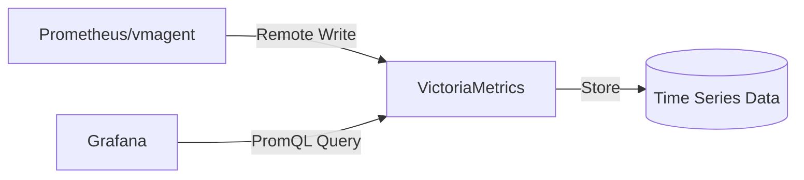
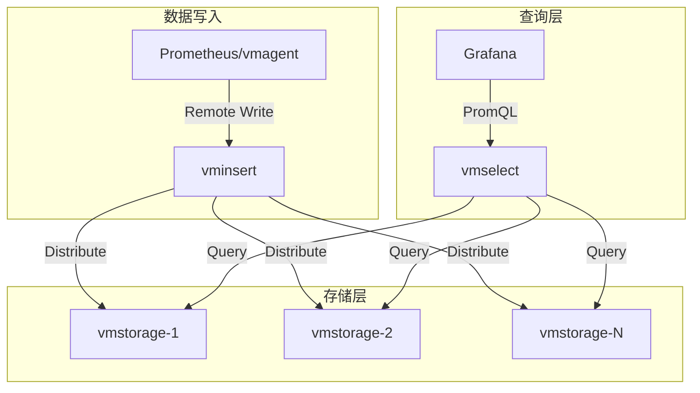
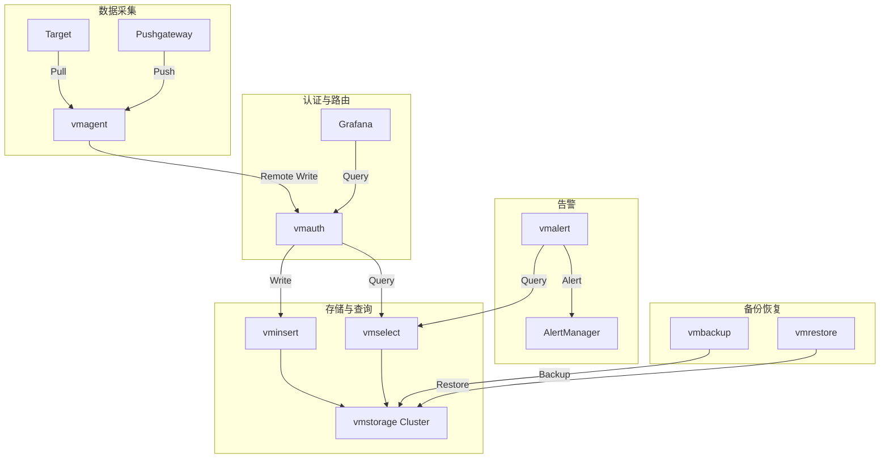
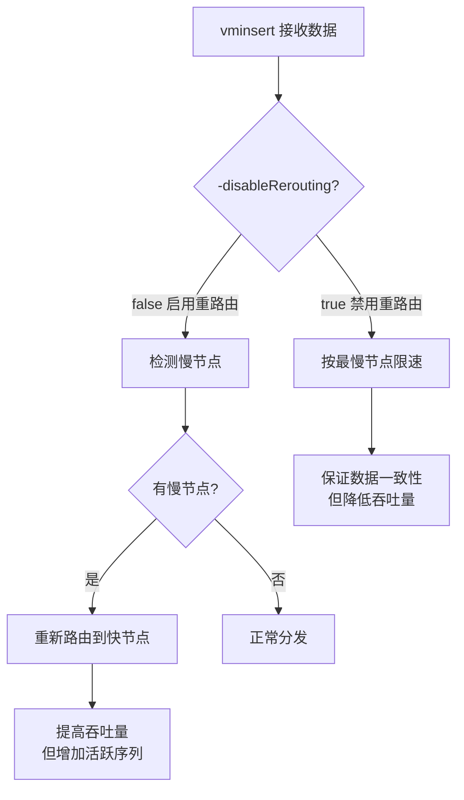
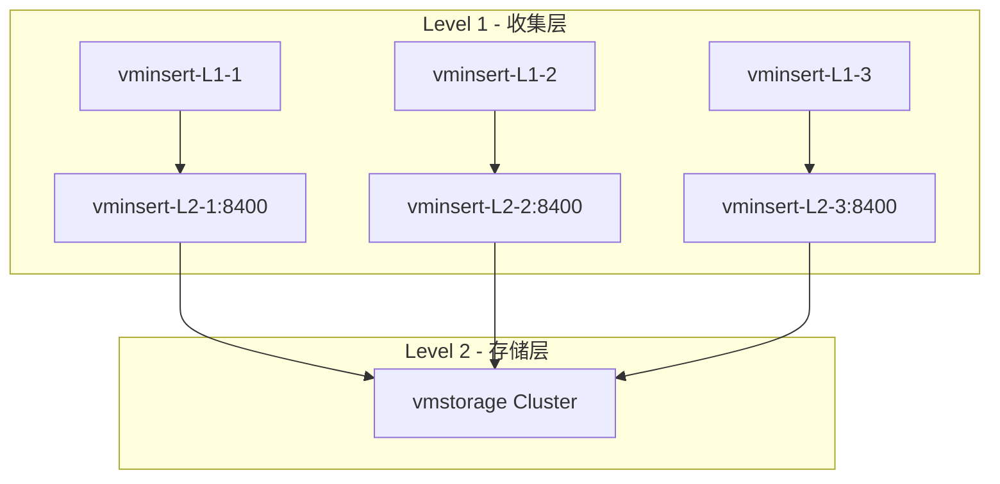
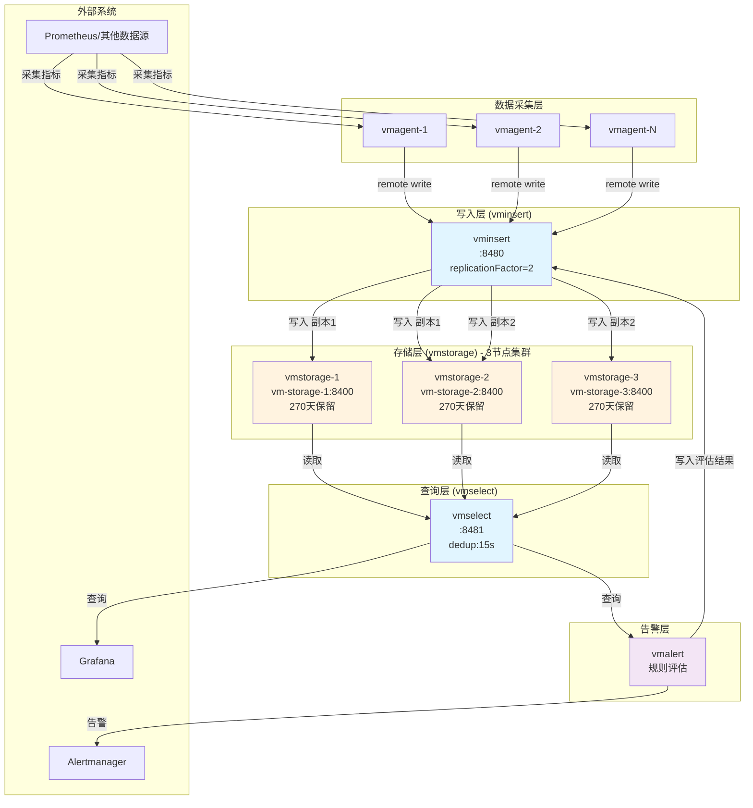

# VictoriaMetrics Flag 参数学习笔记

> **文档说明**
> 本文档整理了 VictoriaMetrics 生态系统中各组件的 Flag 参数详细说明，包括单节点版、集群版各组件、数据采集代理、告警、备份恢复等工具。适用于运维工程师、SRE 和开发人员查询参数配置和最佳实践。

---

## 📚 目录

### 前言

- [关于 VictoriaMetrics](#关于-victoriametrics)
- [文档使用指南](#文档使用指南)
- [组件架构概览](#组件架构概览)

### 核心组件 Flag 参数

#### 第1章 [VictoriaMetrics Flag 参数（单节点版）](#第1章-victoriametrics-flag-参数单节点版)

- 1.1 存储相关参数
- 1.2 查询相关参数
- 1.3 性能调优参数
- 1.4 监控与日志参数
- 1.5 其他配置参数

#### 第2章 [vminsert Flag 参数（集群版-写入组件）](#第2章-vminsert-flag-参数集群版-写入组件)

- 2.1 数据接收参数
- 2.2 负载均衡参数
- 2.3 重试与容错参数
- 2.4 性能优化参数
- 2.5 监控与日志参数

#### 第3章 [vmselect Flag 参数（集群版-查询组件）](#第3章-vmselect-flag-参数集群版-查询组件)

- 3.1 查询处理参数
- 3.2 缓存配置参数
- 3.3 去重相关参数
- 3.4 性能优化参数
- 3.5 监控与日志参数

#### 第4章 [vmstorage Flag 参数（集群版-存储组件）](#第4章-vmstorage-flag-参数集群版-存储组件)

- 4.1 存储路径参数
- 4.2 数据保留参数
- 4.3 合并与压缩参数
- 4.4 内存与缓存参数
- 4.5 性能调优参数
- 4.6 监控与日志参数

### 数据采集与代理

#### 第5章 [vmagent Flag 参数（数据采集代理）](#第5章-vmagent-flag-参数数据采集代理)

- 5.1 采集配置参数
- 5.2 Prometheus 兼容性参数
- 5.3 远程写入参数
- 5.4 数据转换与重标签参数
- 5.5 性能与资源参数
- 5.6 监控与日志参数

#### 第6章 [vmauth Flag 参数（认证代理）](#第6章-vmauth-flag-参数认证代理)

- 6.1 认证配置参数
- 6.2 路由规则参数
- 6.3 安全相关参数
- 6.4 性能参数
- 6.5 监控与日志参数

### 告警与备份

#### 第7章 [vmalert Flag 参数（告警组件）](#第7章-vmalert-flag-参数告警组件)

- 7.1 告警规则参数
- 7.2 数据源配置参数
- 7.3 通知配置参数
- 7.4 评估与执行参数
- 7.5 监控与日志参数

#### 第8章 [vmbackup Flag 参数（备份工具）](#第8章-vmbackup-flag-参数备份工具)

- 8.1 备份源配置参数
- 8.2 备份目标参数
- 8.3 快照相关参数
- 8.4 性能参数
- 8.5 其他配置参数

#### 第9章 [vmrestore Flag 参数（恢复工具）](#第9章-vmrestore-flag-参数恢复工具)

- 9.1 恢复源配置参数
- 9.2 恢复目标参数
- 9.3 恢复选项参数
- 9.4 性能参数
- 9.5 其他配置参数

### 实践指南

#### 第10章 [生产环境 Flag 配置实践](#第10章-生产环境-flag-配置实践)

- 10.1 架构设计与组件关系
- 10.2 各组件 Flag 配置详解
- 10.3 配置最佳实践
- 10.4 常见问题与调优建议

---

## 关于 VictoriaMetrics
### 核心特性


VictoriaMetrics 是一个快速、经济高效且可扩展的监控解决方案和时间序列数据库。它可以作为 Prometheus 的长期存储解决方案。


- **高性能**：查询速度快，资源占用少
- **高压缩比**：存储成本低
- **兼容 Prometheus**：支持 PromQL 和 Prometheus 远程写入协议
- **灵活部署**：支持单节点和集群模式

### 组件说明

| 组件                 | 类型     | 功能描述                            |
| -------------------- | -------- | ----------------------------------- |
| `victoria-metrics` | 单节点   | 单节点版本，包含完整功能            |
| `vminsert`         | 集群版   | 接收写入请求，分发数据到 vmstorage  |
| `vmselect`         | 集群版   | 处理查询请求，从 vmstorage 获取数据 |
| `vmstorage`        | 集群版   | 存储时序数据                        |
| `vmagent`          | 辅助工具 | 数据采集代理，类似 Prometheus       |
| `vmauth`           | 辅助工具 | 认证和路由代理                      |
| `vmalert`          | 辅助工具 | 告警规则评估和执行                  |
| `vmbackup`         | 辅助工具 | 数据备份工具                        |
| `vmrestore`        | 辅助工具 | 数据恢复工具                        |

---

## 文档使用指南

### 📖 如何使用本文档

1. **查找参数**：使用目录快速定位到对应组件章节
2. **理解分类**：每个组件的参数按功能分类组织
3. **参数格式**：每个参数包含以下信息：
   - **参数名称**：Flag 的完整名称
   - **类型**：参数值类型（字符串、整数、布尔等）
   - **默认值**：默认配置值
   - **说明**：参数的功能和使用场景
   - **示例**：实际使用示例

### 🏷️ 参数标记说明

为了帮助快速识别重要参数，本文档使用以下标记：

- 🔥 **常用参数**：生产环境中经常需要配置的参数
- ⚡ **性能调优**：与性能优化相关的参数
- 🔒 **安全相关**：涉及安全配置的参数
- ⚠️ **注意事项**：需要特别注意的参数

### 💡 最佳实践提示

每个章节末尾会包含该组件的配置最佳实践和常见问题解答。

---

## 组件架构概览

### 单节点架构



### 集群架构



### 完整生态架构



---

## 第1章 VictoriaMetrics Flag 参数（单节点版）
### 1.1 存储相关参数


> **组件说明**
> VictoriaMetrics 单节点版是一个完整的时序数据库解决方案，包含数据采集、存储、查询等全部功能。适用于中小规模监控场景。

---


#### 🔥 存储路径与基础配置

| 参数                         | 类型     | 默认值                    | 说明                                                                               |
| ---------------------------- | -------- | ------------------------- | ---------------------------------------------------------------------------------- |
| `-storageDataPath`         | string   | `victoria-metrics-data` | 🔥 存储数据的路径                                                                  |
| `-retentionPeriod`         | duration | `1` (月)                | 🔥 数据保留时间。最小值为 24h 或 1d。支持后缀：s(秒)、h(小时)、d(天)、w(周)、y(年) |
| `-retentionFilter`         | array    | -                         | ⚠️ 企业版功能。按标签过滤的保留策略，格式：`{env="dev"}:3d`                    |
| `-retentionTimezoneOffset` | duration | `0`                     | indexdb 轮转的时区偏移。0 表示在 UTC 时间 4am 执行，2h 表示在 EET 时间 4am（+2h）  |

**示例**：

```bash
# 设置数据保留30天
-retentionPeriod=30d

# 企业版：为不同环境设置不同保留期
-retentionFilter='{env="dev"}:3d' \
-retentionFilter='{env="prod"}:90d'
```

#### ⚡ 性能与资源控制

| 参数                               | 类型     | 默认值              | 说明                                                                  |
| ---------------------------------- | -------- | ------------------- | --------------------------------------------------------------------- |
| `-storage.minFreeDiskSpaceBytes` | size     | `10000000` (10MB) | 🔒 最小可用磁盘空间。低于此值时停止接收新数据                         |
| `-memory.allowedPercent`         | float    | `60`              | ⚡ 缓存可占用系统内存的百分比。过低增加 CPU/磁盘 IO，过高可能导致 OOM |
| `-memory.allowedBytes`           | size     | `0`               | ⚡ 缓存可占用内存的绝对大小。非零时覆盖 `-memory.allowedPercent`    |
| `-inmemoryDataFlushInterval`     | duration | `5s`              | 🔥 内存数据强制刷盘间隔。较大值延长闪存寿命，较小值增加磁盘 IO        |
| `-precisionBits`                 | int      | `64`              | 每个值存储的精度位数。降低可提高压缩率但损失精度                      |

**最佳实践**：

- 生产环境建议预留至少 10GB 磁盘空间（`-storage.minFreeDiskSpaceBytes=10GB`）
- Raspberry PI 等闪存设备建议增大 `-inmemoryDataFlushInterval` 到 30s-60s

#### 🔒 基数限制器（Cardinality Limiter）

| 参数                         | 类型 | 默认值 | 说明                                                   |
| ---------------------------- | ---- | ------ | ------------------------------------------------------ |
| `-storage.maxHourlySeries` | int  | -      | 每小时可新增的最大唯一时间序列数。超出部分被记录并丢弃 |
| `-storage.maxDailySeries`  | int  | -      | 每天可新增的最大唯一时间序列数。用于限制序列流失率     |
| `-maxIngestionRate`        | int  | -      | 每秒可接收的最大样本数。超出时暂停数据摄入             |

**示例**：

```bash
# 限制每小时新增10万个序列
-storage.maxHourlySeries=100000

# 限制每秒接收100万个样本
-maxIngestionRate=1000000
```

#### 缓存配置（Cache Tuning）

| 参数                                          | 类型     | 默认值    | 说明                                     |
| --------------------------------------------- | -------- | --------- | ---------------------------------------- |
| `-storage.cacheSizeIndexDBDataBlocks`       | size     | `0`     | indexdb/dataBlocks 缓存大小              |
| `-storage.cacheSizeIndexDBDataBlocksSparse` | size     | `0`     | indexdb/dataBlocksSparse 缓存大小        |
| `-storage.cacheSizeIndexDBIndexBlocks`      | size     | `0`     | indexdb/indexBlocks 缓存大小             |
| `-storage.cacheSizeIndexDBTagFilters`       | size     | `0`     | indexdb/tagFiltersToMetricIDs 缓存大小   |
| `-storage.cacheSizeStorageTSID`             | size     | `0`     | storage/tsid 缓存大小                    |
| `-storage.cacheSizeStorageMetricName`       | size     | `0`     | storage/metricName 缓存大小              |
| `-storage.cacheSizeMetricNamesStats`        | size     | `0`     | storage/metricNamesStatsTracker 缓存大小 |
| `-cacheExpireDuration`                      | duration | `30m0s` | 缓存项未被访问后的过期时间               |
| `-blockcache.missesBeforeCaching`           | int      | `2`     | 缓存 miss 多少次后才放入缓存             |

---

### 1.2 查询相关参数

#### 🔥 查询限制与性能

| 参数                              | 类型     | 默认值           | 说明                                               |
| --------------------------------- | -------- | ---------------- | -------------------------------------------------- |
| `-search.maxConcurrentRequests` | int      | `2*CPU`        | ⚡ 最大并发查询请求数                              |
| `-search.maxQueryDuration`      | duration | `30s`          | 🔥 查询执行的最大时长。可通过 `timeout` 参数覆盖 |
| `-search.maxMemoryPerQuery`     | size     | `0`            | ⚡ 单个查询可消耗的最大内存                        |
| `-search.maxQueueDuration`      | duration | `10s`          | 查询队列等待的最大时长                             |
| `-search.maxQueryLen`           | size     | `16384` (16KB) | 查询字符串的最大长度                               |

#### 时间序列与采样点限制

| 参数                               | 类型 | 默认值           | 说明                                                              |
| ---------------------------------- | ---- | ---------------- | ----------------------------------------------------------------- |
| `-search.maxResponseSeries`      | int  | `0` (无限制)   | `/api/v1/query` 和 `/api/v1/query_range` 返回的最大时间序列数 |
| `-search.maxPointsPerTimeseries` | int  | `30000`        | 🔥 单个时间序列返回的最大数据点数（用于限制图表分辨率）           |
| `-search.maxSamplesPerQuery`     | int  | `1000000000`   | 单个查询可处理的最大原始样本数（跨所有序列）                      |
| `-search.maxSamplesPerSeries`    | int  | `30000000`     | 单个查询在每个序列中可扫描的最大原始样本数                        |
| `-search.maxUniqueTimeseries`    | int  | `0` (自动计算) | 查询可选择的最大唯一时间序列数                                    |
| `-search.maxWorkers PerQuery`    | int  | 自动             | 单个查询可使用的最大 CPU 核心数                                   |

#### 查询缓存

| 参数                                              | 类型     | 默认值     | 说明                                               |
| ------------------------------------------------- | -------- | ---------- | -------------------------------------------------- |
| `-search.disableCache`                          | bool     | `false`  | 是否禁用响应缓存（回填历史数据时有用）             |
| `-search.resetRollupResultCacheOnStartup`       | bool     | `false`  | 启动时是否重置 rollup 结果缓存                     |
| `-search.cacheTimestampOffset`                  | duration | `5m0s`   | 距当前时间多久内的查询不使用缓存（避免数据不完整） |
| `-search.disableAutoCacheReset`                 | bool     | `false`  | 是否禁用自动缓存重置                               |
| `-search.minWindowForInstantRollupOptimization` | duration | `3h0m0s` | 即时查询的缓存优化最小窗口                         |

#### 查询行为配置

| 参数                             | 类型     | 默认值    | 说明                                                               |
| -------------------------------- | -------- | --------- | ------------------------------------------------------------------ |
| `-search.latencyOffset`        | duration | `30s`   | 数据采集后多久在查询结果中可见。可通过 `latency_offset` 参数覆盖 |
| `-search.maxLookback`          | duration | 自动检测  | Prometheus 的 `-query.lookback-delta` 同义词                     |
| `-search.maxStalenessInterval` | duration | 自动计算  | staleness 计算的最大间隔                                           |
| `-search.minStalenessInterval` | duration | -         | staleness 计算的最小间隔                                           |
| `-search.noStaleMarkers`       | bool     | `false` | 如果数据库不包含 Prometheus stale markers，设为 true 节省 CPU      |
| `-search.setLookbackToStep`    | bool     | `false` | 是否将 lookback 固定为 `step` 值（更接近 InfluxDB 模型）         |

#### API 限制

| 参数                             | 类型     | 默认值              | 说明                                                        |
| -------------------------------- | -------- | ------------------- | ----------------------------------------------------------- |
| `-search.maxSeries`            | int      | `30000`           | `/api/v1/series` 可返回的最大时间序列数                   |
| `-search.maxLabelsAPISeries`   | int      | `1000000`         | `/api/v1/labels` 可扫描的最大时间序列数                   |
| `-search.maxLabelsAPIDuration` | duration | `5s`              | `/api/v1/labels` 请求的最大执行时长                       |
| `-search.maxTagKeys`           | int      | `100000`          | `/api/v1/labels` 返回的最大标签键数                       |
| `-search.maxTagValues`         | int      | `100000`          | `/api/v1/label/<name>/values` 返回的最大标签值数          |
| `-search.maxExportSeries`      | int      | `10000000`        | `/api/v1/export` 可返回的最大时间序列数                   |
| `-search.maxExportDuration`    | duration | `720h0m0s` (30天) | `/api/v1/export` 的最大时长                               |
| `-search.maxFederateSeries`    | int      | `1000000`         | `/federate` 可返回的最大时间序列数                        |
| `-search.maxDeleteSeries`      | int      | `1000000`         | `/api/v1/admin/tsdb/delete_series` 可删除的最大时间序列数 |
| `-search.maxDeleteDuration`    | duration | `5m0s`            | 删除操作的最大执行时长                                      |

#### Graphite 查询

| 参数                                     | 类型     | 默认值      | 说明                                       |
| ---------------------------------------- | -------- | ----------- | ------------------------------------------ |
| `-search.maxGraphiteSeries`            | int      | `300000`  | Graphite Render API 可扫描的最大时间序列数 |
| `-search.maxGraphiteTagKeys`           | int      | `100000`  | Graphite Tags API 返回的最大标签键数       |
| `-search.maxGraphiteTagValues`         | int      | `100000`  | Graphite Tags API 返回的最大标签值数       |
| `-search.graphiteStorageStep`          | duration | `10s`     | Graphite Render API 的数据点间隔           |
| `-search.maxGraphitePointsPerSeries`   | int      | `1000000` | Graphite Render API 每个序列的最大数据点数 |
| `-search.maxGraphitePathExpressionLen` | int      | `1024`    | Graphite pathExpression 的最大长度         |

#### 查询跟踪与调试

| 参数                                    | 类型     | 默认值    | 说明                                        |
| --------------------------------------- | -------- | --------- | ------------------------------------------- |
| `-denyQueryTracing`                   | bool     | `false` | 是否禁用查询追踪功能                        |
| `-search.logSlowQueryDuration`        | duration | `5s`    | 记录慢查询的阈值                            |
| `-search.logQueryMemoryUsage`         | size     | `0`     | 记录高内存查询的阈值                        |
| `-search.logImplicitConversion`       | bool     | `false` | 是否记录隐式子查询转换                      |
| `-search.disableImplicitConversion`   | bool     | `false` | 是否禁用隐式子查询转换（返回错误）          |
| `-search.queryStats.lastQueriesCount` | int      | `20000` | `/api/v1/status/top_queries` 跟踪的查询数 |
| `-search.queryStats.minQueryDuration` | duration | `1ms`   | 查询统计的最小查询时长                      |

---

### 1.3 数据写入相关参数

#### 🔥 写入限制

| 参数                         | 类型     | 默认值              | 说明                                   |
| ---------------------------- | -------- | ------------------- | -------------------------------------- |
| `-maxConcurrentInserts`    | int      | `2*CPU`           | 🔥 最大并发写入请求数                  |
| `-insert.maxQueueDuration` | duration | `1m0s`            | 写入队列等待的最大时长                 |
| `-maxInsertRequestSize`    | size     | `33554432` (32MB) | Prometheus remote_write 请求的最大大小 |

#### 标签与度量限制

| 参数                        | 类型 | 默认值   | 说明                        |
| --------------------------- | ---- | -------- | --------------------------- |
| `-maxLabelsPerTimeseries` | int  | `40`   | 🔥 每个时间序列的最大标签数 |
| `-maxLabelNameLen`        | int  | `256`  | 标签名的最大长度            |
| `-maxLabelValueLen`       | int  | `4096` | 标签值的最大长度            |

#### 数据协议配置

**Prometheus Remote Write**

| 参数                         | 类型 | 默认值    | 说明                                 |
| ---------------------------- | ---- | --------- | ------------------------------------ |
| `-maxInsertRequestSize`    | size | `32MB`  | 单个请求的最大大小                   |
| `-usePromCompatibleNaming` | bool | `false` | 是否将不兼容字符替换为下划线         |
| `-sortLabels`              | bool | `false` | 是否对标签排序（减少内存但影响性能） |

**InfluxDB Line Protocol**

| 参数                                 | 类型     | 默认值             | 说明                                         |
| ------------------------------------ | -------- | ------------------ | -------------------------------------------- |
| `-influxListenAddr`                | string   | -                  | 🔥 InfluxDB TCP/UDP 监听地址（如 `:8089`） |
| `-influxDBLabel`                   | string   | `db`             | DB 名称的标签名                              |
| `-influxMeasurementFieldSeparator` | string   | `_`              | measurement 和 field 的分隔符                |
| `-influxSkipMeasurement`           | bool     | `false`          | 仅使用 field 名作为度量名                    |
| `-influxSkipSingleField`           | bool     | `false`          | 单 field 时使用 measurement 名               |
| `-influxTrimTimestamp`             | duration | `1ms`            | 时间戳修剪精度                               |
| `-influx.maxLineSize`              | size     | `262144` (256KB) | 流模式下单行最大大小                         |
| `-influx.maxRequestSize`           | size     | `64MB`           | 批量模式下请求最大大小                       |
| `-influx.forceStreamMode`          | bool     | `false`          | 强制使用流模式解析                           |

**Graphite**

| 参数                             | 类型     | 默认值    | 说明                                      |
| -------------------------------- | -------- | --------- | ----------------------------------------- |
| `-graphiteListenAddr`          | string   | -         | Graphite TCP/UDP 监听地址（如 `:2003`） |
| `-graphite.sanitizeMetricName` | bool     | `false` | 是否清理度量名称                          |
| `-graphiteTrimTimestamp`       | duration | `1s`    | 时间戳修剪精度                            |

**OpenTSDB**

| 参数                                   | 类型     | 默认值   | 说明                                      |
| -------------------------------------- | -------- | -------- | ----------------------------------------- |
| `-opentsdbListenAddr`                | string   | -        | OpenTSDB TCP/UDP 监听地址（如 `:4242`） |
| `-opentsdbHTTPListenAddr`            | string   | -        | OpenTSDB HTTP 监听地址                    |
| `-opentsdbTrimTimestamp`             | duration | `1s`   | Telnet put 时间戳修剪精度                 |
| `-opentsdbhttpTrimTimestamp`         | duration | `1ms`  | HTTP 时间戳修剪精度                       |
| `-opentsdbhttp.maxInsertRequestSize` | size     | `32MB` | HTTP put 请求最大大小                     |

**DataDog**

| 参数                              | 类型 | 默认值   | 说明                                    |
| --------------------------------- | ---- | -------- | --------------------------------------- |
| `-datadog.maxInsertRequestSize` | size | `64MB` | DataDog `/api/v2/series` 请求最大大小 |
| `-datadog.sanitizeMetricName`   | bool | `true` | 是否清理度量名称                        |

**NewRelic**

| 参数                               | 类型 | 默认值   | 说明                  |
| ---------------------------------- | ---- | -------- | --------------------- |
| `-newrelic.maxInsertRequestSize` | size | `64MB` | NewRelic 请求最大大小 |

**OpenTelemetry**

| 参数                                              | 类型 | 默认值    | 说明                           |
| ------------------------------------------------- | ---- | --------- | ------------------------------ |
| `-opentelemetry.maxRequestSize`                 | size | `64MB`  | OpenTelemetry 请求最大大小     |
| `-opentelemetry.usePrometheusNaming`            | bool | `false` | 是否转换为 Prometheus 兼容格式 |
| `-opentelemetry.convertMetricNamesToPrometheus` | bool | `false` | 仅转换度量名称                 |

**CSV Import**

| 参数                   | 类型     | 默认值   | 说明                            |
| ---------------------- | -------- | -------- | ------------------------------- |
| `-csvTrimTimestamp`  | duration | `1ms`  | CSV 数据时间戳修剪精度          |
| `-import.maxLineLen` | size     | `10MB` | `/api/v1/import` 单行最大长度 |

#### 数据处理

| 参数                            | 类型     | 默认值    | 说明                                     |
| ------------------------------- | -------- | --------- | ---------------------------------------- |
| `-dedup.minScrapeInterval`    | duration | -         | 去重间隔。每个间隔内仅保留最后一个样本   |
| `-relabelConfig`              | string   | -         | relabeling 规则文件路径（支持 http URL） |
| `-streamAggr.config`          | string   | -         | 流聚合配置文件路径                       |
| `-streamAggr.dedupInterval`   | duration | -         | 聚合前的去重间隔                         |
| `-streamAggr.dropInput`       | bool     | `false` | 是否丢弃不匹配规则的输入样本             |
| `-streamAggr.keepInput`       | bool     | `false` | 是否保留匹配规则的输入样本               |
| `-streamAggr.dropInputLabels` | array    | -         | 聚合前要丢弃的标签列表                   |

---

### 1.4 监控与日志参数

#### 🔥 HTTP 服务配置

| 参数                                  | 类型     | 默认值    | 说明                               |
| ------------------------------------- | -------- | --------- | ---------------------------------- |
| `-httpListenAddr`                   | array    | -         | 🔥 HTTP 监听地址（如 `:8428`）   |
| `-http.pathPrefix`                  | string   | -         | HTTP 路径前缀（如 `/foo/bar`）   |
| `-http.connTimeout`                 | duration | `2m0s`  | HTTP 连接超时时间                  |
| `-http.idleConnTimeout`             | duration | `1m0s`  | HTTP 空闲连接超时                  |
| `-http.maxGracefulShutdownDuration` | duration | `7s`    | HTTP 服务优雅关闭最大时长          |
| `-http.shutdownDelay`               | duration | -         | 关闭前延迟（让负载均衡器切换流量） |
| `-http.disableKeepAlive`            | bool     | `false` | 是否禁用 HTTP keep-alive           |
| `-http.disableResponseCompression`  | bool     | `false` | 是否禁用 HTTP 响应压缩             |
| `-http.disableCORS`                 | bool     | `false` | 是否禁用 CORS                      |

#### 安全与认证

| 参数                   | 类型   | 默认值    | 说明                                         |
| ---------------------- | ------ | --------- | -------------------------------------------- |
| `-httpAuth.username` | string | -         | 🔒 HTTP Basic Auth 用户名                    |
| `-httpAuth.password` | value  | -         | 🔒 HTTP Basic Auth 密码（可从文件/URL 读取） |
| `-tls`               | array  | -         | 🔒 是否启用 HTTPS                            |
| `-tlsCertFile`       | array  | -         | 🔒 TLS 证书文件路径                          |
| `-tlsKeyFile`        | array  | -         | 🔒 TLS 密钥文件路径                          |
| `-tlsMinVersion`     | array  | -         | 最小 TLS 版本（TLS10/TLS11/TLS12/TLS13）     |
| `-tlsCipherSuites`   | array  | -         | TLS 密码套件列表                             |
| `-mtls`              | array  | -         | ⚠️ 企业版。是否要求客户端证书              |
| `-mtlsCAFile`        | array  | -         | ⚠️ 企业版。TLS Root CA 路径                |
| `-enableTCP6`        | bool   | `false` | 是否启用 IPv6                                |

**端点认证 Keys**（覆盖 `-httpAuth.*`）

| 参数                          | 说明                                          |
| ----------------------------- | --------------------------------------------- |
| `-metricsAuthKey`           | `/metrics` 端点认证 key                     |
| `-flagsAuthKey`             | `/flags` 端点认证 key                       |
| `-pprofAuthKey`             | `/debug/pprof/*` 端点认证 key               |
| `-deleteAuthKey`            | `/api/v1/admin/tsdb/delete_series` 认证 key |
| `-snapshotAuthKey`          | `/snapshot*` 端点认证 key                   |
| `-forceMergeAuthKey`        | `/internal/force_merge` 认证 key            |
| `-forceFlushAuthKey`        | `/internal/force_flush` 认证 key            |
| `-configAuthKey`            | `/config` 端点认证 key                      |
| `-reloadAuthKey`            | `/-/reload` 端点认证 key                    |
| `-search.resetCacheAuthKey` | `/internal/resetRollupResultCache` 认证 key |

#### 日志配置

| 参数                            | 类型   | 默认值      | 说明                                                   |
| ------------------------------- | ------ | ----------- | ------------------------------------------------------ |
| `-loggerLevel`                | string | `INFO`    | 🔥 日志级别：INFO/WARN/ERROR/FATAL/PANIC               |
| `-loggerFormat`               | string | `default` | 日志格式：default/json                                 |
| `-loggerOutput`               | string | `stderr`  | 日志输出：stderr/stdout                                |
| `-loggerTimezone`             | string | `UTC`     | 日志时区（IANA 格式）                                  |
| `-loggerDisableTimestamps`    | bool   | `false`   | 是否禁用日志时间戳                                     |
| `-loggerJSONFields`           | string | -           | JSON 日志字段重命名（如 `ts:timestamp,msg:message`） |
| `-loggerMaxArgLen`            | int    | `5000`    | 单个日志参数的最大长度                                 |
| `-loggerErrorsPerSecondLimit` | int    | `0`       | ERROR 日志每秒限制                                     |
| `-loggerWarnsPerSecondLimit`  | int    | `0`       | WARN 日志每秒限制                                      |
| `-logNewSeries`               | bool   | `false`   | ⚠️ 调试用。是否记录新序列（可能影响性能）            |

#### Metrics 推送

| 参数                                | 类型     | 默认值    | 说明                                         |
| ----------------------------------- | -------- | --------- | -------------------------------------------- |
| `-pushmetrics.url`                | array    | -         | Metrics 推送目标 URL                         |
| `-pushmetrics.interval`           | duration | `10s`   | Metrics 推送间隔                             |
| `-pushmetrics.extraLabel`         | array    | -         | 推送时添加的额外标签                         |
| `-pushmetrics.header`             | array    | -         | 推送时添加的 HTTP 头                         |
| `-pushmetrics.disableCompression` | bool     | `false` | 是否禁用推送时的压缩                         |
| `-metrics.exposeMetadata`         | bool     | `false` | 是否在 `/metrics` 暴露 TYPE 和 HELP 元数据 |

#### 自监控

| 参数                    | 类型     | 默认值               | 说明                       |
| ----------------------- | -------- | -------------------- | -------------------------- |
| `-selfScrapeInterval` | duration | -                    | 自抓取 `/metrics` 的间隔 |
| `-selfScrapeJob`      | string   | `victoria-metrics` | 自抓取的 job 标签值        |
| `-selfScrapeInstance` | string   | `self`             | 自抓取的 instance 标签值   |

---

### 1.5 数据采集相关参数（Promscrape）

> **说明**：VictoriaMetrics 单节点版内置了类似 vmagent 的采集功能

#### 🔥 采集配置

| 参数                                | 类型     | 默认值    | 说明                                                  |
| ----------------------------------- | -------- | --------- | ----------------------------------------------------- |
| `-promscrape.config`              | string   | -         | 🔥 Prometheus 配置文件路径（包含 `scrape_configs`） |
| `-promscrape.config.dryRun`       | bool     | `false` | 检查配置文件后退出                                    |
| `-promscrape.config.strictParse`  | bool     | `true`  | 是否拒绝不支持的配置字段                              |
| `-promscrape.configCheckInterval` | duration | -         | 配置文件变更检查间隔（默认禁用）                      |

#### 采集行为

| 参数                                          | 类型 | 默认值    | 说明                           |
| --------------------------------------------- | ---- | --------- | ------------------------------ |
| `-promscrape.maxScrapeSize`                 | size | `16MB`  | 单个 target 响应的最大大小     |
| `-promscrape.maxResponseHeadersSize`        | size | `4KB`   | 响应头的最大大小               |
| `-promscrape.minResponseSizeForStreamParse` | size | `1MB`   | 自动切换到流解析的最小响应大小 |
| `-promscrape.streamParse`                   | bool | `false` | 是否启用流解析（减少内存）     |
| `-promscrape.disableCompression`            | bool | `false` | 是否禁用 gzip 压缩             |
| `-promscrape.disableKeepAlive`              | bool | `false` | 是否禁用 HTTP keep-alive       |
| `-promscrape.noStaleMarkers`                | bool | `false` | 是否禁用 stale markers         |

#### 服务发现检查间隔

| 服务发现类型 | 参数                                      | 默认值   |
| ------------ | ----------------------------------------- | -------- |
| Kubernetes   | `-promscrape.kubernetesSDCheckInterval` | `30s`  |
| Consul       | `-promscrape.consulSDCheckInterval`     | `30s`  |
| EC2          | `-promscrape.ec2SDCheckInterval`        | `1m0s` |
| Azure        | `-promscrape.azureSDCheckInterval`      | `1m0s` |
| GCE          | `-promscrape.gceSDCheckInterval`        | `1m0s` |
| DNS          | `-promscrape.dnsSDCheckInterval`        | `30s`  |
| Docker       | `-promscrape.dockerSDCheckInterval`     | `30s`  |
| File         | `-promscrape.fileSDCheckInterval`       | `1m0s` |
| HTTP         | `-promscrape.httpSDCheckInterval`       | `1m0s` |

#### 集群抓取

| 参数                                      | 类型   | 默认值 | 说明                       |
| ----------------------------------------- | ------ | ------ | -------------------------- |
| `-promscrape.cluster.membersCount`      | int    | `1`  | 集群中的抓取器数量         |
| `-promscrape.cluster.memberNum`         | string | `0`  | 当前抓取器编号（0 到 N-1） |
| `-promscrape.cluster.memberLabel`       | string | -      | 添加到所有抓取指标的标签名 |
| `-promscrape.cluster.name`              | string | -      | 集群名称（用于去重）       |
| `-promscrape.cluster.replicationFactor` | int    | `1`  | 复制因子                   |

---

### 1.6 downsampling（企业版功能）

| 参数                     | 类型  | 默认值 | 说明                                                                       |
| ------------------------ | ----- | ------ | -------------------------------------------------------------------------- |
| `-downsampling.period` | array | -      | ⚠️ 企业版。降采样周期，格式：`30d:10m`（30天外的数据每10分钟一个样本） |

**示例**：

```bash
# 30天外的数据降采样到10分钟，90天外降采样到1小时
-downsampling.period='30d:10m' \
-downsampling.period='90d:1h'
```

---

### 1.7 企业版与许可

| 参数                            | 类型     | 默认值     | 说明                    |
| ------------------------------- | -------- | ---------- | ----------------------- |
| `-license`                    | string   | -          | ⚠️ 企业版许可 key     |
| `-licenseFile`                | string   | -          | ⚠️ 企业版许可文件路径 |
| `-license.forceOffline`       | bool     | `false`  | ⚠️ 启用离线许可验证   |
| `-licenseFile.reloadInterval` | duration | `1h0m0s` | ⚠️ 许可文件重载间隔   |

---

### 1.8 其他配置参数

#### 环境变量

| 参数                | 类型   | 默认值    | 说明                        |
| ------------------- | ------ | --------- | --------------------------- |
| `-envflag.enable` | bool   | `false` | 是否允许从环境变量读取 flag |
| `-envflag.prefix` | string | -         | 环境变量前缀                |

#### 文件系统

| 参数                           | 类型 | 默认值    | 说明                         |
| ------------------------------ | ---- | --------- | ---------------------------- |
| `-fs.disableMmap`            | bool | 自动      | 是否使用 pread() 而非 mmap() |
| `-fs.maxConcurrency`         | int  | 自动      | 文件操作的最大并发数         |
| `-filestream.disableFadvise` | bool | `false` | 是否禁用 fadvise() 系统调用  |

#### Metadata

| 参数                                | 类型 | 默认值         | 说明                    |
| ----------------------------------- | ---- | -------------- | ----------------------- |
| `-enableMetadata`                 | bool | `false`      | 是否启用 metadata 处理  |
| `-storage.maxMetadataStorageSize` | size | `0` (1%内存) | Metadata 存储的最大大小 |

#### 其他

| 参数                             | 类型     | 默认值    | 说明                                            |
| -------------------------------- | -------- | --------- | ----------------------------------------------- |
| `-version`                     | bool     | -         | 显示版本信息                                    |
| `-dryRun`                      | bool     | `false` | 仅检查配置文件不运行                            |
| `-denyQueriesOutsideRetention` | bool     | `false` | 是否拒绝超出保留期的查询                        |
| `-disablePerDayIndex`          | bool     | `false` | 禁用每日索引，使用全局索引                      |
| `-snapshotsMaxAge`             | duration | `3d`    | 快照自动删除的最大年龄                          |
| `-vmalert.proxyURL`            | string   | -         | vmalert 代理 URL（用于 Grafana 告警 API）       |
| `-vmui.customDashboardsPath`   | string   | -         | VMUI 自定义仪表盘路径                           |
| `-vmui.defaultTimezone`        | string   | -         | VMUI 默认时区                                   |
| `-secret.flags`                | array    | -         | 隐藏值的 flag 名称列表（日志和 metrics 中隐藏） |

---

### 1.9 最佳实践建议

#### ⚡ 性能调优

1. **内存配置**

   ```bash
   # 推荐：根据实际内存调整，默认60%通常合适
   -memory.allowedPercent=60

   # 高内存服务器可提高到70%
   -memory.allowedPercent=70
   ```

2. **并发控制**

   ```bash
   # CPU核心数较少（<8）时降低并发
   -search.maxConcurrentRequests=4
   -maxConcurrentInserts=4

   # 高负载场景增加队列等待时间
   -search.maxQueueDuration=30s
   -insert.maxQueueDuration=2m
   ```

3. **缓存优化**

   ```bash
   # 高查询负载：增加缓存
   -storage.cacheSizeIndexDBIndexBlocks=2GB
   -storage.cacheSizeIndexDBDataBlocks=4GB

   # 高写入负载：减少缓存，预留内存给写入
   -memory.allowedPercent=50
   ```

#### 🔒 安全配置

```bash
# 基础认证
-httpAuth.username=admin
-httpAuth.password=file:///path/to/password.txt

# HTTPS
-tls=true
-tlsCertFile=/path/to/cert.pem
-tlsKeyFile=/path/to/key.pem
-tlsMinVersion=TLS12

# 端点保护
-deleteAuthKey=file:///path/to/delete.key
-snapshotAuthKey=file:///path/to/snapshot.key
```

#### 📊 生产环境推荐配置

```bash
# 存储
-storageDataPath=/data/victoria-metrics
-retentionPeriod=90d
-storage.minFreeDiskSpaceBytes=20GB

# 资源限制
-memory.allowedPercent=60
-search.maxConcurrentRequests=8
-maxConcurrentInserts=8
-storage.maxHourlySeries=500000

# 日志
-loggerLevel=INFO
-loggerFormat=json
-loggerTimezone=Asia/Shanghai

# HTTP
-httpListenAddr=:8428
-http.maxGracefulShutdownDuration=30s

# 监控
-selfScrapeInterval=10s
-pushmetrics.url=http://remote-vm:8428/api/v1/write

# 查询优化
-search.maxQueryDuration=60s
-search.logSlowQueryDuration=10s
```

---

### 1.10 常见问题

**Q: 如何选择合适的 retentionPeriod？**

- 默认 1 个月适合测试环境
- 生产环境建议 30-90 天
- 长期存储考虑使用 vmbackup 定期备份到对象存储

**Q: 内存占用过高怎么办？**

1. 降低 `-memory.allowedPercent` 到 50%
2. 增大 `-cacheExpireDuration` 到 1h
3. 启用 `-promscrape.streamParse`
4. 检查是否有高基数标签

**Q: 查询性能慢？**

1. 增加 `-search.maxConcurrentRequests`
2. 调整缓存大小
3. 检查 `-search.logSlowQueryDuration` 日志
4. 考虑使用 vmstorage 集群版

**Q: 如何限制数据写入速率？**

```bash
-maxIngestionRate=1000000  # 每秒100万样本
-storage.maxHourlySeries=100000  # 每小时新增10万序列
```

---

## 第2章 vminsert Flag 参数（集群版-写入组件）
### 2.1 集群配置参数


> **组件说明**
> vminsert 是 VictoriaMetrics 集群版的写入组件，负责接收来自多种数据源的监控数据，并将其路由分发到 vmstorage 节点。支持多种数据协议（Prometheus、InfluxDB、Graphite、OpenTSDB 等），具备负载均衡、高可用和数据复制功能。

---


#### 🔥 vmstorage 节点配置

| 参数                      | 类型     | 默认值 | 说明                                                                                                        |
| ------------------------- | -------- | ------ | ----------------------------------------------------------------------------------------------------------- |
| `-storageNode`          | array    | -      | 🔥**核心参数**。vmstorage 节点地址列表。格式：`-storageNode=host1:8400,host2:8400` 或多次指定该参数 |
| `-vmstorageDialTimeout` | duration | `3s` | 建立到 vmstorage 的 RPC 连接超时时间                                                                        |
| `-vmstorageUserTimeout` | duration | `3s` | ⚡ RPC 连接的网络超时（仅 Linux）。较低值加快故障节点的重路由恢复                                           |
| `-rpc.handshakeTimeout` | duration | `5s` | RPC 握手超时时间。如果出现瞬态握手失败，增大此值                                                            |

**企业版：自动发现 vmstorage**

| 参数                               | 类型     | 默认值 | 说明                                                                  |
| ---------------------------------- | -------- | ------ | --------------------------------------------------------------------- |
| `-storageNode` (DNS SRV)         | string   | -      | ⚠️ 企业版。通过 DNS SRV 记录自动发现，格式：`srv+vmstorage.addrs` |
| `-storageNode.discoveryInterval` | duration | `2s` | ⚠️ 企业版。刷新 DNS SRV 记录的间隔（最小1s）                        |
| `-storageNode.filter`            | string   | -      | ⚠️ 企业版。过滤发现地址的正则表达式                                 |

**示例**：

```bash
# 手动指定 vmstorage 节点
-storageNode=vmstorage-1:8400 \
-storageNode=vmstorage-2:8400 \
-storageNode=vmstorage-3:8400

# 企业版：DNS SRV 自动发现
-storageNode=srv+vmstorage.service.consul
-storageNode.discoveryInterval=10s
```

#### 🔒 集群 TLS/mTLS（企业版）

| 参数                               | 类型   | 默认值    | 说明                                              |
| ---------------------------------- | ------ | --------- | ------------------------------------------------- |
| `-cluster.tls`                   | bool   | `false` | ⚠️ 企业版。是否对 `-storageNode` 连接使用 TLS |
| `-cluster.tlsCertFile`           | string | -         | ⚠️ 企业版。客户端 TLS 证书文件路径              |
| `-cluster.tlsKeyFile`            | string | -         | ⚠️ 企业版。客户端 TLS 密钥文件路径              |
| `-cluster.tlsCAFile`             | string | -         | ⚠️ 企业版。TLS CA 文件路径（默认使用系统 CA）   |
| `-cluster.tlsInsecureSkipVerify` | bool   | `false` | ⚠️ 企业版。是否跳过 TLS 证书验证（不安全！）    |

---

### 2.2 数据接收与协议配置

#### 🔥 HTTP 服务配置

| 参数                                  | 类型     | 默认值    | 说明                             |
| ------------------------------------- | -------- | --------- | -------------------------------- |
| `-httpListenAddr`                   | array    | -         | 🔥 HTTP 监听地址（如 `:8480`） |
| `-http.pathPrefix`                  | string   | -         | HTTP 路径前缀                    |
| `-http.connTimeout`                 | duration | `2m0s`  | HTTP 连接超时                    |
| `-http.idleConnTimeout`             | duration | `1m0s`  | HTTP 空闲连接超时                |
| `-http.maxGracefulShutdownDuration` | duration | `7s`    | HTTP 优雅关闭最大时长            |
| `-http.shutdownDelay`               | duration | -         | 关闭前延迟                       |
| `-http.disableKeepAlive`            | bool     | `false` | 是否禁用 HTTP keep-alive         |
| `-http.disableResponseCompression`  | bool     | `false` | 是否禁用 HTTP 响应压缩           |
| `-http.disableCORS`                 | bool     | `false` | 是否禁用 CORS                    |

#### 认证与安全

| 参数                   | 类型   | 默认值 | 说明                            |
| ---------------------- | ------ | ------ | ------------------------------- |
| `-httpAuth.username` | string | -      | 🔒 HTTP Basic Auth 用户名       |
| `-httpAuth.password` | value  | -      | 🔒 HTTP Basic Auth 密码         |
| `-tls`               | array  | -      | 🔒 是否启用 HTTPS               |
| `-tlsCertFile`       | array  | -      | 🔒 TLS 证书文件路径             |
| `-tlsKeyFile`        | array  | -      | 🔒 TLS 密钥文件路径             |
| `-tlsMinVersion`     | array  | -      | 最小 TLS 版本                   |
| `-mtls`              | array  | -      | ⚠️ 企业版。是否要求客户端证书 |
| `-metricsAuthKey`    | value  | -      | `/metrics` 端点认证 key       |
| `-flagsAuthKey`      | value  | -      | `/flags` 端点认证 key         |
| `-pprofAuthKey`      | value  | -      | `/debug/pprof/*` 端点认证 key |

#### 数据写入限制

| 参数                         | 类型     | 默认值    | 说明                                   |
| ---------------------------- | -------- | --------- | -------------------------------------- |
| `-maxConcurrentInserts`    | int      | `2*CPU` | 🔥 最大并发写入请求数                  |
| `-insert.maxQueueDuration` | duration | `1m0s`  | 写入队列等待的最大时长                 |
| `-maxInsertRequestSize`    | size     | `32MB`  | Prometheus remote_write 请求的最大大小 |
| `-maxLabelsPerTimeseries`  | int      | `40`    | 每个时间序列的最大标签数               |
| `-maxLabelNameLen`         | int      | `256`   | 标签名的最大长度                       |
| `-maxLabelValueLen`        | int      | `4096`  | 标签值的最大长度                       |

#### 多协议支持

**Prometheus Remote Write**

| 参数                         | 类型 | 默认值    | 说明                       |
| ---------------------------- | ---- | --------- | -------------------------- |
| `-maxInsertRequestSize`    | size | `32MB`  | 请求最大大小               |
| `-usePromCompatibleNaming` | bool | `false` | 是否替换不兼容字符为下划线 |
| `-sortLabels`              | bool | `false` | 是否对标签排序             |

**InfluxDB Line Protocol**

| 参数                                 | 类型     | 默认值    | 说明                                         |
| ------------------------------------ | -------- | --------- | -------------------------------------------- |
| `-influxListenAddr`                | string   | -         | 🔥 InfluxDB TCP/UDP 监听地址（如 `:8089`） |
| `-influxDBLabel`                   | string   | `db`    | DB 名称的标签名                              |
| `-influxMeasurementFieldSeparator` | string   | `_`     | measurement 和 field 的分隔符                |
| `-influxSkipMeasurement`           | bool     | `false` | 仅使用 field 名                              |
| `-influxSkipSingleField`           | bool     | `false` | 单 field 时使用 measurement 名               |
| `-influxTrimTimestamp`             | duration | `1ms`   | 时间戳修剪精度                               |
| `-influx.maxLineSize`              | size     | `256KB` | 流模式下单行最大大小                         |
| `-influx.maxRequestSize`           | size     | `64MB`  | 批量模式下请求最大大小                       |
| `-influx.forceStreamMode`          | bool     | `false` | 强制使用流模式                               |
| `-influx.databaseNames`            | array    | -         | 返回的数据库名称列表                         |

**Graphite**

| 参数                             | 类型     | 默认值    | 说明                                      |
| -------------------------------- | -------- | --------- | ----------------------------------------- |
| `-graphiteListenAddr`          | string   | -         | Graphite TCP/UDP 监听地址（如 `:2003`） |
| `-graphite.sanitizeMetricName` | bool     | `false` | 是否清理度量名称                          |
| `-graphiteTrimTimestamp`       | duration | `1s`    | 时间戳修剪精度                            |

**OpenTSDB**

| 参数                                   | 类型     | 默认值   | 说明                      |
| -------------------------------------- | -------- | -------- | ------------------------- |
| `-opentsdbListenAddr`                | string   | -        | OpenTSDB TCP/UDP 监听地址 |
| `-opentsdbHTTPListenAddr`            | string   | -        | OpenTSDB HTTP 监听地址    |
| `-opentsdbTrimTimestamp`             | duration | `1s`   | Telnet put 时间戳修剪精度 |
| `-opentsdbhttpTrimTimestamp`         | duration | `1ms`  | HTTP 时间戳修剪精度       |
| `-opentsdbhttp.maxInsertRequestSize` | size     | `32MB` | HTTP put 请求最大大小     |

**DataDog**

| 参数                              | 类型 | 默认值   | 说明                 |
| --------------------------------- | ---- | -------- | -------------------- |
| `-datadog.maxInsertRequestSize` | size | `64MB` | DataDog 请求最大大小 |
| `-datadog.sanitizeMetricName`   | bool | `true` | 是否清理度量名称     |

**NewRelic**

| 参数                               | 类型 | 默认值   | 说明                  |
| ---------------------------------- | ---- | -------- | --------------------- |
| `-newrelic.maxInsertRequestSize` | size | `64MB` | NewRelic 请求最大大小 |

**OpenTelemetry**

| 参数                                              | 类型 | 默认值    | 说明                           |
| ------------------------------------------------- | ---- | --------- | ------------------------------ |
| `-opentelemetry.maxRequestSize`                 | size | `64MB`  | OpenTelemetry 请求最大大小     |
| `-opentelemetry.usePrometheusNaming`            | bool | `false` | 是否转换为 Prometheus 兼容格式 |
| `-opentelemetry.convertMetricNamesToPrometheus` | bool | `false` | 仅转换度量名称                 |

**CSV Import**

| 参数                   | 类型     | 默认值   | 说明                            |
| ---------------------- | -------- | -------- | ------------------------------- |
| `-csvTrimTimestamp`  | duration | `1ms`  | CSV 时间戳修剪精度              |
| `-import.maxLineLen` | size     | `10MB` | `/api/v1/import` 单行最大长度 |

---

### 2.3 负载均衡与重路由参数

#### 🔥 重路由策略

| 参数                               | 类型 | 默认值    | 说明                                                                                                                                                       |
| ---------------------------------- | ---- | --------- | ---------------------------------------------------------------------------------------------------------------------------------------------------------- |
| `-disableRerouting`              | bool | `true`  | ⚡**重要！** 是否禁用重路由。`true`时，当某些 vmstorage 节点速度较慢时不会重新路由，限制摄入速率以最慢节点为准，但最小化滚动重启时的活跃时间序列数 |
| `-disableReroutingOnUnavailable` | bool | `false` | 是否在 vmstorage 节点不可用时禁用重路由。`true`时，节点不可用会停止摄入，但最小化活跃序列数                                                              |
| `-dropSamplesOnOverload`         | bool | `false` | ⚠️**谨慎使用！** 当 vmstorage 节点过载或不可用时是否丢弃样本。优先保证可用性而非一致性。不建议与 `-replicationFactor` 一起使用                   |

**重路由策略说明**：



**最佳实践**：

- **默认配置**（`-disableRerouting=true`）：适合大多数场景，滚动重启时更稳定
- **高吞吐场景**：设置 `-disableRerouting=false`，允许重路由以最大化吞吐量
- **高可用场景**：考虑 `-dropSamplesOnOverload=true`，但需接受部分数据丢失

---

### 2.4 数据复制参数

| 参数                   | 类型 | 默认值 | 说明                                                                                                                                        |
| ---------------------- | ---- | ------ | ------------------------------------------------------------------------------------------------------------------------------------------- |
| `-replicationFactor` | int  | `1`  | 🔥**数据复制因子**。数据在多少个不同的 vmstorage 节点上保存副本。大于1时，vmselect 必须使用 `-dedup.minScrapeInterval=1ms` 进行去重 |

**示例**：

```bash
# vminsert 设置复制因子为2（每个数据点存储2份）
-replicationFactor=2

# 对应的 vmselect 配置（需要去重）
# vmselect -dedup.minScrapeInterval=1ms
```

**注意事项**：

- 复制因子 > 1 时增强数据可靠性，但会增加存储空间消耗
- 必须配合 vmselect 去重使用
- 不建议与 `-dropSamplesOnOverload=true` 一起使用

---

### 2.5 多级集群配置

> **说明**：多级集群允许 vminsert 实例互相转发数据，实现更大规模的部署

| 参数                                             | 类型     | 默认值  | 说明                                                                          |
| ------------------------------------------------ | -------- | ------- | ----------------------------------------------------------------------------- |
| `-clusternativeListenAddr`                     | string   | -       | 从其他 vminsert 节点接收数据的 TCP 监听地址（如 `:8400`）。用于多级集群设置 |
| `-clusternative.vminsertConnsShutdownDuration` | duration | `25s` | 优雅关闭上游 vminsert 连接的时长。较大值减少滚动重启时的 CPU/RAM/磁盘 IO 峰值 |

**多级集群架构示例**：



**配置示例**：

```bash
# Level 2 vminsert（接收来自 Level 1 的数据）
-clusternativeListenAddr=:8400
-storageNode=vmstorage-1:8400,vmstorage-2:8400,vmstorage-3:8400

# Level 1 vminsert（转发数据到 Level 2）
-storageNode=vminsert-L2-1:8400,vminsert-L2-2:8400,vminsert-L2-3:8400
```

---

### 2.6 数据处理与转换参数

#### Relabeling

| 参数                            | 类型     | 默认值 | 说明                                                              |
| ------------------------------- | -------- | ------ | ----------------------------------------------------------------- |
| `-relabelConfig`              | string   | -      | relabeling 规则文件路径（支持本地文件或 http URL）                |
| `-relabelConfigCheckInterval` | duration | -      | 检查 relabelConfig 文件变更的间隔（默认禁用，可通过 SIGHUP 触发） |

**示例**：

```bash
# 应用 relabeling 规则
-relabelConfig=/etc/vminsert/relabel.yml

# 自动检查配置变更
-relabelConfigCheckInterval=30s
```

#### Metadata

| 参数                | 类型 | 默认值    | 说明                                                                     |
| ------------------- | ---- | --------- | ------------------------------------------------------------------------ |
| `-enableMetadata` | bool | `false` | 是否启用 metadata 处理（针对抓取的目标、remote write、OpenTelemetry 等） |

---

### 2.7 性能调优参数

#### ⚡ 内存与缓存

| 参数                                | 类型     | 默认值    | 说明                          |
| ----------------------------------- | -------- | --------- | ----------------------------- |
| `-memory.allowedPercent`          | float    | `60`    | ⚡ 缓存可占用系统内存的百分比 |
| `-memory.allowedBytes`            | size     | `0`     | ⚡ 缓存可占用内存的绝对大小   |
| `-cacheExpireDuration`            | duration | `30m0s` | 缓存项过期时间                |
| `-blockcache.missesBeforeCaching` | int      | `2`     | 缓存 miss 多少次后才放入缓存  |
| `-prevCacheRemovalPercent`        | float    | `0.1`   | 缓存移除阈值                  |

#### 字符串内部化（String Interning）

| 参数                                 | 类型     | 默认值    | 说明                     |
| ------------------------------------ | -------- | --------- | ------------------------ |
| `-internStringMaxLen`              | int      | `500`   | 字符串内部化的最大长度   |
| `-internStringCacheExpireDuration` | duration | `6m0s`  | 内部化字符串缓存过期时间 |
| `-internStringDisableCache`        | bool     | `false` | 是否禁用字符串内部化缓存 |

#### 文件系统

| 参数                           | 类型 | 默认值    | 说明                         |
| ------------------------------ | ---- | --------- | ---------------------------- |
| `-fs.disableMmap`            | bool | 自动      | 是否使用 pread() 而非 mmap() |
| `-fs.maxConcurrency`         | int  | 自动      | 文件操作的最大并发数         |
| `-filestream.disableFadvise` | bool | `false` | 是否禁用 fadvise() 系统调用  |

---

### 2.8 监控与日志参数

#### 日志配置

| 参数                            | 类型   | 默认值      | 说明                                     |
| ------------------------------- | ------ | ----------- | ---------------------------------------- |
| `-loggerLevel`                | string | `INFO`    | 🔥 日志级别：INFO/WARN/ERROR/FATAL/PANIC |
| `-loggerFormat`               | string | `default` | 日志格式：default/json                   |
| `-loggerOutput`               | string | `stderr`  | 日志输出：stderr/stdout                  |
| `-loggerTimezone`             | string | `UTC`     | 日志时区                                 |
| `-loggerDisableTimestamps`    | bool   | `false`   | 是否禁用日志时间戳                       |
| `-loggerJSONFields`           | string | -           | JSON 日志字段重命名                      |
| `-loggerMaxArgLen`            | int    | `5000`    | 单个日志参数的最大长度                   |
| `-loggerErrorsPerSecondLimit` | int    | `0`       | ERROR 日志每秒限制                       |
| `-loggerWarnsPerSecondLimit`  | int    | `0`       | WARN 日志每秒限制                        |

#### Metrics 推送

| 参数                                | 类型     | 默认值    | 说明                           |
| ----------------------------------- | -------- | --------- | ------------------------------ |
| `-pushmetrics.url`                | array    | -         | Metrics 推送目标 URL           |
| `-pushmetrics.interval`           | duration | `10s`   | Metrics 推送间隔               |
| `-pushmetrics.extraLabel`         | array    | -         | 推送时添加的额外标签           |
| `-pushmetrics.header`             | array    | -         | 推送时添加的 HTTP 头           |
| `-pushmetrics.disableCompression` | bool     | `false` | 是否禁用推送时的压缩           |
| `-metrics.exposeMetadata`         | bool     | `false` | 是否在 `/metrics` 暴露元数据 |

---

### 2.9 其他配置参数

#### 环境变量

| 参数                | 类型   | 默认值    | 说明                        |
| ------------------- | ------ | --------- | --------------------------- |
| `-envflag.enable` | bool   | `false` | 是否允许从环境变量读取 flag |
| `-envflag.prefix` | string | -         | 环境变量前缀                |

#### 企业版许可

| 参数                            | 类型     | 默认值     | 说明                    |
| ------------------------------- | -------- | ---------- | ----------------------- |
| `-license`                    | string   | -          | ⚠️ 企业版许可 key     |
| `-licenseFile`                | string   | -          | ⚠️ 企业版许可文件路径 |
| `-license.forceOffline`       | bool     | `false`  | ⚠️ 启用离线许可验证   |
| `-licenseFile.reloadInterval` | duration | `1h0m0s` | ⚠️ 许可文件重载间隔   |

#### 其他

| 参数                            | 类型  | 默认值    | 说明                                                        |
| ------------------------------- | ----- | --------- | ----------------------------------------------------------- |
| `-version`                    | bool  | -         | 显示版本信息                                                |
| `-enableTCP6`                 | bool  | `false` | 是否启用 IPv6                                               |
| `-denyQueryTracing`           | bool  | `false` | 是否禁用查询追踪                                            |
| `-search.denyPartialResponse` | bool  | `false` | 当部分 vmstorage 节点失败时是否拒绝查询（可用性 vs 一致性） |
| `-secret.flags`               | array | -         | 隐藏值的 flag 名称列表                                      |

#### 已废弃参数

| 参数                        | 说明                                            |
| --------------------------- | ----------------------------------------------- |
| `-rpc.disableCompression` | 已废弃。vminsert 现在执行按块压缩而非流式压缩   |
| `-eula`                   | 已废弃。请使用 `-license` 或 `-licenseFile` |

---

### 2.10 最佳实践建议

#### 🎯 生产环境推荐配置

```bash
#!/bin/bash
# vminsert 生产环境配置示例

# HTTP 服务
-httpListenAddr=:8480
-http.maxGracefulShutdownDuration=30s

# vmstorage 节点配置（3节点集群）
-storageNode=vmstorage-1.internal:8400 \
-storageNode=vmstorage-2.internal:8400 \
-storageNode=vmstorage-3.internal:8400

# 数据复制（提高可靠性）
-replicationFactor=2

# 负载均衡策略
-disableRerouting=true  # 默认配置，稳定性优先
-disableReroutingOnUnavailable=false

# 写入限制
-maxConcurrentInserts=16
-insert.maxQueueDuration=2m
-maxLabelsPerTimeseries=50

# 内存配置
-memory.allowedPercent=60

# Relabeling
-relabelConfig=/etc/vminsert/relabel.yml
-relabelConfigCheckInterval=1m

# 日志
-loggerLevel=INFO
-loggerFormat=json
-loggerTimezone=Asia/Shanghai

# Metrics 推送
-pushmetrics.url=http://vmselect:8481/insert/0/prometheus/api/v1/write
-pushmetrics.interval=30s

# 安全
-httpAuth.username=vminsert
-httpAuth.password=file:///etc/vminsert/password.txt
```

#### ⚡ 高吞吐量场景优化

```bash
# 1. 增加并发数
-maxConcurrentInserts=32

# 2. 启用重路由以最大化吞吐
-disableRerouting=false

# 3. 增加队列等待时间
-insert.maxQueueDuration=3m

# 4. 调整内存
-memory.allowedPercent=70

# 5. 调整 RPC 超时
-vmstorageDialTimeout=5s
-vmstorageUserTimeout=5s
```

#### 🔒 高可用场景配置

```bash
# 1. 数据复制
-replicationFactor=3

# 2. 允许部分节点故障时继续服务
-dropSamplesOnOverload=false  # 保证一致性
-disableReroutingOnUnavailable=false  # 允许重路由到可用节点

# 3. 健康检查配置
-http.shutdownDelay=10s  # 给负载均衡器时间切换流量
```

#### 📊 多协议接收配置

```bash
# Prometheus Remote Write（默认 :8480/api/v1/write）
-httpListenAddr=:8480

# InfluxDB Line Protocol
-influxListenAddr=:8089

# Graphite
-graphiteListenAddr=:2003

# OpenTSDB
-opentsdbListenAddr=:4242
-opentsdbHTTPListenAddr=:4242
```

---

### 2.11 常见问题

#### Q1: 如何选择重路由策略？

**场景一：稳定性优先（默认）**

```bash
-disableRerouting=true
-disableReroutingOnUnavailable=false
```

- ✅ 滚动重启时活跃序列数最少
- ✅ 适合大多数场景
- ⚠️ 吞吐量受最慢节点限制

**场景二：吞吐量优先**

```bash
-disableRerouting=false
-disableReroutingOnUnavailable=false
```

- ✅ 最大化吞吐量
- ⚠️ 滚动重启时活跃序列数增加
- ⚠️ 可能导致内存压力

**场景三：高可用优先（谨慎使用）**

```bash
-disableRerouting=false
-dropSamplesOnOverload=true
```

- ✅ 保证集群持续可用
- ⚠️ 可能丢失部分数据
- ⚠️ 不建议与复制一起使用

---

#### Q2: 复制因子如何设置？

| 复制因子 | 可用性 | 存储成本 | 适用场景             |
| -------- | ------ | -------- | -------------------- |
| 1        | 低     | 1x       | 测试环境、非关键数据 |
| 2        | 中     | 2x       | 生产环境（推荐）     |
| 3        | 高     | 3x       | 关键业务数据         |

**配置示例**：

```bash
# vminsert
-replicationFactor=2
-storageNode=vmstorage-1:8400,vmstorage-2:8400,vmstorage-3:8400

# vmselect（必须配置去重）
-dedup.minScrapeInterval=1ms
```

---

#### Q3: 如何优化大规模写入性能？

1. **增加并发**

   ```bash
   -maxConcurrentInserts=32  # 根据 CPU 核心数调整
   ```

2. **禁用不必要的功能**

   ```bash
   -sortLabels=false  # 除非必须，否则不排序标签
   ```

3. **调整超时**

   ```bash
   -insert.maxQueueDuration=3m
   -vmstorageDialTimeout=5s
   ```

4. **内存优化**

   ```bash
   -memory.allowedPercent=70
   -cacheExpireDuration=1h
   ```

---

#### Q4: 多级集群何时使用？

**使用场景**：

- 数据中心跨地域部署
- 需要层级隔离（收集层 + 存储层）
- 超大规模部署（>100 vminsert 实例）

**配置要点**：

```bash
# Level 2（存储层）
-clusternativeListenAddr=:8400
-storageNode=vmstorage-1:8400,...

# Level 1（收集层）
-storageNode=vminsert-L2-1:8400,...
```

---

#### Q5: 如何监控 vminsert 健康状态？

**关键 Metrics**：

```promql
# 写入速率
rate(vm_rows_inserted_total[5m])

# 写入失败率
rate(vm_rows_ignored_total[5m])

# RPC 连接错误
rate(vm_rpc_connection_errors_total[5m])

# 队列长度
vm_concurrent_insert_current

# 慢节点检测
vm_rpc_send_duration_seconds
```

**告警规则示例**：

```yaml
groups:
  - name: vminsert
    rules:
      - alert: VMInsertHighErrorRate
        expr: rate(vm_rows_ignored_total[5m]) > 100
        for: 5m
        annotations:
          summary: "vminsert 数据丢弃率过高"
  
      - alert: VMInsertRPCErrors
        expr: rate(vm_rpc_connection_errors_total[5m]) > 0
        for: 2m
        annotations:
          summary: "vminsert 与 vmstorage RPC 连接错误"
```

---

### 2.12 与单节点版对比

| 特性               | 单节点 VictoriaMetrics    | vminsert（集群版）                |
| ------------------ | ------------------------- | --------------------------------- |
| **存储配置** | 本地 `-storageDataPath` | 远程 `-storageNode` 集群        |
| **数据采集** | 内置 Promscrape           | 仅接收远程写入                    |
| **查询功能** | 内置查询引擎              | 无查询功能（由 vmselect 负责）    |
| **复制**     | 不支持                    | 支持 `-replicationFactor`       |
| **负载均衡** | N/A                       | 自动分片和重路由                  |
| **水平扩展** | 不支持                    | 支持横向扩展                      |
| **多级集群** | 不支持                    | 支持 `-clusternativeListenAddr` |

---

## 第3章 vmselect Flag 参数（集群版-查询组件）
### 3.1 集群配置参数


> **组件说明**
> vmselect 是 VictoriaMetrics 集群版的查询组件，负责处理传入的查询请求，从 vmstorage 节点获取数据并返回结果。支持 PromQL 查询、Graphite 查询、去重、缓存等功能。

---


#### 🔥 vmstorage 节点配置

| 参数                      | 类型     | 默认值 | 说明                                         |
| ------------------------- | -------- | ------ | -------------------------------------------- |
| `-storageNode`          | array    | -      | 🔥**核心参数**。vmstorage 节点地址列表 |
| `-vmstorageDialTimeout` | duration | `3s` | 建立到 vmstorage 的 RPC 连接超时             |
| `-vmstorageUserTimeout` | duration | `3s` | RPC 连接的网络超时（Linux）                  |
| `-rpc.handshakeTimeout` | duration | `5s` | RPC 握手超时时间                             |

**企业版：自动发现**

| 参数                               | 类型     | 默认值 | 说明                                                   |
| ---------------------------------- | -------- | ------ | ------------------------------------------------------ |
| `-storageNode` (DNS SRV)         | string   | -      | ⚠️ 企业版。DNS SRV 自动发现：`srv+vmstorage.addrs` |
| `-storageNode.discoveryInterval` | duration | `2s` | ⚠️ 企业版。刷新间隔                                  |
| `-storageNode.filter`            | string   | -      | ⚠️ 企业版。过滤正则表达式                            |

#### 🔒 集群 TLS/mTLS（企业版）

| 参数                               | 类型   | 默认值    | 说明                                          |
| ---------------------------------- | ------ | --------- | --------------------------------------------- |
| `-cluster.tls`                   | bool   | `false` | ⚠️ 企业版。是否对 `-storageNode` 使用 TLS |
| `-cluster.tlsCertFile`           | string | -         | ⚠️ 企业版。客户端 TLS 证书路径              |
| `-cluster.tlsKeyFile`            | string | -         | ⚠️ 企业版。客户端 TLS 密钥路径              |
| `-cluster.tlsCAFile`             | string | -         | ⚠️ 企业版。TLS CA 文件路径                  |
| `-cluster.tlsInsecureSkipVerify` | bool   | `false` | ⚠️ 企业版。跳过 TLS 证书验证                |

---

### 3.2 查询限制与性能参数

#### 🔥 并发与队列控制

| 参数                              | 类型     | 默认值    | 说明                                               |
| --------------------------------- | -------- | --------- | -------------------------------------------------- |
| `-search.maxConcurrentRequests` | int      | `2*CPU` | ⚡ 最大并发查询请求数                              |
| `-search.maxQueueDuration`      | duration | `10s`   | 查询队列等待的最大时长                             |
| `-search.maxQueryDuration`      | duration | `30s`   | 🔥 查询执行的最大时长。可通过 `timeout` 参数覆盖 |
| `-search.maxMemoryPerQuery`     | size     | `0`     | ⚡ 单个查询可消耗的最大内存                        |
| `-search.maxQueryLen`           | size     | `16KB`  | 查询字符串的最大长度                               |
| `-search.maxWorkersPerQuery`    | int      | 自动      | 单个查询可使用的最大 CPU 核心数                    |

#### 时间序列与采样点限制

| 参数                               | 类型 | 默认值         | 说明                                                              |
| ---------------------------------- | ---- | -------------- | ----------------------------------------------------------------- |
| `-search.maxResponseSeries`      | int  | `0`          | `/api/v1/query` 和 `/api/v1/query_range` 返回的最大时间序列数 |
| `-search.maxPointsPerTimeseries` | int  | `30000`      | 🔥 单个序列返回的最大数据点数                                     |
| `-search.maxSamplesPerQuery`     | int  | `1000000000` | 单个查询可处理的最大原始样本数                                    |
| `-search.maxSamplesPerSeries`    | int  | `30000000`   | 单个查询在每个序列中可扫描的最大原始样本数                        |
| `-search.maxUniqueTimeseries`    | int  | `0`          | 查询可选择的最大唯一时间序列数                                    |
| `-search.maxSeriesPerAg grFunc`  | int  | `1000000`    | 聚合函数可生成的最大时间序列数                                    |

#### API 限制

| 参数                             | 类型     | 默认值       | 说明                                      |
| -------------------------------- | -------- | ------------ | ----------------------------------------- |
| `-search.maxSeries`            | int      | `30000`    | `/api/v1/series` 可返回的最大时间序列数 |
| `-search.maxLabelsAPISeries`   | int      | `1000000`  | `/api/v1/labels` 可扫描的最大时间序列数 |
| `-search.maxLabelsAPIDuration` | duration | `5s`       | `/api/v1/labels` 请求的最大执行时长     |
| `-search.maxExportSeries`      | int      | `10000000` | `/api/v1/export` 可返回的最大时间序列数 |
| `-search.maxExportDuration`    | duration | `720h0m0s` | `/api/v1/export` 的最大时长             |
| `-search.maxFederateSeries`    | int      | `1000000`  | `/federate` 可返回的最大时间序列数      |
| `-search.maxDeleteSeries`      | int      | `1000000`  | 可删除的最大时间序列数                    |
| `-search.maxDeleteDuration`    | duration | `5m0s`     | 删除操作的最大执行时长                    |

---

### 3.3 查询缓存参数

| 参数                                              | 类型     | 默认值     | 说明                                                                                            |
| ------------------------------------------------- | -------- | ---------- | ----------------------------------------------------------------------------------------------- |
| `-cacheDataPath`                                | string   | -          | 🔥 缓存文件和临时查询结果的目录。设置后，rollup 结果缓存持久化到 `cacheDataPath/rollupResult` |
| `-search.disableCache`                          | bool     | `false`  | 是否禁用响应缓存（回填历史数据时有用）                                                          |
| `-search.resetRollupResultCacheOnStartup`       | bool     | `false`  | 启动时是否重置 rollup 结果缓存                                                                  |
| `-search.cacheTimestampOffset`                  | duration | `5m0s`   | 距当前时间多久内的查询不使用缓存                                                                |
| `-search.minWindowForInstantRollupOptimization` | duration | `3h0m0s` | 即时查询的缓存优化最小窗口                                                                      |
| `-cacheExpireDuration`                          | duration | `30m0s`  | 缓存项过期时间                                                                                  |
| `-blockcache.missesBeforeCaching`               | int      | `2`      | 缓存 miss 多少次后才放入缓存                                                                    |

---

### 3.4 去重参数

| 参数                         | 类型     | 默认值 | 说明                                                                                                                         |
| ---------------------------- | -------- | ------ | ---------------------------------------------------------------------------------------------------------------------------- |
| `-dedup.minScrapeInterval` | duration | -      | 🔥**去重间隔**。每个间隔内仅保留最后一个样本。与 vminsert 的 `-replicationFactor` 配合使用时必须设置（推荐 `1ms`） |

**示例**：

```bash
# vminsert 设置复制因子为 2
vminsert -replicationFactor=2

# vmselect 必须启用去重
vmselect -dedup.minScrapeInterval=1ms
```

---

### 3.5 数据复制参数

| 参数                         | 类型  | 默认值    | 说明                                                                                                                  |
| ---------------------------- | ----- | --------- | --------------------------------------------------------------------------------------------------------------------- |
| `-replicationFactor`       | array | `1`     | 🔥 每个样本在多少个 vmstorage 节点上有副本。vmselect 在最多 `-replicationFactor-1` 个节点不可用时仍可返回完整响应   |
| `-globalReplicationFactor` | int   | `1`     | vmstorage 组之间的全局复制因子。当最多 `globalReplicationFactor-1` 个 vmstorage 组不可用时，vmselect 仍返回完整响应 |
| `-search.skipSlowReplicas` | bool  | `false` | 是否跳过 `-replicationFactor - 1` 个最慢的 vmstorage 节点。可提高查询速度，但可能导致结果不完整                     |

**vmstorage 组配置示例**：

```bash
# vmselect 配置多组 vmstorage（高可用）
-selectNode=vmselect-1:8481,vmselect-2:8481
-storageNode=vmstorage-group1-1:8401,vmstorage-group1-2:8401
-replicationFactor='storageNode:2'
-globalReplicationFactor=2
```

---

### 3.6 查询行为配置

#### 查询时间偏移

| 参数                             | 类型     | 默认值    | 说明                                                               |
| -------------------------------- | -------- | --------- | ------------------------------------------------------------------ |
| `-search.latencyOffset`        | duration | `30s`   | 数据采集后多久在查询结果中可见。可通过 `latency_offset` 参数覆盖 |
| `-search.maxLookback`          | duration | 自动检测  | Prometheus 的 `-query.lookback-delta` 同义词                     |
| `-search.maxStalenessInterval` | duration | 自动计算  | staleness 计算的最大间隔                                           |
| `-search.minStalenessInterval` | duration | -         | staleness 计算的最小间隔                                           |
| `-search.noStaleMarkers`       | bool     | `false` | 数据库不包含 Prometheus stale markers 时设为 true                  |
| `-search.setLookbackToStep`    | bool     | `false` | 是否将 lookback 固定为 `step` 值                                 |

#### 查询调试与分析

| 参数                                    | 类型     | 默认值    | 说明                                        |
| --------------------------------------- | -------- | --------- | ------------------------------------------- |
| `-denyQueryTracing`                   | bool     | `false` | 是否禁用查询追踪功能                        |
| `-search.logSlowQueryDuration`        | duration | `5s`    | 记录慢查询的阈值                            |
| `-search.logQueryMemoryUsage`         | size     | `0`     | 记录高内存查询的阈值                        |
| `-search.logImplicitConversion`       | bool     | `false` | 是否记录隐式子查询转换                      |
| `-search.disableImplicitConversion`   | bool     | `false` | 是否禁用隐式子查询转换（返回错误）          |
| `-search.queryStats.lastQueriesCount` | int      | `20000` | `/api/v1/status/top_queries` 跟踪的查询数 |
| `-search.queryStats.minQueryDuration` | duration | `1ms`   | 查询统计的最小查询时长                      |

#### 高可用与一致性

| 参数                                  | 类型     | 默认值    | 说明                                                                                                 |
| ------------------------------------- | -------- | --------- | ---------------------------------------------------------------------------------------------------- |
| `-search.denyPartialResponse`       | bool     | `false` | ⚠️**重要**。当部分 vmstorage 节点失败时是否拒绝查询。`true`优先一致性，`false`优先可用性 |
| `-search.tenantCacheExpireDuration` | duration | `5m0s`  | 租户缓存过期时间。设为 0 禁用缓存                                                                    |

---

### 3.7 Graphite 查询参数

| 参数                                     | 类型     | 默认值      | 说明                                       |
| ---------------------------------------- | -------- | ----------- | ------------------------------------------ |
| `-search.maxGraphiteSeries`            | int      | `300000`  | Graphite Render API 可扫描的最大时间序列数 |
| `-search.maxGraphiteTagKeys`           | int      | `100000`  | Graphite Tags API 返回的最大标签键数       |
| `-search.maxGraphiteTagValues`         | int      | `100000`  | Graphite Tags API 返回的最大标签值数       |
| `-search.graphiteStorageStep`          | duration | `10s`     | Graphite Render API 的数据点间隔           |
| `-search.maxGraphitePointsPerSeries`   | int      | `1000000` | Graphite Render API 每个序列的最大数据点数 |
| `-search.maxGraphitePathExpressionLen` | int      | `1024`    | Graphite pathExpression 的最大长度         |
| `-graphite.sanitizeMetricName`         | bool     | `false`   | 是否清理度量名称                           |

---

### 3.8 多级集群配置

> **说明**：多级集群允许 vmselect 实例互相转发查询

| 参数                                     | 类型     | 默认值     | 说明                                                        |
| ---------------------------------------- | -------- | ---------- | ----------------------------------------------------------- |
| `-clusternativeListenAddr`             | string   | -          | 从其他 vmselect 节点接收查询的 TCP 监听地址（如 `:8401`） |
| `-clusternative.maxConcurrentRequests` | int      | `2*CPU`  | 多级集群查询的最大并发数                                    |
| `-clusternative.maxQueueDuration`      | duration | `10s`    | 多级集群查询队列等待时长                                    |
| `-clusternative.maxTagKeys`            | int      | `100000` | 多级集群返回的最大标签键数                                  |
| `-clusternative.maxTagValues`          | int      | `100000` | 多级集群返回的最大标签值数                                  |
| `-clusternative.disableCompression`    | bool     | `false`  | 是否禁用数据压缩                                            |

**企业版：多级集群 TLS**

| 参数                           | 类型   | 默认值    | 说明                         |
| ------------------------------ | ------ | --------- | ---------------------------- |
| `-clusternative.tls`         | bool   | `false` | ⚠️ 企业版。是否启用 TLS    |
| `-clusternative.tlsCertFile` | string | -         | ⚠️ 企业版。服务端 TLS 证书 |
| `-clusternative.tlsKeyFile`  | string | -         | ⚠️ 企业版。服务端 TLS 密钥 |
| `-clusternative.tlsCAFile`   | string | -         | ⚠️ 企业版。TLS CA 文件     |

---

### 3.9 HTTP 服务与安全参数

#### HTTP 配置

| 参数                                  | 类型     | 默认值   | 说明                             |
| ------------------------------------- | -------- | -------- | -------------------------------- |
| `-httpListenAddr`                   | array    | -        | 🔥 HTTP 监听地址（如 `:8481`） |
| `-http.pathPrefix`                  | string   | -        | HTTP 路径前缀                    |
| `-http.connTimeout`                 | duration | `2m0s` | HTTP 连接超时                    |
| `-http.idleConnTimeout`             | duration | `1m0s` | HTTP 空闲连接超时                |
| `-http.maxGracefulShutdownDuration` | duration | `7s`   | HTTP 优雅关闭最大时长            |
| `-http.shutdownDelay`               | duration | -        | 关闭前延迟                       |

#### 认证与安全

| 参数                          | 类型   | 默认值 | 说明                                          |
| ----------------------------- | ------ | ------ | --------------------------------------------- |
| `-httpAuth.username`        | string | -      | 🔒 HTTP Basic Auth 用户名                     |
| `-httpAuth.password`        | value  | -      | 🔒 HTTP Basic Auth 密码                       |
| `-tls`                      | array  | -      | 🔒 是否启用 HTTPS                             |
| `-tlsCertFile`              | array  | -      | 🔒 TLS 证书文件路径                           |
| `-tlsKeyFile`               | array  | -      | 🔒 TLS 密钥文件路径                           |
| `-mtls`                     | array  | -      | ⚠️ 企业版。是否要求客户端证书               |
| `-deleteAuthKey`            | value  | -      | `/api/v1/admin/tsdb/delete_series` 认证 key |
| `-metricsAuthKey`           | value  | -      | `/metrics` 端点认证 key                     |
| `-flagsAuthKey`             | value  | -      | `/flags` 端点认证 key                       |
| `-pprofAuthKey`             | value  | -      | `/debug/pprof/*` 端点认证 key               |
| `-search.resetCacheAuthKey` | value  | -      | `/internal/resetRollupResultCache` 认证 key |

---

### 3.10 性能调优参数

#### 内存与缓存

| 参数                             | 类型  | 默认值       | 说明                          |
| -------------------------------- | ----- | ------------ | ----------------------------- |
| `-memory.allowedPercent`       | float | `60`       | ⚡ 缓存可占用系统内存的百分比 |
| `-memory.allowedBytes`         | size  | `0`        | ⚡ 缓存可占用内存的绝对大小   |
| `-search.inmemoryBufSizeBytes` | size  | `0` (自动) | 查询处理时的内存数据块大小    |

#### 其他性能参数

| 参数                                 | 类型     | 默认值    | 说明                         |
| ------------------------------------ | -------- | --------- | ---------------------------- |
| `-internStringMaxLen`              | int      | `500`   | 字符串内部化的最大长度       |
| `-internStringCacheExpireDuration` | duration | `6m0s`  | 内部化字符串缓存过期时间     |
| `-internStringDisableCache`        | bool     | `false` | 是否禁用字符串内部化缓存     |
| `-prevCacheRemovalPercent`         | float    | `0.1`   | 缓存移除阈值                 |
| `-fs.disableMmap`                  | bool     | 自动      | 是否使用 pread() 而非 mmap() |
| `-fs.maxConcurrency`               | int      | 自动      | 文件操作的最大并发数         |
| `-filestream.disableFadvise`       | bool     | `false` | 是否禁用 fadvise() 系统调用  |

---

### 3.11 downsampling（企业版）

| 参数                     | 类型  | 默认值 | 说明                                       |
| ------------------------ | ----- | ------ | ------------------------------------------ |
| `-downsampling.period` | array | -      | ⚠️ 企业版。降采样周期，格式：`30d:10m` |

---

### 3.12 监控与日志参数

#### 日志配置

| 参数                | 类型   | 默认值      | 说明     |
| ------------------- | ------ | ----------- | -------- |
| `-loggerLevel`    | string | `INFO`    | 日志级别 |
| `-loggerFormat`   | string | `default` | 日志格式 |
| `-loggerOutput`   | string | `stderr`  | 日志输出 |
| `-loggerTimezone` | string | `UTC`     | 日志时区 |

#### Metrics 推送

| 参数                        | 类型     | 默认值    | 说明                           |
| --------------------------- | -------- | --------- | ------------------------------ |
| `-pushmetrics.url`        | array    | -         | Metrics 推送目标 URL           |
| `-pushmetrics.interval`   | duration | `10s`   | Metrics 推送间隔               |
| `-pushmetrics.extraLabel` | array    | -         | 推送时添加的额外标签           |
| `-metrics.exposeMetadata` | bool     | `false` | 是否在 `/metrics` 暴露元数据 |

---

### 3.13 其他配置参数

| 参数                           | 类型   | 默认值    | 说明                        |
| ------------------------------ | ------ | --------- | --------------------------- |
| `-version`                   | bool   | -         | 显示版本信息                |
| `-envflag.enable`            | bool   | `false` | 是否允许从环境变量读取 flag |
| `-envflag.prefix`            | string | -         | 环境变量前缀                |
| `-enableTCP6`                | bool   | `false` | 是否启用 IPv6               |
| `-vmalert.proxyURL`          | string | -         | vmalert 代理 URL            |
| `-vmui.customDashboardsPath` | string | -         | VMUI 自定义仪表盘路径       |
| `-vmui.defaultTimezone`      | string | -         | VMUI 默认时区               |

---

### 3.14 生产环境推荐配置

```bash
#!/bin/bash
# vmselect 生产环境配置示例

# HTTP 服务
-httpListenAddr=:8481
-http.maxGracefulShutdownDuration=30s

# vmstorage 节点配置
-storageNode=vmstorage-1:8401,vmstorage-2:8401,vmstorage-3:8401

# 去重（如果 vminsert 使用了复制）
-dedup.minScrapeInterval=1ms

# 数据复制
-replicationFactor=2

# 查询限制
-search.maxConcurrentRequests=16
-search.maxQueryDuration=60s
-search.maxMemoryPerQuery=0  # 0表示无限制，根据实际调整
-search.maxQueueDuration=30s

# 缓存配置
-cacheDataPath=/var/lib/vmselect-cache
-cacheExpireDuration=1h

# 一致性与可用性
-search.denyPartialResponse=false  # 优先可用性

# 慢查询日志
-search.logSlowQueryDuration=10s
-search.logQueryMemoryUsage=1GB

# 内存配置
-memory.allowedPercent=60

# 日志
-loggerLevel=INFO
-loggerFormat=json
-loggerTimezone=Asia/Shanghai

# Metrics 推送
-pushmetrics.url=http://vminsert:8480/insert/0/prometheus/api/v1/write
-pushmetrics.interval=30s

# 安全
-httpAuth.username=vmselect
-httpAuth.password=file:///etc/vmselect/password.txt
```

---

### 3.15 常见问题

#### Q1: 如何选择一致性 vs 可用性？

**场景一：高可用优先（默认）**

```bash
-search.denyPartialResponse=false
-replicationFactor=2
```

- ✅ 部分 vmstorage 节点故障时仍返回结果
- ⚠️ 可能返回不完整数据

**场景二：一致性优先**

```bash
-search.denyPartialResponse=true
-replicationFactor=1
```

- ✅ 保证数据完整性
- ⚠️ 节点故障时查询失败

---

#### Q2: 如何优化查询性能？

1. **启用缓存持久化**

   ```bash
   -cacheDataPath=/var/lib/vmselect-cache
   -cacheExpireDuration=2h
   ```

2. **增加并发数**

   ```bash
   -search.maxConcurrentRequests=32
   ```

3. **调整内存**

   ```bash
   -memory.allowedPercent=70
   -search.maxMemoryPerQuery=10GB
   ```

4. **启用慢副本跳过**（仅在有足够副本时）

   ```bash
   -replicationFactor=3
   -search.skipSlowReplicas=true
   ```

---

#### Q3: 去重如何配置？

**重要**：仅当 vminsert 使用 `-replicationFactor > 1` 时需要去重

```bash
# vminsert
-replicationFactor=2

# vmselect（必须配置）
-dedup.minScrapeInterval=1ms
```

**去重原理**：每个时间间隔内仅保留最后一个样本，去除重复数据。

---

#### Q4: 如何监控 vmselect 健康状态？

**关键 Metrics**：

```promql
# 查询速率
rate(vm_http_requests_total{job="vmselect",path=~"/select/.*/prometheus/api/v1/query.*"}[5m])

# 慢查询数量
vm_slow_queries_total

# 查询错误率
rate(vm_http_request_errors_total{job="vmselect"}[5m])

# 缓存命中率
rate(vm_cache_requests_total{type="rollupResult",_="hits"}[5m]) / 
rate(vm_cache_requests_total{type="rollupResult"}[5m])

# RPC 连接错误
rate(vm_rpc_connection_errors_total[5m])
```

**告警规则示例**：

```yaml
groups:
  - name: vmselect
    rules:
      - alert: VMSelectHighErrorRate
        expr: rate(vm_http_request_errors_total{job="vmselect"}[5m]) > 0.05
        for: 5m
        annotations:
          summary: "vmselect 查询错误率过高"
  
      - alert: VMSelectSlowQueries
        expr: rate(vm_slow_queries_total[5m]) > 10
        for: 10m
        annotations:
          summary: "vmselect 慢查询过多"
```

---

### 3.16 与单节点版对比

| 特性                 | 单节点 VictoriaMetrics            | vmselect（集群版）                   |
| -------------------- | --------------------------------- | ------------------------------------ |
| **数据源**     | 本地 `-storageDataPath`         | 远程 `-storageNode` 集群           |
| **查询分布式** | 单机查询                          | 分布式查询（从多个 vmstorage 获取）  |
| **去重**       | 支持 `-dedup.minScrapeInterval` | 支持，通常与复制配合使用             |
| **高可用**     | 单点故障                          | 支持副本查询，`-replicationFactor` |
| **缓存持久化** | 支持                              | 支持 `-cacheDataPath`              |
| **水平扩展**   | 不支持                            | 支持多 vmselect 实例                 |
| **多级集群**   | 不支持                            | 支持 `-clusternativeListenAddr`    |

---

## 第4章 vmstorage Flag 参数（集群版-存储组件）
### 4.1 存储路径与监听地址


> **组件说明**
> vmstorage 是 VictoriaMetrics 集群版的存储组件，负责存储从 vminsert 接收的时间序列数据，并响应 vmselect 的查询请求。管理数据持久化、压缩、去重和保留策略。

---


| 参数                 | 类型   | 默认值             | 说明                                        |
| -------------------- | ------ | ------------------ | ------------------------------------------- |
| `-storageDataPath` | string | `vmstorage-data` | 🔥**核心参数**。存储数据的目录路径    |
| `-vminsertAddr`    | string | `:8400`          | 🔥 接受来自 vminsert 连接的 TCP 地址        |
| `-vmselectAddr`    | string | `:8401`          | 🔥 接受来自 vmselect 连接的 TCP 地址        |
| `-httpListenAddr`  | array  | -                  | HTTP 服务监听地址（用于 metrics、管理 API） |

---

### 4.2 数据保留参数

| 参数                             | 类型     | 默认值     | 说明                                                                                   |
| -------------------------------- | -------- | ---------- | -------------------------------------------------------------------------------------- |
| `-retentionPeriod`             | value    | `1` (月) | 🔥**数据保留周期**。超出此时间范围的数据自动删除。最小24h。支持后缀：s/h/d/w/y/m |
| `-retentionFilter`             | array    | -          | ⚠️ 企业版。按标签过滤的保留策略。格式：`{env="dev"}:3d`                            |
| `-retentionTimezoneOffset`     | duration | `0`      | indexdb 轮转的时区偏移。`0`表示 UTC 4am，`2h`表示 EET 4am                          |
| `-denyQueriesOutsideRetention` | bool     | `false`  | 是否拒绝超出保留期的查询（返回503）                                                    |

**示例**：

```bash
# 基础配置：保留90天
-retentionPeriod=90d

# 企业版：不同环境不同保留期
-retentionPeriod=30d  # 默认30天
-retentionFilter='{env="dev"}:7d'  # 开发环境7天
-retentionFilter='{env="prod"}:90d'  # 生产环境90天
```

---

### 4.3 存储容量与基数限制

| 参数                               | 类型 | 默认值   | 说明                                        |
| ---------------------------------- | ---- | -------- | ------------------------------------------- |
| `-storage.minFreeDiskSpaceBytes` | size | `10MB` | ⚡ 最小可用磁盘空间。低于此值停止接收新数据 |
| `-storage.maxHourlySeries`       | int  | `0`    | 每小时可添加的最大唯一序列数（基数限制）    |
| `-storage.maxDailySeries`        | int  | `0`    | 每天可添加的最大唯一序列数（基数限制）      |

**基数限制说明**：

- `0` = 不限制
- 超出限制的序列会被记录日志并丢弃
- 用于限制序列流失率（series churn rate）

---

### 4.4 缓存配置参数

#### 🔥 全局缓存设置

| 参数                                | 类型     | 默认值    | 说明                          |
| ----------------------------------- | -------- | --------- | ----------------------------- |
| `-memory.allowedPercent`          | float    | `60`    | ⚡ 缓存可占用系统内存的百分比 |
| `-memory.allowedBytes`            | size     | `0`     | ⚡ 缓存可占用内存的绝对大小   |
| `-cacheExpireDuration`            | duration | `30m0s` | 缓存项过期时间                |
| `-prevCacheRemovalPercent`        | float    | `0.1`   | 缓存移除阈值                  |
| `-blockcache.missesBeforeCaching` | int      | `2`     | 缓存 miss 多少次后才放入缓存  |

#### 细粒度缓存调优

| 参数                                          | 类型 | 默认值       | 说明                                     |
| --------------------------------------------- | ---- | ------------ | ---------------------------------------- |
| `-storage.cacheSizeIndexDBDataBlocks`       | size | `0` (自动) | indexdb/dataBlocks 缓存大小              |
| `-storage.cacheSizeIndexDBDataBlocksSparse` | size | `0` (自动) | indexdb/dataBlocksSparse 缓存大小        |
| `-storage.cacheSizeIndexDBIndexBlocks`      | size | `0` (自动) | indexdb/indexBlocks 缓存大小             |
| `-storage.cacheSizeIndexDBTagFilters`       | size | `0` (自动) | indexdb/tagFiltersToMetricIDs 缓存大小   |
| `-storage.cacheSizeStorageTSID`             | size | `0` (自动) | storage/tsid 缓存大小                    |
| `-storage.cacheSizeStorageMetricName`       | size | `0` (自动) | storage/metricName 缓存大小              |
| `-storage.cacheSizeMetricNamesStats`        | size | `0` (自动) | storage/metricNamesStatsTracker 缓存大小 |

---

### 4.5 数据写入与查询性能参数

#### 写入性能

| 参数                                       | 类型     | 默认值    | 说明                                                          |
| ------------------------------------------ | -------- | --------- | ------------------------------------------------------------- |
| `-maxConcurrentInserts`                  | int      | `2*CPU` | 最大并发写入请求数                                            |
| `-insert.maxQueueDuration`               | duration | `1m0s`  | 写入队列等待的最大时长                                        |
| `-inmemoryDataFlushInterval`             | duration | `5s`    | 内存数据保证刷盘的间隔。较大值延长闪存寿命，较小值增加磁盘 IO |
| `-storage.vminsertConnsShutdownDuration` | duration | `25s`   | 优雅关闭 vminsert 连接的时长                                  |

#### 查询性能

| 参数                                     | 类型     | 默认值       | 说明                                       |
| ---------------------------------------- | -------- | ------------ | ------------------------------------------ |
| `-search.maxConcurrentRequests`        | int      | `2*CPU`    | vmstorage 可处理的最大并发 vmselect 请求数 |
| `-search.maxQueueDuration`             | duration | `10s`      | vmselect 查询队列等待时长                  |
| `-search.maxUniqueTimeseries`          | int      | `0` (自动) | 单次查询可扫描的最大唯一时间序列数         |
| `-search.maxTagKeys`                   | int      | `100000`   | 每次搜索返回的最大标签键数                 |
| `-search.maxTagValues`                 | int      | `100000`   | 每次搜索返回的最大标签值数                 |
| `-search.maxTagValueSuffixesPerSearch` | int      | `100000`   | `/metrics/find` 返回的最大标签值后缀数   |

---

### 4.6 去重与降采样参数

#### 去重

| 参数                                         | 类型     | 默认值     | 说明                                   |
| -------------------------------------------- | -------- | ---------- | -------------------------------------- |
| `-dedup.minScrapeInterval`                 | duration | -          | 去重间隔。每个间隔内仅保留最后一个样本 |
| `-storage.finalDedupScheduleCheckInterval` | duration | `1h0m0s` | 检查最终去重进程何时应启动的间隔       |

#### 降采样（企业版）

| 参数                     | 类型  | 默认值 | 说明                                       |
| ------------------------ | ----- | ------ | ------------------------------------------ |
| `-downsampling.period` | array | -      | ⚠️ 企业版。降采样周期，格式：`30d:10m` |

---

### 4.7 数据压缩与精度参数

| 参数                        | 类型 | 默认值    | 说明                                                     |
| --------------------------- | ---- | --------- | -------------------------------------------------------- |
| `-precisionBits`          | int  | `64`    | 每个值存储的精度位数。降低精度可提高压缩率，但会损失精度 |
| `-rpc.disableCompression` | bool | `false` | 是否禁用从 vmstorage 到 vmselect 的数据压缩              |

---

### 4.8 索引调优参数

| 参数                         | 类型     | 默认值     | 说明                                                                     |
| ---------------------------- | -------- | ---------- | ------------------------------------------------------------------------ |
| `-disablePerDayIndex`      | bool     | `false`  | 禁用每日索引，使用全局索引。适用于固定时间序列集合分散在大时间范围的场景 |
| `-storage.idbPrefillStart` | duration | `1h0m0s` | indexDB 轮转前多久开始预填充。提前预填充可减少轮转时的资源使用峰值       |

---

### 4.9 快照与备份参数

| 参数                 | 类型  | 默认值 | 说明                                         |
| -------------------- | ----- | ------ | -------------------------------------------- |
| `-snapshotAuthKey` | value | -      | `/snapshot*` 页面的认证 key                |
| `-snapshotsMaxAge` | value | `3d` | 快照自动删除时间。确保备份进程有足够时间完成 |

---

### 4.10 集群 TLS/mTLS（企业版）

| 参数                               | 类型   | 默认值    | 说明                                                     |
| ---------------------------------- | ------ | --------- | -------------------------------------------------------- |
| `-cluster.tls`                   | bool   | `false` | ⚠️ 企业版。是否对来自 vminsert/vmselect 的连接使用 TLS |
| `-cluster.tlsCertFile`           | string | -         | ⚠️ 企业版。服务端 TLS 证书路径                         |
| `-cluster.tlsKeyFile`            | string | -         | ⚠️ 企业版。服务端 TLS 密钥路径                         |
| `-cluster.tlsCAFile`             | string | -         | ⚠️ 企业版。TLS CA 文件路径                             |
| `-cluster.tlsInsecureSkipVerify` | bool   | `false` | ⚠️ 企业版。跳过 TLS 证书验证                           |
| `-cluster.tlsCipherSuites`       | array  | -         | ⚠️ 企业版。TLS 密码套件                                |

---

### 4.11 HTTP 服务与安全参数

#### HTTP 配置

| 参数                                  | 类型     | 默认值   | 说明                  |
| ------------------------------------- | -------- | -------- | --------------------- |
| `-httpListenAddr`                   | array    | -        | HTTP 监听地址         |
| `-http.pathPrefix`                  | string   | -        | HTTP 路径前缀         |
| `-http.connTimeout`                 | duration | `2m0s` | HTTP 连接超时         |
| `-http.idleConnTimeout`             | duration | `1m0s` | HTTP 空闲连接超时     |
| `-http.maxGracefulShutdownDuration` | duration | `7s`   | HTTP 优雅关闭最大时长 |
| `-http.shutdownDelay`               | duration | -        | 关闭前延迟            |

#### 认证与安全

| 参数                   | 类型   | 默认值 | 说明                               |
| ---------------------- | ------ | ------ | ---------------------------------- |
| `-httpAuth.username` | string | -      | 🔒 HTTP Basic Auth 用户名          |
| `-httpAuth.password` | value  | -      | 🔒 HTTP Basic Auth 密码            |
| `-tls`               | array  | -      | 🔒 是否启用 HTTPS                  |
| `-tlsCertFile`       | array  | -      | 🔒 TLS 证书文件路径                |
| `-tlsKeyFile`        | array  | -      | 🔒 TLS 密钥文件路径                |
| `-mtls`              | array  | -      | ⚠️ 企业版。是否要求客户端证书    |
| `-metricsAuthKey`    | value  | -      | `/metrics` 端点认证 key          |
| `-flagsAuthKey`      | value  | -      | `/flags` 端点认证 key            |
| `-pprofAuthKey`      | value  | -      | `/debug/pprof/*` 端点认证 key    |
| `-forceFlushAuthKey` | value  | -      | `/internal/force_flush` 认证 key |
| `-forceMergeAuthKey` | value  | -      | `/internal/force_merge` 认证 key |

---

### 4.12 监控与调试参数

#### Metrics 相关

| 参数                                | 类型     | 默认值         | 说明                           |
| ----------------------------------- | -------- | -------------- | ------------------------------ |
| `-storage.trackMetricNamesStats`  | bool     | `true`       | 是否跟踪度量名称摄入和查询统计 |
| `-storage.maxMetadataStorageSize` | size     | `0` (1%内存) | Metadata 存储的最大内存大小    |
| `-metrics.exposeMetadata`         | bool     | `false`      | 是否在 `/metrics` 暴露元数据 |
| `-pushmetrics.url`                | array    | -              | Metrics 推送目标 URL           |
| `-pushmetrics.interval`           | duration | `10s`        | Metrics 推送间隔               |
| `-pushmetrics.extraLabel`         | array    | -              | 推送时添加的额外标签           |

#### 日志配置

| 参数                     | 类型   | 默认值      | 说明                                  |
| ------------------------ | ------ | ----------- | ------------------------------------- |
| `-loggerLevel`         | string | `INFO`    | 日志级别                              |
| `-loggerFormat`        | string | `default` | 日志格式                              |
| `-loggerOutput`        | string | `stderr`  | 日志输出                              |
| `-loggerTimezone`      | string | `UTC`     | 日志时区                              |
| `-logNewSeries`        | bool   | `false`   | 是否记录新序列（仅调试用）            |
| `-logNewSeriesAuthKey` | value  | -           | `/internal/log_new_series` 认证 key |

---

### 4.13 性能调优参数

#### 字符串内部化

| 参数                                 | 类型     | 默认值    | 说明                     |
| ------------------------------------ | -------- | --------- | ------------------------ |
| `-internStringMaxLen`              | int      | `500`   | 字符串内部化的最大长度   |
| `-internStringCacheExpireDuration` | duration | `6m0s`  | 内部化字符串缓存过期时间 |
| `-internStringDisableCache`        | bool     | `false` | 是否禁用字符串内部化缓存 |

#### 文件系统

| 参数                           | 类型 | 默认值    | 说明                         |
| ------------------------------ | ---- | --------- | ---------------------------- |
| `-fs.disableMmap`            | bool | 自动      | 是否使用 pread() 而非 mmap() |
| `-fs.maxConcurrency`         | int  | 自动      | 文件操作的最大并发数         |
| `-filestream.disableFadvise` | bool | `false` | 是否禁用 fadvise() 系统调用  |

---

### 4.14 其他配置参数

| 参数                      | 类型     | 默认值    | 说明                        |
| ------------------------- | -------- | --------- | --------------------------- |
| `-version`              | bool     | -         | 显示版本信息                |
| `-envflag.enable`       | bool     | `false` | 是否允许从环境变量读取 flag |
| `-envflag.prefix`       | string   | -         | 环境变量前缀                |
| `-enableTCP6`           | bool     | `false` | 是否启用 IPv6               |
| `-denyQueryTracing`     | bool     | `false` | 是否禁用查询追踪            |
| `-secret.flags`         | array    | -         | 隐藏值的 flag 名称列表      |
| `-rpc.handshakeTimeout` | duration | `5s`    | RPC 握手超时时间            |

#### 已废弃参数

| 参数                       | 说明                                            |
| -------------------------- | ----------------------------------------------- |
| `-bigMergeConcurrency`   | 已废弃，无作用                                  |
| `-smallMergeConcurrency` | 已废弃，无作用                                  |
| `-finalMergeDelay`       | 已废弃，无作用                                  |
| `-snapshotCreateTimeout` | 已废弃，无作用                                  |
| `-eula`                  | 已废弃，请使用 `-license` 或 `-licenseFile` |

---

### 4.15 生产环境推荐配置

```bash
#!/bin/bash
# vmstorage 生产环境配置示例

# 存储路径
-storageDataPath=/var/lib/victoria-metrics-data

# 监听地址
-vminsertAddr=:8400
-vmselectAddr=:8401
-httpListenAddr=:8482

# 数据保留
-retentionPeriod=90d
-retentionTimezoneOffset=8h  # 北京时间

# 存储限制
-storage.minFreeDiskSpaceBytes=50GB
-storage.maxHourlySeries=1000000  # 基数限制
-storage.maxDailySeries=10000000

# 内存与缓存
-memory.allowedPercent=60
-cacheExpireDuration=2h

# 写入性能
-maxConcurrentInserts=16
-inmemoryDataFlushInterval=10s

# 查询性能
-search.maxConcurrentRequests=16
-search.maxUniqueTimeseries=0  # 自动计算

# 日志
-loggerLevel=INFO
-loggerFormat=json
-loggerTimezone=Asia/Shanghai

# Metrics 推送
-pushmetrics.url=http://vminsert:8480/insert/0/prometheus/api/v1/write
-pushmetrics.interval=30s

# 快照
-snapshotsMaxAge=7d

# 安全
-httpAuth.username=vmstorage
-httpAuth.password=file:///etc/vmstorage/password.txt
```

---

### 4.16 常见问题

#### Q1: 如何选择合适的保留期？

**考虑因素**：

- 磁盘容量
- 数据增长速率
- 业务需求

**配置示例**：

```bash
# 方案1：统一保留期
-retentionPeriod=60d

# 方案2：差异化保留期（企业版）
-retentionPeriod=30d  # 默认
-retentionFilter='{job="critical"}:180d'  # 关键业务180天
-retentionFilter='{env="dev"}:7d'  # 开发环境7天
```

---

#### Q2: 如何优化 vmstorage 性能？

**1. 内存优化**

```bash
-memory.allowedPercent=70  # 增加缓存
-cacheExpireDuration=4h  # 延长缓存时间
```

**2. 磁盘 I/O 优化**

```bash
# 使用 SSD
# 增加刷盘间隔
-inmemoryDataFlushInterval=30s

# 禁用每日索引（特定场景）
-disablePerDayIndex=true
```

**3. 并发调优**

```bash
-maxConcurrentInserts=32
-search.maxConcurrentRequests=32
```

---

#### Q3: 如何监控 vmstorage 健康状态？

**关键 Metrics**：

```promql
# 磁盘使用率
vm_free_disk_space_bytes / vm_data_size_bytes

# 写入速率
rate(vm_rows_inserted_total[5m])

# 活跃序列数
vm_active_series

# Merge 操作
rate(vm_merges_total[5m])

# 缓存命中率
rate(vm_cache_requests_total{type="storage/tsid",_="hits"}[5m]) / 
rate(vm_cache_requests_total{type="storage/tsid"}[5m])

# 序列流失率（基数变化）
rate(vm_new_timeseries_created_total[1h])
```

**告警规则示例**：

```yaml
groups:
  - name: vmstorage
    rules:
      - alert: VMStorageLowDiskSpace
        expr: vm_free_disk_space_bytes < 10*1024*1024*1024  # <10GB
        for: 5m
        annotations:
          summary: "vmstorage 磁盘空间不足"
  
      - alert: VMStorageHighCardinality
        expr: rate(vm_new_timeseries_created_total[1h]) > 100000
        for: 30m
        annotations:
          summary: "vmstorage 序列流失率过高"
  
      - alert: VMStorageSlowMerge
        expr: vm_slow_row_inserts_total > 0
        for: 10m
        annotations:
          summary: "vmstorage merge 操作缓慢"
```

---

#### Q4: 如何进行数据备份？

**创建快照**：

```bash
# 使用 API 创建快照
curl -X POST "http://vmstorage:8482/snapshot/create?authKey=YOUR_SNAPSHOT_KEY"
```

**快照目录**：

```
/var/lib/victoria-metrics-data/snapshots/YYYYMMDDHHMMSS
```

**备份最佳实践**：

1. 使用快照进行备份（一致性保证）
2. 设置合理的 `-snapshotsMaxAge`
3. 定期测试恢复流程
4. 考虑使用 vmbackup 工具

---

#### Q5: 基数限制如何使用？

**场景**：防止标签爆炸导致的基数暴涨

```bash
# 限制每小时新增10万个唯一序列
-storage.maxHourlySeries=100000

# 限制每天新增100万个唯一序列
-storage.maxDailySeries=1000000
```

**监控**：

```promql
# 查看被拒绝的序列数
rate(vm_hourly_series_limit_rows_dropped_total[5m])
rate(vm_daily_series_limit_rows_dropped_total[5m])
```

---

### 4.17 与单节点版对比

| 特性               | 单节点 VictoriaMetrics     | vmstorage（集群版）                          |
| ------------------ | -------------------------- | -------------------------------------------- |
| **数据接收** | 多协议（HTTP、InfluxDB等） | 仅从 vminsert 接收                           |
| **查询服务** | 直接提供查询 API           | 仅服务 vmselect RPC 请求                     |
| **监听端口** | 单个 HTTP 端口             | vminsert(8400) + vmselect(8401) + HTTP(8482) |
| **水平扩展** | 不支持                     | 支持横向扩展                                 |
| **集群 TLS** | N/A                        | 企业版支持 `-cluster.tls`                  |
| **负载均衡** | N/A                        | vminsert/vmselect 自动负载均衡               |
| **Snapshot** | 支持                       | 支持                                         |
| **基数限制** | 支持                       | 支持                                         |

---

## 第5章 vmagent Flag 参数（数据采集代理）
### 5.1 Remote Write 配置（核心功能）


> **组件说明**
> vmagent 是轻量级的数据采集代理，支持通过多种协议采集指标数据并转发到 VictoriaMetrics 或其他兼容存储。功能类似 Prometheus，但更轻量、可扩展性更强。

> **重要提示**
> vmagent 参数非常多（709个），本章节重点介绍核心功能参数。完整参数列表请参考官方文档。

---


#### 🔥 基础配置

| 参数                         | 类型   | 默认值                       | 说明                                                                                                      |
| ---------------------------- | ------ | ---------------------------- | --------------------------------------------------------------------------------------------------------- |
| `-remoteWrite.url`         | array  | -                            | 🔥**核心参数**。远程存储URL。格式：`http://victoriametrics:8428/api/v1/write`。可多次指定实现复制 |
| `-remoteWrite.tmpDataPath` | string | `vmagent-remotewrite-data` | 待发送数据的持久化目录                                                                                    |

#### 认证配置

| 参数                                | 类型  | 默认值 | 说明                                              |
| ----------------------------------- | ----- | ------ | ------------------------------------------------- |
| `-remoteWrite.basicAuth.username` | array | -      | Basic Auth 用户名                                 |
| `-remoteWrite.basicAuth.password` | array | -      | Basic Auth 密码                                   |
| `-remoteWrite.bearerToken`        | array | -      | Bearer Token                                      |
| `-remoteWrite.headers`            | array | -      | 自定义 HTTP 头                                    |
| `-remoteWrite.oauth2.*`           | -     | -      | OAuth2 认证（clientID、clientSecret、tokenUrl等） |

#### 性能与可靠性

| 参数                                | 类型     | 默认值       | 说明                        |
| ----------------------------------- | -------- | ------------ | --------------------------- |
| `-remoteWrite.queues`             | int      | `2*CPU`    | 每个 URL 的并发队列数       |
| `-remoteWrite.maxDiskUsagePerURL` | array    | `0` (无限) | 每个 URL 的最大磁盘缓存大小 |
| `-remoteWrite.flushInterval`      | duration | `1s`       | 刷新数据到远程存储的间隔    |
| `-remoteWrite.maxBlockSize`       | size     | `8MB`      | 单次发送的最大块大小        |
| `-remoteWrite.maxRowsPerBlock`    | int      | `10000`    | 单次发送的最大样本数        |
| `-remoteWrite.sendTimeout`        | array    | `1m0s`     | 发送超时时间                |

#### 限流与容错

| 参数                                   | 类型  | 默认值    | 说明                               |
| -------------------------------------- | ----- | --------- | ---------------------------------- |
| `-remoteWrite.rateLimit`             | array | `0`     | 每个 URL 的发送速率限制（字节/秒） |
| `-remoteWrite.disableOnDiskQueue`    | array | `false` | 是否禁用磁盘队列                   |
| `-remoteWrite.dropSamplesOnOverload` | bool  | `false` | 过载时是否丢弃样本                 |
| `-remoteWrite.retryMinInterval`      | array | `1s`    | 重试最小间隔                       |
| `-remoteWrite.retryMaxInterval`      | array | `1m0s`  | 重试最大间隔                       |

---

### 5.2 Prometheus Scrape 配置

#### 核心参数

| 参数                                | 类型     | 默认值    | 说明                                                  |
| ----------------------------------- | -------- | --------- | ----------------------------------------------------- |
| `-promscrape.config`              | string   | -         | 🔥 Prometheus 配置文件路径（包含 `scrape_configs`） |
| `-promscrape.configCheckInterval` | duration | -         | 配置文件变更检查间隔                                  |
| `-promscrape.config.strictParse`  | bool     | `true`  | 是否拒绝不支持的配置字段                              |
| `-promscrape.config.dryRun`       | bool     | `false` | 仅检查配置文件，不启动采集                            |

**配置示例**：

```yaml
# prometheus.yml
scrape_configs:
  - job_name: 'prometheus'
    static_configs:
      - targets: ['localhost:9090']
```

```bash
vmagent -promscrape.config=prometheus.yml \
        -remoteWrite.url=http://victoria-metrics:8428/api/v1/write
```

#### 集群抓取（Sharding）

| 参数                                      | 类型   | 默认值 | 说明                     |
| ----------------------------------------- | ------ | ------ | ------------------------ |
| `-promscrape.cluster.membersCount`      | int    | `1`  | 集群成员数量             |
| `-promscrape.cluster.memberNum`         | string | `0`  | 当前实例编号（0 到 n-1） |
| `-promscrape.cluster.replicationFactor` | int    | `1`  | 复制因子                 |
| `-promscrape.cluster.name`              | string | -      | 集群名称                 |

#### 服务发现参数

| SD 类型    | 检查间隔参数                              | 默认值   |
| ---------- | ----------------------------------------- | -------- |
| Kubernetes | `-promscrape.kubernetesSDCheckInterval` | `30s`  |
| Consul     | `-promscrape.consulSDCheckInterval`     | `30s`  |
| AWS EC2    | `-promscrape.ec2SDCheckInterval`        | `1m0s` |
| GCE        | `-promscrape.gceSDCheckInterval`        | `1m0s` |
| Azure      | `-promscrape.azureSDCheckInterval`      | `1m0s` |
| DNS        | `-promscrape.dnsSDCheckInterval`        | `30s`  |
| File       | `-promscrape.fileSDCheckInterval`       | `1m0s` |

---

### 5.3 数据接收参数（Push 模式）

vmagent 可接收多种协议的 Push 数据：

#### 支持协议

| 协议                    | 监听地址参数            | 默认端口                                   | 说明                              |
| ----------------------- | ----------------------- | ------------------------------------------ | --------------------------------- |
| Prometheus Remote Write | `-httpListenAddr`     | `:8429`                                  | 接收 Prometheus remote_write 请求 |
| InfluxDB                | `-influxListenAddr`   | `:8089`                                  | InfluxDB line protocol（TCP/UDP） |
| Graphite                | `-graphiteListenAddr` | `:2003`                                  | Graphite plaintext（TCP/UDP）     |
| OpenTSDB                | `-opentsdbListenAddr` | `:4242`                                  | OpenTSDB telnet/HTTP              |
| DataDog                 | HTTP                    | `/datadog/api/v2/series`                 | DataDog metrics API               |
| NewRelic                | HTTP                    | `/newrelic/infra/v2/metrics/events/bulk` | NewRelic metrics                  |
| OpenTelemetry           | HTTP                    | 多个端点                                   | OTLP metrics                      |

---

### 5.4 Stream Aggregation（流式聚合）

#### 全局聚合

| 参数                          | 类型     | 默认值    | 说明                 |
| ----------------------------- | -------- | --------- | -------------------- |
| `-streamAggr.config`        | string   | -         | 全局流式聚合配置文件 |
| `-streamAggr.dedupInterval` | duration | -         | 去重间隔             |
| `-streamAggr.keepInput`     | bool     | `false` | 是否保留原始样本     |
| `-streamAggr.dropInput`     | bool     | `false` | 是否丢弃不匹配的样本 |

#### 每个 remoteWrite.url 的聚合

| 参数                                      | 类型  | 默认值    | 说明                    |
| ----------------------------------------- | ----- | --------- | ----------------------- |
| `-remoteWrite.streamAggr.config`        | array | -         | 针对特定 URL 的聚合配置 |
| `-remoteWrite.streamAggr.dedupInterval` | array | `0s`    | 去重间隔                |
| `-remoteWrite.streamAggr.keepInput`     | array | `false` | 保留原始样本            |
| `-remoteWrite.streamAggr.dropInput`     | array | `false` | 丢弃不匹配样本          |

---

### 5.5 Relabeling 配置

| 参数                              | 类型   | 默认值 | 说明                                |
| --------------------------------- | ------ | ------ | ----------------------------------- |
| `-remoteWrite.relabelConfig`    | string | -      | 全局 relabel 配置（应用于所有 URL） |
| `-remoteWrite.urlRelabelConfig` | array  | -      | 针对特定 URL 的 relabel 配置        |
| `-remoteWrite.label`            | array  | -      | 添加固定标签。格式：`name=value`  |

---

### 5.6 数据限流与基数控制

| 参数                                 | 类型 | 默认值 | 说明                           |
| ------------------------------------ | ---- | ------ | ------------------------------ |
| `-maxIngestionRate`                | int  | `0`  | vmagent 每秒可接收的最大样本数 |
| `-remoteWrite.maxHourlySeries`     | int  | `0`  | 每小时最大唯一序列数           |
| `-remoteWrite.maxDailySeries`      | int  | `0`  | 每天最大唯一序列数             |
| `-promscrape.seriesLimitPerTarget` | int  | `0`  | 每个采集目标的最大序列数       |
| `-maxLabelsPerTimeseries`          | int  | `0`  | 每个序列的最大标签数           |
| `-maxLabelNameLen`                 | int  | `0`  | 标签名称最大长度               |
| `-maxLabelValueLen`                | int  | `0`  | 标签值最大长度                 |

---

### 5.7 Kafka & PubSub（企业版）

#### Kafka Consumer

| 参数                              | 说明                                                                                       |
| --------------------------------- | ------------------------------------------------------------------------------------------ |
| `-kafka.consumer.topic`         | ⚠️ 企业版。Kafka topic 名称                                                              |
| `-kafka.consumer.topic.brokers` | ⚠️ 企业版。Kafka broker 列表                                                             |
| `-kafka.consumer.topic.format`  | ⚠️ 企业版。数据格式（influx/prometheus/promremotewrite/graphite/jsonline/opentelemetry） |
| `-kafka.consumer.topic.groupID` | ⚠️ 企业版。Consumer group ID                                                             |

#### GCP PubSub

| 参数                                                      | 说明                      |
| --------------------------------------------------------- | ------------------------- |
| `-gcp.pubsub.subscribe.topicSubscription`               | ⚠️ 企业版。订阅名称     |
| `-gcp.pubsub.subscribe.topicSubscription.messageFormat` | ⚠️ 企业版。消息格式     |
| `-gcp.pubsub.publish.*`                                 | ⚠️ 企业版。发布相关配置 |

---

### 5.8 HTTP 服务与安全

| 参数                           | 类型   | 默认值    | 说明                      |
| ------------------------------ | ------ | --------- | ------------------------- |
| `-httpListenAddr`            | array  | `:8429` | 🔥 HTTP 监听地址          |
| `-httpAuth.username`         | string | -         | 🔒 HTTP Basic Auth 用户名 |
| `-httpAuth.password`         | value  | -         | 🔒 HTTP Basic Auth 密码   |
| `-tls`                       | array  | -         | 🔒 是否启用 HTTPS         |
| `-enableMultitenantHandlers` | bool   | `false` | 是否启用多租户模式        |

---

### 5.9 监控与日志

| 参数                       | 类型   | 默认值      | 说明                 |
| -------------------------- | ------ | ----------- | -------------------- |
| `-loggerLevel`           | string | `INFO`    | 日志级别             |
| `-loggerFormat`          | string | `default` | 日志格式             |
| `-memory.allowedPercent` | float  | `60`      | 缓存可占用内存百分比 |
| `-pushmetrics.url`       | array  | -           | Metrics 推送目标     |

---

### 5.10 生产环境推荐配置

```bash
#!/bin/bash
# vmagent 生产环境配置示例

# HTTP 服务
-httpListenAddr=:8429

# Prometheus 采集配置
-promscrape.config=/etc/vmagent/prometheus.yml
-promscrape.configCheckInterval=1m

# Remote Write 目标（高可用：复制到2个实例）
-remoteWrite.url=http://vminsert-1:8480/insert/0/prometheus/api/v1/write
-remoteWrite.url=http://vminsert-2:8480/insert/0/prometheus/api/v1/write

# 认证
-remoteWrite.basicAuth.username=vmagent
-remoteWrite.basicAuth.password=file:///etc/vmagent/password.txt

# 持久化队列
-remoteWrite.tmpDataPath=/var/lib/vmagent
-remoteWrite.maxDiskUsagePerURL=10GB

# 性能调优
-remoteWrite.queues=16
-remoteWrite.maxBlockSize=16MB
-memory.allowedPercent=60

# 基数限制
-remoteWrite.maxHourlySeries=1000000
-remoteWrite.maxDailySeries=10000000

# Relabeling
-remoteWrite.relabelConfig=/etc/vmagent/relabel.yml

# 日志
-loggerLevel=INFO
-loggerFormat=json
-loggerTimezone=Asia/Shanghai

# 集群采集（可选 - 大规模抓取）
# -promscrape.cluster.membersCount=3
# -promscrape.cluster.memberNum=0
# -promscrape.cluster.replicationFactor=2
```

---

### 5.11 常见问题

#### Q1: vmagent vs Prometheus 有何区别？

| 特性                 | Prometheus      | vmagent          |
| -------------------- | --------------- | ---------------- |
| **存储**       | 本地 TSDB       | 仅转发，不存储   |
| **资源消耗**   | 较高（需存储）  | 低（无存储）     |
| **水平扩展**   | 困难（联邦）    | 简单（集群抓取） |
| **持久化队列** | 不支持          | 支持（临时存储） |
| **多目标写入** | 需 remote write | 原生支持多 URL   |
| **流式聚合**   | 不支持          | 支持             |
| **Push 协议**  | 仅 remote write | 多种协议         |

**使用建议**：

- 小规模 + 需要查询历史数据 → Prometheus
- 大规模 + 仅需采集转发 → vmagent
- 集群环境 → vmagent + VictoriaMetrics

---

#### Q2: 如何实现高可用？

**方案1：数据复制（简单）**

```bash
# 发送到多个 VictoriaMetrics 实例
-remoteWrite.url=http://vm-1:8428/api/v1/write
-remoteWrite.url=http://vm-2:8428/api/v1/write
```

**方案2：集群抓取 + 复制（大规模）**

```bash
# vmagent-0（StatefulSet pod-0）
-promscrape.cluster.membersCount=3
-promscrape.cluster.memberNum=0
-promscrape.cluster.replicationFactor=2
-remoteWrite.url=http://vminsert:8480/insert/0/prometheus/api/v1/write

# vmagent-1（StatefulSet pod-1）
-promscrape.cluster.membersCount=3
-promscrape.cluster.memberNum=1
-promscrape.cluster.replicationFactor=2
-remoteWrite.url=http://vminsert:8480/insert/0/prometheus/api/v1/write

# vmagent-2（StatefulSet pod-2）
-promscrape.cluster.membersCount=3
-promscrape.cluster.memberNum=2
-promscrape.cluster.replicationFactor=2
-remoteWrite.url=http://vminsert:8480/insert/0/prometheus/api/v1/write
```

**工作原理**：

- 每个 vmagent 抓取 1/3 的目标
- 复制因子 2：每个目标被 2 个 vmagent 抓取
- 任意 1 个 vmagent 故障不影响数据完整性

---

#### Q3: 如何监控 vmagent？

**关键 Metrics**：

```promql
# 抓取目标数
vm_promscrape_targets

# 抓取失败率
rate(vm_promscrape_scrape_errors_total[5m]) / rate(vm_promscrape_scrapes_total[5m])

# 队列大小（待发送数据）
vm_remotewrite_pending_data_bytes

# 发送速率
rate(vm_remotewrite_sent_bytes_total[5m])

# 发送失败率
rate(vm_remotewrite_errors_total[5m])

# 内存使用
process_resident_memory_bytes
```

**告警规则示例**：

```yaml
groups:
  - name: vmagent
    rules:
      - alert: VMAgentHighScrapeErrors
        expr: rate(vm_promscrape_scrape_errors_total[5m]) / rate(vm_promscrape_scrapes_total[5m]) > 0.1
        for: 5m
        annotations:
          summary: "vmagent 抓取失败率过高"
  
      - alert: VMAgentHighQueueSize
        expr: vm_remotewrite_pending_data_bytes > 1GB
        for: 10m
        annotations:
          summary: "vmagent 队列堆积过多"
```

---

#### Q4: 如何优化大规模抓取性能？

**1. 使用集群抓取**

```bash
-promscrape.cluster.membersCount=10
-promscrape.cluster.memberNum=0
```

**2. 启用流解析模式**

```bash
-promscrape.streamParse=true
```

**3. 调整内存**

```bash
-memory.allowedPercent=70
```

**4. 增加队列并发**

```bash
-remoteWrite.queues=32
```

---

#### Q5: 如何使用 StreamAggregation 降低存储？

**配置示例**：

```yaml
# /etc/vmagent/streamaggr.yml
- match: 'http_requests_total'
  interval: 1m
  outputs: [total]
```

```bash
-remoteWrite.streamAggr.config=/etc/vmagent/streamaggr.yml
-remoteWrite.streamAggr.keepInput=false  # 不保留原始数据
```

**效果**：将高频数据（如每秒）聚合为低频数据（每分钟），降低存储量。

---

### 5.12 核心参数总结

**必需参数**：

1. `-promscrape.config` 或监听地址（`-influxListenAddr`等）
2. `-remoteWrite.url`

**推荐参数**：

- `-remoteWrite.tmpDataPath`：持久化队列
- `-remoteWrite.maxDiskUsagePerURL`：限制磁盘使用
- `-promscrape.cluster.*`：大规模环境
- `-remoteWrite.streamAggr.*`：降低存储成本

---

## 第6章 vmauth Flag 参数（认证代理）
### 6.1 核心配置


> **组件说明**
> vmauth 是 VictoriaMetrics 的认证和授权代理，负责验证传入请求并将其路由到后端 VictoriaMetrics 实例。支持多租户、负载均衡、IP 过滤等功能。

---


| 参数                     | 类型     | 默认值       | 说明                                                              |
| ------------------------ | -------- | ------------ | ----------------------------------------------------------------- |
| `-auth.config`         | string   | -            | 🔥**核心参数**。认证配置文件路径（本地文件或 HTTP URL）     |
| `-configCheckInterval` | duration | `0` (禁用) | 配置文件重新读取间隔。`0`表示禁用自动刷新，发送 SIGHUP 手动刷新 |
| `-dryRun`              | bool     | `false`    | 仅检查配置文件，不运行 vmauth                                     |

**配置文件示例** (`auth.yml`):

```yaml
users:
  - username: "user1"
    password: "pass1"
    url_prefix: "http://vmselect:8481/select/0/prometheus"
  
  - username: "user2"
    password: "pass2"  
    url_prefix: 
      - "http://vmselect-1:8481/select/0/prometheus"
      - "http://vmselect-2:8481/select/0/prometheus"
    load_balancing_policy: "least_loaded"
```

---

### 6.2 负载均衡参数

| 参数                           | 类型     | 默认值           | 说明                                                          |
| ------------------------------ | -------- | ---------------- | ------------------------------------------------------------- |
| `-loadBalancingPolicy`       | string   | `least_loaded` | 默认负载均衡策略。可选：`least_loaded`、`first_available` |
| `-failTimeout`               | duration | `3s`           | 后端故障后跳过该后端的延迟时间                                |
| `-retryStatusCodes`          | array    | `0`            | 重试的 HTTP 状态码列表                                        |
| `-maxRequestBodySizeToRetry` | size     | `16KB`         | 可缓存并重试的最大请求体大小                                  |

**负载均衡策略说明**：

- **least_loaded**：选择当前请求数最少的后端（推荐）
- **first_available**：按顺序选择第一个可用后端

---

### 6.3 并发与连接限制

| 参数                              | 类型     | 默认值   | 说明                              |
| --------------------------------- | -------- | -------- | --------------------------------- |
| `-maxConcurrentRequests`        | int      | `1000` | vmauth 可处理的最大并发请求数     |
| `-maxConcurrentPerUserRequests` | int      | `300`  | 每个用户的最大并发请求数          |
| `-maxIdleConnsPerBackend`       | int      | `100`  | 每个后端主机的最大空闲连接数      |
| `-idleConnTimeout`              | duration | `50s`  | 到后端的 HTTP keep-alive 连接超时 |
| `-responseTimeout`              | duration | `5m0s` | 从后端接收响应的超时时间          |

---

### 6.4 后端 TLS 配置

#### 客户端 TLS（vmauth → 后端）

| 参数                               | 类型   | 默认值    | 说明                    |
| ---------------------------------- | ------ | --------- | ----------------------- |
| `-backend.TLSCAFile`             | string | -         | 后端 TLS 根 CA 文件路径 |
| `-backend.TLSCertFile`           | string | -         | 客户端 TLS 证书文件路径 |
| `-backend.TLSKeyFile`            | string | -         | 客户端 TLS 密钥文件路径 |
| `-backend.TLSServerName`         | string | -         | TLS ServerName          |
| `-backend.tlsInsecureSkipVerify` | bool   | `false` | 是否跳过 TLS 证书验证   |

---

### 6.5 前端 TLS 配置

#### 服务端 TLS（客户端 → vmauth）

| 参数             | 类型  | 默认值 | 说明                                  |
| ---------------- | ----- | ------ | ------------------------------------- |
| `-tls`         | array | -      | 🔒 是否启用 HTTPS                     |
| `-tlsCertFile` | array | -      | 🔒 TLS 证书文件路径                   |
| `-tlsKeyFile`  | array | -      | 🔒 TLS 密钥文件路径                   |
| `-mtls`        | array | -      | ⚠️ 企业版。是否要求客户端证书       |
| `-mtlsCAFile`  | array | -      | ⚠️ 企业版。客户端证书验证的 CA 文件 |

**企业版：Let's Encrypt 自动证书**

| 参数                     | 类型   | 默认值 | 说明                                        |
| ------------------------ | ------ | ------ | ------------------------------------------- |
| `-tlsAutocertHosts`    | array  | -      | ⚠️ 企业版。Let's Encrypt 自动证书的主机名 |
| `-tlsAutocertEmail`    | string | -      | ⚠️ 企业版。联系邮箱                       |
| `-tlsAutocertCacheDir` | string | -      | ⚠️ 企业版。证书缓存目录                   |

---

### 6.6 HTTP 服务配置

| 参数                        | 类型   | 默认值 | 说明                                               |
| --------------------------- | ------ | ------ | -------------------------------------------------- |
| `-httpListenAddr`         | array  | -      | 🔥 HTTP 监听地址（默认处理代理和内部 API）         |
| `-httpInternalListenAddr` | array  | -      | 内部 API 监听地址（`/health`、`/-/reload` 等） |
| `-http.pathPrefix`        | string | -      | HTTP 路径前缀                                      |
| `-httpAuth.username`      | string | -      | 管理端点的 Basic Auth 用户名                       |
| `-httpAuth.password`      | value  | -      | 管理端点的 Basic Auth 密码                         |

---

### 6.7 认证相关参数

| 参数                          | 类型   | 默认值            | 说明                                                 |
| ----------------------------- | ------ | ----------------- | ---------------------------------------------------- |
| `-httpAuthHeader`           | array  | `Authorization` | 用于获取认证令牌的 HTTP 请求头                       |
| `-httpRealIPHeader`         | string | -                 | 用于获取客户端真实 IP 的 HTTP 请求头（用于 IP 过滤） |
| `-removeXFFHTTPHeaderValue` | bool   | `false`         | 是否删除 X-Forwarded-For 头（暴露到互联网时推荐）    |
| `-logInvalidAuthTokens`     | bool   | `false`         | 是否记录无效认证令牌的请求                           |

---

### 6.8 后端发现参数

| 参数                            | 类型     | 默认值    | 说明                         |
| ------------------------------- | -------- | --------- | ---------------------------- |
| `-discoverBackendIPs`         | bool     | `false` | 是否通过 DNS 查询发现后端 IP |
| `-discoverBackendIPsInterval` | duration | `10s`   | 重新发现后端 IP 的间隔       |

**使用场景**：当 `url_prefix` 指向动态扩缩容的主机名时有用。

---

### 6.9 其他配置参数

| 参数                       | 类型  | 默认值 | 说明                                        |
| -------------------------- | ----- | ------ | ------------------------------------------- |
| `-mergeQueryArgs`        | array | -      | 需要与后端 URL 参数合并的客户端查询参数列表 |
| `-memory.allowedPercent` | float | `60` | 缓存可占用内存百分比                        |
| `-flagsAuthKey`          | value | -      | `/flags` 端点认证 key                     |
| `-metricsAuthKey`        | value | -      | `/metrics` 端点认证 key                   |
| `-pprofAuthKey`          | value | -      | `/debug/pprof/*` 端点认证 key             |
| `-reloadAuthKey`         | value | -      | `/-/reload` 端点认证 key                  |

---

### 6.10 监控与日志

| 参数                      | 类型     | 默认值      | 说明                 |
| ------------------------- | -------- | ----------- | -------------------- |
| `-loggerLevel`          | string   | `INFO`    | 日志级别             |
| `-loggerFormat`         | string   | `default` | 日志格式             |
| `-pushmetrics.url`      | array    | -           | Metrics 推送目标 URL |
| `-pushmetrics.interval` | duration | `10s`     | Metrics 推送间隔     |

---

### 6.11 生产环境推荐配置

```bash
#!/bin/bash
# vmauth 生产环境配置示例

# 认证配置
-auth.config=/etc/vmauth/auth.yml
-configCheckInterval=1m

# HTTP 服务
-httpListenAddr=:8427
-httpInternalListenAddr=:8428  # 内部 API 单独监听

# 负载均衡
-loadBalancingPolicy=least_loaded
-failTimeout=5s
-retryStatusCodes=503,504

# 并发限制
-maxConcurrentRequests=2000
-maxConcurrentPerUserRequests=500
-maxIdleConnsPerBackend=200

# 后端连接
-idleConnTimeout=60s
-responseTimeout=10m

# 安全
-tls=true
-tlsCertFile=/etc/vmauth/tls.crt
-tlsKeyFile=/etc/vmauth/tls.key
-removeXFFHTTPHeaderValue=true

# 后端 TLS
-backend.TLSCAFile=/etc/vmauth/backend-ca.crt
-backend.TLSCertFile=/etc/vmauth/backend-client.crt
-backend.TLSKeyFile=/etc/vmauth/backend-client.key

# 后端发现
-discoverBackendIPs=true
-discoverBackendIPsInterval=30s

# 日志
-loggerLevel=INFO
-loggerFormat=json
-loggerTimezone=Asia/Shanghai
-logInvalidAuthTokens=true

# Metrics 推送
-pushmetrics.url=http://vminsert:8480/insert/0/prometheus/api/v1/write
-pushmetrics.interval=30s
```

---

### 6.12 认证配置文件详解

#### 基础配置

```yaml
users:
  # 基础认证
  - username: "alice"
    password: "secret123"
    url_prefix: "http://vmselect:8481/select/0/prometheus"

  # Bearer Token 认证
  - bearer_token: "ABCD1234"
    url_prefix: "http://vmselect:8481/select/1/prometheus"

  # IP 过滤
  - username: "bob"
    password: "pass456"
    url_prefix: "http://vmselect:8481/select/2/prometheus"
    ip_filters:
      - "192.168.1.0/24"
      - "10.0.0.1"
```

#### 高级配置

```yaml
users:
  # 负载均衡 + 重试
  - username: "prod-user"
    password: "prod-pass"
    url_prefix:
      - "http://vmselect-1:8481/select/0/prometheus"
      - "http://vmselect-2:8481/select/0/prometheus"
      - "http://vmselect-3:8481/select/0/prometheus"
    load_balancing_policy: "least_loaded"
    retry_status_codes: [503, 504]
  
  # 请求头修改
  - username: "dev-user"
    password: "dev-pass"
    url_prefix: "http://vmselect:8481/select/1/prometheus"
    headers:
      - "X-Scope-OrgID: tenant1"
  
  # 并发限制
  - username: "api-user"
    password: "api-pass"
    url_prefix: "http://vmselect:8481/select/2/prometheus"
    max_concurrent_requests: 50
```

---

### 6.13 常见问题

#### Q1: 如何实现多租户隔离？

**方案：为不同租户配置不同的 URL 前缀**

```yaml
users:
  - username: "tenant1"
    password: "pass1"
    url_prefix: "http://vmselect:8481/select/0/prometheus"
  
  - username: "tenant2"
    password: "pass2"
    url_prefix: "http://vmselect:8481/select/1/prometheus"
```

每个租户访问不同的 accountID，数据完全隔离。

---

#### Q2: 如何配置高可用后端？

**方案1：负载均衡**

```yaml
users:
  - username: "user1"
    password: "pass1"
    url_prefix:
      - "http://vmselect-1:8481/select/0/prometheus"
      - "http://vmselect-2:8481/select/0/prometheus"
    load_balancing_policy: "least_loaded"
    retry_status_codes: [503, 504]
```

**方案2：DNS 发现**

```yaml
users:
  - username: "user1"
    password: "pass1"
    url_prefix: "http://vmselect.svc.cluster.local:8481/select/0/prometheus"
```

```bash
vmauth -auth.config=auth.yml \
       -discoverBackendIPs=true \
       -discoverBackendIPsInterval=30s
```

---

#### Q3: 如何监控 vmauth？

**关键 Metrics**：

```promql
# 请求速率
rate(vmauth_http_requests_total[5m])

# 错误率
rate(vmauth_http_request_errors_total[5m])

# 后端响应时间
vmauth_backend_requests_duration_seconds

# 并发请求数
vmauth_concurrent_requests_current

# 无效认证令牌
rate(vmauth_http_request_errors_total{reason="invalid_auth_token"}[5m])
```

**告警规则**：

```yaml
groups:
  - name: vmauth
    rules:
      - alert: VMAuthHighErrorRate
        expr: rate(vmauth_http_request_errors_total[5m]) > 10
        for: 5m
        annotations:
          summary: "vmauth 错误率过高"
  
      - alert: VMAuthInvalidTokens
        expr: rate(vmauth_http_request_errors_total{reason="invalid_auth_token"}[5m]) > 5
        for: 5m
        annotations:
          summary: "vmauth 无效认证令牌过多"
```

---

#### Q4: 如何安全地暴露 vmauth 到互联网？

**推荐配置**：

```bash
# 启用 HTTPS
-tls=true
-tlsCertFile=/etc/vmauth/tls.crt
-tlsKeyFile=/etc/vmauth/tls.key

# 删除 X-Forwarded-For 头
-removeXFFHTTPHeaderValue=true

# 记录无效认证
-logInvalidAuthTokens=true
```

**配置 IP 过滤**：

```yaml
users:
  - username: "external-user"
    password: "strong-password"
    url_prefix: "http://vmselect:8481/select/0/prometheus"
    ip_filters:
      - "1.2.3.4"  # 仅允许特定 IP
```

---

#### Q5: vmauth 与 Nginx 有何区别？

| 特性                           | Nginx        | vmauth                                 |
| ------------------------------ | ------------ | -------------------------------------- |
| **专用性**               | 通用反向代理 | VictoriaMetrics 专用                   |
| **配置**                 | 复杂         | 简单（YAML）                           |
| **负载均衡**             | 支持         | 支持（least_loaded/first_available）   |
| **认证**                 | 需额外配置   | 内置（username/password/bearer_token） |
| **VictoriaMetrics 集成** | 需手动配置   | 原生支持                               |
| **Metrics**              | 需额外暴露   | 内置 VictoriaMetrics 格式              |

**建议**：VictoriaMetrics 环境优先使用 vmauth，配置更简单。

---

### 6.14 核心参数总结

**必需参数**：

1. `-auth.config`：认证配置文件
2. `-httpListenAddr`：HTTP 监听地址

**推荐参数**：

- `-configCheckInterval`：自动刷新配置
- `-discoverBackendIPs`：动态后端发现
- `-tls` + `-tlsCertFile` + `-tlsKeyFile`：HTTPS
- `-removeXFFHTTPHeaderValue`：互联网暴露

---

## 第7章 vmalert Flag 参数（告警组件）
### 7.1 核心配置


> **组件说明**
> vmalert 是 VictoriaMetrics 的告警和记录规则评估组件，支持 Prometheus、Graphite 和 VictoriaLogs 规则格式。可持久化告警状态，支持高可用部署。

---


| 参数                     | 类型     | 默认值       | 说明                                                                |
| ------------------------ | -------- | ------------ | ------------------------------------------------------------------- |
| `-rule`                | array    | -            | 🔥**核心参数**。告警和记录规则文件路径（本地文件或 HTTP URL） |
| `-datasource.url`      | string   | -            | 🔥**核心参数**。数据源 URL（VictoriaMetrics 或 vmselect）     |
| `-notifier.url`        | array    | -            | Prometheus Alertmanager URL                                         |
| `-evaluationInterval`  | duration | `1m0s`     | 规则评估间隔                                                        |
| `-configCheckInterval` | duration | `0` (禁用) | 配置文件检查间隔                                                    |
| `-dryRun`              | bool     | `false`    | 仅检查配置文件，不运行 vmalert                                      |

**最小配置示例**：

```bash
vmalert -datasource.url=http://victoriametrics:8428 \
        -notifier.url=http://alertmanager:9093 \
        -rule=/etc/vmalert/rules.yml
```

---

### 7.2 规则配置参数

| 参数                          | 类型     | 默认值         | 说明                                                        |
| ----------------------------- | -------- | -------------- | ----------------------------------------------------------- |
| `-rule.defaultRuleType`     | string   | `prometheus` | 默认规则类型。可选：`prometheus`、`graphite`、`vlogs` |
| `-rule.evalDelay`           | duration | `30s`        | 规则评估时间偏移（补偿数据延迟）                            |
| `-rule.templates`           | array    | -              | Go 模板定义文件路径                                         |
| `-rule.validateExpressions` | bool     | `true`       | 是否验证规则表达式                                          |
| `-rule.validateTemplates`   | bool     | `true`       | 是否验证模板                                                |
| `-rule.resultsLimit`        | int      | `0` (无限)   | 单个规则可产生的最大告警或记录结果数                        |

**规则文件示例** (`rules.yml`):

```yaml
groups:
  - name: example
    interval: 30s
    rules:
      - alert: HighRequestLatency
        expr: job:request_latency_seconds:mean5m{job="myjob"} > 0.5
        for: 10m
        labels:
          severity: page
        annotations:
          summary: "高请求延迟 (instance {{ $labels.instance }})"
          description: "{{ $labels.instance }} 延迟 {{ $value }}s"
```

---

### 7.3 数据源配置

#### 基础配置

| 参数                               | 类型     | 默认值    | 说明                         |
| ---------------------------------- | -------- | --------- | ---------------------------- |
| `-datasource.queryStep`          | duration | `5m0s`  | 查询步长                     |
| `-datasource.maxIdleConnections` | int      | `100`   | 最大空闲连接数               |
| `-datasource.idleConnTimeout`    | duration | `50s`   | 空闲连接超时                 |
| `-datasource.appendTypePrefix`   | bool     | `false` | 是否根据查询类型添加类型前缀 |
| `-datasource.showURL`            | bool     | `false` | 是否在日志中显示 URL         |

#### 认证配置

| 参数                               | 类型   | 默认值 | 说明                    |
| ---------------------------------- | ------ | ------ | ----------------------- |
| `-datasource.basicAuth.username` | string | -      | Basic Auth 用户名       |
| `-datasource.basicAuth.password` | string | -      | Basic Auth 密码         |
| `-datasource.bearerToken`        | string | -      | Bearer Token            |
| `-datasource.headers`            | string | -      | 自定义 HTTP 头          |
| `-datasource.oauth2.*`           | -      | -      | OAuth2 认证（多个参数） |

#### TLS 配置

| 参数                                  | 类型   | 默认值    | 说明          |
| ------------------------------------- | ------ | --------- | ------------- |
| `-datasource.tlsCAFile`             | string | -         | TLS CA 文件   |
| `-datasource.tlsCertFile`           | string | -         | TLS 证书文件  |
| `-datasource.tlsKeyFile`            | string | -         | TLS 密钥文件  |
| `-datasource.tlsInsecureSkipVerify` | bool   | `false` | 跳过 TLS 验证 |

---

### 7.4 Notifier（Alertmanager）配置

#### 基础配置

| 参数                      | 类型   | 默认值    | 说明                           |
| ------------------------- | ------ | --------- | ------------------------------ |
| `-notifier.config`      | string | -         | Notifier 配置文件路径          |
| `-notifier.blackhole`   | bool   | `false` | 是否丢弃告警通知（仅评估规则） |
| `-notifier.sendTimeout` | array  | `10s`   | 发送告警超时                   |
| `-notifier.showURL`     | bool   | `false` | 是否显示 URL                   |

#### 认证与 TLS

| 参数                             | 类型  | 默认值 | 说明              |
| -------------------------------- | ----- | ------ | ----------------- |
| `-notifier.basicAuth.username` | array | -      | Basic Auth 用户名 |
| `-notifier.basicAuth.password` | array | -      | Basic Auth 密码   |
| `-notifier.bearerToken`        | array | -      | Bearer Token      |
| `-notifier.tlsCAFile`          | array | -      | TLS CA 文件       |
| `-notifier.tlsCertFile`        | array | -      | TLS 证书文件      |

---

### 7.5 Remote Write/Read 配置

#### Remote Write（持久化告警状态）

| 参数                           | 类型     | 默认值     | 说明                                              |
| ------------------------------ | -------- | ---------- | ------------------------------------------------- |
| `-remoteWrite.url`           | string   | -          | 告警状态持久化 URL（VictoriaMetrics 或 vminsert） |
| `-remoteWrite.flushInterval` | duration | `2s`     | 刷新间隔                                          |
| `-remoteWrite.concurrency`   | int      | `2*CPU`  | 并发写入数                                        |
| `-remoteWrite.maxBatchSize`  | int      | `10000`  | 最大批次大小                                      |
| `-remoteWrite.maxQueueSize`  | int      | `100000` | 最大队列大小                                      |

#### Remote Read（恢复告警状态）

| 参数                     | 类型     | 默认值     | 说明                     |
| ------------------------ | -------- | ---------- | ------------------------ |
| `-remoteRead.url`      | string   | -          | 恢复告警状态的数据源 URL |
| `-remoteRead.lookback` | duration | `1h0m0s` | 查询历史数据的回看时间   |

**高可用配置示例**：

```bash
# vmalert 持久化告警状态
-remoteWrite.url=http://vminsert:8480/insert/0/prometheus/api/v1/write
-remoteRead.url=http://vmselect:8481/select/0/prometheus
```

---

### 7.6 告警行为配置

| 参数                         | 类型     | 默认值                   | 说明                               |
| ---------------------------- | -------- | ------------------------ | ---------------------------------- |
| `-rule.maxResolveDuration` | duration | `4*evaluationInterval` | 告警自动过期的最大持续时间         |
| `-rule.resendDelay`        | duration | `0`                    | 重新发送告警的最小间隔             |
| `-external.label`          | array    | -                        | 添加到所有告警和记录规则的外部标签 |
| `-external.url`            | string   | -                        | 告警源的外部 URL                   |
| `-external.alert.source`   | string   | -                        | 自定义告警源链接（支持模板）       |
| `-disableAlertgroupLabel`  | bool     | `false`                | 是否禁用添加 `alertgroup` 标签   |

---

### 7.7 Replay 模式（历史回放）

| 参数                                  | 类型     | 默认值   | 说明                         |
| ------------------------------------- | -------- | -------- | ---------------------------- |
| `-replay.timeFrom`                  | string   | -        | 回放起始时间（RFC3339 格式） |
| `-replay.timeTo`                    | string   | -        | 回放结束时间（RFC3339 格式） |
| `-replay.maxDatapointsPerQuery`     | int      | `1000` | 每个请求的最大数据点数       |
| `-replay.ruleEvaluationConcurrency` | int      | `1`    | 规则并发评估数               |
| `-replay.rulesDelay`                | duration | `1s`   | 组内下一个规则的延迟         |

**使用场景**：补充历史数据的记录规则。

---

### 7.8 多租户配置（企业版）

| 参数                          | 类型   | 默认值    | 说明                                   |
| ----------------------------- | ------ | --------- | -------------------------------------- |
| `-clusterMode`              | bool   | `false` | ⚠️ 企业版。是否启用集群模式多租户    |
| `-defaultTenant.prometheus` | string | -         | ⚠️ 企业版。Prometheus 规则的默认租户 |
| `-defaultTenant.graphite`   | string | -         | ⚠️ 企业版。Graphite 规则的默认租户   |

---

### 7.9 HTTP 服务配置

| 参数                   | 类型   | 默认值    | 说明                   |
| ---------------------- | ------ | --------- | ---------------------- |
| `-httpListenAddr`    | array  | `:8880` | HTTP 监听地址          |
| `-httpAuth.username` | string | -         | HTTP Basic Auth 用户名 |
| `-httpAuth.password` | value  | -         | HTTP Basic Auth 密码   |
| `-tls`               | array  | -         | 是否启用 HTTPS         |

---

### 7.10 监控与日志

| 参数                         | 类型   | 默认值      | 说明                       |
| ---------------------------- | ------ | ----------- | -------------------------- |
| `-loggerLevel`             | string | `INFO`    | 日志级别                   |
| `-loggerFormat`            | string | `default` | 日志格式                   |
| `-pushmetrics.url`         | array  | -           | Metrics 推送目标           |
| `-rule.updateEntriesLimit` | int    | `20`      | 规则状态更新的内存存储条数 |

---

### 7.11 生产环境推荐配置

```bash
#!/bin/bash
# vmalert 生产环境配置示例

# 核心配置
-datasource.url=http://vmselect:8481/select/0/prometheus
-notifier.url=http://alertmanager-1:9093
-notifier.url=http://alertmanager-2:9093  # 高可用
-rule=/etc/vmalert/alerts.yml
-rule=/etc/vmalert/records.yml

# HTTP 服务
-httpListenAddr=:8880

# 规则配置
-evaluationInterval=30s
-rule.evalDelay=30s  # 与 vmselect 的 -search.latencyOffset 一致
-configCheckInterval=1m

# 持久化告警状态（高可用）
-remoteWrite.url=http://vminsert:8480/insert/0/prometheus/api/v1/write
-remoteRead.url=http://vmselect:8481/select/0/prometheus
-remoteRead.lookback=1h

# 外部标签
-external.label="cluster=prod"
-external.label="datacenter=dc1"

# 告警源链接（Grafana 探索）
-external.alert.source='http://grafana:3000/explore?orgId=1&left={"datasource":"VictoriaMetrics","queries":[{"expr":{{.Expr|jsonEscape|queryEscape}}}]}'

# 数据源认证
-datasource.basicAuth.username=vmalert
-datasource.basicAuth.password=file:///etc/vmalert/datasource-password.txt

# Notifier 配置
-notifier.headers='X-Scope-OrgID: tenant1'

# 性能调优
-datasource.maxIdleConnections=200
-remoteWrite.concurrency=4
-remoteWrite.maxBatchSize=20000

# 日志
-loggerLevel=INFO
-loggerFormat=json
-loggerTimezone=Asia/Shanghai

# Metrics 推送
-pushmetrics.url=http://vminsert:8480/insert/0/prometheus/api/v1/write
-pushmetrics.interval=30s
```

---

### 7.12 规则配置示例

#### 告警规则

```yaml
groups:
  - name: node_alerts
    interval: 30s
    rules:
      # CPU 使用率过高
      - alert: HighCPUUsage
        expr: (100 - (avg by (instance) (rate(node_cpu_seconds_total{mode="idle"}[5m])) * 100)) > 80
        for: 5m
        labels:
          severity: warning
        annotations:
          summary: "CPU 使用率过高 (instance {{ $labels.instance }})"
          description: "CPU 使用率 {{ $value }}%"
  
      # 内存使用率过高
      - alert: HighMemoryUsage
        expr: (1 - (node_memory_MemAvailable_bytes / node_memory_MemTotal_bytes)) * 100 > 80
        for: 5m
        labels:
          severity: warning
        annotations:
          summary: "内存使用率过高"
```

#### 记录规则

```yaml
groups:
  - name: recording_rules
    interval: 1m
    rules:
      # 5分钟请求速率
      - record: job:http_requests_total:rate5m
        expr: sum by (job) (rate(http_requests_total[5m]))
  
      # 平均延迟
      - record: job:request_latency_seconds:mean5m
        expr: sum by (job) (rate(request_latency_seconds_sum[5m])) / sum by (job) (rate(request_latency_seconds_count[5m]))
```

---

### 7.13 常见问题

#### Q1: vmalert vs Prometheus Alertmanager 有何区别？

| 特性                 | Prometheus (内置) | vmalert                     |
| -------------------- | ----------------- | --------------------------- |
| **评估规则**   | 内置              | 独立组件                    |
| **状态持久化** | 本地文件          | 远程存储（可选）            |
| **高可用**     | 复杂              | 简单（多实例 + 状态持久化） |
| **多数据源**   | 单一 Prometheus   | 任意兼容数据源              |
| **水平扩展**   | 困难              | 简单                        |
| **资源消耗**   | 较高              | 低（无存储）                |

#### Q2: 如何实现 vmalert 高可用？

**方案：多实例 + 状态持久化**

```bash
# vmalert-1
vmalert -datasource.url=http://vmselect:8481/select/0/prometheus \
        -notifier.url=http://alertmanager:9093 \
        -rule=/etc/vmalert/rules.yml \
        -remoteWrite.url=http://vminsert:8480/insert/0/prometheus/api/v1/write \
        -remoteRead.url=http://vmselect:8481/select/0/prometheus

# vmalert-2（相同配置）
vmalert -datasource.url=http://vmselect:8481/select/0/prometheus \
        -notifier.url=http://alertmanager:9093 \
        -rule=/etc/vmalert/rules.yml \
        -remoteWrite.url=http://vminsert:8480/insert/0/prometheus/api/v1/write \
        -remoteRead.url=http://vmselect:8481/select/0/prometheus
```

**工作原理**：

- 多个 vmalert 实例并行评估规则
- 状态持久化到 VictoriaMetrics
- Alertmanager 自动去重相同告警
- 任意实例故障不影响告警

---

#### Q3: 如何监控 vmalert？

**关键 Metrics**：

```promql
# 规则评估延迟
vmalert_iteration_duration_seconds

# 规则评估失败率
rate(vmalert_execution_errors_total[5m])

# 告警状态
vmalert_alerts_firing
vmalert_alerts_pending

# Remote Write 队列大小
vmalert_remotewrite_pending_datapoints
```

**告警规则**：

```yaml
groups:
  - name: vmalert
    rules:
      - alert: VMAlertExecutionErrors
        expr: rate(vmalert_execution_errors_total[5m]) > 0
        for: 5m
        annotations:
          summary: "vmalert 规则评估失败"
  
      - alert: VMAlertRemoteWriteError
        expr: rate(vmalert_remotewrite_errors_total[5m]) > 0
        for: 5m
        annotations:
          summary: "vmalert Remote Write 失败"
```

---

#### Q4: 如何使用 Replay 模式回放历史数据？

**使用场景**：为历史数据补充记录规则的计算结果。

```bash
# 回放 2024-01-01 到 2024-01-31 的数据
vmalert -datasource.url=http://victoriametrics:8428 \
        -remoteWrite.url=http://victoriametrics:8428/api/v1/write \
        -rule=/etc/vmalert/recording-rules.yml \
        -replay.timeFrom=2024-01-01T00:00:00Z \
        -replay.timeTo=2024-01-31T23:59:59Z \
        -replay.maxDatapointsPerQuery=5000 \
        -replay.ruleEvaluationConcurrency=4
```

---

#### Q5: 如何使用模板自定义告警消息？

**模板文件** (`/etc/vmalert/templates/common.tpl`):

```go
{{ define "alert.summary" }}
[{{ .Labels.severity }}] {{ .Labels.alertname }}: {{ .Labels.instance }}
{{ end }}

{{ define "alert.description" }}
当前值: {{ .Value }}
查询: {{ .Expr }}
时间: {{ .ActiveAt }}
{{ end }}
```

**规则文件引用模板**：

```yaml
groups:
  - name: example
    rules:
      - alert: HighCPU
        expr: cpu_usage > 80
        annotations:
          summary: '{{ template "alert.summary" . }}'
          description: '{{ template "alert.description" . }}'
```

**vmalert 启动参数**：

```bash
vmalert -rule.templates=/etc/vmalert/templates/*.tpl \
        -rule=/etc/vmalert/rules.yml \
        ...
```

---

### 7.14 核心参数总结

**必需参数**：

1. `-datasource.url`：数据源
2. `-rule`：规则文件

**推荐参数**（生产环境）：

- `-notifier.url`：Alertmanager（多个实例）
- `-remoteWrite.url` + `-remoteRead.url`：高可用
- `-external.label`：标识集群
- `-rule.evalDelay`：补偿数据延迟

**可选参数**：

- `-replay.*`：历史数据回放
- `-clusterMode`：多租户（企业版）

---

## 第8章 vmbackup & vmrestore Flag 参数（备份与恢复工具）
### 8.1 vmbackup 核心参数


> **组件说明**
> vmbackup 用于创建 VictoriaMetrics 数据的备份，vmrestore 用于从备份恢复数据。支持增量备份和多种存储后端（S3、GCS、Azure Blob、本地文件系统）。

---


#### 必需参数

| 参数                 | 类型   | 默认值                    | 说明                               |
| -------------------- | ------ | ------------------------- | ---------------------------------- |
| `-storageDataPath` | string | `victoria-metrics-data` | 🔥 VictoriaMetrics 数据目录路径    |
| `-dst`             | string | -                         | 🔥**核心参数**。备份目标路径 |

**支持的备份目标格式**：

- **S3**: `s3://bucket/path/to/backup`
- **GCS**: `gs://bucket/path/to/backup`
- **Azure Blob**: `azblob://container/path/to/backup`
- **本地文件系统**: `fs:///path/to/local/backup`

---

### 8.2 快照配置

| 参数                    | 类型   | 默认值 | 说明                                                                                  |
| ----------------------- | ------ | ------ | ------------------------------------------------------------------------------------- |
| `-snapshot.createURL` | string | -      | VictoriaMetrics 创建快照的 URL。例如：`http://victoriametrics:8428/snapshot/create` |
| `-snapshot.deleteURL` | string | -      | VictoriaMetrics 删除快照的 URL。自动从 `createURL` 生成                             |
| `-snapshotName`       | string | -      | 快照名称。如果设置了 `-snapshot.createURL` 则无需指定                               |

---

### 8.3 备份模式

#### 增量备份

```bash
# 增量备份：dst 指向之前的备份
vmbackup -storageDataPath=/var/lib/victoria-metrics-data \
         -dst=s3://bucket/backups/latest

# 工作原理：仅上传新增或变更的数据
```

#### 完全备份

```bash
# 完全备份：dst 指向新位置
vmbackup -storageDataPath=/var/lib/victoria-metrics-data \
         -dst=s3://bucket/backups/full-2024-01-01
```

#### 服务端复制加速

| 参数        | 类型   | 默认值 | 说明                                   |
| ----------- | ------ | ------ | -------------------------------------- |
| `-origin` | string | -      | 旧备份目录，用于服务端复制加速完全备份 |

```bash
# 使用服务端复制（S3）
vmbackup -storageDataPath=/var/lib/victoria-metrics-data \
         -dst=s3://bucket/backups/2024-01-02 \
         -origin=s3://bucket/backups/2024-01-01
```

---

### 8.4 S3 配置

| 参数                         | 类型   | 默认值    | 说明                                |
| ---------------------------- | ------ | --------- | ----------------------------------- |
| `-customS3Endpoint`        | string | -         | 自定义 S3 端点（MinIO 等）          |
| `-s3ForcePathStyle`        | bool   | `true`  | 是否使用路径风格访问                |
| `-s3StorageClass`          | string | -         | S3 存储类别（STANDARD、GLACIER 等） |
| `-s3ObjectTags`            | string | -         | S3 对象标签（JSON 格式）            |
| `-s3TLSInsecureSkipVerify` | bool   | `false` | 跳过 TLS 验证                       |

#### 认证配置

| 参数                | 类型   | 默认值 | 说明                   |
| ------------------- | ------ | ------ | ---------------------- |
| `-configFilePath` | string | -      | S3 配置文件路径        |
| `-configProfile`  | string | -      | S3 配置 Profile 名称   |
| `-credsFilePath`  | string | -      | S3 或 GCS 凭证文件路径 |

---

### 8.5 性能参数

| 参数                       | 类型  | 默认值       | 说明                               |
| -------------------------- | ----- | ------------ | ---------------------------------- |
| `-concurrency`           | int   | `10`       | 并发工作数。更高的值可缩短备份时间 |
| `-maxBytesPerSecond`     | size  | `0` (无限) | 最大上传速度限制                   |
| `-memory.allowedPercent` | float | `60`       | 缓存可占用内存百分比               |

---

### 8.6 其他配置

| 参数                         | 类型   | 默认值    | 说明                                      |
| ---------------------------- | ------ | --------- | ----------------------------------------- |
| `-deleteAllObjectVersions` | bool   | `false` | 是否删除对象的所有历史版本（S3 版本控制） |
| `-objectMetadata`          | string | -         | 上传对象的元数据（JSON 格式）             |
| `-httpListenAddr`          | string | `:8420` | HTTP 监听地址（暴露 metrics）             |

---

### 8.7 vmbackup 使用示例

#### 手动备份

```bash
# 1. 创建快照
curl http://victoria-metrics:8428/snapshot/create

# 2. 备份快照
vmbackup -storageDataPath=/var/lib/victoria-metrics-data \
         -snapshotName=<snapshot-name> \
         -dst=s3://my-bucket/backups/$(date +%Y%m%d)

# 3. 删除快照
curl http://victoria-metrics:8428/snapshot/delete?snapshot=<snapshot-name>
```

#### 自动备份（推荐）

```bash
# vmbackup 自动创建和删除快照
vmbackup -storageDataPath=/var/lib/victoria-metrics-data \
         -snapshot.createURL=http://victoria-metrics:8428/snapshot/create \
         -snapshot.deleteURL=http://victoria-metrics:8428/snapshot/delete \
         -dst=s3://my-bucket/backups/latest
```

#### 定时备份（Cron）

```bash
# /etc/cron.d/vmbackup
0 2 * * * root /usr/bin/vmbackup \
  -storageDataPath=/var/lib/victoria-metrics-data \
  -snapshot.createURL=http://localhost:8428/snapshot/create \
  -dst=s3://my-bucket/backups/$(date +\%Y\%m\%d) \
  -origin=s3://my-bucket/backups/$(date -d yesterday +\%Y\%m\%d) \
  >> /var/log/vmbackup.log 2>&1
```

---

## 第9章 vmrestore 参数

### 9.1 核心参数

| 参数                 | 类型   | 默认值                    | 说明                                                         |
| -------------------- | ------ | ------------------------- | ------------------------------------------------------------ |
| `-src`             | string | -                         | 🔥**核心参数**。备份源路径（格式同 vmbackup `-dst`） |
| `-storageDataPath` | string | `victoria-metrics-data` | 🔥 恢复数据的目标目录                                        |

---

### 9.2 S3/GCS 配置

vmrestore 的 S3/GCS 配置参数与 vmbackup 相同：

- `-customS3Endpoint`
- `-credsFilePath`
- `-configFilePath` / `-configProfile`

---

### 9.3 性能参数

| 参数                   | 类型 | 默认值 | 说明             |
| ---------------------- | ---- | ------ | ---------------- |
| `-concurrency`       | int  | `10` | 并发工作数       |
| `-maxBytesPerSecond` | size | `0`  | 最大下载速度限制 |

---

### 9.4 vmrestore 使用示例

#### 完全恢复

```bash
# 1. 停止 VictoriaMetrics
systemctl stop victoriametrics

# 2. 清空数据目录
rm -rf /var/lib/victoria-metrics-data/*

# 3. 恢复数据
vmrestore -src=s3://my-bucket/backups/20240101 \
          -storageDataPath=/var/lib/victoria-metrics-data

# 4. 启动 VictoriaMetrics
systemctl start victoriametrics
```

#### 恢复到新实例

```bash
# 恢复到测试环境
vmrestore -src=s3://prod-bucket/backups/latest \
          -storageDataPath=/var/lib/test-victoria-metrics-data
```

---

### 9.5 生产环境最佳实践

#### 备份策略

```bash
#!/bin/bash
# /usr/local/bin/vmbackup-daily.sh

# 配置
DATA_PATH="/var/lib/victoria-metrics-data"
S3_BUCKET="s3://my-company-backups"
CREATE_URL="http://localhost:8428/snapshot/create"
RETENTION_DAYS=30

# 当前日期
TODAY=$(date +%Y%m%d)
YESTERDAY=$(date -d yesterday +%Y%m%d)

# 执行增量备份
vmbackup \
  -storageDataPath="$DATA_PATH" \
  -snapshot.createURL="$CREATE_URL" \
  -dst="$S3_BUCKET/victoria-metrics/$TODAY" \
  -origin="$S3_BUCKET/victoria-metrics/$YESTERDAY" \
  -concurrency=20 \
  -maxBytesPerSecond=100MB

# 清理旧备份（保留30天）
CUTOFF_DATE=$(date -d "$RETENTION_DAYS days ago" +%Y%m%d)
aws s3 ls "$S3_BUCKET/victoria-metrics/" | awk '{print $2}' | while read backup; do
  BACKUP_DATE=${backup//\//}
  if [ "$BACKUP_DATE" -lt "$CUTOFF_DATE" ]; then
    aws s3 rm --recursive "$S3_BUCKET/victoria-metrics/$backup"
  fi
done
```

#### 监控备份

```yaml
# Prometheus 告警规则
groups:
  - name: vmbackup
    rules:
      - alert: VMBackupFailed
        expr: time() - vmbackup_last_run_timestamp_seconds > 86400
        for: 1h
        annotations:
          summary: "vmbackup 超过24小时未成功运行"
  
      - alert: VMBackupHighDuration
        expr: vmbackup_duration_seconds > 3600
        for: 5m
        annotations:
          summary: "vmbackup 运行时间超过1小时"
```

---

### 9.6 常见问题

#### Q1: 增量备份与完全备份的选择？

| 场景      | 推荐     | 原因                   |
| --------- | -------- | ---------------------- |
| 日常备份  | 增量备份 | 快速、节省空间和带宽   |
| 每周/每月 | 完全备份 | 独立备份集，恢复更简单 |
| 迁移      | 完全备份 | 无依赖，安全           |

**最佳实践**：

- 每日增量备份
- 每周完全备份
- 保留完全备份 4 周

---

#### Q2: 如何验证备份完整性？

```bash
# 1. 恢复到临时目录
vmrestore -src=s3://bucket/backups/latest \
          -storageDataPath=/tmp/test-restore

# 2. 启动临时实例验证
victoria-metrics -storageDataPath=/tmp/test-restore \
                 -httpListenAddr=:8429 \
                 &

# 3. 查询测试
curl http://localhost:8429/api/v1/query?query=up

# 4. 清理
kill %1
rm -rf /tmp/test-restore
```

---

#### Q3: S3 存储类别如何选择？

| 存储类别               | 成本 | 检索速度 | 适用场景          |
| ---------------------- | ---- | -------- | ----------------- |
| **STANDARD**     | 高   | 快       | 近期备份（7天内） |
| **STANDARD_IA**  | 中   | 快       | 月度备份          |
| **GLACIER_IR**   | 低   | 分钟级   | 季度备份          |
| **GLACIER**      | 很低 | 小时级   | 年度归档          |
| **DEEP_ARCHIVE** | 最低 | 12小时+  | 长期合规归档      |

**推荐策略**：

```bash
# 日备份 → STANDARD（7天）
-s3StorageClass=STANDARD

# 周备份 → STANDARD_IA（30天）
-s3StorageClass=STANDARD_IA

# 月备份 → GLACIER_IR（1年）
-s3StorageClass=GLACIER_IR
```

---

#### Q4: 如何限制备份对生产的影响？

```bash
# 限制带宽和并发
vmbackup \
  -storageDataPath=/var/lib/victoria-metrics-data \
  -dst=s3://bucket/backups/latest \
  -snapshot.createURL=http://localhost:8428/snapshot/create \
  -maxBytesPerSecond=50MB \  # 限制上传速度
  -concurrency=5             # 降低并发数
```

---

#### Q5: MinIO 本地对象存储配置

```bash
# vmbackup 使用 MinIO
vmbackup \
  -storageDataPath=/var/lib/victoria-metrics-data \
  -dst=s3://victoria-backups/2024-01-01 \
  -customS3Endpoint=http://minio:9000 \
  -snapshot.createURL=http://localhost:8428/snapshot/create

# 环境变量配置认证
export AWS_ACCESS_KEY_ID=minioadmin
export AWS_SECRET_ACCESS_KEY=minioadmin
```

---

### 9.7 核心参数总结

#### vmbackup 必需参数

1. `-storageDataPath`：VictoriaMetrics 数据目录
2. `-dst`：备份目标路径

#### vmrestore 必需参数

1. `-src`：备份源路径
2. `-storageDataPath`：恢复目标目录

#### 推荐参数

- `-snapshot.createURL`：自动快照管理
- `-concurrency`：性能调优
- `-origin`：服务端复制加速
- `-s3StorageClass`：成本优化

---

## 第10章 生产环境架构与部署实践
### 10.1 生产环境架构概览


本章基于实际生产环境配置，展示 VictoriaMetrics 集群的完整架构和部署方案。

---


当前生产环境部署了 VictoriaMetrics 集群模式，包含以下组件：



---

### 10.2 生产环境配置详情

#### vmstorage（存储层）- 3节点

**实际配置**：

```bash
/vmstorage-prod \
  -memory.allowedPercent=60 \
  -retentionPeriod=270d \
  -dedup.minScrapeInterval=30s \
  -storageDataPath=/path/victoriametrics/vmstorage/data \
  -httpListenAddr=0.0.0.0:8482 \
  -vminsertAddr=0.0.0.0:8400 \
  -vmselectAddr=0.0.0.0:8401 \
  -loggerTimezone=Asia/Shanghai \
  -loggerLevel=INFO
```

**配置说明**：

- 保留期270天（9个月）
- 每个节点承载 1/3 数据 + 副本
- 复制因子2：最多容忍1个节点故障

#### vminsert（写入层）

**实际配置**：

```bash
/vminsert-prod \
  -httpListenAddr=0.0.0.0:8480 \
  -storageNode=vm-storage-1:8400,vm-storage-2:8400,vm-storage-3:8400 \
  -replicationFactor=2 \
  -loggerTimezone=Asia/Shanghai \
  -loggerLevel=INFO \
  -insert.maxQueueDuration=5m \
  -maxConcurrentInserts=8192 \
  -maxLabelsPerTimeseries=50
```

**高可用能力**：

- 任意1个 vmstorage 故障不影响写入
- 使用一致性哈希均匀分布数据

#### vmselect（查询层）

**⚠️ 配置问题修正**：

```bash
# ❌ 原配置存在错误
/vmselect-prod \
  -httpListenAddr=0.0.0.0:8481 \
  -selectNode=vm-select-1:8481,=vm-select-2:8481,=vm-select-3:8481 \  # 多余的 =
  -storageNode=m-storage-1:8401,m-storage-2:8401,m-storage-3:8401 \   # 缺少 vm- 前缀
  -dedup.minScrapeInterval=15s \
  -loggerTimezone=Asia/Shanghai \
  -loggerLevel=INFO \
  -search.maxConcurrentRequests=50

# ✅ 修正后配置
/vmselect-prod \
  -httpListenAddr=0.0.0.0:8481 \
  -storageNode=vm-storage-1:8401,vm-storage-2:8401,vm-storage-3:8401 \
  -dedup.minScrapeInterval=15s \
  -loggerTimezone=Asia/Shanghai \
  -loggerLevel=INFO \
  -search.maxConcurrentRequests=50
```

**注意**：vmselect 不需要 `-selectNode` 参数

#### vmalert（告警层）

**实际配置**：

```bash
/vmalert-prod \
  -notifier.config=/path/victoriametrics/vmalert/config/notifier-config.yml \
  -rule=/path/victoriametrics/vmalert/rules/global/*.yml \
  -datasource.url=http://vmselect.demo.cn \
  -remoteWrite.url=http://vminsert.demo.cn
```

---

### 10.3 数据流详解

#### 写入路径

```
vmagent → vminsert → vmstorage (2副本)
```

**流程**：

1. vmagent 采集指标通过 Remote Write 发送到 vminsert
2. vminsert 根据一致性哈希分配到对应的 vmstorage 节点
3. 每个数据点写入2个不同的 vmstorage 节点

**数据分布示例**：

- 数据点 A → 节点1 + 节点2
- 数据点 B → 节点2 + 节点3
- 数据点 C → 节点1 + 节点3

#### 查询路径

```
Grafana → vmselect → vmstorage (所有节点) → 去重 → 返回
```

**流程**：

1. vmselect 接收查询请求
2. 并行查询所有 vmstorage 节点
3. 合并结果并基于 `dedup.minScrapeInterval=15s` 去重
4. 返回最终结果

---

### 10.4 高可用分析

| 故障场景           | 影响                | 恢复方式                  |
| ------------------ | ------------------- | ------------------------- |
| 1个 vmstorage 故障 | ✅ 无影响           | 自动从副本读取            |
| 2个 vmstorage 故障 | ⚠️ 部分数据不可用 | 需人工介入                |
| vminsert 故障      | ⚠️ 无法写入       | 建议部署多实例 + 负载均衡 |
| vmselect 故障      | ⚠️ 无法查询       | 建议部署多实例 + 负载均衡 |

**改进建议**：

- 部署2个 vmselect 实例（当前仅1个）
- 使用 Nginx/HAProxy 负载均衡
- 不同可用区部署

---

### 10.5 Systemd Service 配置

#### vmstorage.service

```ini
[Unit]
Description=VictoriaMetrics Storage Node 1
After=network.target
Wants=network-online.target

[Service]
Type=simple
User=victoriametrics
Group=victoriametrics

ExecStart=/usr/local/bin/vmstorage-prod \
  -memory.allowedPercent=60 \
  -retentionPeriod=270d \
  -dedup.minScrapeInterval=30s \
  -storageDataPath=/path/victoriametrics/vmstorage/data \
  -httpListenAddr=0.0.0.0:8482 \
  -vminsertAddr=0.0.0.0:8400 \
  -vmselectAddr=0.0.0.0:8401 \
  -loggerTimezone=Asia/Shanghai \
  -loggerLevel=INFO \
  -loggerFormat=json

Restart=on-failure
RestartSec=10s

LimitNOFILE=65536
LimitNPROC=32768

WorkingDirectory=/path/victoriametrics/vmstorage

StandardOutput=journal
StandardError=journal
SyslogIdentifier=vmstorage-1

PrivateTmp=true
NoNewPrivileges=true

[Install]
WantedBy=multi-user.target
```

#### vminsert.service

```ini
[Unit]
Description=VictoriaMetrics Insert Service
After=network.target vmstorage-1.service vmstorage-2.service vmstorage-3.service
Wants=network-online.target

[Service]
Type=simple
User=victoriametrics
Group=victoriametrics

ExecStart=/usr/local/bin/vminsert-prod \
  -httpListenAddr=0.0.0.0:8480 \
  -storageNode=vm-storage-1:8400,vm-storage-2:8400,vm-storage-3:8400 \
  -replicationFactor=2 \
  -loggerTimezone=Asia/Shanghai \
  -loggerLevel=INFO \
  -loggerFormat=json \
  -insert.maxQueueDuration=5m \
  -maxConcurrentInserts=8192 \
  -maxLabelsPerTimeseries=50

Restart=on-failure
RestartSec=10s

LimitNOFILE=65536
LimitNPROC=32768

[Install]
WantedBy=multi-user.target
```

#### vmselect.service

```ini
[Unit]
Description=VictoriaMetrics Select Service
After=network.target vmstorage-1.service vmstorage-2.service vmstorage-3.service

[Service]
Type=simple
User=victoriametrics
Group=victoriametrics

ExecStart=/usr/local/bin/vmselect-prod \
  -httpListenAddr=0.0.0.0:8481 \
  -storageNode=vm-storage-1:8401,vm-storage-2:8401,vm-storage-3:8401 \
  -dedup.minScrapeInterval=15s \
  -loggerTimezone=Asia/Shanghai \
  -loggerLevel=INFO \
  -loggerFormat=json \
  -search.maxConcurrentRequests=50

Restart=on-failure
RestartSec=10s

LimitNOFILE=65536

[Install]
WantedBy=multi-user.target
```

#### vmalert.service

```ini
[Unit]
Description=VictoriaMetrics Alert Service
After=network.target vmselect.service vminsert.service

[Service]
Type=simple
User=victoriametrics
Group=victoriametrics

ExecStart=/usr/local/bin/vmalert-prod \
  -notifier.config=/path/victoriametrics/vmalert/config/notifier-config.yml \
  -rule=/path/victoriametrics/vmalert/rules/global/*.yml \
  -datasource.url=http://vmselect.demo.cn \
  -remoteWrite.url=http://vminsert.demo.cn \
  -remoteRead.url=http://vmselect.demo.cn \
  -evaluationInterval=30s \
  -loggerTimezone=Asia/Shanghai \
  -loggerLevel=INFO \
  -httpListenAddr=0.0.0.0:8880

Restart=on-failure
RestartSec=10s

[Install]
WantedBy=multi-user.target
```

---

### 10.6 部署步骤

#### 1. 创建用户和目录

```bash
# 创建系统用户
sudo useradd --system --no-create-home --shell /bin/false victoriametrics

# 创建目录结构
sudo mkdir -p /path/victoriametrics/{vmstorage/data,vminsert,vmselect,vmalert/{config,rules/global}}

# 设置权限
sudo chown -R victoriametrics:victoriametrics /path/victoriametrics
```

#### 2. 下载二进制文件

```bash
VERSION="v1.96.0"
BASE_URL="https://github.com/VictoriaMetrics/VictoriaMetrics/releases/download/${VERSION}"

# 下载集群组件
wget ${BASE_URL}/victoria-metrics-linux-amd64-${VERSION}-cluster.tar.gz
tar xzf victoria-metrics-linux-amd64-${VERSION}-cluster.tar.gz

# 安装
sudo cp vmstorage-prod /usr/local/bin/
sudo cp vminsert-prod /usr/local/bin/
sudo cp vmselect-prod /usr/local/bin/
sudo chmod +x /usr/local/bin/{vmstorage,vminsert,vmselect}-prod
```

#### 3. 安装 systemd 服务

```bash
# 复制 service 文件到 /etc/systemd/system/
sudo systemctl daemon-reload
```

#### 4. 启动服务（按顺序）

```bash
# 1. 启动 vmstorage
sudo systemctl start vmstorage-{1,2,3}
sudo systemctl status vmstorage-{1,2,3}

# 2. 启动 vminsert 和 vmselect
sudo systemctl start vminsert vmselect
sudo systemctl status vminsert vmselect

# 3. 启动 vmalert
sudo systemctl start vmalert

# 4. 开机自启
sudo systemctl enable vmstorage-{1,2,3} vminsert vmselect vmalert
```

---

### 10.7 监控与运维

#### 关键监控指标

**vminsert**：

```promql
# 写入速率
rate(vm_rows_inserted_total[5m])

# 错误率
rate(vm_rpc_send_errors_total[5m])
```

**vmstorage**：

```promql
# 磁盘使用率
(vm_data_size_bytes / vm_free_disk_space_bytes) * 100

# 活跃时间序列
vm_active_timeseries
```

**vmselect**：

```promql
# 查询延迟 P99
histogram_quantile(0.99, rate(vm_request_duration_seconds_bucket[5m]))
```

#### 日志查看

```bash
# 实时查看日志
sudo journalctl -u vmstorage-1 -f

# 查看最近错误
sudo journalctl -u vminsert | grep ERROR

# 查看所有 VM 组件日志
sudo journalctl -u 'vm*' -f
```

---

### 10.8 性能优化建议

#### vmstorage 优化

```bash
# 增加内存缓存
-memory.allowedPercent=70

# SSD 优化
-storageDataPath=/ssd/victoria-metrics-data

# 调整合并并发
-bigMergeConcurrency=4
-smallMergeConcurrency=8
```

#### vmselect 优化

```bash
# 增加并发查询
-search.maxConcurrentRequests=100

# 启用缓存
-cacheDataPath=/ssd/vmselect-cache
```

---

### 10.9 备份策略

```bash
#!/bin/bash
# 每日备份脚本

for NODE in vm-storage-1 vm-storage-2 vm-storage-3; do
  ssh $NODE "vmbackup \
    -storageDataPath=/path/victoriametrics/vmstorage/data \
    -snapshot.createURL=http://localhost:8482/snapshot/create \
    -dst=s3://backups/victoriametrics/$NODE/$(date +%Y%m%d) \
    -origin=s3://backups/victoriametrics/$NODE/$(date -d yesterday +%Y%m%d)"
done
```

---

### 10.10 故障排查

#### 服务无法启动

```bash
# 查看详细错误
sudo systemctl status vmstorage-1 -l
sudo journalctl -u vmstorage-1 -n 50

# 检查端口占用
sudo netstat -tlnp | grep 8482

# 检查权限
ls -la /path/victoriametrics/vmstorage/data
```

#### 查询缓慢

```bash
# 查看慢查询
curl http://vmselect:8481/api/v1/status/top_queries

# 检查 vmstorage 负载
curl http://vm-storage-1:8482/metrics | grep vm_slow_
```

---

### 10.11 滚动升级流程

```bash
#!/bin/bash
# 零停机升级

NEW_VERSION="v1.97.0"

# 1. 升级 vmstorage（逐个）
for NODE in 1 2 3; do
  echo "升级 vmstorage-$NODE..."
  sudo systemctl restart vmstorage-$NODE
  sleep 30
done

# 2. 升级 vminsert 和 vmselect
sudo systemctl restart vminsert
sudo systemctl restart vmselect

# 3. 验证
curl http://vmselect:8481/metrics | grep vm_app_version
```

---

### 10.12 总结与最佳实践

**当前配置优势**：

- ✅ 数据高可用（复制因子2）
- ✅ 长期数据保留（270天）
- ✅ 高并发支持（8192并发写入）
- ✅ 完整的日志和监控

**改进建议**：

- 🔧 修正 vmselect 配置错误
- 🔧 部署第2个 vmselect 实例
- 🔧 增加定期备份
- 🔧 配置 Prometheus 监控 VM 组件
- 🔧 考虑增加 vmstorage 节点（如果容量不足）

---

## 附录

## A. 参考资源

### 概述


- [VictoriaMetrics 官方文档](https://docs.victoriametrics.com/)
- [GitHub 仓库](https://github.com/VictoriaMetrics/VictoriaMetrics)
- [社区论坛](https://github.com/VictoriaMetrics/VictoriaMetrics/discussions)

---

**最后更新时间**：2025-11-25
**文档版本**：v1.0
**维护者**：luozijian
