# VictoriaMetrics 学习笔记 · 第一册：核心架构与部署


> 本学习笔记基于 VictoriaMetrics 官方文档整理，旨在帮助初学者系统学习 VictoriaMetrics 时序数据库及其生态组件。

---

## 第 1 章：快速入门指南

### 🌟 VictoriaMetrics 生态全景

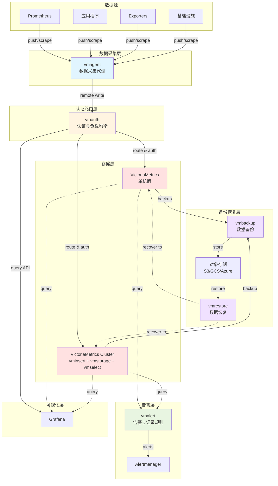

**核心组件说明**：

- **vmagent**：采集和转发指标数据，支持 Prometheus remote write 协议
- **VictoriaMetrics**：时序数据存储引擎（单机版或集群版）
- **vmauth**：认证、路由和负载均衡代理
- **vmalert**：执行告警规则和记录规则
- **vmbackup/vmrestore**：数据备份和恢复工具

---

### 1.1 VictoriaMetrics 概述

VictoriaMetrics 是一个高性能的时序数据库和监控解决方案，支持单机和集群两种部署模式。

#### 1.1.1 产品形态

VictoriaMetrics 提供以下几种发行版本：

| 产品形态                                | 说明                                  | 适用场景                                                 |
| --------------------------------------- | ------------------------------------- | -------------------------------------------------------- |
| **Single-server-VictoriaMetrics** | all-in-one 二进制文件，易于运行和维护 | 中小规模监控，完美支持垂直扩展，可轻松处理数百万指标     |
| **VictoriaMetrics Cluster**       | 由多个组件构成，支持水平扩展          | 大规模监控场景，需要高可用性和水平扩展能力               |
| **VictoriaMetrics Cloud**         | 云托管版本                            | 无需担心 DevOps 运维任务（配置调优、监控、日志、备份等） |

#### 1.1.2 单机版 vs 集群版架构对比

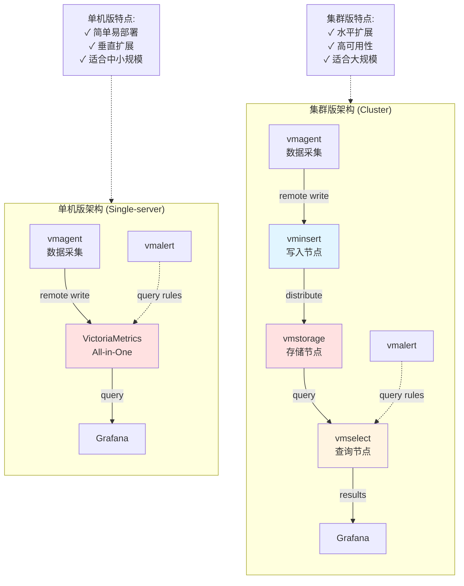

**选择建议**：

- **单机版**：数据量 < 每秒百万样本，垂直扩展足够
- **集群版**：数据量 > 每秒百万样本，需要水平扩展和高可用

#### 1.1.3 安装包形式

VictoriaMetrics 提供多种安装方式：

- **Docker 镜像**：可从 [Docker Hub](https://hub.docker.com/r/victoriametrics/victoria-metrics/) 和 [Quay](https://quay.io/repository/victoriametrics/victoria-metrics) 获取
- **Helm Charts**：适用于 Kubernetes 环境
- **Kubernetes Operator**：声明式管理 VictoriaMetrics
- **二进制发行版**：直接下载可执行文件
- **Ansible Roles**：自动化部署
- **源代码**：支持从源码构建
- **云平台模板**：Linode、DigitalOcean 等

> [!TIP]
> VictoriaMetrics 开发节奏很快，建议定期查看 [CHANGELOG](https://github.com/VictoriaMetrics/VictoriaMetrics/blob/master/docs/CHANGELOG.md) 并执行常规升级。

---

### 1.2 部署方式详解

#### 1.2.1 在 VictoriaMetrics Cloud 上启动

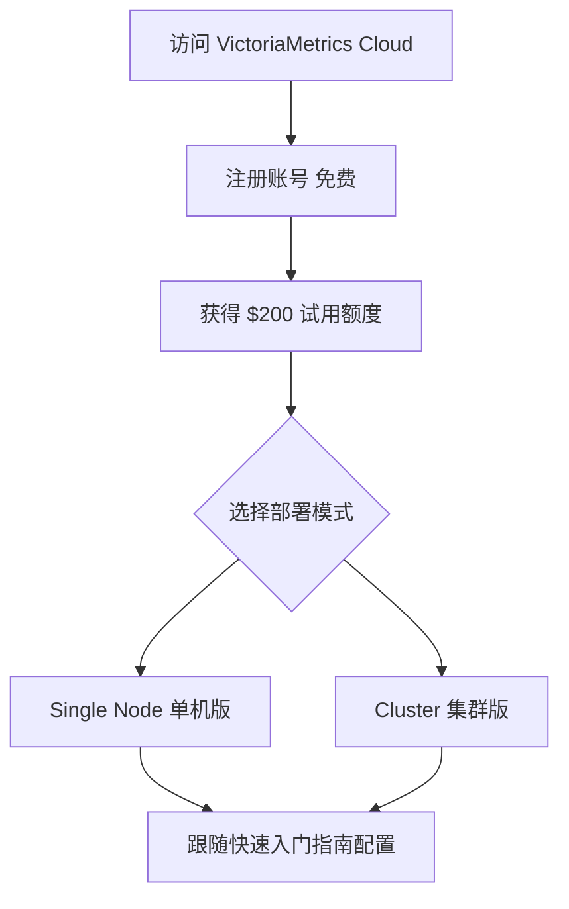

**步骤：**

1. 访问 [VictoriaMetrics Cloud](https://victoriametrics.com/products/cloud/) 并注册（免费）
2. 注册后立即获得 **$200 试用额度**
3. 可用于运行单机版或集群版
4. 按照官方快速入门指南进行配置

**优势：**

- 无需关心基础设施管理
- 自动处理配置调优、监控、日志收集、访问保护、软件更新、备份等

---

#### 1.2.2 使用 Docker 启动单机版

##### 基本启动命令

```bash
# 拉取最新镜像
docker pull victoriametrics/victoria-metrics:v1.130.0

# 启动容器
docker run -it --rm \
  -v `pwd`/victoria-metrics-data:/victoria-metrics-data \
  -p 8428:8428 \
  victoriametrics/victoria-metrics:v1.130.0 \
  --selfScrapeInterval=5s \
  -storageDataPath=victoria-metrics-data
```

##### 重要 Flag 参数说明

| Flag 参数                | 说明                      | 示例值                       | 必需 |
| ------------------------ | ------------------------- | ---------------------------- | ---- |
| `-storageDataPath`     | 数据存储路径              | `victoria-metrics-data`    | ✅   |
| `--selfScrapeInterval` | 自我抓取指标的间隔时间    | `5s`                       | ❌   |
| `-p 8428:8428`         | 端口映射（Docker 参数）   | 将容器 8428 端口映射到宿主机 | ✅   |
| `-v`                   | 数据卷挂载（Docker 参数） | 持久化存储数据               | ✅   |

##### 启动成功标志

启动成功后，你会看到如下输出：

```
started server at http://0.0.0.0:8428/
partition "2025_03" has been created
```

##### 访问界面

启动成功后，可访问以下界面：

| 界面                    | URL                                                                       | 说明                    |
| ----------------------- | ------------------------------------------------------------------------- | ----------------------- |
| **VMUI 图形界面** | [http://localhost:8428/vmui](http://localhost:8428/vmui)                     | Web 图形界面            |
| **指标浏览器**    | [http://localhost:8428/vmui/#/metrics](http://localhost:8428/vmui/#/metrics) | 查看所有可用指标        |
| **查询界面**      | [http://localhost:8428/vmui](http://localhost:8428/vmui)                     | 执行 PromQL 查询        |
| **HTTP 端点列表** | [http://localhost:8428](http://localhost:8428)                               | 查看所有可用的 API 端点 |

> [!NOTE]
> 使用 `--selfScrapeInterval=5s` 后，VictoriaMetrics 会抓取自身指标，约 **30 秒**后这些指标可供查询。可尝试查询 `process_cpu_cores_available` 等指标。

##### 企业版镜像

企业版镜像请参考 [官方文档](https://docs.victoriametrics.com/enterprise/)。

---

#### 1.2.3 使用 Docker 启动集群版

##### 启动命令

```bash
# 克隆仓库
git clone https://github.com/VictoriaMetrics/VictoriaMetrics && cd VictoriaMetrics

# 启动集群环境
make docker-vm-cluster-up
```

##### 启动成功标志

```
✔ Container vmstorage-1        Started
✔ Container vmselect-1         Started
✔ Container vminsert           Started
✔ Container vmagent            Started
```

##### 集群组件说明

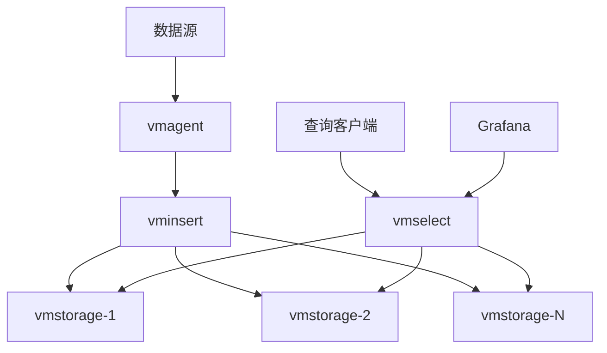

该命令会启动一组 VictoriaMetrics 组件：

| 组件                | 作用                                          |
| ------------------- | --------------------------------------------- |
| **vmstorage** | 数据存储组件，负责持久化存储时序数据          |
| **vminsert**  | 数据写入代理，接收数据并分发到 vmstorage      |
| **vmselect**  | 数据查询代理，从 vmstorage 读取数据并响应查询 |
| **vmagent**   | 指标采集组件，兼容 Prometheus 协议            |
| **Grafana**   | 可视化界面                                    |

##### 访问界面

| 界面              | URL                                                                     | 凭据                              |
| ----------------- | ----------------------------------------------------------------------- | --------------------------------- |
| **Grafana** | [http://localhost:3000/](http://localhost:3000/)                           | 用户名:`admin`, 密码: `admin` |
| **VMUI**    | [http://localhost:8427/select/0/vmui](http://localhost:8427/select/0/vmui) | 无需认证                          |

##### 自定义配置

> [!TIP]
> 可以通过编辑 `compose-vm-cluster.yml` 文件进一步自定义集群配置，如调整组件数量、资源限制、端口映射等。

---

#### 1.2.4 使用二进制文件启动单机版

##### 安装步骤

**步骤 1：下载二进制文件**

从 [GitHub Releases](https://github.com/VictoriaMetrics/VictoriaMetrics/releases) 下载适合你操作系统和架构的二进制文件。

> [!NOTE]
> 企业版二进制文件请参考 [官方企业版文档](https://docs.victoriametrics.com/enterprise/)。

**步骤 2：解压到系统目录**

```bash
sudo tar -xvf <victoriametrics-archive> -C /usr/local/bin
```

替换 `<victoriametrics-archive>` 为实际下载的文件名。

**步骤 3：创建系统用户**

```bash
sudo useradd -s /usr/sbin/nologin victoriametrics
```

**步骤 4：创建数据存储目录**

```bash
sudo mkdir -p /var/lib/victoria-metrics && \
sudo chown -R victoriametrics:victoriametrics /var/lib/victoria-metrics
```

**步骤 5：创建 systemd 服务**

```bash
sudo bash -c 'cat <<END >/etc/systemd/system/victoriametrics.service
[Unit]
Description=VictoriaMetrics service
After=network.target

[Service]
Type=simple
User=victoriametrics
Group=victoriametrics
ExecStart=/usr/local/bin/victoria-metrics-prod -storageDataPath=/var/lib/victoria-metrics -retentionPeriod=90d -selfScrapeInterval=10s
SyslogIdentifier=victoriametrics
Restart=always

PrivateTmp=yes
ProtectHome=yes
NoNewPrivileges=yes
ProtectSystem=full

[Install]
WantedBy=multi-user.target
END'
```

##### 服务配置中的重要 Flag 参数

| Flag 参数               | 说明          | 示例值                        | 推荐值            |
| ----------------------- | ------------- | ----------------------------- | ----------------- |
| `-storageDataPath`    | 数据存储路径  | `/var/lib/victoria-metrics` | 根据磁盘容量规划  |
| `-retentionPeriod`    | 数据保留周期  | `90d`（90 天）              | 根据业务需求设置  |
| `-selfScrapeInterval` | 自我抓取间隔  | `10s`                       | `10s` - `30s` |
| `-httpListenAddr`     | HTTP 监听地址 | `:8428`（默认）             | 根据安全需求调整  |

> [!IMPORTANT]
> 可以在 `ExecStart` 行添加额外的命令行 flag 参数来自定义配置。例如：
>
> - `-memory.allowedPercent=80` - 限制内存使用百分比
> - `-search.maxQueryDuration=60s` - 限制查询最大执行时间

**步骤 6：启动并启用服务**

```bash
# 重载 systemd 配置并启动服务
sudo systemctl daemon-reload && sudo systemctl enable --now victoriametrics.service

# 检查服务状态
sudo systemctl status victoriametrics.service
```

**步骤 7：验证安装**

服务运行后，访问以下地址验证：

- **VMUI 界面**：http://\<ip_or_hostname\>:8428/vmui
- **健康检查**：http://\<ip_or_hostname\>:8428/-/healthy

> [!NOTE]
> VictoriaMetrics 服务默认监听 **:8428** 端口接收 HTTP 连接（参见 `-httpListenAddr` flag）。

##### Windows 服务部署

如果需要将 VictoriaMetrics 单机版部署为 Windows 服务，请参考官方文档的 [running as a Windows service](https://docs.victoriametrics.com/#windows-service) 部分。

---

#### 1.2.5 使用二进制文件启动集群版

##### 集群架构说明

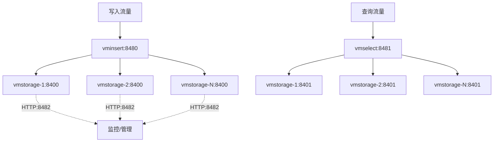

VictoriaMetrics 集群由 **3 个核心组件** 组成：

| 组件                | 角色         | 说明                                    |
| ------------------- | ------------ | --------------------------------------- |
| **vmstorage** | 数据存储节点 | 负责数据的持久化存储和检索              |
| **vminsert**  | 数据写入代理 | 接收写入请求并分发到 vmstorage 节点     |
| **vmselect**  | 数据查询代理 | 处理查询请求并从 vmstorage 节点聚合数据 |

> [!WARNING]
> **部署建议**：
>
> - 建议在**同一私有网络**中运行这些组件（出于安全考虑）
> - 应部署在**不同的物理节点**上以获得最佳性能
> - 确保各组件之间的网络延迟尽可能低

##### 所有节点的通用准备步骤

在所有集群节点上执行以下操作：

**步骤 1：下载集群版二进制文件**

从 [GitHub Releases](https://github.com/VictoriaMetrics/VictoriaMetrics/releases) 下载带有 `-cluster` 后缀的二进制文件。

**步骤 2：解压到系统目录**

```bash
sudo tar -xvf <victoriametrics-archive> -C /usr/local/bin
```

**步骤 3：创建系统用户**

```bash
sudo useradd -s /usr/sbin/nologin victoriametrics
```

---

##### 安装 vmstorage

**步骤 1：创建数据存储目录**

```bash
sudo mkdir -p /var/lib/vmstorage && \
sudo chown -R victoriametrics:victoriametrics /var/lib/vmstorage
```

**步骤 2：创建 systemd 服务**

```bash
sudo bash -c 'cat <<END >/etc/systemd/system/vmstorage.service
[Unit]
Description=VictoriaMetrics vmstorage service
After=network.target

[Service]
Type=simple
User=victoriametrics
Group=victoriametrics
Restart=always
ExecStart=/usr/local/bin/vmstorage-prod -retentionPeriod=90d -storageDataPath=/var/lib/vmstorage

PrivateTmp=yes
NoNewPrivileges=yes
ProtectSystem=full

[Install]
WantedBy=multi-user.target
END'
```

**vmstorage 重要 Flag 参数：**

| Flag 参数            | 说明                  | 默认端口       | 示例值                  |
| -------------------- | --------------------- | -------------- | ----------------------- |
| `-storageDataPath` | 数据存储路径          | -              | `/var/lib/vmstorage`  |
| `-retentionPeriod` | 数据保留周期          | `1` (1 个月) | `90d`, `12`, `1y` |
| `-vminsertAddr`    | vminsert 连接监听地址 | `:8400`      | `:8400`               |
| `-vmselectAddr`    | vmselect 连接监听地址 | `:8401`      | `:8401`               |
| `-httpListenAddr`  | HTTP API 监听地址     | `:8482`      | `:8482`               |

> [!TIP]
> 可在 `ExecStart` 行添加其他 flag 参数，例如：
>
> - `-dedup.minScrapeInterval=30s` - 启用数据去重
> - `-snapshotAuthKey=<secret>` - 设置快照 API 认证密钥

**步骤 3：启动并验证服务**

```bash
# 启动服务
sudo systemctl daemon-reload && sudo systemctl enable --now vmstorage

# 检查服务状态
sudo systemctl status vmstorage
```

**健康检查**：
访问 http://\<ip_or_hostname\>:8482/-/healthy，应显示 **"VictoriaMetrics is Healthy"**。

---

##### 安装 vminsert

**步骤 1：创建 systemd 服务**

```bash
sudo bash -c 'cat <<END >/etc/systemd/system/vminsert.service
[Unit]
Description=VictoriaMetrics vminsert service
After=network.target

[Service]
Type=simple
User=victoriametrics
Group=victoriametrics
Restart=always
ExecStart=/usr/local/bin/vminsert-prod -storageNode=<list of vmstorages>

PrivateTmp=yes
NoNewPrivileges=yes
ProtectSystem=full

[Install]
WantedBy=multi-user.target
END'
```

**vminsert 重要 Flag 参数：**

| Flag 参数              | 说明                   | 默认端口  | 示例                                    |
| ---------------------- | ---------------------- | --------- | --------------------------------------- |
| `-storageNode`       | vmstorage 节点地址列表 | -         | `192.168.1.10:8400,192.168.1.11:8400` |
| `-httpListenAddr`    | HTTP 监听地址          | `:8480` | `:8480`                               |
| `-replicationFactor` | 数据副本数             | `1`     | `2` (推荐至少为 2)                    |

> [!IMPORTANT]
> **配置 `-storageNode` 参数：**
>
> - 替换 `<list of vmstorages>` 为实际的 vmstorage 服务地址
> - 可以多次重复该 flag：`-storageNode=192.168.1.10:8400 -storageNode=192.168.1.11:8400`
> - 或在一个 flag 中用逗号分隔：`-storageNode=192.168.1.10:8400,192.168.1.11:8400`

**步骤 2：启动并验证服务**

```bash
# 启动服务
sudo systemctl daemon-reload && sudo systemctl enable --now vminsert.service

# 检查服务状态
sudo systemctl status vminsert.service
```

**健康检查**：
访问 http://\<ip_or_hostname\>:8480/-/healthy，应显示 **"VictoriaMetrics is Healthy"**。

---

##### 安装 vmselect

**步骤 1：创建缓存目录**

```bash
sudo mkdir -p /var/lib/vmselect-cache && \
sudo chown -R victoriametrics:victoriametrics /var/lib/vmselect-cache
```

**步骤 2：创建 systemd 服务**

```bash
sudo bash -c 'cat <<END >/etc/systemd/system/vmselect.service
[Unit]
Description=VictoriaMetrics vmselect service
After=network.target

[Service]
Type=simple
User=victoriametrics
Group=victoriametrics
Restart=always
ExecStart=/usr/local/bin/vmselect-prod -storageNode=<list of vmstorages> -cacheDataPath=/var/lib/vmselect-cache

PrivateTmp=yes
NoNewPrivileges=yes
ProtectSystem=full

[Install]
WantedBy=multi-user.target
END'
```

**vmselect 重要 Flag 参数：**

| Flag 参数                    | 说明                   | 默认端口  | 示例值                                  |
| ---------------------------- | ---------------------- | --------- | --------------------------------------- |
| `-storageNode`             | vmstorage 节点地址列表 | -         | `192.168.1.10:8401,192.168.1.11:8401` |
| `-cacheDataPath`           | 查询结果缓存路径       | -         | `/var/lib/vmselect-cache`             |
| `-httpListenAddr`          | HTTP 监听地址          | `:8481` | `:8481`                               |
| `-search.maxQueryDuration` | 查询最大执行时间       | `30s`   | `60s`                                 |

> [!IMPORTANT]
> **配置 `-storageNode` 参数：**
>
> - 替换 `<list of vmstorages>` 为实际的 vmstorage 服务地址
> - **注意端口号**：vmselect 连接 vmstorage 的 **8401** 端口（不是 8400）
> - 示例：`-storageNode=192.168.1.10:8401,192.168.1.11:8401`

**步骤 3：启动并验证服务**

```bash
# 启动服务
sudo systemctl daemon-reload && sudo systemctl enable --now vmselect.service

# 检查服务状态
sudo systemctl status vmselect.service
```

**健康检查**：
访问 http://\<ip_or_hostname\>:8481/select/0/vmui，应显示 **vmui 页面**。

---

### 1.3 集群组件端口汇总

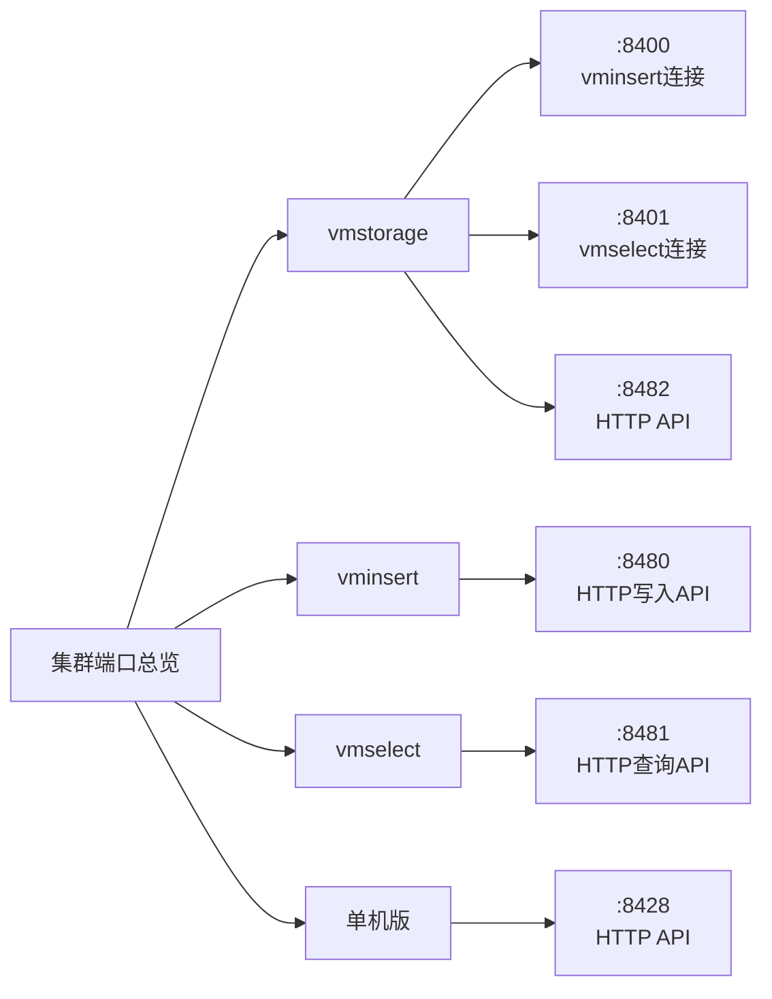

#### 端口功能详表

| 组件                | 端口 | 协议     | 用途                | 访问者                      |
| ------------------- | ---- | -------- | ------------------- | --------------------------- |
| **vmstorage** | 8400 | 内部协议 | 接收 vminsert 连接  | vminsert                    |
| **vmstorage** | 8401 | 内部协议 | 接收 vmselect 连接  | vmselect                    |
| **vmstorage** | 8482 | HTTP     | HTTP API 和管理接口 | 管理员、监控系统            |
| **vminsert**  | 8480 | HTTP     | 接收写入请求        | 数据源、Prometheus、vmagent |
| **vmselect**  | 8481 | HTTP     | 接收查询请求        | Grafana、查询客户端         |
| **单机版 VM** | 8428 | HTTP     | 统一的读写 API      | 数据源、查询客户端          |

> [!NOTE]
> 所有端口均可通过相应的 `-httpListenAddr`、`-vminsertAddr`、`-vmselectAddr` flag 参数自定义。

---

### 1.4 快速入门总结

#### 1.4.1 部署模式选择

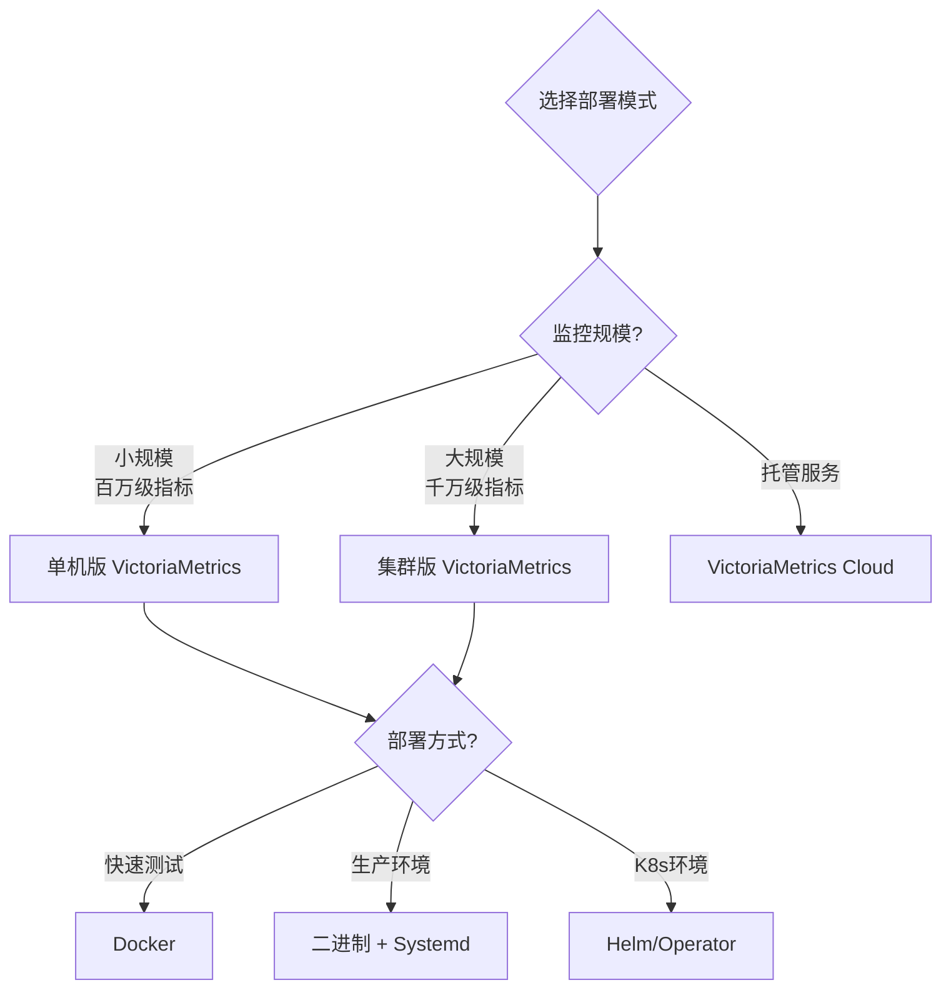

#### 1.4.2 核心 Flag 参数速查表

**通用参数（单机版和集群版）：**

| Flag                    | 作用             | 推荐值                        | 重要性 |
| ----------------------- | ---------------- | ----------------------------- | ------ |
| `-storageDataPath`    | 数据存储路径     | `/var/lib/victoria-metrics` | ⭐⭐⭐ |
| `-retentionPeriod`    | 数据保留周期     | `90d` 或 `3` (3个月)      | ⭐⭐⭐ |
| `-httpListenAddr`     | HTTP 监听地址    | `:8428` (单机)              | ⭐⭐   |
| `-selfScrapeInterval` | 自我监控抓取间隔 | `10s`                       | ⭐     |

**集群专用参数：**

| 组件              | Flag                   | 作用              | 示例                        | 重要性 |
| ----------------- | ---------------------- | ----------------- | --------------------------- | ------ |
| vminsert/vmselect | `-storageNode`       | 后端存储节点列表  | `host1:8400,host2:8400`   | ⭐⭐⭐ |
| vmselect          | `-cacheDataPath`     | 查询缓存路径      | `/var/lib/vmselect-cache` | ⭐⭐   |
| vminsert          | `-replicationFactor` | 数据副本数        | `2`                       | ⭐⭐⭐ |
| vmstorage         | `-vminsertAddr`      | vminsert 连接地址 | `:8400`                   | ⭐⭐   |
| vmstorage         | `-vmselectAddr`      | vmselect 连接地址 | `:8401`                   | ⭐⭐   |

#### 1.4.3 下一步学习路径

完成快速入门后，建议按以下顺序深入学习：

1. **第 2 章**：深入了解单机版 VictoriaMetrics 的高级特性和优化
2. **第 3 章**：学习集群版的架构设计和运维管理
3. **第 4 章**：掌握 vmagent 的数据采集和多租户配置
4. **第 5 章**：学习 vmalert 的告警规则和告警管理
5. **第 6 章**：了解 vmauth 的认证和多租户管理
6. **第 7-8 章**：学习数据备份和恢复策略
7. **第 9 章**：掌握生产环境的最佳实践

---

**🎯 快速入门章节完成！**接下来将继续学习各个组件的详细用法...

---

## 第 2 章：单机版 VictoriaMetrics 深入详解

### 2.1 概述与核心特性

单机版 VictoriaMetrics 是一个快速、经济且可扩展的监控解决方案和时序数据库。

#### 2.1.1 产品优势

| 特性类别             | 优势描述             | 性能指标                                                             |
| -------------------- | -------------------- | -------------------------------------------------------------------- |
| **性能**       | 高性能数据摄入和查询 | 相比 InfluxDB 和 TimescaleDB 高出 20 倍                              |
| **内存使用**   | 极低内存占用         | 相比 InfluxDB 少 10 倍，相比 Prometheus/Thanos/Cortex 少 7 倍        |
| **存储压缩**   | 高效数据压缩         | 相比 TimescaleDB 多存储 70 倍数据点，相比 Prometheus 少 7 倍存储空间 |
| **垂直扩展**   | 单机可处理大规模数据 | 摄入速率 150 万+ samples/s，活跃时序 5000 万+                        |
| **高性能 I/O** | 优化的磁盘 I/O       | 适用于高延迟 I/O 和低 IOPS 存储（HDD、网络存储）                     |

> [!NOTE]
> 单机版 VictoriaMetrics 可以替代中等规模的集群方案（如 Thanos、M3DB、Cortex、InfluxDB）。

---

### 2.2 数据摄入协议

VictoriaMetrics 支持多种数据摄入协议：

#### 2.2.1 Pull 模式

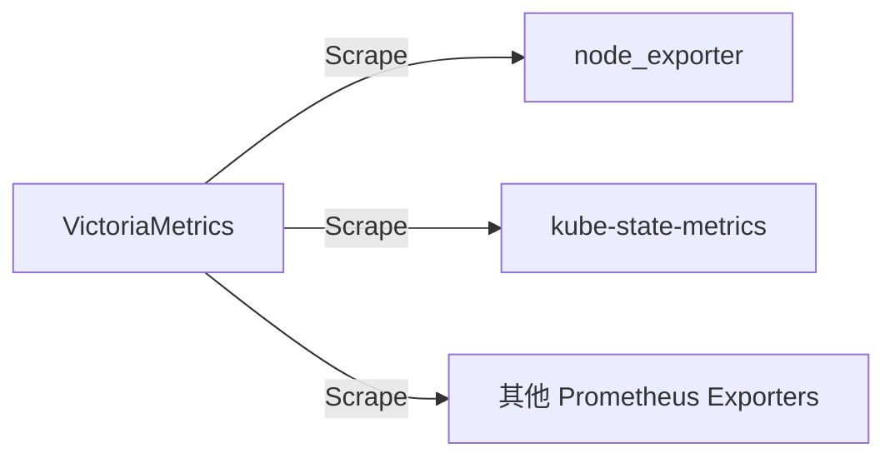

- **Prometheus Scraping**：兼容 Prometheus `scrape_configs`
- **配置文件**：通过 `-promscrape.config` 指定 `prometheus.yml`

#### 2.2.2 Push 模式（支持的协议）

| 协议                                   | 端点                                       | 说明                                                |
| -------------------------------------- | ------------------------------------------ | --------------------------------------------------- |
| **Prometheus remote_write**      | `/api/v1/write`                          | Prometheus 远程写入 API                             |
| **Prometheus exposition format** | `/api/v1/import/prometheus`              | Prometheus 文本格式                                 |
| **InfluxDB line protocol**       | `/write` (HTTP/TCP/UDP)                  | InfluxDB 行协议                                     |
| **Graphite plaintext**           | `:2003`                                  | Graphite 明文协议（需设置 `-graphiteListenAddr`） |
| **OpenTSDB telnet put**          | `:4242`                                  | OpenTSDB telnet 协议                                |
| **OpenTSDB HTTP /api/put**       | `/api/put`                               | OpenTSDB HTTP API                                   |
| **OpenTelemetry**                | `/opentelemetry/v1/metrics`              | OpenTelemetry metrics                               |
| **DataDog**                      | `/datadog/api/v2/series`                 | DataDog submit metrics API                          |
| **NewRelic**                     | `/newrelic/infra/v2/metrics/events/bulk` | NewRelic 基础设施代理                               |
| **JSON line format**             | `/api/v1/import`                         | VictoriaMetrics JSON 行格式                         |
| **Native binary format**         | `/api/v1/import/native`                  | VictoriaMetrics 原生二进制格式                      |
| **CSV**                          | `/api/v1/import/csv`                     | 任意 CSV 数据                                       |

---

### 2.3 核心 Flag 参数详解

#### 2.3.1 存储相关参数

| Flag 参数                          | 默认值                    | 说明                 | 推荐值                    |
| ---------------------------------- | ------------------------- | -------------------- | ------------------------- |
| `-storageDataPath`               | `victoria-metrics-data` | 数据存储路径         | 独立的高性能磁盘路径      |
| `-retentionPeriod`               | `1` (1个月)             | 数据保留周期         | `90d`, `6`, `1y` 等 |
| `-retentionTimezoneOffset`       | `0`                     | IndexDB 轮转时区偏移 | 根据时区调整              |
| `-storage.minFreeDiskSpaceBytes` | `10000000`              | 最小可用磁盘空间     | 至少保留 20% 空间         |

> [!IMPORTANT]
> **关于 retentionPeriod**：
>
> - 支持的时间单位：`h`（小时）、`d`（天）、`w`（周）、`y`（年）
> - 未指定单位时按月计算
> - 最小保留期：**24h** 或 **1d**
> - 数据按月分区存储，过期分区在新月的第一天删除

#### 2.3.2 性能调优参数

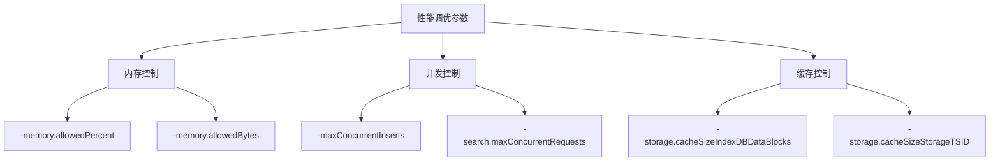

**内存相关：**

| Flag                          | 默认值   | 说明                                 |
| ----------------------------- | -------- | ------------------------------------ |
| `-memory.allowedPercent`    | `60`   | 允许缓存使用的系统内存百分比         |
| `-memory.allowedBytes`      | `0`    | 允许缓存使用的字节数（覆盖 percent） |
| `-search.maxMemoryPerQuery` | 自动计算 | 单个查询可用的最大内存               |

**并发相关：**

| Flag                              | 默认值          | 说明                 |
| --------------------------------- | --------------- | -------------------- |
| `-maxConcurrentInserts`         | `2*CPU核心数` | 最大并发写入请求数   |
| `-search.maxConcurrentRequests` | 自动计算        | 最大并发查询请求数   |
| `-search.maxQueueDuration`      | `10s`         | 查询队列最大等待时间 |
| `-insert.maxQueueDuration`      | `1m`          | 写入队列最大等待时间 |

**工作线程：**

| Flag                           | 默认值   | 说明                            |
| ------------------------------ | -------- | ------------------------------- |
| `-search.maxWorkersPerQuery` | 自动计算 | 单个查询可使用的最大 CPU 核心数 |

> [!TIP]
> **CPU 核心数较多时的优化**：
>
> - 如果 VictoriaMetrics 运行在 16+ CPU 核心的主机上，建议调整 `-search.maxWorkersPerQuery`
> - 大量并发小查询：**降低**该值
> - 重查询（>10K 时序或 >100M 样本）：**设为可用 CPU 核心数**

#### 2.3.3 资源限制参数

**查询限制：**

| Flag                               | 默认值          | 说明                                     |
| ---------------------------------- | --------------- | ---------------------------------------- |
| `-search.maxQueryDuration`       | `30s`         | 查询最大执行时间                         |
| `-search.maxUniqueTimeseries`    | 自动计算        | 单个查询可处理的最大时序数               |
| `-search.maxSamplesPerQuery`     | `1000000000`  | 单个查询可处理的最大原始样本数           |
| `-search.maxSamplesPerSeries`    | `30000000`    | 每个时序可扫描的最大原始样本数           |
| `-search.maxResponseSeries`      | `0`（无限制） | `/api/v1/query[_range]` 最大返回时序数 |
| `-search.maxPointsPerTimeseries` | `30000`       | 每个时序最大返回点数                     |
| `-search.maxSeriesPerAggrFunc`   | `1000000`     | 聚合函数最大生成时序数                   |

**导出限制：**

| Flag                          | 默认值          | 说明                               |
| ----------------------------- | --------------- | ---------------------------------- |
| `-search.maxExportSeries`   | `10000000`    | `/api/v1/export*` 最大导出时序数 |
| `-search.maxExportDuration` | `720h` (30天) | 导出查询最大持续时间               |
| `-search.maxFederateSeries` | `1000000`     | `/federate` 最大返回时序数       |
| `-search.maxDeleteSeries`   | `1000000`     | `/delete_series` 最大删除时序数  |
| `-search.maxDeleteDuration` | `5m`          | 删除操作最大持续时间               |

**API 限制：**

| Flag                             | 默认值      | 说明                                          |
| -------------------------------- | ----------- | --------------------------------------------- |
| `-search.maxTagKeys`           | `100000`  | `/api/v1/labels` 最大返回标签名数           |
| `-search.maxTagValues`         | `100000`  | `/api/v1/label/.../values` 最大返回标签值数 |
| `-search.maxLabelsAPISeries`   | `1000000` | Labels API 可扫描的最大时序数                 |
| `-search.maxLabelsAPIDuration` | `5s`      | Labels API 最大持续时间                       |
| `-search.maxSeries`            | `30000`   | `/api/v1/series` 最大返回时序数             |

#### 2.3.4 摄入限制参数

| Flag                        | 默认值          | 说明                                      |
| --------------------------- | --------------- | ----------------------------------------- |
| `-maxIngestionRate`       | `0`（无限制） | 每秒最大样本摄入数                        |
| `-maxInsertRequestSize`   | `32MB`        | 单个 Prometheus remote_write 请求最大大小 |
| `-maxLabelNameLen`        | `256`         | 标签名最大长度                            |
| `-maxLabelValueLen`       | `4096`        | 标签值最大长度                            |
| `-maxLabelsPerTimeseries` | `40`          | 每个时序最大标签数                        |

#### 2.3.5 HTTP 服务器参数

| Flag                                  | 默认值    | 说明                               |
| ------------------------------------- | --------- | ---------------------------------- |
| `-httpListenAddr`                   | `:8428` | HTTP 监听地址                      |
| `-http.maxGracefulShutdownDuration` | `7s`    | 优雅关闭最大持续时间               |
| `-http.shutdownDelay`               | `0`     | 关闭前延迟（用于从负载均衡器摘除） |
| `-http.connTimeout`                 | `2m`    | 传入连接超时时间                   |
| `-http.idleConnTimeout`             | `1m`    | 空闲连接超时时间                   |
| `-http.pathPrefix`                  | `""`    | HTTP 路径前缀                      |

---

### 2.4 存储架构深度解析

#### 2.4.1 存储结构

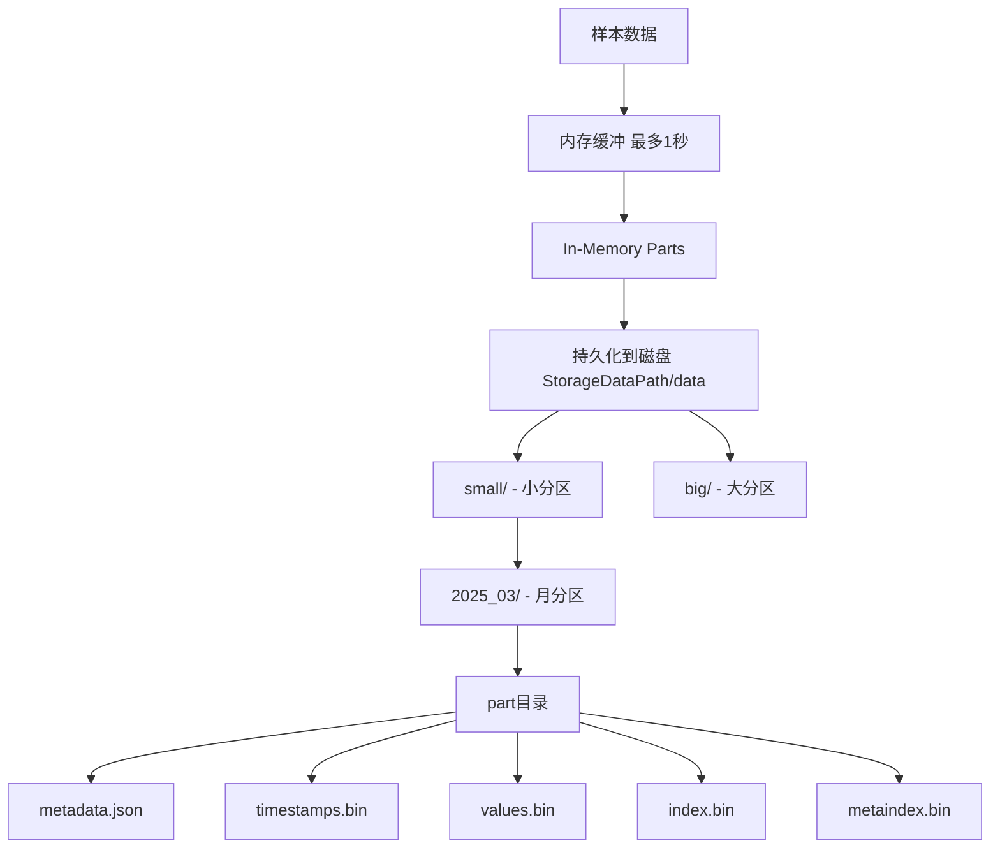

**目录结构：**

```
<storageDataPath>/
├── data/
│   ├── small/
│   │   └── YYYY_MM/      # 月分区，如 2025_03
│   │       ├── parts.json  # parts 列表
│   │       ├── part1/
│   │       ├── part2/
│   │       └── partN/
│   └── big/
│       └── YYYY_MM/
├── indexdb/
│   └── ...               # 索引数据
├── snapshots/            # 快照目录
└── cache/                # 缓存目录
```

**Part 目录结构：**

每个 part 目录包含以下文件：

| 文件               | 说明                                            |
| ------------------ | ----------------------------------------------- |
| `metadata.json`  | Part 元数据（行数、块数、时间范围、去重间隔等） |
| `timestamps.bin` | 压缩的时间戳数据                                |
| `values.bin`     | 压缩的值数据                                    |
| `index.bin`      | 快速查找块的索引                                |
| `metaindex.bin`  | 索引的索引                                      |

**metadata.json 字段：**

- `RowsCount`：原始样本数
- `BlocksCount`：块数
- `MinTimestamp`、`MaxTimestamp`：时间范围
- `MinDedupInterval`：应用的去重间隔

#### 2.4.2 数据分区与合并

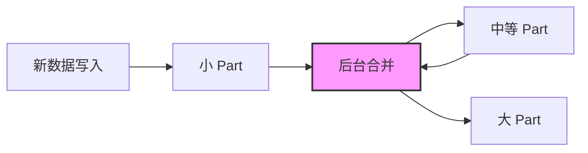

**后台合并的好处：**

1. 控制数据文件数量（避免超出打开文件限制）
2. 提升数据压缩率（更大的 part 通常压缩效果更好）
3. 提升查询速度（查询更少的 part）
4. 执行维护任务（去重、降采样、删除时序）

**合并限制：**

> [!WARNING]
> 当可用磁盘空间不足时，VictoriaMetrics 不会合并 parts。建议至少保留 **20%** 的可用磁盘空间。

可通过以下指标监控合并状态：

- 控制面板：[single-node VictoriaMetrics dashboard](https://grafana.com/grafana/dashboards/10229)
- 监控文档：[Monitoring docs](https://docs.victoriametrics.com/#monitoring)

#### 2.4.3 数据持久化机制

VictoriaMetrics 的数据持久化设计确保数据安全：

1. **内存缓冲**：数据在内存中缓冲最多 1 秒
2. **In-Memory Parts**：定期写入内存 parts（可查询）
3. **持久化**：周期性将内存 parts 写入磁盘
4. **原子注册**：Part 完全写入并 fsync 后，原子性地注册到 `parts.json`
5. **故障恢复**：硬件掉电时，不完整的 part 会在启动时自动删除

> [!NOTE]
> **数据丢失风险**：
>
> - 不干净的关闭（OOM、kill -9、硬件重置）可能导致最后几秒的数据丢失
> - 可通过 `-inmemoryDataFlushInterval` 调整刷新频率（默认 `5s`）
> - 更短的间隔会增加磁盘 I/O

---

### 2.5 IndexDB 索引机制

#### 2.5.1 索引类型

VictoriaMetrics 维护两种倒排索引：

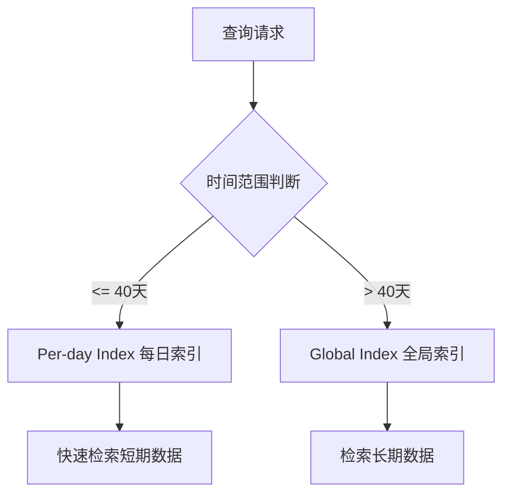

| 索引类型                | 存储内容             | 使用场景          | 优势             |
| ----------------------- | -------------------- | ----------------- | ---------------- |
| **Global Index**  | 整个保留期的映射     | 时间范围 > 40 天  | 减少索引重复写入 |
| **Per-day Index** | 每日的映射（含日期） | 时间范围 ≤ 40 天 | 加速短期数据查询 |

**索引映射的内容：**

- `metric_name` → `TSID`
- `label_name` → `TSID`
- `label_value` → `TSID`
- `label_name=label_value` → `TSID`

**索引创建时机：**

- **Global Index**：每个保留期内每个映射只创建一次
- **Per-day Index**：每个唯一日期创建一次映射

#### 2.5.2 低流失率优化：禁用每日索引

**适用场景：**

- 时序集合固定不变（如历史气象数据）
- 时序流失率低（如 IoT 传感器，极少添加/移除）

**优势：**

- 提升摄入速度
- 减少磁盘空间使用

**配置方法：**

```bash
victoria-metrics -disablePerDayIndex
```

> [!IMPORTANT]
> **注意事项：**
>
> - 推荐在新安装上设置此 flag
> - 在有历史数据的安装上禁用每日索引是可以的
> - 重新启用每日索引会导致历史数据无法搜索

---

### 2.6 去重（Deduplication）

VictoriaMetrics 支持数据去重，适用于高可用部署场景。

#### 2.6.1 去重工作原理

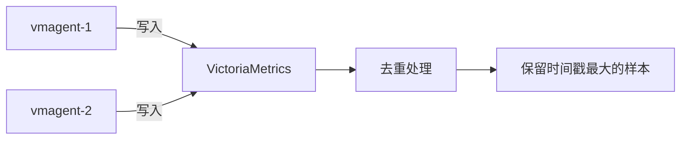

**配置去重：**

```bash
victoria-metrics -dedup.minScrapeInterval=30s
```

**去重规则：**

- 在每个 **离散间隔**（由 `-dedup.minScrapeInterval` 指定）内
- 保留 **时间戳最大** 的原始样本
- 如果多个样本时间戳相同，保留 **值最大** 的样本
- **Staleness markers（失效标记）** 优先于任何其他值

#### 2.6.2 重要 Flag 参数

| Flag                          | 说明           | 示例                                                |
| ----------------------------- | -------------- | --------------------------------------------------- |
| `-dedup.minScrapeInterval`  | 去重间隔       | `30s`（应等于 Prometheus 的 `scrape_interval`） |
| `-streamAggr.dedupInterval` | 摄入时去重间隔 | 数据写入磁盘前去重                                  |

> [!TIP]
> **最佳实践：**
>
> 1. `-dedup.minScrapeInterval` 应等于 Prometheus 配置中的 `scrape_interval`
> 2. 所有抓取目标推荐使用单一的 `scrape_interval`
> 3. 不同 HA 对的 vmagent 实例应设置不同的 `-promscrape.cluster.name`

**去重与降采样：**

- `-dedup.minScrapeInterval=D` 等价于 `-downsampling.period=0s:D`
- 可同时使用去重和降采样

---

### 2.7 降采样（Downsampling）

> [!NOTE]
> 降采样是 **VictoriaMetrics Enterprise** 特性。

#### 2.7.1 单级降采样

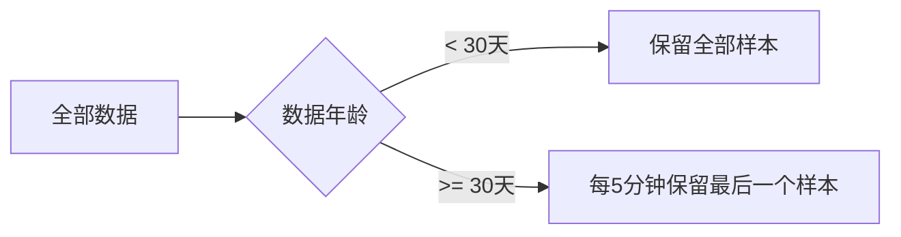

**配置示例：**

```bash
victoria-metrics-prod \
  -downsampling.period=30d:5m
```

#### 2.7.2 多级降采样

```bash
victoria-metrics-prod \
  -downsampling.period=30d:5m,180d:1h
```

**效果：**

- **30天以上的数据**：每 5 分钟保留最后一个样本
- **180天以上的数据**：每 1 小时保留最后一个样本

#### 2.7.3 基于过滤器的降采样

```bash
victoria-metrics-prod \
  -downsampling.period='{__name__=~"(node|process)_.*"}:1d:1m'
```

**说明：**

- 仅对名称以 `node_` 或 `process_` 开头的时序进行降采样
- 超过 1 天的数据，以 1 分钟间隔降采样

#### 2.7.4 禁用特定时序的降采样

```bash
victoria-metrics-prod \
  -downsampling.period='{env="prod"}:0s:0s' \
  -downsampling.period='{__name__=~"node_.*"}:1d:5m'
```

**说明：**

- `env="prod"` 的时序**不进行降采样**
- 其他 `node_*` 时序超过 1 天后以 5 分钟间隔降采样

**降采样调试：**

- Enterprise 版本的 VMUI：**Tools → Downsampling filters debug**

> [!IMPORTANT]
> **降采样限制：**
>
> 1. 同一过滤器的多个间隔必须是**倍数关系**
> 2. 如果启用去重，`-dedup.minScrapeInterval` 也必须是降采样间隔的倍数
> 3. 降采样在**后台合并**期间执行
> 4. 需要足够的可用磁盘空间

---

### 2.8 保留期过滤器（Retention Filters）

> [!NOTE]
> 这是 **VictoriaMetrics Enterprise** 特性。

#### 2.8.1 基本配置

```bash
victoria-metrics-prod \
  -retentionFilter='{team="juniors"}:3d' \
  -retentionFilter='{env=~"dev|staging"}:30d' \
  -retentionPeriod=1y
```

**效果：**

| 时序匹配条件                       | 保留期 |
| ---------------------------------- | ------ |
| `team="juniors"`                 | 3 天   |
| `env="dev"` 或 `env="staging"` | 30 天  |
| 其他时序                           | 1 年   |

**规则：**

- 如果时序匹配多个过滤器，应用**最小**保留期
- `-retentionFilter` 的 duration 必须 ≤ `-retentionPeriod`

#### 2.8.2 监控指标

| 指标                                                     | 说明                       |
| -------------------------------------------------------- | -------------------------- |
| `vm_retention_filters_partitions_scheduled`            | 计划进行保留过滤的分区总数 |
| `vm_retention_filters_partitions_scheduled_size_bytes` | 计划分区的总大小           |

#### 2.8.3 注意事项

> [!WARNING]
>
> 1. 旧数据不会立即删除，在**后台合并**期间逐步删除
> 2. `-retentionFilter` **不会**从 IndexDB 删除旧数据（到 `-retentionPeriod` 才删除）
> 3. 高流失率下，即使设置了较小的保留期，IndexDB 大小也可能很大
> 4. 应用保留过滤器时，资源使用会暂时增加

**调试工具：**

- VMUI Enterprise 版：**Tools → Retention filters debug**

---

### 2.9 基数限制器（Cardinality Limiter）

VictoriaMetrics 支持限制新增时序的速率，防止基数爆炸。

#### 2.9.1 配置参数

| Flag                         | 说明                               |
| ---------------------------- | ---------------------------------- |
| `-storage.maxHourlySeries` | 最近 1 小时可添加的最大唯一时序数  |
| `-storage.maxDailySeries`  | 最近 24 小时可添加的最大唯一时序数 |

**示例：**

```bash
victoria-metrics \
  -storage.maxHourlySeries=100000 \
  -storage.maxDailySeries=1000000
```

#### 2.9.2 监控指标

| 指标                                          | 说明                                         |
| --------------------------------------------- | -------------------------------------------- |
| `vm_hourly_series_limit_rows_dropped_total` | 因超出小时限制而丢弃的指标数                 |
| `vm_hourly_series_limit_max_series`         | 小时时序限制（`-storage.maxHourlySeries`） |
| `vm_hourly_series_limit_current_series`     | 当前小时的唯一时序数                         |
| `vm_daily_series_limit_rows_dropped_total`  | 因超出每日限制而丢弃的指标数                 |
| `vm_daily_series_limit_max_series`          | 每日时序限制（`-storage.maxDailySeries`）  |
| `vm_daily_series_limit_current_series`      | 最近一天的唯一时序数                         |

**告警示例：**

```promql
# 小时时序使用率超过 90%
vm_hourly_series_limit_current_series / vm_hourly_series_limit_max_series > 0.9

# 每日时序使用率超过 90%
vm_daily_series_limit_current_series / vm_daily_series_limit_max_series > 0.9
```

---

### 2.10 查询追踪（Query Tracing）

VictoriaMetrics 支持查询追踪，用于分析查询性能瓶颈。

#### 2.10.1 启用查询追踪

**方法：** 在查询时添加 `trace=1` 参数。

**示例：**

```bash
curl "http://localhost:8428/api/v1/query_range?query=2*rand()&start=-1h&step=1m&trace=1" | jq '.trace'
```

**输出示例：**

```json
{
  "duration_msec": 0.099,
  "message": "/api/v1/query_range: series=1",
  "children": [
    {
      "duration_msec": 0.034,
      "message": "eval: series=1, points=60",
      "children": [...]
    }
  ]
}
```

#### 2.10.2 VMUI 中的查询追踪

1. **启用追踪**：勾选 **Trace query** 复选框并重新执行查询
2. **查看追踪**：追踪信息会显示在查询结果下方
3. **导出追踪**：点击调试图标导出 JSON，可在 **Tools → Query Analyzer** 页面加载

#### 2.10.3 禁用查询追踪

```bash
victoria-metrics -denyQueryTracing
```

---

### 2.11 安全配置

#### 2.11.1 认证相关 Flag

| Flag                          | 说明                   | 端点                                 |
| ----------------------------- | ---------------------- | ------------------------------------ |
| `-httpAuth.username`        | HTTP Basic Auth 用户名 | 所有端点                             |
| `-httpAuth.password`        | HTTP Basic Auth 密码   | 所有端点                             |
| `-deleteAuthKey`            | 删除时序的认证密钥     | `/api/v1/admin/tsdb/delete_series` |
| `-snapshotAuthKey`          | 快照操作的认证密钥     | `/snapshot/*`                      |
| `-forceFlushAuthKey`        | 强制刷新认证密钥       | `/internal/force_flush`            |
| `-forceMergeAuthKey`        | 强制合并认证密钥       | `/internal/force_merge`            |
| `-search.resetCacheAuthKey` | 重置缓存认证密钥       | `/internal/resetRollupResultCache` |
| `-reloadAuthKey`            | 重载配置认证密钥       | `/-/reload`                        |
| `-configAuthKey`            | 配置页面认证密钥       | `/config`                          |
| `-flagsAuthKey`             | Flags 页面认证密钥     | `/flags`                           |
| `-pprofAuthKey`             | Profiling 认证密钥     | `/debug/pprof/*`                   |
| `-metricsAuthKey`           | Metrics 页面认证密钥   | `/metrics`                         |

#### 2.11.2 TLS/mTLS 配置

**启用 HTTPS：**

```bash
victoria-metrics \
  -tls \
  -tlsCertFile=/path/to/cert.pem \
  -tlsKeyFile=/path/to/key.pem
```

**启用 mTLS（Enterprise）：**

```bash
victoria-metrics-prod \
  -tls \
  -mtls \
  -mtlsCAFile=/path/to/ca.pem
```

**自动签发 TLS 证书（Enterprise）：**

```bash
victoria-metrics-prod \
  -httpListenAddr=:443 \
  -tls \
  -tlsAutocertHosts=vm.example.com,vm2.example.com \
  -tlsAutocertEmail=admin@example.com \
  -tlsAutocertCacheDir=/var/lib/vm-certs
```

#### 2.11.3 安全 HTTP 响应头

| Flag                          | 说明                         | 推荐值                                  |
| ----------------------------- | ---------------------------- | --------------------------------------- |
| `-http.header.hsts`         | Strict-Transport-Security 头 | `max-age=31536000; includeSubDomains` |
| `-http.header.csp`          | Content-Security-Policy 头   | `default-src 'self'`                  |
| `-http.header.frameOptions` | X-Frame-Options 头           | `DENY`                                |

---

### 2.12 VMUI Web 界面

VictoriaMetrics 提供强大的 Web UI（VMUI）。

#### 2.12.1 访问地址

- **单机版**：[http://victoriametrics:8428/vmui](http://victoriametrics:8428/vmui)
- **集群版**：http://`<vmselect>`:8481/select/`<accountID>`/vmui/

#### 2.12.2 主要功能

| 功能标签                             | 说明                                       |
| ------------------------------------ | ------------------------------------------ |
| **Query**                      | MetricsQL 查询，支持时间序列、表格、直方图 |
| **Raw Query**                  | 查看原始样本，调试查询结果                 |
| **Explore Metrics**            | 按 job/instance 浏览指标                   |
| **Cardinality Explorer**       | 分析时序基数                               |
| **Top Queries**                | 查看最常执行的查询                         |
| **Active Queries**             | 查看当前执行的查询                         |
| **Trace Analyzer**             | 分析查询追踪 JSON                          |
| **Query Analyzer**             | 分析导出的查询结果                         |
| **Metric Relabel Debugger**    | 调试 relabeling 规则                       |
| **Downsampling Debugger**      | 调试降采样配置（Enterprise）               |
| **Retention Filters Debugger** | 调试保留过滤器（Enterprise）               |

#### 2.12.3 快捷键

| 操作               | 快捷键                  |
| ------------------ | ----------------------- |
| 执行查询           | `Enter`               |
| 多行查询           | `Shift + Enter`       |
| 自动完成           | `Ctrl + Space`        |
| 查询历史（上一条） | `Ctrl/Cmd + ↑`       |
| 查询历史（下一条） | `Ctrl/Cmd + ↓`       |
| 放大               | `Ctrl/Cmd + 滚轮向上` |
| 缩小               | `Ctrl/Cmd + 滚轮向下` |
| 移动时间范围       | `Ctrl/Cmd + 拖动`     |

---

### 2.13 监控与可观测性

#### 2.13.1 自我监控

VictoriaMetrics 可以自我抓取指标：

```bash
victoria-metrics -selfScrapeInterval=10s
```

**相关 Flag：**

| Flag                    | 默认值               | 说明                           |
| ----------------------- | -------------------- | ------------------------------ |
| `-selfScrapeInterval` | `0`（禁用）        | 自我抓取间隔                   |
| `-selfScrapeJob`      | `victoria-metrics` | 自我抓取的 `job` 标签值      |
| `-selfScrapeInstance` | `self`             | 自我抓取的 `instance` 标签值 |

#### 2.13.2 推送指标（Push Metrics）

VictoriaMetrics 支持将 `/metrics` 页面的指标推送到远程存储。

```bash
victoria-metrics \
  -pushmetrics.url=http://vm-central:8428/api/v1/import/prometheus \
  -pushmetrics.interval=10s \
  -pushmetrics.extraLabel='instance="vm-node1"' \
  -pushmetrics.extraLabel='job="victoriametrics"'
```

**相关 Flag：**

| Flag                                | 说明                         |
| ----------------------------------- | ---------------------------- |
| `-pushmetrics.url`                | 推送指标的 URL（可指定多次） |
| `-pushmetrics.interval`           | 推送间隔（默认 `10s`）     |
| `-pushmetrics.extraLabel`         | 添加额外标签                 |
| `-pushmetrics.header`             | 添加 HTTP 请求头             |
| `-pushmetrics.disableCompression` | 禁用压缩                     |

#### 2.13.3 Grafana 仪表板

官方 Grafana 仪表板：

- **单机版**：[https://grafana.com/grafana/dashboards/10229](https://grafana.com/grafana/dashboards/10229)
- **集群版**：[https://grafana.com/grafana/dashboards/11176](https://grafana.com/grafana/dashboards/11176)

---

### 2.14 备份与恢复

#### 2.14.1 创建快照

```bash
curl http://localhost:8428/snapshot/create
```

**响应：**

```json
{"status":"ok","snapshot":"20231115-120000-ABC123"}
```

**快照存储位置：**

```
<storageDataPath>/snapshots/<snapshot-name>/
```

#### 2.14.2 列出快照

```bash
curl http://localhost:8428/snapshot/list
```

#### 2.14.3 删除快照

```bash
# 删除指定快照
curl "http://localhost:8428/snapshot/delete?snapshot=<snapshot-name>"

# 删除所有快照
curl http://localhost:8428/snapshot/delete_all
```

#### 2.14.4 从快照恢复

```bash
# 1. 停止 VictoriaMetrics
kill -INT <vm-pid>

# 2. 使用 vmrestore 恢复快照
vmrestore \
  -src=<backup-location> \
  -storageDataPath=<vm-storageDataPath>

# 3. 启动 VictoriaMetrics
./victoria-metrics -storageDataPath=<vm-storageDataPath>
```

> [!Important]
> **快照注意事项：**
>
> 1. 快照使用硬链接和软链接，**不要**用 `rm` 删除快照子目录
> 2. **不要**用 `cp`/`rsync` 复制快照，使用 `vmbackup`
> 3. 旧快照可能占用额外磁盘空间，建议定期删除

#### 2.14.5 自动快照管理

```bash
victoria-metrics \
  -snapshotsMaxAge=7d \
  -snapshotAuthKey=<secret-key>
```

**相关 Flag：**

| Flag                 | 说明                          |
| -------------------- | ----------------------------- |
| `-snapshotsMaxAge` | 快照最大保留时间（如 `7d`） |
| `-snapshotAuthKey` | 快照 API 认证密钥             |

---

### 2.15 数据导入导出

#### 2.15.1 导出数据

**JSON Line 格式：**

```bash
curl "http://localhost:8428/api/v1/export?start=2023-01-01T00:00:00Z&end=2023-12-31T23:59:59Z&match[]={__name__!=\"\"}" > data.jsonl
```

**CSV 格式：**

```bash
curl "http://localhost:8428/api/v1/export/csv?format=__timestamp__:unix_s,__name__,__value__&match[]={__name__=\"up\"}" > data.csv
```

**Native 格式（最高效）：**

```bash
curl "http://localhost:8428/api/v1/export/native?match[]={__name__!=\"\"}" > data.bin
```

#### 2.15.2 导入数据

**JSON Line 格式：**

```bash
curl -X POST "http://localhost:8428/api/v1/import" -T data.jsonl
```

**Native 格式：**

```bash
curl -X POST "http://localhost:8428/api/v1/import/native" -T data.bin
```

**CSV 格式：**

```bash
curl -X POST "http://localhost:8428/api/v1/import/csv?format=1:metric:temperature,2:label:location,3:time:unix_s" -T data.csv
```

**Prometheus 格式：**

```bash
curl -d 'metric{label="value"} 123' -X POST "http://localhost:8428/api/v1/import/prometheus"
```

---

### 2.16 故障排查

#### 2.16.1 常见问题

| 问题       | 可能原因               | 解决方法                               |
| ---------- | ---------------------- | -------------------------------------- |
| 数据摄入慢 | 活跃时序过多，内存不足 | 增加内存，监控 `vm_slow_*` 指标      |
| 查询慢     | 并发查询过多           | 调整 `-search.maxConcurrentRequests` |
| 磁盘使用高 | 合并停滞               | 检查可用磁盘空间（至少 20%）           |
| 图表有间隙 | 时间同步问题           | 调整 `-search.cacheTimestampOffset`  |
| 启动失败   | 损坏的 parts           | 删除损坏的 part 目录                   |

#### 2.16.2 关键监控指标

| 指标                                                                                           | 说明                     | 告警阈值 |
| ---------------------------------------------------------------------------------------------- | ------------------------ | -------- |
| `vm_free_disk_space_bytes`                                                                   | 可用磁盘空间             | < 20%    |
| `vm_slow_row_inserts_total`                                                                  | 慢写入计数               | 持续增长 |
| `vm_slow_metric_name_loads_total`                                                            | 慢元数据加载             | 持续增长 |
| `vm_rows_ignored_total`                                                                      | 被忽略的行数             | > 0      |
| `vm_hourly_series_limit_current_series / vm_hourly_series_limit_max_series`                  | 小时基数使用率           | > 0.9    |
| `vm_cache_size_bytes{type="storage/metricNamesStatsTracker"} / vm_cache_size_max_bytes{...}` | 指标名称追踪器缓存使用率 | > 0.9    |

#### 2.16.3 日志记录

**配置日志：**

```bash
victoria-metrics \
  -loggerLevel=INFO \
  -loggerFormat=json \
  -loggerOutput=stdout \
  -loggerTimezone=Asia/Shanghai \
  -loggerMaxArgLen=10000
```

**日志相关 Flag：**

| Flag                         | 默认值      | 说明                                        |
| ---------------------------- | ----------- | ------------------------------------------- |
| `-loggerLevel`             | `INFO`    | 日志级别（INFO, WARN, ERROR, FATAL, PANIC） |
| `-loggerFormat`            | `default` | 日志格式（default, json）                   |
| `-loggerOutput`            | `stderr`  | 日志输出（stderr, stdout）                  |
| `-loggerTimezone`          | `UTC`     | 日志时区                                    |
| `-loggerMaxArgLen`         | `5000`    | 单个日志参数最大长度                        |
| `-loggerDisableTimestamps` | `false`   | 禁用时间戳                                  |

---

### 2.17 环境变量支持

VictoriaMetrics 支持通过环境变量设置 flag 值。

#### 2.17.1 配置文件中引用环境变量

```yaml
# prometheus.yml
global:
  external_labels:
    cluster: %{CLUSTER_NAME}
    region: %{REGION}

scrape_configs:
  - job_name: 'node'
    static_configs:
      - targets: ['%{NODE_IP}:9100']
```

#### 2.17.2 通过环境变量设置 Flag

**启用环境变量支持：**

```bash
victoria-metrics -envflag.enable
```

**示例：**

```bash
export retention_period=90d
export http_listen_addr=:8428
export storage_data_path=/data/vm

victoria-metrics -envflag.enable
```

**重复 Flag：**

```bash
export storage_node="node1:8400,node2:8400,node3:8400"
```

**设置前缀：**

```bash
export VM_retention_period=90d
export VM_http_listen_addr=:8428

victoria-metrics -envflag.enable -envflag.prefix=VM_
```

---

### 2.18 容量规划

#### 2.18.1 生产工作负载参考

根据案例研究，单机版 VictoriaMetrics 可完美处理以下工作负载：

| 指标                      | 数值              |
| ------------------------- | ----------------- |
| **摄入速率**        | 150 万+ samples/s |
| **活跃时序**        | 5000 万+          |
| **总时序数**        | 50 亿+            |
| **时序流失率**      | 1.5 亿+ 新时序/天 |
| **总样本数**        | 10 万亿+          |
| **查询 QPS**        | 200+              |
| **查询延迟（P99）** | 1 秒              |

#### 2.18.2 资源建议

| 资源类型               | 建议     |
| ---------------------- | -------- |
| **空闲内存**     | 至少 50% |
| **空闲 CPU**     | 至少 50% |
| **可用磁盘空间** | 至少 20% |

#### 2.18.3 存储空间估算

**公式：**

```
所需存储空间 = 测试期间磁盘使用量 × (保留期天数 / 测试天数)
```

**示例：**

- 测试 1 天后，`-storageDataPath` 目录大小为 10GB
- 保留期设为 100 天（`-retentionPeriod=100d`）
- 所需存储空间：`10GB × 100 = 1TB`

**预留空间：** 实际需要 **1TB + 20%** = **1.2TB**

---

### 2.19 Flag 参数速查表

#### 2.19.1 核心参数

| Flag                    | 默认值                    | 说明          |
| ----------------------- | ------------------------- | ------------- |
| `-storageDataPath`    | `victoria-metrics-data` | 数据存储路径  |
| `-retentionPeriod`    | `1` (月)                | 数据保留周期  |
| `-httpListenAddr`     | `:8428`                 | HTTP 监听地址 |
| `-selfScrapeInterval` | `0`                     | 自我抓取间隔  |

#### 2.19.2 性能调优

| Flag                              | 默认值 | 说明                     |
| --------------------------------- | ------ | ------------------------ |
| `-memory.allowedPercent`        | `60` | 允许缓存使用的内存百分比 |
| `-search.maxConcurrentRequests` | 自动   | 最大并发查询数           |
| `-search.maxMemoryPerQuery`     | 自动   | 单查询最大内存           |
| `-search.maxWorkersPerQuery`    | 自动   | 单查询最大工作线程数     |

#### 2.19.3 限制参数

| Flag                            | 默认值  | 说明               |
| ------------------------------- | ------- | ------------------ |
| `-maxIngestionRate`           | `0`   | 每秒最大摄入样本数 |
| `-search.maxQueryDuration`    | `30s` | 查询最大执行时间   |
| `-search.maxUniqueTimeseries` | 自动    | 单查询最大时序数   |

#### 2.19.4 企业特性

| Flag                     | 说明                   | 类型       |
| ------------------------ | ---------------------- | ---------- |
| `-downsampling.period` | 降采样配置             | Enterprise |
| `-retentionFilter`     | 保留期过滤器           | Enterprise |
| `-mtls`                | 启用 mTLS              | Enterprise |
| `-tlsAutocertHosts`    | Let's Encrypt 自动证书 | Enterprise |

---

**🎯 第 2 章完成！** 下一步将继续学习集群版 VictoriaMetrics...

---

## 第 3 章：集群版 VictoriaMetrics 深入详解

### 3.1 概述与架构

#### 3.1.1 何时使用集群版

> [!IMPORTANT]
> **推荐使用场景判断**：
>
> - **单机版适用**：摄入速率 < 100 万 data points/s
> - **集群版适用**：摄入速率 >= 100 万 data points/s，或需要多租户隔离

单机版优势：

- 完美的垂直扩展能力（CPU、RAM、存储）
- 支持高可用部署
- 配置和运维更简单

#### 3.1.2 架构组件

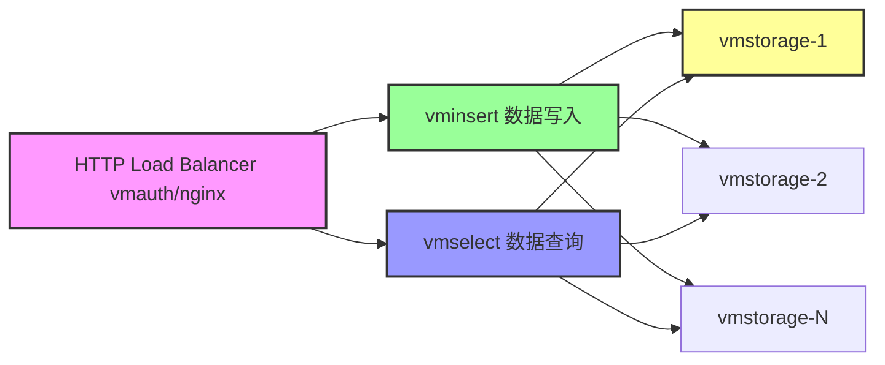

| 组件                | 端口                                                      | 职责                                   | 是否有状态                       |
| ------------------- | --------------------------------------------------------- | -------------------------------------- | -------------------------------- |
| **vminsert**  | `8480`                                                  | 接收数据，按一致性哈希分发到 vmstorage | 无状态                           |
| **vmselect**  | `8481`                                                  | 处理查询请求，从 vmstorage 聚合数据    | 无状态（但需要少量磁盘用于缓存） |
| **vmstorage** | `8482` (HTTP), `8400` (vminsert), `8401` (vmselect) | 存储和检索数据                         | 有状态                           |

**Shared Nothing 架构**：

- vmstorage 节点之间不通信
- 不共享任何数据
- 提高集群可用性
- 简化集群维护和扩展

> [!NOTE]
> vmselect 虽然是无状态的，但仍需要一些磁盘空间（几 GB）用于临时缓存。通过 `-cacheDataPath` 参数配置。

---

### 3.2 多租户（Multi-tenancy）

#### 3.2.1 租户标识符

租户由 `accountID` 或 `accountID:projectID` 标识：

- 都是 **32位整数**，范围：`[0 .. 2^32)`
- `projectID` 缺失时自动设为 `0`

**URL 格式：**

```
# 写入
http://vminsert:8480/insert/<accountID>/prometheus/api/v1/write
http://vminsert:8480/insert/<accountID>:<projectID>/prometheus/api/v1/write

# 查询
http://vmselect:8481/select/<accountID>/prometheus/api/v1/query
http://vmselect:8481/select/<accountID>:<projectID>/prometheus/api/v1/query_range
```

#### 3.2.2 租户管理

| 特性                 | 说明                                                          |
| -------------------- | ------------------------------------------------------------- |
| **自动创建**   | 首次写入数据时自动创建租户                                    |
| **均匀分布**   | 所有租户的数据均匀分布在所有 vmstorage 节点                   |
| **性能无关**   | 性能与租户数量无关，仅与活跃时序总数相关                      |
| **元信息存储** | 建议在关系数据库中管理租户元信息（auth tokens、限制、计费等） |

**列出已注册租户：**

```bash
curl http://vmselect:8481/admin/tenants?start=2024-01-01T00:00:00Z&end=2024-12-31T23:59:59Z
```

#### 3.2.3 基于标签的多租户

**写入数据：**

通过特殊端点 `/insert/multitenant/<suffix>` 写入，租户 ID 从标签中提取：

```
# 样本
http_requests_total{path="/foo",vm_account_id="42"} 12
http_requests_total{path="/bar",vm_account_id="7",vm_project_id="9"} 34

# 写入端点
POST http://vminsert:8480/insert/multitenant/prometheus/api/v1/write
```

**效果：**

- `http_requests_total{path="/foo"} 12` → `accountID=42, projectID=0`
- `http_requests_total{path="/bar"} 34` → `accountID=7, projectID=9`
- `vm_account_id` 和 `vm_project_id` 标签会被自动删除

**读取数据：**

```promql
# 跨多租户查询
up{vm_account_id="7", vm_project_id="9" or vm_account_id="42"}

# 使用 extra_filters
curl 'http://vmselect:8481/select/multitenant/prometheus/api/v1/query' \
  -d 'query=up' \
  -d 'extra_filters[]={vm_account_id="7",vm_project_id="9"}' \
  -d 'extra_filters[]={vm_account_id="42"}'
```

> [!WARNING]
> **安全考虑**：
> 多租户端点应仅对可信源开放，防止未授权访问或跨租户数据污染。

---

### 3.3 集群搭建指南

#### 3.3.1 最小集群配置

```bash
# 1. 启动 vmstorage（至少1个）
./vmstorage \
  -retentionPeriod=3 \
  -storageDataPath=/var/lib/vmstorage

# 2. 启动 vminsert（至少1个）
./vminsert \
  -storageNode=vmstorage-host:8400

# 3. 启动 vmselect（至少1个）
./vmselect \
  -storageNode=vmstorage-host:8401

# 4. 配置负载均衡器（vmauth或nginx）
# /insert/* → vminsert:8480
# /select/* → vmselect:8481
```

#### 3.3.2 高可用配置

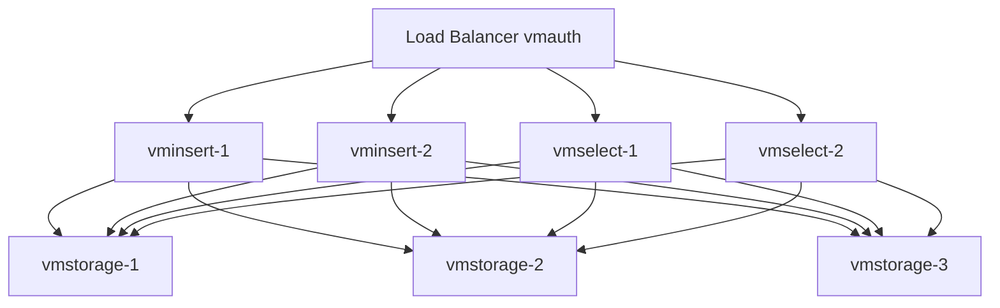

**推荐配置：**

- 每种服务至少 **2个节点**
- 宁可多个小 vmstorage 节点，而不是少数大节点
- 所有组件运行在同一子网（高带宽、低延迟、低错误率）

#### 3.3.3 自动发现 vmstorage（Enterprise）

**基于 DNS SRV：**

```bash
./vminsert -storageNode=srv+vmstorage-service

./vmselect -storageNode=srv+vmstorage-service
```

**基于文件：**

```bash
# vmstorage-list.txt
vmstorage-1:8400
vmstorage-2:8400
vmstorage-3:8400

./vminsert -storageNode=file:///path/to/vmstorage-list.txt

# 支持 HTTP URL
./vminsert -storageNode=file://http://config-server/vmstorage-list
```

**相关 Flag：**

| Flag                               | 说明               | 默认值 |
| ---------------------------------- | ------------------ | ------ |
| `-storageNode.discoveryInterval` | 刷新间隔           | `2s` |
| `-storageNode.filter`            | 地址过滤正则表达式 | `""` |

**监控指标：**

- `vm_rpc_vmstorage_is_reachable`：vmstorage 是否可达
- `vm_rpc_vmstorage_is_read_only`：vmstorage 是否只读

---

### 3.4 集群可用性

#### 3.4.1 可用性定义

VictoriaMetrics 集群在部分组件不可用时仍能继续接受数据和处理查询，优先**可用性**而非**一致性**。

#### 3.4.2 可用性条件

| 组件                 | 可用性要求           | 说明                                             |
| -------------------- | -------------------- | ------------------------------------------------ |
| **负载均衡器** | 停止路由到不可用节点 | vmauth 自动实现                                  |
| **vminsert**   | 至少 1 个节点可用    | 有足够 CPU、RAM、网络带宽处理写入负载            |
| **vmselect**   | 至少 1 个节点可用    | 有足够 CPU、RAM、网络带宽、磁盘 I/O 处理查询负载 |
| **vmstorage**  | 至少 1 个节点可用    | 有足够 CPU、RAM、网络带宽、磁盘 I/O、磁盘空间    |

#### 3.4.3 vmstorage 不可用时的行为

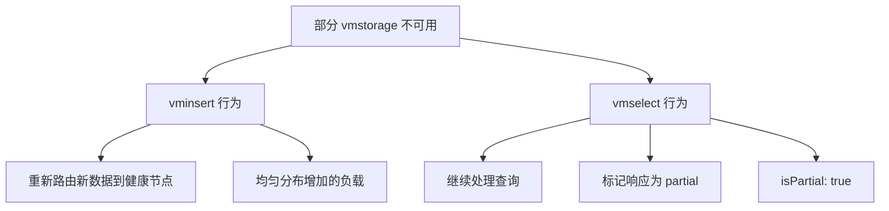

**vminsert 的重新路由：**

- 自动将数据从不可用节点重新路由到健康节点
- 健康节点将承受更高的资源使用和活跃时序数

**vmselect 的部分响应：**

- 至少一个 vmstorage 可用时继续服务查询
- 响应包含 `"isPartial": true` 字段
- 可能缺少存储在不可用节点上的历史数据

**禁用部分响应：**

```bash
# 启动时禁用
./vmselect -search.denyPartialResponse

# 查询时禁用
curl 'http://vmselect:8481/.../query?deny_partial_response=1'
```

> [!NOTE]
> 以下端点不返回部分响应（用户期望完整数据）：
>
> - `/api/v1/export*` 端点
> - `/api/v1/query?query=up[1h]` (返回原始样本)

---

### 3.5 数据复制（Replication）

#### 3.5.1 配置复制

**vminsert 端：**

```bash
./vminsert \
  -storageNode=vmstorage-1:8400,vmstorage-2:8400,vmstorage-3:8400 \
  -replicationFactor=2
```

**效果：**

- 每个样本存储 **2份副本** 到不同的 vmstorage 节点
- 最多可容忍 `N-1` 个 vmstorage 节点不可用

**vmselect 端：**

```bash
./vmselect \
  -storageNode=vmstorage-1:8401,vmstorage-2:8401,vmstorage-3:8401 \
  -replicationFactor=2 \
  -dedup.minScrapeInterval=1ms
```

**说明：**

- `-replicationFactor=2`：少于 2 个 vmstorage 不可用时不标记为 partial
- `-dedup.minScrapeInterval=1ms`：去重副本数据

#### 3.5.2 最小节点数

对于复制因子 `N`，集群至少需要 **`2*N-1`** 个 vmstorage 节点。

| 复制因子 | 最小 vmstorage 节点数 | 容错能力     |
| -------- | --------------------- | ------------ |
| 1        | 1                     | 0 个节点故障 |
| 2        | 3                     | 1 个节点故障 |
| 3        | 5                     | 2 个节点故障 |

#### 3.5.3 复制的成本

> [!WARNING]
> 复制会将资源使用增加 **最多 N 倍**：
>
> - CPU
> - RAM
> - 磁盘空间
> - 网络带宽

**替代方案（推荐）：**
使用复制持久盘，如 Google Compute Engine persistent disk，提供：

- 数据持久性保护
- 数据损坏保护
- 一致的高性能
- 无需停机即可调整大小
- 通常基于 HDD 即可满足大多数场景

---

### 3.6 去重（Deduplication）

集群版与单机版的去重机制相同，但有以下例外：

**去重无法保证的场景：**

1. 添加/移除 vmstorage 节点（时序重新路由到其他节点）
2. vmstorage 节点临时不可用（数据重新路由）
3. vmstorage 节点容量不足（数据重新路由）

**配置建议：**

```bash
# vmstorage
./vmstorage -dedup.minScrapeInterval=30s

# vmselect
./vmselect -dedup.minScrapeInterval=30s
```

推荐在 vmselect 和 vmstorage 设置相同的值以确保查询结果一致性。

---

### 3.7 多级集群（Multi-level Cluster）

#### 3.7.1 vmselect 多级链接

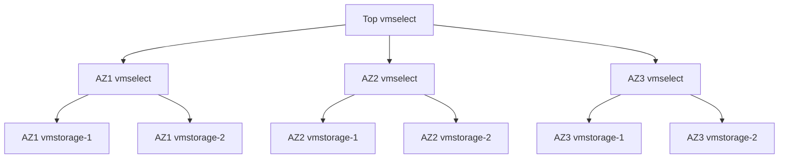

**配置二级 vmselect：**

```bash
# 一级 vmselect（每个 AZ）
./vmselect \
  -storageNode=az1-vmstorage-1:8401,az1-vmstorage-2:8401 \
  -clusternativeListenAddr=:8401

# 顶级 vmselect
./vmselect \
  -storageNode=az1-vmselect:8401,az2-vmselect:8401,az3-vmselect:8401
```

#### 3.7.2 vminsert 多级链接

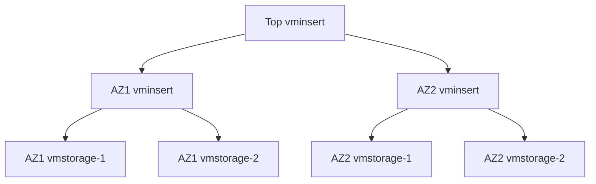

**配置：**

```bash
# 二级 vminsert（每个 AZ）
./vminsert \
  -storageNode=az1-vmstorage-1:8400,az1-vmstorage-2:8400 \
  -clusternativeListenAddr=:8400

# 顶级 vminsert
./vminsert \
  -storageNode=az1-vminsert:8400,az2-vminsert:8400
```

**缺点：**

1. 数据摄入速度受限于最慢的 AZ 链路
2. AZ 临时不可用时，数据会重新路由到其他 AZ，导致数据缺口

**推荐方案：**
使用 **vmagent** 在 AZ 前复制/分片数据流：

- AZ 临时不可用时，vmagent 缓冲数据到磁盘（`--remoteWrite.maxDiskUsagePerURL`）
- 无需影响其他 AZ
- AZ 恢复后自动发送缓冲数据

---

### 3.8 vmstorage 分组

#### 3.8.1 独立复制因子

```bash
./vmselect \
  -replicationFactor=2 \
  -storageNode=g1/host1,g1/host2,g1/host3 \
  -storageNode=g2/host4,g2/host5,g2/host6 \
  -storageNode=g3/host7,g3/host8,g3/host9
```

**效果：**

- 每个组独立应用 `-replicationFactor=2`
- 最多容忍每组 1 个节点不可用

#### 3.8.2 每组不同复制因子

```bash
./vmselect \
  -replicationFactor=g1:3 \
  -storageNode=g1/host1,g1/host2,g1/host3 \
  -replicationFactor=g2:2 \
  -storageNode=g2/host4,g2/host5,g2/host6 \
  -replicationFactor=g3:1 \
  -storageNode=g3/host7,g3/host8,g3/host9
```

#### 3.8.3 全局复制因子

```bash
./vmselect \
  -globalReplicationFactor=2 \
  -storageNode=g1/host1,g1/host2,g1/host3 \
  -storageNode=g2/host4,g2/host5,g2/host6 \
  -storageNode=g3/host7,g3/host8,g3/host9
```

**效果：**

- 最多容忍 1 个完整的 vmstorage 组不可用

#### 3.8.4 混合使用

```bash
./vmselect \
  -globalReplicationFactor=2 \
  -replicationFactor=3 \
  -storageNode=g1/host1,g1/host2,g1/host3 \
  -storageNode=g2/host4,g2/host5,g2/host6 \
  -storageNode=g3/host7,g3/host8,g3/host9
```

**效果：**

- 容忍 1 个完整组不可用
- 剩余组中每组最多容忍 2 个节点不可用

---

### 3.9 集群扩容与重新平衡

#### 3.9.1 垂直扩展 vs 水平扩展

| 扩展类型           | 方法                             | 优势                                               |
| ------------------ | -------------------------------- | -------------------------------------------------- |
| **垂直扩展** | 增加单节点资源（CPU、RAM、磁盘） | 提升单个查询性能、增加活跃时序容量                 |
| **水平扩展** | 增加节点数量                     | 提升集群稳定性、改善高流失率查询性能、提高并发能力 |

#### 3.9.2 扩容建议

**添加 vmstorage 节点：**

1. 提高活跃时序容量
2. 改善高流失率时序查询性能
3. 提升集群稳定性（节点故障时负载增加更小）

**添加 vminsert 节点：**

- 提高数据摄入速度

**添加 vmselect 节点：**

- 提高查询并发处理能力

#### 3.9.3 添加 vmstorage 节点步骤

```bash
# 1. 启动新 vmstorage 节点
./vmstorage \
  -retentionPeriod=90d \
  -storageDataPath=/var/lib/vmstorage-new

# 2. 逐步重启所有 vmselect 节点
./vmselect \
  -storageNode=old1:8401,old2:8401,new1:8401

# 3. 逐步重启所有 vminsert 节点
./vminsert \
  -storageNode=old1:8400,old2:8400,new1:8400
```

#### 3.9.4 重新平衡策略

**默认行为：**

- 新数据均匀分布到所有节点（包括新节点）
- 历史数据保留在旧节点

**优势：**

- 无需网络带宽、磁盘 I/O、CPU 用于数据重新平衡
- 避免重新平衡期间的故障问题
- 支持灵活的集群方案（不同 vminsert 节点写入不同 vmstorage 子集）

**手动重新平衡方法：**

1. **等待历史数据自动删除**（根据 retention）
2. **临时只写新节点**：

   ```bash
   # vminsert（只写新节点）
   ./vminsert -storageNode=new1:8400,new2:8400

   # vmselect（读所有节点）
   ./vmselect -storageNode=old1:8401,old2:8401,new1:8401,new2:8401
   ```

   等待新旧节点数据量相等后，重新配置 vminsert 包含所有节点。

---

### 3.10 集群更新与配置变更

#### 3.10.1 零停机滚动更新

```bash
# 推荐顺序
# 1. 逐个重启 vmstorage 节点
kill -INT <vmstorage-pid>
# 等待进程优雅退出
./vmstorage <new-flags>

# 2. 逐个重启 vminsert 节点
kill -INT <vminsert-pid>
./vminsert <new-flags>

# 3. 逐个重启 vmselect 节点
kill -INT <vmselect-pid>
./vmselect <new-flags>
```

**前提条件：**

1. 每种组件至少有 2 对节点（高可用）
2. 有足够的计算资源处理单节点临时不可用的负载
3. 新配置/版本与现有组件兼容

#### 3.10.2 最小停机时间更新

```bash
# 1. 并行停止所有 vminsert 和 vmselect
kill -INT <all-vminsert-pids>
kill -INT <all-vmselect-pids>

# 2. 并行重启所有 vmstorage
kill -INT <all-vmstorage-pids>
# 等待所有进程退出
./vmstorage <new-flags> &  # 所有节点并行启动

# 3. 并行启动所有 vminsert 和 vmselect
./vminsert <new-flags> &
./vmselect <new-flags> &
```

**适用场景：**

- 版本不兼容
- 资源不足以滚动更新
- 大规模集群需要快速更新

#### 3.10.3 优化滚动重启性能

**减少重新路由负载：**

```bash
# vminsert：暂停摄入而不是重新路由
./vminsert -disableReroutingOnUnavailable

# vmstorage：增加连接优雅关闭时间（v1.95.0+）
./vmstorage -storage.vminsertConnsShutdown Duration=120s
```

> [!WARNING]
> 确保 `-storage.vminsertConnsShutdownDuration` **小于**系统的优雅关闭超时（Docker、Kubernetes、systemd）。

---

### 3.11 资源使用限制

#### 3.11.1 全局限制

| Flag                       | 说明                                  | 适用组件 |
| -------------------------- | ------------------------------------- | -------- |
| `-memory.allowedPercent` | 缓存可使用的系统内存百分比（默认 60） | 所有组件 |
| `-memory.allowedBytes`   | 缓存可使用的字节数（覆盖 percent）    | 所有组件 |

#### 3.11.2 vmselect 查询限制

| Flag                              | 默认值   | 说明                       |
| --------------------------------- | -------- | -------------------------- |
| `-search.maxMemoryPerQuery`     | 自动计算 | 单个查询最大内存           |
| `-search.maxQueryDuration`      | `30s`  | 查询最大执行时间           |
| `-search.maxConcurrentRequests` | 自动计算 | 最大并发查询数             |
| `-search.maxQueueDuration`      | `10s`  | 查询队列最大等待时间       |
| `-search.maxUniqueTimeseries`   | 自动计算 | 限制单个查询可处理的时序数 |
| `-search.maxWorkersPerQuery`    | 自动计算 | 单个查询可用的 CPU 核数    |

#### 3.11.3 vmstorage 限制

| Flag                              | 说明                                    | 适用组件            |
| --------------------------------- | --------------------------------------- | ------------------- |
| `-search.maxUniqueTimeseries`   | 单个查询可处理的时序数                  | vmstorage           |
| `-search.maxConcurrentRequests` | 最大并发请求数                          | vmstorage           |
| `-search.maxQueueDuration`      | 查询队列最大等待时间                    | vmstorage           |
| `-search.maxTagKeys`            | `/api/v1/labels` 最大返回数           | vmstorage、vmselect |
| `-search.maxTagValues`          | `/api/v1/label/.../values` 最大返回数 | vmstorage、vmselect |

#### 3.11.4 基数限制

```bash
# vmstorage
./vmstorage \
  -storage.maxHourlySeries=1000000 \
  -storage.maxDailySeries=10000000
```

> [!NOTE]
> 集群级别的限制 = 单节点限制 × vmstorage 节点数

---

### 3.12 企业特性

#### 3.12.1 保留期过滤器（Retention Filters）

```bash
# vmstorage
./vmstorage \
  -retentionFilter='{vm_account_id=~"42.*"}:1d' \
  -retentionFilter='{env=~"dev|staging"}:3d' \
  -retentionPeriod=4w
```

**效果：**

- `vm_account_id` 以 `42` 开头的租户：1 天保留期
- `env="dev"` 或 `env="staging"` 的时序：3 天保留期
- 其他：4 周保留期

**混合真实标签与伪标签：**

```bash
-retentionFilter='{vm_account_id="5",env="dev"}:5d'
```

#### 3.12.2 降采样（Downsampling）

```bash
# vmstorage 和 vmselect 都需要设置
./vmstorage \
  -downsampling.period='{vm_account_id=~"12|42"}:1h:1m'

./vmselect \
  -downsampling.period='{vm_account_id=~"12|42"}:1h:1m'
```

**效果：**

- `accountID=12` 或 `42` 的租户：1 小时后每分钟保留最后一个样本
- 其他租户：数据被丢弃

**混合标签：**

```bash
-downsampling.period='{vm_account_id="5",env="dev"}:30d:1h'
```

> [!IMPORTANT]
> vmselect 和 vmstorage 必须设置相同的 `-downsampling.period` 值以确保查询结果一致。

---

### 3.13 安全配置

#### 3.13.1 通用安全建议

1. **网络隔离**：所有集群组件运行在受保护的私有网络
2. **认证代理**：外部客户端通过 vmauth 或 vmgateway 访问
3. **HTTPS**：仅通过 HTTPS 接受 auth token
4. **租户隔离**：不同租户使用不同的 auth token
5. **API 白名单**：配置允许的 API 端点列表

#### 3.13.2 mTLS 保护（Enterprise）

**HTTP 端点 mTLS：**

```bash
# vminsert
./vminsert -tls -mtls

# vmselect
./vmselect -tls -mtls
```

**集群内部通信 mTLS：**

```bash
# vminsert
./vminsert \
  -cluster.tls \
  -cluster.tlsCertFile=/path/to/cert.pem \
  -cluster.tlsKeyFile=/path/to/key.pem

# vmselect
./vmselect \
  -cluster.tls \
  -cluster.tlsCertFile=/path/to/cert.pem \
  -cluster.tlsKeyFile=/path/to/key.pem

# vmstorage
./vmstorage \
  -cluster.tls \
  -cluster.tlsCertFile=/path/to/cert.pem \
  -cluster.tlsKeyFile=/path/to/key.pem
```

**多级集群 mTLS：**

```bash
# 二级 vmselect
./vmselect \
  -clusternativeListenAddr=:8401 \
  -clusternative.tls \
  -clusternative.tlsCertFile=/path/to/cert.pem \
  -clusternative.tlsKeyFile=/path/to/key.pem
```

---

### 3.14 URL 格式总览

#### 3.14.1 数据摄入端点

**基础格式：** `http://vminsert:8480/insert/<accountID>/<suffix>`

| Suffix                                  | 协议                    | 说明                       |
| --------------------------------------- | ----------------------- | -------------------------- |
| `prometheus/api/v1/write`             | Prometheus remote write | 推荐                       |
| `prometheus/api/v1/import`            | JSON line               | 从 vmselect 导出的数据     |
| `prometheus/api/v1/import/native`     | Native binary           | VictoriaMetrics 原生格式   |
| `prometheus/api/v1/import/csv`        | CSV                     | 任意 CSV 数据              |
| `prometheus/api/v1/import/prometheus` | Prometheus exposition   | Text/OpenMetrics 格式      |
| `opentelemetry/v1/metrics`            | OpenTelemetry           | OTLP metrics               |
| `datadog/api/v2/series`               | DataDog                 | DataDog submit metrics API |
| `influx/write`                        | InfluxDB line protocol  | HTTP                       |
| `opentsdb/api/put`                    | OpenTSDB HTTP           | `/api/put`               |

#### 3.14.2 查询端点

**基础格式：** `http://vmselect:8481/select/<accountID>/prometheus/<suffix>`

| Suffix                           | 说明                      |
| -------------------------------- | ------------------------- |
| `api/v1/query`                 | 即时查询（Instant query） |
| `api/v1/query_range`           | 范围查询（Range query）   |
| `api/v1/series`                | 时序查询                  |
| `api/v1/labels`                | 标签名列表                |
| `api/v1/label/<name>/values`   | 标签值列表                |
| `api/v1/export`                | 导出为 JSON line          |
| `api/v1/export/native`         | 导出为 native binary      |
| `api/v1/export/csv`            | 导出为 CSV                |
| `api/v1/status/tsdb`           | 时序统计信息              |
| `api/v1/status/active_queries` | 当前执行的查询            |
| `api/v1/status/top_queries`    | 最频繁/最慢的查询         |

#### 3.14.3 其他端点

| 端点                                                                                   | 说明          |
| -------------------------------------------------------------------------------------- | ------------- |
| `http://vmselect:8481/select/<accountID>/vmui/`                                      | VMUI Web 界面 |
| `http://vmselect:8481/admin/tenants`                                                 | 列出所有租户  |
| `http://vmselect:8481/delete/<accountID>/prometheus/api/v1/admin/tsdb/delete_series` | 删除时序      |
| `http://vmstorage:8482/snapshot/create`                                              | 创建快照      |
| `http://vmstorage:8482/snapshot/list`                                                | 列出快照      |
| `http://vmstorage:8482/snapshot/delete?snapshot=<id>`                                | 删除快照      |

---

### 3.15 容量规划

#### 3.15.1 资源建议

| 资源类型           | 推荐空闲量 | 原因                             |
| ------------------ | ---------- | -------------------------------- |
| **RAM**      | 50%        | 应对临时负载峰值、避免 OOM       |
| **CPU**      | 50%        | 应对临时负载峰值、避免查询超时   |
| **磁盘空间** | ≥ 20%     | vmstorage 后台合并和月度去重需要 |

#### 3.15.2 存储空间估算

**公式：**

```
所需空间 = 测试期间磁盘使用量 × (保留期天数 / 测试天数) × vmstorage节点数 × (1 + 0.2)
```

**示例：**

- 单个 vmstorage 测试 1 天后使用 10GB
- 保留期 = 90 天
- vmstorage 节点数 = 3
- 所需存储：`10GB × 90 × 3 × 1.2 = 3.24TB`

#### 3.15.3 特殊考虑

**月度最终去重：**

- 每月月初，vmstorage 会进行最终去重
- 临时需要上个月数据量大小的磁盘空间
- 如 3 个月保留期，建议预留 **35%** 空间

**只读模式触发：**

- 当 vmstorage 磁盘空间 < `-storage.minFreeDiskSpaceBytes`
- vminsert 停止写入该节点，重新路由到其他节点
- 监控指标：`vm_storage_is_read_only`

---

### 3.16 监控指标

#### 3.16.1 组件端口

| 组件      | 监控端口 | 端点         |
| --------- | -------- | ------------ |
| vminsert  | `8480` | `/metrics` |
| vmselect  | `8481` | `/metrics` |
| vmstorage | `8482` | `/metrics` |

#### 3.16.2 Grafana 仪表板

官方仪表板：[https://grafana.com/grafana/dashboards/11176](https://grafana.com/grafana/dashboards/11176)

#### 3.16.3 关键监控指标

| 指标                                      | 说明                             |
| ----------------------------------------- | -------------------------------- |
| `vm_rpc_vmstorage_is_reachable`         | vmstorage 节点是否可达           |
| `vm_rpc_vmstorage_is_read_only`         | vmstorage 是否只读模式           |
| `vm_storage_is_read_only`               | vmstorage 是否进入只读模式       |
| `vm_free_disk_space_bytes`              | vmstorage 可用磁盘空间           |
| `vm_rows_ignored_total`                 | 被忽略的行数（标签超长、超限等） |
| `vm_hourly_series_limit_current_series` | 当前小时唯一时序数               |
| `vm_daily_series_limit_current_series`  | 当前day唯一时序数                |

---

### 3.17 集群 vs 单机对比

| 特性                 | 单机版                | 集群版                                        |
| -------------------- | --------------------- | --------------------------------------------- |
| **多租户**     | 不支持                | 支持，通过 accountID/projectID                |
| **水平扩展**   | 不支持                | 支持，可添加 vminsert/vmselect/vmstorage 节点 |
| **垂直扩展**   | 支持                  | 支持                                          |
| **复制**       | 依赖存储层            | 应用层复制（`-replicationFactor`）          |
| **高可用**     | 通过vmagent多副本写入 | 内置高可用                                    |
| **配置复杂度** | 低                    | 中等                                          |
| **适用场景**   | < 100万 samples/s     | >= 100万 samples/s，多租户需求                |

---

### 3.18 常见问题与故障排查

#### 3.18.1 为什么不自动重新平衡数据？

**原因：**

1. 避免网络、磁盘 I/O、CPU 浪费
2. 避免重新平衡期间的潜在故障风险
3. 支持灵活的集群拓扑

**解决方案：**
见 [3.9.4 重新平衡策略](#394-重新平衡策略)

#### 3.18.2 集群不稳定

**诊断步骤：**

1. 检查网络延迟：`-rpc.handshakeTimeout` 是否足够
2. 检查 vmstorage 磁盘空间：是否 < 20%
3. 检查 vmstorage 是否只读：`vm_storage_is_read_only`
4. 检查 CPU/RAM 使用率

**解决方案：**

- 增加 `-rpc.handshakeTimeout`（默认 5s）
- 增加磁盘空间
- 增加 CPU/RAM
- 增加 vmstorage 节点数

#### 3.18.3 查询性能慢

**可能原因与解决方案：**

| 原因                   | 解决方案                                        |
| ---------------------- | ----------------------------------------------- |
| vmselect 资源不足      | 增加 vmselect 节点或 CPU/RAM                    |
| vmstorage 压缩占用 CPU | 禁用压缩：`vmstorage -rpc.disableCompression` |
| 并发查询过多           | 调整 `-search.maxConcurrentRequests`          |
| 重查询                 | 增加 `-search.maxWorkersPerQuery`             |

---

### 3.19 Flag 参数速查

#### 3.19.1 vminsert 核心 Flag

| Flag                               | 默认值        | 说明                                     |
| ---------------------------------- | ------------- | ---------------------------------------- |
| `-storageNode`                   | 无            | vmstorage 节点地址列表                   |
| `-replicationFactor`             | `1`         | 复制因子                                 |
| `-disableRerouting`              | `true`      | 禁用重新路由（降低滚动重启时的活跃时序） |
| `-disableReroutingOnUnavailable` | `false`     | 节点不可用时禁用重新路由                 |
| `-dropSamplesOnOverload`         | `false`     | 节点过载时丢弃样本而非重新路由           |
| `-maxConcurrentInserts`          | `2*CPU核数` | 最大并发写入请求数                       |

#### 3.19.2 vmselect 核心 Flag

| Flag                            | 默认值    | 说明                                          |
| ------------------------------- | --------- | --------------------------------------------- |
| `-storageNode`                | 无        | vmstorage 节点地址列表                        |
| `-replicationFactor`          | `1`     | 复制因子（部分响应判断）                      |
| `-globalReplicationFactor`    | `1`     | 全局复制因子                                  |
| `-search.denyPartialResponse` | `false` | 禁止部分响应                                  |
| `-search.skipSlowReplicas`    | `false` | 跳过慢副本（需要 `-replicationFactor > 1`） |
| `-dedup.minScrapeInterval`    | `0`     | 去重间隔                                      |
| `-cacheDataPath`              | `""`    | 缓存和临时查询结果路径                        |

#### 3.19.3 vmstorage 核心 Flag

| Flag                                       | 默认值                    | 说明                              |
| ------------------------------------------ | ------------------------- | --------------------------------- |
| `-retentionPeriod`                       | `1` (月)                | 数据保留期                        |
| `-storageDataPath`                       | `victoria-metrics-data` | 数据存储路径                      |
| `-vminsertAddr`                          | `:8400`                 | vminsert 连接地址                 |
| `-vmselectAddr`                          | `:8401`                 | vmselect 连接地址                 |
| `-httpListenAddr`                        | `:8482`                 | HTTP 监听地址                     |
| `-storage.minFreeDiskSpaceBytes`         | `10MB`                  | 最小可用磁盘空间                  |
| `-rpc.disableCompression`                | `false`                 | 禁用 vmstorage→vmselect 数据压缩 |
| `-storage.vminsertConnsShutdownDuration` | `25s`                   | vminsert 连接优雅关闭时间         |

---

**🎯 第 3 章完成！** 下一步将继续学习 vmagent 组件...

---
