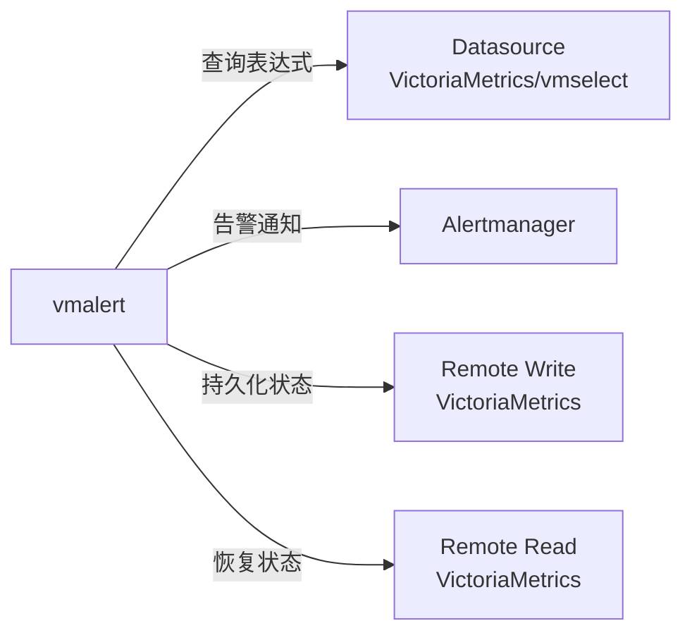
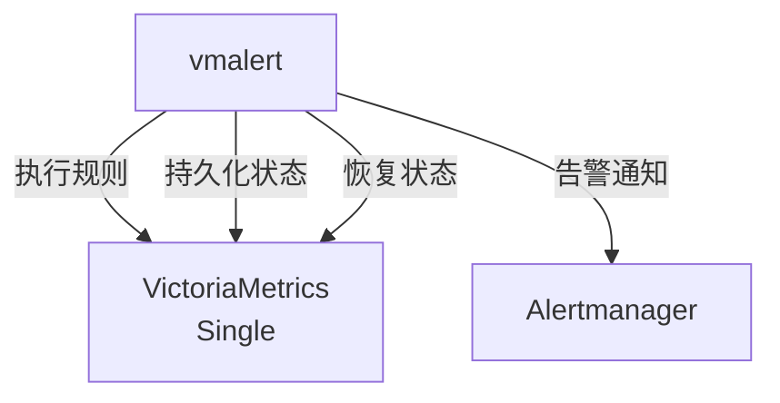
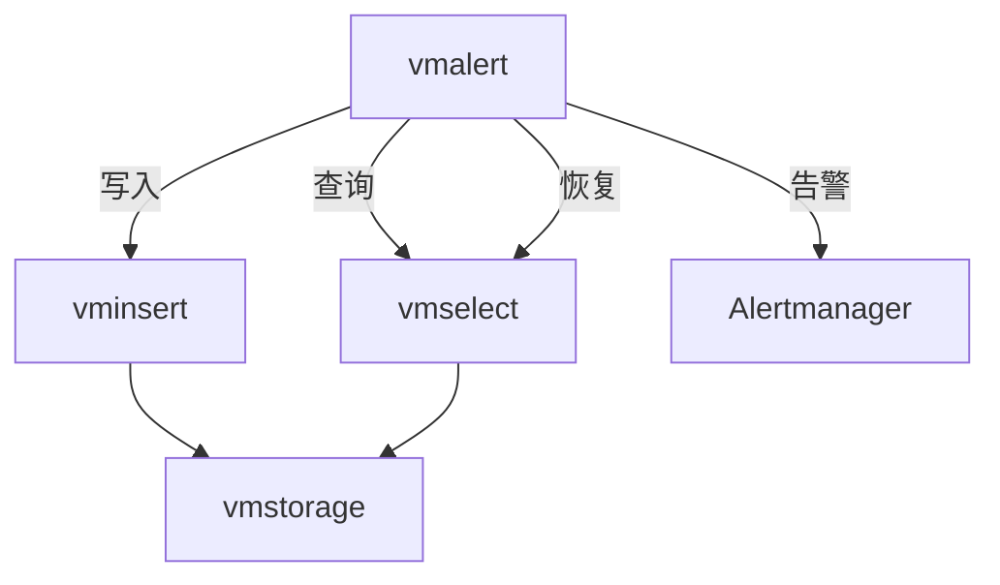
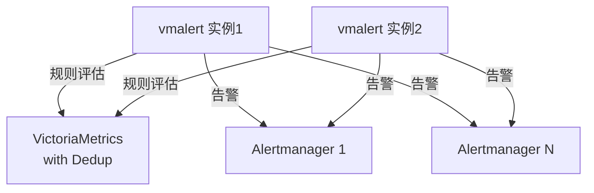
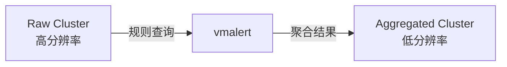
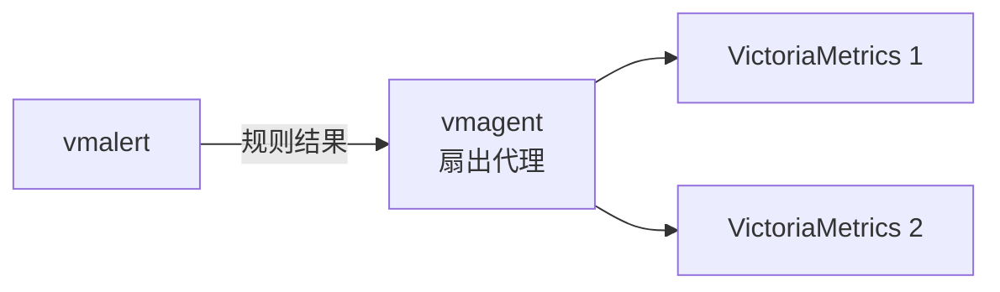
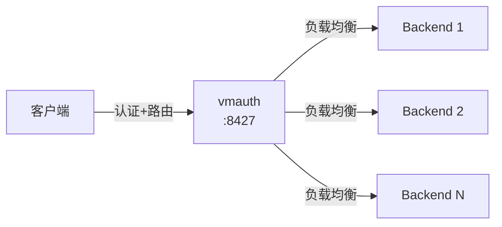

# VictoriaMetrics 学习笔记 · 第二册：采集、告警与认证

## 第 4 章：vmagent - 数据代理与采集

### 4.1 vmagent 概述

**vmagent** 是一个轻量级的指标采集代理，负责从多种数据源收集指标，进行重新标记（relabeling）、过滤、聚合，然后发送到 VictoriaMetrics 或其他兼容 Prometheus remote_write 协议的存储系统。

**核心功能：**

- **Pull 模式**：抓取 Prometheus 兼容的 exporter
- **Push 模式**：接受多种协议推送的数据（InfluxDB、OpenTSDB、Graphite、DataDog、OpenTelemetry等）
- **数据转换**：重新标记、过滤、聚合
- **高可用**：支持数据复制和分片
- **流式聚合**：stream aggregation 减少存储和网络开销
- **缓冲机制**：远程存储不可用时缓冲到磁盘
- **低资源占用**：比 Prometheus 使用更少的 RAM、CPU、磁盘 I/O
- **大规模抓取**：支持集群模式分片抓取
- **多租户写入**：支持向 VictoriaMetrics 集群多租户端点写入
- **Kafka/PubSub 集成**（Enterprise）

---

### 4.2 使用场景

| 场景                      | 说明                                              |
| ------------------------- | ------------------------------------------------- |
| **IoT/边缘监控**    | 不稳定网络环境中缓冲数据，连接恢复后发送          |
| **Prometheus 替代** | 只负责抓取+转发，资源占用更低                     |
| **statsd 替代**     | 启用流式聚合后可替代 statsd                       |
| **灵活指标中继**    | 接受多种格式，relabel 后转发                      |
| **高可用+复制**     | 向多个存储系统复制数据                            |
| **分片存储**        | 使用 `-remoteWrite.shardByURL` 在多个存储间分片 |

---

### 4.3 快速开始

```bash
# 仅接收 Push 数据
./vmagent -remoteWrite.url=http://victoria-metrics:8428/api/v1/write

# 抓取 Prometheus 目标并转发
./vmagent \
  -promscrape.config=prometheus.yml \
  -remoteWrite.url=http://victoria-metrics:8428/api/v1/write

# 写入集群
./vmagent \
  -remoteWrite.url=http://vminsert:8480/insert/0/prometheus/api/v1/write
```

**核心 Flag：**

- `-promscrape.config`：Prometheus 配置文件路径
- `-remoteWrite.url`：远程存储地址（可多个）
- `-remoteWrite.tmpDataPath`：缓冲数据路径（默认 `vmagent-remotewrite-data`）
- `-remoteWrite.maxDiskUsagePerURL`：每 URL 最大磁盘使用（0=无限）

---

### 4.4 数据处理管道

**样本处理流程：**

1. **摄入速率限制**：`-maxIngestionRate`
2. **全局 Relabeling**：`-remoteWrite.relabelConfig`
3. **复杂度限制**：`-maxLabelsPerTimeseries`、`-maxLabelNameLen/ValueLen`
4. **基数限制**：`-remoteWrite.maxHourlySeries/maxDailySeries`
5. **全局聚合**：`-streamAggr.config`、`-streamAggr.dedupInterval`
6. **复制/分片**：根据 `-remoteWrite.shardByURL` 决定
7. **Per-URL Relabeling**：`-remoteWrite.urlRelabelConfig`
8. **Per-URL 聚合**：`-remoteWrite.streamAggr.config`
9. **Per-URL 额外标签**：`-remoteWrite.label`
10. **队列缓冲**：缓冲到磁盘（除非 `-remoteWrite.disableOnDiskQueue`）
11. **发送**：push 到 `-remoteWrite.url`

---

### 4.5 数据重新标记（Relabeling）

#### 4.5.1 全局 Relabeling

```yaml
# relabel-global.yml
- target_label: env
  replacement: production
- action: drop
  source_labels: [__name__]
  regex: 'test_.*'
```

```bash
./vmagent \
  -remoteWrite.url=http://storage:8428/api/v1/write \
  -remoteWrite.relabelConfig=relabel-global.yml
```

#### 4.5.2 Per-URL Relabeling

```bash
./vmagent \
  -remoteWrite.url=http://dev:8428/api/v1/write \
  -remoteWrite.urlRelabelConfig=relabel-dev.yml \
  -remoteWrite.url=http://prod:8428/api/v1/write \
  -remoteWrite.urlRelabelConfig=relabel-prod.yml
```

> **注意**：Flag 顺序很重要，第一个 `-remoteWrite.urlRelabelConfig` 对应第一个 `-remoteWrite.url`。

#### 4.5.3 添加额外标签

```bash
./vmagent \
  -remoteWrite.url=http://storage:8428/api/v1/write \
  -remoteWrite.label=datacenter=us-west \
  -remoteWrite.label=cluster=prod
```

---

### 4.6 数据复制与分片

#### 4.6.1 数据复制（默认）

```bash
./vmagent \
  -remoteWrite.url=http://storage1:8428/api/v1/write \
  -remoteWrite.url=http://storage2:8428/api/v1/write
```

**效果**：每个样本发送到所有存储系统。

#### 4.6.2 数据分片

```bash
./vmagent \
  -remoteWrite.shardByURL \
  -remoteWrite.url=http://storage1:8428/api/v1/write \
  -remoteWrite.url=http://storage2:8428/api/v1/write
```

**效果**：每个时序路由到单个存储系统（一致性哈希）。

#### 4.6.3 分片+复制

```bash
./vmagent \
  -remoteWrite.shardByURL \
  -remoteWrite.shardByURLReplicas=2 \
  -remoteWrite.url=http://storage1:8428/api/v1/write \
  -remoteWrite.url=http://storage2:8428/api/v1/write \
  -remoteWrite.url=http://storage3:8428/api/v1/write
```

**效果**：每个样本发送到 2 个不同的存储系统。

---

### 4.7 流式聚合

```yaml
# stream-aggr.yml
- match: 'http_requests_total'
  interval: 1m
  outputs: [total, increase]
```

```bash
./vmagent \
  -remoteWrite.url=http://storage:8428/api/v1/write \
  -streamAggr.config=stream-aggr.yml \
  -streamAggr.dedupInterval=60s
```

**去重示例**：

```bash
# 合并不同 replica 标签的时序，每 60 秒保留最后一个样本
./vmagent \
  -remoteWrite.url=http://storage:8428/api/v1/write \
  -streamAggr.dropInputLabels=replica \
  -streamAggr.dedupInterval=60s
```

---

### 4.8 多租户

#### 4.8.1 单租户写入

```bash
./vmagent \
  -remoteWrite.url=http://vminsert:8480/insert/42/prometheus/api/v1/write
```

#### 4.8.2 多租户写入（基于标签）

```yaml
# relabel.yml
- source_labels: [__meta_kubernetes_pod_annotation_prometheus_io_account_id]
  target_label: vm_account_id
```

```bash
./vmagent \
  -promscrape.config=prometheus.yml \
  -remoteWrite.relabelConfig=relabel.yml \
  -remoteWrite.url=http://vminsert:8480/insert/multitenant/prometheus/api/v1/write
```

---

### 4.9 集群模式（分片抓取）

```bash
# vmagent 实例 0（共 3 个）
./vmagent \
  -promscrape.config=prometheus.yml \
  -promscrape.cluster.membersCount=3 \
  -promscrape.cluster.memberNum=0 \
  -remoteWrite.url=http://storage:8428/api/v1/write

# vmagent 实例 1
./vmagent \
  -promscrape.cluster.membersCount=3 \
  -promscrape.cluster.memberNum=1 \
  ...
```

**高可用（复制抓取）：**

```bash
./vmagent \
  -promscrape.cluster.membersCount=6 \
  -promscrape.cluster.replicationFactor=2 \
  -promscrape.cluster.memberNum=0
```

**注意**：远程存储端需启用去重 `-dedup.minScrapeInterval`。

---

### 4.10 自动生成的指标

| 指标                                    | 说明                           |
| --------------------------------------- | ------------------------------ |
| `up`                                  | `1`=抓取成功，`0`=抓取失败 |
| `scrape_duration_seconds`             | 抓取耗时                       |
| `scrape_samples_scraped`              | 抓取的样本数                   |
| `scrape_series_added`                 | 新增时序数（估计）             |
| `scrape_series_current`               | 当前唯一时序数                 |
| `scrape_series_limit_samples_dropped` | 因超限丢弃的样本数             |

---

### 4.11 基数限制

#### Per-Target 限制

```bash
./vmagent -promscrape.seriesLimitPerTarget=10000
```

```yaml
scrape_configs:
  - job_name: 'high-cardinality'
    series_limit: 50000
```

#### 全局基数限制

```bash
./vmagent \
  -remoteWrite.maxHourlySeries=1000000 \
  -remoteWrite.maxDailySeries=10000000
```

---

### 4.12 磁盘持久化

**默认启用**：

```bash
./vmagent \
  -remoteWrite.tmpDataPath=vmagent-remotewrite-data \
  -remoteWrite.maxDiskUsagePerURL=10GB
```

**禁用磁盘持久化**：

```bash
./vmagent \
  -remoteWrite.disableOnDiskQueue \
  -remoteWrite.dropSamplesOnOverload
```

**行为**：过载时返回 429 或静默丢弃样本。

---

### 4.13 VictoriaMetrics Remote Write 协议

**优势**：网络带宽/磁盘 I/O/空间 减少 2x-5x

```bash
./vmagent \
  -remoteWrite.url=http://vm:8428/api/v1/write \
  -remoteWrite.forceVMProto \
  -remoteWrite.vmProtoCompressLevel=5
```

- 压缩级别范围：`-22` 到 `22`（默认 `0`）

---

### 4.14 性能优化

#### 降低 RAM 使用

```bash
GOGC=100 ./vmagent \
  -memory.allowedBytes=2GB \
  -promscrape.dropOriginalLabels \
  -promscrape.noStaleMarkers
```

#### 降低 CPU 使用

```bash
GOMAXPROCS=2 ./vmagent \
  -promscrape.disableKeepAlive
```

#### 增加吞吐量

```bash
./vmagent \
  -remoteWrite.queues=8 \
  -remoteWrite.maxBlockSize=16MB
```

---

### 4.15 监控与排查

**关键端点：**

- `http://vmagent:8429/metrics`：Prometheus 指标
- `http://vmagent:8429/targets`：所有抓取目标及状态
- `http://vmagent:8429/service-discovery`：服务发现状态
- `http://vmagent:8429/config`：当前配置
- `http://vmagent:8429/ready`：健康检查

**Grafana 仪表板**：[https://grafana.com/grafana/dashboards/12683](https://grafana.com/grafana/dashboards/12683)

**关键监控指标：**

- `vmagent_remotewrite_pending_data_bytes`：待发送数据大小
- `vmagent_remotewrite_samples_dropped_total`：丢弃的样本数
- `vmagent_remotewrite_push_failures_total`：写入失败次数

---

### 4.16 配置重载

```bash
# 方法 1：SIGHUP 信号
kill -SIGHUP $(pidof vmagent)

# 方法 2：HTTP 端点
curl -X POST http://vmagent:8429/-/reload

# 方法 3：自动检查
./vmagent -promscrape.configCheckInterval=30s
```

---

### 4.17 高可用配置

```bash
# vmagent 实例 1
./vmagent \
  -promscrape.config=prometheus.yml \
  -promscrape.cluster.name=cluster1 \
  -remoteWrite.url=http://storage:8428/api/v1/write

# vmagent 实例 2
./vmagent \
  -promscrape.cluster.name=cluster2 \
  -remoteWrite.url=http://storage:8428/api/v1/write
```

**VictoriaMetrics 端去重：**

```bash
./victoria-metrics -dedup.minScrapeInterval=15s
```

---

### 4.18 核心 Flag 总览

| Category       | 重要 Flag                                                                                         |
| -------------- | ------------------------------------------------------------------------------------------------- |
| **核心** | `-promscrape.config`、`-remoteWrite.url`、`-remoteWrite.tmpDataPath`                        |
| **抓取** | `-promscrape.seriesLimitPerTarget`、`-promscrape.streamParse`、`-promscrape.noStaleMarkers` |
| **写入** | `-remoteWrite.queues`、`-remoteWrite.maxBlockSize`、`-remoteWrite.shardByURL`               |
| **限制** | `-remoteWrite.maxHourlySeries`、`-maxLabelsPerTimeseries`、`-maxIngestionRate`              |
| **集群** | `-promscrape.cluster.membersCount/memberNum/replicationFactor/name`                             |

---

### 4.19 最佳实践

- **资源优化**：根据环境调整内存/CPU/吞吐量参数
- **可靠性**：HA 部署+去重、设置磁盘缓冲上限、监控磁盘使用
- **安全**：网络隔离+认证（Basic Auth/Bearer Token/mTLS）+最小权限
- **可观测性**：Grafana 仪表板+告警+调试端点

---

**🎯 第 4 章完成！** 下一步将继续学习 vmalert 组件...

---

---

## 第 5 章：vmalert - 告警与记录规则组件

### 5.1 vmalert 概述

**核心定位**：vmalert 是 VictoriaMetrics 生态中的告警与记录规则执行引擎，负责：

- 执行告警规则（Alerting Rules）和记录规则（Recording Rules）
- 对接 Alertmanager 发送告警通知
- 将记录规则结果持久化到远程存储
- 兼容 Prometheus 告警规则语法

**与 Prometheus Alertmanager 的关系**：

- vmalert 本身不发送告警通知，而是依赖 Alertmanager
- 支持与 Alertmanager v0.16.0-alpha 及以上版本集成
- 可配置多个 Alertmanager 实例实现高可用

**架构特点**：



---

### 5.2 核心特性

#### 5.2.1 数据源集成

**支持的数据源类型**：

1. **VictoriaMetrics 与 MetricsQL**：原生支持，性能最佳
2. **VictoriaLogs 与 LogsQL**：支持日志数据的告警
3. **Graphite**：支持 Graphite 表达式的告警和记录规则
4. **任意 Prometheus HTTP API 兼容数据源**

**数据源配置示例**：

```bash
# 单节点 VictoriaMetrics
-datasource.url=http://victoria-metrics:8428

# 集群模式 vmselect
-datasource.url=http://vmselect:8481/select/0/prometheus

# Graphite 数据源（需设置类型前缀）
-datasource.appendTypePrefix=true
```

#### 5.2.2 告警状态持久化

**状态持久化机制**：

- vmalert 默认在内存中保存告警状态
- 重启会丢失所有活动告警状态
- 通过配置远程读写可实现状态持久化

**持久化配置**：

```bash
./vmalert \
  -remoteWrite.url=http://victoria-metrics:8428 \  # 持久化状态
  -remoteRead.url=http://victoria-metrics:8428      # 恢复状态
```

**持久化数据**：

- `ALERTS` - 当前活动的告警
- `ALERTS_FOR_STATE` - 告警的 `for` 状态时间信息
- 恢复条件：时间序列在最近 1 小时内有更新（由 `-remoteRead.lookback` 控制）

#### 5.2.3 其他核心特性

- ✅ 支持规则回填（Backfilling/Replay）
- ✅ 可重用的注解模板（Reusable Templates）
- ✅ 从多种来源加载规则：本地文件、URL、GCS、S3
- ✅ 检测从不触发的告警规则
- ✅ 轻量级无额外依赖

---

### 5.3 快速开始

#### 5.3.1 基本配置要求

**必需配置**：

1. **规则列表**（`-rule`）：PromQL/MetricsQL 表达式配置文件
2. **数据源地址**（`-datasource.url`）：支持 Prometheus HTTP API 的端点

**可选配置**：
3. **Notifier 地址**（`-notifier.url`）：Alertmanager 实例地址
4. **Remote Write 地址**（`-remoteWrite.url`）：持久化规则和状态
5. **Remote Read 地址**（`-remoteRead.url`）：恢复告警状态

#### 5.3.2 启动示例

```bash
# 构建 vmalert
git clone https://github.com/VictoriaMetrics/VictoriaMetrics
cd VictoriaMetrics
make vmalert

# 启动 vmalert
./bin/vmalert \
  -rule=alert.rules \                          # 规则文件路径（支持通配符）
  -datasource.url=http://localhost:8428 \      # 数据源
  -notifier.url=http://localhost:9093 \        # Alertmanager URL
  -notifier.url=http://127.0.0.1:9093 \        # Alertmanager 副本
  -remoteWrite.url=http://localhost:8428 \     # 持久化地址
  -remoteRead.url=http://localhost:8428 \      # 恢复地址
  -external.label=cluster=east-1 \             # 外部标签
  -external.label=replica=a                    # 多个外部标签
```

#### 5.3.3 配置验证

**语法验证**：

```bash
# 使用 -dryRun 验证配置文件语法
./vmalert -rule=alert.rules -dryRun
```

**区分多个 vmalert 实例**：

- 使用 `-external.label` 标识不同的 vmalert 实例
- 如果规则结果与外部标签冲突，自动添加 `exported_` 前缀

---

### 5.4 规则配置

#### 5.4.1 规则文件结构

**YAML 配置格式**：

```yaml
groups:
  - name: <group_name>          # 组名，文件内唯一
    interval: <duration>        # 评估间隔（默认使用 -evaluationInterval）
    rules:
      - <rule_spec>             # 规则定义
```

#### 5.4.2 Group（规则组）配置

**Group 属性**：

```yaml
groups:
  - name: my_alert_group        # 必需：组名
    interval: 30s               # 可选：评估间隔
    eval_offset: 5m             # 可选：评估时间偏移
    eval_delay: 30s             # 可选：补偿数据延迟
    limit: 1000                 # 可选：单规则结果数量限制
    concurrency: 4              # 可选：组内规则并发数（默认 1）
    type: prometheus            # 可选：规则类型（prometheus/graphite/vlogs）
    eval_alignment: true        # 可选：评估时间对齐（默认 true）
  
    # 可选：请求参数（应用于组内所有规则）
    params:
      nocache: ["1"]                     # 禁用缓存
      denyPartialResponse: ["true"]      # 拒绝部分响应
      extra_label: ["env=dev"]           # 额外标签过滤
  
    # 可选：HTTP 请求头
    headers:
      - "CustomHeader: foo"
  
    # 可选：告警通知头
    notifier_headers:
      - "TenantID: foo"
  
    # 可选：组级标签（高于外部标签）
    labels:
      env: production
      team: platform
  
    # 可选：调试模式
    debug: false
  
    rules:
      - ...
```

**重要参数说明**：

1. **`eval_offset`**：指定评估的精确时间偏移

   - 例如 `interval: 1h` + `eval_offset: 5m` → 在每小时的第 5 分钟评估
   - 与 `eval_delay` 互斥
2. **`eval_delay`**：补偿数据源的查询延迟

   - 默认继承自 `-rule.evalDelay`（默认 30s）
   - 建议与 VictoriaMetrics 的 `-search.latencyOffset` 保持一致
3. **`concurrency`**：组内规则并发执行数

   - 提高并发可缩短组的评估时长
   - 监控指标：`vmalert_iteration_duration_seconds`
4. **`eval_alignment`**（默认 `true`）：

   - 评估时间戳对齐到组的 interval
   - 使结果更可预测，与 Grafana/vmui 图表对齐

#### 5.4.3 告警规则（Alerting Rules）

**语法**：

```yaml
- alert: <alert_name>           # 告警名称，必须是有效的 metric 名称
  expr: <expression>            # 表达式，根据 type 使用 PromQL/MetricsQL/Graphite
  
  for: <duration>               # 可选：触发延迟（默认 0s）
  keep_firing_for: <duration>   # 可选：延迟告警解除（默认 0s）
  
  debug: <bool>                 # 可选：调试模式
  update_entries_limit: <int>   # 可选：状态更新条目数量限制
  
  labels:                       # 可选：添加/覆盖标签
    severity: warning
    team: platform
  
  annotations:                  # 可选：注解（可使用模板）
    summary: "Instance {{ $labels.instance }} down"
    description: "{{ $labels.job }} has been down for {{ $value }} seconds"
```

**告警规则示例**：

```yaml
groups:
  - name: instance_down
    interval: 30s
    rules:
      - alert: InstanceDown
        expr: up == 0
        for: 5m
        labels:
          severity: critical
        annotations:
          summary: "Instance {{ $labels.instance }} is down"
          description: "{{ $labels.job }} has been unavailable for over 5 minutes"
```

**重要参数说明**：

1. **`for`**：告警触发延迟

   - `for: 0` 或未设置：表达式返回结果立即触发
   - `for > 0`：表达式连续返回结果超过指定时长才触发
   - 状态转换：`inactive` → `pending` → `firing`
2. **`keep_firing_for`**：延迟告警解除

   - 即使表达式不再返回结果，告警仍持续 firing
   - 用于 CPU 峰值等短暂事件
3. **`labels` vs `annotations`**：

   - **labels**：用于唯一标识告警，不要使用动态值（如 `$value`）
   - **annotations**：可包含任意动态数据或模板

#### 5.4.4 记录规则（Recording Rules）

**语法**：

```yaml
- record: <metric_name>         # 输出的时间序列名称
  expr: <expression>            # 表达式
  
  labels:                       # 可选：添加标签
    <label_name>: <label_value>
  
  debug: <bool>                 # 可选：调试模式
  update_entries_limit: <int>   # 可选：状态更新条目限制
```

**记录规则示例**：

```yaml
groups:
  - name: http_requests_recording
    interval: 30s
    rules:
      - record: job:http_requests:rate5m
        expr: sum(rate(http_requests_total[5m])) by (job)
        labels:
          aggregation: rate5m
```

**使用场景**：

- 预计算频繁查询的复杂表达式
- 降采样和聚合历史数据
- 减少查询响应时间

**注意事项**：

- 需要配置 `-remoteWrite.url` 才能生效
- 避免规则链式依赖（规则组内顺序执行但持久化异步）

---

### 5.5 模板系统

#### 5.5.1 模板变量

**可用变量**：

| 变量                                                                                | 描述           | 示例                                        |
| ----------------------------------------------------------------------------------- | -------------- | ------------------------------------------- |
| `$value` / `.Value` | 当前告警的值 | `Number of connections is {{ $value }}`  |                |                                             |
| `$activeAt` / `.ActiveAt` | 告警激活时间 | `{{ $activeAt.UnixMilli }}`        |                |                                             |
| `$labels` / `.Labels`                                                           | 告警标签列表   | `{{ .Labels.instance }}`                  |
| `$type` / `.Type`                                                               | 规则类型       | `{{ .Type }}` (prometheus/graphite/vlogs) |
| `$alertID` / `.AlertID`                                                         | 告警 ID        | `{{ .AlertID }}`                          |
| `$groupID` / `.GroupID`                                                         | 组 ID          | `{{ .GroupID }}`                          |
| `$expr` / `.Expr` | 告警表达式 | `{{ $expr\|queryEscape }}`                    |                |                                             |
| `$for` / `.For`                                                                 | `for` 参数值 | `{{ .For }}`                              |
| `$externalLabels` / `.ExternalLabels` | 外部标签 | `{{ $externalLabels.dc }}` |                |                                             |
| `$externalURL` / `.ExternalURL` | 外部 URL | `{{ $externalURL }}`             |                |                                             |

#### 5.5.2 模板函数

**常用函数**：

- **`query`**：执行 MetricsQL 查询

  ```go
  {{ query "sort_desc(process_resident_memory_bytes)" | first | value }}
  ```

- **`humanize`**：人性化数值显示（100000 → 100K）
- **`humanizeDuration`**：格式化持续时间
- **`humanizeTimestamp`**：格式化时间戳
- **`parseDuration`**：解析时长字符串
- **`toTime`**：转换 Unix 时间戳为 time.Time
- **`queryEscape`** / **`pathEscape`**：URL 编码
- **`jsonEscape`**：JSON 编码
- **`stripDomain`**：保留域名首部（foo.bar.baz → foo）
- **`stripPort`**：移除端口（host:port → host）

#### 5.5.3 可重用模板

**定义模板文件**（`grafana-templates.tpl`）：

```go
{{ define "grafana.filter" -}}
  {{- $labels := .arg0 -}}
  {{- range $name, $label := . -}}
    {{- if (ne $name "arg0") -}}
      {{- ( or (index $labels $label) "All" ) | printf "&var-%s=%s" $label -}}
    {{- end -}}
  {{- end -}}
{{- end -}}
```

**使用模板**：

```yaml
# 启动时加载模板文件
./vmalert -rule.templates=/path/to/*.tpl

# 在规则中使用
groups:
  - name: AlertGroupName
    rules:
      - alert: AlertName
        expr: any_metric > 100
        annotations:
          dashboard: '{{ $externalURL }}/d/dashboard?orgId=1{{ template "grafana.filter" (args .CommonLabels "account_id") }}'
```

**模板文件热重载**：

- 支持通过 `-rule.templates` 加载多个模板文件
- 支持通配符（`dir/*.tpl`、`dir/**/*.tpl`）
- 支持热重载

---

### 5.6 告警源链接

#### 5.6.1 默认链接格式

**默认链接**：

```
http://<vmalert-addr>/vmalert/alert?group_id=<group_id>&alert_id=<alert_id>
```

**自定义链接到 vmui**：

```bash
./bin/vmalert \
  -external.url=http://<vmui-addr> \
  -external.alert.source='vmui/#/?g0.expr={{.Expr|queryEscape}}'
```

#### 5.6.2 Grafana 集成链接

**链接到 Grafana Explore**：

```bash
./bin/vmalert \
  -external.url=http://<grafana-addr> \
  -external.alert.source='explore?left={"datasource":"{{ if eq .Type \"vlogs\" }}VictoriaLogs{{ else }}VictoriaMetrics{{ end }}","queries":[{"expr":{{ .Expr|jsonEscape|queryEscape }},"refId":"A"}],"range":{"from":"{{ .ActiveAt.UnixMilli }}","to":"now"}}'
```

**链接说明**：

- 根据规则类型（`vlogs` / 其他）选择不同数据源
- 自动填充表达式到 Grafana Explore
- 时间范围从告警激活时刻到当前

---

### 5.7 多租户支持

#### 5.7.1 方案一：独立实例

**每租户运行独立 vmalert**：

```bash
# 租户 123
/path/to/vmalert \
  -datasource.url=http://vmselect:8481/select/123/prometheus \
  -remoteWrite.url=http://vminsert:8480/insert/123/prometheus

# 租户 456:789
/path/to/vmalert \
  -datasource.url=http://vmselect:8481/select/456:789/prometheus \
  -remoteWrite.url=http://vminsert:8480/insert/456:789/prometheus
```

#### 5.7.2 方案二：Multitenant 端点

**使用 multitenant 端点 + 组级 params**：

```bash
./vmalert \
  -datasource.url=http://vmselect:8481/select/multitenant/prometheus \
  -remoteWrite.url=http://vminsert:8480/insert/multitenant/prometheus
```

**规则配置**：

```yaml
groups:
  - name: rules_for_tenant_456:789
    params:
      extra_label: ["vm_account_id=456,vm_project_id=789"]
    rules:
      - alert: ...
```

> ⚠️ **性能提示**：multitenant 端点性能低于直接指定租户 URL

#### 5.7.3 方案三：Enterprise 集群模式

**启用集群模式**（Enterprise 版本）：

```bash
./vmalert \
  -clusterMode \
  -datasource.url=http://vmselect:8481 \        # 不含租户 ID
  -remoteWrite.url=http://vminsert:8480 \
  -defaultTenant.prometheus=123                  # 默认租户
```

**规则配置**：

```yaml
groups:
  - name: rules_for_tenant_123
    tenant: "123"
    rules:
      - alert: ...

  - name: rules_for_tenant_456:789
    tenant: "456:789"
    rules:
      - alert: ...
```

**集群模式特性**：

- 自动为每个组添加租户 ID 到 URL
- 告警结果包含 `vm_account_id` 和 `vm_project_id` 标签
- 可在模板中使用租户标签
- 支持 `-defaultTenant.prometheus` / `-defaultTenant.graphite`

---

### 5.8 拓扑示例

#### 5.8.1 单节点 VictoriaMetrics

```bash
./bin/vmalert -rule=rules.yml \
  -datasource.url=http://victoriametrics:8428 \
  -remoteWrite.url=http://victoriametrics:8428 \
  -remoteRead.url=http://victoriametrics:8428 \
  -notifier.url=http://alertmanager:9093
```



#### 5.8.2 集群 VictoriaMetrics

```bash
./bin/vmalert -rule=rules.yml \
  -datasource.url=http://vmselect:8481/select/0/prometheus \
  -remoteWrite.url=http://vminsert:8480/insert/0/prometheus \
  -remoteRead.url=http://vmselect:8481/select/0/prometheus \
  -notifier.url=http://alertmanager:9093
```



#### 5.8.3 高可用 vmalert

**配置多个相同的 vmalert 实例**：

```bash
# 实例 1
./bin/vmalert -rule=rules.yml \
  -datasource.url=http://victoriametrics:8428 \
  -remoteWrite.url=http://victoriametrics:8428 \
  -remoteRead.url=http://victoriametrics:8428 \
  -notifier.url=http://alertmanager1:9093 \
  -notifier.url=http://alertmanagerN:9093

# 实例 2（配置相同）
./bin/vmalert -rule=rules.yml \
  ...
```

**去重配置**：

- VictoriaMetrics 端启用去重：

  ```bash
  ./victoria-metrics -dedup.minScrapeInterval=1m
  ```

- 建议 `-dedup.minScrapeInterval` ≥ vmalert 的 `-evaluationInterval`
- Alertmanager 自动去重相同标签的告警



#### 5.8.4 降采样与聚合

**使用 vmalert 进行数据聚合**：

```bash
./bin/vmalert -rule=downsampling-rules.yml \
  -datasource.url=http://raw-cluster-vmselect:8481/select/0/prometheus \
  -remoteWrite.url=http://aggregated-cluster-vminsert:8480/insert/0/prometheus
```

**降采样规则示例**：

```yaml
groups:
  - name: downsampling
    interval: 5m              # 5 分钟评估一次 = 降低分辨率
    rules:
      - record: http_requests:avg5m
        expr: avg_over_time(http_requests[5m])
```

**使用场景**：

- "热"集群：低保留期、高速磁盘、用于实时监控
- "冷"集群：长期保留、较慢/便宜磁盘、低分辨率数据
- vmalert 从"热"集群读取，处理后写入"冷"集群



#### 5.8.5 多目标 Remote Write

**使用 vmagent 作为扇出代理**：

```bash
# vmalert 写入到 vmagent
./bin/vmalert -rule=rules.yml \
  -remoteWrite.url=http://vmagent:8429/api/v1/write

# vmagent 扇出到多个目标
./bin/vmagent \
  -remoteWrite.url=http://vm-cluster1:8428/api/v1/write \
  -remoteWrite.url=http://vm-cluster2:8428/api/v1/write
```



**优势**：

- vmagent 提供数据持久化缓冲
- 支持 Relabeling 修改时间序列
- 简化 vmalert 配置

---

### 5.9 Web 界面与 API

#### 5.9.1 Web UI

**访问地址**：`http://<vmalert-addr>`

**主要功能**：

- Groups 列表：查看所有规则组和规则
- Alerts 页面：查看活跃告警
- 规则详情页：查看规则状态和最近更新

#### 5.9.2 API 端点

| 端点                                              | 描述                         |
| ------------------------------------------------- | ---------------------------- |
| `/api/v1/rules`                                 | 所有组和规则列表（支持过滤） |
| `/api/v1/alerts`                                | 所有活跃告警                 |
| `/api/v1/notifiers`                             | 所有可用的 notifier          |
| `/vmalert/api/v1/alert?group_id=<>&alert_id=<>` | 获取告警状态（JSON）         |
| `/vmalert/api/v1/rule?group_id=<>&rule_id=<>`   | 获取规则状态（JSON）         |
| `/vmalert/api/v1/group?group_id=<>`             | 获取组状态（JSON）           |
| `/vmalert/alert?group_id=<>&alert_id=<>`        | 告警状态（Web UI）           |
| `/vmalert/rule?group_id=<>&rule_id=<>`          | 规则状态（Web UI）           |
| `/metrics`                                      | 应用指标                     |
| `/-/reload`                                     | 热重载配置                   |

#### 5.9.3 与 VictoriaMetrics 集成

**单节点访问 vmalert**：

```
http://victoria-metrics:8428/select/0/prometheus/vmalert/
```

**集群版访问 vmalert**：

```bash
# 配置 vmselect
./vmselect -vmalert.proxyURL=http://vmalert:8880

# 访问
http://vmselect:8481/select/0/prometheus/vmalert/
```

**用途**：

- 与 Grafana Unified Alerting 集成
- 通过 vmui 访问 vmalert UI

---

### 5.10 规则回填（Replay）

#### 5.10.1 回填机制

**核心概念**：

- vmalert 可在指定时间范围内重新评估规则
- 将历史结果通过 Remote Write 回填到存储
- 用于历史数据转换或修复

**工作模式**：

- 作为 CLI 工具运行，完成后退出
- 组内规则顺序执行（忽略 `concurrency` 设置）
- 自动发送 `nocache=1` 防止缓存污染

#### 5.10.2 回填示例

```bash
./bin/vmalert -rule=path/to/your.rules \
  -datasource.url=http://localhost:8428 \
  -remoteWrite.url=http://localhost:8428 \
  -replay.timeFrom=2021-05-11T07:21:43Z \
  -replay.timeTo=2021-05-29T18:40:43Z
```

**输出示例**：

```
Replay mode:
from:   2021-05-11 07:21:43 +0000 UTC
to:     2021-05-29 18:40:43 +0000 UTC
max data points per request: 1000

Group "ReplayGroup"
interval:       1m0s
requests to make:       27
max range per request:  16h40m0s
> Rule "type:vm_cache_entries:rate5m"
27 / 27 [------------------------------------] 100.00% 78 p/s
```

#### 5.10.3 回填配置参数

| Flag                                  | 说明                       | 默认值   |
| ------------------------------------- | -------------------------- | -------- |
| `-replay.timeFrom`                  | 回填起始时间（RFC3339）    | 必需     |
| `-replay.timeTo`                    | 回填结束时间（RFC3339）    | 当前时间 |
| `-replay.maxDatapointsPerQuery`     | 单请求最大数据点数         | 1000     |
| `-replay.ruleRetryAttempts`         | 失败重试次数               | 5        |
| `-replay.rulesDelay`                | 规则间延迟（用于链式规则） | 1s       |
| `-replay.disableProgressBar`        | 禁用进度条                 | false    |
| `-replay.ruleEvaluationConcurrency` | 并发查询数                 | 1        |

**注意事项**：

- 记录规则回填结果应与正常评估一致
- 告警规则回填产生 `ALERTS` 和 `ALERTS_FOR_STATE` 时间序列
- Graphite 引擎暂不支持
- `query` 模板函数在回填时禁用

#### 5.10.4 缓存处理

**问题**：回填可能受响应缓存影响

**解决方案**：

1. 回填期间禁用缓存
2. 回填后重置缓存内容

---

### 5.11 监控与调试

#### 5.11.1 监控指标

**关键指标**：

- `vmalert_iteration_duration_seconds`：组评估耗时
- `vmalert_recording_rules_last_evaluation_samples`：记录规则返回的序列数
- `vmalert_alerting_rules_last_evaluation_series_fetched`：告警规则匹配的序列数
- `vmalert_alerts_pending`：pending 状态的告警数
- `vmalert_alerts_firing`：firing 状态的告警数
- `vmalert_alerts_sent_*`：发送的告警通知数

**推荐告警规则**：

```yaml
# 记录规则无数据
- alert: RecordingRulesNoData
  expr: vmalert_recording_rules_last_evaluation_samples < 1
  annotations:
    summary: "Recording rule {{ $labels.recording }} produces no data"

# 告警规则从不触发
- alert: NeverFiringAlerts
  expr: max(vmalert_alerting_rules_last_evaluation_series_fetched) by(group, alertname) == 0
  annotations:
    summary: "Alert {{ $labels.alertname }} never fires"

# 评估耗时过长
- alert: SlowRuleEvaluation
  expr: vmalert_iteration_duration_seconds > 60
  annotations:
    summary: "Group {{ $labels.group }} evaluation takes {{ $value }}s"
```

#### 5.11.2 官方 Grafana Dashboard

**Dashboard ID**：14950

**包含内容**：

- 规则评估统计
- 告警状态跟踪
- Notifier 健康状态
- Remote Write/Read 性能

#### 5.11.3 规则状态调试

**查看规则最近更新**：

1. 打开 vmalert Web UI
2. 进入 `Groups` 标签
3. 点击规则旁的 `Details` 链接
4. 查看 "Last N updates" 部分

**状态属性**：

- **Updated at**：实际评估时间
- **Execution timestamp**：发送给数据源的 `time` 参数
- **Series returned**：评估返回的序列数
  - 记录规则：0 表示无结果
  - 告警规则：0 表示 inactive 状态
- **Series fetched**：扫描的序列数（用于检测从不触发的告警）
- **Duration**：评估耗时
- **cURL**：示例 HTTP 请求（用于调试）

#### 5.11.4 调试模式

**启用方式**：

```yaml
groups:
  - name: TestGroup
    debug: true        # 组级调试
    rules:
      - alert: Conns
        expr: ...
        debug: true    # 规则级调试（覆盖组级）
```

**调试日志示例**：

```
2022-09-15T13:35:41.155Z  DEBUG alerting rule "TestGroup":"Conns" at 2022-09-15T15:35:41+02:00: query returned 0 series (elapsed: 5.896041ms, isPartial: false)
2022-09-15T13:35:56.149Z  DEBUG datasource request: executing POST request with params "query=sum(vm_tcplistener_conns)&step=15s&time=1663248945"
2022-09-15T13:35:56.179Z  DEBUG alerting rule "TestGroup":"Conns": alert 10705778000901301787 created in state PENDING
2022-09-15T13:36:56.153Z  DEBUG alerting rule "TestGroup":"Conns": alert 10705778000901301787 PENDING => FIRING
```

**日志级别要求**：

```bash
./vmalert -loggerLevel=INFO  # 确保可以看到 DEBUG 输出
```

---

### 5.12 常见问题与最佳实践

#### 5.12.1 常见错误

**1. 组的 interval 设置不当**

```yaml
# ❌ 错误：interval 小于数据分辨率
groups:
  - name: my_group
    interval: 10s          # 数据每分钟才有一个点
    rules:
      - alert: ...
        expr: rate(metric[5m])

# ✅ 正确：interval ≥ 数据分辨率
groups:
  - name: my_group
    interval: 1m
```

**2. labels 使用动态值**

```yaml
# ❌ 错误：标签使用动态值
- alert: HighMemory
  expr: memory_usage > 80
  labels:
    value: "{{ $value }}"    # 每次值变化产生新告警

# ✅ 正确：动态值放在 annotations
- alert: HighMemory
  expr: memory_usage > 80
  labels:
    severity: warning
  annotations:
    current_value: "{{ $value }}"
```

**3. 缺失 lookbehind-window**

```yaml
# ❌ 错误：缺失 lookbehind-window
expr: rate(errors_total) > 0

# ✅ 正确：显式指定 lookbehind-window
expr: rate(errors_total[5m]) > 0
```

**建议**：lookbehind-window ≥ 2× 数据分辨率

**4. subquery 缺失 step**

```yaml
# ❌ 错误：subquery 缺失 step
expr: sum(count_over_time((metric == 0)[1h:]))

# ✅ 正确：指定 step
expr: sum(count_over_time((metric == 0)[1h:1m]))
```

#### 5.12.2 数据延迟处理

**问题**：数据在数据源中延迟，导致评估时无数据

**解决方案**：

1. **调整 `-rule.evalDelay`**（默认 30s）

   ```bash
   ./vmalert -rule.evalDelay=1m  # 延迟 1 分钟再评估
   ```

2. **增加 lookbehind-window**

   ```yaml
   # 容忍 10 分钟内的数据延迟
   expr: max_over_time(node_memory_MemAvailable_bytes[10m]) > 0
   ```

3. **使用 `eval_delay` 覆盖组设置**

   ```yaml
   groups:
     - name: slow_metrics
       eval_delay: 2m
   ```

4. **VictoriaMetrics 端调整 `-search.latencyOffset`**

   ```bash
   ./vmselect -search.latencyOffset=1m
   ```

#### 5.12.3 抖动告警（Flapping Alerts）

**问题**：告警频繁在 inactive 和 firing 之间切换

**解决方案**：

1. **增加 `for` 延迟**

   ```yaml
   - alert: HighCPU
     expr: cpu_usage > 80
     for: 5m              # 持续 5 分钟才触发
   ```

2. **增大 lookbehind-window**

   ```yaml
   # 至少 2× scrape_interval
   expr: rate(http_errors_total[2m]) > 0
   ```

3. **使用 `keep_firing_for`**

   ```yaml
   - alert: CPUSpike
     expr: cpu_usage > 90
     keep_firing_for: 5m  # 延迟 5 分钟再解除
   ```

4. **检测抖动告警**

   ```yaml
   - alert: FlappingAlert
     expr: max(changes(vmalert_alerts_firing[24h])) by(group, alertname) > 10
     annotations:
       summary: "Alert {{ $labels.alertname }} flapped {{ $value }} times in 24h"
   ```

#### 5.12.4 从不触发的告警

**检测**：

```yaml
- alert: NeverFiringAlert
  expr: max(vmalert_alerting_rules_last_evaluation_series_fetched) by(group, alertname) == 0
  annotations:
    summary: "Alert {{ $labels.alertname }} matches no series"
```

**原因**：

- 选择器不匹配任何时间序列
- 标签拼写错误（如 `env=prodd` 应为 `env=prod`）
- job 名称错误

**调试步骤**：

1. 查看规则详情页的 **Series fetched** 字段
2. 使用 cURL 示例手动查询验证
3. 检查选择器语法

#### 5.12.5 相同 labelset 冲突

**错误信息**：

```
result contains metrics with the same labelset during evaluation
```

**原因**：评估后产生重复的标签集

**示例**：

```yaml
# ❌ 产生冲突
expr: {__name__=~"vmalert_alerts_.*"} > 0

# 返回：
# {__name__="vmalert_alerts_pending", job="vmalert", alertname="A"} 12
# {__name__="vmalert_alerts_firing", job="vmalert", alertname="A"} 0
# 评估后 __name__ 被丢弃 → 标签集重复
```

**解决方案**：

```yaml
# ✅ 使用 label_replace 保留区分标签
expr: label_replace({__name__=~"vmalert_alerts_.*"}, "state", "$1", "__name__", "vmalert_alerts_(.*)")
```

#### 5.12.6 规则链式依赖

**问题**：规则 B 依赖规则 A 的结果

**原因**：

- 规则组内顺序执行
- 但持久化到 Remote Write 是异步的
- 规则 B 可能查询不到规则 A 的结果

**解决方案**：

1. **使用不同组并设置顺序**

   ```yaml
   groups:
     - name: step1
       interval: 1m
       rules:
         - record: http_requests:rate5m
           expr: rate(http_requests[5m])

     - name: step2
       interval: 1m
       rules:
         - record: http_requests:rate5m:sum
           expr: sum(http_requests:rate5m)  # 依赖 step1
   ```

2. **确保 interval < 5m**（默认 `-datasource.queryStep`）

   ```yaml
   groups:
     - name: step1
       interval: 2m      # < 5m 才能被后续查询
   ```

3. **调整 `-datasource.queryStep`**

   ```bash
   ./vmalert -datasource.queryStep=10m  # 扩大查询回溯窗口
   ```

4. **使用 `params.step`**

   ```yaml
   groups:
     - name: step2
       params:
         step: ["10m"]   # 确保能查到 step1 的结果
   ```

#### 5.12.7 性能优化

**1. 调整并发度**

```yaml
groups:
  - name: high_concurrency_group
    concurrency: 8        # 加速组评估
```

**2. 调整 datasource 连接池**

```bash
./vmalert \
  -datasource.maxIdleConnections=100 \      # 建议：groups_total * group.concurrency
  -datasource.idleConnTimeout=50s
```

**3. 监控评估耗时**

```yaml
- alert: SlowGroupEvaluation
  expr: vmalert_iteration_duration_seconds > 30
  annotations:
    summary: "Group {{ $labels.group }} evaluation too slow: {{ $value }}s"
```

**4. 启用结果数量限制**

```yaml
groups:
  - name: limited_group
    limit: 1000          # 限制单规则产生的序列数
```

#### 5.12.8 安全建议

**1. 启用 mTLS**（Enterprise）

```bash
./vmalert -tls -mtls -mtlsCAFile=/path/to/ca.pem
```

**2. 限制敏感信息暴露**

```bash
# 不展示 URL 敏感信息
./vmalert \
  -datasource.showURL=false \
  -remoteWrite.showURL=false \
  -notifier.showURL=false
```

**3. 使用认证**

```bash
./vmalert \
  -httpAuth.username=admin \
  -httpAuth.password=secure_password
```

**4. 限制 Web UI 访问**

- 使用反向代理限制访问
- 配置防火墙规则
- 使用 VPN 或内网隔离

---

### 5.13 核心 Flag 总览

#### 5.13.1 必需参数

| Flag                | 说明                                      |
| ------------------- | ----------------------------------------- |
| `-datasource.url` | 数据源 URL（Prometheus HTTP API 兼容）    |
| `-rule`           | 规则文件路径（支持通配符、HTTP、S3、GCS） |

#### 5.13.2 可选参数

**数据源配置**：

- `-datasource.basicAuth.username`：Basic Auth 用户名
- `-datasource.basicAuth.password`：Basic Auth 密码
- `-datasource.bearerToken`：Bearer Token
- `-datasource.headers`：自定义 HTTP 头
- `-datasource.queryStep`：查询步长（默认 5m）
- `-datasource.roundDigits`：响应值精度
- `-datasource.tlsCAFile`：TLS CA 文件
- `-datasource.tlsCertFile`：TLS 证书文件
- `-datasource.appendTypePrefix`：根据查询类型添加前缀

**Notifier 配置**：

- `-notifier.url`：Alertmanager URL（可多个）
- `-notifier.config`：Notifier 配置文件（支持服务发现）
- `-notifier.blackhole`：黑洞模式（不发送通知）
- `-notifier.basicAuth.*`：Basic Auth 配置
- `-notifier.bearerToken`：Bearer Token
- `-notifier.headers`：自定义 HTTP 头

**Remote Write 配置**：

- `-remoteWrite.url`：持久化 URL
- `-remoteWrite.concurrency`：写入并发数（默认 `2*cpu`）
- `-remoteWrite.maxBatchSize`：最大批量大小（默认 10000）
- `-remoteWrite.maxQueueSize`：最大队列大小（默认 100000）
- `-remoteWrite.flushInterval`：刷新间隔（默认 2s）
- `-remoteWrite.basicAuth.*`：Basic Auth 配置

**Remote Read 配置**：

- `-remoteRead.url`：恢复状态 URL
- `-remoteRead.lookback`：状态回溯时长（默认 1h）
- `-remoteRead.basicAuth.*`：Basic Auth 配置

**规则评估配置**：

- `-evaluationInterval`：默认评估间隔（默认 1m）
- `-rule.evalDelay`：评估延迟（默认 30s）
- `-rule.maxResolveDuration`：最大自动解除时长
- `-rule.resendDelay`：重发告警最小间隔
- `-rule.resultsLimit`：规则结果数量限制
- `-rule.updateEntriesLimit`：状态更新条目限制（默认 20）
- `-rule.templates`：模板文件路径

**External 配置**：

- `-external.url`：外部 URL（用于告警源链接）
- `-external.label`：外部标签（可多个）
- `-external.alert.source`：自定义告警源链接模板

**多租户配置**（Enterprise）：

- `-clusterMode`：启用集群模式
- `-defaultTenant.prometheus`：默认 Prometheus 租户
- `-defaultTenant.graphite`：默认 Graphite 租户

**Replay 配置**：

- `-replay.timeFrom`：回填起始时间
- `-replay.timeTo`：回填结束时间
- `-replay.maxDatapointsPerQuery`：单请求数据点限制
- `-replay.rulesDelay`：规则间延迟
- `-replay.ruleRetryAttempts`：重试次数
- `-replay.disableProgressBar`：禁用进度条

**HTTP 配置**：

- `-httpListenAddr`：HTTP 监听地址（默认 `:8880`）
- `-httpAuth.username`：HTTP Basic Auth 用户名
- `-httpAuth.password`：HTTP Basic Auth 密码

**日志与监控**：

- `-loggerLevel`：日志级别（INFO/WARN/ERROR/FATAL）
- `-loggerFormat`：日志格式（default/json）
- `-metrics.exposeMetadata`：暴露 TYPE 和 HELP 元数据

**企业功能**：

- `-tls` / `-mtls`：启用 TLS/mTLS
- `-tlsCertFile` / `-tlsKeyFile`：TLS 证书和密钥
- `-s3.credsFilePath`：S3/GCS 凭证文件
- `-s3.customEndpoint`：自定义 S3 端点（MinIO）

---

### 5.14 总结

**vmalert 核心优势**：

1. ✅ 完全兼容 Prometheus 告警规则语法
2. ✅ 支持告警状态持久化和恢复
3. ✅ 灵活的数据源支持（MetricsQL、LogsQL、Graphite）
4. ✅ 强大的模板系统和可重用模板
5. ✅ 多租户支持（Enterprise）
6. ✅ 规则回填能力
7. ✅ 丰富的监控指标和调试工具
8. ✅ 高可用部署方案

**典型使用场景**：

- 基于 MetricsQL 的告警监控
- 预计算复杂查询（记录规则）
- 历史数据降采样和聚合
- 多数据中心告警管理
- 日志告警（VictoriaLogs）

**与 Prometheus Alertmanager 的协作**：

- vmalert：规则评估 + 状态管理
- Alertmanager：通知路由 + 聚合 + 抑制 + 静默

**🎯 第 5 章完成！** 下一步将继续学习 vmauth 组件...

---

---

## 第 6 章：vmauth - 认证与路由组件

### 6.1 vmauth 概述

**核心定位**：vmauth 是一个 HTTP 代理，提供以下功能：

- **认证（Authorization）**：验证客户端身份
- **路由（Routing）**：根据请求特征转发到不同后端
- **负载均衡（Load Balancing）**：在多个后端之间分配请求

**典型架构**：



**启动方式**：

```bash
# 基本启动
/path/to/vmauth -auth.config=/path/to/auth/config.yml

# 默认监听端口：8427（可通过 -httpListenAddr 修改）
```

---

### 6.2 核心功能

#### 6.2.1 认证机制

vmauth 支持以下 5 种认证方式：

| 认证方式                | 配置字段                    | HTTP Header                   | 说明                         |
| ----------------------- | --------------------------- | ----------------------------- | ---------------------------- |
| **无认证**        | `unauthorized_user`       | -                             | 允许无凭据访问               |
| **Basic Auth**    | `username` + `password` | `Authorization: Basic ...`  | 用户名密码认证               |
| **Bearer Token**  | `bearer_token`            | `Authorization: Bearer ...` | Token 认证                   |
| **mTLS**          | `mtls`                    | -                             | 客户端证书认证（Enterprise） |
| **自定义 Header** | `auth_token`              | 自定义 Header                 | 任意认证 Token               |

**Basic Auth 示例**：

```yaml
users:
  - username: foo
    password: bar
    url_prefix: "http://victoria-metrics:8428/"
```

**Bearer Token 示例**：

```yaml
users:
  - bearer_token: ABCDEF123456
    url_prefix: "http://victoria-metrics:8428/"
```

**mTLS 示例**（Enterprise）：

```yaml
users:
  - mtls:
      organizational_unit: finance  # OU 字段匹配
    url_prefix: "http://victoriametrics-finance:8428"
  - mtls:
      organization: devops          # O 字段匹配
    url_prefix: "http://victoriametrics-devops:8428"
```

#### 6.2.2 路由机制

vmauth 可根据以下请求特征进行路由：

| 路由依据              | 配置字段           | 示例                 |
| --------------------- | ------------------ | -------------------- |
| **请求路径**    | `src_paths`      | `/api/v1/write`    |
| **请求主机**    | `src_hosts`      | `app1.example.com` |
| **查询参数**    | `src_query_args` | `db=foo`           |
| **HTTP Header** | `src_headers`    | `TenantID: 42`     |

**路径路由示例**：

```yaml
unauthorized_user:
  url_map:
    - src_paths:
        - "/app1/.*"
      drop_src_path_prefix_parts: 1
      url_prefix: "http://app1-backend/"
    - src_paths:
        - "/app2/.*"
      drop_src_path_prefix_parts: 1
      url_prefix: "http://app2-backend/"
  # 默认路由（不匹配时）
  default_url: "http://some-backend/404-page.html"
```

**多条件组合路由**：

```yaml
unauthorized_user:
  url_map:
    - src_paths: ["/app/.*"]
      src_hosts: [".+\\.bar\\.baz"]       # 主机名以 .bar.baz 结尾
      src_query_args: ["db=abc"]           # 包含 db=abc 参数
      src_headers: ["TenantID: 42"]        # TenantID header 为 42
      url_prefix: "http://app1-backend/"
```

#### 6.2.3 负载均衡

**两种负载均衡策略**：

1. **`least_loaded`**（默认）：最少负载轮询

   ```yaml
   unauthorized_user:
     url_prefix:
       - "http://backend-1:8428/"
       - "http://backend-2:8428/"
       - "http://backend-3:8428/"
     load_balancing_policy: least_loaded  # 默认，可省略
   ```

2. **`first_available`**：优先第一个可用后端（高可用场景）

   ```yaml
   unauthorized_user:
     url_prefix:
       - "http://victoria-metrics-main:8428/"
       - "http://victoria-metrics-standby1:8428/"
       - "http://victoria-metrics-standby2:8428/"
     load_balancing_policy: first_available
   ```

**自动故障切换**：

- vmauth 自动检测不可用的后端
- 将请求转发到其他可用后端
- 支持重启和维护期间无中断

**重试机制**：

```yaml
unauthorized_user:
  url_prefix:
    - http://vmselect1:8481/
    - http://vmselect2:8481/
    - http://vmselect3:8481/
  retry_status_codes: [500, 502, 503]  # 这些状态码时重试其他后端
```

---

### 6.3 典型使用场景

#### 6.3.1 简单 HTTP 代理

**无认证代理所有请求**：

```yaml
unauthorized_user:
  url_prefix: "http://backend/"
```

请求 `http://vmauth:8427/foo/bar` 被代理到 `http://backend/foo/bar`

#### 6.3.2 多后端路由

```yaml
unauthorized_user:
  url_map:
    - src_paths: ["/vmagent/.*"]
      drop_src_path_prefix_parts: 1
      url_prefix: "http://vmagent-backend:8429/"
    - src_paths: ["/vmalert/.*"]
      drop_src_path_prefix_parts: 1
      url_prefix: "http://vmalert-backend:8880/"
```

- `http://vmauth:8427/vmagent/api/v1/write` → `http://vmagent-backend:8429/api/v1/write`
- `http://vmauth:8427/vmalert/api/v1/rules` → `http://vmalert-backend:8880/api/v1/rules`

#### 6.3.3 vmagent 负载均衡

```yaml
unauthorized_user:
  url_map:
    - src_paths:
        - "/prometheus/api/v1/write"
        - "/influx/write"
        - "/api/v1/import"
        - "/api/v1/import/.*"
      url_prefix:
        - "http://vmagent-1:8429/"
        - "http://vmagent-2:8429/"
        - "http://vmagent-3:8429/"
```

#### 6.3.4 VictoriaMetrics 集群负载均衡

```yaml
unauthorized_user:
  url_map:
    # 写入负载均衡
    - src_paths: ["/insert/.*"]
      url_prefix:
        - "http://vminsert-1:8480/"
        - "http://vminsert-2:8480/"
        - "http://vminsert-3:8480/"
  
    # 查询负载均衡
    - src_paths:
        - "/select/.*"
        - "/admin/.*"
      url_prefix:
        - "http://vmselect-1:8481/"
        - "http://vmselect-2:8481/"
```

#### 6.3.5 多租户隔离

```yaml
users:
  # 租户1：写入到 AccountID=1
  - username: tenant1
    password: "***"
    url_map:
      - src_paths: ["/api/v1/write"]
        url_prefix: "http://vminsert:8480/insert/1/prometheus/"
      - src_paths:
          - "/api/v1/query"
          - "/api/v1/query_range"
        url_prefix: "http://vmselect:8481/select/1/prometheus/"
  
  # 租户2：写入到 AccountID=2
  - username: tenant2
    password: "***"
    url_map:
      - src_paths: ["/api/v1/write"]
        url_prefix: "http://vminsert:8480/insert/2/prometheus/"
      - src_paths:
          - "/api/v1/query"
          - "/api/v1/query_range"
        url_prefix: "http://vmselect:8481/select/2/prometheus/"
```

#### 6.3.6 TLS 终止代理

```bash
/path/to/vmauth \
  -tls \
  -tlsKeyFile=/path/to/tls_key_file \
  -tlsCertFile=/path/to/tls_cert_file \
  -httpListenAddr=0.0.0.0:443
```

**自动签发 TLS 证书**（Enterprise）：

```bash
/path/to/vmauth \
  -httpListenAddr=:443 \
  -tls \
  -tlsAutocertHosts=example.com,www.example.com \
  -tlsAutocertEmail=admin@example.com \
  -tlsAutocertCacheDir=/var/lib/vmauth/certs
```

---

### 6.4 高级特性

#### 6.4.1 路径前缀删除

**`drop_src_path_prefix_parts`**：删除请求路径的前 N 个部分

**示例**：

```yaml
unauthorized_user:
  url_map:
    - src_paths: ["/vmagent/.*"]
      drop_src_path_prefix_parts: 1  # 删除 /vmagent/
      url_prefix: "http://vmagent:8429/"
```

转换：

- 请求：`/vmagent/api/v1/write`
- 转发：`http://vmagent:8429/api/v1/write`

#### 6.4.2 强制添加查询参数

```yaml
unauthorized_user:
  url_prefix: "http://victoria-metrics:8428/?extra_label=foo=bar&nocache=1"
```

所有请求自动添加 `extra_label=foo=bar` 和 `nocache=1` 查询参数。

#### 6.4.3 修改 HTTP Headers

**添加/删除请求头**：

```yaml
unauthorized_user:
  url_prefix: "http://backend:1234/"
  headers:
    - "TenantID: foobar"         # 添加 Header
    - "X-Forwarded-For:"         # 删除 Header（空值）
```

**添加/删除响应头**：

```yaml
unauthorized_user:
  url_prefix: "http://backend:1234/"
  response_headers:
    - "Foo: bar"                 # 添加响应头
    - "Server:"                  # 删除响应头
```

**保持原始 Host Header**：

```yaml
unauthorized_user:
  url_prefix: "http://backend:1234/"
  keep_original_host: true       # 使用客户端的 Host header
```

#### 6.4.4 后端 IP 发现

**问题**：`vmselect-service` 可能对应多个实例，但通过域名无法负载均衡

**解决方案 1**：手动枚举所有实例

```yaml
unauthorized_user:
  url_prefix:
    - "http://vmselect-1:8481/"
    - "http://vmselect-2:8481/"
    - "http://vmselect-3:8481/"
```

**解决方案 2**：自动发现后端 IP

```yaml
unauthorized_user:
  url_prefix: "http://vmselect-service:8481/"
  discover_backend_ips: true  # 自动解析域名到多个 IP
```

**DNS SRV 支持**：

```yaml
unauthorized_user:
  url_prefix: "http://srv+vmselect/select/0/prometheus"
  discover_backend_ips: true
```

#### 6.4.5 查询参数合并

**默认行为**：客户端查询参数被 `url_prefix` 中的参数覆盖（安全考虑）

**允许合并特定参数**：

```yaml
unauthorized_user:
  merge_query_args: [extra_filters]  # 允许客户端追加 extra_filters
  url_map:
    - src_paths: ["/select/.+"]
      url_prefix: 'http://victoria-logs:9428/?extra_filters={env="prod"}'
```

请求：`/select/logsql/query?extra_filters={team="dev"}&query=error`
转发：`/select/logsql/query?extra_filters={env="prod"}&extra_filters={team="dev"}&query=error`

#### 6.4.6 并发限制

**全局限制**：

```bash
./vmauth \
  -maxConcurrentRequests=1000 \              # 全局并发限制
  -maxConcurrentPerUserRequests=300          # 单用户并发限制
```

**Per-User 限制**：

```yaml
users:
  - username: foo
    password: bar
    url_prefix: "http://backend/"
    max_concurrent_requests: 10  # 该用户最多 10 个并发
```

**监控指标**：

- `vmauth_concurrent_requests_current`：当前并发数
- `vmauth_concurrent_requests_limit_reached_total`：429 错误次数
- `vmauth_user_concurrent_requests_current{username="foo"}`：用户级并发

#### 6.4.7 IP 过滤（Enterprise）

**全局 IP 过滤**：

```yaml
users:
  # 用户配置...

ip_filters:
  allow_list:
    - 10.0.0.0/24
    - 1.2.3.4
  deny_list:
    - 10.0.0.42
```

**Per-User IP 过滤**：

```yaml
users:
  - username: foobar
    password: "***"
    url_prefix: "http://localhost:8428"
    ip_filters:
      allow_list: [127.0.0.1]
      real_ip_header: X-Forwarded-For  # 从该 Header 获取真实 IP
```

**安全建议**：

- ⚠️ 不要在面向公网的 vmauth 使用 `-httpRealIPHeader`
- ✅ 在公网反向代理处删除 `X-Forwarded-For`
- ✅ 使用 `-removeXFFHTTPHeaderValue` 替换为真实客户端 IP

---

### 6.5 后端 TLS 配置

#### 6.5.1 全局 TLS 设置

```bash
./vmauth \
  -backend.tlsInsecureSkipVerify \         # 跳过 TLS 验证
  -backend.tlsCAFile=/path/to/ca.pem \     # TLS CA 文件
  -backend.tlsCertFile=/path/to/cert.pem \ # 客户端证书（mTLS）
  -backend.tlsKeyFile=/path/to/key.pem \   # 客户端密钥
  -backend.tlsServerName=example.com       # TLS ServerName
```

#### 6.5.2 Per-User TLS 设置

```yaml
users:
  - username: foo
    url_prefix: "https://backend-with-custom-tls"
    tls_insecure_skip_verify: true
    tls_ca_file: "/path/to/ca.pem"
    tls_cert_file: "/path/to/cert.pem"
    tls_key_file: "/path/to/key.pem"
    tls_server_name: "custom.example.com"
```

---

### 6.6 配置示例：完整配置文件

```yaml
# ===== 用户配置 =====
users:
  # 1. Bearer Token 认证
  - bearer_token: "XXXX"
    url_prefix: "http://localhost:8428"
  
  # 2. 自定义 Auth Header
  - auth_token: "Foo XXXX"
    url_prefix: "http://localhost:8428"
  
  # 3. Bearer Token + 自定义 Headers
  - bearer_token: "YYY"
    url_prefix: "http://localhost:8428"
    headers:
      - "X-Scope-OrgID: foobar"
    response_headers:
      - "X-Server-Hostname:"  # 删除响应头
  
  # 4. Basic Auth + 并发限制
  - username: "local-single-node"
    password: "***"
    url_prefix: "http://localhost:8428"
    max_concurrent_requests: 10
  
  # 5. Basic Auth + 查询参数
  - username: "local-single-node2"
    password: "***"
    url_prefix: "http://localhost:8428?extra_label=team=dev"
  
  # 6. HTTPS + TLS 跳过验证
  - username: "local-single-node-with-tls"
    password: "***"
    url_prefix: "https://localhost"
    tls_insecure_skip_verify: true
  
  # 7. 集群查询负载均衡
  - username: "cluster-select-account-123"
    password: "***"
    url_prefix:
      - "http://vmselect1:8481/select/123/prometheus"
      - "http://vmselect2:8481/select/123/prometheus"
  
  # 8. 集群写入负载均衡
  - username: "cluster-insert-account-42"
    password: "***"
    url_prefix:
      - "http://vminsert1:8480/insert/42/prometheus"
      - "http://vminsert2:8480/insert/42/prometheus"
  
  # 9. 复杂路由：查询+写入+默认路由
  - username: "foobar"
    dump_request_on_errors: true  # 调试模式
    url_map:
      # 查询路由
      - src_paths:
          - "/api/v1/query"
          - "/api/v1/query_range"
          - "/api/v1/label/[^/]+/values"
        url_prefix:
          - "http://vmselect1:8481/select/42/prometheus"
          - "http://vmselect2:8481/select/42/prometheus"
        retry_status_codes: [500, 502]
    
      # 写入路由
      - src_paths: ["/api/v1/write"]
        url_prefix: "http://vminsert:8480/insert/42/prometheus"
        headers:
          - "X-Scope-OrgID: abc"
        response_headers:
          - "X-Server-Hostname:"
        ip_filters:
          deny_list: [127.0.0.1]
  
    # 默认路由（不匹配 url_map）
    default_url:
      - "http://default1:8888/unsupported_url_handler"
      - "http://default2:8888/unsupported_url_handler"

# ===== 未认证用户配置 =====
unauthorized_user:
  url_prefix:
    - "http://vmselect-az1/?deny_partial_response=1"
    - "http://vmselect-az2/?deny_partial_response=1"
  retry_status_codes: [503, 500]

# ===== 全局 IP 过滤（Enterprise）=====
ip_filters:
  allow_list: ["1.2.3.0/24", "127.0.0.1"]
  deny_list: [10.1.0.1]
```

**环境变量替换**：

```yaml
users:
  - username: admin
    password: "%{ADMIN_PASSWORD}"  # 从环境变量读取
    url_prefix: "http://backend/"
```

---

### 6.7 配置热重载

**方式 1：发送 SIGHUP 信号**

```bash
kill -HUP `pidof vmauth`
```

**方式 2：调用reload 端点**

```bash
curl -X POST http://vmauth:8427/-/reload?authKey=<your-key>
```

**方式 3：自动检测配置变化**

```bash
./vmauth -auth.config=config.yml -configCheckInterval=30s
```

---

### 6.8 安全配置

#### 6.8.1 启用 HTTPS

```bash
./vmauth \
  -tls \
  -tlsCertFile=/path/to/cert.pem \
  -tlsKeyFile=/path/to/key.pem \
  -httpListenAddr=:443
```

#### 6.8.2 启用 mTLS（Enterprise）

```bash
./vmauth \
  -tls \
  -mtls \
  -mtlsCAFile=/path/to/ca.pem \  # 验证客户端证书的 CA
  -auth.config=config.yml
```

#### 6.8.3 保护敏感端点

```bash
./vmauth \
  -reloadAuthKey=<reload-secret> \    # 保护 /-/reload
  -flagsAuthKey=<flags-secret> \      # 保护 /flags
  -metricsAuthKey=<metrics-secret> \  # 保护 /metrics
  -pprofAuthKey=<pprof-secret>        # 保护 /debug/pprof
```

**或使用独立监听地址**：

```bash
./vmauth \
  -httpListenAddr=:8427 \               # 对外服务
  -httpInternalListenAddr=127.0.0.1:8426  # 内部 API
```

#### 6.8.4 安全建议

1. ✅ 后端服务应在隔离的私有网络中
2. ✅ 启用 HTTPS 传输认证信息
3. ✅ 使用 `-removeXFFHTTPHeaderValue` 防止 IP 欺骗
4. ✅ 限制 `/metrics` 和 `/debug/pprof` 访问
5. ✅ 使用 IP 过滤限制访问来源
6. ✅ 设置并发限制防止滥用

---

### 6.9 监控

#### 6.9.1 监控指标

**Per-User 指标**：

- `vmauth_user_requests_total{username="..."}` - 用户请求总数
- `vmauth_user_request_backend_errors_total{username="..."}` - 后端错误数
- `vmauth_user_request_duration_seconds{username="..."}` - 请求耗时
- `vmauth_user_concurrent_requests_current{username="..."}` - 当前并发数
- `vmauth_user_concurrent_requests_capacity{username="..."}` - 并发限制
- `vmauth_user_concurrent_requests_limit_reached_total{username="..."}` - 429 错误数

**Unauthorized User 指标**：

- `vmauth_unauthorized_user_requests_total`
- `vmauth_unauthorized_user_request_backend_errors_total`
- `vmauth_unauthorized_user_request_duration_seconds`

**全局指标**：

- `vmauth_concurrent_requests_current` - 全局当前并发
- `vmauth_concurrent_requests_capacity` - 全局并发限制
- `vmauth_concurrent_requests_limit_reached_total` - 全局 429 错误

#### 6.9.2 自定义 Metric 标签

```yaml
users:
  - username: "secret_user"
    name: "foobar"  # 指标中使用 username="foobar" 而非 "secret_user"
    metric_labels:
      dc: eu              # 增加额外标签
      team: dev
    url_prefix: "http://backend/"
```

生成指标：

```
vmauth_user_requests_total{username="foobar", dc="eu", team="dev"}
```

#### 6.9.3 官方 Dashboard

使用 Grafana Dashboard 监控 vmauth：

- **Dashboard URL**: [https://grafana.com/grafana/dashboards/](https://grafana.com/grafana/dashboards/)
- 包含请求速率、错误率、延迟、并发等指标

---

### 6.10 核心 Flag 总览

#### 6.10.1 必需参数

| Flag             | 说明                                    |
| ---------------- | --------------------------------------- |
| `-auth.config` | 认证配置文件路径（本地文件或 HTTP URL） |

#### 6.10.2 重要参数

**认证相关**：

- `-httpAuthHeader` - 读取认证 Token 的 HTTP Header（默认 `Authorization`）

**负载均衡**：

- `-loadBalancingPolicy` - 负载均衡策略（`least_loaded` / `first_available`）
- `-retryStatusCodes` - 重试的 HTTP 状态码列表
- `-failTimeout` - 故障后端的跳过时长（默认 3s）
- `-discoverBackendIPs` - 是否发现后端 IP
- `-discoverBackendIPsInterval` - IP 发现间隔（默认 10s）

**并发控制**：

- `-maxConcurrentRequests` - 全局最大并发（默认 1000）
- `-maxConcurrentPerUserRequests` - 单用户最大并发（默认 300）
- `-maxIdleConnsPerBackend` - 每个后端的最大空闲连接（默认 100）

**后端 TLS**：

- `-backend.tlsInsecureSkipVerify` - 跳过后端 TLS 验证
- `-backend.tlsCAFile` - 后端 TLS CA 文件
- `-backend.tlsCertFile` - 客户端证书（mTLS）
- `-backend.tlsKeyFile` - 客户端密钥

**前端 TLS**：

- `-tls` - 启用 TLS
- `-tlsCertFile` - TLS 证书文件
- `-tlsKeyFile` - TLS 密钥文件
- `-mtls` - 启用 mTLS（Enterprise）
- `-mtlsCAFile` - mTLS CA 文件

**自动 TLS 证书**（Enterprise）：

- `-tlsAutocertHosts` - Let's Encrypt 域名列表
- `-tlsAutocertEmail` - 联系邮箱
- `-tlsAutocertCacheDir` - 证书缓存目录

**安全**：

- `-reloadAuthKey` - 保护 `/-/reload` 端点
- `-flagsAuthKey` - 保护 `/flags` 端点
- `-metricsAuthKey` - 保护 `/metrics` 端点
- `-pprofAuthKey` - 保护 `/debug/pprof` 端点
- `-httpRealIPHeader` - 获取真实 IP 的 Header
- `-removeXFFHTTPHeaderValue` - 移除 X-Forwarded-For

**配置**：

- `-configCheckInterval` - 配置检查间隔（默认不检查）
- `-dryRun` - 仅验证配置不运行

**查询参数**：

- `-mergeQueryArgs` - 允许合并的查询参数列表

**请求/响应**：

- `-responseTimeout` - 后端响应超时（默认 5m）
- `-maxRequestBodySizeToRetry` - 可缓存重试的最大请求体（默认 16KB）

**监听地址**：

- `-httpListenAddr` - 主监听地址（默认 `:8427`）
- `-httpInternalListenAddr` - 内部 API 监听地址

---

### 6.11 常见问题与最佳实践

#### 6.11.1 配置优先级

**规则匹配顺序**：

1. `url_map` 中的规则按**定义顺序**匹配
2. 匹配第一个符合条件的规则
3. 不匹配时使用 `default_url`
4. 无 `default_url` 则使用 `url_prefix`

**Tips**：将更具体的规则放在前面。

#### 6.11.2 路径前缀处理

**问题**：如何代理 `/vmagent/` 到 vmagent 的根路径？

**解决方案**：

```yaml
url_map:
  - src_paths: ["/vmagent/.*"]
    drop_src_path_prefix_parts: 1
    url_prefix: "http://vmagent:8429/"
```

**转换示例**：

- `/vmagent/api/v1/write` → `http://vmagent:8429/api/v1/write`
- `/vmagent/-/reload` → `http://vmagent:8429/-/reload`

#### 6.11.3 高可用部署

**问题**：如何实现 vmauth 高可用？

**解决方案**：

1. 部署多个 vmauth 实例（相同配置）
2. 使用外部负载均衡器（如 HAProxy、Nginx、云 LB）
3. 配置健康检查（`/health` 端点）

```
    +-------------------+
    | Load Balancer     |
    +-------------------+
         /     |     \
        /      |      \
   vmauth1  vmauth2  vmauth3
     |        |        |
     +--------+--------+
            |
        Backends
```

#### 6.11.4 调试技巧

**1. 启用请求错误日志**

```yaml
users:
  - username: foobar
    dump_request_on_errors: true  # 记录失败请求的详细信息
    url_map: ...
```

**2. 验证配置语法**

```bash
./vmauth -auth.config=config.yml -dryRun
```

**3. 查看当前配置**

```bash
# 需要 -flagsAuthKey 保护
curl http://vmauth:8427/flags?authKey=<key>
```

**4. 监控后端健康**

- 查看 `vmauth_user_request_backend_errors_total` 指标
- 设置告警：错误率超过阈值时触发

#### 6.11.5 性能优化

**1. 调整连接池**

```bash
./vmauth \
  -maxIdleConnsPerBackend=200 \       # 增加空闲连接池
  -idleConnTimeout=60s                # 延长空闲连接超时
```

**2. 调整并发限制**

```bash
./vmauth \
  -maxConcurrentRequests=5000 \       # 根据负载调整
  -maxConcurrentPerUserRequests=500
```

**3. 启用后端 IP 发现**

```yaml
unauthorized_user:
  url_prefix: "http://vmselect-service:8481/"
  discover_backend_ips: true
```

#### 6.11.6 安全加固

**1. 最小权限原则**

- 每个用户只配置必要的 `url_map` 路径
- 使用 IP 过滤限制访问来源

**2. 避免凭据泄露**

```yaml
users:
  - username: admin
    password: "%{ADMIN_PASSWORD}"  # 使用环境变量
```

**3. 定期轮换凭据**

- 定期更新 Bearer Token
- 定期更新用户密码
- 使用配置热重载应用新凭据

**4. 监控异常访问**

```promql
# 检测认证失败
rate(vmauth_http_request_errors_total{reason="invalid_auth_token"}[5m]) > 10

# 检测并发超限
rate(vmauth_user_concurrent_requests_limit_reached_total[5m]) > 0
```

---

### 6.12 配置参考

#### 6.12.1 User 配置项

| 字段                           | 类型         | 说明                                    |
| ------------------------------ | ------------ | --------------------------------------- |
| `username`                   | string       | Basic Auth 用户名                       |
| `password`                   | string       | Basic Auth 密码                         |
| `bearer_token`               | string       | Bearer Token                            |
| `auth_token`                 | string       | 自定义认证 Token                        |
| `name`                       | string       | 指标中显示的用户名（覆盖 `username`） |
| `url_prefix`                 | string/array | 后端 URL（单个或多个）                  |
| `url_map`                    | array        | URL 路由映射                            |
| `default_url`                | string/array | 默认 URL（不匹配 url_map 时）           |
| `headers`                    | array        | 添加/删除的请求头                       |
| `response_headers`           | array        | 添加/删除的响应头                       |
| `max_concurrent_requests`    | int          | 最大并发请求数                          |
| `load_balancing_policy`      | string       | 负载均衡策略                            |
| `retry_status_codes`         | array        | 重试的状态码                            |
| `discover_backend_ips`       | bool         | 是否发现后端 IP                         |
| `drop_src_path_prefix_parts` | int          | 删除路径前缀部分数                      |
| `keep_original_host`         | bool         | 保持原始 Host header                    |
| `tls_insecure_skip_verify`   | bool         | 跳过后端 TLS 验证                       |
| `tls_ca_file`                | string       | 后端 TLS CA 文件                        |
| `tls_cert_file`              | string       | 后端客户端证书                          |
| `tls_key_file`               | string       | 后端客户端密钥                          |
| `tls_server_name`            | string       | 后端 TLS ServerName                     |
| `ip_filters`                 | object       | IP 过滤配置（Enterprise）               |
| `metric_labels`              | object       | 额外的指标标签                          |
| `dump_request_on_errors`     | bool         | 记录失败请求详情                        |
| `merge_query_args`           | array        | 允许合并的查询参数                      |
| `mtls`                       | object       | mTLS 匹配规则（Enterprise）             |

#### 6.12.2 URL Map 配置项

| 字段                           | 类型         | 说明                  |
| ------------------------------ | ------------ | --------------------- |
| `src_paths`                  | array        | 路径正则匹配列表      |
| `src_hosts`                  | array        | 主机名正则匹配列表    |
| `src_query_args`             | array        | 查询参数匹配列表      |
| `src_headers`                | array        | Header 匹配列表       |
| `url_prefix`                 | string/array | 后端 URL              |
| `headers`                    | array        | 请求头修改            |
| `response_headers`           | array        | 响应头修改            |
| `drop_src_path_prefix_parts` | int          | 删除路径前缀          |
| `retry_status_codes`         | array        | 重试状态码            |
| `load_balancing_policy`      | string       | 负载均衡策略          |
| `discover_backend_ips`       | bool         | 是否发现后端 IP       |
| `ip_filters`                 | object       | IP 过滤（Enterprise） |

---

### 6.13 总结

**vmauth 核心优势**：

1. ✅ 统一的认证入口（Basic Auth、Bearer Token、mTLS）
2. ✅ 灵活的路由规则（路径、主机、参数、Header）
3. ✅ 智能负载均衡（最少负载、优先可用）
4. ✅ 高可用特性（自动故障切换、重试机制）
5. ✅ 细粒度并发控制
6. ✅ 多租户隔离
7. ✅ 完善的监控指标

**典型应用场景**：

- VictoriaMetrics 集群的统一入口
- 多租户环境的访问隔离
- 后端服务的负载均衡
- TLS 终止代理
- 基于路径的微服务路由

**与其他组件的协作**：

- **vmagent**：通过 vmauth 负载均衡多个 vmagent 实例
- **vmalert**：通过 vmauth 访问 VictoriaMetrics
- **vminsert/vmselect**：通过 vmauth 负载均衡集群组件
- **Grafana**：通过 vmauth 实现多租户数据隔离

**🎯 第 6 章完成！** 下一步将继续学习 vmbackup 组件...

---

---
