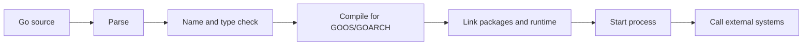
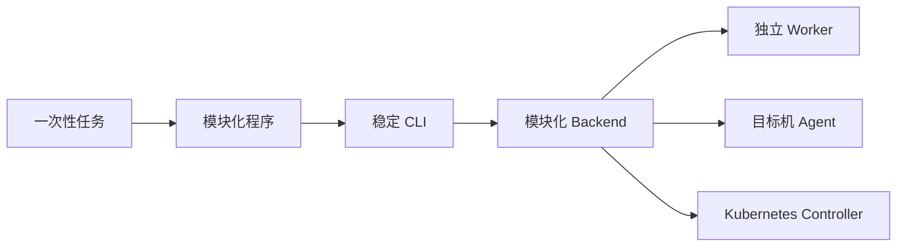
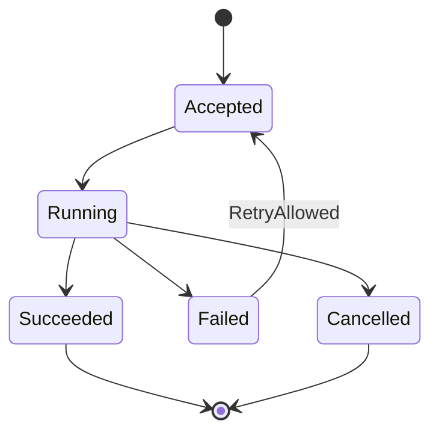
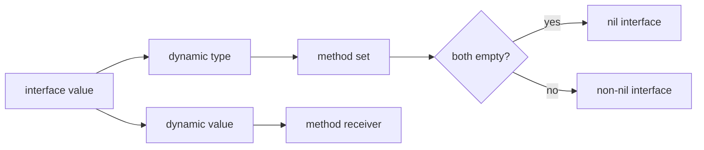

# Go 运维开发与云原生工程 · 第一册：语言基础

## 第一章 · 先判断 Go 是否适合眼前的运维任务

### Go 为什么适合单二进制、常驻进程和云原生工具？

运维工程师学习 Go，通常不是为了重写所有 Shell 或 Python 脚本，而是为了处理一类更具体的问题：程序需要长时间运行、并发访问很多目标、分发到不同机器，或者要与 Kubernetes 等 Go 生态系统深度集成。
Go 把编译器、格式化、测试、依赖管理和交叉编译放进统一工具链，生成的程序通常可以作为一个二进制交付，这能减少目标机解释器和依赖环境的不确定性。

#### 优势来自约束组合

| 约束 | Go 带来的直接收益 | 仍需承担的责任 |
| --- | --- | --- |
| 大量主机分发 | 单二进制便于校验、替换和回滚 | 操作系统、架构、动态链接和升级兼容性 |
| 常驻 Agent | 启动快，运行时和并发模型适合后台服务 | 内存、文件描述符、goroutine 和磁盘上限 |
| 并发 I/O | goroutine 和 channel 降低线程编排成本 | 超时、取消、背压和数据竞争 |
| 云原生集成 | Kubernetes、Prometheus 等生态大量使用 Go | API 版本、RBAC、客户端限流和兼容性 |
| 团队维护 | 语法和工具链相对统一 | 设计边界、测试和可观测性不会自动出现 |

下面这个最小程序已经体现了运维工具与操作系统之间的契约：输出给人看，退出码给脚本和流水线判断。

```go
package main

import (
	"encoding/json"
	"fmt"
	"os"
)

type Result struct {
	Target string `json:"target"`
	OK     bool   `json:"ok"`
	Detail string `json:"detail"`
}

func main() {
	results := []Result{
		{Target: "api-a", OK: true, Detail: "healthy"},
		{Target: "api-b", OK: false, Detail: "timeout"},
	}

	if err := json.NewEncoder(os.Stdout).Encode(results); err != nil {
		fmt.Fprintln(os.Stderr, "encode result:", err)
		os.Exit(1)
	}
	for _, result := range results {
		if !result.OK {
			os.Exit(2)
		}
	}
}
```

运行时不仅要看 JSON，还要检查 `$?`。
如果目标失败而进程仍返回 `0`，自动化平台会把错误当成成功。
反过来，诊断文字应写入标准错误，机器可解析结果写入标准输出，避免二者混在一起破坏 JSON。

#### Go 不会替你自动解决工程问题

静态类型能拦住一部分类型错误，但不能证明目标地址正确、权限足够或重试安全；垃圾回收减少了手动释放内存，却不会阻止无界缓存；goroutine 很轻量，却仍会消耗栈、调度、连接和下游容量。
选择 Go 后，仍要明确输入校验、Secret、超时、日志、幂等、退出与恢复。

练习时可以给示例增加 `--json` 和文本两种输出，再故意让标准输出混入日志。
观察 `jq` 为什么解析失败，并建立“stdout 是数据、stderr 是诊断”的 CLI 规则。

#### 编译期、启动期与运行期是三种不同失败

编译器负责语法、名称和类型关系，链接器负责把包和运行时组织成目标平台的程序；它们不会替你验证主机地址、权限或远端数据。
排障时先判断失败发生在构建、进程初始化还是业务调用，分别收集编译输出、启动日志和带 request ID 的运行证据。
练习时分别制造未定义变量、初始化函数返回错误和远端请求超时，记录 `go test`、进程 stderr 与运行日志三类输出。



#### 把“单二进制”拆成可验证事实

Go 经常被概括为“编译后只有一个文件”，但这句话只在具体构建条件下成立。
纯 Go 程序通常容易生成无需 Go 工具链即可启动的可执行文件；一旦引入 CGO、系统动态库、外部配置、CA 证书、时区数据库或模板文件，运行依赖就不再只有二进制本身。

交付前可以用下面的命令收集事实：

```bash
go build -trimpath -o dist/ops-check ./cmd/ops-check
go version -m dist/ops-check
file dist/ops-check
shasum -a 256 dist/ops-check
```

在 Linux 目标机上还应检查动态链接：

```bash
ldd ./dist/ops-check || true
./dist/ops-check --version
./dist/ops-check --help
```

`go version -m` 可以查看编译工具链、模块路径、依赖版本和部分构建设置。
校验和用于确认传输后的内容与发布记录一致，不能代替签名或来源证明。
`file` 与 `ldd` 只能说明文件格式和链接关系，不能证明程序拥有正确权限、能访问证书或在目标内核上行为正常。

静态链接也不是绝对目标。
例如启用系统 DNS 解析、FIPS 密码模块或厂商库时，动态链接可能是明确要求。
正确决策是记录运行依赖并验证，而不是为了“一定静态”偷偷关闭业务所需能力。

#### `embed`、生成文件与单二进制的真实边界

`embed` 让默认配置、模板或少量证书材料进入二进制，减少目标机文件缺失的概率；它不会自动解决 Secret 轮换，也不会让被嵌入的数据从制品中消失。
一旦数据进入二进制，任何能读取制品的人都可能拿到它，因此只嵌入公开默认值或可替换的非敏感资源。

下面是一个可编译片段，要求同目录存在 `defaults.yaml`，最低 Go 版本为 1.16：

```go
package main

import (
	_ "embed"
	"fmt"
)

//go:embed defaults.yaml
var defaults []byte

func main() {
	fmt.Printf("embedded defaults: %d bytes\n", len(defaults))
}
```

验证时同时记录源码、资源文件和二进制摘要：

```bash
printf 'timeout_seconds: 5\n' > defaults.yaml
go build -trimpath -o /tmp/embed-demo .
shasum -a 256 /tmp/embed-demo
/tmp/embed-demo
```

修改 `defaults.yaml` 后摘要必须变化；运行时环境变量或受控配置文件仍应覆盖默认值，并在诊断中报告“来源”而不是 Secret 内容。

生成代码也属于构建输入。
`go:generate` 只记录生成命令，不会被 `go build` 自动执行；CI 必须显式运行生成命令，再比较工作区是否产生未提交差异：

```go
//go:generate go run ./internal/tools/schema-gen -in schema.json -out zz_generated.go
```

```bash
go generate ./...
git diff --exit-code -- '*.go'
```

如果生成器版本、输入 schema 或排序规则不同，生成结果就可能漂移。
因此要把生成器版本、输入摘要和生成命令写入构建记录；不要在验证脚本中静默覆盖维护者手工修改。

build tags 适合隔离平台实现和测试替身，但 tag 组合本身也是发布矩阵的一部分。
例如 `probe_linux.go` 使用 `//go:build linux`，`probe_other.go` 使用 `//go:build !linux`，至少分别执行目标平台构建和默认构建；“当前机器能编译”不能证明所有 tag 组合都可用。

#### 运行时成本从哪些地方增长

常驻程序的主要资源不只来自业务对象。
需要同时观察：

- goroutine 数量及其创建栈；
- heap 已分配、存活对象和 GC 暂停；
- 打开的文件描述符、socket 与连接池；
- channel 和内存队列里的待处理对象；
- 日志、临时文件和离线缓冲占用的磁盘；
- CPU 使用率、调度延迟和下游等待时间。

一个只占十几 MiB 的空闲 Agent，在部署到数万台主机后也会形成显著总成本。
评审时要把“单实例看起来很轻”乘以副本或主机数量，并包含升级期间新旧版本短暂共存的峰值。

最小运行观察可以先使用操作系统工具：

```bash
ps -o pid,rss,vsz,%cpu,etime,command -p "$PID"
lsof -p "$PID"
curl -fsS http://127.0.0.1:9090/metrics
```

随后由应用暴露稳定指标。
诊断端点应绑定管理网络或本地地址并受访问控制，不能为了方便把 pprof 无认证暴露到公网。

#### Go 与 Shell、Python 的协作边界

实际运维仓库不必只保留一种语言。
常见组合是：Shell 负责很薄的安装与启动胶水，Python 负责一次性数据整理和 SDK 调用，Go 负责需要长期运行或跨平台分发的核心工具。
关键是为边界设定契约：输入格式、退出码、超时、版本和所有者。

如果任务只有三条确定命令并由单一平台执行，改写为 Go 可能只是增加编译与发布成本。
如果脚本开始出现并发、复杂重试、跨平台分发、长期运行和稳定 API，继续把所有逻辑堆进 Shell 又会让错误处理难以验证。
语言迁移应由这些信号触发，而不是由代码行数触发。

可以选一个现有脚本完成练习：记录它的启动频率、平均耗时、失败率、依赖、部署主机数和维护者；再分别估算保持脚本、模块化 Python 和改写 Go 的交付成本。
最终结论允许是“不改”。

### 面对一次性脚本、CLI、Backend 和 Agent，怎样选择程序形态？

页面、命令或需求说明只能告诉我们系统“要做什么”，不能直接推出“必须有几个服务”。
最稳妥的起点是选择最少部署单元，再让真实的可靠性、网络和权限约束推动演进。



#### 用运行约束而不是界面元素决策

- 单人、本机、一次性处理，优先小程序或脚本。
- 需要重复执行、参数契约和流水线调用，形成 CLI。
- 多人共享状态、集中认证或浏览器访问，才增加 Backend。
- 任务需要重启恢复、自动重试或独立扩缩容，才考虑独立 Worker。
- 中心端无法访问目标机，或必须在本机采集，才部署 Agent。
- 需要持续监听资源并协调期望状态，才编写 Controller。

这些组件可以组合。
例如系统可以同时提供 Backend 和管理员 CLI，也可以由 Backend 下发任务、Agent 轮询执行。
组合并不意味着每个组件都要成为微服务；早期完全可以把 API、业务和短任务保留在一个清晰分层的进程中。

#### 写下显式排除项

一份可靠的早期设计至少应说明当前为什么不引入 Redis、MQ、WebSocket、时序数据库或独立 Agent，以及什么证据出现后重新评估。
这样做能防止“以后可能需要”变成永久部署成本，也避免真正需要恢复能力时仍把任务藏在内存里。

可以用下面的最小确认表评审一个想法：

```text
运行位置：普通服务器上的单实例容器
使用规模：少量内部用户
外部操作：只读调用受控 HTTP API
已有设施：复用现有数据库与 SSO
失败处理：记录原因并允许人工重试
当前组件：CLI 或模块化单体 Backend
升级条件：任务超过请求时限或需要重启恢复
```

#### 从任务生命周期推导组件

先画任务从创建到结束的状态，而不是先画服务框：



如果程序退出后不需要记住 `Accepted` 和 `Running`，同步 CLI 可能足够。
如果调用者必须稍后查询状态，就需要稳定的任务 ID 和持久存储。
如果任务耗时超过 HTTP 请求窗口，Backend 可以只负责接收和查询，执行转交 Worker。
如果动作只能在目标机本地发生，才把执行能力下沉到 Agent。

Controller 与普通 Worker 的区别不在于“都循环执行”。
Worker 消费离散任务并走向终态；Controller 周期性比较期望状态和实际状态，只要差异存在就继续协调。
用消息队列消费一次任务，不会自动变成 Controller。

#### 五类程序形态的责任清单

| 形态 | 典型入口 | 状态保存 | 主要失败边界 | 最小验收 |
| --- | --- | --- | --- | --- |
| 一次性程序 | 文件或固定参数 | 无或输出文件 | 输入、文件、单次 API | 重复执行结果可解释 |
| CLI | 参数、环境和 stdin | 通常无 | 退出码、stdout/stderr、信号 | 自动化契约稳定 |
| Backend | HTTP/RPC | 数据库 | 身份、并发、过载、迁移 | 多用户和滚动发布可用 |
| Worker | 队列或任务表 | 任务状态 | 重试、租约、毒任务 | 崩溃后不丢不重副作用 |
| Agent | 中心轮询/本地采集 | 有界缓冲 | 断网、提权、全量升级 | 单机成本和安全可控 |
| Controller | watch 与 workqueue | Kubernetes API | 幂等、冲突、RBAC | 重复 Reconcile 最终收敛 |

这张表不是固定架构。
早期 Backend 可以在同一进程执行短任务；等任务数量、耗时或恢复要求达到阈值再分离 Worker。
独立进程是运维边界，意味着新制品、新部署、新指标、新告警和新值班责任，因此必须有收益证据。

#### 用数字写升级阈值

“以后量大了再拆”无法执行。
把它改成可观测条件，例如：

- 单次任务 p95 超过网关允许的请求时长；
- 进程重启造成的任务丢失已不能接受；
- 后台任务消耗使在线 API p95 连续超过 SLO；
- 不同任务需要独立资源上限或发布节奏；
- 中心网络无法访问超过某比例的目标主机；
- 期望状态偏差必须在固定时间内自动收敛；
- 当前数据库或队列接近连接、吞吐或存储预算。

阈值既要有数值，也要有测量来源和观察窗口。
例如“过去七天任务 p95 超过 90 秒，而网关 hard timeout 为 60 秒”比“任务有点慢”更能支持拆 Worker。

#### 做一次架构反证

选定方案后，主动证明它可能是错的：

1. 如果不用 Backend，两个操作者同时执行会发生什么？
2. 如果不用 Worker，进程在任务中途重启会留下什么状态？
3. 如果不用 Agent，中心端能否通过现有 SSH、API 或 exporter 完成？
4. 如果不用 MQ，数据库任务表是否已经满足吞吐和恢复？
5. 如果不用 Controller，CronJob 或普通客户端能否完成同样目标？

反证后仍保留的最小组件，才进入实现。
练习可以对“批量重启测试环境服务”分别设计 CLI 与 Backend 方案，列出身份、并发、审批、恢复和审计差异，不需要真的实现两个系统。

### AI 生成了一段 Go 代码后，最低限度应该验证什么？

AI 输出应视为一份未经审查的代码变更。
能编译只说明语法、类型和依赖在当前条件下可接受，不说明代码满足需求，更不说明它在超时、部分失败和退出时安全。

#### 四层验证顺序

1. **意图**：入口、输入、输出和副作用是否与需求一致。
2. **静态检查**：运行 `gofmt`、`go vet`，审查依赖和危险 API。
3. **行为测试**：运行 `go test`，覆盖成功、错误、超时和取消。
4. **运行证据**：在隔离环境观察退出码、日志、资源和目标状态。

```bash
gofmt -w .
go test ./...
go vet ./...
go test -race ./...
```

`-race` 只有在测试真正执行到并发路径时才有价值。
测试通过也不等于真实主机、真实身份或真实 Kubernetes 权限已经验证。
报告结果时应区分“编译通过”“单元测试通过”“隔离集成测试通过”和“实际环境验证通过”。

#### 优先检查高风险省略

生成代码常见的问题不是复杂算法错误，而是缺少边界：`http.Client` 没有超时、响应体未关闭、goroutine 无退出条件、错误被 `_` 丢弃、日志打印 Token、命令参数经过 Shell 拼接、Kubernetes 客户端使用过大权限。
审查时从外部输入与副作用开始，比从第一行顺读更容易发现严重问题。

#### 固定当前工具链事实

文档写作时不把本机版本当作读者的统一版本。
项目应通过 CI、构建镜像或版本文件声明支持范围，并让诊断命令输出真实值：

本文不把“最新稳定版本”写死在学习材料里。
写作环境实际安装的是 `go1.22.2 darwin/arm64`；项目应在 `go.mod`、CI 镜像和发布记录中声明支持范围，并在升级时重新执行示例和兼容性测试。

```bash
go version
go env GOVERSION GOOS GOARCH GOPROXY GOSUMDB
go list -m all
```

如果生成代码使用了较新的标准库 API，必须对照项目 `go.mod` 中的 `go` 版本与 CI 工具链，而不是因为开发机能编译就合并。

#### 从数据流反向审查生成代码

审查顺序从副作用终点向输入起点回溯：代码会删除什么、写入什么、调用哪个 API、使用什么身份；这些动作依赖哪些未经校验的数据。
这样可以快速发现用户输入进入 shell、路径逃逸、URL 被用作 SSRF、日志泄露 Token 等问题。

```text
外部输入
  -> 解析和大小限制
  -> 类型和业务校验
  -> 授权与数据范围
  -> 幂等和 dry-run
  -> 文件 命令 网络或集群副作用
  -> 结果 审计和退出码
```

对文件路径，检查清理后的路径是否仍位于允许根目录、是否跟随符号链接、权限是否过宽；对 URL，限制 scheme、目标地址与重定向；对命令，禁止拼接 shell 并限制程序和参数；对 Kubernetes，检查 namespace 与 RBAC 是否最小。

#### 建立威胁与失败检查表

| 检查面 | 必问问题 | 验证方法 |
| --- | --- | --- |
| 输入 | 大小、格式、编码、重复值是否受控 | 边界值与模糊输入测试 |
| 网络 | 是否有 DNS、连接、TLS、响应与总超时 | 慢服务和断连故障注入 |
| 并发 | goroutine 是否能退出，队列是否有界 | race、取消测试、profile |
| 凭证 | 是否进入参数、日志、错误或结果 | 搜索输出并使用假 Secret 测试 |
| 副作用 | 重复执行是否安全，是否支持 dry-run | 同一请求执行两次并比较状态 |
| 权限 | 身份和资源范围是否最小 | 允许与拒绝矩阵 |
| 供应链 | 新依赖为何需要，版本和许可是什么 | module diff、漏洞与许可证扫描 |
| 恢复 | 中途崩溃后如何判断未完成工作 | 在关键提交点 kill 进程 |

AI 可能生成看似合理但不存在的包、过时 API 或错误的版本参数。
依赖必须能从官方模块信息与项目锁定文件确认；安全相关行为优先查标准库或官方文档。
不要因为函数名“像真的”就降低验证标准。

#### 测试生成代码的失败路径

成功示例通常最容易生成，真正要补的是失败测试。
以 HTTP 巡检为例，至少模拟：DNS 失败、TLS 错误、连接成功但 header 延迟、响应体无限流、429、500、无效 JSON、调用方取消和输出 writer 失败。
每个测试都要验证函数是否在 deadline 内结束、错误是否可分类、资源是否关闭。

执行外部命令时模拟不存在的命令、非零退出、stderr 很大、超时和子进程残留。
文件写入时模拟目录只读、磁盘空间不足、rename 失败与已有文件。
Kubernetes 客户端测试权限不足、冲突、资源已删除和 API 限流。

不能在单元测试中安全模拟的行为，进入隔离容器、临时 namespace 或测试账号；不要直接拿生产资源做“验证一下”。

#### 记录证据等级

变更说明可以使用固定标签：

```text
STATIC    gofmt go vet dependency review passed
UNIT      deterministic tests passed
RACE      exercised concurrent tests with race detector
INTEGRATION tested protocol against isolated real dependency
RUNTIME   ran built artifact on target OS and architecture
PROD      observed approved production rollout and health window
```

较低等级不能冒充较高等级。
镜像构建成功不是容器启动证明；Pod Ready 不是业务成功证明；fake client 测试通过不是 Kubernetes API 行为证明。
把证据边界写清楚，后续维护者才能决定还缺哪一层。

#### AI 代码评审练习

让 AI 生成一个“并发检查 URL 的 Go 程序”，暂不要求它修复。
先独立列出需求和风险，再逐项标记代码是否满足。
最后只提交最小修复，并为每个修复增加失败测试。
比较修复前后的 goroutine profile、退出码与 stderr，形成一份可重复的评审记录。

## 第二章 · 从工具链、模块和入口读懂一个 Go 项目

### 安装完成后，怎样确认实际使用的 Go 工具链和目标平台？

同一台机器可能同时装有系统包、版本管理器和手工解压的 Go。
排查“本地能编、CI 不能编”时，先收集可执行文件、版本、目标平台、模块和缓存事实，不要立即删除缓存或重装。

```bash
command -v go
go version
go env GOROOT GOPATH GOOS GOARCH CGO_ENABLED
go env GOMOD GOWORK GOPROXY GOSUMDB
```

#### `GOROOT`、`GOPATH` 与模块不是同一件事

`GOROOT` 指向工具链与标准库；`GOPATH` 现在主要承载模块缓存和安装的命令；`GOMOD` 指出当前生效的 `go.mod`。
旧材料常把源码必须放进 `$GOPATH/src` 当成主流程，这对现代模块项目已经不是默认。
维护旧仓库时要先识别其模式，再计划迁移，不要在未知状态下混用两套规则。

#### 目标平台会改变产物

```bash
GOOS=linux GOARCH=amd64 CGO_ENABLED=0 go build -trimpath -o dist/check-linux-amd64 ./cmd/check
file dist/check-linux-amd64
```

设置 `GOOS` 与 `GOARCH` 能交叉编译大量纯 Go 程序，但启用 CGO、依赖系统库或使用平台专有系统调用时，构建链会更复杂。
交付前至少要在目标平台执行启动、网络、文件、信号与证书加载测试。

#### 诊断不等于修改

`go env`、`go list` 和 `go version -m <binary>` 都是低风险事实收集。
不要把 `go clean -modcache` 当作常规修复；它会丢掉可复用缓存，也可能掩盖代理、校验或版本声明问题。

#### 从 PATH 追到实际工具链

`command -v go` 只告诉 Shell 解析到的入口，它可能仍是版本管理器 shim。
继续查看符号链接和环境来源，才能解释为什么交互终端、IDE、systemd 与 CI 使用不同版本：

```bash
type -a go
ls -l "$(command -v go)"
go env GOVERSION GOTOOLCHAIN GOROOT
env | sort | grep '^GO'
```

诊断记录应同时包含命令所在目录和 `go env GOMOD GOWORK`。
在模块外运行 `go test ./...` 与在仓库根运行可能得到完全不同的包集合。
IDE 的集成终端也可能继承旧环境，重启 IDE 后变化并不能证明配置根因已经解决。

现代工具链可能根据 `go.mod` 与 `GOTOOLCHAIN` 选择或下载其他工具链，因此 `command -v go` 和实际完成构建的版本也可能不同。
CI 若禁止动态下载，应显式提供匹配工具链，并让日志打印最终 `go version`。

#### 交叉编译矩阵如何设计

不要默认支持所有 `GOOS/GOARCH` 组合。
根据真实部署清单建立矩阵：

| 目标 | 构建设置 | 必测行为 |
| --- | --- | --- |
| Linux amd64 容器 | `linux/amd64 CGO_ENABLED=0` | DNS、CA、信号、只读根文件系统 |
| Linux arm64 节点 | `linux/arm64` | CPU 架构、镜像 manifest、系统调用 |
| macOS 管理端 | `darwin/arm64` | Keychain、路径、签名与隔离属性 |
| Windows 运维端 | `windows/amd64` | 路径、服务控制、退出与换行 |

共享源码可以通过 `*_linux.go`、`*_windows.go` 和 build constraints 隔离平台实现。
平台文件仍应实现同一个小接口，让核心逻辑在任意平台测试。
不要在核心函数里散落大量 `runtime.GOOS` 分支。

#### 缓存、代理与校验故障的定位顺序

依赖下载失败时依次确认模块路径和版本是否存在、Git 凭证是否有效、代理是否可达、私有范围是否匹配、校验服务是否被错误调用。
使用 `go env GOPROXY GOPRIVATE GONOPROXY GONOSUMDB GOSUMDB` 收集配置，再用一个具体模块复现。

`GONOSUMDB=*` 或 `GOSUMDB=off` 能让错误暂时消失，却会扩大供应链风险，不应作为默认修复。
公司代理不可用时也不要把私有模块路径暴露给公共服务。
修复后保留失败命令、原始错误、配置差异和成功验证，避免只有“清缓存好了”。

#### 工具链诊断练习

在一个临时目录和项目根目录分别执行 `go env GOMOD GOWORK`、`go list ./...`，解释输出差异。
然后构建本机与 Linux 目标二进制，使用 `go version -m` 比较 build settings。
若没有 Linux 环境，只能把结果标为构建证据，不能标为运行证据。

### `package`、`main`、`init` 和导出规则怎样决定程序入口？

每个 Go 文件先声明包。
可执行程序最终需要 `package main` 和无参数、无返回值的 `main()`；库包则通过首字母大写导出标识符。
读陌生项目时，先找 `cmd/*/main.go`，再沿显式函数调用进入业务层，比从目录名猜架构可靠。

```text
cmd/check/main.go        进程入口 参数 信号 退出码
internal/checker/        核心巡检逻辑
internal/client/         外部 HTTP 或系统接口
internal/report/         文本与 JSON 输出
```

#### 初始化顺序应该可预测

包级变量初始化和 `init()` 在 `main()` 前执行。
`init()` 适合完成不可避免、无参数的注册，但不适合读取生产配置、访问网络或启动 goroutine。
隐藏副作用会让测试难以替换依赖，也让导入包本身变成危险动作。

```go
package main

import "fmt"

func run(args []string) error {
	fmt.Println("run with", args)
	return nil
}

func main() {
	if err := run([]string{"check"}); err != nil {
		panic(err)
	}
}
```

真实入口不应 `panic` 处理普通错误，后续会改为集中映射错误和退出码。
这里的重点是让 `run` 可被测试，而 `main` 只负责进程适配。

#### 导出就是兼容性承诺

大写名称可以被其他包使用，也扩大了长期维护面。
优先保持包小、导出 API 少，让具体实现留在包内。
不要为了“将来可能复用”导出所有结构体字段；调用方一旦依赖字段布局，后续修改会更困难。

#### 包初始化的真实次序

程序先按依赖关系初始化被导入包；同一包内先计算包级变量，再按文件顺序相关规则执行 `init`，最后进入 `main`。
业务代码不应依赖难以看出的文件名顺序。
需要明确顺序的注册，放进显式构造函数：

```go
type Application struct {
	checker *Checker
	reporter Reporter
}

func NewApplication(cfg Config, reporter Reporter) (*Application, error) {
	checker, err := NewChecker(cfg)
	if err != nil {
		return nil, fmt.Errorf("create checker: %w", err)
	}
	if reporter == nil {
		return nil, errors.New("reporter is required")
	}
	return &Application{checker: checker, reporter: reporter}, nil
}
```

构造过程返回错误，让入口决定打印、退出或重试。
若把同样动作放在 `init`，调用方无法传配置，也很难在测试中模拟失败。

可以用三个小包观察初始化，而不是背规则。
`config` 的包级变量先计算并打印，`client` 导入 `config`，最后 `main` 导入 `client`。
运行两次都应得到相同依赖顺序：

```text
config variable
config init
client variable
client init
main init
main
```

若把网络请求或 goroutine 放入 `init`，测试仅仅导入包就会产生副作用，而且失败只能 panic。
把这些动作移到 `NewApplication` 后，测试可以注入假 client，入口也能输出稳定错误并执行清理。

#### `internal`、`cmd` 和普通包的含义

`internal` 有编译器执行的导入限制：其父树之外的代码不能导入。
它适合尚未承诺给外部模块的业务实现。
`cmd/<name>` 是常见约定，不是语言强制；每个子目录通常对应一个 `package main`。
普通顶层包适合真正希望其他模块使用的 API。

```text
module example.com/platform/ops-check
├── cmd/ops-check/          executable adapter
├── internal/check/         private domain behavior
├── internal/httpclient/    private outbound adapter
└── report/                 public only if external modules need it
```

不要创建 `utils`、`common` 作为所有零散函数的归宿。
包名应说明能力或领域，调用处读起来像 `report.Render`、`target.Parse`。
如果包互相循环依赖，通常说明责任切分或共享模型位置有问题，而不是需要技巧绕过编译器。

#### 方法、函数和导入时副作用的评审

读陌生仓库时可以执行：

```bash
go list -f '{{.ImportPath}} -> {{join .Imports " "}}' ./...
go doc ./internal/check
go test -run TestName -v ./internal/check
```

先找进程入口，再找配置构造、Server 启动和 goroutine 创建点。
搜索 `func init()`、包级 `go`、`os.Exit`、`log.Fatal` 和默认 HTTP client，定位导入即执行、深层终止进程或无超时调用。
库包不应调用 `os.Exit`，否则上层没有清理和错误映射机会。

#### API 兼容练习

把一个导出的结构体字段改名，观察外部包编译如何失败；再把字段隐藏，通过构造器和方法维持契约。
比较两种设计的升级面。
练习目标不是把所有字段隐藏，而是理解每个导出名称都需要文档、测试和兼容策略。

### 新项目怎样用 Go Module 管依赖，旧 GOPATH 项目又怎么看？

`go.mod` 描述模块路径、语言版本与依赖要求，`go.sum` 记录下载内容的校验信息。
两者都应进入版本控制。
`go mod tidy` 会根据源码与测试调整依赖，不应在完全不了解差异时机械运行后提交大面积变化。

```bash
mkdir ops-check && cd ops-check
go mod init example.com/ops-check
go mod tidy
go list -m all
go mod verify
```

#### 版本声明是构建输入

阅读 `go.mod` 时关注：模块路径是否稳定、`go` 指令、直接依赖、`replace` 和 `exclude`。
本地 `replace ../foo` 很容易造成“开发机正常、CI 找不到目录”；合并前应移除临时替换，或把 workspace 明确限定为本地多模块开发工具。

#### 私有模块需要同时配置访问和隐私

私有仓库通常要设置 `GOPRIVATE`，避免把私有模块路径交给公共代理或校验服务；Git 凭证应来自受控凭证存储，不能写进模块 URL、Shell 历史或仓库。

```bash
go env -w GOPRIVATE=git.example.internal
go env GOPRIVATE GONOPROXY GONOSUMDB
```

在共享主机上执行 `go env -w` 会修改用户级配置，自动化环境更适合通过进程环境或 CI Secret 注入并在日志中隐藏值。

#### 供应链检查不能只看能否下载

评审新增依赖时检查维护状态、许可证、间接依赖、权限和替代的标准库方案。
更新后运行测试和漏洞检查，并保存工具版本与结果。
`go.sum` 校验内容一致性，不代表依赖没有恶意逻辑或已知漏洞。

#### `go.mod` 中容易被忽略的语义

`go` 指令描述模块的语言与模块语义基线；`toolchain` 可表达建议工具链；`require` 包含直接和间接模块；`replace` 能把模块替换到另一个版本或本地目录；`retract` 由模块作者声明不应使用的版本。
它们都会改变构建输入。

```mod
module example.com/ops-check

go 1.22

require example.com/platform/sdk v1.4.2

replace example.com/platform/sdk => ../sdk
```

上面的本地 replace 只适合受控开发过程。
发布前执行 `go list -m -json all` 并检查是否仍指向工作区。
不要手工删除间接依赖以追求文件“干净”；让 `go mod tidy` 基于当前源码和测试计算，再审查 diff。

#### 最小版本选择与升级影响

Go 根据模块图选择构建列表。
升级一个直接依赖可能同时改变多个间接依赖，因此评审不能只看一行 `require`。
用下面的命令比较：

```bash
go list -m all
go mod graph
go mod why -m example.com/some/module
go list -m -u all
```

`-u` 只提供可升级信息，不应在 CI 中自动把所有依赖升级。
升级分支要固定范围，运行单元、集成与目标平台测试，并检查配置默认值、协议和生成代码是否改变。

#### Workspace 解决什么问题

`go.work` 适合本地同时修改多个模块，不需要在每个 `go.mod` 写临时 replace。
它不天然属于生产构建输入；是否提交由仓库结构决定。
诊断“为什么使用了本地源码”时检查 `GOWORK`：

```bash
go env GOWORK
go work use ./service ./sdk
go list -m all
```

CI 若期望单模块可独立构建，应设置清晰工作目录并避免意外拾取父目录 `go.work`。
发布验证最好在干净 checkout 或构建容器中完成。

#### 私有依赖的凭证边界

私有模块下载通常涉及 Go 命令、代理与 Git 三层。
`GOPRIVATE` 决定哪些路径跳过公共代理/校验默认值，但不会自动提供 Git 凭证。
凭证可以来自 SSH agent、受控 netrc 或 CI token；不得把 token 写入 `go.mod`、模块 URL 或构建日志。

CI token 只授予读取所需仓库的权限，并设置过期与轮换。
构建镜像时使用 secret mount，不把凭证留在镜像层。
验证镜像历史和最终文件系统中没有 `.netrc`、私钥或包含凭证的 Git 配置。

#### 依赖引入确认单

每个重要依赖回答：标准库为什么不足；项目是否仍维护；许可证是否可接受；会增加哪些间接模块；是否使用 CGO；能否在所有目标平台构建；暴露哪些网络或文件能力；漏洞扫描结果是什么；升级和替换负责人是谁。

练习时选择一个间接依赖，使用 `go mod why` 找到引入路径，再检查它是否进入最终二进制。
理解“模块图中存在”与“代码链接进入产物”并不完全相同。

## 第三章 · 让输入数据经过类型检查再进入运维逻辑

### 变量、零值和作用域怎样影响配置读取与默认值？

Go 的变量总有类型和零值，这让未初始化内存具有确定行为，却可能把“用户明确配置为零”和“完全没配置”混在一起。
例如超时 `0` 到底表示禁用、无限等待还是缺少配置，必须由配置模型明确。

```go
type Config struct {
	Endpoint string
	Timeout  time.Duration
	DryRun   bool
}

func (c Config) Validate() error {
	if c.Endpoint == "" {
		return errors.New("endpoint is required")
	}
	if c.Timeout <= 0 {
		return errors.New("timeout must be positive")
	}
	return nil
}
```

#### 用指针或额外状态表达“未提供”

当零值本身是合法配置时，可以用 `*int`、`*bool` 或显式的 `Set` 标记区分缺失与零。
不要把所有字段都改成指针；只在输入边界需要三态语义时使用，并尽快转换成内部不含歧义的值对象。

#### 警惕短变量声明造成遮蔽

```go
result, err := load()
if err != nil {
	return err
}
if refresh {
	result, err := reload() // 新的 result 只活在 if 中
	if err != nil {
		return err
	}
	fmt.Println(result)
}
```

遮蔽不一定编译失败，却可能让外层变量保持旧值。
缩短函数、避免重复名称，并使用静态分析发现可疑遮蔽。
观察点是分支结束后外层值是否真的更新，而不是只看分支内日志。

#### 声明方式表达不同意图

`var timeout time.Duration` 强调类型与零值；`timeout := 5 * time.Second` 适合局部推断；`const` 适合编译期不变值。
包级可变变量会制造跨测试和跨请求共享状态，应尽量由构造器注入。

```go
const defaultWorkers = 4

type RawConfig struct {
	Workers *int `json:"workers"`
}

func normalize(raw RawConfig) (int, error) {
	if raw.Workers == nil {
		return defaultWorkers, nil
	}
	if *raw.Workers < 1 || *raw.Workers > 32 {
		return 0, fmt.Errorf("workers must be in [1,32]")
	}
	return *raw.Workers, nil
}
```

指针只存在于“是否提供”的输入层；规范化后核心拿到无歧义的 `int`。
这样后续函数不必到处重复默认逻辑和 nil 判断。

#### 配置来源与覆盖顺序

运维程序常同时接收默认值、配置文件、环境变量和命令行。
覆盖顺序要固定，例如 `CLI > environment > file > defaults`，并保存每个最终值的来源。
Secret 只能显示来源和是否已设置，不能显示值。

解析和校验分两步：解析回答“文本能否转换为类型”，校验回答“值在业务中是否允许”。
`30s` 能解析为 duration，但可能超过巡检允许的 10 秒；端口能解析为整数，但 0 可能不允许。
所有来源合并后再做一次跨字段校验，例如 `requestTimeout < batchDeadline`。

#### 作用域与生命周期

变量的词法作用域不等于其引用对象的生命周期。
闭包捕获变量、slice 指向底层数组、goroutine 持有指针，都可能让对象活得更久。
循环中启动 goroutine 时应确认每次迭代捕获的是预期值，并使用当前 Go 版本语义编写测试，而不是照搬旧版本结论。

包级缓存、`sync.Once` 和默认客户端会跨测试存活。
测试若修改它们，必须恢复或重新设计为实例字段。
`t.Setenv` 能在测试结束恢复环境变量，但并行测试仍不能安全修改同一个进程全局状态。

#### 配置边界测试

至少测试缺失、显式零、负数、上界、上界加一、空字符串、只有空白、未知字段和来源冲突。
输出规范化配置时将 duration 格式化为带单位字符串，列表和 map 使用稳定顺序。
练习目标是让两名操作者对同一输入得到完全相同的可信配置和诊断。

### 数值、字符串和 Unicode 输入需要防哪些隐式假设？

运维数据充满边界：端口不能为负、字节数可能溢出、持续时间带单位、主机名与标签可能包含非 ASCII 字符。
Go 不会自动替你确认业务范围。

```go
func parsePort(raw string) (uint16, error) {
	n, err := strconv.ParseUint(raw, 10, 16)
	if err != nil {
		return 0, fmt.Errorf("parse port %q: %w", raw, err)
	}
	if n == 0 {
		return 0, errors.New("port must be between 1 and 65535")
	}
	return uint16(n), nil
}
```

#### 字符串长度默认是字节数

`len(s)` 返回 UTF-8 字节数，不是用户看到的字符数；`s[i]` 取出一个字节。
按 Unicode 码点处理时使用 `for range` 或 `[]rune`，但“用户感知字符”还可能由多个码点组成。
日志截断首先按字节预算保证协议安全，再决定是否需要 Unicode 边界。

```go
s := "节点A"
fmt.Println(len(s))
for index, r := range s {
	fmt.Printf("byte_index=%d rune=%q\n", index, r)
}
```

#### 单位必须进入类型或名称

不要让裸整数同时表示秒、毫秒和字节。
持续时间使用 `time.Duration` 并通过 `time.ParseDuration` 解析；容量字段命名为 `MaxBytes`、`BatchSize`。
对来自 JSON 的大整数要考虑浮点解码问题，必要时使用 `json.Decoder.UseNumber` 或字符串承载标识符。

#### 整数范围与转换

不同整数类型转换不会自动报告溢出。
先按输入允许范围解析，再转换到目标类型：

```go
func parseBytes(raw string) (int64, error) {
	value, err := strconv.ParseInt(raw, 10, 64)
	if err != nil {
		return 0, fmt.Errorf("parse bytes %q: %w", raw, err)
	}
	if value < 0 || value > 1<<30 {
		return 0, fmt.Errorf("bytes must be in [0,1073741824]")
	}
	return value, nil
}
```

使用 `int` 表示内存索引和长度，使用明确位宽类型表示协议或持久化字段。
不要把数据库 ID 解码成 `float64`；大整数超过浮点精确范围后会悄悄变化。
ID 通常更适合作为字符串处理，不参与算术。

#### 时间、时区与时间窗口

`time.Duration` 表达时间间隔，`time.Time` 表达时间点。
日志和 API 时间优先使用带时区的 RFC3339；持久化时明确 UTC，展示时再转换。
不要用固定 24 小时推导“明天同一当地时间”，因为夏令时地区可能不是 24 小时。

超时使用单调时间部分计算经过时长；序列化后的时间会失去单调部分，不能拿跨进程时间戳精确计算延迟。
验证证书、指令有效期和租约时，要考虑时钟漂移并监控 NTP 状态。

#### UTF-8、无效字节与规范化

Go 字符串可以包含任意字节，并不保证是合法 UTF-8。
读取日志或文件后用 `utf8.ValidString` 判断，再决定拒绝、替换还是保留原始字节。
协议字段若要求 ASCII，应显式限制；不要因为 Go 支持 Unicode 就放开主机名、标签键或环境变量名的所有字符。

视觉上相同的 Unicode 文本可能有不同码点组合。
需要身份、唯一键或安全比较时，先依据协议定义规范化规则；若协议没有定义，不要自行转换后声称等价。
文件路径还涉及大小写敏感、分隔符和平台差异。

#### 安全截断输出

日志字段需要同时满足容量和可读性。
先限制读取总字节，避免内存失控；显示时再沿 UTF-8 边界截断并标记 `truncated=true`。
Secret 脱敏不能只替换固定前缀，结构化日志应从源头不加入敏感字段。

测试包含中文、emoji、组合字符、无效 UTF-8、空字节和超长输入。
观察 JSON encoder 对无效字节的处理是否符合契约，并确保截断后仍能输出合法 JSON。

### 批量目标、标签和状态应该怎样选择 slice、map 与 struct？

slice 表达有序批次，map 表达按键索引，struct 表达有名称和约束的记录。
选择容器应从业务语义出发，而不是从“哪个更快”出发。

```go
type Target struct {
	Name   string
	URL    string
	Labels map[string]string
}

func indexTargets(items []Target) (map[string]Target, error) {
	index := make(map[string]Target, len(items))
	for _, item := range items {
		if item.Name == "" {
			return nil, errors.New("target name is required")
		}
		if _, exists := index[item.Name]; exists {
			return nil, fmt.Errorf("duplicate target %q", item.Name)
		}
		index[item.Name] = item
	}
	return index, nil
}
```

#### slice 是一个视图

slice 包含指向底层数组的引用、长度和容量。
切片、追加和传参可能共享底层数组；调用方若要求不被修改，函数应复制输入或明确所有权。
`append` 有时复用原数组、有时分配新数组，不能依赖偶然容量判断隔离性。

#### slice 复制的是描述，不一定是数据

赋值或传参通常只复制 slice 头，多个调用者仍可能共享底层数组。
跨 goroutine 传递前要么复制元素，要么明确只读协议；否则即使没有显式全局变量，也可能产生数据竞争和任务内容被覆盖。
验证时让生产者修改原 slice，再比较复制版本与共享版本的结果，并用 `go test -race` 确认共享版本的风险。

#### map 不是稳定顺序

map 遍历顺序不应成为输出契约。
生成报表、配置差异或测试快照前先提取键并排序。
并发读写普通 map 会产生数据竞争甚至运行时错误，需要锁、单一所有者 goroutine 或重新设计数据流。

#### struct 让非法状态更难进入核心

外部 JSON 可以先解码到输入结构，完成 URL、名称和标签校验后，再转换成内部 `Target`。
避免让 `map[string]any` 穿过整个业务层，因为拼写错误和类型错误会延迟到运行时才暴露。

#### 数组、slice 与容量变化

数组长度属于类型，`[16]byte` 与 `[32]byte` 不同；它适合固定摘要和协议字段。
slice 是对数组的一段视图。
`len` 表示可访问元素数，`cap` 表示从起点到底层数组末尾的容量。

```go
func cloneTargets(in []Target) []Target {
	out := make([]Target, len(in))
	copy(out, in)
	for i := range out {
		out[i].Labels = maps.Clone(in[i].Labels)
	}
	return out
}
```

只复制 slice 仍是浅复制，其中的 map 继续共享。
是否需要深复制取决于所有权契约。
比起在每个函数防御性复制，更重要的是说明谁可以修改、何时不再修改。

从大 buffer 截取很小 slice 并长期保存，会让整个底层数组无法回收。
解析大文件后若只保留少量 token，可以复制需要部分，避免意外保留数百 MiB。

#### nil 与空集合的外部契约

nil slice 和长度为零的非 nil slice 都可 range、append，但 JSON 默认分别编码为 `null` 和 `[]`。
API 若承诺数组字段始终为数组，需要初始化空 slice或自定义编码。
nil map 可以读取，写入会 panic；构造可变 map 前必须 make。

```go
type Report struct {
	Results []Result `json:"results"`
}

report := Report{Results: make([]Result, 0)}
```

不要让内部偶然表示泄露成不稳定 API。
测试应固定空集合、缺失字段和 null 的含义。

#### map 键和并发边界

map 键必须可比较；slice、map 和 function 不能直接作为键。
复合键可使用小 struct，避免手工拼字符串产生分隔冲突：

```go
type targetKey struct {
	Cluster string
	Name    string
}
```

普通 map 允许并发只读，但只要可能同时写就必须同步。
最简单设计是构建后冻结，后续只读；或让单一 goroutine 拥有 map，通过消息接收变更。
`sync.Map` 只适合特定访问模式，不是给普通 map 加并发安全的默认答案。

#### struct 标签与输入模型

JSON tag 决定外部字段名，`omitempty` 会改变零值输出。
输入、领域和输出使用不同 struct 往往更安全：输入允许可选字段和原始字符串；领域模型保证不变量；输出只暴露稳定字段。
不要把数据库模型直接作为 HTTP 响应，否则内部列和敏感字段容易意外公开。

#### 泛型只解决重复类型逻辑

运维代码首先要能读懂标准库 `slices`、`maps` 和项目中的简单类型参数。
泛型适合“算法完全相同、只有元素类型不同”的纯逻辑，例如稳定去重；它不适合隐藏 HTTP、数据库或权限差异，也不应把 `any` 换成一串难读约束来追求抽象。

```go
func StableUnique[T comparable](items []T) []T {
	seen := make(map[T]struct{}, len(items))
	out := make([]T, 0, len(items))
	for _, item := range items {
		if _, ok := seen[item]; ok {
			continue
		}
		seen[item] = struct{}{}
		out = append(out, item)
	}
	return out
}
```

`T comparable` 表示值可用 `==` 并可作为 map key，因此 slice、map 和 function 不能作为这个函数的元素类型。
调用时通常由参数推断 `T`。
测试空输入、重复项与顺序；同时检查返回 slice 是否需要与输入隔离。

标准库的 `maps.Clone` 只复制 map 容器，值若含 slice、map 或指针仍会共享内部对象。
`slices.Clone` 同样是浅复制。
泛型没有改变所有权问题；评审时仍要问谁能修改底层数据、跨 goroutine 后是否只读。

不需要为每种领域动作建立 `Repository[T]`。
主机、任务和凭证的查询、授权、事务与错误语义不同，用一个万能泛型仓库往往隐藏了契约。
先保留具体小接口，只有出现真实重复且行为完全一致时再抽取。

#### 泛型阅读练习

从 `StableUnique[string]` 开始，确认编译器可以推断类型；再尝试 `[][]byte`，观察 comparable 约束如何在编译期拒绝。
最后把函数用于目标 ID 去重，验证输入顺序保留、原 slice 未改变，并记录项目最低 Go 版本是否支持所用标准库辅助函数。

#### 容器选择练习

实现“按集群和名称去重目标，并按原输入顺序输出结果”。
使用 slice 保存顺序、`map[targetKey]int` 保存索引、struct 表达目标。
测试重复键、空集合、标签修改、稳定 JSON 和并发只读，解释每个容器承担的业务语义。

## 第四章 · 用函数、方法、接口和错误组织可靠代码

### 控制流怎样保持快乐路径，并让失败尽早返回？

运维代码经常包含校验、外部调用和清理。
把错误尽早返回，可以让主路径保持从上到下，并为每个失败增加具体上下文。

```go
func Check(ctx context.Context, target Target, client *http.Client) (Result, error) {
	if err := validateTarget(target); err != nil {
		return Result{}, fmt.Errorf("validate target: %w", err)
	}

	req, err := http.NewRequestWithContext(ctx, http.MethodGet, target.URL, nil)
	if err != nil {
		return Result{}, fmt.Errorf("build request: %w", err)
	}

	resp, err := client.Do(req)
	if err != nil {
		return Result{}, fmt.Errorf("request %s: %w", target.Name, err)
	}
	defer resp.Body.Close()

	return decodeResult(resp)
}
```

#### `for` 是唯一循环，但退出语义要明确

无限循环适合服务主循环，却必须绑定 `context`、channel 或连接关闭条件。
`break` 默认只离开最内层结构，复杂嵌套应拆函数或使用带名称的循环，避免“以为已经退出”导致后台任务继续运行。

#### `switch` 适合显式状态分派

用 `switch` 处理状态码或任务状态时，应保留 default 分支记录未知值。
不要把未来新增状态静默当作成功。
状态机变更需要测试每个允许与拒绝的跃迁。

#### 快乐路径不是忽略清理

尽早返回减少嵌套，但资源获得后必须立即安排清理。
`defer` 在当前函数返回时执行，采用后进先出顺序。
循环里不断 defer 会把资源保留到整个函数结束，处理大量文件时应把单次操作拆成小函数：

```go
func readOne(path string, limit int64) ([]byte, error) {
	file, err := os.Open(path)
	if err != nil {
		return nil, fmt.Errorf("open %s: %w", path, err)
	}
	defer file.Close()

	data, err := io.ReadAll(io.LimitReader(file, limit+1))
	if err != nil {
		return nil, fmt.Errorf("read %s: %w", path, err)
	}
	if int64(len(data)) > limit {
		return nil, fmt.Errorf("%s exceeds %d bytes", path, limit)
	}
	return data, nil
}
```

只 defer `Close` 不代表关闭错误永远可忽略。
写文件时，flush、sync 和 close 都可能报告持久化失败，应在返回成功前检查。
HTTP 响应体关闭主要用于连接回收，业务错误仍来自读取和协议校验。

#### 循环的取消和部分结果

批量处理要决定遇到一个错误是立即失败、继续并汇总，还是达到阈值后停止。
三种都合理，但必须形成契约。
继续模式应把目标和原因放进结构化结果；立即失败仍要取消并等待已经启动的工作。

```go
for _, target := range targets {
	select {
	case <-ctx.Done():
		return results, fmt.Errorf("batch cancelled: %w", ctx.Err())
	default:
	}
	result, err := check(ctx, target)
	results = append(results, Result{Target: target, Err: err})
}
```

不要在 tight loop 的 default 分支空转等待事件；这里 default 只做非阻塞取消检查，随后有真实工作。
服务循环应阻塞在 channel、timer 或 I/O 上。

#### 状态机显式拒绝未知状态

```go
func canTransition(from, to Status) bool {
	switch from {
	case Pending:
		return to == Running || to == Cancelled
	case Running:
		return to == Succeeded || to == Failed || to == Cancelled
	case Succeeded, Failed, Cancelled:
		return false
	default:
		return false
	}
}
```

测试采用状态矩阵覆盖全部组合，并单独测试未知值。
若新增状态而测试未更新，矩阵应失败，迫使维护者决定合法跃迁。

#### 控制流练习

把一个三层嵌套的“读取配置—遍历目标—调用 API”函数拆成输入校验、单目标处理和汇总三个函数。
故意注入第二个目标失败与上下文取消，确认已经完成的结果、退出原因和资源关闭都符合书面契约。

### 函数、receiver 和组合怎样把运维动作拆成可测试单元？

函数边界应围绕责任和副作用：解析配置、选择目标、执行检查、汇总结果、渲染输出。
把网络、时钟和文件系统作为依赖传入，测试就能替换它们，而无需访问真实环境。

```go
type Checker interface {
	Check(context.Context, Target) (Result, error)
}

type Runner struct {
	checker Checker
}

func NewRunner(checker Checker) *Runner {
	return &Runner{checker: checker}
}
```

#### receiver 选择表达对象语义

小且不可变的值类型可用值 receiver；需要修改接收者、包含锁或复制代价明显时使用指针 receiver。
同一类型的方法尽量保持一致。
含 `sync.Mutex` 的结构体不能在使用后复制，否则锁保护的就不是同一份状态。

#### 组合优先于模拟继承

结构体嵌入可以提升字段和方法，但不能把“看起来像继承”当成设计目标。
显式字段通常更清楚：`Runner` 拥有 `Checker`，而不是“Runner 是 Checker”。
接口放在使用方附近，只描述调用方真正需要的能力。

#### 构造函数负责建立不变量

Go 没有强制构造函数，因此调用方仍可能直接写结构体字面量。
对必须校验的类型，应隐藏字段并提供 `New...`；对简单数据结构，则不必为每个 struct 添加无价值构造器。

#### 纯逻辑与副作用分离

最容易测试的函数接收值并返回值，不读取环境、时钟或网络。
把副作用推到适配器：

```go
type Clock interface {
	Now() time.Time
}

type Store interface {
	Save(context.Context, Report) error
}

type Service struct {
	clock Clock
	store Store
}

func (s *Service) Complete(ctx context.Context, results []Result) error {
	report := BuildReport(results, s.clock.Now())
	if err := s.store.Save(ctx, report); err != nil {
		return fmt.Errorf("save report: %w", err)
	}
	return nil
}
```

`BuildReport` 可用固定输入直接测试；Service 测试注入 fake clock 和 fake store；repository 集成测试再验证真实文件或数据库。
不要为每个标准库函数创建接口，接口应围绕调用方所需行为。

#### 参数与返回值设计

参数过多往往说明缺少领域对象或函数承担太多责任。
配置型参数可聚合为 struct，但不要用 `map[string]any` 隐藏类型。
返回多个值适合结果与错误，若返回项有多个相同类型，使用命名 struct 减少位置误用。

切片、map、指针作为参数会共享数据。
函数若修改输入，应从名称、文档或类型设计看得出来。
返回内部 map 会让调用方绕过锁和不变量，可返回副本或只提供查询方法。

#### 值 receiver 与指针 receiver 的方法集合

值 receiver 方法属于 `T` 和 `*T` 的方法集合；指针 receiver 方法只属于 `*T`。
这会影响接口实现。
选型不仅看性能，还看语义：值是否应复制、方法是否修改状态、是否包含 mutex。

```go
type TargetID string

func (id TargetID) String() string { return string(id) }

type Counter struct {
	mu sync.Mutex
	n  int64
}

func (c *Counter) Add(delta int64) {
	c.mu.Lock()
	defer c.mu.Unlock()
	c.n += delta
}
```

`TargetID` 是小值，可用值 receiver；`Counter` 必须保持同一身份且不能复制，使用指针 receiver。
可以加入编译期接口断言 `var _ fmt.Stringer = TargetID("")`，让契约变化尽早失败。

#### 嵌入不等于继承

嵌入会提升方法，但外层类型并不是内层类型的子类。
方法冲突和零值行为都需要显式理解。
对关键依赖使用命名字段更便于查找和替换：

```go
type Service struct {
	client  *http.Client
	checker Checker
	logger  *slog.Logger
}
```

构造器检查 nil、范围和必需配置，只保存已经验证的依赖。
可选项可使用配置 struct；functional options 适合选项多且需要向后兼容的公共库，不是所有内部类型的默认样板。

#### 函数边界练习

把直接读取环境变量、调用 HTTP、打印 JSON 和 `os.Exit` 的函数拆成四层。
测试核心函数时不启动服务器；测试 HTTP adapter 使用 `httptest`; 测试入口用内存 writer。
解释每层失败由谁增加上下文、由谁映射退出码。

### 接口和错误链怎样表达契约，而不是隐藏失败？

接口用于解耦行为，错误用于表达未完成的操作。
接口越小越容易实现和测试；错误越有上下文越容易定位，但又必须保留底层原因供 `errors.Is`、`errors.As` 分类。

#### interface 的动态类型与动态值

接口值可以抽象为动态类型和动态值两部分；只有两部分都为空时接口才是 `nil`。
将 nil 指针放入接口后动态类型仍存在，`x == nil` 可能为假而方法内部解引用崩溃，边界构造函数应提前拒绝这种状态。
可用一个 `var p *Target` 赋给接口的最小测试观察比较结果，并断言构造函数在进入业务层前返回稳定错误。



```go
var ErrUnauthorized = errors.New("unauthorized")

func fetch(ctx context.Context, c *http.Client, url string) error {
	req, err := http.NewRequestWithContext(ctx, http.MethodGet, url, nil)
	if err != nil {
		return fmt.Errorf("build request: %w", err)
	}
	resp, err := c.Do(req)
	if err != nil {
		return fmt.Errorf("send request: %w", err)
	}
	defer resp.Body.Close()
	if resp.StatusCode == http.StatusUnauthorized {
		return ErrUnauthorized
	}
	if resp.StatusCode >= 500 {
		return fmt.Errorf("remote temporary failure: status=%d", resp.StatusCode)
	}
	return nil
}
```

#### `nil` 接口包含类型和值两部分

把一个值为 nil 的具体指针装进接口后，接口本身可能不等于 nil。
不要用返回具体 nil 指针的方式制造 `error`；返回前让错误接口直接取 `nil`。
遇到“打印像 nil、判断却不是 nil”时，检查动态类型和值。

#### 普通失败返回 error，程序不变量破坏才考虑 panic

文件不存在、远端超时、认证失败和用户输入错误都属于可预期失败，应返回错误。
`panic` 更适合进程无法继续的编程错误或初始化不变量破坏；HTTP 中间件可以在边界 recover 防止单请求击垮进程，但必须记录堆栈并返回通用错误，不能借此忽略资源一致性。

#### 错误分类驱动动作

调用方关心的是能否重试、是否需要修正输入、是否需要重新认证。
错误消息给人读，类型或哨兵错误给程序分类。
重试前同时检查错误类别、操作幂等性、剩余 deadline 与重试预算，不能见错就重试。

#### 接口由使用方定义

外部 SDK 可能暴露几十个方法，而业务只需查询一个目标。
调用方定义最小接口：

```go
type TargetGetter interface {
	GetTarget(context.Context, string) (Target, error)
}
```

真实 SDK adapter 实现它，测试 fake 只需一个方法。
不要在提供方提前创建巨大接口，也不要为了 mock 把每个具体类型都接口化。
接口的价值是表达替换点和行为契约，而不是追求“面向接口”口号。

接受接口、返回具体类型通常让调用方更灵活；但这是经验而非绝对规则。
构造器返回接口会隐藏具体能力和 nil 陷阱，除非确实需要多实现或封装兼容性。

#### 哨兵、类型错误与包装

固定类别可用哨兵错误；需要携带结构数据时用自定义类型：

```go
type StatusError struct {
	Code int
	URL  string
}

func (e *StatusError) Error() string {
	return fmt.Sprintf("request %s returned status %d", e.URL, e.Code)
}

func temporary(err error) bool {
	var statusErr *StatusError
	return errors.As(err, &statusErr) && statusErr.Code >= 500
}
```

每层只增加对定位有价值的上下文，使用 `%w` 保留链。
不要同时记录并返回同一个错误导致每层重复日志；通常在能关联 request/task 并决定最终动作的边界记录一次。

#### 多错误与部分失败

批量操作可以用结果数组保存每目标错误，或使用 `errors.Join` 表达整体包含多个根因。
调用方仍可用 `errors.Is/As` 检查链，但机器输出最好保留目标与错误码对应关系，而不是只打印合并字符串。

```go
var errs []error
for _, target := range targets {
	if err := check(ctx, target); err != nil {
		errs = append(errs, fmt.Errorf("%s: %w", target, err))
	}
}
return errors.Join(errs...)
```

`errors.Join` 从 Go 1.20 起可用；先确认项目最低 Go 版本包含所用 API，否则使用兼容的聚合错误类型。
若不支持，使用结构化结果或自定义聚合类型，不要为了一个便利函数偷偷提高工具链要求。

#### panic、recover 与 defer 的边界

recover 只有在同一 goroutine 的 deferred function 中有效。
它适合 HTTP 请求或任务边界，防止单个未知缺陷击垮整个进程；恢复后必须记录 stack、标记操作失败，并考虑状态是否已经部分提交。
它不能跨 goroutine 捕获，也不能把所有编程错误变成“成功”。

库函数遇到外部输入错误应返回 error。
`Must...` 形式只适合静态、在开发时即可发现的不变量，并在名称中明确可能 panic。
生产配置和网络永远不属于 Must 场景。

#### 错误契约测试

测试关注 `errors.Is/As`、稳定错误码和动作，而不是完整文案。
覆盖包装两层后仍能识别；未知错误映射为通用内部失败；认证错误不重试；临时错误在幂等和 deadline 允许时重试；取消保留 `context.Canceled` 或 `DeadlineExceeded`。

#### 贯穿实验：实现配置检查器，而不是只写语法片段

第一册用一个 `ops-config-check` 收束语言基础。
它读取目标地址、并发数和标签，完成语法校验与规范化，但不访问真实网络。
这样可以把类型、集合、函数、接口和错误放进同一条可测试链路。

```go
package config

import (
	"errors"
	"fmt"
	"net/url"
	"sort"
	"strings"
)

var ErrInvalid = errors.New("invalid configuration")

type Input struct {
	Target  string
	Workers int
	Labels  map[string]string
}

type Config struct {
	Target  *url.URL
	Workers int
	Labels  []string
}

func Parse(in Input) (Config, error) {
	if in.Workers < 1 || in.Workers > 32 {
		return Config{}, fmt.Errorf("%w: workers must be in [1,32]", ErrInvalid)
	}
	target, err := url.ParseRequestURI(strings.TrimSpace(in.Target))
	if err != nil || (target.Scheme != "http" && target.Scheme != "https") {
		return Config{}, fmt.Errorf("%w: target must be an HTTP URL", ErrInvalid)
	}

	labels := make([]string, 0, len(in.Labels))
	for key, value := range in.Labels {
		key, value = strings.TrimSpace(key), strings.TrimSpace(value)
		if key == "" || value == "" {
			return Config{}, fmt.Errorf("%w: label key and value cannot be empty", ErrInvalid)
		}
		labels = append(labels, key+"="+value)
	}
	sort.Strings(labels)
	return Config{Target: target, Workers: in.Workers, Labels: labels}, nil
}
```

这个例子刻意做了四件事：输入和可信配置使用不同类型；边界处一次完成清理；map 在输出前排序；错误既保留上下文又支持 `errors.Is(err, ErrInvalid)`。
核心逻辑不读取环境变量、不打印日志、不调用 `os.Exit`，因此测试无需修改进程全局状态。

表驱动测试至少覆盖：合法 HTTP/HTTPS、空地址、非法协议、并发下界与上界、空标签、标签排序，以及调用方能否识别 `ErrInvalid`。
不要只比较完整错误字符串，否则增加上下文会导致无价值的测试破坏。

```go
func TestParse(t *testing.T) {
	tests := []struct {
		name    string
		input   Input
		wantErr bool
	}{
		{"valid", Input{"https://example.com/health", 4, map[string]string{"env": "prod"}}, false},
		{"bad scheme", Input{"file:///etc/passwd", 4, nil}, true},
		{"zero workers", Input{"https://example.com", 0, nil}, true},
	}
	for _, tt := range tests {
		t.Run(tt.name, func(t *testing.T) {
			_, err := Parse(tt.input)
			if (err != nil) != tt.wantErr {
				t.Fatalf("Parse() error = %v, wantErr %v", err, tt.wantErr)
			}
			if tt.wantErr && !errors.Is(err, ErrInvalid) {
				t.Fatalf("expected ErrInvalid, got %v", err)
			}
		})
	}
}
```

#### 从需求到包边界的落地步骤

一个适合运维团队维护的最小模块可以从下面的边界开始，而不是一开始复制大型项目布局：

```text
ops-config-check/
├── go.mod
├── cmd/ops-config-check/main.go   # 参数、输出、退出码
└── internal/config/
    ├── config.go                  # 类型、解析、校验
    └── config_test.go             # 行为契约
```

`main` 只做适配：收集原始输入，调用 `config.Parse`，把已分类错误映射为稳定退出码。
业务包不依赖命令行框架，未来放进 HTTP 服务或 Agent 时无需复制规则。
只有出现第二个真正消费者后，再抽取公共包；不要为想象中的复用提前公开 API。

推荐用以下顺序完成实验：

1. 先写失败测试，固定并发范围、协议白名单和标签顺序。
2. 实现 `Input`、`Config` 和 `Parse`，执行 `go test ./...`。
3. 增加命令入口，区分 stdout 的机器结果与 stderr 的诊断。
4. 执行 `go vet ./...`，检查格式和静态问题。
5. 分别构建当前平台与目标平台，记录 `go version`、`GOOS`、`GOARCH` 和校验和。
6. 用空参数、错误 URL 和正确输入运行二进制，核对退出码而不只看屏幕文字。

#### 常见失败的定位矩阵

| 现象 | 优先检查 | 不应立即采取的动作 |
| --- | --- | --- |
| 本地能构建，CI 找不到包 | `go env GOMOD GOWORK GOPROXY GOPRIVATE`、工作目录 | 删除 `go.sum` 后盲目重试 |
| 配置“未填写”和“填 0”无法区分 | 字段是否需要指针、布尔标志或独立来源信息 | 在深层业务函数猜默认值 |
| 同一输入输出顺序变化 | 是否直接遍历 map | 用测试接受任意文本输出 |
| `errors.Is` 失效 | 包装时是否使用 `%w` | 解析错误字符串做分类 |
| 接口值看似 nil 却进入错误分支 | 动态类型是否为 nil 指针 | 用反射到处绕过设计问题 |
| 二进制在目标机不能运行 | `GOOS/GOARCH`、CGO、动态链接与 CPU 基线 | 把“编译成功”当成运行证明 |

#### 第一册完成标准

完成不是“看过语法”，而是能交付一个别人可复现的最小工具。
验收证据包括：

- 源码只有一个 H1 对应的学习项目，入口与核心逻辑分离；
- 所有输入在进入核心逻辑前完成类型转换、范围检查和规范化；
- 输出 map 前排序，时间与容量带单位，未知状态显式报错；
- 失败可用 `errors.Is` 或 `errors.As` 分类，错误链没有丢失根因；
- `gofmt`、`go test ./...`、`go vet ./...` 全部通过；
- 目标平台二进制的版本、平台、校验和与一次实际运行结果被记录；
- 评审者能够说明为何此任务选择 Go，以及在什么条件下应改用 Python、Shell 或现有工具。

第一册完成后，读者应能建立一个模块化项目，解析可信输入、返回可分类错误，并通过 `gofmt`、`go test` 和退出码验证行为。
下一册把这些同步函数放入受控并发链路。
