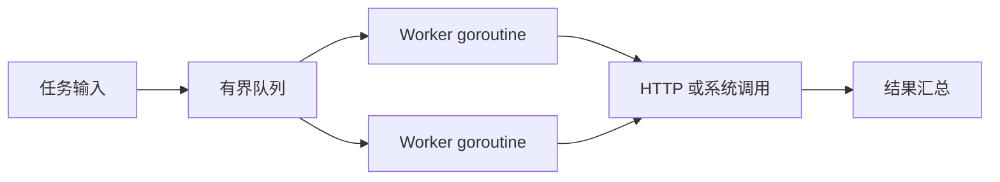
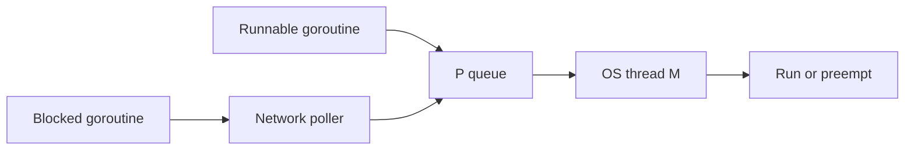
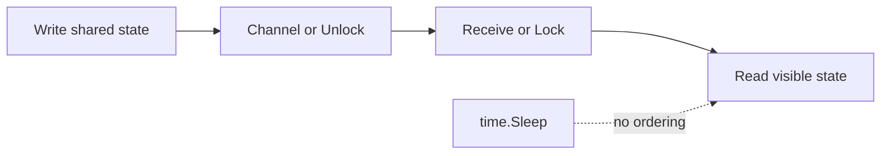

# Go 运维开发与云原生工程 · 第二册：并发与运行时

## 第五章 · 创建 goroutine 之前先画清任务生命周期

### goroutine 与操作系统线程是什么关系，调度器替我们做了什么？

goroutine 是由 Go 运行时调度的并发执行单元，不等同于操作系统线程。
运行时把大量可运行 goroutine 映射到较少的线程上，并处理栈增长、网络轮询和抢占等工作。
这降低了创建并发任务的成本，却没有取消 CPU、内存、文件描述符和下游容量限制。



#### 并发不是并行的同义词

并发描述多个任务在时间上交错推进；并行表示多个任务在同一时刻使用不同执行资源。
I/O 巡检即使只用少量 CPU，也能通过并发隐藏等待；CPU 密集任务能否提速还受核心数、算法和内存带宽影响。
先测串行基线，再逐步增加并发，观察吞吐、P95、错误率和依赖压力。

#### goroutine 很轻但不是免费

每个 goroutine 都需要栈和调度状态，内部还可能持有连接、定时器或缓冲。
下面的写法没有退出条件，会持续泄漏：

```go
func leak(ch <-chan string) {
	go func() {
		for value := range ch {
			fmt.Println(value)
		}
	}()
}
```

调用方既不知道谁关闭 `ch`，也不能取消内部 goroutine。
生产代码应把生命周期归属写进接口：由父任务提供 `context`，创建者等待子任务结束，channel 的发送与关闭责任明确。

#### 用观测验证而不是猜调度器

当延迟升高时，先观察 goroutine 数、阻塞位置、CPU profile、mutex/block profile 和 trace。
不要根据某一篇旧文章中的调度器内部实现直接优化；内部细节会演进，业务可观察的阻塞、队列和资源才是稳定证据。

#### G M P 模型只保留排障所需部分

G 表示 goroutine 及其栈和调度状态，M 表示操作系统线程，P 持有执行 Go 代码所需的调度资源。
P 的数量受 `GOMAXPROCS` 控制，决定同一时刻可执行 Go 代码的并行度；阻塞系统调用、CGO 与运行时行为会使实际线程数不同。

```text
Runnable G queue
      -> P selects G
      -> M executes G
      -> block yield or preempt
      -> another G runs
```

应用不直接管理这个线程池。
业务真正要控制的是任务数量、goroutine 生命周期、连接和下游预算。
调度器会复用线程，但不会替应用限制 HTTP QPS 或数据库连接。

#### G、M、P 与阻塞的因果关系

G 是待执行的 goroutine，M 是操作系统线程，P 提供执行 Go 代码所需的调度资源；G 阻塞时，P 可以让其他 G 继续运行。
网络轮询和抢占改善了利用率，却不会消除锁竞争、连接池耗尽或 cgroup CPU throttling，因此要把运行时 profile 与业务队列指标放在同一时间线上。
验证时分别运行 CPU 密集和阻塞 I/O 任务，改变 `GOMAXPROCS` 与 worker 数，比较 runnable goroutine、CPU throttled time、队列等待和 p95。



#### 阻塞与饱和不是一回事

goroutine 可能等待 channel、mutex、网络 I/O、timer、系统调用或 GC。
CPU 低不等于并发不足：大量任务卡在同一锁或连接池时，增加 goroutine 只会扩大队列。
CPU 高也可能来自序列化、压缩、重试风暴或忙循环，不一定是有效业务吞吐。

应用层记录在途任务、队列深度、等待时长和下游延迟；运行时层观察 goroutine、heap、GC、mutex 和调度。
两层结合，才能区分业务积压与运行时异常。

#### CPU 密集与 I O 密集任务

I/O 等待期间可以调度其他 goroutine，适度并发能提高吞吐。
CPU 密集任务最终受核心和容器配额约束，worker 远多于可用 CPU 往往增加切换与缓存压力。
对哈希、压缩任务先在 `GOMAXPROCS` 附近建立基线；对 HTTP 巡检按 QPS、延迟、连接和内存共同计算。

练习时分别实现 CPU 计算与等待本地 `httptest.Server` 的版本，改变 worker 和 `GOMAXPROCS`，记录吞吐、p95、goroutine 与 CPU。
解释吞吐停止增长后，瓶颈转移到了哪里。

#### 用时间线读一次调度现场

排障时把一次任务拆成“进入队列、开始执行、等待外部 I/O、收到取消、提交结果、退出”六个时间点。
可在每个点记录单调时钟和任务 ID；不要用墙上时钟计算耗时，因为 NTP 校时可能让时间向后跳。

```go
type Span struct {
	Task   string
	Queued time.Time
	Start  time.Time
	End    time.Time
}

func (s Span) QueueWait() time.Duration { return s.Start.Sub(s.Queued) }
func (s Span) RunTime() time.Duration   { return s.End.Sub(s.Start) }
```

如果 queue wait 增长而 run time 稳定，瓶颈在调度或下游配额；如果两者一起增长，先检查依赖延迟和资源争用。
把这两个时长分开是判断“增加 worker 是否有用”的最小证据。

#### 容器 CPU 配额是并发上限的一部分

宿主机有 16 个 CPU 不代表容器能同时运行 16 个 Go 线程。
CPU limit 较小时，运行时会受到 cgroup throttling；大量 runnable goroutine 只会在配额恢复时争抢执行。
压测记录应同时保存容器 limit、`GOMAXPROCS`、CPU throttled time 和请求 p95。
生产调整并发前，先确认是配额不足还是锁、网络和连接池阻塞。

### 谁负责等待、取消和回收 goroutine？

创建 goroutine 的代码应负责它的结束路径。
常见结构是父级 `context` 传播取消，`WaitGroup` 等待全部子任务，结果 channel 由发送方协调关闭。
只调用 `cancel()` 而不等待退出，进程仍可能在资源释放前结束。

```go
func runWorkers(ctx context.Context, n int, jobs <-chan Target) error {
	var wg sync.WaitGroup
	wg.Add(n)
	for i := 0; i < n; i++ {
		go func(workerID int) {
			defer wg.Done()
			for {
				select {
				case <-ctx.Done():
					return
				case target, ok := <-jobs:
					if !ok {
						return
					}
					check(ctx, workerID, target)
				}
			}
		}(i)
	}
	wg.Wait()
	return ctx.Err()
}
```

#### `context` 只传递请求范围信号

`Context` 适合 deadline、取消和请求范围元数据。
它通常作为第一个参数沿调用链传递，不应为方便而存入长期对象，也不应用来承载配置或可选函数参数。
派生的 cancel 函数要尽快 `defer cancel()`，释放定时器资源。

#### 取消是请求，不是强制中断

Go 不会安全地从外部杀死任意 goroutine。
任务必须在等待 channel、网络 I/O、批次边界或其他安全点检查 `ctx.Done()`。
若底层库不接收 context，取消可能无法及时传播；评审依赖时要验证其超时和取消能力。

#### `WaitGroup` 只计数，不传播错误

需要“任一任务失败就取消其余任务”时，可使用标准模式自行组合 context、错误 channel，或在项目允许的情况下采用 `errgroup`。
无论使用什么工具，都应定义：返回第一个错误还是全部错误、已开始任务如何收尾、部分成功怎样呈现。

#### 生命周期表先于代码

| goroutine | 创建者 | 输入关闭者 | 退出条件 | 等待者 | 错误去向 |
| --- | --- | --- | --- | --- | --- |
| producer | `Run` | 自己关闭 jobs | 输入结束或 ctx 取消 | worker 间接等待 | ctx 或结果 |
| worker | `Run` | 不关闭 jobs | jobs 关闭或 ctx 取消 | WaitGroup | results |
| closer | `Run` | 关闭 results | WaitGroup 完成 | range consumer | 无 |

任一列答不上来，都说明生命周期仍隐藏在实现细节中。
“后台任务不重要所以不用等”会在测试、滚动发布与重复调用中累积成泄漏。

#### Context 的传播规则

请求范围函数把 context 作为首参数向下传递，不保存进 struct、不传 nil，也不把它当配置容器。
value 只放 request ID 或 trace 上下文等跨 API 元数据，不放 logger、数据库连接和普通业务参数。

```go
func (c *Client) Get(ctx context.Context, id string) (Target, error) {
	req, err := http.NewRequestWithContext(ctx, http.MethodGet, c.baseURL+"/targets/"+id, nil)
	if err != nil {
		return Target{}, fmt.Errorf("build request: %w", err)
	}
	return c.do(req)
}
```

不要在深层函数使用 `context.Background()` 切断取消。
真正需要请求结束后继续的审计或清理，应建立独立、有界、可等待的生命周期。

#### 取消后的清理与错误

取消只是关闭一个信号。
goroutine 仍需从阻塞调用返回、释放锁与文件，并报告状态。
若依赖 API 不接受 context，就无法保证及时取消；外围超时只能限制等待，底层操作可能仍继续。

“首错取消”适合不可分割任务，“继续汇总”适合批量巡检。
若要首错取消又要知道每个未完成项，必须为 cancelled 结果建模。
测试可让一个 worker 阻塞、一个失败、一个等待发送，然后取消父 context，确认全部退出。

#### 取消原因也属于结果契约

调用方需要区分主动取消、deadline 到期和上游失败触发的级联取消。
带原因的取消函数和 `context.Cause` 从 Go 1.20 起可用；项目若要兼容较旧工具链，则在任务结果中显式保存 `cause` 字段，不要只把所有情况压成字符串 `context canceled`。
无论采用哪种方式，都要规定日志级别和退出码：用户主动取消通常不是程序错误，deadline 则应计入超时指标。

```go
ctx, cancel := context.WithCancelCause(context.Background())
cancel(fmt.Errorf("dependency budget exhausted"))
<-ctx.Done()
fmt.Println(context.Cause(ctx))
```

这是局部片段，必须在项目 `go.mod` 声明的最低版本上编译验证。
取消原因不能携带 Secret，也不应把底层响应体整段塞进错误。

### 怎样用 goroutine profile 和运行指标发现泄漏？

泄漏通常表现为 goroutine 数持续增长、连接不释放、内存随请求上升或关闭超时。
一次快照只能说明当时状态；可靠判断需要在稳定负载下比较基线、峰值和任务结束后的回落。

```go
var active = expvar.NewInt("active_checks")

func observedCheck(ctx context.Context, target Target) error {
	active.Add(1)
	defer active.Add(-1)
	return checkTarget(ctx, target)
}
```

#### 建立可解释指标

至少观察在途任务、队列深度、完成数、错误分类、超时数和任务耗时。
`runtime.NumGoroutine()` 可作为趋势线索，但不是泄漏证明：HTTP 连接、垃圾回收和运行时内部任务都会改变数值。

#### 安全使用诊断端点

`net/http/pprof` 会暴露堆栈、路径和运行细节，不应无认证监听公网。
更安全的做法是只监听 loopback 或独立管理端口，通过受控隧道访问，并设置采集窗口、文件权限与保留时间。

```bash
go tool pprof http://127.0.0.1:6060/debug/pprof/goroutine
go tool trace trace.out
```

比较 profile 时记录版本、负载、持续时间和配置。
优化后再次执行同样场景，确认错误率没有上升、取消仍能完成、资源能回落。

#### 先定义正常基线

HTTP server、连接池、指标系统和运行时本来就会创建长期 goroutine。
上线前在空闲、稳定负载和峰值记录基线，关注负载结束后是否回落到可解释范围，而不是设定一个脱离场景的固定总数。

`worker_active`、`jobs_queued`、`requests_inflight` 和 `buffer_bytes` 比总 goroutine 更可行动。
总数增长时先定位组件，再用 profile 找创建栈。

#### 获取并比较 profile

```bash
curl -fsS 'http://127.0.0.1:6060/debug/pprof/goroutine?debug=2' > goroutines.txt
go tool pprof -top 'http://127.0.0.1:6060/debug/pprof/goroutine'
```

重点看大量 goroutine 是否停在 channel send/receive、mutex、网络读、timer 或自建循环。
间隔采集两到三次，判断堆栈数量是暂时波动还是持续累积。
一次 profile 只能证明采集窗口内的状态。

#### 常见泄漏模式

- 结果消费者提前退出，worker 永久阻塞发送；
- ticker 未 Stop，消费循环没有退出；
- 网络调用缺少 context 或 timeout；
- 每次重连启动新循环，旧循环未取消；
- 生产者等待写满队列，而消费者已经退出；
- 测试启动 server 或 goroutine 后未 cleanup。

修复不能只增大 channel。
应让拥有发送生命周期的一方关闭 channel，并让每个阻塞点都有完成或取消路径。

#### 从 profile 栈回到代码所有者

看到大量 `chan send` 栈时，先沿调用栈找到创建 goroutine 的业务函数，再查它的接收者是否可能提前返回。
看到 `time.NewTicker` 栈时，搜索对应 `Stop` 是否在同一生命周期内注册。
把 profile 中的函数名、源码位置和预计退出条件写进现场记录，下一次采样才能判断修复是否生效。

```bash
curl -fsS 'http://127.0.0.1:6060/debug/pprof/goroutine?debug=2' \
  | rg -n 'chan send|chan receive|time.NewTicker|net/http' \
  | head -n 40
```

命令只用于本机受控诊断。
若管理端口没有认证，必须限制监听地址和网络 ACL；不要把 profile 内容粘贴到公开工单。

#### 泄漏回归与现场记录

优先等待组件自己的活动计数归零。
测试重复启动和取消几十次，超时后打印 goroutine profile。
生产现场记录负载、队列、在途指标、两次 profile、常见堆栈、止损操作和恢复曲线；若必须重启，也尽量先保存有界诊断证据。

## 第六章 · 用 channel 传递任务，同时保留背压

### 无缓冲与有缓冲 channel 分别建立了什么同步关系？

无缓冲 channel 需要发送方与接收方同时就绪，强调交接；有缓冲 channel 允许有限数量的任务排队，强调容量。
缓冲不是越大越好：过大队列会增加陈旧任务、内存和关闭时间，并把下游过载隐藏得更久。

```go
jobs := make(chan Target, 20)
results := make(chan Result, 20)
```

#### 容量来自预算

队列容量应根据最大可接受等待时间、单任务耗时和 worker 数推导。
例如 5 个 worker、平均每项 1 秒、最多接受 4 秒排队，可以从 20 左右开始测量，而不是随手写 `10000`。

#### 发送和接收都可能阻塞

生产者发送时应能响应取消：

```go
select {
case jobs <- target:
	return nil
case <-ctx.Done():
	return ctx.Err()
}
```

如果只写 `jobs <- target`，队列满时生产者无法停止。
消费者也应区分 channel 关闭和零值，使用 `value, ok := <-ch`。

#### channel 传值会复制

复制结构体不等于深拷贝，其中的 slice、map 和指针仍可能共享底层数据。
跨 goroutine 传递后，最好把数据视为不可变，或明确由接收者取得唯一所有权。

#### 用排队论做第一版预算

如果 5 个 worker 每秒各完成 1 个任务，稳定服务能力约 5 个每秒。
输入长期达到 8 个每秒时，无论 channel 多大，积压都会持续增长；扩大 buffer 只会推迟失败。
先保证长期到达率低于服务率，再用 buffer 吸收短暂突发。

队列等待时间也属于任务总时延。
监控 enqueue 到 worker 开始的时间，而不只测执行耗时。
目标已在队列等待 30 秒后再给它 10 秒请求 timeout，可能已经违背 20 秒总 SLO。

#### channel 方向表达所有权

函数参数使用 `<-chan T` 和 `chan<- T` 表达只收或只发，使误关闭和误发送更早被编译器发现。
返回 channel 的函数必须在文档中说明谁消费、何时关闭以及调用方停止消费会怎样。

```go
func produce(ctx context.Context, out chan<- Target, targets []Target) error {
	for _, target := range targets {
		select {
		case out <- target:
		case <-ctx.Done():
			return ctx.Err()
		}
	}
	return nil
}
```

#### nil channel 的特殊语义

对 nil channel 发送和接收会永久阻塞，close 会 panic。
在 select 中 nil channel 的 case 永远不可选，这可用于动态启停分支，但会增加理解成本。
配置错误意外留下 nil channel 时，程序可能静默挂住，因此构造器应建立非 nil 不变量。

#### 背压实验

让消费者每次等待 100ms，分别用容量 0、10、1000 的 channel 处理 100 个任务，记录生产耗时、峰值队列、总耗时与取消延迟。
观察大 buffer 为什么让生产者很快返回，却没有提高最终处理能力。

### channel 应该由谁关闭，`select` 又怎样处理超时和退出？

一般由发送方关闭 channel，因为发送方最清楚何时不会再产生值。
接收方不要为了“停止等待”擅自关闭，否则并发发送可能触发 `send on closed channel`。
多发送方场景由一个协调者等待全部发送者后关闭。

```go
var producers sync.WaitGroup
producers.Add(2)
for i := 0; i < 2; i++ {
	go func() {
		defer producers.Done()
		produce(ctx, jobs)
	}()
}
go func() {
	producers.Wait()
	close(jobs)
}()
```

#### 关闭是广播完成，不是资源析构

关闭 channel 后，接收者仍可读出缓冲中的剩余值。
channel 不需要像文件那样“释放”；关闭它的目的主要是告诉接收方不会再有数据。
只用于单次通知的 channel 可以 `close(done)` 广播。

#### 统一 deadline，避免层层创建互相矛盾的超时

最外层为一次操作建立总 deadline，内部依赖可以设置更短的单次超时，但不能超过剩余时间。
循环里使用 `time.After` 会重复分配定时器；长期循环应复用 `Timer` 或 `Ticker` 并在结束时停止。

#### 公平性不要靠想象

多个 case 同时可用时，`select` 会选择一个可执行分支，但业务不能依赖固定顺序。
优先级需求应通过不同队列、显式状态或分阶段处理实现，而不是假设源码排列代表优先级。

#### 关闭协议而不是到处 recover

最常见协议是生产者关闭数据 channel，协调者关闭结果 channel，消费者只读取。
不要通过 `recover` 掩盖重复 close 或 send-after-close；这类 panic 说明所有权设计错误。
多个 producer 使用 WaitGroup，由唯一协调者在全部结束后 close。

只需广播取消时，可创建 `done := make(chan struct{})` 并由单一 owner close；所有等待者同时被唤醒。
现代代码通常直接使用 context，但 done channel 仍适合组件内部、无需错误原因的简单通知。

#### Timer 与 Ticker 生命周期

`time.After` 适合低频一次性等待；热循环中反复创建会产生大量 timer。
可复用 `time.Timer`，Stop 后处理可能已到达的值，再 Reset。
Ticker 用于周期动作，退出时 Stop，但 Stop 不会关闭其 channel，消费者必须依赖 context 结束。

```go
ticker := time.NewTicker(interval)
defer ticker.Stop()
for {
	select {
	case <-ticker.C:
		collect()
	case <-ctx.Done():
		return ctx.Err()
	}
}
```

若一次 collect 超过 interval，必须决定跳过、串行延后还是允许重叠。
默认在同一循环串行执行可避免重入，但实际频率会下降；需要并发时仍要设置上限。

#### select 中的取消竞争

当发送与取消同时可执行时，select 可能选择发送，因此“调用 cancel 后绝不再产生一个结果”不能仅靠普通 select 保证。
若协议要求严格停止，需在提交前后重新检查状态，或让单一状态机决定是否接受；多数场景则把取消定义为尽快停止，允许已就绪操作完成。

#### 超时分层练习

建立批次 10 秒、单目标 2 秒、重试退避 200ms 的链路。
用慢 server 验证单目标不会超过 2 秒，所有尝试和退避不会超过批次剩余时间，取消后 timer 和 ticker 都停止。

### 批量巡检怎样限制 worker 数量并汇总部分失败？

批量任务应同时限制全局并发和单目标压力，保留每个目标结果，并定义整体退出码。
遇到一个失败是否取消全批次取决于业务：只读巡检通常继续收集，其余强依赖步骤可能快速失败。

```go
type CheckResult struct {
	Target string
	Err    error
}

func worker(ctx context.Context, jobs <-chan Target, out chan<- CheckResult) {
	for target := range jobs {
		err := checkTarget(ctx, target)
		select {
		case out <- CheckResult{Target: target.Name, Err: err}:
		case <-ctx.Done():
			return
		}
	}
}
```

#### 结果汇总必须知道期望数量

协调者负责启动固定 worker、提交任务、关闭 jobs、等待 worker，再关闭 results。
不要在等待结果的同一 goroutine 中同步提交超过缓冲容量的任务，否则可能形成互等。

#### 部分失败是正式状态

建议区分：全部成功、部分失败、输入错误、认证失败和执行器故障。
JSON 中保留每个目标的状态与错误类别；退出码例如 `0` 表示全成功，`2` 表示部分失败，`1` 表示程序自身失败。
具体数字应写入 CLI 契约并测试。

#### 什么时候升级为独立 Worker

进程内 worker 无法保证进程重启后的任务恢复。
只有任务需要持久化、自动重试、多实例消费或独立扩缩容时，才考虑任务表与独立进程；消息队列不是业务状态的唯一来源，任务的操作者、参数、状态、错误和时间仍需可审计存储。

#### worker pool 的关闭顺序

正确关闭顺序是停止接收新批次、停止生产 jobs、等待 worker 完成或取消、关闭 results、完成汇总。
若先关闭 results，仍在发送的 worker 会 panic；若只关闭 jobs 不等待，进程可能丢掉在途结果。

```text
accept=false
  -> producer stops and closes jobs
  -> workers drain or observe cancellation
  -> WaitGroup reaches zero
  -> coordinator closes results
  -> collector finishes report
```

关闭窗口需要预算。
只读巡检可能允许取消剩余任务；写操作可能必须完成提交或记录可恢复状态。
不能用同一个粗暴超时处理所有副作用。

#### 全局与每目标并发

全局 worker 上限保护进程，但同一目标可能仍被所有 worker 同时访问。
按主机、租户或 API endpoint 增加局部 semaphore，避免单目标被压垮。
获取多个限制器时保持固定顺序，或者设计为只需一次获取，减少死锁。

限流控制速率，semaphore 控制同时在途数量，队列控制等待容量。
三者回答不同问题，不能互相替代。
HTTP transport 的连接上限还会形成另一层等待，应将它纳入指标。

#### 部分失败报告模型

结果至少包含 target、状态、错误码、可重试性、attempt、开始和结束时间。
错误全文供诊断，稳定 code 供机器判断。
整体 summary 包含 total、succeeded、failed、cancelled 和 incomplete，确保数量守恒。

取消时未开始的目标是 `cancelled` 还是不出现在结果中必须固定。
缺少结果而 summary 仍称 complete 会误导自动化。

#### worker pool 验收

使用可控 fake 验证并发峰值；随机返回部分错误验证数量守恒；消费者变慢验证背压；取消验证所有 active 归零；执行 `go test -race -count=20` 增加调度交错。
最后用基准逐步增加 worker，找到吞吐不再增长的点，并检查下游错误率。

## 第七章 · 共享状态不可避免时选择最小同步工具

### Mutex、RWMutex 和 channel 应该按什么条件选择？

channel 适合传递所有权和事件；Mutex 适合保护一组内存不变量。
不要把“用 channel 才是 Go 风格”当成教条，也不要让每个字段拥有独立锁而失去整体一致性。

```go
type Registry struct {
	mu      sync.RWMutex
	targets map[string]Target
}

func (r *Registry) Get(name string) (Target, bool) {
	r.mu.RLock()
	defer r.mu.RUnlock()
	target, ok := r.targets[name]
	return target, ok
}
```

#### 锁保护不变量而不是代码行

先写出“名称唯一”“计数与明细一致”等不变量，再让同一临界区完成相关字段更新。
持锁期间避免网络、磁盘和可能回调未知代码的操作，否则延迟和死锁风险会扩大。

#### happens-before 是可见性的依据

没有同步关系时，一个 goroutine 写变量、另一个 goroutine 随后“看起来晚一点”读取，仍然是数据竞争；`time.Sleep` 不建立内存可见性。
channel 发送完成发生在对应接收完成之前，channel close 发生在接收者观察到关闭之前，Mutex 的 Unlock 与后续 Lock、Once 完成与后续 Do 返回都建立规范定义的同步关系。
实验输出应同时保存 race 报告和同步版本的稳定结果，不能只记录“这次打印了 42”。



```go
var value int
ready := make(chan struct{})
go func() {
	value = 42
	close(ready)
}()
<-ready
fmt.Println(value)
```

这里 `close` 与接收建立发布/获取关系，因此读取 `value` 有依据。
把 `<-ready` 换成 sleep 既可能竞争，也无法由时间长短修复。
原子操作只对参与原子协议的状态提供保证，不能让旁边多个普通字段自动组成一致快照。

#### RWMutex 不保证更快

读锁允许并行读，但管理开销和写者等待可能让它不如普通 Mutex。
只有读路径占绝对多数、临界区有实际成本且 profile 证明锁竞争时，才保留 RWMutex。

#### 拷贝锁是严重错误

包含 Mutex 的值在首次使用后不得复制，相关方法通常使用指针 receiver。
运行 `go vet` 可发现部分 copylocks 问题，但设计时仍应避免按值传递含锁结构。

#### 临界区从不变量推导

假设 Registry 同时保存目标 map 与健康目标计数，更新两者必须处于同一把锁内；分别用两个锁会让读者观察到不一致快照。
先在注释中写 `healthy == count(target.Status == Healthy)`，再让 Add、Update、Delete 都维护它。

读取复合状态时也要在同一临界区复制快照，解锁后再做 JSON 编码或网络发送。
持锁执行慢操作会阻塞所有访问；解锁后直接返回内部 map 又会让调用方绕过保护。

#### 固定锁顺序避免死锁

若确实要同时获得两个对象锁，所有路径保持相同顺序，例如按稳定 ID 排序后加锁。
更好的设计常是提高聚合边界，用一把锁保护事务，或通过消息让单一 owner 更新。

排查死锁时抓 goroutine profile，寻找相互等待的 Lock 和 channel；检查 defer 是否因函数不返回而迟迟不 unlock；检查持锁回调是否再次进入同一对象。
Go mutex 不可重入。

#### RWMutex 的测量

用 benchmark 构造实际读写比例和临界区工作，而不是只测空锁。
记录 ns/op、吞吐和 mutex profile。
读操作很短、写入频繁或 CPU 核少时，RWMutex 可能更慢。
优化后仍要运行 race 和不变量测试。

#### 锁封装练习

实现 Registry 的 `Snapshot`、`Upsert` 和 `Delete`，内部 map 不导出。
并行启动读写测试，执行 race；故意把编码放进读锁再用慢 writer 观察写者等待，然后改为锁内复制、锁外编码。

### Cond、原子操作、Once 和 WaitGroup 各自保护什么不变量？

这些工具解决的问题不同：`WaitGroup` 等待一组任务结束，`Once` 确保初始化最多执行一次，原子操作更新单个简单状态，`Cond` 让等待者在条件可能变化时重新检查谓词。

| 工具 | 合适场景 | 常见误用 |
| --- | --- | --- |
| WaitGroup | 等待已知一组 goroutine | 边 Wait 边不受控 Add；复制 |
| Once | 进程内一次初始化 | 初始化失败后无法自然重试 |
| atomic | 计数、指针快照等单值状态 | 用多个原子变量拼业务事务 |
| Cond | 复杂条件等待与广播 | 不在循环中重查条件 |

```go
cond.L.Lock()
for !ready() {
	cond.Wait()
}
useResource()
cond.L.Unlock()
```

`Wait` 会原子地解锁并等待，醒来后重新加锁；被唤醒只表示条件“可能”变化，因此必须在循环中检查。
多数简单生产者消费者场景用 channel 更直观，没必要为了展示 Cond 增加复杂度。

#### 原子不等于无锁业务逻辑

原子计数适合指标，但“任务状态、结果和更新时间必须一起变化”属于复合不变量，应使用锁或持久化事务。
混合原子和普通访问同一变量会产生数据竞争。

#### WaitGroup 的使用边界

`Add` 应在创建 goroutine 的父级执行，避免 goroutine 尚未 Add 而 Wait 已返回。
每个成功 Add 对应一次 Done，通常在 goroutine 开头 defer。
WaitGroup 可复用，但上一轮 Wait 完成前不能开始混乱的下一轮计数。

它不限制并发、不取消任务、不收集结果。
需要这些能力就组合 semaphore、context 和结果模型，不能从 WaitGroup 推断工作成功。

#### Once 的失败语义

`sync.Once` 把函数执行一次，即使函数内部初始化失败或 panic，再次调用也不会自然重试。
需要返回错误时可把结果保存在同一对象并让所有调用者读取；需要可重试初始化时，使用显式状态机和锁。

适合 Once 的例子是构造进程级不可变 lookup table；不适合依赖网络的登录、配置拉取或数据库连接。
后者会因短暂故障把进程永久锁在失败状态。

#### 原子快照

`atomic.Int64` 适合计数；`atomic.Pointer` 或 `atomic.Value` 可发布构建完成的不可变配置快照。
writer 创建全新对象后一次 Store，reader Load 后只读。
若 reader 修改内部 map，原子替换并没有保护内部数据。

#### Cond 的典型协议

Cond 的条件由关联锁保护。
修改条件的一方持锁更新状态，再 Signal 或 Broadcast；等待方在 for 循环中检查。
Signal 不承诺唤醒哪个等待者，Broadcast 可能造成惊群。
若状态可以自然表示为一次性 channel 通知或任务队列，优先用更简单机制。

#### 同步原语选择练习

为“活动请求数”“配置热更新”“容量为 N 的任务槽”“等待缓存首次加载”“任务状态与结果”分别选择 atomic、原子快照、buffered channel/semaphore、Once/显式状态和 mutex。
为每项写出不变量与失败测试，避免按 API 熟悉度选工具。

#### 错误时序要能被测试捕获

故意把 `WaitGroup.Add(1)` 放进新 goroutine，再让父级立即 `Wait`，测试可能偶发提前返回；这说明 Add 必须在启动前完成。
让 Once 初始化第一次返回临时错误，再调用第二次，观察初始化不会自动重试；据此把网络初始化改成带状态与退避的显式过程。
对 Cond，制造没有循环检查谓词的等待者并广播两次，确认唤醒不等于条件成立。

```text
bad:  go func { Add 1; work; Done } -> Wait may return first
good: Add 1 -> go func { defer Done; work } -> Wait
```

这些实验应执行 `go test -race -count=100`，但“没有复现”不能证明错误用法安全。
同步契约首先来自内存模型与 API 规则，压力测试只增加观察机会。

### `sync.Map` 与 `sync.Pool` 为什么不能当作通用性能按钮？

`sync.Map` 针对特定并发访问模式优化，并牺牲了静态类型和普通 map 的清晰度。
大多数业务状态更适合 `map` 加锁。
只有 key 相对稳定、并发读多写少，或不同 goroutine 写不同 key，且 profile 证明收益时再考虑。

`sync.Pool` 保存可临时复用的对象，运行时可在任意垃圾回收周期清空它。
它不是缓存，不能承载必须存在的数据，也不能用来复用含敏感内容而未清理的缓冲。

```go
var buffers = sync.Pool{
	New: func() any { return new(bytes.Buffer) },
}

func render(v any) []byte {
	buf := buffers.Get().(*bytes.Buffer)
	buf.Reset()
	defer func() {
		buf.Reset()
		buffers.Put(buf)
	}()
	_ = json.NewEncoder(buf).Encode(v)
	return bytes.Clone(buf.Bytes())
}
```

返回前必须复制数据，否则 buffer 放回池后会被后续使用覆盖。
是否值得使用 Pool 要靠 allocation profile 和 benchmark 证明；先减少不必要分配、缩小对象生命周期通常更清楚。

#### sync Map 的适用模式

官方语义针对写一次读多次的缓存，或不同 goroutine 操作不相交 key 的场景。
需要“检查后更新”“按多个字段保持一致”时，`LoadOrStore` 等单操作仍无法组成业务事务。
泛型 map 加 RWMutex 通常类型更清晰。

使用 `Range` 时看到的不是某一时刻的一致快照，回调中其他 goroutine 可以修改。
若报表要求一致视图，应在自己的锁下复制普通 map，或从持久存储读取事务快照。

#### Pool 的生命周期和安全

Pool 中对象可能随 GC 消失，所以只能做优化，不能依赖命中率保证功能。
Put 前清理长度、引用和 Secret；对超大 buffer 可直接丢弃，避免偶发大请求让池长期保留高容量对象。

```go
if buf.Cap() <= 64<<10 {
	buf.Reset()
	buffers.Put(buf)
}
```

返回 slice、string 或 reader 若仍引用池对象，Put 后会产生数据破坏甚至竞争。
最安全是使用期间完全拥有，输出前复制，defer 清理归还。

#### 用 profile 决定是否引入

先保存 `-benchmem` 的 allocs/op 与 B/op，再看 alloc_space/inuse_space profile 找热点。
引入 Pool 后重复多轮 benchmark，同时监控内存峰值、GC 和并发正确性。
若收益很小，移除复杂优化。

#### 反优化练习

先实现普通 map+mutex 与每次新建 buffer 的清晰版本，建立测试和 benchmark；再分别换成 sync.Map 与 Pool。
若数据没有证明改进，保留简单版本，并在评审记录中说明为什么没有采用“看起来更高级”的工具。

#### 敏感 buffer 必须在归还前清理

Pool 复用的 `[]byte` 可能曾装过 Token、响应体或配置。
归还前清零有效长度覆盖的区域，并为容量设置上限；偶发 8 MiB buffer 不应进入长期复用池。
取出后总是重置长度，调用方不得在 Put 后继续持有引用。

```go
func putBuffer(pool *sync.Pool, buf []byte) {
	clear(buf)
	if cap(buf) <= 64<<10 {
		pool.Put(buf[:0])
	}
}
```

这是局部片段，内置函数 `clear` 从 Go 1.21 起可用；更低版本需要显式清零循环或提高项目最低工具链。
测试把醒目的假 Secret 写入 buffer，归还再取出后扫描底层容量；随后比较启用 Pool 前后的分配与 RSS，避免只看 `allocs/op` 忽略常驻容量。

## 第八章 · 用测试、竞争检测和性能证据关闭并发风险

### 第一个表驱动测试应该覆盖成功、失败和边界中的什么？

表驱动测试适合对同一行为组合多组输入。
名称应写清条件和期望，失败输出包含输入差异。
不要把所有行为塞进一个巨大表，也不要只测试内部函数调用次数。

```go
func TestParsePort(t *testing.T) {
	tests := []struct {
		name    string
		raw     string
		want    uint16
		wantErr bool
	}{
		{name: "valid", raw: "8080", want: 8080},
		{name: "zero", raw: "0", wantErr: true},
		{name: "too large", raw: "70000", wantErr: true},
		{name: "text", raw: "http", wantErr: true},
	}
	for _, tt := range tests {
		t.Run(tt.name, func(t *testing.T) {
			got, err := parsePort(tt.raw)
			if (err != nil) != tt.wantErr || got != tt.want {
				t.Fatalf("parsePort(%q)=(%d,%v)", tt.raw, got, err)
			}
		})
	}
}
```

测试错误时优先断言 `errors.Is`、类型或稳定字段，不要把会变化的整段错误文字当成唯一契约。

#### 并行测试需要隔离状态

调用 `t.Parallel()` 前确认测试不共享环境变量、固定端口、当前目录和全局变量。
`t.Setenv` 与临时目录能改善隔离，但并行测试仍需理解其生命周期。

#### 从行为分区设计用例

先写等价类：合法、输入拒绝、依赖失败、调用方取消和内部不变量错误；再为每类选择边界。
并发函数还要覆盖零任务、worker 为 1、worker 大于任务数、消费者变慢与取消恰好发生在发送时。

表中只放输入和预期，复杂环境准备放 helper。
helper 调用 `t.Helper()`，失败信息才能指向具体 case。
测试名写条件，例如 `cancel_while_result_blocked`，不要只写 `case_3`。

#### 测试数量守恒和不变量

不要只断言“没有错误”。
批量结果应验证 `succeeded + failed + cancelled == submitted`、目标不重复、并发峰值不超过上限、取消后 active 最终归零。
顺序若是契约就逐项比较，不是契约则按 key 比较，避免测试偶然调度顺序。

#### 测试 panic 和清理

核心代码通常不应 panic。
确需验证 panic 时使用 defer recover，并同时确认资源清理；HTTP 边界的 recover 测试应检查返回 500、request ID 和日志，而不是让测试因 panic 直接结束。

使用 `t.Cleanup` 关闭 server、cancel context 和恢复全局设置。
cleanup 按后进先出执行，与资源获取顺序对应。
测试失败路径同样必须清理。

#### 模糊测试补充边界

解析器、协议输入和状态转换适合 fuzz。
先加入能表达业务边界的 seed，fuzz 中检查不 panic、输出满足不变量、编码解码可往返。
fuzz 不能替代表驱动的业务语义测试，但能发现截断、无效 UTF-8 和意外组合。

```go
func FuzzParsePort(f *testing.F) {
	f.Add("8080")
	f.Add("-1")
	f.Fuzz(func(t *testing.T, raw string) {
		port, err := parsePort(raw)
		if err == nil && port == 0 {
			t.Fatalf("successful parse returned zero for %q", raw)
		}
	})
}
```

### 不连接真实主机、网络和时钟，测试如何保持可重复？

把不可控边界替换为接口或标准测试工具。
HTTP 客户端可使用 `httptest.Server`，文件使用 `t.TempDir()`，输入输出使用 `io.Reader` 和 `io.Writer`，时间可传入 `Clock` 或 deadline。

```go
func TestClientTimeout(t *testing.T) {
	server := httptest.NewServer(http.HandlerFunc(func(w http.ResponseWriter, r *http.Request) {
		time.Sleep(50 * time.Millisecond)
		w.WriteHeader(http.StatusOK)
	}))
	defer server.Close()

	client := &http.Client{Timeout: 10 * time.Millisecond}
	_, err := client.Get(server.URL)
	if err == nil {
		t.Fatal("expected timeout")
	}
}
```

依赖真实睡眠的测试可能在慢 CI 上抖动。
更稳定的做法是由 handler 等待测试控制的 channel，并用合理 deadline 防止测试永久挂起。

#### 测试替身保持最小

不要为了 mock 大接口生成大量无意义方法。
接口由使用方定义且尽量小，fake 只记录必要输入并返回指定结果。
集成测试再验证真实客户端与协议兼容。

#### HTTP 使用可控握手而不是 sleep

handler 通过 channel 通知“请求已到达”，再等待测试释放。
测试先确认调用已经进入 handler，然后取消 context 或关闭 release。
这样测试验证因果，而不是猜 CI 在 50ms 内会调度到哪一步。

```go
started := make(chan struct{})
release := make(chan struct{})
server := httptest.NewServer(http.HandlerFunc(func(w http.ResponseWriter, _ *http.Request) {
	close(started)
	<-release
	w.WriteHeader(http.StatusOK)
}))
t.Cleanup(server.Close)
```

仍需给整个测试设置兜底 deadline，防止实现缺陷永久挂起。
不要在 handler 中调用 `t.Fatal`，因为它运行在另一个 goroutine；通过 channel 把观察结果传回测试 goroutine。

#### 时钟和 timer 的替换层次

纯计算函数直接接收 `now time.Time` 最简单。
需要多次 Now 或 timer 时定义小 Clock 接口，但 fake clock 也必须正确模拟推进和等待，否则测试通过的是自创语义。
另一种方式是把“何时触发”留给外层，核心函数只处理一次 tick。

#### 文件、环境与网络隔离

文件测试使用 `t.TempDir` 和显式路径，不修改共享 cwd。
环境用 `t.Setenv`，不要与 `t.Parallel` 混用。
监听地址使用 `127.0.0.1:0` 让系统分配端口，不写死 8080。
TLS 行为用 `httptest.NewTLSServer`，并使用它提供的受信客户端，而不是全局关闭证书校验。

#### fake 与真实依赖的证据边界

fake 能证明调用顺序和错误处理，不能证明 SQL、HTTP 编码、Kubernetes defaulting 或认证协议。
repository 使用容器化真实数据库做集成测试；Kubernetes Controller 用 envtest；外部 SaaS 使用供应商 sandbox 或契约测试。
每层报告自己真正验证的内容。

#### 可重复性练习

把包含 `time.Sleep`、固定端口和真实公网请求的测试改成 channel handshake、随机本地端口和 httptest。
执行 `go test -count=50` 与 `go test -race`，记录修改前后的失败率和耗时分布。

### race、benchmark、pprof、trace 和 GC 证据应该按什么顺序使用？

先保证正确性，再查数据竞争，然后测基线，最后 profile 热点。
四者回答不同问题：测试验证行为，race 检测已执行路径上的竞争，benchmark 比较可重复性能，pprof/trace 解释资源消耗和调度。

```bash
go test ./...
go test -race ./...
go test -run '^$' -bench BenchmarkCheck -benchmem ./internal/checker
go test -run '^$' -bench BenchmarkCheck -cpuprofile cpu.out ./internal/checker
go tool pprof cpu.out
```

#### benchmark 防止编译器消除与环境噪声

基准应使用真实结果、保持输入可比，并记录 Go 版本、CPU、并发和参数。
一次更快不能证明改进；使用多轮结果比较分布，确认正确性测试仍通过。

#### race 通过不代表没有竞争

race detector 只能发现运行时实际发生的冲突。
为并发路径设计压力测试、重复执行，并覆盖取消、关闭和错误分支。
它有额外开销，不应直接把 race 模式性能当作生产性能。

#### 优化必须带回归边界

任何减少锁、复用 buffer 或改变队列的优化都要回答：错误是否仍完整、顺序契约是否变化、取消是否更慢、内存峰值是否转移到队列。
第二册的最终验收不是“跑得快”，而是并发量有界、所有任务可结束、失败可汇总且证据可重复。

#### 先区分 heap、RSS 与容器 OOM

Go heap profile 描述运行时管理的 Go 对象，RSS 还包含 goroutine 栈、mmap、共享库、CGO 分配和内核计入的常驻页。
容器 OOM 依据 cgroup 记账，不会因为 heap profile 看起来不大就自动放过进程。
排查顺序是先确认 cgroup limit 与 OOM 事件，再比较 RSS、Go heap、goroutine、离线 buffer 和外部库占用。

```bash
go tool pprof -top http://127.0.0.1:6060/debug/pprof/heap
curl -fsS http://127.0.0.1:6060/debug/metrics \
  | rg '/gc/heap|/memory/classes|/sched/goroutines'
```

profile 采集时记录负载、版本、运行时长和 GC 设置。
`alloc_space` 适合找累计分配热点，`inuse_space` 适合看采样时仍存活的对象；一次采样不能证明泄漏，需在负载结束并经历 GC 后观察是否回落。

#### `GOGC` 与 `GOMEMLIMIT` 是约束，不是修复按钮

`GOGC` 控制相对 heap 增长触发 GC 的目标，较小值通常换取更多 CPU 以降低 heap 峰值；`GOMEMLIMIT` 为运行时提供软内存目标，但不包含进程所有内存，也不是容器 hard limit。
`GOMEMLIMIT` 需要 Go 1.19 及以上；部署到更旧工具链时只能使用其他运行时或容器层面的约束。
设置过低会造成频繁 GC 和吞吐下降，仍可能因非 Go 内存或短时峰值 OOM。

容器内应给运行时目标留出非 heap、内核记账和突发余量。
例如 limit 为 512 MiB 时，不应把 `GOMEMLIMIT` 直接设成 512 MiB。
先在代表性负载下测量基础 RSS、栈、连接和峰值，再决定余量并通过压测验证。

```bash
GOGC=100 GOMEMLIMIT=400MiB ./bounded-runner
GODEBUG=gctrace=1 ./bounded-runner 2>gc.trace
```

`gctrace` 适合短时诊断，不应长期无界写日志。
观察 GC CPU、heap goal、RSS、吞吐和 p99；若降低内存后 timeout 与错误率上升，不能仅因“没有 OOM”就判定成功。

#### GC 只管理 Go 堆的一部分

heap goal 描述运行时希望控制的 Go 堆增长，RSS 还包括线程栈、映射、CGO 和文件页缓存；容器 OOM 依据的是整体 cgroup 使用量。
调参前先区分存活对象、分配速率、无界队列和非 Go 内存，否则降低 `GOGC` 可能只是用更多 CPU 换来暂时的 RSS 下降。
用固定负载分别采集 `gctrace`、heap profile、RSS 和 cgroup `memory.current`，确认调参改变的是哪一类资源。

#### 用 escape analysis 解释分配，而不是猜性能

编译器会根据值的生命周期决定对象放在栈上还是堆上。
返回局部变量的指针、把值装入接口、闭包捕获循环变量、或把大对象交给长期保存的 goroutine，都可能增加堆分配；这只是线索，不等于“堆分配一定是 bug”。

用编译器报告定位候选路径：

```bash
go test -gcflags='-m=2' ./internal/checker 2>escape.txt
rg -n 'escapes to heap|moved to heap|leaking param' escape.txt
```

下面的完整程序用于观察接口装箱和返回指针的差异，要求 Go 1.18+（使用 `any`），输出数字本身不是跨机器基准：

```go
package main

import "fmt"

type sample struct {
	value [32]byte
}

func asInterface() any {
	return sample{}
}

func asPointer() *sample {
	return &sample{}
}

func main() {
	fmt.Printf("%T %T\n", asInterface(), asPointer())
}
```

验证顺序应是：先用 benchmark 确认分配和延迟确实影响当前场景，再用 escape 报告提出最小改动，最后用 `-benchmem`、正确性测试和 RSS 复测。
不要为了消除一条 `escapes to heap` 牺牲接口边界、可读性或数据安全。
如果对象被 channel、缓存、日志字段或任务表长期持有，真正的问题通常是所有权和生命周期，而不是某一次编译器选择。

#### 从证据选择工具

| 问题 | 首选证据 | 不能单独证明 |
| --- | --- | --- |
| 是否有数据竞争 | `go test -race` 的实际路径 | 未执行路径无竞争 |
| 改动是否更快 | 多轮 benchmark 与环境 | 生产尾延迟一定下降 |
| CPU 花在哪里 | CPU profile | 等待依赖的墙钟时间 |
| 存活对象来自哪里 | heap inuse profile | 全部 RSS 来源 |
| goroutine 为什么不退出 | goroutine profile 与 owner 指标 | 一次数量升高就是泄漏 |
| 调度和阻塞如何交错 | trace、block/mutex profile | 长期容量是否足够 |

练习在隔离容器中逐步增加目标结果体积，分别记录 heap、RSS、GC CPU 和 OOM 事件。
然后设置软内存目标并降低队列容量，判断问题来自存活数据、分配速率还是无界排队。
最终报告必须包含修改前后相同负载，而不是只展示优化后的截图。

#### 贯穿实验：有界巡检执行器

下面的执行器把生命周期责任放在一个函数里：调用者提供上下文与目标；函数创建 worker、关闭任务队列、等待 worker、关闭结果队列并返回完整结果。
任何 goroutine 都能指出创建者、退出条件和等待者。

```go
package runner

import (
	"context"
	"fmt"
	"sync"
)

type Checker interface {
	Check(context.Context, string) error
}

type Result struct {
	Index  int
	Target string
	Err    error
}

func Run(ctx context.Context, checker Checker, targets []string, workers int) ([]Result, error) {
	if workers < 1 {
		return nil, fmt.Errorf("workers must be positive")
	}
	if workers > len(targets) {
		workers = len(targets)
	}
	if len(targets) == 0 {
		return []Result{}, nil
	}

	type job struct {
		index  int
		target string
	}
	jobs := make(chan job)
	results := make(chan Result)

	var wg sync.WaitGroup
	wg.Add(workers)
	for i := 0; i < workers; i++ {
		go func() {
			defer wg.Done()
			for {
				select {
				case <-ctx.Done():
					return
				case item, ok := <-jobs:
					if !ok {
						return
					}
					result := Result{Index: item.index, Target: item.target}
					result.Err = checker.Check(ctx, item.target)
					select {
					case results <- result:
					case <-ctx.Done():
						return
					}
				}
			}
		}()
	}

	go func() {
		defer close(jobs)
		for index, target := range targets {
			select {
			case jobs <- job{index, target}:
			case <-ctx.Done():
				return
			}
		}
	}()
	go func() {
		wg.Wait()
		close(results)
	}()

	out := make([]Result, 0, len(targets))
	for result := range results {
		out = append(out, result)
	}
	return out, ctx.Err()
}
```

这个版本采用“取消后只返回已完成结果”的契约。
另一种合法契约是为每个未完成目标补一条 `context.Canceled`；两者不能混用，否则调用方无法判断结果缺失是取消、程序缺陷还是输入去重造成的。
生产实现还应决定结果是否保持输入顺序。
若排序，使用 `Index` 恢复顺序，而不是让 worker 串行等待。

#### 用可控替身验证并发上限

测试并发代码时，不要用“睡 100 毫秒后大概完成”作为主要同步方式。
下面的 fake 用 channel 控制释放时机，用原子计数记录同时执行的峰值：

```go
type blockingChecker struct {
	release <-chan struct{}
	active  atomic.Int64
	peak    atomic.Int64
}

func (b *blockingChecker) Check(ctx context.Context, _ string) error {
	current := b.active.Add(1)
	defer b.active.Add(-1)
	for {
		old := b.peak.Load()
		if current <= old || b.peak.CompareAndSwap(old, current) {
			break
		}
	}
	select {
	case <-b.release:
		return nil
	case <-ctx.Done():
		return ctx.Err()
	}
}
```

测试步骤是：启动 `Run`；等待 `active` 到达 worker 数；确认 `peak` 没超过上限；关闭 `release`；等待函数返回。
等待条件仍应带测试 deadline，避免实现错误让 CI 永久挂住。
随后再增加取消测试：不关闭 `release`，取消上下文，要求 `Run` 在限定时间内返回且活动数最终归零。

#### 泄漏、死锁和背压的故障注入

并发验收至少覆盖下面四类失败，而不只是全成功路径：

| 故障 | 注入方式 | 应观察到的结果 |
| --- | --- | --- |
| 单目标慢 | fake 阻塞一个目标 | 活动 worker 不超过上限，其他目标仍可推进 |
| 调用方取消 | 关闭 cancel channel | 生产者、worker 和汇总者均退出 |
| 结果消费变慢 | 消费端受控阻塞 | worker 在发送处背压，内存不无限增长 |
| checker 部分失败 | 按目标返回错误 | 其他结果保留，失败不被最后一个错误覆盖 |

goroutine 数只能作为线索。
测试前后直接比较 `runtime.NumGoroutine()` 容易受到测试框架和运行时后台 goroutine 干扰。
更可靠的是为自己的组件暴露活动任务 gauge，结合超时等待其归零；遇到异常再抓 goroutine profile，按创建栈定位所有者。

死锁排查从“谁在等谁”入手：channel 是否无人接收、关闭权是否重复、锁顺序是否相反、持锁期间是否调用未知代码、错误分支是否漏掉 `Done`。
不要先增大 buffer；buffer 只会改变死锁出现的时间。

#### 容量预算示例

假设巡检依赖允许 100 QPS，单请求 p95 为 200ms，每个结果约 2KiB，进程可给未处理结果 20MiB。
仅按吞吐估算的并发约为 `100 × 0.2 = 20`，再为抖动预留余量也不应直接开几千 worker。
若结果队列容量 1000，最坏驻留约 2MiB；但真实预算还要加目标字符串、HTTP buffer、TLS 状态和 GC 放大。

容量参数应能回答：

- worker 数受哪个下游限额约束；
- channel 容量允许吸收多长时间的突发；
- 单任务最大内存和最大执行时间是多少；
- 超过预算时是阻塞、拒绝、降级还是落盘；
- 哪个指标会在达到危险水位前告警。

#### 第二册完成标准

- 每个 goroutine 都有明确所有者、退出条件和等待路径；
- channel 的发送方、接收方与关闭方唯一且可从代码看出；
- 所有阻塞点都能被完成、取消或 deadline 解开；
- 并发上限来自依赖和资源预算，不来自随手写的常量；
- 部分失败、取消和结果顺序都有书面契约；
- 测试不依赖真实网络与无界睡眠，并覆盖取消时的清理；
- `go test ./...`、`go test -race ./...` 通过；
- benchmark 保存环境和基线，pprof 结论能指向具体热点，而不是凭感觉“加并发”。
