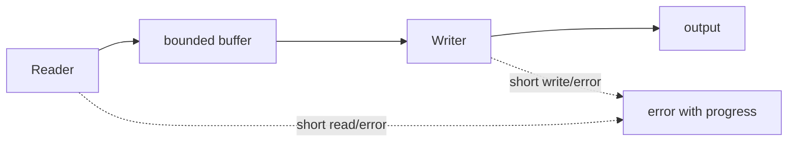
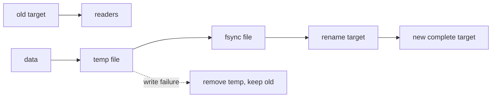
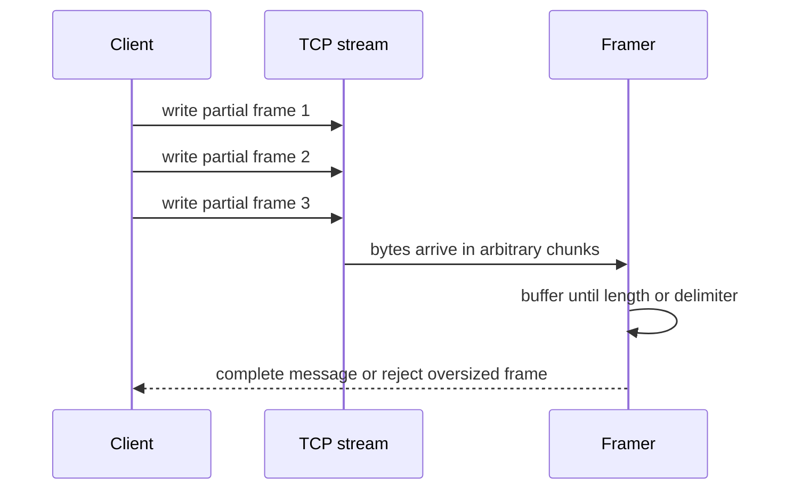

# Go 运维开发与云原生工程 · 第三册：系统自动化与 CLI

## 第九章 · 逐步处理文本、字节和大文件

### 字符串、字节切片和 rune 怎样避免乱码与错误截断？

Go 字符串是一段只读字节，通常承载 UTF-8，但类型本身不保证编码。
`len(s)` 返回字节数，按索引得到 byte；`for range` 才按 UTF-8 解码 rune。
日志截断、列宽和协议长度必须先确认单位。

```go
func preview(s string, maxRunes int) string {
	runes := []rune(strings.ToValidUTF8(s, "�"))
	if len(runes) <= maxRunes { return string(runes) }
	return string(runes[:maxRunes]) + "…"
}
```

`[]rune` 会分配内存，不适合无界大文件。
大流量处理应使用 `utf8.DecodeRune` 或流式 reader。
判断成功时既看输出没有乱码，也要保留非法输入计数；静默替换会丢失取证信息。

#### 用测试固定字节与字符边界

测试至少覆盖纯 ASCII、中文、Emoji、空字符串和截断的 UTF-8 字节。
若输出用于终端列宽，rune 数也不等于显示宽度；此时应明确只保证“不切坏 UTF-8”，不要声称能完美对齐所有终端。
将原始字节摘要、替换次数和结果分别记录，既便于排障，也避免把无法解码的生产证据彻底抹掉。

```go
func TestPreviewKeepsUTF8(t *testing.T) {
	got := preview("节点🙂", 2)
	if !utf8.ValidString(got) || got != "节点…" {
		t.Fatalf("unexpected preview %q", got)
	}
}
```

#### byte 和 string 转换的所有权

`string(data)` 与 `[]byte(text)` 通常会产生复制，换来不可变字符串与可变字节之间清晰边界。
不要为了减少一次复制使用 unsafe 转换；源 buffer 被复用后，字符串内容可能变化，破坏 map key、日志和并发安全。

处理协议时保留原始 byte，在确认编码后再转 string。
计算摘要、压缩和网络传输通常按 byte；匹配人类文本、JSON 字段和路径时按约定编码处理。

#### 字符串拼接与扫描

少量拼接用 `+` 清晰；循环构建大文本使用 `strings.Builder` 或直接写入 `io.Writer`。
预估容量可减少分配，但不能根据不可信长度无限 Grow。
热路径优化前用 benchmark 证明。

扫描大文本时避免反复 `strings.Split` 生成全部片段。
按行、分隔符或 token 流式读取，并对单 token 设置上限。
搜索 ASCII 协议标志可用 bytes，面向用户的大小写转换则要说明语言规则。

#### 编码错误的三种策略

配置和安全策略文件通常遇到无效 UTF-8就拒绝；日志分析可替换并计数；取证工具则应保存原始字节和摘要。
策略必须由用途决定，不能统一“忽略错误”。

练习：输入包含中文、emoji、组合字符、无效序列与 2MiB 单行，分别输出 byte length、rune count、valid 标记和安全 preview。
确认程序内存有界且不会把无效证据静默改写。

#### 文本边界验收

用原始 byte fixture 保存 ASCII、中文、emoji、组合字符、无效 UTF-8 和超长行。
分别断言字节上限、有效性、替换计数、preview 和摘要。
输出用于终端时只承诺 UTF-8 完整，不把 rune 数冒充视觉宽度。

#### 正常与失败输出都固定

对输入 `node-深圳-01`，按 rune 截取应保留完整 UTF-8；按任意字节数截取可能落在中文编码中间。
程序先决定字段是协议字节还是用户文本，再选择算法。

```text
input_bytes=16 valid_utf8=true preview="node-深圳"
```

无效 UTF-8 可直接拒绝、替换后标记 degraded，或保存原始 bytes 供取证。
不能悄悄替换后仍报告完全成功。
测试同时断言有效性、字节上限和错误类别，避免终端“看起来正常”掩盖数据损坏。

### `io.Reader` 与 `io.Writer` 怎样把处理链拆开？

面向 `io.Reader`/`io.Writer` 编程，可以让同一逻辑读取文件、HTTP body 或内存，并写向终端、文件或测试 buffer。
业务函数不需要知道资源从哪里来。

```go
func filterErrors(r io.Reader, w io.Writer) error {
	s := bufio.NewScanner(r)
	for s.Scan() {
		if bytes.Contains(s.Bytes(), []byte("ERROR")) {
			if _, err := fmt.Fprintln(w, s.Text()); err != nil { return err }
		}
	}
	return s.Err()
}
```

资源的打开和关闭留在入口层；接收 Reader 的函数通常不负责关闭它。
复制数据时设置大小上限，避免不可信响应占满磁盘。

#### 组合管道时明确错误来自哪一段

`io.Copy`、压缩 reader、解码器和过滤器可以层层组合，但错误必须增加阶段上下文。
测试可用 `strings.NewReader` 提供输入、`bytes.Buffer` 接收输出，再注入一个固定在第 N 个字节失败的 Reader，确认中途失败不会被当作 EOF。
若目标 writer 可能部分写入，调用方还要决定删除临时结果还是保留并标记 incomplete。

#### Reader 的短读不是 EOF

`Read` 可以同时返回 `n > 0` 与 error，也可以只返回当前可用的少量数据。
调用方必须先处理前 n 个字节，再判断 error。
不要假设一次 Read 填满 buffer。
固定长度协议使用 `io.ReadFull`，复制固定上限使用 `io.CopyN` 或 `LimitReader`。

#### Writer 也可能短写

Writer 应返回写入字节数和错误；`n < len(p)` 且 err 为 nil 属于异常短写。
标准辅助函数通常会处理，但自定义 writer 和组合链要测试。
最终写文件的成功必须包含 encoder、buffer flush、file sync 与 close 的结果。

#### 装饰器式组合

```go
func process(r io.Reader, w io.Writer, max int64) error {
	limited := io.LimitReader(r, max+1)
	buffered := bufio.NewReader(limited)
	if err := transform(buffered, w); err != nil {
		return fmt.Errorf("transform stream: %w", err)
	}
	return nil
}
```

gzip、hash、tee 和限流 reader 可以组合，但关闭责任仍由创建资源的层承担。
`io.Reader` 接口没有 Close，业务函数不应猜测并关闭传入对象。

#### 故障注入练习

实现 `failAfterReader` 和 `failAfterWriter`，分别在第 N 字节返回错误。
验证处理函数保留阶段上下文、不会把部分输出标记成功、临时文件被清理。
再用一个每次只返回 1 byte 的 reader 证明代码没有依赖满读。

#### 管道契约验收

输入 reader 每次只返回少量字节、在 N 字节失败；writer 短写或中途失败。
处理函数必须保留已经读取的数据语义、返回阶段上下文且不关闭不属于自己的资源。
最终文件只在完整成功后替换。

#### 完整示例：限制复制并保留关闭责任

下面是可运行的最小过滤器。
它不把输入一次性读入内存，遇到上游短读会继续读取，遇到 writer 错误则立即停止并把错误返回给调用方。

#### Reader/Writer 是控制流协议

`io.Reader` 允许一次只返回部分数据，甚至同时返回 `n > 0` 和一个错误；调用方必须先消费有效字节，再按契约处理错误。
`io.Writer` 也可能短写，因此复制循环不能假设一次 Write 就完成；这正是接口组合能把文件、网络和测试 fake 接到同一处理链的原因。
用一个每次只返回 3 个字节的 fake Reader 和一次短写的 fake Writer 运行复制函数，检查总字节数、最终错误和已写前缀。

#### 短读短写实验记录应保留进度

短读实验不应只断言“最后字符串相等”。运维工具更关心失败发生在什么进度、已经写出的临时结果是否会被误认为完整，以及重试是否会重复已经确认的字节。

下面的 fake reader 每次最多返回 3 个字节，并在指定位置返回错误；它是可编译片段，依赖 `io` 和 `errors`：

```go
type failReader struct {
	data []byte
	pos  int
	failAt int
}

func smaller(a, b int) int {
	if a < b {
		return a
	}
	return b
}

func (r *failReader) Read(p []byte) (int, error) {
	if r.pos >= len(r.data) {
		return 0, io.EOF
	}
	if r.pos == r.failAt {
		return 0, errors.New("injected read failure")
	}
	n := smaller(3, len(p))
	n = smaller(n, len(r.data)-r.pos)
	copy(p[:n], r.data[r.pos:r.pos+n])
	r.pos += n
	return n, nil
}
```

如果需要兼容 Go 1.20 及更早版本，把 `min` 换成普通比较函数；不要为了示例方便隐藏最低版本。
记录实验时至少保存：每次 `Read` 的 `n`、累计字节数、最终错误、临时输出长度和清理结果。
通过条件是完整输入才替换目标文件；中途失败只能留下带 `incomplete` 标记的临时文件，不能把部分输出作为成功报告。



```go
func CopyLines(dst io.Writer, src io.Reader, maxLine int) error {
	scanner := bufio.NewScanner(src)
	scanner.Buffer(make([]byte, 1024), maxLine)
	for scanner.Scan() {
		if _, err := fmt.Fprintln(dst, scanner.Text()); err != nil {
			return fmt.Errorf("write line: %w", err)
		}
	}
	if err := scanner.Err(); err != nil {
		return fmt.Errorf("read lines: %w", err)
	}
	return nil
}
```

这是局部片段，调用方拥有 `src` 和 `dst` 的关闭责任。
验收时用一个只返回部分字节的 reader 和一个写到第 N 次就失败的 writer，确认错误没有被吞掉；用超长行验证内存上限生效。

### 日志大到放不进内存时，缓冲、扫描和流式写入怎样取舍？

`bufio.Scanner` 使用方便，但默认 token 上限可能不适合超长日志行。
可以用 `Scanner.Buffer` 设置经过预算的上限，或使用 `bufio.Reader.ReadString`/`ReadBytes` 处理长记录。
上限触发必须报告，而不是把半行当成完整记录。

```go
scanner := bufio.NewScanner(r)
scanner.Buffer(make([]byte, 64*1024), 1024*1024)
for scanner.Scan() { /* 逐行解析 */ }
if err := scanner.Err(); err != nil { return fmt.Errorf("scan log: %w", err) }
```

流式处理应记录已读字节、有效行、坏行和输出行，失败时才能判断结果是否完整。
写报告先落临时文件、同步并原子替换，避免读者看到半份结果。

#### rename 解决可见性，不自动解决持久性

临时文件写完后 rename 通常能让读者看到旧版本或新版本，而不是中间状态；但断电持久性还涉及文件同步和父目录元数据。
跨平台行为、符号链接和并发写入仍需单独定义，不能把“原子替换”误解为事务或权限校验。
实验中在替换前后并发读取目标文件，另外注入写入失败和进程退出，确认读者只看到旧版本或完整新版本，并记录未覆盖的持久性保证。



#### 轮转与压缩输入不能先全部展开

按明确策略枚举并排序轮转文件，逐个打开；gzip 文件只在当前 reader 上解压，处理完立即关闭。
跨文件去重只保存有界摘要或时间窗口，不把原始行全部放进 map。

```text
discover -> sort -> open one -> optional gzip
-> scan bounded record -> aggregate -> close -> next
```

指标包含 bytes_read、records_ok、records_bad、records_oversized 和 files_failed。
在第二个压缩文件制造 CRC 错误，确认第一份结果保留为 partial，整体退出码不会误报全成功。

#### 建立容量与坏数据策略

开始前写清单文件上限、单行上限、坏行上限和输出上限。
遇到一条坏行是立即失败、跳过并告警，还是输出隔离文件，取决于用途；安全配置生成通常应快速失败，日志统计则可允许有限坏行。
练习时生成一条超过上限的日志，确认程序返回非零、旧报告仍完整、临时文件被清理且计数没有把坏行算成成功。

#### Scanner 与 Reader 的取舍

Scanner 适合按行或 token 解析，API 简洁但 token 上限必须显式设置；Reader 适合需要保留分隔符、处理超长记录或精确控制 buffer 的场景。
`ReadString` 返回数据和 error，最后一段可能伴随 EOF，仍要处理数据。

#### 流式聚合而不是保存明细

如果目标只是统计每个错误码数量，不必保存所有日志行。
使用 map 聚合计数，保存有限样例与首末时间；高基数 key 仍要设上限，超过时归入 `other`。
结果中记录 scanned、matched、invalid、truncated 和 bytesRead，保证计数可解释。

#### 压缩与多文件输入

根据文件扩展名或明确参数创建 gzip reader，关闭由入口负责。
遍历目录时固定排序以保证报告稳定，拒绝越过允许根目录的符号链接。
轮转日志要定义顺序和重复边界，不能把 `.1` 与当前文件的重叠记录统计两次。

#### 内存与吞吐验收

生成远大于预期内存的 fixture，运行时观察 RSS 而不是只看 Go heap。
分别测试正常行、最大合法行、超限行和大量坏行。
benchmark 保存 bytes/op 与 MB/s；优化 buffer 后确认错误计数和输出摘要未改变。

#### 大文件运行证据

fixture 大于预期内存，运行时记录 RSS、处理吞吐、scanned/matched/invalid/truncated 和输出摘要。
故意超过单行、坏行与高基数上限，验证策略和退出码。
旧报告在任何失败后保持可解析。

#### 流式验收看趋势而不是单点

分别处理 10MiB、100MiB 和 1GiB fixture，记录最大 RSS 是否近似稳定、吞吐是否线性、坏行计数是否准确。
若内存随文件大小同比增长，说明链路某处仍在累积明细。
保存命令、工具链和 fixture 摘要，让下一次优化可重复比较。

## 第十章 · 控制文件、进程和退出时的副作用

### 路径、权限和原子替换怎样避免写出半份配置？

路径先经 `filepath.Clean`，但 Clean 不能证明它仍在允许目录。
将候选路径转为绝对路径并用 `filepath.Rel` 验证边界；还要考虑符号链接。
高风险工具最好只接受逻辑名称，再由白名单映射到固定路径。

```go
func atomicWrite(path string, data []byte, mode fs.FileMode) error {
	dir := filepath.Dir(path)
	f, err := os.CreateTemp(dir, ".update-*")
	if err != nil {
		return err
	}
	tmp := f.Name()
	defer os.Remove(tmp)
	if err := f.Chmod(mode); err != nil {
		f.Close()
		return err
	}
	if _, err := f.Write(data); err != nil {
		f.Close()
		return err
	}
	if err := f.Sync(); err != nil {
		f.Close()
		return err
	}
	if err := f.Close(); err != nil {
		return err
	}
	return os.Rename(tmp, path)
}
```

跨文件系统 Rename 可能失败，Windows 与 Unix 语义也不同。
写完后重新读取并校验，记录旧版本备份和回滚步骤。

#### 文件更新验收表

| 场景 | 预期结果 |
| --- | --- |
| 目标目录不可写 | 更新前失败，旧文件不变 |
| 写到一半磁盘满 | 临时文件失败，旧文件仍可读 |
| 新内容校验失败 | 不执行替换并保留诊断 |
| 替换成功 | 权限正确，新内容可重新解析 |
| 进程收到信号 | 不留下被误认为正式配置的半文件 |

备份也要设置数量和保留时间。
把每次写入都永久备份会从可靠性措施变成磁盘事故来源。

#### 路径边界不能只靠 Clean

`filepath.Clean` 只做词法整理，不能阻止符号链接逃逸。
高风险写入优先打开受控根目录并使用平台支持的安全相对路径操作；至少先求绝对路径和 Rel，拒绝 `..`，再检查目标父目录的符号链接与所有权。

临时文件必须创建在目标同目录，避免跨文件系统 rename。
文件 mode 还会受 umask 影响；Secret 配置通常要求 0600，并在写后重新 Stat 验证。
不要先创建世界可读文件再 chmod，存在短暂泄露窗口。

#### 原子替换不等于业务正确

rename 只能保证读者看到旧版或新版，不能证明新配置能被服务加载。
替换前用解析器和业务校验验证临时内容；替换后重新读取，必要时调用目标服务的 check-config；reload 失败则按 runbook 回滚旧版本。

多个进程同时写同一文件时，单次 rename 仍可能最后写入者覆盖前者。
使用版本号、内容摘要或文件锁实现乐观并发控制，冲突时拒绝而不是静默覆盖。

#### 文件系统故障实验

在临时目录测试只读父目录、现有目标权限、无效内容、同名并发更新和中途取消。
磁盘满不易在普通单元测试稳定模拟，可通过失败 writer 验证逻辑，再在限制大小的隔离文件系统做集成测试。
记录旧文件摘要和最终摘要证明失败未破坏正式内容。

#### 文件变更交接记录

每次高风险写入保存目标、旧摘要、新摘要、校验器、mode、操作者、备份和回滚。
运行前输出 plan，验证目标仍是预期版本再替换。
并发冲突和校验失败都不得修改正式文件。

#### 文件操作的证据顺序

先在同一文件系统的临时目录创建临时文件，再写入、`Sync`、关闭，最后 `Rename`。
如果 `Rename` 成功，只能说明目录项切换完成；还要根据恢复目标决定是否同步父目录。
权限测试应在非特权临时用户下运行，并检查实际 mode，而不是只看代码中的八进制常量。

```text
validate path -> create temp with 0600 -> write bounded bytes
-> sync file -> close -> rename -> sync parent when required
```

故障注入包括临时目录只读、目标文件被替换为符号链接、磁盘写满和进程在 rename 前退出。
每次实验都记录旧文件是否仍可读取、临时文件是否泄漏以及下一次运行能否恢复。

### 调用外部命令时，怎样保留退出码、超时和标准错误？

使用 `exec.CommandContext` 和参数数组，不把用户输入拼进 `sh -c`。
分别限制运行时间和输出大小；命令超时后还要确认子进程是否随进程组退出。

```go
ctx, cancel := context.WithTimeout(parent, 10*time.Second)
defer cancel()
cmd := exec.CommandContext(ctx, "systemctl", "is-active", "demo.service")
var stdout, stderr bytes.Buffer
cmd.Stdout, cmd.Stderr = &stdout, &stderr
err := cmd.Run()
```

对 `*exec.ExitError` 读取退出码，对 `ctx.Err()` 区分超时；日志记录动作模板、目标和结果，但不打印 Secret。
远程动作使用固定动作到参数的映射，绝不提供任意 Shell 入口。

#### 输出必须有容量上限

`bytes.Buffer` 会把完整 stdout/stderr 放进内存，不适合未知命令。
可写入有大小限制的 ring buffer 或临时文件，同时保留截断标记。
验收分别模拟退出 0、退出 3、无法找到命令、超时和输出洪泛；只有退出码 0 且业务校验通过才算成功。
自动重试前必须证明命令幂等，像“创建用户”这类动作更适合先查询状态。

#### 区分启动失败与退出失败

命令不存在、权限不足会在 Start/Run 阶段返回启动错误；程序已启动后返回非零通常是 `*exec.ExitError`。
结果模型应保存 started、exitCode、timedOut、stdoutTruncated 和 stderrTruncated，不能把所有情况压成字符串。

#### 环境、目录和 PATH

子进程默认继承父环境和工作目录。
生产工具应构造最小环境、显式设置工作目录，并固定可执行文件路径或受控 PATH。
传给命令的 Secret 可能在进程列表出现，优先使用受限文件或 stdin，并确认命令不会回显。

#### 子进程树与取消

CommandContext 通常能终止直接进程，但通过 shell 或工具派生的孙进程可能残留。
按目标 OS 设置进程组，取消时先发温和终止，等待短窗口后强制结束，并用进程列表验证。
跨平台行为必须分别测试。

#### 命令适配器练习

用当前测试二进制模拟退出 0、退出 7、输出超过 1MiB、忽略终止信号和派生子进程。
不要依赖系统 `sleep` 或 `sh`，测试自身可通过辅助模式运行。
确认错误分类、输出上限和取消后无残留进程。

#### 命令执行契约

为每个允许动作固定二进制路径、参数 schema、环境、目录、deadline、最大输出和幂等性。
结果区分未启动、非零退出、超时和业务校验失败。
测试取消后检查整个进程组，不只检查直接子进程。

#### 启动错误和退出错误必须分开

`exec.CommandContext` 返回错误时，可能是程序不存在、权限拒绝、工作目录无效，也可能是进程已经启动但最终非零退出。
运维工具应把这些类别映射到不同的诊断字段，避免把“找不到二进制”误报成业务检查失败。

```go
cmd := exec.CommandContext(ctx, program, args...)
cmd.Dir = workDir
cmd.Env = append([]string{"PATH=/usr/bin:/bin"}, extraEnv...)
output, err := cmd.CombinedOutput()
if err != nil {
	var exitErr *exec.ExitError
	if errors.As(err, &exitErr) {
		return fmt.Errorf("program exited status=%d stderr=%q", exitErr.ExitCode(), clip(output, 4096))
	}
	return fmt.Errorf("start program: %w", err)
}
```

`clip` 必须按字节上限截断，不能把可能包含凭证的全部输出写入日志。
测试至少覆盖不存在命令、非零退出、超时和超大 stderr。

### 收到终止信号后，怎样停止接单、清理资源并限时退出？

信号应转换为统一取消上下文。
关闭顺序通常是：标记 not-ready、停止接单、取消后台循环、等待在途任务、刷新有限缓冲、超时后退出。

```go
ctx, stop := signal.NotifyContext(context.Background(), os.Interrupt, syscall.SIGTERM)
defer stop()
if err := run(ctx); err != nil && !errors.Is(err, context.Canceled) {
	slog.Error("run failed", "error", err)
	os.Exit(1)
}
```

不要在 signal handler 中完成所有清理，也不要无限等待。
部署平台的终止宽限期必须大于应用内部 shutdown deadline，并通过实际发送 SIGTERM 验证退出码、日志和未完成任务状态。

#### 用时间线验证关闭而不是只看最后退出

记录收到信号、readiness 失败、停止提交任务、在途数归零、资源关闭和进程退出六个时间点。
故意放入一个超过 shutdown deadline 的任务，确认程序记录被放弃任务而不是永久挂住。
第二次信号可以定义为强制退出，但必须在 runbook 中写清数据风险。

#### 每个组件分配关闭预算

平台给 30 秒 termination grace，应用不能给每个组件各 30 秒串行等待。
可以预留 5 秒摘流量、20 秒处理在途、3 秒刷新状态、2 秒兜底退出。
并行关闭独立组件可缩短总时间，但错误仍要汇总。

#### readiness 先于 listener 关闭

先标记 not-ready，让负载均衡停止新流量；等待传播窗口后调用 Server.Shutdown。
只关闭 listener 可能让平台在状态尚未更新时继续转发并看到连接拒绝。
传播窗口来自实际平台观察，不应随手 sleep。

#### 长任务的恢复语义

无法在窗口内完成的写任务，必须在开始前持久化状态或具备幂等键。
shutdown 时把 lease 释放、标记 cancelled 或等待租约过期，由任务协议决定。
内存中的“正在执行”随进程消失，不能事后准确恢复。

#### 信号测试

函数测试直接 cancel context；进程级测试构建二进制、等待 ready 标志、发送 SIGTERM，并测量事件顺序和退出时间。
再发送第二次信号验证强制路径。
Windows Service 与 Unix signal 模型不同，需要平台适配测试。

#### Shutdown 运行证据

记录 signal、not-ready、停止提交、active 归零、flush 和 exit 时间。
平台 grace 大于内部总预算。
测试正常排空、超时取消和第二次强制信号，并说明未完成副作用如何恢复或对账。

#### 信号时间线应该能被重放

对常驻服务记录 `SIGTERM received`、`accept=false`、`inflight drained`、`resources closed` 和最终退出时间。
测试启动一个本地 listener，发送信号后再发起新请求，确认新请求被拒绝而已接收请求获得关闭预算。
超过预算时要有明确的强制退出和遗留任务记录，不能静默截断。

#### 进程级测试验证真实信号

不要向当前 `go test` 进程发送 SIGTERM。
先构建辅助二进制，以随机本地端口启动，通过 ready 文件或握手确认已接单，再向子进程发信号并收集 stdout、stderr 与退出状态。
测试要求 readiness 先变更、在途任务获得预算、超时任务留下可恢复状态。

如果测试只看到进程退出，仍不能证明关闭顺序正确。
每个组件的内部 deadline 应短于平台 grace period，并预留最终日志 flush 与退出时间。
readiness 变更后的摘流等待必须根据网关和服务发现的实际传播延迟测量，不能把固定 sleep 当成协议。
关闭阶段若持久化状态或关键资源释放失败，退出码和最终日志必须区分正常终止与不完整清理。

#### 进程组实验要明确平台边界

`exec.CommandContext` 默认只负责直接子进程；脚本或程序再派生出的孙进程可能继续持有文件、端口和临时目录。
因此进程级验证要记录进程树，而不是只检查父进程退出：

```bash
pgrep -P "$PID" || true
ps -o pid,ppid,pgid,stat,command -p "$PID"
```

Linux 上可以把任务放入独立 process group，在宽限期内发送 `SIGTERM`，再对同组残留进程发送 `SIGKILL`；macOS 的命令参数和权限模型略有差异，示例必须按实际系统校正。
Windows 没有同样的 POSIX 进程组语义，不能把 Unix 实验结果直接当作跨平台保证。

验收记录至少包括：父子进程 PID/PGID、发送信号的时间、listener 是否停止接收、临时文件是否清理、最终退出码和任何残留资源。
如果无法在当前环境验证进程组，应标记 `NOT VERIFIED`，并说明需要在哪个 Linux 运行环境复测。

## 第十一章 · 调用网络服务时把失败视为常态

### 一个可靠的 HTTP 客户端为什么必须统一设置超时？

默认 `http.Client` 可能无限等待。
共享 Client 和 Transport 以复用连接，在请求上携带 context，并关闭响应体。
总超时、连接超时和响应头超时解决不同阶段的问题。

```go
transport := &http.Transport{MaxIdleConns: 100, MaxIdleConnsPerHost: 10, ResponseHeaderTimeout: 5 * time.Second}
client := &http.Client{Transport: transport, Timeout: 15 * time.Second}
req, _ := http.NewRequestWithContext(ctx, http.MethodGet, endpoint, nil)
resp, err := client.Do(req)
if err != nil { return err }
defer resp.Body.Close()
```

TLS 校验失败不应通过 `InsecureSkipVerify` 永久绕过。
修复信任链、SNI 或证书轮换，测试环境例外也要显式隔离。

#### 响应处理也属于连接管理

先检查状态码，再用 `io.LimitReader` 限制 body，并按 Content-Type 解析。
即使不使用响应内容，也应关闭 body；为了让连接复用，通常还需在合理上限内读完。
测试服务器分别返回慢响应头、慢 body、超大 body、非法 JSON 和 503，确认错误分类与耗时符合预期。

#### Transport 是共享资源

每个请求新建 Client/Transport 会丢失连接复用并增加 socket。
为相同网络策略复用长生命周期 Client；不要在使用后修改 Transport 字段。
限制每主机连接、空闲连接和空闲超时，避免批量巡检把下游压垮。

#### 超时覆盖不同阶段

Dial timeout 控制建立连接，TLS handshake timeout 控制握手，ResponseHeaderTimeout 控制等待 header，Client.Timeout 覆盖包括读取 body 的整体交换，请求 context 再受更外层批次 deadline 约束。
只设一个连接 timeout 不能防止服务无限慢读 body。

#### 重定向、代理与 SSRF

默认 Client 会跟随重定向。
面向不可信 URL 的工具应限制次数，并重新校验每个 Location 的 scheme、host 和目标网段，防止重定向到 metadata 或内网管理地址。
代理来自环境时也要纳入诊断；认证 header 跨域重定向不可泄露。

#### TLS 诊断

证书失败时记录 hostname、证书有效期和错误类别，不记录私钥或完整 token。
自定义 CA 使用独立 cert pool，并保留系统根；不要把 `InsecureSkipVerify` 当成修复。
测试证书轮换期间新旧信任重叠和错误 SNI。

#### HTTP 客户端验收

httptest 覆盖慢 header、慢 body、超大 body、重定向环、非法 JSON、连接重用与取消。
集成环境再验证企业代理、真实 CA、DNS 与 IPv4/IPv6。
指标区分 DNS、connect、TLS、TTFB 和 body 阶段，才能定位“请求慢”。

#### HTTP 诊断输出

诊断包含 endpoint host、代理来源、deadline、attempt、状态码和阶段耗时，不包含 query Secret、Authorization 或 body。
对 TLS 错误输出证书类别和 hostname。
用 request ID 关联下游，但限制日志基数和长度。

#### 分层 timeout 的最小实现

客户端总 timeout 保护整个请求，request context deadline 保护单次调用，Transport 的 dial、TLS handshake、response header timeout 保护具体阶段。
它们不能互相矛盾：内部 deadline 应服从外层剩余时间。

```go
transport := &http.Transport{
	DialContext: (&net.Dialer{Timeout: 2 * time.Second}).DialContext,
	TLSHandshakeTimeout: 3 * time.Second,
	ResponseHeaderTimeout: 5 * time.Second,
}
client := &http.Client{Transport: transport, Timeout: 10 * time.Second}
```

响应体必须关闭并设置读取上限。
对用户可控 URL，先限制 scheme、解析后的 IP 范围和重定向次数；否则“巡检 URL”可能被利用为 SSRF。

### 分页、限流、重试和幂等怎样共同防止漏查与重复操作？

分页循环要保存下一页游标、检查重复游标并设置最大页数。
收到 429 或暂时性 5xx 时，只有幂等请求才自动重试，并同时限制次数、总时间和并发。

```text
请求 -> 分类结果 -> 成功返回
             -> 永久错误停止
             -> 可重试且有预算 -> 退避 -> 重试
             -> 结果未知 -> 查询状态或人工对账
```

POST 是否可重试取决于服务端幂等键或查询接口。
网络断开可能发生在服务端已执行之后，盲目重复会制造第二次副作用。

#### 退避必须服从总 deadline

指数退避加入随机抖动，避免大量实例同步重试；每次等待前检查剩余 deadline。
服务端提供 `Retry-After` 时在策略允许范围内尊重它，但仍受客户端最大等待约束。
记录 attempts、最终分类和累计等待，不能为每次失败都打印 ERROR 制造告警风暴。

#### 分页必须有终止不变量

每次请求记录当前 cursor，响应提供 next cursor。
若 next 为空则结束；若重复出现已见 cursor 或页数超过上限则失败。
结果去重依据稳定资源 ID，而不是展示名称。
API 若在分页过程中变化，要了解 snapshot token 或一致性语义，否则可能漏项或重复。

#### 速率和并发分别限制

并发上限控制同时在途请求，token bucket 控制单位时间请求数。
下游限制为 10 QPS 不等于只能 10 并发；两者需根据延迟共同配置。
收到 429 时降低压力并尊重 Retry-After，不能让所有 worker 各自无协调重试。

#### 幂等键的生命周期

对创建型 POST，客户端为一次逻辑操作生成 key，所有网络重试复用它。
服务端持久保存 key 与结果，并定义保留期和相同 key 不同 payload 的冲突。
客户端超时后优先按 key 查询状态，避免结果未知时再次创建。

#### 重试放大预算

3 层各重试 3 次，最坏可能产生 27 次下游调用。
只在最了解幂等性和 deadline 的一层重试；其他层传播可分类错误。
记录原始调用数、attempt 与最终成功，告警关注最终失败和重试率。

#### 分页与重试练习

httptest 依次返回两页、重复 cursor、429+Retry-After、503 和超时。
注入 fake clock 或可控等待，验证最大页数、去重、总 deadline 和取消。
对 POST 模拟服务端已提交但连接断开，确认客户端使用同一幂等键查询。

#### API 可靠性验收

模拟重复 cursor、页间数据变化、429、503、慢响应和 POST 结果未知。
确认最大页数、总 deadline、抖动重试、同一幂等键和数量守恒。
统计实际下游调用数，防止多层重试放大。

#### 429 不是普通 500

收到 `429` 时优先读取 `Retry-After`，并将等待时间裁剪到剩余 deadline；没有该头时使用带抖动的指数退避。
服务端返回 500 是否可重试，还要结合请求是否幂等。
分页请求若在重试期间数据发生变化，应使用服务端 cursor 或快照，而不是继续递增 offset 造成漏项。

```text
request -> classify status
  2xx -> validate body and advance cursor
  429 -> honor Retry-After within budget
  5xx/network -> retry only when idempotent
  4xx -> return actionable input or auth error
```

### TCP 服务怎样限制连接、设置 deadline 并完成优雅退出？

每连接一个 goroutine 很直观，但监听器、连接数、读写 deadline 和消息大小仍须有界。
先获取信号取消，再关闭 listener 解除 Accept，最后等待连接处理退出。

```go
sem := make(chan struct{}, 100)
for {
	conn, err := ln.Accept()
	if err != nil { /* 判断关闭或临时错误 */ }
	sem <- struct{}{}
	go func() {
		defer func(){ <-sem }()
		defer conn.Close()
		_ = conn.SetDeadline(time.Now().Add(30*time.Second))
		handle(conn)
	}()
}
```

TCP 没有消息边界，必须定义长度、分隔符和最大帧；半包、粘包、慢客户端和异常断开都应进入测试。

#### TCP 字节流为什么必须自己 framing

一次 Read 返回的是当前可用字节，不对应发送端的一次 Write；内核缓冲、拥塞控制和调度都会改变分段。
应用协议必须用长度前缀、分隔符或固定宽度恢复消息边界，并对长度设置上限，避免恶意输入造成内存和等待无限增长。
用客户端把一个完整帧拆成三次 Write，再发送超过最大长度的帧；服务端应能恢复一条消息并拒绝第二种输入。



#### 用 `net.Pipe` 和本地监听器分层测试

纯协议处理可用 `net.Pipe` 构造双向连接，监听与关闭行为再用 `127.0.0.1:0` 的真实 socket 测试。
注入只发送半帧的客户端、超过最大帧的客户端和读到一半断开的客户端，观察连接是否释放、信号退出是否卡住以及错误日志是否包含远端地址但不包含敏感载荷。

#### Accept 错误分类

listener 关闭后 Accept 返回错误是正常退出路径；临时资源错误可带退避重试；未知永久错误应结束 server。
不能对所有错误立即 continue 形成高 CPU 热循环。
关闭由 owner 执行，并通过 context 统一触发。

#### 帧协议必须限制内存

长度前缀协议先读取固定 header，校验长度不超过上限，再分配 body；分隔符协议使用有界 reader，找不到分隔符且超限就关闭连接。
永远不要直接信任客户端声明的 4GiB 长度并分配。

#### 慢连接与半关闭

每个读写阶段设置 deadline，并在成功处理新帧后按协议刷新。
客户端只发一个字节后停住时，连接必须在预算内释放。
TCP half-close、RST 和 EOF 的业务含义不同，但都要保证资源清理和有限日志。

#### 连接级容量

semaphore 获取也要可取消；达到容量时可以暂停 Accept 或接受后立即返回明确协议错误，选择取决于协议。
指标包括 active、accepted、rejected、readTimeout、protocolError 和 bytes，标签不得使用远端 IP 造成高基数。

#### TCP 关闭实验

使用本地 listener 启动多个客户端：正常帧、半帧、超大声明、慢发送和保持空闲。
发送 SIGTERM 后关闭 listener，等待连接 handler；超时则取消并关闭剩余连接。
执行 race 并确认 active 回零。

#### TCP 协议验收

正常帧、半帧、超长声明、慢发送、空闲、RST 和 shutdown 都进入测试。
每个连接有 read/write deadline 和 frame 上限，active/rejected/protocolError 指标可观察。
关闭 listener 后等待 handler 在预算内归零。

#### framing 先于业务解析

TCP 只提供字节流，一次 `Read` 可能得到半个头或多个完整帧。
协议应定义长度前缀、最大帧大小和校验失败后的连接动作；解析器不能根据一次 read 的边界猜消息完整。

```go
func readFrame(r io.Reader, max uint32) ([]byte, error) {
	var n uint32
	if err := binary.Read(r, binary.BigEndian, &n); err != nil {
		return nil, err
	}
	if n > max {
		return nil, fmt.Errorf("frame too large: %d", n)
	}
	payload := make([]byte, n)
	if _, err := io.ReadFull(r, payload); err != nil {
		return nil, fmt.Errorf("read frame: %w", err)
	}
	return payload, nil
}
```

用 `net.Pipe` 注入分段 header、慢发送、半关闭和超过上限的帧，确认 handler 在 deadline 内返回且不会按攻击者声明的长度无限分配。

## 第十二章 · 把脚本能力封装成自动化友好的 CLI

### 单命令何时使用 `flag`，多子命令何时值得引入 Cobra？

一个入口、少量参数时标准库 `flag` 足够。
出现多个稳定子命令、共享参数、帮助树和补全需求时再引入 Cobra。
框架不能替代业务边界，命令函数应只做参数适配并调用可测试服务。

```text
ops-check
  check      执行只读巡检
  plan       输出将执行的动作
  apply      经确认执行变更
  version    输出版本与构建信息
```

每个子命令定义输入、stdout schema、stderr、退出码和副作用。
危险命令要求 `--confirm` 或计划 ID，非交互环境不能通过默认 yes 绕过。

#### 命令树应保持薄

Cobra 的 `RunE` 只完成参数绑定、调用服务和错误返回，不在全局变量里初始化网络客户端。
使用 `SilenceUsage` 避免运行期错误重复打印帮助；输入错误才展示用法。
测试直接调用可注入 writer 的根命令，确认同一进程多次执行不会残留 flag 状态。

#### 先设计 CLI 契约

每个命令写 usage、参数来源、stdout、stderr、退出码、副作用与幂等性。
flag 名使用 kebab-case 并保持兼容；删除参数要经过废弃周期。
非交互环境遇到缺失确认必须失败，不能等待 stdin 永久挂住。

#### flag 与位置参数

稳定可选项用 flag，少量核心对象可用位置参数。
批量目标更适合文件或 stdin，避免命令行长度和进程列表泄露。
互斥参数和必填组合在解析后统一校验，错误指出冲突字段和修复方式。

#### plan 与 apply

高风险 CLI 先生成计划，包含目标、动作、当前版本和摘要；apply 接收计划 ID 或摘要，执行前确认环境未变化。
`--dry-run` 必须走到副作用边界前的完整校验，而不是一进入命令就返回“成功”。

#### 补全和帮助也是 API

帮助中写默认值、单位、环境变量与退出码，示例使用非生产目标。
shell completion 不应动态访问生产 API 或输出 Secret。
快照测试帮助文本时只固定关键段，避免框架无关格式变化造成大量脆弱测试。

#### CLI 结构练习

先用标准 flag 实现单命令；需求增加 plan/apply/version 后再迁移 Cobra。
保持内部 Service API 不变，证明框架替换只影响 adapter。
测试同一进程连续运行两个命令，避免全局 flag 污染。

#### 命令兼容性记录

为子命令保存 usage、flag、默认值、stdout schema、stderr 和退出码。
新版本新增字段保持兼容，废弃 flag 有迁移周期。
以真实二进制运行帮助、错误参数、非交互确认和 SIGTERM 测试。

#### 命令树保持薄而可重复调用

入口只绑定参数、调用 service 并映射错误。
网络客户端、logger 和配置在根入口组装后显式传入，不能藏在包级变量或 `init` 中。
这样同一测试进程可以连续执行两次命令，第二次不会继承第一次的 flag 与 writer。

`plan` 输出不可变摘要，`apply` 接收或重算摘要，高风险动作绑定审批。
帮助和 completion 不能触发生产网络或读取 Secret。
契约测试运行 `--help`、未知命令、缺失参数和同进程重复执行，固定 stderr 与退出码。

真实二进制测试还要确认 completion 和 help 不访问网络，未知命令快速失败，危险 apply 在非交互环境缺少确认时不会等待 stdin。

### 参数、环境变量、配置文件和 Secret 冲突时应该听谁的？

常见优先级是显式参数高于环境变量，高于配置文件，高于安全默认值。
优先级必须在 `--help` 和诊断输出中可见，但诊断只显示 Secret 来源，不显示 Secret 值。

```go
type Config struct { Endpoint string; Timeout time.Duration; Token string }
```

先合并各来源，再一次性校验并转换成内部配置。
配置热重载必须定义原子快照和失败行为；小工具通常重启更简单。

#### 输出配置来源而不是 Secret 值

`diagnose` 可以显示 `endpoint=file`、`timeout=flag`、`token=environment`，同时把 Token 值替换为 `[redacted]`。
环境变量缺失、空值和格式错误要区分；配置文件权限过宽时至少告警。
练习时让四种来源提供冲突值，验证优先级与帮助文档一致。

#### 原始配置与可信配置分离

原始层保留指针或 Set 标志以区分缺失，合并层记录来源，可信层只包含已经校验的非歧义类型。
核心业务只接收可信配置，不再读取环境或应用默认值。

```text
defaults file environment flags
        -> merge with provenance
        -> parse types
        -> validate fields and relationships
        -> immutable runtime config
```

#### 未知字段和拼写错误

配置文件默认应拒绝未知字段，避免 `timeuot` 被忽略后使用危险默认值。
需要向前兼容时明确允许的扩展区。
错误包含文件和字段路径，不打印整份含 Secret 配置。

#### Secret 的获取与轮换

环境变量便于注入但会进入进程环境和诊断工具；文件应限制权限；平台 Secret provider 可支持轮换。
程序不把 Secret 写入 config dump、panic、URL query 或命令参数。
热轮换时使用原子快照，并测试旧连接何时失效。

#### 配置重载语义

收到 SIGHUP 或文件事件后，先完整读取、解析和校验新配置，再一次性替换。
失败继续使用旧配置并告警，不能留下半更新状态。
改变监听地址、身份根或存储连接等字段可能不支持热更新，应明确要求重启。

#### 配置诊断练习

构造默认、文件、环境和 flag 四层冲突，输出脱敏后的最终值及来源。
加入未知字段、权限过宽、空 Secret 与跨字段 timeout 冲突。
重载无效配置后确认旧配置仍生效且 readiness 语义符合设计。

#### 配置来源验收

四层来源冲突时输出最终非敏感值和 provenance；Secret 只显示来源。
未知字段、空值、权限过宽和热重载失败都有明确错误。
无效新配置不得替换正在运行的旧快照。

#### pflag、Viper 与 Cobra 分别解决什么

Cobra 管命令树和帮助，pflag 提供 GNU 风格参数，Viper 聚合文件、环境变量与 flag。
三者常一起出现，但不是必须成套引入：只有一个命令和几个参数时，标准库 `flag` 更容易审计；稳定多子命令 CLI 才按选型矩阵默认 Cobra，确有多来源配置需求时再加入 Viper。

Viper 的自动环境绑定和弱类型转换可能让拼写错误或空字符串悄悄覆盖默认值。
更稳妥的做法是把它限制在 adapter 层：读取所有来源到 `RawConfig`，记录字段来源，严格解码成类型明确的结构，再统一校验。
业务包不导入 Cobra、pflag 或 Viper。

```text
defaults -> config file -> environment -> flags
       collect raw values and source metadata
       -> strict decode -> cross-field validate -> trusted Config
```

布尔值要区分“没有提供”和“显式 false”，可以检查 pflag 的 `Changed`；duration 使用 `time.ParseDuration`，容量必须带单位；未知配置键默认报错。
Secret 通过文件、环境注入或外部 Secret provider 获取，diagnose 只输出 `source=environment`，绝不输出值。

#### 配置重载不是重新调用 Viper

长期进程重载时，先完整读取并验证新配置，再原子替换不可变快照。
对连接地址、凭证和并发等字段分别定义是否支持热更新；不支持的变化返回“需要重启”，不能半数生效。
watcher 事件可能重复且编辑器常用临时文件 rename，重载逻辑应去抖并以最终文件内容为准。

测试构造默认、文件、环境和 flag 四层冲突，验证优先级、空值、未知键、无效 duration、Secret 脱敏和 `Changed` 语义。
对运行中重载，故意提交坏配置，确认旧快照继续服务且 readiness、日志和退出码符合约定。
### 同一个 CLI 怎样为人提供表格，又为流水线提供稳定 JSON 和退出码？

机器输出需要稳定 schema，不受颜色、终端宽度和日志影响。
文本模式可用 `text/tabwriter`，JSON 模式只向 stdout 输出一个合法文档，日志写 stderr。

| 退出码 | 含义 |
| --- | --- |
| 0 | 全部检查成功 |
| 1 | CLI 输入或内部执行失败 |
| 2 | 执行完成但存在目标失败 |
| 3 | 操作被取消或超过总 deadline |

综合验收使用固定测试数据运行文本和 JSON 两种模式，以 `jq` 校验 JSON，以 Shell 捕获退出码，并测试无权限、超时、SIGTERM 和部分失败。
产物用 `go version -m` 检查模块与构建信息，并记录 SHA-256 供分发核对。

#### CLI 契约回归脚本

```bash
set +e
./ops-check check --fixture testdata/partial.json --json >result.json 2>diagnostic.log
status=$?
set -e
jq -e '.summary.failed == 1' result.json
test "$status" -eq 2
! grep -E 'token|password|secret' diagnostic.log
```

脚本验证的是已约定行为，不等于真实生产巡检。
最后还要在目标 OS/架构运行二进制，确认 CA、DNS、代理、时区、信号和文件权限符合部署环境。

#### 第三册综合实验：可测试的批量 HTTP 巡检 CLI

综合项目保持三层：`main` 处理退出，`run` 处理 CLI 契约，`checkAll` 处理有界并发。
下面是可独立保存为 `main.go` 的标准库版本：

```go
package main

import (
	"context"
	"encoding/json"
	"errors"
	"flag"
	"fmt"
	"net/http"
	"os"
	"os/signal"
	"strings"
	"sync"
	"syscall"
	"time"
)

type result struct {
	Target string `json:"target"`
	OK     bool   `json:"ok"`
	Error  string `json:"error,omitempty"`
}

func checkAll(ctx context.Context, client *http.Client, targets []string, workers int) []result {
	jobs := make(chan string)
	out := make(chan result)
	var wg sync.WaitGroup
	for i := 0; i < workers; i++ {
		wg.Add(1)
		go func() {
			defer wg.Done()
			for target := range jobs {
				r := result{Target: target}
				req, err := http.NewRequestWithContext(ctx, http.MethodGet, target, nil)
				if err == nil {
					var resp *http.Response
					resp, err = client.Do(req)
					if err == nil {
						resp.Body.Close()
						r.OK = resp.StatusCode >= 200 && resp.StatusCode < 300
						if !r.OK {
							err = fmt.Errorf("status %d", resp.StatusCode)
						}
					}
				}
				if err != nil {
					r.Error = err.Error()
				}
				select {
				case out <- r:
				case <-ctx.Done():
					return
				}
			}
		}()
	}
	go func() {
		defer close(jobs)
		for _, target := range targets {
			select {
			case jobs <- target:
			case <-ctx.Done():
				return
			}
		}
	}()
	go func() { wg.Wait(); close(out) }()
	results := make([]result, 0, len(targets))
	for r := range out {
		results = append(results, r)
	}
	return results
}

func run(ctx context.Context, args []string) int {
	fs := flag.NewFlagSet("ops-check", flag.ContinueOnError)
	targetsRaw := fs.String("targets", "", "comma-separated HTTP URLs")
	workers := fs.Int("workers", 4, "maximum concurrent checks")
	timeout := fs.Duration("timeout", 5*time.Second, "timeout for each HTTP request")
	if err := fs.Parse(args); err != nil {
		return 1
	}
	if *workers < 1 || *workers > 32 || *timeout <= 0 {
		fmt.Fprintln(os.Stderr, "invalid workers or timeout")
		return 1
	}
	var targets []string
	for _, value := range strings.Split(*targetsRaw, ",") {
		if value = strings.TrimSpace(value); value != "" {
			targets = append(targets, value)
		}
	}
	if len(targets) == 0 {
		fmt.Fprintln(os.Stderr, "at least one target is required")
		return 1
	}
	client := &http.Client{Timeout: *timeout}
	results := checkAll(ctx, client, targets, *workers)
	if err := json.NewEncoder(os.Stdout).Encode(results); err != nil {
		fmt.Fprintln(os.Stderr, err)
		return 1
	}
	if errors.Is(ctx.Err(), context.Canceled) {
		return 3
	}
	for _, r := range results {
		if !r.OK {
			return 2
		}
	}
	return 0
}

func main() {
	ctx, stop := signal.NotifyContext(context.Background(), os.Interrupt, syscall.SIGTERM)
	defer stop()
	os.Exit(run(ctx, os.Args[1:]))
}
```

先用 `httptest.Server` 写成功、500、慢响应三个测试，再执行 `go test -race`。
当前实现还有一个刻意保留的评审点：取消发生时，尚未提交的目标不会出现在结果数组；生产契约必须决定它们是记为 cancelled，还是由顶层批次状态统一表达。
读者应先固定这个契约，再修改实现，而不是仅让测试数量变多。

#### 把综合实验拆成可维护边界

单文件便于讲解，却不适合持续增加能力。
第二轮重构应保持依赖从入口指向内部能力：

```text
ops-check/
├── cmd/ops-check/main.go          # 信号、真实环境、os.Exit
├── internal/app/run.go            # 参数解析、编排、退出码
├── internal/check/http.go         # HTTP 协议与错误分类
├── internal/report/json.go        # 稳定机器输出
├── internal/report/table.go       # 人类输出
├── internal/targets/file.go       # 流式读取目标
└── internal/atomicfile/write.go   # 原子写报告
```

`run` 接收 `[]string`、`io.Reader`、`io.Writer` 和依赖接口，返回退出码；只有 `main` 调用 `os.Exit`。
这样测试不会终止测试进程，也不必替换全局 stdout。
参数库只是入口适配器，不能让 Cobra command 对象渗入 checker。

#### 流式目标读取与坏数据策略

运维清单可能有几十万行。
读取时既要限制单行大小，也要给出行号，不能因为 Scanner 默认上限而静默失败：

```go
func ReadTargets(r io.Reader, maxLine int) ([]string, error) {
	if maxLine < 1 {
		return nil, fmt.Errorf("max line must be positive")
	}
	scanner := bufio.NewScanner(r)
	scanner.Buffer(make([]byte, 64*1024), maxLine)
	var targets []string
	seen := make(map[string]struct{})
	for line := 1; scanner.Scan(); line++ {
		value := strings.TrimSpace(scanner.Text())
		if value == "" || strings.HasPrefix(value, "#") {
			continue
		}
		if _, ok := seen[value]; ok {
			continue
		}
		if _, err := url.ParseRequestURI(value); err != nil {
			return nil, fmt.Errorf("line %d: invalid target: %w", line, err)
		}
		seen[value] = struct{}{}
		targets = append(targets, value)
	}
	if err := scanner.Err(); err != nil {
		return nil, fmt.Errorf("scan targets: %w", err)
	}
	return targets, nil
}
```

这里选择“遇到坏行整批失败”。
若业务要容忍坏行，应返回 `targets` 与结构化 diagnostics，并设置“有警告”的退出状态；绝不能打印一行警告后仍返回完全成功，让流水线误判。
清单超大时进一步改成迭代式 channel，但必须沿用第二册的取消与背压规则。

#### HTTP 错误分类与重试判定

HTTP 成功不等于只看 `err == nil`。
客户端要区分传输失败、协议状态、响应格式和业务状态：

| 类别 | 示例 | 默认动作 |
| --- | --- | --- |
| 输入错误 | URL 非法、协议不允许 | 不重试，退出码表示用法错误 |
| 认证授权 | 401、403 | 不盲重试，提示凭证或权限问题 |
| 限流 | 429 | 尊重 `Retry-After`，受总 deadline 限制 |
| 临时服务失败 | 502、503、504 | 幂等请求可退避重试 |
| 永久资源状态 | 404、业务校验失败 | 记录目标失败，不重试 |
| 传输失败 | DNS、连接重置、TLS | 按错误类型与预算判断 |

重试循环必须把“单次超时”和“整个目标的 deadline”分开。
每次尝试都创建请求上下文，但退避等待也要监听父上下文。
加入全抖动避免大量实例同一时刻重试。
若服务返回 `Retry-After`，仍需裁剪到剩余预算内。

不要重试非幂等写操作，除非服务端提供幂等键且客户端在所有重试中复用同一个键。
读取响应体要设上限；即使状态码失败，也可读取一小段用于诊断，但不能把可能包含凭证的整段响应写入日志。

#### 原子报告与进程退出语义

报告写文件采用“同目录临时文件—写入—同步—关闭—重命名”的顺序。
同目录保证 rename 不跨文件系统；权限应显式设置；任一步失败都保留旧文件并清理临时文件。
对要求掉电一致性的场景，还需同步父目录；Windows 的替换语义与 Unix 不完全相同，跨平台工具必须实测。

CLI 退出码是一项公开 API，建议固定并写进 `--help`：

| 退出码 | 含义 | 流水线动作 |
| --- | --- | --- |
| 0 | 所有目标完成且健康 | 继续 |
| 1 | 参数、配置或本地执行错误 | 修正调用方式 |
| 2 | 巡检完成但存在不健康目标 | 标记业务检查失败 |
| 3 | 收到取消或超过总 deadline | 按调度策略重试或终止 |
| 4 | 输出不完整或持久化失败 | 不消费残缺报告 |

日志写 stderr，JSON 或表格写 stdout。
JSON 字段名、类型与缺省值必须稳定；新增字段通常兼容，删除或改类型需要版本策略。
表格可为人优化，不应成为脚本解析接口。

#### 外部命令的安全边界

需要调用 `ping`、`journalctl` 或厂商 CLI 时，直接传参数数组，不拼接 shell 字符串：

```go
func RunCommand(ctx context.Context, name string, args []string, limit int64) ([]byte, error) {
	allowed := map[string]bool{"ping": true, "journalctl": true}
	if !allowed[name] {
		return nil, fmt.Errorf("command %q is not allowed", name)
	}
	cmd := exec.CommandContext(ctx, name, args...)
	var output bytes.Buffer
	cmd.Stdout = &limitedWriter{W: &output, N: limit}
	cmd.Stderr = &limitedWriter{W: &output, N: limit}
	if err := cmd.Run(); err != nil {
		return output.Bytes(), fmt.Errorf("run %s: %w", name, err)
	}
	return output.Bytes(), nil
}
```

示例中的 `limitedWriter` 需要在项目中实现，并在超过容量时返回明确错误。
程序路径应通过部署配置固定，避免被不可信 `PATH` 劫持。
凭证不放命令行参数，因为它可能出现在进程列表与审计日志；优先使用受限权限文件描述符或标准输入，并确认子进程不会回显。

进程组也是边界：`CommandContext` 终止直接子进程，不一定清理它创建的孙进程。
若工具会派生进程，要按目标操作系统设置进程组并测试取消后的残留，不可从 Unix 行为推断 Windows。

#### CLI 契约测试矩阵

核心测试不启动外部二进制，直接调用 `run`：

- 空目标、非法 workers、非法 duration 返回 1，stderr 有简洁原因；
- 全成功返回 0，stdout 是可解码 JSON，stderr 不混入普通日志；
- 一个 500 返回 2，成功目标仍在报告中；
- `httptest.Server` 阻塞时取消上下文，返回 3 且无 goroutine 泄漏；
- stdout writer 人为返回错误时返回 4；
- 相同输入的 JSON 字段与退出码稳定；
- 目标文件包含 BOM、空行、注释、重复值、超长行和无效 UTF-8 时行为明确；
- SIGTERM 的进程级测试确认停止接单、等待窗口和最终退出码。

端到端测试再构建一次真实二进制，用 shell 捕获 stdout、stderr 和 `$?`。
这不是重复测试：函数测试证明逻辑，二进制测试证明参数接线、信号和进程契约。

#### 第三册完成标准

- 可处理超过内存舒适区的输入，单行、响应体和命令输出都有上限；
- 文件更新不会暴露半成品，旧文件在失败时仍可用；
- 子进程使用参数数组、白名单、deadline，并保留退出状态和有限诊断；
- HTTP 客户端复用 transport，设置完整超时，关闭响应体并按幂等性重试；
- SIGTERM 后先停止接收新工作，再限时等待，超时路径可观测；
- stdout、stderr、JSON schema 与退出码形成明确 CLI 契约；
- 单元、race、`httptest` 和真实二进制契约测试全部通过。
