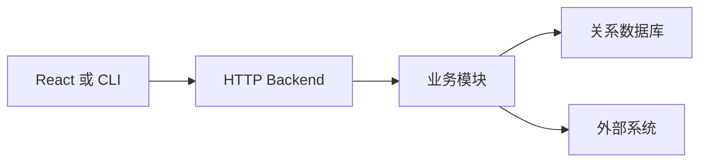
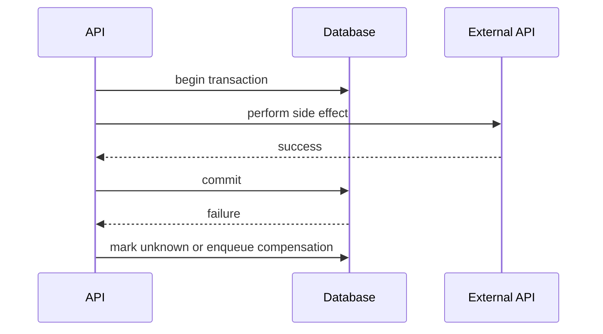
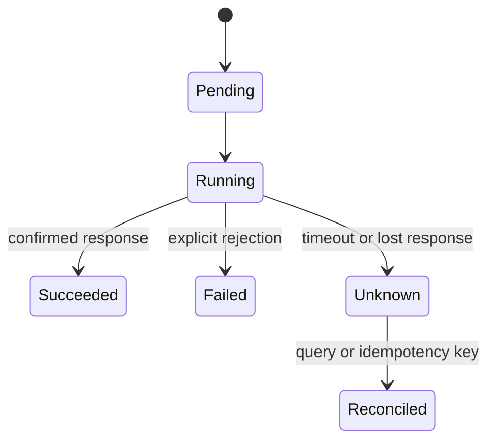
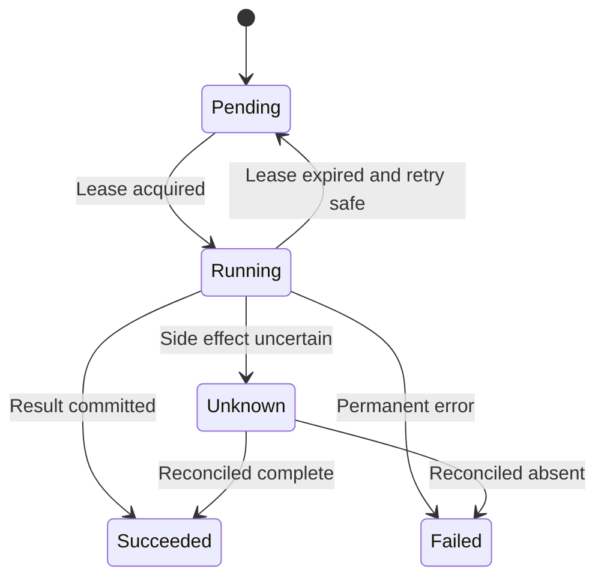

# Go 运维开发与云原生工程 · 第四册：Backend 与服务工程

## 第十三章 · 只有共享状态出现后才把 CLI 升级为 Backend

### 哪些需求说明单机 CLI 已经不足，哪些需求仍不需要服务端？

多人共享任务状态、集中认证、统一审计或浏览器 API 是 Backend 的证据；一个进度条、定时配置或趋势图不是。
少量内部用户默认从模块化单体开始，让 API、业务规则与持久化保持清晰边界。



先记录用户数、数据量、任务时长、部署位置和失败恢复要求。
若本机 CLI 已能可靠交付，不要为了“平台化”增加常驻服务。

#### 先做一张约束卡

约束卡至少记录调用者、并发、状态保留、认证来源、任务最长时间和部署位置。
把“想看进度”翻译成低频轮询候选，而不是直接选择 WebSocket；把“定时执行”翻译成调度可靠性问题，而不是直接增加独立 Scheduler。
若默认值会改变组件组成，设计只能标为 draft。

#### CLI 到服务的迁移成本

服务化会新增监听端口、TLS/网关、认证、数据库、备份、容量、健康检查、滚动发布、告警和值班。
把这些列为长期成本，而不是只估算 handler 开发时间。
内部用户只有两三人且不共享状态时，签名二进制加集中配置可能更便宜。

#### 用状态归属做判断

如果执行状态只需由调用进程知道，CLI 返回结果即可；需要多用户稍后查询、审批人与执行人分离或进程重启后恢复，状态就应由 Backend 持久管理。
浏览器页面本身不是证据，页面也可以调用一次性 CLI 的离线结果。

#### 轮询与推送

任务进度每几秒变化且用户量小，条件 GET 或带退避轮询通常足够。
只有高实时、大量并发订阅或服务器主动事件确有价值时，才评估 SSE/WebSocket，并承担连接保活、代理超时、断线续传和多副本广播。

#### 服务化决策练习

对“200 台主机每晚巡检”写 CLI+Cron、Backend 内任务和 Backend+Worker 三案，比较任务恢复、身份、审计、并发和运维成本。
使用实际超时与频率选最小方案，并写升级阈值。

#### 输出一份可执行决策记录

决策记录写当前用户数、请求峰值、任务 p95、状态保留期、已有身份和数据库、所选最小组件、排除项和复核日期。
每个数字注明来源；未知项不填乐观默认，而是标记待验证。
评审者应能据此回答为什么现在不能只用 CLI，以及什么变化会触发 Worker 或 Agent。

#### 用最小架构表达当前结论

组件选择应同时说明代码模块和部署单元。
少量内部用户、任务在数秒内完成且允许人工重试时，一个进程就可以包含 API、业务逻辑与短后台任务：

```text
CLI or React -> Go Backend -> existing relational database
                     |
                     +-> in-process bounded task runner
```

此时显式排除 Redis、MQ、独立 Worker、Agent、WebSocket 与时序数据库。
升级条件分别是任务必须跨重启恢复、执行资源需要独立扩缩、目标机只有本地可达能力、推送延迟有量化要求，以及关系库无法满足保留和查询容量。
排除项不是永远禁止，而是避免没有证据就承担新的部署、监控和故障边界。

#### 服务化后必须新增的运行责任

上线清单明确端口/TLS owner、身份依赖、数据库备份恢复、容量、健康检查、告警、值班与发布窗口。
如果这些责任没有负责人，方案只是能启动的 demo。
用一次网关 timeout、数据库不可用和滚动退出演练估算长期成本，再与 CLI+Cron 方案比较。

### 模块化单体怎样划分 HTTP、业务、数据和外部客户端边界？

HTTP 层处理协议，业务层执行规则，repository 处理持久化，client 封装外部系统。
依赖从入口指向核心，业务模型不导入 Gin、SQL 驱动或 Kubernetes 类型。

```text
cmd/server       组装依赖和进程生命周期
internal/httpapi 路由 输入 输出 身份适配
internal/task    业务状态机
internal/store   SQL 与事务
internal/remote  外部 API 客户端
```

接口由使用方定义并保持小。
事务边界围绕业务不变量，而不是每个 repository 方法各自提交。

#### 用依赖方向做代码评审

核心 task 包不应导入 HTTP 框架和数据库驱动；handler 不直接拼 SQL；store 不决定 HTTP 状态码。
为每层写一个替身测试，确认业务可以在没有监听端口和数据库进程时运行。
模块化单体的目标不是目录多，而是变化可以局部发生。

#### 领域模型不携带框架类型

业务函数接收领域命令并返回领域结果或错误，不接收 `*gin.Context`、`http.ResponseWriter` 或数据库 row。
handler 把 JSON 输入转换为 `CreateTask`，repository 把 row 转为 `Task`。
这样迁移路由器或数据库不会重写状态机。

#### 事务边界围绕不变量

“创建任务并写审计”若必须同时成功，应在一个应用服务中开启事务并调用 transaction-scoped repository。
不要让每个 repository 方法自己提交，导致中途失败留下半状态。
远程 HTTP 不放在长事务内；使用 outbox 或任务状态协调跨系统副作用。

#### 依赖组装只在入口

`main` 读取配置、创建 logger、DB、clients、service 和 server，启动后不再使用 service locator 或全局单例。
构造失败返回具体上下文并退出，shutdown 按依赖反向顺序执行。

#### 模块边界测试

领域包用 fake repository 测状态转换；HTTP 包用 fake service 测协议；store 包对真实数据库测 SQL。
执行依赖扫描，确保 task 包没有导入 router 或 driver。
若出现循环依赖，重新检查模型所有权，不建 common 包躲避。

#### 用一次变化检验边界

把 HTTP 输入从 JSON 改成 CLI 参数，领域测试不应改变；把内存 store 改成 PostgreSQL，handler 契约不应改变；把远端 SDK 换成 fake，任务状态机仍可运行。
如果一个变化穿透所有层，优先修正依赖方向而不是继续增加接口。

#### 请求处理链只允许单向依赖

一次创建任务请求应按固定顺序经过 body 限制、解码、字段校验、身份、授权、领域命令、事务和响应映射。
每层只返回自己的稳定错误类型，最终由 HTTP adapter 统一映射。
业务层不得调用 `os.Exit`，repository 不打印用户响应，外部 client 不自行无限重试。


对这条链做反向测试：无效 body 不应触达身份和数据库；未授权请求不应调用领域动作；事务失败不应返回成功；响应 writer 失败只记录一次，不能重复执行领域副作用。

#### 请求链是责任边界，不只是中间件顺序

解码解决表示，校验解决输入不变量，认证解决主体是谁，授权解决主体能否执行，事务解决本地状态的一致提交。
把这些责任混在一个 handler 中会让失败不可分类，也会让测试无法证明某个拒绝发生在副作用之前。
用 `httptest` 为每一层注入计数器，提交坏 JSON、未认证和未授权请求，验证失败请求没有调用领域服务或 repository。

模块评审最终保存依赖图和三类测试结果：领域无框架测试、handler 协议测试、真实 store 集成测试。

### 标准库、Gin、chi、REST 和 RPC 应该怎样按约束选择？

少量端点可直接使用 `net/http`；需要成熟路由、中间件生态时默认评估 Gin；团队偏标准库风格可选 chi。
框架选择要落到现有经验、API 数量、性能证据和维护成本。

```go
func healthz(w http.ResponseWriter, r *http.Request) {
	w.Header().Set("Content-Type", "application/json")
	io.WriteString(w, `{"status":"ok"}`)
}
```

Server 必须设置读取、响应头、写入和空闲超时；限制 body 大小；统一 request ID、recover 和错误响应。
OpenAPI 是契约辅助，不替代兼容性测试。

#### 用最小压测比较而不是用口碑选框架

为候选实现同一个健康检查和一个带校验的任务创建接口，在相同工具链、日志与中间件下测量。
若性能差异远低于外部依赖耗时，就优先团队熟悉度和可维护性。
框架升级前运行契约与 shutdown 测试，避免只比较 requests per second。

#### Server 基线与路由无关

无论框架都要配置 ReadHeaderTimeout、ReadTimeout、WriteTimeout、IdleTimeout、MaxHeaderBytes 和 shutdown。
body 用 MaxBytesReader 限制；中间件顺序固定 request ID、recover、访问日志、身份与授权。
框架默认值必须查明，不能假设安全。

#### 路由和方法契约

区分 404 与 405，路径参数先规范化和校验，尾随斜杠策略一致。
创建返回 201 或异步 202，删除幂等语义明确。
OpenAPI 生成或校验不能替代 handler 测试，尤其要测试未知字段、第二个 JSON 对象和错误 Content-Type。

#### 基准必须包含真实中间件

只压测 hello world 无法代表认证、日志、JSON 与数据库。
候选实现相同链路，固定连接数、payload、日志级别和 CPU 配额，比较吞吐、p95/p99、分配与错误率。
压测客户端自身不能成为瓶颈。

#### 框架退出练习

分别用标准库和候选框架实现三个端点，复用同一 service。
发送慢 header、超大 body、panic 和 SIGTERM，比较状态码、日志、资源回落和关闭时间。
以行为证据而非 API 喜好选择。

#### 框架选择记录

记录候选版本、维护状态、团队经验、中间件需求、基准环境和升级策略。
结论允许选择标准库。
若引入框架，仅在 adapter 层使用；保存慢请求、panic、超限输入和 shutdown 的测试结果，避免基准只证明空 handler。

#### REST、RPC 与 gRPC 的边界

浏览器和通用运维调用方默认使用 HTTP JSON API，容易经过现有网关、审计和调试工具。
内部多语言服务间已经采用 protobuf、需要强类型双向流或高频调用时，才把 gRPC 作为备选。
RPC 不是“比 REST 更先进”，它只是契约和传输选择不同。

| 约束 | HTTP JSON | gRPC |
| --- | --- | --- |
| 浏览器直接调用 | 自然 | 通常需要网关或 gRPC-Web |
| 人工调试 | curl 即可 | 需要反射或专用客户端 |
| 契约 | OpenAPI 与兼容测试 | protobuf 与生成代码 |
| 流式传输 | SSE/WebSocket 另选 | 原生流但连接治理更复杂 |
| 多语言 SDK | 可生成也可手写 | 通常生成并锁定插件版本 |

无论哪种风格都要定义 deadline、错误模型、幂等、分页、身份传播与版本兼容。
不要让浏览器直连内部 gRPC 只因为后端实现方便。

#### OpenAPI 是可执行契约的一部分

规范固定 path、方法、schema、错误 code 和认证方式；CI 检查破坏性变化，并用 handler 契约测试验证实现。
生成 SDK 后仍要检查分页器、超时、错误链和重试策略。
规范生成成功只说明格式成立，不能证明授权和业务状态转换正确。

## 第十四章 · 在 API 边界完成校验、身份与错误表达

### 请求进入业务逻辑前，怎样校验输入并建立错误分类？

先限制 body，再严格解码和校验字段；未知字段是否拒绝由兼容策略决定。
业务错误映射到稳定代码，内部堆栈不回传客户端。

```go
type APIError struct { Code string `json:"code"`; Message string `json:"message"`; RequestID string `json:"request_id"` }
```

400 表示语法或字段错误，401 表示未认证，403 表示身份存在但无权，409 表示状态冲突，500 表示未分类内部故障。
状态码和业务 code 都要写契约测试。

#### 限制输入并保留可追踪错误

设置 body、数组长度、字符串长度和分页上限；未知字段的兼容策略写入版本契约。
响应包含 request ID，日志保留错误链与安全字段。
模糊测试解析器，确认畸形 JSON 不会 panic、无限分配或泄露内部堆栈。

#### 严格解码的完整步骤

检查 Content-Type，设置 body 上限，DisallowUnknownFields，Decode 一次对象后再次 Decode 并要求 EOF。
语法错误、类型错误、超限和业务校验使用不同稳定 code。
不要把 decoder 原始错误直接返回客户端，其中可能带内部字段信息。

#### 字段与跨字段校验

字段校验处理长度、枚举、URL scheme 和范围；跨字段校验处理 start < end、单次 timeout < 总 deadline、生产环境必须带审批 ID。
规范化后再查重复，避免空白和大小写绕过唯一性规则。

#### 错误映射集中管理

handler 不按错误文字判断。
领域错误通过 errors.Is/As 映射到 400/404/409，身份错误到 401/403，未知错误到 500。
所有响应使用同一 envelope 和 request ID，错误日志在边界记录一次。

#### 输入安全测试

覆盖空 body、超大 body、未知字段、两个 JSON 对象、深层嵌套、无效 UTF-8、超长数组和非法 URL。
fuzz 只要求不 panic和资源有界，业务状态码由表驱动测试固定。

#### API 错误回归表

为每个 code 固定 HTTP 状态、是否可重试和客户端动作。
未知内部错误只返回通用消息，服务端日志保留链。
契约测试读取响应 JSON，检查 Content-Type、request ID 和禁止字段；同时验证日志中能找到同一 request ID。

#### 完整的严格解码片段

```go
func decodeJSON(w http.ResponseWriter, r *http.Request, dst any) error {
	r.Body = http.MaxBytesReader(w, r.Body, 1<<20)
	dec := json.NewDecoder(r.Body)
	dec.DisallowUnknownFields()
	if err := dec.Decode(dst); err != nil {
		return fmt.Errorf("decode request: %w", err)
	}
	if err := dec.Decode(&struct{}{}); !errors.Is(err, io.EOF) {
		return fmt.Errorf("request must contain one JSON object")
	}
	return nil
}
```

这是局部片段，调用者还要检查 `Content-Type`、关闭 body 并把解码错误映射为稳定 code。
测试发送两个连续对象、未知字段、超过 1 MiB 的 body 和截断 JSON，确认领域 service 一次也没有被调用。

#### 错误输出不得暴露实现

测试把内部 SQL 错误、解析错误和 panic 分别注入，客户端只得到稳定 code、有限 message 与 request ID。
服务端日志保留包装链和 stack，且同一失败只记录一次。
响应 writer 中途失败时不重新执行业务动作；指标按稳定错误类别聚合，不把完整 error 作为标签。

### 为什么登录页不等于 JWT，内部工具应怎样优先复用身份设施？

认证先确认已有 SSO、OIDC 或网关能否传递可信身份。
浏览器内部系统通常更适合服务端 Session 或标准 OIDC 流程，而不是把长期 JWT 放进 localStorage。

Backend 只能信任经过验证的签名、issuer、audience 和时效，不能信前端自报用户名。
Token、Cookie 与认证头不写日志；代理头只有来自受信网关时才接受。

验收时至少覆盖未登录、会话过期、签名错误、issuer 或 audience 不符、用户被禁用以及网关头伪造。
认证失败统一返回有限信息，详细原因只进入受控日志，避免帮助攻击者枚举账号和验证规则。

#### 会话生命周期必须完整

定义登录、刷新、注销、密钥轮换、用户禁用和时钟偏差。
Cookie 至少考虑 Secure、HttpOnly 和 SameSite；服务间身份与用户会话分开。
生产事故演练应包含身份提供方暂时不可用，确认已有会话和新登录分别采取什么策略。

#### 认证与授权分层

认证回答“是谁”，授权回答“能否对该资源执行动作”。
中间件验证凭证并生成可信 Principal，业务层根据 action、resource、scope 做授权。
不要让 handler 从用户提供的 header 直接构造管理员身份。

#### OIDC 验证要点

验证签名算法、kid、issuer、audience、exp、nbf 和 nonce/state。
JWKS 缓存要有刷新与失败策略，密钥轮换期间允许合理重叠。
仅 decode JWT payload 不构成验证；`alg=none` 或算法混淆必须拒绝。

#### Session 与 Token 保存

浏览器优先 HttpOnly Secure cookie，配合 SameSite 与 CSRF 策略；不要把长期 bearer token 放 localStorage。
服务间 token 使用短期限、明确 audience 和最小 scope，轮换不重启整个服务。

#### 身份依赖故障演练

模拟 JWKS 刷新失败、用户禁用、会话过期、时钟偏差和网关伪造头。
定义缓存内有效身份能否继续、多久；新登录是否失败关闭。
所有选择要权衡可用性与撤权时效并记录。

#### 身份上线确认

在隔离环境完成真实 OIDC/SSO 回调，不用 fake 结果冒充。
检查 cookie 属性、注销、过期、密钥轮换、用户禁用和代理头伪造。
确认身份提供方不可用时，新登录与已有会话的行为和告警符合预案。

#### 认证中间件只产出可信 Principal

后续业务不再读取 Cookie、Authorization 或网关头，而是接收已验证的 Principal：主体 ID、租户、角色、认证时间和凭证类型。
Principal 不接受客户端 JSON 覆盖，也不把原始 Token 保存进去。
服务间身份和代表用户的委托身份分别建模，避免后台任务继承一个已过期浏览器会话。

认证设施不可用时，系统要选择失败关闭还是在短缓存窗口内继续。
撤权敏感的高风险写操作通常失败关闭；低风险只读查询可以按已批准策略使用未过期缓存。
选择、最大窗口和告警必须写入运行手册，不能临时由 handler 猜测。

#### 身份故障的预期输出

```text
401 AUTH_REQUIRED        no valid session
401 AUTH_EXPIRED         session expired
503 IDENTITY_UNAVAILABLE issuer keys unavailable
```

客户端动作分别是登录、刷新/重新登录和稍后重试；不能把第三类伪装成用户密码错误。
日志记录 issuer、kid、缓存状态与 request ID，不记录 Token。
故障恢复后执行一次真实登录和服务身份调用，确认缓存与密钥轮换回到正常状态。

把上述响应与登录、刷新、注销、撤权和密钥轮换组合成契约表，CI 固定状态码与客户端动作。
任何认证库升级都重放这张表，而不是只验证一个正常 Token。

### 角色、数据范围和高风险审批怎样分层，而不是只隐藏按钮？

前端隐藏按钮只是体验，授权必须在服务端对每次动作检查。
少量固定角色可先在应用中显式编码；规则复杂、动态且需要集中治理时再评估策略引擎。

```text
主体身份 -> 动作 -> 资源 -> 数据范围 -> 环境 -> 允许或拒绝 -> 审计
```

高风险变更可增加审批，但审批记录必须绑定不可变计划摘要，避免批准 A 后执行 B。
默认拒绝未知动作，Kubernetes 与远程系统使用最小权限凭证。

#### 授权用反向测试验收

除了“管理员可以”，还要测试普通用户不能跨环境、不能篡改资源 ID、不能通过批量接口绕过单项校验。
审计记录授权决策与策略版本，但不把敏感策略上下文全部暴露给调用者。
拒绝路径应和允许路径一样进入持续测试。

#### 角色和数据范围是两个维度

operator 角色可能允许重启服务，但只限自己团队和测试环境。
查询资源后再授权容易产生 IDOR；repository 查询应带 principal scope，或领域层在返回前强制校验归属。
批量接口逐项检查，不能只授权批次容器。

#### 审批绑定不可变计划

审批记录包含计划摘要、主体、目标集合、动作、过期时间和批准人。
执行前重新计算摘要，任何参数变化都要求重新审批。
审批本身不是授权，执行者仍需具备当前权限。

#### 默认拒绝与策略版本

未知动作、未知资源类型和策略加载失败默认拒绝。
每次决策记录 policy version、principal、action、resource 和结果，Secret 与敏感资源内容不进入普通日志。
策略缓存必须定义撤权传播延迟。

#### 授权矩阵测试

构造 anonymous、viewer、operator、admin 与不同团队/环境组合，测试允许和拒绝。
增加路径参数篡改、批量混入越权项、审批过期和策略服务不可用。
拒绝响应不暴露资源是否存在，避免枚举。

#### 授权上线确认

从最小角色开始授予，使用真实低权限测试账号执行允许和拒绝矩阵。
检查批量接口、导出接口、对象不存在与跨团队路径。
高风险动作绑定计划摘要和审批有效期，审计能追溯主体、对象、结果和策略版本。

#### 拒绝矩阵必须覆盖对象存在性

对无权访问的真实对象和根本不存在的对象，外部响应应避免泄露可枚举差异。
批量请求中混入一个越权目标时，契约要明确整批拒绝还是逐项返回；高风险写操作通常整批拒绝更容易审计。

策略服务或缓存故障不能默认放行。
每个拒绝记录稳定 reason 与 policy version，但不把其他租户名称、资源内容或审批备注返回调用者。
上线验证使用真实低权限账号，而不是只在单元测试里伪造 role 字符串。

#### 审批与执行之间重新授权

审批通过不冻结操作者权限。
执行时重新检查主体、数据范围、计划摘要和审批有效期；审批后被撤权或目标环境变化时拒绝执行。
审计把申请、批准、执行和结果用同一 operation ID 关联，并保存策略版本。

批量操作测试混入一个越权对象、一个已删除对象和一个摘要变化对象。
系统必须按书面原子性契约拒绝整批或明确逐项结果，不能只执行“碰巧成功”的子集后返回模糊 500。

策略变更也走版本化发布和回滚，禁止直接在生产临时修改后失去来源。
撤权传播延迟、缓存 TTL 与审计保留期都应成为可查询配置。
撤权测试还要覆盖仍持有旧会话或长连接的主体，确保服务端不会只在登录时计算一次权限。

## 第十五章 · 让日志、数据和任务状态能够支持排障与恢复

### `slog` 怎样携带 request ID、task ID，又不泄露 Secret？

现代 Go 可用标准库 `log/slog` 输出结构化日志。
`log/slog` 从 Go 1.21 进入标准库；更低版本需要兼容日志库或明确提高项目最低工具链。
字段名保持稳定，错误作为字段传递；request ID 用于请求链，task ID 用于异步工作，不能拿高基数字段当无界指标标签。

```go
logger := slog.New(slog.NewJSONHandler(os.Stdout, nil))
logger.Info("task finished", "task_id", id, "target", target, "status", status)
```

在源头排除密码、Token、Cookie、完整配置和响应体。
定义保留期、访问权限和删除机制；集中日志平台是可选设施，结构化与脱敏是基础责任。

#### 日志与指标承担不同职责

日志保存离散事件和上下文，指标表达可聚合趋势，trace 用于跨边界时序。
不要把 target ID 等高基数字段直接做指标标签。
用测试 handler 捕获 slog 记录，断言必要字段存在且样例 Secret 不出现；日志发送失败不能阻塞核心请求无限等待。

#### 日志事件而不是打印句子

事件名保持稳定，例如 `task.created`、`task.completed`，字段使用固定 snake_case。
每个请求入口和最终结果各一条关键日志，中间步骤只在有诊断价值时记录，避免每层重复同一错误。

#### request ID 与 trace

只接受受信网关生成且格式合法的 request ID，否则服务生成新值。
向下游通过标准 trace/header 传播，并在 task 创建时把 request 与 task 关联。
异步 Worker 不继续冒充原 HTTP span，而是建立 linked trace 或记录关联字段。

#### 脱敏从源头完成

建立禁止字段表：authorization、cookie、password、token、secret、完整请求体。
错误类型的 Error 方法也不能包含凭证。
测试用醒目的假 Secret 贯穿成功与失败路径，扫描 stdout/stderr 和捕获日志确认不存在。

#### 可观测性验收

从一个 500 响应的 request ID 能找到日志、错误类型与相关 trace；从 task ID 能找到创建、领取、尝试和终态；指标能回答错误率和延迟趋势。
任何单一系统不可用时，核心请求仍受有界影响。

#### 从一次事故问题验证可观测性

假设用户报告任务失败：能否从响应 request ID 找到 task ID、操作者、状态转换、外部依赖错误与持续时间？
再从指标判断是单例还是总体趋势。
若必须搜索完整目标 URL 或 Secret 才能定位，字段设计仍不合格。

#### 日志失败不能扩大业务故障

同步写远程日志平台会把其延迟带进请求关键路径。
默认向 stdout 写有界结构化事件，由运行平台采集；若应用内异步发送，队列必须有容量、丢弃计数和关闭预算。
审计事件比普通调试日志更严格：审计存储不可用时，高风险操作应失败关闭或进入明确待处理状态。

用一个包含 `TOP_SECRET_TEST_VALUE` 的 fixture 穿过成功、400、500 和 panic/recover 路径，捕获所有 slog record、stdout 和 stderr 并扫描。
脱敏测试通过后仍要评审错误类型的 `Error()`、第三方 client 日志和 trace attribute，因为泄露不只发生在显式 logger 调用。

#### 可观察输出有明确保留和基数边界

日志字段表标记类型、是否敏感、最大长度和保留期；指标 label 只使用有限枚举；trace attribute 对 URL、SQL 与 payload 做归一化或省略。
运行测试提交一万个不同 task ID，确认指标时序数量不会同比增长。

日志采集端阻塞或丢弃时，应用暴露 dropped/error 指标并保持有界。
审计链路不可用则按风险策略拒绝高风险动作，普通 debug 日志不可用不应让请求无限挂起。

用固定日志样例做 schema 回归，确保字段重命名不会让现有检索、告警与审计查询静默失效。
保留期到期后执行删除验证，而不是只在配置里写一个天数。
采集缓冲区的容量由峰值事件速率与可接受阻塞时间推导，并用压测验证丢弃策略。
磁盘缓冲启用时还要设置空间上限和清理优先级，避免日志反过来耗尽业务磁盘。
告警同时覆盖采集延迟、丢弃计数和审计写入失败，值班人员才能区分业务安静与观测链路失效。

### 显式 SQL、sqlc 与 GORM 应该根据什么选择？

关系数据默认复用已有 PostgreSQL/MySQL。
Go 新项目可从 `database/sql` 加显式 SQL 或 sqlc 开始，查询和生成类型都可审查；团队强依赖 ORM 体验时才将 GORM 作为备选。

所有方案都要处理 context、连接池、事务、迁移和参数化。
ORM 不能消除 N+1、锁等待和迁移风险。
任务状态写入关系库时，唯一约束和状态条件是幂等最后防线。

选择前用真实查询做一次对照：查看生成 SQL、执行计划、返回类型和迁移差异。
若 sqlc 已能覆盖主要查询，就不因简单 CRUD 增加 ORM；若团队已有成熟 GORM 规范，则重点验证预加载、事务和软删除等隐式行为。

#### 连接池也是容量预算

设置最大打开连接、空闲连接、连接寿命和请求 deadline，使所有实例连接总量低于数据库承载。
观察等待连接时间、慢查询、锁等待和事务回滚。
迁移使用独立版本记录并做恢复演练，不能依靠 ORM 启动时自动改表来替代评审。

#### 查询边界与参数化

所有外部值使用参数绑定，动态排序列和表名通过白名单映射，不能直接拼接。
分页优先稳定游标；offset 在大表和并发变化下可能慢且重复。
每条关键查询保存 explain 计划和预期索引。

#### 事务与远程调用

事务内只做数据库操作和短计算，不等待 HTTP、队列或人工审批。
需要跨系统一致性时，先提交业务状态与 outbox，再由 Worker 投递；消费端使用幂等键。
不要声称普通数据库事务能回滚已发生的远程副作用。

#### 本地原子性与分布式副作用不同

数据库事务可以保证同一数据库内的提交原子性，却不能撤回已经发送给云 API、Agent 或消息系统的请求。
跨边界动作需要 outbox、任务状态、外部幂等键或对账流程；事务提交成功不能直接等价于整个业务完成。
故意在远程调用成功后让本地提交失败，观察任务进入 `unknown` 或补偿路径，而不是返回一个无法解释的成功状态。



#### 迁移采用 expand contract

先增加兼容结构，部署同时支持新旧 schema 的代码，回填并切换读取，最后另一个版本删除旧结构。
滚动期间新旧实例并存，任何破坏性 rename/drop 都要检查兼容窗口和回滚路径。

#### 数据层测试

fake repository 测业务分支，真实数据库集成测试约束、隔离级别、锁和迁移。
并发提交同一幂等键，确认只有一行；制造锁等待，确认 context deadline 生效且连接归还。

#### 数据方案选择记录

用三条真实查询比较手写 SQL、sqlc 和 GORM：审查最终 SQL、类型、事务、分页、测试和迁移。
记录团队已有规范与排障能力。
选择 ORM 后仍保存慢查询和执行计划；选择 sqlc 后仍检查生成差异和数据库兼容。

#### 用 SQL 约束守住并发最后一关

应用层先查再写无法阻止两个副本同时创建同一任务，最终要由数据库唯一约束裁决。
任务表至少给业务幂等键建唯一索引，并用条件更新完成状态跃迁：

```sql
UPDATE tasks
SET status = 'running', lease_owner = $2, lease_until = $3
WHERE id = $1
  AND status = 'pending'
  AND (lease_until IS NULL OR lease_until < now());
```

调用方检查影响行数：`1` 表示领取成功，`0` 表示状态已变化或租约仍有效。
真实数据库集成测试并发执行两次领取，不能用内存 map 的 mutex 测试冒充 SQL 隔离与约束证据。

#### 数据方案用同一真实查询对照

选择 sqlc 或 GORM 前，用任务领取、游标分页和带事务审计三条查询比较生成 SQL、类型、执行计划和测试难度。
ORM 若产生 N+1、隐式软删除或过宽 SELECT，必须显式修正；sqlc 若需要大量动态查询，也要评估可维护性。

最终记录推荐与一个备选、团队经验、迁移方式、连接预算和升级条件。
不要同时引入多个数据访问层让同一事务跨越不同抽象。

### 长任务为什么先需要任务表，再判断是否需要独立 Worker？

任务表记录操作者、输入摘要、状态、尝试次数、deadline、结果和错误。
短任务可在进程内有界执行，但进程崩溃后应把运行中任务标为未知或失败，不能假装恢复。

```text
pending -> running -> succeeded
                   -> failed
                   -> cancel_requested -> cancelled
                   -> unknown -> reconciled
```

需要自动重试、重启恢复、多实例消费或独立扩缩容时才拆 Worker。
队列负责投递，数据库负责可审计业务状态；重试必须检查幂等性和结果未知场景。

#### 用崩溃点检验任务语义

分别在领取后、执行副作用前、执行后但提交结果前杀死进程。
重启后任务应进入可解释的 pending、failed 或 unknown，而不是永久 running。
对 unknown 优先查询外部状态或人工对账，不能自动重复不可逆动作。

#### 租约和心跳

Worker 通过条件更新领取 pending 或过期 running 任务，写入 owner 和 lease expiry。
长任务定期续租，但续租失败后不能继续无条件提交结果。
数据库时间优先于各 Worker 本地时间，减少漂移影响。

#### 重试和毒任务

错误分类决定 retryable；attempt、最大次数和 next_run_at 限制重试。
退避加入抖动，永久失败进入 failed 或 dead-letter 视图，并保留人工修复和重新入队操作。
重新入队也要审计。

#### 取消协议

用户请求取消先写 `cancel_requested`，Worker 在安全点检查并最终写 cancelled。
已提交不可逆副作用时取消可能失败或转为补偿任务，API 不能立即谎称 cancelled。
状态响应区分 requested 与 completed。

#### 任务一致性验收

并发两个 Worker 领取同一任务、领取后 kill、执行后提交前断网、重复结果提交和取消竞争。
验证状态转换、attempt、lease 和外部副作用数量，确保每种 unknown 都有对账路径。

#### 任务恢复 runbook

列出如何查询 pending/running/unknown、识别过期租约、查看 attempt 和幂等键、人工取消、重新入队与对账外部副作用。
所有修复动作限定 task ID 和环境，执行前输出计划，执行后保存审计；禁止直接把全表 running 改成 pending。

#### 三个崩溃点决定任务语义

在副作用前崩溃，可以由租约到期后重新领取；副作用完成后、结果提交前崩溃，系统无法仅凭本地状态判断是否已经执行；结果已提交但确认未返回时，调用方可能重复提交。
第三种可由幂等键解决，第二种必须向外部系统查询、使用外部幂等键，或把状态标为 `unknown` 交给对账。

#### 未知结果是协议状态，不是普通错误

网络超时只说明调用方没有得到确认，不说明远端没有执行。
把未知结果单独建模，才能在重试前查询状态、按幂等键复用结果，或把任务转入人工对账，而不是盲目重复不可逆动作。
验证实验要区分连接超时、远端明确拒绝和远端成功但响应丢失三种结果，并检查重试次数与外部副作用数量。





自动重试必须同时受错误类别、尝试次数、总时间预算和幂等性约束。
毒任务达到上限后进入人工队列，并携带最后错误、尝试历史和安全的重放入口。
结果提交应携带领取时的租约版本做条件更新，防止已失去所有权的 Worker 覆盖新执行者的状态。

## 第十六章 · 用一致的工程流程把服务交给团队维护

### 目录、规范和 Makefile 怎样形成可执行的开发入口？

目录表达依赖边界，Makefile 提供统一入口而不是隐藏复杂脚本。
最小命令包括 format、test、lint、build 和 verify；命令必须在干净环境可重现。

```makefile
.PHONY: fmt test vet build
fmt:
	gofmt -w $$(find . -name '*.go' -type f)
test:
	go test ./...
vet:
	go vet ./...
build:
	go build -trimpath ./cmd/...
```

提交规范服务于审查和追踪，不代替小范围变更、测试证据和回滚计划。

#### Make 目标必须可发现且可组合

提供 `make help`，让 CI 调用与开发者相同的目标。
命令失败必须保留原退出码，不能用管道掩盖错误。
生成代码、格式化和依赖整理会修改文件，应与只读 verify 目标分开，避免验证过程偷偷重写工作区。

#### 目录随真实边界增长

起步只需 cmd 与少量 internal 包。
出现第二个入口时复用应用服务，出现独立部署需求才创建新 cmd。
不要复制大型模板得到几十个空目录；目录名必须对应可解释责任和 owner。

#### 工具版本固定

编译器由 go.mod/toolchain 与 CI 固定，lint、生成器和迁移工具同样固定版本。
开发者使用 `go run tool@version` 或受控 tools 模块，CI 日志打印版本。
`latest` 会让同一 commit 随时间产生不同结果。

#### 生成代码可验证

OpenAPI、mock、sqlc 或 protobuf 生成后运行 diff，CI 确认仓库无未提交变化。
生成输入是源，输出若提交则必须同步。
verify 目标只检查，不应悄悄改写开发者工作区。

#### 新人入口练习

在干净 checkout 只读 README/Make help，执行 setup、test、build 和 run。
记录任何隐含本机路径、未声明服务或 Secret。
目标是新维护者不依赖口头步骤获得相同结果。

#### 本地入口验收

在干净 checkout 执行 `make help`、只读 verify、test 和 build。
确认不依赖个人目录、全局安装 latest 工具或未声明服务。
故意让 formatter 和生成代码过期，verify 必须失败但不修改文件。

#### Makefile 不隐藏开发者无法复现的环境

目标应显示所需工具版本、外部服务和配置来源。
真实数据库集成测试通过单独目标启动隔离依赖，并提供健康等待和清理；普通 `make test` 不应静默连接个人数据库。
生成器输出若提交仓库，`make verify-generated` 重新生成到临时位置并比较，而不是直接覆盖用户修改。

在干净容器和开发机各执行一次 help、verify、test、build，比较日志中工具链与产物摘要。
如果 Make 目标依赖 Bash 特性、GNU 工具或 Docker，应在前置条件中明确，不能把某位维护者的系统环境当成项目契约。

#### 开发入口的失败输出可行动

缺工具时报告名称、所需版本和安装入口；缺外部服务时报告启动目标；生成差异时列出源文件与验证命令。
Make 目标不吞掉子命令退出码，也不在失败后继续发布。

最终由一名未参与开发的维护者从干净 checkout 重放，记录缺失步骤并回写到 `make help` 或项目文档。

### 从本地提交到 CI，哪些检查必须成为不可跳过的门禁？

CI 至少执行格式差异、单元测试、vet、适用的 race、依赖漏洞检查和构建。
固定 Go 主版本与 action 版本，缓存只改善速度，不能成为构建正确性的前提。

```yaml
- uses: actions/setup-go@v5
  with:
    go-version-file: go.mod
- run: go test ./...
- run: go vet ./...
- run: go build -trimpath ./cmd/...
```

第三方检查工具需要固定版本。
只有实际运行成功的门禁才标记 PASS；依赖安装成功不等于工具执行成功。

#### 门禁按反馈速度排序

先格式、生成文件差异和快速单测，再 vet、race、集成测试、漏洞扫描和制品构建。
保存失败命令、工具版本和关键日志。
race 不必覆盖每个提交的全部长测试，但关键并发路径必须定期且可重复执行。

#### 格式门禁应只读

CI 用 `gofmt -d` 检查并在有差异时失败，不直接提交格式变化。
开发者本地 `make fmt` 才修改。
`go mod tidy` 同理，运行后 diff 非空就失败并提示修复。

#### 测试分层和并行

快速单测不访问网络；race 覆盖关键并发包；集成测试启动真实数据库；契约测试验证外部协议；制品 smoke test 启动最终二进制。
能并行的任务并行，但发布必须依赖所有必需门禁结果。

#### 供应链门禁

检查已知漏洞、许可证、SBOM、模块来源和镜像基础层。
扫描工具本身固定版本，数据库更新时间记录在证据中。
发现项需要风险接受期限与 owner，不能永久 allowlist 无解释。

#### CI 故障练习

故意引入格式差异、race、过期生成代码和失败集成测试，确认各门禁确实执行并阻止制品。
缓存清空后重复构建，证明缓存不是正确性依赖。

#### 门禁结果的证据等级

CI 通过表示固定环境里的静态、单元、race 或集成证据，具体以实际 job 为准。
构建镜像后还需启动最终制品；部署 Ready 后还需业务 smoke。
发布记录逐项链接日志和摘要，不能只写一个绿色 badge。

#### CI 的快速反馈顺序

先运行只需秒级的格式、生成代码差异、`go vet` 和单元测试，再运行 race、真实数据库集成、镜像构建、漏洞扫描和隔离环境 smoke。
慢门禁可以并行，但不能因为耗时就长期设为可选。
每个工具必须实际执行，安装成功或打印版本不算检查通过。

```bash
test -z "$(gofmt -l .)"
go mod tidy
git diff --exit-code -- go.mod go.sum
go vet ./...
go test ./...
go test -race ./...
go build -trimpath ./cmd/...
```

`go mod tidy` 可能修改文件，因此 CI 在隔离工作区执行后用 diff 检查；开发者本地可主动接受变更。
供应链扫描结果应锁定工具版本和策略，豁免要有到期时间。

### 版本、SDK、迁移、健康检查和回滚责任怎样在发布前写清楚？

版本信息应嵌入二进制并由 `version` 命令输出 commit、构建时间和脏状态。
数据库迁移在应用流量前后何时执行、是否向后兼容、由谁回滚必须明确。

存活探针回答进程是否需要重启，就绪探针回答是否可以接流量。
依赖短暂故障通常影响就绪，不应让存活探针制造重启风暴。
发布记录包含制品摘要、配置差异、迁移、观察窗口、回滚触发器和责任人。

第四册验收应包含：API 契约测试、认证与授权拒绝测试、迁移演练、SIGTERM 摘流、任务重复提交、日志脱敏和一次从新版本回到上一制品的回滚演练。

#### 发布评审记录模板

```text
制品摘要：
配置差异：
迁移与兼容窗口：
健康与冒烟证据：
观察指标和时长：
停止发布条件：
回滚命令与责任人：
不可逆副作用：
```

模板中的每一项都应链接实际证据。
空白项表示未知，不应用“无”掩盖尚未确认。

#### 版本信息来自构建

`version` 输出语义版本、commit、dirty、Go 版本和平台。
release 构建要求干净 commit，二进制通过 `go version -m` 可审计依赖。
构建时间若影响可复现性，放入外部 provenance 或使用固定 epoch。

#### 健康检查分工

liveness 只判断进程是否陷入不可恢复状态，readiness 判断当前是否接流量，startup 为慢启动提供窗口。
数据库短暂失败可让 readiness 失败，但不应让 liveness 触发所有副本重启。
探针处理必须快速、有界且不依赖昂贵全链路。

#### 发布与迁移顺序

先执行向后兼容 expand migration，再滚动应用，再回填和切换，contract 延后。
部署期间监控错误、p95、队列、连接池和业务成功率。
停止条件必须是可查询阈值，不能只写“异常就回滚”。

#### 回滚不是只换镜像

旧应用必须兼容当前 schema 与消息；外部副作用和数据回填可能不可逆。
发布前决定应用回滚、配置回滚、迁移恢复和前滚修复的适用条件。
实际演练一次上一制品恢复，并测量时间。

#### 发布验收

在隔离环境运行最终镜像，执行迁移、smoke、SIGTERM、扩容和回滚。
生产小流量阶段保留观察窗口，责任人根据预设阈值继续或停止。
记录镜像摘要而非可变 tag。

#### 第四册综合实验：可关闭的任务 API

下面的骨架把本册最重要的运行边界连在一起：Server 有超时，信号形成取消链，readiness 在关闭前翻转，handler 限制请求体，任务 ID 由服务端生成。
示例只使用内存存储，因此明确不承诺重启恢复；真正需要恢复时再把 `TaskStore` 换成关系库实现。

```go
package main

import (
	"context"
	"encoding/json"
	"errors"
	"fmt"
	"log/slog"
	"net/http"
	"os"
	"os/signal"
	"sync"
	"sync/atomic"
	"syscall"
	"time"
)

type Task struct {
	ID        string    `json:"id"`
	Target    string    `json:"target"`
	Status    string    `json:"status"`
	CreatedAt time.Time `json:"created_at"`
}

type MemoryStore struct {
	mu    sync.RWMutex
	tasks map[string]Task
}

func (s *MemoryStore) Create(target string) (Task, error) {
	if target == "" {
		return Task{}, errors.New("target is required")
	}
	task := Task{ID: fmt.Sprintf("task-%d", time.Now().UnixNano()), Target: target, Status: "pending", CreatedAt: time.Now().UTC()}
	s.mu.Lock()
	defer s.mu.Unlock()
	s.tasks[task.ID] = task
	return task, nil
}

func main() {
	ctx, stop := signal.NotifyContext(context.Background(), os.Interrupt, syscall.SIGTERM)
	defer stop()
	logger := slog.New(slog.NewJSONHandler(os.Stdout, nil))
	store := &MemoryStore{tasks: make(map[string]Task)}
	var ready atomic.Bool
	ready.Store(true)

	mux := http.NewServeMux()
	mux.HandleFunc("GET /readyz", func(w http.ResponseWriter, _ *http.Request) {
		if !ready.Load() {
			http.Error(w, "shutting down", http.StatusServiceUnavailable)
			return
		}
		w.WriteHeader(http.StatusNoContent)
	})
	mux.HandleFunc("POST /tasks", func(w http.ResponseWriter, r *http.Request) {
		r.Body = http.MaxBytesReader(w, r.Body, 64<<10)
		var input struct {
			Target string `json:"target"`
		}
		dec := json.NewDecoder(r.Body)
		dec.DisallowUnknownFields()
		if err := dec.Decode(&input); err != nil {
			http.Error(w, "invalid request", http.StatusBadRequest)
			return
		}
		task, err := store.Create(input.Target)
		if err != nil {
			http.Error(w, err.Error(), http.StatusBadRequest)
			return
		}
		w.Header().Set("Content-Type", "application/json")
		w.WriteHeader(http.StatusAccepted)
		_ = json.NewEncoder(w).Encode(task)
	})

	server := &http.Server{Addr: "127.0.0.1:8080", Handler: mux, ReadHeaderTimeout: 3 * time.Second, ReadTimeout: 5 * time.Second, WriteTimeout: 10 * time.Second, IdleTimeout: 30 * time.Second}
	go func() {
		<-ctx.Done()
		ready.Store(false)
		shutdownCtx, cancel := context.WithTimeout(context.Background(), 8*time.Second)
		defer cancel()
		if err := server.Shutdown(shutdownCtx); err != nil {
			logger.Error("shutdown failed", "error", err)
		}
	}()
	logger.Info("server starting", "address", server.Addr)
	if err := server.ListenAndServe(); err != nil && !errors.Is(err, http.ErrServerClosed) {
		logger.Error("server failed", "error", err)
		os.Exit(1)
	}
}
```

运行验收不能只执行一次 curl：

```bash
go run ./cmd/server
curl -i http://127.0.0.1:8080/readyz
curl -i -X POST http://127.0.0.1:8080/tasks -H 'Content-Type: application/json' -d '{"target":"api-a"}'
curl -i -X POST http://127.0.0.1:8080/tasks -H 'Content-Type: application/json' -d '{"target":"","extra":true}'
```

成功请求应返回 `202` 和任务对象；未知字段或空目标返回 `400`；发送 SIGTERM 后 `/readyz` 先变为不可用，进程在 8 秒内退出。
进一步练习是把 ID 生成器和时钟注入、增加 request ID、为 handler 写 `httptest`、给任务表增加幂等键，再用崩溃实验说明内存存储为何无法满足恢复要求。

#### 从内存示例升级为可恢复任务模型

生产任务不能只保存 `target` 和 `status`。
一个最小关系模型需要表达幂等、租约、尝试次数和时间：

```sql
CREATE TABLE tasks (
    id               VARCHAR(36) PRIMARY KEY,
    idempotency_key  VARCHAR(128) NOT NULL,
    target           VARCHAR(2048) NOT NULL,
    status           VARCHAR(32) NOT NULL,
    attempt          INTEGER NOT NULL DEFAULT 0,
    lease_owner      VARCHAR(128),
    lease_expires_at TIMESTAMP NULL,
    result_json      TEXT,
    error_code       VARCHAR(64),
    created_at       TIMESTAMP NOT NULL,
    updated_at       TIMESTAMP NOT NULL,
    UNIQUE (idempotency_key),
    CHECK (status IN ('pending','running','succeeded','failed','cancelled'))
);
```

创建任务时在同一事务中写入幂等键；重复请求返回已有任务，而不是创建两个副作用。
Worker 领取任务时使用数据库支持的条件更新或行锁，只有持有未过期租约的 owner 才能提交结果。
进程在 `running` 状态崩溃后，租约过期使任务重新可领取；`attempt` 和最大尝试次数防止永久毒任务。

状态转换要集中定义：

```text
pending -> running -> succeeded
                   -> failed
                   -> pending      # 可重试失败且预算尚存
pending/running -> cancelled       # 业务允许取消
```

禁止 `succeeded -> running`、`cancelled -> succeeded` 等逆向更新。
数据库约束负责底线，领域函数负责给出可读错误。
状态接口返回 `attempt`、更新时间和稳定错误码，但不暴露凭证、原始堆栈或内部 SQL。

#### API 边界的完整处理链

一次请求从 socket 到领域逻辑应按固定次序处理：

1. Server 层先限制 header、body、读取和写入时间。
2. 恢复中间件捕获未知 panic，记录 stack 与 request ID，返回通用 500。
3. 可信代理规则解析客户端地址，不能无条件相信 `X-Forwarded-For`。
4. 身份中间件验证企业 SSO、mTLS 或网关传入的已签名身份。
5. 授权层检查动作、资源和数据范围，不以“前端没按钮”代替。
6. handler 解码一次 JSON，拒绝未知字段和尾随第二个对象。
7. 领域服务执行不变量与幂等判断。
8. repository 在事务边界内持久化。
9. response mapper 把领域错误映射为稳定状态码和错误码。
10. 访问日志与指标记录结果、时延和主体，不记录 Secret。

验证 JSON 只调用一次 `Decode` 不够，还要确认输入流已经 EOF；否则 `{"target":"a"}{"target":"b"}` 可能被错误接受。
Content-Type、方法、body 上限和字符规范都应在进入核心前固定。

#### 错误响应与可观测关联

错误响应供机器判断，日志供维护者定位：

```json
{
  "error": {
    "code": "TASK_TARGET_INVALID",
    "message": "target is invalid",
    "request_id": "01J..."
  }
}
```

`code` 是兼容性承诺；`message` 可以改进措辞但不能包含内部表名或 Secret；`request_id` 让用户把一次失败与服务端日志关联。
HTTP 映射可采用：输入错误 400、未认证 401、无权限 403、不存在 404、幂等冲突 409、容量拒绝 429、未知内部失败 500、依赖暂时不可用 503。
不要把所有 repository 错误原样回给客户端。

日志字段保持低基数且可查询：`request_id`、`task_id`、`route`、`method`、`status`、`duration_ms`、`actor`。
指标标签不要包含 URL、任务 ID 或错误全文，否则时序数量会失控。
trace 用于跨服务因果，日志用于离散事件，指标用于总体趋势，三者通过 trace/request ID 关联而不是互相复制全部内容。

#### 身份、授权与高风险动作

内部系统优先复用现有身份提供方和网关。
服务必须验证身份断言的签名、issuer、audience、到期时间和允许的时钟偏差；不能仅 base64 解码 JWT 后相信字段。
密钥轮换要支持短暂重叠，验证失败不能退化为匿名管理员。

授权测试从拒绝路径开始：

| 主体 | 动作 | 数据范围 | 期望 |
| --- | --- | --- | --- |
| 未认证 | 查询任务 | 任意 | 401 |
| viewer | 查询任务 | 自己团队 | 200 |
| viewer | 创建执行任务 | 自己团队 | 403 |
| operator | 创建任务 | 自己团队 | 202 |
| operator | 删除生产任务 | 生产环境 | 403 或进入审批 |
| admin | 高风险操作 | 已批准范围 | 成功并写审计 |

审计日志与普通应用日志分开治理，记录主体、动作、对象、审批依据、结果和时间；禁止调用方覆盖主体字段。
高风险变更应支持 dry-run、二次确认或外部审批，并为回滚保留足够上下文。

#### 数据库与连接池容量

`sql.DB` 是并发安全连接池，不是一条连接。
最大打开连接数必须同时考虑：数据库总连接上限、服务副本数、迁移/管理连接和其他应用。
例如数据库允许 200 条，本服务最多 5 副本，保留 50 条给其他用途，则单副本不能简单配置 200，初始预算最多约 `(200-50)/5=30`，还要留发布期间新旧副本并存的余量。

重点指标包括打开连接、使用中连接、等待次数、等待时长、查询延迟和错误类别。
请求超时必须传入 SQL context；慢查询结束后检查连接是否归还。
事务范围尽量小，禁止持有事务等待远程 HTTP 或人工输入。

迁移是发布的一部分。
优先使用向后兼容的 expand/contract：先增加新列或新表并让旧版本仍能运行；部署能双写/兼容读取的新代码；回填；切换读取；最后在单独版本删除旧结构。
一个版本中直接 rename/drop 会让滚动发布的新旧实例互相破坏。

#### 服务容量与过载保护

Backend 不能把无限请求转成无限 goroutine。
至少设置：

- Server header/body/timeouts，避免慢连接长期占用资源；
- 请求级并发上限与队列上限，满载时快速返回 429/503；
- 每个下游独立的连接池、并发和 deadline；
- 长任务进入持久任务表，不占用 HTTP 请求直到完成；
- 全局 shutdown deadline 与组件内部更短的清理预算；
- 基于实际 SLO 的指标与告警，而不是只有进程存活。

限流位置决定保护对象：入口限流保护本服务；按租户限流防止单租户挤占；下游并发限制保护依赖。
重试会放大流量，应只在一层实施并计入容量模型。

#### 测试金字塔与发布门禁

领域测试验证状态转换、授权矩阵和错误分类；handler 测试验证 HTTP 边界；repository 集成测试运行真实数据库版本，验证约束、事务和迁移；少量端到端测试验证身份接线与完整请求链。
用内存 fake 通过不能证明 SQL 在真实数据库上正确。

CI 建议按反馈速度执行：

```bash
gofmt -d .
go vet ./...
go test ./...
go test -race ./...
go test -tags=integration ./internal/repository/...
go build -trimpath ./cmd/server
```

构建后生成 SBOM、校验和和镜像摘要；部署前验证迁移兼容性；部署后以真实身份执行 smoke test。
`/livez` 只证明进程能继续服务，`/readyz` 证明当前实例可接新流量，不能把每个远程依赖都塞进 liveness 导致级联重启。

#### 崩溃与关闭实验

综合实验应实际执行下列时间线：

1. 创建任务并确认幂等重放得到同一 task ID。
2. Worker 领取任务后强制结束进程，确认租约到期后任务被重新领取。
3. 在提交结果前后分别崩溃，验证副作用不会重复或有补偿记录。
4. 发送 SIGTERM，确认 readiness 先失败，新请求不再进入。
5. 允许已开始的短请求完成，长请求超过 shutdown deadline 后被取消。
6. 在新旧 schema 版本同时运行时回滚应用，确认旧版本仍可读取。
7. 人为耗尽数据库连接，确认等待指标、超时和过载响应可观察。

#### 第四册完成标准

- 服务化由共享状态、持续可用或多用户协作驱动，而不是因为“页面需要接口”；
- HTTP、领域、数据和外部客户端依赖方向清楚，框架类型不污染核心；
- 输入、身份、授权、错误响应和审计边界都有反向测试；
- 任务状态可在崩溃后恢复，幂等键、租约和重试预算明确；
- 数据库连接、请求并发和下游调用都有容量上限；
- 日志、指标与 trace 能回答一次失败发生在哪一层且不泄露 Secret；
- CI、迁移、健康检查、滚动发布和回滚均有可执行证据。

#### SDK 只复用协议细节，不隐藏策略

内部 Go SDK 应封装 base URL、认证注入、请求构造、响应解码、分页器和稳定错误类型；是否重试写操作、是否跨租户查询等业务决策仍由调用方明确选择。
SDK 接口接收 context，客户端配置 timeout，并允许注入 `http.RoundTripper` 便于测试。

分页器必须在空页、重复 cursor 和达到页数上限时停止。
错误类型保存 HTTP 状态、业务 code、request ID 和可安全公开的信息，不保存完整 Token 或无限响应体。
版本兼容测试至少用旧 SDK 调新服务、用新 SDK 调兼容窗口内的旧服务。

#### SDK 兼容窗口的最小验证

SDK 的“支持分页和重试”只有在边界行为被固定后才有意义。
为每个分页器写出终止不变量：空 cursor 结束、重复 cursor 失败、页数超过上限停止；为每个重试策略写出动作不变量：只有明确可重试且仍在 deadline 内时才再次调用。

可以用一个假的 `http.RoundTripper` 依次返回旧响应、新响应和 429，记录请求次数、`Retry-After`、请求 ID 与最终错误分类：

```go
type scriptedTransport struct {
	responses []*http.Response
	index     int
}

func (t *scriptedTransport) RoundTrip(*http.Request) (*http.Response, error) {
	if t.index >= len(t.responses) {
		return nil, io.EOF
	}
	resp := t.responses[t.index]
	t.index++
	return resp, nil
}
```

这是可编译片段，测试还必须为每个 response 提供可关闭的 body，并在断言后检查没有泄漏。
片段所在文件需要导入 `io` 和 `net/http`；如果项目的最低 Go 版本早于 1.13，错误链和 context 的兼容写法也要单独说明。
兼容验收至少覆盖：旧字段仍能解码、新字段被旧客户端忽略、未知错误 code 不被误判为成功、重复 cursor 不会无限循环、认证刷新最多发生一次。
生成 SDK 只能减少样板代码，不能替调用方决定写操作是否幂等、错误是否需要人工接管或未知结果是否允许继续。

#### 新旧版本共存是发布前提

滚动发布期间，旧实例和新实例会同时接流量。
schema 迁移先 expand 再 contract；协议先增加可选字段，再等调用方升级后删除旧字段；任务 payload 带 schema version，Worker 遇到未知版本必须拒绝并告警。
回滚决策同时检查应用、数据库、任务消息和外部副作用，不能只把 Deployment 指向旧镜像。
