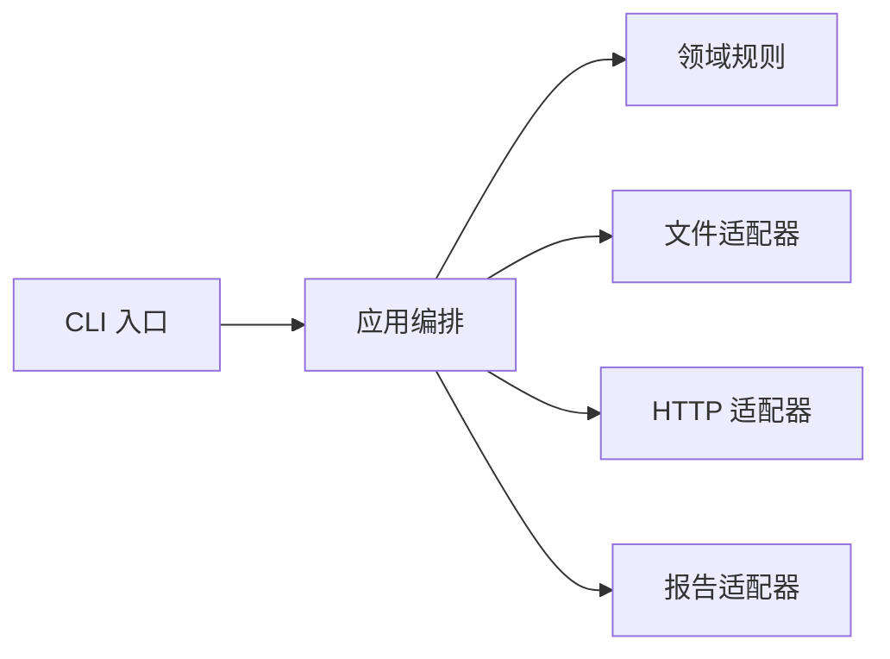
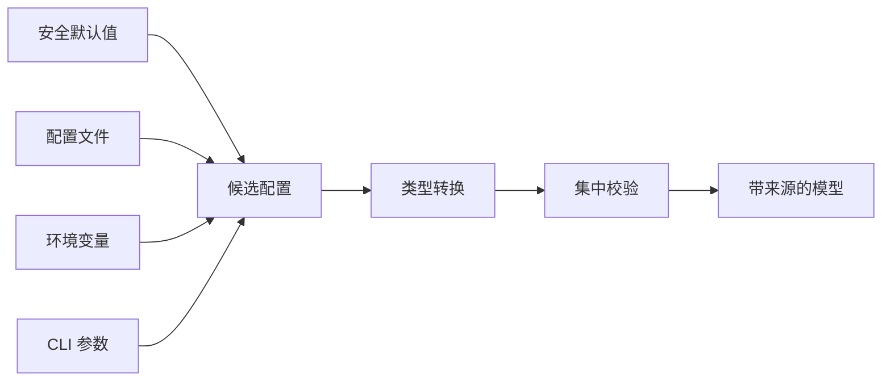

# Python 运维自动化与工程实践 · 第三册：工程质量与运行环境

## 第十章 · 让项目离开你的电脑也能正常运行

### 单个 `.py` 文件越来越乱时，项目应该怎样拆开？

单文件能快速验证想法，但当参数解析、配置、HTTP、并发和输出互相穿插时，修改一处就可能影响所有路径。
拆分目标不是让文件数量变多，而是让依赖方向清楚。



箭头表示依赖方向：入口和外部适配器可以依赖稳定规则，规则不应反向导入 CLI、网络客户端或终端渲染。

```text
python-for-ops-check/
├── pyproject.toml
├── README.md
├── src/
│   └── ops_check/
│       ├── __init__.py
│       ├── cli.py
│       ├── config.py
│       ├── domain.py
│       ├── executor.py
│       ├── inventory.py
│       └── report.py
└── tests/
    ├── test_config.py
    ├── test_executor.py
    └── test_report.py
```

`domain.py` 放稳定数据模型，`config.py` 建立输入边界，`executor.py` 管理执行，`report.py` 只负责表现，`cli.py` 组合它们。

#### 依赖从外向内，不让核心反向依赖 CLI

```text
CLI / HTTP / 文件适配器
          |
          v
      应用流程
          |
          v
     领域模型与规则
```

领域函数不导入 argparse、HTTPX 或终端颜色库。
这样规则可以在内存中测试，也能被未来的 Worker 或 Web API 复用。

#### 模块名表达职责

避免 `utils.py`、`helpers.py` 最终变成无边界仓库。
函数若处理配置，就放配置模块；若提供跨模块通用时间抽象，可以命名 `clock.py` 并保持接口窄。

#### 导入不应产生运行副作用

```python
# 不推荐：import 时立即读取文件和访问网络
CONFIG = load_config(Path("config.json"))
CLIENT = httpx.Client()
```

模块导入应主要定义类型、函数和常量。
资源在 `main()` 或应用工厂中创建，并通过参数传入。

遇到“本机能导入、CI 不能导入”时，先记录 `sys.executable`、`sys.path`、当前目录和实际安装包位置，再检查是否存在与包同名的脚本。
不要用修改 `PYTHONPATH` 或 `sys.path.insert()` 掩盖错误布局；应从仓库外执行 wheel 安装 smoke，证明导入来自分发产物。

#### `__main__` 保持薄

```python
from .cli import main


if __name__ == "__main__":
    raise SystemExit(main())
```

真正逻辑在可导入函数中，测试无需启动子进程。

#### 本节练习

把第二册的单文件工具拆成上述结构，并画出每个模块导入谁。
若出现 `domain -> cli` 或两个模块互相导入，重新检查边界。
拆分前后运行同一组行为测试，证明只是重构，没有改变输出协议。

### 怎样让同事安装出与你一致的 Python 和依赖环境？

“在我电脑能跑”通常隐藏了 Python 小版本、系统库、依赖解析结果和环境变量差异。
项目需要声明要求，并提供可复现安装路径。

#### 虚拟环境隔离项目依赖

```bash
python3 -m venv .venv
source .venv/bin/activate
python -m pip install --upgrade pip
python -m pip install -e .
```

Windows 激活命令不同；自动化中可以直接调用 `.venv` 内解释器，不必依赖 shell 激活。
虚拟环境不是容器，也不会隔离系统内核和外部命令版本。

#### 用 `pyproject.toml` 声明项目

```toml
[build-system]
requires = ["hatchling"]
build-backend = "hatchling.build"

[project]
name = "ops-check"
version = "0.1.0"
requires-python = ">=3.12"
license = "MIT"
dependencies = [
  "httpx>=0.27,<1",
]

[dependency-groups]
dev = [
  "pytest>=8,<9",
  "ruff>=0.6,<1",
]

[project.scripts]
ops-check = "ops_check.cli:main"
```

`license` 使用 SPDX 表达式字符串；需要把许可证文件纳入分发包时，再声明 `license-files` 并检查构建后 wheel 和 sdist 的实际内容。
字段和现代打包方式应以 [Python Packaging User Guide](https://packaging.python.org/en/latest/guides/writing-pyproject-toml/) 为准。
入口点安装后提供 `ops-check` 命令，不再要求用户知道源码路径。

#### 版本范围与锁文件解决不同问题

项目元数据声明兼容范围，锁文件记录某次解析出的具体版本和摘要。
应用通常应提交锁文件，让 CI 与部署解析同一依赖图；可复用库则需避免把依赖钉死到只适合本机的组合。

使用 uv 时，创建项目、同步环境和锁定行为以 [uv 官方项目文档](https://docs.astral.sh/uv/guides/projects/) 为准：

```bash
uv sync --locked
uv run ops-check --help
```

uv 默认会同步默认依赖组，因此这里把测试和质量工具放进 `dependency-groups.dev`；项目 extras 不会仅因为存在就自动同步。
`--locked` 的目的，是锁文件与项目声明不一致时失败，而不是在部署时悄悄重新解析。

#### Python 版本也要锁定在执行入口

README、CI、容器镜像和 `requires-python` 应一致。
启动时可记录解释器版本，但不要用运行时警告替代安装约束。

#### 本节练习

在全新临时目录或干净容器中，仅根据仓库文件完成安装并运行：

```text
ops-check --help
ops-check validate --config tests/fixtures/valid.json
python -m pytest
```

记录 Python 版本、锁文件状态和实际命令；本机已有环境成功不算可复现验证。

#### 第三册综合实验：建立可以在干净环境重现的质量门禁

这一实验把第二册的 `ops-check` 代码放进标准项目。
以下版本号只是结构示例，真正采用时要根据当前官方兼容范围和锁文件决定。

项目元数据：

```toml
[build-system]
requires = ["hatchling>=1.27"]
build-backend = "hatchling.build"

[project]
name = "ops-check-lab"
version = "0.1.0"
description = "A bounded localhost operations checker"
readme = "README.md"
requires-python = ">=3.12"
license = "MIT"
license-files = ["LICENSE*"]
authors = [
  {name = "Operations Team"},
]
dependencies = [
  "httpx>=0.27,<1",
]

[dependency-groups]
dev = [
  "build>=1.2,<2",
  "mypy>=1.11,<2",
  "pytest>=8,<9",
  "pytest-cov>=5,<7",
  "ruff>=0.6,<1",
]

[project.scripts]
ops-check = "ops_check.cli:main"

[tool.hatch.build.targets.wheel]
packages = ["src/ops_check"]

[tool.pytest.ini_options]
addopts = [
  "--strict-config",
  "--strict-markers",
  "--showlocals",
]
testpaths = ["tests"]

[tool.coverage.run]
branch = true
source = ["ops_check"]

[tool.coverage.report]
show_missing = true
skip_covered = true
fail_under = 85

[tool.mypy]
python_version = "3.12"
strict = true
files = ["src", "tests"]
warn_unreachable = true

[tool.ruff]
target-version = "py312"
line-length = 100
src = ["src", "tests"]

[tool.ruff.lint]
select = [
  "E",
  "F",
  "I",
  "B",
  "UP",
  "SIM",
  "RUF",
]

[tool.ruff.lint.per-file-ignores]
"tests/**/*.py" = ["S101"]

[tool.ruff.format]
quote-style = "double"
indent-style = "space"
line-ending = "lf"
```

`fail_under` 是团队门槛，不是通用真理。
高覆盖率也可能只覆盖无意义分支；评审仍要确认关键失败路径是否存在测试。


#### 包入口和版本边界

```python
# src/ops_check/__init__.py
"""Bounded operations checks."""

from importlib.metadata import PackageNotFoundError, version


try:
    __version__ = version("ops-check-lab")
except PackageNotFoundError:
    __version__ = "0+uninstalled"


__all__ = ["__version__"]
```

```python
# src/ops_check/__main__.py
from .cli import main


if __name__ == "__main__":
    raise SystemExit(main())
```

`python -m ops_check` 与安装后的 `ops-check` 应进入同一个 `main()`，避免两个入口行为漂移。


### 升级一个依赖之前，怎样知道它不会悄悄破坏工具？

依赖升级可能改变 API、默认超时、异常类型、传递依赖、最低 Python 版本和安全属性。
“安装成功”只证明解析器找到了一个组合。

#### 升级前先知道为什么依赖它

记录直接依赖的用途、所有者、版本范围和替代方案。
通过依赖树区分直接依赖与传递依赖，避免删除一个看似没 import 的构建依赖。

#### 一次升级保持范围可审查

```text
1. 阅读官方发行说明和迁移说明
2. 更新单个直接依赖或一个相关依赖组
3. 刷新锁文件并检查差异
4. 运行静态检查与完整测试
5. 运行 localhost 集成测试
6. 构建并在干净环境安装产物
7. 小范围运行并观察指标
```

锁文件差异若带来大量不相关版本变化，应先解释解析原因。

#### 对关键外部行为写契约测试

```python
def test_timeout_is_classified(fake_server):
    result = check_url(fake_server.url("/slow"), timeout_seconds=0.05)
    assert result.ok is False
    assert result.category == "timeout"
```

这比断言库内部函数被调用更能防住升级回归。

#### 安全修复也需要测试与发布计划

高危漏洞可能要求加速升级，但跳过行为验证会把安全风险换成可用性风险。
若暂时无法升级，应记录受影响路径、临时缓解、负责人和截止日期，而不是永久忽略扫描结果。

#### 依赖证据要能回答代码最终从哪里来

锁文件解决解析结果，不自动证明下载源、构建后内容与生产安装完全一致。
一次候选发布至少串起四个对象：项目声明、锁文件、构建产物和部署环境中的实际版本。


升级评审可以固定为下面的记录：

```text
直接依赖：
升级原因：功能 安全 兼容 维护
旧版本与新版本：
新增或移除的传递依赖：
上游变更说明：
受影响的公开契约：
锁文件差异：
wheel 摘要：
许可证变化：
本地回归：
localhost 集成：
候选环境验证：
canary 指标：
回退触发：
仍未验证：
```

运行时清单应从当前解释器读取，而不是复制锁文件：

```python
from __future__ import annotations

import importlib.metadata
import json
from pathlib import Path


def installed_distributions() -> list[dict[str, str]]:
    packages = []
    for distribution in importlib.metadata.distributions():
        name = distribution.metadata.get("Name")
        if not name:
            continue
        packages.append(
            {
                "name": name,
                "version": distribution.version,
            }
        )
    return sorted(packages, key=lambda item: item["name"].casefold())


def write_runtime_inventory(path: Path) -> None:
    payload = {
        "schema_version": 1,
        "packages": installed_distributions(),
    }
    path.write_text(
        json.dumps(payload, indent=2, sort_keys=True) + "\n",
        encoding="utf-8",
    )
```

这份清单不是完整 SBOM，也不包含系统库和容器基础层；它能证明目标解释器实际看见哪些 Python distribution。
如果项目有供应链合规要求，应由构建系统生成标准化 SBOM、签名和来源证明，并在部署时校验摘要。

依赖扫描结果还要判断漏洞路径是否可达、是否存在临时缓解以及何时复查。
“扫描无告警”不证明业务安全，“存在 CVE”也不意味着可以不经测试直接替换生产依赖；两者都要进入带负责人和截止时间的风险决策。

#### 本章检查点

```text
[ ] 核心模块不依赖 CLI 与具体外部 SDK
[ ] import 不创建客户端或读取生产配置
[ ] Python 版本、项目元数据和锁文件一致
[ ] 干净环境可安装并运行入口点
[ ] 依赖升级有锁文件审查、契约测试和回退办法
```

## 第十一章 · 配置要能变化，凭证和操作却不能失控

### 默认值、配置文件、环境变量和 Secret 应该怎样分工？

第三册把第二册的配置优先级提升为项目级契约。
默认值用于安全且通用的行为，配置文件用于非敏感环境差异，环境变量用于部署覆盖，Secret 由专门机制注入。



优先级只解决“听谁的”，类型转换与集中校验才解决“能不能执行”。高优先级来源给出非法值时应失败，不能静默退回低优先级值。

#### 默认值应安全而不是方便

```python
DEFAULT_TIMEOUT = 3.0
DEFAULT_CONCURRENCY = 8
DEFAULT_DRY_RUN = True
```

破坏性动作默认关闭，高并发默认受限，网络调用默认有超时。
不能提供安全默认的必需项，例如 API 地址或身份，缺失时应失败。

#### 配置模型集中校验

```python
@dataclass(frozen=True)
class Settings:
    api_url: str
    timeout_seconds: float
    concurrency: int
    token: str


def load_settings(cli: CliOptions, env: Mapping[str, str], raw: object) -> Settings:
    # 合并、类型转换、范围校验和未知字段检查集中在这里。
    ...
```

不要让模块各自读取 `os.environ`，否则测试无法看出依赖，配置优先级也会分裂。

#### Secret 只在需要的生命周期内存在

不要写进 Git、示例配置、命令行参数、异常和缓存文件。
客户端初始化需要 Token 时传入，日志只记录凭证来源和标识的非敏感部分。

#### 配置重载要定义一致性

长进程若支持热重载，应先完整解析新配置，再一次替换内存快照。
解析失败继续使用旧版本并告警，不能留下半新半旧字段。
危险策略变化是否允许热更新，应由权限与审计要求决定。

#### 本节练习

测试缺少 Secret、空 Secret、配置文件误含 Secret、环境覆盖、非法并发和热重载失败。
断言错误消息与捕获日志中都不存在实际 Token。

#### 配置来源需要携带 provenance

```python
from dataclasses import dataclass
from enum import StrEnum
from typing import Generic, TypeVar


T = TypeVar("T")


class Source(StrEnum):
    DEFAULT = "default"
    FILE = "file"
    ENVIRONMENT = "environment"
    CLI = "cli"


@dataclass(frozen=True, slots=True)
class Sourced(Generic[T]):
    value: T
    source: Source


@dataclass(frozen=True, slots=True)
class EffectiveSettings:
    concurrency: Sourced[int]
    timeout_seconds: Sourced[float]
    output: Sourced[str]
    token: Sourced[str]
```

```python
def choose(
    cli_value: T | None,
    environment_value: T | None,
    file_value: T | None,
    default_value: T,
) -> Sourced[T]:
    if cli_value is not None:
        return Sourced(cli_value, Source.CLI)
    if environment_value is not None:
        return Sourced(environment_value, Source.ENVIRONMENT)
    if file_value is not None:
        return Sourced(file_value, Source.FILE)
    return Sourced(default_value, Source.DEFAULT)
```

对 Token 不输出 `.value`，只输出来源。


### 怎样让日志足够排障，又不会把密码和 Token 打出来？

日志记录事件，不是把程序全部状态倾倒出来。
可检索字段应稳定，消息应说明发生了什么，敏感值应在进入日志系统前脱敏。

```python
import logging


logger = logging.getLogger("ops_check")


logger.info(
    "check completed",
    extra={
        "target": target.host,
        "status": result.category,
        "latency_ms": result.latency_ms,
        "operation_id": operation_id,
    },
)
```

标准库日志层级和配置以 [Python `logging` 官方文档](https://docs.python.org/3/library/logging.html) 为准。

#### 级别表达运维意义

- DEBUG：开发诊断，默认关闭。
- INFO：正常生命周期与关键结果。
- WARNING：可恢复异常或降级。
- ERROR：当前操作失败，需要关注。
- CRITICAL：服务整体无法继续。

单台主机不可达是否是 WARNING 或 INFO，取决于它是预期巡检发现还是工具自身异常。

#### 结构化字段优于在消息里拼字符串

稳定字段便于按 `operation_id`、目标和错误分类聚合。
时间戳使用带时区格式，持续时间使用单调时钟计算，避免把两者混为一谈。

#### 中央脱敏之外还要源头避免

```python
SENSITIVE_KEYS = {"authorization", "token", "password", "secret"}


def redact_mapping(value: Mapping[str, object]) -> dict[str, object]:
    return {
        key: "***" if key.lower() in SENSITIVE_KEYS else item
        for key, item in value.items()
    }
```

嵌套结构、URL 查询参数和自由文本仍可能泄露，通用脱敏器不能覆盖全部语义。
最可靠的策略是不把原始请求头、完整配置和环境快照交给日志函数。

#### 测试日志泄露

```python
def test_token_is_not_logged(caplog):
    token = "test-secret-123"
    run_with_token(token)
    assert token not in caplog.text
```

测试使用专用假值，绝不把真实凭证放进测试。

#### 结构化日志适配器

```python
import json
import logging
from datetime import UTC, datetime
from typing import Any


RESERVED = {
    "name",
    "msg",
    "args",
    "levelname",
    "levelno",
    "pathname",
    "filename",
    "module",
    "exc_info",
    "exc_text",
    "stack_info",
    "lineno",
    "funcName",
    "created",
    "msecs",
    "relativeCreated",
    "thread",
    "threadName",
    "processName",
    "process",
}


class JsonFormatter(logging.Formatter):
    def format(self, record: logging.LogRecord) -> str:
        document: dict[str, Any] = {
            "timestamp": datetime.fromtimestamp(record.created, UTC).isoformat(),
            "level": record.levelname,
            "logger": record.name,
            "message": record.getMessage(),
        }

        for key, value in record.__dict__.items():
            if key not in RESERVED and not key.startswith("_"):
                document[key] = redact_value(key, value)

        if record.exc_info is not None:
            document["exception"] = self.formatException(record.exc_info)

        return json.dumps(document, ensure_ascii=False, sort_keys=True, default=str)


def redact_value(key: str, value: Any) -> Any:
    lowered = key.lower()
    if any(marker in lowered for marker in ("token", "secret", "password", "authorization")):
        return "***"
    return value


def configure_logging(verbose: bool) -> None:
    handler = logging.StreamHandler()
    handler.setFormatter(JsonFormatter())

    root = logging.getLogger()
    root.handlers.clear()
    root.addHandler(handler)
    root.setLevel(logging.DEBUG if verbose else logging.INFO)
```

真实脱敏还要覆盖嵌套映射、URL 和异常正文。
这个适配器的首要价值是让字段稳定，而不是宣称能自动识别所有 Secret。


### 一个运维动作至少要记录哪些信息，事后才能追得回来？

普通运行日志帮助排障，审计记录回答谁在何时通过什么入口，对哪个对象，基于什么请求，执行了什么动作，结果怎样。

```json
{
  "timestamp": "2026-09-01T10:00:00Z",
  "operation_id": "op-...",
  "actor": "ci:nightly-check",
  "action": "service.restart",
  "target": "api-a",
  "mode": "dry-run",
  "request_digest": "sha256:...",
  "outcome": "planned",
  "duration_ms": 12
}
```

#### 审计要记录意图和结果

只有“命令被调用”不足以证明动作成功；只有“成功”又无法追溯请求来源。
变更前记录授权后的意图，变更后记录结果和外部系统返回标识。

#### 身份不能只信用户参数

`--actor alice` 只是自报信息。
共享平台应从已验证身份、CI 工作负载身份或操作系统凭证得到 actor，并保留委托链。

#### 审计日志本身需要保护

限制写权限、设置保留期、监测丢失与篡改，并避免把它变成 Secret 仓库。
审计写入失败时，高风险动作是拒绝执行还是降级继续，必须提前决定。

#### 本章检查点

```text
[ ] 默认配置安全，必需身份缺失即失败
[ ] 配置在单一入口合并和校验
[ ] Secret 不进入 Git、参数、日志和异常
[ ] 日志字段稳定并可按 operation_id 关联
[ ] 审计包含身份、动作、目标、模式、结果和时间
[ ] 审计不可用时的执行策略已经定义
```

#### 审计事件模型

```python
from dataclasses import dataclass
from datetime import datetime


@dataclass(frozen=True, slots=True)
class AuditEvent:
    timestamp: datetime
    operation_id: str
    actor: str
    action: str
    target: str
    mode: str
    outcome: str
    request_digest: str
    duration_ms: float


class AuditSink(Protocol):
    def write(self, event: AuditEvent) -> None: ...
```

业务代码依赖 `AuditSink` 能力；本地实验写 JSON Lines，生产可以适配不可变审计存储。


## 第十二章 · 在代码运行之前，尽量把低级错误拦下来

### 类型提示能怎样帮助我们读懂代码和发现参数错误？

类型提示不会在运行时自动验证外部输入。
它们首先是代码契约，帮助编辑器、静态检查器和评审者追踪数据从哪里来、可能为空吗、函数返回什么。

```python
from collections.abc import Iterable, Mapping
from pathlib import Path


def load_targets(
    path: Path,
    overrides: Mapping[str, str],
) -> list[Target]:
    ...


def summarize(results: Iterable[CheckResult]) -> Summary:
    ...
```

`Iterable` 表示函数只需要遍历，不要求调用者构造列表；`Mapping` 表示只读取键值，不承诺修改。

#### 用联合类型表达真正可空

```python
def find_owner(host: str) -> str | None:
    ...
```

调用者必须处理 `None`，而不是假设总有字符串。
若缺失属于错误，直接返回 `str` 并抛出领域异常，接口会更清楚。

#### `TypedDict` 描述边界字典，数据类描述内部值

```python
from typing import NotRequired, TypedDict


class RawTarget(TypedDict):
    host: str
    port: int
    timeout_seconds: NotRequired[float]
```

它只帮助静态分析，不会检查 JSON。
外部数据仍需运行时验证，验证后转换成冻结数据类。

#### `Protocol` 让业务依赖能力而非实现

```python
from typing import Protocol


class Probe(Protocol):
    def check(self, target: Target) -> CheckResult: ...


def execute(targets: Iterable[Target], probe: Probe) -> list[CheckResult]:
    return [probe.check(target) for target in targets]
```

真实 HTTP 探针和测试假对象只要满足窄接口即可。

#### 类型检查必须进入自动化

本机偶尔运行不能形成门禁。
固定配置与版本，在 CI 中对 `src` 和 `tests` 运行；对无法精确建模的第三方边界集中隔离，而不是到处 `# type: ignore`。

#### 本节练习

故意把 `timeout_seconds="fast"`、可能为 `None` 的 owner 和异步函数返回值传错位置，确认类型检查器在运行前指出问题。
再验证 JSON 中同样的错误仍需运行时校验才能发现。

### 代码风格不该靠争论，怎样交给工具自动检查？

格式化工具解决布局一致性，linter 发现未使用导入、可疑表达式和部分错误模式。
团队应提交统一配置，让 CI 与编辑器执行同一规则。

Ruff 提供格式化与 lint 能力；当前命令和规则以 [Ruff 官方文档](https://docs.astral.sh/ruff/) 为准。

```toml
[tool.ruff]
line-length = 100
target-version = "py312"

[tool.ruff.lint]
select = ["E", "F", "I", "B", "UP"]

[tool.ruff.format]
quote-style = "double"
indent-style = "space"
```

```bash
ruff format --check .
ruff check .
```

#### 格式化与 lint 分开理解

格式化会稳定换行、缩进和引号布局；lint 会检查语义模式。
格式通过不代表没有未处理异常，lint 通过也不代表业务正确。

#### 新规则分批启用

一次启用数百条规则会制造巨大机械差异。
先修现有问题，再逐步提高门槛；忽略项应尽量写在最小行并解释原因。

#### 自动修复后仍要评审和测试

工具可能重排导入或改写语法，不能因为是自动结果就跳过行为验证。
格式化差异与功能差异最好分开提交，方便审查。

#### 本节练习

把格式检查、lint、类型检查和测试组成固定命令：

```bash
ruff format --check .
ruff check .
python -m mypy src
python -m pytest
```

本地和 CI 使用相同 Python 与锁文件，避免“本地绿、CI 红”。

#### GitHub Actions 质量门禁示例

```yaml
name: quality

on:
  pull_request:
  push:
    branches:
      - main

permissions:
  contents: read

jobs:
  test:
    runs-on: ubuntu-latest
    timeout-minutes: 15

    strategy:
      fail-fast: false
      matrix:
        python-version:
          - "3.12"
          - "3.13"

    steps:
      - name: Check out repository
        uses: actions/checkout@v7

      - name: Set up Python
        uses: actions/setup-python@v7
        with:
          python-version: ${{ matrix.python-version }}

      - name: Install project and development dependencies
        run: |
          python -m pip install uv
          uv sync --locked

      - name: Check formatting
        run: uv run --locked ruff format --check .

      - name: Run linter
        run: uv run --locked ruff check .

      - name: Run type checker
        run: uv run --locked python -m mypy src tests

      - name: Run tests
        run: uv run --locked python -m pytest --cov --cov-report=term-missing

      - name: Build distributions
        run: uv run --locked python -m build
```

示例采用 2026-09-02 核对时的当前主版本；升级主版本时还要核对 runner 的 Node 运行时要求。
真实项目应按供应链策略固定到审核过的完整提交摘要，并由依赖更新工具提交可审查的升级；主版本标签仅用于教学可读性。

#### 干净安装任务

```yaml
  install-smoke:
    runs-on: ubuntu-latest
    needs:
      - test
    timeout-minutes: 10

    steps:
      - name: Check out repository
        uses: actions/checkout@v7

      - name: Set up Python
        uses: actions/setup-python@v7
        with:
          python-version: "3.12"

      - name: Build wheel
        run: |
          python -m pip install build
          python -m build --wheel

      - name: Install wheel only
        run: |
          python -m venv smoke-venv
          smoke-venv/bin/python -m pip install dist/*.whl

      - name: Verify installed entry point
        run: |
          smoke-venv/bin/ops-check --version
          smoke-venv/bin/ops-check --help
```

源码目录内执行入口可能误用工作树模块。
更严格的 smoke test 应切换到仓库外临时目录，再运行已安装命令。

#### 发布前证据清单

| 证据 | 成功标准 | 不足以证明什么 |
| --- | --- | --- |
| `ruff format --check` | 格式无差异 | 业务正确 |
| `ruff check` | 已选规则通过 | 未选择规则和运行时行为 |
| mypy | 类型契约一致 | JSON 输入真实有效 |
| pytest | 已编写场景通过 | 未编写的生产条件 |
| coverage | 执行行和分支比例 | 断言质量 |
| wheel build | 可生成产物 | 产物能安装和启动 |
| clean install | 新环境入口可运行 | 真实生产权限与网络 |
| localhost integration | 协议与超时路径可复现 | 外部服务全部行为 |
| canary | 小范围真实运行 | 全量容量和长周期稳定性 |

#### 失败注入目录

```text
tests/faults/
├── bad-encoding.json
├── bad-json.json
├── duplicate-target.json
├── empty-targets.json
├── huge-response.json
├── invalid-content-type.json
├── missing-token.env.example
├── redirect-loop.json
├── slow-response.json
├── unknown-field.json
└── unsupported-schema.json
```

二进制坏编码 fixture 要由可审核脚本生成，不要在编辑器里依赖不可见字符。

#### 质量门禁故障矩阵

| 编号 | 层级 | 故障 | 预期门禁 |
| --- | --- | --- | --- |
| Q01 | 语法 | 括号缺失 | 编译或测试收集失败 |
| Q02 | 导入 | 模块名拼错 | lint 或测试失败 |
| Q03 | 类型 | 字符串传给并发参数 | mypy 失败 |
| Q04 | 类型 | 忽略可空返回 | mypy 失败 |
| Q05 | 风格 | 未使用导入 | Ruff 失败 |
| Q06 | 风格 | 导入顺序漂移 | Ruff 失败 |
| Q07 | 配置 | 未知字段 | 单元测试断言拒绝 |
| Q08 | 配置 | 非法环境数字 | 不回退默认值 |
| Q09 | Secret | Token 出现在日志 | caplog 测试失败 |
| Q10 | Secret | Token 出现在异常 | 异常文本测试失败 |
| Q11 | 文件 | 替换失败 | 旧文件保持完整 |
| Q12 | 文件 | 写入中断 | 临时文件可清理 |
| Q13 | HTTP | 连接超时 | 分类为 timeout |
| Q14 | HTTP | 读取超时 | 分类为 timeout |
| Q15 | HTTP | 429 | 遵守有限退避 |
| Q16 | HTTP | 500 | 不对永久动作盲目重试 |
| Q17 | HTTP | 200 非 JSON | invalid_response |
| Q18 | HTTP | 重定向外域 | 默认不跟随 |
| Q19 | 并发 | 一个 Future 异常 | 目标身份不丢失 |
| Q20 | 并发 | 用户取消 | 取消继续传播 |
| Q21 | 输出 | 日志混入 stdout | JSON 协议测试失败 |
| Q22 | 输出 | 并发次序变化 | 排序后快照稳定 |
| Q23 | CLI | 参数缺失 | 退出 2 |
| Q24 | CLI | 巡检发现 | 退出 1 |
| Q25 | CLI | 运行时失败 | 退出 3 |
| Q26 | CLI | SIGINT | 退出 130 |
| Q27 | 包 | 缺少模块 | wheel 安装 smoke 失败 |
| Q28 | 包 | 入口点写错 | `--help` smoke 失败 |
| Q29 | 依赖 | 锁文件过期 | locked sync 失败 |
| Q30 | 依赖 | 最低 Python 提升 | 版本矩阵暴露 |
| Q31 | 性能 | O(n²) 对账 | 基准趋势告警 |
| Q32 | 资源 | 文件句柄未关闭 | 重复测试暴露增长 |
| Q33 | 资源 | 线程未回收 | 测试进程无法正常结束 |
| Q34 | 审计 | 结果未带 operation ID | schema 测试失败 |
| Q35 | 审计 | 失败动作无 outcome | 审计契约测试失败 |
| Q36 | 时间 | 使用墙钟算耗时 | 假时钟测试失败 |
| Q37 | 重试 | 永久错误被重试 | 调用次数断言失败 |
| Q38 | 重试 | 退避超过 deadline | 总预算测试失败 |
| Q39 | 兼容 | 删除 JSON 字段 | schema 快照测试失败 |
| Q40 | 清理 | 测试残留临时文件 | teardown 检查失败 |

#### 性能调查记录模板

```text
问题陈述：
用户可见影响：
首次发生时间：
输入规模：
目标失败比例：
Python 版本：
依赖锁摘要：
CPU 配额：
内存限制：
并发设置：
单项超时：
批次 deadline：
基线总耗时：
基线 P50：
基线 P95：
基线 P99：
峰值 RSS：
最大在途任务：
队列最大深度：
外部 429 数：
外部 5xx 数：
profile 文件摘要：
累计时间前三函数：
调用次数异常函数：
第一假设：
排除实验：
实验结果：
第二假设：
最小修复：
正确性对照：
性能对照：
回退条件：
未验证范围：
```

#### 门禁执行顺序

快速且确定的检查放前面，让反馈更快：

```text
1. pyproject 与锁文件一致性
2. 格式检查
3. lint
4. 类型检查
5. 快速单元测试
6. localhost 集成测试
7. 构建 sdist 与 wheel
8. 仓库外干净安装
9. CLI smoke
10. 安全与依赖扫描
11. 测试环境故障注入
12. 小范围 canary
```

某一步没运行就标记 `NOT VERIFIED`，不能用前一步成功替代。

#### 练习验收记录

```text
PASS  `ruff format --check .`
PASS  `ruff check .`
PASS  严格类型检查
PASS  单元测试与分支覆盖门槛
PASS  localhost 超时、500、坏 JSON
PASS  wheel 构建
PASS  仓库外新虚拟环境安装
PASS  安装后的 `ops-check --help`
NOT VERIFIED  生产 CA 与真实认证
NOT VERIFIED  目标系统限流阈值
NOT VERIFIED  20,000 目标容量
NOT VERIFIED  多平台信号和进程树行为
```

工程质量不是把工具名列在 README 中。
每道门禁都要对应一种具体失败，并说明它仍然不能证明什么。


### `assert`、输入校验和异常处理，分别应该用在哪里？

三者保护不同边界：

- 输入校验处理用户、文件、API 等不可信数据。
- 异常处理表达运行时失败与恢复策略。
- `assert` 检查程序内部本应恒真的不变量。

```python
def percentage(passed: int, total: int) -> float:
    if total < 0 or passed < 0 or passed > total:
        raise ValueError("invalid counts")
    if total == 0:
        return 0.0
    return passed / total * 100
```

这些是公开函数输入约束，不能用 `assert` 替代，因为优化模式可能移除断言，而且用户错误不应显示为内部缺陷。

#### 断言适合已经验证后的内部关系

```python
summary = summarize(results)
assert summary.passed + summary.failed == summary.completed
```

断言失败意味着代码或内部模型有 bug，应保留 traceback 并修复。

#### 不要用断言做权限检查

```python
# 严重错误示例
assert actor.is_admin
perform_destructive_change()
```

权限、身份、路径范围和资源限制都必须使用不可被优化关闭的显式检查。

#### 异常捕获不能取代入口验证

让深层代码因 `KeyError`、`TypeError` 偶然失败，会产生不稳定错误信息。
入口先验证，深层仅处理其真正负责的外部错误。

#### 本章检查点

```text
[ ] 公共函数和领域模型有有用类型
[ ] 外部数据仍有运行时验证
[ ] 格式、lint、类型和测试是四个独立门禁
[ ] assert 只用于内部不变量
[ ] 权限与用户输入使用显式错误
```

## 第十三章 · 别靠“看起来没问题”判断代码质量

### 第一个 pytest 应该测什么，才能真正防住回归？

第一个测试应覆盖最重要且容易被修改破坏的业务行为，而不是只断言函数被调用。
对批量巡检 CLI，配置校验、结果汇总和退出码是高价值起点。

测试先固定公开行为：返回值、退出码、外部调用和可观察产物。只有当内部实现本身就是契约时，才直接断言私有步骤。

pytest 的 fixture 与断言机制以 [pytest 官方文档](https://docs.pytest.org/) 为准。

```python
import pytest


@pytest.mark.parametrize(
    ("port", "message"),
    [
        (0, "between 1 and 65535"),
        (65536, "between 1 and 65535"),
        (True, "must be an integer"),
    ],
)
def test_rejects_invalid_ports(port, message):
    with pytest.raises(ValueError, match=message):
        parse_target({"host": "api-a", "port": port})
```

#### 测可观察行为而不是实现细节

重构内部循环不应让测试失败。
断言返回模型、文件内容、日志字段和退出码，而不是私有函数调用次数，除非调用次数本身就是限流契约。

#### 测试名称写清条件与结果

`test_config()` 信息太少。
`test_unknown_target_field_is_rejected()` 能直接告诉维护者哪条规则回归。

#### 一个测试只突出一个失败原因

准备最小输入，使失败时不用在几十个字段中搜索。
共享样本可以用 fixture，但不要把所有测试塞进一个巨大 fixture，导致状态难以追踪。

#### 退出码需要入口测试

```python
def test_findings_return_exit_one(tmp_path, capsys):
    config = tmp_path / "targets.json"
    config.write_text('{"targets": []}', encoding="utf-8")

    code = main(["validate", "--config", str(config)])

    captured = capsys.readouterr()
    assert code == 2
    assert "targets cannot be empty" in captured.err
    assert captured.out == ""
```

#### 本节练习

建立最小回归套件：合法配置、坏 JSON、未知字段、单目标超时、部分失败汇总、JSON schema 版本和用户中断映射。

### 不连接真实服务器和数据库，测试还能怎样写？


每向右一步，真实度、成本和风险都增加；左侧通过不能替代右侧证据，但能让高成本验证聚焦在更少的未知项上。

单元测试通过依赖注入把网络、时钟、随机数和文件系统换成可控实现。
测试不是“假装生产没依赖”，而是精确制造正常和失败条件。

#### `tmp_path` 提供隔离文件系统

```python
def test_atomic_write_replaces_complete_file(tmp_path):
    target = tmp_path / "config.json"
    target.write_text('{"version": 1}\n', encoding="utf-8")

    write_json_atomic(target, {"version": 2})

    assert json.loads(target.read_text(encoding="utf-8")) == {"version": 2}
    assert list(tmp_path.glob("*.tmp")) == []
```

#### `monkeypatch` 控制环境变量

```python
def test_environment_overrides_file(monkeypatch):
    monkeypatch.setenv("OPS_CONCURRENCY", "4")
    settings = load_settings_from_sources(file_value=2)
    assert settings.concurrency == 4
```

fixture 会在测试后恢复环境，避免相互污染。

#### 假客户端比全局 mock 更清楚

```python
class FakeInventoryClient:
    def __init__(self, targets: list[Target]) -> None:
        self.targets = targets

    def list_targets(self) -> list[Target]:
        return list(self.targets)


def test_plan_filters_disabled_targets():
    client = FakeInventoryClient([...])
    plan = build_plan(client)
    assert [item.host for item in plan] == ["api-a"]
```

#### localhost 假服务用于协议集成

需要验证真实 HTTP 状态码、超时和 JSON 解码时，启动只绑定 `127.0.0.1` 的测试服务。
不要在普通测试中访问公网或生产域名；网络波动会让结果不可复现，也可能产生真实副作用。

#### Mock 不能证明第三方真实行为

mock 通过只能证明你的代码按预设交互。
关键 SDK 还需要少量契约测试或沙箱集成测试，并清楚标记是否真正运行。

#### 本节练习

使用 `tmp_path`、`monkeypatch`、假时钟和 localhost 服务覆盖文件、配置、退避和 HTTP 失败；每个测试执行后检查无线程、端口和临时文件残留。

#### 用假时钟消除时间测试抖动

```python
from typing import Protocol


class Clock(Protocol):
    def monotonic(self) -> float: ...


class FakeClock:
    def __init__(self, values: list[float]) -> None:
        self._values = iter(values)

    def monotonic(self) -> float:
        return next(self._values)


def elapsed_ms(clock: Clock, operation: Callable[[], T]) -> tuple[T, float]:
    started = clock.monotonic()
    result = operation()
    finished = clock.monotonic()
    return result, (finished - started) * 1000
```

```python
def test_elapsed_ms_uses_monotonic_clock() -> None:
    clock = FakeClock([10.0, 10.125])

    value, duration = elapsed_ms(clock, lambda: "ok")

    assert value == "ok"
    assert duration == pytest.approx(125.0)
```

#### 用假睡眠验证退避而不拖慢测试

```python
@dataclass
class FakeSleeper:
    delays: list[float]

    def sleep(self, seconds: float) -> None:
        self.delays.append(seconds)


def retry(
    operation: Callable[[], T],
    *,
    attempts: int,
    sleep: Callable[[float], None],
) -> T:
    for attempt in range(1, attempts + 1):
        try:
            return operation()
        except TransientError:
            if attempt == attempts:
                raise
            sleep(0.1 * (2 ** (attempt - 1)))
    raise AssertionError("unreachable")
```

```python
def test_retry_stops_after_success() -> None:
    calls = 0
    sleeper = FakeSleeper([])

    def flaky() -> str:
        nonlocal calls
        calls += 1
        if calls < 3:
            raise TransientError("not yet")
        return "ok"

    assert retry(flaky, attempts=4, sleep=sleeper.sleep) == "ok"
    assert calls == 3
    assert sleeper.delays == [0.1, 0.2]
```

#### 日志脱敏测试

```python
def test_json_formatter_redacts_sensitive_extra() -> None:
    formatter = JsonFormatter()
    record = logging.LogRecord(
        name="ops_check",
        level=logging.INFO,
        pathname=__file__,
        lineno=1,
        msg="request ready",
        args=(),
        exc_info=None,
    )
    record.api_token = "test-token-value"
    record.target = "api-a"

    document = json.loads(formatter.format(record))

    assert document["api_token"] == "***"
    assert document["target"] == "api-a"
    assert "test-token-value" not in formatter.format(record)
```

#### CLI 输出协议测试

```python
def test_json_mode_keeps_stdout_machine_readable(capsys) -> None:
    code = main([
        "run",
        "--config",
        "tests/fixtures/all-ok.json",
        "--output",
        "json",
    ])

    captured = capsys.readouterr()
    document = json.loads(captured.out)

    assert code == 0
    assert document["schema_version"] == 1
    assert document["complete"] is True
    assert "starting" not in captured.out
```

#### 原子写入失败测试

```python
def test_failed_replace_preserves_old_report(tmp_path, monkeypatch) -> None:
    target = tmp_path / "report.json"
    target.write_text('{"version":"old"}\n', encoding="utf-8")

    def fail_replace(source: str, destination: Path) -> None:
        raise OSError("injected replace failure")

    monkeypatch.setattr(os, "replace", fail_replace)

    with pytest.raises(OSError, match="injected"):
        write_report_atomic(target, {"version": "new"})

    assert json.loads(target.read_text(encoding="utf-8")) == {"version": "old"}
    assert not list(tmp_path.glob(".*.tmp"))
```

#### 配置优先级参数化测试

```python
@pytest.mark.parametrize(
    ("cli", "environment", "file", "expected", "source"),
    [
        (4, 3, 2, 4, Source.CLI),
        (None, 3, 2, 3, Source.ENVIRONMENT),
        (None, None, 2, 2, Source.FILE),
        (None, None, None, 1, Source.DEFAULT),
    ],
)
def test_configuration_precedence(cli, environment, file, expected, source) -> None:
    selected = choose(cli, environment, file, 1)
    assert selected.value == expected
    assert selected.source is source
```


#### 工程回归套件：测试配置、日志、审计和重试的契约

先为设置对象建立不会输出 Secret 的表示：

```python
from dataclasses import dataclass


@dataclass(frozen=True, slots=True, repr=False)
class SecretValue:
    _value: str

    def reveal(self) -> str:
        return self._value

    def __repr__(self) -> str:
        return "SecretValue(***)"

    def __str__(self) -> str:
        return "***"


@dataclass(frozen=True, slots=True)
class Settings:
    api_url: str
    timeout_seconds: float
    concurrency: int
    token: SecretValue
```

这只是减少意外展示，不是加密。
真正字符串在调用 `reveal()` 后仍可能被日志、异常或调试器观察。

```python
def parse_positive_float(name: str, value: object) -> float:
    if isinstance(value, bool):
        raise ConfigError(f"{name} must be a number")

    try:
        parsed = float(value)
    except (TypeError, ValueError) as exc:
        raise ConfigError(f"{name} must be a number") from exc

    if not 0.05 <= parsed <= 60.0:
        raise ConfigError(f"{name} must be between 0.05 and 60")
    return parsed


def parse_concurrency(value: object) -> int:
    if isinstance(value, bool):
        raise ConfigError("concurrency must be an integer")
    if not isinstance(value, int):
        raise ConfigError("concurrency must be an integer")
    if not 1 <= value <= 64:
        raise ConfigError("concurrency must be between 1 and 64")
    return value
```

#### Secret 类型测试

```python
def test_secret_repr_is_redacted() -> None:
    secret = SecretValue("test-only-token")
    assert repr(secret) == "SecretValue(***)"
    assert str(secret) == "***"
    assert "test-only-token" not in repr(secret)


def test_secret_requires_explicit_reveal() -> None:
    secret = SecretValue("test-only-token")
    assert secret.reveal() == "test-only-token"


def test_settings_repr_does_not_expose_token() -> None:
    settings = Settings(
        api_url="http://127.0.0.1:8080",
        timeout_seconds=1.0,
        concurrency=4,
        token=SecretValue("test-only-token"),
    )
    assert "test-only-token" not in repr(settings)
```

#### 数字解析测试

```python
@pytest.mark.parametrize("value", [0.05, 1, "2.5", 60])
def test_positive_float_accepts_documented_range(value: object) -> None:
    assert 0.05 <= parse_positive_float("timeout", value) <= 60


@pytest.mark.parametrize("value", [True, False, None, "fast", [], {}])
def test_positive_float_rejects_non_numbers(value: object) -> None:
    with pytest.raises(ConfigError, match="must be a number"):
        parse_positive_float("timeout", value)


@pytest.mark.parametrize("value", [-1, 0, 0.01, 60.1, 1000])
def test_positive_float_rejects_out_of_range(value: object) -> None:
    with pytest.raises(ConfigError, match="between 0.05 and 60"):
        parse_positive_float("timeout", value)


@pytest.mark.parametrize("value", [1, 4, 64])
def test_concurrency_accepts_documented_range(value: int) -> None:
    assert parse_concurrency(value) == value


@pytest.mark.parametrize("value", [True, 1.0, "4", None, [], {}])
def test_concurrency_rejects_wrong_type(value: object) -> None:
    with pytest.raises(ConfigError, match="must be an integer"):
        parse_concurrency(value)


@pytest.mark.parametrize("value", [-1, 0, 65, 1000])
def test_concurrency_rejects_out_of_range(value: int) -> None:
    with pytest.raises(ConfigError, match="between 1 and 64"):
        parse_concurrency(value)
```

#### 配置来源报告

```python
def visible_settings(settings: EffectiveSettings) -> dict[str, object]:
    return {
        "concurrency": {
            "value": settings.concurrency.value,
            "source": settings.concurrency.source,
        },
        "timeout_seconds": {
            "value": settings.timeout_seconds.value,
            "source": settings.timeout_seconds.source,
        },
        "output": {
            "value": settings.output.value,
            "source": settings.output.source,
        },
        "token": {
            "value": "***",
            "source": settings.token.source,
        },
    }
```

```python
def test_visible_settings_redacts_secret_value() -> None:
    token = "test-only-token"
    settings = EffectiveSettings(
        concurrency=Sourced(4, Source.CLI),
        timeout_seconds=Sourced(1.0, Source.FILE),
        output=Sourced("json", Source.DEFAULT),
        token=Sourced(token, Source.ENVIRONMENT),
    )

    visible = visible_settings(settings)
    rendered = json.dumps(visible)

    assert visible["token"] == {
        "value": "***",
        "source": Source.ENVIRONMENT,
    }
    assert token not in rendered
```

#### 审计 JSON Lines 写入器

```python
from dataclasses import asdict
from pathlib import Path
from threading import Lock


class JsonLinesAuditSink:
    def __init__(self, path: Path) -> None:
        self._path = path
        self._lock = Lock()

    def write(self, event: AuditEvent) -> None:
        document = asdict(event)
        document["timestamp"] = event.timestamp.isoformat()
        rendered = json.dumps(
            document,
            ensure_ascii=False,
            sort_keys=True,
            separators=(",", ":"),
        )

        self._path.parent.mkdir(parents=True, exist_ok=True)
        with self._lock:
            with self._path.open("a", encoding="utf-8", newline="\n") as handle:
                handle.write(rendered)
                handle.write("\n")
                handle.flush()
```

本地锁只协调当前进程的线程，不解决多个进程并发追加和主机崩溃耐久性。
生产审计应使用能满足访问、完整性和保留要求的存储。

```python
from datetime import UTC, datetime


def audit_event() -> AuditEvent:
    return AuditEvent(
        timestamp=datetime(2026, 9, 1, 10, 0, tzinfo=UTC),
        operation_id="op-test-1",
        actor="test-runner",
        action="check.http",
        target="api-a",
        mode="dry-run",
        outcome="planned",
        request_digest="sha256:test",
        duration_ms=1.25,
    )


def test_audit_sink_writes_one_parseable_line(tmp_path: Path) -> None:
    path = tmp_path / "audit.jsonl"
    sink = JsonLinesAuditSink(path)

    sink.write(audit_event())

    lines = path.read_text(encoding="utf-8").splitlines()
    assert len(lines) == 1
    document = json.loads(lines[0])
    assert document["operation_id"] == "op-test-1"
    assert document["mode"] == "dry-run"


def test_audit_sink_appends_without_rewriting_old_events(tmp_path: Path) -> None:
    path = tmp_path / "audit.jsonl"
    path.write_text('{"existing":true}\n', encoding="utf-8")
    sink = JsonLinesAuditSink(path)

    sink.write(audit_event())

    lines = path.read_text(encoding="utf-8").splitlines()
    assert json.loads(lines[0]) == {"existing": True}
    assert json.loads(lines[1])["operation_id"] == "op-test-1"
```

#### 重试分类模型

```python
class ErrorKind(StrEnum):
    TRANSIENT = "transient"
    PERMANENT = "permanent"
    UNKNOWN = "unknown"


class OperationFailure(Exception):
    def __init__(self, message: str, kind: ErrorKind) -> None:
        super().__init__(message)
        self.kind = kind


def retryable(error: OperationFailure) -> bool:
    return error.kind is ErrorKind.TRANSIENT
```

```python
def retry_classified(
    operation: Callable[[], T],
    *,
    attempts: int,
    sleep: Callable[[float], None],
) -> T:
    if attempts < 1:
        raise ValueError("attempts must be positive")

    for attempt in range(1, attempts + 1):
        try:
            return operation()
        except OperationFailure as exc:
            if not retryable(exc):
                raise
            if attempt == attempts:
                raise
            sleep(min(2.0, 0.1 * (2 ** (attempt - 1))))

    raise AssertionError("unreachable")
```

```python
def test_permanent_failure_is_not_retried() -> None:
    calls = 0

    def operation() -> str:
        nonlocal calls
        calls += 1
        raise OperationFailure("bad credentials", ErrorKind.PERMANENT)

    with pytest.raises(OperationFailure, match="bad credentials"):
        retry_classified(operation, attempts=5, sleep=lambda _: None)

    assert calls == 1


def test_unknown_failure_is_not_retried() -> None:
    calls = 0

    def operation() -> str:
        nonlocal calls
        calls += 1
        raise OperationFailure("result uncertain", ErrorKind.UNKNOWN)

    with pytest.raises(OperationFailure, match="uncertain"):
        retry_classified(operation, attempts=5, sleep=lambda _: None)

    assert calls == 1


def test_transient_failure_obeys_attempt_limit() -> None:
    calls = 0
    delays: list[float] = []

    def operation() -> str:
        nonlocal calls
        calls += 1
        raise OperationFailure("temporary", ErrorKind.TRANSIENT)

    with pytest.raises(OperationFailure, match="temporary"):
        retry_classified(operation, attempts=4, sleep=delays.append)

    assert calls == 4
    assert delays == [0.1, 0.2, 0.4]
```

#### JSON 输出 schema 契约

```python
def assert_summary_schema(document: object) -> None:
    assert isinstance(document, dict)
    assert document["schema_version"] == 1
    assert isinstance(document["complete"], bool)

    summary = document["summary"]
    assert isinstance(summary, dict)
    assert isinstance(summary["planned"], int)
    assert isinstance(summary["completed"], int)
    assert isinstance(summary["passed"], int)
    assert isinstance(summary["failed"], int)

    assert summary["completed"] <= summary["planned"]
    assert summary["passed"] + summary["failed"] == summary["completed"]
```

如果机器接口长期维护，可以使用正式 JSON Schema 并做兼容性测试。
手写断言适合教学，但容易漏字段约束。

#### 构建产物检查脚本的行为要求

检查 wheel 时至少验证：

```text
[ ] 文件名包含预期项目名与版本
[ ] wheel 中含所有 `src/ops_check` 模块
[ ] wheel 中不含 `.env`、测试 Token 和本地报告
[ ] METADATA 的 Requires-Python 正确
[ ] METADATA 的直接依赖与 pyproject 一致
[ ] console_scripts 指向 `ops_check.cli:main`
[ ] LICENSE 与 README 按项目策略包含
[ ] 从仓库外目录安装后能够 import
[ ] 安装后的 `--version` 与包元数据一致
[ ] 安装后的 `--help` 不读取生产配置
```

不要只检查 `dist/` 中存在一个文件。

#### 发布前 dry-run

```text
1. 从已审核提交创建干净工作树。
2. 使用项目声明的最低 Python 版本同步锁文件。
3. 运行格式、lint、类型和测试。
4. 运行最高支持 Python 版本测试。
5. 构建 sdist 和 wheel。
6. 检查产物内容与元数据。
7. 在仓库外新虚拟环境安装 wheel。
8. 运行 `ops-check --version` 和 `--help`。
9. 启动 localhost 假服务执行完整 smoke。
10. 对产物执行安全与许可证扫描。
11. 保存命令、摘要、退出码和 CI 链接。
12. 不上传、不打标签，把结果交给发布审批。
```

#### canary 观察窗口

小范围生产验证至少比较：

```text
提交请求数
配置错误率
任务完成率
目标成功/失败分类
请求 P50/P95/P99
批次总耗时
外部 429/5xx
重试次数与预算耗尽
峰值内存与 CPU
线程/任务在途数
文件描述符数量
临时文件残留
SIGTERM 退出耗时
日志 Secret 扫描
审计事件缺失率
```

新版本与旧版本使用同类目标和时间窗口对照。
若流量结构不同，应明确这是观察限制。

#### 回滚不是安装旧版本这么简单

发布前回答：

- 新版是否写入旧版无法读取的配置或状态？
- JSON 输出 schema 是否被下游采用？
- 数据库迁移是否向后兼容？
- 已创建任务能否由旧 Worker 消费？
- 新增审计字段在回滚后是否丢失？
- 回滚会不会重复运行正在处理的操作？
- 锁文件和构建产物是否可重新取得并验证摘要？

#### 回滚演练记录

```text
新版本：
旧版本：
产物摘要：
数据库 schema 前后版本：
在途任务数量：
停止新提交时间：
Worker 排空结果：
回滚开始时间：
回滚完成时间：
入口 smoke：
旧配置读取：
旧任务恢复：
JSON schema 对照：
审计连续性：
重复副作用检查：
最终结论：
未验证项：
```


### 脚本报错或变慢时，怎样一步步找到真正原因？

诊断先保存证据，再提出假设，然后用最小实验排除。
不要一看到慢就加并发，也不要一看到异常就扩大 `except`。

#### 从完整 traceback 读起

```python
try:
    run_batch()
except Exception:
    logger.exception("batch failed")
    raise
```

从最底层异常位置向上看调用链，区分根因、包装异常和清理失败。
生产日志若只保留最后一句消息，应先修复可观测性。

#### `pdb` 检查可复现状态

```bash
python -m pdb -m ops_check --config tests/fixtures/bad.json
```

在最小输入上设置断点，检查变量类型、分支和异常，而不是在生产循环里随意打印 Secret。

#### 先测量，再用 `cProfile`

```bash
python -m cProfile -o profile.out -m ops_check run --config fixtures/many.json
python -m pstats profile.out
```

分析累计时间和调用次数，确认瓶颈在 DNS、HTTP 等待、JSON 解析、日志格式化还是算法。
CPU profiler 不会自动解释异步等待；要结合请求耗时、队列深度和外部指标。

#### 生成可分享、可脱敏的诊断包

“在我的机器上报错”无法让另一位维护者复现。
诊断入口应收集解释器、平台、包版本、配置来源和失败阶段，同时只允许预先批准的环境变量名。

```python
from __future__ import annotations

import importlib.metadata
import json
import os
import platform
import sys
from dataclasses import asdict, dataclass
from pathlib import Path
from typing import Iterable


@dataclass(frozen=True, slots=True)
class RuntimeFacts:
    python: str
    executable: str
    implementation: str
    platform: str
    cwd: str
    package_versions: dict[str, str]
    environment_present: dict[str, bool]


def distribution_version(name: str) -> str:
    try:
        return importlib.metadata.version(name)
    except importlib.metadata.PackageNotFoundError:
        return "not-installed"


def collect_runtime_facts(
    packages: Iterable[str],
    environment_names: Iterable[str],
) -> RuntimeFacts:
    return RuntimeFacts(
        python=platform.python_version(),
        executable=sys.executable,
        implementation=platform.python_implementation(),
        platform=platform.platform(),
        cwd=str(Path.cwd()),
        package_versions={
            name: distribution_version(name)
            for name in sorted(set(packages))
        },
        environment_present={
            name: name in os.environ
            for name in sorted(set(environment_names))
        },
    )


def write_diagnostic_report(path: Path, facts: RuntimeFacts) -> None:
    payload = {
        "schema_version": 1,
        "runtime": asdict(facts),
    }
    path.write_text(
        json.dumps(payload, ensure_ascii=False, indent=2, sort_keys=True) + "\n",
        encoding="utf-8",
    )


def main() -> int:
    facts = collect_runtime_facts(
        packages=("ops-check-lab", "httpx"),
        environment_names=("OPS_CONFIG", "OPS_TOKEN"),
    )
    write_diagnostic_report(Path("diagnostic.json"), facts)
    return 0


if __name__ == "__main__":
    raise SystemExit(main())
```

报告只记录 `OPS_TOKEN` 是否存在，绝不读取其值。
路径本身也可能透露用户名或内部目录；对外发送前仍要人工检查，并为诊断包设置保留期限。

测试固定 schema 和 Secret 边界：

```python
import json


def test_diagnostic_report_records_presence_not_value(tmp_path, monkeypatch):
    monkeypatch.setenv("OPS_TOKEN", "fake-token-must-not-leak")
    output = tmp_path / "diagnostic.json"

    facts = collect_runtime_facts(
        packages=("package-that-does-not-exist",),
        environment_names=("OPS_TOKEN",),
    )
    write_diagnostic_report(output, facts)

    text = output.read_text(encoding="utf-8")
    payload = json.loads(text)
    assert "fake-token-must-not-leak" not in text
    assert payload["runtime"]["environment_present"]["OPS_TOKEN"] is True
    assert payload["runtime"]["package_versions"][
        "package-that-does-not-exist"
    ] == "not-installed"
```

诊断包是事实快照，不自动等于根因。接下来仍按症状选择证据链。

**只有 CI 导入失败**

1. 对比 CI 与本机的 `sys.executable` 和 Python 小版本。
2. 从仓库外运行 `python -c "import ops_check; print(ops_check.__file__)"`。
3. 检查 wheel 内容是否缺少模块或包数据。
4. 搜索同名脚本、大小写差异和未提交文件。
5. 修复项目声明，不向 CI 临时追加 `PYTHONPATH`。

通过标准是干净安装后的公开入口成功，不是工作树中直接 import 成功。

**批次耗时突然增加**

1. 先比较输入数量和失败比例，排除工作量变化。
2. 分离 DNS、连接、首字节、读取和本地处理耗时。
3. 观察并发槽是否被慢请求占满。
4. 检查重试与限流是否放大调用次数。
5. 固定输入后再运行 profiler 和候选改动。

吞吐下降可能来自下游，不应看到 Python 函数出现在 profile 顶部就直接重写。

**内存随批次持续增长**

1. 比较 planned、completed、结果列表和队列深度。
2. 检查任务、异常 traceback、响应体和日志缓冲是否仍被引用。
3. 用较小 fixture 重复多轮，区分峰值缓存和持续增长。
4. 把全量 Future 改为有界窗口后重新测量。
5. 同时核对输出摘要，确保没有通过丢数据降低内存。

对象数量快照能指向可疑类型，但仍需找到谁持有引用。

**只有生产出现认证失败**

1. 记录凭证来源、身份标识和过期时间，不记录凭证正文。
2. 对比候选环境和生产的权限范围、受众与时钟。
3. 检查代理是否移除或改写认证头。
4. 用最小只读 API 验证身份，而不是直接尝试写操作。
5. 将权限缺失归为永久错误，避免重试风暴。

localhost 与 mock 无法证明真实 IAM；结论必须标明在哪个环境验证。

**Token 出现在 traceback**

1. 立即停止继续传播诊断包并按流程轮换凭证。
2. 定位是请求对象、URL、异常消息还是环境快照泄露。
3. 在源头改为只传凭证引用或脱敏表示。
4. 用假 Token 覆盖同一异常路径。
5. 检查日志采集、工单和对象存储中的历史副本。

应用测试通过只证明新版本不再产生同类文本，不会自动删除已经外泄的副本。

一次诊断记录至少包含：

```text
症状与首次时间：
影响范围：
最近变更：
可复现输入摘要：
解释器与依赖摘要：
已排除假设及证据：
当前最可能机制：
下一项最小实验：
修复前后正确性摘要：
修复前后资源数据：
未验证边界：
负责人和复查时间：
```

记录被排除的假设，可以避免换班后重复试错。
每次只改变一个主要变量，失败实验也保留命令和输出摘要；没有证据时写 NOT VERIFIED，不用“应该是”填空。

#### 性能修复也要设正确性门禁

比较相同输入下的输出摘要、失败分类和峰值资源。
“快两倍但漏了 5% 目标”不是优化。

#### 第三册收束

```text
[ ] 干净环境可安装锁定依赖
[ ] 配置和 Secret 边界集中
[ ] 日志可关联、可脱敏，审计可追溯
[ ] 类型、格式、lint、测试均有自动门禁
[ ] 外部依赖可用假对象和 localhost 复现
[ ] 性能结论有基线、剖析和正确性对照
```

到这里，脚本已经成为可安装、可测试、可观察的工具。
第四册将讨论它继续长大时的组件选择、生产生命周期和 Python/Go 边界。

日志指标的设计原则可继续参考 [Prometheus 专题](../../observability/prometheus/README.md)；涉及数据库或消息系统时，本册只验证 Python 客户端契约，存储与消费机制分别回到 [MySQL 专题](../../data-systems/mysql/README.md) 和 [Kafka 专题](../../data-systems/kafka/README.md)。

#### 故障诊断示例：批次突然变慢

先把现象写成数字：

```text
版本：0.4.1 -> 0.4.2
目标数：5,000
并发：32
成功比例：98%
P95 单项耗时：0.8s -> 4.7s
批次总耗时：140s -> 790s
CPU：25% -> 28%
RSS：220MiB -> 225MiB
外部 429：0 -> 1,830
```

CPU 与内存没有明显增长，429 大量增加，优先假设是新版请求节奏或连接复用改变，而不是 Python 算法变慢。

验证步骤：

```text
1. 比较 HTTP 客户端与连接池配置差异。
2. 比较每秒请求数和同时连接数。
3. 检查是否在每个目标创建新 Client。
4. 在 localhost 限流假服务复现。
5. 恢复客户端复用并降低并发。
6. 比较 429、P95 和总耗时。
7. 保持相同 fixture 重复三轮。
8. 确认结果数量和失败分类没有变化。
```

#### 故障诊断示例：内存随批次增长

```text
第 1 批结束 RSS：180MiB
第 2 批结束 RSS：260MiB
第 3 批结束 RSS：345MiB
第 4 批结束 RSS：430MiB
队列深度：始终小于 100
已完成 Future 集合：持续增长
```

优先检查结果列表、Future 映射、缓存和日志 handler 是否跨批次保留引用。
修复后观察每批结束基线是否稳定，而不是只看单次峰值。

#### 故障诊断示例：只有 CI 导入失败

```text
本地：从仓库根目录运行测试成功
CI：安装 wheel 后 `ModuleNotFoundError`
源码：`src/` 布局
wheel 内容：缺少 `ops_check/report.py`
```

这说明本地工作树掩盖了打包缺失。
应修构建配置并保留仓库外 wheel 安装 smoke，而不是在 CI 增加 `PYTHONPATH=src` 绕开产物问题。

#### 故障诊断示例：Token 出现在 traceback

```text
现象：HTTP 客户端异常对象包含完整请求 URL。
风险：URL 查询参数携带临时 Token。
立即动作：停止把 Token 放查询参数，轮换测试凭证。
修复：使用 Authorization 头，异常适配器仅记录域名与路径模板。
验证：caplog 与 CLI stderr 均搜索不到假 Token。
边界：外部代理日志也需独立检查。
```

#### 第三册能力验收

学习者应能交付以下证据包：

```text
pyproject.toml
依赖锁文件
格式与 lint 配置
严格类型配置
单元测试报告
分支覆盖报告
localhost 集成测试记录
故障注入记录
wheel 与 sdist 摘要
产物内容检查
仓库外安装 smoke
配置来源与脱敏样例
审计事件样例
性能基线
canary 观察结果
回滚演练记录
已知风险与 NOT VERIFIED 清单
```

材料齐全仍不代表永远可靠。
它的价值是让下一位维护者知道当前版本证明了什么、没有证明什么，以及失败后从哪里开始查。
#### 第三册质量验证设计：按风险组合场景，不按模板凑数量

质量门禁的目标不是得到更多绿色勾，而是用最少、最稳定的场景覆盖最昂贵的失败。
先把系统分成配置、Secret、外部调用、并发汇总、构建产物和发布恢复六条边界，再为每条边界选择正常、非法、截止、重复和恢复场景。

| 风险边界 | 每次提交 | 主分支或夜间 | 候选发布 |
| --- | --- | --- | --- |
| 配置 | 合法 缺失 类型 上下限 | 来源组合与未知字段 | 真实部署注入 |
| Secret | 日志与异常不泄露 | 轮换和缺失凭证 | 候选环境最小权限 |
| 外部调用 | 假客户端错误分类 | localhost 超时与坏响应 | 真实沙箱契约 |
| 并发汇总 | 部分失败与稳定顺序 | 取消 重复和容量 | 编排器终止信号 |
| 构建产物 | 导入与入口点 | wheel 内容和仓库外安装 | 签名 摘要和扫描 |
| 发布恢复 | 版本兼容单测 | canary 判定脚本 | 回滚与状态兼容演练 |

表格是选择入口，不是执行证据。
下面的代表性场景展示怎样同时写清机制、观察点、通过条件与证据边界。

**场景一：非法高优先级配置不得回退**

配置文件中的 timeout=5 合法，环境变量却给出 OPS_TIMEOUT=fast。
加载器必须在任何网络调用前失败，并指出值来自环境变量；若悄悄回退到文件值，部署错误会长期隐藏。

~~~python
def test_invalid_environment_value_does_not_fall_back(monkeypatch):
    monkeypatch.setenv("OPS_TIMEOUT", "fast")

    with pytest.raises(ValueError, match="OPS_TIMEOUT"):
        load_settings(file_values={"timeout": 5})
~~~

这个测试证明合并器的局部行为，不证明容器平台确实把变量注入了目标进程。
后者需要在候选部署中记录环境来源，但不得打印 Secret 值。

**场景二：Secret 在异常路径也不能出现**

正常日志脱敏通过后，还要让下游抛出包含请求对象的异常。
捕获日志与 traceback，搜索完整假 Token 和 URL 中的认证参数。

~~~python
def test_token_is_absent_from_failure_log(caplog):
    token = "fake-secret-for-test"
    client = FailingClient(error=RuntimeError(f"Authorization: Bearer {token}"))

    with pytest.raises(RuntimeError):
        run_check(client=client, token=token)

    assert token not in caplog.text
~~~

如果异常来自第三方库，业务层可能还要把它转换为不携带请求头的领域错误。
假 Token 测试不能证明所有第三方版本，依赖升级时应重新运行。

**场景三：超时要由假时钟验证预算，而不是让测试真的等待**

把时钟和睡眠作为窄接口注入。
测试记录每次退避值，确认下一次尝试不会越过总 deadline。

~~~python
def test_retry_stops_before_deadline():
    clock = FakeClock(now=0.0)
    sleeps: list[float] = []
    call = AlwaysTemporaryFailure()

    result = retry(
        call,
        deadline=5.0,
        now=clock.monotonic,
        sleep=lambda seconds: (sleeps.append(seconds), clock.advance(seconds)),
    )

    assert result.attempts == 3
    assert sum(sleeps) <= 5.0
~~~

接口示意中的 lambda 只用于捕获短小回调；生产代码可改为命名函数。
还要在 localhost 测试客户端自己的连接和读取超时，因为假时钟不会驱动操作系统 Socket。

**场景四：部分失败仍要保持目标对应关系**

并发完成顺序通常不同于输入顺序。
结果模型应携带目标标识，汇总后按公开规则稳定排序，并明确 complete。

~~~python
def test_partial_failure_keeps_target_identity():
    results = execute(
        ["slow", "broken", "healthy"],
        checker=OutOfOrderChecker(),
        concurrency=2,
    )

    assert [item.target for item in results] == ["broken", "healthy", "slow"]
    assert summarize(results).complete is True
    assert summarize(results).failed == 1
~~~

这一场景不应断言线程内部提交顺序。
若批次收到取消，未完成目标要进入 cancelled 或 unknown，不能伪装成健康。

**场景五：重复执行只产生一次外部副作用**

幂等性要从业务键进入最外层适配器，而不是只在内存集合去重。
测试让两个相同请求共享一个记录调用次数的假客户端。

~~~python
def test_duplicate_operation_reuses_first_result():
    client = RecordingClient()
    store = InMemoryOperationStore()

    first = apply_change("change-42", client=client, store=store)
    second = apply_change("change-42", client=client, store=store)

    assert second == first
    assert client.apply_calls == 1
~~~

进程内测试不证明数据库唯一约束和跨进程竞争。
第四册会把相同规则提升为持久化状态机与故障演练。

**场景六：wheel 必须在仓库外安装**

从源码目录运行会让当前目录意外进入导入路径。
构建后在新目录创建虚拟环境，只安装 wheel，再执行入口与最小只读命令。

~~~bash
python -m build --wheel
smoke_dir="$(mktemp -d)"
python -m venv "$smoke_dir/venv"
"$smoke_dir/venv/bin/python" -m pip install dist/*.whl
(
  cd "$smoke_dir"
  "$smoke_dir/venv/bin/ops-check" --help
)
~~~

记录构建命令、Python 版本、wheel 摘要和退出码。
这能发现包数据或入口遗漏，但不证明目标 Linux 发行版、代理和 CA 环境。

**场景七：日志协议需要字段和基数边界**

结构化日志至少稳定保留事件名、operation ID、目标、结果分类和耗时。
不要把完整 URL、异常对象或任意用户标签直接变成指标标签。

| 字段 | 日志 | 指标标签 | 原因 |
| --- | --- | --- | --- |
| event | 保留 | 可选低基数 | 表达事件类型 |
| operation_id | 保留 | 禁止 | 基数随请求增长 |
| target | 按权限保留 | 通常禁止 | 可能敏感且高基数 |
| result | 保留 | 保留 | 用于聚合失败类别 |
| duration_ms | 保留 | 作为观测值 | 不应离散成任意标签 |
| token | 禁止 | 禁止 | 凭证不得进入遥测 |

测试既检查字段存在，也检查假凭证不存在。
生产验证还要观察采集器、转发器和存储端，因为应用日志安全不代表整条链路安全。

**场景八：用户中断与部署终止要分开验证**

单元测试可直接调用停止协调器；集成测试则启动真实子进程并发送信号。
通过条件包括停止接收新任务、有限等待手中任务、写出不完整摘要和使用约定退出码。

~~~text
输入目标：20
注入时机：第 5 个结果持久化后
注入信号：SIGTERM
期望：complete=false
期望：completed 小于 planned
期望：宽限期内退出
期望：无临时文件和孤儿子进程
~~~

macOS 的信号测试不能替代容器编排器中的 Linux 验证。
Windows 还需要独立定义控制事件和子进程树收尾策略。

**场景九：性能回归先守正确性**

基准输入必须固定数据摘要，运行前后比较结果数量、失败分类和输出摘要。
随后才比较吞吐、P95、峰值 RSS 和文件描述符。

~~~text
基线提交：
候选提交：
fixture 摘要：
结果摘要是否一致：
吞吐变化：
P95 变化：
峰值 RSS 变化：
结论：接受 拒绝 继续调查
~~~

只跑一次的计时容易受到 DNS、缓存、CPU 调频和其他进程影响。
记录预热、重复次数与环境，并把性能结论限制在本次代表性负载。

**场景十：依赖升级要穿过三道门**

第一道看锁文件差异和上游变更，第二道跑本地契约与故障测试，第三道构建候选产物并 canary。
安全升级也不能省略回退条件。

| 门禁 | 证据 | 不能证明 |
| --- | --- | --- |
| 解析 | 锁文件与依赖树差异 | 运行行为兼容 |
| 回归 | 单测 localhost 和静态检查 | 真实账户权限 |
| 候选 | wheel smoke 与 canary 指标 | 长周期容量 |
| 回退 | 旧版安装与状态读取 | 所有历史版本 |

若依赖改变持久化格式或外部请求语义，升级范围必须包含兼容与迁移方案，不能只改版本号。

**场景十一：审计写入失败要符合风险等级**

高风险写操作通常选择 fail-closed：审计不可用就不执行。
只读或低风险操作可以受控降级，但要产生可监测告警和本地缓冲上限。

~~~python
def test_high_risk_action_stops_when_audit_is_unavailable():
    executor = RecordingExecutor()
    audit = FailingAuditSink()

    with pytest.raises(AuditUnavailable):
        run_action(risk="high", executor=executor, audit=audit)

    assert executor.calls == []
~~~

此处关键断言是副作用没有发生。
若审计在副作用之后才失败，系统必须进入 unknown 并交给对账，不能简单重试。

**场景十二：回滚要验证旧版能读新版状态**

回滚演练使用真实候选产物和一份可丢弃状态副本。
先由新版写入，再切回旧版读取和继续处理，记录 schema、退出码和数据摘要。

~~~text
新版写入版本：
旧版读取版本：
迁移是否可逆：
旧版能否忽略新增字段：
在途任务如何处理：
回滚耗时：
数据摘要：
结果：PASS FAIL NOT VERIFIED
~~~

如果状态迁移不可逆，就不能把“重新安装旧 wheel”写成回滚方案。
应采用向后兼容迁移、前滚修复或明确维护窗口，并把恢复时间纳入发布决策。

最终报告统一使用以下标签：

~~~text
PASS          已按场景条件执行且满足通过标准
FAIL          已执行但实际行为不符合预期
NOT RUN       本轮没有执行
NOT VERIFIED  有间接证据但没有完成所需验证
BLOCKED       环境或权限阻止执行并记录原因
~~~

每条 PASS 同时保存 Python 版本、锁文件摘要、操作系统、fixture 摘要、完整命令和退出码。
mock、AST 或静态检查只能证明各自覆盖的边界，不能改写成真实服务、浏览器或生产验证。
