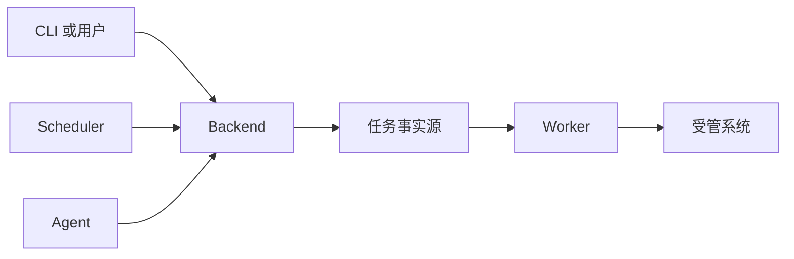
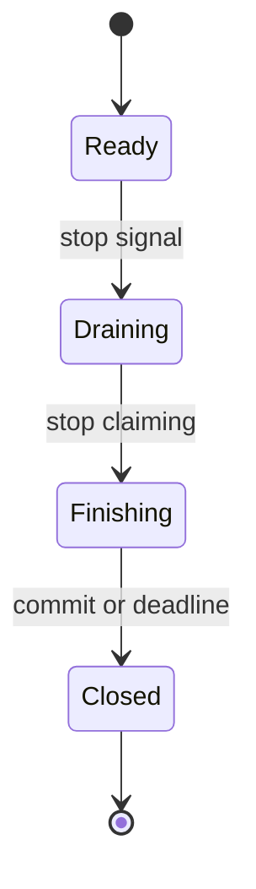
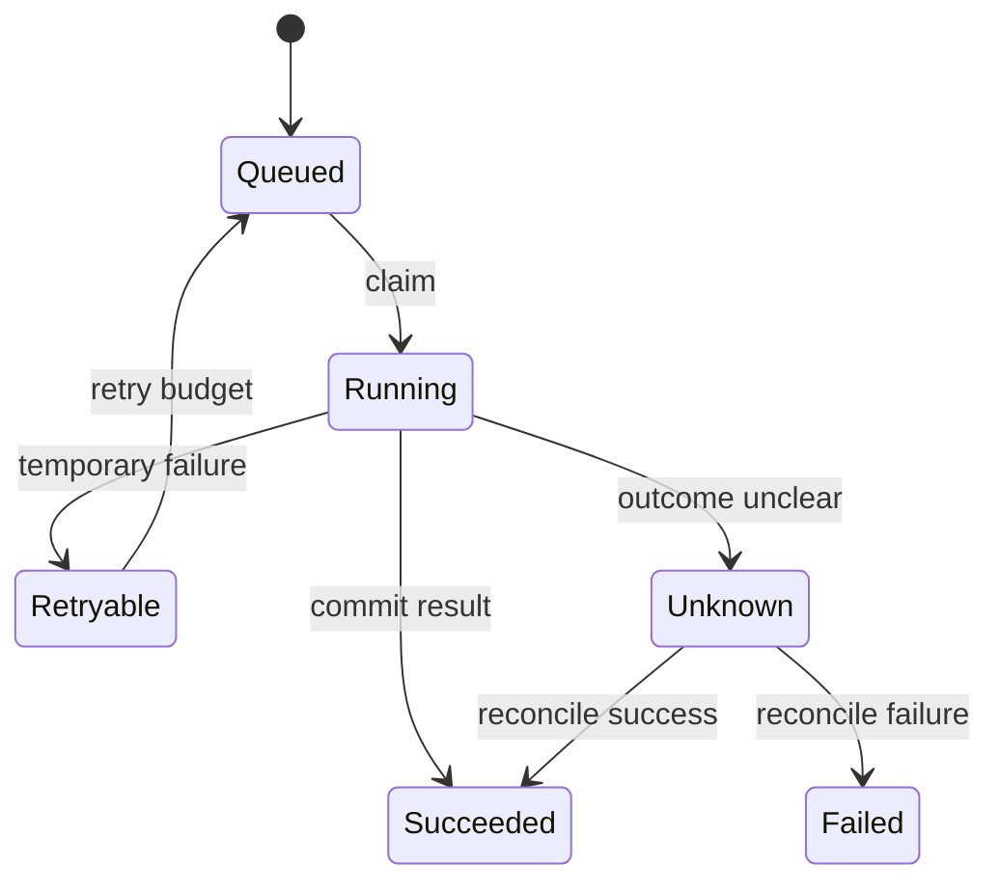

# Python 运维自动化与工程实践 · 第四册：运维工具架构

## 第十四章 · 脚本越写越大时，先判断它到底要长成什么

### 哪些信号说明一次性脚本已经不该继续往下堆？

脚本变长不是拆系统的充分条件。
真正需要演进的是职责、状态、运行时和协作边界开始互相冲突。

以下信号值得停下来设计：

- 同一逻辑被 CLI、定时任务和 Web 请求重复复制。
- 一次执行超过调用方允许的请求时间。
- 任务需要重试、排队、暂停、恢复和查询进度。
- 多人同时操作产生覆盖或重复副作用。
- 失败后无法知道进行到哪一步。
- 权限、审计和 Secret 不能再靠单机文件满足。
- 部署频率、扩缩容方式或依赖与主应用不同。

#### 先画当前执行路径

```text
用户/CI
  -> ops-check CLI
     -> 读取配置
     -> 查询资产 API
     -> 并发巡检
     -> 写报告
     -> 返回退出码
```

如果这个流程在几十秒内完成、单用户执行、状态只需本地报告，保持 CLI 往往最好。
不要因为可能将来有页面，就提前引入数据库、消息队列和多个服务。

#### 用变化原因寻找模块边界

配置解析因为格式变化，探针因为协议变化，报告因为消费者变化。
让不同变化原因进入不同模块，就能先做进程内模块化，不必马上分布式化。

#### 量化问题而不是使用形容词

```text
目标数：500 -> 20,000
单目标 P95：0.3s
允许并发：50
任务截止时间：10min
允许重复副作用：0
结果保留：90d
同时提交者：20
```

有了规模、可靠性和合规约束，组件选择才有依据。

#### 本节练习

对现有脚本填写一张演进卡：触发问题、当前证据、目标指标、最小改动、验证方式和回退方案。
如果只能写“更专业”“以后扩展”，先不拆。

### CLI、Backend、Worker、Scheduler 和 Agent 可以怎样组合？



这不是推荐的默认全家桶，而是一张职责地图。最小方案可以只有 CLI；只有真实约束出现后，才沿箭头增加入口、持久状态或异步执行。

这些名称代表运行职责，不是必须全部购买的套餐。

| 组件 | 主要职责 | 典型触发 |
| --- | --- | --- |
| CLI | 人工与流水线入口 | 即时执行、可等待 |
| Backend | 鉴权、接收请求、查询状态 | 多用户、需要 API/UI |
| Worker | 执行长任务和重试 | 请求时间短于任务时间 |
| Scheduler | 按时间创建任务 | 周期巡检、补偿任务 |
| Agent | 靠近目标执行与采集 | 网络隔离、主机本地能力 |

#### 从最小组合开始

```text
阶段 A：CLI -> 目标
阶段 B：CLI -> Backend -> 目标
阶段 C：CLI/UI -> Backend -> Queue -> Worker -> 目标
阶段 D：Scheduler ---------> Queue -> Worker
阶段 E：Backend/Worker <--------------> Agent
```

阶段不是成熟度排名。
若 CLI 已满足可靠性，停在 A 是正确选择。

#### Backend 不应亲自跑所有长任务

HTTP 请求通常有网关超时和并发上限。
Backend 接收任务、校验权限、生成 operation ID、持久化意图并快速返回；Worker 执行并更新状态。

```json
{
  "operation_id": "op-123",
  "state": "queued",
  "status_url": "/operations/op-123"
}
```

#### Scheduler 只负责触发，不复制业务逻辑

定时器创建与人工入口相同的任务命令，业务规则由 Worker 共用。
否则“手工运行”和“夜间运行”会逐渐产生不同版本。

#### Agent 增加的是治理面

Agent 需要注册、身份、升级、心跳、兼容、资源限制、离线缓存和卸载。
仅为了执行一个 SSH 命令，不一定值得在每台主机常驻进程。

#### 本节练习

为三种场景选择最小组合：单人每周巡检 100 台、多团队提交耗时 30 分钟的变更、隔离网络中 10,000 台主机采集指标。
写出不选其他组件的证据和未来触发条件。

#### 组件选择工作台：先证明需要，再承担长期成本

组件选型不是把候选能力全部装进系统，而是为当前约束选择最小组合。
每个候选都从触发信号、最小职责、失败模式、验证证据和移除条件五个角度评审；任何一项答不出来，都先标记为待验证。

| 组件 | 真实触发信号 | 最小职责 | 首要风险 | 暂缓条件 |
| --- | --- | --- | --- | --- |
| CLI | 人工或流水线需要稳定入口 | 参数 输出 退出码 | 长任务占用调用方 | 只有库内函数调用 |
| Backend | 多用户提交和查询状态 | 鉴权 接单 查询 | 同步执行拖垮请求 | 单用户同步任务足够 |
| Worker | 任务需脱离请求恢复 | 领取 执行 提交 | 重复执行和失租 | 任务能在请求预算内结束 |
| Scheduler | 明确存在周期触发 | 只创建 operation | 重复触发和时区错误 | 已有平台调度可复用 |
| Agent | 必须在目标本地执行 | 身份 心跳 有界执行 | 权限与升级面扩大 | 远程 API 已满足需求 |
| 数据库任务表 | 需要持久状态与抢占 | 事实源 状态机 租约 | 热点和迁移复杂度 | 文件或同步结果已足够 |
| 消息队列 | 数据库轮询已达瓶颈 | 通知 削峰 重投 | 积压与重复语义 | 没有吞吐证据 |
| 幂等层 | 重试可能重复副作用 | 业务键 去重 对账 | 错误键误合并请求 | 操作天然只读 |
| 生命周期管理 | 进程承接在途任务 | 就绪 排空 截止退出 | 清理无限等待 | 一次性短命令 |
| 可观测与审计 | 需要排障与追责 | 事件 指标 操作证据 | 高基数和敏感泄露 | 不能定义处置动作 |
| Python 运行时 | SDK 与交付速度优先 | 控制面和数据编排 | 分发与 CPU 上限 | 目标只有极小运行时 |
| Go 运行时 | 常驻分发与资源预算明确 | Agent 或高并发服务 | 双语言维护成本 | 没有基准和长期 owner |

**CLI：保留同步契约**

采用前先量化单次任务时长和调用者能等待多久。
最小方案只包含参数解析、稳定 stdout、诊断 stderr、退出码和 dry-run；不要在 CLI 进程里悄悄启动无人管理的后台线程。

验证至少覆盖：

- 未知参数在副作用前退出。
- 非交互环境绝不等待确认。
- 部分失败有稳定退出码和完整性字段。
- SIGINT 后有限收尾且不留下子进程。
- 从安装产物而非源码目录调用入口。

若任务经常超过调用方超时或需要断线续查，保留 CLI 作为客户端，把执行迁到持久任务系统。

**Backend：只接单和查询，不吞下长任务**

Backend 的采用信号是多用户、集中鉴权、共享状态和查询需求，不是“想做一个页面”。
一次写请求应完成身份确认、参数校验、幂等登记和 operation 创建，然后尽快返回可查询标识。

容量证据要区分请求吞吐和任务吞吐。
若 handler 直接执行 SSH、云 API 或批量巡检，HTTP 超时会和业务截止时间纠缠，滚动发布也会中断任务。
故障注入应覆盖客户端断开、数据库提交失败、重复提交和旧客户端 schema。

Backend 无长期所有者或只有单人本地使用时，CLI 往往是更小的方案。

**Worker：用可恢复状态换来额外复杂度**

Worker 只在任务必须脱离请求生命周期、能够被领取并在失败后恢复时引入。
它需要原子领取、租约、心跳、幂等执行、结果提交和排空退出；“从队列取消息后调用函数”还不是完整 Worker。

验证要暂停进程于三处：副作用前、副作用后结果提交前、提交后确认前。
三次演练分别证明可重领、unknown 对账和重复确认策略。
还要测失租后旧 Worker 是否停止副作用，而不是只记录 warning。

如果任务小于几秒且调用方可安全重试，独立 Worker 的部署和排障成本可能大于收益。

**Scheduler：触发 operation 而不是复制业务逻辑**

Scheduler 只回答何时触发和用哪个业务幂等键，不应再实现一份巡检或变更逻辑。
时间语义必须写明时区、夏令时、错过窗口、补跑和重叠策略。

验证将时钟推进到边界，覆盖重复 tick、进程暂停后恢复和同一窗口双实例竞争。
通过条件不是“任务最终出现”，而是每个逻辑窗口只产生允许数量的 operation。

已有 Kubernetes CronJob、企业调度平台或 CI 定时器满足审计和重试要求时，优先复用，不再自建调度服务。

**Agent：本地能力必须值得治理成本**

只有中心端无法安全完成本地采集、离线缓冲或特权操作时，才考虑 Agent。
最小 Agent 仍需要唯一身份、证书轮换、心跳抖动、命令 allowlist、资源上限、签名升级和版本兼容。

威胁模型必须假设控制面消息可能被重放、目标主机可能失联、升级只完成一部分。
越权测试要证明 Agent 拒绝 allowlist 外动作，并且日志不会泄露本机 Secret。

若远程管理 API 已能提供所需能力，部署到每台主机的 Agent 是额外攻击面，不是默认捷径。

**数据库任务表：先作为事实源**

中小规模系统常可用数据库任务表同时保存 operation、状态、租约和结果摘要。
领取查询必须有索引并使用条件更新；状态转换由数据库约束或事务保护，不能只依赖应用里的 if。

容量实验记录队列深度、最老任务年龄、锁等待、领取延迟和写放大。
如果 20k 目标都更新同一 operation 行，热点可能来自进度设计，而不是数据库品牌。

当数据量和竞争仍在预算内，不要仅因“队列更专业”就增加消息系统。

**消息队列：传递通知，不取代事实源**

消息队列适合数据库轮询已经形成可测瓶颈、需要削峰或多个消费者独立扩展的场景。
消息至少携带 schema 版本、operation ID、幂等键、创建时间和 trace 上下文，业务状态仍回到明确事实源。

故障验证包括重复投递、乱序、未知 schema、消费者长暂停、死信堆积和 broker 不可用。
只有团队能监测积压、执行重放并维护升级，吞吐收益才抵得过新组件成本。

低吞吐任务直接从数据库领取更容易对账，也减少一条分布式一致性边界。

**幂等层：业务意图必须稳定**

幂等键应代表“同一次变更意图”，不能使用每次重试都会变化的随机值。
存储层唯一约束是并发最后防线，执行层还要保存外部 operation ID，用于副作用结果未知时查询。

验证同时发起两个相同请求，确认只产生一次外部动作；再用相同参数但不同业务窗口，确认不会错误合并。
还要定义记录保留期和请求参数摘要，避免旧键永久阻止合法操作。

只读检查通常天然可重复，但输出落盘与审计写入仍需各自的覆盖策略。

**生命周期管理：退出是协议的一部分**

常驻进程收到终止信号后依次停止接单、传播取消、等待安全点、提交结果、释放租约和关闭资源。
每一步都有独立截止时间，总和必须小于编排器宽限期。

就绪探针回答是否还能接新任务，存活探针只回答进程是否需要重启。
排空期间就绪应先失败，但存活不能立刻失败，否则编排器会跳过清理。

验证用真实信号而不只调用内部函数，并观察在途数、退出耗时、租约与孤儿进程。

**可观测与审计：每个信号都要指向动作**

指标保留低基数聚合，日志记录目标级上下文，trace 串联跨组件路径，审计证明谁在何时基于什么意图执行了什么。
四者用途不同，不能用一份巨型 JSON 同时替代。

先写处置问题再建指标：队列是否积压、失败是否集中在认证、租约是否丢失、版本是否碎片化。
operation ID 和 target 通常进入日志或 trace，不进入指标标签。

审计不可用时的策略按动作风险分级，并通过故障注入证明副作用与审计的先后关系。

**Python 运行时：优先交付控制面能力**

Python 适合 SDK 丰富、数据处理明显、交付速度重要且团队已能维护依赖的控制面。
判断依据包括端到端工时、依赖兼容、启动与 RSS、CPU profile、分发方式和排障体验。

优化前先测 I/O 等待与 CPU 热点。
若瓶颈是外部 API，换语言通常不会改变吞吐上限；若是常驻内存、启动风暴或持续 CPU，才进入运行时对照实验。

依赖锁、wheel smoke 和目标平台测试属于选择成本，不能只比较源代码行数。

**Go 运行时：由分发和资源证据触发**

大量主机上的常驻 Agent、严格内存预算、单二进制分发和高并发网络服务可能更适合 Go。
但重写会失去一部分 Python SDK 与团队熟悉度，还会产生双语言构建、监控和安全升级体系。

用同一 fixture、同一并发、同一正确性摘要比较启动、峰值 RSS、CPU、吞吐和 P95。
若基准没有触发预先写好的阈值，就保留 Python；若触发，也只迁移真正受约束的组件。

每项选择最终填写四个字段：

~~~text
采用或暂缓：
本次证据：
仍未验证：
复审触发与负责人：
~~~

架构评审允许删除组件。
当触发信号消失、维护成本持续高于价值或已有平台能力覆盖职责时，应合并或下线，而不是让组件因历史惯性永久存在。

### 出现哪些真实问题后，才值得把组件拆成独立进程？

模块边界是代码组织，进程边界是故障、资源和部署隔离。
跨进程会带来序列化、网络失败、版本兼容、可观测性和一致性成本。

值得拆分的证据包括：

- CPU 或内存资源模型明显不同，需要独立限额和扩缩容。
- 长任务必须跨 Backend 重启继续。
- 安全权限必须隔离，例如 Worker 才能访问生产凭证。
- 发布频率冲突，某适配器升级不应重启入口服务。
- 一个组件故障会拖垮全部请求，需要熔断隔离。
- 不同网络区域只能通过受控队列或 Agent 连接。

#### 先定义消息契约

```json
{
  "schema_version": 1,
  "operation_id": "op-123",
  "action": "check.http",
  "target": {"host": "api-a", "port": 443},
  "deadline": "2026-09-01T10:10:00Z",
  "attempt": 1
}
```

消息不传 Python 对象和开放式任意命令。
Worker 按允许的动作类型解析和授权，未知版本进入隔离队列。

#### 数据库和队列解决不同问题

数据库保存可查询的事实与状态；队列传递待处理工作并实现消费协调。
小规模系统可以用数据库任务表完成领取，避免一开始同时维护两套基础设施。

#### 用 SQLite 做一次可运行的领取实验

在引入独立数据库或消息队列前，可以先用标准库 `sqlite3` 验证状态、领取和幂等契约。
这个实验只证明单机进程间竞争，不证明生产数据库的锁语义或容量。

```python
from __future__ import annotations

import sqlite3
from dataclasses import dataclass
from datetime import UTC, datetime, timedelta
from pathlib import Path


@dataclass(frozen=True, slots=True)
class ClaimedJob:
    operation_id: str
    action: str
    payload: str
    lease_owner: str
    lease_until: str


SCHEMA = """
CREATE TABLE IF NOT EXISTS jobs (
    operation_id TEXT PRIMARY KEY,
    idempotency_key TEXT NOT NULL UNIQUE,
    action TEXT NOT NULL,
    payload TEXT NOT NULL,
    state TEXT NOT NULL CHECK (
        state IN ('queued', 'running', 'succeeded', 'failed', 'unknown')
    ),
    lease_owner TEXT,
    lease_until TEXT,
    attempt INTEGER NOT NULL DEFAULT 0,
    result TEXT
);
CREATE INDEX IF NOT EXISTS jobs_claim
ON jobs(state, lease_until, operation_id);
"""


def connect(path: Path) -> sqlite3.Connection:
    connection = sqlite3.connect(path, isolation_level=None)
    connection.row_factory = sqlite3.Row
    connection.execute("PRAGMA foreign_keys = ON")
    connection.execute("PRAGMA busy_timeout = 3000")
    connection.executescript(SCHEMA)
    return connection


def enqueue(
    connection: sqlite3.Connection,
    *,
    operation_id: str,
    idempotency_key: str,
    action: str,
    payload: str,
) -> bool:
    cursor = connection.execute(
        """
        INSERT INTO jobs(operation_id, idempotency_key, action, payload, state)
        VALUES (?, ?, ?, ?, 'queued')
        ON CONFLICT(idempotency_key) DO NOTHING
        """,
        (operation_id, idempotency_key, action, payload),
    )
    return cursor.rowcount == 1


def claim_one(
    connection: sqlite3.Connection,
    *,
    owner: str,
    now: datetime,
    lease_seconds: int,
) -> ClaimedJob | None:
    lease_until = now + timedelta(seconds=lease_seconds)
    connection.execute("BEGIN IMMEDIATE")
    try:
        row = connection.execute(
            """
            SELECT operation_id
            FROM jobs
            WHERE state = 'queued'
               OR (state = 'running' AND lease_until < ?)
            ORDER BY operation_id
            LIMIT 1
            """,
            (now.isoformat(),),
        ).fetchone()
        if row is None:
            connection.execute("COMMIT")
            return None

        claimed = connection.execute(
            """
            UPDATE jobs
            SET state = 'running',
                lease_owner = ?,
                lease_until = ?,
                attempt = attempt + 1
            WHERE operation_id = ?
              AND (state = 'queued' OR lease_until < ?)
            RETURNING operation_id, action, payload, lease_owner, lease_until
            """,
            (owner, lease_until.isoformat(), row["operation_id"], now.isoformat()),
        ).fetchone()
        connection.execute("COMMIT")
    except BaseException:
        connection.execute("ROLLBACK")
        raise

    return ClaimedJob(**dict(claimed)) if claimed is not None else None


def finish(
    connection: sqlite3.Connection,
    *,
    operation_id: str,
    owner: str,
    result: str,
) -> bool:
    cursor = connection.execute(
        """
        UPDATE jobs
        SET state = 'succeeded', result = ?, lease_owner = NULL, lease_until = NULL
        WHERE operation_id = ? AND state = 'running' AND lease_owner = ?
        """,
        (result, operation_id, owner),
    )
    return cursor.rowcount == 1


if __name__ == "__main__":
    database = connect(Path("jobs.db"))
    enqueue(
        database,
        operation_id="op-001",
        idempotency_key="daily-check:2026-09-02",
        action="check.http",
        payload='{"url":"http://127.0.0.1:8000/health"}',
    )
    print(claim_one(database, owner="worker-a", now=datetime.now(UTC), lease_seconds=30))
```

`BEGIN IMMEDIATE` 让“选择候选”和“更新领取”处在一个写事务中；条件更新仍校验状态与租约，避免只依赖先查后改。
生产数据库要按其隔离级别改写，例如使用行锁或 `SKIP LOCKED`，并以真实并发测试证明同一时刻不会有两个有效 owner。

最小回归测试同时打开两个连接：

```python
from datetime import UTC, datetime, timedelta


def test_duplicate_enqueue_and_expired_lease(tmp_path):
    path = tmp_path / "jobs.db"
    first = connect(path)
    second = connect(path)

    assert enqueue(
        first,
        operation_id="op-1",
        idempotency_key="same-intent",
        action="check.http",
        payload="{}",
    )
    assert not enqueue(
        second,
        operation_id="op-2",
        idempotency_key="same-intent",
        action="check.http",
        payload="{}",
    )

    now = datetime.now(UTC)
    claimed = claim_one(first, owner="worker-a", now=now, lease_seconds=5)
    assert claimed is not None
    assert claim_one(second, owner="worker-b", now=now, lease_seconds=5) is None

    reclaimed = claim_one(
        second,
        owner="worker-b",
        now=now + timedelta(seconds=6),
        lease_seconds=5,
    )
    assert reclaimed is not None
    assert reclaimed.operation_id == "op-1"
    assert not finish(
        first,
        operation_id="op-1",
        owner="worker-a",
        result='{"ok":true}',
    )
```

最后一个断言证明旧 owner 失租后不能提交结果。
实验还没证明外部副作用是否重复；那需要业务幂等键、外部 operation ID 和下一节的 unknown 对账共同完成。

#### 拆分前先做故障表

| 故障 | 未拆分 | 拆分后新增 |
| --- | --- | --- |
| 进程崩溃 | 一次命令失败 | 消息可能重投 |
| 网络断开 | 目标调用失败 | Backend 与 Worker 也会断 |
| 版本不一致 | 同一发布物 | 消息 schema 兼容 |
| 重复请求 | 本地处理 | 跨进程幂等与去重 |

如果没有能力处理新增故障，拆分可能降低可靠性。

#### 本章检查点

```text
[ ] 先有量化问题，再选择组件
[ ] 模块化先于进程拆分
[ ] 每个进程有独立资源、权限或生命周期理由
[ ] 消息 schema 有版本、截止时间和幂等标识
[ ] 新增网络与重复投递故障有测试
```

#### 架构决策记录 ADR-001：采用数据库任务表

```text
标题：使用 PostgreSQL 任务表连接 Backend 与 Worker
状态：Accepted
日期：2026-09-01

背景：
- 任务最长 30 分钟，不能占用 HTTP 请求。
- 需要查询状态、取消、重试与审计。
- 当前峰值每分钟 20 个任务，不需要高吞吐消息流。
- 团队已有 PostgreSQL 运维能力，没有消息队列值守经验。

决定：
- Backend 在事务中写 operation 与 job。
- Worker 使用带锁查询领取到期任务。
- 租约到期后允许其他 Worker 重新领取。
- 所有处理依赖幂等键与状态机。

结果：
- 少维护一个基础设施组件。
- 数据库同时承担查询与任务协调负载。
- 必须监测领取延迟、锁等待和表膨胀。

替代方案：
- 进程内后台任务：重启会丢，不满足恢复。
- 独立消息队列：能力充足，但当前运维成本过高。
- cron 扫描文件：并发、审计和原子领取难保证。

复审触发：
- 峰值超过每分钟 1,000 个任务。
- 数据库任务负载影响业务查询。
- 需要跨区域流式投递或复杂消费组。
```

ADR 不是一次性证明正确，而是保存当时约束和触发复审条件。

#### 任务与操作模型

```sql
CREATE TYPE operation_state AS ENUM (
    'queued',
    'running',
    'succeeded',
    'failed',
    'cancelling',
    'cancelled',
    'unknown'
);

CREATE TABLE operations (
    id UUID PRIMARY KEY,
    idempotency_key TEXT NOT NULL UNIQUE,
    actor TEXT NOT NULL,
    action TEXT NOT NULL,
    target_scope JSONB NOT NULL,
    request_digest TEXT NOT NULL,
    state operation_state NOT NULL,
    result JSONB,
    error_category TEXT,
    created_at TIMESTAMPTZ NOT NULL,
    started_at TIMESTAMPTZ,
    finished_at TIMESTAMPTZ,
    version BIGINT NOT NULL DEFAULT 0
);

CREATE TABLE jobs (
    id UUID PRIMARY KEY,
    operation_id UUID NOT NULL REFERENCES operations(id),
    state TEXT NOT NULL,
    attempt INTEGER NOT NULL DEFAULT 0,
    available_at TIMESTAMPTZ NOT NULL,
    lease_owner TEXT,
    lease_until TIMESTAMPTZ,
    deadline TIMESTAMPTZ NOT NULL,
    created_at TIMESTAMPTZ NOT NULL,
    updated_at TIMESTAMPTZ NOT NULL
);

CREATE INDEX jobs_available_idx
ON jobs (available_at, created_at)
WHERE state = 'queued';
```

`operations` 面向用户意图和查询，`jobs` 面向执行尝试。
一次 operation 可以因为重试产生多个 attempt，但不能产生第二次业务副作用。

#### 状态跃迁表

| 当前状态 | 事件 | 下一状态 | 条件 |
| --- | --- | --- | --- |
| queued | worker_claimed | running | 租约原子获得 |
| queued | cancel_requested | cancelled | 尚未开始 |
| running | completed | succeeded | 结果与审计已提交 |
| running | expected_failure | failed | 确认未成功 |
| running | cancel_requested | cancelling | 发出取消意图 |
| cancelling | worker_ack | cancelled | 副作用已停止 |
| running | lease_expired | queued | 操作可安全重试 |
| running | result_uncertain | unknown | 禁止自动重试 |

任何表中没有的跃迁都拒绝，并记录当前版本和请求者。

```python
from enum import StrEnum


class State(StrEnum):
    QUEUED = "queued"
    RUNNING = "running"
    SUCCEEDED = "succeeded"
    FAILED = "failed"
    CANCELLING = "cancelling"
    CANCELLED = "cancelled"
    UNKNOWN = "unknown"


ALLOWED_TRANSITIONS: dict[State, set[State]] = {
    State.QUEUED: {State.RUNNING, State.CANCELLED},
    State.RUNNING: {
        State.SUCCEEDED,
        State.FAILED,
        State.CANCELLING,
        State.QUEUED,
        State.UNKNOWN,
    },
    State.CANCELLING: {State.CANCELLED, State.UNKNOWN},
    State.SUCCEEDED: set(),
    State.FAILED: set(),
    State.CANCELLED: set(),
    State.UNKNOWN: set(),
}


def require_transition(current: State, next_state: State) -> None:
    if next_state not in ALLOWED_TRANSITIONS[current]:
        raise ValueError(f"invalid operation transition: {current} -> {next_state}")
```

允许 `running -> queued` 只适用于明确可重试且租约过期的任务。
非幂等动作不能通过这条路径自动重放。

#### Backend 创建操作

```python
from dataclasses import dataclass
from datetime import UTC, datetime, timedelta
from uuid import UUID, uuid4


@dataclass(frozen=True, slots=True)
class CreateOperation:
    idempotency_key: str
    actor: str
    action: str
    targets: tuple[str, ...]
    deadline_seconds: int


@dataclass(frozen=True, slots=True)
class OperationReceipt:
    operation_id: UUID
    state: State
    reused: bool


class OperationRepository(Protocol):
    def find_by_key(self, key: str) -> Operation | None: ...
    def create_with_job(self, operation: Operation, job: Job) -> None: ...


def create_operation(
    command: CreateOperation,
    repository: OperationRepository,
    clock: Clock,
) -> OperationReceipt:
    validate_action(command.action)
    validate_targets(command.targets)
    validate_deadline(command.deadline_seconds)

    existing = repository.find_by_key(command.idempotency_key)
    if existing is not None:
        return OperationReceipt(existing.id, existing.state, reused=True)

    now = clock.now()
    operation_id = uuid4()
    operation = Operation(
        id=operation_id,
        idempotency_key=command.idempotency_key,
        actor=command.actor,
        action=command.action,
        targets=command.targets,
        state=State.QUEUED,
        created_at=now,
        version=0,
    )
    job = Job(
        id=uuid4(),
        operation_id=operation_id,
        state="queued",
        attempt=0,
        available_at=now,
        deadline=now + timedelta(seconds=command.deadline_seconds),
    )

    try:
        repository.create_with_job(operation, job)
    except DuplicateIdempotencyKey:
        winner = repository.find_by_key(command.idempotency_key)
        if winner is None:
            raise
        return OperationReceipt(winner.id, winner.state, reused=True)

    return OperationReceipt(operation_id, State.QUEUED, reused=False)
```

先查后插只是减少冲突，数据库唯一约束负责最终正确性。
捕获唯一冲突后重新查询获胜记录，让并发请求得到同一 operation ID。


## 第十五章 · 工具跑进生产后，失败和退出都要有安排

### 服务准备退出时，怎样停止接单并处理手里的任务？



退出不是一条信号处理语句，而是从“可接单”到“只收尾”再到“资源已关闭”的状态转换。

优雅退出不是收到信号后立刻 `sys.exit()`。
它是一个有限时间内停止新工作、处理或取消在途任务、提交可确认结果并释放资源的协议。

```text
RUNNING
  --SIGTERM--> DRAINING
  --all done--> STOPPED
  --grace expired--> FORCED STOP
```

#### 就绪与存活要分开

进入 DRAINING 后，就绪检查应失败，让负载均衡停止发送新请求；存活检查仍成功，给进程清理时间。
若二者共用一个“健康”状态，平台可能在清理尚未完成时反复强杀重启。

#### Worker 停止领取新任务

```python
async def worker_loop(queue: JobQueue, stop: asyncio.Event) -> None:
    while not stop.is_set():
        job = await queue.receive(timeout=1.0)
        if job is None:
            continue
        await process_job(job)
```

真实实现还要在停止信号和 `receive()` 之间避免竞态，并决定已领取任务的租约如何续期。

#### 每个清理步骤都有截止时间

```python
async def shutdown(running_tasks: set[asyncio.Task[object]]) -> None:
    for task in running_tasks:
        task.cancel()

    try:
        async with asyncio.timeout(10.0):
            await asyncio.gather(*running_tasks, return_exceptions=True)
    except TimeoutError:
        logger.error("shutdown grace period exceeded")
```

宽限期要小于编排平台的强制终止时间，并留出日志刷新与网络关闭余量。

#### 用一个协调器统一停止意图和在途任务

信号处理器只设置停止事件；真正的 await、日志和资源关闭留在正常协程上下文。
协调器同时限制新任务创建，并维护可以等待或取消的在途集合。

```python
from __future__ import annotations

import asyncio
import signal
from collections.abc import Awaitable, Callable
from dataclasses import dataclass, field
from typing import TypeVar


T = TypeVar("T")


@dataclass(slots=True)
class DrainCoordinator:
    stop: asyncio.Event = field(default_factory=asyncio.Event)
    running: set[asyncio.Task[object]] = field(default_factory=set)

    @property
    def accepting(self) -> bool:
        return not self.stop.is_set()

    def request_stop(self) -> None:
        self.stop.set()

    def start(self, awaitable: Awaitable[T]) -> asyncio.Task[T]:
        if not self.accepting:
            raise RuntimeError("worker is draining")
        task = asyncio.create_task(awaitable)
        self.running.add(task)
        task.add_done_callback(self.running.discard)
        return task

    async def drain(self, grace_seconds: float) -> bool:
        self.stop.set()
        if not self.running:
            return True

        done, pending = await asyncio.wait(
            self.running,
            timeout=grace_seconds,
        )
        for task in pending:
            task.cancel()
        if pending:
            await asyncio.gather(*pending, return_exceptions=True)
        return not pending


def install_signal_handlers(
    loop: asyncio.AbstractEventLoop,
    coordinator: DrainCoordinator,
) -> None:
    for signum in (signal.SIGINT, signal.SIGTERM):
        loop.add_signal_handler(signum, coordinator.request_stop)


async def serve(
    receive: Callable[[], Awaitable[object | None]],
    handle: Callable[[object], Awaitable[None]],
    coordinator: DrainCoordinator,
) -> None:
    while coordinator.accepting:
        job = await receive()
        if job is None:
            continue
        coordinator.start(handle(job))
```

`asyncio.wait()` 超时只返回 pending，不会自动取消；代码必须显式取消并继续收集异常，否则任务可能在关闭客户端后继续运行。
`add_signal_handler()` 的平台支持需在目标操作系统验证，Windows 服务应使用对应的控制事件适配器。

测试不依赖真实信号也能先固定状态转换：

```python
async def test_drain_rejects_new_work_and_cancels_overdue_task():
    coordinator = DrainCoordinator()
    blocker = asyncio.Event()

    async def never_finishes() -> None:
        await blocker.wait()

    task = coordinator.start(never_finishes())
    complete = await coordinator.drain(grace_seconds=0.01)

    assert complete is False
    assert coordinator.accepting is False
    assert task.cancelled()

    coroutine = never_finishes()
    try:
        with pytest.raises(RuntimeError, match="draining"):
            coordinator.start(coroutine)
    finally:
        coroutine.close()
```

这条单测证明协调器行为，不证明 SIGTERM 已从编排器传入。
候选环境要启动真实进程、发送信号，并记录 readiness、在途数、退出耗时、租约和子进程残留。

#### 结果提交与消息确认排序

```text
执行副作用
  -> 持久化结果
  -> 写审计
  -> 确认消息
```

若先确认消息再持久化结果，崩溃会丢任务。
若结果已提交但确认前崩溃，消息会重投，所以处理仍需幂等。

#### 本节练习

在测试环境对 Worker 发送 SIGTERM，验证不再领取任务、在途任务按策略完成或取消、状态可查询、宽限期后退出且没有未确认状态丢失。

#### 原子领取任务

PostgreSQL 领取语句可以使用 `FOR UPDATE SKIP LOCKED`，具体事务和隔离级别要与数据库团队验证：

```sql
WITH candidate AS (
    SELECT id
    FROM jobs
    WHERE state = 'queued'
      AND available_at <= now()
      AND deadline > now()
    ORDER BY available_at, created_at
    FOR UPDATE SKIP LOCKED
    LIMIT 1
)
UPDATE jobs
SET state = 'running',
    attempt = attempt + 1,
    lease_owner = :worker_id,
    lease_until = now() + interval '30 seconds',
    updated_at = now()
WHERE id = (SELECT id FROM candidate)
RETURNING *;
```

没有返回行代表当前没有可领取任务，Worker 应带抖动等待，不能紧密空转查询。

#### Worker 主循环

```python
import asyncio
import random


async def worker_loop(
    worker_id: str,
    repository: JobRepository,
    executor: OperationExecutor,
    stop: asyncio.Event,
) -> None:
    while not stop.is_set():
        job = await repository.claim(worker_id=worker_id, lease_seconds=30)

        if job is None:
            try:
                await asyncio.wait_for(stop.wait(), timeout=random.uniform(0.2, 0.5))
            except TimeoutError:
                pass
            continue

        await handle_claimed_job(
            worker_id=worker_id,
            job=job,
            repository=repository,
            executor=executor,
        )
```

#### 租约续期

长任务必须定期续租，更新条件同时检查 owner、state 和当前 version。

```sql
UPDATE jobs
SET lease_until = now() + interval '30 seconds',
    updated_at = now()
WHERE id = :job_id
  AND state = 'running'
  AND lease_owner = :worker_id
  AND lease_until > now()
RETURNING version;
```

续租失败时，当前 Worker 不再拥有任务。
它必须停止产生新副作用，查询操作状态，并进入安全收尾。

#### 心跳与业务执行分离

```python
async def run_with_lease(
    job: Job,
    worker_id: str,
    repository: JobRepository,
    operation: Awaitable[OperationResult],
) -> OperationResult:
    lease_lost = asyncio.Event()

    async def heartbeat() -> None:
        while True:
            await asyncio.sleep(10)
            renewed = await repository.renew(job.id, worker_id, 30)
            if not renewed:
                lease_lost.set()
                return

    operation_task = asyncio.create_task(operation)
    heartbeat_task = asyncio.create_task(heartbeat())
    lease_task = asyncio.create_task(lease_lost.wait())

    done, pending = await asyncio.wait(
        {operation_task, lease_task},
        return_when=asyncio.FIRST_COMPLETED,
    )

    if lease_task in done and lease_lost.is_set():
        operation_task.cancel()
        await asyncio.gather(operation_task, return_exceptions=True)
        raise LeaseLost(job.id)

    heartbeat_task.cancel()
    lease_task.cancel()
    await asyncio.gather(heartbeat_task, lease_task, return_exceptions=True)
    return await operation_task
```

这是生命周期示意。
生产实现需要确保异常路径总会取消三个任务，并处理操作无法立即取消的情况。


#### 优雅退出协调器

```python
@dataclass(frozen=True, slots=True)
class ShutdownPolicy:
    grace_seconds: float
    cancel_running: bool


async def supervise(
    workers: list[asyncio.Task[None]],
    stop: asyncio.Event,
    policy: ShutdownPolicy,
) -> None:
    await stop.wait()

    if policy.cancel_running:
        for worker in workers:
            worker.cancel()

    try:
        async with asyncio.timeout(policy.grace_seconds):
            await asyncio.gather(*workers, return_exceptions=True)
    except TimeoutError:
        for worker in workers:
            worker.cancel()
        await asyncio.gather(*workers, return_exceptions=True)
        raise ShutdownDeadlineExceeded
```

实际 Worker 任务与当前 operation 子任务应分开跟踪，避免取消主循环却遗失正在执行的任务。


### 同一个任务被重复执行时，怎样避免产生第二次副作用？



`Unknown` 不能直接等同于失败：副作用可能已经发生，只是确认响应丢失。此时要查询外部 operation ID 或交给人工对账，盲目重试会制造第二次变更。

网络超时无法告诉调用者“请求没到”还是“服务端做完但响应丢了”。
因此队列重投、客户端重试和人工重复点击都可能让同一动作执行多次。

#### 幂等键代表业务意图

随机生成新 UUID 只标识一次尝试。
同一业务请求的重试必须复用同一个 key，例如由请求者、动作、目标和变更版本共同确定。

```python
from hashlib import sha256


def idempotency_key(actor: str, action: str, target: str, revision: str) -> str:
    canonical = "\n".join((actor, action, target, revision))
    return sha256(canonical.encode("utf-8")).hexdigest()
```

不要把 Secret 或可猜测的敏感正文直接放进键。

#### 数据库唯一约束是最后防线

```sql
CREATE TABLE operations (
    id BIGSERIAL PRIMARY KEY,
    idempotency_key TEXT NOT NULL UNIQUE,
    state TEXT NOT NULL,
    result JSONB,
    created_at TIMESTAMPTZ NOT NULL
);
```

两个 Worker 同时插入相同键时，唯一约束保证只有一个成功。
单纯“先查询不存在，再插入”有竞态。

#### 状态机拒绝非法跃迁

```text
queued -> running -> succeeded
                  -> failed
                  -> unknown
```

`succeeded` 不应回到 `running`。
外部动作超时且无法确认结果时用 `unknown`，不要贸然当作失败并再次执行。

#### 查询再决定是否重试

若外部系统支持按请求 ID 查询，超时后先查询结果；能安全确认未执行再重试。
无法查询且操作非幂等时，升级人工处理比自动重复更安全。

#### 把不确定结果建模为可对账对象

适配器不能只返回布尔值。
它至少要区分已确认成功、确认未执行、已知永久失败、可恢复失败和结果未知，并尽量保存外部 operation ID。

```python
from __future__ import annotations

from dataclasses import dataclass
from enum import StrEnum
from typing import Protocol


class Outcome(StrEnum):
    SUCCEEDED = "succeeded"
    NOT_APPLIED = "not_applied"
    PERMANENT_FAILURE = "permanent_failure"
    RETRYABLE_FAILURE = "retryable_failure"
    UNKNOWN = "unknown"


@dataclass(frozen=True, slots=True)
class ApplyResult:
    outcome: Outcome
    external_id: str | None
    detail: str


class ChangeClient(Protocol):
    def apply(self, *, key: str, target: str) -> ApplyResult: ...

    def query(self, external_id: str) -> ApplyResult: ...


class OperationStore(Protocol):
    def save_external_id(self, operation_id: str, external_id: str) -> None: ...

    def set_state(self, operation_id: str, state: str, detail: str) -> None: ...


def apply_once(
    *,
    operation_id: str,
    idempotency_key: str,
    target: str,
    client: ChangeClient,
    store: OperationStore,
) -> ApplyResult:
    result = client.apply(key=idempotency_key, target=target)

    if result.external_id is not None:
        store.save_external_id(operation_id, result.external_id)

    if result.outcome is Outcome.SUCCEEDED:
        store.set_state(operation_id, "succeeded", result.detail)
    elif result.outcome is Outcome.PERMANENT_FAILURE:
        store.set_state(operation_id, "failed", result.detail)
    elif result.outcome in {Outcome.RETRYABLE_FAILURE, Outcome.NOT_APPLIED}:
        store.set_state(operation_id, "retryable", result.detail)
    else:
        store.set_state(operation_id, "unknown", result.detail)

    return result


def reconcile(
    *,
    operation_id: str,
    external_id: str,
    client: ChangeClient,
    store: OperationStore,
) -> ApplyResult:
    result = client.query(external_id)
    if result.outcome is Outcome.SUCCEEDED:
        store.set_state(operation_id, "succeeded", result.detail)
    elif result.outcome is Outcome.NOT_APPLIED:
        store.set_state(operation_id, "retryable", result.detail)
    elif result.outcome is Outcome.PERMANENT_FAILURE:
        store.set_state(operation_id, "failed", result.detail)
    else:
        store.set_state(operation_id, "unknown", result.detail)
    return result
```

接口示意刻意没有在 `UNKNOWN` 分支调用 `apply()`。
对账过程只有确认未执行后才把状态改为 `retryable`；查询本身失败时继续保留 `unknown`，并产生工单或告警。

测试用记录型假对象固定调用次数：

```python
def test_unknown_result_is_queried_before_second_apply():
    client = RecordingClient(
        apply_result=ApplyResult(Outcome.UNKNOWN, "remote-7", "timeout"),
        query_result=ApplyResult(Outcome.SUCCEEDED, "remote-7", "done"),
    )
    store = RecordingStore()

    first = apply_once(
        operation_id="op-7",
        idempotency_key="change-7",
        target="host-7",
        client=client,
        store=store,
    )
    assert first.outcome is Outcome.UNKNOWN

    final = reconcile(
        operation_id="op-7",
        external_id="remote-7",
        client=client,
        store=store,
    )

    assert final.outcome is Outcome.SUCCEEDED
    assert client.apply_calls == 1
    assert client.query_calls == 1
```

这个测试证明编排逻辑不会盲目二次调用，不证明远端真的遵守幂等键。
候选环境还要用可回滚对象执行重复请求，并核对远端审计或资源版本。

#### 本节练习

并发提交 20 次相同幂等键，验证只有一个外部副作用，其余调用得到同一 operation ID 或现有结果。
再模拟“副作用完成、结果写入前崩溃”，验证系统进入可人工判断的状态。

#### 风险登记表：按信号和处置排序，不复制同一张卡

风险项共用 owner、状态、复查日期和证据链接四个字段，不必为每一项重复相同模板。
先用一张表比较触发机制、控制与可观测信号，再为高优先级风险编写独立 runbook。

| 风险 | 主要触发 | 预防或限制 | 关键监测信号 |
| --- | --- | --- | --- |
| 重复副作用 | 消息重投或人工重复 | 唯一约束与外部幂等键 | 同键调用次数 |
| 结果未知 | 副作用后响应丢失 | 保存外部 ID 并对账 | unknown 数量与年龄 |
| 租约双主 | Worker 停顿后恢复 | owner 加版本条件更新 | 失租提交冲突 |
| 队列积压 | 下游变慢或容量不足 | 并发上限与扩容阈值 | 最老任务年龄 |
| 重试风暴 | 大量短暂失败 | 抖动 全局预算 熔断 | 重试与原请求比 |
| 取消失效 | 适配器吞掉取消 | 传播取消和有限宽限 | 取消耗时 |
| 退出丢任务 | 先确认后持久化 | 先提交结果再确认 | 部署后异常在途数 |
| 权限扩大 | 共用管理员身份 | 按动作和环境拆身份 | 权限拒绝与变更 |
| Secret 泄露 | 日志或异常携带凭证 | 源头不记录和假值扫描 | Secret 扫描命中 |
| 审计中断 | 审计存储不可用 | 高风险 fail closed | 审计缺失率 |
| schema 不兼容 | 新旧组件并行 | 版本字段和兼容窗口 | unknown schema |
| 数据库热点 | 领取或进度高频写 | 索引 分片进度 限频 | 锁等待和写延迟 |
| 高基数爆炸 | 目标进入指标标签 | 低基数指标 详情进日志 | 时间序列数量 |
| 时钟偏差 | 多主机墙钟不一致 | 统一租约时间和单调计时 | 负耗时和异常过期 |
| Agent 失联 | 网络隔离或证书过期 | 有界缓存与离线状态 | 失联率和缓存占用 |
| Agent 升级失败 | 批量分发部分失败 | 签名 canary 自动回滚 | 版本碎片 |
| 资源耗尽 | 无界并发 响应 日志 | 每层容量和系统配额 | RSS FD 队列深度 |
| 告警风暴 | 每个目标单独告警 | 按动作和分类聚合 | 告警量与处置能力 |
| 回滚不兼容 | 新版写入新状态 | 向后兼容迁移 | 旧 Worker 解析失败 |
| 无人维护 | 缺少值班和升级责任 | owner 预算 runbook | 告警无人确认 |

风险优先级不能只看发生概率。
结果未知、权限扩大、Secret 泄露和审计中断即使低频，也可能因为不可逆副作用或合规影响进入最高处置级别。

可以用一个小模型保证排序规则一致，但分数不能替代人工判断：

```python
from dataclasses import dataclass
from enum import StrEnum


class RiskDecision(StrEnum):
    BLOCK = "block"
    MITIGATE = "mitigate"
    ACCEPT_WITH_REVIEW = "accept_with_review"


@dataclass(frozen=True, slots=True)
class RiskInput:
    likelihood: int
    impact: int
    detectable: bool
    reversible: bool
    has_owner: bool


def decide_risk(value: RiskInput) -> RiskDecision:
    for name, score in {
        "likelihood": value.likelihood,
        "impact": value.impact,
    }.items():
        if not 1 <= score <= 5:
            raise ValueError(f"{name} must be between 1 and 5")

    if not value.has_owner:
        return RiskDecision.BLOCK
    if value.impact == 5 and not value.reversible:
        return RiskDecision.BLOCK

    score = value.likelihood * value.impact
    if not value.detectable:
        score += 5
    if not value.reversible:
        score += 5

    if score >= 15:
        return RiskDecision.MITIGATE
    return RiskDecision.ACCEPT_WITH_REVIEW
```

这里把“没有 owner”直接设为阻断条件，因为无人处置的告警和恢复方案没有实际意义。
不可逆且最高影响的动作也不能仅靠低概率获得接受结论。

测试至少覆盖无 owner、不可逆高影响、非法分值和边界分数。
团队若调整阈值，要保存调整原因和历史风险的重算结果；否则同一风险会因表格版本不同得到冲突结论。

定量分数只帮助排序。
最终仍需说明具体失效机制、当前控制、验证证据、剩余风险和接受者，尤其不能把“有监控”误写成“风险已消失”。

**重复副作用与结果未知共用一条对账链**

写操作开始前登记业务幂等键，收到外部 ID 立即持久化。
响应超时后状态进入 unknown，由独立对账读取远端结果；只有确认未执行才允许重新排队。

通过证据包括：

- 相同业务键并发提交只生成一条 operation。
- 远端 apply 调用次数为 1。
- 副作用后断开连接会进入 unknown。
- 对账成功后不再执行 apply。
- 无法查询时产生人工任务而非自动重试。

监测既看 unknown 数量，也看最老 unknown 年龄；数量很小但长时间无人处理同样危险。

**租约双主与退出丢任务要联合演练**

暂停 Worker A 直到租约过期，让 Worker B 重新领取，再恢复 A。
A 的心跳和结果提交必须因 owner 或 version 不匹配而影响 0 行，并立即停止后续副作用。

随后对 B 发送终止信号，验证：

- readiness 先失败。
- 不再领取新任务。
- 手中结果在宽限期内提交。
- 提交后才确认消息。
- 超过截止时间时租约可被新 Worker 恢复。

只验证“进程退出码为 0”看不到任务是否遗失，也看不到旧 owner 是否越权写入。

**重试风暴需要系统级预算**

单任务最多三次不代表系统安全。
当一千个任务同时遇到 503，仍可能产生三千次请求；预算要同时限制每任务次数、operation 总时间和全局重试速率。

~~~text
窗口：60 秒
原始请求上限：1000
重试请求上限：200
单目标最大尝试：3
Retry-After 上限：30 秒
熔断触发：连续失败率超过阈值
恢复方式：半开探测后逐步放量
~~~

演练观察下游请求率、队列最老年龄和熔断状态。
如果降压只通过无限堆积实现，故障仍未解决。

**Secret 与审计风险按副作用阶段处理**

副作用前发现审计不可用，高风险动作停止且执行器调用次数为 0。
副作用后审计失败，操作进入 unknown 并启动对账；不能补写一条虚构成功事件。

发现 Secret 泄露时先阻断传播和轮换凭证，再修复日志。
删除应用本地文件不等于清除采集器、工单和对象存储中的副本，恢复记录要覆盖整条传播链。

**回滚兼容要用双版本状态副本验证**

候选版本写入一份可丢弃状态，旧版本随后读取、领取和展示。
若旧版不能忽略新增字段或状态，就需要向后兼容迁移、前滚修复或维护窗口，不能把重新安装旧产物写成回滚。

每项风险最后只补充这些变化字段：

~~~text
风险编号：
当前优先级：
owner 与值班角色：
状态：open mitigated accepted retired
本次演练证据：
剩余风险：
接受理由：
下一动作：
复查触发或日期：
~~~

accepted 不是永久忽略。
约束、规模、依赖版本或 owner 发生变化时重新评审；组件下线后将对应风险标记 retired，并验证监控和权限也一并清理。
#### 取消 API 的乐观并发

```sql
UPDATE operations
SET state = CASE
        WHEN state = 'queued' THEN 'cancelled'::operation_state
        WHEN state = 'running' THEN 'cancelling'::operation_state
        ELSE state
    END,
    version = version + 1
WHERE id = :operation_id
  AND version = :expected_version
  AND state IN ('queued', 'running')
RETURNING *;
```

没有返回行时，Backend 重新读取状态，区分版本冲突、已结束和不存在。

#### 查询 API 的稳定响应

```json
{
  "schema_version": 1,
  "operation_id": "018f0000-0000-7000-8000-000000000001",
  "state": "running",
  "progress": {
    "planned": 20000,
    "completed": 7300,
    "passed": 7142,
    "failed": 158
  },
  "attempt": 1,
  "created_at": "2026-09-01T10:00:00Z",
  "started_at": "2026-09-01T10:00:03Z",
  "finished_at": null,
  "links": {
    "self": "/operations/018f0000-0000-7000-8000-000000000001",
    "cancel": "/operations/018f0000-0000-7000-8000-000000000001/cancel"
  }
}
```

进度数字必须来自同一一致性快照，不能出现 completed 大于 planned。


### 自动重试到什么程度应该停下来交给人工？

重试用于穿越短暂故障，不用于掩盖永久错误。
每次重试都会增加外部负载、等待时间和重复副作用概率。

#### 建立错误分类表

| 分类 | 示例 | 默认动作 |
| --- | --- | --- |
| transient | 连接重置、503、限流 | 有界退避重试 |
| permanent | 400、认证失败、配置错误 | 立即失败 |
| conflict | 版本冲突、锁占用 | 查询状态后决定 |
| unknown | 超时后结果不明 | 停止自动操作，人工确认 |

#### 同时限制次数与总时间

尝试 3 次只是一个维度。
还要设置整体 deadline，让排队、连接、执行和退避都不能超过任务 SLA。

#### 让重试计划先成为纯函数

把“要不要重试”和“真的睡眠后调用”分开，边界值就能在毫秒内测试。
计划器输入错误分类、尝试次数、剩余预算和服务端建议，输出下一步动作。

```python
from __future__ import annotations

from dataclasses import dataclass
from enum import StrEnum
from random import Random


class ErrorKind(StrEnum):
    TRANSIENT = "transient"
    RATE_LIMITED = "rate_limited"
    PERMANENT = "permanent"
    CONFLICT = "conflict"
    UNKNOWN = "unknown"


class RetryAction(StrEnum):
    RETRY = "retry"
    FAIL = "fail"
    RECONCILE = "reconcile"
    ESCALATE = "escalate"


@dataclass(frozen=True, slots=True)
class RetryDecision:
    action: RetryAction
    delay_seconds: float
    reason: str


def plan_retry(
    *,
    kind: ErrorKind,
    attempt: int,
    max_attempts: int,
    remaining_seconds: float,
    retry_after: float | None,
    random: Random,
) -> RetryDecision:
    if kind is ErrorKind.PERMANENT:
        return RetryDecision(RetryAction.FAIL, 0.0, "permanent failure")
    if kind is ErrorKind.UNKNOWN:
        return RetryDecision(RetryAction.RECONCILE, 0.0, "outcome unknown")
    if kind is ErrorKind.CONFLICT:
        return RetryDecision(RetryAction.RECONCILE, 0.0, "state may have changed")
    if attempt >= max_attempts:
        return RetryDecision(RetryAction.ESCALATE, 0.0, "attempt budget exhausted")

    exponential = min(30.0, 2.0 ** max(0, attempt - 1))
    requested = retry_after if kind is ErrorKind.RATE_LIMITED else None
    base = max(exponential, requested or 0.0)
    delay = base * random.uniform(0.8, 1.2)

    if delay >= remaining_seconds:
        return RetryDecision(RetryAction.ESCALATE, 0.0, "deadline exhausted")
    return RetryDecision(RetryAction.RETRY, delay, "bounded backoff")
```

`Retry-After` 不是无条件服从的无限等待；它仍受任务总 deadline 和调用方 SLA 约束。
冲突也不等于短暂网络错误，应先读取当前版本或状态再决定。

参数化测试覆盖动作边界：

```python
import pytest
from random import Random


@pytest.mark.parametrize(
    ("kind", "attempt", "remaining", "expected"),
    [
        (ErrorKind.PERMANENT, 1, 60.0, RetryAction.FAIL),
        (ErrorKind.UNKNOWN, 1, 60.0, RetryAction.RECONCILE),
        (ErrorKind.CONFLICT, 1, 60.0, RetryAction.RECONCILE),
        (ErrorKind.TRANSIENT, 3, 60.0, RetryAction.RETRY),
        (ErrorKind.TRANSIENT, 5, 60.0, RetryAction.ESCALATE),
        (ErrorKind.TRANSIENT, 3, 1.0, RetryAction.ESCALATE),
    ],
)
def test_retry_decision(kind, attempt, remaining, expected):
    decision = plan_retry(
        kind=kind,
        attempt=attempt,
        max_attempts=5,
        remaining_seconds=remaining,
        retry_after=None,
        random=Random(7),
    )
    assert decision.action is expected
```

固定随机种子让抖动测试可重复，但生产中不同 Worker 不应共享完全相同的退避序列。
集成测试还要观察实际请求数、总耗时和取消传播，纯函数不能证明客户端真的停止调用。

#### 重试预算保护下游

当大量任务同时失败时，限制全局重试率，配合熔断与降级。
否则 100 个原请求可能放大为 300 个请求，进一步压垮恢复中的服务。

#### 人工接管要带上下文

```json
{
  "operation_id": "op-123",
  "state": "unknown",
  "last_error_category": "response_lost",
  "attempts": 2,
  "target": "api-a",
  "requested_action": "restart",
  "next_action": "check external operation op-ext-9 before retry"
}
```

不能只发“执行失败，请查看日志”。

#### 本章检查点

```text
[ ] 退出先摘除流量，再停止领取任务
[ ] 清理有宽限期，取消会传播
[ ] 消息确认发生在结果持久化之后
[ ] 幂等键跨重试复用并有唯一约束
[ ] 未知结果不自动当作未执行
[ ] 重试按分类、次数、deadline 和全局预算限制
```

#### 操作执行结果分类

```python
class OutcomeKind(StrEnum):
    SUCCEEDED = "succeeded"
    PERMANENT_FAILURE = "permanent_failure"
    TRANSIENT_FAILURE = "transient_failure"
    UNCERTAIN = "uncertain"
    CANCELLED = "cancelled"


@dataclass(frozen=True, slots=True)
class OperationResult:
    kind: OutcomeKind
    external_id: str | None
    message: str
    retry_after_seconds: float | None = None
```

Worker 不能通过异常字符串决定重试，应由适配器映射成稳定分类。

#### 退避与 deadline

```python
def next_attempt_time(
    *,
    now: datetime,
    deadline: datetime,
    attempt: int,
    retry_after_seconds: float | None,
    random_fraction: float,
) -> datetime | None:
    exponential = min(60.0, 0.5 * (2 ** (attempt - 1)))
    requested = retry_after_seconds or 0.0
    base = max(exponential, requested)
    jitter = base * 0.2 * random_fraction
    candidate = now + timedelta(seconds=base + jitter)

    if candidate >= deadline:
        return None
    return candidate
```

返回 `None` 表示剩余预算不足，进入最终失败或人工处理。

#### 处理结果的决策表

| 结果 | 操作状态 | Job 状态 | 后续 |
| --- | --- | --- | --- |
| succeeded | succeeded | done | 记录外部 ID，确认完成 |
| permanent_failure | failed | done | 不重试，给修复建议 |
| transient_failure 且有预算 | queued | queued | 设置下次 available_at |
| transient_failure 且无预算 | failed | done | 标 deadline_exhausted |
| uncertain | unknown | blocked | 停止自动重试 |
| cancelled | cancelled | done | 保存已完成子结果 |


#### Worker 指标

```text
operations_submitted_total{action}
operations_completed_total{action,outcome}
operation_duration_seconds{action,outcome}
jobs_claimed_total{worker}
job_claim_latency_seconds
job_attempts_total{outcome}
job_lease_renewal_failures_total
job_queue_depth{state}
job_oldest_available_age_seconds
worker_inflight_jobs{worker}
worker_shutdown_duration_seconds
idempotency_reuse_total{action}
operations_unknown_total{action}
```

不要把 operation ID、目标主机或用户作为高基数指标标签；这些细节进入日志和追踪。

#### 服务级目标候选

```text
提交可用性：99.9% 合法请求在 1 秒内返回 operation ID
调度延迟：99% 可执行任务在 30 秒内被领取
状态新鲜度：运行中进度延迟不超过 15 秒
重复副作用：已知为 0，任何一例触发事故
未知结果：每月低于全部操作的 0.01%
优雅退出：99% Worker 在 20 秒宽限期内停止
```

SLO 数值必须结合业务风险、基础设施和测量能力评审，不应直接照抄示例。

#### 告警要指向动作

| 信号 | 条件示例 | 值班动作 |
| --- | --- | --- |
| 最老任务年龄 | 连续 10 分钟超阈值 | 查 Worker 容量、领取错误、数据库锁 |
| 租约续期失败 | 5 分钟显著增加 | 查数据库延迟和 Worker 停顿 |
| unknown 增长 | 任意非零突增 | 停止自动重试，核对外部系统 |
| 失败率上升 | 按 action 超过基线 | 区分配置、认证、依赖故障 |
| 幂等复用突增 | 超过请求比例阈值 | 查客户端重试风暴或重复点击 |


## 第十六章 · 最后回到选择：这项工作真的适合 Python 吗？

### 哪些运维任务用 Python 能更快交付，也更容易维护？

Python 的优势在于表达力、成熟库、交付速度和与文本/API/系统工具的连接能力。
它尤其适合：

- 配置与清单转换。
- API 编排与资产对账。
- 中小规模批量巡检。
- 报表、告警归并与数据清洗。
- CI/CD 辅助和发布验证。
- 已有 Python 平台的 Backend、Worker 与内部 CLI。

#### 团队能力比基准跑分更重要

一个团队能测试、排障、打包和维护的 Python 工具，通常胜过没人能安全修改的“更快”实现。
选择还要看已有库、部署平台、安全扫描和 on-call 经验。

#### 性能问题先测量

I/O 密集工具常被网络延迟主导，换语言未必改善外部 SLA。
先用有界并发、连接复用、批处理和算法修复验证瓶颈；若 CPU、内存或启动分发确实不满足，再评估替代。

#### Python 也需要工程边界

解释型语言不等于只能写脚本。
锁定依赖、入口点、类型、测试、日志和发布产物能让 Python 工具成为稳定产品。

#### 何时再引入消息队列

数据库任务表达到以下真实边界后，再评估队列：

- 任务写入和领取负载影响核心数据库。
- 需要大量独立消费组读取相同事件。
- 跨区域缓存与断线恢复成为核心需求。
- 峰值流量需要独立削峰，数据库无法经济扩展。
- 消息保留、重放和顺序语义已有明确要求。

引入队列后仍保留 operation 数据库作为查询事实源。
消息传递通常是至少一次，幂等和 unknown 状态不会因此消失。

#### 何时再引入 Agent

只有中心 Worker 无法触达目标、本地采集需要主机权限、或数据量不适合集中传输时考虑 Agent。
设计前回答：

```text
Agent 如何注册和证明机器身份？
控制面如何吊销单台 Agent？
证书如何轮换？
离线多久视为失联？
离线任务是否缓存，容量多少？
命令集合是允许列表还是任意 Shell？
升级失败如何回滚？
最低兼容版本是什么？
每台 CPU/内存/磁盘预算是多少？
日志和指标如何限制高基数？
卸载后残留哪些文件和权限？
```

如果这些问题还没有所有者，Agent 不是捷径，而是新的产品。


### 面对大量主机、常驻 Agent 或低延迟服务，为什么要认真考虑 Go？

Go 常见优势是单一原生二进制、较低常驻开销、启动快、并发模型直接和跨环境分发方便。
这些特征与大量主机 Agent、长期运行网络服务和资源受限环境更匹配。

#### 用约束矩阵比较

| 约束 | Python 倾向 | Go 倾向 |
| --- | --- | --- |
| 快速连接 API 与数据处理 | 强 | 可行但开发量可能更高 |
| 单文件跨主机分发 | 需打包方案 | 原生二进制常更直接 |
| 大量常驻实例内存 | 需实测 | 通常更有优势 |
| CPU 密集并行 | 进程/扩展 | goroutine 不等于 CPU，但运行时更适合并行 |
| 团队现有能力 | Python 团队优先 | Go 团队优先 |
| Python 专属 SDK | 直接复用 | 可能需自建协议层 |

表格是候选方向，不是结论。
必须用代表性负载测量内存、CPU、启动、吞吐、P95/P99 延迟和部署复杂度。

#### Agent 还要看升级与兼容

语言之外，Agent 需要签名发布、回滚、协议版本、心跳抖动、离线行为和最小权限。
若这些能力没有设计，换成 Go 也不会自动可靠。

#### 可以混合而不是二选一

控制面 Backend 与自动化编排使用 Python，主机 Agent 使用 Go，通过版本化协议交互，是常见边界。
拆分理由应是部署与资源模型不同，而不是语言偏好。

#### 本节练习

选取 1,000 个模拟目标，分别制作 Python 与 Go 最小探针原型。
在同一机器、相同并发、相同超时和失败比例下测量；把开发时间、产物大小和诊断能力也计入结论。

#### Python 与 Go 对照实验记录

```text
共同协议版本：
共同 fixture 摘要：
目标数量：
成功/超时/失败比例：
并发上限：
单项超时：
总 deadline：
运行轮数：
预热方式：

Python 版本与构建：
Python 产物大小：
Python 启动时间：
Python 峰值 RSS：
Python CPU 时间：
Python 总吞吐：
Python P95/P99：

Go 版本与构建：
Go 产物大小：
Go 启动时间：
Go 峰值 RSS：
Go CPU 时间：
Go 总吞吐：
Go P95/P99：

实现工时对比：
依赖与安全扫描：
跨平台分发：
诊断体验：
团队维护能力：
最终选择：
触发复审条件：
```

综合实验最后要得出的不是“微服务更可靠”。
真正结论应是：每增加一个组件，都要有当前约束、可执行验证、明确所有者和移除或升级条件。

### 怎样把前面的知识收束成一个可验证的批量巡检 CLI？

最终项目 `ops-check` 接收一份目标配置，并发访问 localhost 测试端点，输出稳定 JSON Lines 与摘要。
默认只检查，不执行变更；所有外部调用有超时，所有并发有上限。

这里的分文件代码是可组合的接口示意，不能把单个片段的 AST 通过称为项目运行通过。抽取实验时必须按项目树组装文件、安装锁定依赖，并执行单测、localhost 集成测试和入口 smoke。
若最终运行在 Kubernetes 中，探针、终止宽限期与工作负载控制器的系统行为继续参考 [Kubernetes 专题](../../cloud-native/kubernetes/README.md)；任务事实源与消息传递分别参考 [MySQL 专题](../../data-systems/mysql/README.md) 和 [Kafka 专题](../../data-systems/kafka/README.md)。

#### 项目结构

```text
ops-check/
├── pyproject.toml
├── src/ops_check/
│   ├── __init__.py
│   ├── cli.py
│   ├── config.py
│   ├── domain.py
│   ├── http_probe.py
│   ├── runner.py
│   └── report.py
└── tests/
    ├── fixtures/
    │   ├── targets.json
    │   └── invalid.json
    ├── test_cli.py
    ├── test_config.py
    ├── test_report.py
    └── test_runner.py
```

#### 领域模型

```python
from dataclasses import dataclass
from enum import StrEnum


class ResultCategory(StrEnum):
    OK = "ok"
    TIMEOUT = "timeout"
    UNREACHABLE = "unreachable"
    INVALID_RESPONSE = "invalid_response"
    INTERNAL_ERROR = "internal_error"


@dataclass(frozen=True, slots=True)
class Target:
    name: str
    url: str
    timeout_seconds: float


@dataclass(frozen=True, slots=True)
class CheckResult:
    target: str
    category: ResultCategory
    latency_ms: float | None
    message: str

    @property
    def ok(self) -> bool:
        return self.category is ResultCategory.OK
```

#### 运行器边界

```python
from collections.abc import Callable, Iterable
from concurrent.futures import ThreadPoolExecutor, as_completed


Probe = Callable[[Target], CheckResult]


def run_checks(
    targets: Iterable[Target],
    probe: Probe,
    *,
    concurrency: int,
) -> list[CheckResult]:
    if not 1 <= concurrency <= 64:
        raise ValueError("concurrency must be between 1 and 64")

    target_list = list(targets)
    results: list[CheckResult] = []

    with ThreadPoolExecutor(max_workers=concurrency) as executor:
        future_to_target = {
            executor.submit(probe, target): target
            for target in target_list
        }

        for future in as_completed(future_to_target):
            target = future_to_target[future]
            try:
                result = future.result()
            except ExpectedProbeError as exc:
                result = CheckResult(
                    target=target.name,
                    category=exc.category,
                    latency_ms=None,
                    message=str(exc),
                )
            results.append(result)

    return sorted(results, key=lambda item: item.target)
```

排序让并发完成次序不会造成输出漂移。
海量目标版本应改用固定在途窗口，避免一次创建全部 Future。

#### 退出码规则

```python
def exit_code(results: list[CheckResult], *, complete: bool) -> int:
    if not complete:
        return 3
    if any(not result.ok for result in results):
        return 1
    return 0
```

配置错误在进入执行器前返回 2，用户中断返回 130。

#### 验收场景

```text
场景 1：两个 localhost 端点都返回合法健康响应
期望：complete=true，退出 0

场景 2：一个端点超时，另一个成功
期望：两条结果均存在，失败分类 timeout，退出 1

场景 3：配置端口或 URL 非法
期望：不发任何请求，stderr 指出字段，退出 2

场景 4：批次截止时间到达
期望：停止新任务，标记 incomplete，退出 3

场景 5：运行中 SIGINT
期望：有限清理，不输出“全部完成”，退出 130
```

#### 最终交付门禁

```bash
ruff format --check .
ruff check .
python -m mypy src
python -m pytest
python -m build
python -m venv /tmp/ops-check-smoke
/tmp/ops-check-smoke/bin/python -m pip install dist/*.whl
/tmp/ops-check-smoke/bin/ops-check --help
```

临时路径在真实执行时应使用 `mktemp -d`，并在确认目标后清理；这里展示的是门禁形态。

#### 全系列最终复盘

第一册让你读懂对象、输入、控制流和异常。
第二册让代码安全连接文件、命令、CLI、HTTP 与并发。
第三册让工具可安装、可配置、可观察、可测试和可诊断。
第四册让你根据真实约束选择进程边界、生命周期与语言。

判断一个运维 Python 项目是否可以交付，最后回到这些问题：

```text
[ ] 输入是否经过可信边界
[ ] 操作是否有 dry-run、授权与审计
[ ] 外部调用是否有超时、重试分类和总预算
[ ] 并发与队列是否有上限
[ ] 重复执行是否安全，未知状态是否会停下来
[ ] 中断和部署退出是否能有限收尾
[ ] 输出、日志、指标和退出码是否能解释结果
[ ] 干净环境是否能安装并运行
[ ] 测试是否覆盖真实失败而非只覆盖 happy path
[ ] Python 是否仍符合部署、规模和团队约束
```

会写语法只是起点。
能把一次自动化动作的输入、执行、失败、证据和演进边界讲清楚，才是运维工程师真正需要的 Python 能力。

#### 用纯状态转换固定架构契约

数据库、队列和 Worker 都围绕同一组状态工作时，先把合法事件写成纯函数。
适配器负责持久化与并发控制，转换函数只决定某个状态收到某个事件后能否前进。

```python
from __future__ import annotations

from dataclasses import dataclass, replace
from enum import StrEnum


class OperationState(StrEnum):
    QUEUED = "queued"
    RUNNING = "running"
    RETRY_WAIT = "retry_wait"
    SUCCEEDED = "succeeded"
    FAILED = "failed"
    UNKNOWN = "unknown"
    CANCELLED = "cancelled"


class Event(StrEnum):
    CLAIM = "claim"
    SUCCEED = "succeed"
    TEMPORARY_FAILURE = "temporary_failure"
    PERMANENT_FAILURE = "permanent_failure"
    LOSE_OUTCOME = "lose_outcome"
    RETRY_DUE = "retry_due"
    RECONCILE_SUCCESS = "reconcile_success"
    RECONCILE_FAILURE = "reconcile_failure"
    CANCEL = "cancel"


@dataclass(frozen=True, slots=True)
class Operation:
    operation_id: str
    state: OperationState
    attempt: int = 0
    detail: str = ""


TRANSITIONS: dict[tuple[OperationState, Event], OperationState] = {
    (OperationState.QUEUED, Event.CLAIM): OperationState.RUNNING,
    (OperationState.QUEUED, Event.CANCEL): OperationState.CANCELLED,
    (OperationState.RUNNING, Event.SUCCEED): OperationState.SUCCEEDED,
    (OperationState.RUNNING, Event.TEMPORARY_FAILURE): OperationState.RETRY_WAIT,
    (OperationState.RUNNING, Event.PERMANENT_FAILURE): OperationState.FAILED,
    (OperationState.RUNNING, Event.LOSE_OUTCOME): OperationState.UNKNOWN,
    (OperationState.RUNNING, Event.CANCEL): OperationState.CANCELLED,
    (OperationState.RETRY_WAIT, Event.RETRY_DUE): OperationState.QUEUED,
    (OperationState.RETRY_WAIT, Event.CANCEL): OperationState.CANCELLED,
    (OperationState.UNKNOWN, Event.RECONCILE_SUCCESS): OperationState.SUCCEEDED,
    (OperationState.UNKNOWN, Event.RECONCILE_FAILURE): OperationState.FAILED,
}


def transition(operation: Operation, event: Event, detail: str = "") -> Operation:
    key = (operation.state, event)
    try:
        next_state = TRANSITIONS[key]
    except KeyError as error:
        raise ValueError(
            f"illegal transition: {operation.state.value} + {event.value}"
        ) from error

    attempt = operation.attempt + 1 if event is Event.CLAIM else operation.attempt
    return replace(
        operation,
        state=next_state,
        attempt=attempt,
        detail=detail,
    )
```

终态没有向外转换，因此成功操作不能被再次 claim。
`UNKNOWN` 只接受对账结果，不接受 `RETRY_DUE`；这条限制直接阻止“超时就再做一次”的危险默认。

```python
import pytest


@pytest.mark.parametrize(
    ("start", "event", "expected"),
    [
        (OperationState.QUEUED, Event.CLAIM, OperationState.RUNNING),
        (OperationState.QUEUED, Event.CANCEL, OperationState.CANCELLED),
        (OperationState.RUNNING, Event.SUCCEED, OperationState.SUCCEEDED),
        (
            OperationState.RUNNING,
            Event.TEMPORARY_FAILURE,
            OperationState.RETRY_WAIT,
        ),
        (OperationState.RUNNING, Event.LOSE_OUTCOME, OperationState.UNKNOWN),
        (
            OperationState.UNKNOWN,
            Event.RECONCILE_SUCCESS,
            OperationState.SUCCEEDED,
        ),
        (
            OperationState.UNKNOWN,
            Event.RECONCILE_FAILURE,
            OperationState.FAILED,
        ),
    ],
)
def test_legal_transitions(start, event, expected):
    operation = Operation("op-1", start)
    assert transition(operation, event).state is expected


@pytest.mark.parametrize(
    "terminal",
    [
        OperationState.SUCCEEDED,
        OperationState.FAILED,
        OperationState.CANCELLED,
    ],
)
def test_terminal_state_cannot_be_claimed(terminal):
    operation = Operation("op-1", terminal)
    with pytest.raises(ValueError, match="illegal transition"):
        transition(operation, Event.CLAIM)


def test_unknown_cannot_enter_retry_without_reconciliation():
    operation = Operation("op-1", OperationState.UNKNOWN)
    with pytest.raises(ValueError, match="illegal transition"):
        transition(operation, Event.RETRY_DUE)
```

纯函数测试不能证明数据库并发写安全。
持久层更新仍要带旧状态和版本条件，例如 `WHERE id = ? AND state = ? AND version = ?`；影响行数不是 1 时，调用方重新读取事实，而不是覆盖另一 Worker 的结果。

把状态转换与审计事件放在同一事务边界时，还要决定审计存储不可用的策略。
高风险写操作通常在审计落盘失败时停止；若副作用已发生而审计提交失败，则状态进入 `unknown` 并触发对账，不能伪造一条成功审计后继续。

状态机验收至少覆盖四层：

| 层次 | 主要证据 | 不能证明 |
| --- | --- | --- |
| 纯函数 | 合法与非法转换 | 数据库竞争 |
| 存储集成 | 条件更新和事务回滚 | 多实例故障时序 |
| 进程故障注入 | 崩溃 重启 失租 | 真实下游幂等 |
| 候选环境 | 远端对账与审计连续性 | 未演练的生产规模 |

每新增一个状态或事件，都要同时更新转换表、持久化约束、API schema、指标分类、升级兼容和回滚测试。
如果无法说明旧 Worker 遇到新状态时怎样处理，就不具备滚动升级条件。

#### 第四册综合实验：从同步 CLI 演进到可恢复任务系统

实验假设：批量检查增长到 20,000 个目标，单批可能运行 30 分钟，多个团队通过页面和 CI 提交，并要求任务可查询、可取消、可审计。
这些约束已经超过同步 HTTP 请求的合理生命周期，因此引入 Backend、任务表和 Worker。
暂不引入消息队列；Worker 通过数据库租约领取任务，先验证最小组合。

#### 故障演练一：Worker 在副作用前崩溃

```text
准备：创建可幂等测试动作，租约 10 秒。
注入：Worker 领取后、调用外部系统前强制退出。
预期：租约到期后任务重新排队。
预期：attempt 增加，但外部副作用总数仍为 1。
观察：job lease、领取延迟、操作状态、审计事件。
通过：最终 succeeded，只有一次外部动作。
失败：任务永久 running，或出现两次副作用。
```

#### 故障演练二：副作用后、结果提交前崩溃

```text
准备：外部假系统记录 idempotency key 和外部 operation ID。
注入：外部动作成功后终止 Worker，不写本地结果。
预期：恢复 Worker 按同一键查询外部结果。
预期：确认成功后补写结果，不再次执行。
无法查询时：operation 进入 unknown，禁止自动重试。
通过：副作用一次，最终状态可解释。
失败：直接重试导致重复动作。
```

#### 故障演练三：数据库短暂不可用

```text
准备：运行多个 Worker，建立正常基线。
注入：阻断测试数据库连接 20 秒。
预期：Worker 不领取新任务。
预期：在途任务若无法续租，停止新副作用。
预期：恢复后带抖动重连，不形成连接风暴。
观察：连接错误、续租失败、队列年龄、unknown。
通过：无重复副作用，恢复时间在目标内。
```

#### 故障演练四：收到部署终止信号

```text
准备：一个 5 秒任务和一个 60 秒任务，宽限期 15 秒。
注入：发送 SIGTERM。
预期：就绪立即失败，停止领取新任务。
预期：短任务完成并提交。
预期：长任务按策略取消或释放租约。
预期：15 秒内退出，状态不是假成功。
观察：shutdown duration、inflight、lease owner、审计。
```

#### 故障演练五：重复提交风暴

```text
准备：固定同一 idempotency key。
注入：100 个并发客户端提交相同请求。
预期：数据库只有一条 operation 与一条初始 job。
预期：所有成功响应返回同一 operation ID。
预期：idempotency reuse 指标增加。
通过：外部动作只有一次，没有 500 风暴。
```

#### 故障演练六：时钟发生跳变

```text
准备：持续时间使用单调时钟，数据库期限使用服务端时间。
注入：在测试替身中让墙钟向后移动。
预期：单次耗时不为负数。
预期：租约判断由数据库统一完成。
预期：日志时间可能变化但 operation 顺序仍由版本和事件 ID 判断。
```

#### 故障演练七：外部系统返回永久认证失败

```text
注入：所有请求返回 401。
预期：分类 permanent_failure。
预期：不进行指数重试。
预期：错误日志不包含 Authorization。
预期：告警聚合到 action 和错误分类，而不是每目标一条告警。
```

#### 故障演练八：外部系统返回限流

```text
注入：前两次返回 429 和有限 Retry-After，第三次成功。
预期：等待值受 deadline 和最大退避限制。
预期：多个 Worker 加抖动。
预期：没有超过全局重试预算。
预期：attempt 与最终结果完整记录。
```

#### 故障演练九：消息 schema 未知

即使当前使用任务表，也要把 job payload 当版本化消息。

```text
注入：schema_version=99。
预期：Worker 不猜测字段。
预期：任务进入隔离状态，记录版本与 operation ID。
预期：不打印完整敏感 payload。
预期：发布兼容告警指向生产者版本。
```

#### 故障演练十：审计存储不可用

```text
低风险只读巡检：可按策略继续，并把待补审计写受控缓冲。
高风险变更：默认拒绝执行。
缓冲有容量、加密、重放和过期策略。
审计恢复后按 operation ID 去重补写。
任何降级都产生高优先级告警。
```

#### 架构验收矩阵

| 编号 | 约束 | 设计证据 | 运行证据 |
| --- | --- | --- | --- |
| A01 | 长任务不占 HTTP | 异步 operation API | 提交延迟测试 |
| A02 | 可查询 | operation 状态模型 | 查询 API 集成测试 |
| A03 | 可取消 | cancelling 状态 | SIGTERM/取消演练 |
| A04 | 可恢复 | job 租约 | Worker 崩溃演练 |
| A05 | 不重复 | 幂等键与唯一约束 | 并发提交演练 |
| A06 | 结果不明会停止 | unknown 终态 | 响应丢失演练 |
| A07 | 重试有界 | deadline 与预算 | 429/503 演练 |
| A08 | 权限隔离 | Worker 专用身份 | 拒绝越权测试 |
| A09 | 可审计 | 事件 schema | 审计不可用演练 |
| A10 | 可扩容 | 原子领取 | 多 Worker 竞争测试 |
| A11 | 可升级 | schema version | 新旧版本兼容测试 |
| A12 | 可观测 | 指标与结构日志 | 告警演练 |
| A13 | 可回退 | 发布与数据库回退计划 | canary 回退演练 |
| A14 | 资源有界 | 并发、队列、输出上限 | 压力测试 |
| A15 | 安全退出 | draining 协议 | 部署终止演练 |

#### 不要遗漏的反向问题

- 如果只用 CLI，具体哪条约束无法满足？
- 如果只加 Backend 而不加 Worker，会在哪个超时边界失败？
- 如果用进程内队列，重启时未完成任务如何恢复？
- 如果加消息队列，谁维护、谁告警、谁升级？
- 如果部署 Agent，如何证明身份和撤销权限？
- 如果拆成服务，schema 如何向前向后兼容？
- 如果选择 Python，容量证据是否覆盖真实并发？
- 如果选择 Go，团队排障与 SDK 重写成本是多少？
- 如果状态为 unknown，谁在多久内接管？
- 如果审计不可用，哪些动作必须停止？

#### 生产准备评审记录模板

```text
服务名称：
负责人：
值班团队：
业务动作：
只读/变更：
峰值提交率：
目标总量：
单任务最大时长：
单项超时：
批次 deadline：
最大并发：
最大排队深度：
幂等键定义：
外部系统是否支持查询：
unknown 接管人：
重试分类：
最大尝试：
全局重试预算：
任务持久化位置：
租约时长：
续租间隔：
优雅退出宽限期：
Secret 来源：
审计目标：
审计失败策略：
日志保留期：
结果保留期：
数据分类：
删除策略：
SLO：
告警：
Runbook：
容量测试证据：
故障演练证据：
回退步骤：
未验证风险：
批准人：
复审日期：
```

#### 最终选型结论模板

```text
问题：
当前证据：
目标规模：
可靠性要求：
安全与合规要求：
已有基础设施：
团队能力：

采用组件：
每个组件的唯一职责：
不采用组件：
不采用原因：
Python 承担范围：
Go 承担范围：
组件间协议：
状态事实源：
幂等键：
unknown 处理：
退出宽限期：
重试预算：
审计失败策略：

容量证据：
故障演练证据：
安全验证证据：
干净部署证据：
回退演练证据：
NOT VERIFIED：

复审触发：
移除条件：
负责人：
复审日期：
```

如果结论无法填出“不采用什么”和“何时复审”，通常说明选型仍是技术清单，不是对约束的回答。
真正成熟的架构允许在证据变化时缩小，而不是只能不断增加组件。

#### 最终演练记录要能由下一位维护者重放

架构评审结束后，把选型结论转换成一次故障演练任务。
不要只贴监控截图；保留输入摘要、候选产物、注入时机、观察查询和恢复动作。

```text
演练编号：
对应风险：
候选版本与摘要：
环境与权限：
初始 operation 状态：
目标数量与并发：
外部系统替身或沙箱：

注入故障：
注入位置：副作用前 副作用后 提交前 确认前
注入时间：
预期状态转换：
预期退出或恢复时间：
预期重试次数：
预期审计事件：

实际状态时间线：
实际外部调用次数：
实际退出或恢复时间：
实际队列最老年龄：
实际日志查询：
实际指标查询：
实际审计记录：
残留进程 文件 租约 消息：

结果：PASS FAIL NOT VERIFIED BLOCKED
偏差说明：
未验证边界：
回退是否执行：
后续动作与负责人：
复查日期：
```

至少轮换四个故障点：领取后崩溃、副作用后响应丢失、审计存储不可用、排空期间超过宽限期。
每次只改变一个主要变量，才能把状态变化与故障机制对应起来。

通过标准必须可观察，例如“旧 owner 的条件更新影响 0 行”“相同幂等键的远端调用次数为 1”“SIGTERM 后 15 秒内无新领取”。
“看起来恢复了”不是可复核结论；队列清空也可能是任务被错误丢弃。

演练之后再检查反向证据：

- 是否有任务被标成功但缺少审计。
- 是否有消息已确认但结果仍未持久化。
- 是否有 unknown 被自动改成 retryable。
- 是否有失租 Worker 继续写入。
- 是否有回滚版本无法读取候选版本状态。
- 是否有指标聚合正常但目标级日志全部丢失。

只有已实际执行且满足条件的项标记 PASS。
SQLite、假客户端和 localhost 的结果分别限定为单机事务、编排逻辑和协议测试；真实数据库、多实例 Worker、生产 IAM 与编排器信号仍需在对应环境验证。

完成后由未参与实现的人按记录重放一次关键场景。
如果对方必须依赖口头补充才能找到命令、输入或判定条件，交付材料仍不完整。
架构的价值不只在正常路径能运行，也在故障发生时，值班人员能根据状态、证据和所有者做出下一步动作。
最终选择可以是保持单一 CLI；只要它满足当前规模和恢复要求，这同样是经过验证的架构结论。
复杂度不是成熟度的替代品。

把这份记录与代码版本绑定，下一次扩容、拆分或换语言时先比较旧触发条件是否仍成立。
如果证据已经变化，就允许缩小方案并删除不再创造价值的组件。
