# Linux 性能优化学习笔记 · 第一册：CPU 与内存

## 第 1 章 · CPU 性能分析与优化

### 看懂平均负载：判断系统忙不忙的第一指标
<!-- src: sources/linux-performance/01-CPU性能篇/02-基础篇-到底应该怎么理解平均负载.md -->

CPU 性能排查的第一步，通常不是立刻寻找“最耗 CPU 的进程”，而是先判断系统整体是否繁忙、繁忙趋势是否正在恶化。`uptime` 和 `top` 提供的平均负载，就是完成这一步最直接的指标。

#### 平均负载到底是什么

执行 `uptime`：

```bash
uptime
```

典型输出如下：

```text
02:34:03 up 2 days, 20:14, 1 user, load average: 0.63, 0.83, 0.88
```

最后三个数字分别代表过去 1 分钟、5 分钟和 15 分钟的平均负载。平均负载不是 CPU 使用率，而是单位时间内系统中处于以下两种状态的平均进程数：

| 进程状态 | `ps` 状态码 | 含义 |
| --- | --- | --- |
| 正在运行或等待 CPU | `R` | 进程正在 CPU 上执行，或已进入运行队列等待调度 |
| 不可中断睡眠 | `D` | 进程通常正在等待磁盘等硬件 I/O，为保证数据一致性暂时不能被中断 |

因此，可以把平均负载理解为系统中的**平均活跃进程数**。它既包含正在使用 CPU 的进程，也包含等待 CPU 和等待不可中断 I/O 的进程。

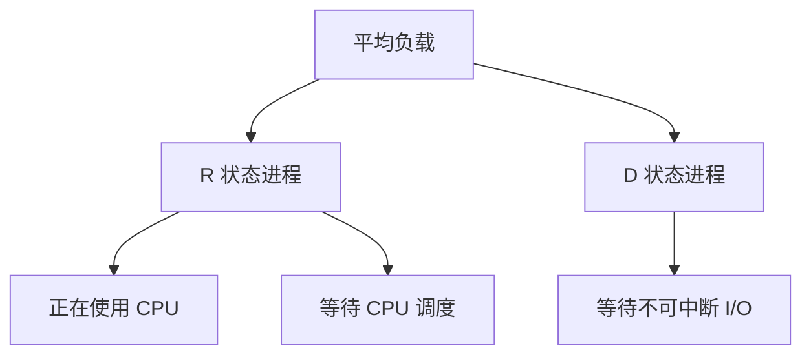

#### 为什么必须结合 CPU 数量判断

平均负载是进程数量，必须与逻辑 CPU 数量比较才有意义。查看逻辑 CPU 数量：

```bash
nproc
```

也可以使用：

```bash
lscpu
grep -c '^processor' /proc/cpuinfo
```

假设平均负载为 2：

| 逻辑 CPU 数 | 含义 |
| ---: | --- |
| 1 | 平均有一个进程运行，另一个进程等待，系统明显过载 |
| 2 | 每个 CPU 平均正好运行一个进程，CPU 被充分利用 |
| 4 | 平均只有一半 CPU 在工作，仍有较多余量 |

可以用归一化负载辅助判断：

```text
归一化负载 = 1 分钟平均负载 / 逻辑 CPU 数
```

归一化负载接近 `1`，说明计算资源趋近饱和；持续大于 `1`，说明活跃任务已超过 CPU 的并行处理能力。不过，生产环境不能只依赖固定阈值。更可靠的方法是建立基线，观察负载相对历史水平是否发生显著变化。

#### 用三个时间窗口判断趋势

1 分钟、5 分钟和 15 分钟负载要一起看：

| 负载关系 | 趋势判断 |
| --- | --- |
| 三个值接近 | 系统负载相对平稳 |
| 1 分钟值远大于 15 分钟值 | 负载正在上升，需要继续观察 |
| 1 分钟值远小于 15 分钟值 | 高负载正在消退 |
| 三个值都持续高于 CPU 数 | 系统长期过载 |

例如，单 CPU 系统的负载是 `1.73, 0.60, 7.98`：最近一分钟仍然过载，但比过去 15 分钟已经明显下降。

#### 平均负载高不等于 CPU 使用率高

平均负载和 CPU 使用率可能同时升高，也可能完全不同步：

| 场景 | 平均负载 | CPU 使用率 | 关键特征 |
| --- | --- | --- | --- |
| CPU 密集型任务 | 高 | 高 | 用户态或系统态 CPU 繁忙 |
| I/O 密集型任务 | 高 | 不一定高 | `iowait` 或 `D` 状态进程增多 |
| 大量任务争抢 CPU | 高 | 高 | 运行队列变长，进程 `%wait` 升高 |

所以，看到平均负载升高后，下一步必须判断它来自 CPU、I/O，还是任务调度竞争。

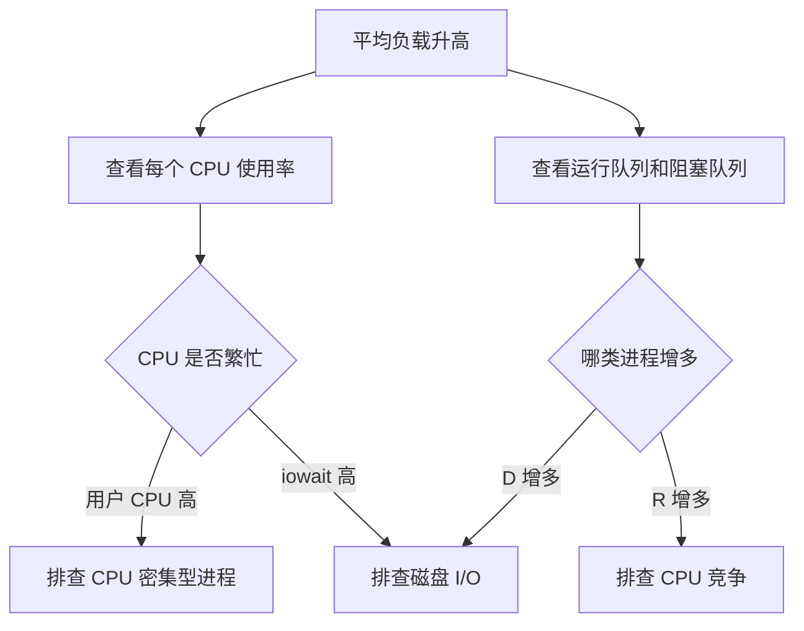

常用命令组合：

```bash
# 观察负载趋势
watch -d uptime

# 查看所有 CPU 的使用率
mpstat -P ALL 1

# 查看运行队列 r 和阻塞队列 b
vmstat 1

# 查看进程 CPU 使用率和等待 CPU 的时间
pidstat -u 1
```

排查时不要只看一次快照。至少连续观察数个采样周期，并让不同工具使用相同或接近的采样间隔。

---

### CPU 上下文切换：原理、类型与过高排查
<!-- src: sources/linux-performance/01-CPU性能篇/03-基础篇-经常说的CPU上下文切换是什么意思上.md; sources/linux-performance/01-CPU性能篇/04-基础篇-经常说的CPU上下文切换是什么意思下.md -->

Linux 可以运行远多于 CPU 数量的任务，是因为调度器在很短的时间内轮流把 CPU 分配给不同任务。每次从一个任务切换到另一个任务，都需要保存旧任务的运行现场并恢复新任务的运行现场，这就是 CPU 上下文切换。

#### CPU 上下文包含什么

CPU 执行任务依赖一组运行状态，核心包括：

- CPU 寄存器；
- 程序计数器；
- 内核栈；
- 进程虚拟内存映射；
- 线程栈及其他线程私有数据。

上下文切换的基本过程如下：

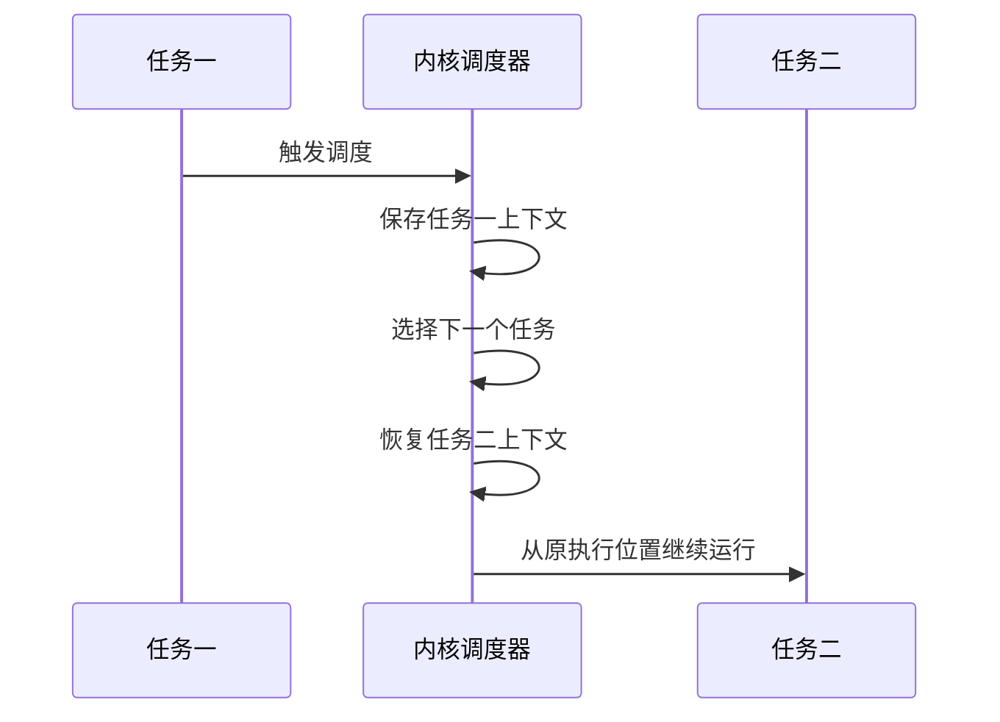

保存和恢复上下文需要 CPU 执行，本身不会产生业务价值。切换过多时，CPU 时间会消耗在寄存器、内核栈、虚拟内存和缓存状态的维护上，真正用于应用计算的时间反而减少。

#### 三类上下文切换

| 类型 | 切换对象 | 主要成本 |
| --- | --- | --- |
| 进程上下文切换 | 不同进程 | 寄存器、内核状态、虚拟内存、TLB 和缓存状态 |
| 线程上下文切换 | 不同线程 | 同进程线程可共享地址空间，通常比跨进程切换轻 |
| 中断上下文切换 | 当前任务与中断处理程序 | 寄存器、内核栈和中断处理状态 |

系统调用中的用户态与内核态切换，也会保存和恢复 CPU 寄存器，但它始终运行在同一个进程中，不等同于进程上下文切换。

进程上下文切换常由以下事件触发：

- 当前任务时间片耗尽；
- 任务主动睡眠；
- 任务等待 I/O、内存等资源；
- 更高优先级任务抢占 CPU；
- 当前任务退出；
- 硬件中断触发；
- 多个任务在运行队列中竞争 CPU。

#### 先看系统级切换

`vmstat` 可以同时观察上下文切换、系统中断、运行队列和不可中断进程：

```bash
vmstat 1
```

重点字段：

| 字段 | 含义 | 异常方向 |
| --- | --- | --- |
| `r` | 正在运行和等待 CPU 的任务数 | 持续大于逻辑 CPU 数，说明 CPU 竞争激烈 |
| `b` | 不可中断睡眠任务数 | 持续升高，通常需要排查 I/O |
| `in` | 每秒中断次数 | 突增时检查具体中断来源 |
| `cs` | 每秒上下文切换次数 | 相对基线数量级增长时需要分析 |
| `us` | 用户态 CPU 使用率 | 高时排查应用计算 |
| `sy` | 内核态 CPU 使用率 | 高时排查系统调用、调度和内核活动 |

上下文切换没有适用于所有机器的绝对阈值。课程案例给出的经验是：稳定在数百至一万次每秒可能仍属正常，而超过一万或出现数量级增长时，应结合机器规格和历史基线继续分析。

#### 再看进程和线程级切换

查看进程上下文切换：

```bash
pidstat -w 1
```

重点区分两类指标：

| 指标 | 类型 | 常见原因 |
| --- | --- | --- |
| `cswch/s` | 自愿上下文切换 | 任务主动等待 I/O、锁、内存或其他资源 |
| `nvcswch/s` | 非自愿上下文切换 | 时间片耗尽、任务过多、CPU 竞争或高优先级任务抢占 |

Linux 调度的基本单位是线程。进程级数据解释不了系统级 `cs` 时，要继续查看线程：

```bash
pidstat -wt 1
```

如果主线程切换次数不高，但大量工作线程的 `nvcswch/s` 很高，说明问题可能来自线程数量过多或工作线程争抢 CPU。

#### 中断次数也要交叉验证

上下文切换升高经常伴随中断升高。查看硬中断分布：

```bash
watch -d cat /proc/interrupts
```

如果 `RES`，即重调度中断增长很快，通常说明多核系统正在频繁唤醒其他 CPU 重新调度任务，这与运行队列过长、线程竞争激烈的判断相互印证。

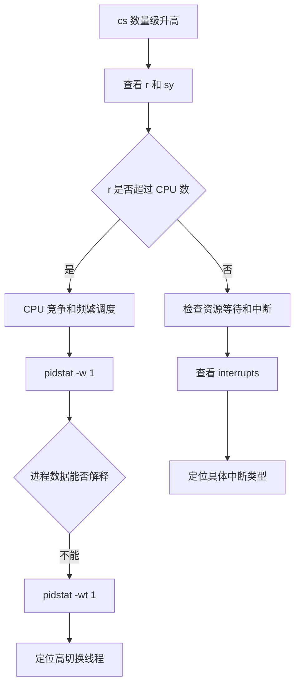

诊断结论要落到“哪种切换、哪个任务、什么原因”：

- 自愿切换高：沿 I/O、锁、内存等资源等待方向排查；
- 非自愿切换高：沿 CPU 竞争、线程数、时间片和优先级方向排查；
- 中断高：从 `/proc/interrupts` 定位硬件或重调度中断；
- 系统态 CPU 同时很高：警惕大量调度工作本身已经成为瓶颈。

---

### 定位把 CPU 跑满的应用进程
<!-- src: sources/linux-performance/01-CPU性能篇/05-基础篇-某个应用的CPU使用率居然达到100%，我该怎么办.md; sources/linux-performance/01-CPU性能篇/14-答疑二-如何用perf工具分析Java程序.md -->

CPU 使用率表示一段采样时间内，CPU 非空闲时间占总时间的比例。排查 CPU 跑满问题时，既要识别“CPU 时间花在哪一类活动上”，也要定位“具体哪个进程、线程和函数消耗了这些时间”。

#### 读懂 CPU 使用率分类

Linux 的 CPU 时间来自 `/proc/stat`。性能工具通过两次采样的差值，计算采样间隔内的使用率，而不是直接使用开机以来的累计值。

```text
CPU 使用率 = 1 - 空闲时间增量 / 总 CPU 时间增量
```

常见 CPU 使用率字段：

| 字段 | 含义 | 高值时的优先排查方向 |
| --- | --- | --- |
| `us` | 普通优先级用户态 CPU 时间 | 应用代码、计算热点 |
| `ni` | 低优先级用户态 CPU 时间 | 调整过 nice 值的应用 |
| `sy` | 内核态 CPU 时间 | 系统调用、调度、内核线程 |
| `id` | 空闲时间 | 越低说明 CPU 越繁忙 |
| `wa` | 等待 I/O 的时间 | 磁盘或其他 I/O |
| `hi` | 硬中断 CPU 时间 | 硬件中断 |
| `si` | 软中断 CPU 时间 | 网络收发、定时器、调度等 |
| `st` | 虚拟机被宿主机抢占的时间 | 宿主机资源争用 |
| `guest` | 运行客户虚拟机的时间 | 虚拟化工作负载 |

注意不同工具的统计窗口：

- `top` 默认按较短时间间隔动态刷新；
- `pidstat` 按指定间隔输出；
- `ps` 的 CPU 使用率更接近进程生命周期内的平均值。

对比工具数据时，应尽量统一采样时间和观察窗口。

#### 从系统到进程

先用 `top` 判断 CPU 时间主要消耗在哪一类活动：

```bash
top
```

进入 `top` 后按 `1`，切换到每个逻辑 CPU 的视图。多核机器上，“某进程 100%”通常表示它占满一个逻辑 CPU，并不代表整台机器所有 CPU 都已耗尽。

再用 `pidstat` 查看进程的用户态、内核态和等待 CPU 时间：

```bash
pidstat -u 1
```

需要观察线程时：

```bash
pidstat -t -u 1
top -H -p <PID>
```

如果多个进程或线程的 `%CPU` 之和能解释系统整体的 `us` 或 `sy`，说明已经完成“系统指标到责任进程”的关联。

#### 用 perf 定位热点函数

找到高 CPU 进程后，不要在线上排查初期直接使用会暂停进程的 GDB。`perf` 基于性能事件采样，对运行中程序的干扰通常更小，更适合先定位热点函数和调用链。

实时查看系统热点：

```bash
perf top
```

只分析指定进程，并采集调用关系：

```bash
perf top -g -p <PID>
```

保存一段时间的数据，再离线查看：

```bash
perf record -g -p <PID> -- sleep 30
perf report
```

`perf top` 或 `perf report` 中的重要字段：

| 字段 | 含义 |
| --- | --- |
| `Overhead` 或 `Children` | 该符号及其调用路径占采样事件的比例 |
| `Self` | 符号自身占用的采样比例 |
| `Shared Object` | 函数所在的程序、动态库或内核 |
| `Symbol` | 函数或指令符号 |

样本数过少时，百分比不具有代表性。应让采样覆盖稳定复现问题的一段时间。

#### 先判断 perf 报告是否可信

`perf` 能生成报告，不代表报告一定包含可解释的调用栈。分析前先检查以下四个条件：

| 检查项 | 异常表现 | 处理方向 |
| --- | --- | --- |
| 采样窗口 | 样本很少，热点每次变化很大 | 延长采样并覆盖故障窗口 |
| 符号解析 | 只有十六进制地址或 `[unknown]` | 补齐二进制、动态库和调试符号 |
| 调用栈展开 | 只能看到叶子函数，父调用缺失 | 调整 call graph 模式或构建选项 |
| 目标范围 | 报告被 `swapper` 或其他进程占满 | 限定 PID、线程、CPU 或 cgroup |

记录时同时显示采样数量，避免只看百分比：

```bash
perf report --show-nr-samples
```

只看目标进程：

```bash
perf report --pid <PID>
```

只看目标命令：

```bash
perf report --comms <COMMAND>
```

如果目标函数占比很低，调用栈可能被展示阈值隐藏。课程案例中，应用占比约为 `0.34%`，低于当时 `perf report` 调用图的默认阈值，因此界面只展开了占比更高的 `swapper`。可以显式降低阈值：

```bash
perf report -g graph,0.1
```

阈值越低，报告越完整，但调用树也会更大。正确做法是先过滤到目标进程或动态库，再逐步降低阈值，而不是在全系统报告中展开所有分支。

`swapper` 代表 CPU 空闲任务。系统级采样主要由 `swapper` 构成，通常说明：

- 采样时故障没有发生；
- 工作负载已经结束；
- 目标进程大部分时间阻塞而非消耗 CPU；
- 采样范围过大，目标进程占比被稀释；
- 选择了不适合当前问题的事件。

若业务慢但 CPU 大量空闲，应转向 off-CPU、I/O、锁、调度延迟和依赖服务，而不是继续把 idle 路径当作 CPU 热点。

#### 符号为何变成十六进制地址

`perf` 根据指令地址查找对应的 ELF、动态库、内核符号和调试信息。以下情况会造成符号缺失：

- 可执行文件或动态库被 `strip` 删除符号；
- 运行时二进制已经升级或删除，与采样时版本不同；
- `perf.data` 被复制到另一台机器，但没有同步二进制；
- 容器文件系统中的库在宿主机同路径不存在；
- 内核符号受权限限制；
- JIT 代码运行时生成，没有静态 ELF 符号；
- 调用栈依赖帧指针，但编译器省略了帧指针。

先保留构建产物和 Build ID：

```bash
perf buildid-list -i perf.data
```

对于自己维护的 C、C++ 或 Rust 程序，生产发布可以将调试信息拆分保存，而不是彻底丢弃：

```text
生产二进制：保留 Build ID，可按需去除大部分调试段
符号服务器：按 Build ID 保存未裁剪二进制和调试文件
性能数据：保存 perf.data、内核版本和容器镜像摘要
```

需要源码行号时，还必须提供 DWARF 调试信息：

```bash
perf report --stdio --sort comm,dso,symbol,srcline
```

若 `srcline` 为空，不代表函数没有执行，只说明无法把地址映射到源码行。

#### 调用栈展开模式

调用栈缺失还可能是展开方式不匹配。常见模式包括：

| 模式 | 特点 | 适用条件 |
| --- | --- | --- |
| Frame Pointer | 开销较低 | 程序和库保留帧指针 |
| DWARF | 能处理省略帧指针的程序 | 二进制包含展开信息，采样开销较高 |
| LBR | 使用硬件分支记录 | 受 CPU 型号和调用深度限制 |

使用 DWARF 采集：

```bash
perf record --call-graph dwarf -p <PID> -- sleep 30
```

使用帧指针模式：

```bash
perf record --call-graph fp -p <PID> -- sleep 30
```

若使用帧指针模式，应用和关键动态库应采用等价于 `-fno-omit-frame-pointer` 的构建选项。DWARF 调用栈会增加数据量和采样成本，应先在压测环境评估。

#### 容器中的 perf 符号解析

宿主机能够采样容器进程，但容器内的动态库通常不在宿主机相同路径。常见现象是内核符号正常，用户态函数全部显示为地址。

先获取容器主进程在宿主机中的 PID：

```bash
PID=$(docker inspect --format '{{.State.Pid}}' <CONTAINER>)
```

采集目标进程：

```bash
perf record -g -p "$PID" -- sleep 30
```

分析时指定容器根文件系统：

```bash
perf report --symfs "/proc/$PID/root"
```

如果容器已退出，`/proc/<PID>/root` 会消失。可选做法是：

1. 保留发生问题时的镜像摘要。
2. 从相同镜像创建只读容器。
3. 将其 rootfs 挂载到稳定目录。
4. 使用 `perf report --symfs <ROOTFS>` 解析。

另一种方式是在宿主机采集 `perf.data`，再把数据和匹配版本的工具放进同镜像环境分析。无论采用哪种方法，内核仍属于宿主机，`perf` 与宿主机内核能力和权限必须匹配。

容器内直接运行 `perf` 往往需要额外 capabilities、较低的 `perf_event_paranoid` 限制或特权权限。不要为了排障长期给业务容器开放高权限；优先由宿主机或专用诊断容器执行短时采样。

#### Java 程序为何更特殊

Java 热点代码由 JIT 在运行时生成。普通 `perf` 可以采到 JVM、GC、JIT 编译线程和内核路径，但若没有 JIT 符号映射，Java 方法可能显示为未知地址。

传统方法是让 JVM 或辅助工具生成：

```text
/tmp/perf-<PID>.map
```

并在需要时保留帧指针：

```bash
-XX:+PreserveFramePointer
```

这种方法适合把 Java、native 和 kernel 帧放到同一张 perf 火焰图中，但要确认 JDK、发行版和容器对符号文件目录的处理。

现代 Java 排障通常优先使用 async-profiler。它可采集 Java、native、内核、GC 和 JIT 编译线程，并支持 CPU、分配、锁竞争和多类性能事件：

```bash
asprof -d 30 -f cpu-flamegraph.html <PID>
```

采集分配热点：

```bash
asprof -e alloc -d 30 -f alloc.html <PID>
```

采集锁竞争：

```bash
asprof -e lock -d 30 -f lock.html <PID>
```

若需要低频、长时间的生产记录，可使用 JDK Flight Recorder。先查询目标 JVM 支持的参数：

```bash
jcmd <PID> help JFR.start
```

启动一段有时限的记录：

```bash
jcmd <PID> JFR.start \
  name=cpu-investigation \
  settings=profile \
  duration=60s \
  filename=/tmp/cpu-investigation.jfr
```

工具选择可以按目标区分：

| 目标 | 首选 |
| --- | --- |
| 系统与所有进程的 CPU 归因 | `perf` |
| Java 方法、native 与内核混合火焰图 | async-profiler |
| 长时间 JVM 事件、GC、线程和锁分析 | JFR |
| 某个时刻线程状态 | `jstack` 或 `jcmd Thread.print` |

`jstack` 是线程快照，不等于 CPU 采样。一次快照中的 RUNNABLE 线程未必是长期热点，应与线程 CPU、持续采样或多次快照交叉验证。

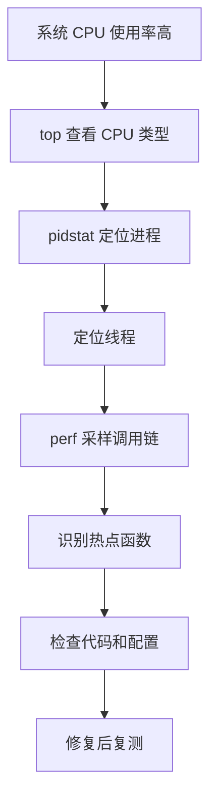

#### 案例闭环：PHP 计算热点

课程案例中，Web 服务吞吐量很低，`top` 显示两个 CPU 的 `us` 接近 100%，多个 `php-fpm` 进程合计占满 CPU。`perf top -g -p <PID>` 最终把热点定位到 `sqrt` 调用。

源码中存在一段遗留测试循环：

```php
<?php
$x = 0.0001;

for ($i = 0; $i <= 1000000; $i++) {
    $x += sqrt($x);
}

echo "It works!";
```

删除无意义的循环后，相同压测条件下，案例吞吐量从每秒约 11 个请求提升到 2200 多个请求。这个案例说明：

1. 系统指标只能告诉你“CPU 忙”。
2. 进程指标告诉你“谁在忙”。
3. 调用链采样才能告诉你“忙在哪个函数”。
4. 优化必须回到相同压测条件复测，不能以代码改完作为结束。

---

### CPU 使用率高却找不到进程的排查
<!-- src: sources/linux-performance/01-CPU性能篇/06-案例篇-系统的CPU使用率很高，但为啥却找不到高CPU的应用.md -->

有时 `top` 显示系统 CPU 使用率很高，但进程列表中没有任何一个进程持续占用大量 CPU。此时不应先怀疑统计工具，而应考虑快照型工具是否漏掉了生命周期很短的任务。

#### 为什么会出现系统与进程数据不一致

最常见的原因有两类：

- 应用频繁执行生命周期很短的外部命令，进程在两次刷新之间已经退出；
- 应用不断崩溃并被守护程序拉起，启动和初始化阶段消耗了大量 CPU。

`top`、`ps` 和普通 `pidstat` 更擅长观察持续存在的进程。短时进程不断创建和退出时，系统累计 CPU 时间会升高，但任何一次进程快照都可能只看到它们短暂的残影。

可疑特征包括：

- 系统 `us` 或 `sy` 很高，但进程 `%CPU` 之和明显对不上；
- `top` 的 `running` 任务数较多；
- 偶尔看到处于 `R` 状态的可疑进程；
- 同名进程的 PID 持续变化；
- 某个请求、定时任务或脚本触发后问题明显。

#### 先跟踪父子关系

如果能捕捉到可疑进程，用 `pstree` 查找它的父进程：

```bash
pstree -aps <PID>
```

也可以按名称查找：

```bash
pstree -ap | grep '<COMMAND>'
```

父进程往往比短时子进程稳定。找到父进程后，就可以检查它为何反复调用外部命令。

#### 用事件记录替代进程快照

`perf record` 可以累计一段时间内的 CPU 事件，即使短时进程已经退出，其采样仍会保留在报告中：

```bash
perf record -g -a -- sleep 15
perf report
```

更直接的工具是 `execsnoop`。它通过内核追踪记录 `exec` 行为，可以看到短时进程的 PID、父 PID、命令和返回结果：

```bash
execsnoop
```

不同系统中的 `execsnoop` 可能来自 BCC、bpfcc-tools 或其他 eBPF 工具包，命令参数会有差异，使用前应查看本机帮助信息。

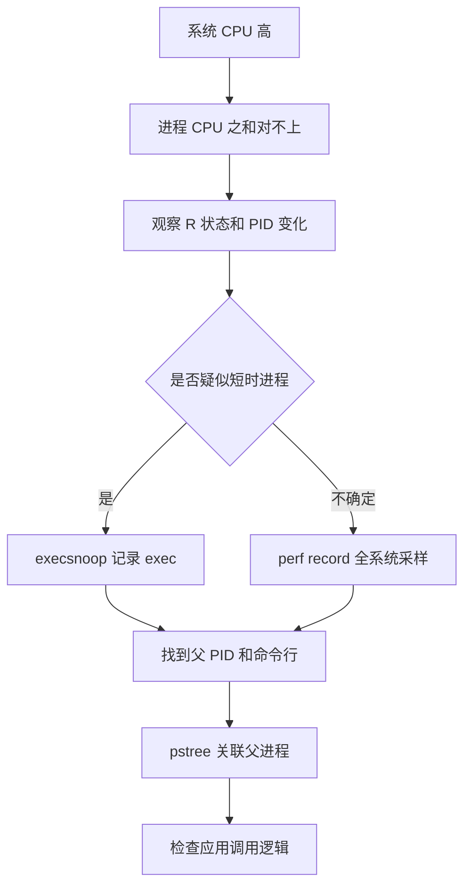

#### 案例闭环：请求触发短时 stress

课程案例中，系统 `us` 高达约 80%，`sy` 约 15%，但常驻进程的 CPU 使用率都很低。重新观察后发现，`stress` 进程偶尔处于 `R` 状态，而且 PID 一直变化。

`pstree` 显示调用链类似：

```text
php-fpm -> sh -> stress
```

应用代码对每个请求都执行一次外部命令：

```php
<?php
$result = exec(
    "/usr/local/bin/stress -t 1 -d 1 2>&1",
    $output,
    $status
);
```

命令又因为权限错误快速失败、退出并被下一次请求重新创建。普通进程快照很难稳定捕捉到它，但 `perf` 的累计报告显示 `stress` 占据了大部分 CPU 时钟事件，`execsnoop` 也能持续记录大量 `stress` 启动。

处理这类问题时，应先回答四个问题：

1. 哪个短时命令在频繁执行？
2. 它由哪个父进程触发？
3. 它为什么执行或失败后重试？
4. 这段调用能否删除、降频、异步化或改为进程内实现？

---

### 处理大量不可中断进程与僵尸进程
<!-- src: sources/linux-performance/01-CPU性能篇/07-案例篇-系统中出现大量不可中断进程和僵尸进程怎么办上.md; sources/linux-performance/01-CPU性能篇/08-案例篇-系统中出现大量不可中断进程和僵尸进程怎么办下.md -->

`top` 和 `ps` 中的进程状态，是连接平均负载、CPU 使用率、I/O 等待和应用行为的重要线索。尤其是 `D` 状态和 `Z` 状态持续增多时，通常已经不只是 CPU 问题，还涉及 I/O 或进程管理缺陷。

#### 常见进程状态

| 状态 | 名称 | 含义 |
| --- | --- | --- |
| `R` | Running 或 Runnable | 正在运行或等待 CPU |
| `S` | Interruptible Sleep | 等待事件，可被信号唤醒 |
| `D` | Uninterruptible Sleep | 通常等待硬件 I/O，暂时不可中断 |
| `Z` | Zombie | 子进程已退出，父进程尚未回收退出状态 |
| `T` 或 `t` | Stopped 或 Traced | 被暂停或正在被调试器跟踪 |
| `I` | Idle | 空闲内核线程，不会像 `D` 状态那样抬高负载 |
| `X` | Dead | 已消亡，通常不会在普通进程列表中看到 |

短时间出现 `D` 状态并不一定异常。真正需要警惕的是：

- `D` 状态进程持续不恢复或数量持续增加；
- `iowait` 同时升高；
- 平均负载被大量 `D` 状态进程抬高；
- 业务延迟与磁盘或设备请求同步恶化。

#### 排查不可中断进程

先用 `top`、`vmstat` 或 `dstat` 判断 `D` 状态是否与 I/O 变化相关：

```bash
top
vmstat 1
dstat -tcdnmgy 1
```

再用 `pidstat` 查看进程 I/O：

```bash
pidstat -d 1
pidstat -d -p <PID> 1
```

常用字段：

| 字段 | 含义 |
| --- | --- |
| `kB_rd/s` | 每秒读取的数据量 |
| `kB_wr/s` | 每秒写入的数据量 |
| `kB_ccwr/s` | 被任务取消的写入量 |
| `iodelay` | 块 I/O 延迟的累计时钟周期 |

如果目标进程持续存在，可以跟踪系统调用：

```bash
strace -f -tt -T -p <PID>
```

但短时进程可能在附加前已经退出，或者变成无法继续跟踪的僵尸进程。这时应改用累计采样：

```bash
perf record -g -a -- sleep 15
perf report
```

课程案例通过调用链中的 `sys_read`、`new_sync_read` 和块设备直接 I/O 路径，最终发现应用使用 `O_DIRECT` 绕过页缓存读取磁盘，造成明显的 `iowait`。删除不必要的 `O_DIRECT` 后，`iowait` 从很高的水平下降到接近零。

> `iowait` 高不等于磁盘一定达到硬件极限。它表示采样期间 CPU 空闲且至少有任务在等待 I/O。仍需结合吞吐量、延迟、队列和设备利用率判断真正的 I/O 瓶颈。

#### 僵尸进程为什么出现

子进程退出后，内核会保留少量退出信息，等待父进程调用 `wait()` 或 `waitpid()` 回收。父进程没有及时回收时，子进程就处于 `Z` 状态。

僵尸进程不再执行代码，通常也不消耗 CPU 和大量内存，但会占用 PID 和进程表项。持续累积可能最终阻止系统创建新进程。

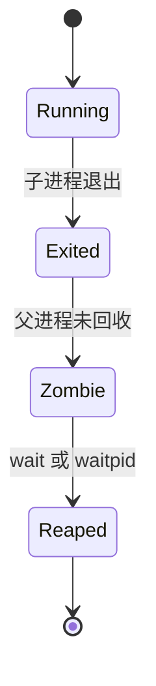

查找僵尸进程及其父进程：

```bash
ps -eo pid,ppid,stat,comm,wchan:32 | awk '$3 ~ /^Z/'
pstree -aps <ZOMBIE_PID>
```

修复重点在父进程，而不是对子进程执行 `kill -9`。僵尸进程已经退出，没有可供信号终止的运行实体。应检查父进程是否：

- 调用了 `wait()` 或 `waitpid()`；
- 正确处理了 `SIGCHLD`；
- 存在永远走不到回收逻辑的循环；
- 在异常路径中遗漏了子进程清理；
- 创建子进程的速度超过回收速度。

课程案例中的父进程虽然写了 `wait()`，但它被放在无限循环之后，实际上永远无法执行。把回收逻辑移动到可达路径后，僵尸进程不再累积。

```c
for (;;) {
    pid_t pid = fork();

    if (pid == 0) {
        run_child_work();
        _exit(0);
    }

    if (pid > 0) {
        waitpid(pid, NULL, 0);
    }
}
```

完整排查路径：

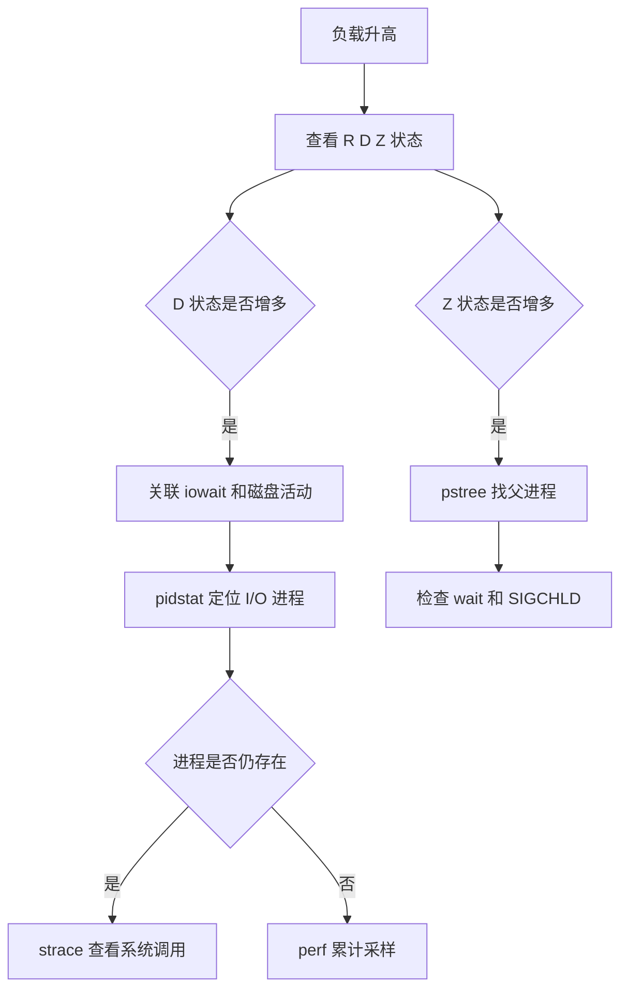

---

### 理解软中断：网络与 I/O 背后的 CPU 消耗
<!-- src: sources/linux-performance/01-CPU性能篇/09-基础篇-怎么理解Linux软中断.md -->

中断让 CPU 不必持续轮询硬件状态。设备有事件时主动通知 CPU，CPU 暂停当前任务并执行中断处理程序，从而提高系统并发处理能力。

问题在于，中断处理会打断正常进程。如果处理程序执行时间过长，其他中断和任务会被延迟。Linux 因此把中断处理拆成上半部和下半部。

#### 上半部与下半部

| 阶段 | 常用名称 | 主要职责 | 特点 |
| --- | --- | --- | --- |
| 上半部 | 硬中断 | 快速响应硬件、读取必要状态、确认中断 | 优先级高，要求尽快完成 |
| 下半部 | 软中断 | 延迟处理剩余工作 | 可稍后执行，避免长时间阻塞硬中断 |

以网卡收包为例：

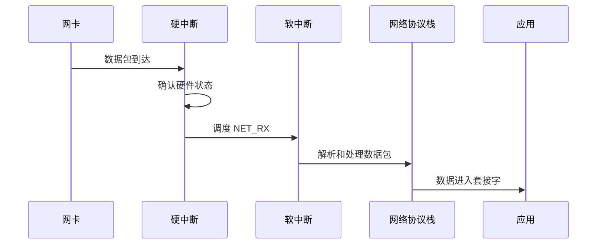

软中断不只处理硬件中断的下半部，还包括定时器、调度、RCU 等内核事件。常见类型包括：

- `HI`：高优先级 tasklet；
- `TIMER`：定时器；
- `NET_TX`：网络发送；
- `NET_RX`：网络接收；
- `BLOCK`：块设备；
- `IRQ_POLL`：中断轮询；
- `TASKLET`：普通 tasklet；
- `SCHED`：调度；
- `HRTIMER`：高精度定时器；
- `RCU`：RCU 回调。

#### 查看软中断

查看各 CPU 从启动以来的累计软中断次数：

```bash
cat /proc/softirqs
```

累计值本身意义有限，排障时更重要的是变化速率：

```bash
watch -d -n 1 cat /proc/softirqs
```

观察时关注两点：

1. 哪种软中断增长最快；
2. 同类软中断在不同 CPU 上是否严重不均衡。

每个 CPU 通常都有对应的 `ksoftirqd/<CPU>` 内核线程。查看这些线程：

```bash
ps -eLo pid,tid,psr,pcpu,stat,comm | grep ksoftirqd
```

进程名位于方括号中的任务通常是内核线程。`ksoftirqd` CPU 使用率升高，说明该 CPU 上积压了较多软中断工作，但仍需通过 `/proc/softirqs` 确认具体类型。

#### 软中断为什么会拖慢业务

软中断与应用进程共享 CPU。软中断频率过高时可能出现：

- 应用可获得的 CPU 时间减少；
- 网络收发延迟升高；
- 数据包积压或丢弃；
- 调度响应变慢；
- 某些 CPU 被中断集中打满，而其他 CPU 仍较空闲。

所以，系统整体 CPU 使用率不高，也不能排除软中断瓶颈。单核的 `si` 比例、`ksoftirqd` 活动和每秒中断增长率，可能比全机平均 CPU 使用率更有解释力。

---

### 软中断导致 CPU 升高的定位
<!-- src: sources/linux-performance/01-CPU性能篇/10-案例篇-系统的软中断CPU使用率升高，我该怎么办.md -->

软中断排查的关键不是停在“`si` 高”，而是继续回答三个问题：

1. 哪一种软中断增长最快？
2. 它对应的系统活动是什么？
3. 这些活动由什么流量、设备或工作负载触发？

#### 第一步：确认 CPU 时间花在软中断

```bash
top
mpstat -P ALL 1
```

关注每个 CPU 的 `%soft` 或 `si`。全机平均值可能掩盖单个 CPU 的热点，所以必须查看逐 CPU 数据。

#### 第二步：定位软中断类型

```bash
watch -d -n 1 cat /proc/softirqs
```

如果 `NET_RX` 增长最快，说明主要压力来自网络接收；如果 `NET_TX` 增长快，则继续检查网络发送；如果 `SCHED` 或 `TIMER` 异常，则应沿调度和定时任务方向分析。

#### 第三步：分析网络 PPS 与 BPS

网络软中断高时，先看包速率和字节速率：

```bash
sar -n DEV 1
```

关键字段：

| 字段 | 含义 |
| --- | --- |
| `rxpck/s` | 每秒接收包数，即接收 PPS |
| `txpck/s` | 每秒发送包数，即发送 PPS |
| `rxkB/s` | 每秒接收千字节数 |
| `txkB/s` | 每秒发送千字节数 |

平均包大小可粗略估算为：

```text
平均接收包大小 = rxkB/s * 1024 / rxpck/s
```

高 PPS、低 BPS 通常意味着大量小包。小包即使吞吐量不高，也会频繁触发协议栈处理和软中断，消耗大量 CPU。

#### 第四步：抓包确认协议和来源

```bash
tcpdump -i eth0 -nn -c 200 'tcp port 80'
```

课程案例中，`NET_RX` 快速增长，网卡接收 PPS 很高但 BPS 很低，平均包长只有约 54 字节。抓包发现大量仅设置 `SYN` 标志的 TCP 包，最终确认是 SYN Flood。

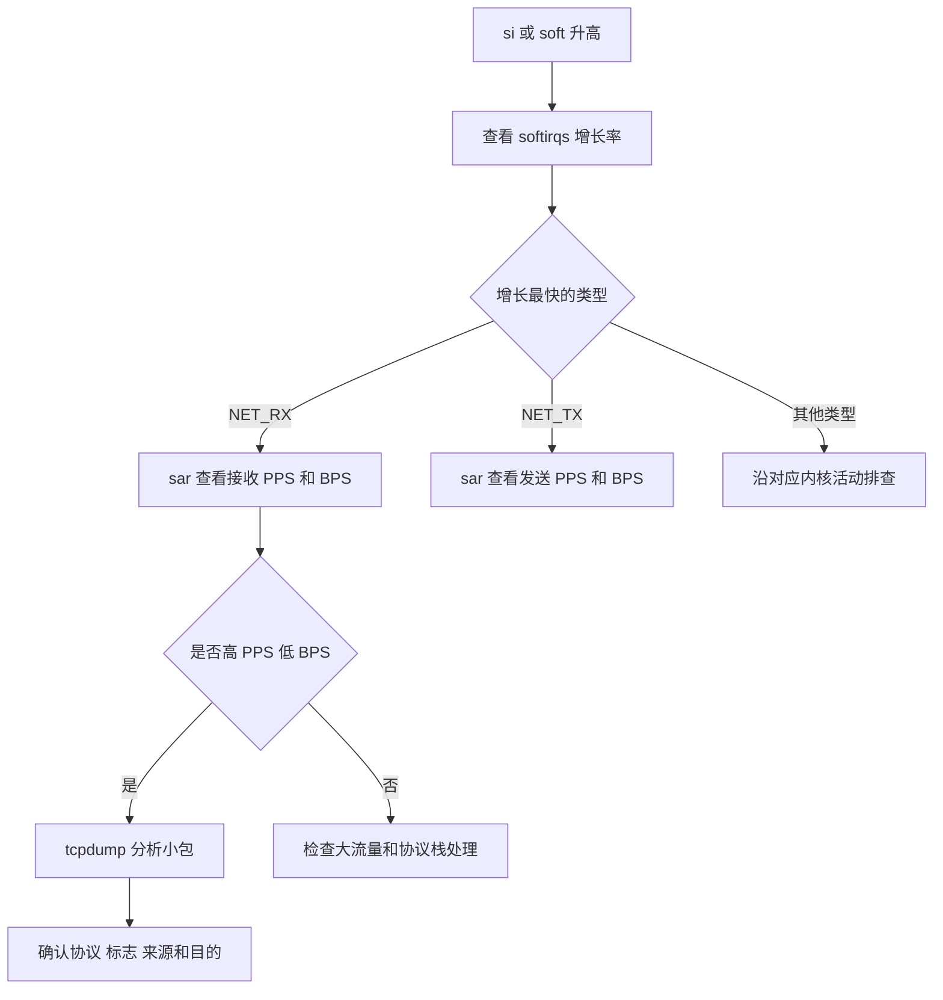

#### 处置不能只停留在服务器进程

网络攻击或异常流量已经到达服务器时，应用优化往往不是第一选择。课程案例最直接的止损方式是在交换机、硬件防火墙或上游网络设备封禁来源，使异常包不再进入服务器。

实际环境还应根据问题类型考虑：

- 上游清洗或限速；
- 防火墙规则；
- SYN cookies 和连接队列参数；
- 网卡多队列与 RSS；
- IRQ 亲和性和 `irqbalance`；
- 应用监听和连接处理能力；
- 内核网络参数；
- 对异常来源进行持续监控。

这些措施必须在明确流量类型、业务基线和风险后实施，不能看到 `NET_RX` 高就盲目修改内核参数。

---

### CPU 性能问题的快速定位流程
<!-- src: sources/linux-performance/01-CPU性能篇/11-套路篇-如何迅速分析出系统CPU的瓶颈在哪里.md; sources/linux-performance/01-CPU性能篇/13-答疑一-无法模拟出RES中断的问题，怎么办.md -->

CPU 指标很多，但它们不是互相孤立的。高效排查的核心，是先用覆盖面广的工具缩小范围，再沿异常指标选择专项工具，而不是把所有命令无差别运行一遍。

#### CPU 核心指标

| 指标 | 说明 | 常见异常方向 |
| --- | --- | --- |
| 平均负载 | `R` 和 `D` 状态的平均活跃任务数 | CPU 竞争或 I/O 等待 |
| 用户 CPU | 用户态代码消耗 | 应用热点 |
| 系统 CPU | 内核态代码消耗 | 系统调用、调度、内核线程 |
| `iowait` | CPU 空闲且存在 I/O 等待 | 存储 I/O |
| 软中断 | 内核软中断处理 | 网络、定时器、调度 |
| 硬中断 | 硬件中断处理 | 网卡、磁盘或其他设备 |
| 自愿上下文切换 | 任务主动等待资源 | I/O、锁、内存 |
| 非自愿上下文切换 | 任务被强制换出 | CPU 竞争、线程过多 |
| CPU 缓存命中率 | 热点数据能否从缓存获取 | 数据布局、跨核调度、NUMA |

#### 三个入口工具

优先运行 `top`、`vmstat` 和 `pidstat`：

```bash
top
vmstat 1
pidstat -u -w 1
```

它们分别回答：

| 工具 | 主要回答的问题 |
| --- | --- |
| `top` | 整体负载如何，CPU 时间花在哪，哪些进程和状态可疑 |
| `vmstat` | 运行队列、阻塞队列、上下文切换和中断是否异常 |
| `pidstat` | 哪个进程消耗用户态或内核态 CPU，谁在等待 CPU，谁频繁切换 |

#### 实验结果不符合预期时怎么处理

性能实验不是固定剧本。同一条命令在不同内核、工具版本、虚拟化平台和硬件上，可能产生完全不同的指标。遇到“没有复现课程现象”时，不要先怀疑命令没执行，而应按以下顺序核对：

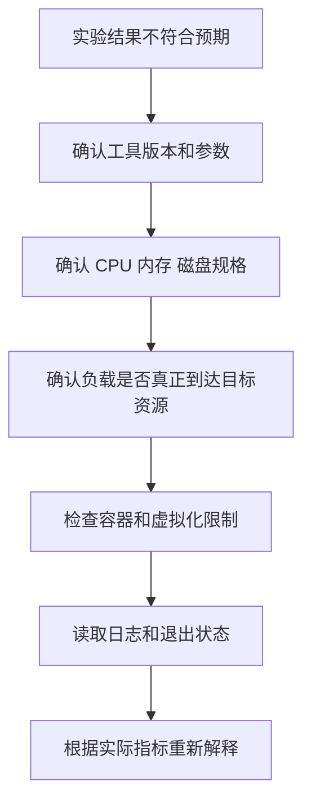

#### stress 无法制造 iowait

旧版课程使用 `stress -i` 调用 `sync` 制造 I/O 压力，但这个实验并不稳定。`sync` 只有在系统存在足够脏页时才会产生明显写入；若页缓存中几乎没有待写数据，命令会频繁进入内核，却不会形成足够设备 I/O。

这种场景常表现为：

- 平均负载有所升高；
- `sy` 明显升高；
- `wa` 仍接近零；
- 磁盘吞吐和队列并不高。

这不是 `iowait` 指标错误，而是实验主要制造了系统调用开销。

可使用 `stress-ng` 同时产生同步调用和临时文件 I/O：

```bash
stress-ng --io 1 --hdd 1 --timeout 60s --metrics-brief
```

运行时必须同步观察设备：

```bash
mpstat -P ALL 1
iostat -xz 1
pidstat -d 1
```

只有看到设备吞吐、队列或延迟升高，才能证明压力真正到达存储设备。高性能 NVMe 可能轻松吸收低强度负载，需要逐步增加并发和数据量；机械盘则可能很快饱和，不能直接照搬高强度参数。

测试前确认目标设备和数据路径：

```bash
findmnt -T /path/to/test-file
lsblk -o NAME,TYPE,SIZE,FSTYPE,MOUNTPOINTS
```

容器内的文件可能落在 OverlayFS、宿主机卷或网络存储，观察错误设备会得出“没有 I/O”的假结论。

#### 单核系统为何看不到 RES

`RES` 通常表示重调度处理器间中断。它用于通知其他 CPU 重新调度任务，因此只有一个逻辑 CPU 时，没有其他 CPU 需要被唤醒，`RES` 不增长是合理现象。

即使单核机器看不到 `RES`，线程过多仍会造成：

- 运行队列增长；
- 非自愿上下文切换增长；
- 每个线程等待 CPU 的时间增加；
- 缓存和调度开销上升；
- 吞吐不再随线程数增长。

验证 CPU 竞争：

```bash
vmstat 1
pidstat -u -w -t 1
```

关键证据是 `r`、`cswch/s`、`nvcswch/s` 和进程 `%wait`，不是必须看到某一种中断。

#### pidstat 的 wait 不等于 top 的 wa

这两个字段名称相似，但统计对象不同：

| 指标 | 统计对象 | 含义 |
| --- | --- | --- |
| `pidstat %wait` | 进程或线程 | 可运行但等待获得 CPU 的时间比例 |
| `top wa` | CPU | CPU 空闲且系统存在未完成 I/O 的时间比例 |

进程 `%wait` 高通常意味着 CPU 竞争或配额节流；CPU `wa` 高通常引导到存储 I/O。一个线程等待磁盘时处于睡眠状态，并不会直接把同一数值显示成该线程的 `%wait`。

容器 CPU 配额不足也会造成进程 `%wait` 高。此时宿主机可能仍有空闲 CPU，应同时检查：

```bash
cat /sys/fs/cgroup/<CGROUP>/cpu.stat
cat /sys/fs/cgroup/<CGROUP>/cpu.max
```

#### vmstat 第一行为什么不同

执行：

```bash
vmstat 5
```

默认情况下，第一行的 CPU、上下文切换和中断等速率，通常是系统启动以来的平均值；后续行才是每个五秒采样窗口的平均值。进程数和内存等部分字段则是当前快照。

因此：

- 不要拿第一行与第二行直接判断突发变化；
- 自动采集时可丢弃第一行；
- 明确使用采样间隔和次数；
- 不同版本行为以本机 `man vmstat` 为准。

例如采集五次一秒窗口：

```bash
vmstat 1 6
```

分析时通常使用后五行。工具输出不符合直觉时，先查版本和手册：

```bash
vmstat --version
man vmstat
```

#### 工具缺少字段不等于指标不存在

课程答疑中，旧版 `pidstat` 没有 `%wait` 列。生产环境经常因为发行版较旧、最小化镜像或权限限制，无法使用最新工具。处理原则是：

1. 先确认工具版本和字段定义。
2. 查找指标在 `/proc`、`/sys` 或 cgroup 中的原始来源。
3. 使用另一种工具交叉验证。
4. 不要把“工具没有显示”解释成“系统没有这个现象”。

```bash
pidstat -V
uname -r
cat /proc/stat
cat /proc/loadavg
cat /proc/interrupts
```

同名字段在不同工具中也可能含义不同。引用指标时应同时记录工具、版本、参数和采样窗口。

#### 按异常指标选择下一步

| 起始现象 | 下一步工具 | 目标 |
| --- | --- | --- |
| `us` 高 | `pidstat -u`、`perf` | 找到应用和热点函数 |
| `sy` 高 | `pidstat`、`strace`、`perf` | 分析系统调用、调度或内核热点 |
| 负载高且 `r` 高 | `pidstat`、`top -H` | 找出争抢 CPU 的进程和线程 |
| 负载高且 `b` 高 | `dstat`、`iostat`、`pidstat -d` | 定位 I/O 等待 |
| `cs` 高 | `pidstat -w`、`pidstat -wt` | 区分自愿与非自愿切换 |
| `si` 高 | `/proc/softirqs`、`sar -n DEV`、`tcpdump` | 定位软中断类型和网络流量 |
| `in` 高 | `/proc/interrupts` | 定位具体硬中断 |
| 系统 CPU 高但无高 CPU 进程 | `execsnoop`、`perf record -a` | 捕捉短时进程 |

#### 一套可执行的快速流程

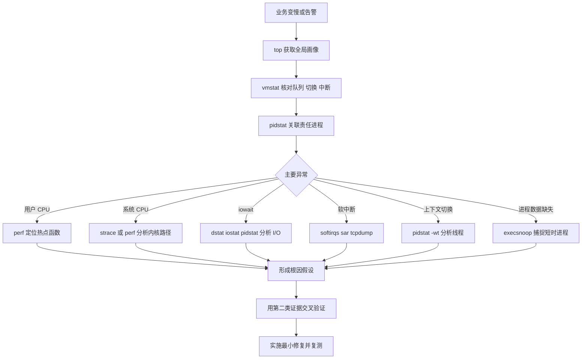

#### 生产排障记录模板

每次排障至少记录以下内容：

```text
时间范围：
受影响业务：
主机和 CPU 规格：
业务症状：
平均负载 1m 5m 15m：
us sy wa hi si st：
r b cs in：
高 CPU 进程或线程：
关键调用链或系统调用：
异常中断或网络流量：
根因假设：
交叉验证证据：
修复动作：
修复前后业务指标：
修复前后系统指标：
```

记录完整证据链，才能区分“相关现象”和“真正根因”，也便于后续复盘和建立监控阈值。

---

### CPU 性能优化的常用手段
<!-- src: sources/linux-performance/01-CPU性能篇/12-套路篇-CPU性能优化的几个思路.md -->

性能优化不是看到 CPU 高就立即改参数。正确顺序是先量化目标、定位主瓶颈、选择成本可控的方案，再用相同条件验证效果。

#### 优化前先回答三个问题

1. 用什么指标证明优化有效？
2. 多个问题同时存在时，先解决哪个？
3. 多个方案都能改善性能时，哪一个综合成本最低？

性能评估至少包含应用和系统两个维度：

| 维度 | 可选指标 |
| --- | --- |
| 应用 | 吞吐量、请求延迟、错误率、任务完成时间 |
| 系统 | CPU 使用率、运行队列、上下文切换、缓存命中率 |

评估流程：

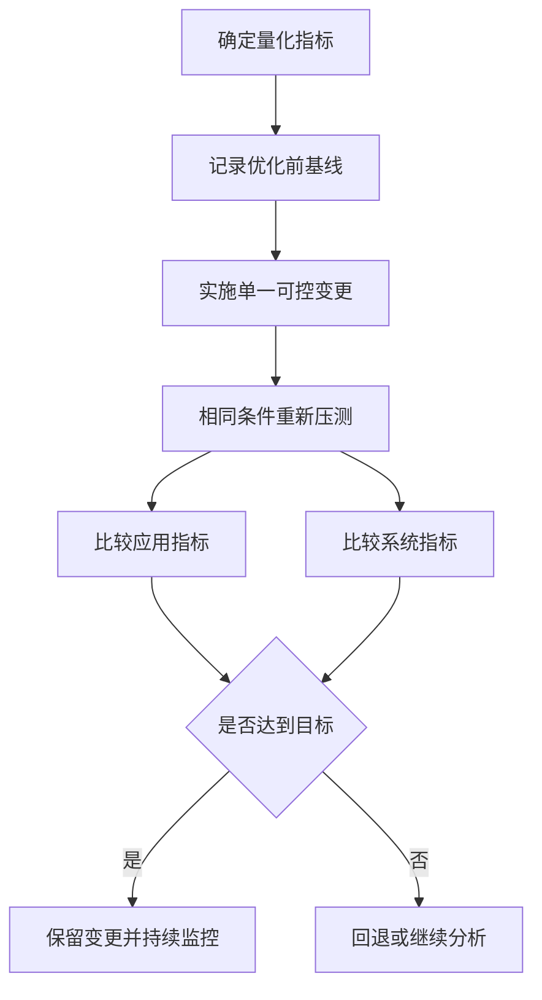

压测客户端与目标服务应尽量分离，避免压测工具抢占目标服务器资源。优化前后还必须保持机器规格、数据集、并发参数和外部依赖一致。

#### 应用层优化

| 方法 | 适用方向 | 注意事项 |
| --- | --- | --- |
| 删除无效工作 | 无意义循环、重复计算、调试代码 | 优先级最高，风险通常最低 |
| 编译器优化 | 本地编译型程序 | 评估 `-O2` 等选项对调试和行为的影响 |
| 算法优化 | 计算复杂度过高 | 优先优化热点路径，不要只看理论复杂度 |
| 异步处理 | 大量资源等待或轮询 | 关注队列堆积、超时和失败重试 |
| 多线程代替多进程 | 跨进程切换成本高 | 同步、锁竞争和线程数可能成为新瓶颈 |
| 缓存 | 重复访问或重复计算 | 处理一致性、失效和容量问题 |
| 批处理 | 高频小任务 | 会增加单批延迟，需要平衡吞吐与时延 |
| 减少锁竞争 | 多线程热点临界区 | 避免把锁拆得过细导致复杂度失控 |

应用优化首先关注热点路径。没有采样证据时，不要把时间花在极少执行的代码上。

#### 系统层优化

| 方法 | 作用 | 风险或前提 |
| --- | --- | --- |
| CPU 亲和性 | 减少跨 CPU 调度，提高缓存局部性 | 绑定不当会造成单核热点 |
| CPU 独占 | 为关键任务保留 CPU | 降低系统可共享的计算资源 |
| 调整 nice | 改变普通进程调度优先级 | 不能突破 CPU 总容量 |
| cgroups CPU 限制 | 防止单个服务耗尽 CPU | 限制过低会抬高业务延迟 |
| NUMA 优化 | 尽量访问本地内存 | 需要理解 CPU 和内存节点拓扑 |
| 中断负载均衡 | 分散硬中断和软中断压力 | 需结合网卡队列和应用绑核设计 |
| 减少线程数量 | 降低调度和切换开销 | 不能牺牲必要并发能力 |
| 升级 CPU 或扩容 | 增加总计算能力 | 应先确认瓶颈确实是 CPU 容量 |

常见命令示例：

```bash
# 查看进程允许使用的 CPU
taskset -cp <PID>

# 将进程绑定到 CPU 0 和 CPU 1
taskset -cp 0,1 <PID>

# 调低进程优先级
renice 10 -p <PID>

# 查看 NUMA 拓扑
numactl --hardware

# 查看中断亲和性
cat /proc/irq/<IRQ>/smp_affinity_list
```

不要孤立使用这些命令。比如绑核能提高缓存局部性，但也可能把应用线程、网络中断和内核线程挤到同一个 CPU 上，制造更严重的热点。

#### 如何选择优化顺序

当多个问题同时存在时：

1. 优先处理已经达到硬瓶颈的系统资源。
2. 优先处理对业务指标影响最大的问题。
3. 排除有因果关系的次生现象，避免重复优化。
4. 优先选择改动小、收益明确、容易回退的方案。
5. 每次尽量只改变一个主要变量，便于判断因果。

例如，系统态 CPU 和上下文切换同时升高时，大量线程竞争可能是根因，而系统态 CPU 高只是频繁调度的结果。此时应优先控制线程数量和调度竞争，而不是单独追求降低 `sy`。

#### 避免过早优化

优化会增加代码、配置和运维复杂度，还可能把瓶颈转移到内存、I/O 或网络。满足当前业务目标后，应停止无收益的极限调优，把剩余风险纳入监控。

CPU 优化的最终标准不是“CPU 使用率越低越好”，而是：

- 业务吞吐量和延迟达到目标；
- CPU 资源使用可解释且有合理余量；
- 没有把瓶颈转移成更严重的问题；
- 方案可维护、可观测、可回退。

## 第 2 章 · 内存性能分析与优化

### Linux 内存管理机制速览
<!-- src: sources/linux-performance/02-内存性能篇/15-基础篇-Linux内存是怎么工作的.md; sources/linux-performance/02-内存性能篇/22-答疑三-文件系统与磁盘的区别是什么.md -->

Linux 进程看到的不是物理内存，而是内核为它提供的独立虚拟地址空间。理解虚拟地址、页表、缺页异常、内存分配和回收之间的关系，是解释内存占用、Swap、OOM 和缓存行为的基础。

#### 虚拟内存如何映射到物理内存

每个进程都有独立且连续的虚拟地址空间。用户态只能访问用户空间，进入内核态后才能访问内核空间。不同进程的用户空间相互隔离，而内核空间最终关联到相同的内核物理内存。

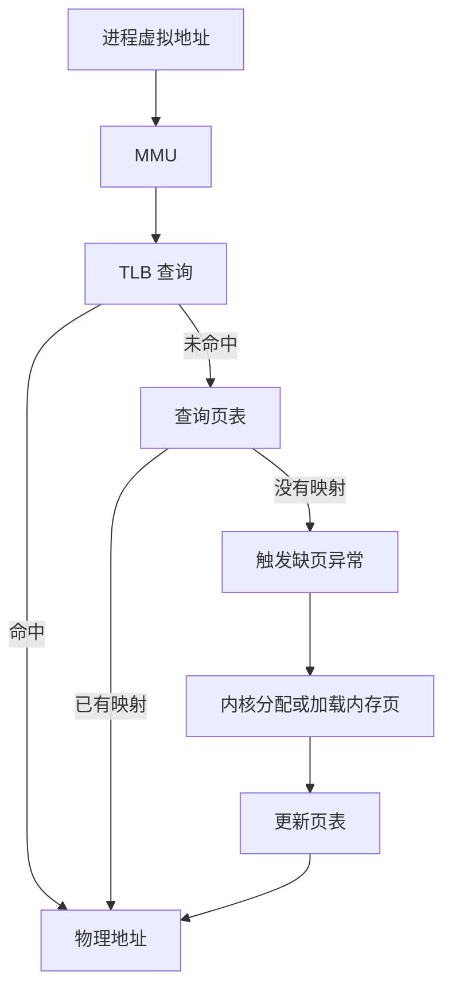

Linux 通常以页为最小映射单位，常见页大小为 4 KiB。页表记录虚拟页到物理页的映射，TLB 则缓存近期使用的页表项，减少地址转换开销。

频繁跨进程调度可能降低 TLB 和 CPU 缓存的局部性。大量内存访问型应用还可能使用 HugePage，常见大小为 2 MiB 或 1 GiB，以减少页表项数量和 TLB 压力。

查看页大小和大页配置：

```bash
getconf PAGE_SIZE
grep -E 'HugePages|Hugepagesize|AnonHugePages' /proc/meminfo
```

#### 进程虚拟地址空间

用户空间通常包含：

| 内存区域 | 典型内容 | 管理特点 |
| --- | --- | --- |
| 只读段 | 程序代码、常量 | 由程序映像确定 |
| 数据段 | 全局变量、静态变量 | 生命周期通常与进程一致 |
| 堆 | `malloc` 等动态分配 | 向高地址增长，由应用管理 |
| 文件映射段 | 动态库、共享内存、`mmap` 文件 | 由映射关系管理 |
| 栈 | 局部变量、调用帧 | 由线程和系统自动管理 |

查看进程内存映射：

```bash
pmap -x <PID>
cat /proc/<PID>/maps
cat /proc/<PID>/smaps
```

`maps` 适合看地址范围和映射对象，`smaps` 还提供 RSS、PSS、匿名页、共享页和 Swap 等详细数据。

#### 分配内存不等于立即占用物理内存

用户态程序调用 `malloc()` 后，分配器可能通过 `brk()` 扩展堆，或通过 `mmap()` 创建匿名映射。申请成功通常只代表获得虚拟地址空间，物理页往往在首次读写时通过缺页异常按需分配。

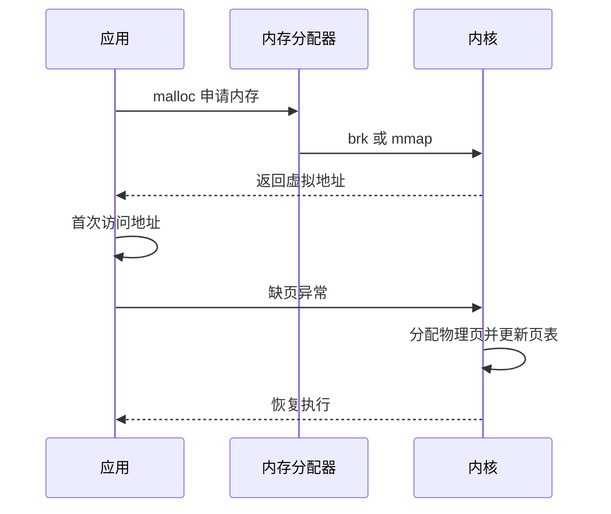

常见实现中，小块分配倾向复用堆中的内存，大块分配倾向使用 `mmap()`。具体阈值由内存分配器和运行环境决定，不能把固定的 128 KiB 当作所有系统的硬规则。

用户空间分配器负责小对象复用；内核则通过伙伴系统管理页，通过 Slab 或 SLUB 管理内核小对象。频繁分配和释放会产生缺页、锁竞争、碎片和元数据管理开销，因此高频路径常使用对象池或内存池。

#### 主缺页与次缺页

缺页异常不一定意味着磁盘 I/O。根据完成映射是否需要外部 I/O，可分为：

| 类型 | 英文 | 常见场景 | 主要成本 |
| --- | --- | --- | --- |
| 次缺页 | Minor Fault | 首次分配匿名页、写时复制、页已在缓存 | 页表和内存管理 |
| 主缺页 | Major Fault | 文件页不在缓存、换入 Swap 页 | 存储 I/O 和调度等待 |

进程首次写入 `malloc()` 返回的匿名地址，通常会产生次缺页。读取一个尚未进入页缓存的大文件，或访问已换出的匿名页，可能产生主缺页。

查看进程缺页速率：

```bash
pidstat -r -p <PID> 1
```

其中 `minflt/s` 和 `majflt/s` 分别表示次缺页和主缺页速率。还可以采集程序执行期间的总量：

```bash
perf stat -e page-faults,minor-faults,major-faults -- <COMMAND>
```

判断时注意：

- 次缺页很多不一定有问题，进程启动和大块匿名内存首次触碰都会产生；
- 主缺页会引入 I/O，但偶发主缺页也可能是正常按需加载；
- 主缺页与业务尾延迟同时上升，才值得继续检查文件访问和 Swap；
- 使用 HugePage、预热或内存池前，应先证明页表、TLB 或缺页确实是瓶颈。

#### Active 与 Inactive LRU

Linux 会根据页面访问情况维护活跃和非活跃集合，并区分匿名页与文件页：

```bash
grep -E '^(Active|Inactive|Unevictable)' /proc/meminfo
```

典型字段包括：

```text
Active(anon)
Inactive(anon)
Active(file)
Inactive(file)
Unevictable
```

可以把回收过程理解为：

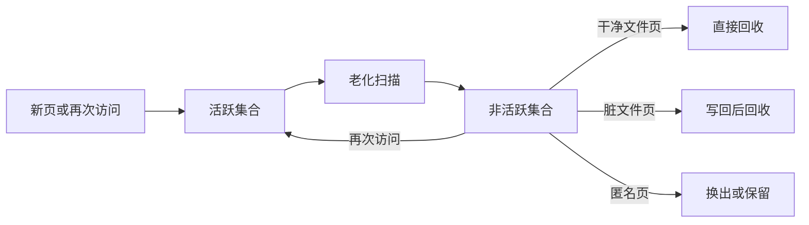

现代内核的具体回收实现会随版本演进，但运维判断仍应区分：

- 文件页可以在需要时从文件重新读取，干净页回收成本较低；
- 脏文件页必须先写回；
- 匿名页没有文件作为后备，通常需要 Swap 才能释放物理页；
- `Unevictable` 包含被锁定等不可回收页面；
- 回收扫描本身也消耗 CPU，直接回收还会阻塞申请内存的线程。

观察扫描、回收和换页增量：

```bash
grep -E 'pgscan|pgsteal|pgactivate|pgdeactivate|pswpin|pswpout' /proc/vmstat
```

`pgscan` 增长而 `pgsteal` 很少，说明扫描效率较低；业务线程直接回收时间增加时，即使还没有 OOM，也可能出现明显尾延迟。

#### 内存紧张时发生什么

当可用内存不足时，Linux 可能：

1. 回收可丢弃的文件页缓存；
2. 把脏页写回存储后再回收；
3. 把不活跃匿名页换出到 Swap；
4. 触发内存压缩或直接回收；
5. 无法满足分配时触发 OOM，选择进程终止。

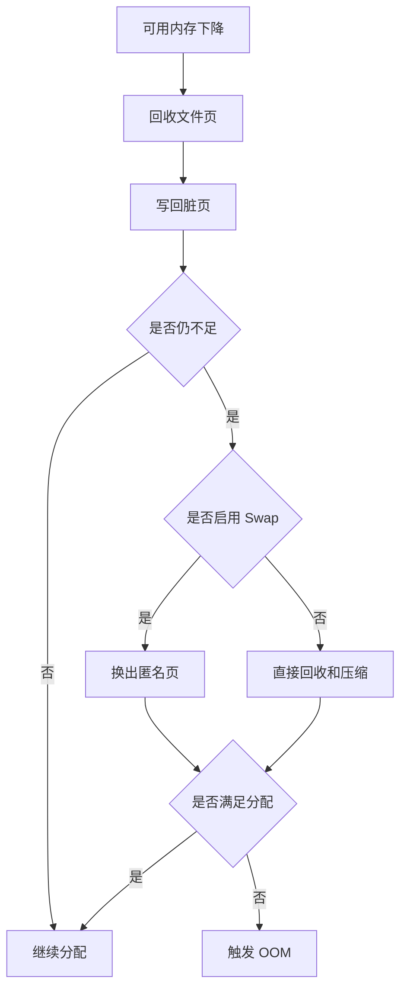

OOM 选择不应仅按进程 RSS 简单理解。查看相关值：

```bash
cat /proc/<PID>/oom_score
cat /proc/<PID>/oom_score_adj
```

现代系统通常通过 `oom_score_adj` 调整倾向，范围为 `-1000` 到 `1000`。`-1000` 可使进程尽量避免被 OOM 选择，但滥用会让系统失去可终止对象，因此只应保护真正关键的少量进程。

#### 虚拟内存承诺与 overcommit

虚拟地址申请成功，不代表系统已经为最坏情况保留了同等物理内存。Linux 使用 overcommit 策略决定是否接受新的虚拟内存承诺：

```bash
sysctl vm.overcommit_memory
sysctl vm.overcommit_ratio
grep -E 'CommitLimit|Committed_AS' /proc/meminfo
```

常见模式：

| `vm.overcommit_memory` | 含义 |
| --- | --- |
| `0` | 使用内核启发式策略判断 |
| `1` | 倾向允许分配，实际使用时再承担风险 |
| `2` | 按 commit limit 执行更严格的承诺检查 |

`Committed_AS` 是系统已经承诺的虚拟内存估算，`CommitLimit` 是严格模式下的承诺上限。二者不是当前 RSS，也不能直接替代 `available`。

```text
严格 overcommit 检查失败：
  内存申请可能直接返回失败

进程被 OOM 杀死：
  申请曾经成功
  页面实际触碰后物理内存和回收能力不足
```

因此，“OOM 按虚拟内存触发”是不准确的简化。OOM 的直接背景是某次内存分配在允许的回收、压缩和换页之后仍无法满足；虚拟内存承诺策略会影响分配是否提前失败，但不是唯一条件。

#### 区分全局 OOM 与 cgroup OOM

全局 OOM 表示主机级内存分配失败，通常能在内核日志中看到完整的内存状态和被终止进程：

```bash
journalctl -k | grep -i -E 'out of memory|oom-killer|killed process'
```

cgroup OOM 则可能发生在主机仍有大量可用内存时，因为容器或服务已经达到自身限制。cgroup v2 可检查：

```bash
cat /sys/fs/cgroup/<CGROUP>/memory.current
cat /sys/fs/cgroup/<CGROUP>/memory.high
cat /sys/fs/cgroup/<CGROUP>/memory.max
cat /sys/fs/cgroup/<CGROUP>/memory.events
```

`memory.events` 中常见计数：

- `high`：超过软限制并受到回收或节流；
- `max`：分配触及硬上限；
- `oom`：该 cgroup 进入 OOM 状态；
- `oom_kill`：有任务被 OOM killer 终止。

排查容器 OOM 时，必须同时保留容器状态、cgroup 限制与事件、进程工作集、内核日志和故障前峰值历史。

#### 读懂系统和进程内存指标

系统整体：

```bash
free -h
```

| 指标 | 含义 |
| --- | --- |
| `total` | 物理内存总量 |
| `used` | 按工具口径计算的已用内存 |
| `free` | 完全未使用的内存 |
| `shared` | 主要包括 tmpfs 等共享内存 |
| `buff/cache` | Buffer、页缓存和可回收 Slab 等 |
| `available` | 在不发生明显交换的情况下可供新应用使用的估算值 |

判断内存余量时，`available` 通常比 `free` 更重要。Linux 会主动用空闲内存做缓存，`free` 很低并不自动表示内存不足。

进程维度：

| 指标 | 含义 | 注意事项 |
| --- | --- | --- |
| `VIRT` 或 `VSZ` | 虚拟地址空间总量 | 包含未实际占用物理页的映射 |
| `RES` 或 `RSS` | 常驻物理内存 | 共享页会在多个进程中重复出现 |
| `SHR` | 可共享映射的近似值 | 不能简单相加计算系统总占用 |
| `PSS` | 按共享比例分摊后的物理内存 | 统计多进程总占用更合理 |
| `USS` | 进程独占的物理内存 | 进程退出后可直接释放的部分 |

对于单个进程，可优先使用汇总接口：

```bash
cat /proc/<PID>/smaps_rollup
```

统计一组工作进程的总物理占用时，直接累加 RSS 会重复计算共享库和共享内存；累加 PSS 更接近这组进程按比例分摊后的总成本。PSS 仍是采样时刻的统计值，容量规划要使用业务峰值和历史分位数，而不是只测空闲启动状态。

```bash
ps -eo pid,ppid,comm,vsz,rss,%mem --sort=-rss | head
top
```

---

### 区分 Buffer 与 Cache：内存都去哪了
<!-- src: sources/linux-performance/02-内存性能篇/16-基础篇-怎么理解内存中的Buffer和Cache.md -->

`free` 中的 `buff/cache` 不是“被浪费的内存”，而是 Linux 为减少慢速存储访问而主动使用的内存。理解 Buffer、页缓存和 Slab，能避免看到缓存增长就错误地清缓存或扩容。

#### 指标从哪里来

```bash
grep -E '^(Buffers|Cached|SReclaimable|SUnreclaim|Dirty|Writeback):' /proc/meminfo
```

主要指标：

| 指标 | 含义 |
| --- | --- |
| `Buffers` | 原始块设备元数据或块 I/O 相关缓冲 |
| `Cached` | 文件页缓存，不含 SwapCached |
| `SReclaimable` | 内存紧张时可回收的 Slab |
| `SUnreclaim` | 不能直接回收的 Slab |
| `Dirty` | 已修改但尚未写回存储的页 |
| `Writeback` | 正在写回存储的页 |

不同内核和工具版本对 `buff/cache` 的组合口径可能不同，应以本机 `man free` 和 `/proc/meminfo` 为准。

#### Buffer 与 Cache 的实用区别

课程实验可归纳为：

| 操作对象 | 读操作主要增长 | 写操作主要增长 |
| --- | --- | --- |
| 文件系统中的普通文件 | 页缓存 Cache | 页缓存和脏页 Cache |
| 原始块设备 | Buffer 或块层相关缓存 | Buffer 或块层相关缓存 |

因此，更实用的理解是：

- Cache 主要服务文件数据；
- Buffer 主要服务原始块设备和块层；
- 两者都可能参与读写，不能简化成“Buffer 只写、Cache 只读”。

普通文件写入时，应用通常先把数据写入页缓存，页面被标记为脏页，再由内核异步写回磁盘。这样能合并小写请求并让应用更快返回，但也意味着“`write()` 返回”不等于“数据已经持久化”。

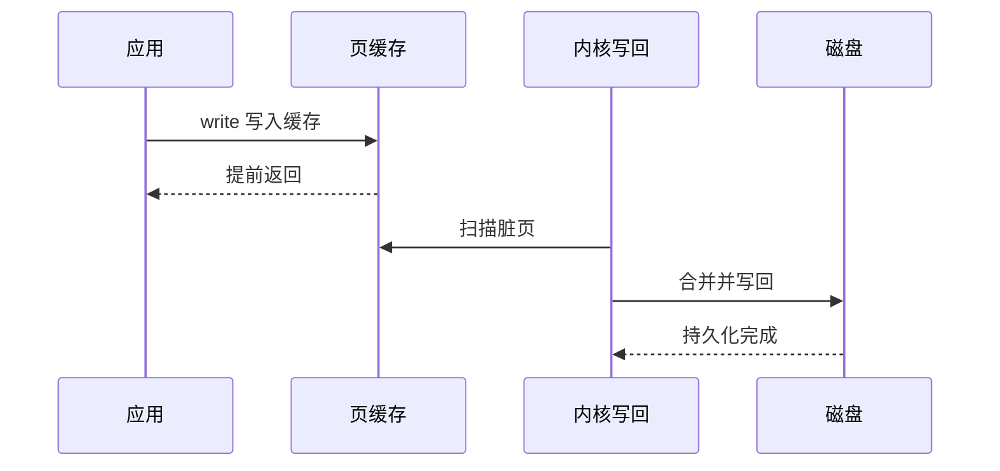

需要明确持久化边界时，应根据应用语义使用 `fsync()`、`fdatasync()` 或数据库自身的日志机制，而不是假设操作系统会立即落盘。

#### 动态观察缓存和 I/O

```bash
vmstat 1
```

重点字段：

| 字段 | 含义 |
| --- | --- |
| `buff` | Buffer 用量 |
| `cache` | 页缓存等用量 |
| `bi` | 从块设备读入 |
| `bo` | 写入块设备 |
| `wa` | I/O 等待 |

还可以使用：

```bash
watch -n 1 "grep -E '^(MemAvailable|Buffers|Cached|Dirty|Writeback):' /proc/meminfo"
```

排查缓存增长时，要同时看：

- `available` 是否持续下降；
- 缓存是否可回收；
- `Dirty` 和 `Writeback` 是否堆积；
- 磁盘吞吐、延迟和队列是否恶化；
- 增长是否与特定任务或文件访问同步。

#### 不要在生产环境随意 drop_caches

课程实验使用：

```bash
sync
echo 3 > /proc/sys/vm/drop_caches
```

这是为了构造冷缓存环境，不是常规优化手段。清缓存会让后续访问重新落到存储，可能造成延迟尖峰和 I/O 风暴。生产环境只有在明确实验目的、评估影响并获得变更许可后才应使用。

---

### 用好系统缓存提升程序效率
<!-- src: sources/linux-performance/02-内存性能篇/17-案例篇-如何利用系统缓存优化程序的运行效率.md -->

缓存是否有效，不能只看 Cache 占用大小。更关键的指标是缓存命中率，以及命中数据量是否与应用实际 I/O 规模一致。

#### 缓存命中率

```text
缓存命中率 = 缓存命中请求数 / 总请求数
```

命中率高通常意味着更少的磁盘访问，但仍需结合每次请求的数据大小、业务延迟和磁盘指标判断。大量微小请求的高命中率，未必能解释应用声称的大吞吐量。

课程使用 BCC 工具：

```bash
cachestat 1
cachetop
```

| 工具 | 用途 |
| --- | --- |
| `cachestat` | 查看系统级缓存命中、未命中和脏页趋势 |
| `cachetop` | 按进程查看缓存命中情况 |

BCC 工具的安装路径和命令名称因发行版而异，可能位于 `/usr/share/bcc/tools`，也可能带 `-bpfcc` 后缀。

查看指定文件有多少页在内存中，可使用 `pcstat` 或同类基于 `mincore` 的工具：

```bash
pcstat /path/to/file
```

#### 冷缓存与热缓存是不同测试

同一个文件第一次读取时需要访问磁盘，第二次读取可能全部命中页缓存。课程案例中，同一 512 MiB 文件：

- 冷缓存读取约为磁盘速度；
- 热缓存读取达到内存拷贝级速度；
- 第二次结果不能代表底层磁盘性能。

因此，性能测试前要先明确目标：

| 测试目标 | 缓存处理 |
| --- | --- |
| 用户真实体验 | 保留与生产一致的缓存状态 |
| 文件系统热读能力 | 预热缓存后测试 |
| 存储设备能力 | 使用直接 I/O 或超出内存的数据集 |
| 首次访问延迟 | 构造可控冷缓存环境 |

不要把热缓存的 `dd` 结果写成磁盘吞吐量。更适合存储基准的工具通常是 `fio`，并应明确 `direct`、队列深度、块大小、读写模式和工作集大小。

#### 判断应用是否绕过缓存

如果应用声称读取 32 MiB/s，但 `cachetop` 只观察到少量缓存页命中，可能存在直接 I/O。

```bash
strace -f -e trace=open,openat,read,pread64 -p <PID>
```

看到类似以下标志时，说明应用使用直接 I/O：

```text
openat(..., O_RDONLY|O_DIRECT) = 4
```

直接 I/O 绕过页缓存，适合数据库等自行管理缓存和 I/O 调度的应用，但普通顺序读场景可能因此失去系统缓存带来的性能收益。

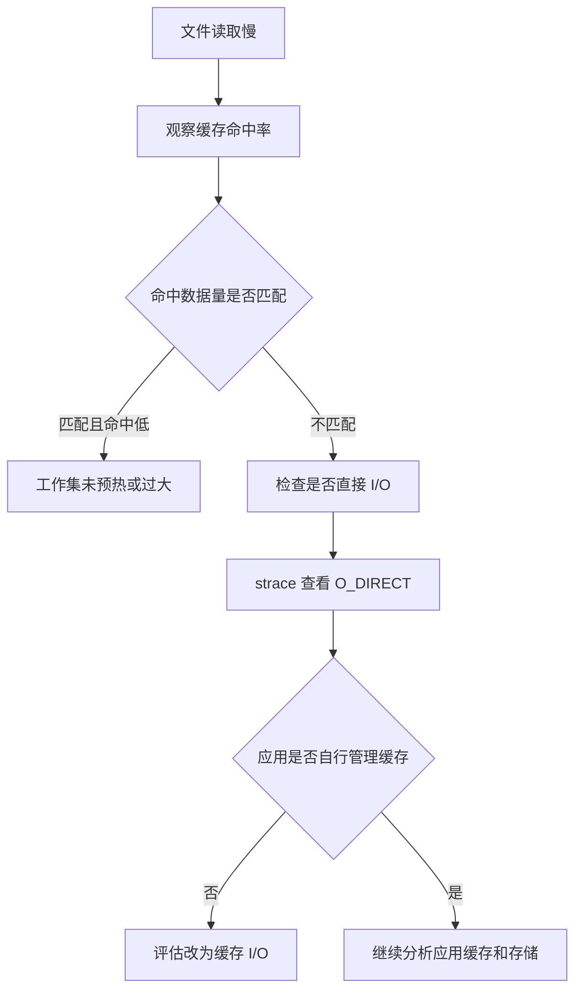

课程案例移除不必要的 `O_DIRECT` 后，读取 32 MiB 数据的耗时从约 0.9 秒降到约 0.03 秒。这里的结论不是“直接 I/O 一定差”，而是 I/O 模式必须与应用的缓存策略一致。

#### 应用层缓存仍然必要

操作系统页缓存的内容和生命周期由内核管理。需要精确控制热点数据、过期时间和跨主机共享时，还需要：

- 进程内缓存；
- 对象池；
- Redis 等外部缓存；
- 数据库 Buffer Pool；
- CDN 或反向代理缓存。

任何缓存都应监控命中率、容量、淘汰、穿透、失效延迟和数据一致性，不能只关注“是否用了缓存”。

---

### 内存泄漏的定位与处理
<!-- src: sources/linux-performance/02-内存性能篇/18-案例篇-内存泄漏了，我该如何定位和处理.md -->

内存泄漏是程序失去对已分配内存的有效引用，却没有将其归还分配器或内核。泄漏会逐步挤压可用内存，触发缓存回收、Swap、分配延迟甚至 OOM。

#### 先区分增长与泄漏

进程 RSS 增长不一定是泄漏，也可能是：

- 工作集正常扩大；
- 页缓存增长；
- 内存分配器保留空闲 Arena；
- 线程栈或连接数量增长；
- 内存映射文件增多；
- 应用主动缓存；
- 队列积压。

泄漏的典型特征是：业务负载稳定时，进程内存仍长期单向增长，且已完成请求对应的内存不能被复用或释放。

#### 从系统趋势定位责任进程

```bash
vmstat 3
pidstat -r 1
ps -eo pid,comm,rss,vsz,%mem --sort=-rss | head
```

如果 `free` 持续下降而 `buff/cache` 基本稳定，说明增长更可能来自进程匿名内存。找到目标进程后：

```bash
pmap -x <PID>
cat /proc/<PID>/status
cat /proc/<PID>/smaps_rollup
```

重点观察：

- `RssAnon`：匿名常驻内存；
- `RssFile`：文件映射常驻内存；
- `RssShmem`：共享内存；
- `VmSwap`：换出的虚拟内存；
- `Private_Dirty`：进程私有脏页。

#### 用分配调用栈确认泄漏

课程使用 BCC `memleak` 跟踪未释放分配：

```bash
memleak -p <PID>
```

其他常见工具：

```bash
valgrind --leak-check=full --show-leak-kinds=all ./app
```

生产环境更适合低开销采样、应用运行时 Profiling 或在预发布环境使用 Valgrind。工具能否解析符号取决于：

- 二进制是否保留符号；
- 调试信息是否可用；
- 容器内路径在宿主机是否可访问；
- 编译优化是否内联了关键函数；
- 调用栈展开信息是否完整。

容器场景中，宿主机追踪工具可能找不到容器内的二进制路径。需要在宿主机提供相同路径的二进制和符号，或进入目标命名空间运行工具。

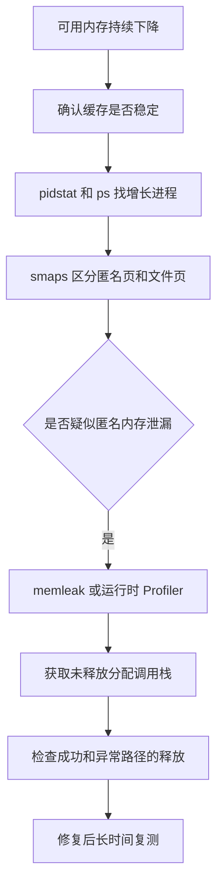

#### 修复必须覆盖所有所有权路径

课程案例中，函数通过 `calloc()` 返回内存，调用方使用后没有 `free()`。实际项目还应检查：

- 正常返回路径；
- 错误返回路径；
- 超时与取消路径；
- 多线程之间的所有权转移；
- 第三方库要求调用的释放函数；
- 容器、集合和回调中隐式持有的引用。

C 语言中可采用单一清理出口：

```c
int handle_request(void) {
    char *buffer = NULL;
    int rc = -1;

    buffer = malloc(4096);
    if (buffer == NULL) {
        goto out;
    }

    if (do_work(buffer) != 0) {
        goto out;
    }

    rc = 0;

out:
    free(buffer);
    return rc;
}
```

修复验证不能只看程序“不崩溃”。应在稳定负载下持续观察 RSS、匿名内存和未释放调用栈，确认内存曲线进入稳定区间。

---

### Swap 频繁使用的成因与排查
<!-- src: sources/linux-performance/02-内存性能篇/19-案例篇-为什么系统的Swap变高了上.md; sources/linux-performance/02-内存性能篇/20-案例篇-为什么系统的Swap变高了下.md -->

Swap 把不活跃匿名页写入磁盘，释放物理内存；进程再次访问时，再把页面从磁盘换回。它可以缓解内存不足，却会把内存访问变成慢得多的存储 I/O。

#### 文件页和匿名页的回收方式

| 页面类型 | 内容 | 内存紧张时的处理 |
| --- | --- | --- |
| 干净文件页 | 文件读取缓存 | 可直接丢弃，需要时从文件重读 |
| 脏文件页 | 尚未落盘的文件修改 | 先写回磁盘，再回收 |
| 匿名页 | 堆、栈等无文件后备的数据 | 需要 Swap 才能换出 |

```mermaid
graph TD
    A[内存回收] --> B[文件页]
    A --> C[匿名页]
    B --> D{是否脏页}
    D -->|否| E[直接丢弃]
    D -->|是| F[写回后回收]
    C --> G{是否启用 Swap}
    G -->|是| H[换出到磁盘]
    G -->|否| I[不能通过交换回收]
```

#### 内存水位与回收

内核按内存 Zone 维护 `min`、`low`、`high` 水位。可用页跌破 `low` 时，后台回收线程会工作，目标是把空闲页恢复到 `high` 附近；分配路径无法等待时还可能触发直接回收。

```bash
cat /proc/zoneinfo
sysctl vm.min_free_kbytes
```

`vm.min_free_kbytes` 影响系统保留的最低空闲内存，设置不当可能导致浪费或分配失败，不应作为普通调优旋钮随意修改。

NUMA 系统还要逐节点观察：

```bash
numactl --hardware
numastat
cat /proc/sys/vm/zone_reclaim_mode
```

全机 `available` 充足，不代表每个 NUMA Node 都充足。本地节点压力、内存绑定或回收策略可能导致远端访问、局部回收甚至 Swap。

#### 正确理解 swappiness

```bash
sysctl vm.swappiness
```

`swappiness` 表示回收匿名页相对于文件页的倾向，不是“内存使用到多少百分比开始 Swap”。值越高通常越积极考虑匿名页回收，值越低通常越偏向回收文件页。

即使设置为 0，也不能把它理解为绝对禁止 Swap。要完全禁止，需要关闭 Swap，但这会改变系统在突发内存压力下的失败模式，可能更早触发 OOM。

#### Swap 排查步骤

先确认空间和实时换页：

```bash
free -h
swapon --show
vmstat 1
sar -r -S -W 1
```

重点区分：

- Swap 已使用但 `si`、`so` 为 0：可能只是历史换出页面仍未被访问；
- `si` 持续升高：进程正在访问被换出的页，通常直接影响延迟；
- `so` 持续升高：系统仍在换出匿名页，内存压力尚未解除；
- `si`、`so` 同时活跃：可能发生严重的交换抖动。

查看回收和缺页：

```bash
grep -E 'pgscan|pgsteal|pswpin|pswpout|pgmajfault' /proc/vmstat
```

定位使用 Swap 的进程：

```bash
for status in /proc/[0-9]*/status; do
    awk '
        /^Name:/   { name=$2 }
        /^Pid:/    { pid=$2 }
        /^VmSwap:/ { swap=$2 }
        END {
            if (swap > 0) {
                printf "%10d kB  pid=%-8s %s\n", swap, pid, name
            }
        }
    ' "$status"
done | sort -nr | head
```

进一步查看目标进程：

```bash
grep -E '^(Name|VmRSS|VmSwap|RssAnon|RssFile):' /proc/<PID>/status
cat /proc/<PID>/smaps_rollup
```

课程案例中，大量块设备读取不断扩大 Buffer，空闲页跌破水位后，系统循环回收文件页和匿名页，导致 Swap 增长。这个案例说明：即使大部分内存看起来是可回收缓存，内核仍可能按回收策略换出一部分匿名页。

#### 降低 Swap 风险

常见方法：

- 修复泄漏、无界缓存和队列积压；
- 为工作集提供足够物理内存；
- 对延迟敏感系统评估关闭 Swap；
- 必须使用 Swap 时，基于压测调整 `swappiness`；
- 使用 cgroups 限制异常进程；
- 对少量关键内存使用 `mlock()` 或 `mlockall()`，并评估锁页上限；
- 监控 `si`、`so`、主缺页、回收和业务延迟，而不只监控 Swap 已用空间。

关闭和重新开启 Swap 会把页面读回内存，内存余量不足时可能触发 OOM，不能把 `swapoff -a && swapon -a` 当作无风险清理操作。

---

### 内存性能问题的快速定位流程
<!-- src: sources/linux-performance/02-内存性能篇/21-套路篇-如何快准狠找到系统内存的问题.md -->

内存排障应先区分“正常利用内存”和“真正的内存压力”，再判断问题来自进程匿名内存、文件缓存、Slab、缺页还是 Swap。

#### 核心指标与工具

| 指标 | 首选工具 |
| --- | --- |
| 总量、可用内存、缓存、Swap | `free`、`/proc/meminfo` |
| 动态内存、换入换出 | `vmstat`、`sar` |
| 进程 RSS、VSZ、缺页 | `top`、`ps`、`pidstat -r` |
| 进程地址空间、PSS、匿名页 | `pmap`、`smaps`、`smaps_rollup` |
| 页缓存命中 | `cachestat`、`cachetop` |
| 指定文件缓存 | `pcstat` |
| Slab | `slabtop`、`/proc/slabinfo` |
| 内存泄漏 | `memleak`、Valgrind、运行时 Profiler |
| Swap 进程 | `/proc/<PID>/status` |
| 内存水位与碎片 | `/proc/zoneinfo`、`/proc/buddyinfo` |

#### 三层排查法

第一层，确认系统整体：

```bash
free -h
top
```

优先看 `available`、Swap、业务是否已出现 OOM 或延迟，而不是只看 `free`。

第二层，观察趋势：

```bash
vmstat 1
sar -r -S -W 1
pidstat -r 1
```

确认内存是否持续增长、缓存是否增长、是否发生换入换出、哪个进程的 RSS 或缺页在变化。

第三层，专项定位：

```mermaid
graph TD
    A[内存告警或业务变慢] --> B[free 查看 available 和 Swap]
    B --> C[vmstat 和 sar 查看趋势]
    C --> D{主要现象}
    D -->|进程 RSS 增长| E[pidstat pmap smaps]
    D -->|缓存增长| F[cachetop slabtop pcstat]
    D -->|Swap 活跃| G[zoneinfo vmstat 进程 VmSwap]
    D -->|主缺页高| H[检查工作集和存储]
    E --> I{是否泄漏}
    I -->|是| J[memleak 或 Profiler]
    I -->|否| K[检查业务缓存和队列]
```

#### 常见现象的判断

| 现象 | 优先判断 |
| --- | --- |
| `free` 很低但 `available` 较高 | 大量可回收缓存，通常不代表压力 |
| `available` 持续下降 | 进程匿名内存、不可回收 Slab或工作集增长 |
| RSS 持续增长 | 泄漏、缓存、队列或分配器保留 |
| Cache 很大且命中率高 | 可能是有效缓存 |
| Cache 很大但磁盘仍繁忙 | 工作集过大、访问模式随机或直接 I/O |
| `SUnreclaim` 持续增长 | 内核对象泄漏或内核资源积压 |
| 主缺页和 `si` 高 | Swap 换入导致慢访问 |
| Swap 已用但无 `si`、`so` | 不一定正在造成性能问题 |
| OOM 日志出现 | 物理内存和回收路径已无法满足分配 |

查看 OOM 记录：

```bash
journalctl -k | grep -i -E 'out of memory|oom-killer|killed process'
```

#### 内存优化原则

1. 修复泄漏和无界增长。
2. 把真正的热点工作集留在内存中。
3. 减少高频动态分配，使用对象池、内存池或批量分配。
4. 根据场景使用页缓存、应用缓存或数据库缓存。
5. 通过 cgroups 设置边界，避免单服务拖垮主机。
6. 评估大页、NUMA 绑定和内存局部性。
7. 对延迟敏感应用减少主缺页和活跃交换。
8. 调整 OOM 保护时保留系统自救空间。

内存优化的目标不是让占用率最低，而是让工作集稳定、访问延迟可控、回收和交换可接受，并且在异常增长时有明确的隔离与失败边界。
