# Linux 性能优化学习笔记 · 第二册：I/O、网络与方法论

## 第 3 章 · 文件系统与磁盘 I/O 性能

### Linux 文件系统工作原理速览
<!-- src: sources/linux-performance/03-IO性能篇/23-基础篇-Linux文件系统是怎么工作的.md; sources/linux-performance/03-IO性能篇/32-答疑四-阻塞、非阻塞IO与同步、异步IO的区别和联系.md -->

文件系统把块设备上的持久化空间组织成文件和目录。Linux 通过 VFS 提供统一接口，使普通文件、目录、设备、管道和套接字都能通过相似的系统调用访问。

#### inode、dentry、数据块和超级块

| 结构 | 保存内容 | 主要位置 |
| --- | --- | --- |
| inode | 权限、大小、时间、数据块位置等元数据 | 持久化在文件系统并缓存在内存 |
| dentry | 文件名、父子目录关系和 inode 指针 | 主要是内核内存缓存 |
| 数据块 | 文件实际内容 | 存储设备 |
| 超级块 | 文件系统类型、容量和整体状态 | 持久化并缓存在内存 |

文件名不保存在 inode 中，而由目录项把名字映射到 inode。硬链接创建的是新的目录项，但多个名称指向同一个 inode。

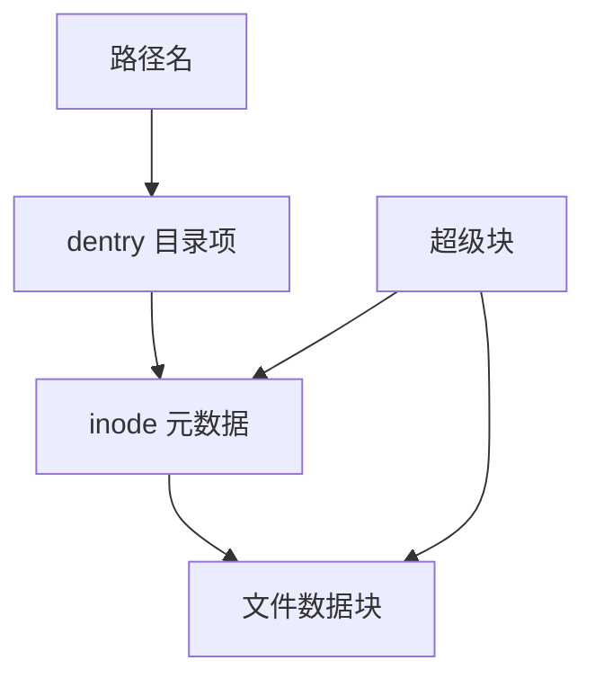

磁盘扇区常见为 512 B 或 4 KiB，文件系统则以逻辑块组织数据，常见块大小为 4 KiB。大量小文件不仅消耗数据空间，还会消耗 inode 和目录项缓存。

#### VFS 与存储路径

应用调用 `open()`、`read()`、`write()` 等接口后，内核经 VFS 找到具体文件系统，再通过页缓存、块层和设备驱动访问存储。

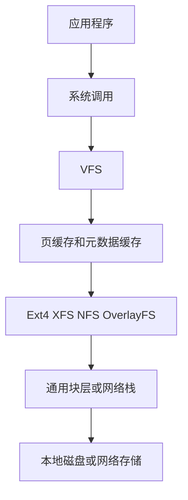

文件系统类型大致可分为：

- 本地磁盘文件系统，如 Ext4、XFS；
- 内存或伪文件系统，如 tmpfs、procfs、sysfs；
- 网络文件系统，如 NFS、SMB；
- 叠加文件系统，如容器常用的 OverlayFS。

查看挂载关系和参数：

```bash
findmnt
findmnt -T /path/to/file
mount
```

#### 文件 I/O 的多个维度

这些概念彼此独立，不能混为一谈：

| 维度 | 类型 | 区别 |
| --- | --- | --- |
| 标准库缓存 | 缓冲 I/O与非缓冲 I/O | 是否使用 `stdio` 等用户态缓存 |
| 页缓存 | 缓存 I/O与直接 I/O | 是否绕过内核页缓存 |
| 调用是否等待 | 阻塞与非阻塞 | 当前线程在暂不可用时是否睡眠 |
| 完成通知 | 同步与异步 | 提交后是否等待完成结果 |
| 持久化语义 | 普通写、`fsync`、`O_DSYNC`、`O_SYNC` | 返回时数据和元数据持久化到什么程度 |

`O_DIRECT` 只表示尽量绕过页缓存，不等于异步；`O_NONBLOCK` 也不等于异步 I/O。理解这些维度有助于解释为什么同样是 `write()`，延迟和持久化保证可能完全不同。

#### 阻塞与同步不是同一个维度

阻塞与非阻塞描述调用线程在资源暂不可用时是否等待；同步与异步描述 I/O 完成结果通过什么方式交给应用。可以用二维矩阵理解：

| 调用方式 | 同步完成语义 | 异步完成语义 |
| --- | --- | --- |
| 阻塞等待 | `read()` 等到数据可用并复制完成后返回 | 提交异步请求后调用等待接口阻塞到完成 |
| 非阻塞推进 | `read()` 暂不可用时返回 `EAGAIN`，应用稍后重试 | 提交后继续工作，完成事件到达后再取结果 |

最常见的四种场景：

1. 阻塞同步：线程调用阻塞套接字 `read()`，无数据时睡眠，有数据并复制后返回。
2. 非阻塞同步：套接字设置 `O_NONBLOCK`，`read()` 无数据时立即返回 `EAGAIN`。
3. 就绪驱动：`epoll` 通知描述符当前可读写，应用再执行非阻塞 `read()` 或 `write()`。
4. 完成驱动：Linux AIO 或 `io_uring` 提交请求，完成后通过完成队列返回结果。

第三种仍然主要是同步 I/O：`epoll` 只告诉应用“现在执行 I/O 大概率不会阻塞”，真正的数据复制和错误仍由随后执行的 `read()` 完成。

#### readiness 与 completion

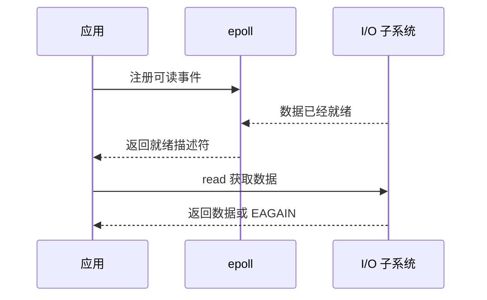

`epoll` 是 readiness notification。边缘触发模式下，应用通常要循环读取到 `EAGAIN`，否则可能遗留数据而收不到新的边缘事件。

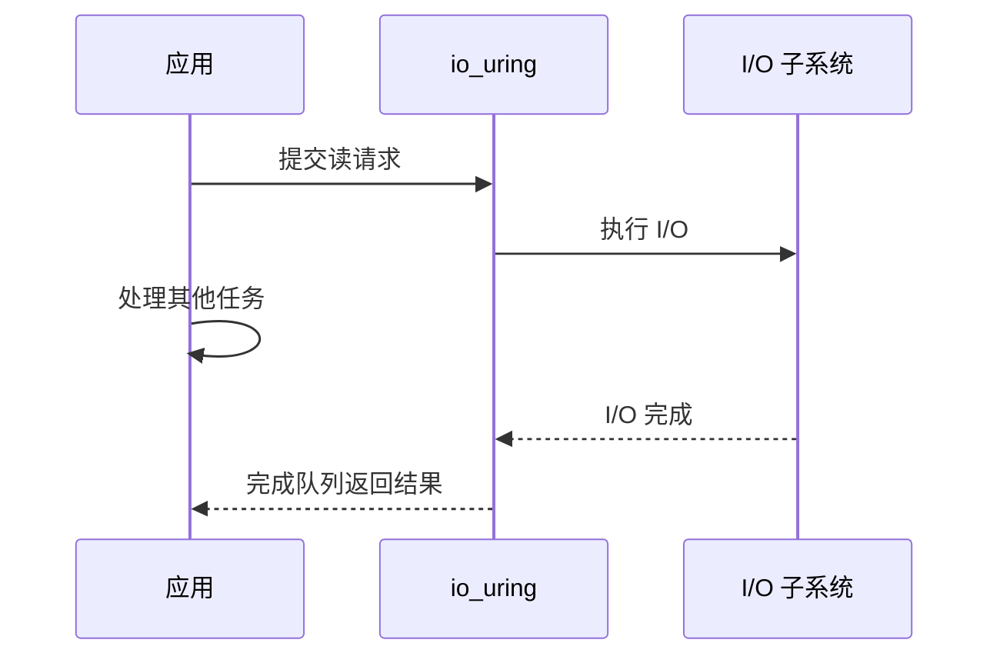

`io_uring` 使用提交队列和完成队列表达 completion notification。应用收到 CQE 时，请求已经完成，可以直接读取结果码和完成字节数。

概念伪代码：

```c
/* epoll: wait for readiness, then issue synchronous nonblocking I/O */
events = epoll_wait(epfd, ready, MAX_EVENTS, timeout);
for (int i = 0; i < events; i++) {
    while ((n = read(ready[i].fd, buf, sizeof(buf))) > 0) {
        consume(buf, n);
    }
    if (n < 0 && errno != EAGAIN) {
        handle_error(errno);
    }
}
```

```c
/* io_uring: submit work first, consume completion later */
prepare_read_sqe(ring, fd, buf, len, offset);
io_uring_submit(ring);
do_other_work();
io_uring_wait_cqe(ring, &cqe);
consume_result(cqe->res);
io_uring_cqe_seen(ring, cqe);
```

#### 不同文件类型的非阻塞语义

`O_NONBLOCK` 对套接字、管道、终端等流式对象很重要，但对本地普通文件通常不能提供应用期望的“磁盘未完成就返回 `EAGAIN`”语义。普通文件往往始终被轮询接口视为可读写，实际访问仍可能因缺页、回写或设备 I/O 产生延迟。

因此：

- 高并发网络服务常使用 `epoll` 加非阻塞套接字；
- 数据库和存储程序使用直接 I/O 时，可评估 Linux AIO 或 `io_uring`；
- 选择异步接口前，应确认文件系统、I/O engine 和操作类型是否真正支持异步执行；
- 队列深度增加会提高并行度，也可能放大排队和尾延迟；
- 异步 I/O 不等于持久化，完成写入后是否需要 `fsync` 取决于数据可靠性要求。

#### 容量问题要同时看块和 inode

```bash
df -h
df -i
```

磁盘块未满但 inode 用尽时，同样无法创建新文件。这常见于日志切片、缓存目录、邮件队列和海量小文件。

找出目录空间占用：

```bash
du -xhd1 /path | sort -h
```

找出小文件数量异常的目录时，应限制扫描范围，避免直接在繁忙根文件系统运行高成本的全盘 `find`。

#### 文件系统缓存

页缓存可从 `/proc/meminfo` 观察，inode 和 dentry 等 Slab 缓存可使用：

```bash
slabtop
grep -E 'dentry|inode' /proc/slabinfo
```

目录扫描、全盘查找和创建大量小文件都会扩大 dentry 与 inode 缓存。缓存可回收不代表永远无风险，若 `SUnreclaim`、目录项或 inode 缓存持续异常增长，仍需检查内核资源和工作负载。

---

### 磁盘 I/O 工作原理与关键指标
<!-- src: sources/linux-performance/03-IO性能篇/24-基础篇-Linux磁盘IO是怎么工作的上.md; sources/linux-performance/03-IO性能篇/25-基础篇-Linux磁盘IO是怎么工作的下.md -->

存储性能取决于介质、访问模式、队列、文件系统和应用 I/O 语义。仅看“磁盘速度”无法解释随机小 I/O、顺序大 I/O、同步写和并行异步 I/O 的巨大差异。

#### HDD、SSD 与访问模式

| 维度 | HDD | SSD 或 NVMe |
| --- | --- | --- |
| 主要延迟来源 | 寻道和旋转 | 闪存访问、控制器和垃圾回收 |
| 随机 I/O | 通常较差 | 明显更好但仍受写放大影响 |
| 顺序 I/O | 吞吐量较高 | 吞吐量很高 |
| 并行能力 | 相对有限 | 多队列和并行能力较强 |

顺序访问有利于请求合并和预读；随机小块访问更关注 IOPS 和延迟；顺序大块访问更关注吞吐量。

#### Linux 存储 I/O 栈

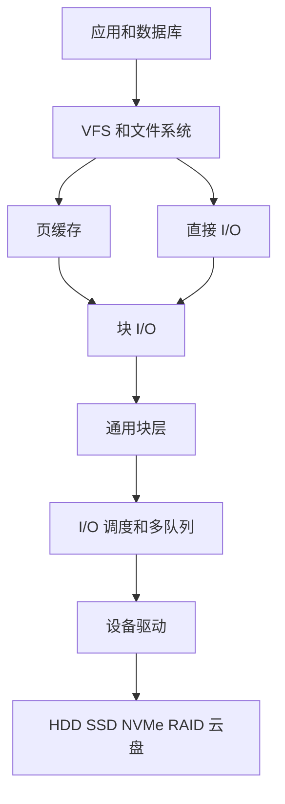

通用块层把文件系统请求转换为块 I/O，并完成排队、合并和调度。现代 Linux 通常使用 blk-mq 多队列框架，常见调度器包括：

| 调度器 | 典型目标 |
| --- | --- |
| `none` | 尽量减少主机调度开销，常见于高速设备或下层已有调度 |
| `mq-deadline` | 通过截止时间控制尾延迟和请求饥饿 |
| `bfq` | 强调带宽公平和交互延迟 |
| `kyber` | 通过令牌和延迟目标控制队列 |

课程中的 `NOOP`、`deadline` 和 `CFQ` 属于旧的单队列体系。实际机器以 sysfs 中可用项为准：

```bash
cat /sys/block/<DEVICE>/queue/scheduler
```

调度器选择依赖设备、虚拟化层和负载，不应机械地认为 SSD 必须使用某一个固定调度器。

#### 五个核心指标

| 指标 | 含义 | 分析重点 |
| --- | --- | --- |
| IOPS | 每秒完成的读写请求数 | 随机小 I/O 场景 |
| 吞吐量 | 每秒传输字节数 | 顺序大 I/O 场景 |
| 延迟 | 请求从提交到完成的时间 | 平均值和尾延迟 |
| 队列深度 | 等待和执行中的请求数量 | 是否发生排队 |
| 利用率 | 设备有 I/O 在处理的时间占比 | 结合并行能力判断 |

`%util` 接近 100% 对传统单队列设备是强烈信号，但对 NVMe、RAID、云盘等可并行设备，不一定表示所有硬件通道已经饱和。必须结合 `await`、队列深度、吞吐量、IOPS 和设备基线。

#### 用 iostat 观察设备

```bash
iostat -xz 1
```

常见字段：

| 字段 | 含义 |
| --- | --- |
| `r/s`、`w/s` | 每秒读写请求数 |
| `rkB/s`、`wkB/s` | 读写吞吐量 |
| `r_await`、`w_await` | 读写请求平均完成时间 |
| `aqu-sz` | 平均队列长度 |
| `rareq-sz`、`wareq-sz` | 平均请求大小 |
| `%rrqm`、`%wrqm` | 请求合并比例 |
| `%util` | 设备忙碌时间比例 |

第一次输出可能是开机以来的平均值，持续采样时优先分析后续区间数据。

#### 用进程工具关联责任主体

```bash
pidstat -d 1
iotop -oPa
```

`pidstat -d` 给出进程读写带宽和块 I/O 延迟；`iotop` 更适合按实时或累计 I/O 排序。进程发出的写入量与设备实际写入量可能不同，因为页缓存、请求合并、写回和文件系统日志会改变时序和数量。

#### 先建立设备基线

使用 `fio` 按实际负载构造基线：

```bash
fio --name=randread \
  --filename=/path/to/testfile \
  --size=4G \
  --rw=randread \
  --bs=4k \
  --ioengine=io_uring \
  --iodepth=32 \
  --direct=1 \
  --runtime=60 \
  --time_based \
  --group_reporting
```

写测试可能破坏数据或耗尽空间，必须使用专用测试文件、分区或磁盘。基线至少覆盖实际的块大小、读写比例、随机程度、队列深度、并发数和缓存模式。

---

### 揪出疯狂写磁盘的进程
<!-- src: sources/linux-performance/03-IO性能篇/26-案例篇-如何找出狂打日志的内鬼.md -->

大量日志会同时消耗 CPU、内存页缓存和磁盘 I/O。定位时不要从日志目录盲猜，而应从设备瓶颈逐层关联到进程、文件描述符和应用配置。

#### 从系统现象确认 I/O 瓶颈

```bash
top
iostat -xz 1
```

课程案例的典型特征：

- `iowait` 很高；
- 磁盘写吞吐量持续增大；
- 写延迟达到秒级；
- 队列长度很长；
- 设备 `%util` 接近 100%。

这些指标共同说明请求排队严重。只看 `iowait` 不够，因为 `iowait` 还受 CPU 调度和其他运行任务影响。

#### 定位写入进程

```bash
pidstat -d 1
iotop -oPa
```

找到高写入进程后，用系统调用观察写入模式：

```bash
strace -f -tt -T -e trace=open,openat,write,pwrite64,fsync,fdatasync -p <PID>
```

如果只看到文件描述符，可用：

```bash
lsof -p <PID>
readlink /proc/<PID>/fd/<FD>
```

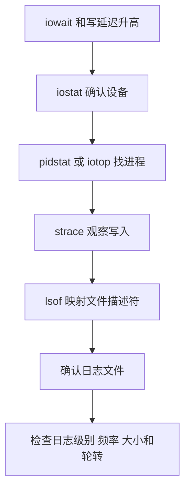

课程案例中，Python 进程每隔很短时间写入约 300 MiB 日志，导致设备排队和文件系统日志线程延迟。调高日志级别后，`iowait` 和磁盘利用率回落。

#### 日志优化清单

- 生产默认日志级别合理；
- 支持运行时动态调级并设置自动恢复；
- 对单条日志大小和每秒日志量设监控；
- 日志异步批量写入；
- 配置轮转、保留期和磁盘配额；
- 避免同步写每条日志；
- 将高流量日志与数据库数据隔离；
- 防止异常对象或请求体被完整重复打印；
- 建立日志丢弃或降级策略。

降低日志量可能减少排障信息，必须保留错误、审计和关键业务事件。正确做法是结构化、采样和分级，而不是简单关闭所有日志。

---

### 磁盘 I/O 延迟过高的排查
<!-- src: sources/linux-performance/03-IO性能篇/27-案例篇-为什么我的磁盘IO延迟很高.md -->

磁盘延迟高时，`strace` 不一定总能直接看到目标 `write()`。多线程、短时文件、工具过滤范围、容器命名空间和系统调用发生在其他线程，都可能让快照式跟踪漏掉关键行为。

#### 先建立责任链

```bash
top
iostat -xz 1
pidstat -d 1
```

先确认：

1. 是否确有设备延迟和队列问题；
2. 哪个设备异常；
3. 哪个进程的 I/O 与设备数据一致；
4. I/O 主要是读还是写。

#### strace 没结果怎么办

先检查是否跟踪了全部线程和正确系统调用：

```bash
strace -f -tt -T \
  -e trace=open,openat,close,read,pread64,write,pwrite64,fsync,fdatasync \
  -p <PID>
```

仍无结果时，使用内核动态追踪工具：

```bash
filetop
opensnoop
biosnoop
biotop
```

工具名称和参数因 BCC 或 bpftrace 版本不同而变化。

| 工具 | 回答的问题 |
| --- | --- |
| `filetop` | 哪个线程正在读写哪些文件名 |
| `opensnoop` | 哪个进程打开了什么路径 |
| `biosnoop` | 块 I/O 请求的设备、延迟和进程 |
| `biotop` | 按进程聚合块 I/O |

课程案例中，应用每个请求创建 1000 个临时文件，写入后重新读取，再删除目录。文件短时存在，普通文件检查容易错过；`filetop` 和 `opensnoop` 最终揭示了动态目录和文件路径。

#### 根因是算法还是磁盘

把中间数据写入大量临时文件，再读回内存，会产生：

- 文件创建和删除；
- inode 与 dentry 操作；
- 页缓存和脏页；
- 文件系统日志；
- 块设备写入和回读；
- 大量系统调用。

如果数据规模可控，直接在内存中处理通常更高效；规模过大时，可考虑流式处理、批量文件、数据库、对象存储或外部排序，而不是把每条数据拆成独立小文件。

课程案例改为内存处理后，响应时间从数分钟降到数秒。继续优化还应分析算法复杂度和数据结构，而不只是把存储介质从磁盘换成内存。

---

### 一条慢 SQL 背后的 I/O 问题
<!-- src: sources/linux-performance/03-IO性能篇/28-案例篇-一个SQL查询要15秒，这是怎么回事.md -->

数据库慢查询可能表现为 CPU 高，也可能表现为大量随机读、缓存未命中和高 `iowait`。系统工具负责定位到数据库进程和数据文件，数据库工具负责解释 SQL 执行计划。

#### 从设备定位到数据表

```bash
iostat -xz 1
pidstat -d 1
strace -f -tt -T -e trace=read,pread64 -p <MYSQL_PID>
lsof -p <MYSQL_PID>
```

课程案例中，`mysqld` 持续读取约 32 MiB/s，文件描述符对应 MyISAM 的 `products.MYD` 数据文件，由路径进一步确认数据库和表。

对现代数据库，不应依赖数据文件命名规则作为唯一证据。应同时使用数据库内部视图、慢查询日志和性能模式。

#### 用数据库工具验证执行计划

```sql
SHOW FULL PROCESSLIST;
EXPLAIN SELECT *
FROM products
WHERE productName = 'geektime';
```

需要关注：

| 字段 | 含义 |
| --- | --- |
| `type` | 访问类型，`ALL` 通常表示全表扫描 |
| `possible_keys` | 可能使用的索引 |
| `key` | 实际使用的索引 |
| `rows` | 预计扫描行数 |
| `Extra` | 过滤、排序、临时表等附加行为 |

课程案例对查询列建立索引后，响应从约 15 秒降到数毫秒。

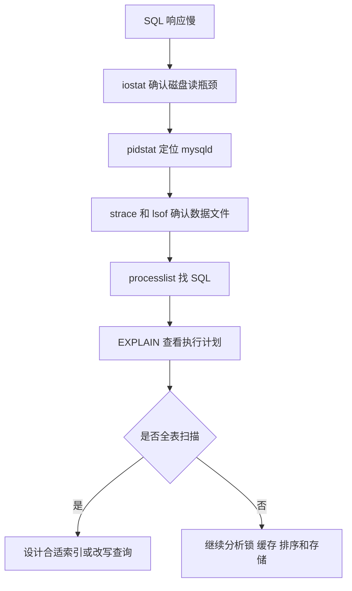

#### 系统缓存也会改变结果

案例中的干扰进程频繁执行 `drop_caches`，导致数据库依赖的页缓存不断失效。停止干扰后，即使没有索引，查询也从 15 秒降到约 0.1 秒；但建立索引仍然更快、更稳定。

这说明：

- 热缓存可以掩盖低效 SQL；
- 冷缓存能放大全表扫描成本；
- 不能把数据库性能完全建立在不可控的系统页缓存上；
- 正确索引比“祈祷缓存命中”更可靠；
- 测试时必须控制缓存状态和干扰负载。

索引会增加写放大、存储占用和维护成本。应根据选择性、查询频率和写入模式设计，不是索引越多越好。

---

### Redis 响应慢的 I/O 排查
<!-- src: sources/linux-performance/03-IO性能篇/29-案例篇-Redis响应严重延迟，如何解决.md -->

Redis 主要在内存中处理数据，但持久化、fork、AOF 重写和客户端错误用法都可能引发磁盘 I/O 和延迟。即使设备未饱和，频繁同步写仍会阻塞请求路径。

#### 发现“查询为何在写盘”

课程案例中，CPU、内存和磁盘利用率都没有明显达到极限，但查询接口很慢，而且存在持续磁盘写。

```bash
pidstat -d 1
strace -f -tt -T -e trace=write,fsync,fdatasync -p <REDIS_PID>
lsof -p <REDIS_PID>
```

结果显示 Redis 频繁写 `/data/appendonly.aof`，每次写后执行 `fdatasync()`。

检查配置：

```bash
redis-cli CONFIG GET appendonly
redis-cli CONFIG GET appendfsync
```

| `appendfsync` | 持久化语义 | 性能影响 |
| --- | --- | --- |
| `always` | 每次写命令同步 | 最保守，延迟和 IOPS 压力最大 |
| `everysec` | 通常每秒同步 | 性能和数据安全的常见折中 |
| `no` | 交给操作系统写回 | 性能较好但持久化窗口更大 |

选择必须基于业务可接受的数据丢失窗口，不能为了降低延迟直接关闭持久化。

#### 客户端也可能制造无意义写入

`strace` 还显示，每次 `GET` 返回匹配值后，客户端又发起 `SADD`，把查询中间结果写回 Redis。因为开启 AOF，这些临时写操作又变成磁盘同步。

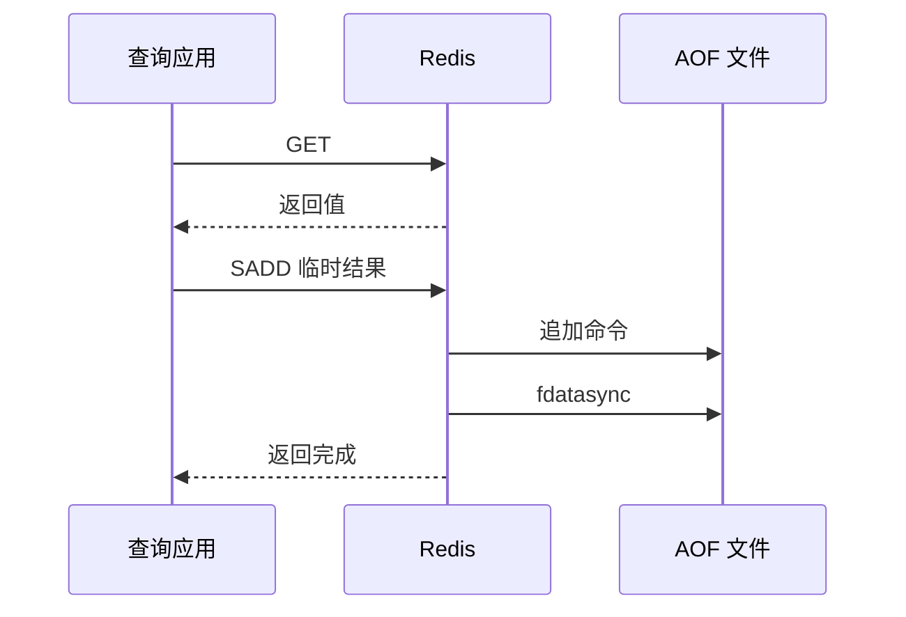

课程先把 `appendfsync` 从 `always` 改为 `everysec`，响应从约 10 秒降到约 0.9 秒；再移除查询路径中不必要的 Redis 临时写，降到约 0.2 秒。

#### Redis I/O 排查清单

- AOF 和 RDB 策略是否符合数据安全要求；
- `appendfsync` 是否过于激进；
- AOF 重写是否与业务高峰重叠；
- fork 时内存和 Copy-on-Write 是否造成压力；
- 慢命令和大 Key；
- 是否使用 `KEYS` 或大范围 `SCAN`；
- 客户端是否存在 N+1 请求；
- Pipeline 或 Lua 是否能减少网络往返；
- 临时结果是否应该保存在应用内存；
- 数据目录是否与其他高 I/O 服务共盘。

---

### I/O 性能问题的快速定位流程
<!-- src: sources/linux-performance/03-IO性能篇/30-套路篇-如何迅速分析出系统IO的瓶颈在哪里.md -->

I/O 排障的主线是：先确认设备是否异常，再关联责任进程，随后定位文件、块设备或网络存储，最后结合应用语义解释为什么会产生这些 I/O。

#### 文件系统与磁盘指标

| 层次 | 核心指标 |
| --- | --- |
| 文件系统容量 | 数据块、inode、挂载参数 |
| 文件系统缓存 | 页缓存、dentry、inode、Slab |
| 设备负载 | IOPS、吞吐量、延迟、队列、利用率 |
| 进程 I/O | 读写字节、取消写、I/O 延迟 |
| I/O 语义 | 顺序或随机、同步或异步、缓存或直接 |

#### 四步定位法

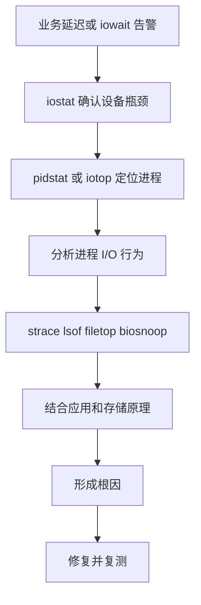

常用起手式：

```bash
iostat -xz 1
vmstat 1
pidstat -d 1
iotop -oPa
```

专项工具：

| 问题 | 工具 |
| --- | --- |
| 文件系统空间 | `df -h`、`du` |
| inode 用尽 | `df -i` |
| Slab 异常 | `slabtop` |
| 进程打开文件 | `lsof`、`/proc/<PID>/fd` |
| 系统调用 | `strace` |
| 短时打开文件 | `opensnoop` |
| 文件读写热点 | `filetop` |
| 块 I/O 延迟 | `biosnoop`、`biotop` |
| 块层完整事件 | `blktrace` |
| 网络文件系统 | 网络延迟、重传和服务端指标 |

#### 诊断时必须问的问题

1. 是读还是写？
2. 是随机还是顺序？
3. 平均请求多大？
4. 是否同步持久化？
5. 是否命中页缓存？
6. 哪个设备或远端存储？
7. 哪个进程、线程和文件？
8. I/O 是否是业务必需？
9. 是否有其他进程干扰？
10. 当前指标相对设备基线如何？

---

### 磁盘 I/O 性能优化的常用手段
<!-- src: sources/linux-performance/03-IO性能篇/31-套路篇-磁盘IO性能优化的几个思路.md -->

I/O 优化前要用与业务相近的负载建立基线。优化目标可能是更高 IOPS、更高吞吐量、更低尾延迟、更强持久化或更公平的资源分配，无法用单一指标概括。

#### 使用 fio 建立可比基线

```bash
fio --name=workload \
  --filename=/path/to/testfile \
  --size=8G \
  --rw=randrw \
  --rwmixread=70 \
  --bs=8k \
  --ioengine=io_uring \
  --iodepth=32 \
  --numjobs=4 \
  --direct=1 \
  --runtime=120 \
  --time_based \
  --group_reporting
```

重点查看：

- IOPS 和带宽；
- 平均延迟；
- P95、P99、P99.9 延迟；
- 队列深度；
- CPU 消耗；
- 测试期间的 `iostat` 设备表现。

测试裸盘写会破坏数据。生产设备不得直接运行破坏性基准。

#### 读懂 fio 报告

fio 报告中最容易混淆的是三种延迟：

| 指标 | 含义 | 异常时优先检查 |
| --- | --- | --- |
| `slat` | 从 fio 创建请求到请求提交的时间 | CPU、内存、锁、提交路径 |
| `clat` | 请求提交到完成的时间 | 设备、文件系统、队列 |
| `lat` | 请求创建到完成的总时间 | 近似为 `slat + clat` |

示例摘要：

```text
read: IOPS=4257, BW=16.6MiB/s
slat (usec): avg=4.29
clat (usec): avg=15024.30
lat  (usec): avg=15029.12
clat percentiles (usec):
  50.00th=2540
  95.00th=45876
  99.00th=46924
  99.99th=404751
```

这个结果不能只总结为“平均延迟 15 ms”。P50 约为 2.5 ms，而 P99.99 超过 400 ms，说明存在明显长尾。若业务是同步请求，长尾可能直接转化为接口超时。

同时检查：

- `IOPS` 是否符合块大小和设备能力；
- `BW` 是否接近链路或云盘吞吐上限；
- `io` 总量是否达到预期；
- `IO depths` 是否真的维持目标队列深度；
- `issued` 中是否有 short 或 dropped；
- CPU 的 `usr`、`sys` 和上下文切换是否异常；
- `Disk stats` 的利用率是否接近饱和；
- 测试期间 `iostat -xz 1` 的 `await` 和队列是否同步升高。

IOPS 与带宽的近似关系：

```text
带宽 ≈ IOPS × 单次 I/O 大小
```

例如 4 KiB 随机读达到 100000 IOPS，数据吞吐约为 390 MiB/s。若换成 1 MiB 顺序读，设备通常先达到吞吐上限而不是 IOPS 上限。

#### 判断瓶颈位于哪里

| fio 表现 | 可能方向 |
| --- | --- |
| `slat` 高，`clat` 正常 | 提交线程、CPU、内存或同步开销 |
| `clat` 随队列深度快速升高 | 设备或后端已经饱和 |
| IOPS 不升，CPU 单核打满 | I/O engine 或提交路径受 CPU 限制 |
| 带宽达到固定上限 | 设备、控制器、云盘或网络存储限速 |
| P99 波动但平均值稳定 | 写回、GC、共享设备干扰或固件行为 |
| direct 模式快，缓存模式抖动 | 页缓存、脏页回写或内存回收 |

逐级改变队列深度比只测一个参数更有意义：

```bash
for depth in 1 2 4 8 16 32 64; do
  fio --name=depth-"$depth" \
    --filename=/path/to/testfile \
    --rw=randread \
    --bs=4k \
    --ioengine=io_uring \
    --iodepth="$depth" \
    --direct=1 \
    --runtime=60 \
    --time_based \
    --output="fio-depth-${depth}.json" \
    --output-format=json
done
```

把 IOPS、P99 与队列深度画在同一张图上。吞吐停止增长而延迟继续上升的位置，就是不应继续加深队列的重要信号。

#### 让基准更接近生产负载

合成负载至少要匹配：

- 顺序或随机比例；
- 读写比例；
- 块大小分布；
- 并发任务数和队列深度；
- direct 或 page cache；
- `fsync` 频率；
- 文件数量和工作集大小；
- 稳态运行时间。

如果能在受控环境运行 fio，可记录其 I/O 日志：

```bash
fio --name=capture \
  --filename=/path/to/testfile \
  --rw=randrw \
  --write_iolog=workload.iolog \
  --runtime=60 \
  --time_based
```

在隔离测试环境重放：

```bash
fio --name=replay \
  --filename=/path/to/clone \
  --read_iolog=workload.iolog \
  --replay_redirect=/path/to/clone
```

对于无法改造的生产应用，可在严格控制开销的前提下，用 `blktrace` 记录块设备请求，再转换为 fio 可重放的日志：

```bash
blktrace -d /dev/<DEVICE> -o trace
blkparse -i trace -d trace.bin
fio --name=replay --filename=/dev/<TEST_DEVICE> --read_iolog=trace.bin
```

重放必须使用数据副本或专用测试设备。原始 trace 可能包含真实 LBA、写操作和业务访问模式，直接在生产盘或未清理的目标盘重放会破坏数据。

重放也不是完美复制：它无法自动还原应用思考时间、页缓存状态、文件系统元数据、数据库锁和网络依赖。最终仍要用业务压测验证优化效果。

#### 应用层优化

- 用顺序或追加写代替随机写；
- 合并小请求，使用批量 I/O；
- 充分利用页缓存或设计应用缓存；
- 高频相同区域访问可评估 `mmap`；
- 避免每个请求执行 `fsync`；
- 使用异步 I/O 和合理队列深度；
- 减少临时文件和重复序列化；
- 优化数据库索引和访问路径；
- 使用 cgroups v2 `io` 控制器限制异常服务；
- 降低网络存储往返和小请求数量。

#### 文件系统层优化

- 根据负载和运维能力选择 Ext4、XFS 等文件系统；
- 评估 `noatime` 等挂载参数；
- 合理设置日志和持久化模式；
- 控制脏页比例和写回节奏；
- 调整 `vfs_cache_pressure` 前先确认元数据缓存问题；
- 不需要持久化的数据可考虑 tmpfs；
- 避免目录中过量小文件；
- 为数据库、日志和临时数据设计合理目录与卷布局。

脏页参数会影响吞吐和延迟。积累更多脏页可提高批量写吞吐，但也会放大写回尖峰和数据风险。

#### 设备和架构层优化

- 使用更快的 SSD 或 NVMe；
- 使用 RAID 提高性能或可靠性；
- 将数据库、日志和备份分离到不同设备；
- 调整预读以匹配顺序访问；
- 选择适合设备与负载的 I/O 调度器；
- 为云盘配置足够 IOPS 和吞吐量；
- 检查多路径、控制器和队列；
- 监控 SMART、内核错误和设备超时；
- 扩容前确认瓶颈不在应用算法或同步策略。

查看硬件和内核错误：

```bash
dmesg -T | grep -i -E 'error|timeout|reset|I/O'
smartctl -a /dev/<DEVICE>
```

#### 优化的正确顺序

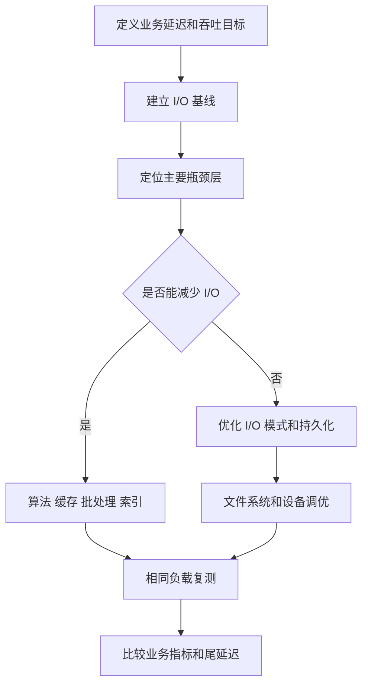

减少不必要的 I/O 往往比调内核参数收益更大。只有在应用 I/O 合理、瓶颈确实位于文件系统或设备层时，系统参数和硬件升级才是主要手段。

## 第 4 章 · 网络性能分析与优化

### Linux 网络基础：协议栈与收发流程
<!-- src: sources/linux-performance/04-网络性能篇/33-关于Linux网络，你必须知道这些上.md; sources/linux-performance/04-网络性能篇/34-关于Linux网络，你必须知道这些下.md; sources/linux-performance/04-网络性能篇/45-答疑五-网络收发过程中，缓冲区位置在哪里.md -->

网络性能问题经常同时表现为延迟升高、吞吐下降、连接失败和 CPU 使用率上升。排查前必须先理解数据包经过了哪些层，以及每一层有哪些队列、缓存和统计指标。

#### 从 TCP/IP 模型理解网络栈

Linux 网络通常按四层 TCP/IP 模型理解：

| 层级 | 典型协议 | Linux 中的主要职责 |
|---|---|---|
| 应用层 | HTTP、DNS、RPC | 请求编解码、业务处理、连接复用 |
| 传输层 | TCP、UDP | 连接、可靠传输、流量控制、拥塞控制 |
| 网络层 | IP、ICMP | 寻址、路由、分片、转发 |
| 网络接口层 | Ethernet、ARP | 帧封装、邻居解析、网卡收发 |

发送数据时，各层依次增加协议头；接收数据时，各层反向解析并去掉协议头。应用看到的响应时间，是应用处理、协议栈处理、排队和链路传输时间的总和。


#### 接收数据的关键路径

典型接收流程如下：

1. 网卡收到网络帧，通过 DMA 写入内存中的接收环形队列。
2. 网卡触发硬中断，驱动安排 NAPI 轮询或软中断处理。
3. 内核构造或关联 `sk_buff`，进入链路层和 IP 层处理。
4. TCP 或 UDP 根据四元组找到对应套接字。
5. 数据进入套接字接收缓冲区。
6. 应用通过 `read`、`recv` 等系统调用取走数据。

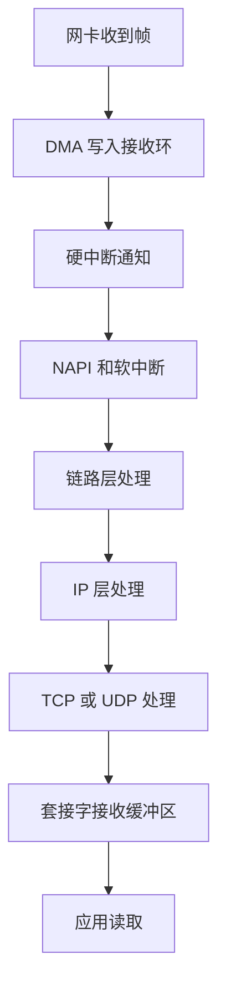

高包速场景下，瓶颈可能不在带宽，而在网卡队列、中断、软中断、协议栈或应用取包速度。接收缓冲区满时，后续数据可能被丢弃，TCP 还会引发重传和吞吐下降。

#### 发送数据的关键路径

发送路径大致相反：

1. 应用调用 `write` 或 `send`。
2. 数据复制或映射到套接字发送缓冲区。
3. TCP 或 UDP、IP 和链路层完成封装。
4. 数据经过流量控制队列和网卡驱动。
5. 网卡通过 DMA 读取发送描述符并发出数据。
6. 发送完成后，硬中断或轮询回收描述符。

发送缓冲区堆积通常说明应用产生数据的速度超过网络实际发送速度，也可能是对端接收窗口过小、拥塞控制收缩、链路丢包或设备队列拥堵。

#### 收发路径中的三层缓冲区

“网络缓冲区”不是一个单独的区域。一次收包通常会经过网卡队列、协议栈包对象和套接字缓冲区，它们的所有者、生命周期和观测方法都不同。

| 层次 | 典型对象 | 所在位置 | 主要作用 |
|---|---|---|---|
| 网卡收发环 | RX/TX descriptor ring | 驱动管理的主机内存和设备可访问 DMA 区域 | 在网卡与驱动之间传递描述符 |
| 协议栈包对象 | `sk_buff` | 内核内存 | 保存包元数据并关联数据区 |
| 套接字缓冲区 | receive/send queue | 每个 socket 对应的内核内存 | 在协议栈与应用之间排队 |
| 应用缓冲区 | 用户态数组或对象 | 进程虚拟地址空间 | 应用读取和组织业务数据 |

网卡可能有自己的片上缓存，但 Linux 中常说的 RX/TX ring 通常是驱动配置、网卡可通过 DMA 访问的主机内存队列。ring 中主要是描述符，不应简单理解为一块无限扩大的包缓存。

`sk_buff` 是 Linux 网络栈的核心包描述对象。它保存协议头位置、长度、路由、校验和和设备等元数据，并指向实际数据区。数据经过不同协议层时，内核通常移动指针、修改元数据或克隆引用，不会在每一层都完整复制一次。

套接字接收缓冲区保存已经通过协议处理、等待应用读取的数据；发送缓冲区保存应用已经提交、但尚未完成发送或确认的数据。它们属于内核内存，不计入进程 RSS，却会随着连接数和排队数据量增长。

`sk_buff`、socket、conntrack 等对象还会使用 Slab 分配器。因此，网络流量导致内核内存增长时，不能只看进程内存：

```bash
ethtool -g eth0
ethtool -S eth0
ss -m
cat /proc/net/sockstat
cat /proc/net/sockstat6
slabtop
```

重点解释：

- `ethtool -g` 查看网卡 ring 的当前值和硬件允许的最大值；
- `ethtool -S` 查看驱动级丢包、队列和错误计数；
- `ss -m` 查看单个套接字的接收、发送、转发和内存占用；
- `/proc/net/sockstat` 汇总 socket 数量与 TCP 内存页；
- `slabtop` 用于确认 `skbuff_head_cache`、`TCP` 和 conntrack 相关 Slab 是否异常增长。

扩大 ring 可以吸收短时突发，但会增加排队时间和内存占用。扩大套接字缓冲区能改善高带宽时延积链路的吞吐，也可能掩盖应用读取不及时并放大尾延迟。调优前必须先找出真正发生丢包或排队的层次。

#### 谁在执行网络协议栈

网络协议栈并非只由 `ksoftirqd` 执行。接收和发送路径会跨越多个执行上下文：

| 执行上下文 | 主要工作 | 典型现象 |
|---|---|---|
| 硬中断 | 确认设备事件并安排后续处理 | `/proc/interrupts` 中网卡 IRQ 增长 |
| NAPI 与软中断 | 批量收包并运行协议栈接收路径 | `NET_RX` softirq 增长 |
| 当前进程上下文 | 执行 `send`、`recv` 和部分协议处理 | 应用 CPU 时间增加 |
| `ksoftirqd` | 软中断积压时延后处理 | 某个 `ksoftirqd/N` CPU 很高 |
| 定时器与工作队列 | 重传、邻居维护和延后任务 | 定时器或内核线程活动增加 |

典型协作关系如下：

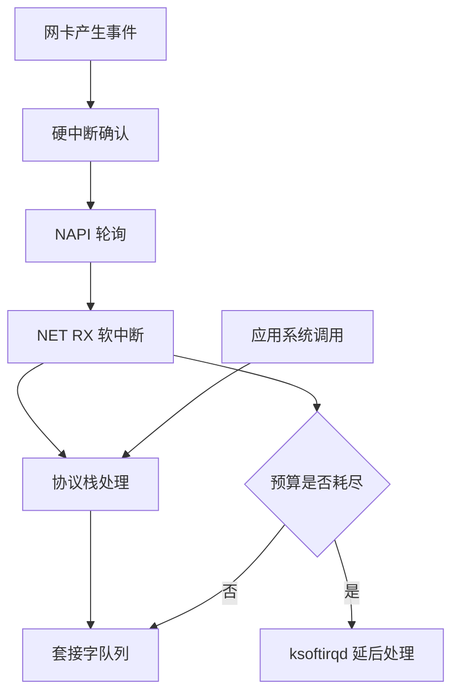

在负载较轻时，软中断可能在中断返回路径或当前 CPU 上直接完成；只有积压、预算耗尽或需要延后时，才会明显看到 `ksoftirqd`。因此，`ksoftirqd` 不高不能证明协议栈没有消耗 CPU，`ksoftirqd` 很高也只是提示该 CPU 的软中断处理出现压力。

联合观察：

```bash
watch -n 1 'grep -E "NET_RX|NET_TX" /proc/softirqs'
mpstat -P ALL 1
sar -n DEV 1
cat /proc/interrupts
cat /proc/net/softnet_stat
```

若某个 CPU 的 `NET_RX`、网卡 IRQ 和软中断时间同时偏高，应继续检查 RSS 队列、中断亲和性、RPS/RFS 和应用连接分布，而不是直接增加 socket 缓冲区。

#### 先掌握六类核心指标

| 指标 | 回答的问题 |
|---|---|
| 带宽 | 链路理论上每秒能传输多少比特 |
| 吞吐量 | 实际每秒传输了多少有效数据 |
| PPS | 每秒处理多少个网络包 |
| 延迟 | 单次或端到端请求需要多长时间 |
| 丢包与重传 | 链路或协议栈是否在丢失数据 |
| 连接数 | 当前和单位时间内承载多少连接 |

小包业务可能先耗尽 PPS 和 CPU，大包业务更容易接近带宽上限。因此，只看 `MB/s` 无法解释所有网络瓶颈。

#### 基础观测命令

查看接口地址、状态和累计统计：

```bash
ip addr
ip -s link
```

重点关注：

- `errors`：校验、帧、驱动或设备错误；
- `dropped`：协议栈、队列或设备来不及处理；
- `overrun`：接收速度超过缓冲或处理能力；
- 接收和发送的包数、字节数是否符合预期。

查看实时接口吞吐和包速：

```bash
sar -n DEV 1
```

查看套接字和协议统计：

```bash
ss -s
ss -lntp
ss -antpi
nstat
```

对已建立连接，`Recv-Q` 持续增长意味着应用读取不及时；`Send-Q` 持续增长意味着数据尚未被对端确认或无法及时发送。监听套接字的队列含义不同，要结合 `ss -lnt` 的监听状态判断接受队列是否接近上限。

### 从 C10K 到 C1000K：高并发模型的演进
<!-- src: sources/linux-performance/04-网络性能篇/35-基础篇-C10K和C1000K回顾.md -->

C10K 指单机同时处理一万个连接的问题。困难不只是连接数量，而是传统“一连接一进程”或“一连接一线程”模型带来的上下文切换、栈内存和调度开销。

#### I/O 模型的演进

| 模型 | 特征 | 主要限制 |
|---|---|---|
| 阻塞 I/O | 每个执行单元等待一个连接 | 线程和切换成本高 |
| `select` | 单线程监控多个文件描述符 | 集合大小和线性扫描成本 |
| `poll` | 用数组管理文件描述符 | 每次仍需遍历全部描述符 |
| `epoll` | 只返回就绪事件 | 更适合大量长连接 |

`epoll` 常见两种触发模式：

- 水平触发：只要描述符仍可读写，就持续通知，编程简单；
- 边缘触发：状态发生变化时通知，通常配合非阻塞 I/O，并持续读写到 `EAGAIN`。

边缘触发不天然比水平触发快。若事件循环、缓冲区处理或错误处理不正确，反而会造成连接卡死和饥饿。

#### 常见高并发架构

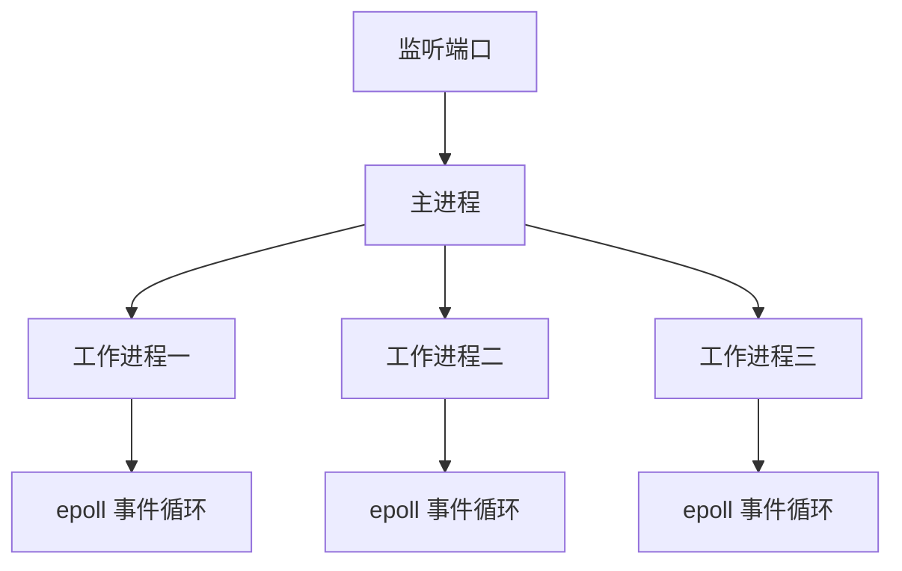

常见设计包括：

- 主进程监听，多个工作进程处理连接；
- 多进程共享监听套接字；
- 使用 `SO_REUSEPORT` 让每个工作进程拥有独立监听队列；
- 事件循环负责网络 I/O，独立线程池负责阻塞任务；
- 使用连接池、异步调用和批处理降低下游等待。

#### C1000K 的资源约束

百万连接会放大每个连接的固定成本。需要系统检查：

- 文件描述符上限；
- 每连接套接字缓冲区和应用对象内存；
- TCP 连接状态和定时器开销；
- `conntrack` 表容量；
- 监听队列和接受队列；
- 临时端口范围；
- 网卡多队列、中断和软中断分布；
- 带宽、PPS 与 CPU 是否匹配；
- 应用事件循环中是否存在阻塞操作。

查看进程和系统文件描述符限制：

```bash
ulimit -n
cat /proc/sys/fs/file-max
cat /proc/<PID>/limits
```

查看连接状态分布：

```bash
ss -ant | awk 'NR>1 {count[$1]++} END {for (s in count) print s, count[s]}'
```

#### 五元组与 65535 端口误区

一条 TCP 连接由五元组标识：

```text
协议 源 IP 源端口 目标 IP 目标端口
```

服务端可以在一个固定监听端口上接收大量连接，因为不同客户端的源 IP 和源端口会生成不同五元组。因此，“TCP 端口只有 65535 个”不等于“一台服务器最多只能建立 65535 条连接”。

主动发起连接的一端通常由内核分配临时端口。它能向同一个目标 IP 和目标端口建立的并发连接数量，会受到本地 IP、临时端口范围、仍占用端口的连接状态以及内核复用规则限制：

```bash
sysctl net.ipv4.ip_local_port_range
ss -s
ss -ant state time-wait
```

例如临时端口范围为 `32768 60999` 时，单个本地 IP 对同一目标五元组组合可用的端口空间远小于 65535。增加目标地址、目标端口或本地源 IP，可以形成更多不同五元组，但是否允许复用仍取决于绑定方式、连接状态和内核规则。

端口耗尽常见现象包括：

- 主动建连返回 `EADDRNOTAVAIL` 或连接失败；
- `TIME_WAIT` 数量很大；
- 连接池未复用，短连接创建速率过高；
- NAT 出口的公网 IP 和源端口空间耗尽；
- 压测机先耗尽临时端口，错误地判断服务端到达上限。

容量测试时应分别记录客户端与服务端的连接状态、端口范围、文件描述符和错误日志。优先通过长连接、连接池和 HTTP 多路复用减少端口周转，再考虑增加源 IP 或扩大经过评估的临时端口范围。

#### 容量估算不能只数连接

每个连接占用 20 KiB 内存时，一百万连接就需要约 20 GiB，仅此还未包括应用对象、页表、队列和操作系统开销。连接空闲与持续传输的成本差异也很大。

容量模型至少应包括：

```text
总内存 ≈ 基础内存 + 连接数 × 单连接内存 + 活跃请求内存
CPU 需求 ≈ 每秒连接建立成本 + PPS 处理成本 + 业务计算成本
```

当单机调优复杂度超过收益时，应优先考虑负载均衡和水平扩展。XDP、AF_XDP 或 DPDK 适合协议处理成为核心瓶颈的极端场景，不应替代常规架构扩容。

### 网络性能的评估方法与指标
<!-- src: sources/linux-performance/04-网络性能篇/36-套路篇-怎么评估系统的网络性能.md -->

网络基准测试必须先明确测试层级。用 HTTP 压测结果推断网卡 PPS，或用 `ping` 结果代表业务延迟，都会得到错误结论。

#### 按层选择工具

| 测试目标 | 推荐工具 | 主要结果 |
|---|---|---|
| ICMP 往返 | `ping`、`hping3` | RTT、丢包、抖动 |
| TCP 或 UDP 吞吐 | `iperf3`、`netperf` | 吞吐、重传、抖动、丢包 |
| 包处理能力 | `pktgen`、专业流量发生器 | PPS、丢包、CPU |
| HTTP 服务 | `wrk`、`ab`、`k6` | RPS、延迟分位数、错误率 |

#### TCP 吞吐测试

服务端：

```bash
iperf3 -s -p 10000
```

客户端：

```bash
iperf3 -c 192.168.0.30 -p 10000 -t 30 -P 4
```

观察：

- 发送端和接收端吞吐是否一致；
- TCP 重传数量；
- 并行流增加后吞吐是否上升；
- 测试两端 CPU 是否先饱和；
- 网卡是否达到带宽或 PPS 上限。

UDP 测试需指定目标速率，并同时关注丢包率和抖动：

```bash
iperf3 -c 192.168.0.30 -u -b 500M -t 30
```

#### 应用层性能测试

```bash
wrk --latency -t4 -c200 -d60s http://192.168.0.30/
```

不能只记录平均延迟，应至少记录：

- 请求吞吐 RPS；
- P50、P90、P95、P99 延迟；
- 超时和错误率；
- 建连与连接复用策略；
- 响应大小；
- 服务端和压测端资源利用率。

#### 一次可信的网络测试

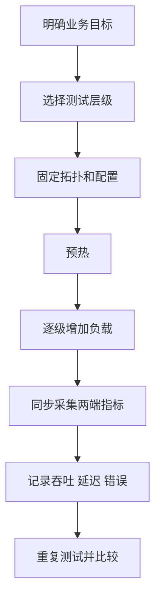

测试应尽量使用独立客户端和服务端。压测机 CPU、端口、文件描述符或网卡先达到上限时，测到的是客户端能力，而不是被测服务能力。

#### 用 pktgen 测量小包 PPS

`iperf3` 适合测 TCP 或 UDP 吞吐，无法单独回答内核每秒能处理多少个最小包。需要评估驱动、软中断和协议栈的 PPS 能力时，可在隔离测试网络使用内核 `pktgen`。

下面示例从 `eth0` 发送 100 万个 64 字节二层帧。目标地址和 MAC 必须替换为测试环境中的真实值：

```bash
sudo modprobe pktgen

echo rem_device_all | sudo tee /proc/net/pktgen/kpktgend_0
echo add_device eth0 | sudo tee /proc/net/pktgen/kpktgend_0

echo 'count 1000000' | sudo tee /proc/net/pktgen/eth0
echo 'pkt_size 64' | sudo tee /proc/net/pktgen/eth0
echo 'dst 192.168.0.30' | sudo tee /proc/net/pktgen/eth0
echo 'dst_mac 02:00:00:00:00:30' | sudo tee /proc/net/pktgen/eth0
echo 'delay 0' | sudo tee /proc/net/pktgen/eth0

echo start | sudo tee /proc/net/pktgen/pgctrl
cat /proc/net/pktgen/eth0
```

`pktgen` 会以尽可能高的速率发包，可能占满链路和 CPU，只能在专用压测机、隔离网段和明确限流的环境执行。多队列测试还需要将不同发送线程绑定到对应 CPU 和网卡队列，避免所有流量落到同一个队列。

结果中应至少记录：

- 总包数和运行时间；
- 实际 PPS 与 Mbps；
- 发送错误和丢包；
- 发送端每个 CPU 的软中断与系统时间；
- 接收端驱动丢包和 `softnet_stat` 增量；
- 测试期间的包大小、队列数、MTU 和卸载配置。

同步采集两端指标：

```bash
mpstat -P ALL 1
sar -n DEV 1
watch -n 1 'grep -E "NET_RX|NET_TX" /proc/softirqs'
ethtool -S eth0
cat /proc/net/softnet_stat
```

如果发送端单核先满，结果是流量发生器上限；如果接收端 `rx_missed_errors`、队列丢包或 `softnet_stat` 丢包增长，才说明接收路径到达瓶颈。测试必须逐级升压，并保留吞吐、PPS、CPU 和丢包的拐点。

#### 64 字节包的线速 PPS

以 1 Gbit/s 以太网为例，64 字节最小帧在线路上还要考虑 8 字节前导码与起始定界符、12 字节帧间隙。理论 PPS 约为：

```text
1,000,000,000 / ((64 + 20) × 8) ≈ 1,488,095 PPS
```

这约为 1.488 Mpps。10 Gbit/s 时理论值约为 14.88 Mpps。该计算用于理解物理线速，不等于应用有效吞吐，也没有自动包含所有隧道、VLAN 和上层协议开销。

包越小，每比特有效载荷越少，每秒需要执行的描述符处理、中断、路由和协议栈操作越多。因此网络设备标称达到 10 Gbit/s，不代表它能以 14.88 Mpps 稳定处理复杂防火墙、NAT 或应用逻辑。

#### 线速不等于有效吞吐

以太网传输包含帧头、帧间隙、前导码和校验等额外开销。小包时协议开销占比更高，因此同样的带宽会对应更高的 PPS 压力。评估时应区分：

- 物理链路速率；
- 二层实际吞吐；
- TCP 或 UDP 有效负载吞吐；
- 应用层有效数据吞吐。

### DNS 解析时快时慢的排查
<!-- src: sources/linux-performance/04-网络性能篇/37-案例篇-DNS解析时快时慢，我该怎么办.md -->

DNS 延迟会直接叠加到首次连接和请求延迟中。解析偶发变慢时，应区分本地配置、缓存命中、解析器性能、网络质量和权威 DNS 链路。

#### 先理解解析路径


大多数 DNS 查询使用 UDP 53。响应过大、截断或特定操作会回退到 TCP，因此排查时不能只过滤 UDP。

#### 检查本机解析配置

```bash
cat /etc/resolv.conf
grep '^hosts:' /etc/nsswitch.conf
resolvectl status
```

确认：

- 是否配置可达的 DNS 服务器；
- 名称服务顺序是否符合预期；
- 搜索域是否导致多次无效查询；
- 容器、systemd-resolved 或 NetworkManager 是否改写配置；
- 多个解析器之间是否有一个响应很慢。

#### 用 dig 分解问题

```bash
dig example.com
dig @8.8.8.8 example.com
dig +trace example.com
dig example.com A
dig example.com AAAA
```

重点查看 `Query time`、返回码、应答服务器、TTL 和是否发生重试。对同一域名连续查询，可判断首次缓存未命中与后续命中的差异。

抓取 DNS 查询：

```bash
tcpdump -i any -nn '(udp port 53 or tcp port 53)'
```

若请求发出后长时间没有响应，检查解析器可达性、丢包和防火墙；若响应很快但应用仍慢，继续检查应用是否串行查询、重复解析或被搜索域放大。

#### 三类 DNS 故障的证据链

DNS 慢不能只凭一次 `dig` 下结论。应把现象、假设、网络包和复测结果串起来。

##### 解析器配置错误

现象是所有域名首次访问都超时，或只有特定网络环境失败。假设是 `/etc/resolv.conf`、systemd-resolved、容器 DNS 或搜索域配置错误。

```bash
cat /etc/resolv.conf
resolvectl status
getent ahosts example.com
tcpdump -i any -nn '(udp port 53 or tcp port 53)'
```

关键证据包括：

- 查询发往不可达或已经下线的地址；
- 配置多个 DNS 时，总是第一个服务器超时后才切换；
- 搜索域把一个短名称扩展成多次无效查询；
- 应用报解析失败，但抓包中没有 DNS 请求，说明问题可能在 NSS、应用缓存或 namespace 内；
- 主机可解析而容器不可解析，说明两者看到的配置或网络 namespace 不同。

修复后要同时用 `getent` 和应用自身请求复测，因为 `dig` 直接查询 DNS，不一定走与应用完全相同的 NSS 路径。

##### 解析器链路丢包或高延迟

现象是解析偶发慢，抓包能看到查询发出，但响应迟到或需要重试。分别指定解析器进行对比：

```bash
dig @192.168.0.53 example.com +stats
dig @192.168.0.54 example.com +stats
ping -c 10 192.168.0.53
mtr -rwzc 20 192.168.0.53
```

证据链应包括同一时间段的 `Query time`、DNS 重试、路径丢包、UDP 与 TCP 回退，以及其他解析器是否正常。若仅一个解析器慢，优先处理该解析器或路径；若所有解析器都慢，再检查本机队列、防火墙、出口拥塞和应用并发。

##### 缓存未命中或上游递归慢

现象是同一域名第一次查询慢，紧接着重复查询明显变快。连续记录返回服务器、TTL 和耗时：

```bash
for i in $(seq 1 5); do
  dig example.com +stats |
    awk '/status:|Query time:|SERVER:|ANSWER SECTION/'
  sleep 1
done
```

如果第一次慢、后续快且 TTL 递减，通常说明后续命中了递归解析器缓存。若每次都慢，可能是缓存未生效、TTL 极短、查询类型不同，或请求被分配给不同解析节点。

`dig +trace` 会自行迭代查询根、顶级域和权威服务器，适合检查委派链，但它与普通递归解析路径不同，不能用一次 `+trace` 的总耗时直接代表应用解析耗时。

#### 验证本地 DNS 缓存收益

本地缓存可以由 systemd-resolved、dnsmasq、Unbound 或应用内解析器提供。选择哪一种不重要，关键是证明请求确实经过缓存，并区分冷缓存与热缓存。

以监听在本机 `127.0.0.1:53` 的缓存服务为例：

```bash
for i in $(seq 1 5); do
  dig @127.0.0.1 example.com +stats |
    awk '/status:|Query time:|SERVER:/'
done
```

验证步骤：

1. 清理缓存，记录第一次查询的冷缓存耗时。
2. 在 TTL 有效期内重复查询，记录热缓存 P50 和 P99。
3. 抓包确认热查询没有重复访问上游。
4. 监控缓存命中、未命中、失败和过期刷新。
5. 停止本地缓存或切回原解析路径，用相同请求量做对照。
6. 检查应用错误率、连接建立时间和总请求尾延迟是否改善。

清理缓存的命令与软件相关。例如 systemd-resolved 可使用：

```bash
sudo resolvectl flush-caches
resolvectl statistics
```

优化不能只展示一次热缓存的微秒级结果。还要验证缓存服务重启、上游不可达、记录过期、负缓存和高并发突发时的行为，避免本地缓存成为新的单点。

#### 常见优化方法

- 部署或启用本地 DNS 缓存；
- 使用就近、稳定且冗余的递归解析器；
- 正确设置和尊重 TTL；
- 复用连接，减少每次请求都解析域名；
- 对高频域名预热或异步刷新；
- 谨慎使用 stale cache 和负缓存；
- 监控解析成功率、P95 和 P99 延迟；
- 避免把远端 DNS 故障隐藏成无上限重试。

本地缓存能降低延迟和上游压力，但也会带来数据过期风险。优化目标不是永久缓存，而是在正确性与可用性之间控制刷新策略。

### 用 tcpdump 与 Wireshark 抓包分析
<!-- src: sources/linux-performance/04-网络性能篇/38-案例篇-怎么使用tcpdump和Wireshark分析网络流量.md -->

抓包适合回答“线上到底发了什么”。它能验证握手、重传、乱序、零窗口、RST、DNS 超时和应用协议交互，但不能替代系统指标和应用日志。

#### tcpdump 常用参数

```bash
tcpdump -i eth0 -nn -c 100
tcpdump -i any -nn host 192.168.0.30
tcpdump -i eth0 -nn 'tcp port 443'
tcpdump -i eth0 -nn 'tcp[tcpflags] & tcp-syn != 0'
tcpdump -i eth0 -nn -s 0 -w capture.pcap
```

常用过滤条件：

| 条件 | 示例 |
|---|---|
| 主机 | `host 192.168.0.30` |
| 源或目标 | `src host ...`、`dst host ...` |
| 网络 | `net 192.168.0.0/24` |
| 端口 | `port 443`、`portrange 8000-8100` |
| 协议 | `tcp`、`udp`、`icmp` |
| 组合 | `and`、`or`、`not` |

生产环境抓包应限制接口、过滤条件、包数量、抓取长度和文件轮转，避免磁盘占满。明文协议中可能包含令牌、Cookie 和业务数据，必须控制文件权限和留存范围。

#### Wireshark 分析步骤

1. 用显示过滤器缩小到目标主机、端口或连接。
2. 选择 `Follow TCP Stream` 聚焦单条会话。
3. 查看 TCP 流图和时间顺序。
4. 检查握手耗时、请求响应间隔和关闭过程。
5. 过滤重传、乱序、重复 ACK、零窗口和 RST。
6. 将异常包时间与应用日志、系统指标对齐。

常用显示过滤器：

```text
tcp.stream eq 24
tcp.analysis.retransmission
tcp.analysis.duplicate_ack
tcp.analysis.zero_window
tcp.flags.reset == 1
dns
```

#### 一个容易忽略的案例

`ping` 输出首行域名解析很慢，但后续 RTT 正常，不一定是 ICMP 网络延迟，也可能是正向或反向 DNS 查询超时。可使用：

```bash
ping -n 192.168.0.30
```

禁用名称解析后若立即恢复，问题应转向 DNS，而不是继续优化 ICMP 或链路。

#### 抓包分析的边界

- 网卡卸载可能让本机抓到的包长度和校验和看起来异常；
- 在客户端、服务端和中间设备抓包，观察结果可能不同；
- 抓包只能看到经过采集点的流量；
- 加密协议通常只能分析握手、包长和时序；
- 时间戳精度和主机时钟会影响跨机器比较。

### 缓解 DDoS 攻击导致的性能下降
<!-- src: sources/linux-performance/04-网络性能篇/39-案例篇-怎么缓解DDoS攻击带来的性能下降问题.md -->

DDoS 的目标是耗尽带宽、协议栈状态或应用资源。处置时首先识别攻击消耗的资源，再决定是在本机、边界还是上游清洗。

#### 三类常见资源耗尽

| 类型 | 典型方式 | 主要症状 |
|---|---|---|
| 带宽耗尽 | UDP flood、反射放大 | 入站带宽打满、正常流量无法进入 |
| 协议栈耗尽 | SYN flood、连接状态攻击 | PPS 高、SYN_RECV 多、队列溢出 |
| 应用耗尽 | 慢请求、高成本接口 | 连接未必多，但线程或下游资源耗尽 |

#### 识别 SYN flood

```bash
sar -n DEV 1
ss -ant state syn-recv
netstat -s | grep -i -E 'listen|SYN|drop'
tcpdump -i eth0 -nn 'tcp[tcpflags] & tcp-syn != 0'
```

典型特征是：

- PPS 很高但每包很小；
- 大量连接长期停留在 `SYN_RECV`；
- SYN 数量远高于握手完成数量；
- 监听队列溢出；
- 软中断 CPU 升高。

#### 分层缓解

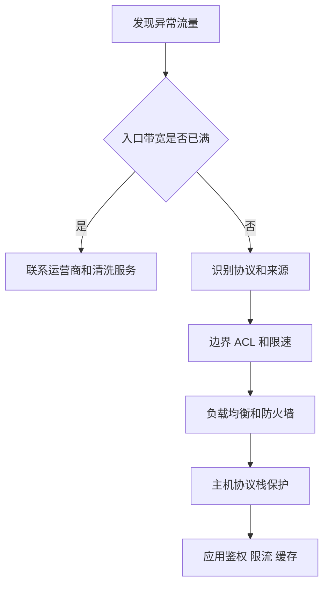

本机可以采取：

- 启用并确认 SYN cookies 作为队列压力下的保护机制；
- 合理扩大监听队列和应用 backlog；
- 降低无效半连接保留时间需谨慎评估；
- 对来源、端口和协议做限速；
- 将高成本请求放到鉴权和限流之后；
- 使用缓存、熔断和降级保护下游。

检查相关配置：

```bash
sysctl net.ipv4.tcp_syncookies
sysctl net.ipv4.tcp_max_syn_backlog
sysctl net.core.somaxconn
```

不要盲目复制一组 sysctl 数值。队列扩大只能吸收短时突发，无法解决持续超过处理能力的攻击。

#### 本机防护的上限

流量到达服务器之前，入口带宽若已经被占满，本机丢包规则不会恢复外部连通性。大规模攻击需要：

- 运营商侧黑洞或流量牵引；
- 高防 IP 和流量清洗；
- CDN、Anycast 或 WAF；
- 云平台 DDoS 防护；
- 跨地域和多入口架构。

缓解后应同时验证正常用户成功率、尾延迟和误杀率，不能只确认攻击流量下降。

### 网络请求延迟变大的排查
<!-- src: sources/linux-performance/04-网络性能篇/40-案例篇-网络请求延迟变大了，我该怎么办.md -->

网络请求延迟包含 DNS、建连、TLS、传输、排队和应用处理时间。应先判断慢在网络路径还是应用交互，再逐层缩小范围。

#### 先分解延迟

```text
总请求时间 =
DNS 时间 +
TCP 建连时间 +
TLS 握手时间 +
服务端排队与处理时间 +
数据传输时间
```

基础检查：

```bash
ping -c 10 192.168.0.30
traceroute 192.168.0.30
hping3 -S -p 8080 -c 10 192.168.0.30
curl -o /dev/null -sS -w \
'dns=%{time_namelookup} connect=%{time_connect} tls=%{time_appconnect} start=%{time_starttransfer} total=%{time_total}\n' \
http://192.168.0.30:8080/
```

如果单次握手和请求正常，但并发压测变慢，应重点检查排队、锁、连接池、套接字缓冲区和 TCP 小包交互。

#### 延迟确认与 Nagle 的相互作用

课程案例中：

1. 服务端先发送响应的第一个小分段。
2. 客户端启用延迟 ACK，等待一段时间再确认。
3. 服务端启用 Nagle，存在未确认数据时暂缓发送后续小分段。
4. 双方相互等待，形成约 40 ms 的额外延迟。

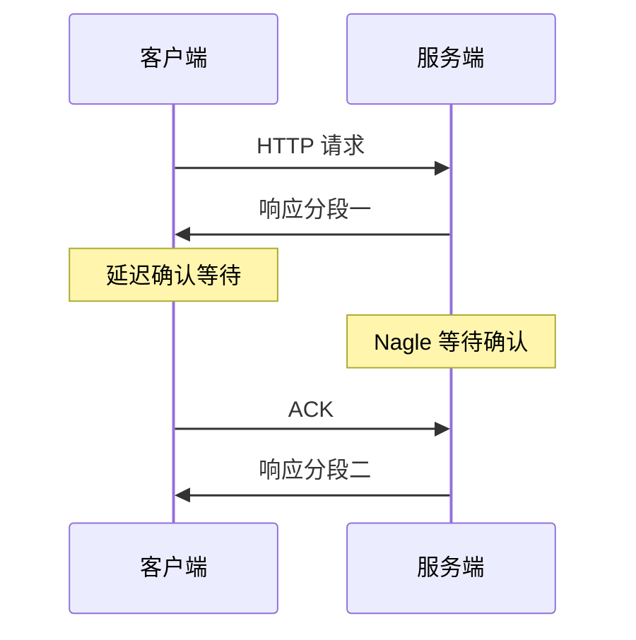

抓包可以看到第一个响应分段与 ACK 之间存在固定时间间隔，第二个分段又紧随 ACK 发出。这比“网络偶尔慢”的描述更接近根因。

案例中的 Nginx 配置为：

```nginx
tcp_nodelay off;
```

改为：

```nginx
tcp_nodelay on;
```

服务端不再等待前一小包 ACK，延迟显著下降。`TCP_NODELAY` 是否适合开启取决于业务：交互式、小响应服务通常重视低延迟；大块顺序传输则应同时考虑包合并和吞吐。

#### 网络延迟排查流程

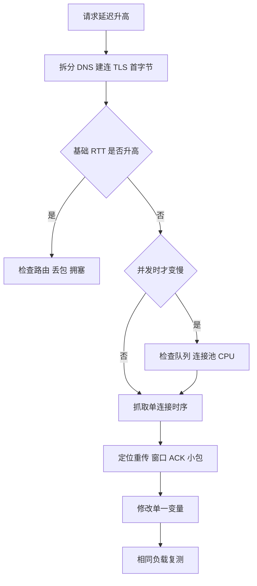

固定约 40 ms、200 ms、1 秒等阶梯状延迟，往往意味着定时器、重试或超时，应优先寻找协议和应用中的等待机制。

### NAT 性能问题的分析与优化
<!-- src: sources/linux-performance/04-网络性能篇/41-案例篇-如何优化NAT性能上.md; sources/linux-performance/04-网络性能篇/42-案例篇-如何优化NAT性能下.md; sources/linux-performance/04-网络性能篇/45-答疑五-网络收发过程中，缓冲区位置在哪里.md -->

NAT 通过重写源地址、目标地址或端口实现地址转换。Linux NAT 基于 Netfilter 和连接跟踪，规则匹配之外还需要维护连接状态，因此会增加 CPU、内存和查表开销。

#### NAT 的主要类型

| 类型 | 转换内容 | 常见场景 |
|---|---|---|
| SNAT | 修改源地址或源端口 | 内网共享公网出口 |
| DNAT | 修改目标地址或目标端口 | 公网入口映射到后端 |
| 双向 NAT | 同时使用 SNAT 和 DNAT | 浮动 IP、一对一映射 |

典型 Netfilter 路径：

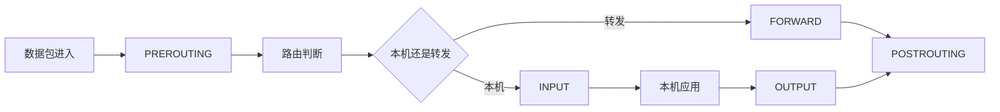

DNAT 常位于 `PREROUTING`，SNAT 或 `MASQUERADE` 常位于 `POSTROUTING`。转发场景还需要启用：

```bash
sysctl net.ipv4.ip_forward
```

#### MASQUERADE 如何处理端口冲突

多个内网客户端可能使用相同源端口访问同一个外部服务。例如：

```text
10.0.0.10:40000 -> 203.0.113.20:443
10.0.0.11:40000 -> 203.0.113.20:443
```

经过同一个公网 IP 做 `MASQUERADE` 后，两条连接不能拥有完全相同的转换后五元组。Netfilter 会结合 conntrack 状态为每条连接保存原始方向和回复方向的 tuple：端口可用时尽量保留原源端口，发生冲突时选择其他可用源端口。

```mermaid
graph LR
    A[内网连接一] --> C[NAT 网关]
    B[内网连接二] --> C
    C --> D[公网地址端口一]
    C --> E[公网地址端口二]
    D --> F[同一外部服务]
    E --> F
```

因此，同一个公网 IP 面向同一个目标地址和端口时，仍然受到可用源端口空间限制。大量短连接、长时间 `TIME_WAIT`、多个租户共享出口或单一热门目标，都可能增加端口分配压力。

排查时同时检查：

```bash
conntrack -S
conntrack -L -o extended
sysctl net.netfilter.nf_conntrack_count
sysctl net.netfilter.nf_conntrack_max
sysctl net.ipv4.ip_local_port_range
nstat
```

故障可能表现为新连接间歇失败，但已有连接仍正常；conntrack 表尚未满，公网源端口却已对特定目标组合耗尽。只增大 `nf_conntrack_max` 无法增加单个公网 IP 的端口空间。

优化顺序是先减少短连接并复用连接，再缩短经过验证的无效状态生命周期；容量仍不足时，增加公网源 IP、按目的地址分流或水平扩展 NAT 网关。每次调整后应以相同连接建立速率复测成功率、P99 建连延迟、conntrack 使用率和端口分布。

#### conntrack 为什么会成为瓶颈

连接跟踪表使用五元组和状态记录连接。NAT 首包建立映射，后续包查找并复用状态。当连接创建速率高、连接数量大或超时过长时，可能出现：

- `nf_conntrack` 表接近或达到上限；
- 新连接被丢弃；
- 查表和锁竞争增加；
- 内核内存消耗升高；
- NAT 网关软中断 CPU 升高。

检查：

```bash
sysctl net.netfilter.nf_conntrack_count
sysctl net.netfilter.nf_conntrack_max
sysctl net.netfilter.nf_conntrack_buckets
dmesg -T | grep -i conntrack
conntrack -S
```

内核日志出现 `nf_conntrack: table full, dropping packet` 时，已经有新流量因状态表容量不足被丢弃。

#### NAT 性能排查

1. 建立不经过 NAT 的网络性能基线。
2. 使用相同负载测试 NAT 路径。
3. 比较吞吐、PPS、延迟、丢包和 CPU。
4. 检查 `conntrack` 使用率与增长速度。
5. 检查网卡队列、软中断和丢包点。
6. 分析规则数量和匹配顺序。
7. 修改一个变量后重复相同测试。

```bash
sar -n DEV 1
mpstat -P ALL 1
softnet_stat=$(cat /proc/net/softnet_stat)
ss -s
nstat
```

`/proc/net/softnet_stat` 为十六进制计数，适合由监控或脚本解析并观察增量，不能只看一次快照。

#### 优化方向

- 根据连接峰值和内存预算调整 `nf_conntrack_max`；
- 合理设置哈希桶数量，避免过长冲突链；
- 按真实连接生命周期调整 conntrack 超时；
- 删除冗余规则，将高命中规则前置；
- 对无需状态跟踪的可信无状态流量评估 `NOTRACK`；
- 拆分和水平扩展 NAT 网关；
- 使用多队列、RSS、RPS 或 RFS 分散包处理；
- 避免容器网络路径中不必要的多层 NAT；
- 在更高吞吐场景评估 eBPF、XDP 或硬件卸载。

缩短超时可能提前删除仍有效的连接，增大表容量会消耗更多内核内存，绕过 conntrack 还会改变防火墙与 NAT 语义。每项优化都需要容量估算和回归测试。

### 网络性能优化的常用手段
<!-- src: sources/linux-performance/04-网络性能篇/43-套路篇-网络性能优化的几个思路上.md; sources/linux-performance/04-网络性能篇/44-套路篇-网络性能优化的几个思路下.md -->

网络优化应从业务目标出发，按应用、套接字、协议栈、网卡和架构逐层处理。最有效的优化通常是减少请求次数、传输数据量和同步等待，而不是直接修改内核参数。

#### 应用层

- 使用长连接和连接池，减少握手；
- 使用异步 I/O、`epoll` 和合理工作进程模型；
- 避免在事件循环中执行阻塞任务；
- 合并请求和响应，减少小包；
- 压缩或使用更紧凑的序列化协议；
- 使用缓存、CDN 和就近接入；
- 限流、熔断和降级保护下游；
- 复用 DNS 结果并遵守 TTL；
- 用 P99 延迟和错误率约束优化结果。

#### 套接字与 TCP

查看缓冲区和 TCP 自动调优范围：

```bash
sysctl net.core.rmem_max
sysctl net.core.wmem_max
sysctl net.ipv4.tcp_rmem
sysctl net.ipv4.tcp_wmem
sysctl net.ipv4.ip_local_port_range
```

带宽时延积可帮助估算在途数据量：

```text
BDP = 链路带宽 × 往返时间
```

高带宽、高 RTT 链路需要足够窗口才能跑满吞吐，但缓冲区并非越大越好。过大的队列会增加内存并可能造成缓冲膨胀和尾延迟。

按场景评估：

- `TCP_NODELAY`：减少交互式小消息等待；
- `TCP_CORK`：帮助应用聚合分段；
- `SO_RCVBUF` 和 `SO_SNDBUF`：显式设置套接字缓冲区；
- keepalive：发现长期失效连接；
- 合理监听 backlog：吸收连接突发；
- 扩大临时端口范围：缓解大量主动连接端口不足。

不要使用已经废弃的 `tcp_tw_recycle`。`TIME_WAIT` 是 TCP 正确性机制，应先通过连接复用、减少短连接和架构调整降低数量。

#### 网络层与链路层

- 优化路由，减少跨地域和不必要中转；
- 保持路径 MTU 一致，特别关注隧道和容器网络；
- 正确处理 ICMP，避免路径 MTU 发现失败；
- 使用流量控制和 QoS 保护关键流量；
- 调整网卡 ring buffer 前确认是否存在队列丢包；
- 使用 RSS 将不同流分散到多队列；
- 使用 RPS、RFS 或 XPS 优化 CPU 分布；
- 评估 GRO、GSO、TSO 和校验和卸载；
- 检查中断亲和性和 NUMA 本地性。

查看网卡能力和队列：

```bash
ethtool -k eth0
ethtool -g eth0
ethtool -l eth0
ethtool -S eth0
cat /proc/interrupts
```

卸载通常能降低 CPU，但也可能增加批处理延迟，或让抓包结果与线上实际帧不同。低延迟和高吞吐场景的最佳配置可能相反。

#### 网络优化闭环

```mermaid
graph TD
    A[定义吞吐 延迟 错误目标] --> B[采集业务和系统基线]
    B --> C[确认瓶颈层级]
    C --> D{能否减少网络工作}
    D -->|是| E[缓存 合并 压缩 复用]
    D -->|否| F[优化队列 协议栈 网卡]
    E --> G[固定负载复测]
    F --> G
    G --> H[比较 P99 吞吐 错误 CPU]
    H --> I{目标是否达成}
    I -->|否| C
    I -->|是| J[灰度发布和持续监控]
```

优化时每次只改变少量变量，记录旧值和回滚方式。只有业务指标改善、错误率不升高、资源消耗可接受，才算完成一次有效的网络优化。

## 第 5 章 · 综合实战与方法论

### 容器化应用启动变慢的分析
<!-- src: sources/linux-performance/05-综合实战篇/46-案例篇-为什么应用容器化后，启动慢了很多.md; sources/linux-performance/05-综合实战篇/58-答疑六-容器冷启动如何性能分析.md -->

应用进入容器后，代码本身可能没有变化，但运行环境增加了 cgroup、namespace、叠加文件系统、虚拟网络和编排平台。分析容器性能时，既要看容器内的应用，也要回到宿主机观察内核资源限制。

#### 先定义启动时间

“容器启动慢”至少可能指：

- 镜像拉取慢；
- 容器创建和挂载慢；
- 进程启动慢；
- 应用初始化慢；
- 健康检查通过慢；
- 流量真正可用慢。

应分别记录以下时间点：

```text
镜像就绪
容器创建
主进程启动
端口监听
readiness 成功
首个有效请求成功
```

只看容器状态为 `Running`，不能说明应用已经可以服务。

#### 建立冷启动事件时间线

冷启动分析的第一步不是立即运行 profiler，而是找到哪一段时间增长。把编排事件、容器运行时、应用日志和探针结果对齐到同一条时间线：

```mermaid
graph LR
    A[调度到节点] --> B[镜像准备]
    B --> C[容器创建]
    C --> D[主进程执行]
    D --> E[应用初始化]
    E --> F[端口监听]
    F --> G[就绪检查通过]
    G --> H[首个请求成功]
```

Docker 环境可先记录事件：

```bash
docker events \
  --filter container=<CONTAINER> \
  --format '{{.TimeNano}} {{.Status}}'

docker inspect <CONTAINER> \
  --format '{{json .State}}'
```

Kubernetes 环境查看 Pod 条件、容器状态和事件：

```bash
kubectl get pod <POD> -n <NAMESPACE> -o json
kubectl get events -n <NAMESPACE> \
  --field-selector involvedObject.name=<POD> \
  --sort-by=.lastTimestamp
kubectl logs -n <NAMESPACE> <POD> --timestamps
```

应用应主动记录单调时钟下的初始化阶段，例如配置加载、类加载、数据库连接、迁移、缓存预热、端口监听和 readiness。跨主机比较前还要确认时钟同步，因为墙上时间偏差会制造错误的先后关系。

时间线能快速区分：

| 慢阶段 | 首选假设 | 第一批证据 |
|---|---|---|
| 调度到容器创建 | 调度、镜像、CNI、CSI | Pod 事件、运行时日志、镜像缓存 |
| 主进程到端口监听 | CPU、缺页、动态链接、应用初始化 | cgroup、perf、应用阶段日志 |
| 端口监听到就绪 | 依赖、预热、探针配置 | RED、DNS、连接池、探针日志 |
| 就绪到首个成功请求 | 路由传播、负载均衡、sidecar | 入口日志、Trace、网络事件 |

#### 为冷启动选择正确的火焰图

火焰图的外观相似，但采样事件不同，回答的问题也不同：

| 类型 | 数据来源 | 回答的问题 |
|---|---|---|
| on-CPU 火焰图 | CPU 周期或定时采样 | CPU 时间花在哪些调用栈 |
| off-CPU 火焰图 | 调度切出到唤醒的阻塞时间 | 线程在等待什么 |
| 缺页火焰图 | page fault 事件 | 哪些调用栈触发缺页 |
| 分配火焰图 | malloc 或运行时分配事件 | 哪些调用栈分配内存 |

对宿主机可见的容器主进程 PID 采集 on-CPU 栈：

```bash
HOST_PID=$(docker inspect \
  --format '{{.State.Pid}}' <CONTAINER>)
sudo perf record -F 99 -g -p "$HOST_PID" -- sleep 20
sudo perf report
```

若 CPU 利用率不高但启动仍慢，转向 off-CPU 分析。BCC 工具名称会随发行版变化，常见调用形式为：

```bash
sudo offcputime-bpfcc -p "$HOST_PID" 20 > offcpu.stacks
```

采集缺页调用栈：

```bash
sudo perf record \
  -e page-faults \
  -g -p "$HOST_PID" \
  -- sleep 20
sudo perf report
```

`page-faults` 火焰图只说明缺页发生在哪里，不等于完整的“内存占用火焰图”。要分析仍存活的分配、泄漏或分配速率，应使用语言运行时 profiler、`memleak` 或带分配与释放关联的工具。

分析时把三类结果与 cgroup 指标对齐：

```bash
cat cpu.stat
cat memory.current
cat memory.events
cat io.stat
```

如果 on-CPU 栈集中在解压、类加载或编译，优先减少启动计算并提高启动 CPU 配额；如果 off-CPU 栈集中在 DNS、connect 或文件 I/O，继续追踪对应依赖；如果缺页或分配激增，检查镜像文件布局、预热策略和内存限制。

#### 用 RED 验证启动后的可服务性

容器进入 `Running` 只代表主进程存在。应从入口请求记录 RED：

- Rate：探针请求和真实请求速率；
- Errors：连接拒绝、超时、非成功状态；
- Duration：从建连到完整响应的分位数。

冷启动实验至少重复多次，并区分：

- 节点已有镜像与首次拉取镜像；
- 已有依赖连接与首次建连；
- 热文件缓存与冷文件缓存；
- 单实例启动与并发扩容；
- 无流量启动与启动即承载流量。

修复后不能只比较进程启动时间，还要比较 readiness 时间、首个成功请求时间、启动窗口错误率和稳态资源。这样才能避免“进程更快启动，但更早接收流量并大量失败”的伪优化。

#### 课程案例的两个问题

案例给 Tomcat 容器设置：

```bash
docker run --cpus 0.1 -m 512M ...
```

第一个问题是容器被 OOM 杀死。可检查：

```bash
docker ps -a
docker inspect <CONTAINER> --format '{{json .State}}'
dmesg -T | grep -i -E 'oom|killed process'
```

`OOMKilled=true`、退出码 `137` 和内核 OOM 日志共同证明进程因内存限制退出。应用申请 256 MiB，不代表容器只需 256 MiB；JVM 堆、元空间、线程栈、直接内存、共享库和页缓存都占用内存。

现代 JVM 通常支持容器资源感知，但仍应显式规划：

```text
容器内存限制 =
JVM 堆 +
元空间 +
直接内存 +
线程栈 +
本地库 +
页缓存 +
安全余量
```

查看容器实际限制时，应以 cgroup 为准。cgroup v2 可从容器对应目录查看：

```bash
cat memory.max
cat memory.current
cat memory.events
```

第二个问题是 CPU 配额过低。主机总体 CPU 很空闲，Java 进程却只能使用约 10% CPU，启动线程长时间等待调度。

```bash
pidstat -t -p <PID> 1
docker stats
```

若线程 `%wait` 高、容器 CPU 接近配额，而宿主机仍空闲，应检查 CPU quota 和 throttling。cgroup v2 可查看：

```bash
cat cpu.max
cat cpu.stat
```

其中 `nr_throttled` 和 `throttled_usec` 持续增长，说明容器因配额被节流。

#### 容器慢启动排查流程

```mermaid
graph TD
    A[应用启动慢] --> B[拆分镜像 容器 进程 就绪时间]
    B --> C[检查退出状态和日志]
    C --> D{是否 OOM 或重启}
    D -->|是| E[核对 cgroup 内存和应用内存模型]
    D -->|否| F[采集 CPU 内存 I/O 网络]
    F --> G{是否 CPU 节流}
    G -->|是| H[调整配额或减少启动计算]
    G -->|否| I[检查镜像层 存储 DNS 依赖]
    E --> J[修复后重测首个可用请求]
    H --> J
    I --> J
```

还应检查：

- 镜像层是否过大、节点是否需要重新拉取；
- overlayfs 是否产生大量小文件或写时复制；
- 启动时是否串行访问 DNS、数据库、配置中心；
- CNI、CSI 和 sidecar 是否延迟 Pod 就绪；
- readiness 探针是否过严或过早；
- 启动期间是否执行迁移、预热和大规模缓存加载。

资源限制不能简单删除。正确做法是压测并估算启动与稳态资源，分别设置合理的 request、limit 和应用内部上限。

### 服务器偶发丢包的系统排查
<!-- src: sources/linux-performance/05-综合实战篇/47-案例篇-服务器总是时不时丢包，我该怎么办上.md; sources/linux-performance/05-综合实战篇/48-案例篇-服务器总是时不时丢包，我该怎么办下.md -->

丢包可能发生在客户端、链路、中间设备、服务端网卡、协议栈、Netfilter、套接字和应用。偶发丢包必须依靠分层计数器的增量和多点抓包定位。

#### 丢包路径全景

```mermaid
graph TD
    A[物理链路和交换网络] --> B[网卡硬件和接收环]
    B --> C[驱动和 softnet]
    C --> D[qdisc 和流量控制]
    D --> E[IP 路由和分片]
    E --> F[Netfilter 和 conntrack]
    F --> G[TCP 或 UDP]
    G --> H[套接字缓冲区]
    H --> I[应用队列和处理]
```

每层都要回答两个问题：

1. 该层的丢包计数是否增长？
2. 上一层看到了包，下一层是否没有看到？

#### 第一层：接口、驱动和队列

```bash
ip -s link show dev eth0
ethtool -S eth0
ethtool -g eth0
sar -n DEV 1
```

重点关注 CRC、frame、missed、fifo、overrun、no buffer 和 dropped 等计数。不同驱动字段名不同，应根据网卡驱动文档解释。

检查 softnet：

```bash
cat /proc/net/softnet_stat
```

第二列等字段出现持续增量时，可能说明软中断处理不及或 backlog 溢出。应使用脚本或监控解析十六进制数据，并按 CPU 比较。

#### 第二层：qdisc 与流量控制

```bash
tc -s qdisc show dev eth0
tc -s filter show dev eth0 ingress
```

课程案例中，`netem` 人为配置了丢包：

```text
qdisc netem ... loss 30%
```

`tc` 的 `dropped` 计数能够直接证明 qdisc 丢包。生产环境还可能因限速器、队列溢出或 QoS 策略丢包。

#### 第三层：协议统计

```bash
nstat -az
netstat -s
ss -s
```

关注：

- IP 丢弃和重组失败；
- TCP 重传、超时和 SYN 重传；
- 监听队列溢出；
- UDP 接收缓冲区错误；
- ICMP 错误；
- 零窗口和接收窗口问题。

计数器是系统启动后的累计值，必须比较故障窗口前后的增量。

#### 第四层：Netfilter 与 conntrack

```bash
iptables -t filter -nvL
nft list ruleset
sysctl net.netfilter.nf_conntrack_count
sysctl net.netfilter.nf_conntrack_max
conntrack -S
dmesg -T | grep -i conntrack
```

课程案例中，`INPUT` 和 `OUTPUT` 链的随机 `DROP` 规则命中计数持续增长。规则计数比仅阅读规则文本更快，因为它直接显示哪些规则处理了实际流量。

#### 第五层：MTU 与数据包大小

案例中 SYN 可以成功，HTTP GET 却超时。抓包显示三次握手完成，但看不到应用数据；接口 `RX-DRP` 增长，最终发现容器网卡 MTU 只有 100。

检查：

```bash
ip link show dev eth0
tracepath <DESTINATION>
ping -M do -s 1472 <DESTINATION>
```

隧道、VXLAN、VPN、容器网络会增加额外头部。MTU 不一致且 ICMP 被错误拦截时，容易形成路径 MTU 黑洞，表现为小包正常、大包超时。

#### 用多点抓包确定丢包区间

在客户端、服务端宿主机、容器命名空间和必要的中间设备同时抓包：

```bash
tcpdump -i any -nn -s 0 -w host.pcap 'host <PEER>'
```

如果包出现在客户端发送口，却没有出现在服务端物理网卡，问题在网络路径；若出现在宿主机但没有进入容器，检查桥接、veth、Netfilter 和 MTU；若进入套接字但应用没有响应，转向应用线程和队列。

### 内核线程占用 CPU 过高的定位
<!-- src: sources/linux-performance/05-综合实战篇/49-案例篇-内核线程CPU利用率太高，我该怎么办.md -->

内核线程名称通常显示在方括号中，由 `kthreadd` 管理。内核线程 CPU 高只是现象，其名称可以提供排查方向。

#### 常见内核线程

| 线程 | 主要职责 | CPU 高时优先检查 |
|---|---|---|
| `ksoftirqd/N` | 延后处理软中断 | 网络包速、中断分布、softnet |
| `kswapd` | 内存回收 | 内存压力、回收、Swap |
| `kworker` | 内核工作队列 | 设备、驱动、异步内核任务 |
| `migration/N` | CPU 任务迁移 | 调度、亲和性、负载不均 |
| `jbd2` | 文件系统日志 | 写入、提交、存储延迟 |
| `kcompactd` | 内存规整 | 大页、碎片、内存压力 |

查看：

```bash
ps -e -o pid,ppid,psr,stat,comm,wchan:32 | grep '^\| \['
top -H
pidstat -u -w -p ALL 1
```

#### ksoftirqd 高的分析

先确认软中断类型和 CPU 分布：

```bash
mpstat -P ALL 1
watch -n 1 cat /proc/softirqs
cat /proc/interrupts
sar -n DEV 1
```

若 `NET_RX` 快速增长、网络 PPS 同时升高，应检查：

- 是否存在 SYN flood 或异常流量；
- 网卡队列和中断是否集中在少量 CPU；
- RSS、RPS、RFS 和 irqbalance 配置；
- softnet 是否丢包；
- Netfilter、bridge、容器 NAT 是否增加处理路径。

#### 用 perf 观察内核调用栈

```bash
perf record -a -g -p <KSOFTIRQD_PID> -- sleep 30
perf report
```

课程案例的热点链路包含：

```text
net_rx_action
netif_receive_skb
br_handle_frame
br_nf_pre_routing
ip_forward
```

这说明 CPU 主要消耗在网络接收、Linux bridge、Netfilter 和转发，而不是普通用户态代码。

生成火焰图时，横向宽度表示采样占比，纵向表示调用栈深度。火焰图不表示函数横向执行顺序。

#### 从热点回到业务原因

```mermaid
graph TD
    A[发现内核线程 CPU 高] --> B[根据线程职责选择子系统]
    B --> C[确认中断 队列 I/O 或回收指标]
    C --> D[perf 采样调用栈]
    D --> E[识别热点内核路径]
    E --> F[映射到流量 设备 配置和应用]
    F --> G[修复根因并复测]
```

不要直接提高内核线程优先级或绑定 CPU 来掩盖问题。应先解释“为什么产生了这么多内核工作”，再决定分散负载、减少工作还是扩容。

### 动态追踪：定位疑难性能问题的利器
<!-- src: sources/linux-performance/05-综合实战篇/50-案例篇-动态追踪怎么用上.md; sources/linux-performance/05-综合实战篇/51-案例篇-动态追踪怎么用下.md -->

动态追踪是在服务运行期间，通过探针采集内核或用户态事件。它适合处理难复现、持续时间短、传统指标无法解释的问题。

#### 三类事件源

| 事件源 | 说明 | 示例 |
|---|---|---|
| 硬件事件 | CPU 性能监控计数器 | 周期、缓存未命中、分支失败 |
| 静态探针 | 预先编译进代码 | tracepoint、USDT |
| 动态探针 | 运行时附加到函数 | kprobe、kretprobe、uprobe |

静态 tracepoint 接口通常比直接依赖内核函数名更稳定。kprobe 灵活，但内核版本变化可能导致函数名、参数或内联行为变化。

#### 工具如何选择

| 需求 | 工具 |
|---|---|
| 找 CPU 热点和调用栈 | `perf` 与火焰图 |
| 跟踪内核函数调用关系 | `ftrace`、`trace-cmd` |
| 跟踪系统调用 | `perf trace`、eBPF 工具 |
| 对事件聚合、直方图和关联 | eBPF、BCC、bpftrace |
| 旧内核或特定 RHEL 环境 | SystemTap |
| 容器系统活动观测 | eBPF 工具、sysdig |

#### 从问题选择探针

探针越靠近稳定接口，脚本跨版本可用性通常越好。选择顺序可以是：

1. 已有指标、日志和 profile 能回答时，不增加动态探针。
2. 有稳定 tracepoint 时优先使用 tracepoint。
3. 需要内核函数内部细节时使用 kprobe 或 `perf probe`。
4. 需要用户态函数时使用 uprobe、USDT 或语言 profiler。
5. 高频事件优先在内核中聚合，只向用户态输出统计结果。

先查询系统提供的事件和参数格式：

```bash
sudo perf list tracepoint
sudo bpftrace -l 'tracepoint:syscalls:sys_enter_openat'
cat /sys/kernel/tracing/events/syscalls/sys_enter_openat/format
```

tracepoint 的 `format` 文件说明字段名称、偏移和类型。直接猜测参数位置，可能在架构或内核升级后得到错误数据。

#### 完整实操：定位启动期间的慢 openat

假设一个服务冷启动 P99 从 8 秒升至 25 秒，CPU 与磁盘带宽都不高，应用日志显示配置加载阶段变慢。初步假设是大量文件打开被慢存储、锁或路径查找阻塞。

第一步先用低开销指标限定问题窗口：

```bash
pidstat -d -w -p <PID> 1
strace -c -f -p <PID>
```

如果 `openat` 次数或耗时占比异常，再用稳定的系统调用 tracepoint 统计延迟分布。创建 `openat-latency.bt`：

```bpftrace
tracepoint:syscalls:sys_enter_openat
/pid == $1/
{
  @start[tid] = nsecs;
}

tracepoint:syscalls:sys_exit_openat
/@start[tid]/
{
  @latency_us = hist((nsecs - @start[tid]) / 1000);
  delete(@start[tid]);
}

interval:s:30
{
  exit();
}

END
{
  clear(@start);
}
```

运行时把目标 PID 作为第一个参数：

```bash
sudo bpftrace openat-latency.bt <PID>
```

直方图若显示大部分调用低于 100 微秒，但少量调用落在 100 毫秒以上，就证明平均值掩盖了长尾。下一步只在短时间内采集路径参数：

```bpftrace
tracepoint:syscalls:sys_enter_openat
/pid == $1/
{
  printf("%s\n", str(args.filename));
}

interval:s:5
{
  exit();
}
```

参数可能包含敏感路径，生产采集必须限定 PID、持续时间和输出权限。高基数路径不应长期作为 map key，否则会增加内核 map 内存和用户态输出压力。

同时用 I/O、挂载和调度证据验证假设：

```bash
iostat -xz 1
pidstat -d -w -p <PID> 1
findmnt -T /path/from/trace
cat /proc/<PID>/mountinfo
```

可能形成的证据链：

```text
现象：配置加载阶段增加 17 秒
假设：容器首次访问远端挂载上的大量小文件
指标：CPU 低且进程自愿切换和 I/O 等待增加
工具：openat tracepoint 延迟直方图和路径采样
证据：长尾调用集中到同一远端挂载目录
修复：合并配置文件并在本地卷预热
复测：相同冷缓存条件下启动 P99 恢复到 9 秒
```

这类闭环比“看到 `openat` 很多，所以文件系统慢”更可靠，因为调用次数、单次延迟、目标路径和业务阶段已经相互对应。

#### 何时使用 perf probe 和 uprobe

若 tracepoint 只能看到系统调用边界，而问题位于自研程序的 `load_config` 函数内部，可使用用户态 uprobe。先确认二进制、Build ID 和符号：

```bash
file /path/to/app
readelf -n /path/to/app | grep -A2 'Build ID'
nm -C /path/to/app | grep load_config
perf probe -x /path/to/app --funcs | grep load_config
```

添加入口和返回探针：

```bash
sudo perf probe -x /path/to/app \
  --add 'load_config'
sudo perf probe -x /path/to/app \
  --add 'load_config%return'

sudo perf record \
  -e probe_app:load_config \
  -e probe_app:load_config__return \
  -p <PID> -- sleep 20
sudo perf script
```

实际事件组名称取决于二进制名称和 `perf probe` 输出，应先用 `perf probe --list` 核对。若二进制带 DWARF 调试信息，可尝试按变量名读取参数：

```bash
sudo perf probe -x /path/to/app \
  --vars 'load_config'
sudo perf probe -x /path/to/app \
  --add 'load_config path:string'
```

编译器优化可能内联函数、删除变量或让变量只在部分指令范围内可见。没有调试信息时，也可按 ABI 寄存器或偏移取值，但这依赖 CPU 架构、函数版本和编译结果，不适合直接复制到其他机器。

结束后清理动态事件：

```bash
sudo perf probe --list
sudo perf probe --del 'probe_app:*'
```

探针清理是实验的一部分。遗留探针会污染后续采集，也可能让其他工程师误判当前系统配置。

#### 用 eBPF 做内核侧聚合

对高频事件逐条 `printf` 会产生大量输出。bpftrace、BCC 或 libbpf 工具的优势之一，是先在内核 map 中聚合，再周期性读取。

例如按进程名统计每秒调度切换次数：

```bpftrace
tracepoint:sched:sched_switch
{
  @[comm] = count();
}

interval:s:10
{
  print(@);
  clear(@);
}
```

这个示例适合发现切换异常的进程，但不能直接证明锁竞争。若目标是调度延迟，应使用 `runqlat`；若目标是阻塞调用栈，应使用 `offcputime`。工具输出必须对应具体假设。

现代 eBPF 工具可借助 BTF 获得内核类型信息并提高跨内核版本适配能力，但 BTF 不会消除所有兼容问题。tracepoint 字段、内核配置、helper 可用性、锁定策略和发行版补丁仍可能影响脚本。

#### 动态追踪失败时的检查清单

| 现象 | 优先检查 |
|---|---|
| 找不到 tracepoint | tracefs 是否挂载、内核是否启用对应事件 |
| `perf probe` 找不到函数 | 符号被裁剪、函数被内联、名称改变 |
| 变量不可用 | 缺少 DWARF、优化后变量生命周期改变 |
| eBPF 加载被拒绝 | 权限、锁定模式、LSM、内核配置、验证器日志 |
| 容器内看不到目标 | PID、mount、user 和 cgroup namespace |
| 调用栈大量未知符号 | 内核符号、应用调试符号、JIT map、栈展开方式 |

容器场景通常应在宿主机使用宿主机 PID 附加探针：

```bash
docker inspect <CONTAINER> \
  --format '{{.State.Pid}}'
nsenter -t <HOST_PID> -m -p -n -- \
  readlink /proc/self/exe
```

目标二进制若只存在于容器 mount namespace，工具需要能访问对应文件和符号。用户 namespace、只读 `/sys`、缺失 capabilities 或宿主机安全策略也会阻止采集。不要为了方便直接给业务容器长期授予 `--privileged`，应使用受控的宿主机诊断流程或专用观测组件。

#### ftrace 与 trace-cmd

现代系统通常将接口挂载在：

```bash
/sys/kernel/tracing
```

也可能位于：

```bash
/sys/kernel/debug/tracing
```

使用前查看可用跟踪器和事件：

```bash
cat /sys/kernel/tracing/available_tracers
cat /sys/kernel/tracing/available_events
```

`trace-cmd` 可简化手工读写 tracefs：

```bash
trace-cmd record -p function_graph -g <KERNEL_FUNCTION> <COMMAND>
trace-cmd report
```

#### perf 动态探针

```bash
perf list
perf probe --add '<KERNEL_FUNCTION>'
perf record -e probe:<EVENT> -aR -- sleep 10
perf script
perf probe --del probe:<EVENT>
```

跟踪用户态函数时可指定二进制：

```bash
perf probe -x /path/to/binary '<FUNCTION>'
```

用户态符号、未被内联的函数和调试信息会显著影响可追踪性。

#### eBPF 的价值

eBPF 程序在经过验证后加载到内核，可在事件发生时过滤、聚合并通过 map 输出结果。相比输出每个原始事件，在内核中先做计数或直方图能显著降低数据量。

常用现成工具包括：

```text
execsnoop
opensnoop
biolatency
runqlat
offcputime
tcplife
tcpconnect
profile
```

优先使用成熟工具和稳定 tracepoint。自行编写脚本前要确认内核版本、BTF、权限、符号和容器命名空间。

#### 生产使用安全

- 先限定 PID、cgroup、CPU、事件和持续时间；
- 优先聚合，不输出每个高频事件；
- 估算探针频率和数据量；
- 设置自动停止时间；
- 避免读取敏感参数和业务数据；
- 记录工具版本、内核版本和脚本；
- 在压测环境评估开销；
- 跟踪结束后清理探针。

动态追踪不是零开销。探针附加到高频路径、采集调用栈或输出大量事件时，可能明显影响服务。

### 服务吞吐量骤降的分析
<!-- src: sources/linux-performance/05-综合实战篇/52-案例篇-服务吞吐量下降很厉害，怎么分析.md -->

吞吐下降经常不是单一瓶颈。修复第一个限制后，负载继续上升，第二个限制才会暴露，因此必须在每轮优化后重新观察完整指标。

#### 先确认吞吐是否真实下降

压测同时记录：

- 成功请求吞吐；
- 总请求吞吐；
- 非成功状态码；
- 连接、读写和超时错误；
- 延迟分位数；
- 客户端资源；
- 服务端 CPU、内存、I/O 和网络。

课程案例中，`wrk` 显示总 RPS 较低且全部是异常响应。只看 `Requests/sec` 会误把失败请求也当作业务能力。

#### 瓶颈一：连接跟踪表满

```bash
dmesg -T | grep -i conntrack
sysctl net.netfilter.nf_conntrack_count
sysctl net.netfilter.nf_conntrack_max
```

当 count 等于 max，且日志出现 table full，说明新连接被丢弃。应根据峰值并发、连接寿命、内存预算和哈希桶规划容量，而不是照抄一个大数值。

#### 瓶颈二：应用工作进程不足

Nginx 返回 `499` 表示客户端在服务端响应前关闭连接。PHP-FPM 日志又显示达到 `max_children`，说明下游工作进程不足。

工作进程数应受两个条件约束：

```text
按内存上限 = 可分配内存 ÷ 单进程峰值内存
按 CPU 上限 = CPU 核数与单请求 CPU 成本允许的并行度
```

工作进程过多会增加内存、上下文切换和下游压力。

#### 瓶颈三：监听队列溢出

```bash
nstat -az | grep -E 'ListenOverflows|ListenDrops'
ss -lntp
sysctl net.core.somaxconn
```

监听套接字的应用 backlog 还会受 `somaxconn` 上限影响。扩队列只能吸收短时突发；若应用长期处理不过来，队列更大只会增加等待延迟。

#### 瓶颈四：临时端口耗尽

Nginx 作为 PHP-FPM 客户端，需要为后端连接分配临时端口。检查：

```bash
sysctl net.ipv4.ip_local_port_range
ss -s
ss -ant state time-wait
```

应优先使用后端长连接和连接池，减少短连接。扩大端口范围和评估 `tcp_tw_reuse` 只能解决特定的主动连接场景，不能随意破坏 `TIME_WAIT` 的协议语义。

#### 用火焰图发现后续热点

前述限制解除后，CPU 成为新瓶颈。火焰图中 `inet_hash_connect` 和端口可用性检查变宽，说明大量短连接让临时端口分配成为热点。

完整分析链：

```mermaid
graph TD
    A[吞吐下降] --> B[区分成功吞吐和失败吞吐]
    B --> C[检查状态码和连接错误]
    C --> D[检查 conntrack 和丢包]
    D --> E[检查工作进程和依赖]
    E --> F[检查监听队列]
    F --> G[检查临时端口和短连接]
    G --> H[perf 和火焰图找热点]
    H --> I[逐项修改并重复压测]
```

每轮都要重新检查错误率和 P99。吞吐升高但错误更多，不是优化成功。

### 系统监控体系的搭建思路
<!-- src: sources/linux-performance/05-综合实战篇/53-套路篇-系统监控的综合思路.md -->

瞬时故障在工程师登录服务器时往往已经消失。监控的作用是保存故障现场、发现趋势并在用户大量感知前告警。

#### USE 方法

USE 将每种资源归纳为：

- Utilization：资源实际被使用的比例；
- Saturation：资源无法立即接受更多工作时的排队程度；
- Errors：错误事件数量。

| 资源 | 使用率 | 饱和度 | 错误 |
|---|---|---|---|
| CPU | user、system、softirq | 运行队列、调度等待 | 节流、机器检查 |
| 内存 | 已用、工作集 | 回收、Swap、分配等待 | OOM、分配失败 |
| 磁盘 | busy、吞吐 | 队列、I/O 延迟 | 超时、reset、介质错误 |
| 网络 | 带宽、PPS | 队列、softnet | drop、error、retransmit |
| 文件描述符 | 已用比例 | 接近限制 | 分配失败 |
| conntrack | count 比例 | 查表与创建压力 | table full、drop |

使用率不高不代表没有瓶颈。例如磁盘利用率不高但单次请求延迟很高，仍可能影响同步业务。

#### 监控系统的组成

```mermaid
graph LR
    A[目标和 Exporter] --> B[采集]
    B --> C[时序存储]
    C --> D[查询和规则]
    D --> E[告警管理]
    C --> F[可视化]
    E --> G[值班和处置]
```

典型 Prometheus 体系包括：

- exporter 或应用指标端点；
- 服务发现；
- Prometheus 拉取和时序存储；
- PromQL 记录规则与告警规则；
- Alertmanager 分组、路由、抑制和静默；
- Grafana 仪表盘；
- 长期存储或远程写入。

#### 告警设计

有效告警必须包含：

- 受影响服务和范围；
- 当前值、阈值和持续时间；
- 用户影响或 SLO 风险；
- 相关仪表盘和日志链接；
- 排障手册；
- 明确责任团队。

避免单点瞬时阈值告警。更可靠的方法是使用持续窗口、变化率、错误预算消耗和多信号关联。

#### 监控自身也要被监控

应监控抓取失败、指标延迟、规则执行时间、存储容量、远程写入积压、告警发送失败和高基数。标签中直接加入请求 ID、用户 ID 等无限集合，会造成时序爆炸。

### 应用监控的设计思路
<!-- src: sources/linux-performance/05-综合实战篇/54-套路篇-应用监控的一般思路.md -->

应用监控首先关注用户请求，而不是主机资源。CPU 很低时，应用仍可能因锁、连接池或依赖超时而变慢。

#### 黄金信号

应用核心指标可归纳为：

| 指标 | 说明 |
|---|---|
| 流量 | 请求数、并发数、消息数 |
| 错误 | 错误率、状态码、失败类型 |
| 延迟 | P50、P95、P99 和超时 |
| 饱和度 | 线程池、连接池、队列、限流 |

课程使用“请求数、错误率、响应时间”三个指标；工程实践中应补充饱和度，才能更早发现容量不足。

拿到黄金信号后，可以按“**哪个信号异常**”分诊到不同的调查路径和处置动作。下面这棵分诊树是“四大黄金信号”（含饱和度，比 RED 多一维）的实践化总结：异常先定位到具体信号，再决定走哪条路径。

```mermaid
graph TD
    A[用户报告:系统异常] --> B[检查四大黄金信号]
    B --> C{哪个信号异常?}
    C -->|延迟| D[区分成功/失败请求]
    D --> D1{哪个高?}
    D1 -->|成功高| D2[性能问题 → 查 USE → 优化资源/代码]
    D1 -->|失败高| D3[慢失败 → 快速失败/超时治理]
    C -->|流量| E{上升 or 下降?}
    E -->|上升| E1{合法流量?}
    E1 -->|是| E2[扩容]
    E1 -->|否| E3[限流/封禁]
    E -->|下降| E4[检查上游是否断流]
    C -->|错误率| F[按服务分解 → 定位问题服务]
    F --> F1{错误类型?}
    F1 -->|4xx| F2[多为客户端]
    F1 -->|5xx| F3[服务端 → 查依赖健康 → 降级/熔断]
    C -->|饱和度| G[识别瓶颈资源]
    G --> G1{哪种资源?}
    G1 -->|CPU| G2[扩容/优化]
    G1 -->|内存| G3[区分增长与泄漏]
    G1 -->|连接| G4[增加连接池]
    G1 -->|磁盘| G5[清理/扩容]
    G --> G6[预测影响时间 → 主动扩容]
    C -->|多个异常| H[级联失败 → 优先怀疑饱和度 → 紧急扩容 → 逐步恢复]
```

这棵树好用，但有几个叶子不能机械照搬，要按全书口径理解：

- **4xx 不一定是客户端问题**：`429`（限流）和坏部署导致的 `400/404` 其实是服务端策略，要结合发布记录判断；
- **内存饱和 ≠ 一定泄漏**：先区分“正常增长”和“泄漏”（见 2.4），缓存和队列增长是常态；
- **多个信号同时异常优先怀疑饱和度**，是启发式而非定论，仍需用证据链确认首要原因（见 5.8）；
- 每轮处置后都要**重新看错误率和 P99**，吞吐升高但错误更多不是优化成功。

本质上这是把“黄金信号 → RED/USE → 处置”串起来：延迟和饱和度两支最终都落到 USE 资源维度，与后文“RED 与 USE 的联合视角”呼应。

#### 从入口到内部

应用可观测性至少包括：

1. 入口请求指标；
2. 进程 CPU、内存、I/O 和网络；
3. 数据库、缓存、消息队列等依赖调用；
4. 线程池、连接池和任务队列；
5. 核心业务步骤耗时；
6. 日志上下文；
7. 分布式追踪。

```mermaid
graph TD
    A[用户请求] --> B[入口指标]
    B --> C[服务内部阶段]
    C --> D[下游依赖]
    B --> E[结构化日志]
    C --> F[Trace Span]
    D --> F
    C --> G[进程和运行时指标]
```

#### 指标、日志和追踪的分工

- 指标适合聚合、趋势、告警和容量判断；
- 日志适合错误上下文和离散事件；
- 追踪适合一次请求跨服务的时序与因果关系；
- Profiling 适合定位持续消耗 CPU 或内存的代码路径。

三者应通过服务名、实例、环境、版本和 trace ID 关联，但要控制标签基数。

#### 厂商无关的日志数据链路

日志系统不是“把文件发到搜索引擎”这么简单。完整链路应包含：

```mermaid
graph LR
    A[应用输出] --> B[本地采集]
    B --> C[解析和脱敏]
    C --> D[缓冲和传输]
    D --> E[存储和索引]
    E --> F[查询和关联]
    F --> G[告警和处置]
```

各阶段的职责如下：

| 阶段 | 关键设计 |
|---|---|
| 应用输出 | 结构化字段、级别、时间、服务和 trace ID |
| 本地采集 | 文件轮转、容器 stdout、断点续传 |
| 解析和脱敏 | schema 校验、敏感字段删除、时间规范化 |
| 缓冲和传输 | 背压、批量、压缩、重试和磁盘队列 |
| 存储和索引 | 保留周期、冷热分层、索引基数和成本 |
| 查询和关联 | 按服务、版本、实例、trace ID 定位 |
| 告警和处置 | 聚合、去重、抑制、链接排障上下文 |

建议采用稳定字段：

```json
{
  "timestamp": "2026-06-14T10:00:00.123Z",
  "severity": "ERROR",
  "service": "checkout",
  "instance": "checkout-7d9f",
  "version": "2026.06.14.1",
  "trace_id": "4f8d...",
  "span_id": "98ab...",
  "event": "dependency_timeout",
  "duration_ms": 1203,
  "dependency": "inventory"
}
```

日志正文可读不代表字段可查询。生产 schema 应明确类型、必填字段和版本，避免同一个 `duration` 字段有时是字符串、有时是数字，或不同服务使用秒与毫秒却不注明单位。

日志链路本身也需要监控：

- 每秒采集和丢弃条数；
- 解析失败和 schema 不匹配；
- 缓冲队列深度和磁盘占用；
- 端到端摄取延迟；
- 存储写入和查询错误；
- 高基数字段与索引增长；
- 告警规则执行和通知失败。

#### 指标 日志 Trace 与 Profile 的关联

四种信号各自回答不同问题：

```text
指标说明问题是否普遍发生
Trace 说明一次请求慢在哪一段
日志说明该步骤发生了什么
Profile 说明代码把资源花在哪里
```

一个实用调查流程是：

1. 指标告警发现某版本的错误率与 P99 同时升高。
2. 从延迟直方图或 exemplar 打开一条慢 Trace。
3. 根据 span 的服务、实例和 trace ID 检索同一请求日志。
4. 确认慢点集中在本服务 CPU 后，打开同版本同时间段的 profile。
5. 找到热点函数，回到代码和发布差异形成修复假设。

trace ID 适合写入日志和 Trace，不应直接作为指标标签，否则每个请求都会创建新时序。指标只保留低基数维度，如服务、区域、版本和状态类别。

#### 持续 Profiling

事故期间临时执行 `perf` 容易错过短暂热点。持续 Profiling 以低频采样长期保存 CPU、off-CPU、分配或锁竞争调用栈，使工程师可以比较故障前后和版本之间的差异。

设计时要控制：

- 采样频率和 CPU 开销；
- 调用栈深度与符号化成本；
- profile 保留周期；
- 服务、版本、实例等低基数标签；
- 源码与 Build ID 的对应关系；
- JIT 语言的动态符号；
- 多租户隔离和函数名中的敏感信息。

持续 profile 与普通监控的价值不同：它不适合按单个请求精确还原因果，而适合回答“过去十分钟哪个调用栈的 CPU 占比从 5% 增长到 35%”。最终仍要把热点时间窗与 RED、USE、发布和 Trace 对齐。

#### RED 与 USE 的联合视角

微服务入口使用 RED：

- Rate：请求速率；
- Errors：错误数量或比例；
- Duration：请求耗时分布。

主机、容器和依赖资源使用 USE：

- Utilization：资源使用率；
- Saturation：队列和等待；
- Errors：资源错误。

RED 先确定用户影响和异常服务，USE 再确认该服务依赖的 CPU、内存、I/O、网络或内核资源是否饱和。二者通过相同的服务、实例、版本和时间窗口关联，避免从一条主机 CPU 告警直接推断业务根因。

#### 可观测性必须服务于问题

每个关键接口都应能回答：

- 当前成功率和尾延迟是多少；
- 哪个版本或区域异常；
- 时间花在本服务还是下游；
- 哪类错误增长；
- 是否接近线程池、连接池或队列上限；
- 发布前后有何变化。

只采集很多数据却无法回答这些问题，不算完整的应用监控。

### 性能问题分析的通用步骤
<!-- src: sources/linux-performance/05-综合实战篇/55-套路篇-分析性能问题的一般步骤.md -->

性能分析的核心不是依次运行所有工具，而是建立假设，并用最小成本的证据排除错误方向。

#### 第一步：明确问题

先问清：

- 哪个业务指标异常；
- 从什么时候开始；
- 影响哪些用户、实例和区域；
- 是持续、周期还是突发；
- 最近是否发布、扩容或变更配置；
- 正常基线和目标是多少。

“机器很慢”不是可分析的问题。“支付接口 P99 从 200 ms 升到 2 s，错误率从 0.1% 升到 3%，只影响新版本实例”才是有效问题描述。

#### 第二步：保护现场

- 保存监控时间窗口；
- 记录版本、配置、拓扑和变更；
- 保存日志、trace、profile 和必要抓包；
- 记录容器重启、OOM 和内核日志；
- 避免未经记录地连续修改参数。

严重故障应先止损，但止损操作也要记录，以便事后解释指标变化。

#### 第三步：从业务到资源

```mermaid
graph TD
    A[业务吞吐 延迟 错误] --> B{入口还是依赖}
    B --> C[应用指标 日志 Trace]
    C --> D{资源是否饱和}
    D --> E[CPU]
    D --> F[内存]
    D --> G[I/O]
    D --> H[网络]
    D --> I[内核软件资源]
    E --> J[进程 线程 函数]
    F --> J
    G --> J
    H --> J
    I --> J
```

系统资源使用 USE 方法，应用使用流量、错误、延迟和饱和度。两条路径最终应关联到同一时间线。

#### 第四步：形成并验证假设

例如：

```text
现象：P99 上升且磁盘 await 同时上升
假设：日志同步写导致请求阻塞
证据：pidstat 显示目标进程写入增加
验证：strace 或 eBPF 显示高频 fsync
修复：批量提交并隔离日志盘
复测：相同负载下 P99 和 await 恢复
```

证据链至少包含业务表现、资源指标和具体执行行为。相关性只能生成假设，不能直接证明因果。

#### 第五步：修复和复盘

修复后要：

- 使用相同负载复测；
- 比较成功吞吐、尾延迟和错误；
- 检查是否产生新的资源瓶颈；
- 灰度并设置回滚条件；
- 补充监控、告警和自动化测试；
- 记录根因、促成因素和改进项。

### 性能优化的通用方法论
<!-- src: sources/linux-performance/05-综合实战篇/56-套路篇-优化性能问题的一般方法.md -->

性能优化应由目标和证据驱动。优化不是让某个指标更漂亮，而是在正确性和成本约束下改善用户可感知的吞吐、延迟或容量。

#### 优先减少工作量

通常按以下顺序收益更稳定：

1. 删除不必要的计算、I/O 和网络请求；
2. 改进算法、数据结构和查询；
3. 缓存重复结果；
4. 合并、批处理和异步化；
5. 降低锁竞争和共享状态；
6. 调整并发模型；
7. 调整系统参数；
8. 升级硬件或水平扩展。

系统参数只能改变资源上限和调度方式，不能消除低效业务逻辑。

#### 资源优化视角

| 资源 | 常见方向 |
|---|---|
| CPU | 减少计算、改善缓存局部性、降低切换、并行化 |
| 内存 | 控制生命周期、减少复制、内存池、修复泄漏 |
| I/O | 缓存、顺序写、批处理、异步 I/O、分离设备 |
| 网络 | 连接复用、减少请求、压缩、就近访问、多队列 |
| 架构 | 分片、队列、CDN、负载均衡、水平扩展 |

#### 并发与排队

增加并发只在资源尚有余量时提升吞吐。当资源饱和后，更多并发会扩大队列和尾延迟。

Little 定律可用于理解稳定系统：

```text
系统内平均请求数 = 平均到达率 × 平均停留时间
```

吞吐固定时，响应时间增加意味着系统内排队请求增加。容量规划应同时约束并发、队列长度和超时。

#### 建立优化实验

```mermaid
graph TD
    A[定义目标和约束] --> B[建立可重复基线]
    B --> C[定位最大瓶颈]
    C --> D[提出单一改动]
    D --> E[压测和正确性验证]
    E --> F{收益是否稳定}
    F -->|否| G[回滚并更新假设]
    F -->|是| H[灰度发布]
    H --> I[生产监控和复盘]
```

每个实验记录：

- 负载模型和数据集；
- 软件、内核和硬件版本；
- 修改前后配置；
- 多次运行结果；
- P50、P95、P99、吞吐和错误率；
- CPU、内存、I/O、网络与成本变化；
- 回滚方式。

#### 避免常见误区

- 不因平均值改善就忽略尾延迟；
- 不用失败请求堆高吞吐数字；
- 不在没有基线时修改大量参数；
- 不把缓存命中建立在错误过期策略上；
- 不用无限队列掩盖处理能力不足；
- 不用单机极限优化替代合理水平扩展；
- 不牺牲正确性、可维护性和故障恢复能力。

性能目标达标后应停止继续复杂化。过早优化和追求绝对极限，往往会增加长期运维成本。

### Linux 性能工具全景速查
<!-- src: sources/linux-performance/05-综合实战篇/57-套路篇-Linux性能工具速查.md -->

工具选择应从“需要验证哪个指标或假设”出发。先使用低开销全局工具定位子系统，再进入进程、线程和函数级工具。

#### 全局概览

```bash
uptime
top
vmstat 1
mpstat -P ALL 1
pidstat 1
dmesg -T
```

#### CPU

| 目标 | 工具 |
|---|---|
| 平均负载 | `uptime`、`top`、`/proc/loadavg` |
| 各 CPU 使用率 | `mpstat`、`sar -u` |
| 进程和线程 | `top -H`、`pidstat -t` |
| 上下文切换 | `vmstat`、`pidstat -w` |
| 中断与软中断 | `/proc/interrupts`、`/proc/softirqs` |
| 热点和硬件事件 | `perf top`、`perf record`、`perf stat` |
| 调用栈可视化 | 火焰图 |

#### 内存

| 目标 | 工具 |
|---|---|
| 系统内存 | `free`、`vmstat`、`/proc/meminfo` |
| 进程内存 | `ps`、`pidstat -r`、`pmap` |
| 内存映射 | `/proc/<PID>/smaps`、`pmap -x` |
| Swap 和换页 | `vmstat`、`sar -W` |
| Slab | `slabtop`、`/proc/slabinfo` |
| 缓存命中 | `cachestat`、`cachetop` |
| 泄漏 | 应用 profiler、Valgrind、eBPF `memleak` |

#### 文件系统和磁盘 I/O

| 目标 | 工具 |
|---|---|
| 文件系统容量 | `df`、`du` |
| inode | `df -i` |
| 设备延迟和利用率 | `iostat -xz 1` |
| 进程 I/O | `pidstat -d`、`iotop` |
| 打开文件 | `lsof`、`/proc/<PID>/fd` |
| 系统调用 | `strace -c`、`perf trace` |
| 块 I/O 延迟分布 | `biolatency`、`bpftrace` |
| 基准测试 | `fio` |

#### 网络

| 目标 | 工具 |
|---|---|
| 接口统计 | `ip -s link`、`ethtool -S` |
| 吞吐和 PPS | `sar -n DEV` |
| 套接字 | `ss` |
| 协议统计 | `nstat`、`snmp`、`netstat -s` |
| 路由和路径 | `ip route`、`traceroute`、`tracepath` |
| 延迟和丢包 | `ping`、`hping3`、`mtr` |
| 抓包 | `tcpdump`、Wireshark |
| 带宽基准 | `iperf3` |
| HTTP 基准 | `wrk`、`k6` |

#### 动态追踪

| 问题 | 工具 |
|---|---|
| CPU 热点 | `perf`、火焰图 |
| 调度延迟 | `runqlat` |
| 阻塞调用栈 | `offcputime` |
| 短进程 | `execsnoop` |
| 文件打开 | `opensnoop` |
| TCP 生命周期 | `tcplife`、`tcpconnect` |
| 自定义事件 | `bpftrace`、BCC、libbpf 工具 |
| 内核函数图 | `ftrace`、`trace-cmd` |

#### 工具使用的层次

```mermaid
graph TD
    A[业务监控发现异常] --> B[全局资源概览]
    B --> C[确认 CPU 内存 I/O 网络]
    C --> D[定位进程和线程]
    D --> E[定位系统调用 函数 队列]
    E --> F[动态追踪或抓包验证]
    F --> G[修复并基准复测]
```

工具输出必须结合系统和应用原理解释。工具越深入，通常权限、开销和使用风险越高，因此要逐层使用，并优先利用已有监控数据缩小范围。
