# Linux 底层原理学习笔记 · 第一册：系统基础与启动


> 本笔记从Linux内核底层原理出发，系统性地讲解操作系统的核心机制。以"软件外包公司"作为类比，帮助理解Linux各个子系统的工作原理。

---

## 第1章 Linux操作系统综述
### 1.1 Linux内核的整体架构


> **核心思想**：将Linux内核比作一家软件外包公司的老板，通过这个类比理解Linux各个子系统的协作机制。


#### 1.1.1 从零开始理解操作系统

操作系统在我们的日常生活中无处不在，却常常被我们忽视。当你购买一部手机或平板电脑时，之所以能够立刻上手使用,是因为设备中预装了操作系统。**操作系统就像一个默默负重前行的角色**，让我们能够轻松使用各种电子设备。

##### 组装电脑的启示

回想DIY电脑的时代：

- **硬件组装**：CPU、主板、显卡、网卡、硬盘、鼠标、键盘、显示器
- **操作系统安装**：组装完硬件后仍不能直接使用，必须安装操作系统
- **复杂的过程**：涉及十几个步骤、几十项配置，进度条走到100%才能看到熟悉的界面

从这个过程可以看出：**操作系统的作用是将复杂的硬件管理起来，呈现出简单易用的界面**。

#### 1.1.2 核心类比：软件外包公司

为了深入理解Linux内核的工作机制，我们引入一个重要的类比模型：

> **Linux内核 ≈ 软件外包公司的老板**

在这个类比中：

- **操作系统内核** = 外包公司老板
- **用户程序/进程** = 公司接的项目
- **系统调用** = 办事大厅的服务窗口
- **硬件资源** = 公司的各种资源（会议室、办公设备等）

这个类比将贯穿整个学习过程，帮助我们理解Linux的各个子系统。

#### 1.1.3 "双击QQ图标"背后的操作系统

一个看似简单的操作——双击QQ图标，实际上涉及操作系统的几乎所有功能。

##### 输入与输出设备

**输入设备（鼠标、键盘）**：

- 鼠标移动时，通过鼠标线向电脑发送消息
- 触发**中断事件**（Interrupt Event）
- 类比：客户向客户对接员提出需求

**输出设备（显示器、显卡）**：

- 显示器展示计算机处理后的结果
- 显卡控制屏幕上的内容显示
- 按照坐标系统绘制图像
- 类比：交付人员向客户演示成果

**设备驱动程序**：

- **输入设备驱动** = 客户对接员（接收用户请求）
- **输出设备驱动** = 交付人员（展示处理结果）

##### 从点击到运行的完整流程

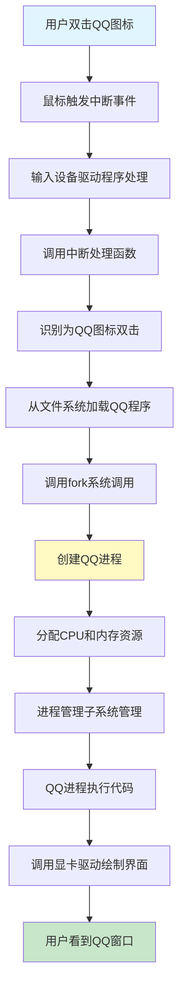

**详细过程分析**：

1. **立项阶段**：
   - 运行QQ需要单独立项（创建进程）
   - 程序 = 项目执行计划书（静态的二进制文件）
   - 进程 = 项目的执行（动态的运行状态）
   - 程序存储在**文件系统**中

2. **资源分配**：
   - 每个进程需要独立的内存空间（类比：独立的会议室）
   - 通过**内存管理子系统**分配和管理
   - 避免进程间相互干扰

3. **执行管理**：
   - CPU按照二进制代码逐行执行
   - **进程管理子系统**负责调度
   - 多个进程并发运行时需要CPU调度能力

4. **系统调用**：
   - 进程不能直接操作硬件
   - 必须通过**系统调用**（System Call）请求服务
   - 类比：办事大厅统一提供服务

5. **交互过程**：
   - 用户通过键盘输入字符（如"a"）
   - 键盘驱动触发中断，通知操作系统
   - 操作系统将事件传递给QQ进程
   - QQ进程处理后，调用显卡驱动在屏幕上绘制"a"

#### 1.1.4 Linux内核体系结构

Linux内核主要包含以下几个核心子系统：

##### 系统总体架构图

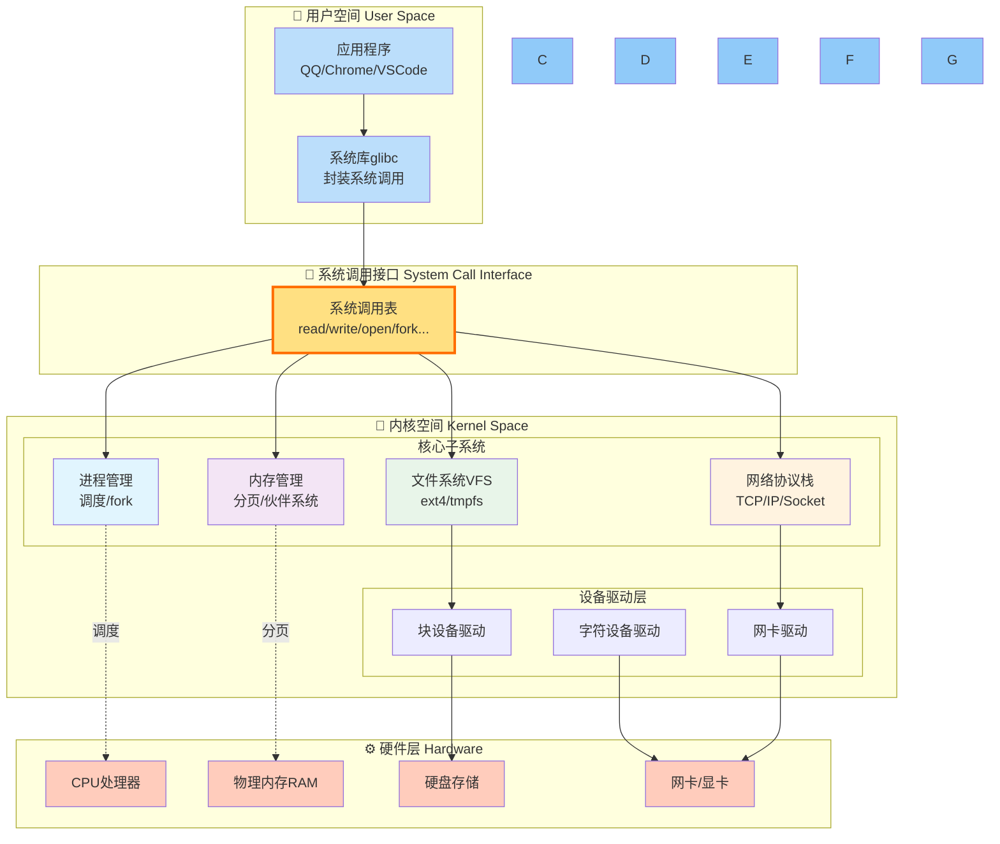

**各子系统的作用**：

1. **进程管理子系统**（Process Management Subsystem）
   - 管理进程的创建、调度、销毁
   - 类比：项目管理部门，负责项目立项、执行、结项

2. **内存管理子系统**（Memory Management Subsystem）
   - 管理物理内存和虚拟内存
   - 类比：会议室管理部门，分配和管理办公空间

3. **文件管理子系统**（File Management Subsystem）
   - 管理文件的存储、读写、组织
   - 类比：档案库管理部门，保存各种项目文档

4. **设备驱动程序**
   - 管理硬件设备的输入输出
   - 类比：客户对接员和交付人员

5. **网络协议栈**
   - 管理网络通信
   - 类比：对外合作部门

---

### 1.2 Linux命令快速上手

Linux的一大特点是**命令行（Command Line）模式**。命令行就像"行业黑话"，只有使用正确的术语，Linux才能理解你的需求。

#### 1.2.1 用户与密码管理

##### 用户账户

**Root用户**：

- Linux的超级管理员账户
- 拥有最高操作权限
- 对应Windows的Administrator

**创建普通用户**：

```bash
# 创建用户
useradd cliu8

# 设置密码
passwd cliu8

# 创建用户并指定组
useradd -g groupname username

# 查看命令帮助
useradd -h
man useradd
```

**用户配置文件**：

- `/etc/passwd`：存储用户信息
- `/etc/group`：存储组信息

`/etc/passwd`文件格式：

```
root:x:0:0:root:/root:/bin/bash
cliu8:x:1000:1000::/home/cliu8:/bin/bash
```

字段说明：

1. 用户名
2. 密码占位符（x表示密码存储在shadow文件中）
3. 用户ID（UID）
4. 组ID（GID）
5. 用户描述
6. 主目录（Home Directory）
7. 默认Shell

#### 1.2.2 文件浏览与权限管理

##### 基本命令

```bash
# 切换目录
cd /path/to/directory
cd ..    # 上级目录
cd .     # 当前目录

# 列出文件
ls
ls -l    # 列表形式显示详细信息
ls -la   # 显示所有文件（包括隐藏文件）
```

##### 文件权限

`ls -l`输出示例：

```
drwxr-xr-x 6 root root 4096 Oct 20 2017 apt
-rw-r--r-- 1 root root  211 Oct 20 2017 hosts
```

**权限位解析**：

```
-rw-r--r--
│└┬┘└┬┘└┬┘
│ │  │  └─ 其他用户权限 (r--): 只读
│ │  └──── 所属组权限 (r--): 只读
│ └─────── 所属用户权限 (rw-): 读写
└───────── 文件类型 (-: 普通文件, d: 目录)
```

**权限字符**：

- `r` (read): 读权限
- `w` (write): 写权限
- `x` (execute): 执行权限
- `-`: 无权限

**权限修改命令**：

```bash
chmod 711 filename  # 数字方式修改权限
chown user filename # 修改所属用户
chgrp group filename # 修改所属组
```

#### 1.2.3 软件安装与管理

##### 安装包方式

**CentOS体系（使用rpm）**：

```bash
# 安装
rpm -i jdk-XXX_linux-x64_bin.rpm

# 查询已安装软件
rpm -qa
rpm -qa | grep jdk

# 删除软件
rpm -e package-name
```

**Ubuntu体系（使用deb）**：

```bash
# 安装
dpkg -i jdk-XXX_linux-x64_bin.deb

# 查询已安装软件
dpkg -l
dpkg -l | grep jdk

# 删除软件
dpkg -r package-name
```

##### 软件管理器方式

**CentOS - yum**：

```bash
yum search jdk              # 搜索软件
yum install java-11-openjdk # 安装软件
yum erase java-11-openjdk   # 卸载软件
```

**Ubuntu - apt-get**：

```bash
apt-cache search jdk        # 搜索软件
apt-get install openjdk-9-jdk  # 安装软件
apt-get purge openjdk-9-jdk    # 卸载软件
```

**软件源配置**：

- CentOS: `/etc/yum.repos.d/CentOS-Base.repo`
- Ubuntu: `/etc/apt/sources.list`

建议选择国内镜像源（如163.com）以提高下载速度。

##### 压缩包方式

```bash
# 下载
wget http://example.com/jdk-XXX_linux-x64_bin.tar.gz

# 解压
tar xvzf jdk-XXX_linux-x64_bin.tar.gz

# 配置环境变量
export JAVA_HOME=/root/jdk-XXX_linux-x64
export PATH=$JAVA_HOME/bin:$PATH

# 永久生效（写入.bashrc）
vim ~/.bashrc
# 添加上面的export命令
source ~/.bashrc
```

#### 1.2.4 文本编辑器vim

**基本操作**：

```bash
vim filename  # 打开/创建文件
```

**常用命令**：

- `i`: 进入插入模式（编辑）
- `ESC`: 退出插入模式
- `:w`: 保存
- `:q`: 退出
- `:wq`: 保存并退出
- `:q!`: 不保存强制退出

#### 1.2.5 程序运行

##### 交互式运行

```bash
./program    # 当前目录运行
program      # PATH路径下可直接运行
```

**特点**：

- 命令行退出，程序停止
- 适合简单、短期的任务

##### 后台运行

```bash
nohup command >out.file 2>&1 &
```

**参数说明**：

- `nohup`: no hang up，命令行退出程序继续运行
- `>out.file`: 标准输出重定向到文件
- `2>&1`: 标准错误输出合并到标准输出
- `&`: 后台运行

**进程管理**：

```bash
# 查看进程
ps -ef | grep keyword

# 杀死进程
ps -ef | grep keyword | awk '{print $2}' | xargs kill -9
# 或者
kill -9 PID
```

##### 服务方式运行

```bash
# Ubuntu
systemctl start mysql    # 启动服务
systemctl stop mysql     # 停止服务
systemctl enable mysql   # 设置开机启动
systemctl status mysql   # 查看服务状态

# CentOS (以MariaDB为例)
systemctl start mariadb
systemctl enable mariadb
```

**服务配置文件**：

- Ubuntu: `/lib/systemd/system/XXX.service`
- CentOS: `/usr/lib/systemd/system/XXX.service`

##### 系统关机与重启

```bash
shutdown -h now  # 立即关机
reboot           # 重启
```

---

### 1.3 系统调用详解

> 系统调用是用户程序与操作系统内核交互的唯一接口，它决定了操作系统的能力边界。

#### 1.3.1 什么是系统调用

**定义**：系统调用（System Call）是操作系统提供给用户程序的一组API接口，用于请求内核提供的服务。

**类比**：办事大厅的服务窗口

- 明文列出提供哪些服务
- 统一的服务入口
- 规范的服务流程

**重要性**：

- 系统调用的质量决定操作系统的好用程度
- 功能全面性影响应用程序的能力范围

#### 1.3.2 主要系统调用分类

##### 1. 进程管理类

**fork - 创建进程**：

```c
pid_t fork(void);
```

工作原理：

- 父进程调用fork创建子进程
- 子进程拷贝父进程的所有数据结构
- 通过返回值区分父子进程：
  - 子进程返回0
  - 父进程返回子进程PID

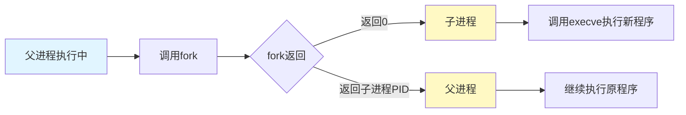

**特点**：采用"先拷贝，再修改"的策略

**execve - 执行新程序**：

```c
int execve(const char *filename, char *const argv[], char *const envp[]);
```

**waitpid - 等待子进程**：

```c
pid_t waitpid(pid_t pid, int *status, int options);
```

作用：父进程等待子进程结束，获取子进程退出状态

**进程家族树**：

- 所有进程都由"祖宗进程"fork而来
- 系统启动时创建第一个init进程
- 形成进程树结构

##### 2. 内存管理类

**独立内存空间**：

- 每个进程拥有独立的虚拟内存空间
- 32位系统：4GB
- 64位系统：更大

**内存空间布局**：

- **代码段**（Code Segment）：存放程序代码
- **数据段**（Data Segment）：存放运行时数据
  - 栈（Stack）：局部变量，函数结束自动释放
  - 堆（Heap）：动态分配，需要显式释放

**内存分配系统调用**：

```c
// brk - 小块内存分配（与原堆连续）
int brk(void *addr);

// mmap - 大块内存分配（独立区域）
void *mmap(void *addr, size_t length, int prot, int flags, 
           int fd, off_t offset);
```

**虚拟内存机制**：

- 进程申请内存时先登记，不立即分配物理内存
- 真正写入数据时触发缺页中断
- 此时才分配实际物理内存

##### 3. 文件管理类

**"一切皆文件"**理念：

- 普通文件：二进制文件、文本文件
- 设备文件：硬件设备
- 管道文件：进程间通信
- Socket文件：网络通信
- 目录：也是特殊文件
- `/proc`：进程信息也以文件形式呈现

**核心文件操作**：

```c
// 打开文件
int open(const char *pathname, int flags, mode_t mode);

// 创建文件
int creat(const char *pathname, mode_t mode);

// 关闭文件
int close(int fd);

// 定位文件
off_t lseek(int fd, off_t offset, int whence);

// 读文件
ssize_t read(int fd, void *buf, size_t count);

// 写文件
ssize_t write(int fd, const void *buf, size_t count);
```

**文件描述符**（File Descriptor）：

- 整数，标识打开的文件
- 统一了所有文件类型的操作接口
- 标准文件描述符：
  - 0: stdin（标准输入）
  - 1: stdout（标准输出）
  - 2: stderr（标准错误输出）

##### 4. 信号处理类

**信号**（Signal）：用于异常处理和进程间通知

**常见信号**：

- `SIGINT`（Ctrl+C）：中断信号
- `SIGKILL`：终止进程（不可忽略）
- `SIGSTOP`：停止进程（不可忽略）
- `SIGSEGV`：非法内存访问
- 硬件故障信号

**信号处理方式**：

1. 忽略（某些信号可以）
2. 执行默认动作
3. 自定义处理函数

```c
// 注册信号处理函数
int sigaction(int signum, const struct sigaction *act, 
               struct sigaction *oldact);
```

##### 5. 进程间通信类

**消息队列**（Message Queue）：

```c
int msgget(key_t key, int msgflg);      // 创建消息队列
int msgsnd(int msqid, const void *msgp, size_t msgsz, int msgflg);  // 发送
ssize_t msgrcv(int msqid, void *msgp, size_t msgsz, long msgtyp, int msgflg);  // 接收
```

**共享内存**（Shared Memory）：

```c
int shmget(key_t key, size_t size, int shmflg);  // 创建共享内存
void *shmat(int shmid, const void *shmaddr, int shmflg);  // 映射到进程空间
```

特点：零拷贝，效率最高

**信号量**（Semaphore）：

```c
int sem_wait(sem_t *sem);   // P操作，申请资源
int sem_post(sem_t *sem);   // V操作，释放资源
```

作用：解决共享资源的互斥访问问题

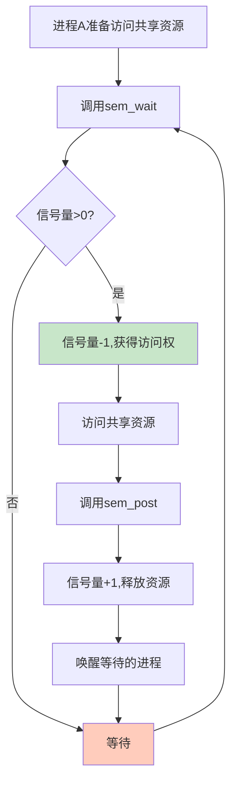

##### 6. 网络通信类

**Socket通信**：

```c
// 创建Socket
int socket(int domain, int type, int protocol);

// 绑定地址
int bind(int sockfd, const struct sockaddr *addr, socklen_t addrlen);

// 监听连接
int listen(int sockfd, int backlog);

// 接受连接
int accept(int sockfd, struct sockaddr *addr, socklen_t *addrlen);

// 连接服务器
int connect(int sockfd, const struct sockaddr *addr, socklen_t addrlen);
```

**特点**：

- Socket也是文件，有文件描述符
- 可通过read/write进行通信
- 支持TCP/IP协议栈

#### 1.3.3 系统调用的实现

**系统调用表**：

在`unistd_64.h`中定义：

```c
#define __NR_read 0
#define __NR_write 1
#define __NR_open 2
#define __NR_close 3
#define __NR_fork 57
#define __NR_execve 59
...
```

每个系统调用对应一个编号。

**调用过程**：

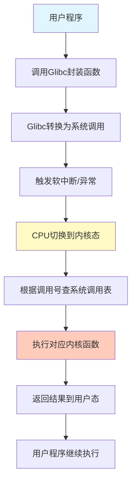

#### 1.3.4 Glibc与系统调用

**Glibc的作用**：

- GNU C Library，Linux的标准C库
- 封装系统调用，提供更友好的API
- 提供用户态服务（字符串处理、数学运算等）

**映射关系**：

- 一对一：`open()` → `sys_open`
- 一对多：`printf()` → `sys_open` + `sys_write` + `sys_close`
- 多对一：`malloc()` + `calloc()` + `free()` → `sys_brk`

**为什么需要Glibc**：

- 简化编程，提供更高层次的抽象
- 跨平台兼容性
- 错误处理和参数检查

**调试工具strace**：

```bash
strace ls    # 跟踪ls命令的系统调用
strace -c program  # 统计系统调用次数
```

---

### 1.4 总结

#### 1.4.1 核心要点

1. **Linux内核 = 软件外包公司老板**
   - 通过这个类比理解各个子系统的职责
   - 进程 = 项目，系统调用 = 办事大厅

2. **内核体系结构**
   - 进程管理子系统：调度和管理进程
   - 内存管理子系统：分配和管理内存
   - 文件管理子系统：组织和存储文件
   - 设备驱动：管理硬件输入输出
   - 网络协议栈：处理网络通信

3. **命令行操作**
   - 用户管理：`useradd`、`passwd`
   - 文件浏览：`ls`、`cd`、`vim`
   - 软件安装：`yum`/`apt-get`、`rpm`/`dpkg`
   - 程序运行：交互式、后台、服务

4. **系统调用**
   - 用户程序与内核的唯一接口
   - 六大类：进程管理、内存管理、文件管理、信号处理、IPC、网络通信
   - Glibc封装系统调用，提供友好API

5. **一切皆文件**
   - 统一了操作接口
   - 简化了编程模型
   - 文件描述符是核心抽象

#### 1.4.2 学习建议

1. **动手实践**：
   - 按照命令操作步骤实际操作
   - 安装JDK和MySQL练习
   - 使用strace查看系统调用

2. **阅读源码**：
   - 下载Linux内核源码
   - 查看`unistd_64.h`中的系统调用定义
   - 理解各子系统的代码组织

3. **建立关联**：
   - 将命令操作与系统调用对应起来
   - 理解每个操作背后的内核机制

4. **深入类比**：
   - 牢记"软件外包公司"的类比
   - 用类比思维理解复杂概念

#### 1.4.3 常用命令速查表

| 功能 | 命令 | 说明 |
|------|------|------|
| 用户管理 | `useradd/passwd` | 创建用户和设置密码 |
| 文件浏览 | `ls -l / cd / pwd` | 列出文件/切换目录/当前路径 |
| 权限管理 | `chmod / chown / chgrp` | 修改权限/所有者/组 |
| 软件安装 | `yum/apt-get install` | 安装软件包 |
| 软件查询 | `rpm -qa / dpkg -l` | 查看已安装软件 |
| 文本编辑 | `vim` | 编辑文件 |
| 进程管理 | `ps -ef / kill` | 查看进程/终止进程 |
| 后台运行 | `nohup ... &` | 后台运行程序 |
| 服务管理 | `systemctl start/stop` | 启动/停止服务 |
| 管道过滤 | `grep / awk / less` | 过滤和分页显示 |

---

## 第2章 系统初始化
### 2.1 x86架构：开放的营商环境


> **核心思想**：系统初始化是Linux从"个体户"成长为"大公司"的过程，从实模式到保护模式，从BIOS到内核，逐步建立起完整的运行环境。


#### 2.1.1 计算机的工作模式

计算机的核心是**CPU**（Central Processing Unit），所有设备都围绕它展开。类比到公司，CPU就是真正干活的程序员，是营商环境中最重要的部分。

##### 核心组件

**CPU内部组成**：

1. **运算单元**
   - 负责执行各种运算（加法、位移等）
   - 不知道操作哪些数据，结果放哪里

2. **数据单元**
   - CPU内部缓存和寄存器组
   - 空间小但速度快
   - 暂存数据和运算结果

3. **控制单元**
   - 统一指挥中心
   - 获取并执行指令
   - 指导运算单元操作数据

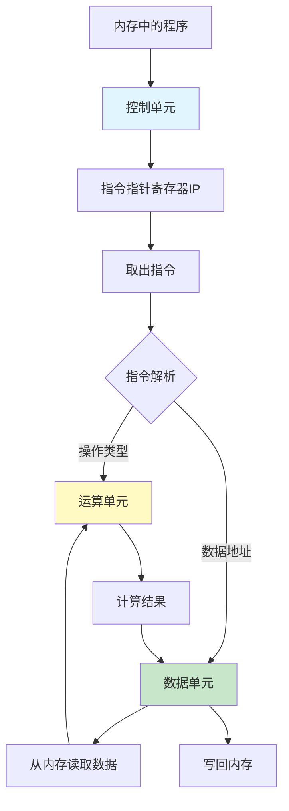

**总线系统**：

- **地址总线**（Address Bus）：传输内存地址
  - 位数决定可访问的地址范围
  - 例如：20位可访问1M（2^20）
  
- **数据总线**（Data Bus）：传输实际数据
  - 位数决定一次传输的数据量
  - 位数越多，访问速度越快

#### 2.1.2 x86架构的历史

**IBM PC的诞生**：

- IBM采用英特尔8086芯片和微软MS-DOS
- 因垄断被诉，被迫公开技术
- 促成IBM-PC兼容机的大量出现
- 形成开放的行业标准

**x86的三大原则**：

1. **标准化**：统一的处理器架构
2. **开放性**：技术公开，生态繁荣
3. **兼容性**：向后兼容，持续发展

#### 2.1.3 8086处理器详解

**寄存器组织**：

```
通用寄存器（16位）:
  AX, BX, CX, DX    - 可分为8位使用 (AH/AL, BH/BL, CH/CL, DH/DL)
  SP, BP, SI, DI    - 栈和索引寄存器

段寄存器（16位）:
  CS - 代码段寄存器
  DS - 数据段寄存器  
  SS - 栈段寄存器
  ES - 扩展段寄存器

指令指针:
  IP - 指向下一条指令的位置
```

**内存寻址方式**：

- CS/DS保存段起始地址（16位）
- IP/通用寄存器保存偏移量（16位）
- 物理地址 = 段地址 × 16 + 偏移量
- 最大寻址：2^20 = 1MB
- 段大小限制：2^16 = 64KB

**示例**：

```
段地址CS: 0x1000 (实际地址 0x10000)
偏移量IP:  0x0050
物理地址 = 0x10000 + 0x0050 = 0x10050
```

#### 2.1.4 32位处理器的演进

**扩展的寄存器**：

- 16位寄存器扩展为32位
- 保持向下兼容（仍可使用16位和8位）
- IP扩展为EIP（32位）

**段寄存器的重新定义**：


**两种模式**：

| 模式 | 地址空间 | 特点 | 使用场景 |
|------|----------|------|----------|
| **实模式** | 1MB | 简单直接，段地址×16+偏移 | 系统启动初期 |
| **保护模式** | 4GB (32位) | 灵活强大，通过描述符表寻址 | 正常运行 |

**模式切换**：

- 系统启动时处于实模式（兼容）
- 逐步切换到保护模式（更强大）
- 不能无缝切换，需要特定操作

**保护模式的优势**：

1. 可访问更大内存空间（4GB）
2. 段起始地址更灵活
3. 支持内存保护机制
4. 为多任务系统提供基础

---

### 2.2 从BIOS到Bootloader

#### 2.2.1 BIOS时期

**加电启动过程**：

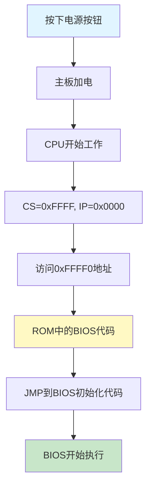

**BIOS的职责**：

1. **硬件检测**（POST - Power-On Self-Test）
   - 检查RAM、CPU、外设等是否正常
   - 类比：创业指导手册第一条

2. **建立中断向量表**
   - 设置中断服务程序
   - 处理键盘、鼠标等输入设备
   - 类比：建立办事大厅，自己当办事员

3. **显示输出**
   - 映射显存空间
   - 在显示器上显示信息
   - 类比：充当客户对接人

**内存映射**：

```
0xF0000 - 0xFFFFF: ROM (BIOS代码)
0xFFFF0: 第一条指令的位置
实模式下：1MB地址空间
```

#### 2.2.2 Bootloader时期

**GRUB2的作用**：

GRUB (Grand Unified Bootloader Version 2) 是Linux的启动管理器。

**启动盘特征**：

- 位于第一个扇区（MBR）
- 占512字节
- 以`0xAA55`结束

**GRUB2的组成**：

1. **boot.img** (512字节)
   - 安装在MBR
   - 由boot.S编译而成
   - 加载到内存0x7c00运行
   - 负责加载core.img

2. **core.img** (更大更复杂)
   - diskboot.img: 从硬盘加载
   - lzma_decompress.img: 解压缩程序
   - kernel.img: GRUB的内核（不是Linux内核）
   - 各种模块

**GRUB配置示例**：

```bash
menuentry 'CentOS Linux (3.10.0-862.el7.x86_64)' {
    load_video
    set gfxpayload=keep
    insmod gzio
    insmod part_msdos
    insmod ext2
    set root='hd0,msdos1'
    linux16 /boot/vmlinuz-3.10.0-862.el7.x86_64 root=UUID=...
    initrd16 /boot/initramfs-3.10.0-862.el7.x86_64.img
}
```

#### 2.2.3 从实模式切换到保护模式

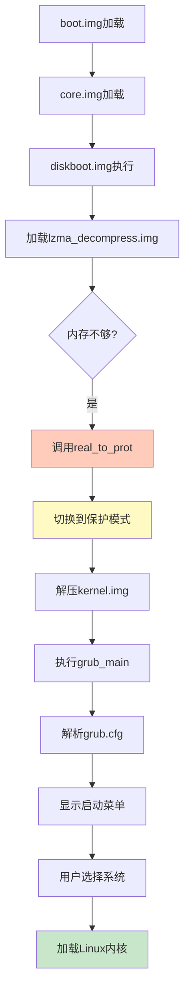

**切换保护模式的步骤**：

1. **启用分段**
   - 建立段描述符表（GDT）
   - 段寄存器变成段选择子
   - 指向段描述符

2. **启用分页**
   - 管理更大的内存
   - 将内存分成相等大小的块

3. **打开Gate A20**
   - 第21根地址线
   - 实模式下只有20根（1MB）
   - 保护模式需要21根及以上

**类比**：

- 个体户模式 → 老板角色
- 所有东西都是自己的 → 需要划分权限
- 本小利微 → 可以雇人做大项目

---

### 2.3 内核初始化

#### 2.3.1 start_kernel函数

`start_kernel`是内核的main函数，位于`init/main.c`。它包含大量初始化函数`XXXX_init()`。

**初始化顺序**：

1. **创建0号进程init_task**

   ```c
   set_task_stack_end_magic(&init_task);
   ```

   - 第一个进程，唯一不通过fork创建的
   - 进程列表的第一个

2. **初始化中断trap_init()**

   ```c
   set_system_intr_gate(IA32_SYSCALL_VECTOR, entry_INT80_32);
   ```

   - 设置中断门
   - 包括系统调用的中断门

3. **初始化内存mm_init()**
   - 初始化内存管理模块
   - 类比：会议室管理系统

4. **初始化调度sched_init()**
   - 项目调度需要调度策略
   - 类比：项目管理流程

5. **初始化VFS vfs_caches_init()**
   - 初始化虚拟文件系统rootfs
   - 注册rootfs_fs_type

6. **rest_init()**
   - 其他方面的初始化

#### 2.3.2 创建1号进程

```c
kernel_thread(kernel_init, NULL, CLONE_FS);
```

**1号进程的意义**：

- "划时代"的进程
- 第一个用户态进程
- 用户进程的祖先（所有用户进程的根）

**用户态与内核态**：

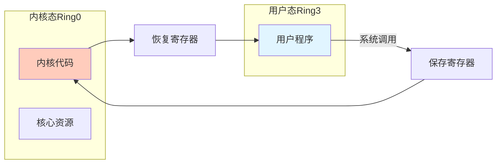

**权限保护机制**：

- x86提供4个Ring（0-3）
- Ring0：内核态，最高权限
- Ring3：用户态，受限权限
- 用户态不能直接访问核心资源
- 必须通过系统调用请求服务

**系统调用过程**：

```
用户态 → 系统调用 → 保存寄存器 → 内核态执行 → 恢复寄存器 → 返回用户态
```

#### 2.3.3 从内核态到用户态

**关键函数调用链**：

```
kernel_init
  → kernel_init_freeable
    → ramdisk_execute_command = "/init"
  → run_init_process(ramdisk_execute_command)
    → do_execve
      → exec_binprm
        → search_binary_handler
          → load_elf_binary
            → start_thread
```

**start_thread的作用**：

```c
void start_thread(struct pt_regs *regs, unsigned long new_ip, unsigned long new_sp) {
    regs->cs = __USER_CS;     // 用户态代码段
    regs->ds = __USER_DS;     // 用户态数据段
    regs->ss = __USER_DS;     // 用户态栈段
    regs->ip = new_ip;        // 指令指针
    regs->sp = new_sp;        // 栈指针
    force_iret();             // 强制iret返回
}
```

**如何实现跃迁**：

1. 补上系统调用时保存寄存器的步骤
2. 设置用户态的CS、DS、IP、SP
3. 使用`iret`指令返回
4. 恢复寄存器时，指向用户态地址
5. 成功进入用户态

#### 2.3.4 ramdisk的作用

**为什么需要ramdisk**：

- 内核需要加载存储设备上的/init
- 访问存储设备需要驱动程序
- 驱动太多，无法全部放入内核
- 基于内存的文件系统不需要驱动

**启动流程**：

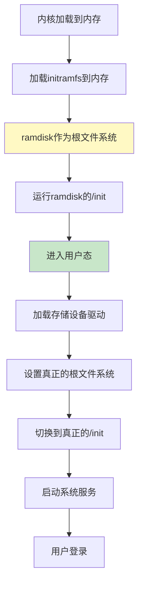

**initramfs参数**：

```bash
initrd16 /boot/initramfs-3.10.0-862.el7.x86_64.img
```

#### 2.3.5 创建2号进程

```c
kernel_thread(kthreadd, NULL, CLONE_FS | CLONE_FILES);
```

**2号进程的作用**：

- 内核态所有线程的祖先
- 负责内核态线程的调度和管理
- 函数名kthreadd负责所有内核态线程

**进程vs线程**：

- **用户态视角**：进程是项目，线程是项目中的执行人员
- **内核态视角**：都统称为任务（Task），使用相同数据结构

**三个重要进程**：

1. **0号进程**：创始进程，系统init_task
2. **1号进程**：用户态进程祖先
3. **2号进程**：内核态进程祖先

---

### 2.4 系统调用的实现机制

#### 系统调用完整流程序列图

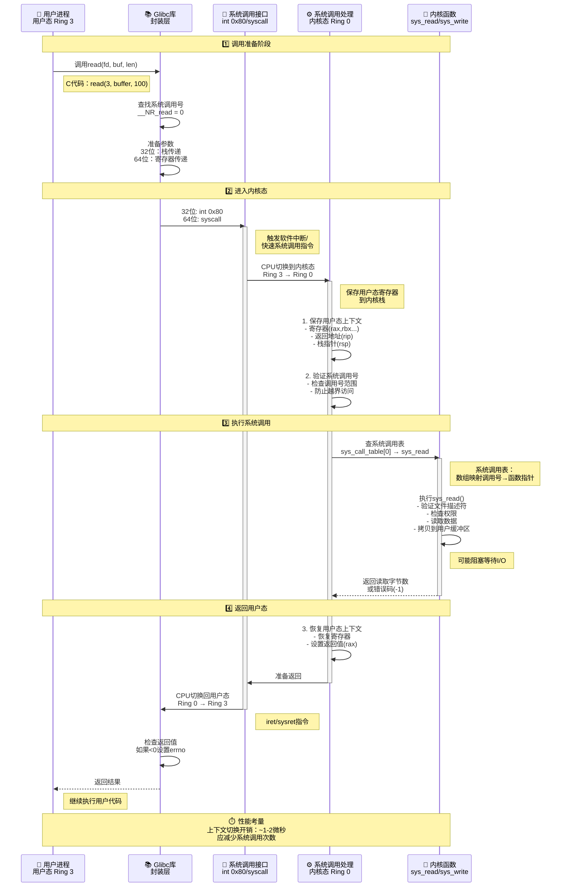

**系统调用流程关键点**：

| 阶段 | 执行环境 | 关键操作 | 数据结构 |
|------|---------|---------|----------|
| **调用准备** | 用户态 Ring 3 | 准备参数、查调用号 | Glibc封装函数 |
| **陷入内核** | 切换中 | int 0x80/syscall指令 | IDT中断描述符表 |
| **保存上下文** | 内核态 Ring 0 | 保存寄存器到内核栈 | pt_regs结构 |
| **查表执行** | 内核态 Ring 0 | sys_call_table[nr] | 系统调用表 |
| **内核函数** | 内核态 Ring 0 | sys_read()等 | 内核数据结构 |
| **恢复上下文** | 内核态 Ring 0 | 恢复寄存器、设置返回值 | pt_regs结构 |
| **返回用户** | 切换中 | iret/sysret指令 | - |
| **继续执行** | 用户态 Ring 3 | 检查errno | Glibc处理 |

**32位 vs 64位系统调用差异**：

| 项目 | 32位 (x86) | 64位 (x86-64) |
|------|-----------|---------------|
| **陷入指令** | `int 0x80` | `syscall` |
| **返回指令** | `iret` | `sysret` |
| **调用号寄存器** | `eax` | `rax` |
| **参数传递** | 栈（ebx,ecx,edx...） | 寄存器（rdi,rsi,rdx,r10,r8,r9） |
| **系统调用表** | `sys_call_table` | `sys_call_table` |
| **性能** | 较慢（中断） | 较快（专用指令） |

**核心理解**：

1. **特权级切换**：从Ring 3（用户态）到Ring 0（内核态）
2. **上下文保存**：必须保存所有寄存器，保证能正确返回
3. **系统调用表**：通过数组索引快速定位内核函数（函数指针数组）
4. **参数传递**：64位使用寄存器更高效，32位使用栈
5. **性能开销**：上下文切换约1-2微秒，应尽量减少系统调用次数（如批量I/O）
6. **Glibc封装**：提供类型安全和错误处理（errno）

#### 2.4.1 glibc对系统调用的封装

**系统调用配置**（syscalls.list）：

```
# File name  Caller  Syscall name  Args  Strong name  Weak names
open         -       open          Ci:siv __libc_open  __open open
```

**生成过程**：

1. make-syscall.sh脚本解析配置
2. 生成宏定义：`#define SYSCALL_NAME open`
3. syscall-template.S定义调用方式
4. 生成封装函数

#### 2.4.2 32位系统调用过程

**参数传递**（通过寄存器）：

```
系统调用号    %eax
参数1         %ebx
参数2         %ecx
参数3         %edx
参数4         %esi
参数5         %edi
参数6         %ebp
```

**调用流程**：

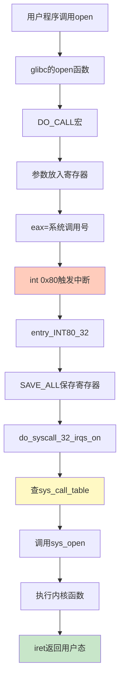

**关键代码**：

```c
// 触发中断
#define ENTER_KERNEL int $0x80

// 中断处理
ENTRY(entry_INT80_32)
    pushl %eax
    SAVE_ALL
    movl %esp, %eax
    call do_syscall_32_irqs_on

// 查表调用
if (likely(nr < IA32_NR_syscalls)) {
    regs->ax = ia32_sys_call_table[nr](...);
}

// 返回用户态
#define INTERRUPT_RETURN iret
```

#### 2.4.3 64位系统调用过程

**参数传递**（64位寄存器）：

```
系统调用号    rax
参数1         rdi
参数2         rsi
参数3         rdx
参数4         r10
参数5         r8
参数6         r9
```

**不同之处**：

- 使用`syscall`指令（非中断）
- 使用MSR（Model Specific Registers）
- 更快的切换速度

**MSR寄存器设置**：

```c
// 系统初始化
wrmsrl(MSR_LSTAR, (unsigned long)entry_SYSCALL_64);
```

**调用流程**：

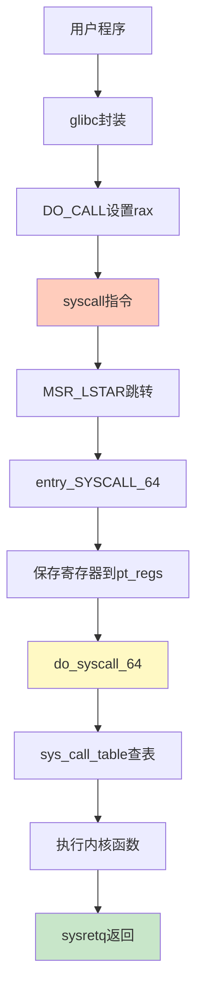

#### 2.4.4 系统调用表的生成

**定义文件**：

- 32位：`arch/x86/entry/syscalls/syscall_32.tbl`
- 64位：`arch/x86/entry/syscalls/syscall_64.tbl`

**示例定义**：

```
# 32位
5  i386   open    sys_open  compat_sys_open

# 64位  
2  common open    sys_open
```

**系统调用宏**：

```c
SYSCALL_DEFINE3(open, const char __user *, filename, int, flags, umode_t, mode)
{
    if (force_o_largefile())
        flags |= O_LARGEFILE;
    return do_sys_open(AT_FDCWD, filename, flags, mode);
}
```

**宏展开后**：

```c
asmlinkage long sys_open(const char __user * filename, int flags, int mode)
{
    long ret;
    if (force_o_largefile())
        flags |= O_LARGEFILE;
    ret = do_sys_open(AT_FDCWD, filename, flags, mode);
    return ret;
}
```

**生成过程**：

1. syscallhdr.sh生成`#define __NR_open`
2. syscalltbl.sh生成`__SYSCALL(__NR_open, sys_open)`
3. 生成unistd_32.h和unistd_64.h
4. 包含头文件形成系统调用表

**32位系统调用表**：

```c
__visible const sys_call_ptr_t ia32_sys_call_table[__NR_syscall_compat_max+1] = {
    [0 ... __NR_syscall_compat_max] = &sys_ni_syscall,
    #include <asm/syscalls_32.h>
};
```

**64位系统调用表**：

```c
asmlinkage const sys_call_ptr_t sys_call_table[__NR_syscall_max+1] = {
    [0 ... __NR_syscall_max] = &sys_ni_syscall,
    #include <asm/syscalls_64.h>
};
```

---

### 2.5 总结

#### 2.5.1 核心要点

1. **x86架构**
   - 开放、标准、兼容的三大原则
   - 实模式（1MB）→ 保护模式（4GB）
   - 寄存器组织：通用、段、指令指针
   - 总线系统：地址总线、数据总线

2. **启动流程**
   - BIOS：硬件检测、中断向量、显示输出
   - Bootloader：boot.img → core.img → GRUB
   - 实模式切换到保护模式

3. **内核初始化**
   - start_kernel：各子系统初始化
   - 0号进程：创始进程
   - 1号进程：用户态祖先
   - 2号进程：内核态祖先
   - ramdisk：临时根文件系统

4. **系统调用**
   - 32位：int 0x80中断方式
   - 64位：syscall指令方式
   - 通过寄存器传递参数
   - 系统调用表：编号到函数的映射

#### 2.5.2 启动流程图

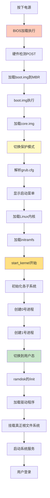

#### 2.5.3 关键数据结构

| 结构 | 作用 | 说明 |
|------|------|------|
| pt_regs | 保存寄存器 | 系统调用时保存用户态上下文 |
| task_struct | 进程描述符 | 描述进程的所有信息 |
| 系统调用表 | 调用映射 | 系统调用号到函数的映射 |
| GDT | 全局描述符表 | 保护模式下的段描述符 |

#### 2.5.4 学习建议

1. **理解模式切换**
   - 实模式到保护模式的必要性
   - 用户态和内核态的权限划分

2. **跟踪启动过程**
   - 从BIOS到内核的完整流程
   - 各个阶段的作用和转换

3. **掌握系统调用**
   - 理解系统调用的实现机制
   - 32位和64位的区别

4. **实践验证**
   - 使用strace跟踪系统调用
   - 查看Linux内核源码
   - 尝试编写简单的系统调用

---

**下一章预告**：第3章将深入讲解进程管理，包括进程的数据结构、调度机制、创建过程等核心内容。

---
