# Linux 底层原理学习笔记 · 第二册：进程、线程与调度

## 第3章 进程管理（上）：进程与线程
### 3.1 进程创建与管理


> **核心思想**：进程是项目，线程是项目中的任务。掌握进程和线程的创建、管理和同步机制。

#### 进程生命周期状态转换图

```mermaid
graph LR
    NEW["🆕 新建<br/>TASK_NEW"]
    READY["✅ 就绪<br/>TASK_RUNNING<br/>(在就绪队列)"]
    RUNNING["⚡ 运行<br/>TASK_RUNNING<br/>(正在CPU上)"]
    INTERRUPTIBLE["💤 可中断睡眠<br/>TASK_INTERRUPTIBLE<br/>(等待资源/事件)"]
    UNINTERRUPTIBLE["🚫 不可中断睡眠<br/>TASK_UNINTERRUPTIBLE<br/>(I/O等待)"]
    STOPPED["⏸️ 停止<br/>TASK_STOPPED<br/>(Ctrl+Z/调试)"]
    ZOMBIE["👻 僵尸<br/>TASK_ZOMBIE<br/>(已终止未回收)"]
    EXIT["❌ 退出<br/>TASK_DEAD"]
    
    NEW -->|fork完成| READY
    READY -->|调度器选中| RUNNING
    RUNNING -->|时间片耗尽/被抢占| READY
    RUNNING -->|等待资源| INTERRUPTIBLE
    RUNNING -->|I/O操作| UNINTERRUPTIBLE
    RUNNING -->|信号SIGSTOP| STOPPED
    RUNNING -->|exit()| ZOMBIE
    
    INTERRUPTIBLE -->|资源可用/信号| READY
    INTERRUPTIBLE -->|信号SIGKILL| EXIT
    UNINTERRUPTIBLE -->|I/O完成| READY
    STOPPED -->|信号SIGCONT| READY
    STOPPED -->|信号SIGKILL| EXIT
    ZOMBIE -->|父进程wait()| EXIT
    
    style RUNNING fill:#4caf50,stroke:#2e7d32,stroke-width:3px,color:#fff
    style READY fill:#2196f3,stroke:#1565c0,color:#fff
    style INTERRUPTIBLE fill:#ff9800,stroke:#e65100,color:#fff
    style UNINTERRUPTIBLE fill:#f44336,stroke:#c62828,color:#fff
    style ZOMBIE fill:#9c27b0,stroke:#6a1b9a,color:#fff
    style NEW fill:#e0e0e0,stroke:#757575
    style EXIT fill:#424242,stroke:#212121,color:#fff
    style STOPPED fill:#ffeb3b,stroke:#f57f17
```

**状态说明**：

| 状态 | 宏定义 | 触发条件 | 能否被信号打断 |
|------|--------|----------|----------------|
| 新建 | TASK_NEW | fork()刚创建 | N/A |
| 就绪 | TASK_RUNNING | 在就绪队列等待CPU | 是 |
| 运行 | TASK_RUNNING | 正在CPU上执行 | 是 |
| 可中断睡眠 | TASK_INTERRUPTIBLE | wait()等待资源/事件 | **是** |
| 不可中断睡眠 | TASK_UNINTERRUPTIBLE | I/O操作 | **否** |
| 停止 | TASK_STOPPED | 收到SIGSTOP/调试断点 | 部分 |
| 僵尸 | TASK_ZOMBIE | 已exit()但未被回收 | 否 |
| 退出 | TASK_DEAD | 完全退出 | 否 |

**核心理解**：

1. **RUNNING状态双重含义**：既表示运行也表示就绪（都在runqueue中）
2. **睡眠状态区别**：INTERRUPTIBLE可被信号唤醒，UNINTERRUPTIBLE不可被打断（避免数据不一致）
3. **僵尸进程**：已终止但task_struct未释放，等待父进程收割（wait()）
4. **ps命令对应**：R=RUNNING, S=INTERRUPTIBLE, D=UNINTERRUPTIBLE, T=STOPPED, Z=ZOMBIE


#### 3.1.1 使用系统调用创建进程

**进程创建示例**（process.c）：

```c
#include <stdio.h>
#include <stdlib.h>
#include <sys/types.h>
#include <unistd.h>

extern int create_process(char* program, char** arg_list);

int create_process(char* program, char** arg_list) {
    pid_t child_pid;
    child_pid = fork();
    
    if (child_pid != 0)
        return child_pid;  // 父进程返回子进程PID
    else {
        execvp(program, arg_list);  // 子进程执行新程序
        abort();
    }
}
```

**调用示例**（createprocess.c）：

```c
#include <stdio.h>
#include <stdlib.h>
#include <sys/types.h>
#include <unistd.h>

extern int create_process(char* program, char** arg_list);

int main() {
    char* arg_list[] = {
        "ls",
        "-l",
        "/etc/yum.repos.d/",
        NULL
    };
    create_process("ls", arg_list);
    return 0;
}
```

**编译命令**：

```bash
gcc -c -fPIC process.c
gcc -c -fPIC createprocess.c
```

#### 3.1.2 ELF二进制格式

**ELF格式类型**：

1. **可重定位文件**（Relocatable File，.o文件）
   - 编译生成的中间文件
   - 可以链接成可执行文件或共享库

2. **可执行文件**（Executable File）
   - 可直接运行的程序
   - 包含程序入口地址

3. **共享对象文件**（Shared Object，.so文件）
   - 动态链接库
   - 运行时加载

**ELF文件结构**：

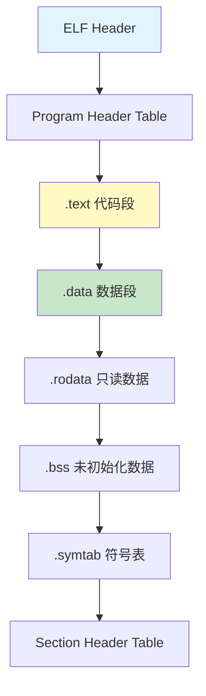

**主要Section说明**：

| Section | 内容 | 说明 |
|---------|------|------|
| `.text` | 可执行代码 | 编译后的机器指令 |
| `.data` | 已初始化全局变量 | 有初始值的全局/静态变量 |
| `.rodata` | 只读数据 | 字符串常量、const变量 |
| `.bss` | 未初始化全局变量 | 运行时置0 |
| `.symtab` | 符号表 | 函数和变量信息 |
| `.strtab` | 字符串表 | 符号名称 |

#### 3.1.3 静态链接库与动态链接库

**静态链接库**（.a文件）：

```bash
# 创建静态库
ar cr libstaticprocess.a process.o

# 链接静态库
gcc -o staticcreateprocess createprocess.o -L. -lstaticprocess
```

**特点**：

- ✅ 程序运行不依赖库文件
- ❌ 代码重复，浪费内存
- ❌ 库更新需重新编译

**动态链接库**（.so文件）：

```bash
# 创建动态库
gcc -shared -fPIC -o libdynamicprocess.so process.o

# 链接动态库
gcc -o dynamiccreateprocess createprocess.o -L. -ldynamicprocess

# 设置库搜索路径
export LD_LIBRARY_PATH=.
```

**特点**：

- ✅ 节省内存，多进程共享
- ✅ 库更新无需重新编译
- ❌ 运行时需要库文件

**PLT/GOT机制**：

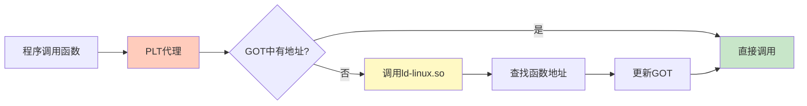

#### 3.1.4 进程加载与执行

**exec系列函数**：

```c
int execl(const char *path, const char *arg, ...);
int execlp(const char *file, const char *arg, ...);
int execle(const char *path, const char *arg, ..., char *const envp[]);
int execv(const char *path, char *const argv[]);
int execvp(const char *file, char *const argv[]);
int execve(const char *path, char *const argv[], char *const envp[]);
```

**函数名含义**：

- **p**：在PATH中搜索程序
- **v**：参数以数组形式传递
- **l**：参数以列表形式传递
- **e**：可传递环境变量

**加载流程**：

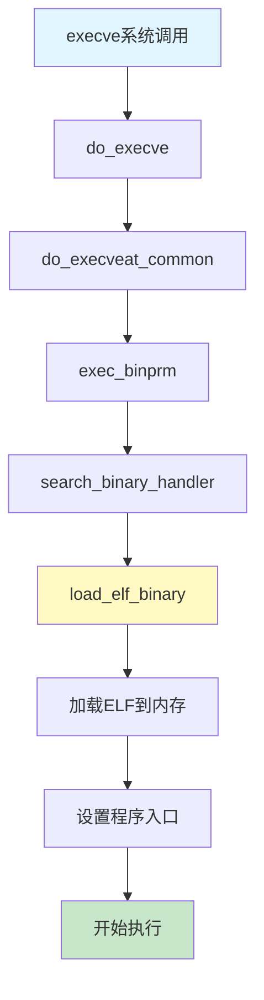

#### 3.1.5 进程树

**init进程**（PID 1）：

- 所有用户态进程的祖先
- CentOS 7: `/sbin/init -> /lib/systemd/systemd`

**kthreadd进程**（PID 2）：

- 所有内核态线程的祖先

**进程查看**：

```bash
ps -ef
# UID  PID  PPID  C STIME TTY      TIME CMD
# root   1     0  0 2018  ?    00:00:29 /usr/lib/systemd/systemd
# root   2     0  0 2018  ?    00:00:00 [kthreadd]
```

---

### 3.2 线程机制

#### 3.2.1 为什么需要线程

**线程的优势**：

1. **并行执行**
   - 多个任务同时进行
   - 充分利用多核CPU

2. **资源共享**
   - 共享进程的内存空间
   - 避免进程间通信开销

3. **响应性**
   - 前台任务和后台任务分离
   - 提高用户体验

**类比**：

- **进程** = 项目（独立的资源空间）
- **线程** = 项目中的任务（共享资源）

#### 3.2.2 创建线程

**线程创建示例**：

```c
#include <pthread.h>
#include <stdio.h>
#include <stdlib.h>

#define NUM_OF_TASKS 5

void *downloadfile(void *filename) {
    printf("I am downloading the file %s!\n", (char *)filename);
    sleep(10);
    long downloadtime = rand() % 100;
    printf("I finish downloading in %ld minutes!\n", downloadtime);
    pthread_exit((void *)downloadtime);
}

int main(int argc, char *argv[]) {
    char files[NUM_OF_TASKS][20] = {
        "file1.avi", "file2.rmvb", "file3.mp4",
        "file4.wmv", "file5.flv"
    };
    pthread_t threads[NUM_OF_TASKS];
    pthread_attr_t thread_attr;
    
    // 初始化线程属性
    pthread_attr_init(&thread_attr);
    pthread_attr_setdetachstate(&thread_attr, PTHREAD_CREATE_JOINABLE);
    
    // 创建线程
    for (int t = 0; t < NUM_OF_TASKS; t++) {
        printf("creating thread %d\n", t);
        int rc = pthread_create(&threads[t], &thread_attr,
                               downloadfile, (void *)files[t]);
        if (rc) {
            printf("ERROR: return code is %d\n", rc);
            exit(-1);
        }
    }
    
    pthread_attr_destroy(&thread_attr);
    
    // 等待线程结束
    for (int t = 0; t < NUM_OF_TASKS; t++) {
        long downloadtime;
        pthread_join(threads[t], (void**)&downloadtime);
        printf("Thread %d took %ld minutes\n", t, downloadtime);
    }
    
    pthread_exit(NULL);
}
```

**编译运行**：

```bash
gcc download.c -lpthread
./a.out
```

**线程创建流程**：

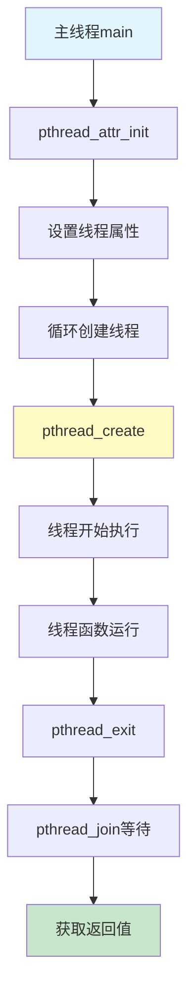

#### 3.2.3 线程数据

**三类数据**：

1. **线程栈数据**
   - 函数局部变量
   - 每个线程独立的栈空间
   - 默认8MB，可通过`pthread_attr_setstacksize`修改

2. **进程全局数据**
   - 全局变量
   - 所有线程共享
   - 需要同步保护

3. **线程私有数据**（Thread Specific Data）

   ```c
   pthread_key_t key;
   
   // 创建key
   pthread_key_create(&key, destructor_function);
   
   // 设置value
   pthread_setspecific(key, value);
   
   // 获取value
   void *data = pthread_getspecific(key);
   ```

#### 3.2.4 线程同步 - Mutex互斥锁

**Mutex原理**：

- Mutual Exclusion（互斥）
- 保护共享资源
- 同一时间只有一个线程访问

**转账示例（无锁 vs 有锁）**：

```c
#include <pthread.h>
#include <stdio.h>

int money_of_tom = 100;
int money_of_jerry = 100;
pthread_mutex_t g_money_lock;  // 互斥锁

void *transfer(void *notused) {
    pthread_t tid = pthread_self();
    printf("Thread %u is transfering money!\n", (unsigned int)tid);
    
    pthread_mutex_lock(&g_money_lock);      // 加锁
    
    sleep(rand() % 10);
    money_of_tom += 10;
    sleep(rand() % 10);
    money_of_jerry -= 10;
    
    pthread_mutex_unlock(&g_money_lock);    // 解锁
    
    printf("Thread %u finish transfering!\n", (unsigned int)tid);
    pthread_exit((void *)0);
}

int main() {
    pthread_t threads[5];
    
    pthread_mutex_init(&g_money_lock, NULL);  // 初始化锁
    
    // 创建5个线程进行转账
    for (int t = 0; t < 5; t++) {
        pthread_create(&threads[t], NULL, transfer, NULL);
    }
    
    // 主线程检查总金额
    for (int t = 0; t < 100; t++) {
        pthread_mutex_lock(&g_money_lock);
        printf("Total: %d\n", money_of_tom + money_of_jerry);
        pthread_mutex_unlock(&g_money_lock);
    }
    
    pthread_mutex_destroy(&g_money_lock);  // 销毁锁
    pthread_exit(NULL);
}
```

**Mutex使用流程**：

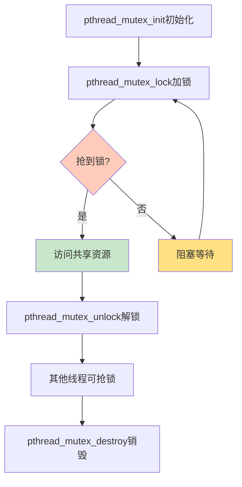

**Mutex函数**：

| 函数 | 说明 | 阻塞性 |
|------|------|--------|
| `pthread_mutex_lock` | 加锁 | 阻塞等待 |
| `pthread_mutex_trylock` | 尝试加锁 | 非阻塞，失败返回错误 |
| `pthread_mutex_unlock` | 解锁 | - |

#### 3.2.5 线程同步 - Condition条件变量

**条件变量**用于线程间的通知机制。

**生产者-消费者示例**：

```c
#include <pthread.h>
#include <stdio.h>

pthread_mutex_t g_mutex;
pthread_cond_t g_cond;
int g_avail = 0;  // 可用资源数量

void *consumer(void *arg) {
    pthread_mutex_lock(&g_mutex);
    
    while (g_avail == 0) {
        // 等待条件满足（有资源可用）
        pthread_cond_wait(&g_cond, &g_mutex);
    }
    
    // 消费资源
    g_avail--;
    printf("Consumer: consumed, avail=%d\n", g_avail);
    
    pthread_mutex_unlock(&g_mutex);
    return NULL;
}

void *producer(void *arg) {
    pthread_mutex_lock(&g_mutex);
    
    // 生产资源
    g_avail++;
    printf("Producer: produced, avail=%d\n", g_avail);
    
    // 通知等待的线程
    pthread_cond_signal(&g_cond);
    
    pthread_mutex_unlock(&g_mutex);
    return NULL;
}

int main() {
    pthread_t consumer_thread, producer_thread;
    
    pthread_mutex_init(&g_mutex, NULL);
    pthread_cond_init(&g_cond, NULL);
    
    pthread_create(&consumer_thread, NULL, consumer, NULL);
    sleep(1);  // 让消费者先运行并等待
    pthread_create(&producer_thread, NULL, producer, NULL);
    
    pthread_join(consumer_thread, NULL);
    pthread_join(producer_thread, NULL);
    
    pthread_mutex_destroy(&g_mutex);
    pthread_cond_destroy(&g_cond);
    return 0;
}
```

**条件变量工作流程**：

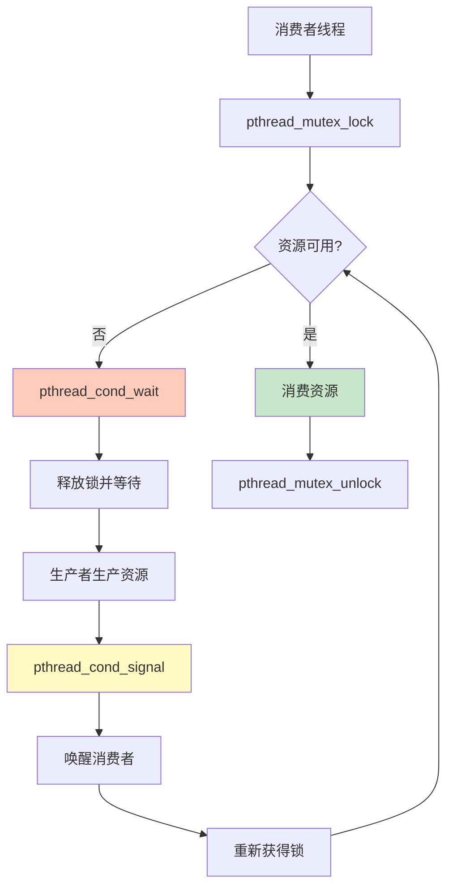

**关键函数**：

```c
// 初始化
pthread_cond_init(&cond, NULL);

// 等待条件（会释放锁，被唤醒后重新获取锁）
pthread_cond_wait(&cond, &mutex);

// 唤醒一个等待线程
pthread_cond_signal(&cond);

// 唤醒所有等待线程
pthread_cond_broadcast(&cond);

// 销毁
pthread_cond_destroy(&cond);
```

**注意事项**：

1. **必须在锁内使用**

   ```c
   pthread_mutex_lock(&mutex);
   while (condition_not_met) {
       pthread_cond_wait(&cond, &mutex);
   }
   // 处理...
   pthread_mutex_unlock(&mutex);
   ```

2. **使用while而非if**
   - 防止虚假唤醒
   - 再次检查条件

3. **signal vs broadcast**
   - `signal`：唤醒一个线程
   - `broadcast`：唤醒所有线程

---

### 3.3 总结

#### 3.3.1 核心要点

**进程管理**：

1. **fork系统调用**：创建子进程，返回值区分父子
2. **exec系列函数**：执行新程序
3. **ELF格式**：Linux二进制可执行文件格式
4. **静态链接vs动态链接**：各有优劣，按需选择

**线程管理**：

1. **线程创建**：`pthread_create`创建，`pthread_join`等待
2. **线程数据**：栈数据、全局数据、私有数据
3. **Mutex互斥锁**：保护共享资源，防止竞争条件
4. **条件变量**：线程间通知机制，实现同步

#### 3.3.2 对比总结

| 对比项 | 进程 | 线程 |
|--------|------|------|
| **资源** | 独立地址空间 | 共享进程地址空间 |
| **开销** | 创建/切换开销大 | 创建/切换开销小 |
| **通信** | IPC机制（复杂） | 共享内存（简单） |
| **稳定性** | 一个进程崩溃不影响其他 | 一个线程崩溃影响整个进程 |
| **应用** | 独立任务 | 并行子任务 |

#### 3.3.3 常用命令速查

```bash
# 查看进程树
pstree -p

# 查看进程详情
ps -ef | grep process_name
ps aux | grep process_name

# 查看线程
ps -eLf | grep process_name
top -H -p PID

# 查看ELF文件信息
readelf -h executable    # 查看ELF头
readelf -l executable    # 查看程序头
readelf -S executable    # 查看节头
objdump -d executable    # 反汇编
nm executable            # 查看符号表
ldd executable           # 查看依赖的动态库
```

#### 3.3.4 编程最佳实践

**进程编程**：

- ✅ fork后立即exec，避免资源浪费
- ✅ 父进程使用waitpid回收子进程
- ✅ 检查fork/exec返回值

**线程编程**：

- ✅ 始终初始化互斥锁和条件变量
- ✅ 加锁后尽快解锁，减少临界区
- ✅ 使用while检查条件，防止虚假唤醒
- ✅ 避免死锁（按固定顺序获取锁）
- ✅ 线程退出前释放所有资源

---

## 第3章 进程管理（下）：进程数据结构
### 3.4 进程数据结构概述


> **核心思想**：task_struct是Linux进程管理的核心数据结构，就像项目管理系统记录每个项目的所有信息。


在Linux内核中，无论是进程还是线程，都统一使用`task_struct`结构进行管理。这是一个非常庞大的结构体，包含了进程运行的方方面面。

**类比**：

- **task_struct** = 项目管理工具（如Jira）中的项目卡片
- 记录项目所有信息：ID、状态、负责人、资源、进度等

**任务列表**：

```c
struct list_head tasks;  // 将所有task_struct串成链表
```

---

### 3.5 任务ID

#### 3.5.1 ID字段

```c
pid_t pid;                           // 进程ID
pid_t tgid;                          // 线程组ID  
struct task_struct *group_leader;   // 线程组leader
```

**为什么需要多个ID？**

1. **任务展示问题**
   - 用户使用`ps`命令时，只想看到进程，不想看到所有线程
   - 需要区分哪些是进程，哪些是线程

2. **指令下发问题**
   - `kill`发送信号时，需要区分是发给整个进程还是单个线程
   - 信号应该发给整个线程组

**ID规则**：

| 类型 | pid | tgid | group_leader |
|------|-----|------|--------------|
| **单线程进程** | 自己 | 自己 | 指向自己 |
| **主线程** | 自己 | 自己 | 指向自己 |
| **子线程** | 自己的ID | 主线程的pid | 指向主线程 |

#### 3.5.2 信号处理

```c
/* Signal handlers */
struct signal_struct *signal;        // 线程组共享pending
struct sighand_struct *sighand;      // 信号处理函数
sigset_t blocked;                    // 被阻塞的信号
sigset_t real_blocked;
sigset_t saved_sigmask;
struct sigpending pending;           // 本任务的pending
unsigned long sas_ss_sp;             // 信号栈指针
size_t sas_ss_size;
unsigned int sas_ss_flags;
```

**两个pending**：

- `pending`：发给特定线程的信号
- `signal->shared_pending`：发给整个线程组的信号

---

### 3.6 任务状态

#### 3.6.1 状态字段

```c
volatile long state;     // 运行状态
int exit_state;          // 退出状态
unsigned int flags;      // 标志位
```

#### 3.6.2 状态值定义

```c
/* Used in tsk->state */
#define TASK_RUNNING             0   // 可运行
#define TASK_INTERRUPTIBLE       1   // 可中断睡眠
#define TASK_UNINTERRUPTIBLE     2   // 不可中断睡眠
#define __TASK_STOPPED           4   // 停止
#define __TASK_TRACED            8   // 被调试

/* Used in tsk->exit_state */
#define EXIT_ZOMBIE              32  // 僵尸状态
#define EXIT_DEAD                16  // 死亡状态

/* Used in tsk->state again */
#define TASK_DEAD                64
#define TASK_WAKEKILL           128  // 可被致命信号唤醒
#define TASK_WAKING             256
#define TASK_PARKED             512
#define TASK_NOLOAD            1024
#define TASK_NEW               2048
#define TASK_KILLABLE  (TASK_WAKEKILL | TASK_UNINTERRUPTIBLE)
```

#### 3.6.3 主要状态说明

**TASK_RUNNING**（可运行）：

- 并不是正在运行
- 而是时刻准备运行
- 获得时间片就运行，没获得就等待

**睡眠状态**：

1. **TASK_INTERRUPTIBLE**（可中断睡眠）
   - 浅睡眠
   - 等待I/O，但可被信号唤醒
   - 唤醒后进行信号处理

2. **TASK_UNINTERRUPTIBLE**（不可中断睡眠）
   - 深度睡眠
   - 不可被信号唤醒
   - 只能等I/O完成
   - ⚠️ 危险：kill也杀不死，只能重启

3. **TASK_KILLABLE**（可终止睡眠）
   - 类似TASK_UNINTERRUPTIBLE
   - 但可响应致命信号
   - 更安全的选择

**停止状态**：

- **TASK_STOPPED**：收到SIGSTOP等信号后进入
- **TASK_TRACED**：被debugger监视

**退出状态**：

- **EXIT_ZOMBIE**（僵尸）：已退出，但父进程未回收
- **EXIT_DEAD**：最终状态

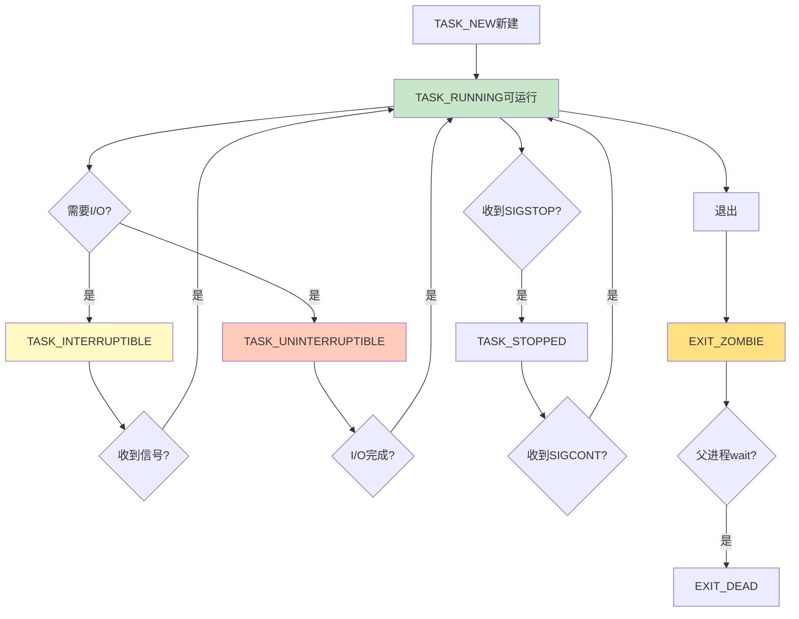

#### 3.6.4 标志位

```c
#define PF_EXITING      0x00000004  // 正在退出
#define PF_VCPU         0x00000010  // 运行在虚拟CPU
#define PF_FORKNOEXEC   0x00000040  // fork了但还没exec
```

---

### 3.7 运行统计信息

```c
u64 utime;                    // 用户态消耗CPU时间
u64 stime;                    // 内核态消耗CPU时间
unsigned long nvcsw;          // 自愿上下文切换次数
unsigned long nivcsw;         // 非自愿上下文切换次数
u64 start_time;               // 进程启动时间（不含睡眠）
u64 real_start_time;          // 进程启动时间（含睡眠）
```

**类比**：项目经理需要了解员工工作情况

- 某员工长时间做一个任务→需要关注
- 某员工琐碎任务太多→影响效率

---

### 3.8 进程亲缘关系

#### 3.8.1 关系字段

```c
struct task_struct __rcu *real_parent;  // 真正的父进程
struct task_struct __rcu *parent;       // 接收SIGCHLD的父进程
struct list_head children;              // 子进程链表头
struct list_head sibling;               // 兄弟进程链表节点
```

#### 3.8.2 进程家族树

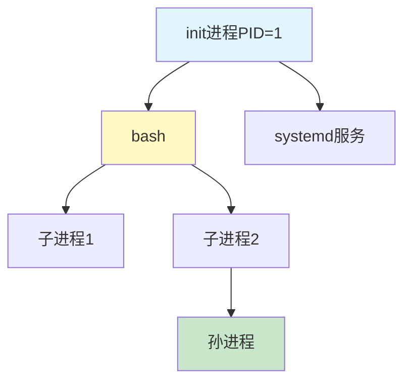

**特殊情况**：

- 通常`real_parent == parent`
- 例外：GDB调试时
  - `parent` = GDB（接收信号）
  - `real_parent` = bash（真正的父进程）

---

### 3.9 进程权限

#### 3.9.1 权限字段

```c
const struct cred __rcu *real_cred;  // 谁能操作我（Objective）
const struct cred __rcu *cred;       // 我能操作谁（Subjective）
```

#### 3.9.2 cred结构体

```c
struct cred {
    kuid_t uid;         // real UID
    kgid_t gid;         // real GID
    kuid_t suid;        // saved UID
    kgid_t sgid;        // saved GID
    kuid_t euid;        // effective UID (起作用)
    kgid_t egid;        // effective GID (起作用)
    kuid_t fsuid;       // UID for VFS ops
    kgid_t fsgid;       // GID for VFS ops
    
    kernel_cap_t cap_inheritable;  // 可继承权限
    kernel_cap_t cap_permitted;    // 允许使用的权限
    kernel_cap_t cap_effective;    // 实际起作用的权限
    kernel_cap_t cap_bset;         // capability bounding set
    kernel_cap_t cap_ambient;      // ambient权限
};
```

#### 3.9.3 UID/GID详解

**三种ID**：

1. **uid/gid**（Real）
   - 谁启动的进程
   - 权限审核时不常用

2. **euid/egid**（Effective）
   - 真正起作用的ID
   - 操作消息队列、共享内存、信号量时比较

3. **fsuid/fsgid**（Filesystem）
   - 文件操作时审核
   - 通常与euid/egid相同

**set-user-ID示例**：

```bash
# 游戏程序场景
# 用户A想运行用户B的游戏
# 游戏数据文件只有B可写

# 方案1：给所有人执行权限（不安全）
chmod 755 game

# 方案2：使用set-user-ID
chmod u+s game  # rwsr-xr-x

# 运行时：
# uid = A（启动者）
# euid = B（文件所有者）
# fsuid = B（可以写游戏数据）
```

**suid/sgid**（Saved）：

- 保存原来的特权用户ID
- 方便通过`setuid`切换权限

#### 3.9.4 Capabilities细粒度权限

**为什么需要Capabilities**：

- root权限太大
- 普通用户权限太小
- 需要更细粒度的权限控制

**部分Capabilities**：

```c
#define CAP_CHOWN            0   // 修改文件所有者
#define CAP_KILL             5   // 发送信号
#define CAP_NET_BIND_SERVICE 10  // 绑定小于1024的端口
#define CAP_NET_RAW          13  // 使用RAW和PACKET socket
#define CAP_SYS_MODULE       16  // 加载内核模块
#define CAP_SYS_RAWIO        17  // 原始I/O操作
#define CAP_SYS_BOOT         22  // 重启系统
#define CAP_SYS_TIME         25  // 修改系统时间
#define CAP_AUDIT_READ       37  // 读取审计日志
```

**五种Capabilities集合**：

1. **cap_permitted**
   - 进程可以使用的权限
   - 可以包含effective中没有的

2. **cap_effective**
   - 实际起作用的权限
   - 进程可以临时放弃某些权限

3. **cap_inheritable**
   - 可执行文件有inheritable属性时继承
   - 非root用户下较鸡肋

4. **cap_bset**（Bounding Set）
   - 系统所有进程允许保留的权限
   - 限制整个系统的权限范围
   - 例如：去掉CAP_SYS_MODULE，所有进程都不能加载模块

5. **cap_ambient**
   - 解决cap_inheritable的问题
   - 非root用户exec时也能保留权限

---

### 3.10 内存管理

```c
struct mm_struct *mm;              // 进程内存空间
struct mm_struct *active_mm;       // 当前使用的内存空间
```

每个进程都有独立的虚拟内存空间，由`mm_struct`表示。详见第4章内存管理。

---

### 3.11 文件与文件系统

```c
/* Filesystem information */
struct fs_struct *fs;              // 文件系统信息

/* Open file information */
struct files_struct *files;        // 打开的文件信息
```

详见第5章文件系统。

---

### 3.12 总结

#### 3.12.1 task_struct核心字段总结

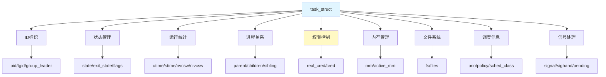

#### 3.12.2 重点知识

**必须掌握**：

1. **ID管理**
   - pid、tgid、group_leader三者关系
   - 如何区分进程和线程

2. **状态转换**
   - TASK_RUNNING、睡眠状态、停止状态、退出状态
   - 不同睡眠状态的区别和使用场景

3. **权限机制**
   - uid、euid、suid、fsuid的作用和区别
   - set-user-ID的工作原理 ⭐⭐⭐（面试高频）
   - Capabilities细粒度权限

4. **进程关系**
   - parent、real_parent、children、sibling
   - 进程树的组织方式

#### 3.12.3 实用命令

```bash
# 查看进程详细信息
cat /proc/PID/status

# 查看进程状态
ps -eo pid,stat,comm | grep PID

# 状态标识
# R: running
# S: sleeping (TASK_INTERRUPTIBLE)
# D: disk sleep (TASK_UNINTERRUPTIBLE)
# T: stopped
# Z: zombie

# 查看进程关系
pstree -p PID

# 查看进程权限
cat /proc/PID/status | grep -E "Uid|Gid|Cap"

# 查看进程所有信息
cat /proc/PID/stat
cat /proc/PID/statm  # 内存统计
```

#### 3.12.4 关键数据结构图

**完整的task_struct结构**（简化版）：

```
task_struct (进程/线程描述符)
├── 标识信息
│   ├── pid (进程ID)
│   ├── tgid (线程组ID)
│   └── comm[16] (进程名)
├── 状态信息
│   ├── state (运行状态)
│   ├── exit_state (退出状态)
│   └── flags (标志位)
├── 调度信息
│   ├── prio (优先级)
│   ├── static_prio
│   ├── rt_priority
│   ├── sched_class (调度类)
│   └── policy (调度策略)
├── 时间统计
│   ├── utime (用户态时间)
│   ├── stime (内核态时间)
│   └── start_time (启动时间)
├── 进程关系
│   ├── parent (父进程)
│   ├── children (子进程链表)
│   └── sibling (兄弟链表)
├── 权限控制
│   ├── real_cred
│   └── cred (uid/gid/euid/egid/capabilities)
├── 信号处理
│   ├── signal
│   ├── sighand
│   └── pending
├── 内存管理
│   └── mm (mm_struct)
├── 文件系统
│   ├── fs (fs_struct)
│   └── files (files_struct)
└── 内核栈
    └── stack (thread_info)
```

---

**本章总结**：

- ✅ 第一部分：进程创建、线程机制、同步原语
- ✅ 第二部分：task_struct数据结构详解
- ✅ 第三部分：进程调度机制（调度策略、CFS算法、主动调度、抢占调度）

---

## 第3章 进程管理（三）：调度机制
### 3.13 调度策略与调度类


> **核心思想**：调度是操作系统的核心功能，需要在响应速度和公平性之间找到平衡。Linux使用CFS算法实现公平调度。


#### 3.13.1 进程分类

**两大类进程**：

1. **实时进程**（Real-Time）
   - 需要尽快执行并返回结果
   - 优先级高，类比：加急项目
   - 优先级范围：0-99（数值越小越高）

2. **普通进程**（Normal）
   - 大部分进程
   - 按正常流程执行
   - 优先级范围：100-139

**实时进程优先级 > 普通进程优先级**

#### 3.13.2 调度策略

```c
unsigned int policy;  // 在task_struct中

// 调度策略定义
#define SCHED_NORMAL     0  // 普通进程CFS
#define SCHED_FIFO       1  // 实时进程：先进先出
#define SCHED_RR         2  // 实时进程：轮转
#define SCHED_BATCH      3  // 后台进程
#define SCHED_IDLE       5  // 空闲时运行
#define SCHED_DEADLINE   6  // 实时进程：按deadline调度
```

**策略说明**：

| 策略 | 类型 | 说明 |
|------|------|------|
| **SCHED_FIFO** | 实时 | 先来先服务，高优先级可抢占低优先级 |
| **SCHED_RR** | 实时 | 轮转，相同优先级轮流使用时间片 |
| **SCHED_DEADLINE** | 实时 | 按deadline调度，最紧急的先执行 |
| **SCHED_NORMAL** | 普通 | CFS公平调度 |
| **SCHED_BATCH** | 普通 | 后台任务，降低优先级 |
| **SCHED_IDLE** | 普通 | 空闲时才运行 |

#### 3.13.3 调度类

```c
const struct sched_class *sched_class;  // 真正干活的
```

**五大调度类**（优先级从高到低）：

1. **stop_sched_class**：最高优先级，中断所有其他线程
2. **dl_sched_class**：对应SCHED_DEADLINE
3. **rt_sched_class**：对应SCHED_FIFO/SCHED_RR
4. **fair_sched_class**：对应SCHED_NORMAL/SCHED_BATCH（★重点）
5. **idle_sched_class**：对应SCHED_IDLE

**调度类链表**：

```c
for_each_class(class) {
    p = class->pick_next_task(rq, prev, rf);
    if (p)
        return p;
}
```

---

### 3.14 完全公平调度（CFS）

#### 3.14.1 CFS基本原理

**核心思想**：让每个进程获得公平的CPU时间。

**虚拟运行时间（vruntime）**：

- CPU每个tick更新vruntime
- 运行的进程vruntime增加
- 未运行的进程vruntime不变
- 总是选择vruntime最小的进程运行

**类比**：把球分配到N个口袋

- 看哪个少，就多放一些
- 哪个多了，就先不放
- 经过多轮，达到基本公平

#### 3.14.2 权重与优先级

**虚拟时间计算公式**：

```
vruntime += 实际运行时间 × NICE_0_LOAD / 权重
```

**效果**：

- 高权重：实际运行时间多，vruntime增长慢
- 低权重：实际运行时间少，vruntime增长快
- 结果：高权重进程获得更多CPU时间

**更新vruntime的代码**：

```c
static void update_curr(struct cfs_rq *cfs_rq) {
    struct sched_entity *curr = cfs_rq->curr;
    u64 now = rq_clock_task(rq_of(cfs_rq));
    u64 delta_exec = now - curr->exec_start;
    
    curr->exec_start = now;
    curr->sum_exec_runtime += delta_exec;
    curr->vruntime += calc_delta_fair(delta_exec, curr);
}

static inline u64 calc_delta_fair(u64 delta, struct sched_entity *se) {
    if (unlikely(se->load.weight != NICE_0_LOAD))
        delta = calc_delta(delta, NICE_0_LOAD, &se->load);
    return delta;
}
```

#### 3.14.3 红黑树调度队列

**为什么用红黑树？**

- 需要快速找到vruntime最小的进程
- 需要快速插入和删除
- 红黑树查询和更新都是O(log n)

**调度实体（sched_entity）**：

```c
struct sched_entity {
    struct load_weight load;        // 权重
    struct rb_node run_node;        // 红黑树节点
    u64 exec_start;                 // 开始执行时间
    u64 sum_exec_runtime;           // 总运行时间
    u64 vruntime;                   // 虚拟运行时间
    u64 prev_sum_exec_runtime;
    ...
};
```

**CFS运行队列**：

```c
struct cfs_rq {
    struct load_weight load;
    unsigned int nr_running;
    u64 exec_clock;
    u64 min_vruntime;
    struct rb_root tasks_timeline;  // 红黑树根
    struct rb_node *rb_leftmost;    // 最左节点（vruntime最小）
    struct sched_entity *curr, *next, *last, *skip;
    ...
};
```

**每个CPU的运行队列（rq）**：

```c
struct rq {
    raw_spinlock_t lock;
    unsigned int nr_running;
    struct cfs_rq cfs;              // CFS队列
    struct rt_rq rt;                // 实时队列
    struct dl_rq dl;                // Deadline队列
    struct task_struct *curr, *idle, *stop;
    ...
};
```

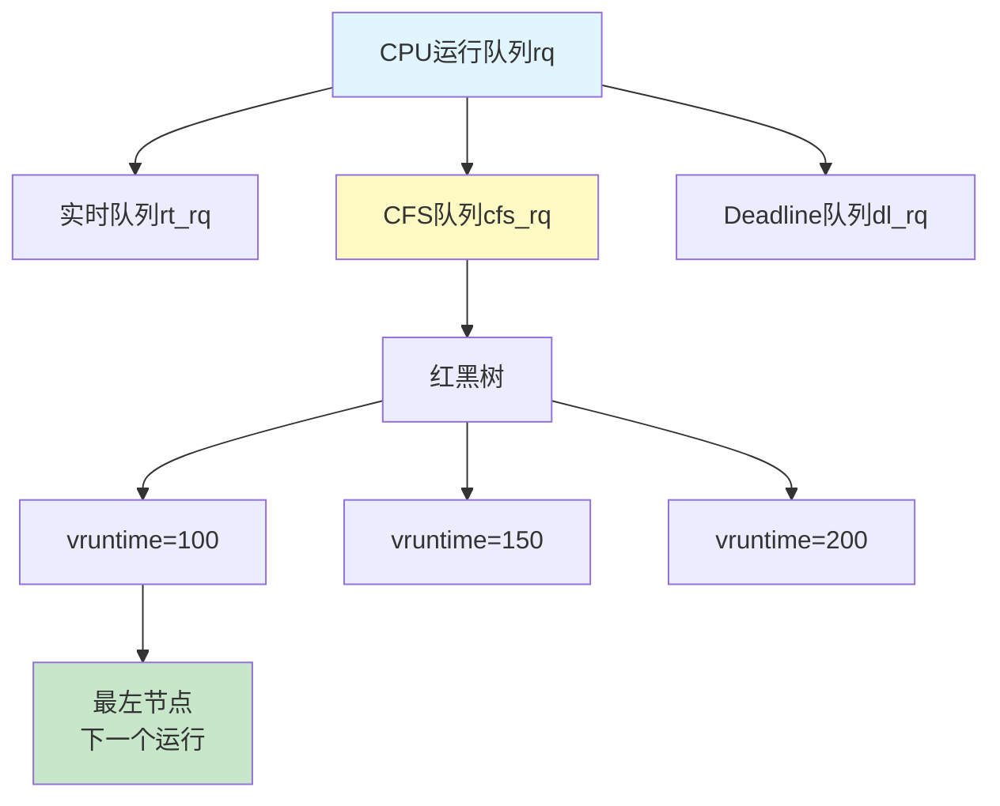

---

### 3.15 主动调度

#### 3.15.1 主动调度场景

**什么是主动调度？**
进程主动让出CPU，例如：

- 等待I/O操作
- 调用sleep()
- 等待网络数据

**示例1：等待写入**

```c
static void btrfs_wait_for_no_snapshoting_writes(struct btrfs_root *root) {
    do {
        prepare_to_wait(&root->subv_writers->wait, &wait,
                       TASK_UNINTERRUPTIBLE);
        writers = percpu_counter_sum(&root->subv_writers->counter);
        if (writers)
            schedule();  // 主动让出CPU
        finish_wait(&root->subv_writers->wait, &wait);
    } while (writers);
}
```

**示例2：等待网络数据**

```c
static ssize_t tap_do_read(struct tap_queue *q, struct iov_iter *to,
                          int noblock, struct sk_buff *skb) {
    while (1) {
        if (!noblock)
            prepare_to_wait(sk_sleep(&q->sk), &wait,
                           TASK_INTERRUPTIBLE);
        // 没有数据，让出CPU
        schedule();
    }
}
```

#### 3.15.2 schedule()函数

**调用链**：

```
schedule()
  └─> __schedule(false)
```

**__schedule核心流程**：

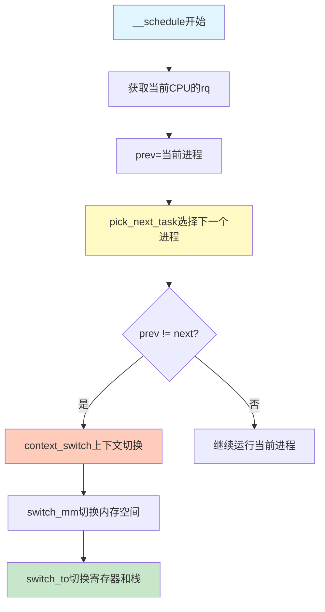

**选择下一个进程**：

```c
static inline struct task_struct *
pick_next_task(struct rq *rq, struct task_struct *prev, struct rq_flags *rf) {
    // 优化：大部分是普通进程
    if (likely(prev->sched_class == &fair_sched_class &&
               rq->nr_running == rq->cfs.h_nr_running)) {
        p = fair_sched_class.pick_next_task(rq, prev, rf);
        if (unlikely(!p))
            p = idle_sched_class.pick_next_task(rq, prev, rf);
        return p;
    }
    
    // 依次尝试各调度类
    for_each_class(class) {
        p = class->pick_next_task(rq, prev, rf);
        if (p)
            return p;
    }
}
```

**CFS选择下一个任务**：

```c
static struct task_struct *
pick_next_task_fair(struct rq *rq, struct task_struct *prev, struct rq_flags *rf) {
    struct cfs_rq *cfs_rq = &rq->cfs;
    struct sched_entity *se;
    
    // 更新当前进程的vruntime
    if (curr && curr->on_rq)
        update_curr(cfs_rq);
    
    // 从红黑树取最左节点
    se = pick_next_entity(cfs_rq, curr);
    p = task_of(se);
    
    // 如果不同，更新红黑树
    if (prev != p) {
        put_prev_entity(cfs_rq, &prev->se);
        set_next_entity(cfs_rq, se);
    }
    return p;
}
```

#### 3.15.3 上下文切换

**两大任务**：

1. 切换进程内存空间（虚拟内存）
2. 切换寄存器和CPU上下文

**context_switch实现**：

```c
static __always_inline struct rq *
context_switch(struct rq *rq, struct task_struct *prev,
              struct task_struct *next, struct rq_flags *rf) {
    struct mm_struct *mm, *oldmm;
    
    mm = next->mm;
    oldmm = prev->active_mm;
    
    // 切换内存空间
    switch_mm_irqs_off(oldmm, mm, next);
    
    // 切换寄存器和栈
    switch_to(prev, next, prev);
    
    return finish_task_switch(prev);
}
```

**切换栈（32位）**：

```assembly
/* %eax: prev task, %edx: next task */
ENTRY(__switch_to_asm)
    /* 切换栈 */
    movl %esp, TASK_threadsp(%eax)      # 保存prev的栈指针
    movl TASK_threadsp(%edx), %esp      # 加载next的栈指针
    jmp __switch_to
END(__switch_to_asm)
```

**切换栈（64位）**：

```assembly
/* %rdi: prev task, %rsi: next task */
ENTRY(__switch_to_asm)
    /* 切换栈 */
    movq %rsp, TASK_threadsp(%rdi)      # 保存prev的栈指针
    movq TASK_threadsp(%rsi), %rsp      # 加载next的栈指针
    jmp __switch_to
END(__switch_to_asm)
```

---

### 3.16 抢占式调度

#### 3.16.1 抢占的必要性

**为什么需要抢占？**

- 防止某进程长时间独占CPU
- 保证系统响应性
- 实现时间片轮转

**抢占触发机制**：

- 时钟中断：定期检查是否需要抢占
- 进程唤醒：高优先级进程被唤醒

#### 3.16.2 时钟中断触发抢占

**流程**：

```
时钟中断
  └─> scheduler_tick()
        └─> curr->sched_class->task_tick()
              └─> task_tick_fair()  (对于CFS)
                    └─> entity_tick()
                          └─> check_preempt_tick()
```

**检查是否需要抢占**：

```c
static void check_preempt_tick(struct cfs_rq *cfs_rq, struct sched_entity *curr) {
    unsigned long ideal_runtime, delta_exec;
    struct sched_entity *se;
    s64 delta;
    
    // 计算理想运行时间
    ideal_runtime = sched_slice(cfs_rq, curr);
    // 计算实际运行时间
    delta_exec = curr->sum_exec_runtime - curr->prev_sum_exec_runtime;
    
    // 超过理想运行时间，应该被抢占
    if (delta_exec > ideal_runtime) {
        resched_curr(rq_of(cfs_rq));
        return;
    }
    
    // 或者vruntime差距过大
    se = __pick_first_entity(cfs_rq);
    delta = curr->vruntime - se->vruntime;
    if (delta > ideal_runtime)
        resched_curr(rq_of(cfs_rq));
}
```

**标记抢占**：

```c
static inline void set_tsk_need_resched(struct task_struct *tsk) {
    set_tsk_thread_flag(tsk, TIF_NEED_RESCHED);  // 打标签
}
```

#### 3.16.3 进程唤醒触发抢占

**唤醒流程**：

```
try_to_wake_up()
  └─> ttwu_queue()
        └─> ttwu_do_activate()
              └─> ttwu_do_wakeup()
                    └─> check_preempt_curr()  // 检查是否抢占
```

```c
static void ttwu_do_wakeup(struct rq *rq, struct task_struct *p,
                          int wake_flags, struct rq_flags *rf) {
    check_preempt_curr(rq, p, wake_flags);  // 检查是否需要抢占
    p->state = TASK_RUNNING;
}
```

#### 3.16.4 抢占时机

**用户态抢占时机**：

1. **系统调用返回**：

```c
static void exit_to_usermode_loop(struct pt_regs *regs, u32 cached_flags) {
    while (true) {
        local_irq_enable();
        if (cached_flags & _TIF_NEED_RESCHED)
            schedule();  // 发生调度
        ...
    }
}
```

2. **中断返回**：

```assembly
common_interrupt:
    ...
ret_from_intr:
    popq %rsp
    testb $3, CS(%rsp)          # 测试返回用户态还是内核态
    jz retint_kernel
    
GLOBAL(retint_user)
    mov %rsp,%rdi
    call prepare_exit_to_usermode  # 可能触发调度
    SWAPGS
    jmp restore_regs_and_iret
```

**内核态抢占时机**：

1. **preempt_enable()时**：

```c
#define preempt_enable() \
    do { \
        if (unlikely(preempt_count_dec_and_test())) \
            __preempt_schedule(); \
    } while (0)

#define preempt_count_dec_and_test() \
    ({ preempt_count_sub(1); should_resched(0); })

static __always_inline bool should_resched(int preempt_offset) {
    return unlikely(preempt_count() == preempt_offset &&
                   tif_need_resched());
}
```

2. **中断返回内核态**：

```assembly
retint_kernel:
#ifdef CONFIG_PREEMPT
    bt $9, EFLAGS(%rsp)                    # 检查中断标志
    jnc 1f
0:  cmpl $0, PER_CPU_VAR(__preempt_count)
    jnz 1f
    call preempt_schedule_irq              # 触发调度
    jmp 0b
#endif
```

```c
asmlinkage __visible void __sched preempt_schedule_irq(void) {
    do {
        preempt_disable();
        local_irq_enable();
        __schedule(true);  // 发生调度
        local_irq_disable();
        sched_preempt_enable_no_resched();
    } while (need_resched());
}
```

---

### 3.17 总结

#### 3.17.1 核心要点

**调度体系**：

1. **调度策略**：定义"应该怎么调度"
2. **调度类**：实现"真正怎么调度"
3. **调度算法**：CFS实现公平调度
4. **调度时机**：主动调度 + 抢占调度

**CFS核心思想**：

- 使用vruntime保证公平
- 红黑树快速选择下一个进程
- 权重机制处理优先级

**调度第一定律**：
> 所有调度路径最终都会调用`__schedule()`函数

#### 3.17.2 调度全流程图

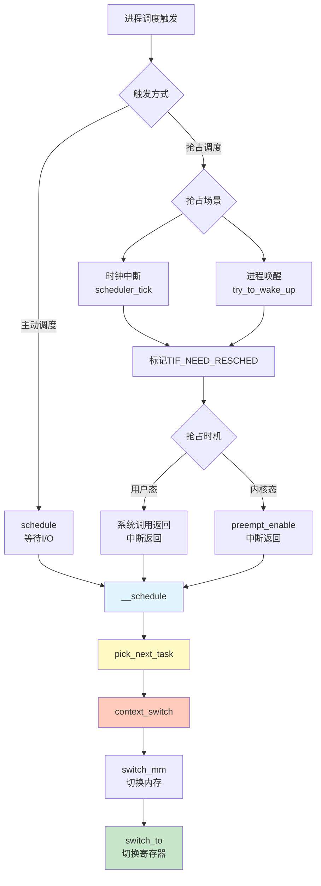

#### 3.17.3 重要数据结构关系

```
task_struct
├── policy (调度策略)
├── prio, static_prio, normal_prio (优先级)
├── sched_class (调度类)
│   ├── stop_sched_class
│   ├── dl_sched_class
│   ├── rt_sched_class
│   ├── fair_sched_class ★
│   └── idle_sched_class
└── se (sched_entity调度实体)
    ├── vruntime (虚拟运行时间)
    ├── load.weight (权重)
    └── run_node (红黑树节点)

rq (每CPU运行队列)
├── cfs_rq (CFS队列)
│   ├── tasks_timeline (红黑树根)
│   ├── rb_leftmost (最左节点)
│   └── min_vruntime
├── rt_rq (实时队列)
└── dl_rq (Deadline队列)
```

#### 3.17.4 关键函数速查

| 函数 | 功能 | 调用场景 |
|------|------|----------|
| `schedule()` | 主动调度入口 | 等待I/O、sleep等 |
| `__schedule()` | 调度核心 | 所有调度最终调用 |
| `pick_next_task()` | 选择下一个进程 | 每次调度时 |
| `context_switch()` | 上下文切换 | 切换进程时 |
| `scheduler_tick()` | 时钟中断处理 | 每个tick |
| `check_preempt_tick()` | 检查抢占 | 时钟中断时 |
| `resched_curr()` | 标记需要抢占 | 抢占检查时 |

---

**下一节预告**：将继续处理第4批第二部分（进程/线程创建的详细实现）。

---

## 第3章 进程管理（四）：进程与线程创建
### 3.18 进程创建：fork系统调用


> **核心思想**：进程使用fork创建，线程使用clone创建。两者的本质区别在于资源共享程度。


#### 进程创建完整流程图（fork → exec）

```mermaid
graph TD
    START["⭐ 父进程执行中<br/>运行业务代码"] --> FORK_CALL["📞 调用fork()<br/>用户态"]  
    
    FORK_CALL --> SYSCALL["🚪 系统调用陷入<br/>进入内核态"]
    
    SYSCALL --> DO_FORK["⚙️ _do_fork()<br/>内核核心函数"]
    
    DO_FORK --> COPY_PROCESS["📋 copy_process()<br/>复制进程结构"]
    
    subgraph 复制五大结构["🔄 复制五大结构"]
        direction TB
        COPY1["1. dup_task_struct<br/>复制task_struct"]
        COPY2["2. copy_files<br/>文件描述符表"]
        COPY3["3. copy_mm<br/>内存空间mm_struct"]
        COPY4["4. copy_thread<br/>内核栈和寄存器"]
        COPY5["5. 分配PID<br/>新进程标识"]
    end
    
    COPY_PROCESS --> COPY1
    COPY1 --> COPY2
    COPY2 --> COPY3
    COPY3 --> COPY4
    COPY4 --> COPY5
    
    COPY5 --> SCHED_FORK["⏰ sched_fork()<br/>调度器初始化"]
    
    SCHED_FORK --> SCHED1["设置子进程状态<br/>TASK_NEW"]
    SCHED1 --> SCHED2["设置优先级<br/>prio和vruntime"]
    SCHED2 --> SCHED3["不放入runqueue<br/>暂不可调度"]
    
    SCHED3 --> WAKE_UP["🎬 wake_up_new_task()<br/>唤醒子进程"]
    
    WAKE_UP --> WAKE1["状态改为RUNNING"]  
    WAKE1 --> WAKE2["加入runqueue<br/>可被调度"]
    WAKE2 --> WAKE3["调用check_preempt_curr<br/>检查是否抢占父进程"]
    
    WAKE3 --> FORK_RETURN["↩️ fork()返回"]
    
    FORK_RETURN --> PARENT{"📊 返回值判断"}
    
    PARENT -->|"返回子进程PID<br/>(大于0)"| PARENT_PROC["👨 父进程继续<br/>拿到child_pid"]
    PARENT -->|"返回0"| CHILD_PROC["👶 子进程开始<br/>从fork返回点执行"]
    
    PARENT_PROC --> PARENT_WAIT["🔄 父进程选择<br/>wait()等待 或 继续执行"]
    
    subgraph exec流程["🚀 exec流程（子进程通常执行）"]
        direction TB
        EXEC_CALL["📞 调用execve()<br/>execve(\"ls\", args, env)"]
        EXEC_LOAD["📂 加载ELF文件<br/>读取可执行文件"]
        EXEC_CLEAR["🧹 清理旧内存空间<br/>释放原mm_struct"]
        EXEC_NEW_MM["🆕 创建新地址空间<br/>代码段/数据段/堆/栈"]
        EXEC_ENTRY["🎯 设置执行入口<br/>rip = ELF entry point"]
        EXEC_START["▶️ 开始执行新程序<br/>从新的main()开始"]
    end
    
    CHILD_PROC --> EXEC_DECISION{"是否exec?"}
    EXEC_DECISION -->|"是"| EXEC_CALL
    EXEC_DECISION -->|"否"| CHILD_CONTINUE["继续执行<br/>与父进程相同代码"]
    
    EXEC_CALL --> EXEC_LOAD
    EXEC_LOAD --> EXEC_CLEAR
    EXEC_CLEAR --> EXEC_NEW_MM
    EXEC_NEW_MM --> EXEC_ENTRY
    EXEC_ENTRY --> EXEC_START
    
    EXEC_START --> NEW_PROG["🎉 新程序运行<br/>ls程序执行"]
    
    subgraph 进程终止["⚰️ 进程终止"]
        direction LR
        CHILD_EXIT["调用exit()"]
        ZOMBIE["进入ZOMBIE状态"]
        PARENT_REAP["父进程wait()回收"]
        FINALLY_EXIT["完全退出"]
    end
    
    NEW_PROG -.结束后.-> CHILD_EXIT
    CHILD_CONTINUE -.结束后.-> CHILD_EXIT
    CHILD_EXIT --> ZOMBIE
    ZOMBIE --> PARENT_REAP
    PARENT_REAP --> FINALLY_EXIT
    
    style FORK_CALL fill:#e3f2fd,stroke:#1976d2,stroke-width:2px
    style COPY_PROCESS fill:#fff3e0,stroke:#f57c00,stroke-width:2px
    style PARENT_PROC fill:#c8e6c9,stroke:#388e3c,stroke-width:2px
    style CHILD_PROC fill:#f8bbd0,stroke:#c2185b,stroke-width:2px
    style EXEC_CALL fill:#e1bee7,stroke:#7b1fa2,stroke-width:2px
    style NEW_PROG fill:#ffccbc,stroke:#d84315,stroke-width:2px
    style ZOMBIE fill:#b39ddb,stroke:#512da8,stroke-width:2px
```

**进程创建流程关键点**：

#### 1️⃣ fork阶段（复制）

| 步骤 | 函数 | 作用 | 关键点 |
|------|------|------|--------|
| 系统调用 | `sys_fork()` | fork入口 | 调用_do_fork(SIGCHLD, 0...) |
| 核心实现 | `_do_fork()` | 进程创建核心 | 统一入口（fork/vfork/clone） |
| 复制进程 | `copy_process()` | 复制task_struct | **写时复制COW** |
| 复制内存 | `copy_mm()` | 复制mm_struct | 共享页表（COW） |
| 复制文件 | `copy_files()` | 复制fd表 | 引用计数+1 |
| 复制线程 | `copy_thread()` | 复制内核栈 | 设置子进程返回值=0 |
| 调度初始化 | `sched_fork()` | 初始化调度信息 | 设置vruntime |
| 唤醒 | `wake_up_new_task()` | 加入runqueue | TASK_RUNNING |

#### 2️⃣ fork返回（分叉）

**父进程视角**：

```c
pid_t child_pid = fork();
if (child_pid > 0) {
    // 父进程：child_pid是子进程PID
    printf("我是父进程，子进程PID=%d\n", child_pid);
    wait(NULL);  // 等待子进程结束
}
```

**子进程视角**：

```c
pid_t child_pid = fork();
if (child_pid == 0) {
    // 子进程：返回值为0
    printf("我是子进程\n");
    // 通常接着调用exec
    execvp("ls", args);
}
```

#### 3️⃣ exec阶段（替换）

| 步骤 | 函数 | 作用 | 关键点 |
|------|------|------|--------|
| 系统调用 | `execve()` | exec入口 | 加载新程序 |
| 加载ELF | `load_elf_binary()` | 解析ELF文件 | 代码段/数据段 |
| 清理旧空间 | `flush_old_exec()` | 释放原mm_struct | COW页面释放 |
| 建立新空间 | `setup_new_exec()` | 创建新mm_struct | 新的代码/数据/堆/栈 |
| 设置入口 | `start_thread()` | 设置rip寄存器 | ELF entry point |

#### 4️⃣ 写时复制（COW）

```
fork后：
父进程页表  →  [只读]物理页面
                    ↑
子进程页表  →  [只读]同一物理页面

写入时（触发缺页异常）：
父进程页表  →  [读写]物理页面A
子进程页表  →  [读写]物理页面B（新分配）
```

**优点**：

- fork后立即exec时，不会浪费内存复制
- 只在真正写入时才复制

#### 核心理解

1. **fork返回两次**：一个调用，两个返回（父进程和子进程）
2. **写时复制**：fork后不立即复制内存，而是共享页面标记为只读
3. **fork+exec模式**：Unix/Linux创建新进程的标准模式
4. **子进程返回0**：通过`copy_thread()`设置子进程的返回值为0
5. **exec清理旧程序**：完全替换进程的地址空间，但保留PID、文件描述符等

#### 3.18.1 fork调用链

**从用户态到内核态**：

```c
fork()  // 用户程序调用
  └─> sys_fork()  // 系统调用入口
        └─> _do_fork()  // 核心实现
```

**sys_fork定义**：

```c
SYSCALL_DEFINE0(fork) {
    return _do_fork(SIGCHLD, 0, 0, NULL, NULL, 0);
}
```

#### 3.18.2 _do_fork核心流程

```c
long _do_fork(unsigned long clone_flags,
             unsigned long stack_start,
             unsigned long stack_size,
             int __user *parent_tidptr,
             int __user *child_tidptr,
             unsigned long tls) {
    struct task_struct *p;
    long nr;
    
    // 第一步：复制进程结构
    p = copy_process(clone_flags, stack_start, stack_size,
                    child_tidptr, NULL, trace, tls, NUMA_NO_NODE);
    
    if (!IS_ERR(p)) {
        struct pid *pid = get_task_pid(p, PIDTYPE_PID);
        nr = pid_vnr(pid);
        
        // 第二步：唤醒新进程
        wake_up_new_task(p);
        
        put_pid(pid);
    }
    
    return nr;
}
```

---

### 3.19 copy_process：复制进程结构

#### 3.19.1 复制task_struct

```c
static struct task_struct *copy_process(...) {
    struct task_struct *p;
    
    // 1. 复制task_struct
    p = dup_task_struct(current, node);
}
```

**dup_task_struct做了什么**：

1. `alloc_task_struct_node`：分配新的task_struct
2. `alloc_thread_stack_node`：创建内核栈（__vmalloc_node_range分配THREAD_SIZE内存）
3. `arch_dup_task_struct`：memcpy复制task_struct
4. `setup_thread_stack`：设置thread_info

#### 3.19.2 复制权限

```c
retval = copy_creds(p, clone_flags);
```

**copy_creds流程**：

- `prepare_creds`：分配新的`struct cred`，memcpy复制父进程的cred
- `p->cred = p->real_cred = get_cred(new)`：设置权限

#### 3.19.3 初始化统计量

```c
p->utime = p->stime = p->gtime = 0;
p->start_time = ktime_get_ns();
p->real_start_time = ktime_get_boot_ns();
```

#### 3.19.4 设置调度信息

```c
retval = sched_fork(clone_flags, p);
```

**sched_fork做什么**：

1. `__sched_fork`：
   - `on_rq = 0`
   - 初始化sched_entity
   - `exec_start、sum_exec_runtime、vruntime = 0`

2. 设置进程状态：`p->state = TASK_NEW`

3. 初始化优先级：`prio、normal_prio、static_prio`

4. 设置调度类：`p->sched_class = &fair_sched_class`

5. 调用`task_fork_fair`：
   - `update_curr`：更新当前进程统计量
   - 设置子进程`vruntime = 父进程vruntime`
   - `place_entity`：初始化sched_entity
   - 如果`sysctl_sched_child_runs_first`，让子进程先运行

#### 3.19.5 复制文件和文件系统

```c
retval = copy_files(clone_flags, p);  // 复制打开文件
retval = copy_fs(clone_flags, p);     // 复制目录信息
```

- `copy_files`→`dup_fd`：创建新的files_struct，拷贝文件描述符数组fdtable
- `copy_fs`→`copy_fs_struct`：创建新的fs_struct，复制根目录root和当前目录pwd

#### 3.19.6 复制信号处理

```c
init_sigpending(&p->pending);
retval = copy_sighand(clone_flags, p);
retval = copy_signal(clone_flags, p);
```

- `copy_sighand`：分配新的sighand_struct，memcpy复制信号处理函数sighand->action
- `copy_signal`：分配新的signal_struct，初始化shared_pending

#### 3.19.7 复制内存空间

```c
retval = copy_mm(clone_flags, p);
```

- 调用`dup_mm`：分配新的mm_struct，memcpy复制
- `dup_mmap`：复制内存映射（mmap）

#### 3.19.8 设置PID和亲缘关系

```c
INIT_LIST_HEAD(&p->children);
INIT_LIST_HEAD(&p->sibling);

p->pid = pid_nr(pid);

if (clone_flags & CLONE_THREAD) {
    p->exit_signal = -1;
    p->group_leader = current->group_leader;
    p->tgid = current->tgid;
} else {
    p->exit_signal = (clone_flags & CSIGNAL);
    p->group_leader = p;
    p->tgid = p->pid;
}

p->real_parent = current;
```

---

### 3.20 wake_up_new_task：唤醒新进程

```c
void wake_up_new_task(struct task_struct *p) {
    struct rq *rq;
    
    // 1. 设置状态为RUNNING
    p->state = TASK_RUNNING;
    
    // 2. 将进程放入运行队列
    activate_task(rq, p, ENQUEUE_NOCLOCK);
    p->on_rq = TASK_ON_RQ_QUEUED;
    
    // 3. 检查是否可以抢占
    check_preempt_curr(rq, p, WF_FORK);
}
```

**activate_task流程**：

```c
enqueue_task(rq, p, flags)
  └─> p->sched_class->enqueue_task(rq, p, flags)  // CFS调用enqueue_task_fair
        └─> enqueue_entity(cfs_rq, se, flags)
              ├─> update_curr()  // 更新统计量
              ├─> __enqueue_entity()  // 插入红黑树
              └─> se->on_rq = 1
```

**check_preempt_wakeup**：

```c
// 检查新进程能否抢占父进程
if (wakeup_preempt_entity(se, pse) == 1) {
    resched_curr(rq);  // 标记TIF_NEED_RESCHED
}
```

---

### 3.21 线程创建：pthread_create

#### 3.21.1 用户态准备

**pthread_create调用链**：

```
pthread_create()
  ├─> 处理线程属性
  ├─> 分配struct pthread
  ├─> ALLOCATE_STACK()  // 创建线程栈
  └─> create_thread()   // 创建线程
```

#### 3.21.2 分配线程栈

```c
static int allocate_stack(const struct pthread_attr *attr,
                         struct pthread **pdp) {
    size_t size = attr->stacksize;
    size_t guardsize;
    void *mem;
    struct pthread *pd;
    
    // 1. 先从缓存中查找
    pd = get_cached_stack(&size, &mem);
    
    // 2. 缓存没有，使用mmap分配
    if (pd == NULL) {
        mem = __mmap(NULL, size,
                    (guardsize == 0) ? prot : PROT_NONE,
                    MAP_PRIVATE | MAP_ANONYMOUS | MAP_STACK,
                    -1, 0);
        
        // 3. pthread结构放在栈底（地址最高处）
        pd = (struct pthread *) ((char *) mem + size) - 1;
        
        // 4. 设置guard保护页
        char *guard = guard_position(mem, size, guardsize, pd, pagesize_m1);
        setup_stack_prot(mem, size, guard, guardsize, prot);
        
        // 5. 填充pthread成员
        pd->stackblock = mem;
        pd->stackblock_size = size;
        pd->guardsize = guardsize;
        
        // 6. 加入stack_used链表
        stack_list_add(&pd->list, &stack_used);
    }
    
    *pdp = pd;
}
```

**栈管理**：

- `stack_used`：正在使用的栈链表
- `stack_cache`：缓存的栈链表（线程结束后不释放，复用）

#### 3.21.3 设置线程信息

```c
pd->start_routine = start_routine;  // 线程函数
pd->arg = arg;                      // 函数参数
pd->schedpolicy = self->schedpolicy;
pd->schedparam = self->schedparam;

*newthread = (pthread_t) pd;
atomic_increment(&__nptl_nthreads);  // 线程数+1

retval = create_thread(pd, iattr, &stopped_start, ...);
```

#### 3.21.4 create_thread调用clone

```c
static int create_thread(struct pthread *pd, ...) {
    const int clone_flags = (CLONE_VM | CLONE_FS | CLONE_FILES |
                            CLONE_SYSVSEM | CLONE_SIGHAND | CLONE_THREAD |
                            CLONE_SETTLS | CLONE_PARENT_SETTID |
                            CLONE_CHILD_CLEARTID);
    
    return ARCH_CLONE(&start_thread, STACK_VARIABLES_ARGS,
                     clone_flags, pd, &pd->tid, tp, &pd->tid);
}
```

**关键clone_flags**：

| 标志 | 作用 |
|------|------|
| `CLONE_VM` | 共享内存空间 |
| `CLONE_FS` | 共享文件系统信息 |
| `CLONE_FILES` | 共享文件描述符表 |
| `CLONE_SIGHAND` | 共享信号处理函数 |
| `CLONE_THREAD` | 同一线程组 |
| `CLONE_SYSVSEM` | 共享System V信号量 |

---

### 3.22 clone系统调用

#### 3.22.1 clone vs fork

```c
SYSCALL_DEFINE5(clone, unsigned long, clone_flags,
               unsigned long, newsp,
               int __user *, parent_tidptr,
               int __user *, child_tidptr,
               unsigned long, tls) {
    return _do_fork(clone_flags, newsp, 0,
                   parent_tidptr, child_tidptr, tls);
}
```

**clone和fork都调用_do_fork，区别在于clone_flags！**

#### 3.22.2 clone_flags的影响

**1. copy_files**：

```c
if (clone_flags & CLONE_FILES) {
    atomic_inc(&oldf->count);  // 引用计数+1，共享
} else {
    newf = dup_fd(oldf, &error);  // 复制
    tsk->files = newf;
}
```

**2. copy_fs**：

```c
if (clone_flags & CLONE_FS) {
    fs->users++;  // 共享
} else {
    tsk->fs = copy_fs_struct(fs);  // 复制
}
```

**3. copy_sighand**：

```c
if (clone_flags & CLONE_SIGHAND) {
    atomic_inc(&current->sighand->count);  // 共享
} else {
    sig = kmem_cache_alloc(sighand_cachep, GFP_KERNEL);
    // 复制
}
```

**4. copy_signal**：

```c
if (clone_flags & CLONE_THREAD)
    return 0;  //直接返回，共享
// 否则分配新的signal_struct
sig = kmem_cache_zalloc(signal_cachep, GFP_KERNEL);
```

**5. copy_mm**：

```c
if (clone_flags & CLONE_VM) {
    mmget(oldmm);  // 共享
    mm = oldmm;
} else {
    mm = dup_mm(tsk);  // 复制
}
```

#### 3.22.3 亲缘关系设置

```c
if (clone_flags & CLONE_THREAD) {
    // 线程：同一线程组
    p->exit_signal = -1;
    p->group_leader = current->group_leader;
    p->tgid = current->tgid;
} else {
    // 进程：新线程组
    p->group_leader = p;
    p->tgid = p->pid;
}

if (clone_flags & (CLONE_PARENT|CLONE_THREAD)) {
    // 线程：和父进程平辈
    p->real_parent = current->real_parent;
} else {
    // 进程：父子关系
    p->real_parent = current;
}
```

#### 3.22.4 信号处理

**两个信号队列**：

1. **task_struct->pending**：
   - 每个任务都有
   - 线程：发给该线程的信号
   - 进程：发给主线程的信号

2. **signal_struct->shared_pending**：
   - 发给整个进程的信号
   - 线程共享同一个signal_struct
   - 哪个线程处理都可以

---

### 3.23 用户态线程执行

#### 3.23.1 start_thread入口

从内核返回后，执行`start_thread`（所有线程统一入口）：

```c
static int start_thread(void *arg) {
    struct pthread *pd = START_THREAD_SELF;
    
    // 1. 执行用户提供的函数
    THREAD_SETMEM(pd, result, pd->start_routine(pd->arg));
    
    // 2. 清理TLS变量
    __nptl_deallocate_tsd();
    
    // 3. 线程数-1
    if (atomic_decrement_and_test(&__nptl_nthreads))
        exit(0);  // 最后一个线程，退出进程
    
    // 4. 释放pthread
    __free_tcb(pd);
    __exit_thread();
}
```

#### 3.23.2 释放线程资源

```c
void __free_tcb(struct pthread *pd) {
    __deallocate_stack(pd);
}

void __deallocate_stack(struct pthread *pd) {
    // 从stack_used移除
    stack_list_del(&pd->list);
    
    // 放入stack_cache缓存
    queue_stack(pd);
}
```

---

### 3.24 总结

#### 3.24.1 进程vs线程创建对比

| 项目 | 进程fork | 线程clone |
|------|----------|-----------|
| **系统调用** | fork() | clone() |
| **clone_flags** | SIGCHLD | CLONE_VM\|CLONE_FS\|CLONE_FILES\|...|
| **内存空间** | 复制mm_struct | 共享mm_struct |
| **文件描述符** | 复制files_struct | 共享files_struct |
| **文件系统信息** | 复制fs_struct | 共享fs_struct |
| **信号处理函数** | 复制sighand_struct | 共享sighand_struct |
| **信号队列** | 新的signal_struct | 共享signal_struct |
| **tgid** | 自己的pid | 主线程的pid |
| **group_leader** | 指向自己 | 指向主线程 |
| **栈** | 内核栈（内核分配） | 用户栈（堆上mmap）|

#### 3.24.2 核心流程图

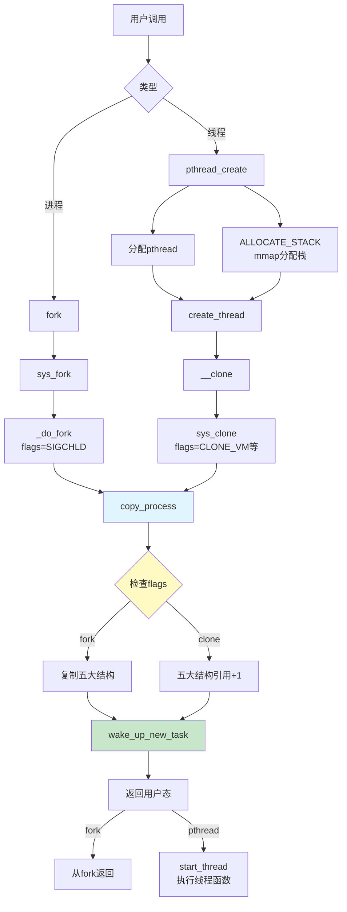

#### 3.24.3 五大结构共享vs复制

```
进程fork：全部复制
├── files_struct (文件描述符表) → dup_fd()
├── fs_struct (文件系统信息) → copy_fs_struct()
├── sighand_struct (信号处理函数) → 分配新的
├── signal_struct (信号队列) → 分配新的
└── mm_struct (内存空间) → dup_mm()

线程clone：全部共享
├── files_struct → atomic_inc(&count)
├── fs_struct → users++
├── sighand_struct → atomic_inc(&count)
├── signal_struct → 直接返回
└── mm_struct → mmget()
```

#### 3.24.4 关键代码位置

```c
// 进程创建
kernel/fork.c:
  - SYSCALL_DEFINE0(fork)
  - _do_fork()
  - copy_process()
  - dup_task_struct()
  - sched_fork()
  - wake_up_new_task()

// 线程创建（用户态）
nptl/pthread_create.c:
  - pthread_create()
  - allocate_stack()
  - create_thread()
  - __clone()  // 汇编
  - start_thread()

// 线程创建（内核态）
kernel/fork.c:
  - SYSCALL_DEFINE5(clone)
  - _do_fork()
  - copy_process()  // 与fork共用
```

---

**第3章完结**：进程管理的四个部分全部完成！

**章节回顾**：

- ✅ 第一部分：进程创建、线程机制、同步原语
- ✅ 第二部分：task_struct数据结构
- ✅ 第三部分：调度机制（CFS、主动调度、抢占调度）
- ✅ 第四部分：进程/线程创建实现

**下一章预告**：第4章将讲解内存管理机制。

---
