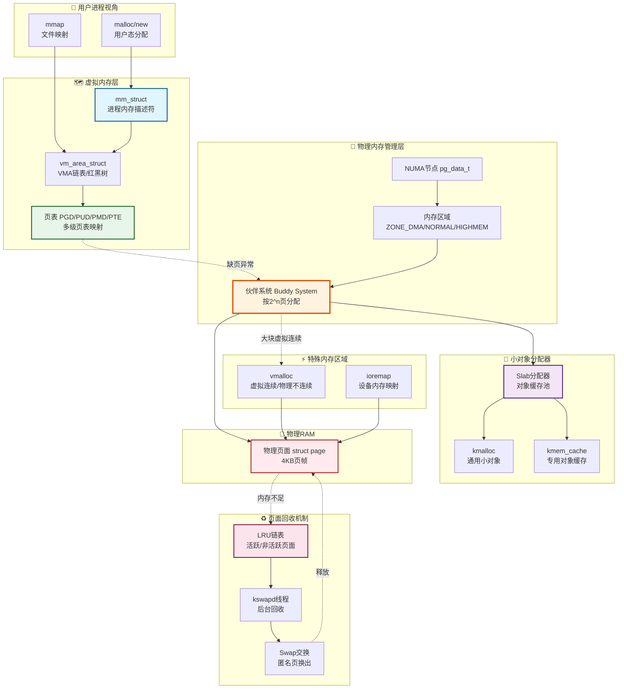
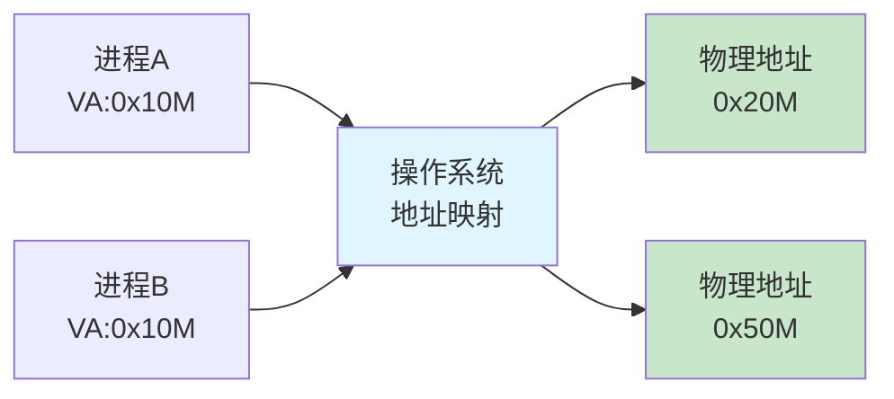
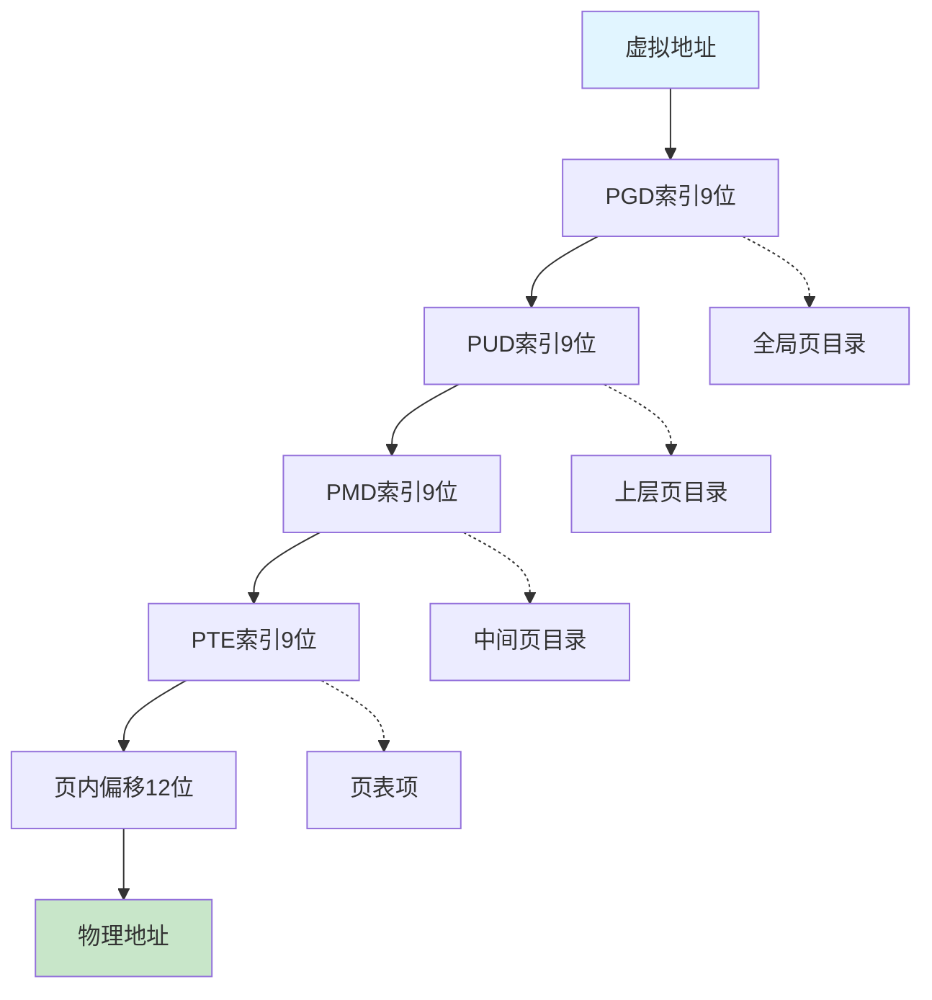
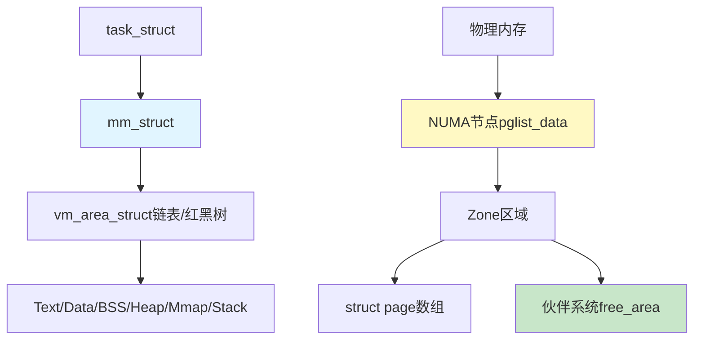
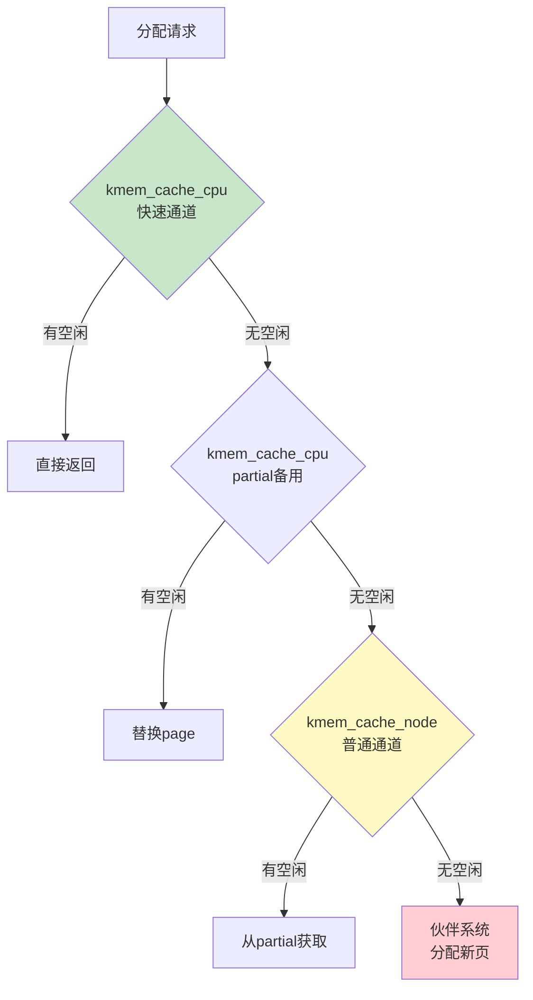
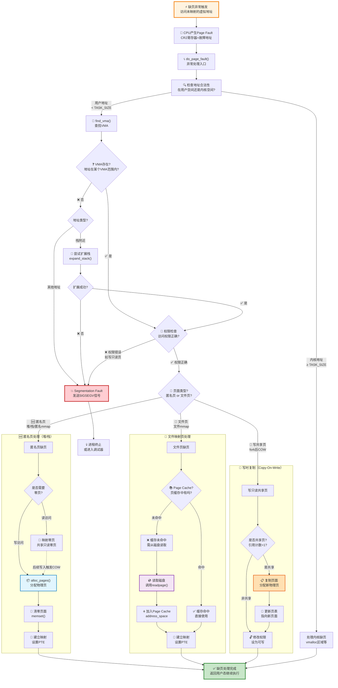
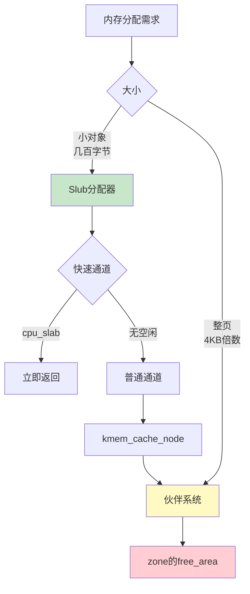

# Linux 底层原理学习笔记 · 第三册：内存管理

## 第4章 内存管理（一）：虚拟地址空间
### 4.1 为什么需要虚拟内存


> **核心思想**：内存管理是Linux内核的核心子系统，实现了从虚拟地址到物理地址的映射，以及内存的分配与回收。

#### 内存管理整体架构图



**架构要点**：

1. **三层体系**：
   - 虚拟内存层（进程视角）：mm_struct + VMA + 页表
   - 物理内存管理（内核视角）：NUMA节点 → ZONE → 伙伴系统
   - 小对象分配（优化层）：Slab缓存

2. **核心数据结构**：
   - `mm_struct`：进程内存空间描述符
   - `vm_area_struct`：虚拟内存区域（VMA）
   - `struct page`：物理页面描述符
   - `pg_data_t`：NUMA节点
   - `zone`：内存区域（DMA/NORMAL/HIGHMEM）

3. **分配路径**：
   - 用户态：malloc → brk/mmap → VMA → 缺页异常 → 伙伴系统
   - 内核小对象：kmalloc → Slab → 伙伴系统
   - 内核大块：vmalloc → 伙伴系统（虚拟连续）

4. **回收机制**：
   - LRU链表：追踪页面活跃度
   - kswapd：后台回收线程
   - Swap：匿名页换出到磁盘


#### 4.1.1 问题场景

**如果直接使用物理地址会怎样？**

假设程序中有指令：将用户输入的数字保存到地址`0x3F10`

**问题**：

- 同时运行3个相同程序（3个计算器）
- 用户分别输入：10、100、1000
- 物理地址`0x3F10`只能保存一个值
- **结果**：数据冲突！

#### 4.1.2 虚拟内存解决方案

**核心机制**：

1. **物理地址对进程不可见**：进程无法直接访问物理地址
2. **虚拟地址统一视图**：每个进程看到的都是从0开始的虚拟地址空间
3. **映射机制**：操作系统将不同进程的虚拟地址映射到不同的物理地址



---

### 4.2 内存管理三大任务

**操作系统内存管理需要做的三件事**：

1. **虚拟内存空间管理**
   - 每个进程独立的虚拟地址空间
   - 规划虚拟地址布局

2. **物理内存管理**
   - 物理内存分页管理
   - 只有内存管理模块可以使用物理地址

3. **地址映射**
   - 虚拟地址→物理地址的转换
   - 支持内存换入换出

---

### 4.3 虚拟地址空间布局

#### 4.3.1 示例程序的内存需求

```c
#include <stdio.h>
#include <stdlib.h>

int max_length = 128;  // 全局变量

char * generate(int length) {
    char * buffer = (char*) malloc(length+1);  // 堆分配
    if (buffer == NULL)
        return NULL;
    for (int i=0; i<length; i++) {
        buffer[i] = rand()%26+'a';
    }
    buffer[length] = '\0';
    return buffer;
}

int main(int argc, char *argv[]) {
    int num;  // 局部变量（栈）
    char * buffer;
    
    printf("Input the string length : ");  // 字符串常量
    scanf("%d", &num);
    
    if(num > max_length){
        num = max_length;
    }
    buffer = generate(num);
    printf("Random string is: %s\n", buffer);
    free(buffer);
    
    return 0;
}
```

**内存使用方式汇总**：

| 类型 | 示例 | 存储位置 |
|------|------|----------|
| 代码 | 程序指令 | Text Segment |
| 全局变量 | `max_length` | Data Segment |
| 常量字符串 | `"Input..."` | Data Segment (rodata) |
| 未初始化静态变量 | - | BSS Segment |
| 局部变量 | `num` | Stack |
| 动态分配 | `malloc()` | Heap |
| 共享库 | glibc.so | Memory Mapping Segment |

**内核态的内存需求**：

- 内核代码
- 内核全局变量
- task_struct
- 内核栈
- 内核动态内存
- 页表（映射表）

#### 4.3.2 用户态vs内核态地址使用

**重要原则**：
> 几乎所有代码（用户态和内核态）都使用虚拟地址！

**唯一例外**：内存管理模块本身操作页表时

**原因**：

- 统一管理：所有内存访问都经过虚拟地址转换
- 安全控制：内存管理模块可以统一控制访问权限
- 隔离保护：避免直接物理地址访问导致的混乱

#### 4.3.3 虚拟地址空间划分

**32位系统**：4GB虚拟地址空间 (2^32)
**64位系统**：256TB虚拟地址空间 (实际使用48位)

**空间划分**：

```
高地址 ┌─────────────────────────┐
      │    内核空间               │ 30-39号会议室
      │  (Kernel Space)         │ （闲人免进）
      ├─────────────────────────┤ ← 分界线
      │    栈 (Stack)           │ ← 向下增长
      │         ↓               │
      │                         │
      │    Memory Mapping       │ ← so文件映射
      │         ↑               │
      │    堆 (Heap)            │ ← 向上增长
      ├─────────────────────────┤
      │    BSS Segment          │ ← 未初始化静态变量
      ├─────────────────────────┤
      │    Data Segment         │ ← 全局变量、常量
      ├─────────────────────────┤
      │    Text Segment         │ ← 程序代码
低地址 └─────────────────────────┘
```

**用户空间**（低地址0-29号）：

1. **Text Segment**：二进制可执行代码
2. **Data Segment**：静态常量（rodata）、已初始化全局变量
3. **BSS Segment**：未初始化静态变量
4. **Heap**：动态分配（malloc），向高地址增长
5. **Memory Mapping Segment**：so文件映射区域
6. **Stack**：函数调用栈，向低地址增长

**内核空间**（高地址30-39号）：

- 内核代码（Text/Data/BSS）
- 所有进程共享
- 需要特权才能访问

**重要特性**：

- 用户进程：只能访问用户空间，内核空间"闲人免进"
- 内核视角：所有进程的内核空间都是同一个
- 内核栈：每个进程独立，但都在内核空间范围

---

### 4.4 分段机制

#### 4.4.1 分段原理

**分段地址组成**：

- **段选择子**（Segment Selector）：保存在段寄存器中
- **段内偏移量**（Offset）

**地址转换过程**：

1. 段选择子→段号→段表索引
2. 从段表获取：段基地址、段界限、特权等级
3. 检查：偏移量是否在[0, 段界限]范围内
4. 物理地址 = 段基地址 + 段内偏移量

**示例**：

```
段2的基地址 = 2000
偏移量 = 600
物理地址 = 20002 + 600 = 2600
```

#### 4.4.2 Linux中的分段

**GDT（Global Descriptor Table）**：

```c
#define GDT_ENTRY_INIT(flags, base, limit) { { { \
    .a = ((limit) & 0xffff) | (((base) & 0xffff) << 16), \
    .b = (((base) & 0xff0000) >> 16) | (((flags) & 0xf0ff) << 8) | \
        ((limit) & 0xf0000) | ((base) & 0xff000000), \
} } }

// 64位系统的段定义
[GDT_ENTRY_KERNEL_CS] = GDT_ENTRY_INIT(0xc09a, 0, 0xfffff),  // 内核代码段
[GDT_ENTRY_KERNEL_DS] = GDT_ENTRY_INIT(0xc092, 0, 0xfffff),  // 内核数据段
[GDT_ENTRY_DEFAULT_USER_CS] = GDT_ENTRY_INIT(0xc0fa, 0, 0xfffff),  // 用户代码段
[GDT_ENTRY_DEFAULT_USER_DS] = GDT_ENTRY_INIT(0xc0f2, 0, 0xfffff),  // 用户数据段
```

**段选择子定义**：

```c
#define __KERNEL_CS (GDT_ENTRY_KERNEL_CS*8)
#define __KERNEL_DS (GDT_ENTRY_KERNEL_DS*8)
#define __USER_DS (GDT_ENTRY_DEFAULT_USER_DS*8 + 3)  // DPL=3
#define __USER_CS (GDT_ENTRY_DEFAULT_USER_CS*8 + 3)  // DPL=3
```

**关键发现**：
> 所有段的基地址都是0！

**Linux几乎不使用分段功能**：

- ✅ 保留分段的权限检查（DPL: 用户态3，内核态0）
- ❌ 不使用分段的内存划分功能
- 👉 Linux倾向使用**分页机制**

---

### 4.5 分页机制

#### 4.5.1 分页基本原理

**核心概念**：

- **页（Page）**：固定大小的内存块，通常4KB
- **页表（Page Table）**：记录虚拟页→物理页的映射
- **页号**（Page Number）：虚拟地址的高位
- **页内偏移**（Page Offset）：虚拟地址的低位（12位，4KB）

**地址转换**：

```
虚拟地址 = [页号 | 页内偏移]
         ↓ 通过页表查找
物理地址 = [物理页基地址 | 页内偏移]
```

**优势**：

- 内存换入换出：以页为单位
- 扩大可用内存：不常用的页可以换出到硬盘
- 提高内存利用率

#### 4.5.2 两级页表（32位系统）

**问题**：

- 32位系统：4GB虚拟空间
- 页大小：4KB
- 页数：4GB / 4KB = 1M个页
- 页表项大小：4字节
- **页表总大小**：4MB（太大！）

**解决方案：两级页表**

**结构**：

1. **页目录**（Page Directory）：1K项，每项4字节，共4KB
2. **页表**（Page Table）：每个1K项，每项4字节，共4KB

**地址划分**（32位）：

```
┌──────────┬──────────┬────────────────┐
│  10位    │  10位    │     12位       │
│ 页目录索引 │ 页表索引  │   页内偏移     │
└──────────┴──────────┴────────────────┘
```

**查找过程**：

1. 前10位→页目录索引→页表基地址
2. 中10位→页表索引→物理页基地址  
3. 后12位→页内偏移→最终物理地址

**优势**：

- 稀疏内存：只需要分配实际使用的页表
- 节省空间：只分配一个数据页时，只需4KB页目录 + 4KB页表

#### 4.5.3 四级页表（64位系统）

**地址划分**（64位，实际使用48位）：

```
┌─────┬─────┬─────┬─────┬────────────┐
│ 9位 │ 9位 │ 9位 │ 9位 │   12位     │
│ PGD │ PUD │ PMD │ PTE │    Offset  │
└─────┴─────┴─────┴─────┴────────────┘
```

**四级结构**：

1. **PGD**（Page Global Directory）：全局页目录
2. **PUD**（Page Upper Directory）：上层页目录
3. **PMD**（Page Middle Directory）：中间页目录
4. **PTE**（Page Table Entry）：页表项



---

### 4.6 总结

#### 4.6.1 核心要点

**为什么需要虚拟内存**：

- 解决多进程地址冲突
- 提供独立的地址空间
- 实现内存保护和隔离

**虚拟地址空间布局**：

- 用户空间：Text、Data、BSS、Heap、Mmap、Stack
- 内核空间：所有进程共享，特权访问

**地址转换机制**：

- 分段：Linux不使用（仅保留权限检查）
- 分页：Linux主要使用的机制

**多级页表**：

- 32位：两级页表（页目录 + 页表）
- 64位：四级页表（PGD + PUD + PMD + PTE）
- 优势：节省内存，支持稀疏地址空间

#### 4.6.2 重要命令

```bash
# 查看进程内存布局
cat /proc/PID/maps

# 查看系统页大小
getconf PAGE_SIZE

# 查看大页配置
cat /proc/meminfo | grep Huge

# 配置大页
echo 20 > /proc/sys/vm/nr_hugepages
```

#### 4.6.3 关键数据结构

```c
// 段描述符表
struct gdt_page {
    struct desc_struct gdt[GDT_ENTRIES];
};

// 页表项（简化）
struct {
    unsigned long present : 1;     // 是否在内存中
    unsigned long rw : 1;          // 读写权限
    unsigned long user : 1;        // 用户态可访问
    unsigned long pfn : 40;        // 物理页帧号
};
```

---

**下一节预告**:将讲解进程空间管理（brk、mmap）和物理内存管理（伙伴系统）。

---

## 第4章 内存管理（二）：空间管理与物理内存
### 4.7 进程虚拟空间管理


> **核心思想**：用mm_struct管理进程虚拟空间，用伙伴系统管理物理内存分配。


#### 4.7.1 mm_struct结构

**进程内存描述符**：

```c
struct task_struct {
    struct mm_struct *mm;  // 进程的内存管理结构
};
```

**mm_struct关键成员**：

```c
struct mm_struct {
    unsigned long task_size;        // 用户态/内核态分界线
    unsigned long mmap_base;        // 内存映射区起始地址
    unsigned long total_vm;         // 映射的总页数
    unsigned long locked_vm;        // 锁定不能换出的页数
    unsigned long pinned_vm;        // 不能换出也不能移动的页数
    
    // 各区域统计
    unsigned long data_vm;          // 数据页数
    unsigned long exec_vm;          // 可执行页数
    unsigned long stack_vm;         // 栈页数
    
    // 代码段
    unsigned long start_code, end_code;
    // 数据段
    unsigned long start_data, end_data;
    // 堆
    unsigned long start_brk, brk;
    // 栈
    unsigned long start_stack;
    // 参数和环境变量
    unsigned long arg_start, arg_end;
    unsigned long env_start, env_end;
    
    // 虚拟内存区域管理
    struct vm_area_struct *mmap;    // 单链表
    struct rb_root mm_rb;           // 红黑树
};
```

#### 4.7.2 用户态地址空间划分

**32位系统**：

- 用户空间：3GB (0x00000000 - 0xC0000000)
- 内核空间：1GB (0xC0000000 - 0xFFFFFFFF)

**64位系统（使用48位）**：

- 用户空间：128TB (0x0000000000000000 - 0x00007FFFFFFFF000)
- 中间空洞：隔离区
- 内核空间：128TB (0xFFFF800000000000 - 0xFFFFFFFFFFFFFFFF)

```c
// 32位
#define TASK_SIZE PAGE_OFFSET  // 0xC0000000

// 64位
#define TASK_SIZE_MAX ((1UL << 47) - PAGE_SIZE)  // 128TB
```

#### 4.7.3 vm_area_struct虚拟内存区域

**结构定义**：

```c
struct vm_area_struct {
    unsigned long vm_start;         // 起始地址
    unsigned long vm_end;           // 结束地址
    
    // 链表和红黑树节点
    struct vm_area_struct *vm_next, *vm_prev;
    struct rb_node vm_rb;
    
    struct mm_struct *vm_mm;        // 所属mm
    
    // 操作函数
    const struct vm_operations_struct *vm_ops;
    
    // 映射类型
    struct file *vm_file;           // 文件映射
    struct anon_vma *anon_vma;      // 匿名映射
    void *vm_private_data;
};
```

**管理机制**：

- **单链表**：按地址顺序连接所有区域
- **红黑树**：快速查找和修改（O(log n)）

#### 4.7.4 load_elf_binary建立内存映射

**ELF加载过程**：

```c
static int load_elf_binary(struct linux_binprm *bprm) {
    // 1. 设置内存映射区
    setup_new_exec(bprm);
    
    // 2. 设置栈
    setup_arg_pages(bprm, randomize_stack_top(STACK_TOP), executable_stack);
    // 设置 mm->arg_start, mm->start_stack
    
    // 3. 映射代码段
    elf_map(bprm->file, load_bias + vaddr, elf_ppnt, ...);
    
    // 4. 设置堆
    set_brk(elf_bss, elf_brk, bss_prot);
    // 设置 mm->start_brk = mm->brk
    
    // 5. 加载动态链接库
    load_elf_interp(&loc->interp_elf_ex, interpreter, ...);
    
    // 6. 设置各区域边界
    current->mm->end_code = end_code;
    current->mm->start_code = start_code;
    current->mm->start_data = start_data;
    current->mm->end_data = end_data;
    current->mm->start_stack = bprm->p;
}
```

---

### 4.8 brk系统调用

#### 4.8.1 brk原理

**作用**：扩展或收缩堆空间

**系统调用入口**：

```c
SYSCALL_DEFINE1(brk, unsigned long, brk) {
    unsigned long retval;
    unsigned long newbrk, oldbrk;
    struct mm_struct *mm = current->mm;
    struct vm_area_struct *next;
    
    // 页对齐
    newbrk = PAGE_ALIGN(brk);
    oldbrk = PAGE_ALIGN(mm->brk);
    
    // 1. 如果在同一页，直接更新
    if (oldbrk == newbrk)
        goto set_brk;
    
    // 2. 收缩堆：释放内存
    if (brk <= mm->brk) {
        if (!do_munmap(mm, newbrk, oldbrk-newbrk, &uf))
            goto set_brk;
        goto out;
    }
    
    // 3. 扩展堆：检查是否有足够空间
    next = find_vma(mm, oldbrk);
    if (next && newbrk + PAGE_SIZE > vm_start_gap(next))
        goto out;  // 没有足够空间
    
    // 4. 分配新页
    if (do_brk(oldbrk, newbrk-oldbrk, &uf) < 0)
        goto out;
    
set_brk:
    mm->brk = brk;
    return brk;
out:
    return mm->brk;
}
```

#### 4.8.2 do_brk分配内存

```c
static int do_brk_flags(unsigned long addr, unsigned long request, 
                       unsigned long flags, struct list_head *uf) {
    struct mm_struct *mm = current->mm;
    struct vm_area_struct *vma, *prev;
    unsigned long len = PAGE_ALIGN(request);
    
    // 1. 查找插入位置
    find_vma_links(mm, addr, addr + len, &prev, &rb_link, &rb_parent);
    
    // 2. 尝试合并相邻区域
    vma = vma_merge(mm, prev, addr, addr + len, flags, ...);
    if (vma)
        goto out;
    
    // 3. 创建新的vm_area_struct
    vma = kmem_cache_zalloc(vm_area_cachep, GFP_KERNEL);
    INIT_LIST_HEAD(&vma->anon_vma_chain);
    vma->vm_mm = mm;
    vma->vm_start = addr;
    vma->vm_end = addr + len;
    vma->vm_pgoff = pgoff;
    vma->vm_flags = flags;
    vma->vm_page_prot = vm_get_page_prot(flags);
    
    // 4. 插入到链表和红黑树
    vma_link(mm, vma, prev, rb_link, rb_parent);
    
out:
    mm->total_vm += len >> PAGE_SHIFT;
    mm->data_vm += len >> PAGE_SHIFT;
    return 0;
}
```

---

### 4.9 物理内存组织

#### 4.9.1 内存模型

**三种模型**：

1. **平坦内存模型（Flat Memory）**
   - 内存连续，简单的页数组
   - 适用于小型单CPU系统

2. **NUMA（Non-Uniform Memory Access）**
   - 每个CPU有本地内存
   - 访问本地内存快，访问远程内存慢
   - 当前主流

3. **稀疏内存模型（Sparse Memory）**
   - 支持内存热插拔
   - 物理地址可能不连续

#### 4.9.2 NUMA节点

```c
typedef struct pglist_data {
    // 节点ID
    int node_id;
    
    // 节点内的所有页
    struct page *node_mem_map;
    
    // 页号范围
    unsigned long node_start_pfn;      // 起始页号
    unsigned long node_present_pages;  // 真实可用页数
    unsigned long node_spanned_pages;  // 包含空洞的总页数
    
    // 区域数组
    struct zone node_zones[MAX_NR_ZONES];
    int nr_zones;
    
    // 备用节点列表
    struct zonelist node_zonelists[MAX_ZONELISTS];
} pg_data_t;

// 全局节点数组
struct pglist_data *node_data[MAX_NUMNODES];
```

**页数统计**：

- `node_spanned_pages`：包含空洞的总页范围
- `node_present_pages`：实际存在的物理页
- 例子：64M + 4M空洞 + 64M = spanned: 33K页, present: 32K页

#### 4.9.3 内存区域（Zone）

**区域类型**：

```c
enum zone_type {
    ZONE_DMA,       // DMA可用内存（<16MB）
    ZONE_DMA32,     // 32位DMA可用（<4GB）
    ZONE_NORMAL,    // 直接映射区
    ZONE_HIGHMEM,   // 高端内存（32位系统>896MB）
    ZONE_MOVABLE,   // 可移动区域，避免碎片
    MAX_NR_ZONES
};
```

**zone结构**：

```c
struct zone {
    struct pglist_data *zone_pgdat;    // 所属节点
    
    // 页号范围
    unsigned long zone_start_pfn;
    unsigned long spanned_pages;       // 包含空洞的总页数
    unsigned long present_pages;       // 真实存在页数
    unsigned long managed_pages;       // 伙伴系统管理页数
    
    // 冷热页（per-CPU页集合）
    struct per_cpu_pageset __percpu *pageset;
    
    // 伙伴系统空闲区域
    struct free_area free_area[MAX_ORDER];  // 11个
    
    unsigned long flags;
    spinlock_t lock;
    
    const char *name;
};
```

**关键概念**：

- **冷热页**：
  - 热页（Hot Page）：在CPU缓存中，访问快
  - 冷页（Cold Page）：不在缓存中
  - 每个CPU维护自己的per_cpu_pageset

#### 4.9.4 页结构（struct page）

**union设计**：同一内存保存不同类型数据

**使用模式1：整页使用**

```c
struct page {
    unsigned long flags;
    
    union {
        struct address_space *mapping;  // 文件映射/匿名页
        // 匿名页：最低位=1
        // 文件映射：最低位=0
    };
    
    pgoff_t index;                   // 映射区偏移
    atomic_t _mapcount;              // 多少页表项指向此页
    struct list_head lru;            // LRU链表（换出等）
    
    // 复合页（大页）
    unsigned long compound_head;
    unsigned int compound_dtor;
    unsigned int compound_order;
};
```

**使用模式2：小块分配（slab/slub）**

```c
struct page {
    union {
        void *s_mem;                 // slab第一个对象
        void *freelist;              // 空闲对象链表
    };
    
    union {
        unsigned inuse:16;           // 已使用对象数
        unsigned objects:15;         // 总对象数
        unsigned frozen:1;           // 是否冻结
    };
    
    struct kmem_cache *slab_cache;   // slab缓存指针
    struct rcu_head rcu_head;        // 释放列表
};
```

---

### 4.10 伙伴系统（Buddy System）

#### 4.10.1 基本原理

**核心思想**：

- 将内存按2的幂次方分组
- 11个链表：1, 2, 4, 8, 16, 32, 64, 128, 256, 512, 1024页
- 最大连续分配：1024页 = 4MB

**数据结构**：

```c
#define MAX_ORDER 11

struct free_area {
    struct list_head free_list[MIGRATE_TYPES];
    unsigned long nr_free;
};

struct zone {
    struct free_area free_area[MAX_ORDER];
};
```

#### 4.10.2 分配算法

**请求(2^(i-1), 2^i]页时**：

1. 查找2^i页的链表
2. 如果有空闲，直接分配
3. 如果没有，查找2^(i+1)页链表
4. 分裂成两半：一半使用，一半插入2^i链表
5. 递归向上查找直到找到或失败

**示例：请求128页**

```
1. 检查free_area[7]（128页）→ 空
2. 检查free_area[8]（256页）→ 有空闲
3. 分裂256页 → 128页(使用) + 128页(插入free_area[7])
```

**如果256也没有，查512页**：

```
1. 检查free_area[9]（512页）→ 有空闲
2. 分裂512 → 256 + 256
3. 分裂256 → 128(使用) + 128(插入free_area[7])
4. 插入256到free_area[8]
```

#### 4.10.3 alloc_pages流程

```c
struct page *alloc_pages(gfp_t gfp_mask, unsigned int order) {
    return alloc_pages_current(gfp_mask, order);
}

struct page *alloc_pages_current(gfp_t gfp, unsigned order) {
    struct mempolicy *pol = &default_policy;
    struct page *page;
    
    page = __alloc_pages_nodemask(gfp, order,
                                 policy_node(gfp, pol, numa_node_id()),
                                 policy_nodemask(gfp, pol));
    return page;
}
```

**gfp标志**：

- `GFP_USER`：用户进程，可被硬件访问
- `GFP_KERNEL`：内核分配，ZONE_NORMAL区
- `GFP_HIGHMEM`：高端内存区
- `GFP_ATOMIC`：不能睡眠，中断上下文

**order参数**：

- 分配2^order个页
- order=0：1页（4KB）
- order=10：1024页（4MB）

#### 4.10.4 核心分配函数

```c
static struct page *
get_page_from_freelist(gfp_t gfp_mask, unsigned int order,
                      int alloc_flags, const struct alloc_context *ac) {
    struct zone *zone;
    
    // 遍历zonelist
    for_next_zone_zonelist_nodemask(zone, z, ac->zonelist,
                                   ac->high_zoneidx, ac->nodemask) {
        struct page *page;
        
        // 从zone的伙伴系统获取页
        page = rmqueue(ac->preferred_zoneref->zone, zone, order,
                      gfp_mask, alloc_flags, ac->migratetype);
        if (page)
            return page;
    }
    return NULL;
}
```

**rmqueue → __rmqueue → __rmqueue_smallest**：

```c
static inline struct page *
__rmqueue_smallest(struct zone *zone, unsigned int order, int migratetype) {
    unsigned int current_order;
    struct free_area *area;
    struct page *page;
    
    // 从order开始向上查找
    for (current_order = order; current_order < MAX_ORDER; ++current_order) {
        area = &(zone->free_area[current_order]);
        page = list_first_entry_or_null(&area->free_list[migratetype],
                                       struct page, lru);
        if (!page)
            continue;
        
        // 找到了，从链表删除
        list_del(&page->lru);
        area->nr_free--;
        
        // 分裂大块内存
        expand(zone, page, order, current_order, area, migratetype);
        return page;
    }
    return NULL;
}
```

**expand分裂过程**：

```c
static inline void expand(struct zone *zone, struct page *page,
                         int low, int high, struct free_area *area,
                         int migratetype) {
    unsigned long size = 1 << high;
    
    while (high > low) {
        area--;
        high--;
        size >>= 1;
        
        // 分裂：一半返回，一半加入下一级链表
        list_add(&page[size].lru, &area->free_list[migratetype]);
        area->nr_free++;
    }
}
```

---

### 4.11 总结

#### 4.11.1 核心数据结构关系



#### 4.11.2 虚拟空间vs物理内存

| 层级 | 虚拟空间 | 物理内存 |
|------|----------|----------|
| 进程级 | mm_struct | - |
| 区域级 | vm_area_struct | zone（NUMA节点） |
| 页级 | 虚拟页号 | struct page |
| 分配机制 | brk/mmap系统调用 | 伙伴系统 |
| 数据结构 | 链表+红黑树 | 2^n链表数组 |

#### 4.11.3 关键函数速查

| 函数 | 作用 | 使用场景 |
|------|------|----------|
| `load_elf_binary` | 建立进程内存映射 | exec加载程序 |
| `sys_brk` | 调整堆大小 | malloc小内存 |  
| `do_brk` | 分配堆内存 | brk扩展堆 |
| `alloc_pages` | 分配页 | 内核分配内存 |
| `__rmqueue_smallest` | 伙伴系统核心 | 查找空闲页块 |
| `expand` | 分裂页块 | 大页块分成小页块 |

#### 4.11.4 实用命令

```bash
# 查看进程内存映射
cat /proc/PID/maps
pmap PID

# 查看系统内存信息
cat /proc/meminfo
free -h

# 查看NUMA信息
numactl --hardware
lscpu | grep NUMA

# 查看伙伴系统信息
cat /proc/buddyinfo

# 查看zone信息
cat /proc/zoneinfo
```

---

## 第4章 内存管理（三）：小内存分配与映射机制
### 4.12 Slub分配器


> **核心思想**：slub分配器管理小对象，mmap系统调用建立虚实映射，缺页异常按需分配物理内存。


#### 4.12.1 为什么需要Slub

**问题**：

- 伙伴系统最小分配单位：1页（4KB）
- 小对象（如task_struct）：只需几百字节
- 浪费严重！

**解决方案**：Slub Allocator

- 从伙伴系统申请整页
- 切分成小块对象
- 缓存常用对象

#### 4.12.2 kmem_cache结构

```c
struct kmem_cache {
    // per-CPU快速通道
    struct kmem_cache_cpu __percpu *cpu_slab;
    
    // 对象大小
    int size;                    // 包含元数据的大小
    int object_size;             // 纯对象大小
    int offset;                  // 空闲指针偏移
    
    // 内存块配置
    struct kmem_cache_order_objects oo;   // 默认配置
    struct kmem_cache_order_objects max;  // 最大配置
    struct kmem_cache_order_objects min;  // 最小配置
    
    gfp_t allocflags;           // 分配标志
    const char *name;           // 缓存名称
    struct list_head list;      // 全局缓存链表
    
    // per-NUMA node普通通道
    struct kmem_cache_node *node[MAX_NUMNODES];
};

// 全局缓存链表
LIST_HEAD(slab_caches);
```

**示例**：task_struct缓存

```c
static struct kmem_cache *task_struct_cachep;

task_struct_cachep = kmem_cache_create("task_struct",
                                      arch_task_struct_size,
                                      align,
                                      SLAB_PANIC|SLAB_NOTRACK|SLAB_ACCOUNT,
                                      NULL);
```

#### 4.12.3 快速通道vs普通通道

**两级缓存机制**：



**kmem_cache_cpu（快速通道）**：

```c
struct kmem_cache_cpu {
    void **freelist;          // 第一个空闲对象指针
    unsigned long tid;        // 事务ID
    struct page *page;        // 当前使用的大块内存
    struct page *partial;     // 部分空闲的备用块
};
```

**kmem_cache_node（普通通道）**：

```c
struct kmem_cache_node {
    spinlock_t list_lock;
    unsigned long nr_partial;
    struct list_head partial;  // 部分空闲块链表
};
```

#### 4.12.4 分配流程

**slab_alloc_node核心流程**：

```c
static __always_inline void *slab_alloc_node(struct kmem_cache *s,
                                             gfp_t gfpflags, int node) {
    void *object;
    struct kmem_cache_cpu *c;
    struct page *page;
    
    // 1. 快速通道：直接从cpu_slab获取
    c = raw_cpu_ptr(s->cpu_slab);
    object = c->freelist;
    page = c->page;
    
    if (unlikely(!object || !node_match(page, node))) {
        // 2. 慢速通道
        object = __slab_alloc(s, gfpflags, node, addr, c);
    }
    
    return object;
}
```

**__slab_alloc慢速流程**：

```c
static void *___slab_alloc(struct kmem_cache *s, gfp_t gfpflags, int node,
                          unsigned long addr, struct kmem_cache_cpu *c) {
    void *freelist;
    struct page *page;
    
redo:
    // 1. 再次检查freelist（可能被中断释放了）
    freelist = c->freelist;
    if (freelist)
        goto load_freelist;
    
    // 2. 尝试从cpu的partial获取
    if (slub_percpu_partial(c)) {
        page = c->page = slub_percpu_partial(c);
        goto redo;
    }
    
new_slab:
    // 3. 从node的partial获取
    freelist = get_partial(s, flags, node, c);
    if (freelist)
        return freelist;
    
    // 4. 从伙伴系统分配新页
    page = new_slab(s, flags, node);
    if (page) {
        c = raw_cpu_ptr(s->cpu_slab);
        freelist = page->freelist;
        page->freelist = NULL;
        c->page = page;
    }
    
    return freelist;
}
```

**内存块组织**：

```
┌──────────────────────────────────┐
│   Object 1   │  next ptr → Obj2 │
├──────────────────────────────────┤
│   Object 2   │  next ptr → Obj3 │
├──────────────────────────────────┤
│   Object 3   │  next ptr → Obj4 │
├──────────────────────────────────┤
│      ...           ...           │
└──────────────────────────────────┘

- size: 包含指针的总大小
- object_size: 纯对象大小
- offset: 指针存放偏移量
```

---

### 4.13 用户态内存映射

#### 4.13.1 mmap系统调用

**作用**：

1. **匿名映射**：虚拟内存→物理内存（大块堆内存）
2. **文件映射**：虚拟内存→物理内存→文件

**系统调用入口**：

```c
SYSCALL_DEFINE6(mmap, unsigned long, addr, unsigned long, len,
               unsigned long, prot, unsigned long, flags,
               unsigned long, fd, unsigned long, off) {
    error = sys_mmap_pgoff(addr, len, prot, flags, fd, off >> PAGE_SHIFT);
    return error;
}

SYSCALL_DEFINE6(mmap_pgoff, ...) {
    struct file *file = NULL;
    
    // 文件映射：获取文件对象
    if (fd)
        file = fget(fd);
    
    retval = vm_mmap_pgoff(file, addr, len, prot, flags, pgoff);
    return retval;
}
```

#### 4.13.2 mmap核心流程

**do_mmap主要步骤**：

1. `get_unmapped_area`：找空闲区域
2. `mmap_region`：建立映射

**get_unmapped_area**：

```c
unsigned long get_unmapped_area(struct file *file, unsigned long addr,
                                unsigned long len, unsigned long pgoff,
                                unsigned long flags) {
    unsigned long (*get_area)(...);
    
    // 默认使用mm的函数
    get_area = current->mm->get_unmapped_area;
    
    // 文件映射：使用文件系统的函数
    if (file) {
        if (file->f_op->get_unmapped_area)
            get_area = file->f_op->get_unmapped_area;
    }
    
    // 最终都调用arch_get_unmapped_area
    // 在红黑树上找到合适位置
    return get_area(file, addr, len, pgoff, flags);
}
```

**mmap_region建立映射**：

```c
unsigned long mmap_region(struct file *file, unsigned long addr,
                         unsigned long len, vm_flags_t vm_flags,
                         unsigned long pgoff, struct list_head *uf) {
    struct mm_struct *mm = current->mm;
    struct vm_area_struct *vma, *prev;
    
    // 1. 尝试合并相邻区域
    vma = vma_merge(mm, prev, addr, addr + len, vm_flags,
                    NULL, file, pgoff, NULL, NULL_VM_UFFD_CTX);
    if (vma)
        goto out;
    
    // 2. 创建新的vm_area_struct
    vma = kmem_cache_zalloc(vm_area_cachep, GFP_KERNEL);
    INIT_LIST_HEAD(&vma->anon_vma_chain);
    vma->vm_mm = mm;
    vma->vm_start = addr;
    vma->vm_end = addr + len;
    vma->vm_flags = vm_flags;
    vma->vm_pgoff = pgoff;
    
    // 3. 文件映射：设置操作函数
    if (file) {
        vma->vm_file = get_file(file);
        error = call_mmap(file, vma);  // file->f_op->mmap(file, vma)
        
        // 对于ext4：vma->vm_ops = &ext4_file_vm_ops
    }
    
    // 4. 插入红黑树
    vma_link(mm, vma, prev, rb_link, rb_parent);
    
    return addr;
}
```

**文件映射的双向关联**：

```c
// vm_area_struct → file
vma->vm_file = file;
vma->vm_ops = &ext4_file_vm_ops;

// file → vm_area_struct（通过address_space）
struct address_space {
    struct inode *host;
    struct rb_root i_mmap;  // 红黑树，挂载所有vma
    const struct address_space_operations *a_ops;
};

static void __vma_link_file(struct vm_area_struct *vma) {
    struct file *file = vma->vm_file;
    if (file) {
        struct address_space *mapping = file->f_mapping;
        vma_interval_tree_insert(vma, &mapping->i_mmap);
    }
}
```

**重要**：
> 到此为止，只建立了逻辑映射关系，**没有分配物理内存**！
> 物理内存在**首次访问触发缺页异常时**才按需分配。

---

### 4.14 缺页异常

#### 缺页异常处理流程决策树



**缺页异常处理关键点**：

#### 1️⃣ 异常触发条件

| 触发情况 | 原因 | 处理方式 |
|---------|------|----------|
| **首次访问** | 虚拟地址未映射物理页 | 分配物理页并建立映射 |
| **权限错误** | 写只读页 | COW或SIGSEGV |
| **页面换出** | 物理页被swap到磁盘 | 从swap读回 |
| **文件映射** | 文件页未加载 | 从磁盘读取文件数据 |
| **栈增长** | 访问栈下方地址 | 扩展栈VMA |
| **非法地址** | 访问不在任何VMA中的地址 | SIGSEGV |

#### 2️⃣ 三种缺页类型

##### A. 匿名页缺页（堆/栈）

```c
// malloc分配但未访问
char *buf = malloc(4096);  // 仅分配VMA，未分配物理页
buf[0] = 'A';              // ⚡ 触发缺页异常
                           // → 分配物理页
                           // → 清零
                           // → 建立PTE映射
```

**流程**：

1. 查找VMA：找到对应的vm_area_struct
2. 分配物理页：通过伙伴系统`alloc_pages()`
3. 清零页面：`clear_page()`确保安全
4. 建立映射：设置PTE（页表项）

##### B. 文件页缺页（mmap文件）

```c
// mmap映射文件
char *addr = mmap(NULL, 4096, PROT_READ, MAP_SHARED, fd, 0);
char c = addr[0];          // ⚡ 触发缺页异常
                           // → 检查Page Cache
                           // → 未命中则从磁盘读取
                           // → 加入Page Cache
                           // → 建立PTE映射
```

**流程**：

1. 查找Page Cache：`find_get_page()`
2. 如果命中：直接建立映射
3. 如果未命中：
   - 调用`readpage()`从磁盘读取
   - 加入Page Cache（address_space基数树）
   - 建立PTE映射

##### C. 写时复制（COW）

```c
// fork后父子进程共享页面
pid_t pid = fork();
if (pid == 0) {
    data[0] = 'B';         // ⚡ 触发COW缺页异常
                           // → 复制物理页
                           // → 更新子进程PTE
                           // → 修改权限为可写
}
```

**流程**：

1. 检测到写只读共享页
2. 复制物理页：`copy_page()`
3. 更新PTE：指向新页面
4. 修改权限：设置PTE的Write位

#### 3️⃣ 关键数据结构

```c
// 缺页异常信息
struct vm_fault {
    unsigned long address;      // 故障地址
    unsigned int flags;         // 访问标志（读/写）
    pte_t *pte;                // 页表项指针
    struct vm_area_struct *vma; // 对应的VMA
    struct page *page;          // 分配的物理页
};

// VMA操作
struct vm_operations_struct {
    void (*fault)(struct vm_fault *);  // 缺页处理
    void (*page_mkwrite)(struct vm_fault *); // 页面写保护
};
```

#### 4️⃣ 性能优化

| 优化技术 | 作用 | 效果 |
|---------|------|------|
| **零页映射** | 首次读取映射只读零页 | 延迟分配 |
| **COW** | fork不立即复制，写时才复制 | 节省内存 |
| **Page Cache** | 文件页缓存在内存 | 减少磁盘I/O |
| **预读** | 一次读取多个页面 | 减少缺页次数 |
| **延迟分配** | malloc不立即分配物理页 | 按需分配 |

#### 核心理解

1. **延迟分配**：虚拟内存分配（VMA）和物理内存分配（page）分离
2. **按需分配**：只在真正访问时才分配物理页（缺页异常）
3. **VMA查找是第一步**：不在VMA范围内直接SIGSEGV
4. **Page Cache是关键**：文件页优先查缓存
5. **COW优化**：fork+exec模式下不浪费内存
6. **零页优化**：读取未初始化内存映射共享零页

#### 4.14.1 缺页异常触发

**访问未映射的虚拟地址→ CPU触发Page Fault**

```c
dotraplinkage void notrace
do_page_fault(struct pt_regs *regs, unsigned long error_code) {
    unsigned long address = read_cr2();  // 获取出错地址
    __do_page_fault(regs, error_code, address);
}

static noinline void
__do_page_fault(struct pt_regs *regs, unsigned long error_code,
               unsigned long address) {
    struct vm_area_struct *vma;
    struct task_struct *tsk = current;
    struct mm_struct *mm = tsk->mm;
    
    // 1. 查找vma
    vma = find_vma(mm, address);
    if (unlikely(!vma)) {
        bad_area(regs, error_code, address);
        return;
    }
    
    // 2. 检查权限
    if (unlikely(access_error(error_code, vma))) {
        bad_area_access_error(regs, error_code, address, vma);
        return;
    }
    
    // 3. 处理缺页
    fault = handle_mm_fault(vma, address, flags);
}
```

#### 4.14.2 handle_mm_fault处理

```c
static vm_fault_t handle_mm_fault(struct vm_area_struct *vma,
                                  unsigned long address,
                                  unsigned int flags) {
    vm_fault_t ret;
    
    // 1. 创建页表项（如不存在）
    ret = __handle_mm_fault(vma, address, flags);
    
    return ret;
}

static vm_fault_t __handle_mm_fault(struct vm_area_struct *vma,
                                    unsigned long address,
                                    unsigned int flags) {
    struct mm_struct *mm = vma->vm_mm;
    pgd_t *pgd;
    p4d_t *p4d;
    pud_t *pud;
    pmd_t *pmd;
    pte_t *pte;
    
    // 2. 四级页表查找/创建
    pgd = pgd_offset(mm, address);
    p4d = p4d_alloc(mm, pgd, address);
    pud = pud_alloc(mm, p4d, address);
    pmd = pmd_alloc(mm, pud, address);
    
    // 3. 处理pte级别的缺页
    return handle_pte_fault(&vmf);
}
```

**handle_pte_fault According分类处理**：

```c
static vm_fault_t handle_pte_fault(struct vm_fault *vmf) {
    pte_t entry;
    
    if (!vmf->pte) {
        // 情况1：匿名页（堆、栈）
        if (vma_is_anonymous(vmf->vma))
            return do_anonymous_page(vmf);
        // 情况2：文件映射
        else
            return do_fault(vmf);
    }
    
    // 情况3：页被换出（swap）
    if (!pte_present(entry))
        return do_swap_page(vmf);
    
    // 情况4：写时复制COW
    if (vmf->flags & FAULT_FLAG_WRITE) {
        if (!pte_write(entry))
            return do_wp_page(vmf);
    }
    
    return 0;
}
```

**do_anonymous_page（匿名页）**：

```c
static vm_fault_t do_anonymous_page(struct vm_fault *vmf) {
    struct page *page;
    pte_t entry;
    
    // 1. 分配物理页
    page = alloc_zeroed_user_highpage_movable(vma, address);
    
    // 2. 创建页表项
    entry = mk_pte(page, vma->vm_page_prot);
    entry = pte_mkwrite(pte_mkdirty(entry));
    
    // 3. 设置页表
    set_pte_at(vma->vm_mm, address, vmf->pte, entry);
    
    // 4. 更新反向映射
    page_add_new_anon_rmap(page, vma, address, false);
    
    return 0;
}
```

---

### 4.15 内核态内存映射

#### 4.15.1 内核页表

**swapper_pg_dir**：内核顶级页目录

```c
// 定义
extern pgd_t init_top_pgt[];
#define swapper_pg_dir init_top_pgt

// 包含三个区域的页表
extern pud_t level3_ident_pgt[512];    // 直接映射区
extern pud_t level3_kernel_pgt[512];   // 内核代码区
extern pmd_t level2_fixmap_pgt[512];   // 固定映射区
```

**init_mm**：内核mm_struct

```c
struct mm_struct init_mm = {
    .mm_rb = RB_ROOT,
    .pgd = swapper_pg_dir,
    .mm_users = ATOMIC_INIT(2),
    .mm_count = ATOMIC_INIT(1),
    .mmap_sem = __RWSEM_INITIALIZER(init_mm.mmap_sem),
    .page_table_lock = __SPIN_LOCK_UNLOCKED(init_mm.page_table_lock),
    .mmlist = LIST_HEAD_INIT(init_mm.mmlist),
};
```

**初始化**：

```c
void __init setup_arch(char **cmdline_p) {
    // 1. 克隆初始页表
    clone_pgd_range(swapper_pg_dir + KERNEL_PGD_BOUNDARY,
                   initial_page_table + KERNEL_PGD_BOUNDARY,
                   KERNEL_PGD_PTRS);
    
    // 2. 加载CR3
    load_cr3(swapper_pg_dir);
    __flush_tlb_all();
    
    // 3. 初始化代码数据段范围
    init_mm.start_code = (unsigned long) _text;
    init_mm.end_code = (unsigned long) _etext;
    init_mm.end_data = (unsigned long) _edata;
    init_mm.brk = _brk_end;
    
    // 4. 映射所有物理内存
    init_mem_mapping();
}
```

#### 4.15.2 vmalloc

**直接映射区vs vmalloc区**：

- **直接映射**：虚拟地址 = 物理地址 + 固定偏移（__PAGE_OFFSET）
- **vmalloc**：虚拟地址和物理地址不连续

**vmalloc实现**：

```c
void *vmalloc(unsigned long size) {
    return __vmalloc_node_flags(size, NUMA_NO_NODE,
                                GFP_KERNEL | __GFP_HIGHMEM);
}

static void *__vmalloc_node(unsigned long size, unsigned long align,
                            gfp_t gfp_mask, pgprot_t prot,
                            int node, const void *caller) {
    // 1. 从vmalloc区域分配虚拟地址空间
    area = __get_vm_area_node(size, align, VM_ALLOC | VM_UNINITIALIZED,
                             VMALLOC_START, VMALLOC_END, node, gfp_mask, caller);
    
    // 2. 分配物理页面
    ret = __vmalloc_area_node(area, gfp_mask, prot, node);
    
    return area->addr;
}
```

**页表更新**：

```c
static int vmap_pte_range(pmd_t *pmd, unsigned long addr,
                         unsigned long end, pgprot_t prot, struct page **pages) {
    pte_t *pte;
    
    pte = pte_alloc_kernel(pmd, addr);
    do {
        struct page *page = *pages++;
        set_pte_at(&init_mm, addr, pte, mk_pte(page, prot));
    } while (pte++, addr += PAGE_SIZE, addr != end);
    
    return 0;
}
```

#### 4.15.3 kmap_atomic

**用途**：临时映射高端内存（32位系统）

```c
void *kmap_atomic(struct page *page) {
    unsigned long vaddr;
    int idx, type;
    
    // 1. 如果不是高端内存，直接返回
    if (!PageHighMem(page))
        return page_address(page);
    
    // 2. 获取固定映射区的slot
    type = kmap_atomic_idx_push();
    idx = FIX_KMAP_BEGIN + type + KM_TYPE_NR * smp_processor_id();
    vaddr = __fix_to_virt(idx);
    
    // 3. 设置页表
    set_pte(kmap_pte - idx, mk_pte(page, kmap_prot));
    arch_flush_lazy_mmu_mode();
    
    return (void *)vaddr;
}
```

---

### 4.16 总结

#### 4.16.1 内存分配层次



#### 4.16.2 映射机制对比

| 维度 | 用户态 | 内核态 |
|------|--------|--------|
| **映射函数** | mmap系统调用 | vmalloc、kmap_atomic |
| **页表** | 每进程独立pgd | 共享swapper_pg_dir |
| **延迟分配** | 是（缺页时分配） | vmalloc是，直接映射否 |
| **虚实关系** | 不固定 | 直接映射固定偏移 |
| **典型用途** | 堆、文件映射 | 内核模块、驱动 |

#### 4.16.3 关键流程

**用户态内存分配完整流程**：

```
malloc
  ├→ 小内存(< 128KB): brk → do_brk → vm_area_struct
  └→ 大内存(≥ 128KB): mmap → mmap_region → vm_area_struct
      ↓
   首次访问
      ↓
   缺页异常 → do_page_fault
      ├→ 查找vma
      ├→ 检查权限
      └→ handle_mm_fault
           ├→ 创建页表（四级）
           ├→ handle_pte_fault
           │    ├→ 匿名页: alloc_page → 分配物理内存
           │    └→ 文件映射: 从page cache获取
           └→ 设置页表项
```

#### 4.16.4 实用命令

```bash
# 查看slab信息
cat /proc/slabinfo
slabtop

# 查看vmalloc使用
cat /proc/vmallocinfo

# 查看页表
cat /proc/PID/pagemap

# 查看缺页统计
cat /proc/vmstat | grep fault

# 查看TLB统计
perf stat -e dTLB-loads,dTLB-load-misses <command>
```

---

**本节完成**：第4章第三部分小内存分配与映射机制已讲解完毕。

**章节回顾**：

- ✅ 第一部分：虚拟地址空间与分页机制
- ✅ 第二部分：进程空间管理与物理内存
- ✅ 第三部分：小内存分配与映射机制

**下一章预告**：第5章将讲解文件系统。

---
