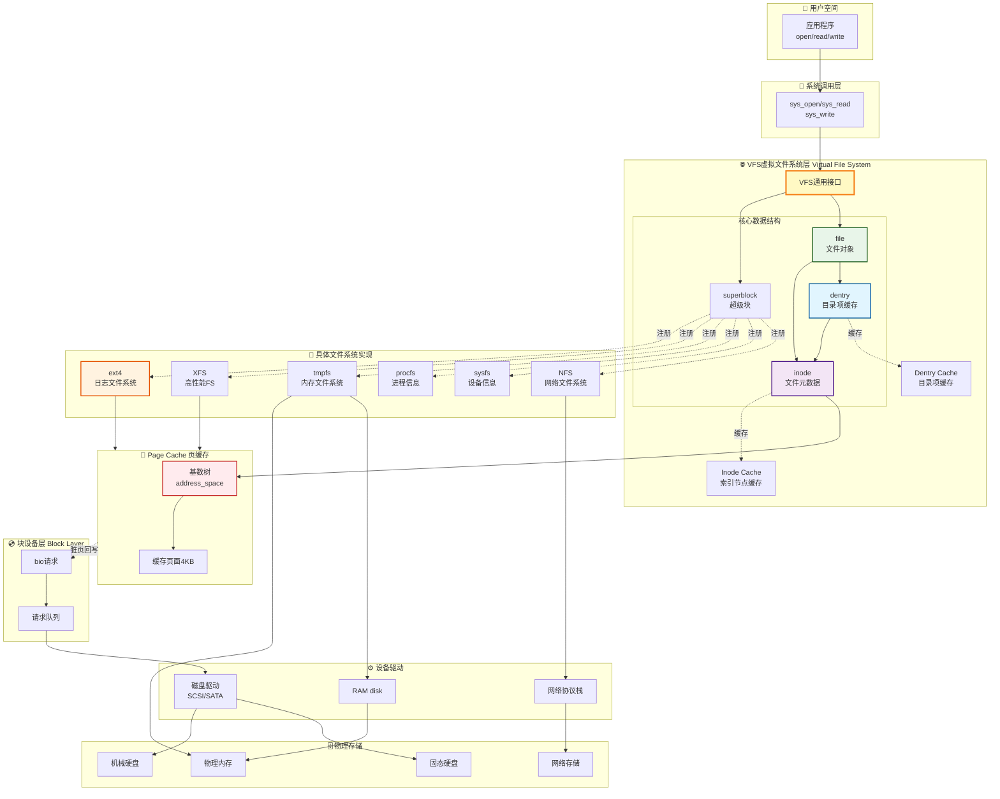
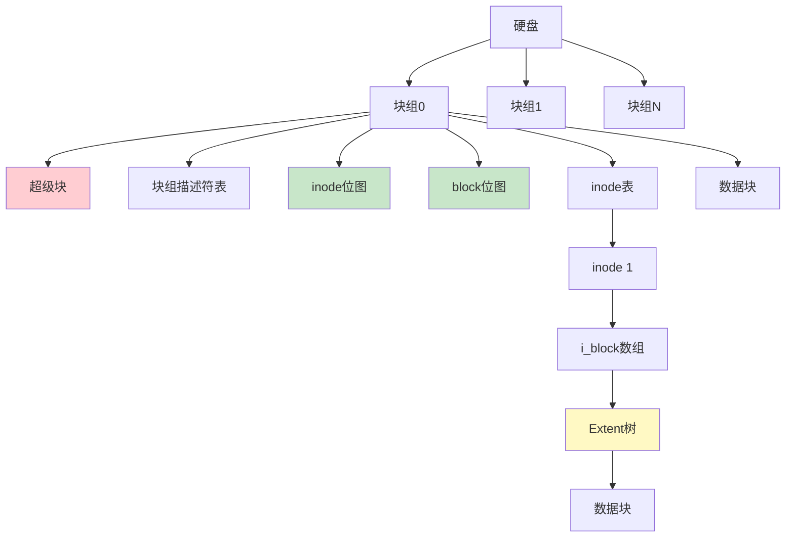
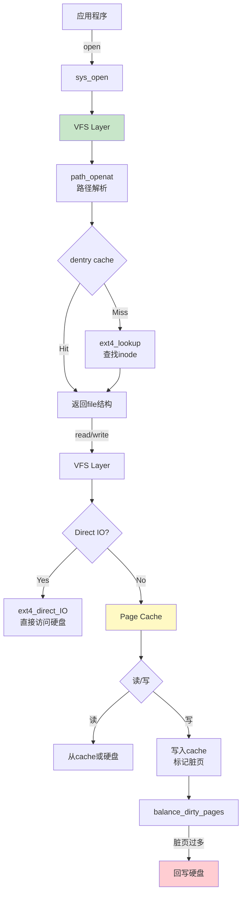
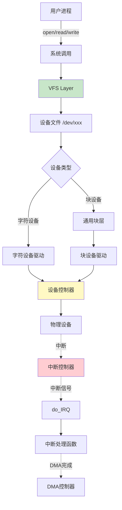
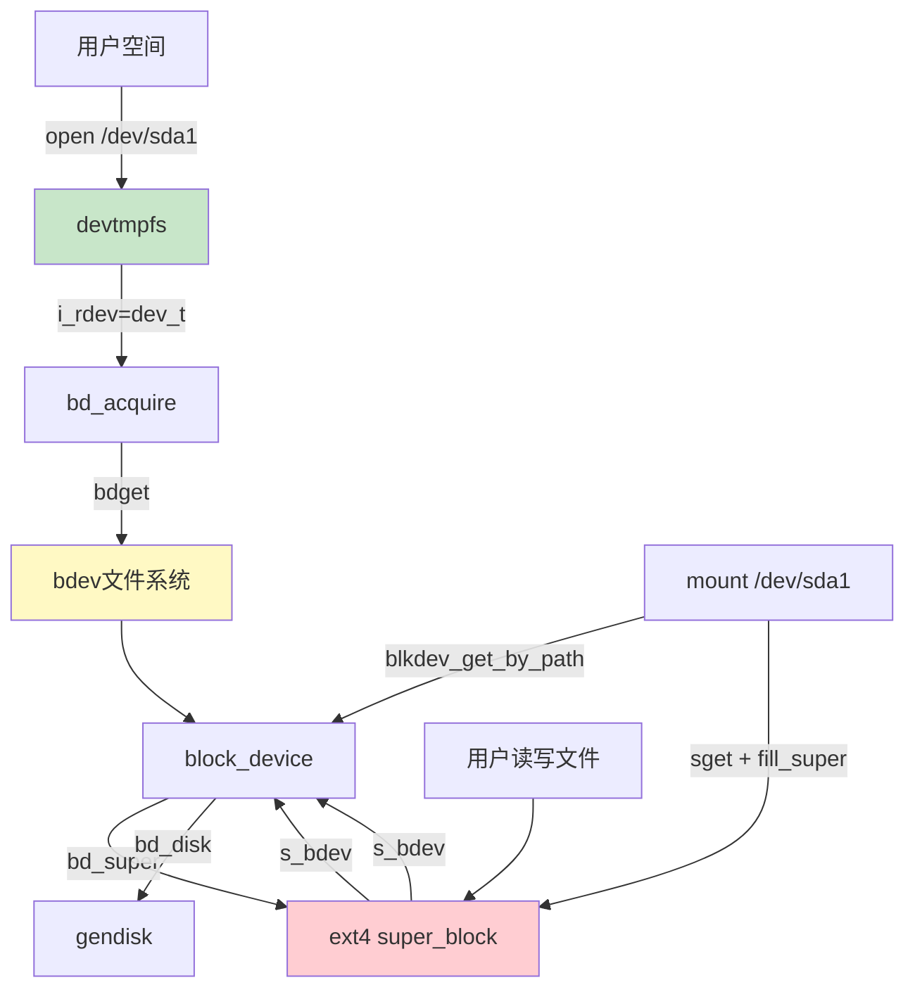
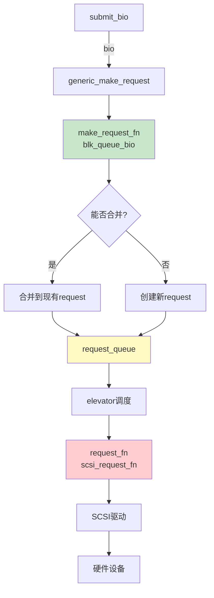
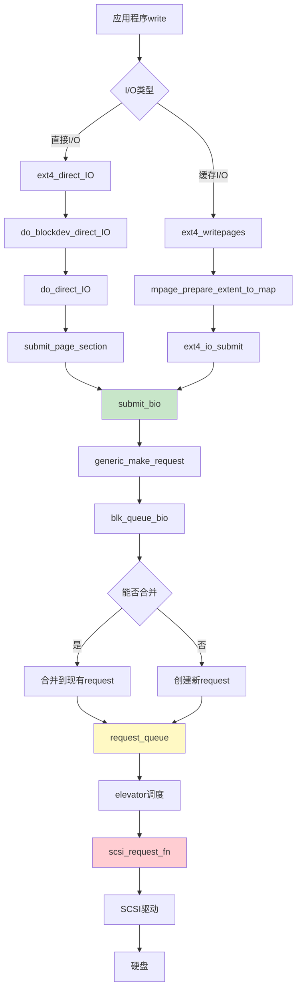

# Linux 底层原理学习笔记 · 第四册：文件系统与 I/O

## 第5章 文件系统（一）：文件系统基础与ext4
### 5.1 文件系统功能规划


> **核心思想**：文件系统是硬盘上的档案库，通过inode索引、block存储、目录组织,实现文件的永久保存。

#### VFS虚拟文件系统层次结构图



**VFS层次要点**：

1. **VFS的作用**：
   - 统一接口：为上层提供统一的文件操作接口
   - 解耦实现：上层无需关心具体文件系统类型
   - 性能优化：提供dentry cache和page cache

2. **核心数据结构关系**：

   ```
   进程 → file（文件对象）→ dentry（目录项）→ inode（索引节点）→ 磁盘数据块
   ```

   - `file`：进程打开文件的实例（file_operations）
   - `dentry`：路径名到inode的映射（缓存层）
   - `inode`：文件元数据（大小、权限、数据块位置）
   - `superblock`：文件系统全局信息

3. **缓存机制**：
   - **Dentry Cache**：加速路径名查找（/home/user/file.txt）
   - **Inode Cache**：缓存inode减少磁盘读取
   - **Page Cache**：缓存文件数据页（4KB）

4. **支持的文件系统类型**：
   - 磁盘文件系统：ext4、XFS、Btrfs
   - 内存文件系统：tmpfs、ramfs
   - 伪文件系统：procfs（/proc）、sysfs（/sys）
   - 网络文件系统：NFS、CIFS


#### 5.1.1 为什么需要文件系统

**内存vs外部存储**：

- **内存**：暂存数据，空间有限，进程结束数据丢失
- **外部存储（硬盘）**：永久保存，空间巨大

**文件系统类比**：图书馆档案库

- 内存 = 纸箱子（临时）
- 文件系统 = 图书馆（永久）

#### 5.1.2 文件系统五大功能

1. **块存储**：严格组织形式
   - 按块（Block）为单位存储
   - 类似书架分成小格子
   - → **存储区（仓库区）**

2. **索引区**：快速查找
   - 记录文件分几块、每块在哪
   - 类似图书馆索引书架
   - → **inode区（索引区）**

3. **缓存层**：热点文件
   - 频繁访问的文件缓存
   - 类似畅销书专区
   - → **Page Cache**

4. **目录组织**：分类管理
   - 文件夹树形结构
   - 避免命名冲突
   - → **目录树**

5. **内核数据结构**：打开文件管理
   - 记录哪些进程打开了哪些文件
   - 文件描述符管理
   - → **打开文件表**

---

### 5.2 文件系统命令与系统调用

#### 5.2.1 格式化与挂载

**格式化**：

```bash
# 查看磁盘
fdisk -l

# 格式化为ext4
mkfs.ext4 /dev/vdc

# 交互式分区
fdisk /dev/vdc
# p: 打印分区表
# n: 新建分区(主分区p、扩展分区e)
# w: 写入分区表
```

**挂载**：

```bash
# 挂载文件系统
mount /dev/vdc1 /root/directory

# 卸载
umount /root/directory
```

#### 5.2.2 文件类型

```bash
ls -l
```

| 标识 | 类型 | 说明 |
|------|------|------|
| `-` | 普通文件 | 数据文件 |
| `d` | 目录 | 文件夹 |
| `c` | 字符设备 | 字符设备文件 |
| `b` | 块设备 | 块设备文件 |
| `s` | Socket | 套接字文件 |
| `l` | 符号链接 | 软链接 |

**软链接示例**：

```bash
lrwxrwxrwx 1 root root 61 Dec 14 19:53 instance -> /var/lib/cloud/instances
```

#### 5.2.3 文件操作系统调用

```c
#include <fcntl.h>
#include <unistd.h>

int main() {
    int fd;
    int buffer = 1024;
    int num;
    
    // 1. 打开/创建文件
    fd = open("./test", O_RDWR|O_CREAT|O_TRUNC);
    // O_CREAT: 不存在则创建
    // O_RDWR: 读写方式
    // O_TRUNC: 截断为0
    
    // 2. 写入数据
    write(fd, &buffer, sizeof(int));
    
    // 3. 重新定位
    lseek(fd, 0L, SEEK_SET);  // 回到文件头
    
    // 4. 读取数据
    read(fd, &num, sizeof(int));
    
    // 5. 关闭文件
    close(fd);
    
    return 0;
}
```

**文件描述符（fd）**：

- 用于区分进程打开的多个文件
- 作用域：当前进程
- 所有文件操作都通过fd进行

#### 5.2.4 文件状态查询

```c
#include <sys/stat.h>

struct stat {
    dev_t st_dev;           // 设备ID
    ino_t st_ino;           // inode号
    mode_t st_mode;         // 文件类型和权限
    nlink_t st_nlink;       // 硬链接数
    uid_t st_uid;           // 所有者ID
    gid_t st_gid;           // 组ID
    dev_t st_rdev;          // 特殊文件设备ID
    off_t st_size;          // 文件大小(字节)
    blksize_t st_blksize;   // I/O块大小
    blkcnt_t st_blocks;     // 分配的512B块数
    struct timespec st_atim;  // 最后访问时间
    struct timespec st_mtim;  // 最后修改时间
    struct timespec st_ctim;  // 状态改变时间
};

// 三个函数
int stat(const char *pathname, struct stat *buf);    // 通过路径
int fstat(int fd, struct stat *buf);                 // 通过fd
int lstat(const char *pathname, struct stat *buf);   // 软链接返回链接本身
```

#### 5.2.5 目录操作

```c
#include <dirent.h>

int main() {
    DIR *dirp;
    struct dirent *direntp;
    struct stat sb;
    char filename[128];
    
    // 1. 打开目录
    dirp = opendir("/root");
    
    // 2. 读取目录项
    while ((direntp = readdir(dirp)) != NULL) {
        sprintf(filename, "/root/%s", direntp->d_name);
        lstat(filename, &sb);
        printf("name: %s, mode: %d, size: %d\n",
               direntp->d_name, sb.st_mode, sb.st_size);
    }
    
    // 3. 关闭目录
    closedir(dirp);
    
    return 0;
}
```

---

### 5.3 ext4文件系统格式

#### 5.3.1 硬盘物理结构

**硬盘组成**：

- **盘片**：多层磁盘
- **磁道**：每层多个同心圆
- **扇区**：每个磁道分多个扇区
- **扇区大小**：512字节

**块（Block）**：

- 文件系统的最小单位
- 大小：扇区的整数倍，默认4KB
- 灵活性：文件可分散存储

#### 5.3.2 inode索引节点

**inode定义**：

- i = index（索引）
- 每个文件对应一个inode
- 每个目录也对应一个inode

**ext4_inode结构**：

```c
struct ext4_inode {
    __le16 i_mode;          // 文件类型和权限
    __le16 i_uid;           // 所有者UID(低16位)
    __le32 i_size_lo;       // 文件大小(低32位)
    
    __le32 i_atime;         // 访问时间(Access)
    __le32 i_ctime;         // inode改变时间(Change)
    __le32 i_mtime;         // 文件修改时间(Modify)
    __le32 i_dtime;         // 删除时间(Delete)
    
    __le16 i_gid;           // 组GID(低16位)
    __le16 i_links_count;   // 硬链接数
    __le32 i_blocks_lo;     // 占用块数
    __le32 i_flags;         // 文件标志
    
    __le32 i_block[EXT4_N_BLOCKS];  // 块指针数组(15项)
    
    __le32 i_generation;    // 文件版本(NFS)
    __le32 i_file_acl_lo;   // 文件ACL
    __le32 i_size_high;     // 文件大小(高32位)
};
```

**三个时间的区别**：

- **atime**：访问文件（读取）
- **mtime**：修改文件数据
- **ctime**：修改inode（权限、所有者等）

#### 5.3.3 数据块索引方式

**ext2/ext3：间接块**

```
EXT4_N_BLOCKS = 15
- i_block[0-11]: 直接块（12个）
- i_block[12]: 一次间接块
- i_block[13]: 二次间接块
- i_block[14]: 三次间接块
```

**问题**：大文件需要多次读盘才能定位数据块

**ext4：Extents（区段）**

- **Extent**：连续块的集合
- **优势**：128M文件可用一个extent表示

**Extent树结构**：

```c
// 节点头
struct ext4_extent_header {
    __le16 eh_magic;        // 魔数
    __le16 eh_entries;      // 条目数
    __le16 eh_max;          // 最大容量
    __le16 eh_depth;        // 树深度
    __le32 eh_generation;   // 树版本
};

// 叶子节点(数据节点)
struct ext4_extent {
    __le32 ee_block;        // 逻辑块号
    __le16 ee_len;          // extent覆盖的块数
    __le16 ee_start_hi;     // 物理块号(高16位)
    __le32 ee_start_lo;     // 物理块号(低32位)
};

// 索引节点(分支节点)
struct ext4_extent_idx {
    __le32 ei_block;        // 索引覆盖的逻辑块  
    __le32 ei_leaf_lo;      // 下一层节点的物理块(低32位)
    __le16 ei_leaf_hi;      // 下一层节点的物理块(高16位)
    __u16 ei_unused;
};
```

**Extent树示例**：

```
- 小文件: inode中直接存4个extent (eh_depth=0)
- 大文件: 树形结构
  - 根节点: 在inode中
  - 索引节点: 在4KB块中(最多340项)
  - 叶子节点: 指向数据块
  - 每个extent最大128MB
  - 340个extent = 42.5GB
```

---

### 5.4 位图管理

#### 5.4.1 inode位图与block位图

**问题**：如何快速找到空闲的inode和block？

**解决方案**：位图

- **inode位图**：一个块(4KB)
  - 每位对应一个inode
  - 1=已用，0=空闲
  
- **block位图**：一个块(4KB)
  - 每位对应一个block
  - 最多表示：4KB * 8 = 32K个块 = 128MB

#### 5.4.2 位图使用示例

**创建文件流程**：

```
open(..., O_CREAT)
  ↓
sys_open → do_sys_open → do_filp_open → path_openat → do_last
  ↓
lookup_open
  ↓
dir_inode->i_op->create (ext4_create)
  ↓
ext4_new_inode_start_handle → __ext4_new_inode
  ↓
// 1. 读取inode位图
inode_bitmap_bh = ext4_read_inode_bitmap(sb, group);

// 2. 查找空闲inode
ino = ext4_find_next_zero_bit((unsigned long *)inode_bitmap_bh->b_data,
                              EXT4_INODES_PER_GROUP(sb), ino);

// 3. 标记为已用
ext4_set_bit(ino, inode_bitmap_bh->b_data);
```

---

### 5.5 块组与文件系统格式

#### 5.5.1 块组（Block Group）

**限制问题**：

- block位图：一个块(4KB) = 32K位
- 每位表示一个block(4KB)
- 最大表示：128MB

**解决方案**：块组

- 将硬盘分成多个块组
- 每个块组最大128MB
- N个块组 = N×128MB

**块组描述符**：

```c
struct ext4_group_desc {
    __le32 bg_block_bitmap_lo;      // block位图位置
    __le32 bg_inode_bitmap_lo;      // inode位图位置
    __le32 bg_inode_table_lo;       // inode表位置
    __le16 bg_free_blocks_count_lo; // 空闲block数
    __le16 bg_free_inodes_count_lo; // 空闲inode数
    __le16 bg_used_dirs_count_lo;   // 目录数
    __le16 bg_flags;                // 标志
    ...
};
```

#### 5.5.2 超级块（Super Block）

**作用**：描述整个文件系统的全局信息

```c
struct ext4_super_block {
    __le32 s_inodes_count;          // 总inode数
    __le32 s_blocks_count_lo;       // 总block数(低32位)
    __le32 s_r_blocks_count_lo;     // 保留block数
    __le32 s_free_blocks_count_lo;  // 空闲block数
    __le32 s_free_inodes_count;     // 空闲inode数
    __le32 s_first_data_block;      // 第一个数据块号
    __le32 s_log_block_size;        // block大小(log2)
    
    __le32 s_blocks_per_group;      // 每块组的block数
    __le32 s_inodes_per_group;      // 每块组的inode数
    
    __le16 s_magic;                 // 魔数(0xEF53)
    ...
    
    // 48位块寻址(最大1EB)
    __le32 s_blocks_count_hi;       // 总block数(高16位)
};
```

#### 5.5.3 ext4文件系统布局

```
┌──────────────────────────────────────────────────────────┐
│  引导区(Boot Block) - 1KB                                 │
├──────────────────────────────────────────────────────────┤
│  块组0                                                    │
│  ┌────────────────────────────────────────────────────┐ │
│  │ 超级块(Super Block)                                 │ │
│  │ 块组描述符表(Group Descriptor Table)                │ │
│  │ 数据块位图(Data Block Bitmap)                       │ │
│  │ inode位图(Inode Bitmap)                             │ │
│  │ inode表(Inode Table)                                │ │
│  │ 数据块(Data Blocks)                                 │ │
│  └────────────────────────────────────────────────────┘ │
├──────────────────────────────────────────────────────────┤
│  块组1                                                    │
│  ┌────────────────────────────────────────────────────┐ │
│  │ 超级块副本(可选)                                     │ │
│  │ 块组描述符表副本(可选)                               │ │
│  │ ...                                                 │ │
│  └────────────────────────────────────────────────────┘ │
├──────────────────────────────────────────────────────────┤
│  ...                                                      │
└──────────────────────────────────────────────────────────┘
```

#### 5.5.4 备份策略

**问题**：超级块和块组描述符表非常重要，损坏无法访问文件系统

**默认备份**：每个块组都备份

**sparse_super特性**：稀疏备份

- 仅在特定块组备份
- 块组索引为：0, 3^n, 5^n, 7^n
- 例如：块组0, 1, 3, 5, 7, 9, 25, 27...

**Meta Block Groups特性**：元块组

**问题**：

- 块组描述符表包含所有块组的描述符
- 限制了文件系统大小

**解决方案**：

- 将块组分成多个元块组
- 每个元块组64个块组
- 每个元块组独立管理自己的块组描述符表
- 备份：第1、第2、最后一个块组

**优势**：支持48位块寻址，最大1EB（2^48 × 4KB）

---

### 5.6 总结

#### 5.6.1 文件系统核心概念



#### 5.6.2 关键数据结构

| 结构 | 作用 | 大小 |
|------|------|------|
| 超级块 | 全局信息 | 1KB |
| 块组描述符 | 块组元数据 | 32B×块组数 |
| inode | 文件元数据+索引 | 256B |
| inode位图 | 空闲inode查找 | 4KB |
| block位图 | 空闲block查找 | 4KB |
| extent | 连续块描述 | 12B |
| 数据块 | 存储文件数据 | 4KB(default) |

#### 5.6.3 重要命令

```bash
# 查看文件系统信息
df -h
df -i   # inode使用情况

# 查看超级块信息
dumpe2fs /dev/vdc1 | head -40

# 查看inode信息
stat filename

# 查看inode号
ls -i

# 查看文件系统类型
blkid /dev/vdc1

# 修复文件系统
fsck /dev/vdc1
e2fsck -f /dev/vdc1
```

---

**下一节预告**：将讲解VFS虚拟文件系统和Page Cache文件缓存。

---

## 第5章 文件系统（二）：VFS与Page Cache
### 5.7 文件系统架构层次


> **核心思想**：VFS提供统一接口屏蔽底层文件系统差异，Page Cache通过内存缓存提升读写性能。


```
┌─────────────────────────────────────┐
│  用户空间：系统调用(open/read/write) │
├─────────────────────────────────────┤
│  VFS：虚拟文件系统（统一接口）        │
├─────────────────────────────────────┤
│  具体文件系统：ext4/btrfs/xfs等      │
├─────────────────────────────────────┤
│  Page Cache：页缓存层               │
├─────────────────────────────────────┤
│  块设备层（BIO Layer）               │
├─────────────────────────────────────┤
│  块设备驱动程序                      │
└─────────────────────────────────────┘
```

---

### 5.8 文件系统挂载

#### 5.8.1 文件系统注册

**ext4注册**：

```c
// 注册ext4文件系统
register_filesystem(&ext4_fs_type);

static struct file_system_type ext4_fs_type = {
    .owner = THIS_MODULE,
    .name = "ext4",
    .mount = ext4_mount,          // 挂载函数
    .kill_sb = kill_block_super,
    .fs_flags = FS_REQUIRES_DEV,
};
```

#### 5.8.2 mount系统调用

```c
SYSCALL_DEFINE5(mount, char __user *, dev_name,
                char __user *, dir_name,
                char __user *, type, ...) {
    ret = do_mount(kernel_dev, dir_name, kernel_type, flags, options);
    return ret;
}
```

**调用链**：

```
mount → do_mount → do_new_mount → vfs_kern_mount
```

**vfs_kern_mount核心逻辑**：

```c
struct vfsmount *vfs_kern_mount(struct file_system_type *type, ...) {
    // 1. 分配mount结构
    mnt = alloc_vfsmnt(name);
    
    // 2. 调用文件系统的mount函数（如ext4_mount）
    root = mount_fs(type, flags, name, data);
    
    // 3. 设置mount关系
    mnt->mnt.mnt_root = root;              // 根dentry
    mnt->mnt.mnt_sb = root->d_sb;          // 超级块
    mnt->mnt_mountpoint = mnt->mnt.mnt_root;
    mnt->mnt_parent = mnt;
    
    return &mnt->mnt;
}
```

#### 5.8.3 mount数据结构

```c
struct mount {
    struct hlist_node mnt_hash;
    struct mount *mnt_parent;       // 父文件系统
    struct dentry *mnt_mountpoint;  // 挂载点dentry
    struct vfsmount mnt;
    struct list_head mnt_mounts;    // 子文件系统列表
    struct list_head mnt_child;
    struct list_head mnt_instance;  // 挂载实例
    const char *mnt_devname;        // 设备名
};

struct vfsmount {
    struct dentry *mnt_root;        // 文件系统根目录
    struct super_block *mnt_sb;     // 超级块指针
    int mnt_flags;
};
```

**挂载关系示例**：

```
根文件系统 /
  └─ dentry(/) + mount0
       │
       └─ home/
            ├─ dentry(home挂载点) → 文件系统A
            │    └─ mount1 + dentry(A的根/)
            │         │
            │         └─ hello/
            │              ├─ dentry(hello挂载点) → 文件系统B
            │              │    └─ mount2 + dentry(B的根/)
            │              │         │
            │              │         └─ world/data
```

---

### 5.9 打开文件

#### 5.9.1 open系统调用

```c
SYSCALL_DEFINE3(open, const char __user *, filename, int, flags, umode_t, mode) {
    return do_sys_open(AT_FDCWD, filename, flags, mode);
}

long do_sys_open(int dfd, const char __user *filename, int flags, umode_t mode) {
    // 1. 获取未使用的文件描述符
    fd = get_unused_fd_flags(flags);
    
    // 2. 打开文件，创建struct file
    struct file *f = do_filp_open(dfd, tmp, &op);
    
    // 3. 安装文件描述符
    fd_install(fd, f);
    
    return fd;
}
```

#### 5.9.2 文件描述符管理

```c
struct task_struct {
    struct files_struct *files;  // 文件描述符表
};

struct files_struct {
    struct file __rcu * fd_array[NR_OPEN_DEFAULT];  // 文件指针数组
};
```

**默认文件描述符**：

- 0：stdin（标准输入）
- 1：stdout（标准输出）
- 2：stderr（标准错误输出）

#### 5.9.3 路径解析

**do_filp_open核心流程**：

```c
struct file *do_filp_open(int dfd, struct filename *pathname, ...) {
    // 1. 初始化nameidata
    set_nameidata(&nd, dfd, pathname);
    
    // 2. 路径查找和解析
    filp = path_openat(&nd, op, flags | LOOKUP_RCU);
    
    return filp;
}
```

**path_openat主要步骤**：

```c
static struct file *path_openat(struct nameidata *nd, ...) {
    // 1. 分配file结构
    file = get_empty_filp();
    
    // 2. 初始化路径查找
    s = path_init(nd, flags);
    
    // 3. 逐层解析路径（用"/"分隔）
    while (!(error = link_path_walk(s, nd)) &&
           (error = do_last(nd, file, op, &opened)) > 0) {
        ...
    }
    
    return file;
}
```

#### 5.9.4 dentry cache（目录项缓存）

**作用**：提高路径查找效率

**数据结构**：

```c
struct dentry {
    struct dentry *d_parent;        // 父目录
    struct qstr d_name;             // 目录项名称
    struct inode *d_inode;          // 关联的inode
    struct hlist_node d_hash;       // 哈希表节点
    struct list_head d_lru;         // LRU链表节点
};
```

**两个列表**：

1. **dentry_hashtable**：哈希表，快速查找
2. **s_dentry_lru**：LRU链表，管理未使用的dentry

**dentry生命周期**：

```
创建 → 哈希表
  ↓
引用为0 → LRU表
  ↓
再次引用 → 从LRU移除
  ↓
长时间未用 → 释放回Slub
  ↓
文件删除 → 释放回Slub
```

**查找流程**：

```c
static int do_last(struct nameidata *nd, struct file *file, ...) {
    // 1. 先从dentry cache查找
    error = lookup_fast(nd, &path, &inode, &seq);
    
    if (error) {
        // 2. cache miss，从文件系统查找
        error = lookup_open(nd, &path, file, op, got_write, opened);
        // 调用ext4_lookup到硬盘查找inode
    }
    
    // 3. 打开文件
    error = vfs_open(&nd->path, file, current_cred());
    
    return error;
}
```

---

### 5.10 读写文件

#### 5.10.1 系统调用层

```c
SYSCALL_DEFINE3(read, unsigned int, fd, char __user *, buf, size_t, count) {
    struct fd f = fdget_pos(fd);
    loff_t pos = file_pos_read(f.file);
    ret = vfs_read(f.file, buf, count, &pos);
    return ret;
}

SYSCALL_DEFINE3(write, unsigned int, fd, const char __user *, buf, size_t, count) {
    struct fd f = fdget_pos(fd);
    loff_t pos = file_pos_read(f.file);
    ret = vfs_write(f.file, buf, count, &pos);
    return ret;
}
```

#### 5.10.2 VFS层

```c
ssize_t __vfs_read(struct file *file, char __user *buf, size_t count, loff_t *pos) {
    if (file->f_op->read)
        return file->f_op->read(file, buf, count, pos);
    else if (file->f_op->read_iter)
        return new_sync_read(file, buf, count, pos);
    else
        return -EINVAL;
}

ssize_t __vfs_write(struct file *file, const char __user *p, size_t count, loff_t *pos) {
    if (file->f_op->write)
        return file->f_op->write(file, p, count, pos);
    else if (file->f_op->write_iter)
        return new_sync_write(file, p, count, pos);
    else
        return -EINVAL;
}
```

#### 5.10.3 ext4层

```c
const struct file_operations ext4_file_operations = {
    .read_iter = ext4_file_read_iter,
    .write_iter = ext4_file_write_iter,
};
```

**两种IO模式**：

1. **直接IO（Direct I/O）**：绕过缓存，直接访问硬盘
2. **缓存IO（Buffered I/O）**：通过Page Cache缓存

```c
ssize_t generic_file_read_iter(struct kiocb *iocb, struct iov_iter *iter) {
    if (iocb->ki_flags & IOCB_DIRECT) {
        // 直接IO
        struct address_space *mapping = file->f_mapping;
        retval = mapping->a_ops->direct_IO(iocb, iter);
    }
    // 缓存IO
    retval = generic_file_buffered_read(iocb, iter, retval);
}

ssize_t __generic_file_write_iter(struct kiocb *iocb, struct iov_iter *from) {
    if (iocb->ki_flags & IOCB_DIRECT) {
        // 直接IO
        written = generic_file_direct_write(iocb, from);
    } else {
        // 缓存IO
        written = generic_perform_write(file, from, iocb->ki_pos);
    }
}
```

---

### 5.11 Page Cache机制

#### 5.11.1 缓存写入

**generic_perform_write核心流程**：

```c
ssize_t generic_perform_write(struct file *file, struct iov_iter *i, loff_t pos) {
    struct address_space *mapping = file->f_mapping;
    const struct address_space_operations *a_ops = mapping->a_ops;
    
    do {
        struct page *page;
        unsigned long offset;   // 页内偏移
        unsigned long bytes;    // 写入字节数
        
        // 1. 准备写入（分配页面）
        status = a_ops->write_begin(file, mapping, pos, bytes, flags,
                                    &page, &fsdata);
        
        // 2. 从用户空间拷贝数据到内核页
        copied = iov_iter_copy_from_user_atomic(page, i, offset, bytes);
        flush_dcache_page(page);
        
        // 3. 完成写入（标记脏页）
        status = a_ops->write_end(file, mapping, pos, bytes, copied,
                                 page, fsdata);
        
        pos += copied;
        written += copied;
        
        // 4. 脏页平衡（判断是否需要回写）
        balance_dirty_pages_ratelimited(mapping);
        
    } while (iov_iter_count(i));
}
```

**四个步骤详解**：

1. **write_begin**（ext4_write_begin）：
   - 启动Journal日志
   - 调用grab_cache_page_write_begin获取缓存页

2. **拷贝数据**：
   - kmap_atomic映射页到内核虚拟地址
   - 从用户态拷贝数据
   - kunmap_atomic删除映射

3. **write_end**（ext4_write_end）：
   - 完成Journal日志
   - mark_buffer_dirty标记脏页

4. **balance_dirty_pages_ratelimited**：
   - 检查脏页比例
   - 触发回写（如果脏页太多）

#### 5.11.2 Page Cache数据结构

```c
struct address_space {
    struct inode *host;
    struct radix_tree_root page_tree;    // 基数树，存放缓存页
    spinlock_t tree_lock;
    unsigned long nrpages;               // 页面数
    const struct address_space_operations *a_ops;
};

// ext4的address_space操作
static const struct address_space_operations ext4_aops = {
    .readpage = ext4_readpage,
    .write_begin = ext4_write_begin,
    .write_end = ext4_write_end,
    .direct_IO = ext4_direct_IO,
};
```

**基数树（Radix Tree）**：

- 快速根据文件偏移查找缓存页
- key：页索引（pgoff_t）
- value：页指针（struct page）

#### 5.11.3 日志模式（ext4）

**三种Journal模式**：

1. **Journal模式**：
   - 记录元数据+数据日志
   - 日志必须先落盘
   - 最安全，性能最差

2. **Order模式**（默认）：
   - 仅记录元数据日志
   - 数据必须先于元数据落盘
   - 折中方案

3. **Writeback模式**：
   - 仅记录元数据日志
   - 不保证数据先落盘
   - 性能最好，最不安全

---

### 5.12 脏页回写

#### 5.12.1 为什么需要回写

- 写入仅到达Page Cache（内存）
- 宕机会丢失数据
- 需要定期/按需写入硬盘

#### 5.12.2 回写触发时机

1. **主动触发**：
   - 调用`sync`命令
   - 调用`fsync()`系统调用

2. **被动触发**：
   - 脏页比例超过阈值（balance_dirty_pages）
   - 定时回写（pdflush/writeback线程）
   - 内存不足

#### 5.12.3 总结对比

**直接IO vs 缓存IO**：

| 维度 | 直接IO | 缓存IO |
|------|--------|--------|
| **路径** | 应用→内核→硬盘 | 应用→内核→Page Cache→硬盘 |
| **性能** | 避免内核拷贝 | 内存缓存，极快 |
| **安全性** | 立即写盘 | 异步写盘，可能丢失 |
| **使用场景** | 数据库（自己管理缓存） | 普通文件读写 |
| **标志** | O_DIRECT | 默认 |

---

### 5.13 总结

#### 5.13.1 文件操作完整流程



#### 5.13.2 关键数据结构关系

```
task_struct
  └─ files_struct
       └─ fd_array[]
            └─ struct file
                 ├─ f_op (file_operations)
                 ├─ f_path
                 │    ├─ dentry
                 │    │    └─ d_inode
                 │    └─ vfsmount
                 └─ f_mapping (address_space)
                      ├─ host (inode)
                      ├─ page_tree (基数树)
                      └─ a_ops (address_space_operations)
```

#### 5.13.3 重要命令

```bash
# 查看挂载的文件系统
mount
df -Th

# 查看打开的文件
lsof
lsof -p PID

# 查看进程的文件描述符
ls -l /proc/PID/fd

# 查看Page Cache使用
free -h
cat /proc/meminfo | grep -i cache

# 手动同步脏页
sync

# 查看脏页统计
cat /proc/vmstat | grep dirty
cat /proc/sys/vm/dirty_ratio

# 清理Page Cache（谨慎使用）
echo 3 > /proc/sys/vm/drop_caches
```

---

**本节完成**：第5章第二部分VFS虚拟文件系统与Page Cache已讲解完毕。

**章节回顾**：

- ✅ 第一部分：文件系统基础与ext4
- ✅ 第二部分：VFS与Page Cache

**下一章预告**：第6章将讲解输入输出系统。

---

## 第6章 输入输出系统（上）：设备驱动与字符设备
### 6.1 I/O系统架构overview


> **核心思想**：I/O系统通过层层屏蔽差异（设备控制器→驱动程序→文件系统接口），建立统一的设备管理生态。


#### 6.1.1 设备类比

**类比**：I/O设备管理 = 代理商管理生态

- **设备多样性**：键盘、鼠标、显示器、网卡、硬盘...
- **管理目标**：统一管理不同形态的设备
- **解决方案**：层层屏蔽差异

#### 6.1.2 I/O系统层次

```
┌───────────────────────────────┐
│  用户空间：read/write系统调用  │
├───────────────────────────────┤
│  文件系统接口：/dev/xxx        │
├───────────────────────────────┤
│  设备驱动程序（统一接口）      │
├───────────────────────────────┤
│  通用块层（仅块设备）          │
├───────────────────────────────┤
│  设备控制器（硬件抽象）        │
├───────────────────────────────┤
│  物理设备（硬盘/鼠标/键盘）    │
└───────────────────────────────┘
```

---

### 6.2 设备控制器

#### 6.2.1 为什么需要设备控制器

**问题**：CPU无法直接操作各种各样的硬件设备

**解决方案**：设备控制器（Device Control Unit）

- 磁盘控制器（硬盘）
- USB控制器（USB设备）
- 视频控制器（显示器）

**作用**：屏蔽设备差异，提供标准接口给CPU

**类比**：代理商屏蔽地域和行业差异

#### 6.2.2 设备类型

**两大类**：

1. **块设备（Block Device）**：
   - 固定大小的块存储
   - 可寻址
   - 有缓冲区
   - 示例：硬盘
   - 类比：代购代销模式

2. **字符设备（Character Device）**：
   - 字节流传输
   - 不可寻址
   - 无缓冲区
   - 示例：鼠标、键盘
   - 类比：集成商模式

#### 6.2.3 CPU与控制器通信

**两种方式**：

1. **I/O端口映射**：

   ```c
   // 使用特殊汇编指令
   in  // 从端口读
   out // 向端口写
   ```

2. **内存映射I/O（ioremap）**：

   ```c
   // 分配一段内存空间给控制器的数据缓冲区
   // 像读写内存一样操作设备
   ```

#### 6.2.4 中断机制

**问题**：设备完成任务如何通知CPU？

**两种方式**：

1. **轮询（Polling）**：
   - 不断检查状态标志位
   - 效率低，浪费CPU时间

2. **中断（Interrupt）**：
   - 设备完成任务触发中断
   - 中断控制器通知CPU
   - CPU停下当前任务处理中断

**中断分类**：

- **软中断**：代码调用INT指令（系统调用）
- **硬中断**：硬件通过中断控制器触发

#### 6.2.5 DMA机制

**问题**：大量数据传输占用CPU时间

**解决方案**：DMA（Direct Memory Access）

```
┌──────┐                ┌──────────┐
│ CPU  │◄──指令──────── │ DMA控制器 │
└──────┘                └──────────┘
                              │
                        ┌─────┴─────┐
                        │           │
                   ┌────▼───┐ ┌────▼─────┐
                   │ 内存   │ │磁盘控制器 │
                   └────────┘ └──────────┘
```

**流程**：

1. CPU对DMA控制器下指令（读多少、放哪）
2. DMA控制器指挥磁盘控制器读取数据
3. 数据直接传输到内存
4. DMA控制器发中断通知CPU完成

**类比**：大代理商自己能搞定售前售后技术支持

---

### 6.3 设备驱动程序

#### 6.3.1 驱动程序的作用

**问题**：不同设备控制器接口不同

**解决方案**：设备驱动程序

- 向上：提供统一接口给操作系统
- 向下：对接特定设备控制器

**类比**：渠道管理部门

#### 6.3.2 驱动程序与操作系统

```
设备控制器 ← 设备驱动程序 ← 操作系统内核
    ↑            ↑              ↑
  不属于OS    属于OS一部分    OS核心代码
  (硬件)      (内核模块)
```

#### 6.3.3 通用块层

**仅用于块设备**：

```
文件系统
   ↓
通用块层（BIO Layer）
   ↓
块设备驱动程序
   ↓
块设备控制器
```

**作用**：

- 维护与设备无关的块大小
- 屏蔽不同块设备驱动的差异
- 降低文件系统复杂度

---

### 6.4 文件系统接口

#### 6.4.1 设备文件

**统一标准**：所有设备都在`/dev/`下创建设备文件

**特殊之处**：

- 有inode
- 不关联存储介质数据
- 建立与设备驱动程序的连接

**示例**：

```bash
# ls -l /dev/
crw------- 1 root root 5, 1 console  # 字符设备
crw-rw-rw- 1 root root 1, 3 null
brw-rw---- 1 root disk 253, 0 vda    # 块设备
brw-rw---- 1 root disk 253, 1 vda1
```

**字段说明**：

- 第一位：`c`=字符设备，`b`=块设备
- 两个号：主设备号、次设备号
  - 主设备号：定位设备驱动程序
  - 次设备号：传给驱动程序，选择设备单元

#### 6.4.2 设备文件系统

**devtmpfs**：/dev下的特殊文件系统

```bash
mount | grep devtmpfs
# devtmpfs on /dev type devtmpfs (rw,nosuid,...)
```

#### 6.4.3 sysfs文件系统

**路径**：`/sys`

**作用**：真实设备树的分层表示

```
/sys/devices   - 所有设备的分层表示
/sys/dev       - char/block按主次号链接
/sys/block     - 所有块设备
/sys/module    - 所有模块信息
```

#### 6.4.4 udev守护进程

**作用**：自动创建设备文件

**流程**：

```
1. 新设备插入
   ↓
2. 内核检测，创建kobject
   ↓
3. 通过sysfs展现到用户层
   ↓
4. 内核发送热插拔消息
   ↓
5. udevd监听消息
   ↓
6. 在/dev中自动创建设备文件
```

#### 6.4.5 ioctl接口

**作用**：输入输出控制接口

**用途**：

- 配置设备属性
- 修改设备属性
- 超出read/write能力的操作

```c
int ioctl(int fd, unsigned long request, ...);
```

---

### 6.5 内核模块

#### 6.5.1 什么是内核模块

**定义**：可动态加载/卸载的内核代码

**文件格式**：`.ko`文件

**加载命令**：

```bash
# 查看已加载模块
lsmod

# 加载模块
insmod openvswitch.ko

# 卸载模块
rmmod openvswitch
```

#### 6.5.2 内核模块组成

**六部分**：

1. **头文件**：

   ```c
   #include <linux/module.h>
   #include <linux/init.h>
   ```

2. **核心功能函数**：
   - 打开、关闭、读写设备
   - 中断处理函数

3. **file_operations结构**：

   ```c
   static const struct file_operations lp_fops = {
       .owner = THIS_MODULE,
       .write = lp_write,
       .open = lp_open,
       .release = lp_release,
       .unlocked_ioctl = lp_ioctl,
   };
   ```

4. **初始化和退出函数**：

   ```c
   static int __init lp_init(void) { ... }
   static void __exit lp_cleanup_module(void) { ... }
   ```

5. **module_init/module_exit调用**：

   ```c
   module_init(lp_init);
   module_exit(lp_cleanup_module);
   ```

6. **许可证声明**：

   ```c
   MODULE_LICENSE("GPL");
   ```

---

### 6.6 字符设备驱动

#### 6.6.1 注册字符设备

**初始化函数逻辑**：

```c
static int __init lp_init(void) {
    // 注册字符设备
    if (register_chrdev(LP_MAJOR, "lp", &lp_fops)) {
        printk(KERN_ERR "lp: unable to get major %d\n", LP_MAJOR);
        return -EIO;
    }
    return 0;
}
```

**register_chrdev流程**：

```c
int __register_chrdev(unsigned int major, unsigned int baseminor,
                      unsigned int count, const char *name,
                      const struct file_operations *fops) {
    // 1. 注册字符设备区域
    cd = __register_chrdev_region(major, baseminor, count, name);
    
    // 2. 分配cdev结构
    cdev = cdev_alloc();
    cdev->owner = fops->owner;
    cdev->ops = fops;  // 关联file_operations
    
    // 3. 添加到内核管理
    err = cdev_add(cdev, MKDEV(cd->major, baseminor), count);
    
    return major ? 0 : cd->major;
}
```

**cdev_add**：

```c
int cdev_add(struct cdev *p, dev_t dev, unsigned count) {
    p->dev = dev;
    p->count = count;
    
    // 添加到全局cdev_map
    error = kobj_map(cdev_map, dev, count, NULL,
                     exact_match, exact_lock, p);
    
    return 0;
}
```

**关键数据结构**：

- **cdev_map**：全局管理所有字符设备
- **dev_t**：主设备号+次设备号的整数

#### 6.6.2 创建设备文件

**mknod系统调用**：

```c
SYSCALL_DEFINE3(mknod, const char __user *, filename, umode_t, mode, unsigned, dev) {
    return sys_mknodat(AT_FDCWD, filename, mode, dev);
}

SYSCALL_DEFINE4(mknodat, int, dfd, const char __user *, filename,
                umode_t, mode, unsigned, dev) {
    // 1. 创建dentry
    dentry = user_path_create(dfd, filename, &path, lookup_flags);
    
    // 2. 根据类型调用vfs_mknod
    switch (mode & S_IFMT) {
        case S_IFCHR:  // 字符设备
        case S_IFBLK:  // 块设备
            error = vfs_mknod(path.dentry->d_inode, dentry, mode,
                             new_decode_dev(dev));
            break;
    }
}
```

**vfs_mknod**：

```c
int vfs_mknod(struct inode *dir, struct dentry *dentry, umode_t mode, dev_t dev) {
    // 调用文件系统的mknod操作（devtmpfs）
    error = dir->i_op->mknod(dir, dentry, mode, dev);
    return error;
}
```

**init_special_inode**：

```c
void init_special_inode(struct inode *inode, umode_t mode, dev_t rdev) {
    inode->i_mode = mode;
    
    if (S_ISCHR(mode)) {
        inode->i_fop = &def_chr_fops;  // 字符设备默认操作
        inode->i_rdev = rdev;          // 保存dev_t
    } else if (S_ISBLK(mode)) {
        inode->i_fop = &def_blk_fops;
        inode->i_rdev = rdev;
    }
}
```

**def_chr_fops**：

```c
const struct file_operations def_chr_fops = {
    .open = chrdev_open,  // 唯一的操作：打开
};
```

#### 6.6.3 打开字符设备

**完整流程**：

```
用户进程：open("/dev/lp0")
   ↓
sys_open → do_sys_open → do_filp_open → path_openat
   ↓
找到/dev/lp0的dentry和inode
   ↓
inode->i_fop->open（def_chr_fops.open）
   ↓
chrdev_open
```

**chrdev_open核心逻辑**：

```c
static int chrdev_open(struct inode *inode, struct file *filp) {
    const struct file_operations *fops;
    struct cdev *p;
    int ret = 0;
    
    // 1. 从inode获取cdev
    p = inode->i_cdev;
    if (!p) {
        // 通过i_rdev从cdev_map查找
        struct kobject *kobj;
        kobj = kobj_lookup(cdev_map, inode->i_rdev, &idx);
        p = container_of(kobj, struct cdev, kobj);
        
        // 缓存到inode
        inode->i_cdev = p;
        list_add(&inode->i_devices, &p->list);
    }
    
    // 2. 获取真正的file_operations（lp_fops）
    fops = fops_get(p->ops);
    
    // 3. 替换filp的操作
    filp->f_op = fops;
    
    // 4. 调用设备驱动的open（lp_open）
    if (filp->f_op->open) {
        ret = filp->f_op->open(inode, filp);
    }
    
    return ret;
}
```

**打开后的数据结构关系**：

```
task_struct
  └─ files_struct
       └─ fd_array[fd]
            └─ struct file
                 ├─ f_op → lp_fops（设备驱动的操作）
                 └─ f_path
                      └─ dentry
                           └─ d_inode
                                ├─ i_cdev → cdev
                                │            └─ ops → lp_fops
                                └─ i_rdev → dev_t
```

---

### 6.7 中断处理

#### 6.7.1 中断处理函数

**定义**：

```c
typedef irqreturn_t (*irq_handler_t)(int irq, void *dev_id);

enum irqreturn {
    IRQ_NONE = (0 << 0),        // 不是我的中断
    IRQ_HANDLED = (1 << 0),     // 已处理完毕
    IRQ_WAKE_THREAD = (1 << 1), // 唤醒等待线程
};
```

**参数**：

- `irq`：中断信号（虚拟中断号）
- `dev_id`：设备标识（区分同一中断的不同设备）

**示例**（鼠标中断）：

```c
static irqreturn_t logibm_interrupt(int irq, void *dev_id) {
    char dx, dy;
    unsigned char buttons;
    
    // 1. 读取x坐标
    outb(LOGIBM_READ_X_LOW, LOGIBM_CONTROL_PORT);
    dx = (inb(LOGIBM_DATA_PORT) & 0xf);
    outb(LOGIBM_READ_X_HIGH, LOGIBM_CONTROL_PORT);
    dx |= (inb(LOGIBM_DATA_PORT) & 0xf) << 4;
    
    // 2. 读取y坐标
    outb(LOGIBM_READ_Y_LOW, LOGIBM_CONTROL_PORT);
    dy = (inb(LOGIBM_DATA_PORT) & 0xf);
    outb(LOGIBM_READ_Y_HIGH, LOGIBM_CONTROL_PORT);
    dy |= (buttons & 0xf) << 4;
    
    // 3. 读取按键
    buttons = inb(LOGIBM_DATA_PORT);
    buttons = ~buttons >> 5;
    
    // 4. 上报输入事件
    input_report_rel(logibm_dev, REL_X, dx);
    input_report_rel(logibm_dev, REL_Y, dy);
    input_report_key(logibm_dev, BTN_RIGHT, buttons & 1);
    input_report_key(logibm_dev, BTN_MIDDLE, buttons & 2);
    input_report_key(logibm_dev, BTN_LEFT, buttons & 4);
    input_sync(logibm_dev);
    
    // 5. 重新使能中断
    outb(LOGIBM_ENABLE_IRQ, LOGIBM_CONTROL_PORT);
    
    return IRQ_HANDLED;
}
```

#### 6.7.2 注册中断处理函数

**request_irq**：

```c
static inline int __must_check
request_irq(unsigned int irq, irq_handler_t handler,
            unsigned long flags, const char *name, void *dev) {
    return request_threaded_irq(irq, handler, NULL, flags, name, dev);
}
```

**参数**：

- `irq`：中断信号
- `handler`：中断处理函数
- `flags`：标识位
- `name`：设备名称
- `dev`：设备标识

**示例**（鼠标打开时注册）：

```c
static int logibm_open(struct input_dev *dev) {
    if (request_irq(logibm_irq, logibm_interrupt, 0, "logibm", NULL)) {
        printk(KERN_ERR "logibm.c: Can't allocate irq %d\n", logibm_irq);
        return -EBUSY;
    }
    
    outb(LOGIBM_ENABLE_IRQ, LOGIBM_CONTROL_PORT);
    return 0;
}
```

#### 6.7.3 中断描述符

**struct irq_desc**：

```c
struct irq_desc {
    struct irqaction *action;  // 中断处理动作链表
    const char *name;
    struct module *owner;
    ...
};
```

**struct irqaction**：

```c
struct irqaction {
    irq_handler_t handler;           // 中断处理函数
    void *dev_id;                    // 设备ID
    struct irqaction *next;          // 下一个action（共享中断）
    unsigned int irq;                // 中断号
    unsigned int flags;              // 标志
    
    irq_handler_t thread_fn;         // 线程化中断处理函数
    struct task_struct *thread;      // 中断处理线程
    unsigned long thread_flags;
    unsigned long thread_mask;
    const char *name;
};
```

**request_threaded_irq流程**：

```c
int request_threaded_irq(unsigned int irq, irq_handler_t handler,
                        irq_handler_t thread_fn, unsigned long irqflags,
                        const char *devname, void *dev_id) {
    struct irqaction *action;
    struct irq_desc *desc;
    
    // 1. 查找中断描述符
    desc = irq_to_desc(irq);
    
    // 2. 分配irqaction
    action = kzalloc(sizeof(struct irqaction), GFP_KERNEL);
    action->handler = handler;
    action->thread_fn = thread_fn;
    action->flags = irqflags;
    action->name = devname;
    action->dev_id = dev_id;
    
    // 3. 设置中断
    retval = __setup_irq(irq, desc, action);
    
    return retval;
}
```

#### 6.7.4 中断号映射

**两种存储方式**：

1. **数组方式**（连续中断号）：

   ```c
   struct irq_desc irq_desc[NR_IRQS];
   
   struct irq_desc *irq_to_desc(unsigned int irq) {
       return (irq < NR_IRQS) ? irq_desc + irq : NULL;
   }
   ```

2. **基数树方式**（稀疏中断号）：

   ```c
   #ifdef CONFIG_SPARSE_IRQ
   static RADIX_TREE(irq_desc_tree, GFP_KERNEL);
   
   struct irq_desc *irq_to_desc(unsigned int irq) {
       return radix_tree_lookup(&irq_desc_tree, irq);
   }
   #endif
   ```

**为什么中断号会稀疏？**

- 虚拟中断号（软件抽象）vs 物理中断号（硬件）
- 多CPU、多中断控制器
- 无法保证虚拟中断号连续

#### 6.7.5 __setup_irq

```c
static int __setup_irq(unsigned int irq, struct irq_desc *desc,
                      struct irqaction *new) {
    struct irqaction *old, **old_ptr;
    
    new->irq = irq;
    
    // 如果需要单独线程处理中断
    if (new->thread_fn && !nested) {
        ret = setup_irq_thread(new, irq, false);
    }
    
    // 将新action挂到链表末尾
    old_ptr = &desc->action;
    old = *old_ptr;
    if (old) {
        do {
            old_ptr = &old->next;
            old = *old_ptr;
        } while (old);
    }
    *old_ptr = new;
    
    // 唤醒中断处理线程
    if (new->thread)
        wake_up_process(new->thread);
    
    return 0;
}
```

**setup_irq_thread**：

```c
static int setup_irq_thread(struct irqaction *new, unsigned int irq, bool secondary) {
    struct task_struct *t;
    struct sched_param param = {
        .sched_priority = MAX_USER_RT_PRIO/2,
    };
    
    // 创建内核线程
    t = kthread_create(irq_thread, new, "irq/%d-%s", irq, new->name);
    
    // 设置实时调度
    sched_setscheduler_nocheck(t, SCHED_FIFO, &param);
    
    get_task_struct(t);
    new->thread = t;
    
    return 0;
}
```

#### 6.7.6 中断处理优化

**上半部vs下半部**：

- **上半部（Top Half）**：
  - 关键处理部分
  - 快速完成
  - 中断信号关闭期间执行

- **下半部（Bottom Half）**：
  - 延迟处理部分
  - 耗时操作
  - 通过工作队列等方式慢慢处理

**推荐阅读**：《Linux Device Drivers》

---

### 6.8 总结

#### 6.8.1 I/O系统完整架构



#### 6.8.2 关键数据结构

```
中断处理：
  irq（虚拟中断号）
    ↓
  irq_desc（中断描述符）
    ↓
  irqaction链表
    ├─ handler（中断处理函数）
    ├─ thread_fn（线程化处理）
    └─ next（下一个action，共享中断）

设备驱动：
  cdev_map（全局字符设备管理）
    ↓
  dev_t（主设备号+次设备号）→ cdev
    ↓
  cdev->ops → file_operations
    ├─ open
    ├─ read
    ├─ write
    ├─ ioctl
    └─ release

设备文件：
  /dev/xxx（devtmpfs文件系统）
    ↓
  dentry → inode
    ├─ i_fop → def_chr_fops（临时）
    │           ↓ chrdev_open后替换
    │         lp_fops（真正操作）
    ├─ i_rdev → dev_t
    └─ i_cdev → cdev
```

#### 6.8.3 重要命令

```bash
# 设备管理
ls -l /dev/           # 查看设备文件
mknod /dev/xxx b 8 0  # 创建块设备文件
mknod /dev/yyy c 5 1  # 创建字符设备文件

# 内核模块
lsmod                 # 查看已加载模块
insmod driver.ko      # 加载模块
rmmod driver          # 卸载模块
modprobe driver       # 智能加载（处理依赖）

# sysfs
ls /sys/devices       # 查看设备树
ls /sys/dev/char      # 字符设备
ls /sys/dev/block     # 块设备
ls /sys/module        # 模块信息

# 中断
cat /proc/interrupts  # 查看中断统计
watch -n1 'cat /proc/interrupts'  # 实时监控

# 设备操作
cat /dev/urandom | od -x  # 读取随机设备
```

---

**本节完成**：第6章输入输出系统（上）已讲解完毕。
包含I/O系统架构、设备控制器、驱动程序、内核模块、字符设备驱动、中断处理机制。

**下一节预告**：将讲解块设备驱动程序。

---

## 第6章 输入输出系统（下）：块设备驱动（一）
### 6.9 块设备与三个文件系统


> **核心思想**：块设备涉及三个文件系统的协作（devtmpfs、ext4、bdev），通过mount将它们关联起来。


#### 6.9.1 为什么有三个文件系统

**问题**：块设备的复杂性

块设备不同于字符设备，它涉及三个文件系统：

1. **devtmpfs**：/dev下的设备文件系统
2. **ext4**（或其他）：格式化后的主流文件系统
3. **bdev伪文件系统**：内核管理block_device的文件系统

**三者关系**：

```
用户操作ext4文件
   ↓
ext4文件系统（inode、dentry）
   ↓
block_device（bdev文件系统的inode）
   ↓
/dev/sda（devtmpfs的inode）
   ↓
块设备驱动
```

#### 6.9.2 块设备的mknod

**流程**：与字符设备类似，但走不同分支

```c
void init_special_inode(struct inode *inode, umode_t mode, dev_t rdev) {
    inode->i_mode = mode;
    
    if (S_ISCHR(mode)) {
        inode->i_fop = &def_chr_fops;  // 字符设备
        inode->i_rdev = rdev;
    } else if (S_ISBLK(mode)) {
        inode->i_fop = &def_blk_fops;  // 块设备
        inode->i_rdev = rdev;          // 保存设备号
    }
}
```

**def_blk_fops**：

```c
const struct file_operations def_blk_fops = {
    .open = blkdev_open,
    .release = blkdev_close,
    .llseek = block_llseek,
    .read_iter = blkdev_read_iter,
    .write_iter = blkdev_write_iter,
    .mmap = generic_file_mmap,
    .fsync = blkdev_fsync,
    .unlocked_ioctl = block_ioctl,
    .splice_read = generic_file_splice_read,
    .splice_write = iter_file_splice_write,
    .fallocate = blkdev_fallocate,
};
```

**关键点**：

- 在devtmpfs文件系统中创建inode
- inode->i_rdev保存dev_t（设备号）
- 通常不直接打开，而是通过mount使用

---

### 6.10 mount块设备

#### 6.10.1 ext4_mount入口

**注册ext4文件系统**：

```c
static struct file_system_type ext4_fs_type = {
    .owner = THIS_MODULE,
    .name = "ext4",
    .mount = ext4_mount,         // mount函数
    .kill_sb = kill_block_super,
    .fs_flags = FS_REQUIRES_DEV,
};
```

**ext4_mount调用链**：

```c
static struct dentry *ext4_mount(struct file_system_type *fs_type,
                                 int flags, const char *dev_name, void *data) {
    return mount_bdev(fs_type, flags, dev_name, data, ext4_fill_super);
}
```

#### 6.10.2 mount_bdev核心流程

**两件大事**：

```c
struct dentry *mount_bdev(struct file_system_type *fs_type, int flags,
                          const char *dev_name, void *data,
                          int (*fill_super)(struct super_block *, void *, int)) {
    struct block_device *bdev;
    struct super_block *s;
    fmode_t mode = FMODE_READ | FMODE_EXCL;
    
    if (!(flags & MS_RDONLY))
        mode |= FMODE_WRITE;
    
    // 1. 根据/dev/xxx找到block_device并打开
    bdev = blkdev_get_by_path(dev_name, mode, fs_type);
    
    // 2. 根据block_device填充ext4的super_block
    s = sget(fs_type, test_bdev_super, set_bdev_super, flags | MS_NOSEC, bdev);
    
    return dget(s->s_root);
}
```

---

### 6.11 blkdev_get_by_path详解

#### 6.11.1 函数签名

```c
/**
 * blkdev_get_by_path - open a block device by name
 * @path: path to the block device to open
 * @mode: FMODE_* mask
 * @holder: exclusive holder identifier
 */
struct block_device *blkdev_get_by_path(const char *path, fmode_t mode, void *holder) {
    struct block_device *bdev;
    int err;
    
    // 1. 根据路径查找block_device
    bdev = lookup_bdev(path);
    
    // 2. 打开设备
    err = blkdev_get(bdev, mode, holder);
    
    return bdev;
}
```

#### 6.11.2 lookup_bdev流程

**查找设备文件**：

```c
struct block_device *lookup_bdev(const char *pathname) {
    struct block_device *bdev;
    struct inode *inode;
    struct path path;
    int error;
    
    // 1. 在devtmpfs文件系统中找到/dev/xxx
    error = kern_path(pathname, LOOKUP_FOLLOW, &path);
    if (error)
        return ERR_PTR(error);
    
    // 2. 获取devtmpfs中的inode（特殊inode）
    inode = d_backing_inode(path.dentry);
    
    // 3. 通过特殊inode获取block_device
    bdev = bd_acquire(inode);
    
    return bdev;
}
```

**三步走**：

1. `kern_path`：在devtmpfs中找到`/dev/xxx`的dentry
2. `d_backing_inode`：获取devtmpfs的特殊inode
3. `bd_acquire`：通过inode获取block_device

#### 6.11.3 bd_acquire详解

```c
static struct block_device *bd_acquire(struct inode *inode) {
    struct block_device *bdev;
    
    // 从特殊inode的i_rdev（dev_t）获取block_device
    bdev = bdget(inode->i_rdev);
    
    if (bdev) {
        spin_lock(&bdev_lock);
        if (!inode->i_bdev) {
            // 关联：devtmpfs的inode ↔ bdev文件系统的block_device
            bdgrab(bdev);
            inode->i_bdev = bdev;
            inode->i_mapping = bdev->bd_inode->i_mapping;
        }
        spin_unlock(&bdev_lock);
    }
    return bdev;
}
```

---

### 6.12 bdget与bdev文件系统

#### 6.12.1 第三个文件系统：bdev

**bdev文件系统定义**：

```c
static struct file_system_type bd_type = {
    .name = "bdev",
    .mount = bd_mount,
    .kill_sb = kill_anon_super,
};

struct super_block *blockdev_superblock __read_mostly;

void __init bdev_cache_init(void) {
    // 注册bdev伪文件系统
    err = register_filesystem(&bd_type);
    
    // 挂载
    blockdev_superblock = kern_mount(&bd_type);
}
```

**作用**：

- 纯内核使用的伪文件系统
- 不挂载到用户可见路径
- 专门管理block_device结构

#### 6.12.2 bdget核心逻辑

```c
struct block_device *bdget(dev_t dev) {
    struct block_device *bdev;
    struct inode *inode;
    
    // 在bdev文件系统中查找/创建inode
    inode = iget5_locked(blockdev_superblock, hash(dev),
                         bdev_test, bdev_set, &dev);
    
    // 获取block_device（嵌入在bdev inode中）
    bdev = &BDEV_I(inode)->bdev;
    
    if (inode->i_state & I_NEW) {
        // 初始化新的block_device
        bdev->bd_contains = NULL;
        bdev->bd_super = NULL;
        bdev->bd_inode = inode;
        bdev->bd_block_size = i_blocksize(inode);
        bdev->bd_part_count = 0;
        bdev->bd_invalidated = 0;
        
        inode->i_mode = S_IFBLK;
        inode->i_rdev = dev;
        inode->i_bdev = bdev;
        inode->i_data.a_ops = &def_blk_aops;  // 块设备地址空间操作
        
        // 加入全局block_device列表
        spin_lock(&bdev_lock);
        list_add(&bdev->bd_list, &all_bdevs);
        spin_unlock(&bdev_lock);
        
        unlock_new_inode(inode);
    }
    return bdev;
}
```

**关键数据结构嵌套**：

```c
// bdev文件系统的inode嵌入了block_device
struct bdev_inode {
    struct block_device bdev;
    struct inode vfs_inode;
};

#define BDEV_I(inode) container_of((inode), struct bdev_inode, vfs_inode)
```

---

### 6.13 三个文件系统的inode关系

#### 6.13.1 完整关联图

```
/dev/sda1 (devtmpfs文件系统)
   │
   ├─ dentry
   │
   └─ inode (特殊inode)
        ├─ i_rdev = dev_t(8, 1)      // 设备号
        ├─ i_fop = &def_blk_fops      // 块设备操作
        ├─ i_bdev → block_device      // 指向bdev文件系统
        └─ i_mapping → bdev->bd_inode->i_mapping

block_device (bdev文件系统)
   │
   ├─ bd_inode → inode (bdev文件系统的inode)
   │    ├─ i_rdev = dev_t(8, 1)
   │    └─ i_data.a_ops = &def_blk_aops
   │
   ├─ bd_super → ext4的super_block  // mount后设置
   └─ bd_disk → gendisk              // 指向通用磁盘

ext4 super_block
   │
   ├─ s_bdev → block_device          // 指向bdev文件系统
   ├─ s_root → dentry (ext4根目录)
   └─ ... ext4特有字段
```

#### 6.13.2 三个inode对比

| 文件系统 | 作用 | 创建时机 | 关键字段 |
|---------|------|---------|---------|
| **devtmpfs** | 用户可见的设备文件 | mknod | i_rdev=dev_t, i_fop=def_blk_fops |
| **bdev** | 内核管理block_device | bdget | i_rdev=dev_t, i_bdev=block_device |
| **ext4** | 文件数据管理 | mount后创建文件 | i_sb=super_block |

#### 6.13.3 查找路径

**从设备文件到block_device**：

```
用户: open("/dev/sda1")
  ↓
kern_path → devtmpfs的dentry/inode
  ↓
d_backing_inode → devtmpfs的inode
  ↓
bd_acquire(inode->i_rdev)
  ↓
bdget(dev_t) → bdev文件系统
  ↓
iget5_locked(blockdev_superblock)
  ↓
block_device
```

---

### 6.14 mount后的关联

#### 6.14.1 sget填充super_block

```c
// mount_bdev的第二步
s = sget(fs_type, test_bdev_super, set_bdev_super, flags | MS_NOSEC, bdev);
```

**sget作用**：

- 分配ext4的super_block
- 调用`set_bdev_super`关联block_device
- 调用`ext4_fill_super`填充ext4特有数据

**set_bdev_super**：

```c
static int set_bdev_super(struct super_block *s, void *data) {
    s->s_bdev = data;  // 设置super_block的block_device指针
    s->s_dev = s->s_bdev->bd_dev;
    s->s_bdi = bdi_get(s->s_bdev->bd_bdi);
    return 0;
}
```

#### 6.14.2 mount完成后的状态

```
ext4 super_block
  ├─ s_bdev → block_device
  ├─ s_root → ext4根目录dentry
  └─ s_blocksize = 4096

block_device
  ├─ bd_super → ext4 super_block  // 反向指针
  ├─ bd_inode → bdev文件系统inode
  └─ bd_disk → gendisk

devtmpfs inode(/dev/sda1)
  └─ i_bdev → block_device
```

**完整链路**：

```
用户文件操作
  ↓
ext4文件系统（s_bdev）
  ↓
block_device（bd_disk）
  ↓
gendisk（request_queue）
  ↓
块设备驱动
```

---

### 6.15 总结

#### 6.15.1 三个文件系统协作



#### 6.15.2 关键数据结构

```
struct block_device {
    dev_t bd_dev;                    // 设备号
    struct inode *bd_inode;          // bdev文件系统的inode
    struct super_block *bd_super;    // 指向ext4等文件系统
    struct gendisk *bd_disk;         // 通用磁盘
    int bd_openers;
    struct mutex bd_mutex;
    struct list_head bd_list;        // 全局block_device链表
    unsigned long bd_private;
};

struct gendisk {
    int major;                       // 主设备号
    int first_minor;                 // 起始次设备号
    int minors;                      // 次设备号数量
    char disk_name[DISK_NAME_LEN];  // 磁盘名
    struct disk_part_tbl *part_tbl;  // 分区表
    struct block_device_operations *fops;  // 设备操作
    struct request_queue *queue;     // 请求队列
    void *private_data;              // 驱动私有数据
};
```

#### 6.15.3 重要概念

**设备号（dev_t）**：

```c
// 32位：高12位主设备号，低20位次设备号
#define MINORBITS   20
#define MKDEV(major,minor)  (((major) << MINORBITS) | (minor))
#define MAJOR(dev)          ((unsigned int) ((dev) >> MINORBITS))
#define MINOR(dev)          ((unsigned int) ((dev) & MINORMASK))
```

**命令示例**：

```bash
# 查看设备号
ls -l /dev/sda1
# brw-rw---- 1 root disk 8, 1 ...
#                        ^  ^
#                     主设备号 次设备号

# 查看block_device
cat /proc/devices

# 查看分区
cat /proc/partitions
```

---

**本节完成**：第6章输入输出系统（下）第一部分已讲解完毕。
包含块设备的三个文件系统、mknod流程、mount详细流程、bdget机制。

**下一节预告**：将讲解块设备的读写流程（直接I/O和缓存I/O）及通用块层。

---

## 第6章 输入输出系统（下）：块设备驱动（二）
### 6.16 块设备读写概述


> **核心思想**：无论直接I/O还是缓存I/O，最终都通过bio提交到通用块层的请求队列。


#### 6.16.1 两种I/O方式回顾

**从文件系统章节回顾**：

- **直接I/O**：`ext4_direct_IO` → 直接访问设备
- **缓存I/O**：`ext4_writepages` → 先写Page Cache，定时回写

**两者汇聚点**：都调用`submit_bio`提交到块设备层

---

### 6.17 直接I/O流程

#### 6.17.1 ext4_direct_IO

```c
static ssize_t ext4_direct_IO(struct kiocb *iocb, struct iov_iter *iter) {
    struct file *file = iocb->ki_filp;
    struct inode *inode = file->f_mapping->host;
    size_t count = iov_iter_count(iter);
    loff_t offset = iocb->ki_pos;
    ssize_t ret;
    
    ret = ext4_direct_IO_write(iocb, iter);
    
    return ret;
}
```

#### 6.17.2 ext4_direct_IO_write

```c
static ssize_t ext4_direct_IO_write(struct kiocb *iocb, struct iov_iter *iter) {
    struct file *file = iocb->ki_filp;
    struct inode *inode = file->f_mapping->host;
    struct ext4_inode_info *ei = EXT4_I(inode);
    ssize_t ret;
    loff_t offset = iocb->ki_pos;
    size_t count = iov_iter_count(iter);
    
    // 关键：传入inode->i_sb->s_bdev（block_device）
    ret = __blockdev_direct_IO(iocb, inode,
                               inode->i_sb->s_bdev,  // 使用mount时设置的block_device
                               iter,
                               get_block_func,
                               ext4_end_io_dio,
                               NULL,
                               dio_flags);
    
    return ret;
}
```

**关键点**：

- `inode->i_sb->s_bdev`：mount时设置的block_device
- 通过super_block获取block_device

#### 6.17.3 do_blockdev_direct_IO

```c
static inline ssize_t
do_blockdev_direct_IO(struct kiocb *iocb, struct inode *inode,
                      struct block_device *bdev, struct iov_iter *iter,
                      get_block_t get_block,
                      dio_iodone_t end_io,
                      dio_submit_t submit_io, int flags) {
    unsigned i_blkbits = ACCESS_ONCE(inode->i_blkbits);
    unsigned blkbits = i_blkbits;
    unsigned blocksize_mask = (1 << blkbits) - 1;
    ssize_t retval = -EINVAL;
    size_t count = iov_iter_count(iter);
    loff_t offset = iocb->ki_pos;
    loff_t end = offset + count;
    struct dio *dio;
    struct dio_submit sdio = { 0, };
    
    // 1. 分配dio结构
    dio = kmem_cache_alloc(dio_cache, GFP_KERNEL);
    dio->flags = flags;
    dio->i_size = i_size_read(inode);
    dio->inode = inode;
    
    if (iov_iter_rw(iter) == WRITE) {
        dio->op = REQ_OP_WRITE;
        dio->op_flags = REQ_SYNC | REQ_IDLE;
        if (iocb->ki_flags & IOCB_NOWAIT)
            dio->op_flags |= REQ_NOWAIT;
    } else {
        dio->op = REQ_OP_READ;
    }
    
    // 2. 初始化 sdio
    sdio.blkbits = blkbits;
    sdio.blkfactor = i_blkbits - blkbits;
    sdio.block_in_file = offset >> blkbits;
    sdio.get_block = get_block;
    dio->end_io = end_io;
    sdio.submit_io = submit_io;
    sdio.final_block_in_bio = -1;
    sdio.next_block_for_io = -1;
    
    dio->iocb = iocb;
    dio->refcount = 1;
    sdio.iter = iter;
    sdio.final_block_in_request = (offset + iov_iter_count(iter)) >> blkbits;
    
    sdio.pages_in_io += iov_iter_npages(iter, INT_MAX);
    
    // 3. 调用核心函数
    retval = do_direct_IO(dio, &sdio, &map_bh);
    
    return retval;
}
```

#### 6.17.4 do_direct_IO核心逻辑

```c
static int do_direct_IO(struct dio *dio, struct dio_submit *sdio,
                       struct buffer_head *map_bh) {
    const unsigned blkbits = sdio->blkbits;
    const unsigned i_blkbits = blkbits + sdio->blkfactor;
    int ret = 0;
    
    // 第一层循环：处理所有块
    while (sdio->block_in_file < sdio->final_block_in_request) {
        struct page *page;
        size_t from, to;
        
        // 获取页面
        page = dio_get_page(dio, sdio);
        from = sdio->head ? 0 : sdio->from;
        to = (sdio->head == sdio->tail - 1) ? sdio->to : PAGE_SIZE;
        sdio->head++;
        
        // 第二层循环：处理页面中的数据
        while (from < to) {
            unsigned this_chunk_bytes;  // 本次写入字节数
            unsigned this_chunk_blocks; // 本次写入块数
            
            // 提交页面section
            ret = submit_page_section(dio, sdio, page,
                                     from,
                                     this_chunk_bytes,
                                     sdio->next_block_for_io,
                                     map_bh);
            
            // 更新偏移量
            sdio->next_block_for_io += this_chunk_blocks;
            sdio->block_in_file += this_chunk_blocks;
            from += this_chunk_bytes;
            dio->result += this_chunk_bytes;
            sdio->blocks_available -= this_chunk_blocks;
            
            if (sdio->block_in_file == sdio->final_block_in_request)
                break;
        }
    }
    return ret;
}
```

**两层循环**：

1. 外层：遍历所有要写入的块
2. 内层：遍历每个页面中的数据（从from到to）

#### 6.17.5 submit_page_section

```c
// submit_page_section → dio_bio_submit → submit_bio
```

**最终**：调用`submit_bio`向块设备层提交

---

### 6.18 缓存I/O流程

#### 6.18.1 ext4_writepages

```c
static int ext4_writepages(struct address_space *mapping,
                          struct writeback_control *wbc) {
    struct mpage_da_data mpd;
    struct inode *inode = mapping->host;
    struct ext4_sb_info *sbi = EXT4_SB(mapping->host->i_sb);
    
    // 初始化
    mpd.do_map = 0;
    mpd.io_submit.io_end = ext4_init_io_end(inode, GFP_KERNEL);
    
    // 准备extent映射
    ret = mpage_prepare_extent_to_map(&mpd);
    
    // 提交bio
    ext4_io_submit(&mpd.io_submit);
    
    return ret;
}
```

#### 6.18.2 关键数据结构

```c
struct mpage_da_data {
    struct inode *inode;
    pgoff_t first_page;   // 第一个页
    pgoff_t next_page;    // 当前页
    pgoff_t last_page;    // 最后一个页
    struct ext4_map_blocks map;
    struct ext4_io_submit io_submit;  // IO提交数据
    unsigned int do_map:1;
};

struct ext4_io_submit {
    struct bio *io_bio;
    ext4_io_end_t *io_end;
    sector_t io_next_block;
};
```

#### 6.18.3 调用链

```
ext4_writepages
  ↓
mpage_prepare_extent_to_map
  ↓
mpage_process_page_bufs
  ↓
mpage_submit_page
  ↓
ext4_bio_write_page
  ↓
io_submit_add_bh
  ↓
io_submit_init_bio（初始化bio）
  ↓
ext4_io_submit
  ↓
submit_bio
```

#### 6.18.4 io_submit_init_bio

```c
static int io_submit_init_bio(struct ext4_io_submit *io,
                               struct buffer_head *bh) {
    struct bio *bio;
    
    // 分配bio
    bio = bio_alloc(GFP_NOIO, BIO_MAX_PAGES);
    if (!bio)
        return -ENOMEM;
    
    // 初始化bio
    wbc_init_bio(io->io_wbc, bio);
    bio->bi_iter.bi_sector = bh->b_blocknr * (bh->b_size >> 9);
    bio->bi_bdev = bh->b_bdev;
    bio->bi_end_io = ext4_end_bio;
    bio->bi_private = ext4_get_io_end(io->io_end);
    
    io->io_bio = bio;
    io->io_next_block = bh->b_blocknr;
    
    return 0;
}
```

#### 6.18.5 ext4_io_submit

```c
void ext4_io_submit(struct ext4_io_submit *io) {
    struct bio *bio = io->io_bio;
    
    if (bio) {
        int io_op_flags = io->io_wbc->sync_mode == WB_SYNC_ALL ?
                         REQ_SYNC : 0;
        
        io->io_bio->bi_write_hint = io->io_end->inode->i_write_hint;
        bio_set_op_attrs(io->io_bio, REQ_OP_WRITE, io_op_flags);
        
        // 提交bio
        submit_bio(io->io_bio);
    }
    io->io_bio = NULL;
}
```

---

### 6.19 bio数据结构

#### 6.19.1 struct bio定义

```c
struct bio {
    struct bio *bi_next;              // 请求队列链表
    struct block_device *bi_bdev;     // 块设备
    blk_status_t bi_status;
    
    unsigned short bi_vcnt;           // bio_vec数量
    unsigned short bi_max_vecs;       // 最大bio_vec数量
    atomic_t __bi_cnt;                // 引用计数
    
    struct bio_vec *bi_io_vec;        // 页面向量数组
    
    struct bvec_iter bi_iter;         // 当前迭代器
    
    bio_end_io_t *bi_end_io;          // 完成回调
    void *bi_private;
};
```

#### 6.19.2 struct bio_vec

```c
struct bio_vec {
    struct page *bv_page;     // 页面指针
    unsigned int bv_len;      // 长度
    unsigned int bv_offset;   // 页内偏移
};
```

**作用**：一个bio可以包含多个页面，每个页面用一个bio_vec描述

#### 6.19.3 bio与page的关系

```
struct bio
  ├─ bi_io_vec[0]
  │    ├─ bv_page → struct page
  │    ├─ bv_len = 4096
  │    └─ bv_offset = 0
  │
  ├─ bi_io_vec[1]
  │    ├─ bv_page → struct page
  │    ├─ bv_len = 4096
  │    └─ bv_offset = 0
  │
  └─ bi_io_vec[2]
       ├─ bv_page → struct page
       ├─ bv_len = 2048
       └─ bv_offset = 0
```

---

### 6.20 通用块层（Generic Block Layer）

#### 6.20.1 submit_bio入口

```c
/**
 * submit_bio - submit a bio to the block device layer for I/O
 * @bio: The &struct bio which describes the I/O
 */
blk_qc_t submit_bio(struct bio *bio) {
    return generic_make_request(bio);
}
```

#### 6.20.2 generic_make_request

**核心作用**：将bio转换为request，加入请求队列

```c
blk_qc_t generic_make_request(struct bio *bio) {
    /*
     * bio_list_on_stack[0] contains bios submitted by the current make_request_fn.
     * bio_list_on_stack[1] contains bios that were submitted before
     * the current make_request_fn, but that haven't been processed yet.
     */
    struct bio_list bio_list_on_stack[2];
    blk_qc_t ret = BLK_QC_T_NONE;
    
    // 如果当前已有bio_list，直接加入
    if (current->bio_list) {
        bio_list_add(&current->bio_list[0], bio);
        goto out;
    }
    
    // 初始化bio_list
    bio_list_init(&bio_list_on_stack[0]);
    current->bio_list = bio_list_on_stack;
    
    do {
        // 1. 获取请求队列
        struct request_queue *q = bdev_get_queue(bio->bi_bdev);
        
        if (likely(blk_queue_enter(q, bio->bi_opf & REQ_NOWAIT) == 0)) {
            struct bio_list lower, same;
            
            // 保存当前bio_list
            bio_list_on_stack[1] = bio_list_on_stack[0];
            bio_list_init(&bio_list_on_stack[0]);
            
            // 2. 调用请求队列的make_request_fn
            ret = q->make_request_fn(q, bio);
            
            blk_queue_exit(q);
            
            // 3. 对新生成的bio进行分类
            bio_list_init(&lower);
            bio_list_init(&same);
            while ((bio = bio_list_pop(&bio_list_on_stack[0])) != NULL) {
                if (q == bdev_get_queue(bio->bi_bdev))
                    bio_list_add(&same, bio);
                else
                    bio_list_add(&lower, bio);
            }
            
            // 4. 合并bio_list
            bio_list_merge(&bio_list_on_stack[0], &lower);
            bio_list_merge(&bio_list_on_stack[0], &same);
            bio_list_merge(&bio_list_on_stack[0], &bio_list_on_stack[1]);
        }
        
        // 从堆栈中取出下一个bio
        bio = bio_list_pop(&bio_list_on_stack[0]);
    } while (bio);
    
    current->bio_list = NULL;
out:
    return ret;
}
```

**关键步骤**：

1. 获取block_device的请求队列
2. 调用`make_request_fn`（通常是`blk_queue_bio`）
3. 处理新生成的bio（可能会分裂）
4. 循环处理所有bio

---

### 6.21 请求队列（Request Queue）

#### 6.21.1 struct request_queue

```c
struct request_queue {
    // 请求链表
    struct list_head queue_head;
    struct request *last_merge;
    
    // 电梯调度器
    struct elevator_queue *elevator;
    
    // 处理函数
    request_fn_proc *request_fn;      // 处理request
    make_request_fn *make_request_fn; // 生成request
    
    // 其他字段...
};
```

**两个关键函数**：

- `make_request_fn`：将bio转换为request
- `request_fn`：处理request，发送给驱动

#### 6.21.2 struct request

```c
struct request {
    struct list_head queuelist;  // 队列链表
    struct request_queue *q;     // 所属队列
    
    struct bio *bio;             // bio链表头
    struct bio *biotail;         // bio链表尾
    
    // 其他字段...
};
```

**关系**：

```
request_queue
  ├─ queue_head (链表)
  │    ├─ request1
  │    │    ├─ bio1 → bio2 → bio3
  │    │    └─ ...
  │    ├─ request2
  │    │    ├─ bio4 → bio5
  │    │    └─ ...
  │    └─ request3
  └─ ...
```

#### 6.21.3 bio、request、request_queue关系图



---

### 6.22 块设备驱动初始化

#### 6.22.1 SCSI驱动示例

```c
/**
 * scsi_alloc_sdev - allocate and setup a scsi Device
 */
static struct scsi_device *scsi_alloc_sdev(struct scsi_target *starget,
                                           u64 lun, void *hostdata) {
    struct scsi_device *sdev;
    
    sdev = kzalloc(sizeof(*sdev) + shost->transportt->device_size,
                   GFP_ATOMIC);
    
    // 分配请求队列
    sdev->request_queue = scsi_alloc_queue(sdev);
    
    return sdev;
}

struct request_queue *scsi_alloc_queue(struct scsi_device *sdev) {
    struct Scsi_Host *shost = sdev->host;
    struct request_queue *q;
    
    // 分配队列
    q = blk_alloc_queue_node(GFP_KERNEL, NUMA_NO_NODE);
    
    // 初始化队列
    blk_queue_prep_rq(q, scsi_prep_fn);
    blk_queue_init_tags(q, shost->cmd_per_lun, shost->bqt);
    
    // 设置make_request_fn
    blk_init_allocated_queue(q);
    
    return q;
}
```

#### 6.22.2 blk_init_allocated_queue

```c
int blk_init_allocated_queue(struct request_queue *q) {
    // 设置make_request_fn为blk_queue_bio
    q->make_request_fn = blk_queue_bio;
    
    // 设置request_fn（由驱动提供）
    // 对于SCSI，是scsi_request_fn
    
    return 0;
}
```

---

### 6.23 I/O调度器（Elevator）

#### 6.23.1 作用

**问题**：多个I/O请求如何排序？

**目标**：

- 减少磁盘寻道时间
- 提高吞吐量
- 降低延迟

#### 6.23.2 I/O调度算法

**常见调度器**：

1. **Noop（No Operation）**：
   - 最简单，FIFO队列
   - 适用于SSD（无需寻道）

2. **Deadline**：
   - 保证每个请求的最大延迟
   - 读请求优先于写请求
   - 适用于数据库

3. **CFQ（Completely Fair Queuing）**：
   - 为每个进程分配时间片
   - 公平调度
   - 默认调度器

4. **BFQ（Budget Fair Queuing）**：
   - CFQ的改进版
   - 更好的交互性

#### 6.23.3 电梯算法示例

```
请求序列（扇区号）：100, 50, 200, 150
磁头当前位置：75

FIFO顺序：75 → 100 → 50 → 200 → 150
总移动：25 + 50 + 150 + 50 = 275

电梯算法：75 → 100 → 150 → 200 → 50
总移动：25 + 50 + 50 + 150 = 275
（先向上扫描，再向下扫描）
```

#### 6.23.4 查看和设置调度器

```bash
# 查看当前调度器
cat /sys/block/sda/queue/scheduler
# [mq-deadline] kyber bfq none

# 设置调度器
echo bfq > /sys/block/sda/queue/scheduler
```

---

### 6.24 完整I/O路径

#### 6.24.1 写入路径总结

```
用户程序 write()
  ↓
VFS: sys_write → vfs_write
  ↓
ext4: ext4_file_write_iter
  ↓
┌─────────────┬──────────────┐
│  直接I/O    │   缓存I/O    │
├─────────────┼──────────────┤
│ext4_direct  │ext4_write    │
│_IO          │pages         │
└──────┬──────┴──────┬───────┘
       │             │
       ├─────────────┤
       ↓             ↓
    submit_bio（bio层）
       ↓
generic_make_request
       ↓
blk_queue_bio（make_request_fn）
       ↓
request_queue（请求队列）
       ↓
elevator调度
       ↓
scsi_request_fn（request_fn）
       ↓
SCSI驱动
       ↓
硬件设备
```

#### 6.24.2 关键数据结构层次

```
进程
  └─ struct file
       └─ struct inode
            └─ struct address_space
                 └─ struct super_block
                      └─ s_bdev (block_device)
                           └─ bd_disk (gendisk)
                                └─ queue (request_queue)
                                     ├─ make_request_fn
                                     ├─ request_fn
                                     └─ elevator
```

---

### 6.25 总结

#### 6.25.1 核心流程



#### 6.25.2 重要命令

```bash
# 查看块设备
lsblk
ls -l /sys/block/

# 查看I/O统计
iostat -x 1

# 查看请求队列
cat /sys/block/sda/queue/nr_requests

# 查看调度器
cat /sys/block/sda/queue/scheduler

# 设置调度器
echo deadline > /sys/block/sda/queue/scheduler

# 查看I/O性能
iotop

# 查看bio信息
cat /proc/diskstats
```

#### 6.25.3 性能优化建议

1. **选择合适的调度器**：
   - HDD：deadline或cfq
   - SSD：noop或none

2. **调整请求队列大小**：

   ```bash
   echo 512 > /sys/block/sda/queue/nr_requests
   ```

3. **预读优化**：

   ```bash
   echo 8192 > /sys/block/sda/queue/read_ahead_kb
   ```

4. **使用直接I/O**（数据库场景）：
   - 避免Page Cache开销
   - 自己管理缓存

---

**本节完成**：第6章输入输出系统（下）第二部分已讲解完毕。
包含直接I/O流程、缓存I/O流程、bio数据结构、通用块层、请求队列、I/O调度器。

**第6章全部完结**：输入输出系统机制全部完成！

**章节回顾**：

- ✅ 第一部分：I/O系统架构、设备控制器、字符设备驱动、中断处理
- ✅ 第二部分（一）：块设备三个文件系统、mount流程
- ✅ 第二部分（二）：块设备读写流程、通用块层

**下一章预告**：第7章将讲解进程间通信。

---
