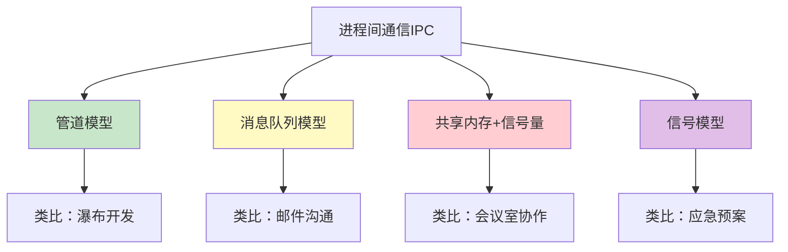
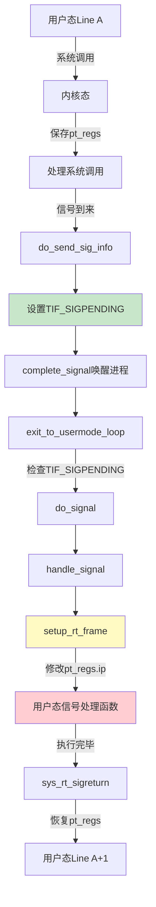
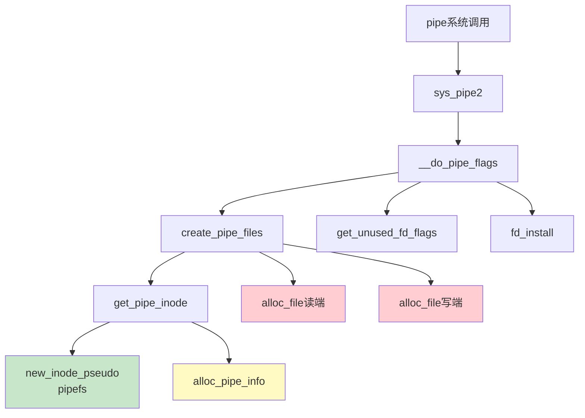
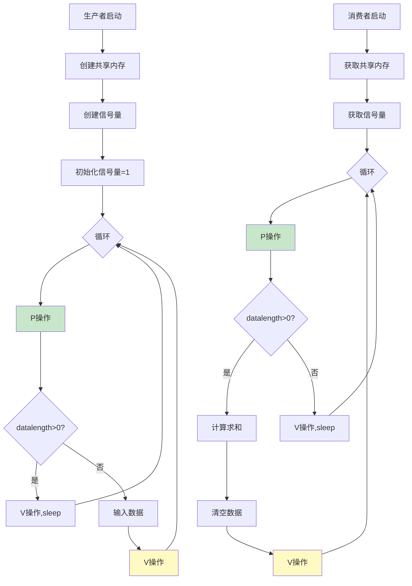
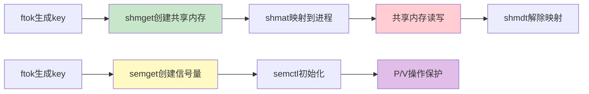
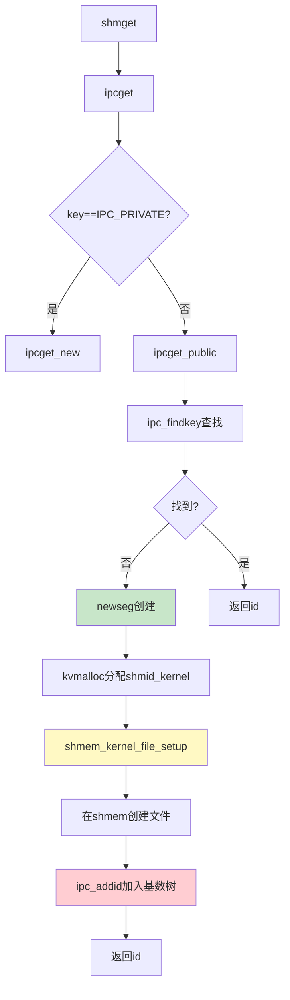
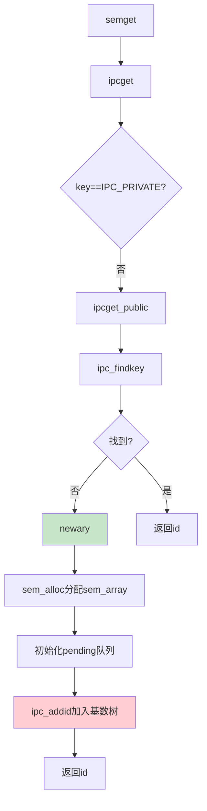

# Linux 底层原理学习笔记 · 第五册：进程间通信

## 第7章 进程间通信（一）：IPC概述与信号机制
### 7.1 进程间通信概述


> **核心思想**：进程间通信提供4种模式，从简单的管道到复杂的共享内存，以及紧急通知机制——信号。


#### 7.1.1 为什么需要IPC

**问题**：进程间相互隔离，如何协作？

**类比**：

- 小项目：单个项目组独立完成
- 大项目：多个项目组协作

**解决方案**：进程间通信（IPC，Inter-Process Communication）

#### 7.1.2 四种IPC模式



---

### 7.2 管道模型（Pipe）

#### 7.2.1 管道概念

**定义**：单向传输数据的机制

**特点**：

- 一端写入，另一端读出
- 缓存区
- 单向通信（双向需要两个管道）

**类比**：瀑布开发模型（上一阶段完成→交给下一阶段）

#### 7.2.2 匿名管道

**示例**：

```bash
ps -ef | grep keyword | awk '{print $2}' | xargs kill -9
```

**特点**：

- 符号：`|`
- 自动创建、自动销毁
- 用户无感知

#### 7.2.3 命名管道（FIFO）

**创建**：

```bash
mkfifo hello
ls -l
# prw-r--r-- 1 root root 0 hello
```

**使用**：

```bash
# 终端1：写入（会阻塞）
echo "hello world" > hello

# 终端2：读取
cat < hello
# hello world
```

**特点**：

- 以文件形式存在
- 类型标识：`p`（pipe）
- 写入未读取完毕前，写入端阻塞

#### 7.2.4 管道的局限性

- 效率较低
- 不适合频繁交换数据
- 类似瀑布模型，团队无法频繁沟通

---

### 7.3 消息队列模型（Message Queue）

#### 7.3.1 消息队列概念

**类比**：邮件系统

**特点**：

- 分成独立的数据单元（消息体）
- 固定大小的存储块
- 字节流不连续
- 支持频繁通信

#### 7.3.2 消息结构

```c
struct msg_buffer {
    long mtype;       // 消息类型
    char mtext[1024]; // 消息正文
};
```

#### 7.3.3 创建消息队列

```c
#include <sys/msg.h>

int main() {
    int messagequeueid;
    key_t key;
    
    // 生成唯一key
    if ((key = ftok("/root/messagequeue/messagequeuekey", 1024)) < 0) {
        perror("ftok error");
        exit(1);
    }
    
    // 创建消息队列
    if ((messagequeueid = msgget(key, IPC_CREAT|0777)) == -1) {
        perror("msgget error");
        exit(1);
    }
    
    printf("Message queue id: %d.\n", messagequeueid);
}
```

**key的作用**：

- 唯一标识消息队列
- 通过ftok关联文件inode生成
- 属于System V IPC体系

#### 7.3.4 System V IPC命令

```bash
# 查看消息队列
ipcs -q

# 创建IPC对象
ipcmk

# 删除IPC对象
ipcrm
```

#### 7.3.5 发送消息

```c
// 发送消息
msgsnd(messagequeueid, &buffer, len, IPC_NOWAIT);
```

#### 7.3.6 接收消息

```c
// 接收消息
msgrcv(messagequeueid, &buffer, 1024, type, IPC_NOWAIT);
```

---

### 7.4 共享内存与信号量

#### 7.4.1 共享内存概念

**类比**：共享会议室

**问题**：进程间内存隔离

**解决方案**：映射到相同物理内存

```
进程A虚拟地址空间
  ├─ 0x1000 → 物理内存0x5000（共享区域）
  
进程B虚拟地址空间
  ├─ 0x2000 → 物理内存0x5000（相同共享区域）
```

#### 7.4.2 共享内存API

```c
// 创建共享内存
int shmget(key_t key, size_t size, int flag);

// 挂载到进程地址空间
void *shmat(int shm_id, const void *addr, int flag);

// 解除绑定
int shmdt(void *addr);

// 删除共享内存
int shmctl(int shm_id, int cmd, struct shmid_ds *buf);
```

**查看**：

```bash
ipcs --shmems
```

#### 7.4.3 信号量（Semaphore）

**问题**：共享资源的并发访问冲突

**解决方案**：信号量计数器

**操作**：

- **P操作**：申请资源（-N）
- **V操作**：归还资源（+M）

**原子性**：同一资源不能同时借给两个进程

**示例**（借钱类比）：

```
初始：信号量 = 100元
A借80元：P(80) → 信号量 = 20元
B借50元：P(50) → 阻塞等待
A还30元：V(30) → 信号量 = 50元
B借50元：P(50) → 成功，信号量 = 0元
```

#### 7.4.4 信号量API

```c
// 创建信号量组
int semget(key_t key, int num_sems, int sem_flags);

// 初始化信号量
int semctl(int semid, int semnum, int cmd, union semun args);

union semun {
    int val;                    // 资源数量
    struct semid_ds *buf;
    unsigned short int *array;
};

// P/V操作
int semop(int semid, struct sembuf semoparray[], size_t numops);

struct sembuf {
    short sem_num;   // 信号量序号
    short sem_op;    // <0为P操作，>0为V操作
    short sem_flg;   // IPC_NOWAIT, SEM_UNDO
};
```

---

### 7.5 信号机制（Signal）

#### 7.5.1 信号概述

**类比**：应急预案

**场景**：

- 线上系统故障
- 7×24小时告警
- 紧急通知机制

**特点**：

- 用代号（数字）表示事件
- 无复杂数据结构
- 异步通知

#### 7.5.2 信号类型

```bash
kill -l
# 1) SIGHUP    2) SIGINT    3) SIGQUIT   4) SIGILL
# 5) SIGTRAP   6) SIGABRT   7) SIGBUS    8) SIGFPE
# 9) SIGKILL  10) SIGUSR1  11) SIGSEGV  12) SIGUSR2
# ...
# 64) SIGRTMAX
```

**查看详细信息**：

```bash
man 7 signal
```

**常见信号**：

| 信号 | 值 | 默认操作 | 说明 |
|-----|----|---------|----|
| SIGHUP | 1 | Term | 终端挂起或控制进程死亡 |
| SIGINT | 2 | Term | Ctrl+C中断 |
| SIGQUIT | 3 | Core | Ctrl+\退出 |
| SIGKILL | 9 | Term | 强制杀死（不可捕获） |
| SIGSEGV | 11 | Core | 非法内存访问 |
| SIGPIPE | 13 | Term | 写入无读者的管道 |
| SIGALRM | 14 | Term | 定时器信号 |
| SIGTERM | 15 | Term | 终止信号 |
| SIGCHLD | 17 | Ign | 子进程状态改变 |
| SIGSTOP | 19 | Stop | 停止进程（不可捕获） |

#### 7.5.3 信号处理方式

1. **执行默认操作**（Term/Core/Ign/Stop）
2. **捕捉信号**（注册信号处理函数）
3. **忽略信号**（除了SIGKILL和SIGSTOP）

---

### 7.6 注册信号处理函数

#### 7.6.1 signal函数（不推荐）

```c
typedef void (*sighandler_t)(int);
sighandler_t signal(int signum, sighandler_t handler);
```

**问题**：

- 参数无法细致控制
- 不同实现行为不同
- SA_ONESHOT：仅生效一次
- SA_NOMASK：可被中断

#### 7.6.2 sigaction函数（推荐）

```c
int sigaction(int signum, const struct sigaction *act,
              struct sigaction *oldact);

struct sigaction {
    __sighandler_t sa_handler;     // 信号处理函数
    unsigned long sa_flags;         // 标志位
    __sigrestore_t sa_restorer;    // 恢复函数
    sigset_t sa_mask;              // 信号屏蔽集
};
```

**关键标志位**：

- **SA_RESTART**：系统调用被中断后自动重启
- **SA_INTERRUPT**：系统调用被中断后返回-EINTR
- **SA_NOMASK**：信号处理器可被中断
- **SA_ONESHOT**：仅生效一次

#### 7.6.3 sigaction调用流程

```
sigaction (glibc)
  ↓
__sigaction
  ↓
__libc_sigaction
  ↓
rt_sigaction (系统调用)
  ↓
do_sigaction
  ↓
设置 current->sighand->action[sig-1]
```

#### 7.6.4 内核实现

```c
int do_sigaction(int sig, struct k_sigaction *act, struct k_sigaction *oact) {
    struct task_struct *p = current;
    struct k_sigaction *k;
    
    k = &p->sighand->action[sig-1];
    
    spin_lock_irq(&p->sighand->siglock);
    if (oact)
        *oact = *k;
    if (act) {
        // 清除SIGKILL和SIGSTOP
        sigdelsetmask(&act->sa.sa_mask,
                     sigmask(SIGKILL) | sigmask(SIGSTOP));
        *k = *act;
    }
    spin_unlock_irq(&p->sighand->siglock);
    
    return 0;
}
```

**关键数据结构**：

```
task_struct
  └─ sighand (struct sighand_struct *)
       └─ action[64] (struct k_sigaction数组)
            └─ 下标为信号编号
```

---

### 7.7 信号的发送

#### 7.7.1 信号产生的方式

1. **键盘组合键**：
   - Ctrl+C → SIGINT
   - Ctrl+Z → SIGTSTP

2. **硬件异常**：
   - 除以0 → SIGFPE
   - 非法内存访问 → SIGSEGV

3. **内核发送**：
   - 写入已关闭管道 → SIGPIPE
   - 子进程退出 → SIGCHLD

4. **命令/系统调用**：
   - kill命令
   - kill/tkill/tgkill系统调用

#### 7.7.2 发送信号的调用链

```
kill系统调用
  ↓
kill_something_info
  ↓
kill_pid_info
  ↓
group_send_sig_info
  ↓
do_send_sig_info
  ↓
send_signal
  ↓
__send_signal
```

#### 7.7.3 __send_signal核心逻辑

```c
static int __send_signal(int sig, struct siginfo *info, struct task_struct *t,
                        int group, int from_ancestor_ns) {
    struct sigpending *pending;
    struct sigqueue *q;
    
    // 1. 确定sigpending
    pending = group ? &t->signal->shared_pending : &t->pending;
    
    // 2. 检查是否丢失（<32的信号）
    if (legacy_queue(pending, sig))
        goto ret;
    
    // 3. 分配sigqueue
    q = __sigqueue_alloc(sig, t, GFP_ATOMIC, override_rlimit);
    
    if (q) {
        // 4. 加入链表
        list_add_tail(&q->list, &pending->list);
        
        // 5. 设置信号信息
        q->info.si_signo = sig;
        q->info.si_code = SI_USER;
        // ...
    }
    
    // 6. 设置信号集
    sigaddset(&pending->signal, sig);
    
    // 7. 唤醒进程处理信号
    complete_signal(sig, t, group);
    
ret:
    return ret;
}
```

#### 7.7.4 sigpending结构

```c
struct sigpending {
    struct list_head list;  // sigqueue链表
    sigset_t signal;        // 信号集合
};
```

**两种表示方式**：

- **sigset_t**：位图，快速判断是否有某信号
- **list**：sigqueue链表，保存信号详细信息

#### 7.7.5 可靠信号 vs 不可靠信号

**不可靠信号（< 32）**：

- 使用sigset_t标识
- 重复发送会丢失
- 信号处理函数未执行时，后续相同信号被忽略

**可靠信号（>= 32，实时信号）**：

- 使用sigqueue链表
- 不会丢失
- 每个信号都会被处理

**示例**：

```
发送100个SIGUSR1（信号10）:
  - 如果处理不及时，可能只处理1个
  - 因为sigset_t只记录"有SIGUSR1"

发送100个SIGRTMIN（信号34）:
  - 全部加入链表
  - 全部会被处理
```

#### 7.7.6 complete_signal唤醒进程

```c
static void complete_signal(int sig, struct task_struct *p, int group) {
    struct task_struct *t;
    
    // 找一个线程处理信号
    if (wants_signal(sig, p))
        t = p;
    else {
        t = signal->curr_target;
        while (!wants_signal(sig, t)) {
            t = next_thread(t);
            if (t == signal->curr_target)
                return;
        }
        signal->curr_target = t;
    }
    
    // 唤醒线程
    signal_wake_up(t, sig == SIGKILL);
}
```

**signal_wake_up**：

```c
void signal_wake_up_state(struct task_struct *t, unsigned int state) {
    // 1. 设置TIF_SIGPENDING标志
    set_tsk_thread_flag(t, TIF_SIGPENDING);
    
    // 2. 唤醒进程
    if (!wake_up_state(t, state | TASK_INTERRUPTIBLE))
        kick_process(t);
}
```

---

### 7.8 信号的处理

#### 7.8.1 处理时机

**时机**：从内核态返回用户态时

- 系统调用返回
- 中断处理返回

**入口**：`exit_to_usermode_loop`

```c
static void exit_to_usermode_loop(struct pt_regs *regs, u32 cached_flags) {
    while (true) {
        // 调度
        if (cached_flags & _TIF_NEED_RESCHED)
            schedule();
        
        // 处理信号
        if (cached_flags & _TIF_SIGPENDING)
            do_signal(regs);
        
        if (!(cached_flags & EXIT_TO_USERMODE_LOOP_FLAGS))
            break;
    }
}
```

#### 7.8.2 do_signal函数

```c
void do_signal(struct pt_regs *regs) {
    struct ksignal ksig;
    
    if (get_signal(&ksig)) {
        // 处理信号
        handle_signal(&ksig, regs);
        return;
    }
    
    // 处理系统调用重启
    if (syscall_get_nr(current, regs) >= 0) {
        switch (syscall_get_error(current, regs)) {
        case -ERESTARTNOHAND:
        case -ERESTARTSYS:
        case -ERESTARTNOINTR:
            regs->ax = regs->orig_ax;
            regs->ip -= 2;
            break;
        case -ERESTART_RESTARTBLOCK:
            regs->ax = get_nr_restart_syscall(regs);
            regs->ip -= 2;
            break;
        }
    }
    
    restore_saved_sigmask();
}
```

#### 7.8.3 handle_signal核心流程

**问题**：信号处理函数在用户态，如何调用？

**挑战**：

- 进程在Line A执行系统调用
- 内核保存Line A到pt_regs
- 返回用户态应该回到Line A
- 但要先执行信号处理函数

**解决方案**：修改pt_regs，返回到信号处理函数

```c
static void handle_signal(struct ksignal *ksig, struct pt_regs *regs) {
    // 1. 处理系统调用重启逻辑
    if (syscall_get_nr(current, regs) >= 0) {
        switch (syscall_get_error(current, regs)) {
        case -ERESTARTSYS:
            if (!(ksig->ka.sa.sa_flags & SA_RESTART)) {
                regs->ax = -EINTR;
                break;
            }
        case -ERESTARTNOINTR:
            regs->ax = regs->orig_ax;
            regs->ip -= 2;
            break;
        }
    }
    
    // 2. 设置信号处理函数栈帧
    failed = (setup_rt_frame(ksig, regs) < 0);
    
    // 3. 屏蔽信号
    signal_setup_done(failed, ksig, stepping);
}
```

#### 7.8.4 setup_rt_frame详解

**作用**：构造用户态栈帧，返回时执行信号处理函数

```c
static int setup_rt_frame(struct ksignal *ksig, struct pt_regs *regs) {
    struct rt_sigframe __user *frame;
    
    // 1. 在用户栈上分配空间
    frame = get_sigframe(&ksig->ka, regs, sizeof(struct rt_sigframe), &fp);
    
    // 2. 保存当前寄存器状态
    if (copy_siginfo_to_user(&frame->info, &ksig->info))
        return -EFAULT;
    
    // 3. 构造ucontext
    if (setup_sigcontext(&frame->uc.uc_mcontext, fp, regs, set->sig[0]))
        return -EFAULT;
    
    // 4. 设置恢复函数
    if (ksig->ka.sa.sa_flags & SA_RESTORER)
        restorer = ksig->ka.sa.sa_restorer;
    else
        restorer = current->mm->context.vdso + selected_vdso32->sym___kernel_rt_sigreturn;
    
    // 5. 修改pt_regs：
    //    - ip指向信号处理函数
    //    - sp指向构造的栈帧
    regs->di = ksig->sig;                  // 第1个参数：信号编号
    regs->ax = 0;
    regs->si = (unsigned long)&frame->info; // 第2个参数：siginfo
    regs->dx = (unsigned long)&frame->uc;   // 第3个参数：ucontext
    regs->ip = (unsigned long)ksig->ka.sa.sa_handler; // 信号处理函数地址
    regs->sp = (unsigned long)frame;        // 用户栈指针
    regs->cs = __USER_CS;
    regs->ss = __USER_DS;
    
    return 0;
}
```

**用户栈布局**：

```
用户栈（高地址→低地址）
  ├─ 原始栈内容
  ├─ rt_sigframe
  │   ├─ sig (信号编号)
  │   ├─ info (siginfo_t)
  │   ├─ uc (ucontext_t)
  │   │   ├─ uc_mcontext (保存的寄存器)
  │   │   └─ ...
  │   └─ restorer (返回地址)
  └─ (新的sp指向这里)
```

#### 7.8.5 信号处理完整流程



#### 7.8.6 信号处理函数返回

**问题**：信号处理函数执行完后如何返回？

**解决方案**：`sys_rt_sigreturn`系统调用

```c
SYSCALL_DEFINE0(rt_sigreturn) {
    struct pt_regs *regs = current_pt_regs();
    struct rt_sigframe __user *frame;
    
    // 1. 从用户栈获取rt_sigframe
    frame = (struct rt_sigframe __user *)(regs->sp - sizeof(long));
    
    // 2. 恢复信号屏蔽字
    if (__copy_from_user(&set, &frame->uc.uc_sigmask, sizeof(set)))
        goto badframe;
    set_current_blocked(&set);
    
    // 3. 恢复寄存器状态
    if (restore_sigcontext(regs, &frame->uc.uc_mcontext, &ax))
        goto badframe;
    
    // 4. 返回用户态Line A+1继续执行
    return ax;
}
```

---

### 7.9 总结

#### 7.9.1 IPC四种模式对比

| 模式 | 类比 | 特点 | 适用场景 |
|-----|------|------|---------|
| 管道 | 瀑布开发 | 单向、简单、效率低 | 命令行管道 |
| 消息队列 | 邮件 | 双向、频繁、有格式 | 少用（用户级消息队列更好） |
| 共享内存+信号量 | 会议室 | 高效、复杂、需同步 | C语言开源软件常用 |
| 信号 | 应急预案 | 异步、紧急、无数据 | 常用、机制复杂 |

#### 7.9.2 信号机制核心流程

**注册阶段**：

```
sigaction(glibc) → rt_sigaction(syscall) → do_sigaction
  → 设置 task_struct->sighand->action[sig]
```

**发送阶段**：

```
kill → do_send_sig_info → __send_signal
  → 加入sigpending链表
  → 设置TIF_SIGPENDING
  → signal_wake_up唤醒进程
```

**处理阶段**：

```
exit_to_usermode_loop → do_signal → handle_signal
  → setup_rt_frame（修改pt_regs.ip）
  → 返回用户态执行信号处理函数
  → sys_rt_sigreturn（恢复pt_regs）
  → 继续执行原来的代码
```

#### 7.9.3 重要命令

```bash
# IPC查看
ipcs -q       # 消息队列
ipcs --shmems # 共享内存
ipcs -s       # 信号量

# IPC删除
ipcrm -q <id>  # 删除消息队列
ipcrm -m <id>  # 删除共享内存
ipcrm -s <id>  # 删除信号量

# 信号
kill -l        # 列出所有信号
man 7 signal   # 查看信号手册
kill -9 <pid>  # 发送SIGKILL
kill -SIGUSR1 <pid>  # 发送自定义信号
```

#### 7.9.4 关键数据结构

```
进程/线程级别：
task_struct
  ├─ signal (struct signal_struct *)
  │   └─ shared_pending (整个进程共享)
  ├─ pending (线程独有)
  └─ sighand (struct sighand_struct *)
       └─ action[64] (信号处理函数数组)

信号队列：
struct sigpending {
    struct list_head list;  // sigqueue链表（可靠信号）
    sigset_t signal;        // 信号集（不可靠信号）
};

struct sigqueue {
    struct list_head list;
    struct siginfo info;
};
```

---

**本节完成**：第7章第一部分（IPC概述与信号机制）已讲解完毕。

**内容回顾**：

- ✅ IPC四种模式（管道、消息队列、共享内存、信号）
- ✅ 管道的两种类型
- ✅ 消息队列API
- ✅ 共享内存与信号量概念
- ✅ 信号机制完整流程（注册、发送、处理）

**下一节预告**：将讲解管道的内核实现。

---

### 7.10 管道的内核实现

#### 7.10.1 创建匿名管道

**系统调用**：

```c
int pipe(int fd[2]);
```

**返回值**：

- `fd[0]`：读取端
- `fd[1]`：写入端

**内核实现**：

```c
SYSCALL_DEFINE1(pipe, int __user *, fildes) {
    return sys_pipe2(fildes, 0);
}

SYSCALL_DEFINE2(pipe2, int __user *, fildes, int, flags) {
    struct file *files[2];
    int fd[2];
    int error;
    
    // 创建管道文件
    error = __do_pipe_flags(fd, files, flags);
    if (!error) {
        // 复制fd到用户空间
        if (unlikely(copy_to_user(fildes, fd, sizeof(fd)))) {
            error = -EFAULT;
        } else {
            // 安装文件描述符
            fd_install(fd[0], files[0]);
            fd_install(fd[1], files[1]);
        }
    }
    return error;
}
```

#### 7.10.2 __do_pipe_flags

```c
static int __do_pipe_flags(int *fd, struct file **files, int flags) {
    int error;
    int fdr, fdw;
    
    // 1. 创建管道文件
    error = create_pipe_files(files, flags);
    
    // 2. 获取读端fd
    error = get_unused_fd_flags(flags);
    fdr = error;
    
    // 3. 获取写端fd
    error = get_unused_fd_flags(flags);
    fdw = error;
    
    fd[0] = fdr;
    fd[1] = fdw;
    
    return 0;
}
```

#### 7.10.3 pipefs文件系统

**文件系统定义**：

```c
static struct file_system_type pipefs_type = {
    .name = "pipefs",
    .mount = pipefs_mount,
    .kill_sb = kill_anon_super,
};

static int __init init_pipe_fs(void) {
    int err = register_filesystem(&pipefs_type);
    if (!err) {
        pipe_mnt = kern_mount(&pipefs_type);
    }
    return err;
}
```

**关键点**：

- pipefs是一个特殊的文件系统
- 仅内核使用，用户不可见
- 类似bdev文件系统

#### 7.10.4 create_pipe_files

```c
int create_pipe_files(struct file **res, int flags) {
    int err;
    struct inode *inode = get_pipe_inode();
    struct file *f;
    struct path path;
    
    // 1. 分配dentry
    path.dentry = d_alloc_pseudo(pipe_mnt->mnt_sb, &empty_name);
    path.mnt = mntget(pipe_mnt);
    d_instantiate(path.dentry, inode);
    
    // 2. 创建写端文件
    f = alloc_file(&path, FMODE_WRITE, &pipefifo_fops);
    f->f_flags = O_WRONLY | (flags & (O_NONBLOCK | O_DIRECT));
    f->private_data = inode->i_pipe;
    
    // 3. 创建读端文件
    res[0] = alloc_file(&path, FMODE_READ, &pipefifo_fops);
    path_get(&path);
    res[0]->private_data = inode->i_pipe;
    res[0]->f_flags = O_RDONLY | (flags & O_NONBLOCK);
    
    res[1] = f;
    return 0;
}
```

**重点**：

- 读端和写端共享同一个inode
- `private_data`指向`pipe_inode_info`
- 操作函数都是`pipefifo_fops`

#### 7.10.5 get_pipe_inode

```c
static struct inode * get_pipe_inode(void) {
    struct inode *inode = new_inode_pseudo(pipe_mnt->mnt_sb);
    struct pipe_inode_info *pipe;
    
    inode->i_ino = get_next_ino();
    
    // 分配pipe_inode_info
    pipe = alloc_pipe_info();
    
    inode->i_pipe = pipe;
    pipe->files = 2;
    pipe->readers = pipe->writers = 1;
    inode->i_fop = &pipefifo_fops;
    
    inode->i_state = I_DIRTY;
    inode->i_mode = S_IFIFO | S_IRUSR | S_IWUSR;
    inode->i_uid = current_fsuid();
    inode->i_gid = current_fsgid();
    inode->i_atime = inode->i_mtime = inode->i_ctime = current_time(inode);
    
    return inode;
}
```

**核心数据结构**：

```c
struct pipe_inode_info {
    struct pipe_buffer *bufs;  // 缓冲区数组
    unsigned int nrbufs;        // 当前使用的缓冲区数量
    unsigned int curbuf;        // 当前缓冲区索引
    unsigned int buffers;       // 缓冲区总数
    unsigned int readers;       // 读者数量
    unsigned int writers;       // 写者数量
    unsigned int files;         // 文件数量
    unsigned int waiting_writers;
    unsigned int r_counter;
    unsigned int w_counter;
    struct page *tmp_page;
    struct fasync_struct *fasync_readers;
    struct fasync_struct *fasync_writers;
};
```

**管道本质**：

- 内核中的一串缓存（pipe_buffer数组）
- 循环队列结构

#### 7.10.6 pipefifo_fops

```c
const struct file_operations pipefifo_fops = {
    .open = fifo_open,
    .llseek = no_llseek,
    .read_iter = pipe_read,
    .write_iter = pipe_write,
    .poll = pipe_poll,
    .unlocked_ioctl = pipe_ioctl,
    .release = pipe_release,
    .fasync = pipe_fasync,
};
```

---

### 7.11 父子进程间的管道通信

#### 7.11.1 fork后fd的复制

**关键机制**：

- fork复制父进程的`files_struct`
- fd数组复制一份
- 但fd指向的`struct file`是同一个

**结果**：

```
父进程                    子进程
files_struct             files_struct
  ├─ fd[0] ───┐           ├─ fd[0] ───┐
  │           │           │           │
  └─ fd[1] ───┤           └─ fd[1] ───┤
              ↓                       ↓
         struct file[0] (同一个对象，读端)
         struct file[1] (同一个对象，写端)
              ↓
         pipe_inode_info
              └─ pipe_buffer[]
```

#### 7.11.2 典型使用方式

```c
#include <unistd.h>
#include <stdio.h>
#include <string.h>

int main() {
    int fds[2];
    if (pipe(fds) == -1)
        perror("pipe error");
    
    pid_t pid = fork();
    if (pid == -1)
        perror("fork error");
    
    if (pid == 0) {
        // 子进程：关闭读端，保留写端
        close(fds[0]);
        char msg[] = "hello world";
        write(fds[1], msg, strlen(msg) + 1);
        close(fds[1]);
        exit(0);
    } else {
        // 父进程：关闭写端，保留读端
        close(fds[1]);
        char msg[128];
        read(fds[0], msg, 128);
        close(fds[0]);
        printf("message : %s\n", msg);
        return 0;
    }
}
```

**重要操作**：

- 子进程关闭`fds[0]`（读端）
- 父进程关闭`fds[1]`（写端）
- 避免混乱，确保单向通信

---

### 7.12 Shell管道的实现（A | B）

#### 7.12.1 场景说明

命令：`ps -ef | grep systemd`

**问题**：

- A进程（ps）和B进程（grep）都是shell的子进程
- A和B不是父子关系
- 如何建立管道？

#### 7.12.2 实现步骤

```
1. shell创建管道pipe(fds)
   shell: fds[0](读), fds[1](写)

2. shell fork出子进程A
   shell: fds[0](读), fds[1](写)
   A:     fds[0](读), fds[1](写)

3. shell关闭fds[1]，A关闭fds[0]
   shell: fds[0](读)
   A:     fds[1](写)

4. shell fork出子进程B
   shell: fds[0](读)
   A:     fds[1](写)
   B:     fds[0](读) (从shell复制)

5. shell关闭fds[0]
   A:     fds[1](写)
   B:     fds[0](读)
```

**结果**：

- A进程写入端
- B进程读取端
- 管道建立成功

#### 7.12.3 dup2系统调用

**作用**：将文件描述符复制

```c
int dup2(int oldfd, int newfd);
```

**files_struct结构**：

```c
struct files_struct {
    struct file __rcu * fd_array[NR_OPEN_DEFAULT];
};
```

**标准文件描述符**：

- `STDIN_FILENO` (0)：标准输入
- `STDOUT_FILENO` (1)：标准输出
- `STDERR_FILENO` (2)：错误输出

#### 7.12.4 重定向标准输入输出

**A进程（ps）**：

```c
dup2(fds[1], STDOUT_FILENO);
```

- 将标准输出重定向到管道写端
- 所有写入stdout的数据进入管道

**B进程（grep）**：

```c
dup2(fds[0], STDIN_FILENO);
```

- 将标准输入重定向到管道读端
- 所有从stdin读取的数据来自管道

#### 7.12.5 完整示例

```c
#include <unistd.h>
#include <stdio.h>

int main() {
    int fds[2];
    if (pipe(fds) == -1)
        perror("pipe error");
    
    pid_t pid = fork();
    if (pid == -1)
        perror("fork error");
    
    if (pid == 0) {
        // 子进程A：执行ps -ef
        dup2(fds[1], STDOUT_FILENO);
        close(fds[1]);
        close(fds[0]);
        execlp("ps", "ps", "-ef", NULL);
    } else {
        // 父进程：创建子进程B
        pid_t pid2 = fork();
        if (pid2 == 0) {
            // 子进程B：执行grep systemd
            dup2(fds[0], STDIN_FILENO);
            close(fds[0]);
            close(fds[1]);
            execlp("grep", "grep", "systemd", NULL);
        } else {
            // shell关闭管道
            close(fds[0]);
            close(fds[1]);
            wait(NULL);
            wait(NULL);
        }
    }
    
    return 0;
}
```

---

### 7.13 命名管道（FIFO）

#### 7.13.1 mkfifo函数

```c
int mkfifo (const char *path, mode_t mode) {
    dev_t dev = 0;
    return __xmknod (_MKNOD_VER, path, mode | S_IFIFO, &dev);
}

int __xmknod (int vers, const char *path, mode_t mode, dev_t *dev) {
    unsigned long long int k_dev;
    k_dev = (*dev) & ((1ULL << 32) - 1);
    
    return INLINE_SYSCALL (mknodat, 4, AT_FDCWD, path,
                          mode, (unsigned int) k_dev);
}
```

**系统调用**：

```c
SYSCALL_DEFINE4(mknodat, int, dfd, const char __user *, filename,
               umode_t, mode, unsigned, dev) {
    struct dentry *dentry;
    struct path path;
    
    // 创建dentry
    dentry = user_path_create(dfd, filename, &path, lookup_flags);
    
    // 根据类型调用vfs_mknod
    switch (mode & S_IFMT) {
    case S_IFIFO:  // 命名管道
    case S_IFSOCK: // socket
        error = vfs_mknod(path.dentry->d_inode, dentry, mode, 0);
        break;
    case S_IFCHR:  // 字符设备
    case S_IFBLK:  // 块设备
        error = vfs_mknod(path.dentry->d_inode, dentry, mode,
                         new_decode_dev(dev));
        break;
    }
    
    return error;
}
```

#### 7.13.2 vfs_mknod for FIFO

```c
int vfs_mknod(struct inode *dir, struct dentry *dentry, umode_t mode, dev_t dev) {
    // 调用文件系统的mknod操作
    error = dir->i_op->mknod(dir, dentry, mode, dev);
    
    if (!error)
        fsnotify_create(dir, dentry);
    
    return error;
}
```

**创建位置**：

- 在实际文件系统上（如ext4）
- 不是在pipefs上
- 持久化存储

#### 7.13.3 匿名管道 vs 命名管道

| 特性 | 匿名管道 | 命名管道 |
|------|---------|---------|
| 文件系统 | pipefs（内存） | ext4等（磁盘） |
| 持久化 | 否 | 是 |
| 创建方式 | pipe() | mkfifo() |
| 使用场景 | 父子进程/相关进程 | 无关进程 |
| 生命周期 | 进程退出销毁 | 手动删除 |
| 可见性 | 不可见 | /path可见 |

---

### 7.14 总结

#### 7.14.1 管道创建流程



#### 7.14.2 Shell管道流程

```
┌─────────┐
│  shell  │ 创建pipe(fds)
└────┬────┘
     │ fork
     ├────────────┐
     │            │
┌────▼────┐  ┌───▼────┐
│ shell   │  │   A    │
│fds[0]读 │  │fds[1]写│
│fds[1]写 │  │fds[0]读│
└────┬────┘  └───┬────┘
     │           │
     │关闭fds[1] │关闭fds[0]
     │           │
     │ fork      │
     ├───────┐   │
     │       │   │
┌────▼────┐ │   │
│ shell   │ │   │
│fds[0]读 │ │   │
└────┬────┘ │   │
     │   ┌──▼───▼────┐
     │   │  B        │
     │   │fds[0]读   │
     │   └─────┬─────┘
     │         │
     │关闭fds[0]│dup2(fds[1],STDOUT)
     │         │dup2(fds[0],STDIN)
     ▼         ▼
   管道：A写端 → B读端
```

#### 7.14.3 关键数据结构

```
进程
  └─ files_struct
       └─ fd_array[]
            ├─ fd[0] → struct file (读端)
            │            ├─ f_op = pipefifo_fops
            │            └─ private_data
            │                    ↓
            └─ fd[1] → struct file (写端)
                         ├─ f_op = pipefifo_fops
                         └─ private_data
                                  ↓
                         pipe_inode_info
                              └─ pipe_buffer[]
                                   (循环队列缓冲区)
```

#### 7.14.4 重要命令

```bash
# 创建命名管道
mkfifo mypipe

# 写入
echo "hello" > mypipe &

# 读取
cat < mypipe

# 删除
rm mypipe

# 查看管道状态
ls -l mypipe
# prw-r--r-- 1 user group 0 mypipe
```

---

**本节完成**：第7章第一部分全部完成（IPC概述+信号机制+管道实现）。

**内容回顾**：

- ✅ IPC四种模式
- ✅ 信号机制完整流程
- ✅ 管道的内核实现
- ✅ pipefs文件系统
- ✅ 父子进程通信
- ✅ Shell管道（A|B）实现
- ✅ 命名管道

**下一章预告**：将讲解共享内存和IPC的详细实现。

---

## 第7章 进程间通信（二）：共享内存与信号量
### 7.15 共享内存与信号量配合使用


> **核心思想**：共享内存提供高效的数据共享，信号量提供同步保护机制。


#### 7.15.1 为什么需要配合使用

**问题**：

- 共享内存：高效但不安全
- 多进程同时读写会冲突

**解决方案**：

- 共享内存：提供数据共享
- 信号量：提供互斥保护

**类比**：会议室协作

- 共享内存 = 白板
- 信号量 = 进入会议室的许可

#### 7.15.2 共享数据结构

```c
#define MAX_NUM 128

struct shm_data {
    int data[MAX_NUM];    // 数据数组
    int datalength;       // 数据个数
};
```

**设计原则**：

- 将共享数据封装成struct
- shmget的size = sizeof(struct)
- 映射后强制类型转换

---

### 7.16 共享内存API详解

#### 7.16.1 创建共享内存

```c
int get_shmid() {
    int shmid;
    key_t key;
    
    // 生成唯一key
    if ((key = ftok("/root/sharememory/sharememorykey", 1024)) < 0) {
        perror("ftok error");
        return -1;
    }
    
    // 创建共享内存
    shmid = shmget(key, sizeof(struct shm_data), IPC_CREAT|0777);
    return shmid;
}
```

**参数说明**：

- `key`：唯一标识（ftok生成）
- `size`：共享内存大小
- `shmflag`：IPC_CREAT | 权限

#### 7.16.2 映射共享内存

```c
void *shmat(int shm_id, const void *addr, int shmflg);
```

**使用方式**：

```c
void *shm = shmat(shmid, (void*)0, 0);
struct shm_data *shared = (struct shm_data*)shm;
```

**关键点**：

- `addr=NULL`：内核自动选择地址
- 返回值：映射后的虚拟地址
- 强制类型转换为`struct shm_data*`

#### 7.16.3 解除映射

```c
int shmdt(const void *shmaddr);
```

---

### 7.17 信号量API详解

#### 7.17.1 创建信号量集合

```c
int get_semaphoreid() {
    int semid;
    key_t key;
    
    // 生成唯一key
    if ((key = ftok("/root/sharememory/semaphorekey", 1024)) < 0) {
        perror("ftok error");
        return -1;
    }
    
    // 创建信号量集合（1个信号量）
    semid = semget(key, 1, IPC_CREAT|0777);
    return semid;
}
```

**参数说明**：

- `nsems`：信号量个数（这里为1）
- 用于互斥时通常设置为1

#### 7.17.2 初始化信号量

```c
union semun {
    int val;
    struct semid_ds *buf;
    unsigned short int *array;
};

int semaphore_init(int semid) {
    union semun argument;
    unsigned short values[1];
    values[0] = 1;  // 初始化为1（表示可用）
    argument.array = values;
    return semctl(semid, 0, SETALL, argument);
}
```

**关键点**：

- 初始化为1表示资源可用
- `semctl`的SETALL操作

#### 7.17.3 P操作（申请资源）

```c
int semaphore_p(int semid) {
    struct sembuf operations[1];
    operations[0].sem_num = 0;     // 第0个信号量
    operations[0].sem_op = -1;      // 减1
    operations[0].sem_flg = SEM_UNDO;
    return semop(semid, operations, 1);
}
```

**语义**：

- 信号量-1
- 如果已经为0，则阻塞等待
- SEM_UNDO：进程退出时自动撤销

#### 7.17.4 V操作（释放资源）

```c
int semaphore_v(int semid) {
    struct sembuf operations[1];
    operations[0].sem_num = 0;     // 第0个信号量
    operations[0].sem_op = 1;       // 加1
    operations[0].sem_flg = SEM_UNDO;
    return semop(semid, operations, 1);
}
```

**语义**：

- 信号量+1
- 唤醒等待的进程

---

### 7.18 生产者-消费者示例

#### 7.18.1 生产者代码

```c
#include "share.h"

int main() {
    void *shm = NULL;
    struct shm_data *shared = NULL;
    int shmid = get_shmid();
    int semid = get_semaphoreid();
    
    // 映射共享内存
    shm = shmat(shmid, (void*)0, 0);
    shared = (struct shm_data*)shm;
    memset(shared, 0, sizeof(struct shm_data));
    
    // 初始化信号量
    semaphore_init(semid);
    
    while (1) {
        semaphore_p(semid);  // P操作
        
        if (shared->datalength > 0) {
            // 数据未被消费，释放信号量并等待
            semaphore_v(semid);
            sleep(1);
        } else {
            // 数据已被消费，生产新数据
            printf("how many integers to calculate : ");
            scanf("%d", &shared->datalength);
            
            if (shared->datalength > MAX_NUM) {
                perror("too many integers.");
                shared->datalength = 0;
                semaphore_v(semid);
                exit(1);
            }
            
            for (int i = 0; i < shared->datalength; i++) {
                printf("Input the %d integer : ", i);
                scanf("%d", &shared->data[i]);
            }
            
            semaphore_v(semid);  // V操作
        }
    }
}
```

#### 7.18.2 消费者代码

```c
#include "share.h"

int main() {
    void *shm = NULL;
    struct shm_data *shared = NULL;
    int shmid = get_shmid();
    int semid = get_semaphoreid();
    
    // 映射共享内存
    shm = shmat(shmid, (void*)0, 0);
    shared = (struct shm_data*)shm;
    
    while (1) {
        semaphore_p(semid);  // P操作
        
        if (shared->datalength > 0) {
            // 有数据，进行消费
            int sum = 0;
            for (int i = 0; i < shared->datalength - 1; i++) {
                printf("%d+", shared->data[i]);
                sum += shared->data[i];
            }
            printf("%d", shared->data[shared->datalength - 1]);
            sum += shared->data[shared->datalength - 1];
            printf("=%d\n", sum);
            
            // 清空数据
            memset(shared, 0, sizeof(struct shm_data));
            semaphore_v(semid);  // V操作
        } else {
            // 无数据，等待
            semaphore_v(semid);
            printf("no tasks, waiting.\n");
            sleep(1);
        }
    }
}
```

#### 7.18.3 运行示例

```bash
# 生产者
$ ./producer
how many integers to calculate : 2
Input the 0 integer : 3
Input the 1 integer : 4
how many integers to calculate : 4
Input the 0 integer : 3
Input the 1 integer : 4
Input the 2 integer : 5
Input the 3 integer : 6

# 消费者
$ ./consumer
3+4=7
3+4+5+6=18
```

#### 7.18.4 查看IPC对象

```bash
# 查看所有IPC对象
$ ipcs

------ Shared Memory Segments --------
key        shmid      owner      perms      bytes      nattch
0x00016988 32768      root       777        516        0

------ Semaphore Arrays --------
key        semid      owner      perms      nsems
0x00016989 32768      root       777        1

# 删除共享内存
$ ipcrm -m 32768

# 删除信号量
$ ipcrm -s 32768
```

---

### 7.19 工作流程分析

#### 7.19.1 执行流程图



#### 7.19.2 关键步骤

**1. 初始化阶段**：

```
生产者：
  shmget → shmat → semget → semctl(init=1)

消费者：
  shmget → shmat → semget
```

**2. 生产者处理**：

```
while (1) {
    P操作 (信号量-1，获得锁)
    if (有未处理数据) {
        V操作 (释放锁)
        等待
    } else {
        生产数据
        V操作 (释放锁)
    }
}
```

**3. 消费者处理**：

```
while (1) {
    P操作 (信号量-1，获得锁)
    if (有数据) {
        消费数据
        清空数据
        V操作 (释放锁)
    } else {
        V操作 (释放锁)
        等待
    }
}
```

#### 7.19.3 同步机制

**互斥访问**：

```
时间线：
T1: 生产者 P操作成功（信号量1→0）
T2: 消费者 P操作阻塞（信号量已为0）
T3: 生产者写入数据
T4: 生产者 V操作（信号量0→1）
T5: 消费者 P操作成功（信号量1→0）
T6: 消费者读取数据
T7: 消费者 V操作（信号量0→1）
```

---

### 7.20 内存映射关系

#### 7.20.1 虚拟地址空间映射

```
进程A（生产者）               进程B（消费者）
虚拟地址空间                 虚拟地址空间
  ├─ 0x7f1234000000          ├─ 0x7f5678000000
  │  (shmat返回)             │  (shmat返回)
  │                          │
  ↓                          ↓
共享物理内存页面
  ├─ struct shm_data
  │   ├─ data[128]
  │   └─ datalength
  └─ (同一块物理内存)
```

**特点**：

- 不同进程虚拟地址不同
- 但映射到同一物理内存
- 直接内存访问，无需拷贝

#### 7.20.2 与管道对比

| 特性 | 管道 | 共享内存 |
|------|------|---------|
| 数据传输 | 拷贝（写→内核→读） | 直接访问物理内存 |
| 效率 | 较低 | 高 |
| 同步 | 内核自动同步 | 需信号量保护 |
| 缓冲 | 内核缓冲区 | 用户定义结构 |
| 使用难度 | 简单 | 复杂 |

---

### 7.21 总结

#### 7.21.1 共享内存+信号量流程



#### 7.21.2 核心API

```bash
# 共享内存
shmget()   # 创建/获取共享内存
shmat()    # 映射到进程地址空间
shmdt()    # 解除映射
shmctl()   # 控制操作

# 信号量
semget()   # 创建/获取信号量集合
semctl()   # 控制操作（初始化）
semop()    # P/V操作
```

#### 7.21.3 重要命令

```bash
# 查看IPC对象
ipcs          # 查看所有
ipcs -m       # 查看共享内存
ipcs -s       # 查看信号量
ipcs -q       # 查看消息队列

# 删除IPC对象
ipcrm -m <shmid>   # 删除共享内存
ipcrm -s <semid>   # 删除信号量
ipcrm -q <msqid>   # 删除消息队列
```

#### 7.21.4 关键点总结

1. **共享内存**：
   - 最高效的IPC方式
   - 直接访问物理内存
   - 需要同步保护

2. **信号量**：
   - 用于互斥和同步
   - P操作：-1，可能阻塞
   - V操作：+1，唤醒等待

3. **配合使用**：
   - 共享内存提供数据共享
   - 信号量提供访问控制
   - 生产者-消费者模型

4. **最佳实践**：
   - 共享数据封装成struct
   - 信号量初始化为1（互斥）
   - 使用SEM_UNDO标志
   - 及时释放资源

---

**本节完成**：共享内存与信号量的用户级使用。

**内容回顾**：

- ✅ 共享内存API（shmget/shmat/shmdt）
- ✅ 信号量API（semget/semctl/semop）
- ✅ P/V操作详解
- ✅ 生产者-消费者完整示例
- ✅ 内存映射关系
- ✅ 与管道对比

**下一节预告**：将讲解共享内存和信号量的内核实现。

---

## 第7章 进程间通信（三）：共享内存内核实现
### 7.22 IPC统一管理机制


> **核心思想**：IPC统一管理机制，基于shmem文件系统的共享内存实现。


#### 7.22.1 ipc_namespace

**统一管理**：信号量、消息队列、共享内存

```c
struct ipc_namespace {
    ......
    struct ipc_ids ids[3];
}

#define IPC_SEM_IDS 0
#define IPC_MSG_IDS 1
#define IPC_SHM_IDS 2

#define sem_ids(ns) ((ns)->ids[IPC_SEM_IDS])
#define msg_ids(ns) ((ns)->ids[IPC_MSG_IDS])
#define shm_ids(ns) ((ns)->ids[IPC_SHM_IDS])
```

**说明**：

- ids[0]：信号量
- ids[1]：消息队列
- ids[2]：共享内存

#### 7.22.2 ipc_ids结构

```c
struct ipc_ids {
    int in_use;                    // 当前使用数量
    unsigned short seq;            // 序列号
    struct rw_semaphore rwsem;     // 读写信号量
    struct idr ipcs_idr;           // 基数树
    int next_id;                   // 下一个id
};

struct idr {
    struct radix_tree_root idr_rt;  // 基数树根
    unsigned int idr_next;
};
```

**关键点**：

- 基数树：通过id快速查找IPC对象
- 每种IPC各有一棵基数树

#### 7.22.3 统一抽象：kern_ipc_perm

```c
struct sem_array {
    struct kern_ipc_perm sem_perm;   // 第一个成员
    time_t sem_ctime;
    struct list_head pending_alter;
    int sem_nsems;
    struct sem sems[];
};

struct msg_queue {
    struct kern_ipc_perm q_perm;     // 第一个成员
    time_t q_stime;
    time_t q_rtime;
    struct list_head q_messages;
    struct list_head q_receivers;
    struct list_head q_senders;
};

struct shmid_kernel {
    struct kern_ipc_perm shm_perm;   // 第一个成员
    struct file *shm_file;
    unsigned long shm_nattch;
    unsigned long shm_segsz;
    time_t shm_atim;
    time_t shm_dtim;
    pid_t shm_cprid;
    pid_t shm_lprid;
};
```

**设计精妙**：

- 三个结构的第一个成员都是`kern_ipc_perm`
- 可以通过`kern_ipc_perm*`强制类型转换
- 类似C++的面向对象（基类指针）

#### 7.22.4 ipc_obtain_object_idr

```c
struct kern_ipc_perm *ipc_obtain_object_idr(struct ipc_ids *ids, int id) {
    struct kern_ipc_perm *out;
    int lid = ipcid_to_idx(id);
    out = idr_find(&ids->ipcs_idr, lid);
    return out;
}
```

**类型转换**：

```c
// 获取信号量
static inline struct sem_array *sem_obtain_object(struct ipc_namespace *ns, int id) {
    struct kern_ipc_perm *ipcp = ipc_obtain_object_idr(&sem_ids(ns), id);
    return container_of(ipcp, struct sem_array, sem_perm);
}

// 获取消息队列
static inline struct msg_queue *msq_obtain_object(struct ipc_namespace *ns, int id) {
    struct kern_ipc_perm *ipcp = ipc_obtain_object_idr(&msg_ids(ns), id);
    return container_of(ipcp, struct msg_queue, q_perm);
}

// 获取共享内存
static inline struct shmid_kernel *shm_obtain_object(struct ipc_namespace *ns, int id) {
    struct kern_ipc_perm *ipcp = ipc_obtain_object_idr(&shm_ids(ns), id);
    return container_of(ipcp, struct shmid_kernel, shm_perm);
}
```

---

### 7.23 共享内存创建（shmget）

#### 7.23.1 系统调用入口

```c
SYSCALL_DEFINE3(shmget, key_t, key, size_t, size, int, shmflg) {
    struct ipc_namespace *ns;
    static const struct ipc_ops shm_ops = {
        .getnew = newseg,
        .associate = shm_security,
        .more_checks = shm_more_checks,
    };
    struct ipc_params shm_params;
    
    ns = current->nsproxy->ipc_ns;
    shm_params.key = key;
    shm_params.flg = shmflg;
    shm_params.u.size = size;
    
    return ipcget(ns, &shm_ids(ns), &shm_ops, &shm_params);
}
```

#### 7.23.2 ipcget通用创建逻辑

```c
int ipcget(struct ipc_namespace *ns, struct ipc_ids *ids,
          const struct ipc_ops *ops, struct ipc_params *params) {
    if (params->key == IPC_PRIVATE)
        return ipcget_new(ns, ids, ops, params);
    else
        return ipcget_public(ns, ids, ops, params);
}

static int ipcget_public(struct ipc_namespace *ns, struct ipc_ids *ids,
                        const struct ipc_ops *ops, struct ipc_params *params) {
    struct kern_ipc_perm *ipcp;
    int flg = params->flg;
    int err;
    
    // 查找key对应的IPC对象
    ipcp = ipc_findkey(ids, params->key);
    if (ipcp == NULL) {
        // 未找到，创建新的
        if (!(flg & IPC_CREAT))
            err = -ENOENT;
        else
            err = ops->getnew(ns, params);  // 调用newseg
    } else {
        // 已存在
        if (flg & IPC_CREAT && flg & IPC_EXCL)
            err = -EEXIST;
        else {
            err = 0;
            if (ops->more_checks)
                err = ops->more_checks(ipcp, params);
        }
    }
    return err;
}
```

---

### 7.24 newseg创建共享内存

#### 7.24.1 newseg函数

```c
static int newseg(struct ipc_namespace *ns, struct ipc_params *params) {
    key_t key = params->key;
    int shmflg = params->flg;
    size_t size = params->u.size;
    struct shmid_kernel *shp;
    size_t numpages = (size + PAGE_SIZE - 1) >> PAGE_SHIFT;
    struct file *file;
    char name[13];
    
    // 1. 分配shmid_kernel结构
    shp = kvmalloc(sizeof(*shp), GFP_KERNEL);
    
    // 2. 设置基本属性
    shp->shm_perm.key = key;
    shp->shm_perm.mode = (shmflg & S_IRWXUGO);
    shp->mlock_user = NULL;
    
    // 3. 创建shmem文件系统上的文件
    file = shmem_kernel_file_setup(name, size, acctflag);
    
    // 4. 设置shm属性
    shp->shm_cprid = task_tgid_vnr(current);
    shp->shm_lprid = 0;
    shp->shm_atim = shp->shm_dtim = 0;
    shp->shm_ctim = get_seconds();
    shp->shm_segsz = size;
    shp->shm_nattch = 0;
    shp->shm_file = file;
    shp->shm_creator = current;
    
    // 5. 加入基数树
    error = ipc_addid(&shm_ids(ns), &shp->shm_perm, ns->shm_ctlmni);
    
    // 6. 加入当前进程的shm列表
    list_add(&shp->shm_clist, &current->sysvshm.shm_clist);
    
    // 7. 关联文件inode的id
    file_inode(file)->i_ino = shp->shm_perm.id;
    
    ns->shm_tot += numpages;
    error = shp->shm_perm.id;
    
    return error;
}
```

---

### 7.25 shmem文件系统

#### 7.25.1 shmem_init初始化

```c
int __init shmem_init(void) {
    int error;
    
    // 初始化inode缓存
    error = shmem_init_inodecache();
    
    // 注册shmem文件系统
    error = register_filesystem(&shmem_fs_type);
    
    // 挂载shmem文件系统
    shm_mnt = kern_mount(&shmem_fs_type);
    
    return 0;
}

static struct file_system_type shmem_fs_type = {
    .owner = THIS_MODULE,
    .name = "tmpfs",
    .mount = shmem_mount,
    .kill_sb = kill_litter_super,
    .fs_flags = FS_USERNS_MOUNT,
};
```

**关键点**：

- shmem是内存文件系统（tmpfs）
- 挂载后得到`shm_mnt`
- 用于创建共享内存文件

#### 7.25.2 shmem_kernel_file_setup

```c
struct file *shmem_kernel_file_setup(const char *name, loff_t size,
                                    unsigned long flags) {
    return __shmem_file_setup(name, size, flags, S_PRIVATE);
}

static struct file *__shmem_file_setup(const char *name, loff_t size,
                                      unsigned long flags, unsigned int i_flags) {
    struct file *res;
    struct inode *inode;
    struct path path;
    struct super_block *sb;
    struct qstr this;
    
    this.name = name;
    this.len = strlen(name);
    this.hash = 0;
    
    // 1. 获取shmem的superblock
    sb = shm_mnt->mnt_sb;
    
    // 2. 创建dentry
    path.mnt = mntget(shm_mnt);
    path.dentry = d_alloc_pseudo(sb, &this);
    d_set_d_op(path.dentry, &anon_ops);
    
    // 3. 创建inode
    inode = shmem_get_inode(sb, NULL, S_IFREG | S_IRWXUGO, 0, flags);
    inode->i_flags |= i_flags;
    d_instantiate(path.dentry, inode);
    inode->i_size = size;
    
    // 4. 创建file
    res = alloc_file(&path, FMODE_WRITE | FMODE_READ,
                    &shmem_file_operations);
    
    return res;
}
```

#### 7.25.3 shmem_file_operations

```c
static const struct file_operations shmem_file_operations = {
    .mmap = shmem_mmap,
    .get_unmapped_area = shmem_get_unmapped_area,
#ifdef CONFIG_TMPFS
    .llseek = shmem_file_llseek,
    .read_iter = shmem_file_read_iter,
    .write_iter = generic_file_write_iter,
    .fsync = noop_fsync,
    .splice_read = generic_file_splice_read,
    .splice_write = iter_file_splice_write,
    .fallocate = shmem_fallocate,
#endif
};
```

---

### 7.26 共享内存映射（shmat）

#### 7.26.1 shmat系统调用

```c
SYSCALL_DEFINE3(shmat, int, shmid, char __user *, shmaddr, int, shmflg) {
    unsigned long ret;
    long err;
    
    err = do_shmat(shmid, shmaddr, shmflg, &ret, SHMLBA);
    force_successful_syscall_return();
    return (long)ret;
}
```

#### 7.26.2 do_shmat核心流程

```c
long do_shmat(int shmid, char __user *shmaddr, int shmflg,
             ulong *raddr, unsigned long shmlba) {
    struct shmid_kernel *shp;
    unsigned long addr = (unsigned long)shmaddr;
    unsigned long size;
    struct file *file;
    int err;
    unsigned long flags = MAP_SHARED;
    unsigned long prot;
    struct ipc_namespace *ns;
    struct shm_file_data *sfd;
    struct path path;
    fmode_t f_mode;
    unsigned long populate = 0;
    
    // 1. 设置权限
    prot = PROT_READ | PROT_WRITE;
    acc_mode = S_IRUGO | S_IWUGO;
    f_mode = FMODE_READ | FMODE_WRITE;
    
    // 2. 获取shmid_kernel
    ns = current->nsproxy->ipc_ns;
    shp = shm_obtain_object_check(ns, shmid);
    
    // 3. 获取shmem文件路径
    path = shp->shm_file->f_path;
    path_get(&path);
    shp->shm_nattch++;
    size = i_size_read(d_inode(path.dentry));
    
    // 4. 分配shm_file_data
    sfd = kzalloc(sizeof(*sfd), GFP_KERNEL);
    
    // 5. 创建新的file用于映射
    file = alloc_file(&path, f_mode,
                     is_file_hugepages(shp->shm_file) ?
                     &shm_file_operations_huge :
                     &shm_file_operations);
    
    // 6. 关联file和shm_file_data
    file->private_data = sfd;
    file->f_mapping = shp->shm_file->f_mapping;
    sfd->id = shp->shm_perm.id;
    sfd->ns = get_ipc_ns(ns);
    sfd->file = shp->shm_file;
    sfd->vm_ops = NULL;
    
    // 7. 调用do_mmap_pgoff映射
    addr = do_mmap_pgoff(file, addr, size, prot, flags, 0, &populate, NULL);
    *raddr = addr;
    err = 0;
    
    return err;
}
```

---

### 7.27 文件与映射关系

#### 7.27.1 两个file的作用

```
shmid_kernel
  └─ shm_file (file1)
       ├─ f_op = shmem_file_operations
       └─ 管理shmem文件系统上的文件

进程映射
  └─ file (file2)
       ├─ f_op = shm_file_operations
       ├─ private_data → shm_file_data
       │    ├─ file → shm_file (file1)
       │    └─ vm_ops → shmem_vm_ops
       └─ 专门用于内存映射
```

**为什么需要两个file**：

- file1：中立的文件管理角色
- file2：特定进程的映射角色

#### 7.27.2 shm_file_operations

```c
static const struct file_operations shm_file_operations = {
    .mmap = shm_mmap,
    .fsync = shm_fsync,
    .release = shm_release,
    .get_unmapped_area = shm_get_unmapped_area,
    .llseek = noop_llseek,
    .fallocate = shm_fallocate,
};
```

---

### 7.28 shm_mmap映射过程

#### 7.28.1 shm_mmap

```c
static int shm_mmap(struct file *file, struct vm_area_struct *vma) {
    struct shm_file_data *sfd = shm_file_data(file);
    int ret;
    
    // 1. 调用底层shmem文件的mmap
    ret = __shm_open(vma);
    ret = call_mmap(sfd->file, vma);
    
    // 2. 保存shmem的vm_ops
    sfd->vm_ops = vma->vm_ops;
    
    // 3. 替换为shm的vm_ops
    vma->vm_ops = &shm_vm_ops;
    
    return 0;
}
```

#### 7.28.2 shmem_mmap

```c
static int shmem_mmap(struct file *file, struct vm_area_struct *vma) {
    file_accessed(file);
    vma->vm_ops = &shmem_vm_ops;
    return 0;
}
```

#### 7.28.3 vm_ops关系

```
vma->vm_ops = shm_vm_ops
  └─ .fault = shm_fault

shm_file_data->vm_ops = shmem_vm_ops
  └─ .fault = shmem_fault
```

---

### 7.29 缺页异常处理

#### 7.29.1 shm_vm_ops

```c
static const struct vm_operations_struct shm_vm_ops = {
    .open = shm_open,      // vm-area打开
    .close = shm_close,    // vm-area关闭
    .fault = shm_fault,    // 缺页异常
};
```

#### 7.29.2 shm_fault

```c
static int shm_fault(struct vm_fault *vmf) {
    struct file *file = vmf->vma->vm_file;
    struct shm_file_data *sfd = shm_file_data(file);
    
    // 转发给shmem_fault
    return sfd->vm_ops->fault(vmf);
}
```

#### 7.29.3 shmem_vm_ops

```c
static const struct vm_operations_struct shmem_vm_ops = {
    .fault = shmem_fault,
    .map_pages = filemap_map_pages,
};
```

#### 7.29.4 shmem_fault分配物理内存

```c
static int shmem_fault(struct vm_fault *vmf) {
    struct vm_area_struct *vma = vmf->vma;
    struct inode *inode = file_inode(vma->vm_file);
    gfp_t gfp = mapping_gfp_mask(inode->i_mapping);
    
    // 从page cache或swap获取页，或分配新页
    error = shmem_getpage_gfp(inode, vmf->pgoff, &vmf->page, sgp,
                             gfp, vma, vmf, &ret);
    
    return error;
}

static int shmem_getpage_gfp(struct inode *inode, pgoff_t index,
                            struct page **pagep, enum sgp_type sgp, gfp_t gfp,
                            struct vm_area_struct *vma, struct vm_fault *vmf,
                            int *fault_type) {
    ......
    // 分配新页
    page = shmem_alloc_and_acct_page(gfp, info, sbinfo, index, false);
    ......
}
```

**关键点**：

- 共享内存创建时只分配inode，不分配物理内存
- 第一次访问时触发缺页异常
- shmem_fault调用alloc_page_vma分配物理页

---

### 7.30 总结

#### 7.30.1 共享内存创建流程



#### 7.30.2 共享内存映射流程

```
shmat
  ↓
do_shmat
  ├─ shm_obtain_object_check (从基数树获取shmid_kernel)
  ├─ kzalloc(shm_file_data)
  ├─ alloc_file (创建file2用于映射)
  ├─ file2->private_data = shm_file_data
  ├─ shm_file_data->file = shm_file (file1)
  ↓
do_mmap_pgoff
  ↓
shm_mmap (file2的mmap)
  ├─ call_mmap(file1) → shmem_mmap
  │   └─ vma->vm_ops = shmem_vm_ops
  ├─ sfd->vm_ops = shmem_vm_ops
  └─ vma->vm_ops = shm_vm_ops
```

#### 7.30.3 缺页异常流程

```
访问共享内存地址
  ↓
do_page_fault
  ↓
vma->vm_ops->fault (shm_fault)
  ↓
sfd->vm_ops->fault (shmem_fault)
  ↓
shmem_getpage_gfp
  ├─ 查找page cache
  ├─ 查找swap
  └─ shmem_alloc_and_acct_page
       ↓
     alloc_page_vma (分配物理页)
```

#### 7.30.4 核心数据结构关系

```
ipc_namespace
  └─ ids[2] (shm_ids)
       └─ ipcs_idr (基数树)
            └─ shmid_kernel
                 ├─ shm_perm (kern_ipc_perm)
                 ├─ shm_file (file1, shmem文件)
                 ├─ shm_segsz
                 └─ shm_nattch

进程A
  └─ mm_struct
       └─ vm_area_struct
            ├─ vm_file (file2)
            │    ├─ f_op = shm_file_operations
            │    └─ private_data → shm_file_data
            │                        ├─ file → shm_file (file1)
            │                        └─ vm_ops → shmem_vm_ops
            └─ vm_ops = shm_vm_ops

进程B
  └─ mm_struct
       └─ vm_area_struct
            ├─ vm_file (file3, 另一个映射file)
            └─ 映射到同一个shmem文件
```

---

**本节完成**：共享内存的内核实现。

**内容回顾**：

- ✅ IPC统一管理机制（基数树+kern_ipc_perm）
- ✅ shmget创建流程（newseg）
- ✅ shmem文件系统（tmpfs）
- ✅ shmat映射流程（两个file的作用）
- ✅ 缺页异常处理（shmem_fault）

**下一节预告**：将讲解信号量的内核实现。

---

## 第7章 进程间通信（四）：信号量内核实现
### 7.31 信号量创建（semget）


> **核心思想**：信号量通过sem_array管理，P/V操作配合等待队列，SEM_UNDO机制保证异常安全。


#### 7.31.1 系统调用入口

```c
SYSCALL_DEFINE3(semget, key_t, key, int, nsems, int, semflg) {
    struct ipc_namespace *ns;
    static const struct ipc_ops sem_ops = {
        .getnew = newary,
        .associate = sem_security,
        .more_checks = sem_more_checks,
    };
    struct ipc_params sem_params;
    
    ns = current->nsproxy->ipc_ns;
    sem_params.key = key;
    sem_params.flg = semflg;
    sem_params.u.nsems = nsems;
    
    return ipcget(ns, &sem_ids(ns), &sem_ops, &sem_params);
}
```

**说明**：

- 同样使用ipcget统一框架
- sem_ops.getnew = newary

#### 7.31.2 newary创建信号量数组

```c
static int newary(struct ipc_namespace *ns, struct ipc_params *params) {
    int retval;
    struct sem_array *sma;
    key_t key = params->key;
    int nsems = params->u.nsems;
    int semflg = params->flg;
    int i;
    
    // 1. 分配sem_array结构
    sma = sem_alloc(nsems);
    
    // 2. 设置基本属性
    sma->sem_perm.mode = (semflg & S_IRWXUGO);
    sma->sem_perm.key = key;
    sma->sem_perm.security = NULL;
    
    // 3. 初始化每个信号量
    for (i = 0; i < nsems; i++) {
        INIT_LIST_HEAD(&sma->sems[i].pending_alter);
        INIT_LIST_HEAD(&sma->sems[i].pending_const);
        spin_lock_init(&sma->sems[i].lock);
    }
    
    // 4. 初始化信号量数组的等待队列
    sma->complex_count = 0;
    sma->use_global_lock = USE_GLOBAL_LOCK_HYSTERESIS;
    INIT_LIST_HEAD(&sma->pending_alter);
    INIT_LIST_HEAD(&sma->pending_const);
    INIT_LIST_HEAD(&sma->list_id);
    
    // 5. 设置数量和时间
    sma->sem_nsems = nsems;
    sma->sem_ctime = get_seconds();
    
    // 6. 加入基数树
    retval = ipc_addid(&sem_ids(ns), &sma->sem_perm, ns->sc_semmni);
    
    ns->used_sems += nsems;
    
    return sma->sem_perm.id;
}
```

---

### 7.32 核心数据结构

#### 7.32.1 sem_array

```c
struct sem_array {
    struct kern_ipc_perm sem_perm;      // 第一个成员
    time_t sem_ctime;                    // 创建时间
    struct list_head pending_alter;      // 修改操作等待队列
    struct list_head pending_const;      // 非修改操作等待队列
    struct list_head list_id;            // undo链表
    int sem_nsems;                       // 信号量个数
    int complex_count;                   // 复杂操作计数
    unsigned int use_global_lock;        // 全局锁标志
    struct sem sems[];                   // 信号量数组
};
```

#### 7.32.2 sem

```c
struct sem {
    int semval;                          // 当前值
    int sempid;                          // 最后修改的pid
    spinlock_t lock;                     // 自旋锁
    struct list_head pending_alter;      // 修改操作等待队列
    struct list_head pending_const;      // 非修改操作等待队列
    time_t sem_otime;                    // 最后操作时间
} ____cacheline_aligned_in_smp;
```

**关键点**：

- semval：信号量的当前值
- pending_alter：等待修改该信号量的队列
- pending_const：等待但不修改的队列

---

### 7.33 信号量初始化（semctl）

#### 7.33.1 semctl系统调用

```c
SYSCALL_DEFINE4(semctl, int, semid, int, semnum, int, cmd, unsigned long, arg) {
    int version;
    struct ipc_namespace *ns;
    void __user *p = (void __user *)arg;
    
    ns = current->nsproxy->ipc_ns;
    
    switch (cmd) {
    case IPC_INFO:
    case SEM_INFO:
    case IPC_STAT:
    case SEM_STAT:
        return semctl_nolock(ns, semid, cmd, version, p);
    case GETALL:
    case GETVAL:
    case GETPID:
    case GETNCNT:
    case GETZCNT:
    case SETALL:
        return semctl_main(ns, semid, semnum, cmd, p);
    case SETVAL:
        return semctl_setval(ns, semid, semnum, arg);
    case IPC_RMID:
    case IPC_SET:
        return semctl_down(ns, semid, cmd, version, p);
    default:
        return -EINVAL;
    }
}
```

#### 7.33.2 semctl_main（SETALL）

```c
static int semctl_main(struct ipc_namespace *ns, int semid, int semnum,
                      int cmd, void __user *p) {
    struct sem_array *sma;
    struct sem *curr;
    int err, nsems;
    ushort fast_sem_io[SEMMSL_FAST];
    ushort *sem_io = fast_sem_io;
    DEFINE_WAKE_Q(wake_q);
    
    // 1. 获取sem_array
    sma = sem_obtain_object_check(ns, semid);
    nsems = sma->sem_nsems;
    
    switch (cmd) {
    case SETALL: {
        int i;
        struct sem_undo *un;
        
        // 2. 从用户空间拷贝数组
        if (copy_from_user(sem_io, p, nsems*sizeof(ushort))) {
            ......
        }
        
        // 3. 设置每个信号量的值
        for (i = 0; i < nsems; i++) {
            sma->sems[i].semval = sem_io[i];
            sma->sems[i].sempid = task_tgid_vnr(current);
        }
        
        sma->sem_ctime = get_seconds();
        
        // 4. 唤醒等待队列
        do_smart_update(sma, NULL, 0, 0, &wake_q);
        err = 0;
        goto out_unlock;
    }
    }
    
    wake_up_q(&wake_q);
}
```

#### 7.33.3 semctl_setval（SETVAL）

```c
static int semctl_setval(struct ipc_namespace *ns, int semid, int semnum,
                        unsigned long arg) {
    struct sem_undo *un;
    struct sem_array *sma;
    struct sem *curr;
    int err, val;
    DEFINE_WAKE_Q(wake_q);
    
    // 1. 获取sem_array
    sma = sem_obtain_object_check(ns, semid);
    
    // 2. 获取指定的信号量
    curr = &sma->sems[semnum];
    
    // 3. 设置值
    curr->semval = val;
    curr->sempid = task_tgid_vnr(current);
    sma->sem_ctime = get_seconds();
    
    // 4. 唤醒等待队列
    do_smart_update(sma, NULL, 0, 0, &wake_q);
    
    wake_up_q(&wake_q);
    return 0;
}
```

---

### 7.34 信号量操作（semop）

#### 7.34.1 semop/semtimedop

```c
SYSCALL_DEFINE3(semop, int, semid, struct sembuf __user *, tsops,
               unsigned, nsops) {
    return sys_semtimedop(semid, tsops, nsops, NULL);
}

SYSCALL_DEFINE4(semtimedop, int, semid, struct sembuf __user *, tsops,
               unsigned, nsops, const struct timespec __user *, timeout) {
    int error = -EINVAL;
    struct sem_array *sma;
    struct sembuf fast_sops[SEMOPM_FAST];
    struct sembuf *sops = fast_sops, *sop;
    struct sem_undo *un;
    bool undos = false, alter = false, dupsop = false;
    struct sem_queue queue;
    unsigned long dup = 0, jiffies_left = 0;
    struct ipc_namespace *ns;
    
    ns = current->nsproxy->ipc_ns;
    
    // 1. 从用户空间拷贝操作参数
    if (copy_from_user(sops, tsops, nsops * sizeof(*tsops))) {
        error = -EFAULT;
        goto out_free;
    }
    
    // 2. 处理超时参数
    if (timeout) {
        struct timespec _timeout;
        if (copy_from_user(&_timeout, timeout, sizeof(*timeout))) {
            ......
        }
        jiffies_left = timespec_to_jiffies(&_timeout);
    }
    
    // 3. 获取undo结构
    un = find_alloc_undo(ns, semid);
    
    // 4. 获取sem_array
    sma = sem_obtain_object_check(ns, semid);
    
    // 5. 构造sem_queue
    queue.sops = sops;
    queue.nsops = nsops;
    queue.undo = un;
    queue.pid = task_tgid_vnr(current);
    queue.alter = alter;
    queue.dupsop = dupsop;
    
    // 6. 尝试原子操作
    error = perform_atomic_semop(sma, &queue);
    if (error == 0) {
        // 成功，唤醒其他等待进程
        DEFINE_WAKE_Q(wake_q);
        do_smart_update(sma, sops, nsops, 1, &wake_q);
        wake_up_q(&wake_q);
        goto out_free;
    }
    
    // 7. 需要等待，加入等待队列
    if (nsops == 1) {
        struct sem *curr;
        curr = &sma->sems[sops->sem_num];
        list_add_tail(&queue.list, &curr->pending_alter);
    } else {
        list_add_tail(&queue.list, &sma->pending_alter);
    }
    
    // 8. 进入等待循环
    do {
        queue.status = -EINTR;
        queue.sleeper = current;
        
        __set_current_state(TASK_INTERRUPTIBLE);
        
        if (timeout)
            jiffies_left = schedule_timeout(jiffies_left);
        else
            schedule();
        
        // 检查是否超时
        if (timeout && jiffies_left == 0)
            error = -EAGAIN;
    } while (error == -EINTR && !signal_pending(current));
    
    ......
}
```

---

### 7.35 perform_atomic_semop

#### 7.35.1 原子操作尝试

```c
static int perform_atomic_semop(struct sem_array *sma, struct sem_queue *q) {
    int result, sem_op, nsops;
    struct sembuf *sop;
    struct sem *curr;
    struct sembuf *sops;
    struct sem_undo *un;
    
    sops = q->sops;
    nsops = q->nsops;
    un = q->undo;
    
    // 第一次循环：检查是否可以执行
    for (sop = sops; sop < sops + nsops; sop++) {
        curr = &sma->sems[sop->sem_num];
        sem_op = sop->sem_op;
        result = curr->semval;
        
        result += sem_op;
        if (result < 0)
            goto would_block;  // 会阻塞
        ......
    }
    
    // 第二次循环：执行操作
    for (sop = sops; sop < sops + nsops; sop++) {
        curr = &sma->sems[sop->sem_num];
        sem_op = sop->sem_op;
        result = curr->semval;
        
        if (sop->sem_flg & SEM_UNDO) {
            int undo = un->semadj[sop->sem_num] - sem_op;
            un->semadj[sop->sem_num] = undo;
        }
        
        curr->semval += sem_op;
        curr->sempid = q->pid;
    }
    
    return 0;

would_block:
    q->blocking = sop;
    return sop->sem_flg & IPC_NOWAIT ? -EAGAIN : 1;
}
```

**关键点**：

- 两次循环：先检查，再执行
- result < 0：需要等待
- 返回0：成功
- 返回1：需要等待
- 返回-EAGAIN：不等待直接返回

---

### 7.36 等待队列管理

#### 7.36.1 do_smart_update

```c
// 唤醒等待队列中的进程
do_smart_update(sma, sops, nsops, 1, &wake_q);
wake_up_q(&wake_q);
```

#### 7.36.2 update_queue

```c
static int update_queue(struct sem_array *sma, int semnum,
                       struct wake_q_head *wake_q) {
    struct sem_queue *q, *tmp;
    struct list_head *pending_list;
    int semop_completed = 0;
    
    // 确定等待队列
    if (semnum == -1)
        pending_list = &sma->pending_alter;
    else
        pending_list = &sma->sems[semnum].pending_alter;
    
again:
    // 遍历等待队列
    list_for_each_entry_safe(q, tmp, pending_list, list) {
        int error, restart;
        
        // 重新尝试操作
        error = perform_atomic_semop(sma, q);
        
        // 还需要继续等待
        if (error > 0)
            continue;
        
        // 从队列中移除
        unlink_queue(sma, q);
        
        // 准备唤醒
        wake_up_sem_queue_prepare(q, error, wake_q);
        ......
    }
    
    return semop_completed;
}

static inline void wake_up_sem_queue_prepare(struct sem_queue *q, int error,
                                             struct wake_q_head *wake_q) {
    wake_q_add(wake_q, q->sleeper);
}
```

#### 7.36.3 wake_up_q

```c
void wake_up_q(struct wake_q_head *head) {
    struct wake_q_node *node = head->first;
    
    while (node != WAKE_Q_TAIL) {
        struct task_struct *task;
        
        task = container_of(node, struct task_struct, wake_q);
        node = node->next;
        task->wake_q.next = NULL;
        
        // 唤醒进程
        wake_up_process(task);
        put_task_struct(task);
    }
}
```

---

### 7.37 SEM_UNDO机制

#### 7.37.1 为什么需要SEM_UNDO

**问题**：

- 信号量是全局资源
- 进程异常退出可能不归还信号量
- 其他进程会永久阻塞

**解决方案**：

- SEM_UNDO标志
- 记录反向操作
- 进程退出时自动回退

#### 7.37.2 sem_queue

```c
struct sem_queue {
    struct list_head list;               // 队列链表
    struct task_struct *sleeper;         // 等待的进程
    struct sem_undo *undo;               // undo结构
    int pid;                             // 进程id
    int status;                          // 状态
    struct sembuf *sops;                 // 操作数组
    struct sembuf *blocking;             // 阻塞操作
    int nsops;                           // 操作数量
    bool alter;                          // 是否修改
    bool dupsop;                         // 是否重复操作
};
```

#### 7.37.3 task_struct中的sysv_sem

```c
struct task_struct {
    ......
    struct sysv_sem sysvsem;
    ......
}

struct sysv_sem {
    struct sem_undo_list *undo_list;
};
```

#### 7.37.4 sem_undo结构

```c
struct sem_undo {
    struct list_head list_proc;          // 进程的undo链表
    struct rcu_head rcu;                 // RCU头
    struct sem_undo_list *ulp;           // 反向指针
    struct list_head list_id;            // 信号量数组的undo链表
    int semid;                           // 信号量集合id
    short *semadj;                       // 调整数组
};

struct sem_undo_list {
    atomic_t refcnt;
    spinlock_t lock;
    struct list_head list_proc;
};
```

---

### 7.38 SEM_UNDO示例

#### 7.38.1 初始状态

```
semaphore1: [3, 3, 3]
semaphore2: [4, 4, 4, 4]
```

#### 7.38.2 操作序列

**操作1**：进程1对semaphore1执行[+1, +2, -3]

```
信号量值：[4, 5, 0]
undo结构：[-1, -2, +3]
```

**操作2**：进程2对semaphore1执行[-3, +2, +1]

```
信号量值：[1, 7, 1]
undo结构：[+3, -2, -1]
```

**操作3**：进程2对semaphore2执行[-3, +1, +4, -1]

```
信号量值：[1, 5, 8, 3]
undo结构：[+3, -1, -4, +1]
```

**操作4**：进程1对semaphore2执行[-1, -4, -5, +2]

```
信号量值：[0, 1, 3, 5]
undo结构：[+1, +4, +5, -2]
```

#### 7.38.3 异常退出恢复

**场景**：进程1异常退出

**恢复操作**：

```
semaphore1: [4, 5, 0] + [-1, -2, +3] = [3, 3, 3]
semaphore2: [0, 1, 3, 5] + [+1, +4, +5, -2] = [1, 5, 8, 3]
```

**结果**：

- semaphore1恢复到初始状态
- semaphore2保留进程2的修改
- 其他进程不受影响

---

### 7.39 总结

#### 7.39.1 信号量创建流程



#### 7.39.2 信号量操作流程

```
semop系统调用
  ↓
semtimedop
  ├─ copy_from_user (拷贝sembuf)
  ├─ find_alloc_undo (获取undo结构)
  ├─ sem_obtain_object_check (获取sem_array)
  ├─ 构造sem_queue
  ↓
perform_atomic_semop
  ├─ 第一次循环：检查是否会阻塞
  ├─ result < 0 → would_block
  └─ 第二次循环：执行操作
       ├─ semval += sem_op
       └─ 记录undo
  ↓
if (error == 0) {
    // 成功
    do_smart_update
      └─ update_queue
           ├─ perform_atomic_semop (重试)
           └─ wake_up_sem_queue_prepare
    wake_up_q
} else {
    // 需要等待
    加入pending_alter队列
    do {
        __set_current_state(TASK_INTERRUPTIBLE)
        schedule()
    } while (未成功 && 未超时 && 未收到信号)
}
```

#### 7.39.3 核心数据结构关系

```
ipc_namespace
  └─ ids[0] (sem_ids)
       └─ ipcs_idr (基数树)
            └─ sem_array
                 ├─ sem_perm (kern_ipc_perm)
                 ├─ pending_alter (等待队列)
                 ├─ pending_const (等待队列)
                 ├─ list_id (undo链表)
                 └─ sems[]
                      ├─ semval (信号量值)
                      ├─ pending_alter
                      └─ pending_const

进程
  └─ task_struct
       └─ sysvsem
            └─ undo_list
                 └─ list_proc
                      └─ sem_undo
                           ├─ list_proc (进程链表)
                           ├─ list_id (信号量链表)
                           ├─ semid
                           └─ semadj[] (反向操作数组)

等待队列
  └─ sem_queue
       ├─ sleeper (task_struct*)
       ├─ undo (sem_undo*)
       ├─ sops (sembuf*)
       ├─ blocking
       └─ alter
```

#### 7.39.4 关键流程总结

**1. 创建**：

- semget → newary → sem_alloc → ipc_addid

**2. 初始化**：

- semctl(SETALL) → semctl_main → 设置semval → do_smart_update
- semctl(SETVAL) → semctl_setval → 设置semval → do_smart_update

**3. P/V操作**：

- semop → perform_atomic_semop
- 成功：立即返回 + do_smart_update
- 失败：加入pending_alter + schedule等待

**4. 唤醒**：

- do_smart_update → update_queue → perform_atomic_semop重试 → wake_up_sem_queue_prepare → wake_up_q → wake_up_process

**5. 异常保护**：

- SEM_UNDO标志 → sem_undo结构 → semadj数组
- 进程退出 → 回退操作 → 信号量恢复

---

**本节完成**：信号量的内核实现。

**内容回顾**：

- ✅ semget创建流程（newary）
- ✅ semctl初始化（SETALL/SETVAL）
- ✅ semop P/V操作（perform_atomic_semop）
- ✅ 等待队列管理（pending_alter）
- ✅ 唤醒机制（do_smart_update + wake_up_q）
- ✅ SEM_UNDO机制（异常安全）

**第7章全部完成**！

**章节回顾**：

1. IPC概述与信号机制
2. 管道的内核实现
3. 共享内存与信号量使用
4. 共享内存内核实现
5. 信号量内核实现

**下一章预告**：网络系统。

---
