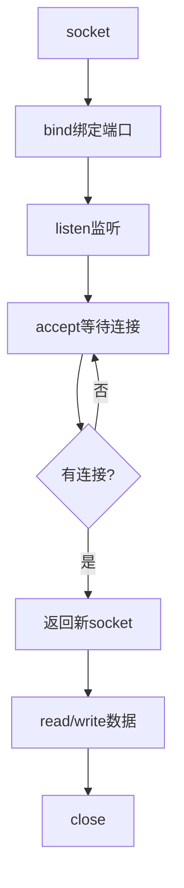
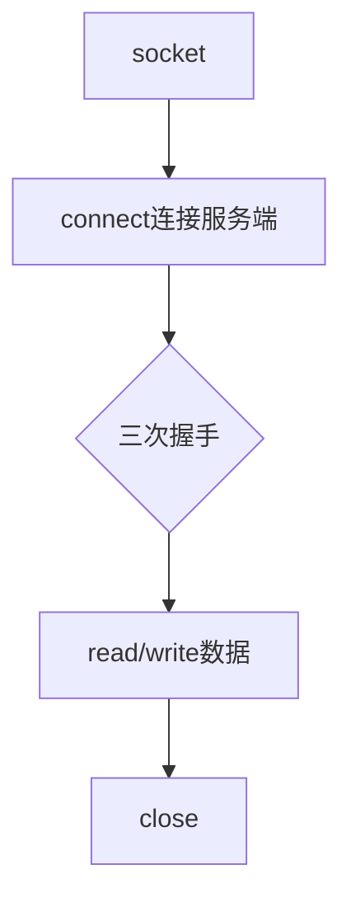
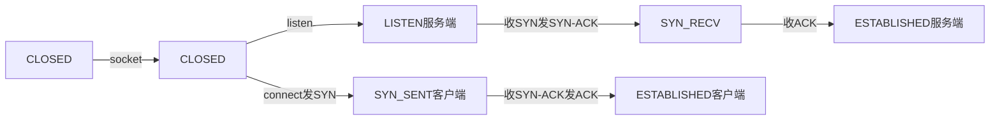
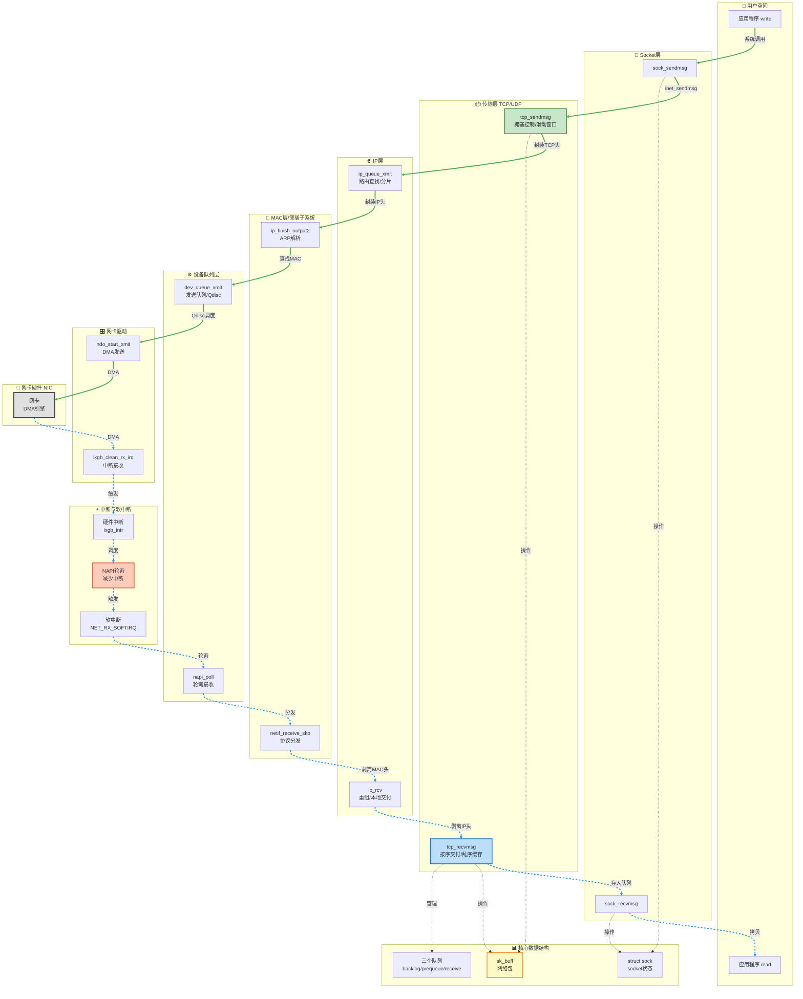
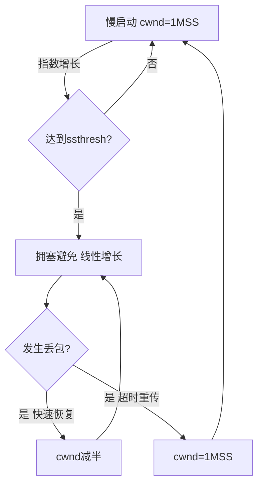
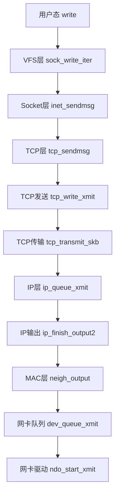
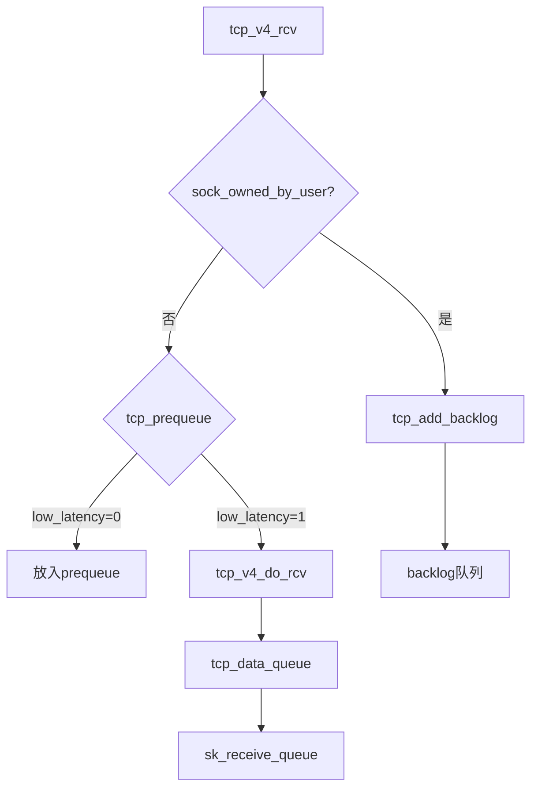
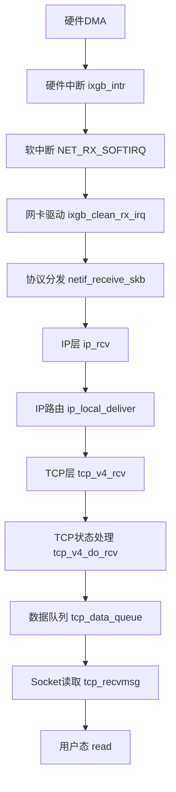

# Linux 底层原理学习笔记 · 第六册：网络协议栈

## 第8章 网络系统（一）：Socket通信基础
### 8.1 网络协议分层


> **核心思想**：网络分层架构，Socket作为用户态和内核态的桥梁，TCP通过数据结构维护连接状态。


#### 8.1.1 为什么要分层？

**问题**：

- 网络环境过于复杂
- 不是集中控制的体系
- 全球亿级服务器和设备各有各的体系

**解决方案**：

- 切分成多个层次和组合
- 通过同一套网络协议栈满足不同需求

#### 8.1.2 OSI七层与TCP/IP四层模型

```
OSI七层模型          TCP/IP模型         协议示例
┌─────────────┐
│  应用层      │ ─┐
├─────────────┤  │
│  表示层      │  ├─→  应用层        HTTP/FTP/DNS
├─────────────┤  │
│  会话层      │ ─┘
├─────────────┤
│  传输层      │ ───→  传输层        TCP/UDP
├─────────────┤
│  网络层      │ ───→  网络层        IP/ICMP/ARP
├─────────────┤
│  数据链路层  │ ─┐
├─────────────┤  ├─→  链路层        Ethernet/WiFi
│  物理层      │ ─┘
└─────────────┘
```

**重点关注链路**：`TCP/UDP → IPv4 → ARP`

#### 8.1.3 IP层（网络层）

**IP地址格式**：`192.168.1.100/24`

- 前24位：网络号
- 后8位：主机号
- 作用：全局定位，类似邮寄地址

**路由转发**：

- 网络包通过多个网络、多个路由器转发
- 从源IP到目标IP
- IP地址始终不变

#### 8.1.4 MAC层（数据链路层）

**MAC地址**：

- 每个网卡的硬件地址
- 无全局定位功能，仅本地网络有效
- 通过ARP协议从IP获取MAC（广播"吼"）

**特点**：

- 同一网络内通信简单
- 每经过一个路由器，MAC地址就要更换
- IP地址不变，MAC地址变化

#### 8.1.5 传输层（TCP/UDP）

**TCP特点**：

- 面向连接（数据结构维护状态）
- 可靠传输（重传、排序、去重）
- 面向字节流
- 流量控制和拥塞控制

**UDP特点**：

- 无连接
- 不可靠
- 面向数据报
- 简单快速

**关键理解**：

- TCP的"连接"不是物理连接
- 而是两端数据结构状态的协同
- 功夫在两端，不在通路

#### 8.1.6 应用层与Socket

**Socket定位**：

- 不属于任何一层
- 属于操作系统概念，非协议分层概念
- 是用户态和内核态的接口

**分工**：

- 二到四层：内核处理
- 七层（应用层）：用户态处理
- Socket：跨内核态和用户态的系统调用

---

### 8.2 数据包封装与转发

#### 8.2.1 发送端层层封装

```
应用层：HTTP请求
  ↓
Socket接口
  ↓ [内核]
传输层：+ TCP头（源端口/目标端口/序列号等）
  ↓
网络层：+ IP头（源IP/目标IP）
  ↓
链路层：+ MAC头（源MAC/目标MAC）
  ↓
物理层：网卡发送
```

#### 8.2.2 中间设备转发

**交换机（二层设备）**：

- 只处理MAC层
- 拆MAC头，查找目标MAC对应的网口
- 从对应网口转发

**路由器（三层设备）**：

- 处理到IP层
- 拆MAC头和IP头
- 查路由表，决定下一跳
- 更换MAC头（源MAC变为自己的MAC，目标MAC变为下一跳MAC）
- IP地址不变

#### 8.2.3 接收端层层解封装

```
物理层：网卡接收
  ↓
链路层：检查MAC地址，匹配则拆MAC头
  ↓
网络层：检查IP地址，匹配则拆IP头
  ↓
传输层：检查序列号，缓存数据，等待应用读取
  ↓
Socket接口
  ↓ [用户态]
应用层：HTTP解析
```

---

### 8.3 Socket系统调用

#### 8.3.1 socket() - 创建套接字

```c
int socket(int domain, int type, int protocol);
```

**参数**：

- `domain`：地址族（AF_INET=IPv4, AF_INET6=IPv6）
- `type`：套接字类型
  - SOCK_STREAM：TCP
  - SOCK_DGRAM：UDP
  - SOCK_RAW：原始IP包
- `protocol`：协议（IPPROTO_TCP、IPPROTO_UDP）

**返回**：文件描述符

#### 8.3.2 TCP服务端流程



**bind**：

```c
int bind(int sockfd, const struct sockaddr *addr, socklen_t addrlen);

struct sockaddr_in {
    sa_family_t sin_family;  // AF_INET
    __be16 sin_port;         // 端口号（大端）
    struct in_addr sin_addr; // IP地址
};
```

**listen**：

```c
int listen(int sockfd, int backlog);
```

- 进入LISTEN状态
- 等待客户端连接

**accept**：

```c
int accept(int sockfd, struct sockaddr *addr, socklen_t *addrlen);
```

- 从连接队列取出一个已完成连接
- 返回新的socket用于数据传输
- 监听socket和已连接socket是两个不同的socket

#### 8.3.3 TCP客户端流程



**connect**：

```c
int connect(int sockfd, const struct sockaddr *addr, socklen_t addrlen);
```

- 内核自动分配临时端口
- 发起三次握手

#### 8.3.4 UDP编程

**特点**：

- 无连接，不需要listen和connect
- 每次通信都需要传入IP和端口

**API**：

```c
ssize_t sendto(int sockfd, const void *buf, size_t len, int flags,
               const struct sockaddr *dest_addr, socklen_t addrlen);
               
ssize_t recvfrom(int sockfd, void *buf, size_t len, int flags,
                 struct sockaddr *src_addr, socklen_t *addrlen);
```

#### 8.3.5 大小端转换

**概念**：

- 大端（Big Endian）：最低位在第一个位置
- 小端（Little Endian）：最低位在最后一个位置
- 网络字节序：大端
- x86机器：小端

---

### 8.4 Socket内核数据结构

#### 8.4.1 三级参数与三级结构

```
socket(family, type, protocol)
   ↓
net_families[family] → net_proto_family
   ↓
inetsw[type] → inet_protosw链表
   ↓
find protocol → inet_protosw
   ↓
两层操作：
  - 第一层：inet_stream_ops（面向用户）
  - 第二层：tcp_prot（面向内核协议栈）
```

#### 8.4.2 核心数据结构关系

```c
// 地址族数组
struct net_proto_family __rcu *net_families[NPROTO];

// IP地址族
static const struct net_proto_family inet_family_ops = {
    .family = PF_INET,
    .create = inet_create,  // socket系统调用会调用
};

// 类型数组（每个type一个链表）
static struct list_head inetsw[SOCK_MAX];

// 协议结构
static struct inet_protosw inetsw_array[] = {
    {
        .type = SOCK_STREAM,
        .protocol = IPPROTO_TCP,
        .prot = &tcp_prot,        // 第二层操作
        .ops = &inet_stream_ops,  // 第一层操作
    },
    {
        .type = SOCK_DGRAM,
        .protocol = IPPROTO_UDP,
        .prot = &udp_prot,
        .ops = &inet_dgram_ops,
    },
    ...
};
```

#### 8.4.3 socket与sock的区别

```
struct socket（用户层）
  ├─ ops = inet_stream_ops
  ├─ file（关联文件系统）
  └─ sk ───→ struct sock（内核层）
              ├─ sk_prot = tcp_prot
              ├─ sk_protocol = IPPROTO_TCP
              └─ (扩展) struct inet_sock
```

**分工**：

- `socket`：对上给用户提供接口，关联文件系统
- `sock`：对下对接内核网络协议栈

#### 8.4.4 两层操作函数

**第一层（inet_stream_ops）**：

```c
const struct proto_ops inet_stream_ops = {
    .bind = inet_bind,
    .listen = inet_listen,
    .accept = inet_accept,
    .connect = inet_stream_connect,
    .sendmsg = inet_sendmsg,
    .recvmsg = inet_recvmsg,
};
```

**第二层（tcp_prot）**：

```c
struct proto tcp_prot = {
    .name = "TCP",
    .close = tcp_close,
    .connect = tcp_v4_connect,
    .accept = inet_csk_accept,
    .init = tcp_v4_init_sock,
    .sendmsg = tcp_sendmsg,
    .recvmsg = tcp_recvmsg,
    .hash = inet_hash,
    .get_port = inet_csk_get_port,
};
```

---

### 8.5 系统调用内核实现

#### 8.5.1 socket创建流程

```
SYSCALL_DEFINE3(socket, ...)
  ↓
sock_create
  ↓
__sock_create
  ├─ sock_alloc()  // 分配struct socket
  ├─ net_families[family]->create  // 调用inet_create
  └─ sock_map_fd()  // 关联文件描述符

inet_create
  ├─ 查找inetsw[type]链表，匹配protocol
  ├─ sock->ops = answer->ops  // inet_stream_ops
  ├─ sk_alloc()  // 分配struct sock
  ├─ sk->sk_prot = answer->prot  // tcp_prot
  └─ sock_init_data(sock, sk)  // 关联socket和sock
```

#### 8.5.2 bind绑定流程

```
SYSCALL_DEFINE3(bind, ...)
  ↓
sockfd_lookup_light  // 根据fd找到socket
  ↓
sock->ops->bind  // inet_bind
  ↓
sk->sk_prot->get_port  // inet_csk_get_port
  ↓
绑定端口到inet_hashinfo的bhash哈希表
```

#### 8.5.3 listen监听流程

```
SYSCALL_DEFINE2(listen, ...)
  ↓
sock->ops->listen  // inet_listen
  ↓
inet_csk_listen_start
  ├─ sk->sk_state = TCP_LISTEN
  ├─ sk->sk_prot->get_port  // inet_csk_get_port
  └─ reqsk_queue_alloc  // 分配连接请求队列
```

**连接队列**：

- `syn_queue`：半连接队列（收到SYN）
- `accept_queue`：全连接队列（完成三次握手）

#### 8.5.4 accept接受连接

```
SYSCALL_DEFINE3(accept, ...)
  ↓
sock->ops->accept  // inet_accept
  ↓
sk->sk_prot->accept  // inet_csk_accept
  ↓
从accept_queue取出已完成连接的sock
  ↓
创建新的socket结构
  ↓
返回新的文件描述符
```

#### 8.5.5 connect连接流程

```
SYSCALL_DEFINE3(connect, ...)
  ↓
sock->ops->connect  // inet_stream_connect
  ↓
sk->sk_prot->connect  // tcp_v4_connect
  ├─ 选择源IP和源端口
  ├─ 查找路由
  ├─ 创建sk_buff
  └─ tcp_connect  // 发送SYN
       └─ tcp_transmit_skb
```

---

### 8.6 TCP三次握手

#### 8.6.1 状态转换图



#### 8.6.2 详细流程

**第一次握手（客户端 → 服务端）**：

```
客户端：
  connect()
    ↓
  tcp_v4_connect
    ↓
  tcp_connect
    ↓
  tcp_transmit_skb(SYN)
    ↓
  状态：SYN_SENT

服务端：
  收到SYN包
    ↓
  tcp_v4_rcv
    ↓
  tcp_v4_do_rcv
    ↓
  tcp_rcv_state_process（LISTEN状态）
    ↓
  tcp_v4_conn_request
    ├─ 创建request_sock
    ├─ 加入syn_queue
    └─ 发送SYN-ACK
  状态：SYN_RECV
```

**第二次握手（服务端 → 客户端）**：

```
客户端：
  收到SYN-ACK
    ↓
  tcp_rcv_state_process（SYN_SENT状态）
    ↓
  tcp_rcv_synsent_state_process
    ├─ 检查ACK
    ├─ 发送ACK
    └─ 状态：ESTABLISHED
```

**第三次握手（客户端 → 服务端）**：

```
服务端：
  收到ACK
    ↓
  tcp_v4_rcv
    ↓
  tcp_check_req
    ├─ 从syn_queue移除request_sock
    ├─ 创建完整的sock
    ├─ 加入accept_queue
    └─ 状态：ESTABLISHED
    
  用户调用accept()时
    ↓
  从accept_queue取出sock
    ↓
  返回新的socket给应用层
```

#### 8.6.3 关键数据结构

**连接请求（半连接）**：

```c
struct request_sock {
    struct sock *sk;
    // 客户端信息
};
```

**连接队列**：

```c
struct inet_connection_sock {
    struct request_sock_queue icsk_accept_queue;
};

struct request_sock_queue {
    struct request_sock *rskq_accept_head;  // 全连接队列
    struct request_sock *rskq_accept_tail;
    struct listen_sock *listen_opt;         // syn_queue
};
```

---

### 8.7 总结

#### 8.7.1 Socket系统调用流程

**TCP服务端**：

1. socket() → 创建socket，得到fd
2. bind() → 绑定IP和端口
3. listen() → 进入LISTEN状态，分配连接队列
4. accept() → 从全连接队列取连接，返回新socket
5. read()/write() → 数据传输
6. close() → 关闭连接

**TCP客户端**：

1. socket() → 创建socket
2. connect() → 发起三次握手
3. read()/write() → 数据传输
4. close() → 关闭连接

#### 8.7.2 内核数据结构层次

```
三级参数：
  family (AF_INET) → net_proto_family
    ↓
  type (SOCK_STREAM) → inet_protosw链表
    ↓
  protocol (IPPROTO_TCP) → 特定协议

两层操作：
  第一层：inet_stream_ops（用户接口层）
  第二层：tcp_prot（协议栈层）
  
两个结构：
  socket（面向用户）
  sock（面向内核）
```

#### 8.7.3 核心理解

1. **TCP连接的本质**：两端数据结构状态的协同，不是物理连接
2. **两个socket**：监听socket（listen）vs 已连接socket（accept返回）
3. **两个队列**：syn_queue（半连接）vs accept_queue（全连接）
4. **三次握手在内核完成**：应用层调用accept时，连接已建立
5. **Socket是桥梁**：连接用户态应用和内核态协议栈

---

**本节完成**：网络基础与Socket通信。

**内容回顾**：

- ✅ 网络协议分层（重点TCP/IP模型）
- ✅ 数据包封装与转发流程
- ✅ Socket API使用（TCP/UDP）
- ✅ Socket内核数据结构（三级参数，两层操作）
- ✅ 系统调用内核实现（socket/bind/listen/accept/connect）
- ✅ TCP三次握手状态转换

**下一节预告**：发送网络包的详细流程。

---

## 第8章 网络系统（二）：发送网络包
### 8.8 发送网络包完整流程


> **核心思想**：数据从用户态write调用，经过VFS→Socket→TCP→IP→MAC层层封装，最终通过网卡发送。


#### 网络协议栈双向数据流架构图



**协议栈架构要点**：

1. **发送路径**（绿色实线）：
   - 用户空间 → Socket → TCP → IP → MAC → 网卡驱动 → 硬件
   - 数据层层封装：添加TCP头 → IP头 → MAC头
   - sk_buff的data指针不断前移

2. **接收路径**（蓝色虚线）：
   - 硬件 → 中断 → NAPI轮询 → 软中断 → MAC → IP → TCP → Socket → 用户空间
   - 数据层层解封装：剥离MAC头 → IP头 → TCP头
   - sk_buff的data指针不断后移

3. **NAPI机制**（关键优化）：
   - 第一个包：硬件中断
   - 后续包：轮询poll（避免中断风暴）
   - 批量处理提高效率

4. **核心数据结构**：
   - `sk_buff`：网络包的统一表示（从驱动到应用层）
   - `struct sock`：socket状态（连接、窗口、队列）
   - 三个队列：backlog、prequeue、sk_receive_queue

5. **关键Netfilter hook点**：
   - 发送：LOCAL_OUT、POSTROUTING
   - 接收：PREROUTING、LOCAL_IN

#### 8.8.1 整体调用链

```
用户态：write()
  ↓
VFS层：sock_write_iter()
  ↓
Socket层：sock_sendmsg() → inet_sendmsg()
  ↓
TCP层：tcp_sendmsg() → tcp_write_xmit() → tcp_transmit_skb()
  ↓
IP层：ip_queue_xmit() → ip_local_out() → ip_output()
  ↓
MAC层：ip_finish_output2() → neigh_output() → dev_queue_xmit()
  ↓
网卡驱动：hard_start_xmit()
```

---

### 8.9 VFS层与Socket层

#### 8.9.1 write系统调用

```c
write(sockfd, buf, len)
  ↓
socket_file_ops.write_iter = sock_write_iter
  ↓
sock_write_iter
  ├─ file->private_data → struct socket
  └─ sock_sendmsg(socket, msghdr)
```

**关键数据结构**：

```c
static const struct file_operations socket_file_ops = {
    .read_iter = sock_read_iter,
    .write_iter = sock_write_iter,
    .poll = sock_poll,
    .mmap = sock_mmap,
    .release = sock_close,
};
```

#### 8.9.2 Socket层转发

```c
sock_sendmsg
  ↓
sock_sendmsg_nosec
  ↓
socket->ops->sendmsg  // inet_sendmsg
  ↓
sk->sk_prot->sendmsg  // tcp_sendmsg
```

---

### 8.10 TCP层：tcp_sendmsg

#### 8.10.1 核心任务

1. **拷贝用户数据到sk_buff**
2. **发送sk_buff**

#### 8.10.2 sk_buff数据结构

```c
struct sk_buff {
    struct sk_buff *next;       // 链表指针
    struct sk_buff *prev;
    
    // 各层头部位置
    __u16 transport_header;     // TCP头
    __u16 network_header;       // IP头
    __u16 mac_header;           // MAC头
    
    // 数据区域指针
    unsigned char *head;        // 内存块起始
    unsigned char *data;        // 当前数据起始（可变）
    sk_buff_data_t tail;        // 数据结尾
    sk_buff_data_t end;         // 内存块结尾
    
    unsigned int truesize;      // 总大小
};
```

**sk_buff设计思想**：

- `head`：分配的内存块起始
- `data`：可变指针，发送时减小（添加头部），接收时增大（剥离头部）
- `tail`：数据结尾
- `end`：内存块结尾

```
接收时（剥离头部）：data往后移
┌────────────────────────────────────┐
│  MAC头  │  IP头  │  TCP头  │  数据  │
└────────────────────────────────────┘
 head    data→      →      →tail   end

发送时（添加头部）：data往前移
┌────────────────────────────────────┐
│        │         │        │  数据   │
└────────────────────────────────────┘
 head   ←data    tail            end
        添加TCP头 添加IP头 添加MAC头
```

#### 8.10.3 MSS与MTU

**MTU（Maximum Transmission Unit）**：

- 二层（数据链路层）定义
- 以太网MTU = 1500字节
- 完整帧 = 6(目标MAC) + 6(源MAC) + 2(类型) + 1500(数据) + 4(CRC) = 1518字节

**MSS（Maximum Segment Size）**：

- TCP层定义
- MSS = MTU - IP头(20字节) - TCP头(20字节) = 1460字节
- 单个TCP段的最大数据量

#### 8.10.4 拷贝数据循环

```c
while (msg_data_left(msg)) {
    // 1. 从TCP写队列取最后一个sk_buff
    skb = tcp_write_queue_tail(sk);
    
    // 2. 计算MSS
    mss_now = tcp_send_mss(sk, &size_goal, flags);
    max = size_goal;
    copy = max - skb->len;  // 剩余空间
    
    // 3. 如果空间不足，分配新sk_buff
    if (copy <= 0 || !tcp_skb_can_collapse_to(skb)) {
        skb = sk_stream_alloc_skb(sk, ...);
        skb_entail(sk, skb);  // 加入队列尾部
    }
    
    // 4. 拷贝数据
    if (skb_availroom(skb) > 0) {
        // 拷贝到连续内存区域
        skb_add_data_nocache(sk, skb, &msg->msg_iter, copy);
    } else {
        // 拷贝到分散聚合页面（Scatter/Gather）
        skb_copy_to_page_nocache(sk, &msg->msg_iter, skb, ...);
    }
    
    // 5. 更新序列号
    tp->write_seq += copy;
    TCP_SKB_CB(skb)->end_seq += copy;
    
    copied += copy;
}
```

**分散聚合（Scatter/Gather）I/O**：

- 减少内存拷贝
- 数据可以分散在不连续页面
- 网卡支持时直接在设备层聚合

---

### 8.11 TCP发送：tcp_write_xmit

#### 8.11.1 发送队列循环

```c
while ((skb = tcp_send_head(sk))) {
    // 1. TSO（TCP Segmentation Offload）
    tso_segs = tcp_init_tso_segs(skb, mss_now);
    
    // 2. 拥塞窗口检查
    cwnd_quota = tcp_cwnd_test(tp, skb);
    
    // 3. 接收窗口检查
    if (!tcp_snd_wnd_test(tp, skb, mss_now)) {
        is_rwnd_limited = true;
        break;
    }
    
    // 4. 分片检查
    if (skb->len > limit && 
        tso_fragment(sk, skb, limit, mss_now, gfp))
        break;
    
    // 5. 发送sk_buff
    tcp_transmit_skb(sk, skb, 1, gfp);
    
    // 6. 更新发送状态
    tcp_event_new_data_sent(sk, skb);
}
```

#### 8.11.2 TSO（TCP Segmentation Offload）

**概念**：

- 将大数据包的分段工作延迟到网卡硬件
- 降低CPU负载
- 需要网卡支持

**实现**：

```c
// 计算需要分成几段
segments = DIV_ROUND_UP(skb->len, mss_now);

// 大部分情况下不在这里分片，等到网卡
if (tso_segs > 1) {
    // 计算分片点
    max_len = mss_now * max_seg

s;
    // 判断是否需要现在分片
    if (skb->len > limit)
        tso_fragment(sk, skb, limit, mss_now, gfp);
}
```

#### 8.11.3 拥塞控制（Congestion Control）

**拥塞窗口（cwnd）**：

- 控制发送速率，防止网络拥塞
- 动态调整大小

**拥塞控制算法**：



**状态转换**：

1. **慢启动（Slow Start）**：
   - 初始cwnd = 1 MSS
   - 每收到一个ACK，cwnd翻倍
   - 指数增长

2. **拥塞避免（Congestion Avoidance）**：
   - 达到ssthresh（慢启动阈值）
   - 每个RTT，cwnd += 1
   - 线性增长

3. **快速恢复（Fast Recovery）**：
   - 检测到丢包（3个重复ACK）
   - cwnd = cwnd / 2
   - ssthresh = cwnd

4. **超时重传**：
   - 超时检测到丢包
   - cwnd = 1 MSS
   - 重新慢启动

#### 8.11.4 滑动窗口（Sliding Window）

**接收窗口（rwnd）**：

- 接收方告诉发送方的接收能力
- 防止接收方缓存溢出

**发送方缓存（4个部分）**：

```
┌─────────────┬──────────────┬──────────────┬──────────────┐
│ 1.已发送     │ 2.已发送     │ 3.未发送     │ 4.未发送     │
│   已确认     │   未确认     │   可发送     │   不可发送   │
└─────────────┴──────────────┴──────────────┴──────────────┘
                ←─ 滑动窗口 rwnd ─→
```

1. **已发送已确认**：可以回收
2. **已发送未确认**：等待ACK，不能删除（可能重传）
3. **未发送可发送**：在窗口内，可以立即发送
4. **未发送不可发送**：超出接收方能力

**接收方缓存（3个部分）**：

```
┌─────────────┬──────────────┬──────────────┐
│ 1.已接收     │ 2.未接收     │ 3.未接收     │
│   已确认     │   可接收     │   不可接收   │
└─────────────┴──────────────┴──────────────┘
               ←─ AdvertisedWindow ─→
```

**发送控制**：

```c
// 检查是否在滑动窗口范围内
if (!tcp_snd_wnd_test(tp, skb, mss_now)) {
    is_rwnd_limited = true;
    break;  // 超出窗口，停止发送
}

// 计算窗口大小
window = tcp_wnd_end(tp) - TCP_SKB_CB(skb)->seq;

// 可能需要分片以适应窗口
if (max_len > window)
    tso_fragment(...);
```

---

### 8.12 TCP传输：tcp_transmit_skb

#### 8.12.1 填充TCP头

```c
// 1. 为TCP头预留空间
skb_push(skb, tcp_header_size);

// 2. 获取TCP头部
th = (struct tcphdr *)skb->data;

// 3. 填充TCP头
th->source = inet->inet_sport;        // 源端口
th->dest = inet->inet_dport;          // 目标端口
th->seq = htonl(tcb->seq);            // 序列号
th->ack_seq = htonl(tp->rcv_nxt);     // 确认序列号
th->window = htons(tp->rcv_wnd);      // 窗口大小
th->check = 0;                        // 校验和（稍后计算）
th->urg_ptr = 0;                      // 紧急指针

// 4. 设置标志位
*(((__be16 *)th) + 6) = htons(((tcp_header_size >> 2) << 12) |
                               tcb->tcp_flags);

// 5. 填充选项
tcp_options_write((__be32 *)(th + 1), tp, &opts);
```

**TCP头格式**：

```
 0                   1                   2                   3
 0 1 2 3 4 5 6 7 8 9 0 1 2 3 4 5 6 7 8 9 0 1 2 3 4 5 6 7 8 9 0 1
+-+-+-+-+-+-+-+-+-+-+-+-+-+-+-+-+-+-+-+-+-+-+-+-+-+-+-+-+-+-+-+-+
|          Source Port          |       Destination Port        |
+-+-+-+-+-+-+-+-+-+-+-+-+-+-+-+-+-+-+-+-+-+-+-+-+-+-+-+-+-+-+-+-+
|                        Sequence Number                        |
+-+-+-+-+-+-+-+-+-+-+-+-+-+-+-+-+-+-+-+-+-+-+-+-+-+-+-+-+-+-+-+-+
|                    Acknowledgment Number                      |
+-+-+-+-+-+-+-+-+-+-+-+-+-+-+-+-+-+-+-+-+-+-+-+-+-+-+-+-+-+-+-+-+
|  Data |       |C|E|U|A|P|R|S|F|                               |
| Offset| Rsrvd |W|C|R|C|S|S|Y|I|            Window             |
|       |       |R|E|G|K|H|T|N|N|                               |
+-+-+-+-+-+-+-+-+-+-+-+-+-+-+-+-+-+-+-+-+-+-+-+-+-+-+-+-+-+-+-+-+
|           Checksum            |         Urgent Pointer        |
+-+-+-+-+-+-+-+-+-+-+-+-+-+-+-+-+-+-+-+-+-+-+-+-+-+-+-+-+-+-+-+-+
|                    Options                    |    Padding    |
+-+-+-+-+-+-+-+-+-+-+-+-+-+-+-+-+-+-+-+-+-+-+-+-+-+-+-+-+-+-+-+-+
```

#### 8.12.2 调用IP层

```c
// 调用IP层发送
err = icsk->icsk_af_ops->queue_xmit(sk, skb, &inet->cork.fl);

// icsk_af_ops = ipv4_specific
const struct inet_connection_sock_af_ops ipv4_specific = {
    .queue_xmit = ip_queue_xmit,
    .send_check = tcp_v4_send_check,
    ...
};
```

---

### 8.13 IP层：ip_queue_xmit

#### 8.13.1 三大任务

1. **选择路由**：确定从哪个网卡发出
2. **填充IP头**：添加IP层信息
3. **发送IP包**：调用`ip_local_out`

#### 8.13.2 路由查找

```c
// 1. 查找路由
rt = ip_route_output_ports(net, fl4, sk,
                           daddr, saddr,
                           dport, sport, protocol, ...);

// 调用链：
ip_route_output_ports
  → ip_route_output_flow
    → __ip_route_output_key
      → ip_route_output_key_hash
        → ip_route_output_key_hash_rcu
```

**路由表查找**：

```c
// 1. 查找FIB（Forwarding Information Base）
fib_lookup(net, fl4, res, 0);

// 2. 在主路由表中查找
tb = fib_get_table(net, RT_TABLE_MAIN);
fib_table_lookup(tb, flp, res, flags);
```

**Trie树结构**：

- 路由表使用Trie树（前缀树）存储
- 支持最长前缀匹配
- 快速查找路由

```
示例路由表：
default via 192.168.1.1 dev eth0
192.168.1.0/24 dev eth0 src 192.168.1.100
192.168.2.0/24 dev eth1 src 192.168.2.1
```

**创建路由表项**：

```c
// 分配rtable结构
rth = rt_dst_alloc(dev, flags, type, ...);

// 设置输出函数
rt->dst.output = ip_output;
```

#### 8.13.3 填充IP头

```c
// 1. 为IP头预留空间
skb_push(skb, sizeof(struct iphdr) + inet_opt_len);
skb_reset_network_header(skb);

// 2. 获取IP头
iph = ip_hdr(skb);

// 3. 填充IP头
*((__be16 *)iph) = htons((4 << 12) | (5 << 8) | tos);  // 版本+头长+TOS
iph->frag_off = htons(IP_DF);              // 禁止分片
iph->ttl = ip_select_ttl(inet, &rt->dst); // TTL
iph->protocol = sk->sk_protocol;           // 上层协议(TCP)
ip_copy_addrs(iph, fl4);                   // 源IP和目标IP

// 4. 填充选项
if (inet_opt && inet_opt->opt.optlen) {
    ip_options_build(skb, &inet_opt->opt, inet->inet_daddr, rt, 0);
}

// 5. 选择IP标识
ip_select_ident_segs(net, skb, sk, skb_shinfo(skb)->gso_segs ?: 1);
```

**IP头格式**：

```
 0                   1                   2                   3
 0 1 2 3 4 5 6 7 8 9 0 1 2 3 4 5 6 7 8 9 0 1 2 3 4 5 6 7 8 9 0 1
+-+-+-+-+-+-+-+-+-+-+-+-+-+-+-+-+-+-+-+-+-+-+-+-+-+-+-+-+-+-+-+-+
|Version|  IHL  |Type of Service|          Total Length         |
+-+-+-+-+-+-+-+-+-+-+-+-+-+-+-+-+-+-+-+-+-+-+-+-+-+-+-+-+-+-+-+-+
|         Identification        |Flags|      Fragment Offset    |
+-+-+-+-+-+-+-+-+-+-+-+-+-+-+-+-+-+-+-+-+-+-+-+-+-+-+-+-+-+-+-+-+
|  Time to Live |    Protocol   |         Header Checksum       |
+-+-+-+-+-+-+-+-+-+-+-+-+-+-+-+-+-+-+-+-+-+-+-+-+-+-+-+-+-+-+-+-+
|                       Source Address                          |
+-+-+-+-+-+-+-+-+-+-+-+-+-+-+-+-+-+-+-+-+-+-+-+-+-+-+-+-+-+-+-+-+
|                    Destination Address                        |
+-+-+-+-+-+-+-+-+-+-+-+-+-+-+-+-+-+-+-+-+-+-+-+-+-+-+-+-+-+-+-+-+
|                    Options                    |    Padding    |
+-+-+-+-+-+-+-+-+-+-+-+-+-+-+-+-+-+-+-+-+-+-+-+-+-+-+-+-+-+-+-+-+
```

**关键字段**：

- **TOS**：服务类型
- **frag_off**：分片偏移（IP_DF表示禁止分片）
- **TTL**：生存时间，每经过路由器减1
- **Protocol**：上层协议（6=TCP, 17=UDP）

#### 8.13.4 Netfilter与iptables

```c
// 1. ip_local_out调用__ip_local_out
ip_local_out(net, sk, skb)
  → __ip_local_out(net, sk, skb)
    → nf_hook(NFPROTO_IPV4, NF_INET_LOCAL_OUT, ...)

// 2. ip_output也有hook点
ip_output(net, sk, skb)
  → NF_HOOK(NFPROTO_IPV4, NF_INET_POST_ROUTING, ...)
```

**iptables表和链**：

**filter表**（过滤）：

- INPUT链：目标是本机的包
- FORWARD链：路过本机的包
- OUTPUT链：本机产生的包

**nat表**（地址转换）：

- PREROUTING链：到达时改变目标地址（DNAT）
- OUTPUT链：改变本地产生包的目标地址
- POSTROUTING链：离开时改变源地址（SNAT）

**发送时经过的hook点**：

1. NF_INET_LOCAL_OUT（OUTPUT链）
2. NF_INET_POST_ROUTING（POSTROUTING链）

#### 8.13.5 IP层输出

```c
// dst_output调用rtable的output
dst_output(net, sk, skb)
  → skb_dst(skb)->output(net, sk, skb)
    → ip_output(net, sk, skb)  // rt->dst.output指向ip_output
      → NF_HOOK(..., ip_finish_output)
```

---

### 8.14 MAC层：邻居子系统与ARP

#### 8.14.1 ip_finish_output2

```c
// 1. 获取下一跳IP
nexthop = rt_nexthop(rt, ip_hdr(skb)->daddr);

// 2. 查找邻居结构（MAC地址）
neigh = __ipv4_neigh_lookup_noref(dev, nexthop);
if (!neigh)
    neigh = __neigh_create(&arp_tbl, &nexthop, dev, false);

// 3. 发送
res = neigh_output(neigh, skb);
```

#### 8.14.2 ARP表结构

```c
struct neigh_table arp_tbl = {
    .family = AF_INET,
    .key_len = 4,           // IP地址长度
    .protocol = cpu_to_be16(ETH_P_IP),
    .hash = arp_hash,
    .key_eq = arp_key_eq,
    .constructor = arp_constructor,
    .id = "arp_cache",
    .gc_interval = 30 * HZ,
    .gc_thresh1 = 128,
    .gc_thresh2 = 512,
    .gc_thresh3 = 1024,
};
```

#### 8.14.3 邻居结构创建

```c
// 1. 分配neighbour结构
n = neigh_alloc(tbl, dev);

// 2. 初始化
skb_queue_head_init(&n->arp_queue);  // ARP请求队列
n->output = neigh_blackhole;         // 默认输出函数
setup_timer(&n->timer, neigh_timer_handler, ...);  // 定时器

// 3. 设置操作函数
n->ops = &arp_hh_ops;
n->output = n->ops->output;  // neigh_resolve_output

// 4. 加入哈希表
hash_val = tbl->hash(pkey, dev, nht->hash_rnd);
rcu_assign_pointer(nht->hash_buckets[hash_val], n);
```

**邻居状态（NUD State）**：

- `NUD_NONE`：初始状态
- `NUD_INCOMPLETE`：正在解析（发送ARP请求）
- `NUD_REACHABLE`：可达（有MAC地址）
- `NUD_STALE`：过期
- `NUD_DELAY`：延迟探测

#### 8.14.4 ARP解析流程

```c
neigh_resolve_output(neigh, skb)
  ↓
neigh_event_send(neigh, skb)
  ↓
__neigh_event_send(neigh, skb)
  ├─ 如果状态为NUD_INCOMPLETE
  │   ├─ 设置定时器
  │   ├─ 将skb加入arp_queue
  │   └─ 立即发送ARP请求
  └─ 如果状态为NUD_STALE
      └─ 设置为NUD_DELAY，稍后探测
```

**ARP请求发送**：

```c
// 定时器触发
neigh_timer_handler
  ↓
neigh_probe(neigh)
  ↓
neigh->ops->solicit  // arp_solicit
  ↓
arp_send(ARPOP_REQUEST, ETH_P_ARP,
         target, dev, saddr,
         dst_hw, src_hw, NULL);
```

**ARP回复处理**：

- 收到ARP回复后更新邻居表
- 状态变为NUD_REACHABLE
- 调用`dev_queue_xmit`发送队列中的包

#### 8.14.5 发送到网卡

```c
neigh_resolve_output
  → dev_queue_xmit(skb)
```

---

### 8.15 网卡驱动层

#### 8.15.1 dev_queue_xmit

```c
dev_queue_xmit(skb)
  ↓
__dev_queue_xmit(skb, NULL)
  ├─ 选择发送队列（多队列网卡）
  ├─ 流量控制（qdisc）
  └─ dev_hard_start_xmit
       ↓
     xmit_one
       ↓
     netdev_start_xmit
       ↓
     dev->netdev_ops->ndo_start_xmit  // 网卡驱动函数
```

#### 8.15.2 Qdisc（流量控制）

**队列规则（Queueing Discipline）**：

- `pfifo_fast`：默认队列（3个band）
- `tbf`：令牌桶（Token Bucket Filter）
- `htb`：层次令牌桶（Hierarchical Token Bucket）
- `sfq`：随机公平队列（Stochastic Fair Queuing）

**作用**：

- 流量整形（Traffic Shaping）
- 优先级控制
- 带宽限制

#### 8.15.3 网卡驱动发送

```c
// 网卡驱动的发送函数（以e1000为例）
static netdev_tx_t e1000_xmit_frame(struct sk_buff *skb,
                                    struct net_device *netdev)
{
    // 1. 获取DMA映射
    dma_addr = dma_map_single(dev, skb->data, skb->len, DMA_TO_DEVICE);
    
    // 2. 填充发送描述符
    tx_desc->buffer_addr = cpu_to_le64(dma_addr);
    tx_desc->lower.data = ...;
    
    // 3. 更新发送队列尾指针
    writel(tx_ring->next_to_use, hw->hw_addr + tx_ring->tdt);
    
    // 4. 网卡硬件开始DMA传输
    return NETDEV_TX_OK;
}
```

**DMA传输**：

- 网卡直接从内存读取数据
- 不经过CPU
- 高效传输

---

### 8.16 完整流程总结

#### 8.16.1 层次划分



#### 8.16.2 关键数据结构

```
struct file (VFS)
  ↓
struct socket (Socket层)
  ├─ ops = inet_stream_ops
  └─ sk → struct sock (Sock层)
           ├─ sk_prot = tcp_prot
           └─ sk_write_queue (发送队列)
                ↓
            struct sk_buff (网络包)
              ├─ transport_header → TCP头
              ├─ network_header → IP头
              ├─ mac_header → MAC头
              └─ data → 数据
```

#### 8.16.3 核心机制

1. **sk_buff管理**：
   - 链表组织
   - 头部指针动态调整
   - 分散聚合支持

2. **TCP拥塞控制**：
   - 慢启动 → 拥塞避免
   - 快速恢复 / 超时重传
   - 动态调整cwnd

3. **滑动窗口**：
   - 发送方4部分缓存
   - 接收方3部分缓存
   - 流量控制

4. **路由选择**：
   - FIB查找
   - Trie树最长匹配
   - 确定出口网卡

5. **邻居子系统**：
   - ARP表维护
   - MAC地址解析
   - 状态机管理

6. **Netfilter**：
   - iptables规则
   - filter表和nat表
   - hook点拦截

7. **网卡发送**：
   - Qdisc流量控制
   - DMA传输
   - 硬件卸载（TSO/GSO）

#### 8.16.4 核心理解

1. **sk_buff是核心**：所有层次都操作sk_buff
2. **层层封装**：data指针不断前移，添加各层头部
3. **拥塞控制**：TCP通过cwnd控制发送速率
4. **滑动窗口**：接收方通过rwnd控制发送方
5. **路由决定出口**：IP层查找路由表
6. **ARP解析MAC**：同一局域网通过MAC通信
7. **Netfilter可干预**：iptables在关键点拦截
8. **硬件卸载优化**：TSO、GSO减轻CPU负担

---

**本节完成**：发送网络包。

**内容回顾**：

- ✅ VFS层到Socket层转发
- ✅ TCP层数据拷贝与sk_buff管理
- ✅ TCP拥塞控制与滑动窗口
- ✅ TCP头填充与传输
- ✅ IP层路由选择与IP头填充
- ✅ Netfilter与iptables
- ✅ MAC层邻居子系统与ARP
- ✅ 网卡驱动与DMA传输

**下一节预告**：接收网络包的详细流程。

---

## 第8章 网络系统（三）：接收网络包
### 8.17 接收网络包完整流程  


> **核心思想**：网络包从网卡到达，经过硬件中断→软中断→IP层→TCP层→Socket层，最终被用户进程read读取。


#### 8.17.1 整体调用链（反向）

```
硬件：网卡接收 → DMA传输
  ↓
硬件中断：ixgb_intr() → __napi_schedule()
  ↓
软中断：NET_RX_SOFTIRQ → net_rx_action() → napi_poll()
  ↓
网卡驱动：ixgb_clean_rx_irq() → netif_receive_skb()
  ↓
协议层分发：__netif_receive_skb() → ip_rcv()
  ↓
IP层：ip_rcv_finish() → ip_local_deliver()
  ↓
TCP层：tcp_v4_rcv() → tcp_v4_do_rcv()
  ↓
数据队列：tcp_data_queue() → sk_receive_queue
  ↓
Socket层：sock_recvmsg() → inet_recvmsg() → tcp_recvmsg()
  ↓
用户态：read()
```

---

### 8.18 硬件中断与NAPI

#### 8.18.1 问题：中断风暴

**传统中断模式的问题**：

- 网络包到达频繁
- 每个包都触发中断
- CPU频繁被打断，效率低下

**解决方案：NAPI（New API）**：

- 第一个包：触发硬件中断
- 后续包：主动轮询（poll）
- 批量处理，减少中断次数

#### 8.18.2 网卡驱动初始化

```c
// 注册网卡驱动
static int __init ixgb_init_module(void)
{
    return pci_register_driver(&ixgb_driver);
}

// probe函数
static int ixgb_probe(struct pci_dev *pdev, ...)
{
    // 1. 分配net_device
    netdev = alloc_etherdev(sizeof(struct ixgb_adapter));
    
    // 2. 注册NAPI poll函数
    netif_napi_add(netdev, &adapter->napi, ixgb_clean, 64);
    
    // 3. 设置网卡操作函数
    netdev->netdev_ops = &ixgb_netdev_ops;
    
    return 0;
}
```

**关键结构**：

- `net_device`：网络设备结构
- `napi_struct`：NAPI结构，包含poll函数
- `ixgb_clean`：轮询函数，处理接收到的包

#### 8.18.3 网卡激活与中断注册

```c
// 网卡up时注册中断
int ixgb_up(struct ixgb_adapter *adapter)
{
    // 注册硬件中断处理函数
    err = request_irq(adapter->pdev->irq, ixgb_intr, 
                      irq_flags, netdev->name, netdev);
    return 0;
}
```

#### 8.18.4 硬件中断处理

```c
// 硬件中断处理函数
static irqreturn_t ixgb_intr(int irq, void *data)
{
    struct net_device *netdev = data;
    struct ixgb_adapter *adapter = netdev_priv(netdev);
    
    // 如果可以调度NAPI
    if (napi_schedule_prep(&adapter->napi)) {
        // 1. 关闭网卡中断（避免中断风暴）
        IXGB_WRITE_REG(&adapter->hw, IMC, ~0);
        
        // 2. 调度NAPI（触发软中断）
        __napi_schedule(&adapter->napi);
    }
    
    return IRQ_HANDLED;
}
```

**关键步骤**：

1. 关闭网卡中断（暂时）
2. 调度NAPI（触发软中断）
3. 后续通过轮询处理包，不再触发中断

---

### 8.19 软中断处理

#### 8.19.1 __napi_schedule

```c
void __napi_schedule(struct napi_struct *n)
{
    unsigned long flags;
    
    local_irq_save(flags);
    
    // 将napi_struct加入softnet_data的poll_list
    ____napi_schedule(this_cpu_ptr(&softnet_data), n);
    
    local_irq_restore(flags);
}

static inline void ____napi_schedule(struct softnet_data *sd,
                                      struct napi_struct *napi)
{
    // 加入poll_list
    list_add_tail(&napi->poll_list, &sd->poll_list);
    
    // 触发软中断NET_RX_SOFTIRQ
    __raise_softirq_irqoff(NET_RX_SOFTIRQ);
}
```

**softnet_data结构**：

```c
struct softnet_data {
    struct list_head poll_list;      // 接收：待轮询设备列表
    struct Qdisc *output_queue;       // 发送：发送队列
    struct Qdisc **output_queue_tailp;
    ...
};
```

#### 8.19.2 软中断处理函数

```c
static __latent_entropy void net_rx_action(struct softirq_action *h)
{
    struct softnet_data *sd = this_cpu_ptr(&softnet_data);
    LIST_HEAD(list);
    
    // 从poll_list取出设备列表
    list_splice_init(&sd->poll_list, &list);
    
    // 循环处理每个设备
    for (;;) {
        struct napi_struct *n;
        
        n = list_first_entry(&list, struct napi_struct, poll_list);
        
        // 调用设备的poll函数（ixgb_clean）
        budget -= napi_poll(n, &repoll);
        
        if (budget <= 0)
            break;
    }
}
```

---

### 8.20 网卡驱动接收

#### 8.20.1 ixgb_clean_rx_irq

```c
static bool ixgb_clean_rx_irq(struct ixgb_adapter *adapter,
                               int *work_done, int work_to_do)
{
    struct ixgb_desc_ring *rx_ring = &adapter->rx_ring;
    struct net_device *netdev = adapter->netdev;
    struct ixgb_rx_desc *rx_desc, *next_rxd;
    struct ixgb_buffer *buffer_info, *next_buffer;
    struct sk_buff *skb;
    unsigned int i;
    
    i = rx_ring->next_to_clean;
    rx_desc = IXGB_RX_DESC(*rx_ring, i);
    buffer_info = &rx_ring->buffer_info[i];
    
    // 循环处理接收描述符
    while (rx_desc->status & IXGB_RX_DESC_STATUS_DD) {
        // 1. 获取sk_buff
        skb = buffer_info->skb;
        buffer_info->skb = NULL;
        
        // 2. 设置协议类型
        skb->protocol = eth_type_trans(skb, netdev);
        
        // 3. 设置校验和
        if (adapter->rx_csum && ...){
            skb->ip_summed = CHECKSUM_UNNECESSARY;
        }
        
        // 4. 传递给上层协议栈
        netif_receive_skb(skb);
        
        //5. 移动到下一个描述符
        rx_desc = IXGB_RX_DESC(*rx_ring, i);
        buffer_info = &rx_ring->buffer_info[i];
    }
    
    return cleaned;
}
```

**接收描述符环**：

```
┌─────────┬─────────┬─────────┬─────────┬─────────┐
│ Desc 0  │ Desc 1  │ Desc 2  │ ...     │ Desc N  │
└─────────┴─────────┴─────────┴─────────┴─────────┘
     ↓         ↓         ↓
  sk_buff   sk_buff   sk_buff
  
  next_to_clean → 指向下一个待清理的描述符
```

#### 8.20.2 netif_receive_skb

```c
int netif_receive_skb(struct sk_buff *skb)
{
    return netif_receive_skb_internal(skb);
}

static int netif_receive_skb_internal(struct sk_buff *skb)
{
    // 预处理：时间戳、vlan等
    net_timestamp_check(netdev_tstamp_prequeue, skb);
    
    // 分发到协议层
    return __netif_receive_skb(skb);
}
```

---

### 8.21 协议层分发

#### 8.21.1 __netif_receive_skb

```c
static int __netif_receive_skb(struct sk_buff *skb)
{
    int ret;
    
    // 根据协议类型分发
    ret = __netif_receive_skb_core(skb, false);
    
    return ret;
}

static int __netif_receive_skb_core(struct sk_buff *skb, bool pfmemalloc)
{
    struct packet_type *ptype, *pt_prev;
    
    // 获取协议类型（ETH_P_IP、ETH_P_ARP等）
    type = skb->protocol;
    
    // 查找协议处理函数
    list_for_each_entry_rcu(ptype, &ptype_base[ntohs(type) & PTYPE_HASH_MASK],
                            list) {
        if (ptype->type == type) {
            // 调用协议处理函数（ip_rcv）
            ret = deliver_skb(skb, pt_prev, orig_dev);
        }
    }
    
    return ret;
}
```

**协议注册**：

```c
static struct packet_type ip_packet_type __read_mostly = {
    .type = cpu_to_be16(ETH_P_IP),
    .func = ip_rcv,  // IP层接收函数
};
```

---

### 8.22 IP层接收

#### 8.22.1 ip_rcv

```c
int ip_rcv(struct sk_buff *skb, struct net_device *dev,
           struct packet_type *pt, struct net_device *orig_dev)
{
    const struct iphdr *iph;
    struct net *net;
    
    net = dev_net(dev);
    
    // 1. 检查IP头长度
    if (!pskb_may_pull(skb, sizeof(struct iphdr)))
        goto inhdr_error;
    
    iph = ip_hdr(skb);
    
    // 2. 检查IP版本和头长度
    if (iph->ihl < 5 || iph->version != 4)
        goto inhdr_error;
    
    // 3. 检查IP包长度
    if (skb->len < ntohs(iph->tot_len))
        goto inhdr_error;
    
    // 4. 检查IP校验和
    if (ip_fast_csum((u8 *)iph, iph->ihl))
        goto csum_error;
    
    // 5. 进入Netfilter  hook点（PREROUTING）
    return NF_HOOK(NFPROTO_IPV4, NF_INET_PRE_ROUTING,
                   net, NULL, skb, dev, NULL,
                   ip_rcv_finish);
    
inhdr_error:
    IP_INC_STATS(net, IPSTATS_MIB_INHDRERRORS);
    goto drop;
    
csum_error:
    IP_INC_STATS(net, IPSTATS_MIB_CSUMERRORS);
    
drop:
    kfree_skb(skb);
    return NET_RX_DROP;
}
```

#### 8.22.2 ip_rcv_finish与路由

```c
static int ip_rcv_finish(struct net *net, struct sock *sk, struct sk_buff *skb)
{
    const struct iphdr *iph = ip_hdr(skb);
    struct rtable *rt;
    
    // 1. 查找路由（判断是本地还是转发）
    if (!skb_valid_dst(skb)) {
        int err = ip_route_input_noref(skb, iph->daddr, iph->saddr,
                                        iph->tos, skb->dev);
        if (err)
            goto drop;
    }
    
    // 2. 调用目标处理函数
    return dst_input(skb);
}

static inline int dst_input(struct sk_buff *skb)
{
    // 如果是本地：ip_local_deliver
    // 如果是转发：ip_forward
    return skb_dst(skb)->input(skb);
}
```

#### 8.22.3 ip_local_deliver

```c
int ip_local_deliver(struct sk_buff *skb)
{
    struct net *net = dev_net(skb->dev);
    
    // 1. IP分片重组
    if (ip_is_fragment(ip_hdr(skb))) {
        if (ip_defrag(net, skb, IP_DEFRAG_LOCAL_DELIVER))
            return 0;
    }
    
    // 2. Netfilter hook点（LOCAL_IN）
    return NF_HOOK(NFPROTO_IPV4, NF_INET_LOCAL_IN,
                   net, NULL, skb, skb->dev, NULL,
                   ip_local_deliver_finish);
}
```

#### 8.22.4 ip_local_deliver_finish

```c
static int ip_local_deliver_finish(struct net *net, struct sock *sk, struct sk_buff *skb)
{
    const struct iphdr *iph = ip_hdr(skb);
    int protocol = iph->protocol;
    const struct net_protocol *ipprot;
    
    // 根据协议号查找处理函数
    ipprot = rcu_dereference(inet_protos[protocol]);
    if (ipprot) {
        // 调用传输层处理函数（tcp_v4_rcv、udp_rcv等）
        ret = ipprot->handler(skb);
    }
    
    return ret;
}
```

**协议注册**：

```c
static const struct net_protocol tcp_protocol = {
    .handler = tcp_v4_rcv,  // TCP接收函数
    .err_handler = tcp_v4_err,
    .no_policy = 1,
    .netns_ok = 1,
    .icmp_strict_tag_validation = 1,
};
```

---

### 8.23 TCP层接收

#### 8.23.1 tcp_v4_rcv

```c
int tcp_v4_rcv(struct sk_buff *skb)
{
    struct net *net = dev_net(skb->dev);
    const struct iphdr *iph;
    const struct tcphdr *th;
    struct sock *sk;
    int ret;
    
    // 1. 获取TCP头
    th = (const struct tcphdr *)skb->data;
    iph = ip_hdr(skb);
    
    // 2. 提取TCP信息到skb控制块
    TCP_SKB_CB(skb)->seq = ntohl(th->seq);
    TCP_SKB_CB(skb)->end_seq = TCP_SKB_CB(skb)->seq + th->syn + th->fin + skb->len;
    TCP_SKB_CB(skb)->ack_seq = ntohl(th->ack_seq);
    TCP_SKB_CB(skb)->tcp_flags = tcp_flag_byte(th);
    
    // 3. 查找对应的socket
    sk = __inet_lookup_skb(&tcp_hashinfo, skb, __tcp_hdrlen(th),
                           th->source, th->dest, ...);
    
    // 4. 根据状态处理
    if (sk->sk_state == TCP_TIME_WAIT)
        goto do_time_wait;
    
    if (sk->sk_state == TCP_NEW_SYN_RECV) {
        ...
    }
    
    // 5. 检查socket是否被用户进程占用
    if (!sock_owned_by_user(sk)) {
        // 用户没有占用，直接处理
        if (!tcp_prequeue(sk, skb))
            ret = tcp_v4_do_rcv(sk, skb);
    } else if (tcp_add_backlog(sk, skb)) {
        // 用户正在占用，加入backlog队列
        goto discard_and_relse;
    }
    
    return ret;
}
```

#### 8.23.2 三个队列

**1. backlog队列**：

- 用户进程正在读取socket
- 软中断不能直接处理
- 暂存到backlog，由用户进程稍后处理

**2. prequeue队列**：

- 用户进程等待读取
- 根据`sysctl_tcp_low_latency`决定
  - =0：放入prequeue（低延迟）
  - =1：直接处理

**3. sk_receive_queue队列**：

- 最终数据队列
- 用户read时从这里读取



#### 8.23.3 tcp_v4_do_rcv

```c
int tcp_v4_do_rcv(struct sock *sk, struct sk_buff *skb)
{
    struct sock *rsk;
    
    // 1. 如果是ESTABLISHED状态（快速路径）
    if (sk->sk_state == TCP_ESTABLISHED) {
        struct dst_entry *dst = sk->sk_rx_dst;
        
        tcp_rcv_established(sk, skb, tcp_hdr(skb), skb->len);
        return 0;
    }
    
    // 2. 其他状态（慢速路径）
    if (tcp_rcv_state_process(sk, skb)) {
        ...
    }
    
    return 0;
}
```

#### 8.23.4 tcp_rcv_established

```c
void tcp_rcv_established(struct sock *sk, struct sk_buff *skb,
                         const struct tcphdr *th, unsigned int len)
{
    struct tcp_sock *tp = tcp_sk(sk);
    
    // 快速路径：数据按序到达
    if (len <= tp->ucopy.len && !TCP_SKB_CB(skb)->tcp_flags) {
        // ...
    }
    
    // 慢速路径
    if (len < (th->doff << 2) || tcp_checksum_complete(skb))
        goto csum_error;
    
    // 处理数据
    tcp_data_queue(sk, skb);
    
    // 发送ACK
    tcp_ack(sk, skb, FLAG_DATA_ACKED);
    
    return;
}
```

#### 8.23.5 tcp_data_queue

```c
static void tcp_data_queue(struct sock *sk, struct sk_buff *skb)
{
    struct tcp_sock *tp = tcp_sk(skb);
    bool fragstolen = false;
    
    // 情况1：按序到达（seq == rcv_nxt）
    if (TCP_SKB_CB(skb)->seq == tp->rcv_nxt) {
        // 如果用户正在等待读取
        if (tp->ucopy.task == current &&
            sock_owned_by_user(sk) &&
            !tp->urg_data) {
            int chunk = min_t(unsigned int, skb->len, tp->ucopy.len);
            
            // 直接拷贝给用户
            if (!skb_copy_datagram_msg(skb, 0, tp->ucopy.msg, chunk)) {
                tp->ucopy.len -= chunk;
                tp->copied_seq += chunk;
               eaten = (chunk == skb->len);
            }
        }
        
        // 如果没有直接拷贝或拷贝失败，加入队列
        if (eaten <= 0) {
            eaten = tcp_queue_rcv(sk, skb, 0, &fragstolen);
        }
        
        // 更新rcv_nxt
        tcp_rcv_nxt_update(tp, TCP_SKB_CB(skb)->end_seq);
        
        // 检查乱序队列
        if (!RB_EMPTY_ROOT(&tp->out_of_order_queue)) {
            tcp_ofo_queue(sk);
        }
        
        return;
    }
    
    // 情况2：重传包（seq < rcv_nxt）
    if (!after(TCP_SKB_CB(skb)->end_seq, tp->rcv_nxt)) {
        // 发送DSACK
        tcp_dsack_set(sk, TCP_SKB_CB(skb)->seq, TCP_SKB_CB(skb)->end_seq);
        tcp_enter_quickack_mode(sk);
        goto drop;
    }
    
    // 情况3：数据包超出窗口
    if (!before(TCP_SKB_CB(skb)->seq, tp->rcv_nxt + tcp_receive_window(tp)))
        goto out_of_window;
    
    // 情况4：乱序包
    tcp_data_queue_ofo(sk, skb);
}
```

**乱序队列out_of_order_queue**：

- 使用红黑树管理
- seq小于rcv_nxt的直接丢弃
- seq大于rcv_nxt的放入乱序队列
- 当按序包到达后，检查乱序队列能否合并

**示例**：

```
发送：5 6 7 8 9
到达：7 8 5 6 9

rcv_nxt=5时：
  7,8到达 → out_of_order_queue
  
rcv_nxt=5时：
  5到达 → sk_receive_queue，rcv_nxt=6
  检查乱序队列 → 6不在
  
rcv_nxt=6时：
  6到达 → sk_receive_queue，rcv_nxt=7
  检查乱序队列 → 7,8可以移入 → rcv_nxt=9
  
rcv_nxt=9时：
  9到达 → sk_receive_queue，rcv_nxt=10
```

---

### 8.24 Socket层接收

#### 8.24.1 read系统调用

```c
read(sockfd, buf, len)
  ↓
sys_read
  ↓
vfs_read
  ↓
__vfs_read
  ↓
file->f_op->read_iter  // sock_read_iter
  ↓
sock_recvmsg
```

#### 8.24.2 sock_recvmsg

```c
int sock_recvmsg(struct socket *sock, struct msghdr *msg, int flags)
{
    int err = security_socket_recvmsg(sock, msg, msg_data_len(msg), flags);
    
    return err ?: sock_recvmsg_nosec(sock, msg, flags);
}

static inline int sock_recvmsg_nosec(struct socket *sock, struct msghdr *msg,
                                      int flags)
{
    // 调用socket的recvmsg（inet_recvmsg）
    return sock->ops->recvmsg(sock, msg, msg_data_len(msg), flags);
}
```

#### 8.24.3 inet_recvmsg

```c
int inet_recvmsg(struct socket *sock, struct msghdr *msg, size_t size,
                 int flags)
{
    struct sock *sk = sock->sk;
    
    // 调用tcp_recvmsg
    return sk->sk_prot->recvmsg(sk, msg, size, flags & MSG_DONTWAIT,
                                 flags & ~MSG_DONTWAIT, &addr_len);
}
```

#### 8.24.4 tcp_recvmsg

```c
int tcp_recvmsg(struct sock *sk, struct msghdr *msg, size_t len, int nonblock,
                int flags, int *addr_len)
{
    struct tcp_sock *tp = tcp_sk(sk);
    int copied = 0;
    long timeo;
    
    timeo = sock_rcvtimeo(sk, nonblock);
    
    do {
        struct sk_buff *skb;
        u32 offset;
        
        // 1. 从sk_receive_queue获取数据
        skb_queue_walk(&sk->sk_receive_queue, skb) {
            offset = tp->copied_seq - TCP_SKB_CB(skb)->seq;
            
            // 拷贝数据到用户空间
            used = skb->len - offset;
            if (len < used)
                used = len;
            
            if (!(flags & MSG_TRUNC)) {
                err = skb_copy_datagram_msg(skb, offset, msg, used);
                if (err) {
                    if (!copied)
                        copied = -EFAULT;
                    break;
                }
            }
            
            copied += used;
            len -= used;
            
            tcp_rcv_space_adjust(sk);
            
            if (tp->urg_data && after(tp->copied_seq, tp->urg_seq)) {
                tp->urg_data = 0;
                tcp_fast_path_check(sk);
            }
            
            if (used + offset < skb->len)
                continue;
            
            if (TCP_SKB_CB(skb)->tcp_flags & TCPHDR_FIN)
                goto found_fin_ok;
                
            sk_eat_skb(sk, skb);
            if (!desc.count)
                break;
        }
        
        // 2. 处理backlog队列
        if (!skb_queue_empty(&sk->sk_backlog.head)) {
            release_sock(sk);
            lock_sock(sk);
            // backlog会被处理并移入sk_receive_queue
        }
        
        // 3. 如果没有数据，等待
        if (!copied) {
            if (sk->sk_err || sk->sk_state == TCP_CLOSE ||
                (sk->sk_shutdown & RCV_SHUTDOWN) ||
                !timeo || signal_pending(current))
                break;
        } else {
            if (sk->sk_err || sk->sk_state == TCP_CLOSE ||
                (sk->sk_shutdown & RCV_SHUTDOWN))
                break;
                
            if (!timeo)
                break;
        }
        
        // 等待数据到达
        sk_wait_data(sk, &timeo, NULL);
        
    } while (len > 0);
    
    return copied;
}
```

**关键步骤**：

1. 从`sk_receive_queue`读取数据
2. 拷贝到用户空间缓冲区
3. 更新`copied_seq`
4. 如果没有数据，阻塞等待（或非阻塞返回）

---

### 8.25 完整流程总结

#### 8.25.1 层次划分



#### 8.25.2 关键数据结构关系

```
网卡接收描述符环
  ↓ DMA
sk_buff (网络包)
  ↓
softnet_data (CPU私有)
  ├─ poll_list (待轮询设备)
  └─ (发送时：output_queue)
  ↓
协议层分发
  ↓
struct sock
  ├─ sk_backlog (用户占用时暂存)
  ├─ prequeue (低延迟选项)
  ├─ sk_receive_queue (最终数据队列)
  └─ out_of_order_queue (乱序队列，红黑树)
  ↓
用户进程缓冲区
```

#### 8.25.3 核心机制

1. **NAPI机制**：
   - 第一个包：硬件中断
   - 后续包：主动轮询
   - 批量处理，减少中断

2. **软中断处理**：
   - NET_RX_SOFTIRQ
   - net_rx_action循环poll_list
   - 调用设备poll函数

3. **三个队列协作**：
   - backlog：用户占用时暂存
   - prequeue：低延迟暂存
   - sk_receive_queue：最终读取

4. **乱序处理**：
   - 红黑树管理out_of_order_queue
   - 按序到达时检查合并
   - 保证数据顺序

5. **Netfilter hook**：
   - PREROUTING：ip_rcv后
   - LOCAL_IN：ip_local_deliver后
   - 可拦截/修改包

6. **零拷贝优化**：
   - 用户等待时直接拷贝
   - 避免多次在队列中倒腾
   - skb_copy_datagram_msg

#### 8.25.4 发送vs接收对比

| 方面 | 发送 | 接收 |
|------|------|------|
| 起点 | 用户态write() | 网卡硬件 |
| 第一层 | VFS层 | 硬件中断 |
| 中断 | 发送完成中断 | 接收硬件中断+软中断 |
| sk_buff data指针 | 前移（添加头） | 后移（剥离头） |
| 拥塞控制 | cwnd/rwnd控制发送| 接收窗口通告 |
| 队列 | output_queue | poll_list + 三个接收队列 |
| 路由 | 查找出口 | 判断本地/转发 |
| ARP | 查找下一跳MAC | 不需要 |
| Netfilter | OUTPUT/POSTROUTING | PREROUTING/LOCAL_IN |
| 终点 | 网卡DMA发送 | 用户态read() |

#### 8.25.5 核心理解

1. **NAPI是关键**：硬件中断+软中断轮询，平衡性能和延迟
2. **三个队列**：根据用户进程状态和配置，权衡性能和延迟
3. **按序交付**：TCP保证顺序，乱序队列暂存，按序合并
4. **零拷贝**：用户等待时直接拷贝，减少队列倒腾
5. **sk_buff剥离头**：data指针后移，层层剥离协议头
6. **软中断快速处理**：尽快离开软中断，避免阻塞其他CPU
7. **用户进程参与**：read时可能触发backlog/prequeue处理
8. **协议栈分层**：每层只处理自己的头部，清晰解耦

---

**本节完成**：接收网络包。

**内容回顾**：

- ✅ 硬件中断与NAPI机制
- ✅ 软中断处理（NET_RX_SOFTIRQ）
- ✅ 网卡驱动接收（ixgb_clean_rx_irq）
- ✅ 协议层分发（netif_receive_skb）
- ✅ IP层接收与路由判断
- ✅ Netfilter hook点（PREROUTING/LOCAL_IN）
- ✅ TCP层三个队列（backlog/prequeue/sk_receive_queue）
- ✅ 乱序队列处理（out_of_order_queue）
- ✅ Socket层read系统调用
- ✅ 发送vs接收完整对比

**第8章网络系统完结！**🎉

---

**下一节预告

🔜 敬请期待...

---

**文档版本**: v1.0  
**适用内核版本**: Linux 4.x/5.x  
**最后更新**: 2025年11月26日
