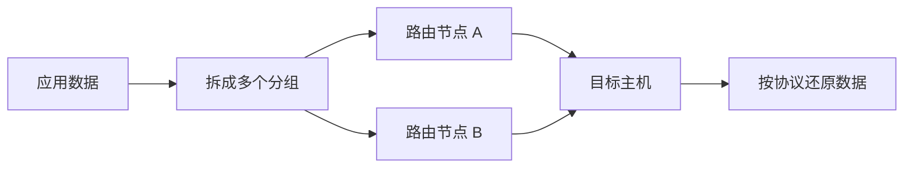
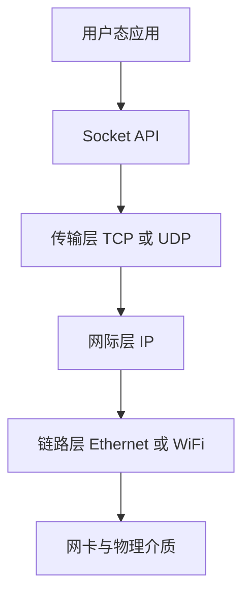
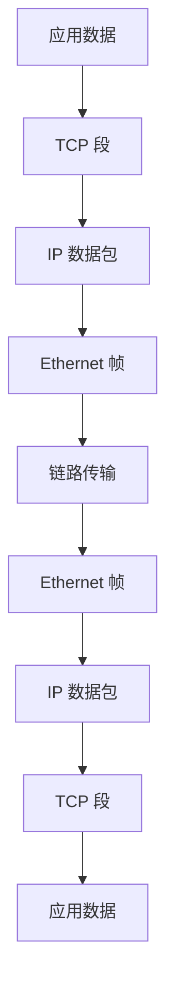
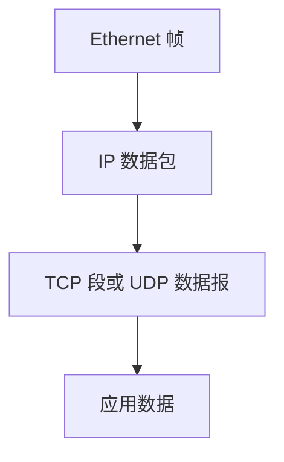
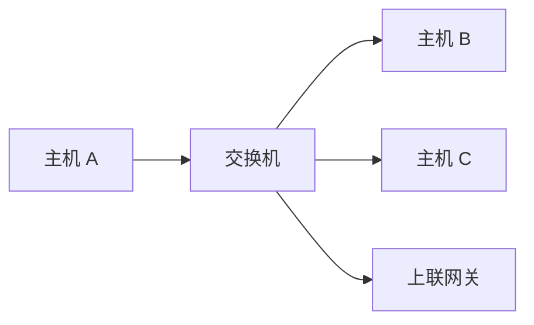
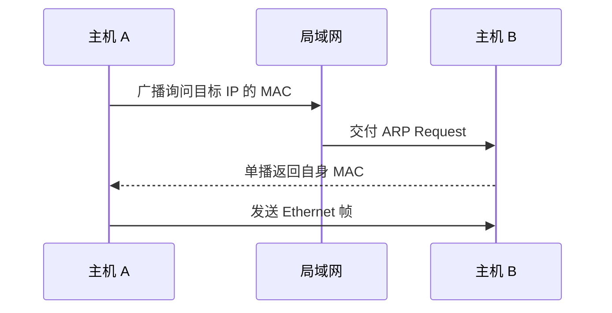

# 计算机网络基础学习笔记 · 第一册：网络模型、地址与子网

## 第一册 · 网络模型、地址与子网

### 从数据交换理解计算机网络
<!-- src: temp/network/1.txt (Ch. 2 Networking Overview) -->

计算机网络要解决的核心问题，是让两台或多台设备交换任意字节。围绕这个目标，网络必须回答四个问题：通信双方是谁、数据如何到达、途中是否损坏、接收方如何理解这些字节。本册从这些问题出发，逐步建立分层、寻址、封装和局域网通信的基础模型。

> **材料说明**：知识覆盖参考 Brian “Beej Jorgensen” Hall 的 *Beej's Guide to Network Concepts* v1.0.40。本文按运维与 SRE 学习路径进行原创重组，不是原书的逐章翻译；原作及其许可信息以 [官方页面](https://beej.us/guide/bgnet0/) 为准。

电路交换会先为一次通信建立相对固定的通道，传统电话网络是典型例子。分组交换则把数据拆成多个分组，每个分组与其他流量共享链路。互联网主要采用分组交换，因此能高效复用带宽，但也要面对延迟变化、乱序、丢包和拥塞。



| 问题 | 网络中的解决机制 | 常见例子 |
| --- | --- | --- |
| 设备身份 | 地址 | IPv4、IPv6、MAC |
| 进程身份 | 端口 | TCP 443、UDP 53 |
| 路径选择 | 路由 | 路由表、默认网关 |
| 数据完整性 | 校验与重传 | 校验和、TCP 重传 |
| 数据含义 | 应用协议 | HTTP、DNS、SSH |

排查网络故障时，也可以把这四个问题倒过来问：地址是否正确、路径是否可达、传输是否完整、应用协议是否符合预期。

#### 分组交换带来的工程约束

不同分组可以经过不同路径，排队时间也会变化。发送端看到的连续写入，到达接收端之前可能经历拆分、排队、重传与重新排序。

| 现象 | 直接原因 | 上层通常如何处理 |
| --- | --- | --- |
| 延迟 | 传播、处理、排队、序列化 | 超时和缓存 |
| 抖动 | 每个包的排队时间不同 | 播放缓冲 |
| 丢包 | 拥塞、误码、策略丢弃 | 重传或容错 |
| 乱序 | 多路径或重传 | 序列号排序 |
| 重复 | ACK 丢失后重传 | 去重 |

吞吐量描述单位时间传输了多少数据，延迟描述一次交互要等待多久。大带宽链路仍可能具有高延迟，低延迟链路也可能很快耗尽带宽。

#### 计算带宽时延积

带宽时延积表示链路上同时“在途”的数据量。100 Mbit/s、往返时延 80 ms 的路径大约有：

```text
100000000 bit/s × 0.08 s = 8000000 bit
8000000 bit ÷ 8 = 1000000 byte
```

若可靠传输窗口远小于约 1 MB，就可能无法填满这条路径。这解释了为什么跨地域传输不仅要看带宽，还要看 RTT 和窗口。

#### 自测

1. 为什么分组交换不承诺每个包走同一路径？
2. 丢包和乱序应由哪一层处理，取决于什么？
3. 带宽翻倍但 RTT 不变时，单次请求延迟一定减半吗？

### 客户端、服务端、协议与网络操作系统
<!-- src: temp/network/1.txt (Ch. 2.3-2.7 Client Server, OS, Protocols, Wired versus Wireless) -->

客户端和服务端描述的是一次通信中的角色，不一定对应固定的设备类型。客户端主动发起请求，服务端在已知地址和端口上等待请求。同一个程序既可以是服务端，也可以在调用其他服务时充当客户端。

协议是通信双方共同遵守的规则，至少要约定消息格式、字段含义、交互顺序和异常处理。例如 HTTP 约定请求行、Header 和 Body 的组织方式，TCP 则约定如何建立可靠连接。没有协议，即使字节已经到达，接收方也无法可靠解释。

操作系统负责把应用的读写请求连接到底层协议栈和网卡：



有线和无线网络在物理介质、接入方式和误码特征上不同，但上层通常仍使用相同的 IP、TCP、UDP 和应用协议。这种隔离正是分层设计带来的价值。

#### 角色不等于设备

浏览器访问网站时是客户端，但它也可能在本机开放调试端口成为服务端。反向代理对外是服务端，对上游又是客户端。判断角色要看某次连接由谁主动发起、谁在已知端点等待。

| 架构 | 特征 | 运维关注点 |
| --- | --- | --- |
| 客户端与服务端 | 服务入口相对稳定 | 容量、发现、负载均衡 |
| 对等网络 | 节点可同时请求和提供服务 | 节点发现、NAT 穿越 |
| 发布订阅 | 生产者与消费者解耦 | Broker、积压、投递语义 |

协议可以是公开标准，也可以是组织内部约定。一个可维护协议至少应明确版本、字段、边界、状态转换、超时、错误码和兼容策略。

#### 有线和无线的差异

无线终端共享频谱，信号强度、干扰、漫游和省电机制会显著影响时延；交换式有线链路通常更稳定。看到 TCP 重传时，仍需确认是无线误码、交换链路丢包还是路径拥塞。

```bash
ip -s link
ethtool eth0 2>/dev/null
iw dev 2>/dev/null
```

这些命令分别观察接口计数、Ethernet 链路属性和无线接口，但不同平台与驱动暴露的信息并不相同。

### 分层为什么是理解网络的第一把钥匙
<!-- src: temp/network/1.txt (Ch. 4 The Layered Network Model) -->

分层把复杂通信拆成职责明确的模块。每一层只依赖下层提供的服务，并向上层暴露稳定接口。应用无需知道信号如何在网线中传播，路由器也不需要理解 HTTP 页面内容。

发送端从上向下逐层添加控制信息，这个过程叫封装；接收端从下向上逐层移除并解释控制信息，这个过程叫解封装。



分层排障的基本方法是确认故障止于哪一层。例如 `ping` 成功但 HTTPS 失败，通常说明 IP 路径基本可达，应继续检查 TCP 端口、TLS 或 HTTP，而不是立即怀疑网线。

#### 每层只解释自己的头部

发送端应用交给 TCP 的只是字节；TCP 增加端口和序列信息；IP 增加端到端地址；Ethernet 增加当前链路的 MAC。中间路由器通常只需要解释链路层和网络层，不会解析应用正文。

| 观察点 | 可见的典型变化 | 通常保持不变 |
| --- | --- | --- |
| 同一二层交换域 | 交换端口 | IP 与 MAC |
| 经过路由器 | 源/目的 MAC、TTL | 端到端 IP、端口 |
| 经过 NAT | 地址或端口、校验和 | 应用语义 |
| 经过反向代理 | 新连接的全部四元组 | 业务请求内容 |

“透明”只表示对某层看起来没有变化，不代表设备什么都没做。例如交换机对 IP 层透明，却仍会学习 MAC、实施 VLAN 和丢弃策略。

#### 用抓包验证封装

```bash
sudo tcpdump -ni any -e -vv 'icmp or tcp port 443'
```

`-e` 显示链路层头，`-vv` 增加协议细节。分别在客户端、网关两侧抓取同一流量，可以对照 MAC、TTL、地址和端口在哪个边界发生变化。

#### 常见分层误区

- DNS 成功只证明名称获得结果，不证明目标端口可达。
- ping 失败不等于所有 IP 流量失败，ICMP 可能被单独过滤。
- TCP 建连成功不证明 HTTP 请求一定合法。
- HTTP 200 不证明返回的业务数据一定正确。

### TCP/IP 模型与 OSI 模型如何对应
<!-- src: temp/network/1.txt (Ch. 4.2-4.4 Protocol Layering, Internet Model, OSI Model) -->

OSI 七层模型适合描述和讨论网络职责，TCP/IP 模型更贴近互联网协议的实际组织。两者不是互斥标准，而是观察同一通信系统的两种粒度。

| OSI 层 | TCP/IP 层 | 典型协议或对象 | 主要职责 |
| --- | --- | --- | --- |
| 7 应用层 | 应用层 | HTTP、DNS、SSH | 定义业务消息 |
| 6 表示层 | 应用层 | JSON、TLS 编码 | 表示、加密、压缩 |
| 5 会话层 | 应用层 | 会话状态 | 管理对话 |
| 4 传输层 | 传输层 | TCP、UDP | 进程间传输 |
| 3 网络层 | 网际层 | IPv4、IPv6、ICMP | 跨网络寻址与路由 |
| 2 数据链路层 | 链路层 | Ethernet、WiFi、ARP | 同一链路交付 |
| 1 物理层 | 链路接入 | 电信号、光信号、无线电 | 传输比特 |

实际排障中常见的“二层问题”“四层负载均衡”“七层代理”，就是借用 OSI 层号来快速表达职责边界。

#### PDU 名称与常见设备

| 层次 | 协议数据单元 | 常见标识 | 常见设备或功能 |
| --- | --- | --- | --- |
| 应用层 | Message | 名称、URL、方法 | DNS、代理、网关 |
| 传输层 | Segment 或 Datagram | 端口 | L4 负载均衡、防火墙 |
| 网络层 | Packet | IP 地址 | 路由器、L3 ACL |
| 链路层 | Frame | MAC、VLAN | 交换机、网桥 |
| 物理层 | Bits | 电气或光学信号 | 线缆、收发器、中继 |

OSI 的会话层和表示层在互联网软件中通常由应用库承担，例如 TLS、JSON 编码和身份会话。不要为了“凑七层”把每个协议硬塞进唯一格子；模型服务于沟通，不替代真实实现。

#### 排障问题模板

```text
L1  接口是否 Up  错包是否增长
L2  VLAN 是否一致  邻居 MAC 是否可达
L3  地址前缀是否正确  正反向路由如何选择
L4  端口是否监听  握手停在哪一步
L7  请求格式  响应码  依赖和日志是否正常
```

一次只用证据排除一层，比同时修改 DNS、防火墙和应用配置更容易保留根因。

### 二进制、十六进制与字节如何表达网络数据
<!-- src: temp/network/1.txt (Ch. 10.1 Integer Representations; Ch. 40 Bitwise Operations) -->

网络上传输的最终都是比特。8 个比特组成一个字节，能表示 `0` 到 `255`。二进制适合观察位，十六进制每一位正好对应 4 个比特，因此更适合展示报文、地址和掩码。

```text
十进制  192
二进制  11000000
十六进制 C0
```

位运算是理解子网和协议字段的基础：

| 运算 | 作用 | 网络场景 |
| --- | --- | --- |
| AND | 两位都为 1 才为 1 | IP 与掩码求网络地址 |
| OR | 任意一位为 1 即为 1 | 设置标志位 |
| NOT | 逐位翻转 | 从掩码得到主机位 |
| 左移 | 向高位移动 | 构造位掩码 |
| 右移 | 向低位移动 | 提取字段 |

```python
ip = int.from_bytes(bytes([192, 168, 10, 42]), "big")
mask = int.from_bytes(bytes([255, 255, 255, 0]), "big")
network = ip & mask
print(network.to_bytes(4, "big"))  # b'\xc0\xa8\n\x00'
```

### 位运算如何服务于掩码和协议字段
<!-- src: temp/network/1.txt (Ch. 40.3-40.7 AND, OR, NOT, Shift, Bit Masks) -->

位运算直接作用于整数的二进制位。网络程序用它们计算网段、构造标志字段、提取报文中的子字段，也用它们把多个布尔状态压缩进一个字节。

#### 四类基本位运算

```text
      10110100
AND   11110000
    = 10110000

      10110100
OR    00001111
    = 10111111

NOT   10110100
    = 01001011
```

AND 配合掩码保留选定位；OR 用来打开标志位；NOT 翻转所有位；左移和右移负责把字段移动到目标位置。

```python
FLAG_SYN = 1 << 1
FLAG_ACK = 1 << 4

flags = 0
flags |= FLAG_SYN
flags |= FLAG_ACK

assert flags & FLAG_SYN
flags &= ~FLAG_SYN
assert not flags & FLAG_SYN
```

#### 构造连续的 1

`(1 << n) - 1` 可以得到低 n 位全为 1 的掩码。例如 n 为 5 时，结果是二进制 `11111`。IPv4 `/24` 掩码可以写成：

```python
prefix = 24
mask = ((1 << prefix) - 1) << (32 - prefix)
print(mask.to_bytes(4, "big"))
```

位运算前必须明确整数宽度。Python 整数没有固定宽度，`~value` 会得到数学意义上的负数；若要模拟 8 位或 32 位翻转，需要再与 `0xff` 或 `0xffffffff` 做 AND。

### 大端序、小端序与网络字节序
<!-- src: temp/network/1.txt (Ch. 10.2-10.3 Endianness and Python) -->

多字节整数必须约定高位字节和低位字节的排列顺序。大端序把最高有效字节放在前面，小端序相反。互联网协议约定网络字节序为大端序，主机内部顺序则取决于 CPU 架构。

以十六进制整数 `0x12345678` 为例：

```text
大端序  12 34 56 78
小端序  78 56 34 12
```

Python 可以明确指定字节序，避免依赖主机架构：

```python
value = 0x12345678
wire = value.to_bytes(4, byteorder="big")
decoded = int.from_bytes(wire, byteorder="big")
assert decoded == value
```

抓包时如果端口、长度或序列号看起来异常，除了检查字段偏移量，还应确认解析代码是否用了正确的字节序。

#### 使用 struct 描述协议布局

Python `struct` 的格式前缀 `!` 表示网络字节序。下面把版本、消息类型和 32 位长度打包为 6 字节头部：

```python
import struct

HEADER = struct.Struct("!BBI")
wire = HEADER.pack(1, 3, 4096)
version, message_type, length = HEADER.unpack(wire)

assert len(wire) == HEADER.size == 6
assert (version, message_type, length) == (1, 3, 4096)
```

协议结构应明确字段宽度、是否有符号、字节序、固定头与载荷的关系，以及未知版本如何处理。

#### 错位解析示例

如果发送方写入 32 位长度，接收方却只读取 16 位，剩余两个字节会落入后续字段，使整条消息从此错位。二进制协议出错时，应先保存原始字节，再对照偏移表解析。

```bash
xxd -g 1 packet.bin
hexdump -C packet.bin
```

直接把 C 结构体内存发送到网络也不安全，其中可能包含对齐填充、主机字节序和平台相关宽度。

### TCP 字节流为什么需要应用层消息边界
<!-- src: temp/network/1.txt (Ch. 11 Parsing Packets) -->

TCP 提供连续字节流，不保留应用执行 `send` 时的边界。发送方一次写入 100 字节，接收方可能分两次读到，也可能一次读到它和后一条消息的全部内容。这不是“粘包故障”，而是字节流接口的正常语义。

应用协议必须自行定义消息边界，常见办法有：

- 固定长度：适合字段稳定的小型协议。
- 分隔符：例如以换行结束，必须处理转义和最大长度。
- 长度前缀：先读取固定大小的长度字段，再读取指定字节数。
- 自描述格式：例如 HTTP Header 中的 `Content-Length`。

```python
import struct

def encode_message(payload: bytes) -> bytes:
    return struct.pack("!I", len(payload)) + payload

def try_decode(buffer: bytes):
    if len(buffer) < 4:
        return None, buffer
    size = struct.unpack("!I", buffer[:4])[0]
    if len(buffer) < 4 + size:
        return None, buffer
    return buffer[4:4 + size], buffer[4 + size:]
```

生产代码还必须限制最大消息长度，防止恶意长度字段造成内存耗尽。

#### 三种读取场景必须同时处理

```text
场景一  recv 得到半个长度头
场景二  recv 得到完整头但只有部分载荷
场景三  recv 一次得到第一帧和第二帧的一部分
```

解析器不应控制 `recv`，网络循环也不应理解业务字段。前者只消费缓冲区中的完整帧，后者只负责追加字节和处理连接生命周期。

```python
buffer = bytearray()
while True:
    chunk = sock.recv(4096)
    if not chunk:
        if buffer:
            raise EOFError("partial frame")
        break
    buffer.extend(chunk)
    while True:
        message, remaining = try_decode(bytes(buffer))
        if message is None:
            break
        handle(message)
        buffer[:] = remaining
```

| 测试输入 | 期望结果 |
| --- | --- |
| 空缓冲区 | 等待更多字节 |
| 1–3 字节长度头 | 等待更多字节 |
| 完整头和部分载荷 | 保留全部字节 |
| 一帧完整 | 返回一帧和余量 |
| 两帧完整 | 连续返回两帧 |
| 超长声明 | 立即拒绝连接 |
| 半帧时 EOF | 报协议截断 |

随机把同一字节串切成不同块喂给解析器，是发现边界依赖的有效测试方法。

### IP 协议负责什么又不负责什么
<!-- src: temp/network/1.txt (Ch. 6 The Internet Protocol) -->

IP 为跨网络传输提供统一地址和尽力而为的数据包交付。它负责在包头中携带源地址、目的地址等信息，并让路由器逐跳转发。IP 不保证到达、不保证顺序，也不自动重传。


同一 IP 数据包在不同链路上传输时，链路层帧头会逐跳更换；IP 源地址和目的地址通常保持不变，除非中间经过 NAT。这个区别对看懂抓包非常重要。

IP 旁边还有 ICMP 等辅助协议。`ping` 常用 ICMP Echo，路由器也会用 ICMP 报告不可达或 TTL 超时。ICMP 不只是诊断工具，而是 IP 工作机制的一部分。

#### IPv4 头中值得先认识的字段

| 字段 | 作用 | 排障价值 |
| --- | --- | --- |
| Version | 区分 IPv4 | 防止错用解析器 |
| Header Length | 标记头部实际长度 | 找到载荷偏移 |
| Total Length | 整个数据包长度 | 识别截断 |
| Identification | 关联分片 | 分析重组 |
| Flags 与 Offset | 控制和定位分片 | MTU 排障 |
| TTL | 限制转发跳数 | traceroute |
| Protocol | 标记 TCP、UDP、ICMP | 上层分发 |
| Source 与 Destination | 端到端地址 | 路由和策略 |

IP 的尽力而为意味着路由器可以在资源不足、无路由、TTL 归零或策略不允许时丢包。应用不能要求 IP 本身补发。

#### ICMP 与路径 MTU

```bash
ping -c 3 192.0.2.10
tracepath 192.0.2.10
```

ICMP Destination Unreachable 能报告无路由、端口不可达等问题；Packet Too Big 或 Fragmentation Needed 参与路径 MTU 发现。粗暴屏蔽全部 ICMP 可能让连接表现为难以解释的超时。

IPv4 允许中间路由器分片，IPv6 中间路由器不分片。任何一个分片丢失都可能使整个原始包无法重组，应优先控制报文大小与有效 MTU。

### IPv4 地址、私有网络与动态分配
<!-- src: temp/network/1.txt (Ch. 6.5-6.6 Private Networks, Static and Dynamic Addresses; Ch. 7.1 IPv4 Addresses) -->

IPv4 地址是 32 位整数，通常写成四个十进制字节，例如 `192.0.2.10`。地址必须结合前缀长度解释；脱离掩码，仅凭 IP 不能确定设备认为哪些地址在本地网段。

常见特殊范围如下：

| 范围 | 用途 |
| --- | --- |
| `10.0.0.0/8` | 私有地址 |
| `172.16.0.0/12` | 私有地址 |
| `192.168.0.0/16` | 私有地址 |
| `127.0.0.0/8` | 环回地址 |
| `169.254.0.0/16` | 链路本地地址 |
| `224.0.0.0/4` | 组播地址 |
| `0.0.0.0` | 未指定地址或任意监听地址 |
| `255.255.255.255` | 受限广播地址 |

私有地址不能直接在公网中路由，通常通过 NAT 共享公网地址。文档与示例宜使用 `192.0.2.0/24`、`198.51.100.0/24` 和 `203.0.113.0/24` 等文档保留网段，避免误用真实地址。

静态地址由管理员明确配置，适合网关、基础设施和需要稳定入口的服务；动态地址通常通过 DHCP 获得，适合终端和批量主机。动态并不等于随机，DHCP 服务器可以根据客户端标识保留固定租约。

```bash
ip -4 addr show
ip route show
networkctl status 2>/dev/null
```

查看地址时要同时记录前缀长度、接口和作用域。只抄下 `192.168.10.20` 而遗漏 `/24`，无法完整解释主机的本地网络判断。

### IPv4 的历史分类、特殊地址与特殊网段
<!-- src: temp/network/1.txt (Ch. 7.2-7.6 Subnets, Historic Subnets, Special Addresses and Subnets) -->

早期 IPv4 使用 A、B、C 类地址，分别隐含 `/8`、`/16`、`/24` 网络边界。这种分类分配浪费严重，已经被 CIDR 取代，但旧文档中的“C 类网段”等说法仍然常见。

| 历史类别 | 首位特征 | 默认前缀 | 过去的用途 |
| --- | --- | --- | --- |
| A | 最高位为 0 | `/8` | 超大网络 |
| B | 最高两位为 10 | `/16` | 中型网络 |
| C | 最高三位为 110 | `/24` | 小型网络 |
| D | 最高四位为 1110 | 无 | 组播 |

#### 不能当普通单播使用的地址

- 一个子网的主机位全为 0，表示网络地址。
- 传统子网中主机位全为 1，表示定向广播地址。
- `127.0.0.0/8` 保留给本机环回。
- `0.0.0.0` 可表示未指定地址或监听全部本地 IPv4 地址。
- `255.255.255.255` 是受限广播，不会被路由器转发。
- `169.254.0.0/16` 常在自动配置失败时作为链路本地地址。

`/31` 和 `/32` 是需要单独理解的例外。`/31` 可用于点到点链路，两个地址都能作为端点；`/32` 表示单个主机路由，常见于 Loopback、VIP 和精确路由。

### IPv6 地址表示、作用域、DNS 与 URL
<!-- src: temp/network/1.txt (Ch. 8 IPv6 Representation, Link Local, Special Addresses, DNS and URLs) -->

IPv6 地址为 128 位，写成八组十六进制数。连续的零可以用一次 `::` 压缩，每组开头的零可以省略。例如：

```text
完整写法  2001:0db8:0000:0000:0000:0000:0000:0042
压缩写法  2001:db8::42
```

| 范围 | 用途 |
| --- | --- |
| `::1/128` | 环回地址 |
| `::/128` | 未指定地址 |
| `fe80::/10` | 链路本地地址 |
| `fc00::/7` | 唯一本地地址 |
| `ff00::/8` | 组播地址 |
| `2001:db8::/32` | 文档示例地址 |

链路本地地址只在当前链路有效，同一主机有多个接口时还要指定区域，例如 `fe80::1%eth0`。URL 中的 IPv6 字面量必须放进方括号：`http://[2001:db8::42]:8080/`。

IPv6 没有 IPv4 意义上的广播，常用组播完成邻居发现等功能。IPv6 地址更充足，但防火墙、DNS、路由和应用监听仍需正确配置，不能把“无需 NAT”误解为“无需安全控制”。

#### 压缩与还原规则

一个地址中只能出现一次 `::`，否则无法判断省略了多少组零。还原时先计算已写出的组数，再补足到八组。

```text
2001:db8:1::9
2001:0db8:0001:0000:0000:0000:0000:0009
```

DNS 使用 AAAA 记录保存 IPv6 地址。应用获得 A 和 AAAA 记录后，通常按系统地址选择策略尝试连接；“DNS 同时返回两类地址”不保证两条网络路径都可用。

```bash
dig example.com AAAA
getent ahosts example.com
ping -6 -c 2 2001:db8::42
```

URL 需要用方括号消除地址中的冒号与端口分隔符之间的歧义：`https://[2001:db8::42]:8443/`。日志、代理配置和允许列表也必须能正确解析这一写法。

### CIDR、子网掩码与网络边界
<!-- src: temp/network/1.txt (Ch. 17.1-17.6 Address Representation and Subnet Masks) -->

CIDR 使用斜杠后的数字表示网络前缀长度。`192.168.10.42/24` 表示前 24 位是网络位，后 8 位是主机位，对应掩码 `255.255.255.0`。

```text
IP       11000000.10101000.00001010.00101010
掩码     11111111.11111111.11111111.00000000
按位 AND 11000000.10101000.00001010.00000000
网络地址 192.168.10.0
```

常见前缀速算：

| 前缀 | 掩码 | 地址总数 |
| --- | --- | ---: |
| `/8` | `255.0.0.0` | 16,777,216 |
| `/16` | `255.255.0.0` | 65,536 |
| `/24` | `255.255.255.0` | 256 |
| `/25` | `255.255.255.128` | 128 |
| `/26` | `255.255.255.192` | 64 |
| `/27` | `255.255.255.224` | 32 |
| `/28` | `255.255.255.240` | 16 |

地址总数是 `2^(32-prefix)`。传统 IPv4 子网中通常扣除网络地址和广播地址；点到点 `/31` 等特殊场景不能机械套用这条规则。

#### 从主机数反推前缀

若普通 IPv4 子网需要至少 50 个主机地址，找满足 `2^h - 2 >= 50` 的最小 h。h 为 6 时可用 62 个地址，因此前缀为 `/26`。

| 需要的主机数 | 主机位 | 前缀 | 可用地址 |
| ---: | ---: | ---: | ---: |
| 2 | 2 | `/30` | 2 |
| 10 | 4 | `/28` | 14 |
| 30 | 5 | `/27` | 30 |
| 50 | 6 | `/26` | 62 |
| 100 | 7 | `/25` | 126 |
| 200 | 8 | `/24` | 254 |

#### 前缀聚合

`10.20.0.0/24` 和 `10.20.1.0/24` 边界连续且对齐，可以聚合成 `10.20.0.0/23`。聚合减少路由条目，但若覆盖了不属于该路径的地址，可能形成黑洞。

```python
import ipaddress

nets = [ipaddress.ip_network("10.20.0.0/24"),
        ipaddress.ip_network("10.20.1.0/24")]
print(list(ipaddress.collapse_addresses(nets)))
```

### 从 IP 地址计算网段、主机范围与广播地址
<!-- src: temp/network/1.txt (Ch. 17.7 Finding the Subnet; Ch. 18.6 Broadcast Address; Ch. 19 Computing and Finding Subnets) -->

计算 `192.168.10.70/26`：每个 `/26` 块有 64 个地址，边界依次是 0、64、128、192，因此 70 落在 64 到 127。

```text
网络地址    192.168.10.64
首个主机    192.168.10.65
最后主机    192.168.10.126
广播地址    192.168.10.127
```

Python 标准库可以用于核对手算结果：

```python
import ipaddress

iface = ipaddress.ip_interface("192.168.10.70/26")
network = iface.network
print(network.network_address)
print(network.broadcast_address)
print(network.num_addresses)
```

规划子网时不仅要考虑当前主机数，还要为网关、负载均衡地址、基础设施和增长预留空间。多个子网若重叠，会让路由、VPN、容器网络和云网络互联变得困难。

#### 一套不容易出错的手算流程

1. 把前缀转换成主机位数量。
2. 计算块大小 `2^主机位`。
3. 找出目标地址所在的对齐块。
4. 块首是网络地址，块尾是广播地址。
5. 普通子网中间范围是可用主机地址。
6. 用二进制 AND 或工具复核。

再计算 `172.16.35.200/20`。`/20` 的第三个字节掩码为 240，块大小为 16；35 落在 32–47：

```text
网络地址  172.16.32.0
广播地址  172.16.47.255
首主机    172.16.32.1
末主机    172.16.47.254
```

```python
import ipaddress

a = ipaddress.ip_network("10.0.0.0/16")
b = ipaddress.ip_network("10.0.128.0/17")
assert a.overlaps(b)
```

在连接 VPC、VPN、Kubernetes Pod CIDR 和办公网络前做重叠审计，成本远低于上线后迁移地址。

### 链路层、帧与数据包有什么区别
<!-- src: temp/network/1.txt (Ch. 20.1-20.2 Octets, Frames versus Packets) -->

“帧”和“包”有时被泛称为 packet，但精确讨论时应区分层次：Ethernet 帧属于链路层，承载 IP 数据包；IP 数据包又承载 TCP 段或 UDP 数据报。



Ethernet 帧通常包含目的 MAC、源 MAC、EtherType、载荷和帧校验序列。网卡首先依据链路层信息接收帧，再根据 EtherType 把载荷交给 IPv4、IPv6 或 ARP 等处理逻辑。

MTU 是链路一次能承载的最大网络层载荷。Ethernet 常见 MTU 为 1500 字节，但隧道封装会消耗额外空间。MTU 不匹配可能造成分片、丢包或“能 ping 小包但大请求卡住”的现象。

### Ethernet 帧由哪些字段组成
<!-- src: temp/network/1.txt (Ch. 20.6 Ethernet Frame, EtherType, CRC and Sublayers) -->

一个常见 Ethernet II 帧由前导码、帧起始定界符、目的 MAC、源 MAC、EtherType、载荷和帧校验序列组成。抓包软件通常从目的 MAC 开始展示，因为网卡硬件可能已经去掉前导码和 FCS。

| 字段 | 常见长度 | 作用 |
| --- | ---: | --- |
| Preamble | 7 字节 | 让接收端同步时钟 |
| SFD | 1 字节 | 标记帧正式开始 |
| Destination MAC | 6 字节 | 指定链路层接收方 |
| Source MAC | 6 字节 | 标记链路层发送方 |
| 802.1Q Tag | 可选 4 字节 | 携带 VLAN 和优先级 |
| EtherType | 2 字节 | 标记上层协议 |
| Payload | 46–1500 字节 | 承载网络层数据 |
| FCS | 4 字节 | CRC-32 差错检测 |

常见 EtherType 包括 IPv4 的 `0x0800`、ARP 的 `0x0806` 和 IPv6 的 `0x86dd`。接收端依据它决定把载荷交给哪个协议处理函数。

#### 长度下限和填充

传统 Ethernet 从目的 MAC 到 FCS 的帧长至少为 64 字节。如果上层载荷太短，链路层会填充。解析上层协议时必须依据上层长度字段，而不能把填充字节误当成业务数据。

CRC 能发现链路传输错误，但通常由网卡硬件生成和验证。校验失败的帧经常在进入操作系统抓包点之前就被丢弃，因此普通 tcpdump 未必看得到坏帧。

### MAC 地址、介质访问与交换机学习
<!-- src: temp/network/1.txt (Ch. 20.3-20.6 MAC Addresses, Shared Medium, Multiple Access, Ethernet) -->

MAC 地址通常是 48 位链路层地址，例如 `02:42:ac:11:00:02`。交换机学习每个源 MAC 来自哪个端口，并根据目的 MAC 转发帧。未知单播和广播会在广播域内泛洪。



当 A 和 B 在同一子网时，A 会获取 B 的 MAC 并直接发送。若目标不在本地子网，A 的二层目的地址不是远端主机的 MAC，而是默认网关接口的 MAC。IP 目的地址仍然是最终远端地址。

交换机主要扩展二层网络，路由器连接不同三层网络。VLAN 可以在同一物理交换基础设施上划分多个逻辑广播域，每个 VLAN 通常对应独立 IP 子网。

#### 从共享介质到全双工交换

早期总线和集线器 Ethernet 使用 CSMA/CD：发送前监听介质，检测到碰撞后停止、随机退避再重试。现代交换网络通常每个端口独占链路并使用全双工，不再发生传统碰撞，但广播和未知单播仍可能被泛洪。

交换机观察进入帧的源 MAC，记录“MAC 到入端口”的映射。查到目的 MAC 时只转发到对应端口；未知时向同 VLAN 的其他端口泛洪；表项长时间不用会老化。

```text
VLAN 10  02:00:00:00:00:0a  Gi0/1
VLAN 10  02:00:00:00:00:0b  Gi0/2
VLAN 20  02:00:00:00:00:0c  Gi0/3
```

MAC 表震荡通常意味着同一个源 MAC 在多个端口间快速移动，可能由二层环路、错误聚合或虚拟机迁移引起。

### ARP 如何把 IPv4 地址解析成 MAC 地址
<!-- src: temp/network/1.txt (Ch. 21 ARP) -->

ARP 用于在同一链路内把 IPv4 地址解析为 MAC 地址。发送方不知道目标 MAC 时广播 ARP Request，拥有目标 IP 的设备单播回复 ARP Reply，结果随后进入邻居缓存。



Linux 中可以查看邻居表：

```bash
ip neigh show
ip neigh get 192.168.10.1
```

邻居条目会经历 `REACHABLE`、`STALE`、`DELAY`、`PROBE`、`FAILED` 等状态。ARP 缓存不是永久可信数据；地址迁移、虚拟 IP 漂移和重复地址都可能使缓存短暂过期或错误。

### ARP 报文、通告与地址冲突检测
<!-- src: temp/network/1.txt (Ch. 21.4-21.6 ARP Structure, Request Response, Announcements and Probes) -->

ARP 报文不是 IP 数据包，而是直接装在 Ethernet 帧中，EtherType 为 `0x0806`。它同时携带链路层地址和协议层地址。

| 字段 | 含义 | Ethernet 与 IPv4 常见值 |
| --- | --- | --- |
| Hardware Type | 链路类型 | `1` |
| Protocol Type | 被解析协议 | `0x0800` |
| Hardware Length | MAC 长度 | `6` |
| Protocol Length | IPv4 长度 | `4` |
| Operation | 请求或响应 | `1` 或 `2` |
| Sender Hardware | 发送方 MAC | 6 字节 |
| Sender Protocol | 发送方 IPv4 | 4 字节 |
| Target Hardware | 目标 MAC | 请求时未知 |
| Target Protocol | 目标 IPv4 | 4 字节 |

#### Gratuitous ARP

设备主动广播自身 IP 与 MAC 的绑定，可以刷新其他主机缓存。高可用系统切换 VIP 后常发送 Gratuitous ARP，让交换和主机尽快把流量指向新节点。

#### ARP Probe

主机正式使用地址前可以发送 Sender IP 为 `0.0.0.0` 的探测，询问是否已有设备占用目标地址。如果收到响应，就应停止使用该地址并报告冲突。

```bash
arping -D -I eth0 192.168.10.50
arping -U -I eth0 192.168.10.50
```

ARP 没有认证，攻击者可能发送伪造绑定实施中间人攻击。静态邻居、交换机动态 ARP 检查和网络分段能降低风险，但需要结合环境权衡维护成本。

### IPv6 邻居发现如何替代 ARP
<!-- src: temp/network/1.txt (Ch. 21.7 IPv6 and ARP) -->

IPv6 不使用 ARP，而是在 ICMPv6 上实现邻居发现协议 NDP。NDP 不仅解析链路层地址，还承担路由器发现、前缀发现、邻居可达性检测和重复地址检测。

| IPv4 机制 | IPv6 对应机制 |
| --- | --- |
| ARP Request | Neighbor Solicitation |
| ARP Reply | Neighbor Advertisement |
| 默认网关人工或 DHCP | Router Solicitation 与 Advertisement |
| Gratuitous ARP | Unsolicited Neighbor Advertisement |

NDP 使用组播而不是广播。排查 IPv6 邻居问题时，除了 `ip -6 neigh`，还必须确认防火墙没有错误阻断必要的 ICMPv6；完全封禁 ICMPv6 会破坏 IPv6 的基本运行。

### 网卡、交换机与路由器分别工作在哪一层
<!-- src: temp/network/1.txt (Ch. 24 Network Hardware) -->

| 组件 | 主要层次 | 决策依据 | 作用域 |
| --- | --- | --- | --- |
| 网卡 | L1/L2 | 帧与接口配置 | 单台主机 |
| 集线器 | L1 | 无智能转发 | 单个冲突域 |
| 交换机 | L2 | MAC 地址表 | 广播域或 VLAN |
| 路由器 | L3 | IP 路由表 | 不同子网 |
| 防火墙 | L3-L7 | 规则与连接状态 | 安全边界 |
| 无线接入点 | L1/L2 | 无线关联与桥接 | 无线局域网 |

真实设备常同时承担多个角色，例如家用路由器通常集成交换机、无线 AP、DHCP、DNS 转发、NAT 和防火墙。排障时应按实际数据路径拆开这些逻辑角色，而不是只看设备名称。

### 用 Packet Tracer 直连两台主机
<!-- src: temp/network/1.txt (Ch. 25 Connect Two Computers; Ch. 41 Installing Packet Tracer) -->

第一个实验只连接两台主机，用最小拓扑验证同网段通信。为 PC-A 配置 `192.168.10.10/24`，为 PC-B 配置 `192.168.10.20/24`，暂时不配置默认网关。


#### 操作与观察

1. 拖入两台 PC，并用合适的 Ethernet 连接相连。
2. 在桌面 IP 配置中设置地址和掩码。
3. 等待接口指示变为 Up。
4. 从 PC-A ping PC-B。
5. 切换到 Simulation 模式，重新发起 ping。
6. 观察第一次通信先产生 ARP，随后才出现 ICMP Echo。

如果接口 Up 但 ping 失败，优先核对地址、掩码和两端是否处在同一网段。如果第一次 ping 丢一个包、之后成功，通常是等待 ARP 解析，不应直接判定链路不稳定。

### 用交换机和单台路由器连接局域网
<!-- src: temp/network/1.txt (Ch. 26 Using a Switch; Ch. 27 Using a Router) -->

先把三台 PC 接入交换机并配置同一 `/24`，验证交换机如何学习源 MAC。随后再增加第二个 LAN 和一台路由器，让两个广播域通过三层转发通信。

```text
LAN A
PC-A  192.168.10.10/24  gateway 192.168.10.1
PC-B  192.168.10.20/24  gateway 192.168.10.1
R1-A  192.168.10.1/24

LAN B
PC-C  192.168.20.10/24  gateway 192.168.20.1
R1-B  192.168.20.1/24
```

#### 分阶段验证

1. 只接交换机时验证 LAN A 内主机互通。
2. 观察第一次未知单播或 ARP 广播的泛洪。
3. 再次发送单播，确认交换机只从目标端口转发。
4. 接入路由器两个接口并启用端口。
5. 配置 PC 默认网关。
6. 从 PC-A ping `192.168.20.1`，再 ping PC-C。

同网段通信不需要默认网关；跨网段通信必须把帧发给网关 MAC。若 PC 能 ping 本地网关但不能到远端，检查路由器另一接口和远端主机回程配置。

原有地址规划可以表示为：

```text
PC-A  192.168.10.10/24  gateway 192.168.10.1
R-A   192.168.10.1/24
R-B   192.168.20.1/24
PC-B  192.168.20.10/24  gateway 192.168.20.1
```

验证顺序：

1. 检查接口是否启用、线缆是否连接。
2. 从 PC ping 自身地址和本地网关。
3. ping 对端路由器接口。
4. ping 远端 PC。
5. 在模拟模式观察 ARP、ICMP 与每跳 MAC 地址变化。

这个实验最重要的不是得到 ping 成功，而是解释每一跳：主机怎样判断目标不在本地、如何解析网关 MAC、路由器怎样更换帧头并继续转发。

### 用多台路由器、默认网关和静态路由连接网段
<!-- src: temp/network/1.txt (Ch. 28 Multiple Routers) -->

增加路由器后，每台路由器只自动知道自己的直连网段。若要访问更远网段，必须配置静态路由、默认路由或动态路由协议。


以 Linux 路由命令表示，R1 需要知道 LAN B 的下一跳：

```bash
ip route add 192.168.20.0/24 via 10.0.12.2
```

R2 同样必须配置返回 LAN A 的路由。只配置单向路径经常会出现“请求已到达但响应回不来”。因此判断可达性时必须同时检查正向和回程路径。

#### 完整地址表

| 设备 | 接口 | 地址 | 下一跳或网关 |
| --- | --- | --- | --- |
| PC-A | NIC | `192.168.10.10/24` | `192.168.10.1` |
| R1 | LAN | `192.168.10.1/24` | 直连 |
| R1 | Transit | `10.0.12.1/30` | 直连 |
| R2 | Transit | `10.0.12.2/30` | 直连 |
| R2 | LAN | `192.168.20.1/24` | 直连 |
| PC-B | NIC | `192.168.20.10/24` | `192.168.20.1` |

R1 添加 `192.168.20.0/24 via 10.0.12.2`，R2 添加 `192.168.10.0/24 via 10.0.12.1`。每条静态路由描述的是远端前缀，不是某一台远端主机。

#### 故障注入练习

- 删除 R2 的回程路由，观察请求与响应分别停在哪里。
- 把 PC-B 网关改错，确认本地通信和跨网段通信的差异。
- 关闭 R1 传输接口，观察路由条目和链路状态变化。
- 把两个 LAN 配成重叠网段，解释主机为何错误地尝试 ARP。

每次只改变一个变量，并在 Simulation 模式记录帧的源 MAC、目的 MAC、源 IP 和目的 IP。跨越路由器时 MAC 逐跳变化，端到端 IP 通常保持不变。

#### 第一册综合实验：从二进制到跨网段通信

综合实验把地址规划、ARP、Ethernet 和路由器转发放到同一张拓扑中。不要先追求全部 ping 成功，而是逐步预测每个设备会做出的判断。


##### 第一步：完成地址规划

| 区域 | 网络 | 可用范围 | 广播 |
| --- | --- | --- | --- |
| LAN A | `10.10.1.0/26` | `.1`–`.62` | `.63` |
| Transit | `10.255.0.0/30` | `.1`–`.2` | `.3` |
| LAN B | `10.10.2.64/26` | `.65`–`.126` | `.127` |

为 PC-A 配置 `10.10.1.10/26`、网关 `10.10.1.1`；为 PC-B 配置 `10.10.2.70/26`、网关 `10.10.2.65`。R1 与 R2 传输接口使用 `10.255.0.1/30` 和 `10.255.0.2/30`。

##### 第二步：写出转发前的判断

PC-A 计算 `10.10.2.70 AND 255.255.255.192`，结果不是自己的 `10.10.1.0/26`，因此选择默认网关。它不会查询 PC-B 的 MAC，而是查询 `10.10.1.1` 的 MAC。

```text
PC A 发送的第一跳帧
Source MAC       PC A MAC
Destination MAC R1 LAN MAC
Source IP        10.10.1.10
Destination IP   10.10.2.70
```

R1 去掉收到的帧头，查找 `10.10.2.64/26`，选择 R2 为下一跳，再为传输网构造新的 Ethernet 帧。

##### 第三步：配置静态路由

```bash
# 用 Linux 命令表达 R1 的意图
ip route add 10.10.2.64/26 via 10.255.0.2

# 用 Linux 命令表达 R2 的回程意图
ip route add 10.10.1.0/26 via 10.255.0.1
```

Packet Tracer 的设备命令语法不同，但路由语义一致：目标前缀、掩码、下一跳。

##### 第四步：记录逐跳字段

| 跳 | 源 MAC | 目的 MAC | 源 IP | 目的 IP | TTL |
| --- | --- | --- | --- | --- | ---: |
| PC-A 到 R1 | PC-A | R1-LAN | `10.10.1.10` | `10.10.2.70` | 64 |
| R1 到 R2 | R1-WAN | R2-WAN | `10.10.1.10` | `10.10.2.70` | 63 |
| R2 到 PC-B | R2-LAN | PC-B | `10.10.1.10` | `10.10.2.70` | 62 |

真实起始 TTL 依操作系统而异，表格只用于展示每经过一个路由器递减一次。

##### 第五步：观察邻居缓存和交换学习

首次通信前，各设备可能没有目标邻居条目。通信后检查：

```bash
ip neigh show
bridge fdb show 2>/dev/null
```

主机只学习本地链路邻居；PC-A 不会出现 PC-B 的 MAC。每个路由器分别学习自己直连链路中的下一跳。

##### 第六步：故障注入

1. 把 PC-B 前缀改成 `/24`，观察它对回程目标的本地判断。
2. 删除 R2 回程路由，确认 Echo Request 与 Echo Reply 的不同路径。
3. 配置重复 IPv4，观察 ARP 绑定如何来回变化。
4. 把交换端口放入错误 VLAN，确认 ARP 广播不能跨越隔离边界。
5. 关闭 R1 转发，区分“接口地址可 ping”和“能为他人转发”。

##### 第七步：回答自测问题

- 为什么 PC-A 的第一跳目的 MAC 是网关，而目的 IP 仍是 PC-B？
- 哪些设备会保存 `10.10.2.70` 的邻居条目？
- 如果传输网改为 `/29`，可用地址和广播地址如何变化？
- Ethernet FCS、IPv4 头校验和与 TCP 校验和分别覆盖什么范围？
- 为什么交换机不知道 IP 路由，却仍能把帧送到正确端口？
- 如果 IPv6 替换 IPv4，哪些机制由 NDP 和组播接管？

#### 第一册复习清单

完成本册后，应能独立完成以下动作：

- 在十进制、二进制和十六进制之间转换一个字节。
- 用 AND 计算网络地址，用前缀计算块大小。
- 区分网络地址、可用主机、广播、环回和链路本地地址。
- 正确压缩和还原 IPv6 地址。
- 解释 Message、Segment、Packet、Frame 和 Bits 的嵌套。
- 写出 Ethernet II 和 ARP 的核心字段。
- 预测同网段与跨网段通信各自查询谁的 MAC。
- 解释交换机学习和未知单播泛洪。
- 为两个远端网段配置成对的正向和回程路由。
- 用抓包证明 MAC 逐跳变化而端到端 IP 通常不变。

完成本册后，应能画出任意一次局域网通信中 IP 包与 Ethernet 帧的封装关系，并手工判断目标走直连还是默认网关。下一册将在此基础上讨论 TCP、UDP、路由算法以及 DNS、DHCP、NAT 等网络服务。
