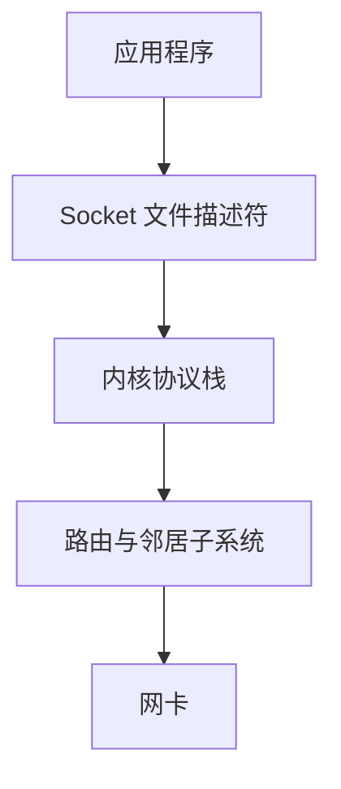
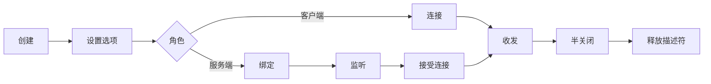
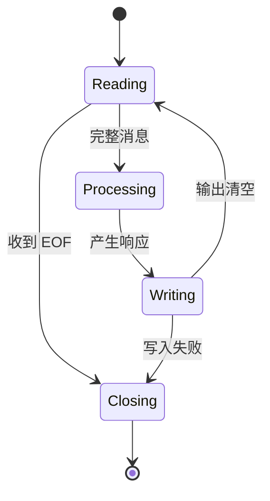
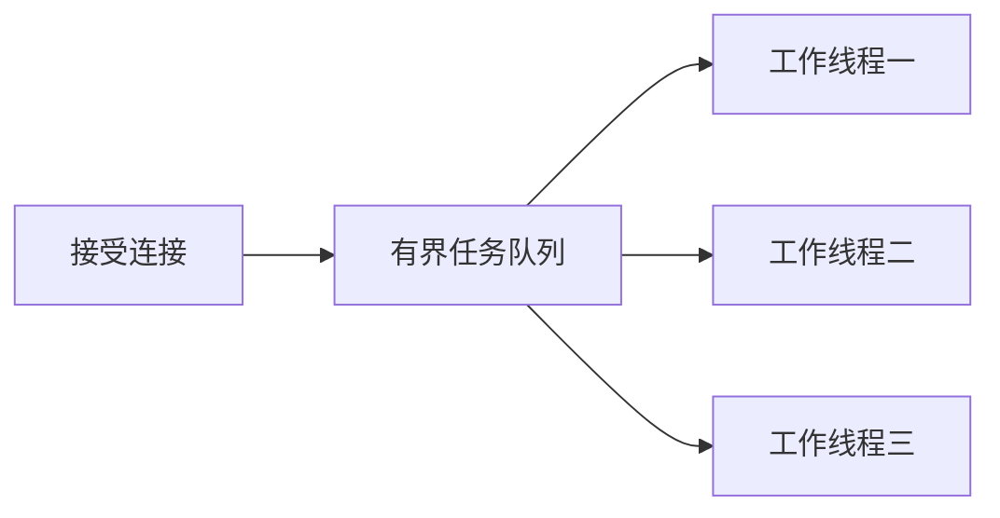
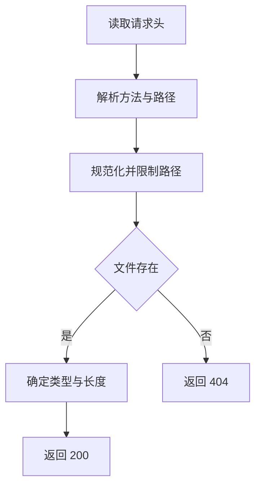
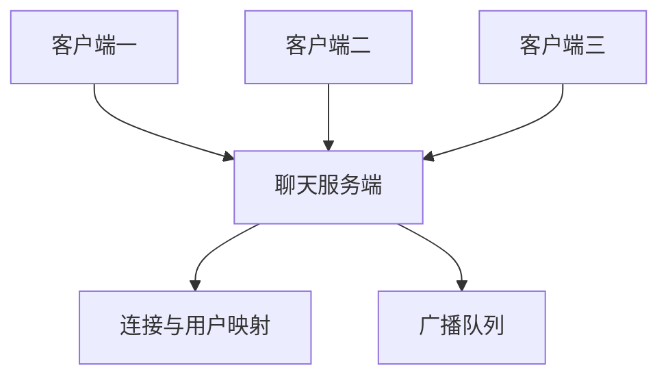
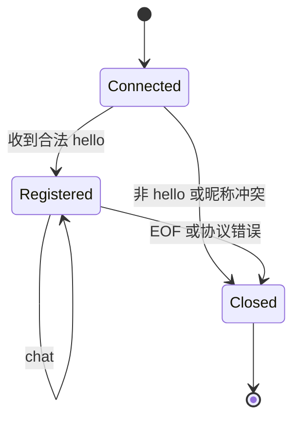
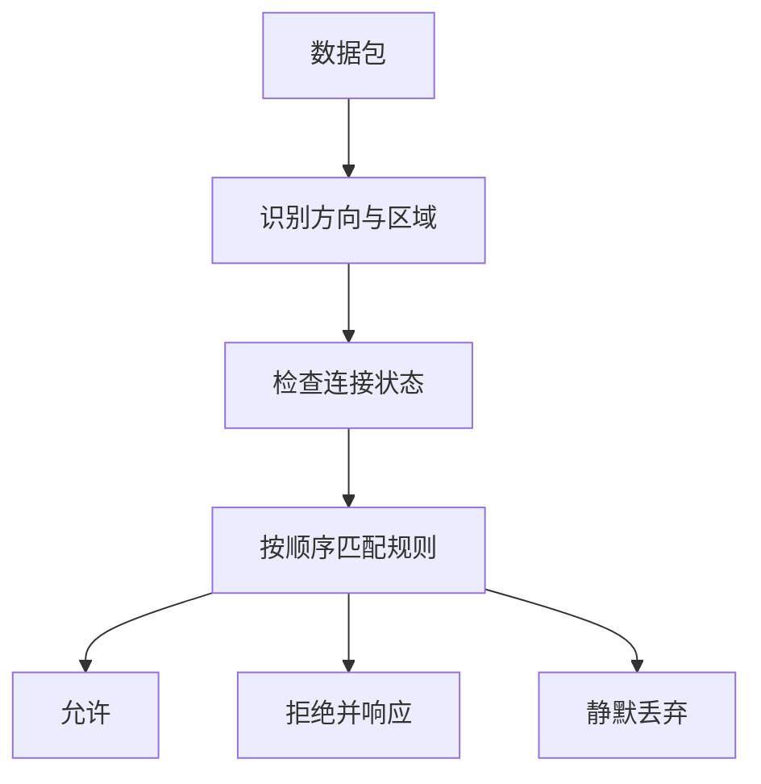
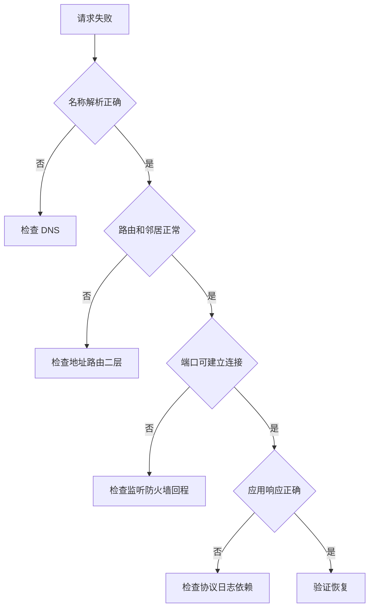

# 计算机网络基础学习笔记 · 第三册：Socket、安全与排障实战

## 第三册 · Socket、安全与排障实战

### Socket API 如何连接应用程序与协议栈
<!-- src: temp/network/1.txt (Ch. 2.4 OS, Network Programming, Sockets; Ch. 3 Introducing The Sockets API) -->

Socket 是应用访问操作系统网络协议栈的编程接口。应用通过文件描述符执行创建、绑定、监听、连接、收发和关闭等操作；操作系统负责 TCP 状态、IP 路由、邻居解析以及网卡队列。

> **材料说明**：知识覆盖参考 Brian “Beej Jorgensen” Hall 的 *Beej's Guide to Network Concepts* v1.0.40。本文按运维与 SRE 学习路径进行原创重组，不是原书的逐章翻译；原作及其许可信息以 [官方页面](https://beej.us/guide/bgnet0/) 为准。



创建 Socket 时最重要的三个参数是地址族、类型和协议：

```python
import socket

tcp4 = socket.socket(socket.AF_INET, socket.SOCK_STREAM)
udp6 = socket.socket(socket.AF_INET6, socket.SOCK_DGRAM)
```

`AF_INET` 与 `AF_INET6` 分别表示 IPv4 和 IPv6，`SOCK_STREAM` 通常对应 TCP 字节流，`SOCK_DGRAM` 通常对应 UDP 数据报。应用仍需设置超时、限制资源并处理所有系统调用可能返回的错误。

#### Socket 生命周期



每个调用都可能失败。`bind` 可能遇到地址占用或权限不足；`connect` 可能解析失败、超时或被拒绝；`recv` 可能超时、被信号中断或返回 EOF。

#### 阻塞、超时与非阻塞

| 模式 | 调用行为 | 适合场景 |
| --- | --- | --- |
| 阻塞 | 等到完成或错误 | 简单客户端、线程模型 |
| 带超时 | 最长等待指定时间 | 外部依赖调用 |
| 非阻塞 | 不能立即完成就返回 | 事件循环 |

```python
sock.settimeout(5.0)
sock.setblocking(False)
```

后一次调用会覆盖前面的阻塞模式。生产代码应在接口层统一约定，避免某个辅助函数悄悄改变共享 Socket 状态。

### TCP 客户端如何解析地址、建立连接并收发数据
<!-- src: temp/network/1.txt (Ch. 3.1 Client Connection Process; Ch. 5.4 HTTP Client) -->

客户端通常先解析服务名，再依次尝试返回的地址。`socket.create_connection` 会替我们完成常见的解析和连接步骤：

```python
import socket

with socket.create_connection(("example.com", 80), timeout=5) as sock:
    request = (
        b"GET / HTTP/1.1\r\n"
        b"Host: example.com\r\n"
        b"Connection: close\r\n\r\n"
    )
    sock.sendall(request)
    chunks = []
    while True:
        chunk = sock.recv(4096)
        if not chunk:
            break
        chunks.append(chunk)

response = b"".join(chunks)
print(response[:200].decode("iso-8859-1"))
```

`sendall` 表示持续发送直到全部数据交给内核或发生错误；一次 `recv` 不保证拿到完整响应。返回空字节串表示对端已正常关闭发送方向，而不是“暂时没有数据”。

生产客户端还要区分 DNS 失败、连接拒绝、连接超时、读取超时和协议错误，因为这些错误对应不同的重试与告警策略。

#### 不依赖 create_connection 的完整流程

`getaddrinfo` 可以返回多个 IPv4 或 IPv6 候选。客户端应依次尝试，而不是假设域名只对应一个地址。

```python
import socket

def connect_any(host: str, port: int, timeout: float = 5):
    errors = []
    for family, socktype, proto, _, sockaddr in socket.getaddrinfo(
        host, port, type=socket.SOCK_STREAM
    ):
        sock = socket.socket(family, socktype, proto)
        sock.settimeout(timeout)
        try:
            sock.connect(sockaddr)
            return sock
        except OSError as exc:
            errors.append((sockaddr, exc))
            sock.close()
    raise OSError(f"all addresses failed: {errors}")
```

每个失败候选都必须关闭，最终错误应保留尝试过的地址，方便区分单一地址故障与服务整体故障。

#### 重试边界

连接超时可以在有限次数内退避重试；连接拒绝通常表示目标明确拒绝，盲目高频重试只会放大负载。非幂等业务在收到响应前断线时，客户端无法仅凭 TCP 判断服务器是否已执行操作。

### TCP 服务端如何绑定、监听并接受连接
<!-- src: temp/network/1.txt (Ch. 3.2 Server Listening Process) -->

TCP 服务端的基本流程是 `socket`、`bind`、`listen`、`accept`。监听 Socket 只负责接受连接，`accept` 返回的新 Socket 才负责与特定客户端通信。

```python
import socket

with socket.socket(socket.AF_INET, socket.SOCK_STREAM) as server:
    server.setsockopt(socket.SOL_SOCKET, socket.SO_REUSEADDR, 1)
    server.bind(("127.0.0.1", 9000))
    server.listen(128)
    while True:
        conn, peer = server.accept()
        with conn:
            conn.settimeout(10)
            data = conn.recv(4096)
            conn.sendall(data)
```

绑定 `127.0.0.1` 只允许本机访问；绑定 `0.0.0.0` 会监听所有 IPv4 接口，并不代表防火墙已经放行。`listen` 的 backlog 与内核连接队列有关，不是最大并发连接数。

示例是串行服务端，一个慢客户端会阻塞后续连接。实际服务可选择线程、进程、事件循环或异步 I/O，并设置连接数、读取长度和空闲时间限制。

#### 监听 Socket 和连接 Socket

| 对象 | 主要调用 | 生命周期 |
| --- | --- | --- |
| 监听 Socket | `bind`、`listen`、`accept` | 通常贯穿服务进程 |
| 连接 Socket | `recv`、`send`、`shutdown` | 对应一个客户端会话 |

`accept` 返回 `(connection, peer_address)`。关闭连接 Socket 不影响继续监听；误关闭监听 Socket 则无法接受新连接。

#### 地址复用不是端口共享魔法

`SO_REUSEADDR` 主要帮助服务重启时处理旧连接相关状态，不意味着任意两个进程都能安全监听相同端点。不同系统对 `SO_REUSEPORT` 的行为也不同，使用前必须理解负载分配和安全边界。

服务启动后应从系统视角确认真实监听：

```bash
ss -lntp '( sport = :9000 )'
lsof -nP -iTCP:9000 -sTCP:LISTEN
```

### UDP Socket 如何收发独立数据报
<!-- src: temp/network/1.txt (Ch. 15.8 UDP Datagram Sockets) -->

UDP 服务端使用 `recvfrom` 同时获得数据和来源地址，回复时用 `sendto` 指定目标。每次读取对应一个数据报；接收缓冲区太小时，超出部分会被截断，而不是留给下次读取。

```python
import socket

with socket.socket(socket.AF_INET, socket.SOCK_DGRAM) as sock:
    sock.bind(("127.0.0.1", 9001))
    while True:
        data, peer = sock.recvfrom(2048)
        sock.sendto(data.upper(), peer)
```

UDP 没有连接建立并不代表没有状态。服务器可能仍要按客户端维护会话、请求 ID、重放保护、速率限制和超时。应用也不应相信来源地址绝对真实，因为无连接协议更容易遭遇地址伪造。

#### connected UDP

UDP Socket 也可以调用 `connect`，但不会产生 TCP 握手。操作系统只是保存默认对端，使应用能用 `send` 和 `recv`，并过滤其他来源的数据报。

```python
with socket.socket(socket.AF_INET, socket.SOCK_DGRAM) as sock:
    sock.settimeout(2)
    sock.connect(("192.0.2.53", 53))
    sock.send(b"query")
    reply = sock.recv(2048)
```

一个数据报要么作为整体交给接收调用，要么因缓冲区不足被截断。应用应为最大合法报文准备缓冲区，并在平台支持时检查截断标志。

#### UDP 错误语义

无响应可能是服务未回复、请求或响应丢失、防火墙丢弃，也可能是目标不存在。ICMP Port Unreachable 有时会被传回 Socket，但中间设备不保证发送或转发它。

### select 如何管理可读、可写、监听与超时事件
<!-- src: temp/network/1.txt (Ch. 29 Select) -->

阻塞式 `recv` 会让线程等待一个连接。`select` 可以同时观察多个文件描述符是否可读、可写或异常，从而用一个事件循环管理多个连接。

```python
import selectors
import socket

selector = selectors.DefaultSelector()
server = socket.socket()
server.setsockopt(socket.SOL_SOCKET, socket.SO_REUSEADDR, 1)
server.bind(("127.0.0.1", 9002))
server.listen()
server.setblocking(False)
selector.register(server, selectors.EVENT_READ, data=None)

while True:
    for key, events in selector.select(timeout=1):
        if key.data is None:
            conn, peer = server.accept()
            conn.setblocking(False)
            selector.register(conn, selectors.EVENT_READ, data=peer)
        else:
            conn = key.fileobj
            data = conn.recv(4096)
            if data:
                conn.sendall(data)
            else:
                selector.unregister(conn)
                conn.close()
```

Python 的 `selectors` 会选择平台合适的底层机制。事件驱动并不自动解决所有问题：非阻塞发送可能只写入部分数据，因此真实服务要维护每个连接的输入缓冲、输出缓冲和协议状态。

#### 三类集合

原始 `select` 接受可读、可写和异常集合。监听 Socket 可读表示有连接等待 `accept`；普通 Socket 可读表示有数据或 EOF；Socket 可写只说明当前发送缓冲区有空间，不说明业务请求成功。

永远把所有连接放进可写集合会导致事件循环持续唤醒。只有输出缓冲区非空时才订阅写事件，发送完毕后立即取消。

#### 超时驱动周期任务

```python
events = selector.select(timeout=1.0)
if not events:
    expire_idle_connections()
```

超时可以驱动心跳、空闲连接清理和指标上报，但不要用大量线性扫描拖慢每次循环。连接多时应使用按到期时间组织的数据结构。

### 用 select 构建多客户端事件循环
<!-- src: temp/network/1.txt (Ch. 30 Project Using Select) -->

每个连接需要独立状态，至少包含输入缓冲、输出缓冲、最后活动时间和协议解析阶段。

```python
from dataclasses import dataclass, field

@dataclass
class ConnectionState:
    input: bytearray = field(default_factory=bytearray)
    output: bytearray = field(default_factory=bytearray)
    closing: bool = False
```

#### 主循环职责

1. 监听 Socket 可读时，循环接受到暂时无新连接。
2. 连接可读时，把字节追加到该连接缓冲。
3. 从缓冲中提取零个或多个完整消息。
4. 把响应编码后追加到输出缓冲。
5. 连接可写时尽量发送，并删除已发送前缀。
6. 对端 EOF 后决定立即关闭还是发送完剩余响应再关闭。



公平性很重要。单个连接一次产生大量事件时，应限制每轮处理量，让其他连接也有机会运行。

### 线程的启动、共享状态与执行顺序有什么风险
<!-- src: temp/network/1.txt (Ch. 42.1-42.2 Thread Concepts and Python Multithreading) -->

线程模型直观：主线程接受连接，再由工作线程处理客户端。但并发会引入共享状态竞争、线程泄漏、锁顺序、阻塞调用和无界资源消耗等问题。



建议使用有界线程池而不是每个连接无限创建线程，并为读写设置超时。共享字典、计数器和连接列表需要锁或消息传递保护；关闭服务时要停止接受新任务、等待在途任务并释放 Socket。

Python 中 I/O 密集型服务可以受益于线程，但 CPU 密集工作仍受运行时和资源模型影响。选择线程、进程还是异步事件循环，应依据连接数、任务性质、隔离需求和团队维护能力。

#### start 和 join 的职责

`Thread` 构造函数只创建对象，`start` 才启动新执行流，`join` 让调用线程等待目标结束。直接调用线程的 target 函数不会产生并发。

```python
import threading
import time

def runner(name, count):
    for index in range(count):
        print(name, index)
        time.sleep(0.1)

threads = [
    threading.Thread(target=runner, args=(f"worker-{i}", 3))
    for i in range(3)
]
for thread in threads:
    thread.start()
for thread in threads:
    thread.join()
```

输出顺序不确定，代码不能依赖“线程按创建顺序运行”。共享可变对象需要锁、队列或所有权约束；只读数据更容易安全共享。

### daemon、join 与线程练习如何管理生命周期
<!-- src: temp/network/1.txt (Ch. 42.3-42.5 Daemon Threads, CTRL C and Threading Project) -->

进程退出时不会等待 daemon 线程完成，它们可能在清理、刷新文件或发送消息中途被终止。daemon 适合“主流程结束后无需保证完成”的辅助任务，不适合承载必须持久化的关键工作。

```python
stop = threading.Event()

def receiver(sock):
    while not stop.is_set():
        try:
            data = sock.recv(4096)
        except TimeoutError:
            continue
        if not data:
            break

thread = threading.Thread(target=receiver, args=(sock,), daemon=True)
thread.start()

try:
    run_user_interface()
finally:
    stop.set()
    sock.close()
    thread.join(timeout=2)
```

#### 分段求和练习

原文练习让每个线程计算一个整数范围，并把结果写入预先分配的独立槽位。因为每个线程只写自己的索引，可以避免多个线程同时修改同一值。

```python
def range_sum(index, start, end, result):
    result[index] = sum(range(start, end + 1))
```

主线程先启动全部线程，再逐个 join，最后汇总结果。进一步思考：逐个循环求和是 O(n)，公式 `n*(n+1)//2` 能把每段计算降为 O(1)，算法改进往往比增加线程更有效。

#### 可控退出清单

- 捕获主线程退出信号。
- 停止接受新连接。
- 通知工作线程停止。
- 给阻塞 I/O 设置超时或关闭 Socket。
- 等待有界时间。
- 记录未完成任务并释放资源。

### Python 字符串、字符编码与网络字节如何转换
<!-- src: temp/network/1.txt (Ch. 5.2 Python Character Encoding) -->

Socket 只发送 `bytes`，Python 文本使用 `str`。编码把字符转换成字节，解码把字节按约定还原为字符；双方编码不一致会产生乱码或解码错误。

```python
text = "网络 hello"
wire = text.encode("utf-8")
assert wire.decode("utf-8") == text
```

#### 协议元数据和正文编码

HTTP/1.1 的请求行和 Header 以字节定义，实践中常用 ISO-8859-1 做一对一解码以保留原始字节；正文编码则由 `Content-Type` 的 charset 或协议约定决定。

```text
Content-Type: text/plain; charset=utf-8
Content-Length: 12
```

`Content-Length` 计算字节数，不是字符数：

```python
body = "你好".encode("utf-8")
assert len(body) == 6
```

不要先按字符截断再假设字节长度不变。流式解码还要处理一个多字节字符被拆到两次 `recv` 的情况，可以使用增量解码器或等完整消息到齐再解码。

### 用原生 Socket 编写最小 HTTP 客户端和服务端
<!-- src: temp/network/1.txt (Ch. 5.1-5.5 HTTP Client and Server Project) -->

HTTP/1.1 消息由起始行、Header、空行和可选 Body 组成，行结束符是 `\r\n`。下面的服务端只用于观察协议，不适合公网部署：

```python
from http import HTTPStatus
import socket

body = b"hello network\n"
response = (
    f"HTTP/1.1 {HTTPStatus.OK.value} OK\r\n"
    f"Content-Type: text/plain; charset=utf-8\r\n"
    f"Content-Length: {len(body)}\r\n"
    "Connection: close\r\n\r\n"
).encode("ascii") + body

with socket.socket() as server:
    server.setsockopt(socket.SOL_SOCKET, socket.SO_REUSEADDR, 1)
    server.bind(("127.0.0.1", 8080))
    server.listen()
    conn, _ = server.accept()
    with conn:
        request = conn.recv(4096)
        print(request.decode("iso-8859-1"))
        conn.sendall(response)
```

用 `curl -v http://127.0.0.1:8080/` 可以观察请求与响应。实验应重点确认空行边界、字节长度和连接关闭语义，而不是把一次 `recv` 当成完整 HTTP 解析器。

#### 不使用高级 HTTP 库的学习目的

原文限制 `create_connection`、`create_server` 和 urllib，是为了暴露 DNS、Socket 创建、循环接收和协议编码步骤。生产代码应优先使用成熟库，学习项目则应明确它只支持哪些 HTTP 子集。

客户端命令行可以接收主机和可选端口：

```bash
python webclient.py example.com
python webclient.py example.com 8080
```

服务端应循环 `accept`，而不是只处理一次连接。读取请求 Header 时要等到 `\r\n\r\n`，不能等待客户端关闭，因为客户端正等着响应，这会形成双方互等。

#### 最小验证矩阵

| 客户端 | 服务端 | 应观察到的结果 |
| --- | --- | --- |
| 自写客户端 | example.com | 打印状态行、Header 和 Body |
| curl | 自写服务端 | 收到合法 200 响应 |
| 浏览器 | 自写服务端 | 页面显示且可能附带 favicon 请求 |
| 分块发送测试 | 自写服务端 | Header 跨 recv 仍能解析 |

浏览器发起第二个连接不一定是程序错误，可能是请求 `/favicon.ico`。服务端日志应打印对端地址、方法和路径帮助判断。

### 如何解释 HTTP 重定向、客户端错误和服务端错误
<!-- src: temp/network/1.txt (Ch. 5.6 HTTP 301, 302, 400, 404 and 500 Responses) -->

状态码分组表达处理结果：2xx 成功，3xx 需要进一步动作，4xx 表示请求侧问题，5xx 表示服务端处理失败。

| 状态 | 含义 | 客户端下一步 |
| --- | --- | --- |
| 301 | 资源永久迁移 | 读取 Location 并更新长期引用 |
| 302 | 临时跳转 | 本次跟随 Location |
| 400 | 请求格式错误 | 检查请求行、CRLF 和 Header |
| 404 | 当前路径不存在 | 核对 Host 和 Path |
| 501 | 方法或能力未实现 | 改用服务支持的方式 |
| 500 | 服务端内部错误 | 结合请求 ID 查看服务日志 |

```text
HTTP/1.1 301 Moved Permanently
Location: https://www.example.com/
Content-Length: 0

```

自动跟随重定向必须设置最大次数并防止环路。跨域或从 HTTPS 跳到 HTTP 时还要考虑凭据泄漏和降级风险。

#### 常见格式错误

- 行尾只发送 `\n`，没有 `\r\n`。
- Header 末尾缺少空行。
- HTTP/1.1 请求缺少正确 Host。
- Content-Length 使用字符数而不是字节数。
- 声明长度与实际 Body 不一致。

```bash
curl -v --max-redirs 0 http://example.com/
curl -v -L --max-redirs 5 http://example.com/
```

### 静态文件服务端如何解析请求、MIME 和 Content Length
<!-- src: temp/network/1.txt (Ch. 9.1-9.7 Better Web Server Project) -->

静态文件服务大致经历：读取完整 Header、解析请求行、验证方法、规范化路径、确定 MIME 类型、读取文件、生成 `Content-Length` 并发送响应。



绝不能直接把 URL 路径拼到文件根目录，否则 `../`、编码变体和符号链接可能造成目录穿越。应先解码并规范化，再确认最终路径仍位于允许根目录内。

成熟 HTTP 服务器还要处理请求大小、慢速客户端、重复 Header、分块传输、持久连接、条件请求和范围请求。学习项目的边界必须写清楚，不能把最小示例误当成生产实现。

#### 请求行解析

完整收到 Header 后，以 CRLF 分行，再把第一行拆成方法、目标和版本。任何字段缺失或数量异常都应返回 400，而不是抛出未处理异常。

```python
request_line = header_bytes.split(b"\r\n", 1)[0]
method, target, version = request_line.decode("iso-8859-1").split(" ", 2)
if method != "GET":
    raise ValueError("unsupported method")
```

#### MIME 和长度

| 后缀 | Content-Type |
| --- | --- |
| `.txt` | `text/plain; charset=utf-8` |
| `.html` | `text/html; charset=utf-8` |
| `.jpg` | `image/jpeg` |
| `.pdf` | `application/pdf` |
| 未知 | `application/octet-stream` |

```python
import mimetypes

content_type, _ = mimetypes.guess_type(file_path.name)
content_type = content_type or "application/octet-stream"
body = file_path.read_bytes()
content_length = len(body)
```

文件必须以二进制读取，否则换行转换和字符编码可能让实际发送字节数与 Content-Length 不一致。

### 如何限制文件路径、返回 404 并安全扩展服务端
<!-- src: temp/network/1.txt (Ch. 9.5 Path Stripping; Ch. 9.7-9.8 Not Found and Extensions) -->

简单实验可以只取路径最后一段，但更真实的实现需要允许根目录内的子路径，同时拒绝逃逸。

```python
from pathlib import Path
from urllib.parse import unquote, urlsplit

ROOT = Path("public").resolve()

def resolve_target(target: str) -> Path:
    raw_path = unquote(urlsplit(target).path).lstrip("/")
    candidate = (ROOT / raw_path).resolve()
    if candidate != ROOT and ROOT not in candidate.parents:
        raise PermissionError("path escapes document root")
    return candidate
```

校验必须在 URL 解码和路径规范化之后进行，并考虑符号链接。把字符串中出现 `..` 直接拒绝既可能误判，也可能漏掉编码变体。

#### 404 响应

```text
HTTP/1.1 404 Not Found
Content-Type: text/plain; charset=utf-8
Content-Length: 14
Connection: close

404 not found
```

长度要按真实 Body 字节重新计算。错误页面也不能暴露服务器绝对路径、堆栈和配置。

#### 渐进扩展顺序

1. 只支持 GET 和两个固定文件。
2. 增加 MIME 映射和二进制文件。
3. 增加受限子目录。
4. 增加目录索引但转义文件名。
5. 增加并发、超时和最大 Header。
6. 为所有异常返回明确状态并记录请求 ID。

每一步先写非法路径、缺失文件和半包测试，再增加能力。

### 如何正确处理偏移量、半包与多个消息
<!-- src: temp/network/1.txt (Ch. 5.6.2 Receiving Partial Data; Ch. 11 Parsing Packets; Ch. 13 The Word Server) -->

接收循环应把新字节追加到缓冲区，再反复解析其中所有完整消息，最后保留不完整尾部。解析函数最好返回“消息”和“剩余缓冲区”，避免把读取和协议解析耦合。

```python
import struct

MAX_FRAME = 1024 * 1024

def extract_frames(buffer: bytearray):
    frames = []
    while len(buffer) >= 4:
        size = struct.unpack("!I", buffer[:4])[0]
        if size > MAX_FRAME:
            raise ValueError("frame too large")
        if len(buffer) < 4 + size:
            break
        frames.append(bytes(buffer[4:4 + size]))
        del buffer[:4 + size]
    return frames
```

测试至少覆盖：只有部分长度头、长度头完整但 Body 不完整、一次收到多帧、消息刚好到上限、长度超过上限、对端在半帧时关闭。

### 用 Atomic Time 实验解码固定长度二进制协议
<!-- src: temp/network/1.txt (Ch. 12 Project Atomic Time) -->

固定长度协议适合用来练习“精确读取 N 字节”和网络字节序。读取函数必须循环，因为一次 `recv(n)` 仍可能少于 n：

```python
def recv_exact(sock, size: int) -> bytes:
    chunks = []
    remaining = size
    while remaining:
        chunk = sock.recv(remaining)
        if not chunk:
            raise EOFError("peer closed before full message")
        chunks.append(chunk)
        remaining -= len(chunk)
    return b"".join(chunks)
```

解码时要明确字段宽度、符号、字节序和时间纪元。例如一个 4 字节无符号大端整数可以用 `struct.unpack("!I", data)`。协议时间与 Unix 时间可能使用不同纪元，换算前应查明定义，而不是仅凭数值猜测。

#### 实验流程

1. 连接指定时间服务端口。
2. 精确读取协议规定的 4 字节。
3. 按无符号网络字节序转成整数。
4. 根据协议纪元换算为 Unix 时间。
5. 同时打印远端时间与本机时间。
6. 计算差值并设置合理容差。

```python
import struct
import time

raw = recv_exact(sock, 4)
remote_seconds = struct.unpack("!I", raw)[0]
unix_seconds = remote_seconds - EPOCH_DELTA
print("remote", unix_seconds)
print("local ", int(time.time()))
```

固定长度协议也可能被提前 EOF 截断。把不足 4 字节用零补齐会制造看似合法但完全错误的时间，应直接报错。

#### 纪元与溢出

不同时间协议可能从 1900、1970 或其他日期计数。32 位秒数还会回绕，长期运行系统必须明确时代编号或升级字段宽度。

### 用 Word Server 实验实现长度前缀和流式拆包
<!-- src: temp/network/1.txt (Ch. 13 Project The Word Server) -->

Word Server 把每个单词封装为消息，训练从 TCP 字节流中连续提取包。可以设计两字节大端长度，后接 UTF-8 单词字节。

```text
00 05 68 65 6c 6c 6f
长度 5  载荷 hello
```

```python
import struct

def encode_word(word: str) -> bytes:
    payload = word.encode("utf-8")
    if len(payload) > 65535:
        raise ValueError("word too long")
    return struct.pack("!H", len(payload)) + payload

def extract_word(buffer: bytearray):
    if len(buffer) < 2:
        return None
    size = struct.unpack("!H", buffer[:2])[0]
    if len(buffer) < 2 + size:
        return None
    payload = bytes(buffer[2:2 + size])
    del buffer[:2 + size]
    return payload.decode("utf-8")
```

测试时把同一字节流按每 1 字节、随机长度和一次全部三种方式喂给解析器，结果必须一致。还要测试空单词、非法 UTF-8、超长声明和半包 EOF。

### JSON 与 Python 对象如何编码、解码和验证
<!-- src: temp/network/1.txt (Ch. 43 JSON; Ch. 39.5 JSON Payloads) -->

JSON 解决消息内容的结构表达，不解决 TCP 消息边界。常见做法是在 JSON 前加长度，或规定每行一个 JSON 对象。

```python
import json
import struct

def encode_json(message: dict) -> bytes:
    payload = json.dumps(
        message, ensure_ascii=False, separators=(",", ":")
    ).encode("utf-8")
    return struct.pack("!I", len(payload)) + payload
```

应用还应定义消息类型、必填字段、版本和错误响应，例如：

```json
{
  "version": 1,
  "type": "chat",
  "request_id": "a42",
  "body": {"text": "你好"}
}
```

解析成功不代表消息可信。必须校验类型、长度、枚举值和权限，拒绝未知或超限输入。

#### JSON 和 Python 对象并不相同

| JSON | Python 常见对应 |
| --- | --- |
| object | dict |
| array | list |
| string | str |
| number | int 或 float |
| true 和 false | True 和 False |
| null | None |

JSON 要求字符串和键使用双引号，不能发送 Python dict 的 `repr`。数字还要考虑精度和范围，不同语言未必以相同类型解释大整数。

```python
decoded = json.loads(payload.decode("utf-8"))
if not isinstance(decoded, dict):
    raise ValueError("message must be an object")
if decoded.get("version") != 1:
    raise ValueError("unsupported version")
if decoded.get("type") not in {"hello", "chat", "join", "leave"}:
    raise ValueError("unknown message type")
```

Pretty Print 适合日志和调试，线上帧可使用紧凑分隔符。日志仍应限制长度并脱敏，不能把令牌和私人消息完整打印。

### 多用户聊天室的客户端和服务端如何协作
<!-- src: temp/network/1.txt (Ch. 39.1-39.3 Chat Architecture, Client IO and TUI) -->

聊天室是综合练习：服务端管理多个连接，客户端同时处理终端输入与服务器消息，协议区分加入、聊天、离开和错误事件。



服务端状态至少包括连接、用户名、输入缓冲和输出缓冲。用户名不能只由客户端声明后直接信任；广播时要处理慢客户端，不能让一个写不动的连接阻塞所有用户。

可按以下顺序增量实现：单连接回显、长度前缀、多个连接、用户注册、消息广播、离线清理、心跳与空闲超时。每一步都保留协议测试，避免最后才调试所有层次。

#### 服务端状态

服务端以已连接 Socket 集合作为在线用户来源，并维护两个方向的映射：Socket 到昵称、昵称到 Socket。昵称注册成功之前，不接受普通聊天消息。

```python
clients = set()
nick_by_socket = {}
socket_by_nick = {}
buffers = {}
```

断线时必须原子地清理这些结构，并向其余用户广播离开事件。重复昵称、注册前发消息和未知消息类型都应返回协议错误或主动断开。

#### 客户端双重阻塞

客户端一边等待用户输入，一边等待服务端消息。可以由主线程处理 TUI，daemon 接收线程只负责读取网络并通过线程安全队列传递事件。多个线程直接操作终端容易破坏光标和输入状态。

特殊命令 `/q` 应在本地触发退出，不发送普通聊天消息。退出流程要关闭 Socket，使接收线程从阻塞读取中醒来。

### Hello、Chat、Join 与 Leave 消息如何设计
<!-- src: temp/network/1.txt (Ch. 39.4-39.5 Packet Structure and JSON Payload Types) -->

原文协议使用两字节大端长度和 UTF-8 JSON 载荷。长度只覆盖 JSON 字节，不包含两字节头。

```text
2 字节 payload length
N 字节 UTF-8 JSON payload
```

四类基础消息：

```json
{"type":"hello","nick":"alice"}
```

```json
{"type":"chat","message":"hello"}
```

```json
{"type":"join","nick":"bob"}
```

```json
{"type":"leave","nick":"bob"}
```

服务端广播 chat 时增加发送者昵称。客户端不应自己声明发送者，因为服务端已经把连接与昵称绑定。

#### 状态约束



字段验证包括昵称和消息长度、字符范围、必填键、未知键策略及版本。广播前仍要进行服务端授权和速率限制。

### 每连接缓冲区、并发接收与断线清理如何实现
<!-- src: temp/network/1.txt (Ch. 39.6-39.7 Chat Extensions and Recommendations; Ch. 42 Multithreading) -->

TCP 接收缓冲必须按连接隔离。把所有客户端字节追加到同一个全局缓冲会混合不同会话，造成数据泄漏和协议损坏。

```python
buffers = {sock: bytearray() for sock in clients}

def on_readable(sock):
    chunk = sock.recv(4096)
    if not chunk:
        disconnect(sock)
        return
    buffers[sock].extend(chunk)
    while packet := extract_packet(buffers[sock]):
        handle_packet(sock, packet)
```

实际 Python 版本要避免把合法空载荷与“没有完整包”混淆，最好返回明确哨兵。

#### 慢客户端治理

广播时不能对每个 Socket 直接阻塞 `sendall`。应把编码后的同一帧追加到各自输出缓冲，由写事件逐步发送，并限制单连接积压上限。

| 风险 | 控制手段 |
| --- | --- |
| 不读消息的客户端 | 输出缓冲上限、超时断开 |
| 高频发言 | 令牌桶限速 |
| 超长消息 | 解码前限制帧长 |
| 昵称抢占 | 原子注册、唯一索引 |
| 断线清理遗漏 | 单一 disconnect 函数 |

扩展直接消息、房间和在线列表时，应新增消息类型，而不是在 chat 文本里塞特殊字符串；协议结构化后才容易验证和演进。

### Wireshark 如何逐字段验证 ARP 请求与响应
<!-- src: temp/network/1.txt (Ch. 23 Sniff ARP Packets with Wireshark) -->

先清理或等待邻居缓存失效，再向同网段目标发送流量，才能稳定观察 ARP。Linux 可结合命令行抓包：

```bash
ip neigh show
sudo tcpdump -ni eth0 arp
ping -c 1 192.168.10.1
```

在 Wireshark 中使用显示过滤器 `arp`，检查 Request 是否广播、Sender IP/MAC 是否符合发送方、Reply 是否包含目标 MAC。若只有 Request 没有 Reply，继续检查目标是否在线、VLAN 是否一致、接口是否启用及二层安全策略。

抓包只看到观察点经过的流量。交换网络中，在普通主机上不能期待看到其他端口的所有单播包；必要时需要交换机端口镜像、主机本地抓包或链路两端同时抓包。

#### 字段核对表

| 检查项 | Request | Reply |
| --- | --- | --- |
| Ethernet Destination | 广播 MAC | 请求方 MAC |
| Operation | request 1 | reply 2 |
| Sender MAC/IP | 请求方 | 回应方 |
| Target MAC | 通常全零 | 请求方 MAC |
| Target IP | 被查询地址 | 请求方地址 |

先记录本机邻居表，再抓包，再次查看邻居表，可以把线上的回应与内核缓存变化对应起来。

```bash
ip neigh show dev eth0
sudo tcpdump -eni eth0 -c 10 arp
```

若收到 Reply 但邻居仍 FAILED，应检查响应目标、重复地址、接口命名空间以及安全策略，而不是只重复发送 arping。

### TCP 与 UDP 端口扫描能发现什么
<!-- src: temp/network/1.txt (Ch. 35 Port Scanning; Ch. 38 Port Scanning Project) -->

TCP connect 扫描尝试完成操作系统的连接过程：成功通常表示端口有服务且路径允许；立即收到 RST 通常表示端口关闭；超时可能表示丢包、防火墙丢弃、目标不可达或返回路径异常。

```python
import socket

def probe(host: str, port: int) -> str:
    try:
        with socket.create_connection((host, port), timeout=0.5):
            return "open"
    except ConnectionRefusedError:
        return "closed"
    except (TimeoutError, OSError):
        return "unknown"
```

UDP 扫描更难判断：没有响应既可能表示端口开放，也可能是包被丢弃。扫描结果只能描述特定来源、时间和协议下的可达性，不能证明服务安全或所有路径都一致。

只扫描自己拥有或明确获授权的系统，并控制速率，避免造成告警或负载影响。

#### TCP 与 UDP 的结果语义

| 探测结果 | TCP Connect | UDP |
| --- | --- | --- |
| 收到应用响应 | open | open |
| 收到 RST | closed | 不适用 |
| ICMP Port Unreachable | 路径相关 | 通常 closed |
| 完全无响应 | filtered 或超时 | open 或 filtered |

UDP 扫描若只发送空数据，许多开放服务也不会响应。更可靠的方法是发送目标协议能理解的最小请求，例如 DNS 查询，但仍要遵守授权范围。

#### 有界并发扫描器

```python
from concurrent.futures import ThreadPoolExecutor

ports = range(1, 1025)
with ThreadPoolExecutor(max_workers=32) as pool:
    results = dict(zip(ports, pool.map(lambda p: probe("192.0.2.10", p), ports)))
```

并发数、每次超时和目标数量共同决定扫描压力。记录扫描源、时间、参数和授权单，结果才能用于审计和复现。

### 防火墙如何与连接状态和 NAT 协同过滤流量
<!-- src: temp/network/1.txt (Ch. 36 Firewalls) -->

无状态防火墙逐包匹配地址、协议和端口；有状态防火墙还跟踪连接，能区分新建连接和已建立连接的返回流量。主机防火墙保护单机，网络防火墙保护多个网段，云安全组则在虚拟网络边界实施规则。



排查前先只读查看现状：

```bash
nft list ruleset
iptables-save
ss -lntup
```

“服务已监听”与“远端可访问”是两回事。还要检查监听地址、主机防火墙、云安全组、网络 ACL、负载均衡健康检查和返回路径。修改规则前应准备带外访问或自动回滚，防止把自己锁在远端主机之外。

#### ACCEPT、REJECT 与 DROP

ACCEPT 允许继续处理；REJECT 丢弃并向发送方返回错误；DROP 静默丢弃。REJECT 让合法客户端更快失败，DROP 减少部分信息暴露，但会表现为超时并增加排障时间。

#### NAT 与过滤顺序

数据包可能先做目的地址转换，再进入某条过滤链。规则匹配的是转换前还是转换后地址，取决于具体 Hook 和平台。排查时查看计数器和完整规则集，不凭规则文件顺序猜测。

```bash
nft monitor trace
conntrack -L
```

Trace 可能产生大量输出，只应在受控条件下加精确过滤。远程修改规则要先建立回滚任务，并保持现有管理会话。

#### 最小权限策略

- 默认拒绝未声明入站。
- 只开放实际监听端口。
- 限定来源网段而非全网。
- 允许已建立连接的返回流量。
- 记录关键拒绝但做速率限制。
- 定期清理临时规则和失效对象。

### 缓冲区越界和资源耗尽为什么来自不可信输入
<!-- src: temp/network/1.txt (Ch. 37.1 Buffer Overflow and Overrun) -->

网络输入由不受信任的对端控制。攻击者可以发送超长字段、非法编码、重复消息、极慢数据、恶意路径、注入字符串或精心构造的二进制长度。

安全解析的基本原则：

- 在分配内存前校验长度上限。
- 设置连接、读取和完整请求超时。
- 使用参数化 API，不拼接 Shell 或 SQL 命令。
- 对路径做规范化并限制根目录。
- 按协议状态机拒绝乱序或未知消息。
- 认证之后仍要做授权。
- 错误信息不泄露密钥、路径和内部栈信息。

#### 内存安全和逻辑安全

C 等语言中，向固定数组写入超长输入可能覆盖相邻内存，导致崩溃或代码执行。内存安全语言减少这类直接覆盖，却仍可能遭遇超大长度分配、递归嵌套、压缩炸弹和无界队列。

```python
MAX_HEADER = 16 * 1024
MAX_FRAME = 1024 * 1024

if declared_length > MAX_FRAME:
    raise ProtocolError("frame too large")
if len(header_buffer) > MAX_HEADER:
    raise ProtocolError("header too large")
```

限制必须在分配或读取全部声明长度之前检查。只在收到完整消息后检查，攻击者已经消耗了目标资源。

#### 慢速资源耗尽

攻击者可以建立大量连接，每隔一段时间只发送一个字节，让服务一直保留状态。应同时限制：

| 资源 | 控制方式 |
| --- | --- |
| Header 读取时间 | 总截止时间 |
| 连接空闲 | Idle Timeout |
| 单 IP 连接数 | 来源配额 |
| 全局连接数 | 有界容量和背压 |
| 输入与输出缓冲 | 每连接上限 |
| 解析复杂度 | 深度和元素数量上限 |

超时最好使用单调时钟计算截止时间，避免系统时间跳变延长限制。

### 命令注入、SQL 注入与 XSS 应该如何防御
<!-- src: temp/network/1.txt (Ch. 37.2 Command Injection, SQL Injection and Cross Site Scripting) -->

注入的共同根因是把不可信数据拼进另一种语言，让数据被解释成指令。不同解释器需要不同的结构化 API，不能依赖一个通用“过滤特殊字符”函数。

#### 命令注入

```python
import ipaddress
import subprocess

target = str(ipaddress.ip_address(user_input))
result = subprocess.run(
    ["ping", "-c", "1", target],
    check=False,
    capture_output=True,
    text=True,
    timeout=3,
)
```

参数列表避免 Shell 重新解释分号、管道和重定向。仍需验证允许的目标，并以低权限身份运行。

#### SQL 注入

```python
cursor.execute(
    "SELECT id, name FROM users WHERE name = ?",
    (user_name,),
)
```

使用驱动参数绑定，不把引号转义当成完整防御。数据库账号还应只拥有业务所需权限。

#### XSS

服务端把用户文本输出到 HTML 时必须按 HTML 上下文转义；写入 JavaScript、URL 或属性时需要对应上下文的编码。Content Security Policy 可以降低影响，但不能替代正确转义。

模板应默认转义，确需输出可信 HTML 的接口必须显式标记并经过严格清洗。

#### 防御矩阵

| 风险 | 首选防御 |
| --- | --- |
| Shell | 避免 Shell、参数数组、白名单 |
| SQL | 参数化查询、最小权限 |
| HTML | 上下文输出编码、模板自动转义 |
| 路径 | 规范化后限制根目录 |
| JSON | Schema、类型和长度验证 |

安全是协议设计和资源治理的一部分，不能等功能完成后再补。

### 用分层思路定位连接失败与请求异常
<!-- src: temp/network/1.txt (Ch. 3 Sockets API; Ch. 5.6 HTTP Hints; Ch. 18 IP Routing; Ch. 31 DNS; Ch. 36 Firewalls) -->

排障应从明确现象开始：哪个客户端、访问哪个名称和端口、何时开始、稳定还是间歇、具体错误和超时时间是什么。然后沿数据路径逐层收集证据。

| 层次 | 核心问题 | 常用检查 |
| --- | --- | --- |
| 名称 | 解析到什么地址 | `dig`、`getent hosts` |
| 本机配置 | 地址和接口是否正确 | `ip addr`、`ip link` |
| 路由 | 选择哪个出口和源地址 | `ip route get` |
| 邻居 | 下一跳 MAC 是否可达 | `ip neigh` |
| 传输 | SYN、ACK、RST 在哪里 | `ss`、`tcpdump` |
| 防火墙 | 哪一层允许或丢弃 | `nft list ruleset` |
| 应用 | 请求格式与服务日志 | `curl -v`、应用日志 |



避免一开始就重启服务或清空规则，因为这些动作会破坏现场，还可能掩盖根因。

#### 从错误文本建立假设

| 客户端错误 | 优先假设 | 下一项证据 |
| --- | --- | --- |
| Name or service not known | DNS 或输入错误 | `getent`、`dig` |
| No route to host | 路由或本机策略 | `ip route get` |
| Connection refused | 端口未监听或显式拒绝 | `ss`、SYN/RST 抓包 |
| Connection timed out | 静默丢弃或回程失败 | 双端抓包 |
| TLS alert | 证书、协议或 SNI | `openssl s_client` |
| HTTP 502 | 代理到上游失败 | 代理和上游日志 |

错误信息不是根因，但能缩小首个检查范围。必须记录目标地址和解析结果，因为同一域名可能命中不同实例。

#### 双端抓包定位边界

客户端有 SYN、服务端无 SYN，问题在两者之间；服务端收到 SYN 并回复 SYN ACK、客户端没收到，重点查回程；握手完整但应用无请求，检查 TLS 或客户端；服务端发出响应而客户端没有，继续查路径和重传。

```bash
sudo tcpdump -ni any -w client.pcap 'host 203.0.113.20 and port 443'
sudo tcpdump -ni any -w server.pcap 'host 192.0.2.10 and port 443'
```

抓包包含业务数据和凭据风险，应限制时长、过滤范围、访问权限与保存周期。

### 建立一套从地址到应用的网络排障清单
<!-- src: temp/network/1.txt (Ch. 23 Wireshark; Ch. 25-28 Packet Tracer; Ch. 34 dig; Ch. 35 Port Scanning) -->

下面是一套可重复执行的只读优先检查顺序：

```bash
# 1. 接口与地址
ip -br link
ip -br addr

# 2. 路由决策
ip route get 203.0.113.10

# 3. 名称解析
getent ahosts example.com
dig example.com A

# 4. 邻居状态
ip neigh show

# 5. 本机监听与连接
ss -lntup
ss -nt state established

# 6. 应用层探测
curl -v --connect-timeout 3 https://example.com/

# 7. 必要时抓包
sudo tcpdump -ni any 'host 203.0.113.10 and tcp port 443'
```

每一步记录命令、时间、观察点和结果。客户端抓不到响应时，在服务端同步抓包可以快速判断请求是否抵达；服务端收到请求并发出响应，但客户端没收到，则重点检查返回路由、中间防火墙和 NAT 状态。

修复后要复现原始请求，并观察一段时间，而不是只用替代命令证明“似乎恢复”。最终记录根因、触发条件、修复、验证和预防措施，才能把一次排障变成可复用的运维知识。

#### 证据记录模板

```text
现象：哪个客户端在什么时间访问哪个名称和端口失败
影响：失败比例、区域、用户和持续时间
变更：故障前后的发布、网络和证书变更
证据：DNS、路由、邻居、握手、应用日志和指标
根因：哪一个机制在什么条件下失效
修复：采取了什么最小改动
验证：原始请求如何恢复，观察了多久
预防：监控、测试、容量或流程如何改进
```

#### 常用观察点的限制

- `ping` 使用 ICMP，不能代替目标 TCP 端口测试。
- `telnet` 或 `nc` 建连成功，只证明四层可达。
- `curl` 经过代理环境变量时，路径可能与应用不同。
- 主机抓包可能受校验和和分段卸载影响。
- 负载均衡健康检查成功，不代表每个业务路径正常。
- 单次成功不能排除间歇性丢包和实例差异。

#### 修复后反证

除了证明成功，还应撤销临时绕过、测试失败路径是否恢复告警、确认没有扩大访问范围，并比较修复前后重传、延迟、错误率和连接状态。
