# Nginx 学习笔记 · 第一册：基础与架构


> 本笔记基于Nginx深度学习课程整理，适合初学者系统学习Nginx

---

## 第一部分：初识Nginx

### 1.1 课程概述

本课程旨在帮助学习者从Nginx初级使用者成长为高阶使用者，课程主要分为六个部分：

1. **初识Nginx** - 了解Nginx背景和基本用法
2. **Nginx架构基础** - 探讨进程模型和数据结构
3. **详解HTTP模块** - 深入理解HTTP请求处理流程
4. **反向代理与负载均衡** - 七层和四层负载均衡
5. **系统层优化** - Linux系统调优与Nginx配置协同
6. **源码视角深入使用** - 从实现层面理解Nginx机制

**学习目标：**

- 彻底明确Nginx的能力模型
- 了解Nginx的工作原理
- 搭建定制化的Web服务器和负载均衡服务
- 理解适合用Nginx编写的API服务场景
- 优化Linux系统使Nginx轻松应对百万并发连接

### 1.2 Nginx的应用场景

Nginx主要有三个核心使用场景：

#### 1.2.1 静态资源服务

直接通过本地文件系统提供CSS、JavaScript、图片等静态资源的访问，无需经过应用服务器处理。

#### 1.2.2 反向代理服务

- **负载均衡**：将请求分发到多台应用服务器，实现水平扩展和高可用
- **缓存加速**：缓存动态内容，减少用户访问延迟
- **容灾处理**：当某些服务器出现问题时，自动转发到正常服务器

#### 1.2.3 API服务

利用Nginx强大的并发性能，结合OpenResty或JavaScript，直接访问数据库或Redis，实现复杂的业务功能（如Web防火墙）。

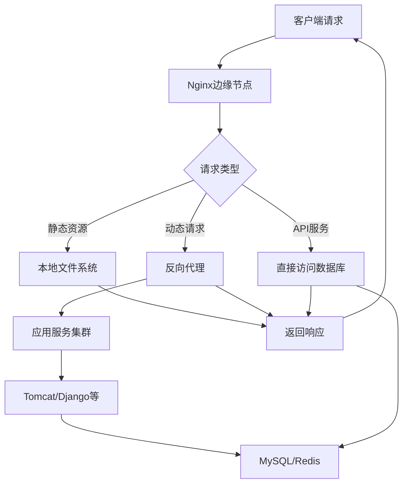

### 1.3 Nginx出现的历史背景

#### 1.3.1 产生原因

1. **互联网数据量快速增长**

   - 全球化和互联网发展导致接入设备数量激增
   - 对硬件性能提出更高要求
2. **摩尔定律在单核CPU上失效**

   - CPU开始向多核方向发展
   - 传统软件未做好多核架构准备
3. **Apache架构低效**

   - 一个进程同时只处理一个连接
   - 进程间切换成本高
   - 无法应对数百万并发连接

#### 1.3.2 市场份额变化

根据Netcraft 2017年12月数据，Nginx市场份额快速上升。虽然Apache仍占据第一，但新增Web服务器多数选择Nginx。


### 1.4 Nginx的五大优点

#### 1.4.1 高并发与高性能

- **高并发**：32核64G内存服务器可轻松达到数千万并发连接
- **高性能**：处理简单静态资源可达100万RPS
- 并发连接数增加时，RPS不会急剧下降

#### 1.4.2 可扩展性好

- **模块化设计**：架构稳定，易于扩展
- **丰富的生态圈**：大量第三方模块
- **OpenResty生态**：在Nginx基础上形成新的生态系统

#### 1.4.3 高可靠性

- 可在服务器上持续运行数年不间断
- 适合需要4个9、5个9甚至更高可用性的企业
- 作为边缘节点，宕机时间一年可能只能以秒计

#### 1.4.4 热部署

- 不停止服务的情况下升级Nginx
- 避免向客户端发送TCP Reset包
- 对于百万级并发连接至关重要

#### 1.4.5 BSD许可证

- 开源免费
- 可修改源代码用于商业场景
- 合法安全的定制化需求支持

### 1.5 Nginx的四个主要组成部分

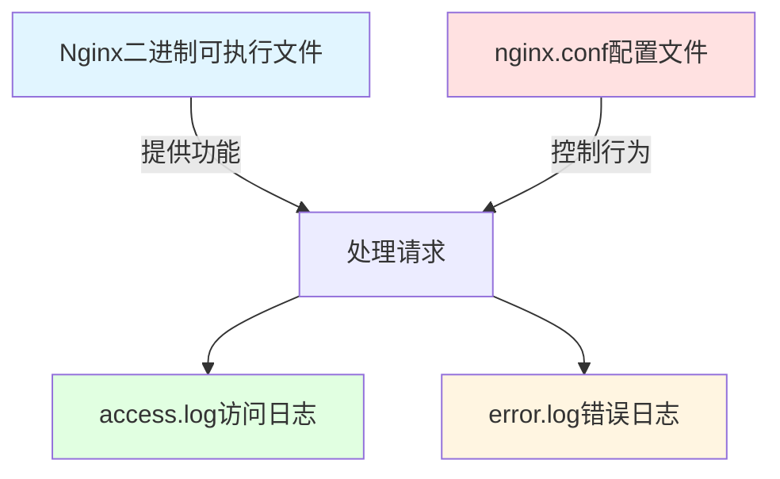

1. **Nginx二进制可执行文件**

   - 由框架、官方模块和第三方模块构建
   - 类比：汽车本身
2. **nginx.conf配置文件**

   - 决定功能是否开启及行为方式
   - 类比：驾驶员
3. **access.log访问日志**

   - 记录每条HTTP请求的信息和响应信息
   - 类比：GPS轨迹
4. **error.log错误日志**

   - 记录错误和异常信息，用于问题定位
   - 类比：黑匣子

### 1.6 Nginx版本发布历史

#### 1.6.1 版本类型

- **Mainline版本**：主干版本，版本号为单数（如1.15.x），包含最新功能但不一定稳定
- **Stable版本**：稳定版本，版本号为双数（如1.14.x），经过充分测试

#### 1.6.2 重要时间节点

- **2002年**：开始开发
- **2004年10月4日**：发布第一个版本
- **2005年**：大规模重构
- **2009年**：支持Windows操作系统，Bug修复数量大幅减少
- **2011年**：1.0正式版发布，Nginx Plus商业公司成立
- **2015年**：发布Stream四层反向代理功能，可完全替代LVS

#### 1.6.3 版本特性

每个版本包含三类更新：

- **Feature**：新增功能
- **Bugfix**：修复的Bug
- **Change**：小的重构

### 1.7 选择合适的Nginx发行版本

#### 1.7.1 开源版 vs 商业版

| 版本            | 优点                     | 缺点             | 适用场景      |
| --------------- | ------------------------ | ---------------- | ------------- |
| Nginx开源版     | 免费、开源、社区活跃     | 需自行整合模块   | 通用场景      |
| Nginx Plus      | 整合第三方模块、技术支持 | 收费、不开源     | 企业级应用    |
| OpenResty开源版 | Lua语言开发、高性能      | -                | API服务、WAF  |
| OpenResty商业版 | 技术支持好               | 收费             | 企业级Lua应用 |
| Tengine         | 阿里生态验证             | 无法同步官方升级 | 不推荐        |

#### 1.7.2 推荐选择

- **无特殊需求**：使用Nginx开源版（nginx.org）
- **需要开发API服务或WAF**：使用OpenResty开源版（openresty.org）
- **Tengine不推荐**：因修改了主干代码，无法跟随官方版本同步升级

### 1.8 编译安装Nginx

#### 1.8.1 编译流程

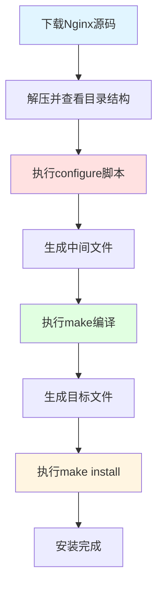

#### 1.8.2 源码目录结构

```
nginx-1.14.0/
├── auto/           # 编译辅助文件
│   ├── cc/        # 编译相关
│   ├── lib/       # 库文件
│   └── os/        # 操作系统判断
├── CHANGES        # 版本更新日志（英文）
├── CHANGES.ru     # 版本更新日志（俄文）
├── conf/          # 配置文件示例
├── configure      # 编译配置脚本
├── contrib/       # 辅助脚本和vim工具
├── html/          # 默认HTML文件
├── man/           # 帮助文档
└── src/           # 源代码
```

#### 1.8.3 configure参数说明

**1. 目录参数**（指定文件路径）

```bash
--prefix=PATH              # 安装目录（其他目录默认在此下创建）
--sbin-path=PATH          # 可执行文件路径
--modules-path=PATH       # 动态模块路径
--conf-path=PATH          # 配置文件路径
--error-log-path=PATH     # 错误日志路径
--pid-path=PATH           # PID文件路径
--lock-path=PATH          # 锁文件路径
```

**2. 模块参数**（选择编译的模块）

- `--with-*`：默认不编译，需主动添加（如 `--with-http_ssl_module`）
- `--without-*`：默认编译，可选择移除（如 `--without-http_gzip_module`）

**3. 特殊参数**

```bash
--with-cc-opt=OPTIONS     # GCC编译优化参数
--with-debug              # 打印debug级别日志
--add-module=PATH         # 添加第三方模块
```

#### 1.8.4 编译示例

```bash
# 1. 下载并解压
wget http://nginx.org/download/nginx-1.14.0.tar.gz
tar -xzf nginx-1.14.0.tar.gz
cd nginx-1.14.0

# 2. 配置编译参数
./configure --prefix=/home/geek/nginx

# 3. 编译
make

# 4. 安装（首次安装）
make install

# 5. 升级时只拷贝二进制文件
# cp objs/nginx /home/geek/nginx/sbin/
```

#### 1.8.5 编译后的目录结构

```
/home/geek/nginx/
├── sbin/          # 可执行文件
│   └── nginx
├── conf/          # 配置文件
│   ├── nginx.conf
│   ├── mime.types
│   └── ...
├── logs/          # 日志文件
│   ├── access.log
│   └── error.log
└── html/          # 默认网页
    ├── index.html
    └── 50x.html
```

#### 1.8.6 中间文件说明

执行configure后会生成 `objs`目录：

- **ngx_modules.c**：决定哪些模块被编译进Nginx
- **src/**：C语言编译的中间文件
- **nginx**：最终的可执行文件（升级时从这里拷贝）
- **\*.so**：动态模块文件

### 1.9 Nginx配置文件语法

#### 1.9.1 基本语法规则

Nginx配置文件是纯文本文件，由**指令（directive）**和**指令块（directive block）**组成。

**核心规则：**

1. **指令以分号结尾**

```nginx
include mime.types;
```

2. **指令与参数用空格分隔**

```nginx
limit_req_zone $binary_remote_addr zone=one:10m rate=1r/s;
```

3. **指令块用大括号组织**

```nginx
http {
    server {
        listen 80;
        location / {
            root html;
        }
    }
}
```

4. **指令块可以有名字**

```nginx
upstream backend {
    server 127.0.0.1:8080;
}

location /api {
    proxy_pass http://backend;
}
```

5. **include语句组合配置文件**

```nginx
include mime.types;
```

6. **井号添加注释**

```nginx
# 这是注释
listen 80;  # Nginx配置语法
```

7. **使用$符号引用变量**

```nginx
limit_req_zone $binary_remote_addr zone=one:10m rate=1r/s;
proxy_cache_key $host$uri$is_args$args;
```

8. **部分指令支持正则表达式**

```nginx
location ~ \.php$ {
    # 处理PHP文件
}
```

#### 1.9.2 时间单位

| 后缀 | 含义 | 示例  |
| ---- | ---- | ----- |
| ms   | 毫秒 | 100ms |
| s    | 秒   | 30s   |
| m    | 分钟 | 5m    |
| h    | 小时 | 2h    |
| d    | 天   | 7d    |
| w    | 周   | 2w    |
| M    | 月   | 3M    |
| y    | 年   | 1y    |

```nginx
expires 3m;  # 3分钟后缓存刷新
```

#### 1.9.3 空间单位

| 后缀 | 含义   | 示例 |
| ---- | ------ | ---- |
| 无   | 字节   | 1024 |
| k/K  | 千字节 | 10k  |
| m/M  | 兆字节 | 10m  |
| g/G  | 吉字节 | 1g   |

```nginx
limit_req_zone $binary_remote_addr zone=one:10m rate=1r/s;
```

#### 1.9.4 配置块层级关系

```nginx
http {                    # HTTP模块解析
    upstream backend {    # 上游服务定义
        server 127.0.0.1:8080;
    }
  
    server {             # 对应一个或一组域名
        listen 80;
  
        location / {     # URL表达式
            root html;
        }
    }
}
```

### 1.10 Nginx命令行操作

#### 1.10.1 基本命令格式

```bash
nginx [选项] [参数]
```

#### 1.10.2 常用命令参数

| 参数    | 说明               | 示例                                   |
| ------- | ------------------ | -------------------------------------- |
| -? / -h | 显示帮助信息       | `nginx -h`                           |
| -v      | 显示版本信息       | `nginx -v`                           |
| -V      | 显示版本和编译信息 | `nginx -V`                           |
| -t      | 测试配置文件语法   | `nginx -t`                           |
| -T      | 测试配置并打印     | `nginx -T`                           |
| -c      | 指定配置文件       | `nginx -c /path/to/nginx.conf`       |
| -g      | 设置全局指令       | `nginx -g "pid /var/run/nginx.pid;"` |
| -p      | 指定运行目录       | `nginx -p /usr/local/nginx/`         |
| -s      | 发送信号           | `nginx -s reload`                    |

#### 1.10.3 信号控制

```bash
# 立即停止服务
nginx -s stop

# 优雅停止服务（处理完当前请求）
nginx -s quit

# 重新加载配置文件
nginx -s reload

# 重新打开日志文件
nginx -s reopen
```

#### 1.10.4 重载配置文件（Reload）

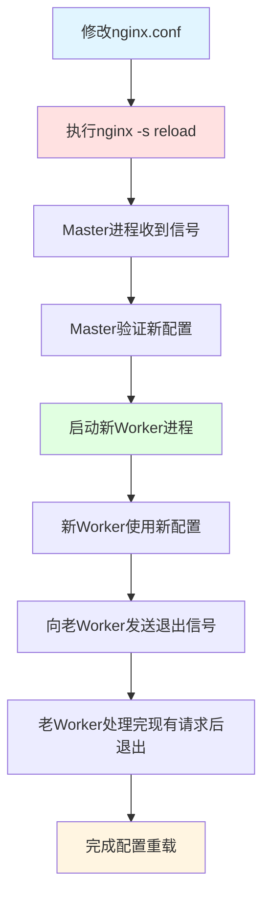

**特点：**

- 不中断服务
- 新请求使用新配置
- 老请求继续处理完成

#### 1.10.5 热部署（Hot Upgrade）

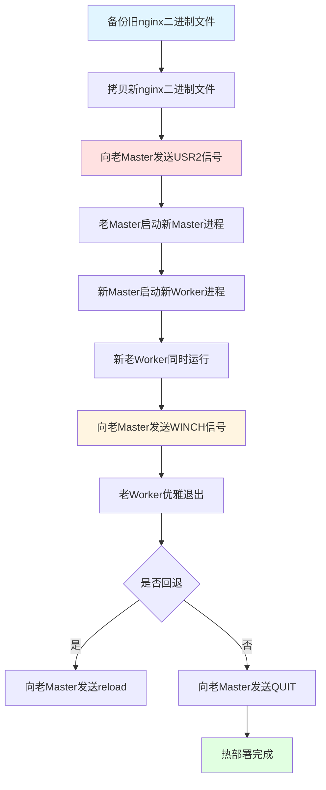

**操作步骤：**

```bash
# 1. 备份旧版本
cp /usr/local/nginx/sbin/nginx /usr/local/nginx/sbin/nginx.old

# 2. 拷贝新版本
cp /path/to/new/nginx /usr/local/nginx/sbin/nginx

# 3. 向老Master发送USR2信号
kill -USR2 <老Master的PID>

# 4. 查看进程状态
ps aux | grep nginx
# 此时新老Master和Worker都在运行

# 5. 向老Master发送WINCH信号，优雅关闭老Worker
kill -WINCH <老Master的PID>

# 6. 如果需要回退
kill -HUP <老Master的PID>  # 重新拉起老Worker
kill -QUIT <新Master的PID>  # 关闭新Master

# 7. 确认无问题后，关闭老Master
kill -QUIT <老Master的PID>
```

**特点：**

- 完全不中断服务
- 支持版本回退
- 老Master保留用于回退

#### 1.10.6 日志切割

**方法一：手动切割**

```bash
# 1. 备份日志文件
mv /usr/local/nginx/logs/access.log /usr/local/nginx/logs/access.log.bak

# 2. 重新打开日志文件
nginx -s reopen
```

**方法二：定时任务切割**

创建切割脚本 `rotate.sh`：

```bash
#!/bin/bash
LOGS_PATH=/usr/local/nginx/logs
BACKUP_PATH=/data/nginx_logs_backup

# 获取昨天的日期
YESTERDAY=$(date -d "yesterday" +%Y%m%d)

# 移动日志文件
mv ${LOGS_PATH}/access.log ${BACKUP_PATH}/access_${YESTERDAY}.log
mv ${LOGS_PATH}/error.log ${BACKUP_PATH}/error_${YESTERDAY}.log

# 向Nginx主进程发送USR1信号，重新打开日志文件
kill -USR1 $(cat /usr/local/nginx/logs/nginx.pid)
```

添加到crontab：

```bash
# 每天凌晨0点执行日志切割
0 0 * * * /bin/bash /path/to/rotate.sh
```

### 1.11 搭建静态资源Web服务器

#### 1.11.1 基本配置

```nginx
server {
    listen 8080;
  
    location / {
        alias /home/geek/nginx/dlib/;  # 使用alias而非root
        # root会将location路径附加到文件路径
        # alias直接映射到指定目录
    }
}
```

#### 1.11.2 启用Gzip压缩

```nginx
http {
    # 开启gzip压缩
    gzip on;
  
    # 小于1字节的文件不压缩（为了演示效果设为1）
    gzip_min_length 1;
  
    # 压缩级别（1-9），级别越高压缩率越大但CPU消耗越多
    gzip_comp_level 2;
  
    # 指定压缩的MIME类型
    gzip_types text/plain text/css application/json application/javascript text/xml application/xml;
}
```

**效果对比：**

- 未压缩：23.65KB
- 压缩后：7.28KB（压缩率约70%）

#### 1.11.3 启用autoindex模块

显示目录结构，方便文件共享：

```nginx
location / {
    alias /home/geek/nginx/dlib/;
    autoindex on;              # 开启目录浏览
    autoindex_exact_size off;  # 显示文件大小（可选）
    autoindex_localtime on;    # 显示本地时间（可选）
}
```

访问 `http://domain.com/dlib/` 会显示目录列表。

#### 1.11.4 限制访问速度

使用内置变量 `$limit_rate`限制传输速度：

```nginx
location / {
    alias /home/geek/nginx/dlib/;
    set $limit_rate 1k;  # 限制为每秒1KB
}
```

**应用场景：**

- 限制大文件下载速度
- 保证小文件（CSS、JS）有足够带宽
- 防止带宽被少数用户占用

#### 1.11.5 配置access日志

**定义日志格式：**

```nginx
http {
    log_format main '$remote_addr - $remote_user [$time_local] "$request" '
                    '$status $body_bytes_sent "$http_referer" '
                    '"$http_user_agent" "$http_x_forwarded_for" '
                    'gzip_ratio=$gzip_ratio';
  
    server {
        access_log /home/geek/nginx/logs/access.log main;
    }
}
```

**常用变量：**

- `$remote_addr`：客户端IP地址
- `$time_local`：访问时间
- `$request`：请求行
- `$status`：HTTP状态码
- `$body_bytes_sent`：发送的字节数
- `$http_referer`：来源页面
- `$http_user_agent`：用户代理
- `$gzip_ratio`：gzip压缩比率

### 1.12 搭建反向代理服务

#### 1.12.1 配置上游服务器

首先将静态资源服务器改为只监听本地：

```nginx
# 上游服务器配置（nginx-1.14）
server {
    listen 127.0.0.1:8080;  # 只允许本机访问
  
    location / {
        alias /home/geek/nginx/dlib/;
    }
}
```

#### 1.12.2 配置反向代理

```nginx
# 反向代理服务器配置（OpenResty）
http {
    # 定义上游服务器组
    upstream backend {
        server 127.0.0.1:8080;
        # server 127.0.0.1:8081;  # 可添加多台服务器
        # server 127.0.0.1:8082;
    }
  
    server {
        listen 80;
        server_name example.com;
  
        location / {
            # 代理到上游服务器
            proxy_pass http://backend;
    
            # 传递真实客户端IP
            proxy_set_header X-Real-IP $remote_addr;
            proxy_set_header X-Forwarded-For $proxy_add_x_forwarded_for;
    
            # 传递Host头
            proxy_set_header Host $host;
        }
    }
}
```

#### 1.12.3 反向代理架构图

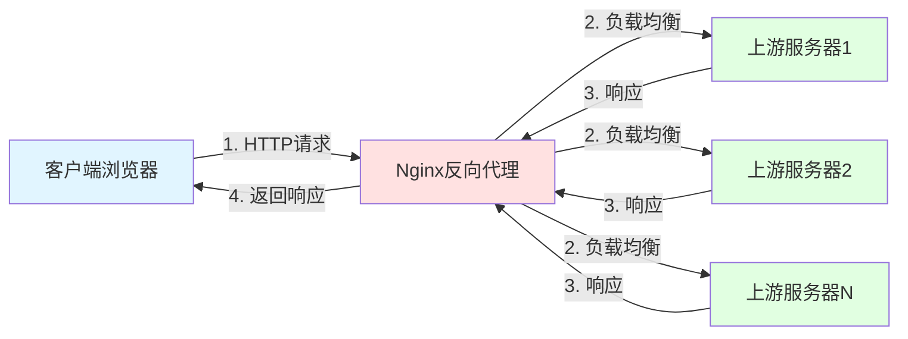

#### 1.12.4 配置缓存

```nginx
http {
    # 定义缓存路径和参数
    proxy_cache_path /tmp/nginx_cache 
                     levels=1:2 
                     keys_zone=my_cache:10m 
                     max_size=1g 
                     inactive=60m;
  
    server {
        location / {
            proxy_pass http://backend;
    
            # 启用缓存
            proxy_cache my_cache;
    
            # 定义缓存key
            proxy_cache_key $host$uri$is_args$args;
    
            # 缓存状态码和时间
            proxy_cache_valid 200 304 12h;
            proxy_cache_valid any 10m;
    
            # 添加缓存状态头
            add_header X-Cache-Status $upstream_cache_status;
        }
    }
}
```

**缓存参数说明：**

- `levels=1:2`：缓存目录层级
- `keys_zone`：共享内存区域名称和大小
- `max_size`：缓存最大容量
- `inactive`：缓存过期时间

**验证缓存：**
停止上游服务器后，反向代理仍能返回缓存的内容。

### 1.13 使用GoAccess实时监控日志

#### 1.13.1 GoAccess简介

GoAccess是一个实时Web日志分析工具，可以：

- 图形化显示access日志
- 通过WebSocket实时推送更新
- 支持多种日志格式

#### 1.13.2 安装GoAccess

```bash
# CentOS/RHEL
yum install goaccess

# Ubuntu/Debian
apt-get install goaccess

# 或从源码编译
wget https://tar.goaccess.io/goaccess-1.x.tar.gz
tar -xzvf goaccess-1.x.tar.gz
cd goaccess-1.x/
./configure --enable-utf8 --enable-geoip=legacy
make && make install
```

#### 1.13.3 使用GoAccess

```bash
goaccess /path/to/access.log \
    -o /path/to/report.html \
    --real-time-html \
    --time-format='%H:%M:%S' \
    --date-format='%d/%b/%Y' \
    --log-format=COMBINED
```

**参数说明：**

- `-o`：输出HTML文件路径
- `--real-time-html`：实时更新模式
- `--log-format=COMBINED`：使用Nginx默认日志格式

#### 1.13.4 配置Nginx访问报告

```nginx
location /report.html {
    alias /path/to/report.html;
}
```

访问 `http://domain.com/report.html` 即可查看实时统计。

**统计内容包括：**

- 总请求数和独立访客
- 按时间分布的请求
- 请求的URL排名
- 静态资源请求
- HTTP状态码分布
- 操作系统和浏览器分布
- 地理位置分布（需GeoIP支持）

### 1.14 SSL/TLS安全协议

#### 1.14.1 SSL/TLS发展历史

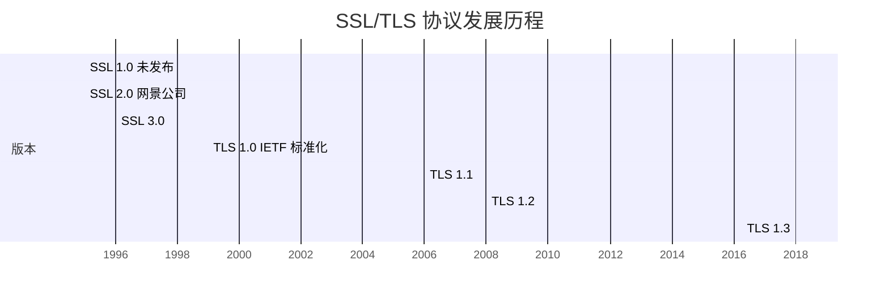

#### 1.14.2 TLS在OSI模型中的位置

```
应用层：HTTP
表示层：TLS/SSL（加密、握手、密钥交换、报警）
会话层：
传输层：TCP
网络层：IP
数据链路层：
物理层：
```

#### 1.14.3 安全密码套件组成

一个完整的密码套件示例：

```
ECDHE-RSA-AES128-GCM-SHA256
```

**组成部分：**

| 部分     | 示例       | 作用                                 |
| -------- | ---------- | ------------------------------------ |
| 密钥交换 | ECDHE      | 椭圆曲线Diffie-Hellman，生成对称密钥 |
| 身份验证 | RSA        | 非对称加密算法，验证身份             |
| 对称加密 | AES128-GCM | AES算法，128位密钥，GCM分组模式      |
| 摘要算法 | SHA256     | 生成固定长度的消息摘要               |

### 1.15 对称加密与非对称加密

#### 1.15.1 对称加密

**特点：**

- 加密和解密使用同一把密钥
- 性能好，速度快
- 密钥分发困难

**原理（异或操作）：**

```
密钥：1010
明文：0110
--------- XOR
密文：1100

密文：1100
密钥：1010
--------- XOR
明文：0110
```

**常见算法：**

- RC4（序列算法）
- AES（分组算法）
- DES/3DES

#### 1.15.2 非对称加密

**特点：**

- 生成一对密钥：公钥和私钥
- 公钥加密，私钥解密（加密通信）
- 私钥加密，公钥解密（身份验证/数字签名）
- 性能较差，速度慢

**应用场景：**

1. **加密通信**

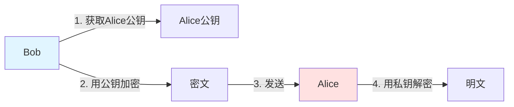

2. **身份验证**


**常见算法：**

- RSA
- DSA
- ECDSA（椭圆曲线）

### 1.16 SSL证书与公信力

#### 1.16.1 证书颁发流程

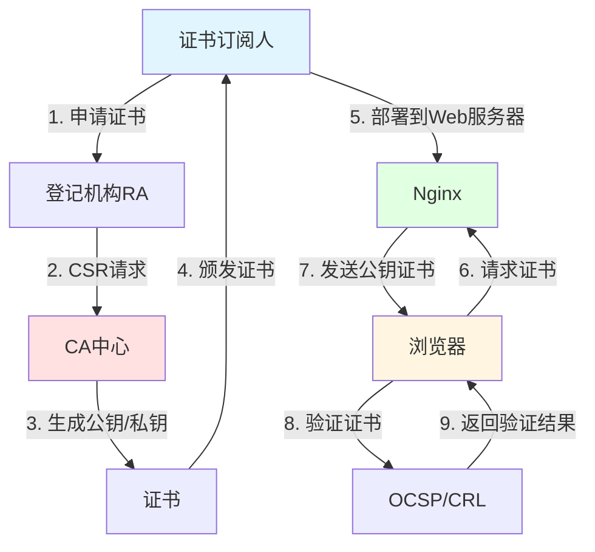

#### 1.16.2 证书类型

| 类型           | 验证内容           | 申请时间 | 价格      | 浏览器显示           |
| -------------- | ------------------ | -------- | --------- | -------------------- |
| DV（域名验证） | 域名归属           | 实时     | 免费/低价 | 普通锁               |
| OV（组织验证） | 域名+组织信息      | 几天     | 中等      | 普通锁               |
| EV（扩展验证） | 域名+组织+严格审查 | 较长     | 较高      | 绿色地址栏显示组织名 |

#### 1.16.3 证书链结构

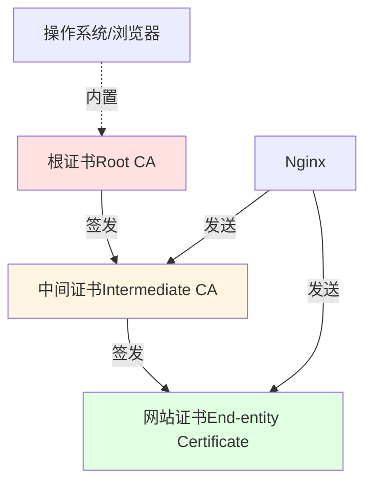

**证书链说明：**

- **根证书**：由操作系统或浏览器内置，更新频率低（年级别）
- **中间证书**：由根证书签发，Nginx需要发送给浏览器
- **网站证书**：网站的主证书，Nginx需要发送给浏览器

**验证过程：**

1. Nginx发送网站证书和中间证书
2. 浏览器验证中间证书是否由可信根证书签发
3. 浏览器验证网站证书是否由中间证书签发
4. 检查证书是否过期（通过OCSP或CRL）

#### 1.16.4 证书吊销机制

- **CRL（证书吊销列表）**：性能差，包含所有过期证书
- **OCSP（在线证书状态协议）**：实时查询单个证书状态
- **OCSP Stapling**：Nginx主动查询并缓存OCSP响应，提升性能

### 1.17 TLS握手流程与性能优化

#### 1.17.1 TLS握手流程

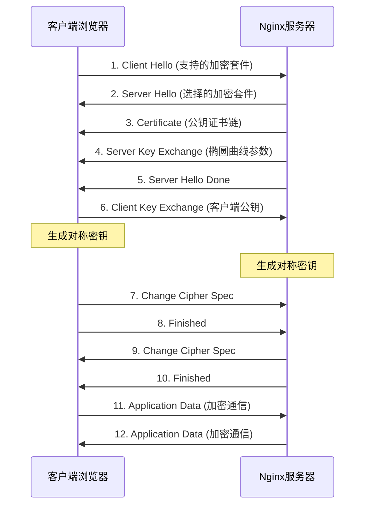

**握手目的：**

1. 验证对方身份
2. 协商安全套件
3. 交换并生成密钥
4. 加密数据通信

#### 1.17.2 性能影响因素

**小文件场景（主要影响：握手性能）**

- 非对称加密算法性能：RSA、ECDHE
- 优化方向：调整密钥强度、使用椭圆曲线算法

**大文件场景（主要影响：加密性能）**

- 对称加密算法性能：AES
- 优化方向：选择高效的对称加密算法

#### 1.17.3 算法性能对比

| 算法类型   | 算法     | 相对性能 | 适用场景   |
| ---------- | -------- | -------- | ---------- |
| 非对称加密 | RSA-2048 | 中       | 小文件     |
| 非对称加密 | ECDHE    | 高       | 小文件     |
| 对称加密   | AES-128  | 高       | 大文件     |
| 对称加密   | AES-256  | 中       | 高安全需求 |

### 1.18 使用Let's Encrypt配置HTTPS

#### 1.18.1 Let's Encrypt简介

- 免费的DV证书
- 自动化申请和续期
- 有效期3个月
- 支持通配符证书

#### 1.18.2 使用Certbot申请证书

**安装Certbot：**

```bash
# CentOS/RHEL
yum install python2-certbot-nginx

# Ubuntu/Debian
apt-get install python-certbot-nginx
```

**申请证书：**

```bash
certbot --nginx \
    --nginx-server-root /path/to/nginx/conf \
    -d example.com \
    -d www.example.com
```

**参数说明：**

- `--nginx`：自动配置Nginx
- `--nginx-server-root`：指定Nginx配置文件路径
- `-d`：指定域名

#### 1.18.3 Certbot自动配置

Certbot会自动在nginx.conf中添加：

```nginx
server {
    listen 80;
    server_name example.com;
  
    # Certbot自动添加以下配置
    listen 443 ssl;
    ssl_certificate /etc/letsencrypt/live/example.com/fullchain.pem;
    ssl_certificate_key /etc/letsencrypt/live/example.com/privkey.pem;
    include /etc/letsencrypt/options-ssl-nginx.conf;
    ssl_dhparam /etc/letsencrypt/ssl-dhparams.pem;
}
```

#### 1.18.4 SSL配置详解

查看 `/etc/letsencrypt/options-ssl-nginx.conf`：

```nginx
# Session缓存配置
ssl_session_cache shared:le_nginx_SSL:10m;  # 10MB约可缓存4万个连接
ssl_session_timeout 1440m;                  # 会话超时时间1天

# 支持的TLS协议版本
ssl_protocols TLSv1.2 TLSv1.3;

# 优先使用服务器端密码套件
ssl_prefer_server_ciphers on;

# 密码套件列表（按优先级排序）
ssl_ciphers "ECDHE-ECDSA-AES128-GCM-SHA256:ECDHE-RSA-AES128-GCM-SHA256:...";

# DH参数文件（用于密钥交换）
ssl_dhparam /etc/letsencrypt/ssl-dhparams.pem;
```

**优化建议：**

1. 启用Session缓存减少握手次数
2. 使用ECDHE密钥交换算法
3. 优先使用AES-GCM对称加密
4. 启用OCSP Stapling

#### 1.18.5 配置OCSP Stapling

```nginx
server {
    listen 443 ssl;
  
    # OCSP Stapling配置
    ssl_stapling on;
    ssl_stapling_verify on;
    ssl_trusted_certificate /etc/letsencrypt/live/example.com/chain.pem;
    resolver 8.8.8.8 8.8.4.4 valid=300s;
    resolver_timeout 5s;
}
```

#### 1.18.6 自动续期

Let's Encrypt证书有效期为90天，需要定期续期：

```bash
# 测试续期
certbot renew --dry-run

# 添加到crontab自动续期
0 0,12 * * * certbot renew --quiet
```

### 1.19 使用OpenResty开发Lua服务

#### 1.19.1 OpenResty简介

- 基于Nginx和LuaJIT的Web平台
- 将Nginx事件驱动模型以同步方式提供给开发者
- 兼具高性能和高开发效率
- 适合开发API服务和WAF

#### 1.19.2 下载和编译OpenResty

```bash
# 1. 下载
wget https://openresty.org/download/openresty-1.13.6.2.tar.gz
tar -xzf openresty-1.13.6.2.tar.gz
cd openresty-1.13.6.2

# 2. 查看目录结构
ls
# bundle/  configure  COPYRIGHT  README.markdown  util/

# 3. bundle目录包含
ls bundle/
# nginx-1.13.6/          # Nginx源码
# ngx_lua-0.10.13/       # Lua模块（C）
# lua-resty-core/        # Lua库
# lua-resty-redis/       # Redis客户端
# ...

# 4. 编译安装
./configure --prefix=/usr/local/openresty
make
make install
```

#### 1.19.3 OpenResty目录结构

```
/usr/local/openresty/
├── nginx/              # Nginx相关
│   ├── sbin/nginx     # 可执行文件
│   ├── conf/          # 配置文件
│   └── logs/          # 日志文件
├── luajit/            # LuaJIT
├── lualib/            # Lua库
└── site/              # 第三方Lua模块
```

#### 1.19.4 Lua代码示例

```nginx
server {
    listen 80;
    server_name example.com;
  
    location /lua {
        default_type text/html;
  
        content_by_lua_block {
            -- 获取请求头
            local headers = ngx.req.get_headers()
            local user_agent = headers["User-Agent"]
    
            -- 输出响应
            ngx.say("<h1>Hello OpenResty!</h1>")
            ngx.say("<p>Your User-Agent: ", user_agent, "</p>")
        }
    }
}
```

#### 1.19.5 OpenResty常用指令

| 指令                       | 阶段          | 说明                 |
| -------------------------- | ------------- | -------------------- |
| init_by_lua_block          | 初始化        | Master进程启动时执行 |
| init_worker_by_lua_block   | 初始化        | Worker进程启动时执行 |
| set_by_lua_block           | Rewrite       | 设置变量             |
| rewrite_by_lua_block       | Rewrite       | URL重写              |
| access_by_lua_block        | Access        | 访问控制             |
| content_by_lua_block       | Content       | 生成响应内容         |
| header_filter_by_lua_block | Header Filter | 修改响应头           |
| body_filter_by_lua_block   | Body Filter   | 修改响应体           |
| log_by_lua_block           | Log           | 日志记录             |

#### 1.19.6 OpenResty API示例

**访问Redis：**

```nginx
location /redis {
    content_by_lua_block {
        local redis = require "resty.redis"
        local red = redis:new()
  
        red:set_timeout(1000)
        local ok, err = red:connect("127.0.0.1", 6379)
        if not ok then
            ngx.say("failed to connect: ", err)
            return
        end
  
        local res, err = red:get("key")
        if not res then
            ngx.say("failed to get key: ", err)
            return
        end
  
        ngx.say("key: ", res)
    }
}
```

**访问MySQL：**

```nginx
location /mysql {
    content_by_lua_block {
        local mysql = require "resty.mysql"
        local db = mysql:new()
  
        local ok, err = db:connect{
            host = "127.0.0.1",
            port = 3306,
            database = "test",
            user = "root",
            password = "password"
        }
  
        if not ok then
            ngx.say("failed to connect: ", err)
            return
        end
  
        local res, err = db:query("SELECT * FROM users LIMIT 10")
        if not res then
            ngx.say("failed to query: ", err)
            return
        end
  
        ngx.say(require("cjson").encode(res))
    }
}
```

#### 1.19.7 OpenResty应用场景

1. **API网关**

   - 请求路由
   - 参数验证
   - 协议转换
2. **Web应用防火墙（WAF）**

   - SQL注入防护
   - XSS防护
   - CC攻击防护
3. **动态负载均衡**

   - 基于业务逻辑的路由
   - 灰度发布
   - A/B测试
4. **缓存服务**

   - 热点数据缓存
   - 接口聚合
   - 降级处理

---

## 第一部分总结
### 1.13 实战示例配置


通过第一部分的学习，我们了解了：

1. **Nginx的核心优势**

   - 高并发、高性能
   - 可扩展性强
   - 高可靠性
   - 支持热部署
   - BSD开源许可
2. **Nginx的主要应用场景**

   - 静态资源服务器
   - 反向代理和负载均衡
   - API服务
3. **Nginx的基本操作**

   - 编译安装
   - 配置文件语法
   - 命令行操作
   - 日志管理
4. **实战技能**

   - 搭建静态Web服务器
   - 配置反向代理和缓存
   - 实时日志分析
   - HTTPS站点配置
   - OpenResty Lua开发


#### 1.13.1 配置示例: store.conf (proxy_store缓存)

**用途:** 演示proxy_store指令,将上游响应存储为本地文件

**完整配置:**

```nginx
upstream proxyups {
    server 127.0.0.1:8012 weight=1;
}

server {
    server_name store.taohui.tech;
    error_log logs/myerror.log debug;
    # root: 文件存储的根目录
    root /tmp;
  
    location / {
        proxy_pass http://proxyups;
    
        # proxy_store: 开启文件存储
        # on: 将上游响应存储为本地文件
        # 文件路径 = root + URI
        proxy_store on;
    
        # proxy_store_access: 设置文件权限
        # user:rw - 用户可读写
        # group:rw - 组可读写
        # all:r - 其他用户只读
        proxy_store_access user:rw group:rw all:r;
    }
  
    listen 80;
}
```

**proxy_store工作原理:**

1. 首次请求: 从上游获取,存储到本地
2. 后续请求: 直接返回本地文件(如果存在)
3. 适合静态资源的本地缓存

**关键点:** proxy_store将代理响应存储为文件,适合CDN节点缓存。

#### 1.13.2 配置示例: v2ex.conf (proxy_pass带URI测试)

**用途:** 演示proxy_pass带URI和不带URI的区别

**完整配置:**

```nginx
# 前端服务器: 接收客户端请求
server {
    server_name v2ex.taohui.tech;
  
    # 测试1: proxy_pass带URI
    # 客户端请求: /withurl/test
    # 转发到上游: /remote/test (替换/withurl为/remote)
    location /withurl {
        proxy_pass http://v2exup.taohui.tech/remote;
    }
  
    # 测试2: proxy_pass不带URI
    # 客户端请求: /withouturl/test
    # 转发到上游: /withouturl/test (保持原URI)
    location /withouturl {
        proxy_pass http://v2exup.taohui.tech;
    }
}

# 后端服务器: 显示接收到的URI
server {
    server_name v2exup.taohui.tech;
  
    location / {
        return 200 '
request_uri: $request_uri
';
    }
}
```

**测试结果:**

```bash
# 测试1: 带URI
curl http://v2ex.taohui.tech/withurl/test
# 输出: request_uri: /remote/test

# 测试2: 不带URI
curl http://v2ex.taohui.tech/withouturl/test
# 输出: request_uri: /withouturl/test
```

**proxy_pass URI规则:**

- **带URI**: 替换location路径
- **不带URI**: 保持原始URI
- 正则location只能使用不带URI的形式

**关键点:** proxy_pass带URI会替换location部分,不带URI则保持原URI。

---

接下来，我们将深入学习Nginx的架构基础，理解其高性能的实现原理。

---

## 第二部分：Nginx基础架构

### 2.1 Nginx请求处理流程

#### 2.1.1 为什么要了解架构基础

Nginx运行在企业内网的边缘节点，处理的流量是其他应用服务器的数倍甚至几个数量级。在不同数量级下，问题的解决方案完全不同。理解Nginx架构能帮助我们：

- 理解Master-Worker架构模型的优势
- 明白Worker进程数量为什么要与CPU核数匹配
- 了解多个Worker进程间如何共享数据
- 掌握TLS、限流限速等场景的实现方式

#### 2.1.2 请求处理流程图

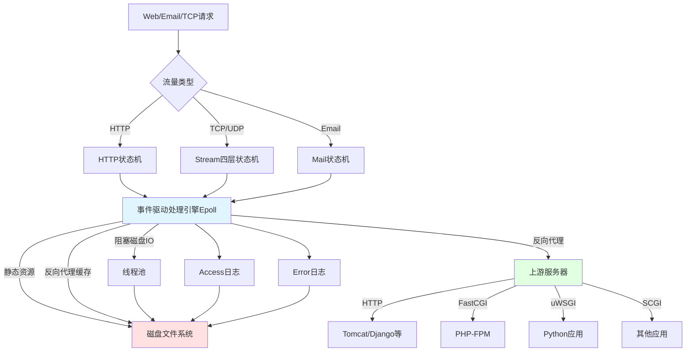

**流程说明：**

1. **状态机处理**：三大状态机处理不同协议的流量

   - HTTP状态机：处理Web请求
   - Stream状态机：处理TCP/UDP四层流量
   - Mail状态机：处理邮件协议
2. **事件驱动引擎**：使用非阻塞的Epoll机制

   - 异步处理所有网络事件
   - 需要状态机正确识别和处理请求
3. **静态资源处理**：

   - 直接访问磁盘文件
   - 当内存不足时，sendfile/AIO会退化为阻塞调用
   - 使用线程池处理阻塞的磁盘IO
4. **反向代理**：

   - 支持多种上游协议（HTTP、FastCGI、uWSGI、SCGI等）
   - 可以缓存上游响应到磁盘
5. **日志记录**：

   - Access日志：记录每个请求的详细信息
   - Error日志：记录错误和异常
   - 可通过Syslog协议记录到远程机器

### 2.2 Nginx进程结构

#### 2.2.1 单进程 vs 多进程

| 特性     | 单进程结构 | 多进程结构 |
| -------- | ---------- | ---------- |
| 适用场景 | 开发调试   | 生产环境   |
| 健壮性   | 低         | 高         |
| 多核利用 | 否         | 是         |
| 默认配置 | 否         | 是         |

#### 2.2.2 多进程架构

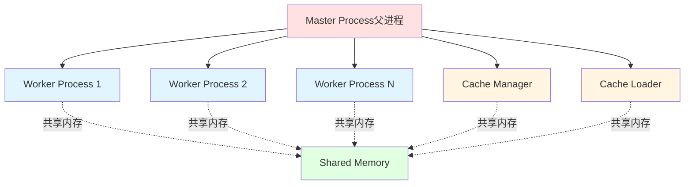

**进程角色：**

1. **Master进程（父进程）**

   - 不处理网络请求
   - 负责管理Worker进程
   - 监控Worker进程健康状态
   - 处理配置重载和热部署
   - 第三方模块通常不在此添加代码
2. **Worker进程（工作进程）**

   - 处理实际的网络请求
   - 数量通常等于CPU核数
   - 每个Worker绑定到特定CPU核
   - 利用CPU缓存减少缓存失效
3. **Cache Manager进程**

   - 管理反向代理缓存
   - 定期清理过期缓存
4. **Cache Loader进程**

   - 启动时加载缓存索引
   - 加载完成后退出

#### 2.2.3 为什么选择多进程而非多线程

**多进程的优势：**

- **高可用性**：一个Worker进程崩溃不影响其他进程
- **地址空间隔离**：第三方模块的内存错误不会导致整个Nginx崩溃
- **稳定性更好**：符合Nginx高可靠性的设计目标

**Worker进程数量配置：**

```nginx
# 自动设置为CPU核数
worker_processes auto;

# 手动指定
worker_processes 4;

# 绑定Worker到特定CPU核
worker_cpu_affinity 0001 0010 0100 1000;
```

### 2.3 进程管理与信号

#### 2.3.1 信号管理机制

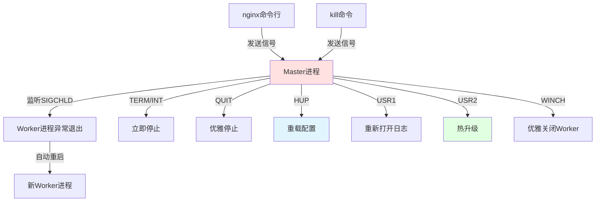

#### 2.3.2 Master进程接收的信号

| 信号     | 命令行等价          | 作用           | 说明                 |
| -------- | ------------------- | -------------- | -------------------- |
| TERM/INT | `nginx -s stop`   | 立即停止       | 强制终止所有进程     |
| QUIT     | `nginx -s quit`   | 优雅停止       | 处理完当前请求后停止 |
| HUP      | `nginx -s reload` | 重载配置       | 平滑重启Worker进程   |
| USR1     | `nginx -s reopen` | 重新打开日志   | 用于日志切割         |
| USR2     | 无                  | 热升级         | 启动新Master进程     |
| WINCH    | 无                  | 优雅关闭Worker | 用于热升级流程       |

#### 2.3.3 Worker进程接收的信号

| 信号     | 作用         | 说明           |
| -------- | ------------ | -------------- |
| TERM/INT | 立即停止     | 不推荐直接发送 |
| QUIT     | 优雅停止     | 不推荐直接发送 |
| USR1     | 重新打开日志 | 不推荐直接发送 |
| WINCH    | 优雅关闭     | 不推荐直接发送 |

**注意：** 通常不直接向Worker进程发送信号，而是由Master进程统一管理。

#### 2.3.4 nginx命令行与信号的对应关系

```bash
# 以下命令等价于向Master进程发送相应信号

# nginx -s reload  ≈  kill -HUP <master_pid>
# nginx -s reopen  ≈  kill -USR1 <master_pid>
# nginx -s stop    ≈  kill -TERM <master_pid>
# nginx -s quit    ≈  kill -QUIT <master_pid>

# Master PID通常记录在
cat /usr/local/nginx/logs/nginx.pid
```

### 2.4 Reload重载配置文件

#### 2.4.1 Reload流程

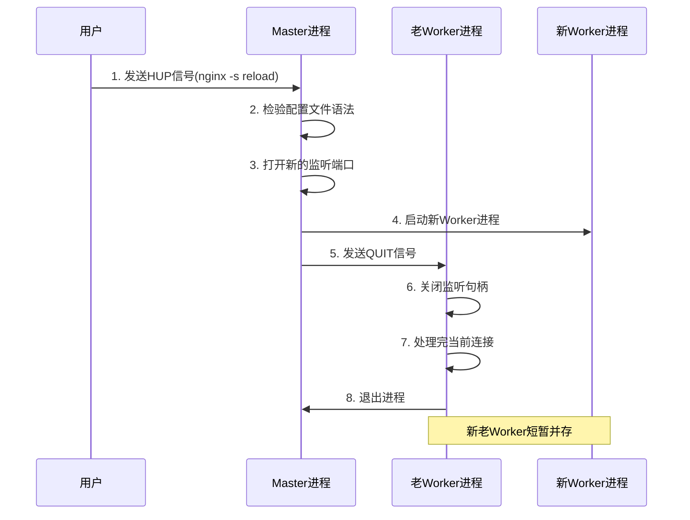

**详细步骤：**

1. **发送HUP信号**

   - 执行 `nginx -s reload`
   - 或 `kill -HUP <master_pid>`
2. **Master进程验证配置**

   - 检查nginx.conf语法
   - 验证失败则不继续
3. **打开新监听端口**

   - Master进程打开配置中的新端口
   - 子进程会继承父进程的所有打开端口
4. **启动新Worker进程**

   - 使用新配置启动Worker
   - 新Worker立即开始处理请求
5. **向老Worker发送QUIT信号**

   - 老Worker关闭监听句柄
   - 新连接只会进入新Worker
6. **老Worker优雅退出**

   - 处理完已建立连接上的请求
   - 关闭连接后退出进程

#### 2.4.2 优雅退出的超时控制

```nginx
# 设置Worker进程优雅退出的最长等待时间
worker_shutdown_timeout 30s;
```

**作用：**

- 防止老Worker进程长时间不退出
- 超时后强制关闭进程
- 默认无限等待

#### 2.4.3 Reload过程中的进程状态

```
初始状态：
Master (PID: 1000)
├── Worker 1 (PID: 1001)
├── Worker 2 (PID: 1002)
├── Worker 3 (PID: 1003)
└── Worker 4 (PID: 1004)

Reload后（短暂并存）：
Master (PID: 1000)
├── Worker 1 (PID: 1001) [老，正在退出]
├── Worker 2 (PID: 1002) [老，正在退出]
├── Worker 3 (PID: 1003) [老，正在退出]
├── Worker 4 (PID: 1004) [老，正在退出]
├── Worker 5 (PID: 1005) [新，处理新请求]
├── Worker 6 (PID: 1006) [新，处理新请求]
├── Worker 7 (PID: 1007) [新，处理新请求]
└── Worker 8 (PID: 1008) [新，处理新请求]

最终状态：
Master (PID: 1000)
├── Worker 5 (PID: 1005)
├── Worker 6 (PID: 1006)
├── Worker 7 (PID: 1007)
└── Worker 8 (PID: 1008)
```

### 2.5 热升级完整流程

#### 2.5.1 热升级流程图

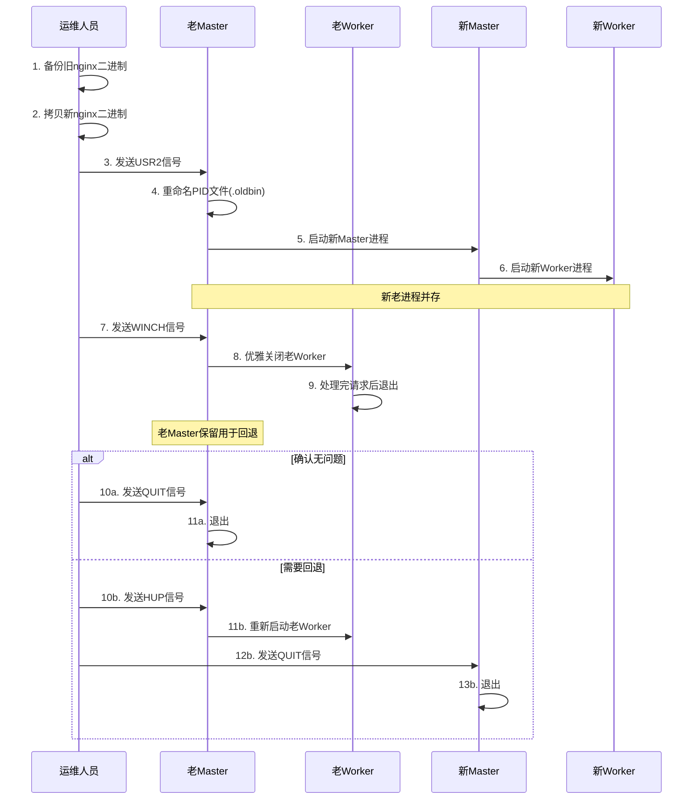

#### 2.5.2 热升级操作步骤

```bash
# 1. 备份旧版本
cp /usr/local/nginx/sbin/nginx /usr/local/nginx/sbin/nginx.old

# 2. 拷贝新版本（需要-f强制覆盖正在运行的文件）
cp -f /path/to/new/nginx /usr/local/nginx/sbin/nginx

# 3. 向老Master发送USR2信号
kill -USR2 $(cat /usr/local/nginx/logs/nginx.pid)

# 4. 查看进程状态（此时新老Master和Worker都在运行）
ps aux | grep nginx

# 5. 向老Master发送WINCH信号，优雅关闭老Worker
kill -WINCH <老Master的PID>

# 6. 测试新版本是否正常

# 7a. 确认无问题，关闭老Master
kill -QUIT <老Master的PID>

# 7b. 如需回退，重新拉起老Worker
kill -HUP <老Master的PID>
# 然后关闭新Master
kill -QUIT <新Master的PID>
```

#### 2.5.3 热升级过程中的PID文件变化

```
初始状态：
nginx.pid         -> 老Master PID

发送USR2后：
nginx.pid.oldbin  -> 老Master PID
nginx.pid         -> 新Master PID

完成后：
nginx.pid         -> 新Master PID
```

#### 2.5.4 热升级的关键点

1. **新Master是老Master的子进程**

   - 通过fork创建
   - 使用新的二进制文件启动
2. **新老进程短暂并存**

   - 保证服务不中断
   - 支持版本回退
3. **老Master不自动退出**

   - 保留用于回退
   - 需要手动发送QUIT信号
4. **只替换二进制文件**

   - 配置文件路径必须一致
   - 日志路径必须一致
   - 否则无法复用配置

### 2.6 Worker进程优雅关闭

#### 2.6.1 优雅关闭流程

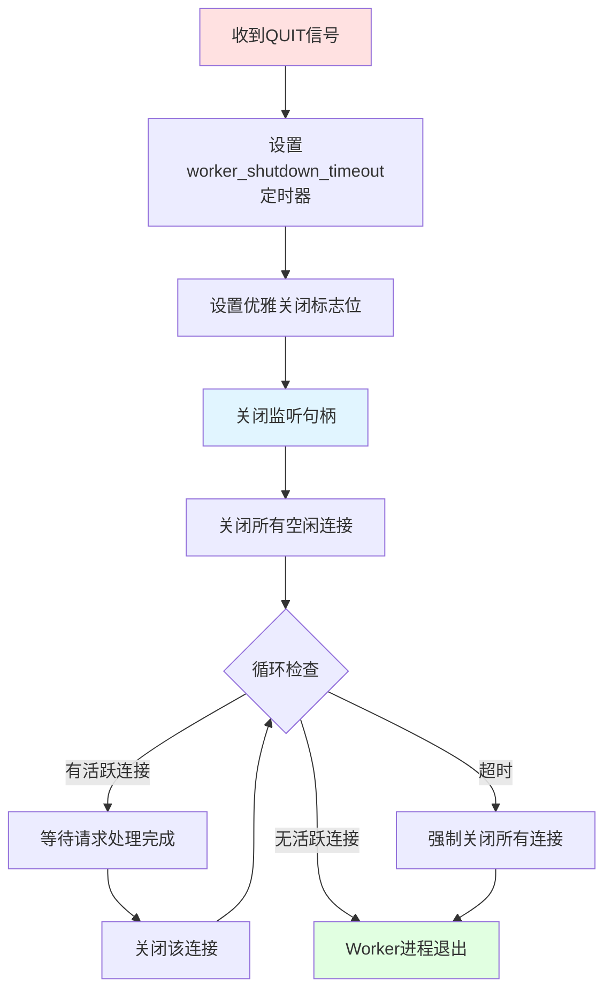

#### 2.6.2 优雅关闭的条件

**可以优雅关闭的场景：**

- HTTP请求：Nginx能识别请求边界
- 短连接：请求处理完立即关闭

**无法优雅关闭的场景：**

- WebSocket：Nginx不解析Frame帧
- TCP/UDP代理：无法识别请求边界
- 长时间未响应的连接

#### 2.6.3 配置优雅关闭超时

```nginx
# 设置Worker进程优雅关闭的超时时间
worker_shutdown_timeout 30s;
```

**作用：**

- 防止Worker进程长时间不退出
- 超时后强制关闭所有连接
- 平衡服务可用性和进程管理

#### 2.6.4 立即停止 vs 优雅停止

| 特性       | 立即停止(TERM/INT) | 优雅停止(QUIT)    |
| ---------- | ------------------ | ----------------- |
| 命令       | `nginx -s stop`  | `nginx -s quit` |
| 信号       | TERM/INT           | QUIT              |
| 处理方式   | 立即关闭所有连接   | 等待请求处理完成  |
| 客户端影响 | 收到TCP Reset      | 正常关闭连接      |
| 适用场景   | 紧急情况           | 正常维护          |

### 2.7 网络事件与Nginx

#### 2.7.1 网络事件的本质

每个TCP连接对应两个网络事件：

- **读事件**：接收数据
- **写事件**：发送数据

#### 2.7.2 网络报文与事件的对应关系

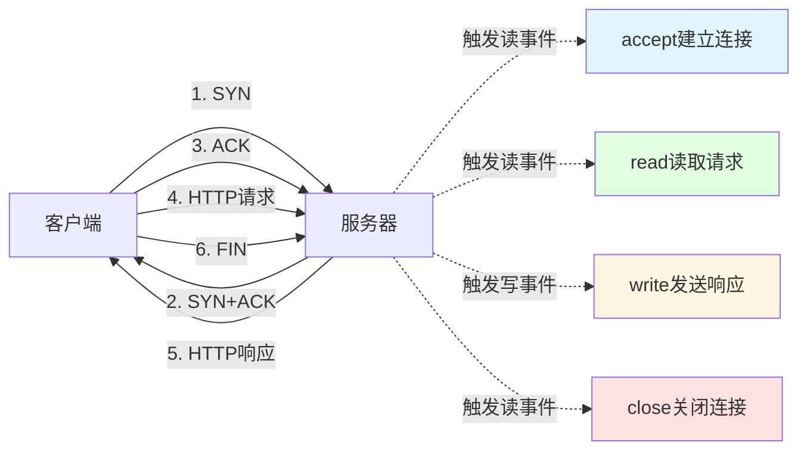

#### 2.7.3 TCP报文结构

```
+------------------+
| 数据链路层头部    | <- MAC地址
+------------------+
| 网络层头部(IP)    | <- IP地址
+------------------+
| 传输层头部(TCP)   | <- 端口号
+------------------+
| 应用层数据(HTTP)  | <- HTTP协议
+------------------+
| 数据链路层尾部    |
+------------------+
```

**各层作用：**

- **数据链路层**：MAC地址，局域网内通信
- **网络层**：IP地址，跨网络通信
- **传输层**：端口号，进程间通信
- **应用层**：HTTP等协议，应用数据

#### 2.7.4 网络事件类型

| 事件类型 | 触发条件         | Nginx操作 | 说明           |
| -------- | ---------------- | --------- | -------------- |
| 建立连接 | 收到SYN+ACK的ACK | accept()  | 三次握手完成   |
| 可读     | 收到数据报文     | read()    | 读取HTTP请求   |
| 可写     | 发送缓冲区可用   | write()   | 发送HTTP响应   |
| 对端关闭 | 收到FIN          | close()   | 客户端主动断开 |

#### 2.7.5 事件收集分发器

```mermaid
graph TD
    A[网络事件生产者] --> B[事件收集器]
    B --> C{事件类型}
    C -->|连接建立| D[Accept消费者]
    C -->|可读| E[Read消费者]
    C -->|可写| F[Write消费者]
    C -->|定时器| G[Timer消费者]
    C -->|AIO| H[AIO消费者]
  
    D --> I[HTTP模块处理]
    E --> I
    F --> I
  
    style B fill:#e1f5ff
    style I fill:#e1ffe1
```

**事件驱动模型的优势：**

- 生产者：网络自动产生事件
- 消费者：模块定义处理逻辑
- 解耦：事件产生和处理分离

### 2.8 Nginx事件驱动模型

#### 2.8.1 事件循环流程

```mermaid
graph TD
    A[等待事件epoll_wait] -->|阻塞等待| B[操作系统通知事件就绪]
    B --> C[从事件队列获取事件]
    C --> D{队列是否为空}
    D -->|否| E[处理事件]
    E --> F{处理过程中}
    F -->|生成新事件| G[添加到事件队列]
    F -->|处理完成| D
    D -->|是| A
  
    style A fill:#e1f5ff
    style E fill:#ffe1e1
    style G fill:#fff5e1
```

#### 2.8.2 事件处理详解

**等待事件（epoll_wait）：**

- Worker进程进入Sleep状态
- 不消耗CPU资源
- 等待操作系统通知

**获取事件：**

- 操作系统准备好事件队列
- Worker进程被唤醒
- 从队列中取出事件

**处理事件：**

- 执行事件对应的回调函数
- 可能生成新的事件（如超时定时器、写事件等）
- 新事件加入队列等待下次处理

#### 2.8.3 事件处理的性能影响

**注意事项：**

1. **避免长时间CPU计算**

   - 会阻塞事件队列中的其他事件
   - 导致大量连接超时
   - 引发恶性循环
2. **第三方模块的影响**

   - 不能长时间占用CPU
   - 应分段处理计算任务
   - 如Gzip模块分段压缩
3. **事件队列积压**

   - 一个事件处理时间过长
   - 后续事件得不到及时处理
   - 可能导致连接超时

### 2.9 Epoll的优势与原理

#### 2.9.1 事件模型性能对比

```mermaid
graph LR
    A[并发连接数增加] --> B{事件模型}
    B -->|Select/Poll| C[性能急剧下降]
    B -->|Epoll/Kqueue| D[性能基本不变]
  
    style C fill:#ffe1e1
    style D fill:#e1ffe1
```

**性能对比：**

- **Select/Poll**：O(n)复杂度，每次需要遍历所有连接
- **Epoll/Kqueue**：O(1)复杂度，只返回活跃连接

#### 2.9.2 Select/Poll的问题

```
假设有100万个并发连接，但只有100个活跃连接

Select/Poll方式：
1. 每次调用都要把100万个连接传给操作系统
2. 操作系统遍历100万个连接
3. 找出100个活跃连接返回
4. 效率极低，O(n)复杂度
```

#### 2.9.3 Epoll的实现原理

```mermaid
graph TD
    A[Nginx] --> B[Epoll]
    B --> C[红黑树RBTree]
    B --> D[就绪链表Ready List]
  
    C -->|添加/删除/修改| E[事件管理O log n]
    D -->|遍历| F[获取活跃事件O 1]
  
    G[网卡收到数据] -->|触发| D
  
    style B fill:#e1f5ff
    style C fill:#ffe1e1
    style D fill:#e1ffe1
```

**Epoll数据结构：**

1. **红黑树（管理所有事件）**

   - 存储所有监听的文件描述符
   - 插入/删除/修改：O(log n)
   - 高效的事件管理
2. **就绪链表（只包含活跃事件）**

   - 只包含有事件发生的连接
   - 遍历：O(1)
   - 高效的事件获取

**Epoll操作：**

```c
// 创建epoll实例
int epfd = epoll_create(1024);

// 添加事件（插入红黑树）
epoll_ctl(epfd, EPOLL_CTL_ADD, fd, &event);

// 修改事件
epoll_ctl(epfd, EPOLL_CTL_MOD, fd, &event);

// 删除事件（从红黑树删除）
epoll_ctl(epfd, EPOLL_CTL_DEL, fd, NULL);

// 等待事件（只遍历就绪链表）
int n = epoll_wait(epfd, events, maxevents, timeout);
```

#### 2.9.4 Epoll的优势总结

| 特性       | Select/Poll  | Epoll          |
| ---------- | ------------ | -------------- |
| 复杂度     | O(n)         | O(1)           |
| 最大连接数 | 受限         | 无限制         |
| 数据拷贝   | 每次都要拷贝 | 只拷贝活跃连接 |
| 适用场景   | 少量连接     | 大量并发连接   |

### 2.10 Nginx的请求切换

#### 2.10.1 传统服务器的请求切换

```mermaid
graph TD
    A[Process 1: Request 1] -->|网络不满足| B[进程切换5微秒]
    B --> C[Process 2: Request 2]
    C -->|网络不满足| D[进程切换5微秒]
    D --> E[Process 3: Request 3]
    E -->|时间片用完| F[进程切换5微秒]
    F --> A
  
    style B fill:#ffe1e1
    style D fill:#ffe1e1
    style F fill:#ffe1e1
```

**传统服务器（Apache/Tomcat）的问题：**

- 一个进程同时只处理一个请求
- 网络条件不满足时发生进程切换
- 进程切换成本：约5微秒
- 并发连接越多，切换越频繁
- 性能损耗呈指数增长

#### 2.10.2 Nginx的请求切换

```mermaid
graph TD
    A[Request 1处理] -->|网络不满足| B[用户态切换]
    B --> C[Request 2处理]
    C -->|网络不满足| D[用户态切换]
    D --> E[Request 3处理]
    E -->|继续处理| A
  
    style B fill:#e1ffe1
    style D fill:#e1ffe1
```

**Nginx的优势：**

- 在用户态直接切换请求
- 无进程切换开销
- 依赖Worker进程的时间片（5-800ms）
- 提高Worker进程优先级获得更大时间片

#### 2.10.3 优化Worker进程优先级

```nginx
# 设置Worker进程的优先级（-20到19，越小优先级越高）
worker_priority -19;
```

**作用：**

- 获得更大的CPU时间片
- 减少操作系统切换Worker进程的频率
- 在用户态完成更多请求切换

#### 2.10.4 请求切换性能对比

| 特性     | 传统服务器 | Nginx      |
| -------- | ---------- | ---------- |
| 切换方式 | 进程间切换 | 用户态切换 |
| 切换成本 | 5微秒      | 几乎为0    |
| 适用场景 | 数百连接   | 数百万连接 |
| 性能损耗 | 指数增长   | 线性增长   |

### 2.11 同步、异步、阻塞、非阻塞

#### 2.11.1 概念区分

**阻塞 vs 非阻塞（系统调用层面）：**

- **阻塞**：调用方法时，条件不满足会导致进程进入Sleep状态
- **非阻塞**：调用方法时，条件不满足立即返回错误码（EAGAIN）

**同步 vs 异步（编程方式层面）：**

- **同步**：代码按顺序执行，看起来是阻塞的
- **异步**：通过回调函数处理结果，代码不连续

#### 2.11.2 阻塞调用示例

```c
// 阻塞的accept调用
int client_fd = accept(server_fd, ...);
// 如果没有新连接，进程会进入Sleep状态
// 直到有新连接到来或超时
```

**特点：**

- Accept队列为空时阻塞
- 进程主动切换
- 可设置超时时间

#### 2.11.3 非阻塞调用示例

```c
// 非阻塞的accept调用
int client_fd = accept(server_fd, ...);
if (client_fd == -1 && errno == EAGAIN) {
    // Accept队列为空，立即返回EAGAIN
    // 需要代码决定下一步操作
}
```

**特点：**

- 立即返回，不阻塞
- 返回EAGAIN错误码
- 需要代码处理错误情况

#### 2.11.4 异步编程示例（Nginx C代码）

```c
// 异步读取请求Body
ngx_http_read_client_request_body(r, ngx_http_upstream_init);
// 立即返回，不等待Body读取完成
// Body读取完成后会回调ngx_http_upstream_init函数
```

**特点：**

- 代码不连续
- 通过回调函数处理结果
- 难以理解和维护

#### 2.11.5 同步编程示例（OpenResty Lua代码）

```lua
-- 同步方式连接Redis
local red = redis:new()
red:set_timeout(1000)
local ok, err = red:connect("127.0.0.1", 6379)
if not ok then
    ngx.say("failed to connect: ", err)
    return
end

-- 代码连续，易于理解
-- 但底层使用非阻塞方式实现
```

**特点：**

- 代码连续，易于理解
- 底层使用非阻塞实现
- 兼顾开发效率和运行效率

#### 2.11.6 四种组合方式

| 组合       | 示例        | 适用场景   | 说明     |
| ---------- | ----------- | ---------- | -------- |
| 同步阻塞   | 传统CGI     | 简单应用   | 性能差   |
| 同步非阻塞 | OpenResty   | 高并发应用 | 推荐     |
| 异步阻塞   | 无          | 无意义     | 不使用   |
| 异步非阻塞 | Nginx C模块 | 高性能需求 | 开发复杂 |

### 2.12 Nginx模块系统

#### 2.12.1 模块的四个关键点

理解一个Nginx模块需要了解：

1. **是否编译进Nginx**

   - 查看 `objs/ngx_modules.c`
   - 确认模块是否在数组中
2. **提供哪些配置项**

   - 查看官方文档
   - 查看源码中的 `ngx_command_t`结构
3. **何时被使用**

   - 默认使用 vs 需要配置
   - 查看模块的回调方法
4. **提供哪些变量**

   - 查看文档的"Embedded Variables"
   - 可用于日志、条件判断等

#### 2.12.2 模块结构

```c
// 模块定义结构体
typedef struct {
    ngx_str_t             name;        // 模块名称
    void                 *ctx;         // 模块上下文
    ngx_command_t        *commands;    // 配置指令数组
    ngx_uint_t            type;        // 模块类型
  
    // 回调方法
    ngx_int_t           (*init_master)(ngx_log_t *log);
    ngx_int_t           (*init_module)(ngx_cycle_t *cycle);
    ngx_int_t           (*init_process)(ngx_cycle_t *cycle);
    ngx_int_t           (*init_thread)(ngx_cycle_t *cycle);
    void                (*exit_thread)(ngx_cycle_t *cycle);
    void                (*exit_process)(ngx_cycle_t *cycle);
    void                (*exit_master)(ngx_cycle_t *cycle);
} ngx_module_t;
```

#### 2.12.3 配置指令定义

```c
// 配置指令数组
static ngx_command_t ngx_http_gzip_filter_commands[] = {
    {
        ngx_string("gzip"),           // 指令名
        NGX_HTTP_MAIN_CONF|NGX_HTTP_SRV_CONF|NGX_HTTP_LOC_CONF|NGX_CONF_FLAG,
        ngx_conf_set_flag_slot,       // 处理函数
        NGX_HTTP_LOC_CONF_OFFSET,
        offsetof(ngx_http_gzip_conf_t, enable),
        NULL
    },
    // ... 更多指令
    ngx_null_command
};
```

#### 2.12.4 查看模块是否编译

```bash
# 查看编译进Nginx的所有模块
cat objs/ngx_modules.c

# 输出示例
ngx_module_t *ngx_modules[] = {
    &ngx_core_module,
    &ngx_errlog_module,
    &ngx_conf_module,
    &ngx_events_module,
    &ngx_event_core_module,
    &ngx_epoll_module,
    &ngx_http_module,
    &ngx_http_core_module,
    &ngx_http_gzip_filter_module,
    // ... 更多模块
    NULL
};
```

#### 2.12.5 模块的生命周期回调

```mermaid
graph TD
    A[Master进程启动] --> B[init_master]
    B --> C[init_module]
    C --> D[Worker进程启动]
    D --> E[init_process]
    E --> F[Worker进程运行]
    F --> G[Worker进程退出]
    G --> H[exit_process]
    H --> I[Master进程退出]
    I --> J[exit_master]
  
    style B fill:#e1f5ff
    style E fill:#e1ffe1
    style H fill:#fff5e1
    style J fill:#ffe1e1
```

**回调时机：**

- `init_master`：Master进程启动时
- `init_module`：配置解析完成后
- `init_process`：Worker进程启动时
- `exit_process`：Worker进程退出时
- `exit_master`：Master进程退出时

### 2.13 Nginx模块分类

#### 2.13.1 模块类型层次

```mermaid
graph TD
    A[ngx_module_t] --> B[核心模块ngx_core_module]
    A --> C[配置模块ngx_conf_module]
  
    B --> D[Events模块]
    B --> E[HTTP模块]
    B --> F[Mail模块]
    B --> G[Stream模块]
  
    D --> D1[事件核心模块event_core]
    D --> D2[Epoll模块]
    D --> D3[Kqueue模块]
  
    E --> E1[HTTP核心模块http_core]
    E --> E2[请求处理模块]
    E --> E3[响应过滤模块filter]
    E --> E4[Upstream模块]
  
    style A fill:#e1f5ff
    style B fill:#ffe1e1
    style E fill:#e1ffe1
```

#### 2.13.2 核心模块类型

| 模块类型          | 说明         | 示例                                              |
| ----------------- | ------------ | ------------------------------------------------- |
| NGX_CORE_MODULE   | 核心模块     | ngx_core_module, ngx_events_module                |
| NGX_CONF_MODULE   | 配置解析模块 | ngx_conf_module                                   |
| NGX_EVENT_MODULE  | 事件模块     | ngx_epoll_module, ngx_kqueue_module               |
| NGX_HTTP_MODULE   | HTTP模块     | ngx_http_core_module, ngx_http_gzip_filter_module |
| NGX_MAIL_MODULE   | 邮件模块     | ngx_mail_core_module                              |
| NGX_STREAM_MODULE | Stream模块   | ngx_stream_core_module                            |

#### 2.13.3 HTTP模块细分

**1. HTTP核心模块（http_core）**

- 定义HTTP模块的通用规则
- 处理HTTP请求的基本流程
- 必须存在的模块

**2. 请求处理模块**

- 生成HTTP响应
- 如：index、autoindex、static等

**3. 响应过滤模块（filter）**

- 对响应做二次处理
- 模块名包含"filter"关键字
- 如：gzip_filter、image_filter等

**4. Upstream模块**

- 与上游服务交互
- 模块名包含"upstream"关键字
- 如：upstream_hash、upstream_ip_hash等

#### 2.13.4 源码目录结构

```
nginx/src/
├── core/              # 核心框架代码
│   ├── ngx_core.h
│   └── ngx_module.c
├── event/             # 事件模块
│   ├── ngx_event.c
│   ├── modules/
│   │   ├── ngx_epoll_module.c
│   │   └── ngx_kqueue_module.c
├── http/              # HTTP模块
│   ├── ngx_http.c     # HTTP框架代码
│   ├── ngx_http_core_module.c  # HTTP核心模块
│   └── modules/       # HTTP子模块
│       ├── ngx_http_gzip_filter_module.c
│       ├── ngx_http_upstream_hash_module.c
│       └── ...
├── mail/              # 邮件模块
└── stream/            # Stream模块
```

#### 2.13.5 模块顺序的重要性

模块在 `ngx_modules`数组中的顺序很重要：

- **先出现的模块优先级更高**
- **可能阻碍后出现的模块**
- **Core模块总是排在第一位**

```c
// 模块顺序示例
ngx_module_t *ngx_modules[] = {
    &ngx_core_module,              // 1. 核心模块
    &ngx_events_module,            // 2. 事件模块
    &ngx_event_core_module,        // 3. 事件核心模块
    &ngx_epoll_module,             // 4. Epoll模块
    &ngx_http_module,              // 5. HTTP模块
    &ngx_http_core_module,         // 6. HTTP核心模块
    &ngx_http_gzip_filter_module,  // 7. Gzip过滤模块
    // ...
};
```

### 2.14 连接池

#### 2.14.1 连接池结构

```mermaid
graph TD
    A[ngx_cycle_t] --> B[connections数组]
    A --> C[read_events数组]
    A --> D[write_events数组]
  
    B --> E[connection 0]
    B --> F[connection 1]
    B --> G[connection N]
  
    C --> H[read_event 0]
    C --> I[read_event 1]
    C --> J[read_event N]
  
    D --> K[write_event 0]
    D --> L[write_event 1]
    D --> M[write_event N]
  
    E -.对应.-> H
    E -.对应.-> K
  
    style A fill:#e1f5ff
    style B fill:#ffe1e1
    style C fill:#e1ffe1
    style D fill:#fff5e1
```

#### 2.14.2 配置连接数

```nginx
events {
    # 每个Worker进程的最大连接数
    worker_connections 1024;  # 默认512，生产环境通常设置更大
}
```

**注意事项：**

1. **反向代理消耗双倍连接**

   - 客户端连接：1个
   - 上游服务器连接：1个
   - 总计：2个连接
2. **内存消耗计算**

   ```
   每个连接内存 = sizeof(ngx_connection_t) + 2 * sizeof(ngx_event_t)
                = 232字节 + 2 * 96字节
                = 424字节

   总内存 = worker_connections * 424字节
   ```
3. **推荐配置**

   ```nginx
   # 根据服务器内存和CPU核数调整
   worker_processes auto;
   events {
       worker_connections 10240;  # 或更大
   }
   ```

#### 2.14.3 连接结构体

```c
// ngx_connection_t结构体（简化版）
typedef struct ngx_connection_s {
    void               *data;           // 连接数据
    ngx_event_t        *read;           // 读事件
    ngx_event_t        *write;          // 写事件
  
    ngx_socket_t        fd;             // 套接字描述符
  
    ngx_recv_pt         recv;           // 接收方法
    ngx_send_pt         send;           // 发送方法
  
    off_t               sent;           // 已发送字节数
  
    ngx_pool_t         *pool;           // 连接内存池
  
    // ... 更多成员
} ngx_connection_t;  // 64位系统约232字节
```

#### 2.14.4 事件结构体

```c
// ngx_event_t结构体（简化版）
typedef struct ngx_event_s {
    void               *data;           // 事件数据
  
    ngx_event_handler_pt  handler;      // 事件处理回调
  
    ngx_rbtree_node_t   timer;          // 定时器节点
  
    unsigned            active:1;       // 是否活跃
    unsigned            ready:1;        // 是否就绪
    unsigned            timedout:1;     // 是否超时
  
    // ... 更多成员
} ngx_event_t;  // 约96字节
```

#### 2.14.5 超时配置

```nginx
http {
    # 客户端请求头超时
    client_header_timeout 60s;
  
    # 客户端请求体超时
    client_body_timeout 60s;
  
    # 发送响应超时
    send_timeout 60s;
  
    # Keepalive超时
    keepalive_timeout 75s;
}
```

#### 2.14.6 内置变量示例

```nginx
http {
    log_format main '$remote_addr - $remote_user [$time_local] "$request" '
                    '$status $body_bytes_sent "$http_referer" '
                    '"$http_user_agent" $bytes_sent';
  
    server {
        access_log /var/log/nginx/access.log main;
    }
}
```

**常用变量：**

- `$bytes_sent`：发送给客户端的总字节数（对应connection->sent）
- `$body_bytes_sent`：发送给客户端的响应体字节数
- `$connection`：连接序号
- `$connection_requests`：当前连接上处理的请求数

### 2.15 内存池

#### 2.15.1 内存池的作用

**为什么需要内存池：**

1. **减少内存碎片**

   - 预分配大块内存
   - 小块内存连续分配
   - 避免频繁malloc/free
2. **简化内存管理**

   - 第三方模块无需手动释放内存
   - 请求结束自动释放请求内存池
   - 连接关闭自动释放连接内存池
3. **提升性能**

   - 减少系统调用次数
   - 减少内存分配开销

#### 2.15.2 内存池类型

```mermaid
graph TD
    A[ngx_connection_t] --> B[连接内存池pool]
    C[ngx_http_request_t] --> D[请求内存池pool]
  
    B --> E[生命周期: 连接建立到关闭]
    D --> F[生命周期: 请求开始到结束]
  
    E --> G[适用: 跨请求的数据]
    F --> H[适用: 单个请求的数据]
  
    style B fill:#e1f5ff
    style D fill:#e1ffe1
```

#### 2.15.3 内存池配置

```nginx
http {
    # 连接内存池大小（默认256或512，取决于系统位数）
    connection_pool_size 512;
  
    # 请求内存池大小（默认4k）
    request_pool_size 4k;
}
```

**配置建议：**

| 场景       | connection_pool_size | request_pool_size |
| ---------- | -------------------- | ----------------- |
| 默认       | 512                  | 4k                |
| URL很长    | 512                  | 8k或更大          |
| URL很短    | 256                  | 2k                |
| 大量小请求 | 256                  | 2k                |

#### 2.15.4 内存池工作原理

```mermaid
graph LR
    A[内存池] --> B[大块内存]
    B --> C[小块1]
    B --> D[小块2]
    B --> E[小块3]
    B --> F[未使用]
  
    C -.next.-> D
    D -.next.-> E
    E -.next.-> F
  
    G[新分配] --> F
  
    style A fill:#e1f5ff
    style F fill:#e1ffe1
```

**分配策略：**

1. **小块内存（< 页面大小）**

   - 从预分配的内存块中分配
   - 使用next指针连接
   - 快速分配，无碎片
2. **大块内存（≥ 页面大小）**

   - 直接调用malloc分配
   - 单独管理
   - 释放时单独free

#### 2.15.5 连接内存池 vs 请求内存池

| 特性            | 连接内存池     | 请求内存池     |
| --------------- | -------------- | -------------- |
| 生命周期        | 连接建立到关闭 | 请求开始到结束 |
| 默认大小        | 512字节        | 4KB            |
| 适用数据        | 跨请求共享     | 单个请求专用   |
| 释放时机        | 连接关闭       | 请求结束       |
| HTTP Keep-Alive | 保持           | 每次请求重建   |

**使用场景：**

```c
// 连接内存池：读取请求的缓冲区（跨请求复用）
buffer = ngx_palloc(c->pool, 1024);

// 请求内存池：解析URL的临时数据（请求结束释放）
uri = ngx_palloc(r->pool, r->uri.len + 1);
```

#### 2.15.6 内存池的性能影响

**优点：**

- 减少内存碎片
- 减少系统调用
- 简化内存管理

**注意事项：**

- 预分配过大浪费内存
- 预分配过小频繁扩展
- 第三方模块应正确选择内存池类型

### 2.16 共享内存

#### 2.16.1 进程间通信方式

Nginx多进程间通信主要有两种方式：

1. **信号**：用于进程管理
2. **共享内存**：用于数据同步

#### 2.16.2 共享内存的必要性

```mermaid
graph TD
    A[Master进程] --> B[Worker 1]
    A --> C[Worker 2]
    A --> D[Worker N]
  
    B -.共享内存.-> E[Shared Memory]
    C -.共享内存.-> E
    D -.共享内存.-> E
  
    E --> F[限流限速数据]
    E --> G[缓存数据]
    E --> H[SSL Session]
    E --> I[Lua共享字典]
  
    style E fill:#e1f5ff
    style F fill:#ffe1e1
    style G fill:#e1ffe1
```

**使用场景：**

- 跨Worker进程的限流限速
- 反向代理缓存
- SSL Session缓存
- OpenResty的lua_shared_dict

#### 2.16.3 共享内存的挑战

**1. 锁机制**

```mermaid
graph LR
    A[Worker 1] -->|尝试获取锁| B{锁状态}
    B -->|已锁定| C[自旋等待]
    B -->|未锁定| D[获取锁成功]
    D --> E[操作共享内存]
    E --> F[释放锁]
    C --> B
  
    style C fill:#ffe1e1
    style D fill:#e1ffe1
```

**锁的类型：**

- **信号量（早期）**：会导致进程Sleep，性能差
- **自旋锁（现代）**：不Sleep，持续尝试获取锁

**自旋锁的要求：**

- 快速获取锁
- 快速释放锁
- 不能长时间持有锁

**2. 内存管理**

需要Slab内存管理器来分配和管理共享内存。

#### 2.16.4 使用共享内存的模块

**官方模块：**

| 模块          | 数据结构 | 用途            |
| ------------- | -------- | --------------- |
| limit_req     | 红黑树   | 请求限速        |
| limit_conn    | 红黑树   | 连接限制        |
| http_cache    | 红黑树   | 反向代理缓存    |
| ssl           | 红黑树   | SSL Session缓存 |
| upstream_zone | 链表     | 上游服务器共享  |

**OpenResty模块：**

```nginx
http {
    # 创建共享内存字典
    lua_shared_dict dogs 10m;
  
    server {
        location /set {
            content_by_lua_block {
                local dogs = ngx.shared.dogs
                dogs:set("Jim", 8)
                ngx.say("stored")
            }
        }
  
        location /get {
            content_by_lua_block {
                local dogs = ngx.shared.dogs
                local value = dogs:get("Jim")
                ngx.say(value)
            }
        }
    }
}
```

#### 2.16.5 lua_shared_dict的实现

```mermaid
graph TD
    A[lua_shared_dict] --> B[红黑树RBTree]
    A --> C[LRU链表]
  
    B --> D[存储Key-Value]
    B --> E[快速查找O log n]
  
    C --> F[记录访问顺序]
    C --> G[内存满时淘汰]
  
    style A fill:#e1f5ff
    style B fill:#ffe1e1
    style C fill:#e1ffe1
```

**特性：**

- 使用红黑树存储数据
- 使用LRU链表管理淘汰
- 内存满时自动淘汰最久未使用的数据

### 2.17 Slab内存管理器

#### 2.17.1 Slab的作用

将大块共享内存切分成小块，分配给不同的对象使用。

#### 2.17.2 Slab内存结构

```mermaid
graph TD
    A[共享内存] --> B[Page 1: 4KB]
    A --> C[Page 2: 4KB]
    A --> D[Page N: 4KB]
  
    B --> E[Slot: 32字节]
    B --> F[Slot: 32字节]
    B --> G[Slot: 32字节]
  
    C --> H[Slot: 64字节]
    C --> I[Slot: 64字节]
  
    D --> J[Slot: 128字节]
  
    style A fill:#e1f5ff
    style B fill:#ffe1e1
    style C fill:#e1ffe1
    style D fill:#fff5e1
```

**分配策略：**

1. **页面（Page）**

   - 固定大小（通常4KB）
   - 共享内存被切分为多个页面
2. **槽位（Slot）**

   - 每个页面切分为多个槽位
   - 槽位大小以2的幂次增长（32、64、128、256...）
3. **Best Fit分配**

   - 51字节的对象分配到64字节的槽位
   - 浪费13字节（最多浪费50%）

#### 2.17.3 Slab的优缺点

**优点：**

- 适合小对象分配
- 碎片少
- 分配快速
- 可复用已初始化的数据结构

**缺点：**

- 最多浪费50%内存
- 只适合小于页面大小的对象

#### 2.17.4 监控Slab使用情况

**Tengine的slab_stat模块：**

```nginx
location /slab_stat {
    slab_stat;
}
```

**输出示例：**

```
* shared memory: dogs
total:       10485760(10.00M) free:       10485200(10.00M) size:            8
pages:       10485200(10.00M) start:00007F8F8E8A5000 end:00007F8F8F8A5000
slot:           8(  8) total:           0 used:           0 reqs:           0 fails:           0
slot:          16( 16) total:           0 used:           0 reqs:           0 fails:           0
slot:          32( 32) total:         127 used:           1 reqs:           1 fails:           0
slot:          64( 64) total:           0 used:           0 reqs:           0 fails:           0
slot:         128(128) total:          32 used:           2 reqs:           2 fails:           0
```

**字段说明：**

- `total`：该槽位总数
- `used`：已使用数量
- `reqs`：请求次数
- `fails`：失败次数

### 2.18 哈希表

#### 2.18.1 Nginx哈希表的特点

**与普通哈希表的区别：**

1. **静态不变**

   - 启动时确定所有元素
   - 运行时不插入不删除
   - 只用于查找
2. **配置参数**

   - `max_size`：最大元素数量
   - `bucket_size`：每个桶的大小

#### 2.18.2 哈希表结构

```mermaid
graph TD
    A[Hash Table] --> B[Bucket 0]
    A --> C[Bucket 1]
    A --> D[Bucket N]
  
    B --> E[Key-Value 1]
    B --> F[Key-Value 2]
  
    C --> G[Key-Value 3]
  
    style A fill:#e1f5ff
    style B fill:#ffe1e1
    style C fill:#e1ffe1
```

#### 2.18.3 使用哈希表的模块

| 模块           | 用途         | 配置                                                              |
| -------------- | ------------ | ----------------------------------------------------------------- |
| variables_hash | 存储所有变量 | -                                                                 |
| map            | 变量映射     | `map_hash_max_size`, `map_hash_bucket_size`                   |
| types          | MIME类型映射 | `types_hash_max_size`, `types_hash_bucket_size`               |
| server_names   | 服务器名称   | `server_names_hash_max_size`, `server_names_hash_bucket_size` |

#### 2.18.4 CPU Cache Line对齐

```nginx
# 哈希表bucket大小配置
map_hash_bucket_size 64;  # 默认值，与CPU Cache Line对齐
```

**为什么要对齐到64字节：**

1. **CPU Cache Line大小**

   - 现代CPU一次从内存读取64字节
   - 称为一个Cache Line
2. **未对齐的问题**

   ```
   假设bucket_size = 59字节

   Bucket 1: [0-58]    需要读取1次（64字节）
   Bucket 2: [59-117]  需要读取2次（第一个64字节的最后5字节 + 第二个64字节的前54字节）
   ```
3. **对齐的好处**

   ```
   bucket_size = 64字节

   Bucket 1: [0-63]    需要读取1次
   Bucket 2: [64-127]  需要读取1次
   ```

**配置建议：**

- 尽量不超过64字节
- 如果必须超过，会自动对齐到128字节
- 减少CPU访问内存的次数

### 2.19 红黑树

#### 2.19.1 红黑树的特性

```mermaid
graph TD
    A[11] --> B[6]
    A --> C[15]
    B --> D[1]
    B --> E[8]
    C --> F[13]
    C --> G[17]
  
    style A fill:#ffe1e1
    style B fill:#e1f5ff
    style C fill:#ffe1e1
    style D fill:#e1f5ff
    style E fill:#ffe1e1
    style F fill:#e1f5ff
    style G fill:#ffe1e1
```

**红黑树是：**

1. **二叉树**：每个节点最多两个子节点
2. **查找二叉树**：左子节点 < 父节点 < 右子节点
3. **自平衡**：高度差不超过2倍

**红黑树的优点：**

| 特性 | 复杂度     | 说明      |
| ---- | ---------- | --------- |
| 高度 | ≤ 2log(n) | n为节点数 |
| 插入 | O(log n)   | 自动平衡  |
| 删除 | O(log n)   | 自动平衡  |
| 查找 | O(log n)   | 二分查找  |
| 遍历 | O(n)       | 中序遍历  |

#### 2.19.2 红黑树数据结构

```c
// 红黑树结构
typedef struct {
    ngx_rbtree_node_t  *root;      // 根节点
    ngx_rbtree_node_t  *sentinel;  // 哨兵节点
    ngx_rbtree_insert_pt insert;   // 插入方法
} ngx_rbtree_t;

// 红黑树节点
typedef struct ngx_rbtree_node_s {
    ngx_rbtree_key_t       key;     // 键（整数）
    struct ngx_rbtree_node_s  *left;   // 左子节点
    struct ngx_rbtree_node_s  *right;  // 右子节点
    struct ngx_rbtree_node_s  *parent; // 父节点
    u_char                 color;   // 颜色（红/黑）
    u_char                 data;    // 数据
} ngx_rbtree_node_t;
```

#### 2.19.3 使用红黑树的模块

**本地内存中的红黑树：**

- `timer`：定时器管理
- `ngx_conf_module`：配置解析

**共享内存中的红黑树：**

- `limit_req`：请求限速
- `limit_conn`：连接限制
- `http_cache`：反向代理缓存
- `ssl`：SSL Session缓存
- `lua_shared_dict`：Lua共享字典

#### 2.19.4 红黑树的应用场景

**1. 定时器管理**

```mermaid
graph TD
    A[定时器红黑树] --> B[最小节点=最早超时]
    B --> C[快速找到超时事件]
    C --> D[O log n 插入新定时器]
  
    style A fill:#e1f5ff
    style B fill:#e1ffe1
```

**2. 限流限速**

```
红黑树存储：客户端IP -> 请求次数
- 快速查找：O(log n)
- 快速插入：O(log n)
- 快速删除：O(log n)
```

**3. 缓存管理**

```
红黑树存储：缓存Key -> 缓存数据
- 快速查找缓存
- 快速插入新缓存
- 快速删除过期缓存
```

### 2.20 动态模块

#### 2.20.1 静态模块 vs 动态模块

```mermaid
graph TD
    A[静态模块] --> B[编译进二进制文件]
    B --> C[升级需要重新编译所有模块]
  
    D[动态模块] --> E[编译为.so文件]
    E --> F[升级只需替换.so文件]
  
    style A fill:#ffe1e1
    style D fill:#e1ffe1
```

#### 2.20.2 动态模块的优势

**静态模块的问题：**

- 升级一个模块需要重新编译整个Nginx
- 容易遗漏或错误配置其他模块
- 编译参数复杂

**动态模块的优势：**

- 只需重新编译单个模块
- 不影响Nginx主程序
- 降低出错概率

#### 2.20.3 编译动态模块

```bash
# 1. 配置时指定动态模块
./configure --prefix=/usr/local/nginx \
            --with-http_image_filter_module=dynamic

# 2. 编译
make

# 3. 安装
make install

# 4. 查看生成的动态库
ls /usr/local/nginx/modules/
# ngx_http_image_filter_module.so
```

#### 2.20.4 使用动态模块

```nginx
# 在配置文件开头加载动态模块
load_module modules/ngx_http_image_filter_module.so;

http {
    server {
        location ~ \.(jpg|png)$ {
            # 使用image_filter模块的功能
            image_filter resize 150 100;
        }
    }
}
```

#### 2.20.5 动态模块工作流程

```mermaid
sequenceDiagram
    participant N as Nginx
    participant C as nginx.conf
    participant M as 动态模块.so
  
    N->>N: 1. 启动Nginx
    N->>C: 2. 读取配置文件
    C->>C: 3. 发现load_module指令
    N->>M: 4. 打开动态库
    M->>N: 5. 加载模块到进程
    N->>N: 6. 初始化模块
    N->>N: 7. 正常运行
```

#### 2.20.6 支持动态模块的模块

**查看支持动态模块的模块：**

```bash
./configure --help | grep "=dynamic"
```

**常见支持动态模块的模块：**

- `--with-http_image_filter_module=dynamic`
- `--with-http_xslt_module=dynamic`
- `--with-http_geoip_module=dynamic`
- `--with-stream=dynamic`
- `--with-mail=dynamic`

**注意：** 不是所有模块都支持动态加载。

#### 2.20.7 动态模块的限制

1. **不是所有模块都支持**

   - 核心模块不支持
   - 部分第三方模块不支持
2. **性能影响**

   - 动态加载有轻微性能损失
   - 生产环境影响可忽略
3. **版本兼容性**

   - 动态模块需要与Nginx版本匹配
   - 升级Nginx可能需要重新编译动态模块

---

## 第二部分总结
### 核心概念


通过第二部分的学习，我们深入了解了Nginx的架构基础：


1. **进程模型**

   - Master-Worker多进程架构
   - 进程间通过信号和共享内存通信
   - Worker数量与CPU核数匹配
2. **事件驱动**

   - 基于Epoll的非阻塞事件模型
   - 用户态请求切换，避免进程切换开销
   - 支持百万级并发连接
3. **内存管理**

   - 连接池和内存池减少内存碎片
   - 共享内存实现跨进程数据共享
   - Slab管理器高效分配共享内存
4. **数据结构**

   - 哈希表：静态数据快速查找
   - 红黑树：动态数据增删改查
   - 链表：简单的数据组织
5. **模块系统**

   - 高内聚低耦合的模块设计
   - 丰富的生命周期回调
   - 支持静态和动态模块

### 关键技术

- **信号管理**：Reload、热升级、优雅关闭
- **网络事件**：读写事件、定时器、AIO
- **同步异步**：OpenResty实现同步编程方式
- **性能优化**：CPU亲和性、内存池、连接池

接下来，我们将学习HTTP模块的详细使用。

---

**待续：第三部分 - 详解HTTP模块**
