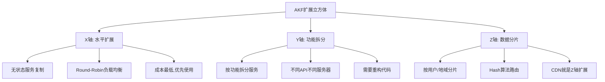
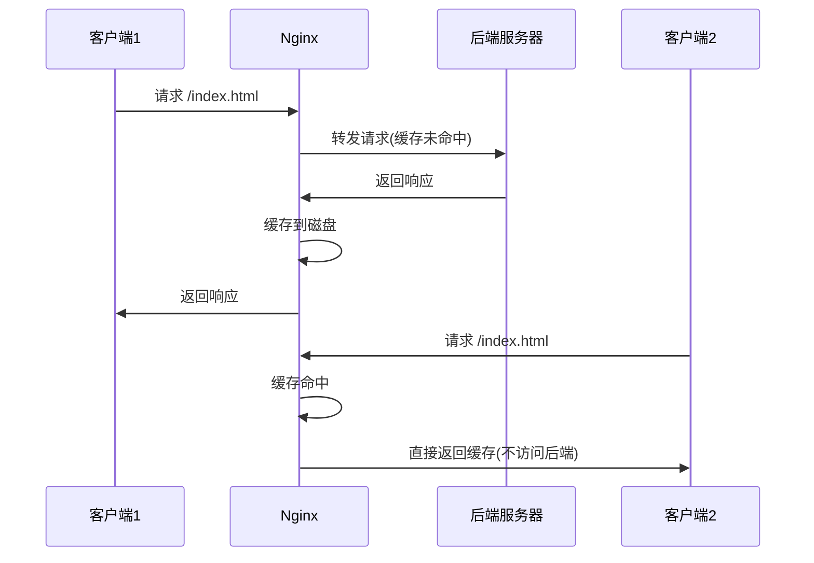
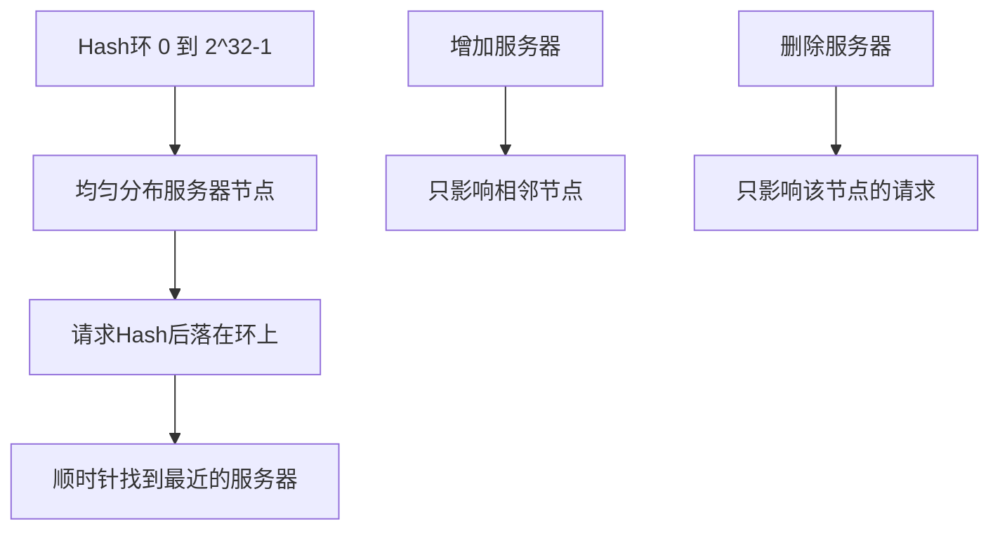
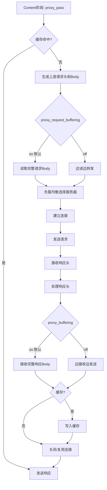

# Nginx 学习笔记 · 第三册：反向代理与负载均衡

## 第四部分：反向代理与负载均衡

### 4.1 反向代理与负载均衡概述

#### 4.1.1 核心概念

**反向代理(Reverse Proxy)**

将客户端请求转发到后端服务器,并将响应返回给客户端。Nginx作为反向代理服务器,可以:

- 隐藏后端服务器的真实IP
- 实现负载均衡
- 提供缓存加速
- 进行SSL终止
- 压缩响应内容

**负载均衡(Load Balancing)**

将请求分发到多台服务器,提升系统的:

- **可用性** - 单台服务器故障不影响整体服务
- **可扩展性** - 水平扩展,增加服务器提升处理能力
- **性能** - 分散请求压力,提升响应速度

#### 4.1.2 AKF扩展立方体



**X轴扩展(水平扩展)**

- 服务无状态,多台服务器功能完全相同
- 使用Round-Robin、Least Connections算法
- 成本最低,应优先采用

**Y轴扩展(功能拆分)**

- 按业务功能拆分服务
- 不同URL路由到不同服务集群
- 通过location配置实现

**Z轴扩展(数据分片)**

- 按用户信息(IP、用户名)分片
- 使用Hash算法保证同一用户路由到同一服务器
- 适用于有状态服务或缓存场景

#### 4.1.3 反向代理分类

**四层反向代理(TCP/UDP)**

```
客户端 → Nginx(Stream模块) → 上游服务器
  TCP/UDP              TCP/UDP
```

- 基于IP和端口转发
- 不解析应用层协议
- 性能更高,但功能有限

**七层反向代理(HTTP)**

```
客户端 → Nginx(HTTP模块) → 上游服务器
  HTTP              HTTP/FastCGI/uWSGI/gRPC/Memcached
```

- 可以解析HTTP协议
- 根据URL、Header等信息路由
- 支持多种上游协议转换

#### 4.1.4 缓存类型

**时间缓存**



**空间缓存**

预读取后续可能需要的内容,减少延迟。

### 4.2 Upstream模块与负载均衡算法

#### 4.2.1 Upstream基本配置

```nginx
http {
    upstream backend {
        # 定义上游服务器
        server 192.168.1.10:8080;
        server 192.168.1.11:8080;
        server 192.168.1.12:8080;
  
        # 通用参数
        server 192.168.1.13:8080 weight=2;      # 权重
        server 192.168.1.14:8080 max_fails=3 fail_timeout=30s;
        server 192.168.1.15:8080 backup;        # 备份服务器
        server 192.168.1.16:8080 down;          # 标记为下线
    }
  
    server {
        location / {
            proxy_pass http://backend;
        }
    }
}
```

**server指令参数:**

| 参数                  | 说明                                |
| --------------------- | ----------------------------------- |
| `weight=n`          | 权重,默认1                          |
| `max_fails=n`       | 最大失败次数,默认1                  |
| `fail_timeout=time` | 失败超时时间,默认10s                |
| `backup`            | 备份服务器,主服务器全部失败时才使用 |
| `down`              | 标记服务器下线                      |
| `max_conns=n`       | 最大并发连接数,默认0(不限制)        |

#### 4.2.2 负载均衡算法

**1. Round-Robin(轮询)**

```nginx
upstream backend {
    server 192.168.1.10:8080 weight=1;
    server 192.168.1.11:8080 weight=2;  # 权重2,处理2倍请求
    server 192.168.1.12:8080 weight=1;
}
```

**特点:**

- 默认算法,无需额外配置
- 按权重依次轮询
- 适用于无状态服务

**请求分配示例:**

```
请求1 → server1 (weight=1)
请求2 → server2 (weight=2)
请求3 → server2 (weight=2)
请求4 → server3 (weight=1)
请求5 → server1 (weight=1)
...
```

**2. IP Hash**

```nginx
upstream backend {
    ip_hash;  # 基于客户端IP的Hash
  
    server 192.168.1.10:8080;
    server 192.168.1.11:8080;
    server 192.168.1.12:8080;
}
```

**特点:**

- 基于客户端IP地址(IPv4前3字节,IPv6完整地址)
- 同一IP的请求总是路由到同一服务器
- 适用于有状态服务(如Session)
- 可配合realip模块获取真实IP

**注意事项:**

- 服务器数量变化会导致大量请求重新路由
- 不支持weight参数
- backup参数仍然有效

**3. Hash(通用Hash)**

```nginx
upstream backend {
    hash $request_uri;  # 基于请求URI
    # hash $request_uri consistent;  # 一致性Hash
  
    server 192.168.1.10:8080;
    server 192.168.1.11:8080;
    server 192.168.1.12:8080;
}
```

**Hash Key可以是:**

```nginx
# 基于URL参数
hash $arg_user_id;

# 基于Cookie
hash $cookie_session_id;

# 基于请求头
hash $http_x_forwarded_for;

# 组合多个变量
hash "$remote_addr$request_uri";
```

**特点:**

- 可基于任意变量或字符串
- 灵活性高,适用于各种场景
- 同样面临服务器数量变化的问题

**4. 一致性Hash(Consistent Hash)**

```nginx
upstream backend {
    hash $request_uri consistent;  # 添加consistent参数
  
    server 192.168.1.10:8080;
    server 192.168.1.11:8080;
    server 192.168.1.12:8080;
}
```

**原理:**



**优点:**

- 服务器增减时,只影响部分请求
- 缓存失效范围小
- 适用于有缓存的场景

**对比普通Hash:**

| 场景              | 普通Hash        | 一致性Hash      |
| ----------------- | --------------- | --------------- |
| 5台服务器,删除1台 | 80%请求重新路由 | 20%请求重新路由 |
| 缓存失效率        | 高              | 低              |
| 性能影响          | 大              | 小              |

**5. Least Connections(最少连接)**

```nginx
upstream backend {
    least_conn;  # 最少连接算法
  
    server 192.168.1.10:8080;
    server 192.168.1.11:8080;
    server 192.168.1.12:8080;
}
```

**特点:**

- 优先选择当前连接数最少的服务器
- 适用于请求处理时间差异大的场景
- 多个服务器连接数相同时,退化为Round-Robin

**工作原理:**

```
Server1: 5个连接
Server2: 3个连接  ← 新请求路由到这里
Server3: 7个连接
```

#### 4.2.3 Keepalive连接复用

**对上游使用Keepalive:**

```nginx
upstream backend {
    server 192.168.1.10:8080;
    server 192.168.1.11:8080;
  
    # Keepalive配置
    keepalive 32;              # 保持32个空闲连接
    keepalive_requests 100;    # 每个连接最多100个请求(1.15.3+)
    keepalive_timeout 60s;     # 空闲连接超时时间(1.15.3+)
}

server {
    location / {
        proxy_pass http://backend;
  
        # 必须配置,否则Keepalive不生效
        proxy_http_version 1.1;
        proxy_set_header Connection "";
    }
}
```

**优点:**

1. 减少TCP握手次数
2. 降低延迟
3. 提升吞吐量
4. 减少TIME_WAIT状态的连接

**注意事项:**

- HTTP/1.0不支持Keepalive,必须使用HTTP/1.1
- 必须清空Connection头部(默认为"close")
- keepalive数量要根据并发量合理设置

#### 4.2.4 Upstream Zone(共享内存)

```nginx
upstream backend {
    zone backend_zone 10m;  # 分配10MB共享内存
  
    server 192.168.1.10:8080;
    server 192.168.1.11:8080;
}
```

**功能:**

- 将upstream配置和状态信息存储在共享内存中
- 所有Worker进程共享负载均衡状态
- 支持动态配置(Nginx Plus)

**作用:**

- 使least_conn算法跨Worker进程生效
- 统计信息更准确
- 为动态配置提供基础

#### 4.2.5 DNS解析

```nginx
upstream backend {
    server backend.example.com resolve;
  
    resolver 8.8.8.8 valid=30s;  # DNS服务器和缓存时间
}
```

**功能:**

- 动态解析域名
- 支持DNS轮询
- 适用于云环境中IP经常变化的场景

#### 4.2.6 Upstream变量

Nginx提供了丰富的upstream变量用于监控和调试:

| 变量                          | 说明                 |
| ----------------------------- | -------------------- |
| `$upstream_addr`            | 上游服务器的IP:端口  |
| `$upstream_connect_time`    | 建立连接耗时(秒)     |
| `$upstream_header_time`     | 接收响应头耗时(秒)   |
| `$upstream_response_time`   | 接收完整响应耗时(秒) |
| `$upstream_status`          | 上游响应状态码       |
| `$upstream_bytes_received`  | 从上游接收的字节数   |
| `$upstream_response_length` | 上游响应body长度     |
| `$upstream_http_name`       | 上游响应头部         |
| `$upstream_cookie_name`     | 上游Set-Cookie中的值 |
| `$upstream_trailer_name`    | 上游响应trailer      |

**日志示例:**

```nginx
log_format upstream '$remote_addr - [$time_local] "$request" '
                    'status=$status '
                    'upstream=$upstream_addr '
                    'connect_time=$upstream_connect_time '
                    'header_time=$upstream_header_time '
                    'response_time=$upstream_response_time';

access_log /var/log/nginx/upstream.log upstream;
```

#### 4.2.6 配置示例: upserver.conf (上游服务器)

**用途:** 定义测试用的上游服务器,模拟不同的响应场景

**完整配置:**

```nginx
# 上游服务器1: 慢速响应(limit_rate=1字节/秒)
server {
    listen 127.0.0.1:8011;
    default_type text/plain;
    limit_rate 1;  # 限速测试
    return 200 '8011 server response.\n';
}

# 上游服务器2: 错误响应(500)
server {
    listen 8013;
    default_type text/plain;
    return 500 '8013 Server Internal Error.\n';
}

# 上游服务器3: 正常响应
server {
    listen 8012;
    default_type text/plain;
    root html;
    location /test {
        return 200 '8012 server response.
uri: $uri
method: $request_method
request: $request
http_name: $http_name
curtime: $time_local
\n';
    }
}
```

**关键点:** 提供不同响应特性的上游服务器,用于测试负载均衡和故障转移。

#### 4.2.7 配置示例: roundrobin.conf (轮询负载均衡)

**用途:** 演示加权轮询负载均衡算法和upstream keepalive

**完整配置:**

```nginx
upstream rrups {
    # server参数详解:
    # weight: 权重,默认1,weight=2表示处理2倍请求
    # max_conns: 最大并发连接数,超过则跳过该服务器
    # max_fails: 最大失败次数,默认1
    # fail_timeout: 失败超时时间,默认10s
    server 127.0.0.1:8011 weight=2 max_conns=2 max_fails=2 fail_timeout=5;
    server 127.0.0.1:8012;
  
    # keepalive: 保持的空闲连接数
    # 注意: 这是每个worker进程的连接数
    keepalive 32;
}

server {
    server_name rrups.taohui.tech;
    error_log myerror.log info;
  
    location / {
        proxy_pass http://rrups;
        # 启用HTTP/1.1和keepalive
        proxy_http_version 1.1;
        proxy_set_header Connection "";  # 清空Connection头
    }
}
```

**关键点:** weight控制权重,keepalive复用连接,需配合HTTP/1.1使用。

#### 4.2.8 配置示例: iphash.conf (Hash负载均衡)

**用途:** 演示IP Hash和通用Hash算法,实现会话保持

**完整配置:**

```nginx
# 自定义日志格式,记录upstream变量
log_format varups '$upstream_addr $upstream_connect_time $upstream_header_time $upstream_response_time '
                  '$upstream_response_length $upstream_bytes_received '
                  '$upstream_status $upstream_http_server $upstream_cache_status';

upstream iphashups {
    # ip_hash: 基于客户端IP的Hash算法
    # 同一IP总是分配到同一台服务器
    # ip_hash;
  
    # hash: 通用Hash算法,可自定义Hash key
    # 这里基于username参数进行Hash
    hash user_$arg_username;
  
    server 127.0.0.1:8011 weight=2 max_conns=2 max_fails=2 fail_timeout=5;
    server 127.0.0.1:8012 weight=1;
}

server {
    # realip模块: 获取真实客户端IP(用于ip_hash)
    set_real_ip_from 116.62.160.193;
    real_ip_recursive on;
    real_ip_header X-Forwarded-For;
  
    server_name iphash.taohui.tech;
    error_log myerror.log info;
    access_log logs/upstream_access.log varups;
  
    location / {
        proxy_pass http://iphashups;
        proxy_http_version 1.1;
        proxy_set_header Connection "";
    }
}
```

**关键点:** ip_hash基于IP,hash可自定义key,实现会话保持。

#### 4.2.9 配置示例: upskeepalive.conf (Upstream Keepalive)

**用途:** 演示upstream keepalive连接复用,提升性能

**完整配置:**

```nginx
upstream upskeepalive {
    server 127.0.0.1:8011;
    # keepalive: 每个worker保持的空闲连接数
    # 32: 最多保持32个空闲连接
    # 连接池大小,不是最大连接数
    keepalive 32;
}

server {
    server_name rrups.taohui.tech;
    error_log myerror.log info;
  
    location / {
        proxy_pass http://upskeepalive;
        # 必须配置HTTP/1.1
        proxy_http_version 1.1;
        # 必须清空Connection头(默认是close)
        proxy_set_header Connection "";
    }
}
```

**关键点:** keepalive复用连接,减少TCP握手开销,需HTTP/1.1支持。

#### 4.2.10 配置示例: varups.conf (Upstream变量)

**用途:** 演示upstream相关变量的使用和日志记录

**完整配置:**

```nginx
upstream iphashups {
    server 127.0.0.1:8011 weight=2 max_conns=2 max_fails=2 fail_timeout=5;
    server 127.0.0.1:8012 weight=1;
}

server {
    server_name varups.taohui.tech;
    error_log myerror.log info;
  
    # 定义upstream变量日志格式
    log_format varups '$upstream_addr $upstream_connect_time $upstream_header_time $upstream_response_time '
                      '$upstream_response_length $upstream_bytes_received'
                      '$upstream_status $upstream_http_server $upstream_cache_status';
  
    access_log logs/upstream_access.log;
  
    location / {
        proxy_pass http://iphashups;
        proxy_http_version 1.1;
        proxy_set_header Connection "";
    }
}
```

**Upstream变量说明:**

- `$upstream_addr`: 上游服务器地址
- `$upstream_connect_time`: 连接建立时间
- `$upstream_header_time`: 接收响应头时间
- `$upstream_response_time`: 接收完整响应时间
- `$upstream_status`: 上游响应状态码
- `$upstream_cache_status`: 缓存状态(HIT/MISS/BYPASS等)

#### 4.2.11 配置示例: nextups.conf (失败重试)

**用途:** 演示proxy_next_upstream失败重试机制

**完整配置:**

```nginx
upstream nextups {
    server 127.0.0.1:8013;  # 故障服务器(返回500)
    server 127.0.0.1:8011;  # 正常服务器
}

server {
    server_name nextups.taohui.tech;
    error_log logs/myerror.log debug;
    default_type text/plain;
  
    # 500错误时使用的错误页面
    error_page 500 /test1.txt;
  
    # 默认行为: 不重试
    location / {
        proxy_pass http://nextups;
    }
  
    location /test {
    }
  
    # 连接错误时重试
    location /error {
        proxy_pass http://nextups;
        proxy_connect_timeout 1s;
        # error: 连接失败、超时、读写错误时重试
        proxy_next_upstream error;
    }
  
    # 拦截上游错误,使用本地error_page
    location /intercept {
        # proxy_intercept_errors: 拦截上游4xx/5xx错误
        # on: 使用本地error_page处理
        # off(默认): 直接返回上游错误
        proxy_intercept_errors on;
        proxy_pass http://127.0.0.1:8013;
    }
  
    # HTTP 500错误时重试
    location /httperr {
        # http_500: 上游返回500时重试下一台服务器
        # 可选值: error, timeout, invalid_header, http_500, http_502, http_503, http_504, http_403, http_404, http_429, non_idempotent, off
        proxy_next_upstream http_500;
        proxy_pass http://nextups;
    }
}
```

**proxy_next_upstream参数:**

- `error`: 连接/读写/超时错误
- `timeout`: 超时
- `http_500/502/503/504`: HTTP错误码
- `non_idempotent`: 允许非幂等请求重试
- `off`: 禁用重试

### 4.3 HTTP Proxy模块

#### 4.3.1 Proxy处理流程



**关键配置点:**

1. **proxy_request_buffering** - 控制请求Body处理

   - `on`(默认): 先完整接收客户端Body,再转发(保护上游)
   - `off`: 边接收边转发(降低延迟)
2. **proxy_buffering** - 控制响应Body处理

   - `on`(默认): 先完整接收上游响应,再发送(适应慢速客户端)
   - `off`: 边接收边发送(降低内存使用)

#### 4.3.2 proxy_pass指令详解

**基本语法:**

```nginx
location /api {
    proxy_pass http://backend;
}
```

**URL处理规则:**

```nginx
# 规则1: 不带URI
location /api {
    proxy_pass http://backend;
    # 访问 /api/test → 转发 /api/test (原封不动)
}

# 规则2: 带URI
location /api {
    proxy_pass http://backend/v1;
    # 访问 /api/test → 转发 /v1/test (替换/api为/v1)
}

# 规则3: 带URI(根路径)
location /api {
    proxy_pass http://backend/;
    # 访问 /api/test → 转发 /test (去除/api)
}

# 规则4: 正则location(只能不带URI)
location ~ ^/api/(.+)$ {
    proxy_pass http://backend;  # 正确
    # proxy_pass http://backend/v1;  # 错误!
}

# 规则5: 使用变量
location /api {
    set $backend_uri /v1$request_uri;
    proxy_pass http://backend$backend_uri;
}

# 规则6: 配合rewrite
location /api {
    rewrite ^/api/(.*)$ /$1 break;
    proxy_pass http://backend;
}
```

**重要提示:**

- 是否带URI会导致完全不同的转发行为
- 正则location和@命名location只能使用不带URI的形式
- 使用变量时,必须包含完整URL(含协议和主机名)

#### 4.3.3 修改上游请求

**1. 请求行**

```nginx
location / {
    # 修改请求方法
    proxy_method POST;
  
    # 修改HTTP版本(Keepalive需要1.1)
    proxy_http_version 1.1;
  
    proxy_pass http://backend;
}
```

**2. 请求头**

```nginx
location / {
    # 设置/修改请求头
    proxy_set_header Host $proxy_host;
    proxy_set_header X-Real-IP $remote_addr;
    proxy_set_header X-Forwarded-For $proxy_add_x_forwarded_for;
    proxy_set_header X-Forwarded-Proto $scheme;
  
    # 删除请求头(设置为空字符串)
    proxy_set_header Accept-Encoding "";
  
    # 不转发客户端请求头
    proxy_pass_request_headers off;
  
    proxy_pass http://backend;
}
```

**默认行为:**

- `Host` → `$proxy_host` (upstream中的主机名)
- `Connection` → `close`
- 其他头部原封不动转发

**常用头部设置:**

```nginx
# 标准配置
proxy_set_header Host $host;  # 使用客户端请求的Host
proxy_set_header X-Real-IP $remote_addr;
proxy_set_header X-Forwarded-For $proxy_add_x_forwarded_for;
proxy_set_header X-Forwarded-Proto $scheme;

# Keepalive配置
proxy_http_version 1.1;
proxy_set_header Connection "";

# WebSocket配置
proxy_http_version 1.1;
proxy_set_header Upgrade $http_upgrade;
proxy_set_header Connection "upgrade";
```

**3. 请求Body**

```nginx
location / {
    # 转发请求Body(默认on)
    proxy_pass_request_body on;
  
    # 自定义请求Body
    proxy_set_body "custom body content";
  
    proxy_pass http://backend;
}
```

#### 4.3.4 接收客户端请求Body

```nginx
http {
    # 请求Body缓冲区大小
    client_body_buffer_size 16k;
  
    # 请求Body最大大小
    client_max_body_size 10m;
  
    # 请求Body临时文件路径
    client_body_temp_path /var/cache/nginx/client_temp 1 2;
  
    # 是否缓冲请求Body
    proxy_request_buffering on;  # 默认on
  
    # 强制将Body存储到文件
    client_body_in_file_only off;  # off/on/clean
  
    # 单个文件写入大小
    client_body_in_single_buffer off;
}
```

**处理流程:**

```
1. Body ≤ client_body_buffer_size → 存储在内存
2. Body > client_body_buffer_size → 存储在临时文件
3. proxy_request_buffering on → 完整接收后转发
4. proxy_request_buffering off → 边接收边转发
```

#### 4.3.5 建立上游连接

```nginx
location / {
    # 连接超时
    proxy_connect_timeout 60s;
  
    # 发送超时
    proxy_send_timeout 60s;
  
    # 接收超时
    proxy_read_timeout 60s;
  
    # TCP相关
    proxy_socket_keepalive on;  # TCP Keepalive
    proxy_bind $remote_addr transparent;  # 绑定源地址
  
    # SSL连接
    proxy_ssl_protocols TLSv1.2 TLSv1.3;
    proxy_ssl_ciphers HIGH:!aNULL:!MD5;
    proxy_ssl_verify on;
    proxy_ssl_trusted_certificate /path/to/ca.crt;
  
    proxy_pass http://backend;
}
```

#### 4.3.6 接收上游响应

**1. 接收响应头**

```nginx
location / {
    # 响应头缓冲区
    proxy_buffer_size 4k;  # 默认一个内存页(4k/8k)
  
    # 响应头超时
    proxy_read_timeout 60s;
  
    proxy_pass http://backend;
}
```

**2. 处理响应头**

```nginx
location / {
    # 隐藏上游响应头
    proxy_hide_header X-Powered-By;
    proxy_hide_header Server;
  
    # 传递上游响应头
    proxy_pass_header X-Custom-Header;
  
    # 忽略上游某些响应头
    proxy_ignore_headers X-Accel-Expires Expires Cache-Control;
  
    # 拦截上游错误
    proxy_intercept_errors on;  # 使用error_page处理上游错误
  
    proxy_pass http://backend;
}
```

**3. 接收响应Body**

```nginx
location / {
    # 是否缓冲响应Body
    proxy_buffering on;  # 默认on
  
    # 响应Body缓冲区
    proxy_buffers 8 4k;  # 8个4k缓冲区
    proxy_busy_buffers_size 8k;
  
    # 临时文件
    proxy_temp_path /var/cache/nginx/proxy_temp 1 2;
    proxy_max_temp_file_size 1024m;
    proxy_temp_file_write_size 8k;
  
    proxy_pass http://backend;
}
```

**缓冲机制:**

```
proxy_buffering on:
  1. 快速从上游接收响应(内网速度快)
  2. 缓存到内存/磁盘
  3. 慢速发送给客户端(公网速度慢)
  4. 快速释放上游连接

proxy_buffering off:
  1. 边接收边转发
  2. 节省内存
  3. 上游连接保持时间长
  4. 适用于流式传输
```

#### 4.3.7 上游失败与容错

```nginx
upstream backend {
    server 192.168.1.10:8080 max_fails=3 fail_timeout=30s;
    server 192.168.1.11:8080 max_fails=3 fail_timeout=30s;
    server 192.168.1.12:8080 backup;
}

location / {
    # 定义失败条件
    proxy_next_upstream error timeout invalid_header http_500 http_502 http_503;
  
    # 重试次数
    proxy_next_upstream_tries 3;
  
    # 重试超时
    proxy_next_upstream_timeout 10s;
  
    # 非幂等请求是否重试
    proxy_next_upstream_non_idempotent off;  # 默认off(POST不重试)
  
    proxy_pass http://backend;
}
```

**proxy_next_upstream参数:**

| 参数               | 说明               |
| ------------------ | ------------------ |
| `error`          | 连接/发送/接收错误 |
| `timeout`        | 连接/发送/接收超时 |
| `invalid_header` | 响应头无效         |
| `http_500`       | 上游返回500        |
| `http_502`       | 上游返回502        |
| `http_503`       | 上游返回503        |
| `http_504`       | 上游返回504        |
| `http_403`       | 上游返回403        |
| `http_404`       | 上游返回404        |
| `http_429`       | 上游返回429        |
| `non_idempotent` | 允许非幂等请求重试 |
| `off`            | 禁用重试           |

**注意事项:**

- 默认只对GET/HEAD等幂等请求重试
- POST等非幂等请求需要显式启用 `non_idempotent`
- 重试会增加响应时间,需要合理配置

#### 4.3.7 配置示例: proxy.conf (反向代理综合配置)

**用途:** 演示proxy模块的头部处理、SSL配置等高级功能

**完整配置:**

```nginx
upstream proxyupstream {
    server 127.0.0.1:8012 weight=1;
}

server {
    server_name proxy.taohui.tech;
    error_log logs/myerror.log debug;
  
    location / {
        proxy_pass http://proxyupstream;
    
        # proxy_method: 修改请求方法
        # proxy_method POST;
    
        # 头部处理:
        # proxy_hide_header: 隐藏上游响应头(不发送给客户端)
        proxy_hide_header aaa;
        # proxy_pass_header: 强制传递被隐藏的头部
        proxy_pass_header server;
        # proxy_ignore_headers: 忽略上游响应头(不处理)
        proxy_ignore_headers X-Accel-Limit-Rate;
    
        # 请求处理:
        # proxy_pass_request_headers: 是否传递客户端请求头
        # proxy_pass_request_headers off;
        # proxy_pass_request_body: 是否传递客户端请求体
        # proxy_pass_request_body off;
        # proxy_set_body: 自定义请求体
        # proxy_set_body 'hello world!';
        # proxy_set_header: 设置请求头
        # proxy_set_header name '';
    
        # Keepalive配置
        proxy_http_version 1.1;
        proxy_set_header Connection "";
    }
  
    # HTTP和HTTPS双监听
    listen 80;
    listen 443 ssl;
  
    # SSL证书配置(Let's Encrypt)
    ssl_certificate /etc/letsencrypt/live/proxy.taohui.tech/fullchain.pem;
    ssl_certificate_key /etc/letsencrypt/live/proxy.taohui.tech/privkey.pem;
    include /etc/letsencrypt/options-ssl-nginx.conf;
    ssl_dhparam /etc/letsencrypt/ssl-dhparams.pem;
}
```

**关键点:**

- proxy_hide_header隐藏响应头
- proxy_pass_header强制传递头部
- proxy_ignore_headers忽略特定头部
- SSL双向认证配置

### 4.4 HTTP缓存

#### 4.4.1 缓存基础

**缓存路径配置:**

```nginx
http {
    # 定义缓存路径
    proxy_cache_path /var/cache/nginx/proxy 
                     levels=1:2 
                     keys_zone=my_cache:10m 
                     max_size=10g 
                     inactive=60m 
                     use_temp_path=off;
  
    server {
        location / {
            # 启用缓存
            proxy_cache my_cache;
      
            # 缓存Key
            proxy_cache_key "$scheme$proxy_host$request_uri";
      
            # 缓存有效期
            proxy_cache_valid 200 302 10m;
            proxy_cache_valid 404 1m;
            proxy_cache_valid any 1m;
      
            # 缓存条件
            proxy_cache_methods GET HEAD;
            proxy_cache_min_uses 1;
      
            # 添加缓存状态头
            add_header X-Cache-Status $upstream_cache_status;
      
            proxy_pass http://backend;
        }
    }
}
```

**proxy_cache_path参数:**

| 参数                    | 说明                            |
| ----------------------- | ------------------------------- |
| `levels=1:2`          | 目录层级(1级1个字符,2级2个字符) |
| `keys_zone=name:size` | 共享内存区域名称和大小          |
| `max_size=size`       | 缓存最大大小                    |
| `inactive=time`       | 缓存不活跃时间,超过则删除       |
| `use_temp_path=off`   | 不使用临时路径(性能更好)        |

**$upstream_cache_status值:**

| 值              | 说明         |
| --------------- | ------------ |
| `MISS`        | 缓存未命中   |
| `HIT`         | 缓存命中     |
| `EXPIRED`     | 缓存过期     |
| `STALE`       | 使用过期缓存 |
| `UPDATING`    | 正在更新缓存 |
| `REVALIDATED` | 重新验证有效 |
| `BYPASS`      | 绕过缓存     |

#### 4.4.2 缓存控制

```nginx
location / {
    proxy_cache my_cache;
  
    # 不缓存的条件
    proxy_no_cache $cookie_nocache $arg_nocache $arg_comment;
    proxy_no_cache $http_pragma $http_authorization;
  
    # 绕过缓存的条件
    proxy_cache_bypass $cookie_nocache $arg_nocache $arg_comment;
  
    # 忽略客户端缓存控制
    proxy_ignore_headers Cache-Control Expires;
  
    # 使用过期缓存
    proxy_cache_use_stale error timeout updating http_500 http_502 http_503;
  
    # 后台更新
    proxy_cache_background_update on;
  
    # 缓存锁
    proxy_cache_lock on;
    proxy_cache_lock_timeout 5s;
  
    proxy_pass http://backend;
}
```

**缓存控制指令:**

- `proxy_no_cache` - 满足条件时不写入缓存
- `proxy_cache_bypass` - 满足条件时不从缓存读取
- `proxy_cache_use_stale` - 何时使用过期缓存
- `proxy_cache_background_update` - 后台更新过期缓存
- `proxy_cache_lock` - 防止缓存击穿(同时只有一个请求更新缓存)

#### 4.4.3 缓存清理

**1. 手动清理(Nginx Plus)**

```nginx
location ~ /purge(/.*) {
    allow 127.0.0.1;
    deny all;
    proxy_cache_purge my_cache "$scheme$proxy_host$1";
}
```

**2. 第三方模块(ngx_cache_purge)**

```nginx
location ~ /purge(/.*) {
    allow 127.0.0.1;
    deny all;
    proxy_cache_purge my_cache "$scheme$proxy_host$1";
}
```

**3. 定时清理**

```bash
# 使用find命令清理
find /var/cache/nginx/proxy -type f -mtime +7 -delete
```

#### 4.4.4 分片缓存(Slice)

```nginx
location / {
    # 启用分片
    slice 1m;  # 每片1MB
  
    proxy_cache my_cache;
    proxy_cache_key "$uri$is_args$args$slice_range";
  
    # 必须设置Range头
    proxy_set_header Range $slice_range;
  
    # 缓存206响应
    proxy_cache_valid 200 206 1h;
  
    proxy_pass http://backend;
}
```

**优点:**

- 大文件分片缓存,提高命中率
- 支持断点续传
- 减少内存占用

**编译:** `--with-http_slice_module`

### 4.5 其他反向代理协议

#### 4.5.1 FastCGI

```nginx
location ~ \.php$ {
    fastcgi_pass 127.0.0.1:9000;
    # fastcgi_pass unix:/var/run/php-fpm.sock;
  
    fastcgi_index index.php;
    fastcgi_param SCRIPT_FILENAME $document_root$fastcgi_script_name;
    include fastcgi_params;
  
    # 缓存配置
    fastcgi_cache my_cache;
    fastcgi_cache_key "$scheme$request_method$host$request_uri";
    fastcgi_cache_valid 200 60m;
}
```

#### 4.5.2 uWSGI

```nginx
location / {
    uwsgi_pass 127.0.0.1:8000;
    # uwsgi_pass unix:/var/run/uwsgi.sock;
  
    include uwsgi_params;
  
    # 超时配置
    uwsgi_connect_timeout 60s;
    uwsgi_send_timeout 60s;
    uwsgi_read_timeout 60s;
}
```

#### 4.5.3 gRPC

```nginx
location / {
    grpc_pass grpc://backend:50051;
    # grpc_pass grpcs://backend:50051;  # gRPC over TLS
  
    # 超时配置
    grpc_connect_timeout 60s;
    grpc_send_timeout 60s;
    grpc_read_timeout 60s;
  
    # 错误处理
    error_page 502 = /error502grpc;
}

location = /error502grpc {
    internal;
    default_type application/grpc;
    add_header grpc-status 14;
    add_header grpc-message "unavailable";
    return 204;
}
```

**编译:** `--with-http_v2_module` (gRPC基于HTTP/2)

#### 4.5.4 Memcached

```nginx
location / {
    set $memcached_key "$uri?$args";
    memcached_pass 127.0.0.1:11211;
  
    # 未命中时的处理
    error_page 404 = @fallback;
}

location @fallback {
    proxy_pass http://backend;
}
```

#### 4.5.5 WebSocket

```nginx
map $http_upgrade $connection_upgrade {
    default upgrade;
    '' close;
}

upstream websocket {
    server 192.168.1.10:8080;
}

server {
    location /ws {
        proxy_pass http://websocket;
  
        # WebSocket必需配置
        proxy_http_version 1.1;
        proxy_set_header Upgrade $http_upgrade;
        proxy_set_header Connection $connection_upgrade;
  
        # 超时配置(WebSocket连接可能很长)
        proxy_read_timeout 3600s;
        proxy_send_timeout 3600s;
    }
}
```

#### 4.5.4 配置示例: cache.conf (HTTP缓存综合配置)

**用途:** 演示proxy_cache的完整配置,包括缓存路径、缓存控制、SSL变量等

**完整配置:**

```nginx
# 定义缓存路径
proxy_cache_path /data/nginx/tmpcache 
                 levels=2:2              # 两级目录结构
                 keys_zone=two:10m       # 共享内存区域名称和大小
                 loader_threshold=300    # 缓存加载器阈值
                 loader_files=200        # 每次加载的文件数
                 max_size=200m           # 最大缓存大小
                 inactive=1m;            # 1分钟未访问则删除

server {
    server_name cache.taohui.tech;
    root html/;
    error_log logs/cacherr.log debug;
  
    # 缓存清理location(需要ngx_cache_purge模块)
    location ~ /purge(/.*) {
        proxy_cache_purge two $scheme$1;
    }
  
    location / {
        # 启用缓存
        proxy_cache two;
        # 200状态码缓存1分钟
        proxy_cache_valid 200 1m;
        # 添加缓存状态头(HIT/MISS/BYPASS等)
        add_header X-Cache-Status $upstream_cache_status;
    
        # 缓存控制(注释掉的高级选项):
        # proxy_cache_use_stale: 何时使用过期缓存
        # proxy_cache_key: 自定义缓存key
        # proxy_cache_revalidate: 使用If-Modified-Since重新验证
        # proxy_cache_background_update: 后台更新过期缓存
    
        proxy_cache_key $scheme$uri;
        proxy_pass http://localhost:8012;
    }
  
    # HTTPS配置
    listen 443 ssl;
    ssl_certificate examples/cert/a.crt;
    ssl_certificate_key examples/cert/a.key;
  
    # SSL客户端证书验证
    ssl_verify_client optional;
    ssl_verify_depth 2;
    ssl_client_certificate examples/cert/ca.crt;
  
    # SSL变量测试location
    location /test {
        default_type text/plain;
        return 200 '
ssl_client_escaped_cert: $ssl_client_escaped_cert
ssl_cipher: $ssl_cipher
ssl_protocol: $ssl_protocol
ssl_session_id: $ssl_session_id
ssl_session_reused: $ssl_session_reused
';
    }
  
    listen 80;
}
```

**关键点:** proxy_cache_path定义缓存,proxy_cache启用,add_header显示缓存状态。

#### 4.5.5 配置示例: slice.conf (分片缓存)

**用途:** 演示slice模块,实现大文件的分片缓存

**完整配置:**

```nginx
proxy_cache_path /data/nginx/tmpcache3 
                 levels=2:2 
                 keys_zone=three:10m 
                 loader_threshold=300 
                 loader_files=200 
                 max_size=200m 
                 inactive=1m;

server {
    server_name slice.taohui.tech;
    error_log logs/cacherr.log debug;
  
    # 缓存清理
    location ~ /purge(/.*) {
        # 注意: slice缓存的key包含$slice_range
        proxy_cache_purge three $1$is_args$args$slice_range;
    }
  
    location / {
        proxy_cache three;
    
        # slice: 分片大小(1MB)
        # 大文件会被切分成多个1MB的片段分别缓存
        slice 1m;
    
        # 缓存key必须包含$slice_range
        proxy_cache_key $uri$is_args$args$slice_range;
        # 设置Range头,请求对应的分片
        proxy_set_header Range $slice_range;
    
        # 缓存200和206状态码
        proxy_cache_valid 200 206 1m;
        add_header X-Cache-Status $upstream_cache_status;
    
        proxy_pass http://localhost:8012;
    }
}
```

**关键点:** slice指令启用分片,缓存key必须包含$slice_range,支持断点续传。

#### 4.5.6 配置示例: memcached.conf (Memcached代理)

**用途:** 演示memcached_pass,直接从Memcached读取缓存数据

**完整配置:**

```nginx
server {
    server_name memcached.taohui.tech;
    default_type text/plain;
  
    location /get {
        # 从URL参数获取key
        set $memcached_key "$arg_key";
    
        # memcached_gzip_flag: Gzip标志位
        # memcached_gzip_flag 2;
    
        # 直接从Memcached读取
        # 如果key不存在,返回404
        memcached_pass localhost:11211;
    }
}
```

**使用示例:**

```bash
# 1. 向Memcached写入数据
echo "set mykey 0 0 5\r\nhello\r\n" | nc localhost 11211

# 2. 通过Nginx读取
curl http://memcached.taohui.tech/get?key=mykey
# 输出: hello
```

**关键点:** memcached_pass直接读取Memcached,适合缓存API响应。

#### 4.5.7 配置示例: grpc.conf (gRPC反向代理)

**用途:** 演示grpc_pass指令,实现gRPC协议的反向代理

**完整配置:**

```nginx
server {
    server_name http2.taohui.tech;
    root html;
  
    location / {
        # grpc_pass: gRPC反向代理
        # 注意: 不需要http://前缀,直接写地址
        # gRPC基于HTTP/2,必须启用SSL
        grpc_pass localhost:50051;
    }
  
    # gRPC必须使用HTTP/2
    listen 4431 http2;
  
    # SSL配置(gRPC要求HTTPS)
    ssl_certificate /etc/letsencrypt/live/http2.taohui.tech/fullchain.pem;
    ssl_certificate_key /etc/letsencrypt/live/http2.taohui.tech/privkey.pem;
    include /etc/letsencrypt/options-ssl-nginx.conf;
    ssl_dhparam /etc/letsencrypt/ssl-dhparams.pem;
}
```

**关键点:** grpc_pass用于gRPC代理,必须启用HTTP/2和SSL。

#### 4.5.8 配置示例: websocket.conf (WebSocket代理)

**用途:** 演示WebSocket协议的反向代理配置

**完整配置:**

```nginx
server {
    server_name websocket.taohui.tech;
    default_type text/plain;
    access_log logs/ws.log;
  
    location / {
        # WebSocket必需配置:
        # 1. HTTP/1.1协议
        proxy_http_version 1.1;
    
        # 2. Upgrade头: 协议升级
        # $http_upgrade: 客户端的Upgrade头值
        proxy_set_header Upgrade $http_upgrade;
    
        # 3. Connection头: 设置为"upgrade"
        # 告诉上游服务器进行协议升级
        proxy_set_header Connection "upgrade";
    
        # WebSocket后端服务器
        proxy_pass http://echo.websocket.org;
    }
  
    # HTTP和HTTPS双监听
    listen 80;
    listen 443 ssl;
  
    # SSL配置
    ssl_certificate /etc/letsencrypt/live/websocket.taohui.tech/fullchain.pem;
    ssl_certificate_key /etc/letsencrypt/live/websocket.taohui.tech/privkey.pem;
    include /etc/letsencrypt/options-ssl-nginx.conf;
    ssl_dhparam /etc/letsencrypt/ssl-dhparams.pem;
}
```

**关键点:** WebSocket需要HTTP/1.1、Upgrade和Connection头。

### 4.6 HTTP/2

#### 4.6.1 启用HTTP/2

```nginx
server {
    listen 443 ssl http2;  # 启用HTTP/2
  
    ssl_certificate /path/to/cert.pem;
    ssl_certificate_key /path/to/key.pem;
  
    # HTTP/2配置
    http2_push_preload on;  # 支持Link头部的preload
    http2_max_concurrent_streams 128;
    http2_max_field_size 4k;
    http2_max_header_size 16k;
  
    location / {
        root /var/www/html;
    }
}
```

**编译:** `--with-http_v2_module`

#### 4.6.2 Server Push

```nginx
location / {
    root /var/www/html;
  
    # 主动推送资源
    http2_push /style.css;
    http2_push /script.js;
  
    # 或通过Link头部
    add_header Link "</style.css>; rel=preload; as=style";
    add_header Link "</script.js>; rel=preload; as=script";
}
```

#### 4.6.3 配置示例: http2.conf (HTTP/2 Server Push)

**用途:** 演示HTTP/2的Server Push功能,主动推送资源

**完整配置:**

```nginx
server {
    server_name http2.taohui.tech;
    root html;
  
    location / {
        # http2_push: 主动推送资源
        # 当客户端请求/时,自动推送这些资源
        # 无需客户端再次请求,减少往返时间
        http2_push /mirror.txt;
        http2_push /video.mp4;
    }
  
    location /test {
        # http2_push_preload: 根据Link头推送
        # Link头格式: </path>; as=type; rel=preload
        add_header Link "</style.css>; as=style; rel=preload";
        http2_push_preload on;
    }
  
    # 启用HTTP/2: listen指令添加http2参数
    # 注意: HTTP/2必须配合SSL使用
    listen 4430 ssl http2;
  
    # SSL证书配置
    ssl_certificate /etc/letsencrypt/live/http2.taohui.tech/fullchain.pem;
    ssl_certificate_key /etc/letsencrypt/live/http2.taohui.tech/privkey.pem;
    include /etc/letsencrypt/options-ssl-nginx.conf;
    ssl_dhparam /etc/letsencrypt/ssl-dhparams.pem;
}
```

**HTTP/2 Server Push优势:**

- 减少往返时间(RTT)
- 提前推送关键资源(CSS/JS/图片)
- 提升首屏加载速度

**关键点:** http2_push主动推送,http2_push_preload根据Link头推送。

### 4.7 Stream四层反向代理

#### 4.7.1 基本配置

```nginx
stream {
    upstream backend {
        server 192.168.1.10:3306;
        server 192.168.1.11:3306;
    }
  
    server {
        listen 3306;
        proxy_pass backend;
  
        # 超时配置
        proxy_connect_timeout 1s;
        proxy_timeout 3s;
    }
}
```

**编译:** `--with-stream` (默认不编译)

#### 4.7.2 Stream处理阶段


**各阶段模块:**

| 阶段        | 模块         | 功能       |
| ----------- | ------------ | ---------- |
| POST_ACCEPT | realip       | 获取真实IP |
| PREACCESS   | limit_conn   | 限制连接数 |
| ACCESS      | access       | IP访问控制 |
| SSL         | ssl_preread  | SSL预读取  |
| PREREAD     | preread      | 协议预读取 |
| CONTENT     | proxy/return | 内容处理   |
| LOG         | log          | 记录日志   |

#### 4.7.3 TCP/UDP负载均衡

```nginx
stream {
    # TCP负载均衡
    upstream tcp_backend {
        least_conn;
        server 192.168.1.10:3306 weight=2;
        server 192.168.1.11:3306;
        server 192.168.1.12:3306 backup;
    }
  
    server {
        listen 3306;
        proxy_pass tcp_backend;
    }
  
    # UDP负载均衡
    upstream dns_backend {
        server 8.8.8.8:53;
        server 8.8.4.4:53;
    }
  
    server {
        listen 53 udp;
        proxy_pass dns_backend;
        proxy_responses 1;  # 期望的响应数量
    }
}
```

#### 4.7.4 SSL/TLS终止

```nginx
stream {
    upstream backend {
        server 192.168.1.10:80;
    }
  
    server {
        listen 443 ssl;
  
        ssl_certificate /path/to/cert.pem;
        ssl_certificate_key /path/to/key.pem;
        ssl_protocols TLSv1.2 TLSv1.3;
  
        proxy_pass backend;
    }
}
```

#### 4.7.5 SSL预读取(SNI路由)

```nginx
stream {
    map $ssl_preread_server_name $backend {
        example.com backend1;
        api.example.com backend2;
        default backend1;
    }
  
    upstream backend1 {
        server 192.168.1.10:443;
    }
  
    upstream backend2 {
        server 192.168.1.20:443;
    }
  
    server {
        listen 443;
        proxy_pass $backend;
        ssl_preread on;  # 启用SSL预读取
    }
}
```

**编译:** `--with-stream_ssl_preread_module`

#### 4.7.6 Proxy Protocol

**功能:** 在TCP层传递客户端真实IP

```nginx
stream {
    server {
        listen 80 proxy_protocol;  # 接收Proxy Protocol
  
        set_real_ip_from 192.168.1.0/24;
  
        proxy_pass backend;
        proxy_protocol on;  # 转发时也使用Proxy Protocol
    }
}
```

**Proxy Protocol格式:**

```
PROXY TCP4 192.168.1.100 192.168.1.10 54321 80\r\n
```

#### 4.7.7 Stream变量

| 变量                            | 说明               |
| ------------------------------- | ------------------ |
| `$remote_addr`                | 客户端IP           |
| `$remote_port`                | 客户端端口         |
| `$server_addr`                | 服务器IP           |
| `$server_port`                | 服务器端口         |
| `$protocol`                   | 协议(TCP/UDP)      |
| `$bytes_sent`                 | 发送字节数         |
| `$bytes_received`             | 接收字节数         |
| `$session_time`               | 会话时间           |
| `$upstream_addr`              | 上游服务器地址     |
| `$upstream_bytes_sent`        | 发送到上游的字节数 |
| `$upstream_bytes_received`    | 从上游接收的字节数 |
| `$upstream_connect_time`      | 连接上游耗时       |
| `$ssl_preread_server_name`    | SNI服务器名        |
| `$ssl_preread_alpn_protocols` | ALPN协议           |

### 4.8 性能优化

#### 4.8.1 Open File Cache

```nginx
http {
    # 打开文件缓存
    open_file_cache max=1000 inactive=20s;
    open_file_cache_valid 30s;
    open_file_cache_min_uses 2;
    open_file_cache_errors on;
}
```

**参数说明:**

- `max` - 缓存最大文件数
- `inactive` - 不活跃时间
- `valid` - 检查文件是否变化的时间间隔
- `min_uses` - 在inactive时间内最少使用次数
- `errors` - 是否缓存文件不存在的错误

#### 4.7.8 配置示例: stream.conf (Stream基础)

**用途:** 演示Stream模块的基本TCP代理功能

**完整配置:**

```nginx
stream {
    server {
        # 监听TCP 10001端口
        listen 10001;
    
        # return: 直接返回内容(不转发)
        # $remote_addr: 客户端IP地址
        return 'hello, $remote_addr!\n';
    }
}
```

**关键点:** Stream模块用于TCP/UDP四层代理,配置在stream块中。

#### 4.7.9 配置示例: streamups.conf (Stream高级功能)

**用途:** 演示Stream的日志、Proxy Protocol、变量等高级功能

**完整配置:**

```nginx
stream {
    # 自定义日志格式
    log_format basic '$remote_addr [$time_local] '
                     '$protocol $status $bytes_sent $bytes_received '
                     '$session_time';
  
    error_log logs/stream_error.log debug;
    access_log logs/stream_access.log basic;
  
    # Server 1: Proxy Protocol监听
    server {
        # proxy_protocol: 接收Proxy Protocol
        # 可以获取客户端真实IP
        listen 10002 proxy_protocol;
        return '10002 server get ip: $remote_addr!\n';
    }
  
    # Server 2: 另一个Proxy Protocol服务器
    server {
        listen 10003 proxy_protocol;
        return '10003 server get ip: $remote_addr!\n';
    }
  
    # Server 3: 访问控制和变量演示
    server {
        listen 10004 proxy_protocol;
    
        # set_real_ip_from: 信任的代理IP
        set_real_ip_from 127.0.0.1;
    
        # 访问控制
        allow 202.112.144.236;
        deny all;
    
        # 返回Stream变量
        return '10004 vars:
bytes_received: $bytes_received
bytes_sent: $bytes_sent
proxy_protocol_addr: $proxy_protocol_addr
proxy_protocol_port: $proxy_protocol_port
remote_addr: $remote_addr
remote_port: $remote_port
realip_remote_addr: $realip_remote_addr
realip_remote_port: $realip_remote_port
server_addr: $server_addr
server_port: $server_port
session_time: $session_time
status: $status
protocol: $protocol
';
    }
}
```

**Stream变量说明:**

- `$remote_addr/$remote_port`: 客户端地址/端口
- `$server_addr/$server_port`: 服务器地址/端口
- `$bytes_sent/$bytes_received`: 发送/接收字节数
- `$session_time`: 会话持续时间
- `$protocol`: 协议(TCP/UDP)
- `$proxy_protocol_addr`: Proxy Protocol中的真实IP

**关键点:** Stream支持Proxy Protocol、访问控制、自定义日志。

#### 4.8.2 连接优化

```nginx
http {
    # 客户端连接
    keepalive_timeout 65;
    keepalive_requests 100;
  
    # 上游连接
    upstream backend {
        keepalive 32;
        keepalive_requests 100;
        keepalive_timeout 60s;
    }
}
```

#### 4.8.3 缓冲优化

```nginx
http {
    # 客户端请求
    client_body_buffer_size 16k;
    client_header_buffer_size 1k;
    large_client_header_buffers 4 8k;
  
    # 上游响应
    proxy_buffer_size 4k;
    proxy_buffers 8 4k;
    proxy_busy_buffers_size 8k;
}
```

---

**第四部分总结:**

反向代理与负载均衡是Nginx的核心功能之一,本部分详细介绍了:

1. **负载均衡算法** - Round-Robin、IP Hash、Hash、一致性Hash、Least Connections
2. **Upstream模块** - 服务器配置、Keepalive连接复用、共享内存、变量
3. **HTTP Proxy** - 请求处理流程、proxy_pass详解、请求/响应修改、容错机制
4. **HTTP缓存** - 缓存配置、缓存控制、缓存清理、分片缓存
5. **其他协议** - FastCGI、uWSGI、gRPC、Memcached、WebSocket
6. **HTTP/2** - 启用配置、Server Push
7. **Stream模块** - TCP/UDP代理、SSL终止、Proxy Protocol
8. **性能优化** - 文件缓存、连接优化、缓冲优化

#### 4.8.7 配置示例: openfilecache.conf (文件缓存优化)

**用途:** 演示open_file_cache文件描述符缓存,提升静态文件性能

**完整配置:**

```nginx
server {
    listen 8092;
    root html;
  
    location / {
        # open_file_cache: 文件描述符缓存
        # max=10: 最多缓存10个文件描述符
        # inactive=60s: 60秒内未访问则删除
        open_file_cache max=10 inactive=60s;
    
        # open_file_cache_min_uses: 最少使用次数
        # 在inactive时间内至少使用1次才缓存
        open_file_cache_min_uses 1;
    
        # open_file_cache_valid: 检查文件是否变化的时间间隔
        # 每60秒检查一次文件是否被修改
        open_file_cache_valid 60s;
    
        # open_file_cache_errors: 是否缓存文件不存在的错误
        # on: 缓存404错误,避免重复查找不存在的文件
        open_file_cache_errors on;
    }
}
```

**open_file_cache优化效果:**

- 减少open/stat系统调用
- 提升静态文件访问性能
- 降低磁盘I/O压力
- 适合大量小文件场景

**关键点:** open_file_cache缓存文件描述符,显著提升静态文件性能。

---

通过本部分的学习,你应该能够:

- 配置各种负载均衡策略
- 理解反向代理的完整处理流程
- 使用缓存提升性能
- 配置四层和七层反向代理
- 优化Nginx性能

接下来,我们将学习Nginx的系统层性能优化。

---

**待续:第五部分 - Nginx的系统层性能优化**
