# Nginx 学习笔记 · 第四册：性能优化与源码

## 第五部分：Nginx的系统层性能优化

### 5.1 性能优化方法论

#### 5.1.1 优化目标

Nginx性能优化需要从软件和硬件两个层面入手,核心目标是提升硬件资源的使用效率:

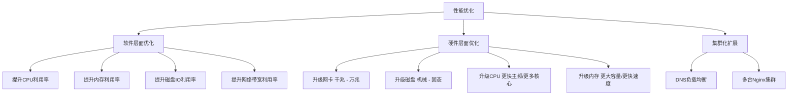

#### 5.1.2 软件优化方向

**1. 提升CPU利用率**

- 避免惊群问题(accept_mutex, reuseport)
- 使用gzip_static模块预压缩,避免实时压缩消耗CPU
- 减少进程上下文切换
- 提高进程优先级(worker_priority)

**2. 提升内存利用率**

- 合理配置缓冲区大小,避免浪费
- 绑定CPU(worker_cpu_affinity),提高CPU缓存命中率
- 考虑NUMA架构的内存访问特性

**3. 提升磁盘IO利用率**

- 使用empty_gif模块,避免磁盘访问
- 使用内存盘或SSD
- 启用AIO异步IO
- 使用线程池处理阻塞IO

**4. 提升网络带宽利用率**

- 增大TCP初始拥塞窗口
- 启用HTTP/2
- 启用Gzip压缩
- 优化TCP参数

#### 5.1.3 硬件升级优先级

1. **网卡** - 千兆 → 万兆(效果最明显)
2. **磁盘** - 机械硬盘 → 固态硬盘(提升IOPS)
3. **CPU** - 更高主频、更多核心、更大缓存
4. **内存** - 更大容量、更快访问速度

### 5.2 CPU性能优化

#### 5.2.1 高效使用CPU的三个关键

**1. 使用全部CPU资源**

```nginx
# Worker进程数量应等于CPU核心数
worker_processes auto;  # 自动检测CPU核心数
# 或手动指定
worker_processes 8;
```

**原则:**

- `worker_processes >= CPU核心数` - 使用全部CPU
- `worker_processes = CPU核心数` - 最佳配置(避免进程间竞争)
- `worker_processes > CPU核心数` - 会导致进程间竞争,降低性能

**2. 避免Worker进程做无用功**

- 不要主动让出CPU
- 避免Worker进程间资源争抢
- 避免调用阻塞API(特别是OpenResty中的第三方库)

**3. 减少与其他进程的资源竞争**

```nginx
# 提升Worker进程优先级
worker_priority -20;  # 范围: -20(最高) 到 19(最低)
```

- 移除耗资源的非Nginx进程
- 提高Worker进程优先级,占用更长时间片

#### 5.2.2 进程调度与上下文切换

**进程状态:**

| 状态        | 说明             | 查看命令   |
| ----------- | ---------------- | ---------- |
| R (Running) | 正在运行或就绪   | `ps aux` |
| S (Sleep)   | 可中断睡眠(阻塞) | `ps aux` |
| D           | 不可中断睡眠     | `ps aux` |
| Z           | 僵尸进程         | `ps aux` |
| T           | 停止             | `ps aux` |

**查看上下文切换:**

```bash
# 查看系统级上下文切换
vmstat 1
# 输出: cs列表示每秒上下文切换次数

# 查看系统级上下文切换(dstat)
dstat
# 输出: csw列

# 查看进程级上下文切换
pidstat -w -p <pid> 1
# voluntary context switches (主动切换)
# non voluntary context switches (被动切换)
```

**减少上下文切换的方法:**

1. 保持Worker进程处于R状态
2. 减少主动切换(避免阻塞API)
3. 减少被动切换(提高进程优先级)
4. 绑定CPU(减少进程迁移)
5. 延迟处理新连接(`tcp_defer_accept`)

#### 5.2.3 进程优先级与时间片

**静态优先级(Nice值):**

```nginx
# Nginx配置
worker_priority -20;  # 范围: -20(最高) 到 19(最低)
```

- Nice值越小,优先级越高
- Nice值越小,时间片越长
- 默认为0

**动态优先级(PR值):**

Linux内核会根据进程行为动态调整优先级:

- **2.6.23之前(O(1)调度算法):**

  - 动态优先级 = 静态优先级 ± 5
  - 时间片: 5ms ~ 800ms
- **2.6.23之后(CFS调度算法):**

  - PR = Nice + 20
  - 完全公平调度

**查看进程优先级:**

```bash
ps -eo pid,ni,pri,comm | grep nginx
# ni: Nice值
# pri: 优先级(PR值)
```

### 5.3 多核负载均衡

#### 5.3.1 惊群问题与解决方案

**惊群问题:**

多个Worker进程同时监听同一端口,新连接到来时,所有进程都被唤醒,但只有一个进程能处理,其他进程白白浪费CPU。

**解决方案对比:**

| 方案             | 配置           | 性能 | 说明                |
| ---------------- | -------------- | ---- | ------------------- |
| accept_mutex on  | 应用层加锁     | 低   | 旧版本默认,现已弃用 |
| accept_mutex off | 无锁           | 中   | 现版本默认          |
| reuseport        | 内核层负载均衡 | 高   | Linux 3.9+,推荐     |

**reuseport配置:**

```nginx
http {
    server {
        listen 80 reuseport;  # 启用SO_REUSEPORT
  
        location / {
            proxy_pass http://backend;
        }
    }
}
```

**性能对比:**

- **吞吐量:** reuseport > accept_mutex off > accept_mutex on
- **延迟:** reuseport < accept_mutex off < accept_mutex on
- **延迟标准差:** reuseport < accept_mutex off < accept_mutex on

**要求:**

- Linux内核 3.9+
- CentOS 7+, Ubuntu 14.04+

#### 5.3.2 多队列网卡

**RSS (Receive Side Scaling)**

- 硬件层面,将网络数据包分发到多个CPU队列
- 需要网卡支持
- 提升硬中断处理性能

**RPS (Receive Packet Steering)**

- 软件层面,在软中断阶段分发数据包
- 不需要硬件支持
- 适用于不支持RSS的网卡

**RFS (Receive Flow Steering)**

- 基于RPS,考虑CPU亲和性
- 将同一流的数据包分发到同一CPU
- 提高缓存命中率

**注意:** 这些特性需要根据具体场景测试,不一定都能提升性能。

#### 5.3.3 CPU缓存与绑定

**CPU缓存层级:**

| 缓存     | 大小  | 访问延迟   | 说明     |
| -------- | ----- | ---------- | -------- |
| 寄存器   | -     | ~1 cycle   | CPU内部  |
| L1 Cache | 32KB  | ~4 cycles  | 每核独立 |
| L2 Cache | 256KB | ~12 cycles | 每核独立 |
| L3 Cache | 20MB  | ~40 cycles | 多核共享 |
| 内存     | GB级  | ~60ns      | 系统内存 |

**查看CPU缓存:**

```bash
# 查看L1缓存
lscpu | grep "L1"
# L1d cache: 32K (数据缓存)
# L1i cache: 32K (指令缓存)

# 查看L2缓存
lscpu | grep "L2"
# L2 cache: 256K

# 查看L3缓存
lscpu | grep "L3"
# L3 cache: 20480K
```

**绑定CPU:**

```nginx
# 自动绑定(推荐)
worker_cpu_affinity auto;

# 手动绑定(8核CPU)
worker_processes 8;
worker_cpu_affinity 00000001 00000010 00000100 00001000 00010000 00100000 01000000 10000000;

# 手动绑定(4核CPU,每个Worker绑定2个核)
worker_processes 4;
worker_cpu_affinity 0101 1010 0101 1010;
```

**优点:**

- 提高CPU缓存命中率
- 减少进程迁移开销
- 降低上下文切换成本

#### 5.3.4 NUMA架构

**NUMA (Non-Uniform Memory Access):**

```
[CPU 0-15] ←→ [Memory Node 0: 64GB]
     ↓
  跨节点访问(慢)
     ↓
[CPU 16-31] ←→ [Memory Node 1: 64GB]
```

**特点:**

- 访问本地内存快(近)
- 访问远程内存慢(远,3-4倍延迟)
- 解决多核CPU内存总线瓶颈

**查看NUMA信息:**

```bash
# 查看NUMA节点
numactl --hardware

# 查看NUMA统计
numastat

# 查看进程NUMA使用情况
numastat -p <pid>
```

**优化方案:**

1. **BIOS禁用NUMA** - 获得平均性能
2. **本地访问优先** - 允许访问远程,但优先本地
3. **仅本地访问** - 禁止访问远程节点
4. **绑定Worker到NUMA节点** - 配合worker_cpu_affinity

### 5.4 TCP连接优化

#### 5.4.1 TCP三次握手流程

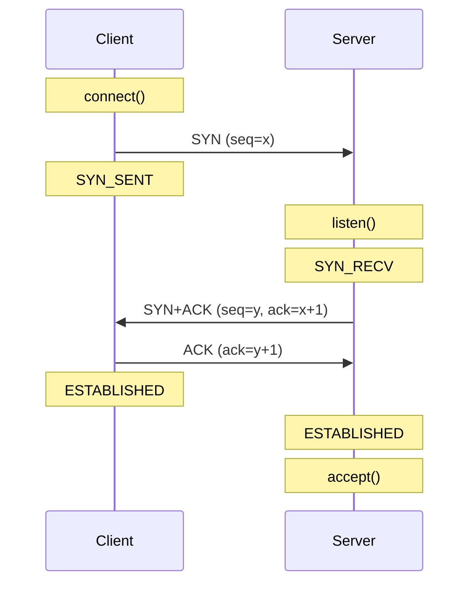

**状态说明:**

| 状态        | 端     | 说明                        |
| ----------- | ------ | --------------------------- |
| LISTEN      | Server | 监听端口,等待连接           |
| SYN_SENT    | Client | 发送SYN,等待SYN+ACK         |
| SYN_RECV    | Server | 收到SYN,发送SYN+ACK,等待ACK |
| ESTABLISHED | Both   | 连接建立完成                |

**查看连接状态:**

```bash
# 查看所有TCP连接状态
netstat -antp

# 统计各状态连接数
netstat -antp | awk '{print $6}' | sort | uniq -c
```

#### 5.4.2 三次握手相关参数

**Client端参数:**

```bash
# SYN重传次数
net.ipv4.tcp_syn_retries = 6  # 默认6次

# 本地端口范围
net.ipv4.ip_local_port_range = 32768 60999
# 限制了对单个上游服务器的最大并发连接数
```

**Nginx配置:**

```nginx
http {
    # 连接超时(应用层)
    proxy_connect_timeout 60s;
}

stream {
    # 连接超时(四层)
    proxy_connect_timeout 60s;
}
```

**Server端参数:**

```bash
# 半连接队列最大长度
net.ipv4.tcp_max_syn_backlog = 8192

# SYN+ACK重传次数
net.ipv4.tcp_synack_retries = 5  # 默认5次

# 全连接队列最大长度
net.core.somaxconn = 128  # 系统级
```

**Nginx配置:**

```nginx
http {
    server {
        listen 80 backlog=511;  # 全连接队列长度,默认511
    }
}
```

#### 5.4.3 SYN Flood攻击防御

**SYN Flood攻击:**

攻击者伪造大量SYN包,占满半连接队列,导致正常用户无法建立连接。

**防御措施:**

**1. 增大队列长度**

```bash
# 增大网卡接收队列
net.core.netdev_max_backlog = 5000

# 增大半连接队列
net.ipv4.tcp_max_syn_backlog = 8192

# 超出队列时直接丢弃
net.ipv4.tcp_abort_on_overflow = 0  # 0=丢弃,1=发送RST
```

**2. 启用SYN Cookies**

```bash
# 启用SYN Cookies
net.ipv4.tcp_syncookies = 1
```

**SYN Cookies工作原理:**

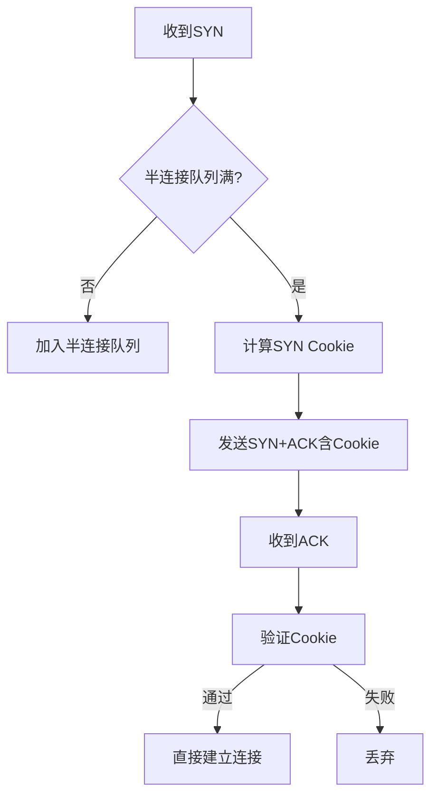

**注意:**

- SYN Cookies会占用TCP序列号空间
- 导致TCP扩展功能失效(窗口扩展、时间戳等)
- 仅在队列满时启用

#### 5.4.4 文件句柄限制

**三个层级的限制:**

**1. 系统级**

```bash
# 查看系统最大文件句柄数
cat /proc/sys/fs/file-max

# 查看当前使用情况
cat /proc/sys/fs/file-nr
# 输出: 已分配  已使用  最大值

# 设置系统最大值
echo "fs.file-max = 1000000" >> /etc/sysctl.conf
sysctl -p
```

**2. 用户级**

```bash
# 查看当前用户限制
ulimit -n

# 临时修改
ulimit -n 65535

# 永久修改
vi /etc/security/limits.conf
# 添加:
*  soft  nofile  65535
*  hard  nofile  65535
```

**3. 进程级**

```nginx
# Nginx配置
worker_rlimit_nofile 65535;
```

**关系:**

- 进程级 ≤ 用户级 ≤ 系统级
- `worker_connections` 也会受文件句柄限制
- 每个连接消耗2个文件句柄(客户端+上游)

#### 5.4.5 TCP Fast Open

**TFO (TCP Fast Open):**

在SYN包中携带数据,减少一个RTT。

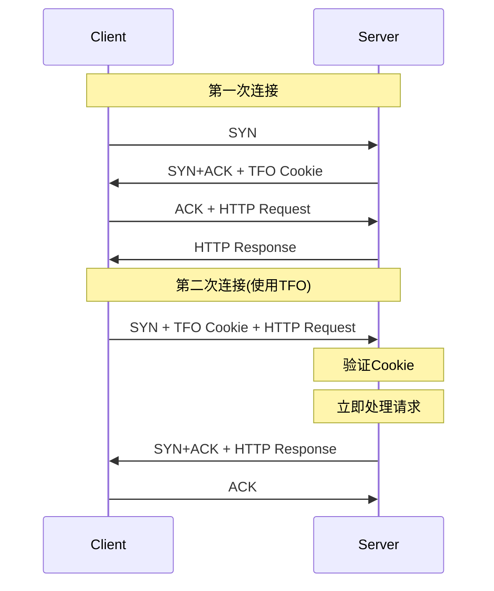

**Linux配置:**

```bash
# 启用TFO
net.ipv4.tcp_fastopen = 3
# 0: 禁用
# 1: 作为客户端
# 2: 作为服务器
# 3: 客户端+服务器
```

**Nginx配置:**

```nginx
http {
    server {
        # 服务器端TFO
        listen 80 fastopen=256;  # 队列长度
    }
  
    upstream backend {
        server 192.168.1.10:8080;
    }
  
    location / {
        # 客户端TFO(连接上游)
        proxy_pass http://backend;
        proxy_socket_keepalive on;
    }
}
```

**优点:**

- 减少1个RTT延迟
- 提升连接建立速度
- 适用于短连接场景

**注意:**

- 需要Linux 3.7+
- 需要防范TFO SYN Flood攻击
- 通过fastopen参数限制队列长度

### 5.5 TCP传输优化

#### 5.5.1 滑动窗口

**滑动窗口作用:**

- 流量控制
- 拥塞控制
- 可靠传输
- 处理乱序报文

**发送窗口示例:**

```
发送缓冲区: [已发送已确认|已发送未确认|可发送|不可发送]
             ←----------发送窗口----------→
```

**接收窗口示例:**

```
接收缓冲区: [已接收已读取|已接收未读取|可接收|不可接收]
             ←----------接收窗口----------→
```

**窗口大小通告:**

每个TCP报文都会在头部的Window字段通告自己的接收窗口大小。

#### 5.5.2 TCP缓冲区配置

**读缓冲区(接收):**

```bash
# TCP接收缓冲区
net.ipv4.tcp_rmem = 4096 87380 6291456
# 格式: 最小值 默认值 最大值(字节)

# 覆盖全局设置
net.core.rmem_max = 6291456
```

**写缓冲区(发送):**

```bash
# TCP发送缓冲区
net.ipv4.tcp_wmem = 4096 16384 4194304
# 格式: 最小值 默认值 最大值(字节)

# 覆盖全局设置
net.core.wmem_max = 4194304
```

**自动调整:**

```bash
# 启用自动调整
net.ipv4.tcp_moderate_rcvbuf = 1

# 内存压力阈值
net.ipv4.tcp_mem = 88560 118080 177120
# 格式: 无压力 启动压力 最大值(页,4KB)
```

**Nginx配置:**

```nginx
http {
    server {
        listen 80 rcvbuf=8k sndbuf=8k;  # 设置后无法自动调整
    }
}
```

**缓冲区划分:**

```bash
# 应用缓存与滑动窗口比例
net.ipv4.tcp_adv_win_scale = 1
# 1: 应用缓存 = 总缓冲区 / 2
# 2: 应用缓存 = 总缓冲区 / 4
```

#### 5.5.3 带宽时延积(BDP)

**BDP计算:**

```
BDP = 带宽 × RTT

例如:
带宽 = 100 Mbps = 12.5 MB/s
RTT = 20ms = 0.02s
BDP = 12.5 MB/s × 0.02s = 250 KB
```

**接收窗口应设置为BDP大小,以充分利用带宽。**

**吞吐量计算:**

```
吞吐量 = 窗口大小 / RTT

例如:
窗口 = 64 KB
RTT = 20ms
吞吐量 = 64 KB / 0.02s = 3.2 MB/s = 25.6 Mbps
```

#### 5.5.4 Nagle算法

**Nagle算法目的:**

合并小数据包,减少网络中的小报文数量,提高带宽利用率。

**工作原理:**

```
发送数据:
1. 如果有未确认的数据,缓存新数据
2. 直到收到ACK或缓存达到MSS,才发送

结果:
- 减少小报文数量
- 增加延迟
```

**Nginx配置:**

```nginx
http {
    # 禁用Nagle算法(降低延迟)
    tcp_nodelay on;  # 默认on,仅对keepalive连接生效
  
    # 延迟发送(提高吞吐量)
    postpone_output 1460;  # 默认1460字节
}

stream {
    # 禁用Nagle算法
    tcp_nodelay on;  # 默认on,对所有连接生效
}
```

**选择:**

- **低延迟场景** - `tcp_nodelay on`(禁用Nagle)
- **高吞吐量场景** - `tcp_nodelay off`(启用Nagle)

#### 5.5.5 Cork算法

**Cork算法:**

比Nagle更激进,完全禁止小报文。

```nginx
http {
    # 启用Cork算法(需要配合sendfile)
    tcp_nopush on;  # 默认off
    sendfile on;
}
```

**工作原理:**

- 等待数据填满MSS才发送
- 或等待连接关闭才发送
- 仅在启用sendfile时生效

**注意:** Cork和Nagle可以同时启用,Cork优先级更高。

#### 5.5.6 超时配置

**Nginx超时指令:**

```nginx
http {
    # 客户端Body接收超时(两次读操作间)
    client_body_timeout 60s;
  
    # 发送响应超时(两次写操作间)
    send_timeout 60s;
  
    # 上游连接超时
    proxy_connect_timeout 60s;
    proxy_send_timeout 60s;
    proxy_read_timeout 60s;
}
```

**重传参数:**

```bash
# 重传次数
net.ipv4.tcp_retries1 = 3  # 达到后更新路由缓存
net.ipv4.tcp_retries2 = 15  # 达到后关闭连接
```

### 5.6 磁盘IO优化

#### 5.6.1 磁盘介质选择

| 特性                   | 机械硬盘(HDD)  | 固态硬盘(SSD)      |
| ---------------------- | -------------- | ------------------ |
| **价格**         | 低             | 高                 |
| **容量**         | 大(TB级)       | 小(GB级)           |
| **BPS(吞吐量)**  | 中等           | 高                 |
| **IOPS(随机IO)** | 低(100-200)    | 高(10K-100K+)      |
| **适用场景**     | 顺序读写(日志) | 随机读写(静态资源) |
| **寿命**         | 长             | 短(写次数限制)     |

**性能测试:**

```bash
# 使用fio测试磁盘性能
fio --name=test --filename=/tmp/testfile --size=1G \
    --rw=randread --bs=4k --direct=1 --numjobs=4 \
    --runtime=60 --group_reporting
```

#### 5.6.2 减少磁盘IO的方法

**1. 优化读取**

- 使用sendfile零拷贝
- 使用内存盘(tmpfs)
- 使用SSD固态硬盘
- 启用open_file_cache

**2. 减少写入**

```nginx
http {
    # 提升日志级别,减少日志量
    error_log /var/log/nginx/error.log warn;
  
    # 关闭访问日志
    access_log off;
  
    # 压缩访问日志
    access_log /var/log/nginx/access.log combined gzip;
  
    # 关闭proxy缓冲
    proxy_buffering off;
  
    # 使用syslog(UDP,无磁盘IO)
    access_log syslog:server=192.168.1.100:514 combined;
}
```

**3. 使用线程池**

```nginx
# 编译时启用
./configure --with-threads

# 配置线程池
thread_pool default threads=32 max_queue=65536;

http {
    # 启用AIO和线程池
    aio threads=default;
}
```

#### 5.6.3 Direct IO(直接IO)

**传统IO流程:**

```
用户空间 ←→ 内核缓冲区(Page Cache) ←→ 磁盘
         拷贝1           拷贝2
```

**Direct IO流程:**

```
用户空间 ←→ 磁盘
         拷贝1
```

**Nginx配置:**

```nginx
http {
    location / {
        # 大于10MB的文件使用Direct IO
        directio 10m;
  
        # 对齐方式(一般不需要修改)
        directio_alignment 512;
  
        root /data/files;
    }
}
```

**适用场景:**

- 大文件(几GB)
- 文件不太可能被缓存
- 避免污染Page Cache

**注意:**

- 启用directio会自动禁用sendfile
- 小文件不建议使用(失去缓存优势)

#### 5.6.4 异步IO(AIO)

**传统阻塞IO:**

```
用户进程 → read() → 阻塞等待 → 磁盘读取 → 返回数据 → 继续执行
```

**异步IO:**

```
用户进程 → aio_read() → 继续执行其他任务
                      ↓
              磁盘读取完成 → 回调处理
```

**Nginx配置:**

```nginx
http {
    # 启用AIO
    aio on;  # 默认off
  
    # 对写操作也使用AIO(仅特定场景)
    aio_write on;  # 默认off
  
    # 配合线程池使用
    aio threads=default;
  
    location / {
        root /data/files;
    }
}
```

**aio_write使用场景:**

仅在以下情况启用:

- 接收上游响应
- 启用proxy_buffering
- 写入临时文件

**注意:**

- 需要Linux内核支持(2.6.22+)
- 对写操作通常无需AIO(Page Cache已足够快)

#### 5.6.5 线程池

**线程池架构:**

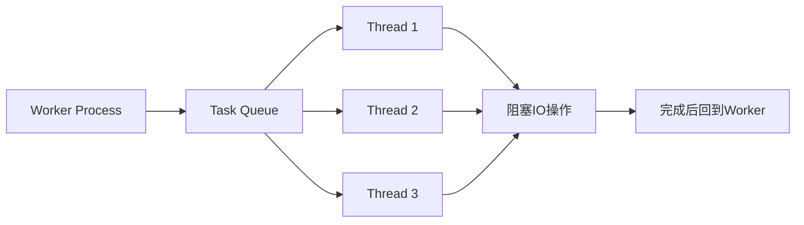

**配置:**

```nginx
# 定义线程池
thread_pool pool1 threads=32 max_queue=65536;
thread_pool pool2 threads=16 max_queue=32768;

http {
    # 使用线程池
    aio threads=pool1;
  
    location /files {
        aio threads=pool2;
        root /data;
    }
}
```

**参数说明:**

| 参数          | 说明             | 默认值 |
| ------------- | ---------------- | ------ |
| `threads`   | 线程数量         | 32     |
| `max_queue` | 任务队列最大长度 | 65536  |

**适用场景:**

- 大量小文件静态资源服务
- 文件缓存(inode cache)失效
- 避免阻塞Worker进程

**性能提升:**

- 官方测试显示最高9倍性能提升
- 具体效果取决于文件数量和缓存命中率

**编译要求:**

```bash
./configure --with-threads
```

#### 5.6.6 AIO读取缓存

```nginx
http {
    # AIO读取缓存大小
    output_buffers 2 32k;  # 2个32KB缓冲区
}
```

### 5.7 零拷贝技术

#### 5.7.1 传统文件发送流程

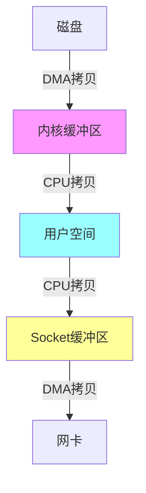

**步骤:**

1. read(): 磁盘 → 内核缓冲区 → 用户空间 (2次拷贝)
2. send(): 用户空间 → Socket缓冲区 → 网卡 (2次拷贝)

**总计:** 4次拷贝,2次系统调用

#### 5.7.2 sendfile零拷贝

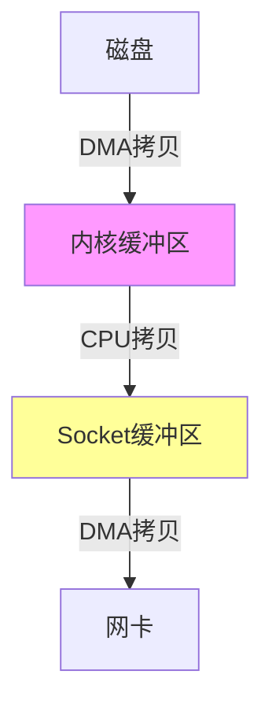

**步骤:**

1. sendfile(): 磁盘 → 内核缓冲区 → Socket缓冲区 → 网卡 (3次拷贝)

**总计:** 3次拷贝,1次系统调用

**Nginx配置:**

```nginx
http {
    # 启用sendfile
    sendfile on;  # 默认off
  
    # 配合tcp_nopush使用
    tcp_nopush on;
  
    location / {
        root /data/files;
    }
}
```

**注意:**

- 启用directio会自动禁用sendfile
- 两者不能同时使用

#### 5.7.3 gzip_static模块

**问题:** 启用gzip压缩会导致sendfile失效(需要在用户空间压缩)

**解决方案:** 预压缩文件

```bash
# 预压缩文件
cd /data/files
gzip -k -9 index.html  # 生成index.html.gz
```

**Nginx配置:**

```nginx
http {
    # 启用gzip_static
    gzip_static on;  # 默认off,需要编译时启用
    # gzip_static always;  # 不检查客户端是否支持gzip
  
    sendfile on;
  
    location / {
        root /data/files;
    }
}
```

**编译:**

```bash
./configure --with-http_gzip_static_module
```

**工作流程:**

1. 客户端请求 `/index.html`
2. Nginx检查 `/data/files/index.html.gz` 是否存在
3. 如果存在且客户端支持gzip,直接返回 `.gz`文件
4. 否则返回原文件

**gzip_static参数:**

| 值         | 说明                  |
| ---------- | --------------------- |
| `off`    | 禁用(默认)            |
| `on`     | 启用,检查客户端支持   |
| `always` | 启用,不检查客户端支持 |

#### 5.7.4 gunzip模块

**场景:** 客户端不支持gzip,但服务器只有压缩文件

```nginx
http {
    # 编译时启用
    # ./configure --with-http_gunzip_module
  
    gzip_static on;
    gunzip on;  # 实时解压
    gunzip_buffers 16 8k;
  
    location / {
        root /data/files;
    }
}
```

**工作流程:**

1. 客户端不支持gzip
2. 服务器只有 `.gz`文件
3. Nginx实时解压
4. 返回解压后的内容

### 5.8 内存优化

#### 5.8.1 TCMalloc

**TCMalloc (Thread-Caching Malloc):**

Google开发的高性能内存分配器,替代系统默认的malloc。

**优点:**

- 减少内存碎片
- 提升多线程性能
- 降低锁竞争

**安装:**

```bash
# CentOS
yum install gperftools-devel

# Ubuntu
apt-get install libgoogle-perftools-dev
```

**编译Nginx:**

```bash
./configure --with-google_perftools_module
make && make install
```

**配置:**

```nginx
# 主配置
google_perftools_profiles /tmp/tcmalloc;
```

**验证:**

```bash
lsof -p <nginx_pid> | grep tcmalloc
```

### 5.9 性能监控

#### 5.9.1 stub_status模块

```nginx
http {
    server {
        location /nginx_status {
            stub_status;
            allow 127.0.0.1;
            deny all;
        }
    }
}
```

**输出示例:**

```
Active connections: 291
server accepts handled requests
 16630948 16630948 31070465
Reading: 6 Writing: 179 Waiting: 106
```

**字段说明:**

| 字段               | 说明                   |
| ------------------ | ---------------------- |
| Active connections | 当前活跃连接数         |
| accepts            | 已接受的连接总数       |
| handled            | 已处理的连接总数       |
| requests           | 已处理的请求总数       |
| Reading            | 正在读取请求头的连接数 |
| Writing            | 正在发送响应的连接数   |
| Waiting            | 空闲keepalive连接数    |

**编译:**

```bash
./configure --with-http_stub_status_module
```

#### 5.9.2 Google PerfTools

**CPU性能分析:**

```nginx
# 启用CPU profiling
google_perftools_profiles /tmp/profile;
```

**生成火焰图:**

```bash
# 安装pprof
go get -u github.com/google/pprof

# 分析profile文件
pprof --pdf /path/to/nginx /tmp/profile > profile.pdf
```

---

**第五部分总结:**

系统层性能优化是Nginx达到极致性能的关键,本部分详细介绍了:

1. **CPU优化** - 进程数、优先级、绑定、NUMA
2. **多核负载均衡** - reuseport、多队列网卡、CPU缓存
3. **TCP连接优化** - 三次握手、SYN Flood防御、文件句柄、TFO
4. **TCP传输优化** - 滑动窗口、缓冲区、BDP、Nagle/Cork算法
5. **磁盘IO优化** - Direct IO、AIO、线程池
6. **零拷贝** - sendfile、gzip_static、gunzip
7. **内存优化** - TCMalloc
8. **性能监控** - stub_status、PerfTools

通过本部分的学习,你应该能够:

- 理解Linux内核与Nginx的交互
- 配置TCP/IP协议栈参数
- 优化磁盘IO性能
- 使用零拷贝技术
- 监控Nginx性能指标
- 针对具体场景进行性能调优

这些优化措施需要根据实际场景选择性使用,过度优化可能适得其反。建议:

1. 先进行性能测试,找出瓶颈
2. 针对瓶颈进行优化
3. 优化后再次测试,验证效果
4. 逐步迭代,持续改进

---

**待续:第六部分 - 从源码视角深入使用Nginx**

## 第六部分：从源码视角深入使用Nginx

### 6.1 第三方模块源码阅读

#### 6.1.1 第三方模块的基本结构

每个Nginx第三方模块都必须包含以下核心文件:

```
module_name/
├── config          # 必需,定义模块编译配置
├── ngx_module.c    # 核心源码文件
└── ...             # 其他源码文件
```

#### 6.1.2 源码阅读方法

**1. 分析config文件**

`config`文件是configure脚本执行时必须读取的文件,主要完成三件事:

```bash
# 1. 定义模块名称
ngx_addon_name=ngx_http_mymodule

# 2. 将HTTP模块添加到模块数组
HTTP_MODULES="$HTTP_MODULES ngx_http_mymodule"

# 3. 添加源码文件到编译列表
NGX_ADDON_SRCS="$NGX_ADDON_SRCS $ngx_addon_dir/ngx_http_mymodule.c"
```

**2. 分析ngx_module_t结构体**

```c
ngx_module_t ngx_http_mymodule = {
    NGX_MODULE_V1,
    &ngx_http_mymodule_ctx,      /* module context */
    ngx_http_mymodule_commands,  /* module directives */
    NGX_HTTP_MODULE,             /* module type */
    NULL,                        /* init master */
    NULL,                        /* init module */
    NULL,                        /* init process */
    NULL,                        /* init thread */
    NULL,                        /* exit thread */
    NULL,                        /* exit process */
    NULL,                        /* exit master */
    NGX_MODULE_V1_PADDING
};
```

**生命周期回调:**

| 回调方法         | 调用时机         | 进程   |
| ---------------- | ---------------- | ------ |
| `init_module`  | 解析完配置文件后 | Master |
| `init_process` | Worker进程启动时 | Worker |
| `exit_process` | Worker进程退出时 | Worker |
| `exit_master`  | Master进程退出时 | Master |

**注意:** `init_master`, `init_thread`, `exit_thread`目前未被使用。

**3. 分析ngx_command_t指令数组**

```c
static ngx_command_t ngx_http_mymodule_commands[] = {
    {
        ngx_string("mymodule_directive"),
        NGX_HTTP_MAIN_CONF|NGX_HTTP_SRV_CONF|NGX_HTTP_LOC_CONF|NGX_CONF_TAKE1,
        ngx_http_mymodule_set,
        NGX_HTTP_LOC_CONF_OFFSET,
        offsetof(ngx_http_mymodule_loc_conf_t, value),
        NULL
    },
    ngx_null_command
};
```

**4. 分析ngx_http_module_t结构体**

```c
static ngx_http_module_t ngx_http_mymodule_ctx = {
    NULL,                                  /* preconfiguration */
    ngx_http_mymodule_init,                /* postconfiguration */
  
    NULL,                                  /* create main configuration */
    NULL,                                  /* init main configuration */
  
    NULL,                                  /* create server configuration */
    NULL,                                  /* merge server configuration */
  
    ngx_http_mymodule_create_loc_conf,     /* create location configuration */
    ngx_http_mymodule_merge_loc_conf       /* merge location configuration */
};
```

**5. 确定模块生效方式**

模块生效方式有四种:

1. **在HTTP的11个阶段生效** - 通过postconfiguration注册handler
2. **提供新变量** - 通过preconfiguration注册变量
3. **作为过滤模块** - 注册header/body filter
4. **作为反向代理** - 设置content handler

#### 6.1.3 configure脚本工作流程

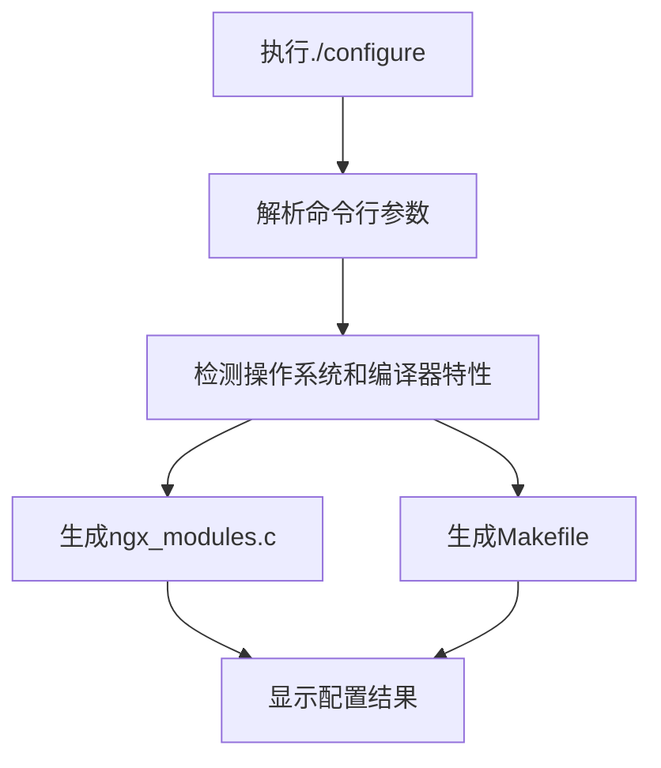

**configure主要工作:**

1. **解析参数** - 处理 `--add-module`, `--with-*`等选项
2. **检测特性** - 根据OS和架构选择特性(如AIO)
3. **生成文件** - 生成 `ngx_modules.c`和 `Makefile`
4. **显示结果** - 输出配置摘要和路径信息

**配置结果示例:**

```
Configuration summary
  + using system PCRE library
  + using system OpenSSL library
  + using system zlib library

  nginx path prefix: "/usr/local/nginx"
  nginx binary file: "/usr/local/nginx/sbin/nginx"
  nginx modules path: "/usr/local/nginx/modules"
  nginx configuration prefix: "/usr/local/nginx/conf"
  nginx configuration file: "/usr/local/nginx/conf/nginx.conf"
  nginx pid file: "/usr/local/nginx/logs/nginx.pid"
  nginx error log file: "/usr/local/nginx/logs/error.log"
  nginx http access log file: "/usr/local/nginx/logs/access.log"
```

### 6.2 Nginx启动流程

#### 6.2.1 进程启动回调时机

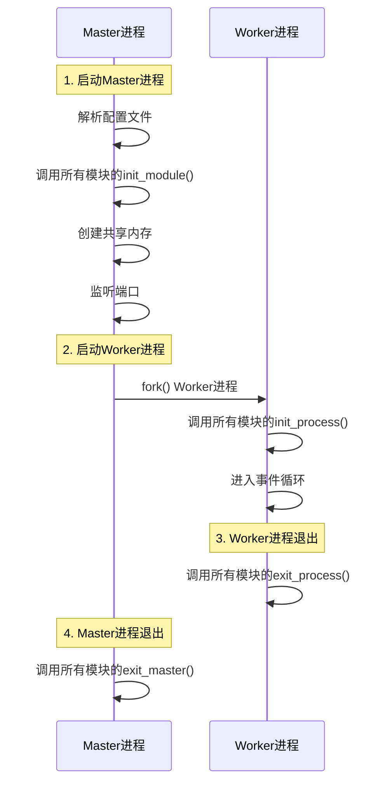

#### 6.2.2 ngx_cycle_t核心结构体

`ngx_cycle_t`是Nginx最核心的数据结构,贯穿整个生命周期:

```c
struct ngx_cycle_s {
    ngx_array_t          modules;         /* 所有模块数组 */
    ngx_array_t          listening;       /* 监听端口数组 */
    ngx_array_t          open_files;      /* 打开的文件 */
    ngx_list_t           shared_memory;   /* 共享内存列表 */
    ngx_queue_t          free_connections;/* 空闲连接池 */
    ngx_log_t           *log;             /* 日志对象 */
    ngx_connection_t    *connections;     /* 连接池 */
    // ... 更多字段
};
```

**用途:**

- 调试时查看模块信息
- 查看监听端口和处理函数
- 查看连接池使用情况
- 查看共享内存分配情况
- 查看打开的文件列表

#### 6.2.3 Nginx启动详细流程

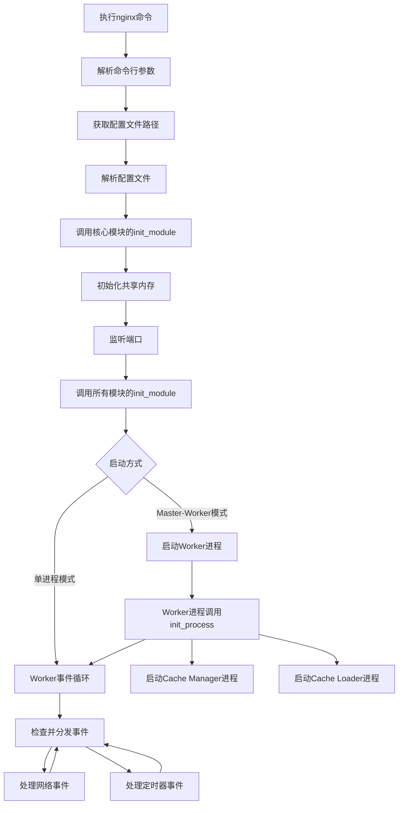

**关键步骤说明:**

1. **解析配置文件(Master进程)** - 所有HTTP模块的配置都在此时解析
2. **监听端口** - Master和Worker进程都会监听(继承)
3. **init_module回调** - 在Master进程中调用
4. **init_process回调** - 在Worker进程中调用(OpenResty的 `init_worker_by_lua`在此执行)
5. **Cache Loader** - 加载磁盘缓存到内存
6. **Cache Manager** - 定期淘汰过期缓存

### 6.3 HTTP模块初始化

#### 6.3.1 HTTP模块的8个回调方法

```c
typedef struct {
    ngx_int_t   (*preconfiguration)(ngx_conf_t *cf);
    ngx_int_t   (*postconfiguration)(ngx_conf_t *cf);
  
    void       *(*create_main_conf)(ngx_conf_t *cf);
    char       *(*init_main_conf)(ngx_conf_t *cf, void *conf);
  
    void       *(*create_srv_conf)(ngx_conf_t *cf);
    char       *(*merge_srv_conf)(ngx_conf_t *cf, void *prev, void *conf);
  
    void       *(*create_loc_conf)(ngx_conf_t *cf);
    char       *(*merge_loc_conf)(ngx_conf_t *cf, void *prev, void *conf);
} ngx_http_module_t;
```

#### 6.3.2 HTTP模块初始化流程

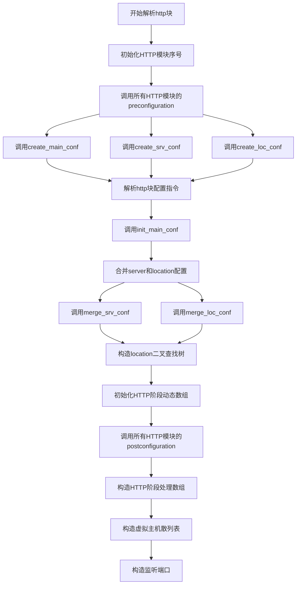

#### 6.3.3 在HTTP阶段注册Handler

**方法一: 在postconfiguration中注册**

```c
static ngx_int_t
ngx_http_mymodule_init(ngx_conf_t *cf)
{
    ngx_http_handler_pt        *h;
    ngx_http_core_main_conf_t  *cmcf;
  
    cmcf = ngx_http_conf_get_module_main_conf(cf, ngx_http_core_module);
  
    /* 在ACCESS阶段注册handler */
    h = ngx_array_push(&cmcf->phases[NGX_HTTP_ACCESS_PHASE].handlers);
    if (h == NULL) {
        return NGX_ERROR;
    }
  
    *h = ngx_http_mymodule_handler;
  
    return NGX_OK;
}
```

**方法二: 反向代理模块(排他性)**

```c
static char *
ngx_http_mymodule_pass(ngx_conf_t *cf, ngx_command_t *cmd, void *conf)
{
    ngx_http_core_loc_conf_t  *clcf;
  
    clcf = ngx_http_conf_get_module_loc_conf(cf, ngx_http_core_module);
    clcf->handler = ngx_http_mymodule_handler;  /* 直接设置handler */
  
    return NGX_CONF_OK;
}
```

#### 6.3.4 注册过滤模块

**过滤模块链表结构:**

```
ngx_http_top_header_filter → filter1 → filter2 → ... → ngx_http_header_filter
ngx_http_top_body_filter   → filter1 → filter2 → ... → ngx_http_write_filter
```

**注册方法:**

```c
static ngx_http_output_header_filter_pt  ngx_http_next_header_filter;
static ngx_http_output_body_filter_pt    ngx_http_next_body_filter;

static ngx_int_t
ngx_http_myfilter_init(ngx_conf_t *cf)
{
    /* 插入到header filter链表头部 */
    ngx_http_next_header_filter = ngx_http_top_header_filter;
    ngx_http_top_header_filter = ngx_http_myfilter_header_filter;
  
    /* 插入到body filter链表头部 */
    ngx_http_next_body_filter = ngx_http_top_body_filter;
    ngx_http_top_body_filter = ngx_http_myfilter_body_filter;
  
    return NGX_OK;
}

/* Header过滤函数 */
static ngx_int_t
ngx_http_myfilter_header_filter(ngx_http_request_t *r)
{
    /* 处理响应头 */
    // ...
  
    /* 调用下一个filter */
    return ngx_http_next_header_filter(r);
}

/* Body过滤函数 */
static ngx_int_t
ngx_http_myfilter_body_filter(ngx_http_request_t *r, ngx_chain_t *in)
{
    /* 处理响应体 */
    // ...
  
    /* 调用下一个filter */
    return ngx_http_next_body_filter(r, in);
}
```

**注意:**

- 每个过滤模块都有自己的 `static`局部变量 `next_*_filter`
- 通过这种方式构成单链表
- 过滤模块的执行顺序与编译顺序相反(后编译的先执行)

### 6.4 Rewrite模块与if指令

#### 6.4.1 Rewrite脚本指令

Rewrite模块提供5个脚本式指令,都在REWRITE阶段执行:

| 指令        | 功能            |
| ----------- | --------------- |
| `set`     | 设置变量        |
| `if`      | 条件判断        |
| `break`   | 中断rewrite脚本 |
| `rewrite` | URL重写         |
| `return`  | 返回响应        |

#### 6.4.2 Rewrite脚本执行原理

**类似协程的执行方式:**

```c
/* Rewrite脚本指令数组 */
ngx_http_rewrite_loc_conf_t {
    ngx_array_t  *codes;  /* 指令数组 */
};

/* 执行上下文 */
ngx_http_script_engine_t {
    u_char     *ip;    /* 指令指针(类似CPU的IP寄存器) */
    u_char     *sp;    /* 数据栈指针 */
    ngx_http_request_t  *request;  /* 当前请求 */
    // ...
};
```

**执行流程:**

1. 将所有rewrite指令编译成指令数组
2. 每个请求维护自己的执行上下文
3. `ip`指针指向下一条待执行的指令
4. 顺序执行指令,直到遇到 `break`或执行完毕

#### 6.4.3 if指令的"邪恶"之处

**问题示例1: 连续if导致配置丢失**

```nginx
location / {
    set $a 1;
  
    if ($a) {
        add_header X-First 1;  # 添加头部1
    }
  
    if ($a) {
        add_header X-Second 2;  # 添加头部2
    }
  
    return 204;
}
```

**预期结果:** 响应包含 `X-First: 1`和 `X-Second: 2`两个头部

**实际结果:** 只包含 `X-Second: 2`,`X-First`丢失!

**原因分析:**

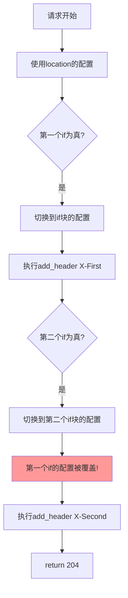

**核心问题:**

- 每个if块都有自己的配置(`loc_conf`)
- if块内的配置会替换当前请求的配置
- 连续的if块会相互覆盖
- 第一个if块的配置完全失效

**问题示例2: proxy_pass丢失**

```nginx
location / {
    if ($condition1) {
        proxy_pass http://backend1;
    }
  
    if ($condition2) {
        # 第二个if块没有proxy_pass
        set $var value;
    }
  
    # 如果condition2为真,proxy_pass配置丢失!
}
```

**结果:** 如果两个if都为真,会返回500错误或crash(旧版本)

#### 6.4.4 if指令的正确用法

**原则:**

1. **理解执行时机** - if在REWRITE阶段执行,但影响后续所有阶段
2. **避免连续if** - 多个if块会相互覆盖配置
3. **if块内配置完整** - if块内的配置必须能独立处理请求
4. **使用break中断** - 需要时使用break阻止后续if执行

**正确示例1: 使用break**

```nginx
location / {
    if ($condition1) {
        proxy_pass http://backend1;
        break;  # 阻止后续if执行
    }
  
    if ($condition2) {
        proxy_pass http://backend2;
        break;
    }
  
    proxy_pass http://backend_default;
}
```

**正确示例2: 嵌套if**

```nginx
location / {
    if ($condition1) {
        if ($condition2) {
            proxy_pass http://backend;
        }
    }
}
```

**正确示例3: 使用map替代**

```nginx
map $condition $backend {
    default  http://backend_default;
    "1"      http://backend1;
    "2"      http://backend2;
}

location / {
    proxy_pass $backend;
}
```

**为什么if性能好?**

if指令虽然有陷阱,但性能极高,因为:

- 编译成字节码,执行快速
- 避免了传统if语句的开销
- 适合高并发场景

### 6.5 Core Dump调试

#### 6.5.1 启用Core Dump

```nginx
# 设置core文件大小限制
worker_rlimit_core 500M;

# 设置core文件存放目录
working_directory /tmp/nginx_core;
```

**系统配置:**

```bash
# 查看core文件大小限制
ulimit -c

# 设置unlimited
ulimit -c unlimited

# 永久设置
echo "* soft core unlimited" >> /etc/security/limits.conf
```

#### 6.5.2 使用GDB分析Core Dump

**启动GDB:**

```bash
gdb /path/to/nginx /tmp/nginx_core/core.12345
```

**常用GDB命令:**

| 命令                    | 说明             | 示例                    |
| ----------------------- | ---------------- | ----------------------- |
| `bt`                  | 显示函数调用栈   | `bt`                  |
| `frame N`             | 切换到第N层栈帧  | `frame 1`             |
| `print var`           | 打印变量值       | `p cycle->log`        |
| `list`                | 显示当前代码     | `list`                |
| `x/addr`              | 查看内存地址     | `x/10x 0x12345`       |
| `info registers`      | 查看寄存器       | `i r`                 |
| `thread apply all bt` | 所有线程的调用栈 | `thread apply all bt` |

**分析ngx_cycle_t:**

```gdb
# 切换到ngx_process_events_and_timers栈帧
(gdb) frame 1

# 查看cycle变量
(gdb) p *cycle
$1 = {
  conf_ctx = 0x...,
  pool = 0x...,
  log = 0x...,
  modules = {...},
  ...
}

# 查看所有模块
(gdb) p cycle->modules[0]
$2 = (ngx_module_t *) 0x...

# 查看模块名称
(gdb) p cycle->modules[10]->name
$3 = "ngx_http_core_module"

# 查看模块指令
(gdb) p cycle->modules[10]->commands[3]
$4 = {
  name = {len = 8, data = "location"},
  ...
}

# 查看监听端口
(gdb) p *(ngx_listening_t *)((ngx_array_t *)&cycle->listening)->elts
$5 = {
  fd = 6,
  sockaddr = {...},
  ...
}

# 查看共享内存
(gdb) p *(ngx_shm_zone_t *)cycle->shared_memory.part.elts
$6 = {
  shm = {addr = 0x..., size = 10485760, name = "limit_conn_zone", ...},
  ...
}
```

#### 6.5.3 Debug Points

```nginx
# 遇到特定错误时生成core dump
debug_points abort;  # 生成core dump并退出
# debug_points stop;   # 直接退出,不生成core dump
```

**触发条件:**

仅在模块调用 `ngx_debug_point()`时生效,例如:

- SSI模块: "the same buf was used in ssi"
- Slab分配器: "ngx_slab_alloc() failed: no memory"

**用途:**

- 开发环境调试
- 定位疑难问题
- 生产环境不建议启用

### 6.6 Debug日志分析

#### 6.6.1 启用Debug日志

**编译时启用:**

```bash
./configure --with-debug
```

**配置debug_connection:**

```nginx
events {
    # 只对特定IP启用debug日志
    debug_connection 192.168.1.100;
    debug_connection 10.0.0.0/8;
}

http {
    error_log /var/log/nginx/error.log info;  # 默认级别
}
```

**作用:**

- 避免debug日志过多
- 只对开发/运维机器启用
- 生产环境可安全使用

#### 6.6.2 Debug日志的5个关键部分

**1. 建立连接与SSL握手**

```
2024/01/01 12:00:00 [debug] 12345#0: *1 accept: 192.168.1.100:54321 fd:3
2024/01/01 12:00:00 [debug] 12345#0: *1 event timer add: 3: 60000:1234567890
2024/01/01 12:00:00 [debug] 12345#0: *1 SSL_do_handshake: 1
2024/01/01 12:00:00 [debug] 12345#0: *1 SSL: TLSv1.2, cipher: "ECDHE-RSA-AES128-GCM-SHA256"
2024/01/01 12:00:00 [debug] 12345#0: *1 SSL reused session
```

**关键点:**

- 客户端IP和端口
- SSL协议版本和加密套件
- 是否复用SSL会话

**2. 接收HTTP请求头**

```
2024/01/01 12:00:00 [debug] 12345#0: *1 http process request line
2024/01/01 12:00:00 [debug] 12345#0: *1 http request line: "GET /index.html HTTP/1.1"
2024/01/01 12:00:00 [debug] 12345#0: *1 http uri: "/index.html"
2024/01/01 12:00:00 [debug] 12345#0: *1 http args: ""
2024/01/01 12:00:00 [debug] 12345#0: *1 http exten: "html"

2024/01/01 12:00:00 [debug] 12345#0: *1 http process request header line
2024/01/01 12:00:00 [debug] 12345#0: *1 http header: "Host: example.com"
2024/01/01 12:00:00 [debug] 12345#0: *1 http header: "User-Agent: curl/7.29.0"
2024/01/01 12:00:00 [debug] 12345#0: *1 http header: "Accept: */*"
```

**关键点:**

- 请求方法、URI、协议版本
- 所有请求头部
- URI参数解析

**3. HTTP处理阶段**

```
2024/01/01 12:00:00 [debug] 12345#0: *1 http process request
2024/01/01 12:00:00 [debug] 12345#0: *1 rewrite phase: 0
2024/01/01 12:00:00 [debug] 12345#0: *1 test location: "/"
2024/01/01 12:00:00 [debug] 12345#0: *1 test location: "/api"
2024/01/01 12:00:00 [debug] 12345#0: *1 using configuration "/"
2024/01/01 12:00:00 [debug] 12345#0: *1 http cl:-1 max:1048576
2024/01/01 12:00:00 [debug] 12345#0: *1 rewrite phase: 2
2024/01/01 12:00:00 [debug] 12345#0: *1 post rewrite phase: 3
2024/01/01 12:00:00 [debug] 12345#0: *1 generic phase: 4
2024/01/01 12:00:00 [debug] 12345#0: *1 generic phase: 5
2024/01/01 12:00:00 [debug] 12345#0: *1 access phase: 6
2024/01/01 12:00:00 [debug] 12345#0: *1 access phase: 7
2024/01/01 12:00:00 [debug] 12345#0: *1 post access phase: 8
2024/01/01 12:00:00 [debug] 12345#0: *1 try files phase: 9
2024/01/01 12:00:00 [debug] 12345#0: *1 content phase: 10
```

**关键点:**

- **using configuration** - 最终选中的location(非常重要!)
- 各个阶段的执行顺序
- 缓存是否命中

**4. 反向代理(发送上游请求)**

```
2024/01/01 12:00:00 [debug] 12345#0: *1 http proxy connect: 192.168.1.10:8080
2024/01/01 12:00:00 [debug] 12345#0: *1 http proxy header:
"GET /api/users HTTP/1.1
Host: backend.example.com
Connection: close
User-Agent: nginx
X-Real-IP: 192.168.1.100
X-Forwarded-For: 192.168.1.100
"
```

**关键点:**

- 发送给上游的完整请求头
- 可以快速定位配置错误

**5. 构造和发送响应**

```
2024/01/01 12:00:00 [debug] 12345#0: *1 http proxy status 200 "200 OK"
2024/01/01 12:00:00 [debug] 12345#0: *1 http proxy header: "Server: nginx"
2024/01/01 12:00:00 [debug] 12345#0: *1 http proxy header: "Content-Type: text/html"
2024/01/01 12:00:00 [debug] 12345#0: *1 http proxy header: "Content-Length: 1234"

2024/01/01 12:00:00 [debug] 12345#0: *1 http output filter "/index.html?"
2024/01/01 12:00:00 [debug] 12345#0: *1 http copy filter: "/index.html?"
2024/01/01 12:00:00 [debug] 12345#0: *1 http postpone filter "/index.html?"
2024/01/01 12:00:00 [debug] 12345#0: *1 http gzip filter
2024/01/01 12:00:00 [debug] 12345#0: *1 http chunked filter
2024/01/01 12:00:00 [debug] 12345#0: *1 http write filter: l:1 f:0 s:1234
2024/01/01 12:00:00 [debug] 12345#0: *1 http write filter limit 0
```

**关键点:**

- 上游响应的状态码和头部
- 过滤模块的执行顺序
- 响应体的发送过程

#### 6.6.3 Debug日志分析技巧

**1. 关注"using configuration"**

这行日志显示最终选中的location,是定位配置问题的关键:

```
2024/01/01 12:00:00 [debug] 12345#0: *1 using configuration "/api"
```

如果选中的location不符合预期,说明location匹配规则有问题。

**2. 检查上游请求**

查看"http proxy header"部分,确认发送给上游的请求是否正确:

```
http proxy header:
"GET /api/users HTTP/1.1
Host: backend.example.com
X-Custom-Header: value
"
```

**3. 跟踪过滤模块**

通过过滤模块的执行顺序,可以了解响应的处理流程:

```
http output filter → copy filter → postpone filter → gzip filter → chunked filter → write filter
```

**4. 查看缓存命中**

```
2024/01/01 12:00:00 [debug] 12345#0: *1 http file cache exists: /path/to/cache/file
```

如果看到这行,说明缓存命中,不会访问上游。

---

**第六部分总结:**

从源码视角深入使用Nginx是掌握Nginx的最高境界,本部分详细介绍了:

1. **第三方模块源码阅读** - config文件、ngx_module_t、ngx_command_t、ngx_http_module_t
2. **Nginx启动流程** - 进程启动回调、ngx_cycle_t结构体、Master-Worker模式
3. **HTTP模块初始化** - 8个回调方法、注册handler、注册过滤模块
4. **Rewrite模块与if指令** - 脚本执行原理、if指令的陷阱、正确用法
5. **Core Dump调试** - 启用core dump、GDB命令、分析ngx_cycle_t
6. **Debug日志分析** - 5个关键部分、分析技巧

通过本部分的学习,你应该能够:

- 阅读和理解第三方模块源码
- 理解Nginx的启动和初始化流程
- 开发自己的Nginx模块
- 正确使用if指令,避免常见陷阱
- 使用GDB调试Nginx问题
- 通过debug日志快速定位问题

这些技能对于深入理解Nginx、定位复杂问题、开发高性能模块都是必不可少的。

---

## 全书总结
### 学习路径回顾


恭喜你完成了Nginx学习笔记的全部内容!让我们回顾一下这六个部分:


### 核心知识点

1. **Nginx基础** - 安装、配置、命令行、基本使用
2. **架构设计** - Master-Worker、事件驱动、模块系统、内存管理
3. **HTTP处理** - 11个阶段、变量系统、过滤模块、访问控制
4. **反向代理** - 负载均衡算法、proxy模块、缓存、upstream
5. **性能优化** - CPU、网络、磁盘、零拷贝、监控
6. **源码分析** - 模块开发、启动流程、调试技巧

### 实战能力

通过本笔记的学习,你应该具备以下能力:

- ✅ 独立搭建和配置Nginx服务器
- ✅ 配置静态资源服务、反向代理、负载均衡
- ✅ 实现访问控制、限流、防盗链等安全功能
- ✅ 配置HTTPS和HTTP/2
- ✅ 进行系统层性能优化
- ✅ 阅读第三方模块源码
- ✅ 使用GDB和debug日志定位问题
- ✅ 开发自己的Nginx模块

### 继续学习

Nginx的学习是一个持续的过程,建议:

1. **实践为主** - 在实际项目中应用所学知识
2. **阅读源码** - 深入理解Nginx内部实现
3. **关注社区** - 了解最新特性和最佳实践
4. **学习OpenResty** - 使用Lua扩展Nginx功能
5. **性能测试** - 使用ab、wrk等工具进行压测
6. **监控运维** - 使用Prometheus、Grafana等监控Nginx

### 参考资源

- **官方文档:** http://nginx.org/en/docs/
- **OpenResty:** https://openresty.org/
- **Nginx源码:** https://github.com/nginx/nginx

---

**感谢你的学习!祝你在Nginx的道路上越走越远!** 🚀
